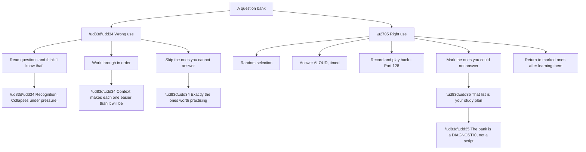
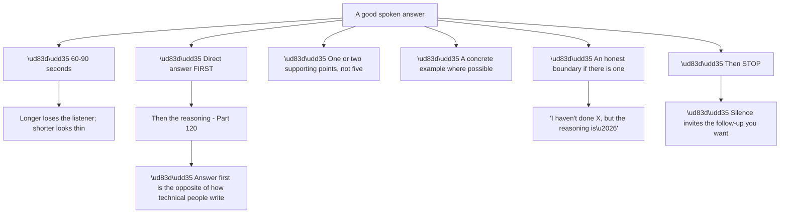
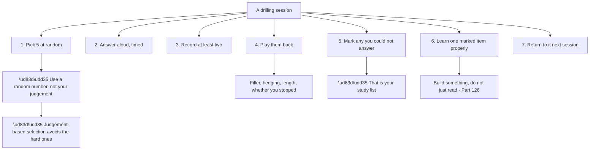
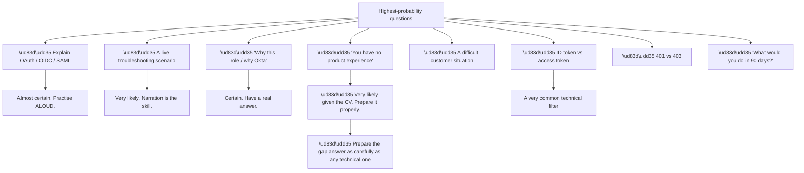
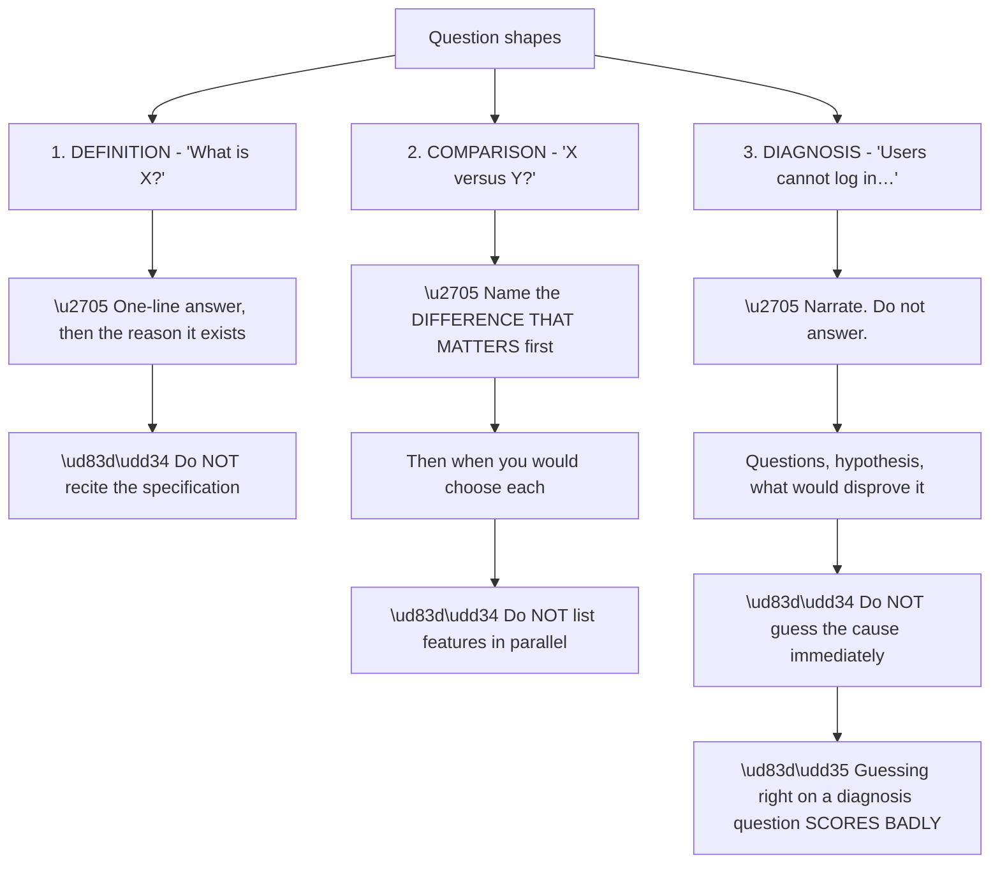

# Part 129 - Interview Question Bank: 250+ Questions

> Section goal: Provide the consolidated question bank for randomised drilling — organised by topic, sized for spoken answers, and covering everything from foundations to behaviour.

Covers index item **129**. Maps to JD signals: *interview readiness*, *self-assessment*, *troubleshooting complex technical issues*, *authentication and authorization*, *customer-facing communication*.

---

## 1. Start From Zero: How to Use This Bank

A question bank is only useful if it is used in a way that produces recall rather than recognition (Part 126).

**Node R is the framing.** **The bank's value is identifying what you cannot answer**, not supplying answers to memorise. **Memorised answers are detectable and they fail on the follow-up question.**

**Node W2a is worth respecting.** Reading section 4 immediately after section 3 **makes section 4 artificially easy**, because the context is loaded. **Random selection removes that** and is closer to the real condition.

**A workable routine** (Part 128): **five random questions, answered aloud and timed, three times a week**, with the failures marked and returned to.

| Practice | Produces |
|---|---|
| Reading silently | Recognition |
| **Answering aloud** | **Recall** |
| **Recording and playback** | **Awareness of delivery** |
| Random order | Realistic difficulty |
| Marking failures | A study plan |

> 💡 **Tie-in to your background:** the model answers throughout this guide are written in your voice, grounded in your actual experience. **They are a starting point to adapt, not a script to memorise** — and adapting them aloud is what makes them yours.

### 🔍 Plain-English deep-dive: what a good spoken answer looks like

Written and spoken answers differ, **and most preparation produces written answers delivered badly.**

**Node R is the structural correction most people need.** The instinct is to build up to a conclusion; **spoken answers must state the conclusion first** and support it afterwards, because a listener who has not heard the answer by twenty seconds has stopped tracking.

**Node A3 is where good answers become bad ones.** **Five supporting points is a lecture**; two is an answer. **The rest can come out in the follow-up**, which is a better conversation anyway.

**Node A6a is under-used** (Part 128). **Stopping cleanly invites a follow-up**, and a follow-up is an opportunity — it means the interviewer is engaged with what you said.

| Length | Reads as |
|---|---|
| Under 30 seconds | Thin, or unconfident |
| **60–90 seconds** | ✅ **Considered** |
| Over 2 minutes | Rambling; listener lost |
| Over 3 minutes | ❌ A monologue |

**A test worth applying:** **read a model answer from this guide aloud and time it.** Most are 60–90 seconds. **If yours are consistently longer, you are adding rather than answering.**

**Analogy:** answering a question in a meeting versus writing a report. The report builds an argument; the meeting answer states the position and defends it if challenged. **Where it stops:** a report can be re-read. A spoken answer gets one pass, which is why the conclusion has to come first.

---

## 2. Foundations: Web, HTTP, and Browser (Groups B–C)

1. What happens, end to end, when you type a URL and press enter?
2. What is the difference between a 401 and a 403?
3. Explain what CORS is and what problem it solves.
4. Why does a browser send a preflight request, and when?
5. What are the `Secure`, `HttpOnly`, and `SameSite` cookie attributes for?
6. What does `SameSite=Lax` break, and why does it matter for SAML?
7. Why are third-party cookies being restricted, and what breaks as a result?
8. What is the same-origin policy, and what does it actually prevent?
9. Explain the difference between authentication and authorisation to a non-technical person.
10. What is a redirect chain, and how would you read one in a HAR?
11. What is in a HAR file, and why must it be redacted?
12. How would you capture a HAR of a login flow so it is actually usable?
13. What is TLS doing, in plain terms?
14. What is a certificate chain, and what breaks when an intermediate is missing?
15. How does DNS resolution work, and what is a CNAME?
16. What is a CAA record and why might it block a certificate?
17. What is cross-site scripting, and why does it matter for authentication?
18. Why should a login form not be embedded in an application?
19. What is local storage versus session storage versus a cookie, for token storage?
20. What does `Cache-Control: no-store` mean and where does it matter in auth?

---

## 3. Cryptography, Certificates, and Tokens (Group D)

21. What is the difference between symmetric and asymmetric cryptography?
22. What does a digital signature prove, and what does it not?
23. What is hashing, and why is it not encryption?
24. Why are passwords salted?
25. What is a JWT made of?
26. What is the difference between signing and encrypting a token?
27. What is `RS256` versus `HS256`, and which would you recommend for an API?
28. What is a JWKS endpoint and what is the `kid` header for?
29. What happens when an issuer rotates its signing key?
30. How would you validate a JWT properly?
31. What does the `aud` claim mean and why does it matter?
32. What is the difference between decoding and verifying a token?
33. Why should a token never be pasted into a web-based decoder?
34. What is a bearer token, and what is its fundamental weakness?
35. What is DPoP and what problem does it address?
36. Why does a certificate expire, and what happens when it does?
37. What is the difference between a certificate and a key pair?
38. How would you check when a certificate expires?
39. What is a self-signed certificate and when is it acceptable?
40. What is mutual TLS and when is it used?

---

## 4. OAuth 2.0 (Group F)

41. What problem does OAuth 2.0 solve?
42. Name the four OAuth roles and what each does.
43. Walk me through the authorization code flow.
44. What is PKCE and what attack does it prevent?
45. Why is the implicit flow no longer recommended?
46. What is the `state` parameter for?
47. What is the difference between a public and a confidential client?
48. When would you use the client credentials grant?
49. Why is the resource owner password credentials grant discouraged?
50. What is a refresh token and how should it be stored?
51. What is refresh token rotation and reuse detection?
52. What is the difference between a scope and a permission?
53. What does the `audience` parameter do?
54. What happens if you do not request an audience?
55. Why must redirect URIs match exactly?
56. What is an open redirect and why does it matter here?
57. What is the device authorization grant and when is it used?
58. What is token introspection and what is its cost?
59. What is token exchange used for?
60. What are the four causes of `invalid_grant` at the token endpoint?

---

## 5. OpenID Connect (Group G)

61. What does OIDC add to OAuth 2.0?
62. What is the difference between an ID token and an access token?
63. What should you never do with an ID token?
64. What is the `nonce` parameter for?
65. What is in the OIDC discovery document, and why is it useful?
66. What are the standard OIDC scopes and what do they return?
67. What does the `sub` claim mean, and is it globally unique?
68. What is `acr` and `amr`, and what would you use them for?
69. What is the `prompt` parameter and what does `prompt=login` do?
70. What is `max_age` and when would you use it?
71. What is the userinfo endpoint for, and when do you not need it?
72. What is front-channel versus back-channel logout?
73. Why is single logout unreliable in practice?
74. What are the steps to validate an ID token?
75. What is a pairwise subject identifier and why does it exist?
76. What does `email_verified` actually assert?
77. How does OIDC session management work?
78. What is hybrid flow and why is it rarely needed now?
79. How would you debug an OIDC login that returns to the app with an error?
80. What is the difference between the authorization endpoint and the token endpoint?

---

## 6. SAML and WS-Federation (Group H)

81. What is SAML and how does it differ from OIDC?
82. Walk me through SP-initiated SSO.
83. What is IdP-initiated SSO and what are its risks?
84. What is `RelayState` and what breaks without it?
85. What is the difference between the audience and the ACS URL?
86. What is a NameID, and what formats exist?
87. What happens if the NameID format is transient?
88. Why should NameID not be an email address?
89. What is signed in a SAML response, and what should be?
90. How would you decode and read a SAML assertion?
91. What does the `Conditions` element control?
92. What is `InResponseTo` and what does its absence mean?
93. What is federation metadata and why does it matter?
94. What breaks when an IdP rotates its signing certificate?
95. Why does a manually configured certificate cause a recurring outage?
96. How do SAML attribute names differ between providers?
97. What is WS-Federation and where is it still found?
98. How does a SAML response arrive at the service provider?
99. Why can `SameSite` break a SAML login?
100. What would you need from both sides to set up a SAML connection?

---

## 7. Directories, AD, and Entra ID (Group I)

101. What is a directory service and how does it differ from a database?
102. Read a distinguished name aloud and explain each component.
103. Why should a DN not be used as a user identifier?
104. What is the difference between `member` and `memberOf`?
105. Why can a user be in a group and still be denied access?
106. What is token bloat and who does it affect first?
107. What are the first two things you check on an AD authentication failure?
108. Explain the three Kerberos exchanges.
109. What is an SPN and what happens when one is missing or duplicated?
110. Why might a service silently fall back from Kerberos to NTLM?
111. What is the difference between a domain and a forest, and which is the security boundary?
112. Explain Group Policy precedence.
113. How is Microsoft Entra ID different from Active Directory?
114. What is the difference between an app registration and a service principal?
115. Why does a `/common` endpoint carry risk?
116. What is group overage and how do you recognise it?
117. What are the three hybrid authentication methods, and where is the password checked in each?
118. What happens to a filtered object in directory synchronisation?
119. What is SCIM and what problem does it solve that federation does not?
120. What is provisioning quarantine and why is it dangerous?

---

## 8. LDAP Specifically (Group I)

121. What are the four parameters of an LDAP search?
122. Why does an LDAP search return empty rather than access denied?
123. What is the difference between `noSuchObject` and a zero-result success?
124. What is the difference between LDAPS and StartTLS?
125. What happens when a search exceeds the size limit?
126. What is LDAP injection and how is it prevented?
127. What are the three bind types?
128. What is the danger of a bind with a DN and an empty password?
129. How would you diagnose "it works in my LDAP browser but not from the app"?
130. What are the signatures of a service account failure versus a permissions failure?

---

## 9. Okta and Auth0 Platform (Group J)

131. What is the difference between the Okta Platform and the Auth0 Platform?
132. Why are workforce and customer identity different products?
133. What is a tenant, and what about it is immutable?
134. Why does a custom domain matter beyond branding?
135. How do Applications, APIs, and Connections map to OAuth roles?
136. Why does application type matter?
137. What are the four connection types?
138. What are development keys and why must they not be used in production?
139. What is import mode and what problem does it solve?
140. What security capability is lost with a custom database connection?
141. What is Universal Login and why is it hosted centrally?
142. How does single sign-on actually work between two applications?
143. What is an Action and when does Post Login run?
144. What assumptions do developers wrongly make when writing Actions?
145. Why must custom claims be namespaced?
146. What are Organizations and why do B2B products need them?
147. What is the most serious bug class in B2B identity?
148. What is the difference between `app_metadata` and `user_metadata`?
149. What is the rule for account linking?
150. What is the difference between the Management API and the Authentication API?
151. Where must a Management API token never appear?
152. What is in a tenant log entry, and which field matters most?
153. How do you read an event code without looking it up?
154. What does the absence of a log entry tell you?
155. What are the four attacks a consumer login faces?
156. Why does per-account lockout not stop password spraying?
157. What is adaptive MFA versus step-up authentication?
158. When do roles stop being sufficient for authorization?
159. What questions would you ask before granting an AI agent access?
160. What makes an integration production-ready rather than merely working?

---

## 10. Troubleshooting Method (Group K)

161. How do you approach a problem you have never seen?
162. What are the five narrowing questions?
163. Why is "where does it fail" so useful?
164. What does a failure at the API prove?
165. What are the free checks, and why do them before replying?
166. What makes a good hypothesis?
167. How do you know when you are on the wrong track?
168. What does a partial recovery after a fix mean?
169. Name the seven recurring failure patterns.
170. What does a clean failure fraction tell you?
171. What are the five evidence artefacts and what does each answer?
172. Why is a working comparison case so valuable?
173. How do you ask for a HAR so it arrives usable?
174. Why should you ask for decoded claims rather than a token?
175. What makes a timeline useful rather than a log extract?
176. What is the difference between a fix and a root cause?
177. Which RCA technique fits which shape of incident?
178. What are the seven sections of an RCA write-up?
179. How do you write about a cause on the customer's side?
180. What makes a prevention recommendation actually get implemented?
181. When do you reproduce a problem, and when do you not?
182. How do you reproduce something involving sensitive data?
183. What does it mean if you cannot reproduce it?
184. When do you escalate to engineering?
185. What goes into an escalation packet?
186. Why does listing what you eliminated matter?
187. How do you handle a severity disagreement?
188. What are the six stages of a login, and how do they fail?
189. How do you distinguish the four causes of `invalid_grant`?
190. What is the first thing you do when a token-related failure is reported?

---

## 11. Support Operations and Communication (Group L)

191. How do you decide what to work on with ten open tickets?
192. How do you handle deprioritising a customer?
193. What is the cost of context-switching and how do you manage it?
194. What goes into a handover?
195. When do you stop working a ticket?
196. What is the riskiest state a ticket can be in?
197. How do you adjust your writing for different audiences?
198. What do developers specifically want from a support reply?
199. What is the one sentence executives always want in an incident update?
200. How do you explain something complex without dumbing it down?
201. What drives customer anger, and what actually helps?
202. How do you deliver bad news?
203. How do you say no?
204. How do you communicate during an incident with no answers yet?
205. You got the diagnosis wrong. What do you say?
206. When is a question worth writing up as an article?
207. What makes a knowledge base article findable?
208. An article gets views and tickets continue. What does that mean?
209. What support metrics matter, and why?
210. How do you spot a metric being gamed?
211. What are the limitations of CSAT?
212. What does support measurement miss entirely?
213. What does support see that other functions do not?
214. What makes product feedback get acted on?
215. How would you argue for fixing a silent failure?
216. Where do you draw the line on AI assistance?
217. What must never be put into an AI tool?
218. A customer says an AI assistant told them to disable verification. What do you do?
219. How do you avoid becoming dependent on AI tooling?
220. How do you contribute to a team beyond your own queue?

---

## 12. Scenario and Judgement Questions

221. Users can't log in. Started this morning. What do you do?
222. About half the users fail and it seems random. What is your hypothesis?
223. Login succeeds but the profile is empty. Narrow it.
224. An entire office cannot log in. What do you suspect?
225. Only new starters are affected, for three weeks. What is it?
226. Authorization fails only for managers. What is it?
227. Users are logged out every hour on Safari but not Chrome. Explain.
228. The user count is growing far faster than headcount. Why?
229. A customer's API returns 401 for everyone with no deployment. What happened?
230. A user insists their password is correct and cannot log in. Walk me through it.
231. A customer wants to disable certificate validation. How do you respond?
232. A customer's architecture team wants to consolidate on a competitor. What do you say?
233. A customer asks a compliance question. What do you do?
234. A developer has a Management API secret in their front-end code. How do you handle it?
235. A customer reports seeing another organisation's data. What is your first move?
236. A customer says SSO works between two apps but not a third. First check?
237. A customer's provisioning stopped weeks ago and nobody noticed. Explain.
238. Login works but the second hop to a database fails. What is happening?
239. A customer says the same person has two accounts. Explain and advise.
240. A customer asks whether they should self-host instead. What do you say?

---

## 13. Behavioural and Motivation

241. Tell me about a time you handled a difficult customer situation.
242. Tell me about a time you were wrong about something technical.
243. Tell me about a complex problem you diagnosed.
244. Tell me about a time you had to say no to a customer.
245. Tell me about something you did that nobody asked you to do.
246. Tell me about a time you disagreed with a colleague or an engineer.
247. Tell me about a time you had to learn something quickly.
248. Tell me about a time you improved a process.
249. Tell me about a time you worked under significant pressure.
250. Tell me about a time you had to explain something technical to a non-technical audience.
251. Why this role?
252. Why customer identity specifically?
253. What do you know about Okta?
254. Which of Okta's values resonates most, and why?
255. What would your first ninety days look like?
256. What are you not good at?
257. You have no experience with our product. Why should we hire you?
258. Where do you want to be in three years?
259. What kind of environment do you do your best work in?
260. What questions do you have for us?

---

## 14. How to Drill This Bank

**Node D1a is the discipline that makes this work.** **Choosing questions yourself systematically avoids the ones you cannot answer** — which are the only ones worth practising. **Use a random number generator.**

**Node D5a is the output that matters.** **The marked list is the study plan**, and it shrinks measurably, which is motivating in a way that reading does not provide.

**A four-week schedule:**

| Week | Focus |
|---|---|
| 1 | Random across the whole bank; build the marked list |
| 2 | Half random, half from the marked list |
| 3 | Scenario questions (§12) and behavioural (§13) |
| 4 | Full mocks: five random plus one live scenario, timed |

**Sections 12 and 13 deserve dedicated time** because they are answered differently — scenarios need narration (Part 128) and behavioural questions need prepared STAR structures (Part 130).

### 🔍 Plain-English deep-dive: the questions most likely to be asked

Not all 260 are equally likely. **A smaller set covers most realistic interviews**, and knowing which is worth the prioritisation.

**Node P4a is the priority.** **Given no Okta or Auth0 production experience, that question is close to certain** — and it is the one where an unprepared answer costs most (Part 126).

**It deserves the same rehearsal as any technical question**, and it should be delivered as a statement rather than an apology.

| Priority | Questions |
|---|---|
| **Highest** | Explain a protocol aloud; the no-experience question; why this role |
| **High** | A live scenario; ID vs access token; 401 vs 403; a difficult customer |
| Medium | Specific protocol mechanics; product object model |
| Lower | Deep specification detail; landscape comparisons |

**Node P1a is worth stressing.** **"Explain OAuth" is almost certain and is harder than it sounds** — accurate and accessible at once, in ninety seconds, without jargon or condescension (Part 120). **It must be practised aloud on a real person.**

**Node P2a is where the method pays.** **A live scenario rewards narration over knowledge** (Part 128), so a candidate with less product knowledge and better narration can outperform one with the reverse.

**And there is a category worth preparing that people neglect:** **your own questions** (§13, Q260). **Having three good ones ready** — about recognition, about protected time, about how support feedback reaches product — **demonstrates values and gathers real information** (Part 126).

**Analogy:** an exam where past papers reveal that a handful of topics appear every year. Covering everything is prudent; **knowing which four will definitely appear changes how you allocate the last week.** **Where it stops:** an interview can ask anything, so the coverage still matters — the prioritisation is about the final preparation, not the whole of it.

### 🔍 Plain-English deep-dive: the three shapes of technical question

Almost every technical question in this bank is one of three shapes, **and each is answered differently.** Recognising the shape in the first two seconds is worth more than knowing more facts.

**Node R is counter-intuitive and important.** On a diagnosis question, **arriving at the right cause by guessing demonstrates nothing** — the interviewer is assessing the method (Part 128). **Narrating a path that does not reach the answer scores better than a lucky guess that does.**

| Shape | Opening move | Failure mode |
|---|---|---|
| **Definition** | The one-line answer, then why it exists | ❌ Reciting the specification |
| **Comparison** | The difference that matters | ❌ Parallel feature lists |
| **Diagnosis** | Narrate the narrowing | ❌ Guessing the cause |

**Node S1b is worth naming.** *"What is PKCE?"* answered as *"Proof Key for Code Exchange, defined in RFC 7636, which adds a code_challenge parameter…"* **is accurate and unhelpful.** *"It stops a stolen authorization code from being usable by anyone except the app that started the flow"* **is the answer**; the mechanism follows if asked.

**Node S2a is where comparisons go wrong.** *"SAML versus OIDC"* answered as two feature lists **makes the listener do the comparison.** *"They solve the same problem; SAML is XML and browser-POST based and dominates enterprise workforce federation, OIDC is JSON and token based and is what you would choose for anything new, especially mobile and SPA"* **has done the work for them.**

**A practical drill:** **take ten questions from this bank and classify them before answering.** The classification takes a second and changes the opening sentence, which is the part that determines whether the rest lands.

**Analogy:** a doctor distinguishing "what is this condition", "which of these two treatments", and "what is wrong with this patient". The third is not answered by knowing more — it is answered by examining in the right order. **Where it stops:** a doctor can order tests. In an interview the narration *is* the examination, which is why saying what you would check matters as much as knowing what it would show.

---

## 15. Failure Modes

| # | Failure mode | Symptom | Fix |
|---|---|---|---|
| 1 | Reading silently | Recognition, not recall | Answer aloud |
| 2 | Sequential working | Artificially easy | Random selection |
| 3 | Skipping unknowns | The valuable ones missed | Mark and return |
| 4 | Self-selecting questions | Avoids the hard ones | Random number |
| 5 | Never recording | Delivery flaws invisible | Record and play back |
| 6 | Memorising answers | Fails on the follow-up | Learn the reasoning |
| 7 | Answers running long | Listener lost | Time to 60–90 seconds |
| 8 | Building to the conclusion | Answer arrives too late | Conclusion first |
| 9 | Five supporting points | A lecture | Two, then stop |
| 10 | Not stopping | Dilutes a good answer | Stop; invite the follow-up |
| 11 | No prepared gap answer | Worst possible moment to improvise | Rehearse it properly |
| 12 | Neglecting behavioural | Answered badly under pressure | Dedicated week |
| 13 | No questions of your own | Missed signal | Prepare three |
| 14 | Practising only technical | Scenario and behavioural weak | Sections 12 and 13 |

---

## 16. Lab: Four-Week Drill Programme

**Purpose.** Convert the bank into rehearsed capability on a schedule.

**Prerequisites.**
- Parts 001–128 completed
- A recording device and a random number source

**Steps.**

1. **Week 1, three sessions:** five random questions each, answered aloud and timed. **Record all fifteen.**
2. **Play back five.** Note filler, hedging, length, and whether you stopped cleanly.
3. **Build your marked list** from anything you could not answer well.
4. **Count it.** That number is your current gap.
5. **Week 2:** two random plus three from the marked list, three sessions.
6. **Learn one marked item properly each session** — build something, do not just read.
7. **Week 3:** ten scenario questions from §12, narrated end to end.
8. **And five behavioural** from §13, using STAR (Part 130).
9. **Have someone read a scenario to you** as a customer, and narrate live.
10. **Week 4:** two full mocks — five random questions plus one live scenario, thirty minutes each.
11. **Prepare the four highest-probability answers** to a rehearsed standard: protocol explanation, the no-experience question, why this role, and ninety days.
12. **Prepare three questions of your own** and check each gathers real information.
13. **Re-count the marked list.** Compare to week one.

**Expected evidence.**
- Recordings across four weeks
- A marked list with a start and end count
- Five items learned by building
- Ten narrated scenarios
- Five STAR answers
- Two full timed mocks
- Four rehearsed high-probability answers
- Three prepared questions

**Validation rubric.**

| Criterion | Pass |
|---|---|
| Aloud and timed | Every session |
| Random selection | Not self-chosen |
| Marked list | Built, worked, and shrinking |
| Learning by building | Not by reading |
| Length | 60–90 seconds typical |
| Stopping | Clean, without drift |
| High-probability set | Rehearsed to a standard |
| Own questions | Three, each gathering real information |

**Cleanup and privacy.** **Behavioural answers must be method-and-shape only** — no customer names, no case detail, no employer specifics beyond your own role (Part 112). **Delete recordings** when finished.

---

## 17. JD Mapping

| JD signal | How this Part addresses it |
|---|---|
| Interview readiness | The consolidated bank and a drilling programme |
| Self-assessment | The marked list as a measured gap |
| Troubleshooting complex technical issues | Scenario questions requiring narration |
| Authentication and authorization | Comprehensive protocol coverage |
| Customer-facing communication | Spoken answer structure |

---

## 18. Candidate Honesty Note

- **Production experience:** answering technical questions under pressure and explaining findings to varied audiences.
- **Lab experience:** structured drilling with recording, random selection, and a measured marked list, as above.
- **Learned architecture:** which questions are highest probability and why the gap answer needs the most rehearsal.
- **No direct experience:** interviews for this specific role or company.
- **How to say it:** *"I prepared by drilling aloud rather than reading, with random selection so I couldn't avoid the hard ones, and I kept a list of what I couldn't answer — that list was the study plan and it shrank measurably. The answer I rehearsed most carefully was the one about not having production experience with the product, because that is the question where an unprepared answer costs most."*

---

## 19. Official Source Anchors

| Source | Why | Accessed |
|---|---|---|
| This guide, Parts 001–128 | Every question is answerable from the guide | — |
| Okta Developer Forum — `devforum.okta.com` | Realistic scenario material | Accessed **26 August 2026** |
| Auth0 Docs | Verification for product-specific answers | Accessed **26 August 2026** |
| Relevant RFCs and specifications | Verification for protocol answers | Accessed **26 August 2026** |

> **Revalidate:** product-specific answers change. **Re-verify anything product-specific the week before interview**; protocol and method answers are stable.

---

## ⭐ Likely Interview Questions for This Section

### Q1. "How did you prepare for this interview?"

> *Model answer:* Structurally rather than by reading. I built a question bank from my own study and drilled it aloud with random selection, because working through in order makes each question artificially easy and choosing them myself would have avoided the ones I could not answer. I recorded sessions and played them back, which is uncomfortable and where the improvement is — you hear the hedging and the answers that ran to three minutes. I kept a list of what I could not answer, which became the study plan, and I closed those gaps by building rather than reading, because reading produces recognition and building produces recall. And I gave dedicated time to scenario and behavioural questions, since those are answered differently from technical ones.

### Q2. "Which questions did you find hardest?"

> *Model answer:* Two kinds. Architecture judgement — "should they use X or Y" — because a good answer needs a named trade-off rather than just a recommendation, and without production experience I had to reason to the trade-off rather than recall it. And explaining a protocol to a non-technical listener, which sounds easy and is genuinely hard: accurate and accessible at once, in ninety seconds, without jargon or condescension. I practised that one on a real person and asked them to explain it back, which is the fastest way to find out whether you actually understand something. The moment I reached for jargon was the moment I found the gap.

### Q3. "What's the difference between recognising an answer and knowing it?"

> *Model answer:* Recognition collapses under a follow-up. Reading a question and thinking "I know that" is a feeling, not a capability — it does not survive being asked slightly differently, or being asked to explain why. Knowing it means being able to construct the answer aloud, without the surrounding context that made it easy, and to explain the reasoning behind it. That is why I drilled aloud with random selection rather than reading, and why I closed gaps by building something rather than by re-reading the explanation. It is also why memorised answers are risky: they are detectable and they fail on the second question.

### Q4. "How do you keep an answer to a useful length?"

> *Model answer:* Conclusion first, then one or two supporting points, then stop — which is the opposite of how technical people naturally write, where you build to a conclusion. Spoken answers have to state the position by about twenty seconds or the listener stops tracking. Sixty to ninety seconds is the target; over two minutes reads as rambling. The part I had to practise was stopping, because finishing and going quiet feels abrupt from the inside and reads as confident from the outside, whereas continuing to add qualifications dilutes an answer that was already good. And a clean stop invites the follow-up, which is a better conversation anyway.

### Q5. "Which question did you rehearse most carefully?"

> *Model answer:* The one about not having production experience with the product, because it is close to certain given my background and it is the worst possible moment to improvise. I wanted to be able to state it as a fact rather than an apology — I have not used Okta or Auth0 in production — and then say what I did about it and what I bring instead. Five years of enterprise escalation work, the technical substrate of directories, networking, TLS and HTTP that identity sits on, and the product knowledge I built deliberately through labs and the developer forum. And to be clear about the one thing preparation genuinely cannot substitute for, which is architecture judgement.

### Q6. "How would you use a question bank badly?"

> *Model answer:* By reading it silently and feeling prepared, by working through in order so the context makes each question easier than it will be, by skipping the ones I could not answer, and by memorising answers rather than the reasoning behind them. All four feel productive and none of them produces recall. The specific one I had to guard against was self-selection — choosing which questions to practise systematically avoids the hard ones, so I used a random number rather than my own judgement. And the marked list of failures was the most useful artefact, because it was a measurable gap that shrank rather than a general feeling of readiness.

### Q7. "What do you do if you get a question you have not prepared?"

> *Model answer:* Use the structure rather than reaching for something adjacent. Say plainly what I do not know, say what I do know that is nearby, reason toward an answer from principles, and say specifically how I would confirm it. The reasoning is the valuable part, because it is the skill that actually transfers, and interviewers ask questions you cannot answer deliberately to see what you do. What I would not do is bluff, because it is transparent and because in developer support a confident wrong answer gets implemented — so the habit that is a bad interview signal is also a genuinely costly one on the job.

### Q8. "What questions do you have for us?"

> *Model answer:* Three that would tell me how to do the job well here. How does someone get recognised — whether writing things up and helping colleagues counts, or whether it is measured output, because that determines whether the deflection work is realistic rather than aspirational. What happens when someone declines a customer's request on security grounds, because the answer tells me whether "always secure" is operational or just wording. And how support findings reach product, since that is where the highest-leverage work goes and "honestly, that's something we're working on" would be a perfectly useful answer to hear.

---

## 🧠 30-Second Memory Hooks

- **The bank is a diagnostic, not a script.**
- **Random selection.** Self-chosen questions avoid the hard ones.
- **Aloud, timed, recorded, played back.**
- **The marked list is the study plan** — and it shrinks measurably.
- **Learn gaps by building, not reading.**
- **Conclusion first, two supporting points, then STOP.**
- **60–90 seconds.**
- **Memorised answers fail on the follow-up.**
- **Highest probability: explain a protocol · the no-experience question · why this role · a live scenario.**
- **Rehearse the gap answer as carefully as any technical one.**
- **State gaps; do not apologise for them.**
- **Sections 12 and 13 need dedicated time.**
- **Prepare three questions of your own.**

---

## ✅ Completion Checklist

- [ ] I drill aloud, timed, and recorded
- [ ] I select questions randomly
- [ ] I keep a marked list and work it
- [ ] I close gaps by building
- [ ] My answers state the conclusion first
- [ ] My answers run 60–90 seconds
- [ ] I stop cleanly rather than drifting
- [ ] I have rehearsed the four highest-probability answers
- [ ] The no-experience answer is a statement, not an apology
- [ ] I have narrated ten scenarios and prepared five STAR answers
- [ ] I have three questions of my own
- [ ] My marked list is measurably shorter than in week one

*Next suggested section:* **[Part 130 - Behavioral, STAR, Closing, and Interview Readiness](Part-130-behavioral-star-closing-and-interview-readiness.md)** — the final Part: behavioural structure, closing well, and the readiness check before the day.
