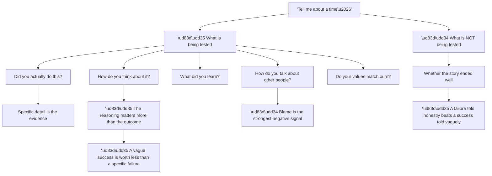
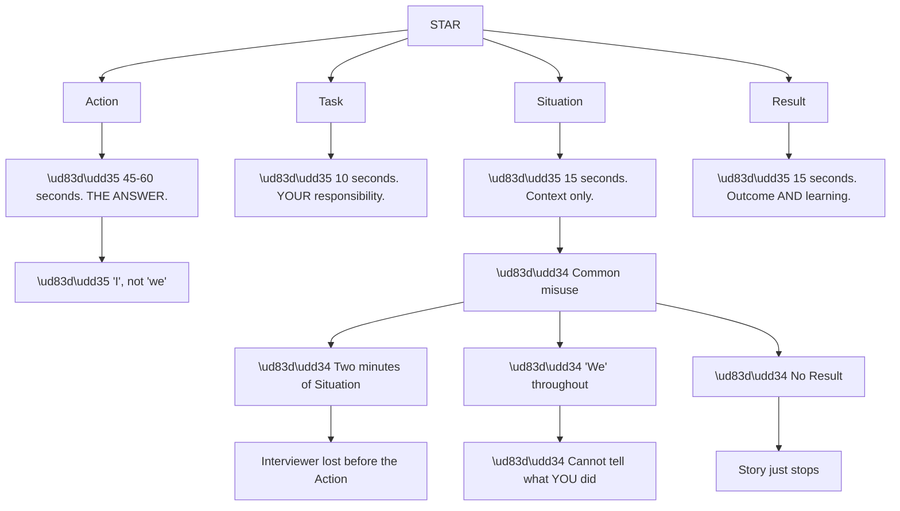
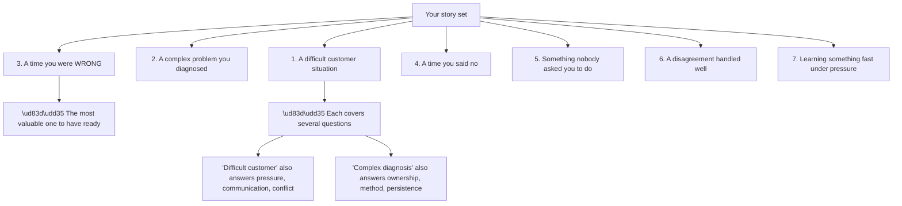
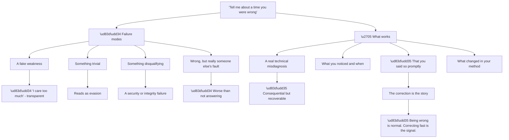
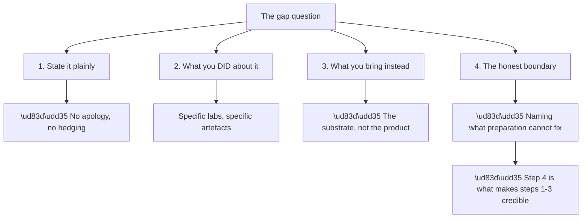
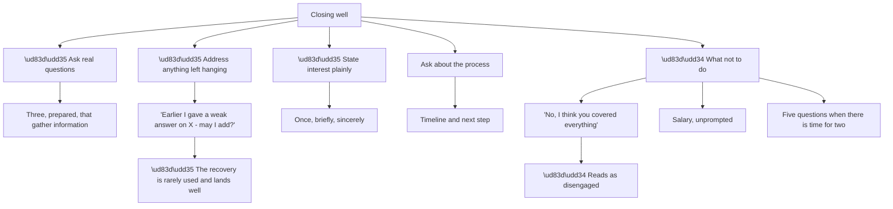
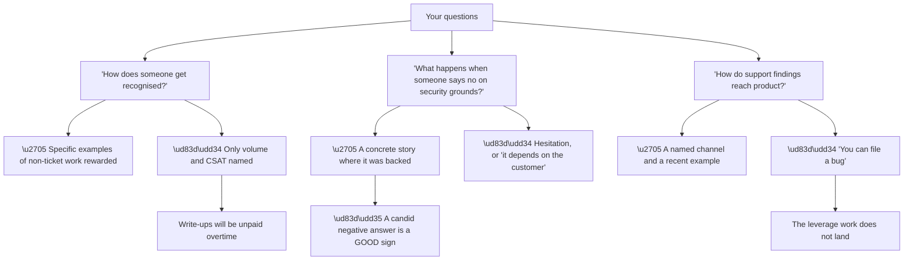
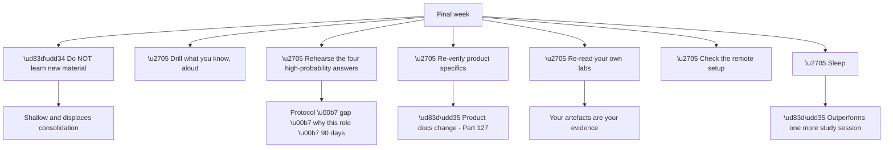
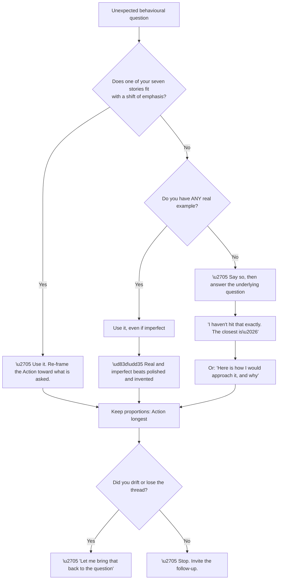

# Part 130 - Behavioral, STAR, Closing, and Interview Readiness

> Section goal: Close the guide with behavioural answer structure, prepared stories from a real career, how to close an interview well, and an honest readiness check for the day itself.

Covers index item **130**. Maps to JD signals: *customer-facing communication*, *collaboration*, *ownership*, *values alignment*, *interview readiness*.

---

## 1. Start From Zero: What Behavioural Questions Actually Test

"Tell me about a time when…" is not small talk before the technical questions. **It is a separate assessment with its own failure modes.**

**Node R is the point most candidates miss.** **A vague story about something that went well** — "I worked hard, we resolved it, the customer was happy" — **carries almost no information.** A specific story about something that went badly, told with what you learned, **demonstrates self-awareness, honesty, and judgement at once.**

**Node T4a is the fastest disqualifier.** **Blaming a colleague, a previous employer, or a customer** reads as someone who will do the same here. **The same story told with ownership** — what you could have done differently — reads as the opposite.

| Story type | Signal |
|---|---|
| Vague success | ❌ Almost none |
| Specific success with reasoning | ✅ Good |
| **Specific failure with learning** | ✅ **Often the strongest** |
| Failure blamed on others | ❌ Serious negative |
| Story where you were wrong and said so | ✅ **Strong** |

> 💡 **Tie-in to your background:** five years of enterprise escalation work, CRITSITs, and a CSAT record above 4.75 means **the stories exist**. **The preparation is selecting and structuring them**, not inventing them.

**And there is a redaction requirement** (Part 112). **Customer names, case identifiers, and internal specifics do not go into an interview answer.** *"A large enterprise customer"* and *"a business-critical service"* carry the shape without the detail, **and being visibly careful about it is itself a positive signal** for an identity company.

### 🔍 Plain-English deep-dive: why STAR works and where people misuse it

**STAR** — Situation, Task, Action, Result — is the standard structure, **and most people get the proportions wrong.**

**Node S3a is where the answer lives.** **The Action is what is being assessed**; Situation and Task are scaffolding. **Most candidates invert this**, spending two minutes on background and thirty seconds on what they actually did.

**Node M2a is the second most common problem.** **"We investigated, we found, we fixed"** leaves the interviewer unable to determine your contribution. **"The team was doing X; I took Y"** is both honest and informative — and it does not require claiming credit for others' work.

| Element | Target | Common actual |
|---|---|---|
| Situation | 15s | ❌ 60–120s |
| Task | 10s | ❌ Often skipped |
| **Action** | **45–60s** | ❌ 20–30s |
| Result | 15s | ❌ Often missing |

**Node S4a is worth expanding.** **A Result is not just the outcome** — it is the outcome plus what changed as a result. *"We resolved it in four hours, and I wrote up the detection gap because nobody had noticed for three weeks"* **is a much stronger close** than *"we resolved it."*

**The practical test:** **time a STAR answer.** If the Action is not the longest segment by a clear margin, the proportions are wrong.

**Analogy:** a news report that spends four minutes on background and twenty seconds on what happened. The background is not wrong; it is disproportionate, and the listener came for the event. **Where it stops:** a news report can assume the audience wants the background. An interviewer already knows they want the Action, which is why the scaffolding must be brief.

---

## 2. The Stories to Prepare

**Six or seven well-chosen stories cover almost every behavioural question**, because most questions are variations on a small set of themes.

**Node C3a deserves emphasis.** **"Tell me about a time you were wrong"** is asked frequently, is answered badly by most candidates, **and is the single best opportunity to demonstrate self-awareness.** A prepared, specific, non-defensive answer stands out precisely because so few people have one.

**Node X is the efficiency.** **The same story answers several questions** with a shift of emphasis — which is why seven prepared stories is sufficient and thirty is unnecessary.

| Story | Also answers |
|---|---|
| Difficult customer | Pressure · communication · conflict · patience |
| Complex diagnosis | Ownership · method · persistence · analysis |
| **Being wrong** | Self-awareness · honesty · learning · humility |
| Saying no | Judgement · integrity · influence |
| Unasked initiative | Ownership · "build and own it" |
| Disagreement | Collaboration · influence without authority |
| Fast learning | Adaptability · this exact role's ramp |

**Mapping to Okta's four values** (Part 002) is worth doing explicitly:

| Value | Story that demonstrates it |
|---|---|
| **Love our customers** | Difficult customer · saying no for the right reason |
| **Always secure. Always on.** | Saying no on security grounds · an incident handled |
| **Build and own it** | Unasked initiative · complex diagnosis |
| **Drive what's next** | Learning fast · improving a process |

> 💡 **Tie-in to your background:** **CRITSITs, business-critical escalations, and RCA ownership** supply stories for every row above. **The Technical Advisor programme and ODSP SME work** supply the "build and own it" and "drive what's next" stories directly.

### 🔍 Plain-English deep-dive: constructing the "I was wrong" story safely

This story is high value and easy to get wrong. **The failure modes are specific.**

**Node R is the frame.** **Everyone in a diagnostic role is wrong regularly** (Part 111). **The differentiator is the interval between being wrong and saying so** — and a story where that interval was short is genuinely impressive.

**Node G1a defines the right size.** **Consequential enough to be real** — it cost time, it sent someone down a wrong path — **and recoverable enough that the story has an ending.**

| Choice | Reads as |
|---|---|
| Fake weakness | ❌ Evasive; transparent |
| Trivial mistake | ❌ Not really answering |
| Security/integrity failure | ❌ Disqualifying |
| Blamed on someone else | ❌ Worst option |
| **Real misdiagnosis, corrected fast** | ✅ **Self-aware and honest** |

**The structure that works:**

> *"I was confident it was X. I was wrong — the evidence that should have told me was Y, and I had discounted it because it did not fit. When Z came back inconsistent with my theory, I said so on the call rather than trying to make the evidence fit. It cost about half a day. What changed afterwards is that I now state my hypothesis explicitly and name what would disprove it, because an unstated hypothesis is one nobody can challenge."*

**Node G3a is the part to make prominent.** **The correction — announced promptly, without defensiveness — is the story.** Being wrong is the setup.

**And it maps directly to the job.** In developer support, **a confident wrong answer gets implemented** (Part 121). **A candidate who visibly corrects fast is lower risk** than one who has never been wrong.

**Analogy:** a pilot who declares a mistake to air traffic control immediately rather than quietly attempting to correct it. The mistake is not the story; the declaration is. **Where it stops:** aviation has mandated reporting culture. In support the declaration is voluntary, which is exactly why doing it is a signal.

---

## 3. Why This Role, and the Gap Question

Two questions are close to certain (Part 129). **Both deserve rehearsal to a standard.**

**"Why this role?"** — the answer must be **specific and true.** Generic enthusiasm reads as generic.

> *"Because it is the intersection of what I already do and what I want to go deeper into. I have spent five years on enterprise escalations where the hardest problems were nearly always identity, networking, or the boundary between them — federation failures, token issues, directory and permission problems. What I want is to be in the product where that is the whole job rather than a recurring theme, and the developer-facing side specifically, because the person on the other end is building something and the conversation is about how it works rather than only about restoring service."*

**"You have no Okta or Auth0 experience"** — the answer must be **a statement, not an apology** (Part 126).

> *"That is accurate — I have not used either in production. What I did about it is build a free-tier tenant and work through the flows properly: authorization code with PKCE, a SAML connection, a SCIM provisioning run, Actions with custom claims, and reading the tenant logs until I could tell the failure shapes apart. What I bring is five years of business-critical escalation work and the substrate identity actually runs on — Active Directory, LDAP, Entra ID, TLS, DNS, HTTP, and HAR analysis — which is where a large share of identity failures actually live. And to be honest about the boundary: the thing labs cannot give me is architecture judgement, which needs real customer patterns over six to nine months."*

**Node R is the mechanism.** **Naming what you cannot yet do** — architecture judgement — **is what makes the rest of the claim believable.** A candidate who claims everything is closed is not credible; one who names the boundary precisely has demonstrated that the self-assessment is real.

| Step | Purpose |
|---|---|
| State it plainly | Removes the elephant |
| What you did | Evidence of initiative |
| What you bring | The transferable substrate |
| **The honest boundary** | ✅ **Makes it all credible** |

---

## 4. Closing the Interview

The last five minutes are **the part candidates prepare least and remember longest.**

**Node C2a is genuinely under-used.** **Coming back to a weak answer** — briefly, without labouring it — **demonstrates self-awareness and gives you a second attempt** at something the interviewer may otherwise have weighted heavily.

**Node N1a is the default answer and it is costly.** **"You covered everything"** ends the conversation on disengagement, whatever came before.

**Three questions worth having ready** (Part 129):

| Question | What it tells you |
|---|---|
| *"How does someone get recognised here — is writing things up and helping colleagues visible, or is it measured output?"* | Whether deflection work is real |
| *"What happens when someone declines a customer's request on security grounds?"* | Whether "always secure" is operational |
| *"How do support findings reach product?"* | Where the leverage is |

**All three are real questions with informative answers**, including unflattering ones — and *"honestly, that's something we're working on"* is a useful answer to receive.

**And the follow-up note:** short, within a day, referencing something specific from the conversation. **Not a second interview**, and **not a place to relitigate an answer.**

### 🔍 Plain-English deep-dive: an interview is two-directional, and the answers you receive are data

The closing questions are usually treated as a formality. **They are the only structured opportunity you get to assess them**, and the answers are informative in both directions.

**Node R is the calibration.** *"Honestly, that's something we're working on"* **is a better answer than a polished one**, because it tells you the person is being straight with you — which is itself information about the culture you would be joining.

| Answer you receive | What it suggests |
|---|---|
| Concrete examples | ✅ The thing is real |
| A recent, specific story | ✅ It happens routinely |
| **Candid acknowledgement of a gap** | ✅ **Honesty; often the best sign** |
| Generic principles only | ⚠️ Aspirational |
| Visible discomfort | 🔴 Worth weighing |

**Node B1a is a real risk to check for.** **If recognition is purely ticket volume and CSAT**, then the knowledge-base and deflection work described throughout this guide (Part 122) **is genuinely unrewarded**, and it is better to know that before accepting than six months in.

**Node B3a matters for the same reason.** **"You can file a bug"** means product feedback has no route with weight behind it — which is the difference between support that improves the product and support that absorbs its defects indefinitely (Part 124).

**And asking them signals something too.** **These are the questions of someone who intends to do the job well rather than merely get it**, which is why they work in both directions simultaneously.

**One caution:** **do not interrogate.** Three questions, asked conversationally, with genuine interest in the answers. **The moment it becomes a checklist, the dynamic changes** and the answers get worse.

**Analogy:** viewing a property and asking the neighbours about the area rather than only the agent. The agent's answers are still useful — how they answer tells you as much as what they say. **Where it stops:** you can revisit a property. An interview is one conversation, which is why three well-chosen questions beat ten scattered ones.

---

## 5. The Week Before

**Node W1a is the discipline.** **New material in the final week is learned shallowly and displaces consolidation** of material you nearly have. **The marked list from Part 129 should already be short**; the final week is for fluency, not coverage.

**Node W7a is not filler.** **Recall, working memory, and composure all degrade measurably without sleep**, and every one of them is being assessed.

**Night before:**

| Do | Do not |
|---|---|
| Re-read your memory hooks | Learn a new protocol |
| Re-read your seven stories | Rewrite your answers |
| Check the setup and route | Cram the question bank |
| Sleep | Stay up "one more section" |

---

## 6. Failure Modes

| # | Failure mode | Symptom | Fix |
|---|---|---|---|
| 1 | Vague success stories | No information conveyed | Specific detail |
| 2 | Situation runs two minutes | Interviewer lost | 15 seconds |
| 3 | "We" throughout | Contribution invisible | "I", honestly |
| 4 | No Result | Story just stops | Outcome plus learning |
| 5 | Blaming others | Serious negative signal | Ownership |
| 6 | Fake weakness | Transparent evasion | A real misdiagnosis |
| 7 | Customer detail leaked | Confidentiality failure | Shape, not specifics |
| 8 | No prepared stories | Improvised badly | Seven, mapped to values |
| 9 | Generic "why this role" | Reads as generic | Specific and true |
| 10 | Gap answer as apology | Weighted more heavily | A statement |
| 11 | Claiming no gaps | Not credible | Name the boundary |
| 12 | "You covered everything" | Disengaged close | Three real questions |
| 13 | Weak answer left hanging | Unrecovered | Come back to it |
| 14 | New material in final week | Shallow; displaces consolidation | Drill what you know |
| 15 | No sleep | Everything degrades | Sleep |

---

## 7. Troubleshooting Decision Tree: A Behavioural Question You Did Not Expect

### Worked example

**Question:** *"Tell me about a time you had to change someone's mind without any authority over them."*

**No prepared story matches exactly.** The closest is the disagreement story, **which was with a peer rather than an influence-without-authority situation.**

**Answer:** *"I haven't had a formal influence-without-authority situation, but the closest is a disagreement with an engineering contact about severity. They had it as low priority because the workaround existed; I thought it was higher because the failure was silent — provisioning had stopped and nobody had noticed for weeks. What I did was stop arguing severity and send the evidence: how long it had been failing, how many accounts were affected, and the fact that there was no alert. The number changed the conversation, not my opinion of it. What I took from that is that influence without authority is mostly about presenting evidence in a form the other person can act on, rather than about persuasion."*

**This answers the underlying question honestly** — the boundary is stated, the closest real example is used, and the generalisable principle is named. **Much stronger than stretching a story to fit.**

---

## 8. Lab: Build and Rehearse Your Story Set

**Purpose.** Produce seven prepared, redacted, value-mapped stories rehearsed to a spoken standard.

**Prerequisites.**
- Parts 001–129 completed
- A recording device and a timer

**Steps.**

1. **List candidate stories** from five years of escalation work — aim for twelve before selecting.
2. **Select seven** covering: difficult customer · complex diagnosis · being wrong · saying no · unasked initiative · disagreement · fast learning.
3. **Redact each one.** No customer names, case IDs, or internal specifics. Check twice.
4. **Write each as STAR** with the target proportions: 15s / 10s / 45–60s / 15s.
5. **Check every Action uses "I"** where you acted, and "the team" where they did.
6. **Check every Result has a learning**, not only an outcome.
7. **Map each story to one or more Okta values.** Any value with no story is a gap.
8. **Record all seven aloud, timed.**
9. **Play them back.** Time each segment separately.
10. **Fix any story where the Action is not the longest segment.**
11. **Rehearse the four high-probability answers**: protocol explanation, the gap question, why this role, ninety days.
12. **Write your three closing questions** and check each gathers real information.
13. **Have someone ask you three behavioural questions you have not seen**, and use the decision tree in section 7.

**Expected evidence.**
- Twelve candidates narrowed to seven
- Seven redacted STAR stories with timings
- A value-mapping table with no empty value
- Recordings, played back and timed by segment
- Four rehearsed high-probability answers
- Three closing questions
- Three unseen questions handled live

**Validation rubric.**

| Criterion | Pass |
|---|---|
| Seven stories | Covering all seven themes |
| Redaction | No names, IDs, or internal specifics |
| Proportions | Action is the longest segment |
| Attribution | "I" where you acted |
| Results | Outcome **and** learning |
| Value mapping | All four values covered |
| "Wrong" story | Real, consequential, corrected fast |
| Gap answer | A statement, with the boundary named |
| Closing questions | Three, each informative |

**Cleanup and privacy.** **Delete recordings and any working notes containing unredacted detail** (Part 112). **The redaction check is not optional** — and being visibly careful about it in the room is itself a positive signal.

---

## 9. JD Mapping

| JD signal | How this Part addresses it |
|---|---|
| Customer-facing communication | Story selection, structure, and spoken proportions |
| Collaboration | Disagreement and influence stories |
| Ownership | "Build and own it" stories; correcting fast |
| Values alignment | Explicit mapping to Okta's four values |
| Interview readiness | Closing, final week, and the readiness standard |

---

## 10. Candidate Honesty Note

- **Production experience:** enterprise escalations, CRITSITs, RCA ownership, and sustained CSAT above 4.75 — the stories are real and there are plenty of them.
- **Lab experience:** structuring, redacting, timing, and rehearsing them to a spoken standard, as above.
- **Learned architecture:** why proportions matter, why the correction is the story, and why naming the boundary is what makes the rest credible.
- **No direct experience:** Okta or Auth0 in production; developer-facing support as the whole role.
- **How to say it:** *"I have the stories — five years of escalation work supplies them. What I prepared was the structure: keeping the situation short, being specific about what I did rather than what the team did, and making sure every one ends with what changed rather than just how it resolved. And I made sure the story about being wrong was a real misdiagnosis, because that is the one that actually tells you something."*

---

## 11. Official Source Anchors

| Source | Why | Accessed |
|---|---|---|
| Okta — company values (`okta.com/company/`) | The four values to map stories against | Accessed **26 August 2026** |
| Okta Careers | Role framing and process expectations | Accessed **26 August 2026** |
| This guide, Parts 001–129 | Every technical answer referenced here | — |

> **Revalidate:** company values and careers content can be updated. **Re-check the values page and the role posting the week before interview.**

---

## ⭐ Likely Interview Questions for This Section

### Q1. "Tell me about a time you handled a difficult customer situation."

> *Model answer:* A business-critical escalation where a large enterprise customer had been through three engineers before it reached me and was, reasonably, out of patience. The technical problem mattered less than the fact that nobody had told them what was actually happening. What I did first was stop investigating and send a plain summary: what we knew, what we did not, what I was doing next, and when I would come back — and then I hit every one of those times, including the ones where I had nothing new. The anger dropped before the problem was solved, which taught me it was mostly about uncertainty rather than the fault. We found it was a certificate rotation on their side that had not propagated to one node. I wrote it up with a detection recommendation, because the real failure was that it had been silent.

### Q2. "Tell me about a time you were wrong about something technical."

> *Model answer:* I was confident a widespread authentication failure was a service-side problem because the timing matched a known change. I was wrong. The evidence that should have told me was that a subset of users were fine, and I discounted it because it did not fit — a service-side fault should not have been selective. When the next data point came back inconsistent with my theory, I said so on the call rather than trying to make it fit, and we found a client-side configuration difference. It cost about half a day. What changed permanently is that I now state my hypothesis explicitly and say what would disprove it, because an unstated hypothesis is one nobody can challenge — including me.

### Q3. "Tell me about a time you had to say no to a customer."

> *Model answer:* A customer under deadline pressure wanted to work around a validation failure by disabling a check. It would have worked, and it would have removed the thing that was protecting them. I said no, and the part that mattered was what came with it: why the check existed, what specifically it was catching for them, and a path that met their deadline — a temporary configuration on their side that was reversible and did not weaken verification. Saying no without an alternative is just an obstacle. The customer was not pleased in the moment and came back later when the underlying problem surfaced properly, which is the outcome that justified it.

### Q4. "Tell me about something you did that nobody asked you to do."

> *Model answer:* I noticed the same class of question arriving repeatedly and that each of us was answering it from scratch, so I wrote it up properly — the symptom in the words customers actually used, the check that distinguishes the two causes, and the fix for each. Ticket volume on that topic dropped, but the more useful outcome was that newer engineers stopped needing to ask. I have kept doing it since, and the discipline I learned is to title articles with the symptom rather than the cause, because a customer searches for what they are seeing, not for the thing they do not yet know is wrong.

### Q5. "Which of Okta's values resonates most with you?"

> *Model answer:* "Always secure. Always on." — because it names a tension rather than a preference, and support is where that tension actually gets resolved. Every time a customer under deadline pressure asks for a shortcut that weakens verification, someone has to hold that line while still helping them ship. I have done that, and it is harder than either extreme. "Build and own it" is the one I would point to for how I work — I have consistently found the write-up or the process fix more satisfying than closing the individual ticket, because it is the part that compounds.

### Q6. "How would you approach your first ninety days?"

> *Model answer:* First thirty, learn the shape of the failures rather than the whole product — read tenant logs until I can tell the failure classes apart, work through the flows in a lab, and take tickets where I can be genuinely useful while asking a lot. Second thirty, take fuller ownership, start writing up anything I had to work out from scratch, and begin building the pattern library that eventually becomes judgement. Third thirty, contribute back — deflection content, product feedback on anything that fails silently, and helping the next new person. What I would not claim is that I will be giving architecture guidance at ninety days; that is the piece that needs real customer patterns over six to nine months.

### Q7. "What are you not good at?"

> *Model answer:* Architecture guidance in this domain, specifically. I can reason to a recommendation from principles and I can name the trade-off, but the confidence that comes from having seen twenty customers make the same choice and knowing which ones regretted it — I do not have that yet in identity, and I do not think there is a shortcut. The other one, honestly, is that I have historically gone deeper on a problem than the situation warranted. The fix I use now is a time-box with an explicit checkpoint: if I have not narrowed it by then, I say so and bring someone in rather than continuing quietly.

### Q8. "What questions do you have for us?"

> *Model answer:* Three. How does someone get recognised here — whether writing things up and helping colleagues is visible, or whether it is measured on individual output, because that tells me whether the deflection work is realistic rather than aspirational. What actually happens when someone declines a customer request on security grounds — whether that is supported or quietly discouraged, because it tells me whether "always secure" is operational. And how support findings reach product, since that is where the highest-leverage work goes. "That's something we're working on" would be a perfectly useful answer to any of them.

---

## 🧠 30-Second Memory Hooks

- **A specific failure beats a vague success.**
- **Blame is the strongest negative signal.** Ownership is the fix.
- **STAR proportions: 15 / 10 / 45–60 / 15.** The Action is the answer.
- **"I" where you acted. "The team" where they did.**
- **Every Result needs a learning, not just an outcome.**
- **Seven stories cover almost everything.**
- **The "I was wrong" story: real, consequential, corrected fast.**
- **Being wrong is normal. The interval before saying so is the signal.**
- **Redact.** Shape, not names — and being visibly careful is itself a signal.
- **The gap answer is a statement, not an apology** — and naming the boundary makes it credible.
- **Never close with "you covered everything."** Three real questions.
- **Come back to a weak answer.** Rarely done, lands well.
- **Final week: drill, do not learn. Sleep.**

---

## ✅ Completion Checklist

- [ ] I have seven redacted stories covering all seven themes
- [ ] Each is STAR with the Action as the longest segment
- [ ] Each uses "I" honestly and ends with a learning
- [ ] All four Okta values are covered by at least one story
- [ ] My "I was wrong" story is a real, consequential misdiagnosis corrected fast
- [ ] My "why this role" answer is specific and true
- [ ] My gap answer is a statement and names the architecture boundary
- [ ] I have rehearsed the four highest-probability answers aloud and timed
- [ ] I have three closing questions that gather real information
- [ ] I have practised unseen questions using the decision tree
- [ ] My final-week plan is drilling, not new material
- [ ] I have checked the setup, the route, and the timing
- [ ] I am going to sleep

---

## 🏁 You Have Reached the End

**130 Parts.** From how a URL resolves to how to close an interview — the whole path from foundations through OAuth, OIDC, SAML, directories, the Okta and Auth0 platforms, troubleshooting method, and support practice.

**What actually carries into the room** is not the volume. It is the small number of things that recur:

- **The seven failure patterns** (Part 111): expiry · unstable identifier · size · silent absence · state across requests · cookie context · missing scope or context. **Most identity failures are one of these.**
- **"Where does it fail?"** narrows faster than any other question.
- **Explaining the reason, not just the fix** (Part 120) is what makes support scale.
- **Honest boundaries** are more persuasive than claimed completeness.

**And the honest position throughout:** five years of real escalation work, a strong technical substrate, deliberate lab-built product knowledge, and one named gap — architecture judgement — that takes six to nine months of real customer patterns and no amount of preparation can shortcut.

**That is a credible, defensible, and genuinely strong position.** Go and use it.

---

*Return to:* **[Okta Developer Support Engineer - Complete Study Guide](../Okta Developer Support Engineer - Complete Study Guide.md)** — the master index, learning paths, and the appendices.
