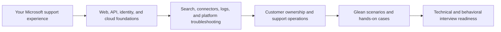

# Glean Support Engineering - Complete Interview Study Guide

> **Target role:** Customer-focused Support / Solutions Engineering at Glean
> **Built for:** Arti Thakur, Support Escalation Engineer with 5+ years in Microsoft 365, SharePoint Online, OneDrive, Copilot, enterprise escalations, customer communication, and support operations
> **Goal:** Never go blank in the interview. Understand each concept from first principles, troubleshoot aloud with structure, and connect answers to real Microsoft experience.
> **Mode:** Interview preparation with hands-on drills, technical scenarios, 100+ questions, STAR stories, and closing preparation

---

## How this guide will work

The guide is ordered from foundations to Glean-specific application. Every future Part will:

- Explain every term from zero knowledge using plain-English analogies.
- Include Mermaid diagrams, comparison tables, troubleshooting flows, and quick-reference notes.
- Connect new material to SharePoint Online, OneDrive, Copilot, Azure, CRITSIT, CSAT, and escalation experience.
- End with 5-8 likely interview questions, model answers, and 30-second memory hooks.
- Clearly distinguish existing professional experience from newly learned interview-ready familiarity.

---

## Recommended learning paths

| Path | Best for | Order |
|---|---|---|
| **Complete path** | Deep preparation with no major gaps | Parts 1-27 in order |
| **Four-day interview crunch** | Interview within 3-4 days | Follow the four-day schedule below |
| **Technical troubleshooting focus** | Technical or panel round | 3-14, 16, 19, 23-26 |
| **Customer and leadership focus** | Hiring manager or customer scenario round | 1-2, 5, 17-22, 24, 27 |
| **Hands-on practice** | Learn by doing | 8-10, 12-14, 19, 23-24 |

### Four-day interview-crunch schedule

| Day | Focus | Parts |
|---|---|---|
| **Day 1** | Glean, enterprise search, connectors, and structured troubleshooting | 1-5 |
| **Day 2** | Networking, HTTP, REST APIs, identity, logs, and browser traces | 6-10 |
| **Day 3** | Cloud, SQL, Linux, Kubernetes, tools, LLMs, and support operations | 11-18 |
| **Day 4** | Content-source verification, documentation, metrics, security, integrated cases, question bank, and STAR practice | 19-27, prioritizing 23-27 |

> **Interview-crunch rule:** Spend roughly 40% of study time reading, 30% doing the labs, and 30% answering aloud without notes.

---

## Your advantage and learning gaps

| Area | Starting position | Preparation strategy |
|---|---|---|
| Enterprise customer support | Strong: escalations, CRITSITs, case ownership, customer updates | Convert experience into concise Glean-relevant examples |
| Search and knowledge systems | Strong bridge: SharePoint, OneDrive, Delve, M365 content | Learn search architecture, indexing, relevance, and permission-aware retrieval vocabulary |
| Incident and stakeholder management | Strong: engineering, product, partners, vendors, business reviews | Practice designated-customer ownership and high-urgency communication scenarios |
| Documentation and enablement | Strong: KB articles, guides, training, mentoring | Adapt to customer-specific runbooks and Glean feature education |
| Metrics and improvement | Strong: CSAT, backlog health, case quality, trends | Add SLA/SLO, alert, health, adoption, and support-efficiency metrics |
| AI and LLMs | Strong foundation: AI-102, Copilot, Copilot Studio agents | Add transformer, embedding, vector search, grounding, RAG, hallucination, and evaluation concepts |
| REST APIs | Interview-readiness gap | Build a repeatable Postman/cURL and HTTP troubleshooting workflow |
| SSO, SAML, OAuth | Interview-readiness gap | Learn flows, tokens, common failures, traces, and customer-safe diagnostics |
| Browser/log/stack analysis | Partial transfer from escalation work | Practice HAR, DevTools, correlation IDs, log timelines, and stack-trace reading |
| Linux, Kubernetes, GitHub, Jira, Confluence | Fast-learnable familiarity | Focus only on support workflows and high-value commands, not administration depth |
| AWS and GCP | Azure is the strongest cloud | Learn service-category mapping and cloud-neutral troubleshooting language |

---

# Part Index

## Group A - Role, Product, Search, and Support Foundations

| # | Part | What you will learn | JD connection |
|---|---|---|---|
| 1 | [Role Map, Interview Strategy, and Your Microsoft-to-Glean Story](prep/Part-01-role-map-and-candidate-story.md) | Decode every responsibility and requirement; identify likely interview rounds; build a 60-second introduction; translate ODSP, Copilot, CRITSIT, SME, CSAT, mentoring, and product-feedback experience into Glean language; define honest boundaries around newly learned skills | Communication, technical curiosity, customer ownership, problem solving |
| 2 | [Glean Product, Customer Value, and Enterprise Support Journey](prep/Part-02-glean-product-and-customer-journey.md) | What Glean does; enterprise Work AI, search, assistant, agents, and knowledge discovery at a support-engineering level; users, admins, content sources, permissions, adoption, and customer value; how onboarding, configuration, support, and expansion connect | Educate customers, configure features, realize additional value, represent customer needs |
| 3 | [Enterprise Search and Knowledge Technology Fundamentals](prep/Part-03-enterprise-search-and-knowledge-fundamentals.md) | Documents, metadata, crawling, ingestion, parsing, normalization, indexing, inverted indexes, tokenization, ranking, relevance, freshness, faceting, semantic search, vector search, permission-aware search, zero-result queries, and relevance debugging | Required search/knowledge experience; troubleshoot user and system health |
| 4 | [SaaS Connectors, Content Sources, Sync, and Permissions](prep/Part-04-saas-connectors-content-sync-and-permissions.md) | Connector lifecycle from authorization to crawl, incremental sync, indexing, deletion, freshness, rate limits, webhooks, retries, schema mapping, ACL propagation, permission trimming, and common partial-ingestion failures; bridge from SharePoint/OneDrive | Configure and verify content sources; SaaS integrations; system and user health |
| 5 | [Scientific Troubleshooting, Triage, and Root-Cause Analysis](prep/Part-05-troubleshooting-triage-and-rca.md) | Symptom vs cause; scope, impact, timeline, reproduction, hypotheses, evidence, isolation, binary search, control tests, mitigation, root cause, corrective actions, and verification; how to narrate reasoning during an interview | First response, technical troubleshooting, resolution, follow-through, root-cause isolation |

## Group B - Core Technical Troubleshooting

| # | Part | What you will learn | JD connection |
|---|---|---|---|
| 6 | [Networking for Support Engineers: DNS, TCP, TLS, Proxies, and Firewalls](prep/Part-06-networking-dns-tcp-tls-proxies.md) | The request path from hostname to application; DNS resolution, TCP handshake, ports, TLS certificates, proxy/PAC behavior, VPN, NAT, load balancers, firewalls, timeouts, resets, latency, and a layer-by-layer isolation flow | Network troubleshooting; isolate customer integration failures |
| 7 | [HTTP, Web Applications, and Browser Developer Tools](prep/Part-07-http-web-and-browser-devtools.md) | URLs, methods, headers, cookies, sessions, caching, CORS, redirects, content types, status-code families, browser console, Network tab, request timing, storage, and safe evidence collection | Debug browser trace files and SaaS behavior |
| 8 | [REST API Troubleshooting with Postman and cURL](prep/Part-08-rest-api-troubleshooting-lab.md) | REST constraints, endpoints, methods, JSON, headers, parameters, pagination, idempotency, authentication, rate limiting, retries, API versions, error bodies, correlation IDs, and a hands-on 400/401/403/404/409/429/5xx troubleshooting lab | Must-have REST API troubleshooting experience |
| 9 | [Identity and Access: SSO, SAML, OAuth 2.0, OIDC, and SCIM](prep/Part-09-identity-sso-saml-oauth-oidc-scim.md) | Authentication vs authorization; identity provider vs service provider; SAML assertions; OAuth roles, grants, scopes, access/refresh tokens; OIDC ID tokens; JWT structure; redirect URI and clock-skew failures; SCIM provisioning; SAML and OAuth trace analysis | Working experience with SSO, SAML, OAuth; secure integrations |
| 10 | [Logs, Stack Traces, HAR Files, and Evidence Correlation](prep/Part-10-logs-stack-traces-har-and-correlation.md) | Log levels, timestamps, request/correlation IDs, distributed-service timelines, stack frames, exception chains, client vs server failures, HAR capture and sanitization, browser console evidence, redaction, and a repeatable evidence-to-hypothesis workflow | Search/read application logs; analyze stack traces and browser traces |
| 11 | [Cloud Support Across Azure, AWS, and GCP](prep/Part-11-cloud-support-azure-aws-gcp.md) | Cloud responsibility model; identity, compute, storage, networking, secrets, observability, regions, quotas, and service health; map strong Azure knowledge to AWS and GCP equivalents; troubleshoot without memorizing every product name | Experience with Azure, AWS, or GCP |
| 12 | [SQL and Database Troubleshooting for Support](prep/Part-12-sql-and-database-troubleshooting.md) | Tables, keys, joins, filtering, aggregation, nulls, timestamps, transactions, indexes, query plans, connection issues, locks, slow queries, data validation, and safe read-only diagnostic queries using a support-case dataset | SQL/database good-to-have; data-driven diagnosis |
| 13 | [Linux Command Line for Support Investigations](prep/Part-13-linux-command-line-for-support.md) | Files, paths, permissions, processes, services, environment variables, pipes, grep, curl, jq, tail, journalctl, ss, dig, openssl, resource checks, exit codes, and a compact command-driven incident lab | Intermediate/advanced Linux good-to-have |
| 14 | [Kubernetes Fundamentals for Support Engineers](prep/Part-14-kubernetes-fundamentals-for-support.md) | Clusters, nodes, namespaces, pods, deployments, services, ingress, ConfigMaps, Secrets, probes, events, logs, restarts, CrashLoopBackOff, ImagePullBackOff, scaling, and safe kubectl diagnostics | Basic Kubernetes good-to-have |
| 15 | [GitHub, Jira, and Confluence in the Support-to-Engineering Workflow](prep/Part-15-github-jira-confluence-workflow.md) | Repositories, branches, commits, pull requests, releases, issues, bug-quality fields, severity and priority, escalation links, knowledge pages, decision logs, and traceability from customer case to product fix | GitHub, Jira, Confluence; cross-team product and process improvements |
| 16 | [LLM, GPT, Embeddings, RAG, and AI Support Fundamentals](prep/Part-16-llm-gpt-rag-and-ai-support.md) | Tokens, context windows, transformers at an interview-safe level, embeddings, vector retrieval, hybrid search, grounding, RAG, prompts, hallucinations, permissions, evaluation, latency, safety, and troubleshooting an answer-quality complaint; tie to Copilot experience | Basic LLM/GPT knowledge; Glean AI feature support |

## Group C - Customer Support Operations and Continuous Improvement

| # | Part | What you will learn | JD connection |
|---|---|---|---|
| 17 | [Designated-Customer Ownership and Executive Communication](prep/Part-17-customer-ownership-and-communication.md) | Proactive vs reactive support; issue portfolio prioritization; regular customer reviews; written update structure; expectation management; next actions, owners, dates, and risks; difficult conversations; escalation without overpromising; communication-channel etiquette | Own assigned customers; regular reviews; timely responses and updates |
| 18 | [Alerts, System Health, Incidents, and Remediation Plans](prep/Part-18-alerts-health-incidents-and-remediation.md) | Signals vs symptoms; alerts, thresholds, baselines, false positives, severity, incident command, customer admin coordination, mitigation, recovery validation, post-incident review, and preventive remediation | Handle customer-impacting alerts; identify health issues; execute remediation plans |
| 19 | [Content-Source Setup, Feature Verification, and Customer Education](prep/Part-19-content-source-setup-and-feature-adoption.md) | Discovery questions, prerequisites, authentication, least privilege, connector configuration, test users, expected-content checks, permissions verification, pilot rollout, acceptance criteria, rollback, admin handoff, feature education, and adoption follow-up | Configure, set up, verify content sources/features; educate customers |
| 20 | [Runbooks, Knowledge Articles, and Case Documentation](prep/Part-20-runbooks-knowledge-and-documentation.md) | Customer-specific vs reusable documentation; runbook anatomy; decision trees; prerequisites, diagnostics, recovery, rollback, validation, ownership, freshness, KB article quality, case notes, handoffs, and an interview-ready writing exercise | Maintain runbooks and knowledge articles; fully document issues |
| 21 | [Support Metrics, Business Reviews, and Scale Improvements](prep/Part-21-support-metrics-and-continuous-improvement.md) | SLA, SLO, time to first response, time to mitigation, time to resolution, reopen rate, backlog age, escalation rate, CSAT, adoption and health indicators; turning trends into an improvement project and executive business review | Data-driven success measurement; improvement projects; scale and efficiency |
| 22 | [Enterprise Security, Access Controls, and High-Urgency Coordination](prep/Part-22-security-access-and-urgent-coordination.md) | Least privilege, customer data boundaries, tenant isolation, PII and secrets, log sanitization, approved channels, auditability, just-in-time access, security escalation, incident evidence, and working within stringent customer access processes | Stringent access/security processes; represent customer security needs; high urgency |

## Group D - Applied Glean Support Practice

| # | Part | What you will learn | JD connection |
|---|---|---|---|
| 23 | [Hands-On Lab: Validate a New Content Source End to End](prep/Part-23-content-source-validation-lab.md) | Build a verification plan covering connectivity, authentication, API calls, scopes, test content, crawl/sync state, indexing, freshness, permissions, search results, negative tests, monitoring, customer sign-off, and rollback; create the accompanying runbook | Setup and verification; REST API, auth, search, documentation, customer coordination |
| 24 | [Integrated Troubleshooting Scenarios and Mock Support Cases](prep/Part-24-integrated-troubleshooting-scenarios.md) | Work through realistic cases: OAuth 401, permission-driven 403, API 429, stale or missing content, wrong search permissions, irrelevant results, SAML login loop, browser-only failure, webhook delay, connector alert, Kubernetes pod failure, and ambiguous multi-layer incidents | Tough technical issues, root cause, customer updates, alerts, cross-functional resolution |
| 25 | [Miscellaneous and Deeper Topics](prep/Part-25-miscellaneous-and-deeper-topics.md) | Multi-tenant SaaS architecture, distributed tracing, observability, feature flags, queues, eventual consistency, caching, retries and backoff, circuit breakers, webhooks, data residency, compliance, zero trust, search quality metrics, AI evaluation, Glean competitive landscape, and current enterprise AI/search trends | Extra technical depth; product, process, service, and security improvement insight |

## Group E - Interview Question Bank, Behavioral, and Closing

| # | Part | What you will learn | JD connection |
|---|---|---|---|
| 26 | [Interview Question Bank: 100+ Technical and Scenario Questions](prep/Part-26-interview-question-bank.md) | At least 100 questions with concise answers and Part cross-references: about 20% basic, 20% intermediate, and 60% advanced; API, identity, networking, search, logs, cloud, Linux, Kubernetes, LLM, customer scenarios, whiteboard questions, and a self-quiz tracker | Full technical and scenario interview coverage |
| 27 | [Behavioral, STAR Stories, Company Fit, and Night-Before Sheet](prep/Part-27-behavioral-closing-and-cheat-sheet.md) | STAR method; competency-to-background map; ready-to-adapt stories for critical incidents, difficult customers, ambiguity, product defects, process improvement, mentoring, AI adoption, and mistakes; why Glean, why this role, why you; interviewer questions; compensation-safe phrasing; one-page final review | Communication, fearlessness, curiosity, detail, customer focus, cross-functional leadership |

---

## JD Coverage Map

| Job requirement or responsibility | Primary Parts |
|---|---|
| Own proactive and reactive support for designated customers | 1, 5, 17, 18, 24 |
| Review issues regularly and drive resolution plans | 17, 18, 21 |
| Provide timely responses through collaborative channels | 17, 20, 24 |
| Create customer runbooks and knowledge articles | 20, 23 |
| First response, troubleshooting, resolution, and follow-through | 5, 6-10, 18, 24 |
| Configure and verify content sources and features | 4, 8, 9, 19, 23 |
| Educate customers and increase feature value | 2, 17, 19 |
| Identify system/user health problems and remediate | 3-5, 10, 18, 24 |
| Handle customer-impacting alerts | 10, 18, 22, 24 |
| Drive product, process, and service improvements | 15, 20, 21, 25 |
| Coordinate stringent access and security processes | 9, 22, 23 |
| Application logs, stack traces, and browser traces | 7, 10, 24 |
| Search or knowledge technology | 2-4, 16, 23-25 |
| Azure, AWS, or GCP | 11 |
| REST API troubleshooting | 7-10, 23-24 |
| SSO, SAML, OAuth, and networking | 6, 9, 22-24 |
| SQL, Kubernetes, and Linux | 12-14, 24 |
| GitHub, Jira, and Confluence | 15, 20-21 |
| LLMs and GPT | 2-3, 16, 25 |
| Metrics and objective improvement | 18, 21, 25 |
| Behavioral and closing readiness | 1, 17, 21-22, 27 |

---

## Progress Tracker

| # | File | Status |
|---|---|---|
| 1 | [Role Map and Candidate Story](prep/Part-01-role-map-and-candidate-story.md) | Done |
| 2 | [Glean Product and Customer Journey](prep/Part-02-glean-product-and-customer-journey.md) | Done |
| 3 | [Enterprise Search and Knowledge Fundamentals](prep/Part-03-enterprise-search-and-knowledge-fundamentals.md) | Done |
| 4 | [SaaS Connectors, Content Sync, and Permissions](prep/Part-04-saas-connectors-content-sync-and-permissions.md) | Done |
| 5 | [Troubleshooting, Triage, and RCA](prep/Part-05-troubleshooting-triage-and-rca.md) | Done |
| 6 | [Networking: DNS, TCP, TLS, and Proxies](prep/Part-06-networking-dns-tcp-tls-proxies.md) | Done |
| 7 | [HTTP, Web, and Browser DevTools](prep/Part-07-http-web-and-browser-devtools.md) | Done |
| 8 | [REST API Troubleshooting Lab](prep/Part-08-rest-api-troubleshooting-lab.md) | Done |
| 9 | [Identity: SSO, SAML, OAuth, OIDC, and SCIM](prep/Part-09-identity-sso-saml-oauth-oidc-scim.md) | Done |
| 10 | [Logs, Stack Traces, HAR, and Correlation](prep/Part-10-logs-stack-traces-har-and-correlation.md) | Done |
| 11 | [Cloud Support: Azure, AWS, and GCP](prep/Part-11-cloud-support-azure-aws-gcp.md) | Done |
| 12 | [SQL and Database Troubleshooting](prep/Part-12-sql-and-database-troubleshooting.md) | Done |
| 13 | [Linux Command Line for Support](prep/Part-13-linux-command-line-for-support.md) | Done |
| 14 | [Kubernetes Fundamentals for Support](prep/Part-14-kubernetes-fundamentals-for-support.md) | Done |
| 15 | [GitHub, Jira, and Confluence Workflow](prep/Part-15-github-jira-confluence-workflow.md) | Done |
| 16 | [LLM, GPT, Embeddings, and RAG](prep/Part-16-llm-gpt-rag-and-ai-support.md) | Done |
| 17 | [Customer Ownership and Communication](prep/Part-17-customer-ownership-and-communication.md) | Done |
| 18 | [Alerts, Health, Incidents, and Remediation](prep/Part-18-alerts-health-incidents-and-remediation.md) | Done |
| 19 | [Content-Source Setup and Feature Adoption](prep/Part-19-content-source-setup-and-feature-adoption.md) | Done |
| 20 | [Runbooks, Knowledge, and Documentation](prep/Part-20-runbooks-knowledge-and-documentation.md) | Done |
| 21 | [Support Metrics and Continuous Improvement](prep/Part-21-support-metrics-and-continuous-improvement.md) | Done |
| 22 | [Security, Access, and Urgent Coordination](prep/Part-22-security-access-and-urgent-coordination.md) | Done |
| 23 | [Content-Source Validation Lab](prep/Part-23-content-source-validation-lab.md) | Done |
| 24 | [Integrated Troubleshooting Scenarios](prep/Part-24-integrated-troubleshooting-scenarios.md) | Done |
| 25 | [Miscellaneous and Deeper Topics](prep/Part-25-miscellaneous-and-deeper-topics.md) | Done |
| 26 | [Interview Question Bank: 100+](prep/Part-26-interview-question-bank.md) | Done |
| 27 | [Behavioral, Closing, and Cheat Sheet](prep/Part-27-behavioral-closing-and-cheat-sheet.md) | Done |

Legend: **Not started** | **In progress** | **Done**

---

## Hands-On Deliverables You Will Build

| Deliverable | Part |
|---|---|
| Personal interview positioning statement and competency map | 1 |
| Enterprise search troubleshooting decision tree | 3-5 |
| Network and HTTP layer-isolation checklist | 6-7 |
| Postman/cURL API investigation worksheet | 8 |
| SAML/OAuth flow diagrams and failure matrix | 9 |
| HAR and log-correlation investigation | 10 |
| Azure-to-AWS-to-GCP service mapping | 11 |
| Read-only SQL diagnostic query set | 12 |
| Linux support command cheat sheet | 13 |
| Kubernetes pod-failure investigation | 14 |
| Engineering-ready Jira defect and Confluence case record | 15 |
| RAG answer-quality troubleshooting flow | 16 |
| Customer status update and monthly issue review | 17 |
| Alert-to-remediation incident plan | 18 |
| Content-source configuration and acceptance checklist | 19 |
| Customer-specific runbook and reusable KB article | 20 |
| Support metrics scorecard and improvement proposal | 21 |
| Secure evidence-handling checklist | 22 |
| End-to-end connector validation runbook | 23 |
| Timed mock technical cases with customer updates | 24 |
| 100+ question self-quiz tracker | 26 |
| Personalized STAR story bank and night-before sheet | 27 |

---

## Definition of Interview Ready

You are ready when you can do all of the following without reading notes:

- Explain Glean's customer value and a permission-aware enterprise search pipeline in plain English.
- Troubleshoot a failing connector from network through API, authentication, ingestion, indexing, permissions, and search-result verification.
- Interpret common HTTP failures, HAR evidence, application logs, stack traces, and correlation IDs.
- Whiteboard SAML SSO and OAuth 2.0 flows and isolate common 401, 403, redirect, scope, token, and clock failures.
- Use basic SQL, Linux, and Kubernetes commands to collect evidence safely.
- Give clear first-response, investigation, mitigation, resolution, and follow-up updates to a customer.
- Describe a measurable support-improvement project using objective metrics.
- Deliver at least six authentic STAR stories from Microsoft experience.
- Answer scenario questions aloud with a calm hypothesis-test-verify structure.
- State honestly which tools are professional strengths and which are recently developed working knowledge.

---

> **Workflow checkpoint:** This file is the proposed master index. Per the Study Guide Builder workflow, no Part content is created until the index is confirmed or adjusted.
