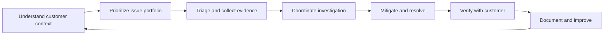
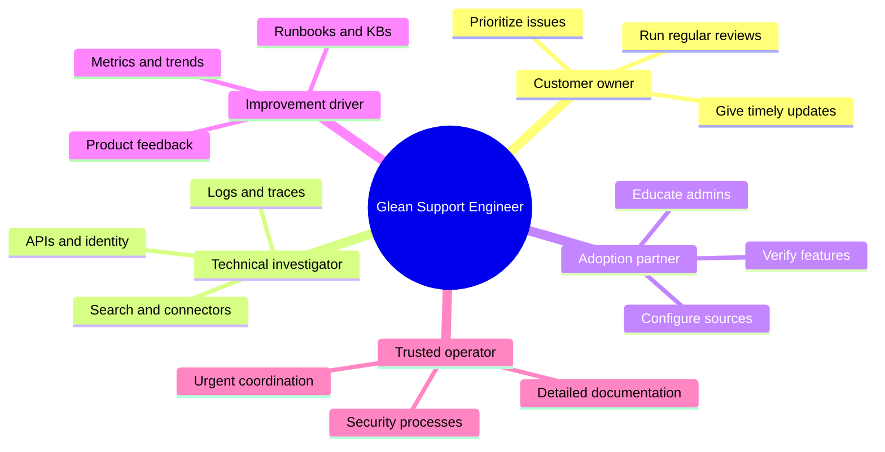
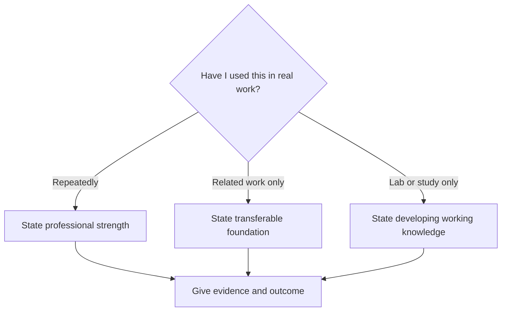
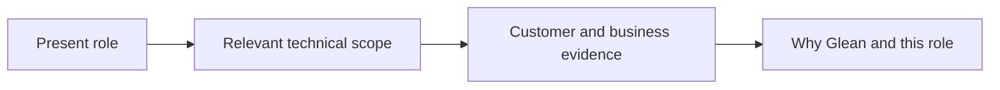
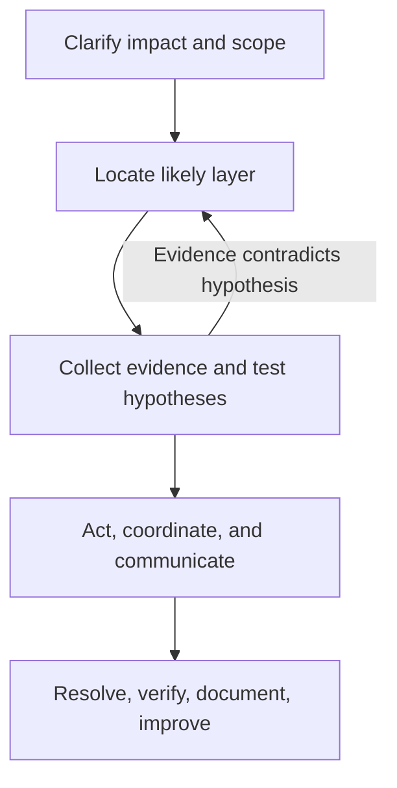

# Part 1 - Role Map, Interview Strategy, and Your Microsoft-to-Glean Story

> **Section goal:** Understand what this role is really hiring for, identify the evidence you already have, and build a truthful story that makes your Microsoft experience feel directly relevant to Glean.
>
> **Covers index item:** Part 1. **Maps to JD responsibilities:** customer ownership, proactive and reactive support, communication, technical curiosity, problem solving, detail orientation, data-driven improvement, and cross-functional collaboration.

---

## 1. What This Role Really Is

In plain English, this role is the **technical owner of a customer's support experience**.

The job is not limited to waiting for support tickets. You would understand the customer's environment, prioritize their issues, troubleshoot failures, keep stakeholders informed, document repeatable solutions, and help the customer gain more value from Glean.

### Plain-English deep-dive: the role's three identities

- **Technical detective** - finds the layer where a failure begins. **Analogy:** A doctor does not prescribe medicine from the words "I feel unwell" alone; the doctor asks questions, checks symptoms, runs tests, and rules out causes. **Why it matters:** Glean expects structured root-cause isolation.
- **Customer incident owner** - ensures that an issue continues moving even when several teams are involved. **Analogy:** An air-traffic controller does not fly every aircraft, but coordinates all participants so the journey completes safely. **Why it matters:** Ownership is broader than personally writing every fix.
- **Improvement engineer** - turns repeated cases into better runbooks, tooling, alerts, processes, or product behavior. **Analogy:** Instead of repeatedly mopping the floor, find and repair the leaking pipe. **Why it matters:** Glean explicitly asks for support scale and efficiency improvements.



### Support Engineering vs adjacent disciplines

| Discipline | Primary question | Typical output | Overlap with this role |
|---|---|---|---|
| Customer Support | "How do we restore the customer?" | Resolution and communication | First response, follow-through, customer trust |
| Support Engineering | "Why did it fail, and how do we prevent recurrence?" | Root cause, fix, runbook, product feedback | Core of the role |
| Customer Solutions Engineering | "How should this work in the customer's environment?" | Architecture and configuration guidance | Content-source setup and verification |
| Professional Services | "How do we deliver a planned implementation?" | Project milestones and deployment | Onboarding and feature adoption |
| Site Reliability Engineering | "How do we keep the service reliable at scale?" | Monitoring, automation, reliability changes | Alerts, health, incident response |

> **Tie-in to your background:** Your Support Engineer and Support Escalation Engineer work already spans several columns. You own critical cases, guide engineers, coordinate customer IT and engineering teams, validate fixes, author documentation, and use support metrics. The product changes; the ownership pattern transfers.

---

## 2. Decode the Job Description into Five Hiring Outcomes

A long job description is easier to remember when converted into a small number of outcomes.



| Hiring outcome | What the interviewer needs to believe | Evidence available from your CV |
|---|---|---|
| **1. Own the customer outcome** | You do not drop an issue when another team becomes involved | End-to-end enterprise escalations and CRITSITs; coordination with Customer IT, partners, engineering, product groups, and vendors |
| **2. Troubleshoot with depth** | You can reduce ambiguity and isolate root cause | Advanced ODSP and sync-client investigations; SME accreditation; roadblock calls, triages, defect escalation, and fix validation |
| **3. Communicate under pressure** | Customers and internal teams receive clear, credible updates | Customer communication, proactive technical syncs, business reviews, technical advising, and leadership presentations |
| **4. Improve the system** | You convert case learning into reusable improvements | KB articles, troubleshooting guides, training, automation projects, recurring-issue analysis, and product feedback |
| **5. Learn across technologies** | You can close gaps quickly without pretending expertise | Progression from intern to escalation engineer; Azure, AI, data, Power Platform, Copilot Studio, MBA, mentoring, and certifications |

### The evidence rule

For every claim in an interview, be prepared to provide four things:

### 🔍 Plain-English deep-dive: Evidence turns similarity into fit

The interviewer should not have to assume that Microsoft 365 escalation work transfers to Glean. Name the shared customer outcome, your method, the verified result, and the Glean-specific detail you still need to learn.

**Analogy:** A travel adapter connects proven capability to a new socket without pretending the two systems are identical.

1. **Context:** What environment or customer situation existed?
2. **Your action:** What did you personally decide or do?
3. **Evidence:** What information guided the decision?
4. **Outcome:** How did you know the situation improved?

A claim without evidence sounds like a keyword. A claim with context, action, evidence, and outcome sounds like experience.

---

## 3. Your Microsoft-to-Glean Translation Map

Do not make the interviewer translate your background. State the connection explicitly.

| Your Microsoft experience | Glean-relevant capability | Interview translation |
|---|---|---|
| SharePoint Online, OneDrive, Delve, and M365 administration | Enterprise content and knowledge systems | "My strongest product background is in enterprise content, collaboration, discovery, permissions, and sync scenarios." |
| ODSP Sync Client SME | Deep technical ownership | "I became the escalation point for complex sync investigations and helped other engineers structure their diagnosis." |
| Enterprise escalations and CRITSITs | High-urgency customer issue ownership | "I am used to balancing restoration, evidence collection, stakeholder updates, and engineering coordination during critical incidents." |
| Customer IT, partner, engineering, product, and vendor coordination | Cross-functional resolution | "I keep one resolution plan across teams, with explicit owners, next actions, risks, and verification criteria." |
| Defect escalation and fix validation | Customer-to-product feedback loop | "I translate customer impact into engineering evidence, validate the fix, and close the loop with the customer." |
| KB articles, troubleshooting guides, case bashes, and training | Support scale and knowledge management | "I convert investigation learning into reusable guidance so the next case is faster and more consistent." |
| CSAT, backlog health, case quality, and escalation trends | Data-driven support management | "I use customer and operational metrics to find risks, assess outcomes, and propose follow-up actions." |
| Copilot Studio agents, AI training, AI-102, AI-900 | Enterprise AI foundation | "I already understand customer adoption and support questions around enterprise AI, and I am deepening the retrieval and search side for Glean." |
| Azure, Active Directory, networking, virtual machines | Cloud and identity foundation | "Azure is my strongest cloud foundation; I use cloud-neutral categories to map the same concepts to AWS and GCP." |
| Power Automate and Power Apps projects | Process improvement and automation | "I look for repeatable work that can be standardized or automated rather than treating every case as unique." |
| Mentoring, onboarding, interviewing, and Technical Advisor training | Influence without authority | "I can guide people who do not report to me and improve investigation quality across a support organization." |

### A useful sentence pattern

Use this structure when connecting an old product to a new one:

> "The specific platform is different, but the underlying support problem is familiar: **[shared problem]**. At Microsoft I handled it by **[method]**, and for Glean I would apply the same method while learning **[product-specific detail]**."

**Example:**

> "The specific connector and indexing architecture will be different, but permission-sensitive enterprise content troubleshooting is familiar. In Microsoft 365 I worked across SharePoint, OneDrive, user context, sync behavior, and service dependencies. At Glean I would apply the same scope-evidence-isolation discipline while learning Glean's connector diagnostics and indexing signals."

---

## 4. Your Honest Capability Boundary

Credibility is more valuable than pretending to have used every technology in production.

### Three evidence levels

| Level | Meaning | Safe language | Your examples |
|---|---|---|---|
| **Professional strength** | Used repeatedly in real customer or operational work | "I own...", "I have handled...", "I led..." | Enterprise escalations, SharePoint, OneDrive, sync, customer communication, RCA, metrics, documentation, mentoring |
| **Transferable foundation** | Related experience makes the new area easier to learn | "My experience transfers through...", "My strongest foundation is..." | Azure to cloud-neutral concepts; M365 content to enterprise search; Copilot to Glean AI support |
| **Developing working knowledge** | Recently studied or practiced, but not yet deep production experience | "I have built working familiarity with...", "I practiced...", "I would validate..." | REST API drills, Postman/cURL, SAML/OAuth traces, HAR analysis, Linux, Kubernetes, GitHub/Jira/Confluence if not used professionally |



### Phrases to use

- "My production depth is strongest in Microsoft 365 support, especially SharePoint Online, OneDrive, sync, and enterprise escalations."
- "I have a strong conceptual foundation in identity and cloud, and I am building hands-on fluency with the specific SAML and OAuth diagnostic artifacts."
- "I would not claim deep Kubernetes administration. For support scenarios, I can explain the core objects and use safe diagnostic commands to inspect pods, events, and logs."
- "I have practiced REST troubleshooting by separating transport, authentication, authorization, request validity, rate limiting, and server-side failure."
- "If I do not know a Glean-specific internal signal, I would state that, collect the available evidence, consult the runbook or subject-matter expert, and retain ownership of the customer update."

### Phrases to avoid

- "I am an expert in everything listed."
- "I have not done that," followed by silence.
- "Engineering owns that, so I would transfer the ticket."
- "It is probably a backend issue" before collecting evidence.
- "I learn quickly" without an example showing how.

> **Better than "I have not done that":** "I have not operated that exact system in production. The closest problem I have solved is ___. I would begin by checking ___ because ___."

---

## 5. The Likely Interview Scorecard

The exact interview process must be confirmed with the recruiter. Based on this job description, prepare for the following evaluation areas.

| Possible round | What may be tested | Strong preparation evidence |
|---|---|---|
| Recruiter or introduction | Motivation, communication, role understanding, logistics | 60-second introduction; why Glean; concise career progression |
| Hiring manager | Ownership, judgment, customer handling, improvement mindset | Critical incident, difficult customer, product defect, metrics, and process-improvement stories |
| Technical fundamentals | Networking, HTTP, APIs, identity, cloud, SQL, logs | Parts 6-13; explain concepts and troubleshoot aloud |
| Product/search discussion | Search, connectors, indexing, permissions, AI | Parts 2-4 and 16; map to SharePoint/OneDrive/Copilot |
| Troubleshooting scenario | Ambiguous customer problem with incomplete evidence | Use the structured flow in Part 5 and integrated cases in Part 24 |
| Customer communication exercise | First response, status update, expectation management | Parts 17-20; separate facts, hypotheses, actions, owners, and update time |
| Behavioral or values | Curiosity, fearlessness, detail, collaboration, learning | STAR stories grounded in Microsoft experience; Part 27 |

### What strong technical interviewing sounds like

A strong candidate does not jump directly to one cause. They narrate a controlled investigation:

1. "First, I would clarify impact and scope."
2. "Next, I would establish when the behavior started and what changed."
3. "I would compare affected and unaffected users, content sources, and environments."
4. "My initial hypotheses are A, B, and C."
5. "This evidence would distinguish them."
6. "While investigating, I would set the next customer update time."
7. "After mitigation, I would verify recovery and capture prevention actions."

That sequence demonstrates technical depth, communication, and ownership at the same time.

---

## 6. Build Your 60-Second Introduction

An introduction should answer four questions:

- Who are you professionally?
- What problems do you solve?
- What evidence shows you are effective?
- Why is this role the logical next step?

### Structure



### Ready-to-practice version

> "I am a Support Escalation Engineer at Microsoft with more than five years of progressive experience in enterprise technical support. My core technical background is in SharePoint Online, OneDrive for Business, the sync client, Microsoft 365 administration, and Copilot. I own complex and business-critical escalations, coordinate customer IT, partners, engineering, and product teams, and drive cases from investigation through fix validation and customer closure. I also work with CSAT, backlog health, case quality, and escalation trends; my CV reflects sustained CSAT above 4.75 for Enterprise and 4.85 for SMB support. Alongside case ownership, I mentor engineers, create troubleshooting guidance, and support AI adoption through Copilot Studio agents and training. Glean interests me because this role combines the areas where I am strongest - enterprise content, customer ownership, deep troubleshooting, and AI - while letting me grow further in search, SaaS integrations, APIs, and identity."

### Short 30-second version

> "I am a Microsoft Support Escalation Engineer specializing in SharePoint Online, OneDrive, sync, and Copilot. I lead complex enterprise escalations across customers, partners, engineering, and product teams, and I use customer and operational metrics to improve outcomes. I am interested in Glean because it brings together enterprise knowledge, AI, content integrations, and high-touch customer support, which closely matches both my experience and the technical direction I want to deepen."

### Personalization checklist

- Say it aloud, not only in your head.
- Replace phrases you would not naturally use.
- Keep the long version between roughly 45 and 75 seconds.
- Do not list every certification.
- Do not begin with education; lead with current professional value.
- Pause after the final sentence instead of continuing nervously.

---

## 7. Answer "Why This Move?" Without Sounding Negative

A strong answer moves **toward** the target role rather than **away from** the current employer.

### Recommended answer

> "Microsoft has given me a strong foundation in enterprise support, content platforms, critical incident ownership, and cross-functional problem solving. The next step I want is deeper ownership of a designated customer's technical experience, where proactive support, product adoption, complex integrations, and continuous improvement sit together. Glean is especially relevant because enterprise knowledge and AI are close to my SharePoint, OneDrive, and Copilot experience, while the role also expands my depth in search, connectors, APIs, and identity."

### Why this answer works

| Element | Message sent to interviewer |
|---|---|
| Appreciation for Microsoft | You are professional and not escaping conflict |
| Clear desired growth | The move has logic |
| Designated-customer ownership | You read the job description carefully |
| Enterprise knowledge and AI | Your background has product relevance |
| Technical growth areas | You are curious and self-aware |

### Avoid

- Complaints about management, compensation, promotion, workload, or internal politics.
- Saying only that Glean is a fast-growing company.
- Claiming that the role is identical to your current job.
- Describing Glean as merely a stepping stone into AI.

---

## 8. Build a Story Inventory Before Writing Full STAR Answers

**STAR** means **Situation, Task, Action, Result**. It is a structure for answering experience questions without wandering.

- **Situation:** What was happening?
- **Task:** What outcome were you responsible for?
- **Action:** What did you personally do and why?
- **Result:** What changed, and how was it measured or verified?

**Analogy:** STAR is a four-stop train route. If you skip Action, the interviewer cannot tell what *you* contributed. If you skip Result, the story never reaches its destination.

### Candidate story inventory

Use only facts you can defend. Fill in the missing case-specific details before interview day.

| Competency | CV-backed story source | Details you must add from memory |
|---|---|---|
| Critical incident ownership | Business-critical ODSP or Copilot escalation | Customer impact, timeline, your first decision, evidence, mitigation, final validation |
| Difficult customer communication | Enterprise case requiring multiple teams | Why trust was at risk, update cadence, expectation reset, customer response |
| Root-cause isolation | Complex sync-client investigation as SME | Competing hypotheses, discriminating evidence, actual cause, prevention |
| Product improvement | Recurring issue escalated to engineering/product | Reproduction evidence, business impact, defect path, fix validation |
| Data-driven improvement | CSAT/backlog/case-quality business review | Trend identified, recommendation, action owner, before/after result |
| Documentation at scale | KB article or troubleshooting guide | Repeated pain point, audience, structure, adoption, effect on case handling |
| Automation | Power Automate or Power Apps Evolve project | Manual problem, design, users, measured time/quality gain, award context |
| Learning and curiosity | Progression to ODSP SME, AI program, or Technical Advisor | Learning method, obstacle, demonstration of new skill, business use |
| Mentoring and influence | Onboarding, triage, case bash, technical interview | Person/team need, coaching approach, feedback, measurable readiness |
| AI adoption | Copilot Studio agent or organization-wide training | User problem, design choice, evaluation, risks, adoption or feedback |
| Leadership without authority | Aspire Leadership Council or global events | Stakeholders, disagreement/constraint, your influence, outcome |
| Mistake or failed approach | Select a genuine low-risk example | Initial assumption, signal it was wrong, correction, learning, prevention |

> **Important:** Do not invent the missing details. Interviewers often ask several follow-up questions, and a real story becomes stronger under examination while a fabricated story becomes weaker.

---

## 9. A Framework for Questions You Have Not Seen Before

Use **CLEAR** to keep an unfamiliar technical or customer scenario structured.

| Letter | Step | What to say |
|---|---|---|
| **C** | Clarify | "Let me confirm the impact, scope, timeline, and expected behavior." |
| **L** | Locate the layer | "I would separate client, network, identity, API, connector, indexing, permission, and search layers." |
| **E** | Evidence and hypotheses | "I would collect these artifacts and use them to distinguish these possible causes." |
| **A** | Act and align | "I would mitigate where possible, assign owners, and set the next customer update." |
| **R** | Resolve and reduce recurrence | "I would verify recovery, document the root cause, and identify prevention or monitoring work." |



### Example: "A customer says Glean cannot find recently added documents. What do you do?"

A Part 1 level answer does not need Glean-internal commands yet:

> "I would first clarify whether all users, one user, one source, or one document type is affected, when the content was added, whether it is visible in the source system, and what the expected freshness is. I would then separate source access, connector sync, ingestion/indexing, permissions, and query/relevance as possible layers. I would compare an affected document with a known-good document and collect connector status, timestamps, identifiers, errors, and the affected user's permission context. If business impact is high, I would establish a mitigation path and update cadence while involving the relevant internal owner. I would verify recovery using the customer's test case, document the cause, and add monitoring or runbook steps if the pattern could recur."

This answer shows method without pretending to know an internal tool you have not used.

---

## 10. Your Part 1 Practice Deliverables

### Exercise A: Record your introduction

Record the 60-second version three times.

| Attempt | Goal | Self-check |
|---|---|---|
| 1 | Accuracy | Did every claim match the CV? |
| 2 | Clarity | Did I remove jargon or explain it? |
| 3 | Natural delivery | Did it sound spoken rather than memorized? |

### Exercise B: Complete six story cards

Create one card for each of these themes:

1. Critical incident.
2. Difficult customer or stakeholder.
3. Deep technical root cause.
4. Product or process improvement.
5. Learning a difficult technology quickly.
6. Mistake, changed hypothesis, or lesson learned.

Each card should contain only five lines:

```text
Situation:
My responsibility:
My three most important actions:
Measured or verified result:
What I learned:
```

### Exercise C: Make your evidence boundary visible

Write three lists:

| List | Minimum entries |
|---|---:|
| Professional strengths I can defend with real cases | 8 |
| Transferable foundations I can connect to Glean | 5 |
| Developing skills I can demonstrate through labs | 6 |

### Exercise D: Two-minute role explanation

Without reading, answer:

> "What does this Glean support role do, and why are you a strong match?"

Score yourself from 0 to 2 on each dimension:

| Dimension | 0 | 1 | 2 |
|---|---|---|---|
| Role understanding | Generic support description | Some JD details | Proactive ownership, troubleshooting, adoption, improvement, and security |
| Evidence | Unsupported claims | One example | Multiple concise CV-backed examples |
| Technical relevance | No platform connection | Mentions M365 | Explicit search/content/permissions/AI transfer |
| Honesty | Overclaims or undersells | Partial boundaries | Clear strengths, transfer, and developing skills |
| Communication | Rambling | Understandable | Structured, concise, and customer-oriented |

A score of **8 or higher out of 10** is a good Part 1 target.

---

## Likely Interview Questions for This Section

### Q1. "Tell me about yourself."

> **Model answer:** "I am a Support Escalation Engineer at Microsoft with more than five years of progressive enterprise support experience. I specialize in SharePoint Online, OneDrive, sync, Microsoft 365 administration, and Copilot. I own complex escalations, coordinate customers and internal engineering teams, validate fixes, and use CSAT and operational trends to improve support outcomes. I also mentor engineers, create troubleshooting guidance, and support AI adoption. I am now looking to bring that combination of enterprise content, technical troubleshooting, and customer ownership into Glean while deepening my expertise in search and SaaS integrations."

### Q2. "Why are you interested in Glean and this role?"

> **Model answer:** "The role combines four areas I want in my next step: deep troubleshooting, designated-customer ownership, enterprise knowledge systems, and AI. My Microsoft experience gives me a strong base in content platforms, permissions, sync, critical incidents, and Copilot. Glean lets me apply that experience while growing further in enterprise search, connectors, APIs, and identity, and while owning both reactive resolution and proactive customer improvement."

### Q3. "You have not supported Glean before. Why should we hire you?"

> **Model answer:** "I would not claim Glean-specific production experience. What I bring is the operating discipline the role needs: end-to-end enterprise escalation ownership, structured root-cause isolation, customer and engineering coordination, fix validation, documentation, metrics, and technical enablement. I also have adjacent product depth in SharePoint, OneDrive, content discovery, permissions, sync, and Copilot. I can learn Glean's internal tools and architecture on top of a support foundation that already matches the customer outcomes of the role."

### Q4. "What is your strongest example of customer ownership?"

> **Model-answer structure:** Choose a real business-critical escalation. State the impact, your responsibility, how you prioritized restoration and investigation, how you coordinated Customer IT and engineering, how often you communicated, how the fix was validated, and what follow-up prevented recurrence. Do not answer only with the final technical fix; ownership is visible in the complete path to closure.

### Q5. "How do you handle a technical question when you do not know the answer?"

> **Model answer:** "I separate not knowing the answer from not knowing how to proceed. I clarify the expected behavior and impact, identify the likely system layers, collect evidence, form testable hypotheses, and use documentation or subject-matter experts for the product-specific gap. I tell the customer what is known, what is being tested, who owns the next action, and when the next update will arrive. I retain ownership even if another team provides the final fix."

### Q6. "How are you data-driven in support?"

> **Model answer:** "I use both customer and operational signals. In my current work that includes CSAT, backlog health, case quality, and escalation trends. I look for patterns rather than isolated numbers, connect them to customer impact, and propose a follow-up action with an owner and success measure. My CV reflects sustained CSAT above 4.75 for Enterprise and 4.85 for SMB support, but I would also explain the behaviors and review process behind those outcomes."

### Q7. "What technical areas do you still need to develop for this role?"

> **Model answer:** "My deepest production expertise is Microsoft 365 rather than Glean's internal platform. I am therefore developing more hands-on fluency in REST API diagnostics, SAML and OAuth traces, HAR analysis, Linux support commands, and basic Kubernetes diagnostics. I am treating these as practical support skills: I practice the evidence, common failures, and safe diagnostic workflow rather than claiming administration depth I do not yet have."

### Q8. "Tell me about a time you learned a complex area quickly."

> **Model-answer structure:** Use a real progression such as developing ODSP Sync Client SME depth, completing the Technical Advisor program, or moving into Copilot Studio agents. Explain the initial gap, learning plan, hands-on application, feedback loop, proof of competence, and how you then enabled others. The key result is not course completion; it is demonstrated use and shared impact.

---

## 30-Second Memory Hooks

- **Role:** Technical detective + customer owner + improvement engineer.
- **Five outcomes:** Own, troubleshoot, communicate, improve, and learn.
- **Translation rule:** Same support problem, proven method, new product details.
- **Evidence levels:** Professional strength, transferable foundation, developing working knowledge.
- **STAR:** Situation, Task, Action, Result; never skip your Action or the Result.
- **CLEAR:** Clarify, Locate, Evidence, Act, Resolve.
- **Ownership:** Another team can own an action; you still own customer progress.
- **Honesty:** "I have not used that exact system" should be followed by the closest evidence and a diagnostic approach.
- **Your bridge:** Microsoft 365 content + critical support + Copilot AI -> Glean enterprise knowledge support.

---

## Completion Checklist

- [ ] I can deliver the 30-second and 60-second introductions naturally.
- [ ] I can explain the role through the five hiring outcomes.
- [ ] I have at least six real story cards with no invented details.
- [ ] I can distinguish professional strengths, transferable foundations, and developing skills.
- [ ] I can answer an unfamiliar scenario using CLEAR.
- [ ] I can explain why Glean and why this move without criticizing Microsoft.
- [ ] I have confirmed the likely interview stages with the recruiter or prepared questions to ask about them.

---

*Next suggested section: [Part 2 - Glean Product, Customer Value, and Enterprise Support Journey](Part-02-glean-product-and-customer-journey.md). It explains the product and customer lifecycle that your Part 1 story is pointing toward.*
