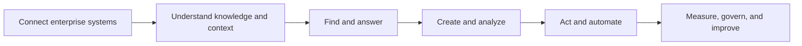
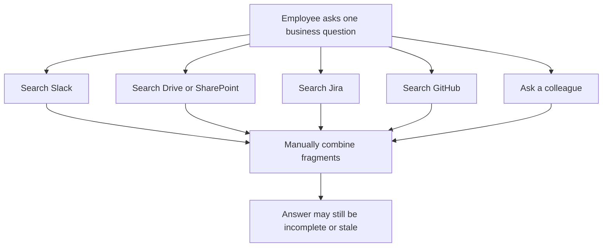
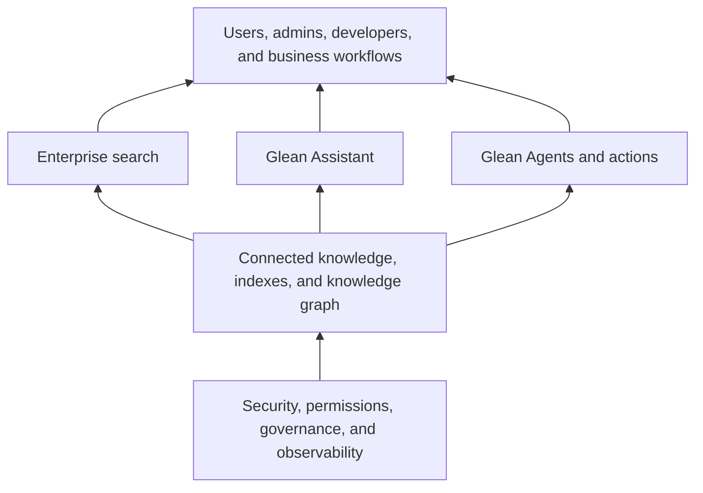
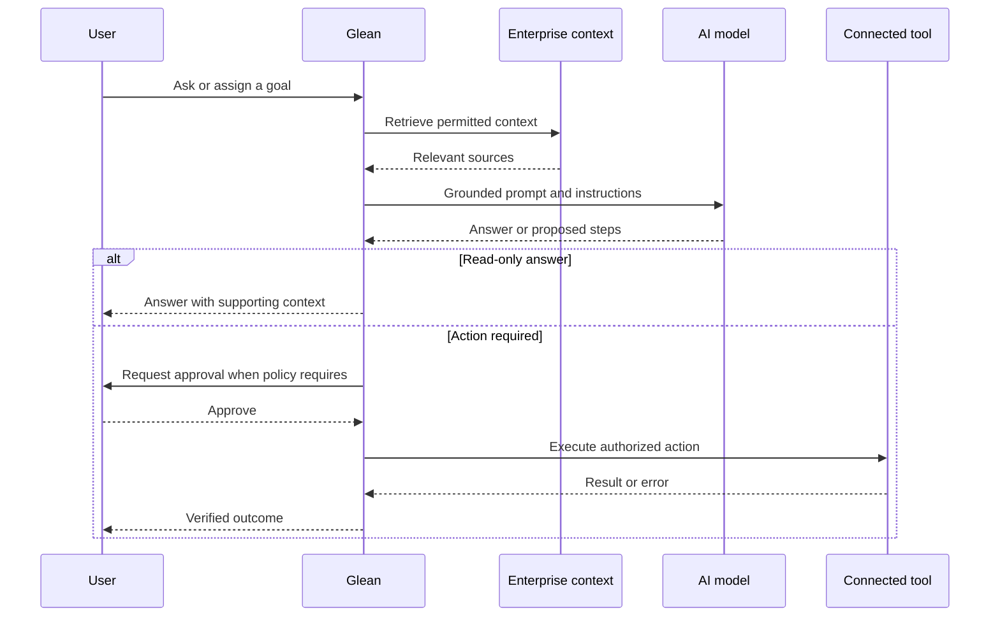
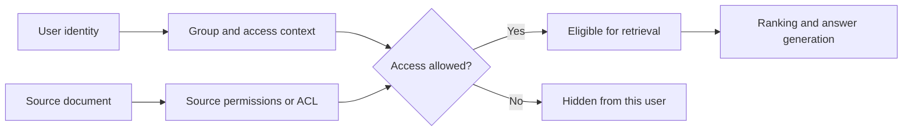
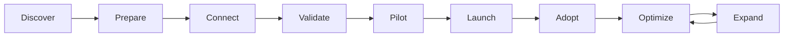
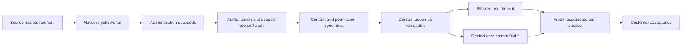
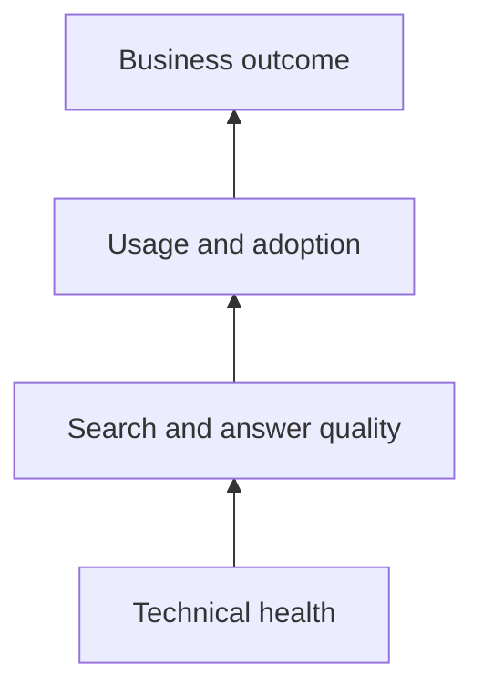

# Part 2 - Glean Product, Customer Value, and Enterprise Support Journey

> **Section goal:** Explain what Glean does, why enterprises buy it, how users and administrators experience it, and where a support engineer creates value from setup through adoption and expansion.
>
> **Covers index item:** Part 2. **Maps to JD responsibilities:** educate customers, configure and verify content sources and features, identify user and system health issues, support assigned customers proactively and reactively, and help customers realize additional value.

> **Product currency note:** Glean's public product language changes quickly. This Part was grounded in Glean's official product, connector, security, documentation, and developer pages accessed on **August 24, 2026**. Treat public counts and preview/beta labels as time-sensitive; verify them before an interview.

---

## JD Mapping

| Job responsibility | How this Part prepares you |
|---|---|
| Educate customers on Glean features | Build clear explanations of Search, Assistant, Agents, actions, connectors, and protection |
| Configure and verify content sources | Learn the conceptual setup path, acceptance tests, and positive/negative permission checks |
| Identify user and system health issues | Separate source, connector, identity, permission, retrieval, AI, and action layers |
| Provide proactive and reactive support | Map support contributions across discovery, rollout, adoption, incidents, and optimization |
| Help customers realize additional value | Connect technical health to quality, adoption, workflow completion, and business outcomes |
| Represent customer needs internally | Translate evidence and impact into product, engineering, security, or process follow-up |

---

## 1. Glean in One Sentence

**Glean is an enterprise AI platform that connects company knowledge and systems so employees can find trusted information, receive context-aware assistance, and complete work through governed AI actions and agents.**

That sentence contains four ideas:

1. **Connect:** Bring context from many enterprise applications together.
2. **Understand:** Organize content, people, activity, and permissions into useful enterprise context.
3. **Answer:** Support permission-aware search and AI-assisted answers.
4. **Act:** Let assistants and agents complete work across connected systems within enterprise controls.



### 🔍 Plain-English deep-dive: What is "enterprise context"?

- **Enterprise** means an organization with many users, systems, teams, policies, and security boundaries.
- **Context** means the information needed to interpret a request correctly: documents, conversations, people, projects, permissions, recency, and relationships.
- **Enterprise context** therefore means more than storing documents. It means knowing which information exists, how it relates to work, how current it is, and who may access it.

**Analogy:** A public search engine is like a librarian for public books. Glean is closer to a company librarian who understands internal systems, team vocabulary, document relationships, and each employee's access badge.

**Why it matters:** A general AI model may know public information but not a company's current roadmap, support history, internal terminology, or private permissions. Enterprise context is what makes an AI response relevant to that organization.

> 💡 **Tie-in to your background:** SharePoint Online, OneDrive, Delve, and Microsoft 365 already taught you that content alone is not enough. Site structure, user identity, permissions, sync state, metadata, and freshness all affect what a user can discover. That mental model transfers directly.

---

## 2. The Business Problem Glean Addresses

Enterprise knowledge is usually fragmented across many tools.

A product decision may be documented in Confluence, discussed in Slack, assigned in Jira, reflected in GitHub, summarized in a meeting, and attached to a Salesforce record. The employee has access to all of it, but finding and combining it takes time.



### Common customer pain points

| Customer pain | User-visible symptom | Business effect |
|---|---|---|
| Knowledge is spread across tools | Employees repeat the same searches in several apps | Time loss and context switching |
| Different teams use different vocabulary | A valid document is difficult to discover | Low reuse of existing knowledge |
| Permissions are complex | Users worry that AI may reveal restricted content | Security and adoption risk |
| Information changes quickly | Old answers appear more trustworthy than current ones | Incorrect decisions |
| Experts answer repeated questions | The same people become knowledge bottlenecks | Slow onboarding and interrupted work |
| General AI lacks company context | Answers sound fluent but are not grounded in internal facts | Low trust and hallucination risk |
| Work still requires app switching | The user finds information but must complete steps manually | Limited productivity gain |
| AI pilots lack governance | Many disconnected tools appear without consistent controls | Security, cost, and manageability problems |

### Product value is not "AI exists"

Customers buy outcomes, not features. Useful outcomes include:

- Faster time to find trusted information.
- Faster onboarding and fewer repeated questions.
- Better use of existing knowledge across teams.
- More consistent answers grounded in company sources.
- Less context switching across enterprise applications.
- Secure AI access that follows organizational permissions.
- Repeatable workflows executed through assistants and agents.
- Measurable adoption, quality, reliability, and return on investment.

> **Interview point:** Do not describe Glean only as "a search tool" or "a chatbot." Current official positioning spans knowledge connection, permission-aware retrieval, AI assistance, content and data work, actions, agents, observability, and governance.

---

## 3. The Product Map: Foundation, Search, Assistant, Agents, and Protection

Think of the platform as layers rather than disconnected features.



### 3.1 Connected knowledge foundation

Glean's public connector page states that it supports **275+ out-of-the-box connectors** as of the research date. It also describes native and Model Context Protocol (MCP)-based connectors, custom connectors through an Indexing Software Development Kit (SDK), and custom actions through OpenAPI specifications.

- **Connector:** Integration that lets Glean receive or access data and context from another system.
- **Index:** A structure optimized for finding information quickly. **Analogy:** A textbook index points to a topic without rereading every page.
- **Knowledge graph:** A representation of entities and their relationships. **Analogy:** A map that connects people, teams, projects, documents, and systems instead of treating each item as isolated.
- **MCP:** Model Context Protocol, a standard for connecting AI systems to tools and context.
- **SDK:** Software Development Kit, a set of libraries and tools used to build an integration.
- **OpenAPI:** A machine-readable description of an HTTP API that tools can use to understand available operations.

The developer documentation also describes Search, Chat, Agent, Web, and Indexing capabilities. The Indexing API quickstart shows a custom-data path: create a datasource, index a document with permissions, enable it for test users, and verify visibility.

### 3.2 Enterprise search

Enterprise search returns ranked results across connected company sources while respecting the requesting user's access.

A support engineer should hear three separate questions when a customer says, "Search is broken":

1. **Availability:** Is the content present and processed?
2. **Authorization:** Is this user allowed to see it?
3. **Relevance:** If visible, should it rank for this query?

Part 3 will explain retrieval and ranking in depth. Part 4 will explain connector and permission flows.

### 3.3 Glean Assistant

Glean's official Assistant page describes an AI coworker that can find information, research and analyze, create content, and execute work. Its public workflow is described as finding context, planning, researching, iterating, and delivering an output.

At an interview-safe level:

- Search usually returns a set of relevant results.
- Assistant can combine context into an answer or deliverable.
- Assistant may cite or connect back to sources so the answer can be checked.
- Assistant can support work beyond question answering, including analysis, content creation, and execution.

### 3.4 Glean Agents and actions

An **agent** is an AI-driven system that can pursue a goal through multiple reasoning or tool-use steps.

Glean's public Agents page describes:

- **Orchestration:** Trigger and coordinate agents across workflows.
- **Builder:** Create and test agents using enterprise context.
- **Deployment:** Share and roll out agents with controls.
- **Observability:** Monitor adoption, errors, feedback, and value.
- **Governance:** Apply permissions, compliance, and security controls.

An **action** changes something in a connected system, such as updating a record. A search result only reads information; an action may create, update, send, or trigger work.

> **Risk distinction:** A wrong search result wastes time. A wrong write action can alter business data. Action support therefore requires stronger authorization, approval, audit, validation, and rollback thinking.

### 3.5 Glean Protect and enterprise controls

Glean's public security page describes platform, data, and agent protection. Publicly described concepts include isolated deployments, regional data sovereignty, source-permission enforcement, sensitive-content controls, agent access controls, human approval options, and safeguards around agent actions.

Do not promise a specific architecture, certification, region, or control from memory. For a real customer, confirm current product documentation and the customer's purchased deployment.

---

## 4. Search vs Assistant vs Agent

This distinction is likely to appear in an interview.

| Capability | Primary user intent | Typical output | Main support questions |
|---|---|---|---|
| **Search** | "Find the best existing information" | Ranked documents, people, or results | Was content indexed? Is it permitted? Is ranking relevant and fresh? |
| **Assistant** | "Help me understand, analyze, or create" | Synthesized answer, analysis, summary, or content | Were the right sources retrieved? Is the response grounded, cited, useful, and safe? |
| **Agent** | "Complete a goal or workflow" | Multi-step execution and possibly system changes | Did the trigger run? Did the agent choose valid steps? Were tools authorized? Did actions complete safely? |

### 🔍 Plain-English deep-dive: Retrieval is not generation

- **Retrieval** finds existing information.
- **Generation** creates new text or other output from a model.
- **Grounding** provides selected source information to the model so the answer is based on enterprise facts.
- **Action** causes a change in another system.

**Analogy:**

- Search is finding the correct recipe.
- Assistant is reading several recipes and proposing a meal plan.
- Agent is ordering ingredients and scheduling preparation.

The later step depends on the earlier context, but each can fail differently.



> 💡 **Tie-in to your background:** Copilot Studio gives you a strong conceptual bridge. You already understand that an agent needs instructions, knowledge, tools, identity, testing, and user education. Glean-specific implementation differs, but the lifecycle and support questions are familiar.

---

## 5. Permission-Aware Does Not Mean Permission-Free

Glean's official connector and developer material repeatedly emphasizes permission-aware results. The core principle is:

> A user should only retrieve content they are permitted to access.

### Source permissions and Glean visibility



- **Identity:** Who the user is.
- **Group:** Collection of users with shared access.
- **ACL:** Access Control List, a record of who may access an object.
- **Permission inheritance:** An item receives permissions from a parent location or group.
- **Permission trimming:** Remove results the current user is not allowed to see.

**Analogy:** A building directory may know every room exists, but an employee's badge determines which doors open.

### Two opposite permission failures

| Failure | Meaning | Risk |
|---|---|---|
| **False deny** | User should see content but cannot | Productivity and adoption problem |
| **False allow** | User sees content they should not | Security incident |

A support engineer treats a possible false allow with much higher urgency. Preserve evidence, limit further exposure through approved procedures, and involve security owners immediately.

### Do not make this assumption

"The document exists in the index" does **not** imply "every user can see the document." Content presence and user visibility are different checks.

That distinction is directly transferable from SharePoint and OneDrive troubleshooting.

---

## 6. Who Uses and Operates Glean?

A support engineer must know whose experience is failing.

| Persona | Goal | Typical question | Support evidence needed |
|---|---|---|---|
| End user | Find answers and complete work | "Why can I not find this document?" | User identity, query, expected item, source access, time, screenshot or trace |
| Customer administrator | Configure sources, identity, controls, and rollout | "Why is this connector unhealthy?" | Connector status, authentication, scopes, errors, sync timing, test objects |
| Security or compliance owner | Protect data and govern AI use | "Could restricted content be exposed?" | Permission path, audit evidence, affected users/content, timestamps, containment |
| Business champion | Drive use and measurable value | "Why is adoption low in this department?" | Active use, success signals, feedback, source coverage, training, use cases |
| Developer or integration owner | Build custom data or actions | "Why does the API request fail?" | Endpoint, method, authentication type, sanitized request/response, status, correlation ID |
| Glean support engineer | Coordinate diagnosis and customer outcome | "What is known, what is next, and who owns it?" | Impact, scope, timeline, hypotheses, evidence, owners, update cadence, validation criteria |
| Glean product or engineering team | Fix product defects or improve capabilities | "Can this be reproduced and prioritized?" | Minimal reproduction, expected vs actual, logs, versions, business impact, frequency |

### User issue vs system issue

| Pattern | More likely direction |
|---|---|
| One user, one device | Identity, browser, local session, or user-specific permissions |
| One user, all devices | Identity, group membership, entitlement, or permission context |
| All users, one source | Connector, source API, authentication, rate limit, or indexing path |
| Some users, same document | Permission differences or propagation delay |
| All users, all sources | Platform, tenant-wide configuration, identity, or service health |
| Search works, Assistant answer is poor | Retrieval selection, grounding, instructions, model behavior, or evaluation |
| Read works, action fails | Tool authorization, action configuration, approval, payload, or target API |

This is not a final diagnosis. It is a fast way to choose the first evidence.

---

## 7. The Customer Journey

The following is an **interview support model**, not a claim that Glean mandates one exact implementation methodology.



### Stage-by-stage support view

| Stage | Customer goal | Support engineer contribution | Exit evidence |
|---|---|---|---|
| **Discover** | Define business problems and priority users | Ask about use cases, sources, security constraints, success measures, and owners | Agreed scope, risks, and measurable outcomes |
| **Prepare** | Make environment and stakeholders ready | Confirm admin owners, identity model, source prerequisites, access process, test users, and communication plan | Readiness checklist complete |
| **Connect** | Configure content sources and integrations | Guide setup, authentication, scopes, source controls, and initial synchronization | Connector configured without blocking errors |
| **Validate** | Prove content, freshness, and permissions | Test known documents with allowed and denied users; compare source and Glean behavior | Acceptance tests pass |
| **Pilot** | Test real use cases with a limited audience | Monitor quality, gather feedback, track issues, educate champions, and adjust | Pilot success criteria met |
| **Launch** | Roll out broadly | Coordinate communications, support readiness, known issues, escalation path, and health monitoring | Users can access product and key use cases work |
| **Adopt** | Build repeatable user value | Review usage, unsuccessful searches, feedback, training needs, and department use cases | Adoption and quality trend toward target |
| **Optimize** | Improve quality, reliability, and efficiency | Analyze trends, tune configuration, close content gaps, improve runbooks, and influence product changes | Measured improvement and fewer repeated issues |
| **Expand** | Add sources, features, agents, actions, or teams | Reuse lessons, assess new security boundaries, validate each change, and measure incremental value | New scope produces verified value safely |

### Proactive and reactive support across the journey

| Proactive | Reactive |
|---|---|
| Review connector health before users complain | Investigate a failed or stale connector |
| Track low adoption or repeated zero-result topics | Resolve a user's missing-result case |
| Create customer-specific runbooks | Follow a runbook during an incident |
| Test a new feature with acceptance criteria | Troubleshoot a production feature failure |
| Review risks and upcoming changes | Coordinate a high-severity escalation |
| Analyze trends and propose improvements | Restore service and communicate status |

A designated-customer support role does both. Proactive work reduces future incidents; reactive work restores current value.

---

## 8. What "Configure and Verify" Really Means

Configuration is not complete when a form saves successfully. It is complete when the intended customer outcome is verified.

### Conceptual content-source verification path



### Minimum acceptance tests

| Test | Why it matters |
|---|---|
| Known public-to-test-group document appears | Confirms basic content path |
| Known restricted document appears for an allowed user | Confirms positive permission behavior |
| Same restricted document is absent for a denied user | Confirms security boundary |
| Updated title or body becomes searchable within expected timing | Confirms freshness behavior |
| Deleted or access-revoked content follows expected behavior | Confirms lifecycle handling |
| Search result opens the correct source URL | Confirms usability and source linkage |
| Assistant uses appropriate content for a controlled question | Confirms higher-level retrieval and grounding path |
| Errors and health signals are visible to the right admin/support owner | Confirms operability |

Part 4 will explain native and custom connector lifecycle details. Part 23 will turn this into a complete hands-on validation runbook.

---

## 9. Customer Value Must Be Measured at Several Layers

A connector can be technically healthy while the customer receives little business value.



| Layer | Example measures | Question answered |
|---|---|---|
| Technical health | Connector errors, authentication failures, sync delay, API rate limits | "Is the system operating?" |
| Content coverage | Connected sources, indexed objects, permission completeness, freshness | "Is the needed knowledge available safely?" |
| Search quality | Successful queries, zero-result patterns, reformulations, result engagement | "Can users find useful information?" |
| Assistant quality | Helpful feedback, citations, groundedness, error rate, task success | "Are answers useful and trustworthy?" |
| Agent quality | Execution success, action error rate, approval rate, completion time | "Do workflows complete safely?" |
| Adoption | Active users, repeat use, department penetration, feature use | "Are people choosing to use it?" |
| Business value | Time saved, faster onboarding, fewer repeated support questions, faster decisions | "Did work improve?" |

### 🔍 Plain-English deep-dive: Leading vs lagging indicators

- **Leading indicator:** Early signal that predicts an outcome. Example: source coverage or weekly active use.
- **Lagging indicator:** Result visible after the effect occurs. Example: reduced onboarding time or fewer internal support tickets.

**Analogy:** Regular exercise is a leading indicator; a later health improvement is a lagging indicator.

A strong business review includes both. Usage without value can be vanity; value without health signals is difficult to sustain.

> 💡 **Tie-in to your background:** You already use CSAT, backlog health, case quality, and escalation trends. The new step is to add product-health, adoption, retrieval-quality, and workflow-success measures to the same business-review discipline.

---

## 10. Support Scenarios Across the Product

### Scenario A: A document cannot be found

Possible layers:

1. Document does not exist or user expects the wrong item.
2. Connector never received or processed it.
3. Sync is delayed or failed.
4. Document is present but permissions exclude the user.
5. Document is eligible but does not rank for the query.
6. Search filters or user context narrow the result set.

First useful comparison: Can an allowed test user find the exact item by a distinctive title or identifier?

### Scenario B: A user sees content they should not see

Treat this as a potential security issue, not a normal relevance complaint.

- Confirm the exact user, item, source permissions, and time.
- Preserve and sanitize evidence.
- Follow approved security escalation and containment procedures.
- Avoid changing permissions blindly before evidence is captured.
- Communicate facts, scope, actions, and next update without speculation.

### Scenario C: Search finds the right source, but Assistant gives a weak answer

Search availability may be healthy. Investigate:

- Was the best source retrieved for the question?
- Was the source current and authoritative?
- Did the answer cite or reflect the source correctly?
- Was the question ambiguous?
- Did instructions or context cause the wrong synthesis?
- Is the issue repeatable across users or phrasing?

### Scenario D: An agent reads data but cannot update a target system

The read path and write path have different requirements. Check:

- Is the action configured and available?
- Does the acting identity have write permission?
- Is user approval required?
- Is the input payload valid?
- Did the target API reject, throttle, or time out?
- Was the operation idempotent or partially completed?
- Can the result be verified or rolled back safely?

### Scenario E: Everything works, but adoption is low

This may not be a technical outage. Check:

- Are the customer's highest-value sources connected?
- Are target users trained on relevant use cases?
- Is search/answer quality trusted?
- Is access convenient in users' normal workflow?
- Are champions and administrators engaged?
- Are there repeated content gaps or permission problems?
- Is value being measured and communicated?

> **Interview lesson:** Product support includes technical health, user trust, feature education, and business adoption. "No error" is not the same as "customer success."

---

## 11. How Your Microsoft Experience Transfers

| Glean concept | Your closest experience | What transfers | What remains to learn |
|---|---|---|---|
| Connected enterprise content | SharePoint Online and OneDrive | Sites, documents, metadata, lifecycle, permissions, user context | Glean connector types, admin signals, and specific controls |
| Search and knowledge discovery | SharePoint search, Delve, M365 collaboration | Discoverability, freshness, permissions, expected vs actual results | Glean indexing, ranking, graph, and evaluation terminology |
| Sync and content freshness | OneDrive Sync Client SME | State comparison, timing, local/service dependencies, scope isolation | Connector-specific crawl, sync, webhook, and API behavior |
| Permission-aware access | SharePoint and M365 permissions | Identity, groups, inheritance, allowed vs denied tests | Glean permission ingestion and diagnostic surfaces |
| Assistant | Microsoft 365 Copilot | Grounding, user expectations, enterprise AI education | Glean Assistant features, observability, and product-specific troubleshooting |
| Agents | Copilot Studio agents | Instructions, knowledge, tools, testing, adoption | Glean Agent Builder, orchestration, deployment, and action controls |
| Customer rollout | Enterprise support, proactive syncs, training | Stakeholder coordination, education, risk, communication | Glean implementation milestones and customer playbooks |
| Product feedback | Defect escalation and fix validation | Reproduction, impact, engineering partnership, closure | Glean internal escalation and release processes |
| Health and value | CSAT, backlog, case quality, business reviews | Trend analysis and improvement plans | Glean product-health and adoption metrics |

### Your strongest product bridge

> "My Microsoft 365 background is relevant because Glean also operates where enterprise content, identity, permissions, freshness, discovery, and AI meet. I would not assume the implementation is the same, but I already know how to separate content availability, user authorization, retrieval behavior, and customer impact during an investigation."

---

## 12. How to Explain Glean in an Interview

### 20-second version

> "Glean is an enterprise AI platform that connects company knowledge and systems. It provides permission-aware search and AI assistance, and it can support governed agents and actions so employees can move from finding information to completing work."

### 60-second version

> "Glean addresses the problem of company knowledge being fragmented across documents, conversations, business applications, and teams. It connects those sources, builds enterprise context while enforcing user permissions, and uses that foundation for search, Assistant experiences, and agents. Search helps users find existing knowledge; Assistant can synthesize, analyze, and create from grounded context; agents can coordinate multi-step work and actions under enterprise controls. For customers, value comes not only from technical connector health but from secure content coverage, trusted answer quality, adoption, workflow completion, and measurable business outcomes."

### Support-engineer version

> "From a support perspective, I see Glean as a layered system. A user-facing issue could originate in the source, network, authentication, API, connector sync, indexing, identity, permissions, retrieval, AI grounding, or action path. My job would be to isolate the failing layer, restore or mitigate the customer impact, communicate clearly, verify the outcome with the customer's test case, and turn repeated issues into better monitoring, runbooks, product feedback, or education."

---

## 13. Customer Review Conversation

A regular assigned-customer review should not become a list of ticket numbers.

### Suggested agenda

| Topic | Questions |
|---|---|
| Outcomes | What business use cases matter most this period? |
| Open issues | What is the impact, current status, owner, next action, and target update? |
| Health | Are connectors, identity, permissions, freshness, Assistant, and actions behaving as expected? |
| Adoption | Which teams and features are growing or declining? |
| Quality | What searches, answers, or workflows are not meeting expectations? |
| Risk | Are there upcoming source, identity, security, or organizational changes? |
| Improvement | What recurring issue can be removed through product, process, automation, or documentation? |
| Expansion | Which source, feature, team, or agent could create the next verified value? |

### Good closing summary

> "We agreed that the highest-impact issue is ___. Glean owns ___ by ___; the customer owns ___ by ___. The next update is ___. Recovery will be verified using ___. Separately, we will review ___ as a preventive improvement and measure success through ___."

This is the same discipline you already use in critical escalations and business reviews, applied to a longer customer relationship.

---

## 14. Practice Exercises

### Exercise A: Product explanation ladder

Explain Glean three times without notes:

1. To a new employee in 20 seconds.
2. To a customer administrator in 60 seconds.
3. To a technical interviewer in 2 minutes using the layered architecture.

### Exercise B: Persona switching

For "A policy document is missing," write the concern of each persona:

| Persona | Concern to write |
|---|---|
| End user | What work is blocked? |
| Admin | Is source configuration or sync unhealthy? |
| Security owner | Should this user be allowed to see the document? |
| Business champion | Is this a repeated trust or adoption issue? |
| Support engineer | What evidence separates source, connector, permission, and relevance? |

### Exercise C: Customer journey map

Choose SharePoint Online as the first content source. For each journey stage, write:

- One customer goal.
- One risk.
- One acceptance test.
- One proactive support action.

### Exercise D: Value tree

Create one chain from technical signal to business value:

```text
Technical health signal:
Content or permission outcome:
User behavior outcome:
Business outcome:
How success is measured:
```

Example structure: connector freshness -> current policy appears -> employees find it without asking HR -> fewer repeated requests -> measured reduction in internal tickets.

---

## ⭐ Likely Interview Questions for This Section

### Q1. "What does Glean do?"

> **Model answer:** "Glean connects enterprise knowledge and systems so employees can find trusted information, work with a context-aware AI assistant, and use governed agents and actions. Its enterprise value comes from combining connected context with permission-aware access, AI capabilities, and controls rather than operating as a generic public chatbot."

### Q2. "How is Glean more than enterprise search?"

> **Model answer:** "Search is a foundation because it retrieves relevant, permitted knowledge. Glean's current platform positioning extends that foundation into Assistant experiences for research, analysis, content creation, and work execution, plus agents that can coordinate multi-step workflows and actions. The support surface therefore includes retrieval, grounding, workflow execution, adoption, observability, and governance."

### Q3. "What is the difference between Search, Assistant, and Agents?"

> **Model answer:** "Search primarily retrieves and ranks existing information. Assistant uses retrieved context to synthesize an answer, analysis, or deliverable. An agent pursues a goal through multiple steps and may invoke tools or actions. Each adds complexity: retrieval quality for Search, grounding and generation for Assistant, and authorization, state, execution, and verification for Agents."

### Q4. "Why are permissions central to an enterprise AI platform?"

> **Model answer:** "The platform connects sensitive knowledge from many systems. A useful answer is unacceptable if it reveals content the user cannot access. Permission-aware retrieval must evaluate the requesting identity and source access so only eligible content can influence results. I would test both directions: an allowed user can find the item and a denied user cannot."

### Q5. "How would you verify a newly configured content source?"

> **Model answer:** "I would define controlled test content and users before configuration. I would verify connectivity, authentication, scopes, sync completion, content presence, source links, freshness, and positive and negative permission cases. I would then test a realistic search and, where relevant, an Assistant question. I would document expected timing, evidence, rollback, and customer acceptance criteria rather than treating a successful save as completion."

### Q6. "A connector is healthy, but users say Glean provides no value. What would you investigate?"

> **Model answer:** "I would separate technical health from customer value. I would review whether the right sources and use cases are covered, whether content is current and permissioned correctly, whether search and answers are useful, whether users were trained in relevant workflows, and whether access fits their daily tools. I would compare adoption and quality by team, collect examples, and turn findings into a measurable improvement plan."

### Q7. "How would your Microsoft 365 experience help you support Glean?"

> **Model answer:** "My strongest bridge is the intersection of enterprise content, identity, permissions, freshness, discovery, and AI. In SharePoint and OneDrive support I already separate content availability, user context, sync behavior, permissions, and service dependencies. Copilot and Copilot Studio also give me a foundation in grounded AI, agents, testing, and user education. I would apply that troubleshooting discipline while learning Glean's specific connector, indexing, and observability surfaces."

### Q8. "What would you review regularly with an assigned customer?"

> **Model answer:** "I would review business priorities, open issues by impact, resolution actions and owners, product and connector health, security or access risks, adoption and quality signals, recurring patterns, upcoming changes, and opportunities to add value. Every issue should leave the meeting with an owner, next action, update time, and verification criterion; every improvement should have a success measure."

---

## 🧠 30-Second Memory Hooks

- **Glean:** Connect context -> find and answer -> act -> govern and improve.
- **Enterprise context:** Content plus relationships, recency, identity, activity, and permissions.
- **Search:** Find existing knowledge.
- **Assistant:** Understand, analyze, and create from context.
- **Agent:** Pursue a goal through steps and tools.
- **Action:** A write or operation in another system; higher risk than retrieval.
- **Permission-aware:** The index may know an item exists, but the user's badge decides visibility.
- **Customer journey:** Discover, prepare, connect, validate, pilot, launch, adopt, optimize, expand.
- **Health is not value:** Working connector -> useful retrieval -> adoption -> business outcome.
- **Your bridge:** M365 content, permissions, sync, and Copilot are adjacent foundations, not identical implementations.

---

## Completion Checklist

- [ ] I can explain Glean in 20 seconds, 60 seconds, and 2 minutes.
- [ ] I can distinguish Search, Assistant, Agent, and Action.
- [ ] I can explain permission-aware retrieval using positive and negative tests.
- [ ] I can name the customer journey stages and the support contribution at each stage.
- [ ] I can explain why connector health alone does not prove customer value.
- [ ] I can map my SharePoint, OneDrive, sync, Copilot, and escalation experience to Glean without claiming identical implementation.
- [ ] I can describe a regular customer review using outcomes, health, adoption, risks, actions, and measures.
- [ ] I have checked current official product language before the interview.

---

## Official Source Anchors

These links were used to ground current product terminology. Recheck them before the interview because capabilities and public counts change.

- [Glean homepage and platform positioning](https://www.glean.com/)
- [Glean Assistant](https://www.glean.com/product/assistant)
- [Glean Agents](https://www.glean.com/product/agents)
- [Glean connectors](https://www.glean.com/connectors)
- [Glean security](https://www.glean.com/security)
- [Glean documentation](https://docs.glean.com/)
- [Glean developer documentation](https://developers.glean.com/)
- [Indexing API quickstart](https://developers.glean.com/api-info/indexing/getting-started/overview)

---

*Next suggested section: [Part 3 - Enterprise Search and Knowledge Technology Fundamentals](Part-03-enterprise-search-and-knowledge-fundamentals.md). It opens the retrieval layer introduced here: crawling, parsing, indexing, ranking, freshness, semantic search, and permission-aware results.*
