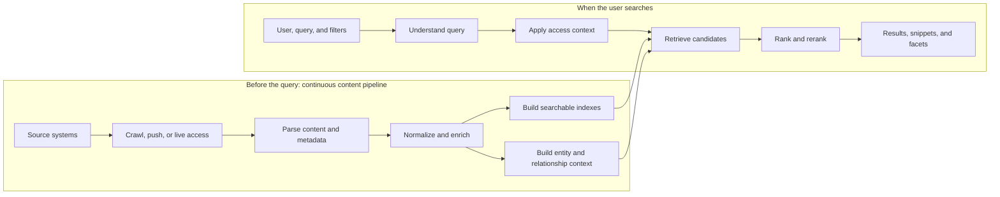
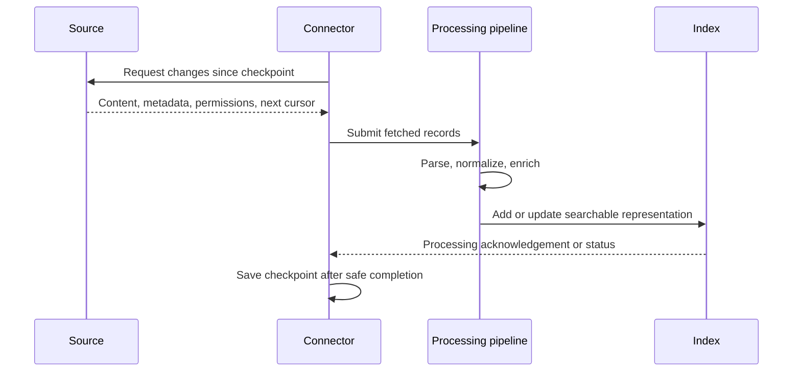
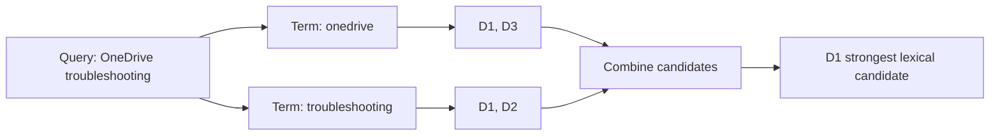
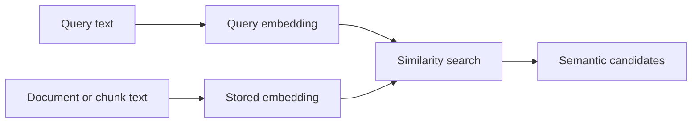
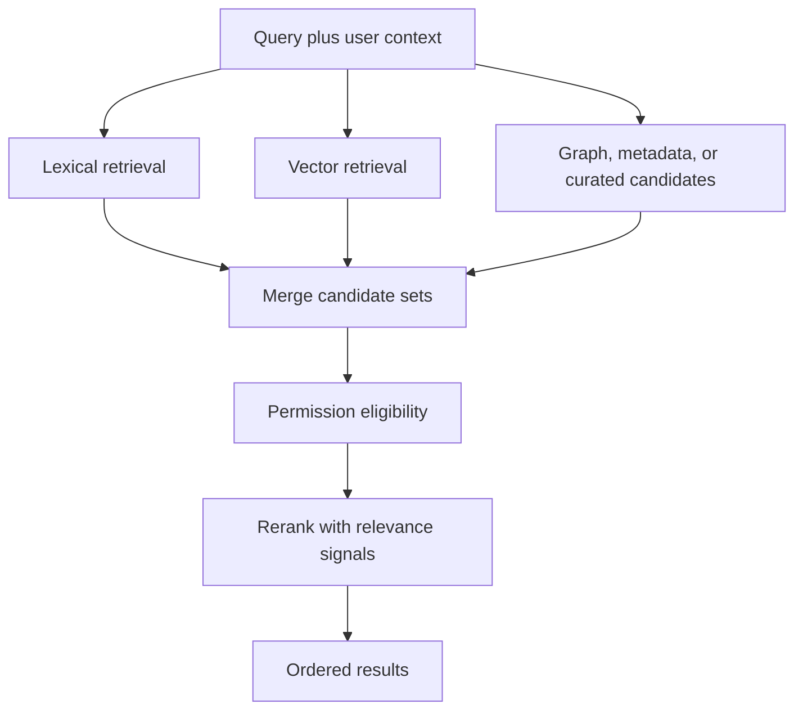
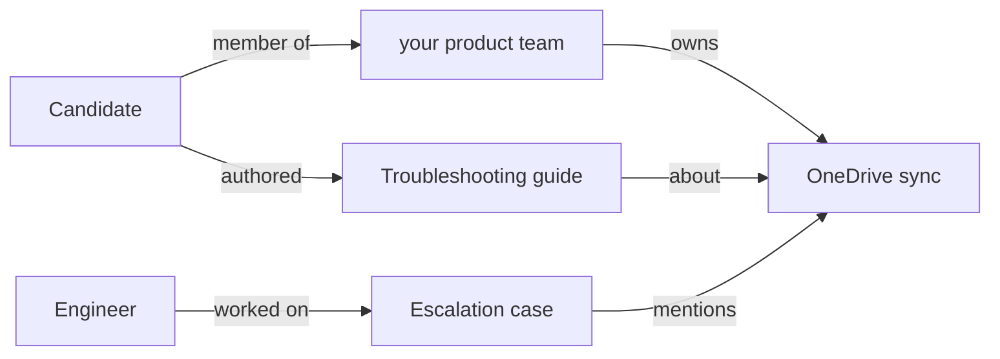
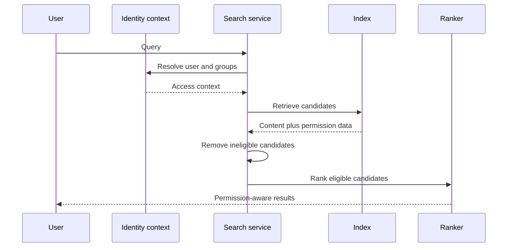
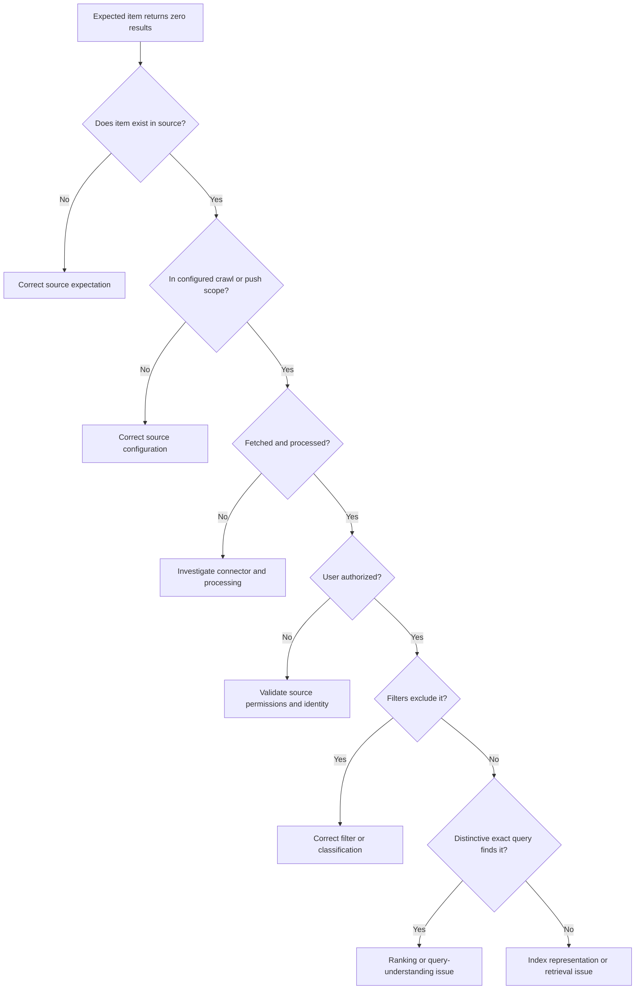
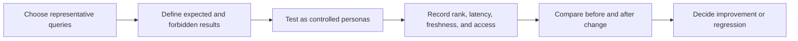

# Part 3 - Enterprise Search and Knowledge Technology Fundamentals

> **Section goal:** Understand how enterprise content becomes permission-aware search results, why relevant documents can be missing or rank poorly, and how to diagnose search-quality complaints without guessing.
>
> **Covers index item:** Part 3. **Maps to JD responsibilities:** hands-on search or knowledge technology, root-cause isolation, system and user health diagnosis, content-source verification, customer education, and data-driven support improvement.

> **Product currency note:** Glean-specific public terminology in this Part is grounded in official Glean documentation accessed on **August 24, 2026**. The search theory is platform-neutral. Internal ranking implementations and signal weights are proprietary and can change, so do not claim undocumented internals in an interview.

---

## JD Mapping

| Job responsibility | How this Part prepares you |
|---|---|
| Troubleshoot and isolate root cause | Trace a symptom through acquisition, processing, indexing, permissions, retrieval, and ranking |
| Support search and knowledge technologies | Explain lexical, semantic, vector, hybrid, graph, and personalized search from first principles |
| Identify system and user health issues | Distinguish tenant-wide failures from source-, document-, query-, and user-specific failures |
| Configure and verify content sources | Define controlled content, freshness, permission, and relevance acceptance tests |
| Educate customers | Explain why "indexed," "visible," and "highly ranked" are different states |
| Use objective measurements | Apply precision, recall, ranking, zero-result, latency, freshness, and engagement measures |

---

## 1. The Search System in One Picture

A search engine prepares content **before** the user searches, then interprets and ranks it **when** the user submits a query.



### 🔍 Plain-English deep-dive: Search is a pipeline, not one box

- **Source system** - where original information lives, such as SharePoint, Slack, Jira, or GitHub.
- **Acquisition** - how a search platform receives or accesses that information.
- **Parsing** - extracting useful fields from the source format.
- **Normalization** - converting different source formats into a consistent representation.
- **Indexing** - building data structures that make retrieval fast.
- **Query understanding** - interpreting the user's words, filters, identity, and likely intent.
- **Retrieval** - finding a manageable set of possible results, called candidates.
- **Ranking** - ordering candidates by estimated usefulness.
- **Permission enforcement** - ensuring the user receives only eligible content.

**Analogy:** Think of an airport baggage system. Bags are accepted, labeled, scanned, routed, and tracked before a passenger reaches the destination carousel. If a bag is missing, "the carousel is broken" is only one hypothesis. Search troubleshooting similarly identifies the exact stage where expected content stopped progressing.

### Three states that must not be confused

| State | Meaning | What it does **not** prove |
|---|---|---|
| **Indexed** | Searchable representation exists in an index | The current user is authorized to see it |
| **Visible** | The current user is eligible to receive it | It will rank near the top for every query |
| **Relevant** | It is useful for this user's query and context | It is the newest or authoritative source unless signals support that |

> 💡 **Tie-in to your background:** OneDrive sync taught you to separate "file exists in the cloud," "file is synchronized to this client," and "user can open the file." Enterprise search uses the same separation discipline: content exists, content was processed, user may see it, and query ranks it are different checkpoints.

---

## 2. The Searchable Unit: Documents, Objects, Fields, and Metadata

A **document** in search does not mean only a Word or PDF file. It is a searchable record representing an item from a source.

Examples include:

- A SharePoint page.
- A Slack message or thread.
- A Jira issue.
- A GitHub pull request.
- A Salesforce opportunity.
- A person profile.
- A meeting transcript.

An **object type** describes the kind of record, such as document, issue, message, person, or presentation.

A **datasource** is a configured content source in the search platform. Glean's developer key terms define a datasource as a configured source such as Confluence, Slack, or a custom integration.

### Fields and metadata

- **Content field:** Text the user wants to find, such as title, body, or comment.
- **Metadata:** Data that describes the object, such as owner, source, object type, created time, updated time, project, status, or URL.
- **Structured data:** Information stored in predictable fields, such as `status = open`.
- **Unstructured data:** Free-form information, such as a policy document body.
- **Schema:** Definition of available fields, types, and meanings.

| Searchable record | Content fields | Useful metadata |
|---|---|---|
| SharePoint policy | Title, body | Site, owner, department, modified date, content type |
| Jira issue | Summary, description, comments | Status, assignee, reporter, project, priority |
| Slack thread | Messages | Channel, participants, timestamp, thread parent |
| GitHub pull request | Title, description, review comments | Repository, author, state, labels, merge time |
| Employee profile | Name, biography, skills | Team, manager, location, role |

### Why metadata matters

Metadata can:

- Restrict search with filters.
- Improve ranking.
- Produce result facets.
- Explain where a result came from.
- Support freshness and authority signals.
- Connect objects in a knowledge graph.

**Example:** The body text "authentication issue" may appear in thousands of records. Metadata can narrow it to `app:Jira`, `type:bug`, `status:open`, and `updated:past_week`.

### Content, people, and activity signals

Glean's public connector documentation says native connectors may collect:

- **Content data:** Documents, messages, comments, media, and fields.
- **People data:** Identities and organizational context.
- **Activity data:** Signals such as views, edits, and shares.
- **Permission data:** Who may access each item.

The docs state that activity signals can contribute to relevance ranking. The exact weights and internal algorithms are not publicly specified.

---

## 3. Acquiring Content: Crawl, Push, Live, and Hybrid

Search cannot retrieve information it cannot access.

### Acquisition methods

| Method | Plain meaning | Strength | Typical risk |
|---|---|---|---|
| **Pull or crawl** | Connector calls the source and fetches available data | Platform manages collection schedule | Source API limits, authentication, incomplete scope |
| **Push** | Customer or partner sends records through an indexing API | Works for custom or private systems | Producer must send complete content, permissions, updates, and deletions |
| **Live access** | Search feature calls the source during the user's request | Very current data | Source latency, rate limits, per-user authentication, availability |
| **Indexed access** | Previously collected content is read from a local search corpus | Low query latency and broad recall | Freshness depends on update path |
| **Hybrid access** | Combine index candidates with live source data | Balances recall and freshness | More paths to observe and troubleshoot |

Glean's public connector documentation describes indexed, live, and hybrid access modes and warns that behavior varies by connector, feature, source, and configuration.

### Crawl terminology

- **Full crawl:** Read all content in configured scope.
- **Incremental crawl:** Read only items changed since a checkpoint.
- **Checkpoint or cursor:** Saved progress marker used to resume updates.
- **Webhook:** Source notification that an event occurred. It can trigger faster processing.
- **Tombstone or delete event:** Signal that an item should be removed from search.
- **Crawl scope:** Which sites, spaces, projects, users, or object types are included.
- **Rate limit:** Source restriction on how many API requests may occur in a period.



### A key diagnostic distinction

**Source freshness** and **index freshness** are different:

- Source freshness: Is the original item current?
- Acquisition freshness: Has the connector observed the change?
- Processing freshness: Has the update completed parsing and indexing?
- Query freshness: Does the result returned to this user reflect the update?

Part 4 will go deeper into connector lifecycle, retries, permissions, and deletion handling.

---

## 4. Parsing, Normalization, and Enrichment

Source applications represent information differently. Search systems convert them into a consistent searchable model.

### Parsing

**Parsing** extracts useful components from raw data.

Examples:

- Extract title and body from a Word file.
- Extract text from a PDF.
- Separate Jira summary, description, status, and comments.
- Preserve Slack thread structure and mentions.
- Extract author and timestamps.

**OCR**, or Optical Character Recognition, converts text in an image or scanned page into machine-readable text.

**Attachment parsing** processes files attached to another object.

### Normalization

**Normalization** makes equivalent information consistent.

Examples:

- Convert timestamps to a standard time zone or format.
- Map source-specific user identifiers to one enterprise identity.
- Standardize MIME or object types.
- Clean text encoding and whitespace.
- Convert a source status into a common representation.
- Preserve source-specific fields while exposing useful shared fields.

### Enrichment

**Enrichment** adds useful context that was not directly present in the body text.

Examples:

- Link a document to an owner or team.
- Identify entities such as projects, products, or customers.
- Add language detection.
- Derive embeddings for semantic retrieval.
- Associate activity and popularity signals.
- Generate a snippet or summary.

### Chunking

A long document may be divided into smaller passages called **chunks**.

**Why:** A whole 100-page document is too broad for precise semantic comparison or AI grounding. A chunk can represent the relevant section.

**Tradeoff:**

| Chunk too small | Chunk too large |
|---|---|
| Loses surrounding meaning | Mixes unrelated topics |
| More records and overhead | Less precise retrieval |
| May split an important statement | May bury the matching passage |

**Analogy:** To answer a question from a textbook, a paragraph may be more useful than comparing the question with the entire book. But one sentence may omit the context needed to understand it.

### Common processing failures

- Unsupported or malformed format.
- Encrypted or password-protected file.
- Empty extracted text.
- Incorrect encoding.
- Oversized object or attachment.
- Missing required metadata.
- Identity mapping failure.
- Permission parsing failure.
- Processing backlog or retry exhaustion.

---

## 5. Tokenization and Text Preparation

A search engine does not compare only the visual strings users see. It transforms text into searchable units.

### Tokenization

**Tokenization** divides text into units called tokens.

Example:

```text
Input:  OneDrive sync troubleshooting
Tokens: onedrive | sync | troubleshooting
```

Tokenization is language-aware. Spaces are not sufficient for every language, and punctuation can be meaningful in code, product names, and identifiers.

### Common text transformations

| Technique | What it does | Example | Risk |
|---|---|---|---|
| Case folding | Normalizes letter case | `POLICY` -> `policy` | Usually low risk |
| Stop-word handling | Reduces impact of very common terms | `the`, `of` | Can hurt phrase meaning if applied carelessly |
| Stemming | Reduces words to crude roots | `connected`, `connecting` -> `connect` | Root may not be a real word |
| Lemmatization | Maps words to dictionary form | `better` -> `good` in context | More language complexity |
| Synonym expansion | Searches related terms | `PTO` <-> `paid time off` | Wrong synonyms can reduce precision |
| Phrase handling | Preserves word sequence | `"incident response"` | Exact phrases may reduce recall |
| Typo tolerance | Finds likely intended spelling | `authentcation` -> `authentication` | May introduce unwanted matches |

### Field weighting

A match in a title may carry more evidence than the same match in a long comment body.

Conceptually:

```text
Title match > heading match > body match > weak metadata match
```

Do not state an exact ordering or weight for Glean unless current official documentation confirms it. The support principle is simply that **where** a match occurs can affect ranking.

---

## 6. Inverted Index: The Core Lexical Retrieval Structure

An **inverted index** maps each term to the documents containing it.

Instead of reading every document for every search, the engine looks up the query terms.

### Tiny example corpus

| Document | Text |
|---|---|
| D1 | OneDrive sync troubleshooting guide |
| D2 | SharePoint permission troubleshooting guide |
| D3 | OneDrive migration planning |

The inverted index may look conceptually like this:

| Term | Posting list |
|---|---|
| `onedrive` | D1, D3 |
| `sync` | D1 |
| `troubleshooting` | D1, D2 |
| `sharepoint` | D2 |
| `permission` | D2 |
| `guide` | D1, D2 |
| `migration` | D3 |

A **posting list** is the list of documents, positions, fields, or frequencies associated with a term.



### 🔍 Plain-English deep-dive: Lexical search

**Lexical search** matches words or token patterns. It is strong when exact language matters:

- Product names.
- Error codes.
- Ticket identifiers.
- People names.
- Quoted phrases.
- Technical terms.

**Analogy:** A book index is lexical. Looking up "OAuth" finds pages explicitly associated with that term.

**Weakness:** If the document says "paid leave" and the user searches "vacation policy," exact-word overlap may be limited without synonyms or semantic understanding.

### TF-IDF intuition

**Term Frequency-Inverse Document Frequency** rewards terms that:

- Appear meaningfully in a document.
- Are uncommon across the entire collection.

A rare error code is more discriminating than the word "document."

### BM25 intuition

**BM25** is a common lexical ranking family that considers term frequency, term rarity, and document length with diminishing returns.

- A term appearing twice can be more useful than once.
- Appearing 100 times should not make a document 100 times better.
- Long documents naturally contain more words, so length needs normalization.

You do not need to claim Glean uses a specific undocumented formula. Understand BM25 because interviewers may test general search knowledge.

---

## 7. Query Understanding and Candidate Retrieval

At query time, the engine may interpret more than raw words.

### Inputs to query understanding

- Query text.
- Quoted phrases.
- Filters and facets.
- User identity and permissions.
- Language.
- Spelling or typo signals.
- Recognized people, teams, products, or projects.
- Time intent such as "latest" or an updated-date filter.
- Search context, such as an app or source filter.

Glean's public user documentation says users can search by keywords or questions, require phrases with quotes, and filter by concepts such as updated time, person association, type, history, and app. It also documents dynamically available app-specific fields.

### Query rewrite

A search system may transform or expand a query:

```text
User query: PTO rules
Possible retrieval concepts: PTO | paid time off | leave policy
```

A rewrite should improve recall without changing intent.

### Candidate generation

Ranking every document in a large corpus is expensive. Retrieval first produces a smaller candidate set using one or more methods:

- Lexical term retrieval.
- Vector similarity.
- Graph or entity relationships.
- Source-specific retrieval.
- Curated or featured results.
- Recent or personalized candidates.

A later ranking or reranking stage orders these candidates more carefully.

---

## 8. Semantic Search, Embeddings, and Vector Search

**Semantic search** tries to match meaning, not only exact words.

### Embeddings

An **embedding** is a numeric vector representing aspects of meaning.

Example, simplified:

```text
"vacation policy"  -> [0.12, -0.44, 0.81, ...]
"paid leave rules" -> [0.10, -0.40, 0.79, ...]
```

If the vectors are close, the phrases may be semantically related.

### Vector search

**Vector search** finds items whose embedding vectors are near the query vector.

A common similarity measure is cosine similarity:

$$
\operatorname{cosine\ similarity}(q,d)=\frac{q\cdot d}{\lVert q\rVert\lVert d\rVert}
$$

You do not need to calculate this by hand. The intuition is that vectors pointing in similar directions represent similar meaning.



### Strengths and weaknesses

| Semantic search strength | Semantic search risk |
|---|---|
| Matches related language | May retrieve conceptually related but factually wrong content |
| Helps with natural questions | Exact identifiers may be less reliable than lexical matching |
| Improves discovery across vocabulary differences | Embedding model and chunking affect results |
| Useful for AI grounding | Similarity alone does not prove authority, freshness, or permission |

### Exact vs semantic examples

| Query | Best initial technique |
|---|---|
| `0x80070005` | Lexical/exact |
| `INC-43821` | Lexical/exact |
| `"quarterly access review"` | Phrase-aware lexical |
| `How do I request paid leave?` | Semantic plus lexical |
| `Documents by Priya updated this week` | Metadata filters plus lexical/semantic |

---

## 9. Hybrid Search and Reranking

**Hybrid search** combines lexical and semantic retrieval.

### 🔍 Plain-English deep-dive: Why hybrid search is practical

An enterprise query may contain both an exact anchor and a broad intent. In `INC-43821 authentication failure`, the incident identifier needs exact lexical matching, while the failure description benefits from semantic matching. Hybrid search lets both methods propose candidates before a later stage compares them with enterprise context.

**Analogy:** One investigator searches by fingerprint while another searches by behavior pattern. Combining their candidate lists is stronger than forcing every case through only one method.

Why combine them?

- Lexical search protects exact names, codes, and phrases.
- Semantic search bridges vocabulary and intent.
- Metadata, permissions, freshness, authority, graph, and activity add enterprise context.



### Reranking

**Reranking** applies a more detailed model or scoring process to a smaller candidate set.

Possible platform-neutral signal families include:

| Signal family | Example question |
|---|---|
| Text match | Do title and body match the query terms? |
| Semantic similarity | Does the passage express the query's meaning? |
| Freshness | Is the item current enough for this intent? |
| Authority | Is it official, verified, or from a trusted source? |
| User context | Is it connected to the user's team, work, or history? |
| Activity | Is it used, edited, or shared in meaningful ways? |
| Graph relationship | Is it connected to the relevant person, project, or entity? |
| Quality | Is content complete, well-formed, and not duplicate noise? |
| Curated signal | Is an answer, pin, or verified item intentionally featured? |

Glean's public docs describe intelligent ranking, personalization, activity signals, pins, verification, and permission-aware results. They do not publicly document every internal feature or weight. Phrase interview answers as conceptual signal families, not Glean implementation claims.

---

## 10. Knowledge Graph and Enterprise Relationships

A **knowledge graph** represents entities and relationships.

### Entities and edges

- **Entity or node:** A person, team, document, project, customer, application, or topic.
- **Edge:** A relationship such as owns, authored, reports to, belongs to, mentions, worked on, or viewed.



A graph can help answer:

- Who knows about this system?
- Which documents relate to this project?
- Which team owns this service?
- What content is connected to this customer or issue?

### Search index vs knowledge graph

| Search index | Knowledge graph |
|---|---|
| Optimized for retrieving content | Optimized for relationships and context |
| Term, field, and vector access | Entity and edge traversal |
| Answers "Which records match?" | Answers "How are these things connected?" |
| Strong for documents and passages | Strong for people, ownership, and organizational context |

They can complement each other. Do not describe them as mutually exclusive databases.

---

## 11. Permission-Aware Search

Permission-aware search combines search relevance with authorization.

### Terms

- **Authentication:** Prove who the user is.
- **Authorization:** Decide what that user may access.
- **ACL:** Access Control List describing allowed or denied principals.
- **Principal:** User, group, role, or service identity receiving permissions.
- **Permission snapshot:** Indexed representation of source access at a point in time.
- **Permission trimming:** Exclude candidates the current user may not access.

Glean's public connector docs say connectors fetch and mirror source permission maps. Public docs also describe indexed access as applying mirrored permission snapshots and note that live/hybrid paths may have additional source calls or end-user authentication requirements.

### Conceptual query path



### Security-first tests

| Test | Expected result |
|---|---|
| Allowed user searches distinctive exact title | Document appears |
| Denied user runs the same query | Document does not appear |
| User gains source access | Document appears after expected permission propagation |
| User loses source access | Document disappears after expected propagation |
| Shared search URL is opened by another user | Other user's results remain based on their own access |

Glean's user documentation explicitly states that shared query results remain personalized and do not expose content the recipient lacks permission to view.

### False deny vs false allow

- **False deny:** Authorized user cannot retrieve expected content. Customer impact is usability and adoption.
- **False allow:** Unauthorized user can retrieve content. This is a potential security incident.

For a possible false allow:

1. Follow the approved security escalation process.
2. Preserve exact user, content, query, time, and source-permission evidence.
3. Limit speculative discussion and avoid broad permission changes without coordination.
4. Help contain exposure according to authorized procedures.
5. Maintain a precise customer update cadence.

---

## 12. Facets, Filters, and Result Navigation

A **filter** restricts results using a condition.

A **facet** is a search field that also exposes result categories and counts, letting users refine a result set interactively.

### Example

Query: `authentication failure`

Possible facets:

| Facet | Buckets |
|---|---|
| App | Jira 42, Confluence 18, Slack 12 |
| Type | Bug 30, page 20, message 22 |
| Updated | Past week 9, past month 31, older 42 |
| Project | Identity 28, Platform 17, Support 12 |

**Analogy:** Filters are instructions to a shop assistant. Facets are the labeled aisles and item counts that show how the inventory is organized.

### Filter vs ranking

- Filter: An item is either eligible or excluded by the condition.
- Ranking: Eligible items receive relative ordering.

If a useful result disappears only when `app:sharepoint` is applied, inspect source classification or filter expectation. Do not start by blaming semantic ranking.

### Glean public examples

Current Glean user documentation describes filters such as:

- `updated:` for time.
- `from:` for people associated with content.
- `type:` for object type.
- `my:history` for previously viewed content.
- `app:` for a specific application.
- Dynamically available source-specific fields.

Use the product UI and current docs to confirm exact syntax before guiding a customer.

---

## 13. Relevance, Freshness, Authority, and Personalization

A result can match the words but still be poor.

### Relevance is multidimensional

| Dimension | Question |
|---|---|
| Topical relevance | Is it about what the user asked? |
| Intent relevance | Does it solve the task the user intended? |
| Freshness | Is it current enough? |
| Authority | Is it an official or trusted source? |
| Specificity | Is it precise rather than generally related? |
| Personal relevance | Is it useful in the user's team or work context? |
| Permission eligibility | May this user receive it? |
| Diversity | Do results avoid repeating the same item or source? |

### Freshness is not always "newest wins"

- For "latest travel policy," recency is central.
- For "company founding date," an older authoritative page may be correct.
- For an error code, the best technical fix may be older but still valid.

A ranking system must infer or receive time intent. Support should ask what the customer expected and why.

### Authority and verification

An official HR policy should usually outrank an informal chat discussing the policy, even if the chat is newer. Curated answers, verified content, pins, source trust, or ownership can help indicate authority.

Glean's public key terms include **Answer**, **Pin**, and **Verification** as platform concepts. Exact behavior should be confirmed in current product documentation.

### Personalization

Two authorized users may legitimately receive different rankings based on context, history, team, relationships, or activity.

Personalization changes the diagnostic question from:

> "What does search return?"

To:

> "What does search return for this user, query, filters, time, and context?"

---

## 14. Search Quality Metrics

Metrics turn "search feels bad" into a testable quality discussion.

### Precision and recall

- **Relevant result:** A result judged useful for the query.
- **Retrieved result:** A result returned by the system.

$$
\operatorname{Precision}=\frac{\text{relevant results retrieved}}{\text{all results retrieved}}
$$

$$
\operatorname{Recall}=\frac{\text{relevant results retrieved}}{\text{all relevant results that exist}}
$$

**Example:** There are 10 relevant documents. Search returns 5 results, and 4 are relevant.

- Precision = $4/5 = 80\%$.
- Recall = $4/10 = 40\%$.

**Analogy:**

- Precision asks, "How clean is the basket I brought back?"
- Recall asks, "How much of the useful harvest did I collect?"

### Precision-recall tradeoff

| High precision, low recall | High recall, low precision |
|---|---|
| Few results, mostly useful | Many useful results, but much noise |
| Exact identifier search | Broad exploratory research |
| Risk: misses valid content | Risk: user cannot find the best item in clutter |

### Ranking metrics

- **Mean Reciprocal Rank (MRR):** Rewards placing the first relevant result high.
- **Normalized Discounted Cumulative Gain (NDCG):** Rewards multiple highly relevant results near the top, allowing graded relevance.
- **Success@K:** Whether at least one useful result appears within the first $K$ positions.

You need the intuition more than manual calculation.

### Behavioral and operational metrics

| Metric | What it may indicate | Caution |
|---|---|---|
| Zero-result rate | Coverage, query understanding, filter, or permission gap | Zero results can be correct |
| Query reformulation rate | User did not get the desired answer first time | User may simply refine exploration |
| Click-through rate | Result attracted engagement | Click is not proof of usefulness |
| Long click or dwell | User spent time on result | Long time may mean confusion |
| Abandonment | User left without interaction | Could mean answer was visible without a click |
| Search latency | Performance health | Fast irrelevant results are still poor |
| Freshness lag | Delay from source change to searchable change | Expected timing differs by source/path |
| Feedback/upvote/downvote | Explicit user judgment | Feedback can be sparse or biased |

Glean's developer search guide publicly describes tracking tokens and feedback events for search analytics. Do not claim every customer sees every metric or that a click automatically improves ranking in a particular way unless current product documentation confirms it.

---

## 15. Diagnosing Zero Results

An empty result set can be a successful technical response. Glean's Client API quickstart explicitly notes that an empty `results` array is still a successful request.

### Zero-result diagnostic flow



### Evidence to collect

- Exact expected item and source URL.
- Datasource and object type.
- Affected and unaffected users.
- Source permissions for those users.
- Creation and last-modified times.
- Expected and actual freshness timing.
- Exact query, quotes, filters, app, and interface.
- Whether a distinctive title, identifier, or URL fragment finds it.
- Whether other items from the same scope are searchable.
- Connector or processing health available to authorized support staff.

### Control comparisons

| Comparison | What it isolates |
|---|---|
| Same user, known-good document in same source | Broad user/source path |
| Allowed user vs denied user, same document | Permission behavior |
| Exact title vs natural-language query | Availability vs ranking/query understanding |
| No filters vs customer filters | Filter exclusion |
| Updated document vs unchanged control | Freshness path |
| One datasource vs all datasources | Source classification or connector scope |
| UI vs API under equivalent user context | Client/interface vs backend behavior |

---

## 16. Diagnosing Poor Ranking and Irrelevant Results

If the expected document can be found by exact title but ranks poorly for a realistic query, availability and basic authorization are probably healthy. Focus on relevance.

This process is **relevance debugging**: convert a subjective complaint into a controlled comparison of query intent, expected results, actual ranking, content quality, metadata, user context, and measurable outcomes.

### Relevance investigation framework

1. **Define expected intent.** What task is the user trying to complete?
2. **Name expected results.** Which items should rank and why?
3. **Capture actual results.** Include order, snippets, source, timestamps, and user context.
4. **Control variables.** Same user, same filters, same interface, repeatable time window.
5. **Compare signals.** Text match, freshness, authority, duplication, metadata, and user context.
6. **Check corpus quality.** Stale, duplicate, incomplete, or misleading content can create bad ranking.
7. **Measure.** Use a small judged query set rather than one anecdote.
8. **Escalate with evidence.** Provide expected vs actual and business impact, not "search is bad."

### Symptom-to-hypothesis table

| Symptom | Initial hypotheses |
|---|---|
| Old policy outranks current policy | Weak freshness/authority signal, duplicate stale content, metadata issue |
| Exact code not found | Tokenization, parser, field availability, special characters, wrong source scope |
| Natural question performs poorly but title works | Semantic/query-understanding gap, vocabulary mismatch, insufficient content context |
| One source dominates results | Corpus volume, source/activity signal, filters, duplicate content |
| Duplicate results crowd top positions | Canonicalization, versions, attachments, mirrored sources, thread parsing |
| One user gets poor results | Personalization, history, team context, permissions, interface/filter state |
| Everyone gets poor results after a source change | Schema/parser/connector change, metadata regression, reprocessing issue |
| Relevant result appears but snippet is misleading | Passage selection or parsing issue, not necessarily document ranking |

### Corpus quality matters

Search cannot reliably rank content that the organization has not governed.

Common content problems:

- Multiple "final" versions.
- No owner.
- Missing updated date.
- Informal chat conflicting with official documentation.
- Old content never archived.
- Meaningless titles such as `Document1`.
- Duplicates across systems.
- Broad source permissions.

A support resolution may require customer content governance, not a ranking-code change.

---

## 17. User Health vs System Health

### Scope matrix

| Scope | Likely areas to test first |
|---|---|
| One query, all users | Vocabulary, parser/index content, ranking, filter semantics |
| Many queries, one user | Identity, permissions, personalization, local filter/session state |
| One document, all users | Scope, crawl, parser, index record, metadata |
| One datasource, all users | Connector, source API, authentication, rate limit, schema, processing |
| All sources, all users | Tenant-wide search service, identity, broad configuration, incident |
| Newly changed items only | Incremental crawl, webhook, checkpoint, processing lag |
| Restricted items only | Permission ingestion, group mapping, propagation |
| Search healthy, AI answer poor | Retrieval selection, chunking, grounding, generation, instructions |

### System health

System-health questions include:

- Are acquisition jobs succeeding?
- Is processing keeping up?
- Are query requests succeeding within expected latency?
- Are errors elevated by datasource, object type, or tenant?
- Is freshness within expected targets?
- Are permission updates progressing safely?

### User health

User-health questions include:

- Can the user authenticate?
- Is identity and group mapping current?
- Does the user have source access?
- Are filters or interface state narrowing results?
- Is the user searching with language that matches the use case?
- Does the user know available filters and search behaviors?
- Is trust reduced by stale or low-quality content?

A support engineer must diagnose both the platform and the customer's ability to realize value.

---

## 18. Build a Small Search Evaluation Set

Do not test search with random queries only. Build a controlled **evaluation set**, sometimes called a **golden set** or **judgment set**.

### Minimal evaluation table

| Query | User persona | Expected top results | Must not appear | Why |
|---|---|---|---|---|
| `latest travel policy` | All employees | Current official policy | Archived policy above current | Freshness and authority |
| `INC-43821` | Support engineer | Exact incident | Unrelated numeric matches | Exact lexical retrieval |
| `how to request paid leave` | Employee | Leave request guide | Restricted HR case files | Semantic retrieval and permission |
| `authentication owner` | Engineer | Identity team/profile | Unrelated auth documents only | Graph/person finding |
| `Q3 roadmap` | Product team member | Permitted roadmap | Restricted executive roadmap | Permission-aware relevance |

### Judgment grades

| Grade | Meaning |
|---:|---|
| 3 | Exact authoritative answer |
| 2 | Useful and relevant |
| 1 | Related but insufficient |
| 0 | Irrelevant or should not appear |

### Evaluation process



This is more defensible than saying, "It looks better now."

---

## 19. A Support-Ready Search Investigation Template

Use this template for an escalation or interview scenario.

```text
Customer outcome blocked:
Affected users / teams:
First observed time and relevant changes:
Source and datasource:
Expected item(s) and source URL(s):
Exact query, filters, interface, and user context:
Expected result and why it is relevant:
Actual result or ranking:
Known-good comparison:
Content acquisition evidence:
Processing / index evidence:
Permission evidence:
Freshness evidence:
Current hypotheses:
Next discriminating test:
Mitigation or customer guidance:
Next customer update time:
Resolution verification:
Prevention / runbook / product follow-up:
```

### Engineering-ready relevance escalation

Weak:

> "Customer says results are irrelevant. Please investigate."

Strong:

> "For 18 pilot users in the Finance group, query `FY26 travel policy` consistently ranks the archived 2024 policy at position 1 and the verified FY26 policy at position 8. Both items are visible by exact title; source permissions are identical for the test user. The current policy was updated August 18 and is marked as the authoritative HR source. Reproduced in three sessions without filters. Business impact: pilot users are following outdated reimbursement limits. Attached: sanitized result order, source URLs, metadata, timestamps, test identity, and expected ranking rationale."

The strong version gives scope, reproducibility, controls, evidence, impact, and expected behavior.

---

## 20. How to Explain Enterprise Search in an Interview

### 30-second answer

> "Enterprise search continuously acquires content, metadata, people, activity, permissions, and updates from company systems. It parses and normalizes those records, builds lexical, semantic, and relationship-aware indexes, and then uses the user's query, filters, identity, and context to retrieve and rank eligible results. Good support isolates whether a complaint comes from source coverage, freshness, parsing, indexing, permissions, query interpretation, or ranking."

### Whiteboard answer

Draw these stages:

```text
Sources -> Connectors -> Parse/normalize -> Index/graph
                                      |
User + query + filters + identity -> retrieve -> permission trim -> rank -> results
```

Then say:

> "I test availability, authorization, and relevance separately. Exact-title retrieval checks whether content is searchable. An allowed-versus-denied user comparison checks permissions. A realistic judged query checks ranking quality."

### Your prior bridge

> "My SharePoint, OneDrive, Delve, sync, and Copilot experience gives me a strong base in content lifecycle, identity, permissions, freshness, discovery, grounded AI expectations, and user-specific behavior. The Glean-specific retrieval and ranking systems are new product surfaces for me, but the investigation discipline transfers directly: establish scope, compare affected and unaffected controls, identify the failing stage, verify the fix, and document prevention."

---

## 21. Practice Lab: Diagnose a Five-Document Corpus

Use this paper lab before touching any search API.

### Corpus

| ID | Title | Body summary | Updated | Access | Authority |
|---|---|---|---|---|---|
| D1 | Travel Policy 2024 | Old reimbursement rules | 2024 | All employees | Archived |
| D2 | Travel Policy FY26 | Current reimbursement rules | 2026 | All employees | Verified HR |
| D3 | Travel Tips Chat | Informal employee suggestions | 2026 | All employees | Informal |
| D4 | Executive Travel Exceptions | Executive-only exceptions | 2026 | Executives | Restricted official |
| D5 | Expense API Incident 43821 | Technical incident notes | 2026 | Support team | Technical official |

### Tasks

1. For an employee query `latest travel reimbursement policy`, rank the eligible documents and explain every decision.
2. For the same employee, prove D4 does not influence visible results.
3. For `INC-43821`, explain why exact lexical matching matters.
4. If D2 disappears only for one employee, list three permission or identity hypotheses.
5. If D2 is found by exact title but D1 ranks first for the natural query, identify the investigation category.
6. Define one positive access test, one negative access test, and one freshness test.
7. Give each visible result a relevance grade from 0 to 3.
8. Write an engineering-ready defect summary if the archived policy consistently outranks D2.

### Expected reasoning

- D2 should be the strongest answer for the general employee because it is current, authoritative, and permitted.
- D4 may be highly related but must be excluded for a non-executive.
- D1 is textually related but stale and archived.
- D3 may provide supporting context but should not replace policy authority.
- D5 is unrelated to general policy but relevant to the exact incident identifier for authorized support users.

---

## ⭐ Likely Interview Questions for This Section

### Q1. "Walk me through how enterprise search works."

> **Model answer:** "A connector or indexing producer acquires content, metadata, identities, activity, permissions, and changes from enterprise sources. The system parses and normalizes records, enriches them, and builds searchable structures such as lexical and vector indexes plus relationship context. At query time it interprets the text and filters, resolves user access, retrieves candidates, removes ineligible content, and ranks the remainder using relevance signals. I troubleshoot each stage independently rather than treating search as one box."

### Q2. "What is an inverted index?"

> **Model answer:** "An inverted index maps a term to the documents or positions containing that term. It is like the index at the back of a textbook: instead of scanning every page for every query, the engine looks up relevant posting lists and combines them. It is a core structure for fast lexical retrieval."

### Q3. "What is the difference between lexical, semantic, and hybrid search?"

> **Model answer:** "Lexical search matches words, phrases, and token patterns, so it is strong for names, error codes, and exact terminology. Semantic search represents meaning with embeddings and can match related language even when words differ. Hybrid search combines both candidate sets and then reranks with context such as metadata, freshness, authority, permissions, or relationships."

### Q4. "A customer cannot find a document. How do you troubleshoot it?"

> **Model answer:** "I first capture the exact item, source URL, affected user, query, filters, and expected timing. I verify the item exists and is in configured scope, then check whether it was acquired, parsed, and indexed. Next I validate identity and source permissions with allowed and denied controls. I remove filters and try a distinctive exact title. If exact retrieval works but the natural query does not, I move from availability and authorization into relevance and query-understanding analysis."

### Q5. "What is the difference between precision and recall?"

> **Model answer:** "Precision is the share of returned results that are relevant; recall is the share of all relevant content that the system successfully returned. Exact searches often prioritize precision, while exploratory discovery needs stronger recall. A good evaluation uses representative queries and graded expected results rather than optimizing one metric blindly."

### Q6. "How do permissions affect ranking?"

> **Model answer:** "Permission eligibility is a security boundary, not merely a weak relevance preference. Content the user is not authorized to access must not be returned. Ranking then orders eligible candidates. I validate both positive access for an allowed user and negative access for a denied user, including permission additions and removals after expected propagation."

### Q7. "Why might an old document outrank a current policy?"

> **Model answer:** "Possible causes include stronger lexical match, missing or incorrect freshness metadata, duplicate or archived content that remains active, weak authority signals, source classification, personalization, or a relevance defect. I would reproduce with a controlled user and query, verify both items are visible, compare metadata and authority, remove filters and personalization variables where possible, and escalate expected-versus-actual evidence with business impact."

### Q8. "How would you prove a search-quality change improved results?"

> **Model answer:** "I would build a small evaluation set of representative queries, personas, expected and forbidden results, and graded relevance judgments. I would run the same controlled tests before and after the change and compare top-result success, rank-sensitive quality, precision or recall where appropriate, latency, freshness, and permission correctness. I would also monitor user feedback and reformulation behavior, while recognizing that behavioral signals need interpretation."

---

## 🧠 30-Second Memory Hooks

- **Pipeline:** Acquire -> parse -> normalize -> index -> retrieve -> permission-check -> rank.
- **Three states:** Indexed is not automatically visible; visible is not automatically highly ranked.
- **Document:** Any searchable enterprise object, not only a file.
- **Metadata:** Labels and facts about content; essential for filters, freshness, authority, and context.
- **Inverted index:** Term -> documents, like a textbook index.
- **Lexical:** Same words; best for exact names, phrases, and codes.
- **Semantic:** Similar meaning through embeddings.
- **Hybrid:** Exact words + meaning + enterprise signals.
- **Knowledge graph:** Entities and relationships, not just bags of words.
- **Permission-aware:** Eligibility first, rank the permitted candidates.
- **Precision:** How clean was the returned basket?
- **Recall:** How much useful content did the basket capture?
- **Zero results:** Successful request, but possibly a content, scope, permission, filter, or retrieval gap.
- **Relevance case:** Define expected result and why before saying ranking is wrong.
- **Your bridge:** Cloud existence, client sync, access, and user experience are separate; search uses the same layered thinking.

---

## Completion Checklist

- [ ] I can draw the content and query pipelines from memory.
- [ ] I can explain documents, fields, metadata, schema, and datasources.
- [ ] I can distinguish crawl, push, indexed, live, and hybrid access.
- [ ] I can explain parsing, normalization, enrichment, tokenization, and chunking.
- [ ] I can explain an inverted index and BM25 intuition without claiming Glean internals.
- [ ] I can distinguish lexical, semantic, vector, hybrid, and graph-based signals.
- [ ] I can explain permission trimming and test allowed and denied users.
- [ ] I can calculate simple precision and recall examples.
- [ ] I can diagnose zero results using controls rather than guesses.
- [ ] I can produce an engineering-ready poor-ranking escalation.
- [ ] I completed the five-document corpus lab aloud.
- [ ] I can map SharePoint, OneDrive, Delve, and sync experience to search support honestly.

---

## Official Source Anchors

These links ground Glean-specific public terminology. Recheck current documentation before the interview.

- [Glean developer key terms](https://developers.glean.com/get-started/key-terms)
- [Glean Search integration guide](https://developers.glean.com/guides/search/overview)
- [Glean Client API quickstart](https://developers.glean.com/api-info/client/getting-started/overview)
- [Search in Glean](https://docs.glean.com/user-guide/search/how-to-search-in-glean)
- [About Glean connectors](https://docs.glean.com/connectors/about)
- [Glean Indexing API quickstart](https://developers.glean.com/api-info/indexing/getting-started/overview)

---

*Next suggested section: [Part 4 - SaaS Connectors, Content Sources, Sync, and Permissions](Part-04-saas-connectors-content-sync-and-permissions.md). It expands the acquisition and authorization stages into connector setup, full and incremental synchronization, webhooks, rate limits, retries, schema mapping, ACL propagation, deletion, and freshness troubleshooting.*
