# Part 4 - SaaS Connectors, Content Sources, Sync, and Permissions

> **Section goal:** Understand how enterprise data and permissions move from a source system into Glean, how connectors stay current, and how to diagnose setup, synchronization, freshness, deletion, and access-control failures safely.
>
> **Covers index item:** Part 4. **Maps to JD responsibilities:** configure and verify new content sources, troubleshoot SaaS integrations, identify system and user health issues, handle customer-impacting alerts, coordinate customer administrators and internal teams, document runbooks, and protect customer access boundaries.

> **Product currency note:** Glean-specific statements in this Part are grounded in official Glean documentation accessed on **August 24, 2026**. Connector behavior, authentication, crawl schedules, fields, limits, and Admin console controls vary by source, connector version, deployment, and purchased features. Confirm the current source-specific guide before advising a customer.
>
> **Candidate honesty note:** This Part builds interview-ready working knowledge; it does not claim that you have administered Glean connectors in production. Your professional evidence comes from Microsoft 365, SharePoint Online, OneDrive, sync, permissions, escalation, and customer-support experience.

---

## JD Mapping

| Job responsibility | How this Part prepares you |
|---|---|
| Configure and set up content sources | Build a prerequisite, credential, scope, schema, and rollout checklist |
| Verify content sources and features | Test content, freshness, positive/negative permissions, deletion, and search visibility |
| Troubleshoot SaaS integrations | Isolate source, network, authentication, API, crawl, processing, identity, ACL, and query layers |
| Identify system and user health issues | Interpret connector status, synced items, crawl rate, change rate, alerts, and per-user authentication |
| Handle customer-impacting alerts | Prioritize credential, permission, stalled-sync, and sensitive-content failures |
| Coordinate customer and internal resources | Define owners across customer admins, source owners, security, Glean Support, partners, and engineering |
| Create runbooks and knowledge articles | Use the included setup, incident, and verification templates |

---

## 1. What a Connector Really Does

A **connector** is an integration between Glean and a system where enterprise knowledge or actions live.

For search and AI, a connector may need more than document text. It may collect or represent:

- Content such as files, pages, messages, comments, records, and attachments.
- Metadata such as title, owner, object type, timestamps, status, and source URL.
- People and identity data.
- Group memberships and document permissions.
- Activity signals such as views, edits, and shares.
- Changes, including additions, updates, access changes, and deletions.
- Tool definitions or actions for Assistant and Agents, where configured.

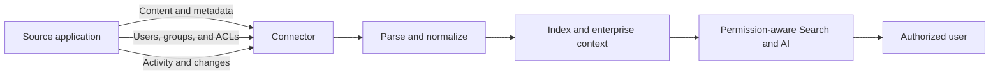

### Plain-English deep-dive: Connector vs content source vs datasource

- **Content source** is the business system where information originates, such as SharePoint or Jira.
- **Connector** is the integration mechanism that reads from or receives data for that source.
- **Datasource** is the configured representation used to organize that source in Glean, especially in custom Indexing API integrations.

**Analogy:** The content source is a warehouse, the connector is the delivery route, and the datasource is the receiving area with rules for labeling and storing deliveries.

**Why it matters:** A customer may say "SharePoint is broken" when the source itself is healthy but the connector credential, crawl scope, permission mapping, or datasource visibility is not.

> **Tie-in to your background:** OneDrive Sync Client support already taught you that successful sign-in does not prove every library, item, permission, or change will synchronize. Connector support uses the same discipline at enterprise scale.

---

## 2. Connector Types and Ownership Boundaries

Glean's public documentation describes several connector approaches. The correct one depends on source capabilities, network reachability, desired depth, and ownership.

| Connector type | How data becomes available | Best fit | Important support boundary |
|---|---|---|---|
| **Native connector** | Glean calls source APIs directly | Supported enterprise applications with suitable APIs | Glean connector plus source configuration; behavior is source-specific |
| **Web history connector** | Browser extension makes visited page titles searchable for that individual | Native crawl is unavailable or unsuitable | Private to the individual; not equivalent to organization-wide indexing |
| **Push API or custom connector** | Customer or integration code sends data through the Indexing API | Custom apps, self-hosted systems, or restricted network/API access | Producer owns completeness of content, identity, ACL, update, and deletion feeds |
| **Partner connector** | Partner-built integration pushes data through the Indexing API | Vendor- or partner-managed integration | Troubleshooting may require customer, partner, and Glean coordination |
| **Live or MCP-backed tool path** | User request invokes a source or tool at query/action time | Fresh records or governed actions | May have separate per-user authentication, limits, and approval controls |

### Native connector strengths

Official Glean docs say native connectors are purpose-built for specific applications and may support source-specific behavior such as attachment crawling, threaded parsing, mentions, people data, activity, and permission maps.

### Web history is not a full connector substitute

Public Glean docs describe web history results as private to the individual user and unavailable to the organization. It can improve personal navigation, but it does not provide the same shared corpus, permission map, or organization-wide source coverage as a native or push integration.

### Push integrations move responsibility

With a push integration, Glean does not independently discover every source change. The producer must send a correct representation of:

- Stable document identities.
- New and updated records.
- Users, groups, and memberships where required.
- Document ACLs.
- Deletions or complete replacement sets.
- Valid source URLs and metadata.

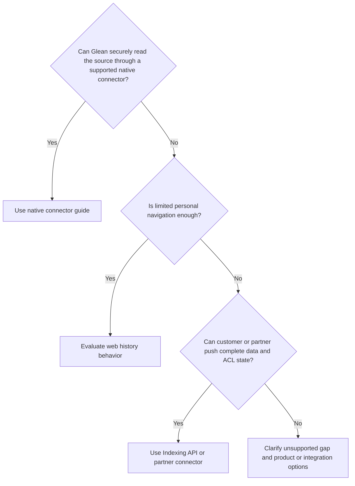

> **Interview point:** Never say "a connector is just an API call." It is an ongoing data, identity, permission, lifecycle, observability, and ownership contract.

---

## 3. The End-to-End Connector Journey

Glean's current public getting-started guide describes a journey of finding the source, reviewing prerequisites, configuring the connector, starting the initial sync, validating results, and moving to steady state.

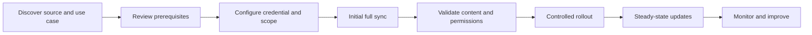

### Stage-by-stage support checklist

| Stage | Questions | Exit evidence |
|---|---|---|
| Discover | What source, objects, users, business use cases, and security boundaries matter? | Scope and success criteria agreed |
| Prerequisites | Which admin role, app registration, scopes, API settings, network path, and source owner are required? | Readiness checklist complete |
| Configure | Which credential, inclusion/exclusion rule, crawl scope, authentication mode, and test group apply? | Configuration saved and credential test succeeds |
| Initial sync | Is content, metadata, identity, and permission processing progressing? | Expected counts and representative objects are processed |
| Validate | Do allowed users see expected items and denied users remain blocked? Are updates and links correct? | Acceptance matrix passes |
| Rollout | Who receives access, support guidance, and alert ownership? | Controlled users can operate safely |
| Steady state | Which webhook, incremental, activity, identity, or full-crawl paths maintain state? | Change and permission freshness meet expectations |
| Monitor | Are health, alerts, counts, change patterns, and customer outcomes reviewed? | Owners and response runbooks are active |

### Configuration is not completion

A connector that saves successfully has passed only one checkpoint. Setup is complete only after:

1. Authentication works.
2. Intended content is in scope.
3. Representative objects are processed.
4. Source links open correctly.
5. Allowed users can retrieve controlled test content.
6. Denied users cannot retrieve restricted test content.
7. Updates and permission changes propagate within documented expectations.
8. Deletion behavior is understood and tested.
9. Monitoring and alert owners are assigned.
10. The customer signs off on acceptance criteria.

---

## 4. Prerequisites and Discovery Questions

Do not begin setup by asking only for a token. First understand the integration contract.

### Business discovery

- Which user problems should this source solve?
- Which departments and test users are in scope?
- Which objects are valuable: files, pages, issues, messages, people, comments, attachments, or records?
- What content must be excluded?
- What freshness is required?
- Which source is authoritative when duplicates exist?
- What success metric will prove value?

### Technical discovery

- Is the source cloud-hosted, self-hosted, or behind a firewall?
- Is there a supported native connector and which version or mode?
- What admin role and source-side configuration are required?
- Which authentication model applies?
- What API scopes are required, and can least privilege be used?
- How are users and groups identified?
- How are nested groups, guests, and inactive users represented?
- What is the estimated corpus size and change rate?
- What API rate limits or maintenance windows apply?
- Are deletions available through API or webhook?
- Does the source support incremental change tracking?
- Who owns source, identity, network, security, and connector changes?

### Security discovery

- What classifications or regulated data may be present?
- Which content must never be indexed?
- How will secrets and credentials be stored and rotated?
- Are IP restrictions or allowlists required?
- What evidence may be shared with support?
- What is the incident path for possible unauthorized visibility?
- How quickly must permission revocation and deletion be reflected?

### Readiness matrix

| Area | Owner | Evidence before setup |
|---|---|---|
| Source administration | Customer source admin | Required role and API configuration confirmed |
| Identity | Customer identity admin | User/group mapping approach and test identities defined |
| Security | Customer security owner | Approved scopes, exclusions, credential storage, incident path |
| Network | Customer network owner | Endpoints, proxy, DNS, firewall, and IP requirements checked |
| Glean administration | Customer Glean admin | Connector permission and test-group access available |
| Support | Assigned support engineer | Runbook, escalation contacts, update cadence, acceptance matrix |

---

## 5. Authentication Models

**Authentication** proves that the connector or user is who it claims to be. **Authorization** determines what it may read or do.

### Common credential patterns

| Pattern | Identity represented | Examples of credential form | Support risks |
|---|---|---|---|
| Admin-authorized application | Central application identity | OAuth app, certificate, service principal | Consent, certificate expiry, tenant mismatch, missing scopes |
| Service account | Dedicated source user | Username/token, API key, personal access token | Disabled account, password rotation, license, insufficient source access |
| Machine-to-machine OAuth | Non-human client | Client ID, secret/certificate, JWT assertion | Secret expiry, audience, scope, clock, key rotation |
| Glean-issued Indexing token | Push producer or datasource management | Bearer token | Wrong API token type, expiry, app scope, IP restriction, leakage |
| Per-user OAuth or token | Individual user's live/private access | Authorization code flow, personal token | User has not connected, revoked consent, wrong account, token expiry |

### Admin authentication vs per-user authentication

Glean's current connector-authentication page states that every native connector uses an admin-level credential. Depending on connector and mode, individual user authentication may be:

- **Required:** The user sees no relevant private content until connecting their account.
- **Optional:** Indexed content works centrally, while user authentication unlocks live, private, or action behavior.
- **Not required:** Admin authentication is sufficient for indexing and permission handling.

The public page currently lists SharePoint and OneDrive as examples where optional individual authentication can enable real-time access scoped to the user's source permissions. Confirm the current deployment and connector-specific guide before relying on this behavior.

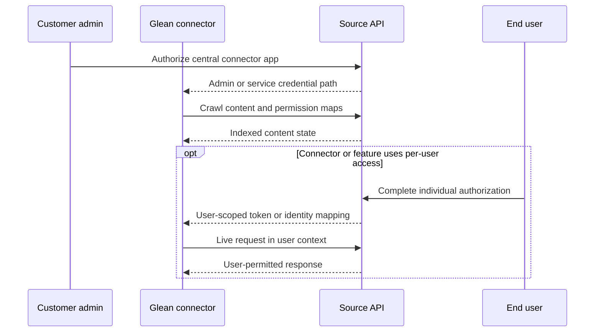

### Plain-English deep-dive: Authentication success does not prove data access

A valid token can still lack the scopes, roles, source visibility, identity mapping, or network path needed for the desired content.

**Analogy:** A valid employee badge proves identity, but it does not open every room in the building.

**Why it matters:** A `200` response from a token test can coexist with missing private sites or incomplete objects. Verify representative data and permissions, not only credential validity.

### Error interpretation

| Symptom | Likely category | First check |
|---|---|---|
| `401 Unauthorized` | Invalid, expired, revoked, or wrong token type | Credential type, expiry, issuer, target endpoint |
| `403 Forbidden` | Authenticated but not authorized | Source role, scopes, app permissions, IP restriction |
| Login/consent loop | OAuth configuration or session | Redirect URI, consent, tenant/account, cookies |
| Some public data only | Per-user auth or restricted-source gap | Connector authentication requirements and user connection |
| Crawl starts but misses private content | Central credential visibility or impersonation | Source-side app/service account access and scopes |
| Worked until a date, then stopped | Expiry or rotation | Certificate, secret, token, account state, recent policy change |

### Indexing API authentication facts

Current Glean developer docs state that the Indexing API uses Glean-issued bearer tokens and does not support OAuth. Publicly documented controls include datasource-specific scope, required expiry, optional IP restrictions, and rotation. Do not put tokens in logs, screenshots, source control, or interview examples.

---

## 6. Scope, Filters, and Source Coverage

**Crawl scope** defines what the connector attempts to collect.

Possible scope dimensions include:

- Site, workspace, project, repository, folder, or channel.
- Object type.
- Date or lifecycle state.
- Include/exclude patterns.
- User or group population.
- Attachments and comments.
- Source-side API visibility.

### Inclusion and exclusion rules

| Rule problem | Result |
|---|---|
| Too narrow | Expected content is never collected |
| Too broad | Unwanted content, cost, noise, and security review burden |
| Overlapping rules | Confusing or duplicate coverage |
| Stale rule | New department/project silently excluded |
| Wrong object-type mapping | Content exists but appears or filters incorrectly |
| Bad URL pattern | Custom documents may not render or associate correctly |

### Custom datasource fields

Glean's public custom-datasource guide describes fields including:

- `name`: Stable unique datasource identifier.
- `displayName`: User-facing source name.
- `datasourceCategory`: Category that affects how results are treated or ranked.
- `urlRegex`: Pattern that should accurately match source document URLs.
- `isUserReferencedByEmail`: Whether permissions refer to users by email or datasource-specific IDs.
- Object definitions and custom properties.

### Stable identity

A custom indexed document needs a stable ID so an update modifies the same logical object rather than creating duplicates.

**Analogy:** A person's home address can change, but a stable employee ID still identifies the same person.

### Schema mapping checklist

| Source concept | Search representation question |
|---|---|
| Record ID | Is it stable across updates? |
| Object type | Does it reflect the business object correctly? |
| Title | Is it meaningful to users? |
| Body | Is searchable text complete and parseable? |
| Source URL | Does it open the correct object and match configured pattern? |
| Created/updated time | Is time zone and meaning correct? |
| Owner/author | Is identity normalized? |
| Custom properties | Are field types and labels consistent? |
| ACL | Are users/groups referenced using the configured identity scheme? |
| Delete state | How is removal communicated? |

---

## 7. Initial Sync and Crawl Types

Glean's public connector docs describe separate crawling and indexing phases during initial setup.

- **Crawling:** Fetch content, metadata, identities, activity, and permissions from the source.
- **Indexing:** Process that data and incorporate searchable and knowledge context.

The initial sync is usually a full content crawl and may take longer because it must cover the configured corpus.

### Officially documented crawl types

| Crawl type | Purpose | Support question |
|---|---|---|
| **Full content crawl** | Reconcile the entire configured corpus | Is coverage complete, including missed deletes or changes? |
| **Incremental content crawl** | Fetch content modified or added since previous progress | Is the change cursor/checkpoint advancing correctly? |
| **Activity crawl** | Track additions, updates, deletions, permissions, or activity changes | Are event/change feeds arriving and processing? |
| **Identity crawl** | Refresh identity-related information | Are users and group mappings current? |
| **People data crawl** | Refresh names, roles, departments, and organization attributes | Is people context complete and current? |

A **checkpoint** or **cursor** is a platform-neutral term for saved progress in a change stream. Glean's public crawl-type page explains incremental behavior but does not expose every internal checkpoint implementation. Use the term conceptually unless a source-specific guide documents it.

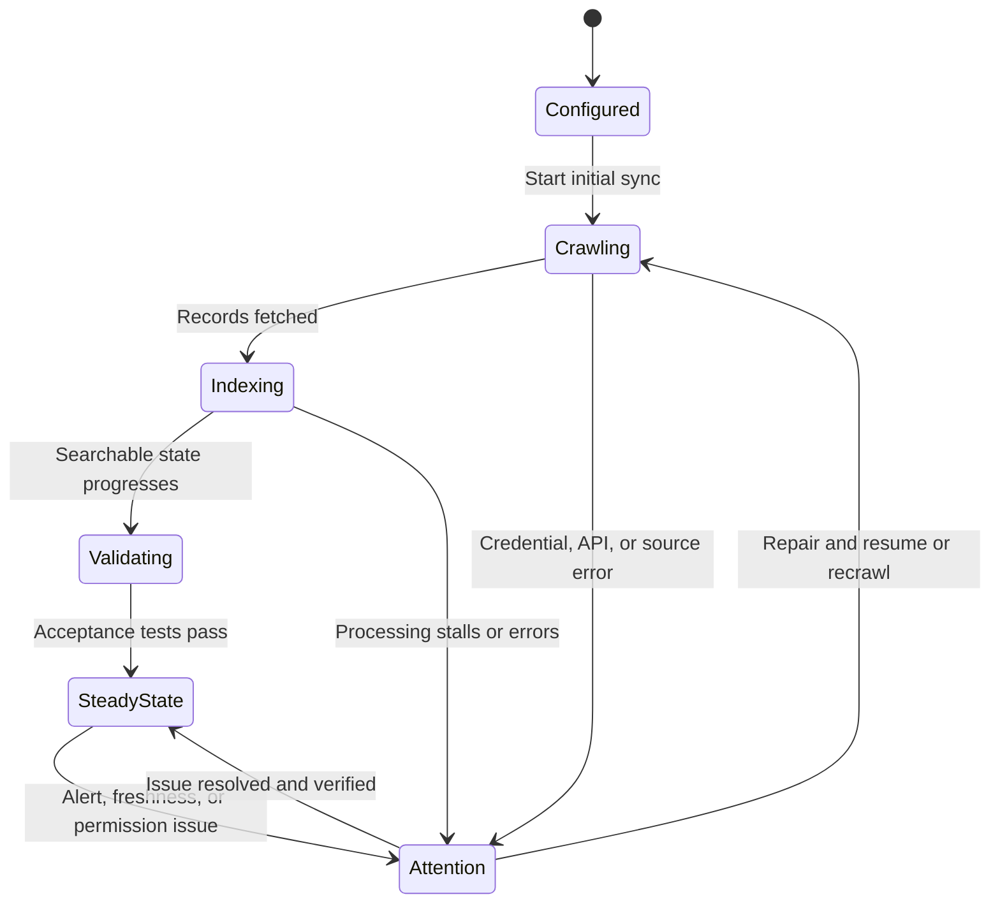

### Initial-sync duration

Duration depends on:

- Corpus size and object complexity.
- Attachments, comments, people, and permissions.
- Source API quotas and throttling.
- Configured call rate and concurrency.
- Network latency and errors.
- Parsing and indexing volume.
- Changes occurring while the initial sync runs.

Glean's public documentation says estimates, where available, are broad planning ranges and vary by connector and corpus. Never promise an exact completion time without deployment-specific evidence.

### Progress questions

- Is item count increasing?
- Is crawl rate nonzero and stable?
- Is indexing progressing after crawling?
- Are errors clustered by object type or permission call?
- Are source API limits constraining throughput?
- Does the processed sample match expected scope?
- Is the remaining duration estimate changing plausibly?

---

## 8. Steady-State Sync, Webhooks, and Eventual Consistency

After initial sync, connectors maintain state through one or more mechanisms.

### Update mechanisms

- Incremental API queries.
- Webhooks or event notifications.
- Activity feeds.
- Periodic full crawls.
- Live query-time source calls.
- Customer push events or incremental batches.

A **webhook** is a source-to-consumer HTTP notification that an event occurred.

A webhook may say, "Object 123 changed," after which the connector fetches the current object. A webhook does not necessarily carry the entire final record.

### Eventual consistency

**Eventual consistency** means different system components may briefly show different states, but should converge within an expected interval.

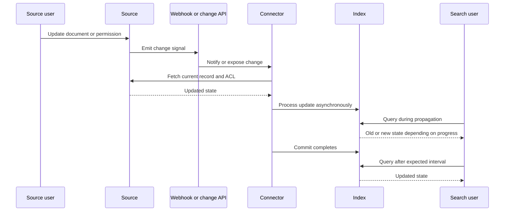

### Plain-English deep-dive: Freshness is a chain of delays

Freshness lag can be decomposed as:

$$
T_{visible}-T_{source}=T_{detect}+T_{fetch}+T_{process}+T_{index}+T_{query}
$$

- `detect`: Time until a webhook, poll, or crawl notices the change.
- `fetch`: Time to retrieve the changed object and permissions.
- `process`: Time to parse and normalize it.
- `index`: Time to update searchable state.
- `query`: Time until the user's request reads the new state.

**Analogy:** Package delivery time is pickup wait + transport + sorting + local delivery, not one indivisible delay.

**Why it matters:** "The connector is slow" is not actionable. Identify which interval exceeds expectation.

### Freshness test

1. Choose a harmless controlled document.
2. Record source modification time in UTC.
3. Make a distinctive title/body change.
4. Observe source-side event or API state where available.
5. Record connector detection and processing evidence.
6. Search using an allowed test user.
7. Record visibility time and calculate lag.
8. Repeat enough times to distinguish an outlier from a pattern.

---

## 9. Rate Limits, Backoff, Retries, and Idempotency

Source and indexing APIs protect themselves with quotas and rate limits.

### Rate-limit terms

- **Quota:** Allowed usage over a larger period.
- **Rate limit:** Maximum request frequency over a short interval.
- **Concurrency limit:** Maximum simultaneous requests.
- **Throttling:** API intentionally slows or rejects excess traffic.
- **`429 Too Many Requests`:** Common HTTP response for rate limiting.
- **`Retry-After`:** Header that may tell the client when to retry.

### Exponential backoff

A common conceptual retry delay is:

$$
\operatorname{delay}=\min(\operatorname{cap},\operatorname{base}\times2^{\operatorname{attempt}})+\operatorname{jitter}
$$

**Jitter** adds randomness so many workers do not retry at the same instant.

Glean's public crawl docs describe configurable API call rates, concurrency, and dynamic exponential backoff for supported deployments. Specific values require current deployment documentation or Glean Support.

### Retry decision table

| Response or failure | Retry? | Correct response |
|---|---|---|
| `400 Bad Request` | Usually no | Fix payload, field, schema, or datasource configuration |
| `401 Unauthorized` | No blind retry | Repair or rotate credential; verify token type and expiry |
| `403 Forbidden` | No blind retry | Fix scopes, source permission, role, IP restriction, or policy |
| `404 Not Found` | Context-dependent | Verify endpoint/object; handle legitimate source deletion |
| `409 Conflict` | Context-dependent | Understand object/version/idempotency semantics |
| `413 Too Large` | No identical retry | Reduce or split payload according to supported API behavior |
| `429 Too Many Requests` | Yes, controlled | Honor `Retry-After`, back off, reduce rate/concurrency |
| `5xx` | Often controlled retry | Back off, cap attempts, preserve correlation evidence |
| Timeout or reset | Controlled if operation is safe | Determine whether server may have committed before retrying |

### Idempotency

An operation is **idempotent** if repeating it produces the same intended final state rather than duplicates or repeated side effects.

Stable custom-document IDs help updates target the same object. But do not assume every endpoint or action is idempotent; check its contract.

**Analogy:** Pressing an elevator button twice should not summon two elevators. Sending a payment twice is very different.

### Retry storm risk

Unbounded retry can make an outage worse. A resilient producer needs:

- Bounded retries.
- Exponential backoff with jitter.
- A dead-letter or failed-item path.
- Per-item error evidence.
- Alerting after retry exhaustion.
- Safe replay after correction.
- Throughput controls aligned to source limits.

---

## 10. Content Processing and Schema Mapping

A connector can fetch an object successfully but still produce poor searchable content.

### Processing stages

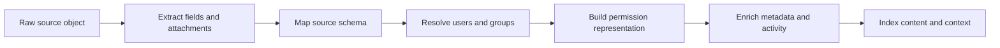

### Processing failure patterns

| Pattern | Symptom | Evidence |
|---|---|---|
| Parser failure | Item count exists but no useful text/snippet | File type, parse status, extracted body |
| Field mapping error | Wrong title, type, owner, or filter | Raw object vs mapped record |
| Identity resolution failure | Missing owner or permission mismatch | Source user ID, email, datasource identity config |
| ACL mapping failure | False deny or potential false allow | Source ACL, indexed user/group/membership state |
| Duplicate stable ID failure | Repeated results after updates | IDs, URLs, source versions |
| Overly broad URL regex | Items associate with wrong datasource | Config and actual view URLs |
| Too-narrow URL regex | Valid objects cannot render or associate | Failed URL match examples |
| Unsupported attachment | Parent appears but attachment content does not | Type, size, parser support |
| Oversized record | API or processing rejection | Payload size and documented limits |

### Diagnose with one controlled object

Before studying millions of records, choose one object whose:

- Source body is known.
- ID and URL are stable.
- Metadata is distinctive.
- Allowed and denied users are controlled.
- Update and delete operations are safe.

A single controlled object can discriminate configuration, identity, ACL, processing, freshness, and deletion hypotheses cheaply.

---

## 11. Permissions and ACL Propagation

A connector must represent both content and who may access it.

### Identity and ACL components

- **User:** Individual principal.
- **Group:** Named collection of users or other groups.
- **Membership:** Relationship between a user/group and a group.
- **ACL:** Allowed or denied principals for an object.
- **Nested group:** Group containing another group.
- **Source-of-truth identity:** Canonical source used to map accounts.
- **Inactive user:** Identity that should no longer receive access.

### Native connector permission path

Glean's public connector docs say native connectors fetch source permission maps so search results follow source access.

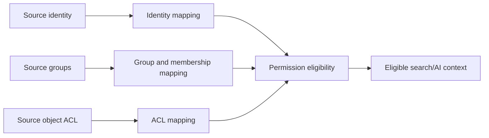

### Custom Indexing API permission order

Glean's public custom-permissions tutorial describes this conceptual dependency:

1. Configure how users are referenced, such as email or datasource user ID.
2. Index users before referencing them.
3. Index groups before using them.
4. Index memberships.
5. Attach allowed users or groups to documents.
6. Allow asynchronous permission processing time.
7. Verify access with controlled users or the documented access-check tooling.

### Permission modes in public custom-index docs

| Mode | Meaning | Risk to examine |
|---|---|---|
| `allowAnonymousAccess` | Any Glean user in the organization may search the document | Do not use for restricted content |
| `allowedUsers` | Explicit listed users receive access | User identity must be indexed and referenced correctly |
| `allowAllDatasourceUsersAccess` | All indexed users of that datasource receive access | Datasource user population must be intentionally defined |
| `allowedGroups` | Members of listed groups receive access | Group and membership state must be complete and current |

### Test-group visibility does not override document ACLs

Glean's public custom-index guide states that enabling datasource results for all teammates or a test group does not override the permissions configured on each document.

Think of these as two gates:

1. Is the datasource enabled for this rollout population?
2. Is the user allowed to see this specific document?

Both must pass.

### ACL propagation test matrix

| Event | Allowed user expectation | Denied user expectation | Evidence |
|---|---|---|---|
| New restricted document | Appears after processing | Never appears | Source ACL, indexed ACL, search test |
| Add user to allowed group | Appears after membership/ACL propagation | N/A | Group membership and timing |
| Remove user from group | Disappears after expected propagation | Remains absent | Revocation timing and access check |
| Change document from broad to restricted | Retained only for allowed users | Removed for others | Before/after source and search evidence |
| Disable user | Access removed according to identity path | N/A | Identity status and group state |

### Plain-English deep-dive: Permission freshness is more urgent than content freshness

A stale title is inconvenient. A stale revocation may expose sensitive information.

**Analogy:** A delayed library catalog update is annoying; a delayed badge revocation after an employee leaves is a security risk.

For permission changes, always test both directions and prioritize possible false allow above missing access.

### Permission failure patterns

| Symptom | Hypotheses |
|---|---|
| All users miss private content | Central credential scope, private-content support, or required per-user authentication |
| One user misses all source content | User authentication, identity mapping, account mismatch, or source entitlement |
| User sees public but not private items | Per-user auth or private ACL/group mapping |
| Group members inconsistently see content | Membership freshness, nested groups, alias mapping, inactive state |
| Revoked content remains visible | Missed permission event, processing lag, stale snapshot, live-cache path |
| Unauthorized content appears | Potential security incident: incorrect source ACL, identity collision, broad anonymous/datasource access, mapping defect |

---

## 12. Full Refresh vs Incremental Push for Custom Sources

Current Glean developer docs distinguish two custom indexing patterns:

- `/indexdocuments`: Add or update selected documents while keeping other indexed documents.
- `/bulkindexdocuments`: Full datasource replacement across a coordinated upload; documents omitted from the successful replacement are deleted asynchronously.

### Decision table

| Need | Pattern | Main safeguard |
|---|---|---|
| Add newly created records | Incremental indexing | Stable IDs and retry-safe writes |
| Update a subset | Incremental indexing | Correct update timestamps and ACLs |
| Rebuild entire corpus from source of truth | Full bulk replacement | Complete upload, paging state, validation before finalization |
| Remove objects absent from current source snapshot | Full replacement can reconcile omissions | Ensure snapshot is truly complete |
| High-volume ongoing changes | Batched incremental path | Rate limits, checkpoints, failed-item replay |

### Full replacement danger

A partial dataset sent as if it were complete can remove valid documents asynchronously.

Before a full replacement:

- Confirm the source snapshot is complete.
- Record expected document/user/group counts.
- Use a unique coordinated upload ID as documented.
- Validate all pages were accepted.
- Confirm finalization succeeded.
- Compare post-upload counts and controlled documents.
- Be prepared with rollback or re-upload procedure.

### Producer state model

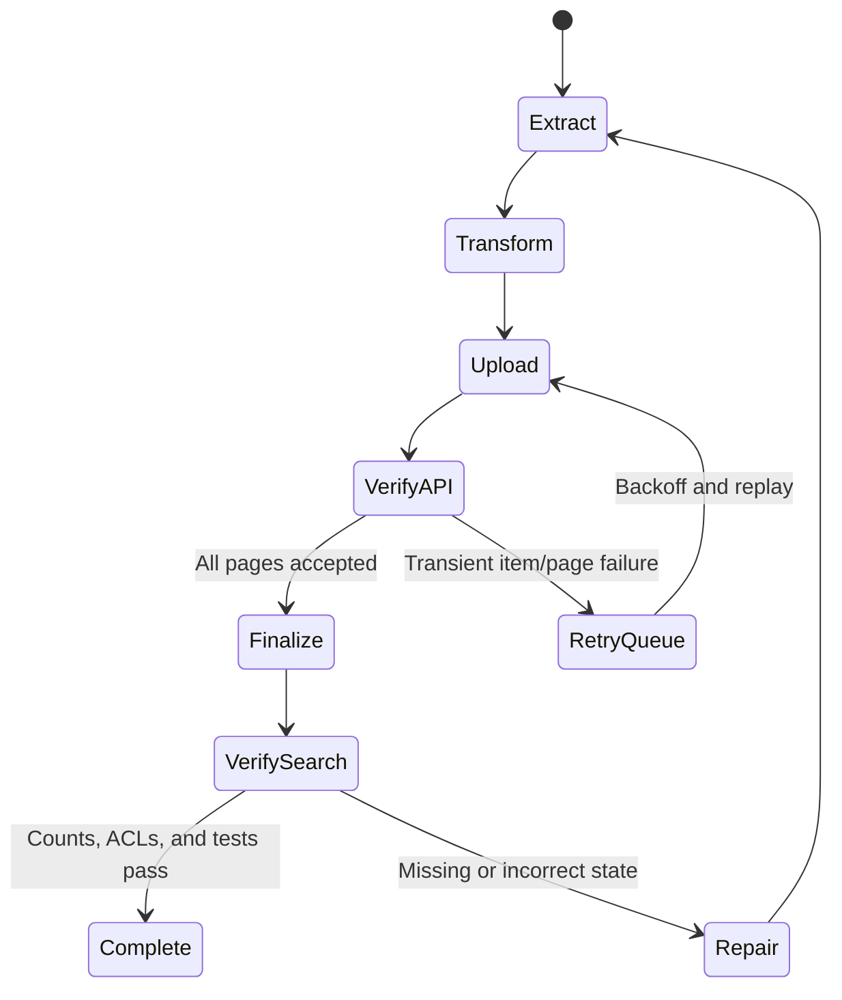

---

## 13. Deletions, Revocations, and Stale Content

Deletion is part of synchronization, not an optional cleanup task.

Glean's public deletion documentation describes two broad mechanisms:

1. **API or webhook deletion:** Source sends or exposes deletion, which can be processed relatively quickly.
2. **Full-crawl cleanup:** A later full reconciliation detects items no longer present when source notifications are unavailable or missed.

### Deletion lifecycle

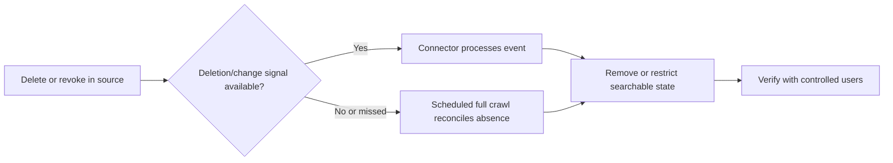

### Delete vs hide vs revoke

| Operation | Meaning | Support use |
|---|---|---|
| Delete at source | Original object no longer exists | Normal lifecycle removal |
| Revoke access | Object remains but user/group loses permission | Security-sensitive permission update |
| Hide in search | Temporarily suppress result without changing source object | Urgent containment or content-quality control, subject to approved procedure |
| Remove connector | Stop and remove a whole integration | Major administrative action requiring impact planning |

### Stale deletion investigation

Collect:

- Source URL/ID and deletion time in UTC.
- Whether item is deleted, moved, archived, or permission-restricted.
- Connector and access mode.
- Expected webhook/API behavior.
- Last successful incremental/activity/full crawl.
- Whether exact search still returns the item.
- Affected users and sensitivity.
- Available connector/admin evidence.

For sensitive deleted content still visible, Glean's public docs advise contacting Glean Support; they also describe content hiding as a temporary option for administrators. Follow the current approved procedure and preserve evidence.

### Tombstones

A **tombstone** is a generic distributed-systems record saying an object was deleted. It lets downstream systems remove the object even though the source object is gone.

Do not claim every Glean connector exposes tombstones. Use the term as a general integration concept.

---

## 14. Monitoring and Health Signals

Glean's public docs describe connector health through Admin console status, synced-item metrics, crawl rate, change rate, notifications, and email alerts.

### Health signals

| Signal | What it can tell you | What it cannot prove alone |
|---|---|---|
| Status | Current crawl/index/attention state | Complete data and ACL correctness |
| Items synced | Progress or broad corpus size | Every expected item is present |
| Crawl rate | Work is being processed | Results are fresh, correct, or permission-safe |
| Change rate | Source changes are being observed over time | Every change is valid or fully indexed |
| Error/alert | Known failure requiring attention | Entire blast radius without investigation |
| Search acceptance test | User-visible content path works | Overall corpus completeness |
| Access verification | Specific user/document permission outcome | All user/group combinations are correct |

### Important monitoring lesson

A high crawl rate can coexist with:

- Wrong scope.
- Repeated retries.
- Missing private content.
- Parser failures.
- Stale permissions.
- Incorrect schema mapping.

Throughput is not correctness.

### Publicly documented investigation triggers

Current Glean health docs recommend investigating patterns such as:

- Sync status stalls.
- Connector remains in indexing without progress.
- Items synced stops growing unexpectedly during initial sync.
- Change rate is zero when source activity is expected.
- Credential or connector-failure alert arrives.
- Specific content is missing despite an apparently healthy connector.
- Insufficient-permissions errors occur.

### Alert ownership

| Alert type | Customer owner | Support action |
|---|---|---|
| Expired credential | Source/Glean admin | Restore credential safely, assess freshness and permission gap, verify recovery |
| Invalid domain or endpoint | Network/source admin | Confirm configuration, DNS, TLS, proxy, and source reachability |
| Failed plugin/app installation | Source admin | Repair source-side application setup and permissions |
| Stalled crawl | Glean admin plus support | Compare progress, errors, API rate, volume, and recent changes |
| Permission-related failure | Identity/security/source admin | Treat access integrity as priority; verify positive and negative cases |
| Missing specific content | Source owner plus support | Use scope-to-query isolation flow |

Glean's public health page says connector failure alerts are repeated daily until resolved and highlights stale credentials as a possible stale-permission risk. Confirm current alert behavior for the customer's deployment.

---

## 15. Layered Troubleshooting

Use a layered flow instead of restarting the connector immediately.

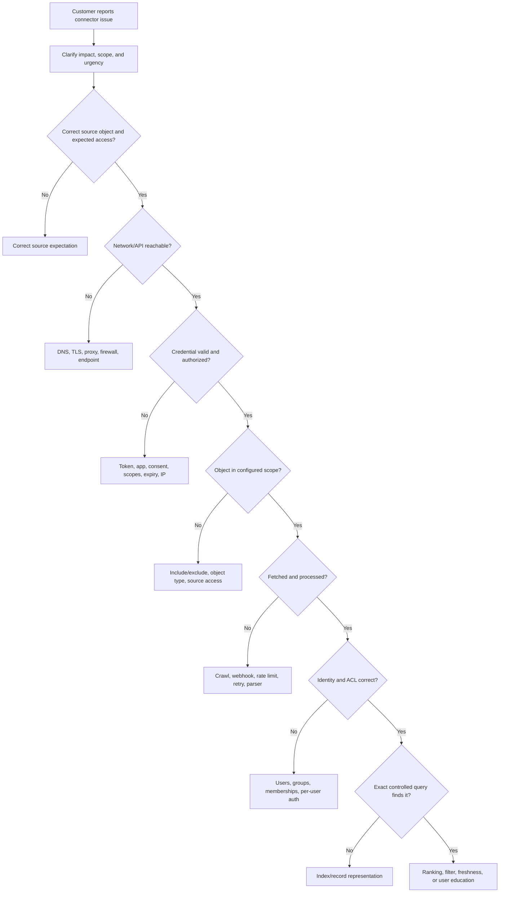

### Failure matrix

| Symptom | Most discriminating first comparison |
|---|---|
| Entire connector never starts | Read-only credential/config test and source reachability |
| Crawl starts then fails repeatedly | Error category and source/API response distribution |
| Initial sync is slow | Items synced and crawl rate trend vs source quota/volume |
| Only one site/project missing | Scope and central credential access to that exact container |
| Only attachments missing | Supported attachment types, size, parser path |
| New items missing, old items present | Incremental/webhook/checkpoint path |
| Updates missing but new items appear | Update detection, stable ID, timestamp, processing |
| Deleted items persist | Delete event path vs next full reconciliation |
| All private items missing | Central credential scope or required per-user auth |
| One user misses source | User auth, account mapping, group membership, source license/access |
| Unauthorized item appears | Security escalation, exact ACL/identity evidence, containment |
| Connector healthy but query poor | Content representation, filters, ranking, corpus quality |

### Do not begin with these actions

- Delete and recreate the connector without preserving evidence.
- Expand source permissions broadly to "test."
- Grant administrator roles permanently.
- Rotate credentials before recording the failing credential metadata and error.
- Trigger repeated full crawls without understanding rate and load impact.
- Share raw tokens, cookies, private documents, or unredacted logs.
- Tell the customer to wait without a documented freshness expectation or next check.

---

## 16. Incident Priority and Customer Communication Templates

### Severity signals

| Situation | Priority implication |
|---|---|
| Possible unauthorized content visibility | Security escalation and urgent containment |
| Permission revocations not reflected | High urgency proportional to data sensitivity and scope |
| All users lose a critical source | Broad customer impact; coordinate restoration and updates |
| Initial sync delayed before pilot | Project risk; manage timeline and root cause |
| One low-impact item is stale | Normal investigation unless business context raises impact |
| Low relevance without missing access | Quality issue; gather judged examples and trend data |

### First-response template

```text
Impact understood:
Affected source, users, and use case:
Current facts:
Security implication, if any:
Evidence requested or already collected:
Immediate mitigation or containment:
Glean/customer/partner action owners:
Next diagnostic milestone:
Next customer update time:
```

### Status update template

```text
Status: Investigating / Mitigated / Monitoring / Resolved
Impact: [who and what remains affected]
What changed since last update: [facts only]
Current hypothesis: [clearly labeled, not presented as fact]
Evidence: [sanitized observations]
Actions in progress: [owner and target]
Customer action needed: [specific request]
Risk or limitation: [including freshness/security]
Next update: [time and trigger]
```

### Resolution criteria

A connector issue is not resolved merely because status turns green.

Verify:

- Representative content is retrievable.
- Updates propagate within expected timing.
- Positive and negative permission tests pass.
- Deleted/revoked content behaves correctly.
- Errors and alerts clear as expected.
- Customer confirms the blocked use case works.
- Root cause and prevention actions are documented.

---

## 17. Custom Indexing API Support Model

### Conceptual request path

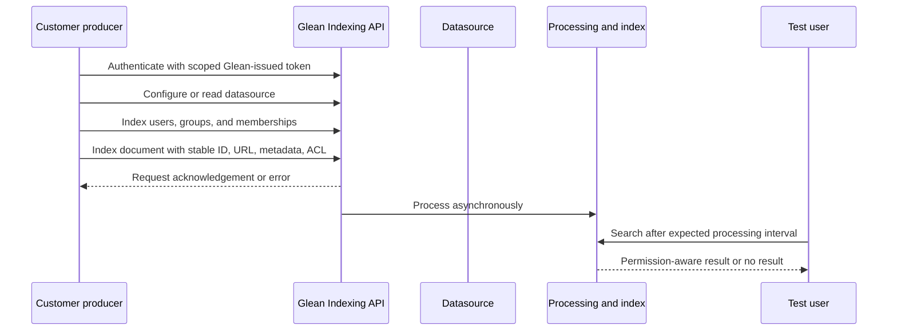

### Request-success trap

An accepted API request does not necessarily prove:

- Asynchronous processing completed.
- Datasource is enabled for the intended rollout group.
- Document ACL resolves correctly.
- URL matches datasource configuration.
- User can search the item.
- Metadata or body was mapped as intended.

### Debug order for a custom document

1. Confirm Indexing API token type, scope, expiry, and IP restrictions.
2. Read datasource config through the documented read-only endpoint.
3. Validate datasource name, category, URL regex, object type, and identity mode.
4. Send a minimal controlled document.
5. Confirm request response and preserve sanitized IDs/correlation evidence.
6. Allow documented asynchronous processing time.
7. Confirm datasource is enabled for test users.
8. Check positive and negative document access.
9. Search exact title as the allowed test user.
10. Add metadata complexity incrementally.

### Authentication and HTTP errors

| Error | Likely cause | Correct next step |
|---|---|---|
| `401` | Invalid/expired token or wrong API token type | Verify token securely; do not log it |
| `403` | App scope or IP restriction | Inspect token scope and request origin |
| `400 invalid datasource` | Datasource absent or wrong identifier | Read config or create correct datasource |
| `413` | Request too large | Use supported sizing/bulk strategy |
| `429` | Rate limit | Honor backoff and reduce throughput |
| `5xx` | Service/transient failure | Controlled retry and status/escalation evidence |

---

## 18. Verification Runbook

### Test dataset

Create controlled items that make failures obvious:

| Test item | Content | ACL | Purpose |
|---|---|---|---|
| `PUBLIC-CONTROL-001` | Distinctive title and body | Broad test population | Basic content path |
| `GROUP-A-SECRET-001` | Harmless restricted phrase | Group A only | Positive and negative ACL |
| `UPDATE-CONTROL-001` | Version marker `v1` | Test group | Freshness and stable update |
| `DELETE-CONTROL-001` | Disposable content | Test group | Deletion behavior |
| `METADATA-CONTROL-001` | Known owner/type/status | Test group | Schema and filters |

### Acceptance matrix

| Test | Expected | Actual | Evidence | Result |
|---|---|---|---|---|
| Exact-title search as allowed user | Item appears |  |  |  |
| Exact-title search as denied user | Item absent |  |  |  |
| Source link | Opens correct object |  |  |  |
| Metadata/filter | Correct owner/type/status |  |  |  |
| Content update | New marker visible within expected interval |  |  |  |
| Add permission | Newly allowed user gains access |  |  |  |
| Revoke permission | Removed user loses access |  |  |  |
| Delete | Item disappears through documented path |  |  |  |
| Alert test, if approved | Correct owner receives signal |  |  |  |

### Rollback questions

- Can the datasource remain test-group-only?
- Can a bad inclusion rule be reverted?
- Can a credential be disabled or rotated?
- Can custom content be re-uploaded from source of truth?
- Can specific sensitive content be hidden through approved controls?
- Who has authority to stop a crawl or remove a connector?
- What evidence must be preserved before rollback?

---

## 19. Hands-On Paper Lab: The Missing Finance Policy

### Scenario

A customer configures a new SaaS content source. The Admin console reports a healthy connector and 100,000 synced items. Most public documents are searchable. The Finance team cannot find a restricted policy, and one Finance user has not completed optional individual source authentication. The policy was updated two hours ago. A former Finance contractor was removed from the source group yesterday.

### Your tasks

1. Separate the three issues that may be present.
2. Identify the highest-risk question.
3. List the customer owners needed.
4. Define one allowed and one denied control user.
5. Determine whether per-user authentication is relevant to this connector/mode rather than assuming it.
6. Build a source-to-query evidence timeline for the updated policy.
7. Verify whether the former contractor can still retrieve the item.
8. Decide whether connector health and item count prove permission correctness.
9. Draft a first customer update.
10. Define resolution criteria and prevention actions.

### Expected reasoning

- Missing policy may be scope, source credential visibility, per-user authentication, crawl freshness, processing, or ACL mapping.
- Former-contractor access is the highest-risk check because stale revocation could be a security issue.
- A green connector and large item count do not prove complete private-content coverage or safe permission freshness.
- Optional per-user authentication matters only if current connector documentation and configured mode use it for the relevant content path.
- The update and access-removal events need separate timelines because content freshness and permission freshness may follow different signals.
- Customer communication should distinguish confirmed facts from hypotheses and include an urgent security check.

---

## 20. Interview Whiteboard Answer

Draw this pipeline:

```text
Source content + identities + ACLs
            |
Credential -> scope -> crawl/push -> parse/map -> index
            |                                  |
      webhooks/incremental              permission-aware query
            |
     monitoring, retries, deletes, full reconciliation
```

Then say:

> "I validate a connector as an ongoing state-replication system, not a one-time configuration. I begin with business scope and source prerequisites, verify the credential and least-privilege access, monitor initial crawl and processing, then test content, metadata, freshness, and both allowed and denied users. In steady state I watch updates, identities, permissions, rate limits, retries, alerts, and deletion reconciliation. When something fails, I isolate source, network, authentication, scope, sync, processing, ACL, or query rather than restarting blindly."

### Microsoft 365 bridge

> "My SharePoint Online and OneDrive background transfers strongly because I already troubleshoot content scope, app permissions, user identity, group membership, sync state, freshness, and client-versus-service behavior. As an sync-client subject-matter expert, I learned to compare known-good and affected objects and users rather than treating sync as one binary status. For Glean, I would apply that discipline while learning each connector's specific Admin console signals and source API behavior."

---

## ⭐ Likely Interview Questions for This Section

### Q1. "Walk me through setting up and verifying a new content source."

> **Model answer:** "I start with the business use case, objects, users, security boundaries, freshness target, and measurable success. Then I confirm the supported connector and current prerequisites: admin roles, credential model, scopes, source settings, network path, and owners. I configure least-privilege access and controlled scope, run the initial sync, and monitor crawl and indexing progress. Before rollout I test representative content, source links, metadata, updates, deletion, and both allowed and denied users. Finally I assign health-alert ownership, document rollback and escalation paths, and obtain customer acceptance."

### Q2. "What is the difference between full, incremental, activity, and identity crawls?"

> **Model answer:** "A full crawl reconciles the configured corpus comprehensively. An incremental crawl focuses on content added or modified since prior progress. An activity crawl tracks change events such as updates, deletions, permissions, or activity. An identity crawl refreshes user and identity data. They serve different consistency needs, so a healthy content crawl does not automatically prove group membership or permission freshness."

### Q3. "Why might a connector authenticate successfully but miss private content?"

> **Model answer:** "Authentication proves the credential is valid, not that it has every required source scope or user context. The central app or service account may lack access to the private container, the connector may require or optionally use individual user authentication for that path, identity mapping may be incomplete, or scope filters may exclude it. I verify a representative private object and the exact current connector documentation rather than treating token success as coverage proof."

### Q4. "How do you troubleshoot stale content?"

> **Model answer:** "I record the source update time and decompose lag into detection, fetch, processing, indexing, and query visibility. I determine whether the connector relies on webhook, incremental polling, full crawl, live access, or a hybrid path. I check progress and errors, API throttling, stable object identity, and a known-good changed object. I compare actual lag with the documented expectation and verify the corrected content as an allowed user."

### Q5. "How do you troubleshoot a permission mismatch?"

> **Model answer:** "I treat content presence, identity mapping, group membership, document ACL, and user visibility as separate states. I capture source permissions and exact user identity, compare an allowed and denied user, verify whether per-user authentication applies, and check permission propagation timing. A false deny is a usability problem; a possible false allow is a security escalation requiring evidence preservation, containment, and urgent coordination."

### Q6. "How should an integration handle API rate limits and transient errors?"

> **Model answer:** "It should respect server guidance such as `Retry-After`, use bounded exponential backoff with jitter, limit concurrency, and make replay safe through stable identities or documented idempotency. It should not retry invalid requests or authorization failures blindly. After exhaustion, failed work needs durable evidence, alerting, and a controlled replay path."

### Q7. "What is the difference between incremental and full bulk custom indexing?"

> **Model answer:** "Incremental indexing adds or updates selected records while retaining the rest of the datasource. Full bulk indexing represents a complete replacement; records omitted from the successful replacement can be deleted asynchronously. I would use stable IDs for both and apply stricter completeness, page-finalization, count, ACL, and rollback checks before treating a bulk replacement as authoritative."

### Q8. "The connector is green, but a customer says it is broken. What do you do?"

> **Model answer:** "Green status is one signal, not proof of complete and correct customer value. I clarify the exact source, object, user, time, query, and expected access. I verify source state and scope, credential visibility, crawl/processing evidence, identity and ACL, and exact-title retrieval. I compare affected and known-good controls. This identifies whether the issue is coverage, freshness, permissions, processing, ranking, or user configuration even when aggregate health appears normal."

---

## 🧠 30-Second Memory Hooks

- **Connector:** Ongoing content + identity + ACL + change contract, not one API call.
- **Three nouns:** Source is origin, connector is route, datasource is configured receiving area.
- **Journey:** Discover -> prepare -> configure -> initial sync -> validate -> rollout -> steady state -> monitor.
- **Credential:** Valid badge does not open every room.
- **Scope:** Too narrow misses value; too broad adds noise and risk.
- **Crawls:** Full reconciles, incremental updates, activity tracks changes, identity refreshes users.
- **Freshness:** Detect + fetch + process + index + query.
- **Retry:** Back off transient failures; repair permanent failures.
- **Idempotency:** Repeating safely should converge, not duplicate.
- **ACL order:** Users -> groups -> memberships -> document permissions -> access test.
- **Two gates:** Datasource rollout visibility and document ACL must both allow access.
- **Delete:** Event path for speed, full reconciliation for missed events.
- **Green is not proof:** Throughput and status do not prove scope, ACL, or content correctness.
- **Security priority:** Stale revocation or false allow outranks a stale title.
- **Your bridge:** OneDrive sync and M365 permissions already trained the same layered diagnosis.

---

## Completion Checklist

- [ ] I can explain native, web history, push, partner, indexed, live, and hybrid paths.
- [ ] I can build a prerequisite and owner matrix before setup.
- [ ] I can distinguish admin authentication, per-user authentication, and authorization.
- [ ] I can explain scope, schema mapping, stable IDs, and URL patterns.
- [ ] I can distinguish full, incremental, activity, identity, and people-data crawls.
- [ ] I can decompose and measure freshness lag.
- [ ] I can explain bounded backoff, jitter, rate limits, and idempotency.
- [ ] I can test users, groups, memberships, positive access, and negative access.
- [ ] I can distinguish incremental custom indexing from full replacement.
- [ ] I can explain API/webhook deletion and full-crawl reconciliation.
- [ ] I can interpret status, items synced, crawl rate, change rate, and alerts without overtrusting one metric.
- [ ] I can use the layered troubleshooting flow and customer-update templates.
- [ ] I completed the Finance policy lab aloud.
- [ ] I can connect product sync and Microsoft 365 permission experience to Glean honestly.

---

## Official Source Anchors

These links ground the Glean-specific public behavior in this Part. Recheck source-specific documentation before an interview or customer action.

- [Get started with Glean connectors](https://docs.glean.com/connectors/getting-started)
- [About Glean connectors](https://docs.glean.com/connectors/about)
- [Glean crawl strategy](https://docs.glean.com/connectors/crawling-frequency)
- [Glean crawl types](https://docs.glean.com/connectors/crawling-types)
- [Glean crawling FAQ](https://docs.glean.com/connectors/crawling-faq)
- [Glean deletion handling](https://docs.glean.com/connectors/crawling-deletion)
- [Manage Glean connectors](https://docs.glean.com/connectors/monitoring)
- [Connector health and alerts](https://docs.glean.com/connectors/connectors-health-index)
- [Connector authentication requirements](https://docs.glean.com/connectors/connector-auth-requirements)
- [Set up a custom datasource](https://developers.glean.com/api-info/indexing/getting-started/setup-datasource)
- [Index custom documents](https://developers.glean.com/api-info/indexing/getting-started/index-documents)
- [Custom document permissions](https://developers.glean.com/api-info/indexing/documents/permissions)
- [Custom bulk indexing](https://developers.glean.com/api-info/indexing/documents/bulk-indexing)
- [Indexing API authentication](https://developers.glean.com/api-info/indexing/authentication/overview)
- [Datasource configuration debugging](https://developers.glean.com/api-info/indexing/debugging/datasource-config)

---

*Next suggested section: [Part 5 - Scientific Troubleshooting, Triage, and Root-Cause Analysis](Part-05-troubleshooting-triage-and-rca.md). It generalizes the connector investigation method into a reusable hypothesis-test-verify framework for any ambiguous customer issue.*
