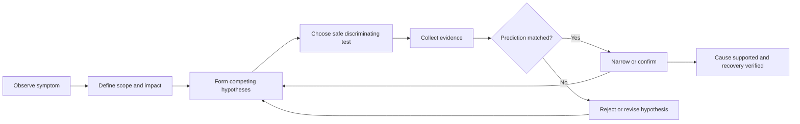
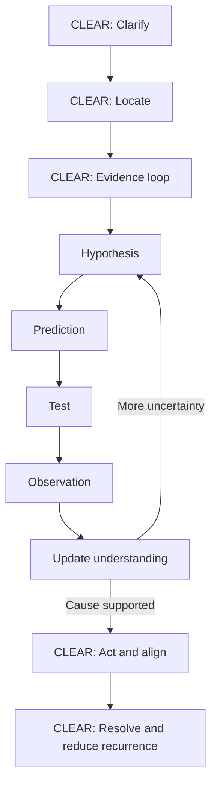
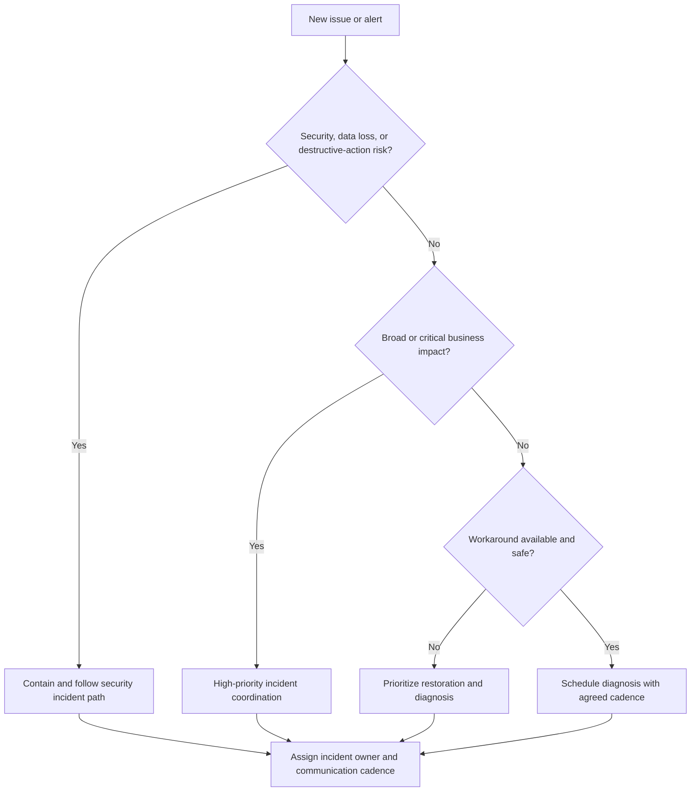
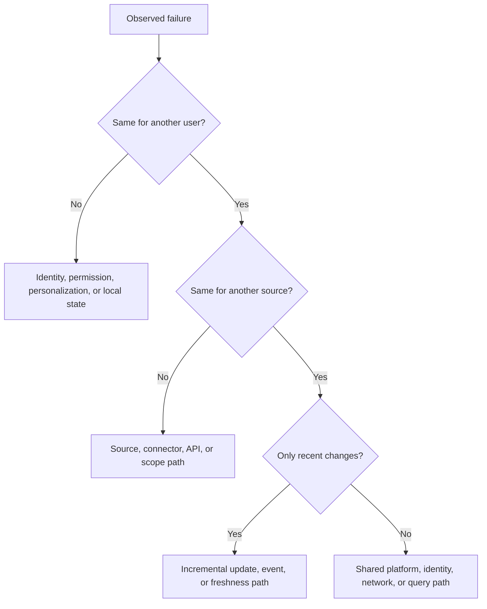
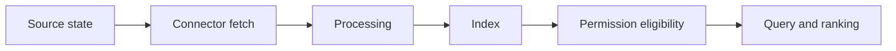
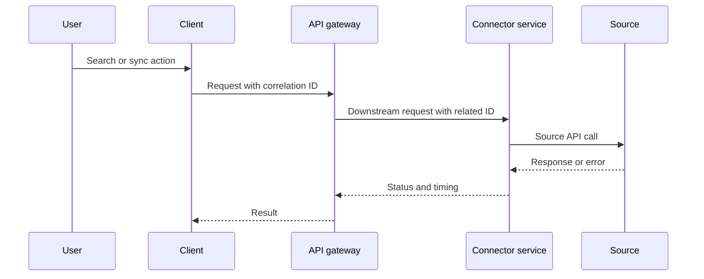
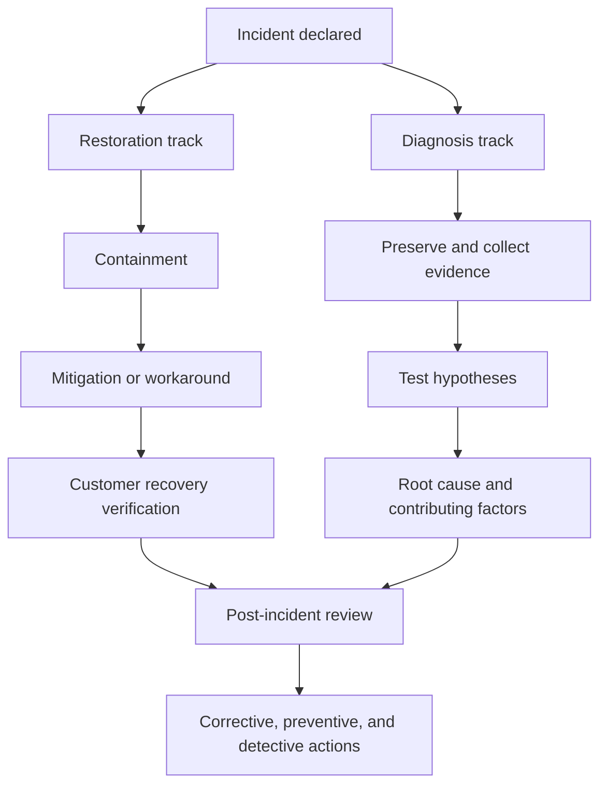
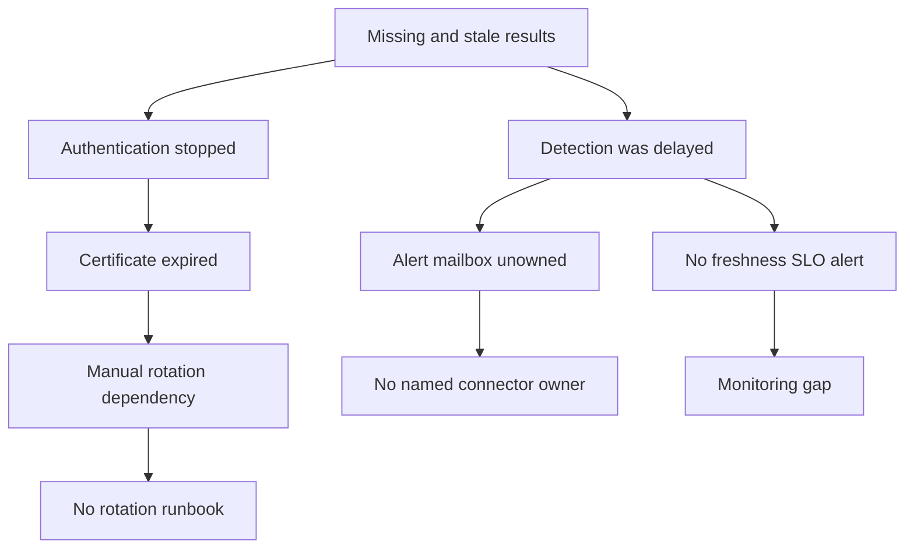
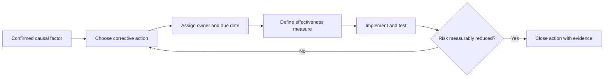
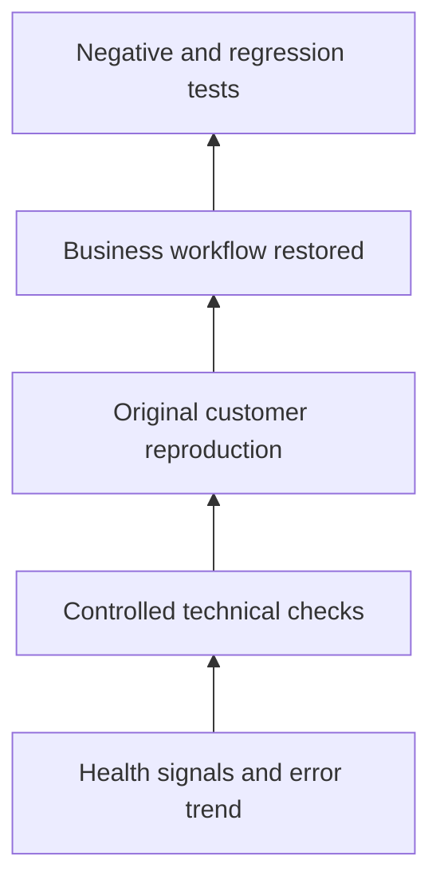

# Part 5 - Scientific Troubleshooting, Triage, and Root-Cause Analysis

> **Section goal:** Turn ambiguous customer symptoms into a safe, evidence-driven investigation that restores service, isolates cause, verifies recovery, and prevents recurrence. Learn to narrate that reasoning clearly during technical and customer interviews.
>
> **Covers index item:** Part 5. **Maps to JD responsibilities:** first response, technical troubleshooting, resolution and follow-through, root-cause isolation, alert handling, remediation planning, detailed documentation, customer communication, and product/process improvement.

---

## JD Mapping

| Job responsibility | How this Part prepares you |
|---|---|
| Provide first response | Establish impact, scope, severity, safety, ownership, and next update before deep diagnosis |
| Troubleshoot and isolate root cause | Form falsifiable hypotheses and select discriminating tests |
| Resolve and follow through | Separate containment, mitigation, workaround, repair, recovery, and prevention |
| Identify system and user health issues | Compare affected and unaffected dimensions systematically |
| Handle customer-impacting alerts | Prioritize by impact and risk instead of alert noise alone |
| Coordinate customer and internal teams | Maintain one evidence timeline, action log, owner map, and communication cadence |
| Drive product and process improvements | Convert causal findings into corrective, preventive, and detective actions |
| Be detail-oriented and data-driven | Record exact observations, timestamps, controls, expected results, and verification evidence |

---

## 1. Troubleshooting Is Controlled Uncertainty Reduction

A customer usually reports a **symptom**, not a root cause.

> "New documents are missing from search."

That statement describes an observed problem. It does not tell us whether the cause is source scope, authentication, API throttling, synchronization delay, parsing, indexing, permissions, filters, ranking, or user expectation.

### Plain-English deep-dive: Symptom, cause, and root cause

- **Symptom:** What someone observed. Example: a document is absent from results.
- **Immediate cause:** The direct condition producing the symptom. Example: the item was never indexed.
- **Root cause:** The underlying correctable reason the immediate cause existed. Example: an expired source credential stopped incremental crawling, and alert ownership was unassigned.
- **Contributing factor:** A condition that made the incident more likely or worse. Example: no freshness dashboard was reviewed.
- **Trigger:** The event that exposed or activated the failure. Example: certificate expiration at midnight.

**Analogy:** Water on the floor is the symptom. A leaking pipe is the immediate cause. The root cause may be an incorrectly installed joint. A missing leak alarm is a contributing factor, and increased water pressure may be the trigger.

### The investigation loop



### The core rule

> A useful hypothesis must be capable of being wrong.

Weak hypothesis:

> "Something is wrong with the backend."

Strong hypothesis:

> "The source credential expired at 02:00 UTC, so items modified after that time should be absent while older indexed items remain searchable; connector authentication logs should show failures beginning at the same time."

The strong version predicts observable evidence. One focused check can support or disconfirm it.

> **Tie-in to your background:** Your ODSP Sync Client SME work already follows this pattern when you compare an affected library, account, machine, or file with a known-good control. Part 5 makes that reasoning explicit so you can demonstrate it under interview pressure.

---

## 2. CLEAR Is the Speaking Frame; Science Is the Engine

Part 1 introduced **CLEAR** for unfamiliar questions:

| Letter | Interview narration | Scientific work inside the step |
|---|---|---|
| **C - Clarify** | Confirm expected behavior, impact, scope, and timeline | Define the observation precisely and identify safety concerns |
| **L - Locate** | Separate system layers | Build a fault model and choose likely boundaries |
| **E - Evidence** | State hypotheses and tests | Make predictions, use controls, test cheaply, and update beliefs |
| **A - Act and align** | Mitigate, coordinate, and update | Reduce harm while preserving evidence and assigning owners |
| **R - Resolve and reduce recurrence** | Verify, document, and improve | Prove customer recovery, establish cause, and implement corrective actions |



### Interview narration pattern

Use short signposts so the interviewer can follow your reasoning:

1. "First I would clarify the impact and expected behavior."
2. "I would split the system into these layers."
3. "My leading hypotheses are A, B, and C, but I would not assume one yet."
4. "The fastest safe test that distinguishes A from B is ___."
5. "If the test shows X, I would move toward A; if Y, I would reject A and test B."
6. "In parallel, I would mitigate customer impact and set the next update time."
7. "I would call it resolved only after the customer's original test and health signals recover."
8. "Then I would document root cause and prevention."

This demonstrates method, not memorized product trivia.

---

## 3. First Response: Stabilize the Situation Before Solving It

The first response has two goals:

1. Establish control of the customer experience.
2. Gather enough information to route the next action safely.

### First-response questions

| Area | Questions |
|---|---|
| Expected behavior | What should happen, for whom, and under what conditions? |
| Actual behavior | What happened instead? Is there an exact error or missing result? |
| Impact | Which business process, users, data, or deadline is affected? |
| Scope | One user, group, source, object type, region, tenant, or all users? |
| Start time | When was it last known good? When was it first observed? |
| Change | What changed in source, identity, network, configuration, release, or usage? |
| Reproduction | Can it be repeated safely? Is it intermittent or deterministic? |
| Security | Is there unauthorized visibility, data loss, secret exposure, or destructive action risk? |
| Mitigation | Is there a safe alternative path while investigation continues? |
| Ownership | Who owns source, identity, network, security, and internal product actions? |
| Communication | Who needs updates, through which channel, and when is the next update? |

### First response is not an interrogation

Ask the smallest high-value set first. A customer in a critical incident should not receive a 40-question form before any ownership or mitigation statement.

A good opening:

> "I understand that newly updated policy documents are not appearing for the Finance team and that this blocks today's review. I am treating possible permission impact as the first safety check. I will compare an affected and known-good document, confirm the last successful synchronization, and validate access for one allowed and one denied user. Glean owns the connector investigation; please have the source administrator confirm the source timestamps and ACL. I will provide the next update by 14:30 UTC even if the diagnosis is still in progress."

### Facts, assumptions, and unknowns

| Category | Example |
|---|---|
| **Fact** | Exact-title search as User A returned zero results at 13:42 UTC |
| **Assumption** | The document should be in connector scope |
| **Hypothesis** | Incremental crawl stopped after credential expiration |
| **Unknown** | Whether the source emitted the change event |
| **Action** | Check connector authentication and last successful update |
| **Decision** | Escalate as security-sensitive if denied User B can retrieve the item |

Do not allow assumptions to silently become facts in status updates.

---

## 4. Triage: Prioritize by Impact, Urgency, and Risk

**Triage** is the rapid process of deciding what needs attention first and which path should own it.

### Severity vs priority

- **Severity:** How bad the impact is.
- **Priority:** How soon the work should be handled relative to other work.

They are related but not identical. A low-severity issue tied to a contractual deadline may receive high priority. A noisy alert with no impact may be lower priority after validation.

### Impact dimensions

| Dimension | Low end | High end |
|---|---|---|
| User scope | One user | Entire enterprise |
| Business criticality | Convenience | Revenue, legal, safety, or executive operation |
| Data sensitivity | Public internal material | Restricted, regulated, or personal data |
| Function loss | Degraded quality | Complete outage or destructive behavior |
| Workaround | Easy and safe | None or operationally expensive |
| Duration | Minutes | Sustained or growing |
| Deadline | No time pressure | Immediate launch, audit, or business event |
| Blast-radius trend | Stable | Expanding rapidly |

### Security changes the queue

Possible unauthorized access, stale permission revocation, data corruption, or destructive agent action requires urgent security-aware coordination even if only one user is involved.



### Alert is evidence, not impact

An alert may be:

- A real customer-impacting failure.
- An early warning before user impact.
- A duplicate symptom of another incident.
- A stale or false-positive signal.
- A downstream consequence rather than the originating failure.

Validate the alert's timestamp, source, condition, affected component, and customer-visible effect before declaring cause.

---

## 5. Scope Is the Fastest Diagnostic Tool

**Scope** defines where the behavior occurs and where it does not.

A good scope statement is multidimensional:

> "All Finance users, only SharePoint content, only documents updated after 10:00 UTC, across browser and desktop interfaces, while older SharePoint items and all Jira content remain healthy."

### Scope matrix

| Dimension | Affected | Unaffected control | What the difference may isolate |
|---|---|---|---|
| User | User A | User B | Identity, permission, personalization, local state |
| Group | Finance | Engineering | Group membership, source scope, policy |
| Content source | SharePoint | Jira | Connector, credential, source API, crawl path |
| Object type | Attachments | Pages | Parser, size/type support, mapping |
| Time | New changes | Older content | Incremental path, webhook, checkpoint, freshness |
| Interface | Browser extension | Web UI | Client, session, cache, interface-specific path |
| Network | Corporate proxy | Direct approved network | DNS, proxy, firewall, TLS |
| Region | Region A | Region B | Regional service/dependency or routing |
| Operation | Read/search | Write/action | Tool authorization, payload, target API |
| Query | Natural language | Exact title | Ranking/query understanding vs availability |

### Plain-English deep-dive: Controls

A **control** is a comparison that differs in one meaningful way.

**Analogy:** If one lamp does not turn on, test a known-good bulb in the same socket and the suspect bulb in another socket. Those controls separate bulb failure from socket failure.

Good search control:

- Same user.
- Same datasource.
- Same interface.
- One known-good document and one missing document.
- Difference: update time.

This can test the incremental-freshness path more cleanly than comparing unrelated users and sources.



### Scope before logs

Do not begin with thousands of log lines if a two-minute scope comparison can tell you whether to inspect identity, source, client, or platform evidence.

---

## 6. Build a Timeline Before Building a Theory

A timeline orders facts so causal relationships can be tested.

### Timeline fields

| Field | Example |
|---|---|
| Time in one standard | `2026-08-24 10:14:22 UTC` |
| Actor/component | Source admin, connector, index, user |
| Event | Certificate expired, crawl failed, document updated |
| Evidence source | Admin console, source audit, HTTP response, customer report |
| Confidence | Confirmed, inferred, unverified |
| Correlation identifier | Request ID, case ID, document ID, job ID |

### Example timeline

| UTC | Event | Evidence | Interpretation |
|---|---|---|---|
| 09:55 | Last successful incremental sync | Connector status | Last known good connector progress |
| 10:00 | Certificate expiration | Credential metadata | Possible trigger |
| 10:02 | First authentication failure | Sanitized connector error | Supports credential hypothesis |
| 10:10 | Policy updated in source | Source audit | Change expected downstream |
| 10:42 | User reports stale policy | Customer reproduction | Symptom appears after update |
| 11:05 | Older items still searchable | Control test | Existing index/query path remains healthy |

### Correlation is not causation

Two events occurring close together may be unrelated.

A release at 10:00 and an incident at 10:05 creates a hypothesis, not proof. Ask:

- Does the failure occur only on the changed path?
- Can rollback or a controlled comparison reverse it?
- Did the same release reach unaffected tenants?
- Is there a more direct mechanism connecting change and symptom?

---

## 7. Reproduction: Make the Failure Observable and Repeatable

A **reproduction** is a controlled sequence that causes the observed behavior.

### Reproduction record

```text
Environment / tenant:
User identity and role:
Source and object ID:
Preconditions:
Exact steps:
Expected result:
Actual result:
Timestamp in UTC:
Frequency: always / intermittent / first occurrence
Known-good comparison:
Evidence captured:
Safety or data sensitivity:
```

### Deterministic vs intermittent

| Type | Meaning | Strategy |
|---|---|---|
| Deterministic | Same controlled steps fail every time | Change one variable at a time |
| Intermittent | Same steps sometimes work | Correlate with time, node, load, token, network, or race conditions |
| One-time | Cannot be repeated | Preserve historical logs/audits and avoid destructive reconstruction |
| Environment-specific | Only one tenant/user/device/region | Compare configuration and dependency differences |

### Reproduce safely

Do not reproduce by:

- Exposing real restricted content to a denied user.
- Reusing production secrets in an uncontrolled environment.
- Triggering destructive actions repeatedly.
- Flooding an API during a rate-limit incident.
- Deleting a connector before capturing state.
- Changing many settings at once.

Use harmless test documents, test groups, read-only calls, dry-run modes, and approved nonproduction environments where available.

---

## 8. Hypotheses: Compete, Predict, and Rank

A **hypothesis** is a proposed explanation that predicts evidence.

### Plain-English deep-dive: Falsifiability is not pessimism

A falsifiable hypothesis includes a result that would make you abandon or revise it. That does not weaken your position; it prevents wasted investigation.

**Analogy:** A map is useful because it can show that you are on the wrong road. A theory that explains every possible result cannot guide the next turn.

**Why it matters:** Interviewers want to hear not only what you would check, but how each result changes your next action.

### Hypothesis template

> "If **[cause]** is responsible, then **[prediction]** should be observed because **[mechanism]**. I will test it with **[safe discriminating check]**."

### Example hypothesis table

Symptom: New SharePoint documents are missing for all users, but older documents remain searchable.

| Hypothesis | Prediction | Cheapest discriminating test | Result that weakens it |
|---|---|---|---|
| H1: Incremental crawl stopped | No post-failure changes processed; older corpus healthy | Check last successful incremental progress and one controlled new item | New controlled item processes normally |
| H2: User permissions are wrong | Visibility differs by user/group | Compare allowed users and source ACL | All correctly allowed users fail identically while ACL is current |
| H3: Query ranking is poor | Exact title finds item; natural query does not | Search distinctive exact title | Item absent even by exact title |
| H4: Scope excludes new site | Other sites update normally; this site never appears | Compare same-time update in known-good site | Missing changes span all sites |
| H5: Source API is throttled | `429` or reduced fetch rate aligns with lag | Inspect source/API response trend | No throttling and fetch progression normal |

### Rank hypotheses using evidence, not imagination

Consider:

- Fit with scope and timeline.
- Frequency of this failure mode.
- Recent changes.
- Directness of mechanism.
- Evidence already available.
- Safety and cost of the test.

Avoid generating 20 possibilities when three explain most evidence. Keep alternatives visible until evidence rejects them.

### Premature closure

**Premature closure** is accepting the first plausible explanation before testing alternatives.

Warning signs:

- "It is always permissions."
- "The customer changed something."
- "The service is green, so it must be local."
- "Restart fixed it, so the root cause was memory."
- "The release happened first, so the release caused it."

---

## 9. Choose Tests for Information Gain

A good test eliminates or strengthens multiple hypotheses while minimizing risk, time, and customer burden.

### Test-selection scorecard

| Property | Better test |
|---|---|
| Discrimination | Produces different predictions for competing hypotheses |
| Safety | Read-only, reversible, least privilege, no sensitive exposure |
| Speed | Fast enough to guide the next action |
| Locality | Changes or observes one variable |
| Reliability | Repeatable and has clear expected outcomes |
| Evidence quality | Produces timestamps, IDs, or objective output |
| Customer cost | Requires minimal disruption or manual work |

### Information gain intuition

Suppose five hypotheses exist. A test that can only confirm one narrow detail may be less valuable than a test that divides the set into two groups.

**Example:** Exact-title search as an allowed user:

- If found, acquisition, indexing, and basic permission eligibility are likely healthy; move toward query/ranking.
- If absent, stay in acquisition, indexing, identity, or permission paths.

One test changes the direction of the investigation substantially.

### Binary search across a pipeline

**Binary search** means testing near the middle of an ordered path to decide which half contains the failure.



If an authorized internal check proves the item and ACL are in the index, investigate permission/query behavior rather than source acquisition. If the record never reached processing, stay upstream.

### Change one variable at a time

Bad test:

- Rotate credential.
- Restart crawl.
- Expand scopes.
- Remove filters.
- Change test user.

If the issue disappears, you do not know which action mattered and may have increased risk.

Better sequence:

1. Preserve state.
2. Run read-only credential check.
3. Verify exact scope.
4. Test one controlled object.
5. Change only the supported failing condition.
6. Repeat the same test.

---

## 10. Evidence: Quality, Provenance, and Correlation

**Evidence** is an observation that supports or weakens a hypothesis.

### Evidence hierarchy

| Evidence | Strength | Example |
|---|---|---|
| Direct system record | High | Source audit, HTTP response, connector job state |
| Controlled reproduction | High | Same allowed user and exact object fails repeatedly |
| Correlated telemetry | Medium to high | Error spike aligns with failed jobs and customer impact |
| Customer screenshot | Useful but incomplete | Shows symptom but may omit time, user, or request ID |
| Memory or paraphrase | Low | "It failed sometime yesterday" |
| Assumption | Not evidence | "No one changed permissions" without audit confirmation |

### Provenance

**Provenance** means where evidence came from and how it was collected.

Record:

- Source.
- Collector.
- Timestamp and time zone.
- Query/filter used.
- User context.
- Whether data was transformed or truncated.
- Redactions.
- Correlation IDs.

### Correlation identifiers

A correlation or request ID connects events across components.



Without time and IDs, matching one user's symptom to one backend event is guesswork.

### Evidence hygiene

- Use UTC or state the time zone.
- Preserve raw evidence where policy permits.
- Work from copies rather than editing originals.
- Sanitize tokens, cookies, personal data, and restricted content.
- Record commands and filters used.
- Do not paste customer secrets into tickets or chat.
- Respect customer-specific access processes.

---

## 11. Update Beliefs Explicitly

Troubleshooting is iterative. Say what new evidence changed.

### Hypothesis ledger

| Hypothesis | Initial confidence | Evidence | Updated status | Next test |
|---|---|---|---|---|
| Expired connector credential | Medium | Credential test succeeds; no auth errors | Rejected | None |
| Source API throttling | Medium | `429` spike begins at incident start | Stronger | Check throughput/backoff and source quota |
| Permission mapping | Low | Allowed and denied controls behave correctly | Weaker | None unless scope changes |
| Parser regression | Medium | Only PDFs fail after release | Stronger | Compare supported text file and PDF processing |

Use qualitative labels such as low, medium, high, supported, weakened, or rejected. Do not invent numerical probabilities without a real model.

### Contradictory evidence is valuable

If evidence disproves your favorite theory, that is progress. Do not reinterpret every result to protect the original hypothesis.

Interview phrase:

> "That result would falsify my first hypothesis, so I would pivot upstream rather than continue collecting evidence for a theory that no longer fits."

---

## 12. Parallel Tracks: Restore Service and Diagnose Cause

Customer support often requires two tracks at once:

1. **Restoration track:** Reduce current impact.
2. **Diagnosis track:** Establish cause and prevent recurrence.



### Recovery vocabulary

| Term | Meaning | Example |
|---|---|---|
| **Containment** | Limit spread or harm | Hide sensitive stale result; disable unsafe action |
| **Mitigation** | Reduce impact without removing cause | Reduce request rate to stop throttling |
| **Workaround** | Alternative path for users | Use source application directly during outage |
| **Repair or fix** | Remove the defective condition | Correct scope or replace expired certificate |
| **Recovery** | Restore the customer-visible service | New documents appear and access tests pass |
| **Verification** | Prove expected behavior under controlled checks | Original case plus health controls succeed |
| **Prevention** | Reduce chance of recurrence | Rotation automation and expiry alert ownership |

### Preserve evidence before disruptive mitigation

Sometimes immediate safety requires action first. When possible, capture:

- Current timestamps and error.
- Credential metadata without secret value.
- Job/connector state.
- Recent change history.
- Affected object/user IDs.
- Logs or traces according to policy.

Then mitigate.

---

## 13. Root Cause Is More Than "What Broke"

A useful root-cause statement explains mechanism and prevention.

### RCA anatomy

```text
Trigger:
Underlying defect or condition:
Failure mechanism:
Customer-visible impact:
Why controls did not prevent or detect it sooner:
Evidence supporting the conclusion:
Recovery action:
Corrective and preventive actions:
```

### Weak vs strong root-cause statement

Weak:

> "The connector failed because the certificate expired."

Stronger:

> "The connector's certificate expired at 10:00 UTC, causing source API authentication failures and stopping incremental content and permission updates. Older indexed content remained searchable, which delayed user detection. The expiry alert was sent to an unowned mailbox, so no administrator rotated the certificate before expiration. Replacing the certificate restored updates; a controlled document and access-revocation test verified recovery. Corrective actions are named alert ownership, rotation at least 30 days before expiry, and monitoring for update-age and permission-lag thresholds."

The stronger statement includes trigger, mechanism, impact, control gap, evidence, verification, and prevention.

### Necessary vs sufficient cause

- **Necessary:** Must be present for the event, but may not cause it alone.
- **Sufficient:** Enough by itself to produce the event under stated conditions.

Example: An expired certificate may be sufficient to stop authentication. Lack of alert ownership did not directly break authentication, but it allowed the preventable condition to reach production.

### Blame-free RCA: root cause vs blame

RCA should improve systems, not merely name a person.

Bad:

> "The admin forgot to rotate the certificate."

Better:

> "Rotation relied on one person's memory, with no owned alert, automated renewal, or escalation path."

The second statement produces actionable system improvements.

---

## 14. Five Whys and Causal Trees

### Five Whys

The **Five Whys** technique repeatedly asks why a condition existed.

Example:

1. Why were new documents missing? Incremental crawl stopped.
2. Why did it stop? Source authentication failed.
3. Why did authentication fail? Certificate expired.
4. Why was it not rotated? The alert went to an unowned mailbox.
5. Why was ownership absent? Connector onboarding did not require a named credential owner and rotation runbook.

### Limitations of Five Whys

Real incidents often have multiple branches. A single chain can oversimplify.



Use a **causal tree** when technical failure, process gaps, monitoring gaps, and organizational factors interact.

### Counterfactual test

Ask:

> "If this condition had not existed, would the incident still have occurred?"

- Without certificate expiry, this failure mechanism would not have occurred.
- Without the unowned mailbox, the certificate might have been rotated in time.
- Without freshness monitoring, detection depended on users.

Counterfactual reasoning helps separate causal factors from incidental facts.

---

## 15. Corrective Actions That Actually Reduce Risk

A corrective action should have:

- A named owner.
- A due date.
- A measurable completion condition.
- A link to the causal factor it addresses.
- A way to verify effectiveness.

### Action categories

| Category | Purpose | Example |
|---|---|---|
| Immediate correction | Repair current fault | Replace expired certificate |
| Preventive action | Stop recurrence | Automate certificate rotation |
| Detective action | Find recurrence early | Alert on credential expiry and freshness lag |
| Containment control | Limit harm | Hide sensitive stale content through approved process |
| Resilience action | Reduce impact | Safe retry/backoff and fallback source access |
| Process action | Improve ownership | Require named source, credential, and alert owners during onboarding |
| Documentation action | Preserve knowledge | Add runbook with validation and rollback |
| Product action | Remove platform defect | Engineering change with regression test |

### Weak actions

- "Be more careful."
- "Monitor closely."
- "Retrain the team" without identifying a knowledge gap.
- "Add an alert" without owner, threshold, or response procedure.
- "Write a document" without testing whether anyone can use it.

### Strong action examples

| Causal factor | Action | Effectiveness measure |
|---|---|---|
| Expiry not owned | Assign primary/backup credential owners in connector inventory | Every production connector has two active owners |
| Rotation manual | Rotate automatically or create scheduled workflow 30 days early | No certificate reaches 14-day threshold unplanned |
| Alert ignored | Route to staffed channel with escalation | Test alert acknowledged within target time |
| Permission lag invisible | Monitor controlled revocation canary | Revocation completes within approved threshold |
| Parser regression | Add representative file regression suite | Release blocks when supported-file extraction fails |



---

## 16. Verification: Prove Recovery, Do Not Infer It

A fix is a change. Verification is evidence that the customer outcome recovered without unacceptable side effects.

### Verification pyramid



### Verification checklist

- Repeat the exact original reproduction.
- Test a known-good control.
- Test relevant negative/security cases.
- Confirm current health and error signals.
- Observe stability over an appropriate interval.
- Ask the customer to validate the blocked workflow.
- Check that mitigation did not create a new access or data issue.
- Record timestamps and evidence.
- Remove temporary access or diagnostic configuration.
- Define monitoring after closure.

### Verification vs monitoring

- **Verification:** Controlled proof immediately after change.
- **Monitoring:** Continued observation for recurrence or delayed effects.

A transient green status is not sufficient if the failure recurs every hour.

### Closure criteria

Close only when:

1. Customer impact is removed or explicitly accepted.
2. Original reproduction succeeds.
3. Security and negative controls pass.
4. Health remains stable for the agreed period.
5. Cause is established to the available evidence level.
6. Follow-up actions have owners and dates.
7. Customer and internal records are updated.

---

## 17. Communication During Investigation

Customer trust depends on clarity, not pretending certainty.

### Update structure

```text
Status:
Current impact and scope:
What is confirmed:
What remains unknown:
Leading hypotheses:
Evidence collected since last update:
Mitigation / workaround:
Actions, owners, and target times:
Risk or decision needed:
Next update time:
```

### Confidence language

| Confidence | Good phrasing |
|---|---|
| Confirmed fact | "The last successful incremental sync completed at 09:55 UTC." |
| Supported hypothesis | "Evidence currently points to source throttling because..." |
| Unverified possibility | "One possibility is identity mapping; we are testing it by..." |
| Rejected hypothesis | "Credential expiry is no longer likely because the read-only auth test succeeds and no auth failures align with the incident." |
| Unknown | "We do not yet know whether the source emitted the change event." |

### Avoid

- "We found the root cause" before verification.
- "It should be fixed" without a test result.
- "Engineering is looking" without owner, action, or next update.
- "No issue on our side" because one dashboard is green.
- Large technical dumps without customer meaning.
- Changing the ETA silently.

### Ownership language

> "Engineering owns the code investigation; I remain accountable for the customer plan, evidence flow, next update, and verification."

Another team can own an action. The support engineer still owns progress and communication.

---

## 18. Documentation: The Investigation Record

### Minimum case record

```text
Customer / tenant:
Business impact and severity:
Start time / last known good:
Affected and unaffected scope:
Expected vs actual behavior:
Security assessment:
Timeline:
Recent changes:
Reproduction:
Evidence and provenance:
Hypotheses and predictions:
Tests and outcomes:
Mitigation / workaround:
Root cause and contributing factors:
Recovery verification:
Customer confirmation:
Corrective actions, owners, and dates:
Knowledge / runbook / product follow-up:
```

### Decision log

| Time | Decision | Evidence | Owner | Revisit condition |
|---|---|---|---|---|
| 13:20 UTC | Treat as high priority | All Finance users blocked; no workaround | Incident lead | Impact narrows or workaround confirmed |
| 13:35 UTC | Do not recreate connector | Need current credential/job evidence | Support | Evidence captured and specific repair identified |
| 14:05 UTC | Reduce producer request rate | `429` aligns with backlog growth | Customer integration owner | Rate normalizes or source raises quota |

A decision log prevents circular discussions and explains why actions were chosen.

---

## 19. Worked Scenario: Missing New Documents

### Customer report

> "Documents added today do not appear in Glean. Old documents still work. This affects all users."

### Step 1: Clarify

- Business impact: New legal guidance is unavailable before a review.
- Scope: All users, one datasource, only newly added and updated items.
- Last known good: Yesterday at 18:00 UTC.
- Security: No evidence of unauthorized visibility; permission freshness still must be checked.
- Workaround: Users can access source directly.

### Step 2: Locate layers

Healthy evidence:

- Users authenticate.
- Old indexed items are searchable.
- Query interface responds.

Likely fault region:

- Change detection.
- Source fetch.
- Incremental processing.
- Rate limiting.
- Credential or scope change.

### Step 3: Competing hypotheses

| Hypothesis | Prediction |
|---|---|
| Credential expired | Authentication errors start near last known good; all new fetches fail |
| Source throttling | `429` and reduced fetch rate; backlog grows |
| Webhook delivery failed | Poll/full reconciliation may later recover; source event absent |
| Incremental cursor stalled | Job repeats without advancing; full controlled read may see item |
| Parser rejects new object type | Some new types fail while supported controls process |

### Step 4: Cheapest discriminating checks

1. Read-only credential test.
2. Last successful incremental job and error category.
3. One controlled new document in a known-good container.
4. Source API response trend and rate-limit evidence.
5. Compare new supported text item with new affected object type.

### Step 5: Evidence

- Credential test succeeds.
- No authentication failures.
- `429` responses begin at 18:02 UTC.
- Fetch rate falls while source change volume spikes.
- Controlled new document remains queued.

Updated understanding: Source throttling with insufficient backoff is strongly supported; credential expiry is rejected.

### Step 6: Mitigate

- Reduce request concurrency according to supported controls.
- Honor source retry guidance and bounded backoff.
- Preserve failed-item queue.
- Communicate source-direct workaround and next update.

### Step 7: Verify

- Backlog drains.
- Controlled new item appears.
- Original legal document appears for allowed users.
- Denied user cannot retrieve it.
- Error and rate-limit trend returns to expected baseline.
- Customer completes legal review workflow.

### Step 8: Root cause and prevention

Root cause:

> A source change-volume spike exceeded the configured request pattern. Retries lacked sufficient backoff, sustaining throttling and preventing incremental progress.

Actions:

- Tune supported rate/concurrency and backoff.
- Alert on sustained `429`, backlog age, and no-progress interval.
- Add a freshness canary.
- Document source quota ownership and escalation.
- Load-test the producer pattern before future expansion.

---

## 20. Interview Lab: Three Competing Causes

### Scenario

A customer says one restricted SharePoint policy is missing for some users after a group-membership change. Connector status is green. Exact-title search works for the customer admin but not for affected users. The source audit shows the affected users were added to the allowed group 45 minutes ago.

### Your task

Work aloud using CLEAR and produce:

1. Expected behavior and impact statement.
2. Affected/unaffected scope matrix.
3. Three competing hypotheses.
4. One prediction for each hypothesis.
5. The cheapest safe discriminating test.
6. Security assessment.
7. Customer update.
8. Resolution and verification criteria.
9. One preventive or detective action.

### Candidate hypotheses

| Hypothesis | Prediction |
|---|---|
| Group-membership propagation is delayed | Source ACL is correct, admin sees item, affected users become eligible after identity/membership processing |
| Users are mapped to a different identity | Membership appears under one account but search token resolves another account |
| Per-user authentication is required for this connector/mode | Users without source connection consistently miss relevant private content |

### Discriminating test

Compare one affected user's exact source identity, current source group membership, resolved Glean identity, connector/mode authentication requirement, and a documented access verification result for the exact object.

This test is stronger than restarting the connector because it directly separates propagation, identity mismatch, and per-user authentication.

---

## 21. Common Reasoning Traps

| Trap | What it looks like | Better behavior |
|---|---|---|
| Anchoring | First error becomes the cause | Keep at least one competing hypothesis until evidence discriminates |
| Confirmation bias | Collect only supporting logs | State what evidence would falsify the hypothesis |
| Availability bias | Diagnose the last incident again | Use current scope and timeline |
| Premature closure | Stop after first plausible fix | Verify original reproduction and negative controls |
| Action bias | Restart or reconfigure immediately | Preserve evidence and choose reversible tests |
| Authority bias | Accept a senior person's theory without test | Evaluate predictions and evidence respectfully |
| Scope neglect | Treat one user as tenant outage | Build affected/unaffected matrix |
| Dashboard certainty | Green metric means no problem | Test customer workflow and controlled objects |
| Correlation fallacy | Recent release must be cause | Seek mechanism and counterfactual evidence |
| Single-cause thinking | Ignore process and monitoring factors | Build causal tree and contributing factors |
| Outcome bias | Workaround succeeded, so approach was correct | Separate recovery success from root-cause proof |

### A useful self-check

Before taking a disruptive action, ask:

- What hypothesis does this test?
- What result do I predict?
- What alternative result would change my mind?
- What evidence will be lost?
- What customer risk does the action create?
- Is there a cheaper read-only test first?

---

## 22. Your Microsoft Experience Translation

| Part 5 capability | CV-backed evidence | Interview connection |
|---|---|---|
| High-impact triage | Business-critical escalations and CRITSITs | "I establish impact, owners, mitigation, and update cadence before deep diagnosis." |
| Competing hypotheses | ODSP Sync Client SME investigations | "I compare affected and known-good users, files, libraries, and environments." |
| Cross-team coordination | Customer IT, Delivery Partners, Engineering, Product Groups, vendors | "I maintain one resolution plan while different teams own actions." |
| Product escalation | Defect escalation and fix validation | "I provide reproduction, evidence, business impact, and verify the engineering fix." |
| Data-driven operation | CSAT, backlog health, case quality, escalation trends | "I use objective signals to prioritize and improve support." |
| Knowledge scaling | KB articles, guides, triages, case bashes | "I convert case learning into repeatable diagnosis and prevention." |
| Learning from ambiguity | Technical Advisor program, AI adoption, mentoring | "I make unknowns explicit, test them, and share the resulting method." |

### Interview story prompt

Choose one real sync-client or SharePoint escalation and prepare these facts:

- Initial customer symptom.
- Scope comparison that changed direction.
- First hypothesis and whether it survived.
- Evidence that identified the correct layer.
- Mitigation while diagnosis continued.
- Cross-team actions and update cadence.
- Customer-visible verification.
- Knowledge, product, or process improvement afterward.

Do not invent technical details you cannot defend in follow-up questions.

---

## ⭐ Likely Interview Questions for This Section

### Q1. "Walk me through your troubleshooting process."

> **Model answer:** "I begin by clarifying expected versus actual behavior, business impact, scope, timeline, recent changes, and any security risk. I split the system into layers and form a small set of competing, falsifiable hypotheses. For each, I state the predicted evidence and choose the cheapest safe test that distinguishes them, often using affected and known-good controls. I update the hypothesis ledger as evidence arrives. In parallel I mitigate customer impact and maintain owners and update cadence. I close only after the original workflow, health signals, and negative/security tests pass, then document root cause and preventive actions."

### Q2. "What is the difference between a symptom and root cause?"

> **Model answer:** "A symptom is the observed failure, such as missing documents. The immediate cause may be that updates stopped reaching the index. The root cause explains why that condition existed and what can be corrected, such as an expired certificate combined with missing rotation ownership. I also record triggers and contributing factors because prevention often requires more than repairing the immediate fault."

### Q3. "How do you choose which hypothesis to test first?"

> **Model answer:** "I consider fit with scope and timeline, prior evidence, plausible frequency, safety, and test cost. I prefer a test with high information gain: one that produces different predictions for competing hypotheses and changes the next investigation direction. A read-only exact-object or allowed-versus-denied control is usually better than a broad restart or configuration change."

### Q4. "How do you handle mitigation before root cause is known?"

> **Model answer:** "Restoration and diagnosis can run in parallel. I choose a reversible, low-risk mitigation that reduces customer impact while preserving enough evidence for diagnosis. I label it clearly as containment, mitigation, or workaround rather than claiming a fix. After recovery I continue the causal investigation unless the customer and incident process explicitly accept the remaining risk."

### Q5. "How do you know an issue is resolved?"

> **Model answer:** "A changed configuration or green dashboard is not enough. I repeat the exact original reproduction, test a known-good control and relevant negative/security cases, confirm health and error trends, observe stability for an appropriate period, and have the customer validate the blocked business workflow. I also remove temporary diagnostic access and assign follow-up actions."

### Q6. "Tell me about a time your first hypothesis was wrong."

> **Model-answer structure:** Use a real Microsoft case. Explain the initial evidence and hypothesis, the discriminating test that contradicted it, how you communicated the pivot without defensiveness, the correct cause, customer outcome, and what you changed in your future diagnostic approach. The interviewer is testing rigor and humility, not perfection.

### Q7. "What makes a good root-cause analysis?"

> **Model answer:** "A good RCA explains trigger, underlying condition, failure mechanism, customer impact, why prevention or detection controls failed, and the evidence supporting that chain. It separates cause from blame and produces owned, dated actions tied to causal factors. It also records recovery verification and how action effectiveness will be measured."

### Q8. "How do you communicate during an incident when you are uncertain?"

> **Model answer:** "I separate confirmed facts, supported hypotheses, unknowns, and decisions. Each update states current impact, what changed, evidence collected, actions and owners, mitigation, risk, and the next update time. I do not wait for full diagnosis to communicate, and I do not present a hypothesis as root cause. Another team may own an action, but I retain ownership of customer progress and verification."

---

## 🧠 30-Second Memory Hooks

- **Troubleshooting:** Controlled uncertainty reduction.
- **Symptom:** What happened; **root cause:** why the correctable condition existed.
- **CLEAR:** Clarify, Locate, Evidence, Act, Resolve.
- **Scope:** Affected plus unaffected is more useful than affected alone.
- **Control:** Change one meaningful variable.
- **Timeline:** One time zone, one evidence chain.
- **Hypothesis:** Cause -> prediction -> safe test -> observation.
- **Falsifiable:** Say what would prove your theory wrong.
- **Information gain:** Prefer tests that split competing hypotheses.
- **Binary search:** Check the middle of the pipeline to choose upstream or downstream.
- **Two tracks:** Restore service while preserving and testing evidence.
- **Mitigation is not root cause:** Recovery can precede explanation.
- **RCA:** Trigger + mechanism + impact + control gap + evidence + actions.
- **Verification:** Repeat the customer case and negative controls.
- **Ownership:** Teams own actions; support owns customer progress.

---

## Completion Checklist

- [ ] I can distinguish symptom, immediate cause, root cause, trigger, and contributing factor.
- [ ] I can use CLEAR while narrating a scientific evidence loop.
- [ ] I can produce a first response with impact, scope, safety, owner, and next update.
- [ ] I can build an affected/unaffected scope matrix and UTC timeline.
- [ ] I can write three falsifiable hypotheses with predictions.
- [ ] I can choose a safe test based on discrimination and information gain.
- [ ] I can use controls and binary search across a system pipeline.
- [ ] I can maintain a hypothesis ledger and pivot when evidence contradicts me.
- [ ] I can separate containment, mitigation, workaround, fix, recovery, and prevention.
- [ ] I can write a root-cause statement with mechanism and control gaps.
- [ ] I can create owned corrective, preventive, and detective actions.
- [ ] I can verify recovery using the original case, controls, health, and customer workflow.
- [ ] I completed both worked scenarios aloud.
- [ ] I prepared one authentic Microsoft story where evidence changed my hypothesis.

---

*Next suggested section: [Part 6 - Networking for Support Engineers: DNS, TCP, TLS, Proxies, and Firewalls](Part-06-networking-dns-tcp-tls-proxies.md). It applies the Part 5 method to the network path, giving you concrete layer-specific hypotheses and tests for connection, timeout, reset, certificate, proxy, and firewall failures.*
