# Part 6 - Networking for Support Engineers: DNS, TCP, TLS, Proxies, and Firewalls

> **Section goal:** Follow a SaaS request from hostname to application response, identify the layer where it fails, and use safe evidence to distinguish DNS, routing, TCP, proxy, TLS, firewall, load balancer, and application problems.
>
> **Covers index item:** Part 6. **Maps to JD responsibilities:** network troubleshooting, root-cause isolation, SaaS integration support, REST API troubleshooting, browser and log analysis, alert handling, customer communication, and secure coordination with customer network teams.

> **Candidate honesty note:** This Part builds support-oriented working knowledge. It does not claim that Arti is a network engineer or has administered Glean networking in production. Her professional foundation includes Windows networking, Azure, Microsoft 365, OneDrive sync, enterprise escalations, and structured troubleshooting.

---

## JD Mapping

| Job requirement | How this Part prepares you |
|---|---|
| Network troubleshooting | Isolate DNS, route, port, TCP, TLS, proxy, VPN, NAT, firewall, and load balancer failures |
| REST API troubleshooting | Prove whether transport and TLS work before interpreting HTTP/API behavior |
| SSO, SAML, and OAuth support | Diagnose DNS, TLS, proxy, redirect, and certificate prerequisites around identity flows |
| Analyze browser traces and logs | Correlate client timing, socket errors, packet evidence, and server/request IDs |
| Configure and verify content sources | Validate outbound endpoint reachability from the actual connector path |
| Handle customer-impacting alerts | Distinguish outage, degradation, dependency, and false-positive network signals |
| Coordinate customer resources | Ask network, security, proxy, DNS, and application owners for precise evidence and actions |

---

## 1. The End-to-End Request Path

When a user opens an HTTPS URL or a connector calls an API, the request crosses several stages.

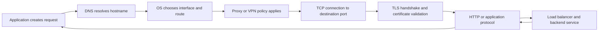

A visible error often names only the stage where the application gave up, not the true cause.

Examples:

- "Name not resolved" points toward DNS.
- "Connection timed out" can mean routing, firewall drop, unavailable server, or proxy path.
- "Connection refused" usually means the target IP was reached but the port was rejected.
- "Connection reset" means a host or intermediary aborted an established or attempted connection.
- "Certificate error" means TCP probably succeeded, but TLS identity or trust validation failed.
- `401`, `403`, `429`, or `500` means an HTTP response arrived, so DNS, TCP, and usually TLS already worked for that exchange.

### Plain-English deep-dive: Layers prevent random troubleshooting

A **layer** is a distinct responsibility in the communication path.

**Analogy:** Sending a parcel requires a valid address, a route, an open delivery facility, an identity check, and then acceptance by the recipient. If the street name is unknown, changing the recipient's password cannot help. If the parcel reaches the recipient and is rejected, the road was not the problem.

**Why it matters:** The fastest investigation proves the lowest uncertain layer, then moves upward. Do not change OAuth scopes while the hostname fails to resolve.

### The support rule

> Test from the same origin, identity, network path, hostname, port, and time window as the failing operation.

A successful test from a laptop does not prove a cloud connector, server, container, or customer proxy can reach the endpoint.

---

## 2. A Practical Layer Model

The Open Systems Interconnection model has seven layers. For SaaS support, a simpler operational model is often easier.

| Support layer | Responsibility | Typical evidence | Typical owner |
|---|---|---|---|
| Application | Request logic, URL, authentication, timeout, retries | Application logs, HAR, API response | App/integration team |
| HTTP/protocol | Method, headers, status, redirect, body | `curl -v`, HAR, server logs | App/API team |
| TLS | Encryption, server identity, trust, SNI | Certificate chain, TLS alert, `openssl` | Security/PKI/network |
| Proxy/VPN | Path selection, authentication, inspection, policy | PAC result, proxy logs, VPN routes | Network/security |
| TCP | Reliable connection to IP and port | SYN/SYN-ACK/ACK, RST, socket error | Network/server |
| IP/routing | Choose path between networks | Route table, traceroute, packet path | Network/cloud |
| DNS | Translate hostname to address | DNS query, response, cache, TTL | DNS/network |
| Local host | Interface, firewall, socket, clock, trust store | OS settings, local capture, process state | Endpoint/server team |

### Why the application layer appears first and last

The application starts the request, but lower layers must succeed before the remote application can answer. Troubleshooting moves from symptom context downward to find the lowest failing layer, then upward to verify the complete workflow.

---

## 3. Baseline Facts to Gather

Before commands or captures, record the connection tuple and context.

### Five-tuple

A TCP flow is commonly identified by:

```text
Source IP + Source port + Destination IP + Destination port + Protocol
```

Example:

```text
10.20.4.18:53144 -> 203.0.113.10:443 TCP
```

- **Source port:** Usually a temporary or ephemeral client port.
- **Destination port:** Service port, commonly 443 for HTTPS.
- **Protocol:** TCP in this example.

### Baseline worksheet

| Fact | Example |
|---|---|
| Failing application/process | Connector worker or browser |
| Exact hostname | `api.example.com` |
| Scheme and port | HTTPS, TCP 443 |
| Source host/environment | Customer VM, container, employee laptop |
| Source IP/interface | `10.20.4.18`, corporate Ethernet |
| Destination IP returned | `203.0.113.10` |
| Proxy/VPN | PAC proxy enabled, split-tunnel VPN |
| First failure and last known good | UTC timestamps |
| Reproduction frequency | Every request or intermittent |
| Exact error | Socket/TLS/HTTP code and text |
| Affected scope | One host, subnet, office, ISP, region, or all |
| Recent changes | DNS, certificate, proxy, firewall, route, release |

### Known-good controls

- Same source to another approved HTTPS endpoint.
- Another source on the same subnet to the same endpoint.
- Same source to the target IP and port where policy permits.
- Same hostname through and outside the relevant proxy, only if approved.
- Same request before and after the failure time.
- Another backend IP returned for the same hostname.

Do not bypass required security controls as an informal test. Coordinate any proxy, VPN, or firewall bypass with the authorized owner.

---

## 4. DNS: From Name to Address

**Domain Name System**, or DNS, translates names such as `api.example.com` into IP addresses and can provide other service information.

### Simplified DNS path

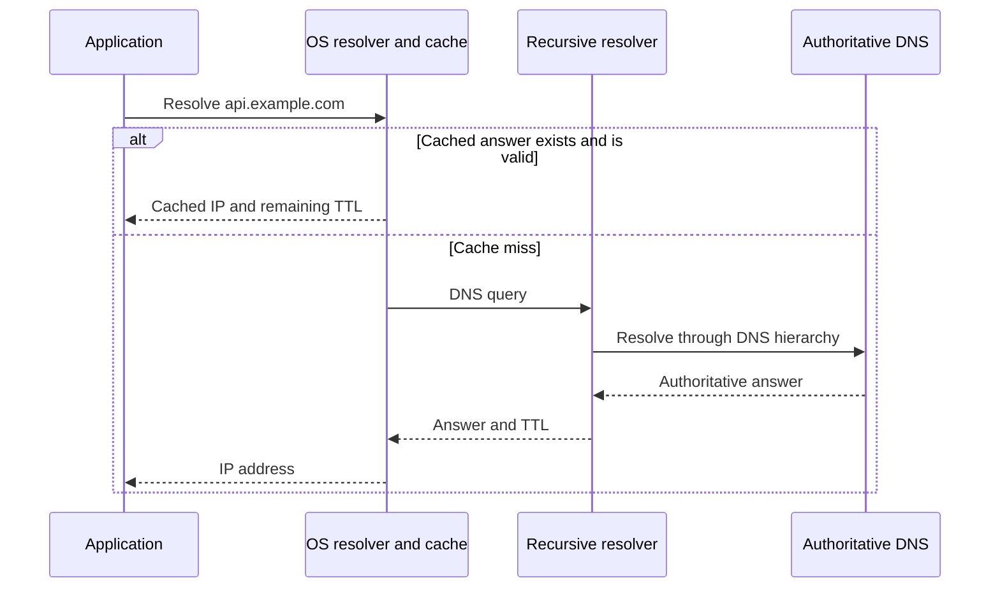

### DNS terms

| Term | Meaning |
|---|---|
| Resolver | Component that performs DNS lookup for the client |
| Recursive resolver | Server that obtains the final answer on the client's behalf |
| Authoritative server | Server responsible for a DNS zone's records |
| A record | Hostname to IPv4 address |
| AAAA record | Hostname to IPv6 address |
| CNAME | Alias from one name to another name |
| TTL | Time To Live, how long an answer may be cached |
| Negative cache | Cached failure such as a previous nonexistent-name result |
| Split DNS | Same hostname resolves differently inside and outside a network |
| Search suffix | Domain automatically appended to a short hostname |

### Response codes

| DNS result | Meaning | First direction |
|---|---|---|
| `NOERROR` with answer | Resolution succeeded | Validate returned address and TTL |
| `NOERROR` without expected answer | Name exists but requested record may not | Check record type and alias chain |
| `NXDOMAIN` | Name does not exist according to resolver | Spelling, zone, split DNS, stale negative cache |
| `SERVFAIL` | Resolver could not complete query | Upstream DNS, DNSSEC, timeout, server failure |
| `REFUSED` | Server refuses this query/client | Resolver policy or source network |
| Timeout | No usable DNS response | Reachability, firewall, resolver health, packet loss |

### Windows read-only checks

```powershell
Resolve-DnsName api.example.com
Resolve-DnsName api.example.com -Type A
Resolve-DnsName api.example.com -Type AAAA
Get-DnsClientCache | Where-Object Entry -Like '*example.com*'
Get-DnsClientServerAddress
```

`nslookup` is widely available but may not use exactly the same resolution path as every application. Prefer `Resolve-DnsName` plus application evidence on Windows.

### Linux read-only checks

```bash
dig api.example.com A
dig api.example.com AAAA
dig api.example.com CNAME
getent ahosts api.example.com
cat /etc/resolv.conf
```

`getent` is useful because it follows the operating system's Name Service Switch behavior, which may include sources beyond direct DNS.

### DNS isolation table

| Observation | Interpretation | Next test |
|---|---|---|
| Name fails, direct known IP reaches port | DNS path likely failing | Query configured resolver and compare known-good host |
| Internal and external clients get different IPs | Split DNS may be intentional | Confirm expected zone and route from each origin |
| A works, AAAA path fails | IPv6 preference or route may cause delay/failure | Compare forced IPv4 and IPv6, inspect routes |
| One resolver returns stale IP | Cache/replication/TTL issue | Query authoritative/current resolver and inspect TTL |
| Short name fails, FQDN works | Search-suffix issue | Use fully qualified domain name and inspect suffix config |
| Browser works, service fails name lookup | Different resolver, proxy, container, or runtime path | Test from actual process environment |

### Plain-English deep-dive: DNS success is not connectivity

DNS proves that a name mapped to data. It does not prove the returned IP is reachable, that port 443 is open, or that TLS trusts the certificate.

**Analogy:** Finding a company in a directory does not prove the road is open or the office is accepting visitors.

**Why it matters:** `nslookup` success should move the investigation to route/TCP, not close it.

---

## 5. IPv4, IPv6, and Happy Eyeballs

A hostname may return both IPv4 and IPv6 addresses.

- **IPv4:** 32-bit address, such as `203.0.113.10`.
- **IPv6:** 128-bit address, such as `2001:db8::10`.
- **Dual stack:** Client and service support both.
- **Happy Eyeballs:** Client strategy that races or quickly falls back between address families to reduce delay.

### Failure pattern

If IPv6 is advertised but the client has a broken IPv6 route, an application may delay before falling back to IPv4. Different runtimes use different fallback behavior.

### Safe comparisons

```powershell
Test-NetConnection api.example.com -Port 443 -InformationLevel Detailed
ping -4 api.example.com
ping -6 api.example.com
```

```bash
curl -4 -v https://api.example.com/
curl -6 -v https://api.example.com/
```

Do not permanently disable IPv6 as the first fix. Prove the failing family and repair routing, DNS, or policy with the network owner.

---

## 6. Interfaces, Routes, and Gateways

After DNS returns an address, the operating system chooses an interface and route.

### Routing terms

- **Interface:** Network attachment such as Ethernet, Wi-Fi, VPN, or virtual adapter.
- **Route:** Rule mapping a destination prefix to a next hop and interface.
- **Default route:** Catch-all route when no more-specific route matches.
- **Gateway/next hop:** Router that forwards traffic toward another network.
- **Metric:** Preference value used when multiple routes match.
- **Longest-prefix match:** Most-specific destination route normally wins.
- **Black hole:** Traffic is routed into a path that silently discards it.
- **Asymmetric routing:** Outbound and return traffic use different paths.

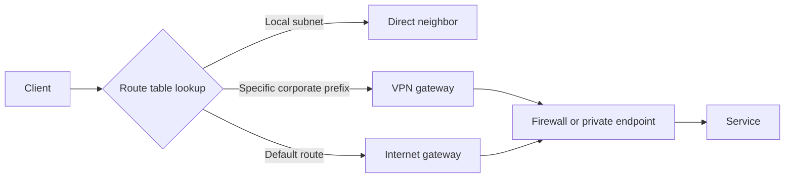

### Windows checks

```powershell
Get-NetIPConfiguration
Get-NetRoute | Sort-Object DestinationPrefix, RouteMetric
Find-NetRoute -RemoteIPAddress 203.0.113.10
Test-NetConnection api.example.com -DiagnoseRouting -InformationLevel Detailed
Test-NetConnection api.example.com -Port 443 -InformationLevel Detailed
tracert api.example.com
pathping api.example.com
```

### Linux checks

```bash
ip address
ip route
ip route get 203.0.113.10
traceroute api.example.com
tracepath api.example.com
```

### Interpreting traceroute carefully

Traceroute shows responses from some intermediate hops. Missing hops do not automatically prove failure because routers may deprioritize or block diagnostic responses while still forwarding application traffic.

| Pattern | Possible meaning |
|---|---|
| Fails at first hop | Local interface, gateway, VPN, or local firewall |
| Path changes when VPN connects | Route-policy or split-tunnel difference |
| Some middle hops show `*`, destination works | Intermediate ICMP filtering, not an outage |
| Destination path stops and TCP also times out | Route/firewall/server path needs investigation |
| Different sources take different routes | Expected routing, CDN, anycast, or policy difference |

### Route control test

`Find-NetRoute` or `ip route get` is often more discriminating than ping because it tells which interface and next hop the OS selected.

---

## 7. TCP: Reliable Connection to an IP and Port

**Transmission Control Protocol**, or TCP, provides an ordered, reliable byte stream between sockets.

A **socket** is an application endpoint identified by address, port, and protocol.

### Three-way handshake

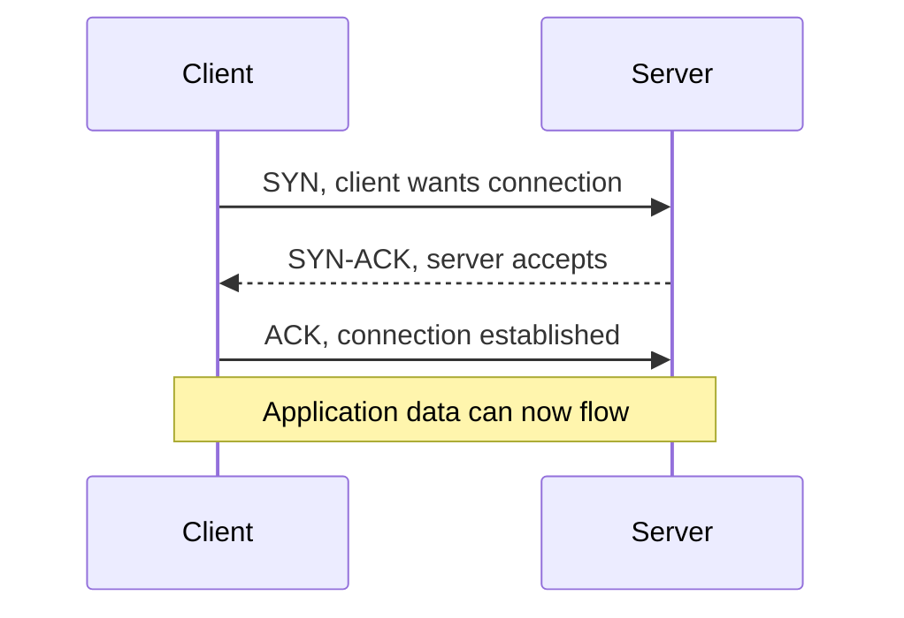

### TCP flags

| Flag | Meaning | Support clue |
|---|---|---|
| SYN | Start connection and synchronize sequence numbers | Repeated unanswered SYN suggests drop or unreachable path |
| ACK | Acknowledge received bytes | Normal throughout established connection |
| FIN | Graceful close | One side has finished sending |
| RST | Abort/reset connection | Identify who sent it and what happened immediately before |
| PSH | Prompt delivery to application | Useful in timing, not usually a cause alone |

### Port states

- **Listening:** Server process accepts connections on a local port.
- **Open:** A connection can be established to the port from the tested path.
- **Closed/refused:** Target rejects because no listener or policy sends rejection.
- **Filtered/dropped:** Firewall or path silently discards attempts.

### Error signatures

| Symptom | Packet-level pattern | Likely direction |
|---|---|---|
| Connection succeeds | SYN, SYN-ACK, ACK | Move to TLS/application |
| Connection refused | SYN followed quickly by RST or equivalent reject | Target reachable; listener/policy/port issue |
| Connection timeout | Repeated SYN, no response | Firewall drop, route, server unavailable, return path |
| Reset during data | Established flow receives RST | Application, intermediary, timeout, protocol/policy rejection |
| Handshake intermittent by IP | Some destination IPs respond, others do not | Load balancer member, route, firewall, DNS pool |
| SYN-ACK seen at server but not client | Return path or intermediate drop | Asymmetric routing, firewall, NAT |

### Plain-English deep-dive: Refused vs timed out

- **Refused** means someone answered "no" quickly.
- **Timed out** means the client received no acceptable answer before its timer expired.

**Analogy:** Refused is a receptionist saying the office is closed. Timeout is ringing a doorbell with no response. The first proves you reached something; the second does not identify where silence began.

**Why it matters:** Retrying a refused port indefinitely will not create a listener. A timeout requires path evidence from both sides.

### Windows connection checks

```powershell
Test-NetConnection api.example.com -Port 443 -InformationLevel Detailed
Get-NetTCPConnection -RemotePort 443
Get-NetTCPConnection | Group-Object State | Sort-Object Count -Descending
```

### Linux connection checks

```bash
nc -vz api.example.com 443
ss -tan 'dport = :443'
ss -tan | awk 'NR>1 {print $1}' | sort | uniq -c
```

Tool availability varies. `curl -v` can test DNS, TCP, TLS, and HTTP together but must be interpreted by stage.

---

## 8. TCP Connection States and Resource Exhaustion

### Common states

| State | Meaning | Concern when excessive |
|---|---|---|
| `ESTABLISHED` | Active connection | Unbounded growth or unexpected peers |
| `SYN_SENT` | Client waits for SYN-ACK | Unreachable/filtered destination or server issue |
| `SYN_RECV` | Server waits for final ACK | Backlog pressure, attack, or return-path issue |
| `TIME_WAIT` | Closed connection waits to protect sequence space | Ephemeral-port pressure under high churn |
| `CLOSE_WAIT` | Remote closed; local app has not closed socket | Application socket leak |
| `FIN_WAIT_2` | Local closed, waiting for remote FIN | Remote close/lifecycle issue |

### Ephemeral ports

Clients normally choose a temporary source port. High connection churn, long `TIME_WAIT`, NAT limits, or leaked sockets can exhaust available connection tuples.

Symptoms can include:

- Intermittent inability to open new connections.
- Existing connections continue working.
- High `TIME_WAIT` or many stuck states.
- Errors vary by process or NAT gateway.

### Safe evidence before tuning

- Count states over time.
- Identify owning processes.
- Measure connection creation rate.
- Check pooling and keep-alive behavior.
- Check NAT/SNAT port utilization in the relevant cloud/network platform.
- Confirm whether failures correlate with load.

Do not change operating-system TCP registry or `sysctl` settings as an interview default. Tuning without evidence can hide connection leaks or create system-wide risk.

---

## 9. Firewalls: Drop, Reject, and Stateful Inspection

A firewall evaluates traffic against policy.

### Firewall types

- Host firewall on client or server.
- Network firewall between subnets or networks.
- Cloud security group or network access control.
- Web application firewall at the application edge.
- Proxy security policy.
- Endpoint security network filter.

### Stateful firewall

A stateful firewall tracks connection state and normally permits return traffic for an allowed outbound connection. Asymmetric routing can cause return packets to bypass the device that created state, leading to drops.

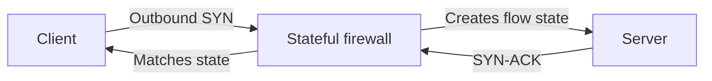

### Drop vs reject

| Firewall behavior | Client experience |
|---|---|
| Drop silently | Timeout and retransmitted SYNs |
| Reject with TCP RST | Connection refused/reset quickly |
| Reject with ICMP unreachable | Network/host/port unreachable error, depending on stack |
| Permit TCP but block TLS category/policy | TCP succeeds; TLS or proxy policy fails |

### Firewall request evidence

Provide the network team:

```text
Source IP/subnet:
Destination hostname and resolved IPs:
Destination port/protocol:
Direction:
UTC test time:
Proxy/VPN path:
Expected business use:
Observed error:
Packet/log correlation if available:
Required duration and environment:
```

Avoid asking to "allow everything" or permanently disable a firewall. Request the narrow path needed and validate afterward.

---

## 10. NAT and Port Translation

**Network Address Translation**, or NAT, rewrites addresses, often allowing private clients to access public services through shared public IPs.

**Source NAT**, or SNAT, changes the source address and often source port.

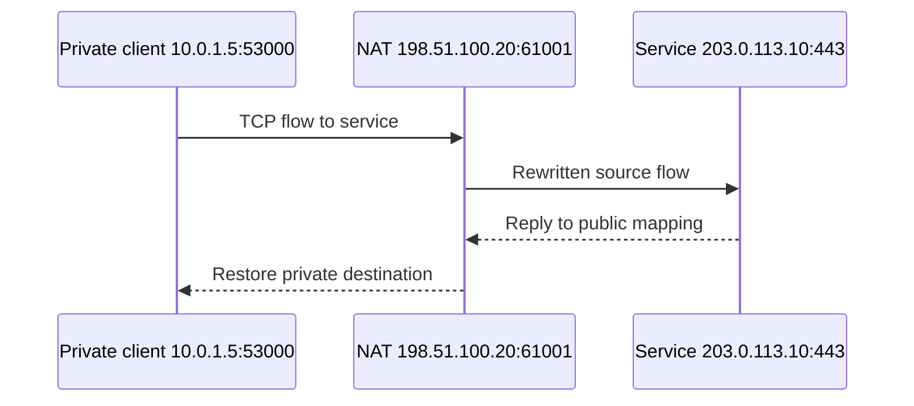

### NAT failure patterns

- Port exhaustion under high outbound concurrency.
- Mapping timeout shorter than application idle period.
- Multiple instances sharing insufficient public IP capacity.
- Asymmetric return path missing the NAT device.
- Stale state after failover.

### Keepalive distinction

- **HTTP keep-alive/connection reuse:** Reuse an existing TCP connection for multiple requests.
- **TCP keepalive:** Probe idle connections after configured intervals.
- **Application heartbeat:** Protocol-specific message proving application liveness.

They solve related but different problems. A TCP connection can be established while the application is unhealthy.

---

## 11. Proxy Concepts and PAC Files

A proxy intermediates client traffic.

### Common proxy modes

| Mode | Behavior |
|---|---|
| Explicit proxy | Application sends traffic to configured proxy |
| Transparent proxy | Network redirects traffic without app configuration |
| Reverse proxy | Fronts servers/load balancers, not client outbound policy |
| TLS inspection proxy | Terminates and re-encrypts TLS using enterprise trust chain |
| PAC file | JavaScript policy decides direct vs proxy path per URL/host |

**PAC** means Proxy Auto-Configuration.

### HTTPS through an explicit proxy

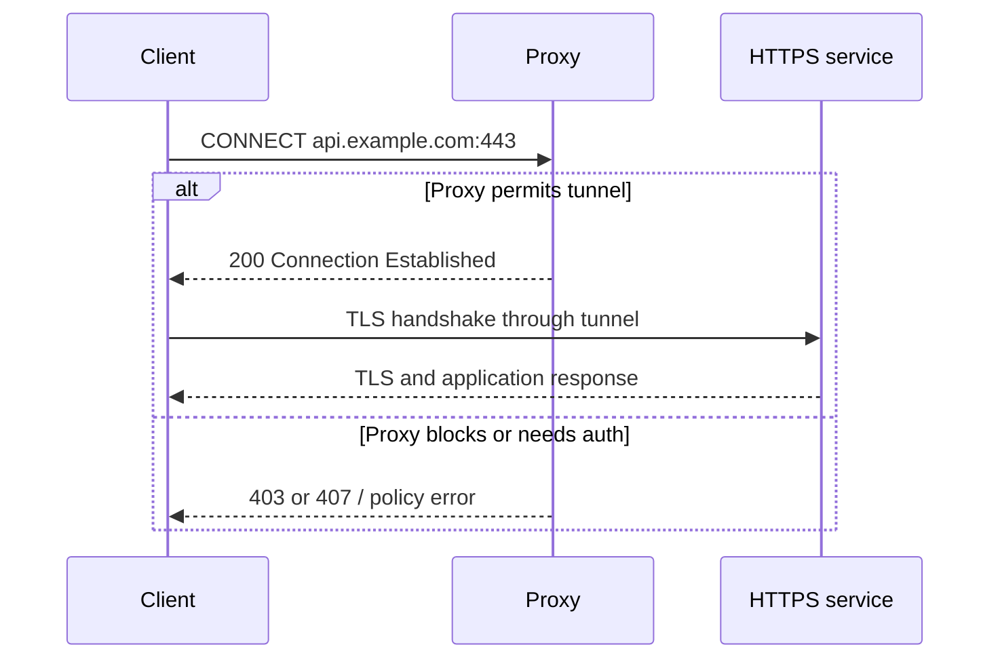

### Proxy failure patterns

| Symptom | Hypothesis |
|---|---|
| Browser works, service fails | Browser and service use different proxy settings or identities |
| `407 Proxy Authentication Required` | Client did not authenticate to proxy |
| CONNECT denied | Destination/category/port not allowed |
| Certificate issued by corporate CA | TLS inspection is active; trust store must include approved CA |
| Works direct, fails proxy | Proxy policy, auth, TLS inspection, body/timeout limit |
| Works proxy, fails direct | Direct egress intentionally blocked |
| Intermittent by URL | PAC rule, proxy pool member, category, or DNS difference |
| Large upload fails | Proxy size, timeout, inspection, or MTU path |

### Windows proxy checks

```powershell
netsh winhttp show proxy
Get-ItemProperty 'HKCU:\Software\Microsoft\Windows\CurrentVersion\Internet Settings' |
  Select-Object ProxyEnable, ProxyServer, AutoConfigURL
```

Different applications may use WinHTTP, browser/system settings, runtime-specific environment variables, or their own proxy settings.

### Linux/environment checks

```bash
env | grep -i proxy
curl -v https://api.example.com/
curl -v --proxy http://proxy.example.com:8080 https://api.example.com/
```

Do not include real proxy credentials in commands, screenshots, or logs.

### PAC diagnosis

Record:

- Exact URL, not only hostname.
- PAC source and version.
- Client network/interface.
- PAC decision: direct or named proxy.
- Proxy selected and resolved IP.
- Whether the failing application actually evaluates PAC.

---

## 12. VPN and Split Tunneling

A **Virtual Private Network**, or VPN, creates an encrypted network path and often adds routes, DNS servers, or proxy policy.

- **Full tunnel:** Most traffic uses VPN.
- **Split tunnel:** Only selected destinations use VPN.
- **Private endpoint:** Service is reachable only through private network paths.

### Failure patterns

| Observation | Likely direction |
|---|---|
| Works off VPN, fails on VPN | VPN route, DNS, proxy, firewall, MTU, policy |
| Works on VPN, fails off VPN | Private endpoint or internal DNS expected |
| DNS answer changes on VPN | Split DNS likely intentional or misconfigured |
| Small requests work, large requests stall | MTU/fragmentation or proxy limit |
| Intermittent after VPN reconnect | Stale route, DNS cache, NAT, or tunnel state |

### Safe comparison

Compare route, DNS resolver, resolved IP, proxy decision, and TCP/TLS result with and without VPN only when customer policy permits both paths.

---

## 13. TLS: Encryption, Identity, and Trust

**Transport Layer Security**, or TLS, encrypts application traffic and validates endpoint identity.

### Simplified TLS handshake

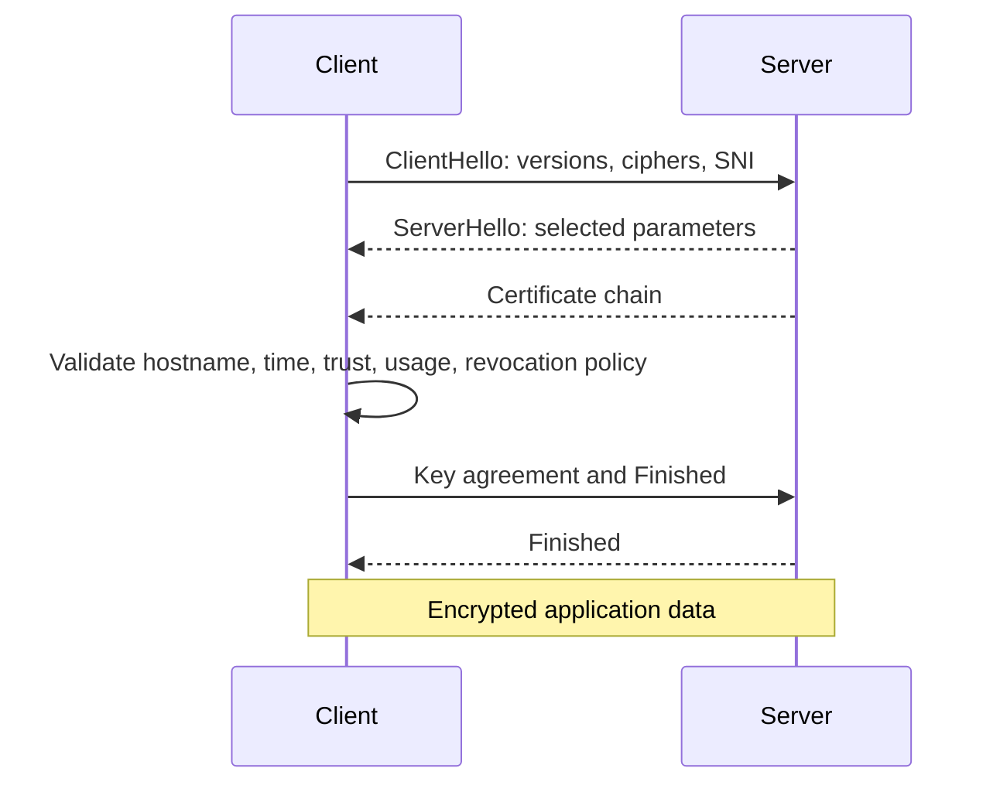

### TLS terms

| Term | Meaning |
|---|---|
| Certificate | Signed statement binding a public key to identities/attributes |
| Certificate chain | Leaf certificate plus intermediate authorities leading to trusted root |
| CA | Certificate Authority that signs certificates |
| Trust store | Roots/intermediates the client trusts |
| SAN | Subject Alternative Name containing valid hostnames/IPs |
| SNI | Server Name Indication sent in ClientHello so server selects correct certificate/site |
| Cipher suite | Algorithms used for handshake and encryption |
| TLS alert | Protocol message describing handshake/connection failure |
| Revocation | Certificate invalidated before expiration via policy such as CRL/OCSP |
| mTLS | Mutual TLS, where client also presents a certificate |

### Certificate validation

A client typically checks:

1. Certificate is within valid time range.
2. Requested hostname matches a SAN.
3. Chain reaches a trusted root.
4. Intermediate certificates are available/valid.
5. Certificate usage permits server authentication.
6. Signature and algorithms are acceptable.
7. Revocation policy succeeds as required.
8. Local clock is sufficiently correct.

### TLS failure matrix

| Symptom | Likely cause |
|---|---|
| Hostname mismatch | Wrong certificate/SAN, direct IP test, wrong virtual host |
| Expired/not yet valid | Server certificate, intermediate, or client clock |
| Unknown CA | Missing root/intermediate or TLS inspection CA absent |
| Incomplete chain | Server omitted intermediate; some clients may still work from cache |
| Handshake failure/cipher mismatch | Unsupported TLS version or cipher policy |
| Only hostname A fails on shared IP | SNI/certificate/site configuration |
| Browser works, Java/service fails | Different trust stores or TLS capabilities |
| mTLS fails | Missing/invalid client cert, key, issuer, or server trust |
| Revocation check timeout | CRL/OCSP network path or policy |

### Plain-English deep-dive: Encryption is not identity

A connection can be encrypted to the wrong endpoint. Certificate hostname and trust validation prove who controls the presented identity according to the trust model.

**Analogy:** A sealed conversation prevents eavesdropping, but you still need to verify who is inside the room.

**Why it matters:** Disabling certificate validation may make a test "work" while removing the protection that detects interception or misrouting. Never recommend it as a production fix.

### Safe TLS checks

```bash
curl -v https://api.example.com/
openssl s_client -connect api.example.com:443 -servername api.example.com -showcerts
```

On Windows, `curl.exe -v` is commonly available. PowerShell aliases can differ, so use `curl.exe` when you specifically mean curl.

```powershell
curl.exe -v https://api.example.com/
Test-NetConnection api.example.com -Port 443
```

Do not use `-k`, `--insecure`, or certificate-validation bypass as evidence that the production connection is safe. A temporary diagnostic bypass can conceal the actual trust failure and should not be used without explicit security authorization.

### SNI control

Testing `https://203.0.113.10/` changes the hostname and can produce a certificate mismatch or wrong virtual site. Preserve the hostname while controlling the destination only with approved tools and methods.

---

## 14. Load Balancers, Reverse Proxies, and Backends

A load balancer receives connections and distributes requests to backend services.

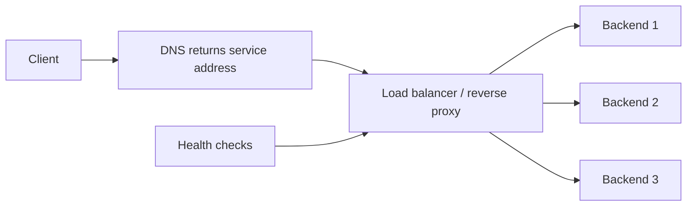

### Terms

- **Frontend/listener:** Address and port exposed to clients.
- **Backend/pool member:** Service instance receiving forwarded traffic.
- **Health check:** Probe deciding whether a backend should receive traffic.
- **Session persistence/stickiness:** Route one client/session repeatedly to same backend.
- **Anycast:** Same IP advertised from multiple locations.
- **CDN:** Distributed edge system for delivery and protection.

### Failure patterns

| Pattern | Possible cause |
|---|---|
| Every nth request fails | One unhealthy backend still in rotation |
| Failure depends on source region | Regional edge, route, or backend pool |
| New connections fail, existing persist | Listener/backlog/scale/NAT issue |
| TCP/TLS succeeds, HTTP `502`/`503` | Reverse proxy cannot reach healthy backend or service unavailable |
| Sticky session always fails for one user | Bad backend or corrupted session affinity |
| Health is green but real requests fail | Health probe is too shallow or tests different path/dependency |

### Control

Capture destination IP, response headers, request IDs, backend identifiers where exposed safely, and repeated outcomes. Do not assume one successful request proves all load-balanced members.

---

## 15. Timeouts: Name the Timer

"Timeout" is incomplete. Many layers have independent timers.

| Timer | What it waits for | Failure direction |
|---|---|---|
| DNS timeout | Resolver response | DNS path/resolver |
| Connect timeout | TCP handshake | Route/firewall/listener |
| TLS handshake timeout | Secure negotiation | TLS/proxy/server load |
| Proxy connect/auth timeout | Proxy tunnel or authentication | Proxy path |
| Request timeout | Entire application operation | App/dependency/large work |
| Read/idle timeout | Next response bytes | Slow backend/intermediary |
| Load balancer idle timeout | Activity on established flow | Long-lived/idle connection reset |
| OAuth/SSO transaction timeout | Identity flow completion | Redirect, clock, session, user delay |

### Timeline method

```text
DNS start/end:
TCP SYN/SYN-ACK/ACK:
TLS ClientHello/ServerHello/certificate/Finished:
HTTP request sent:
First response byte:
Response complete:
Application timeout fired:
```

The longest or incomplete interval identifies the next layer to investigate.

---

## 16. Latency, Loss, Retransmissions, and Throughput

### Metrics

- **Latency:** Time for data to travel/respond.
- **RTT:** Round-trip time from sender to peer and back.
- **Packet loss:** Packets fail to reach destination.
- **Retransmission:** TCP sends data again because acknowledgment was not received.
- **Throughput:** Total data rate transmitted.
- **Goodput:** Useful application data rate excluding protocol overhead and retransmissions.
- **Jitter:** Variation in latency.

### Retransmission is a symptom

Possible causes include:

- Congestion.
- Wireless loss.
- Overloaded interface or device.
- Firewall/inspection drop.
- Bad route.
- MTU problem.
- Receiver unable to process quickly.

### TCP windows

The receiver advertises how much data it can accept.

- Small or zero receive window can limit throughput.
- Window scaling supports larger windows on high-bandwidth, high-latency paths.
- Selective Acknowledgment, or SACK, helps recover efficiently from loss.

### Bandwidth-delay product

$$
\operatorname{BDP}=\operatorname{bandwidth}\times\operatorname{RTT}
$$

The amount of data in flight needed to fill the network path grows with bandwidth and RTT. This matters more for bulk transfer than a small API call.

### Diagnose slowness by segment

| Slow interval | Direction |
|---|---|
| DNS | Resolver/cache/network |
| TCP handshake | Network RTT, loss, firewall, server accept |
| TLS | Certificate/revocation/crypto/proxy/server |
| Time to first byte | Backend processing, queue, upstream dependencies |
| Response transfer | Bandwidth, loss, window, large payload |
| Client processing | Browser/app CPU, rendering, parsing |

---

## 17. MTU and Fragmentation

**Maximum Transmission Unit**, or MTU, is the largest packet payload a link carries without fragmentation at that layer.

**Path MTU** is the smallest effective MTU along the route.

### Failure pattern

Small requests work, but large requests, certificate chains, uploads, or responses stall. Path MTU Discovery may fail when required ICMP messages are blocked, creating a black-hole behavior.

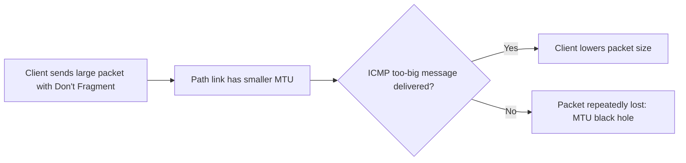

### Evidence

- Size-correlated failures.
- Retransmissions around a consistent segment size.
- `tracepath` result on Linux.
- Interface MTU and tunnel overhead.
- Packet capture showing large packets/retries.

Do not lower MTU globally as a blind fix. Confirm the path and coordinate with the network/VPN owner.

---

## 18. ICMP, Ping, and Traceroute Limitations

**Internet Control Message Protocol**, or ICMP, carries diagnostics and network error information.

Ping uses ICMP echo. HTTPS uses TCP 443. A firewall may block one and permit the other.

| Result | What it proves |
|---|---|
| Ping succeeds | Some ICMP echo exchange works |
| Ping fails | Only that ICMP echo did not complete; HTTPS may still work |
| TCP 443 succeeds | A TCP handshake to that IP/port works from that origin |
| TLS succeeds | Secure negotiation and validation worked for that client/path |
| HTTP response arrives | Application protocol reached a responder |

Use ping as one clue, not a final connectivity verdict.

---

## 19. Packet Capture: Read the Conversation

A packet capture records network frames visible at a capture point.

### Capture principles

- Capture as close to the failing client and server as possible.
- Use synchronized clocks.
- Record exact reproduction time and five-tuple.
- Keep filters narrow enough to protect unrelated customer data.
- Treat captures as sensitive: they may contain hostnames, addresses, tokens, cookies, or payloads.
- Follow customer approval, retention, and transfer policies.

### Basic Wireshark display filters

```text
# DNS
 dns

# One host and TCP port
 ip.addr == 203.0.113.10 && tcp.port == 443

# TCP resets
 tcp.flags.reset == 1

# Retransmissions
 tcp.analysis.retransmission || tcp.analysis.fast_retransmission

# TLS handshakes and alerts
 tls.handshake || tls.alert_message

# HTTP errors when visible
 http.response.code >= 400
```

### Handshake interpretation

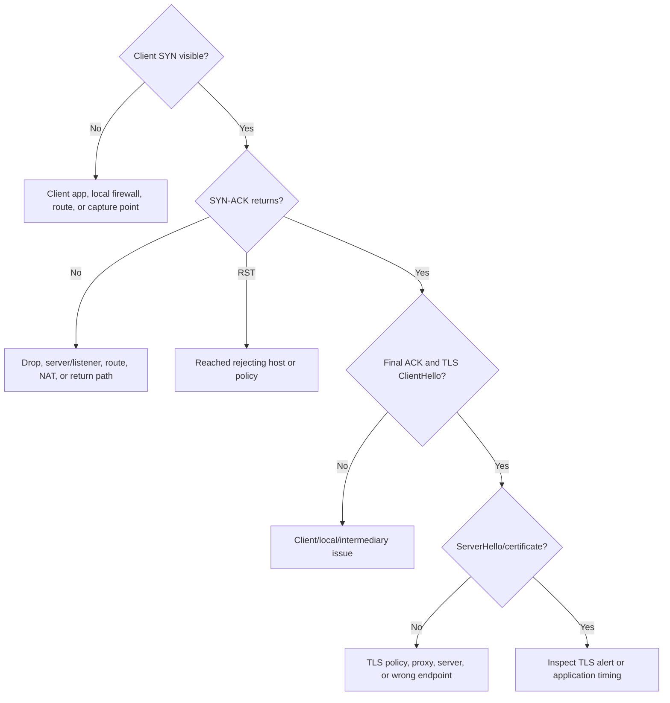

### RST investigation

Ask:

- Which IP sent the RST?
- Was it immediate after SYN or after application data?
- Does its TTL/path suggest server or intermediary?
- Did a timeout or policy threshold occur first?
- Does server/application logging contain the same flow/time?

A reset is an action, not a complete root cause.

---

## 20. Safe Diagnostic Command Ladder

Run tests from the actual failing environment with customer authorization.

### Windows ladder

```powershell
# 1. DNS
Resolve-DnsName api.example.com

# 2. Route selected for resolved IP
Find-NetRoute -RemoteIPAddress 203.0.113.10

# 3. TCP port
Test-NetConnection api.example.com -Port 443 -InformationLevel Detailed

# 4. Proxy configuration
netsh winhttp show proxy

# 5. TLS and HTTP detail
curl.exe -v https://api.example.com/

# 6. Connection state
Get-NetTCPConnection -RemotePort 443 | Select-Object LocalAddress, LocalPort, RemoteAddress, RemotePort, State, OwningProcess
```

### Linux ladder

```bash
# 1. OS resolution and DNS detail
getent ahosts api.example.com
dig api.example.com A

# 2. Route selected for resolved IP
ip route get 203.0.113.10

# 3. TCP port
nc -vz api.example.com 443

# 4. Proxy environment
env | grep -i proxy

# 5. TLS and HTTP detail
curl -v https://api.example.com/
openssl s_client -connect api.example.com:443 -servername api.example.com -showcerts

# 6. Connection state
ss -tan 'dport = :443'
```

### Command output hygiene

Before sharing output, redact:

- Authorization headers.
- Cookies and session IDs.
- Client certificates/private keys.
- Internal hostnames or IPs if customer policy requires.
- Personal data and URL query secrets.
- Proxy credentials.

Preserve error text, timestamps, certificate subject/issuer/SAN/validity, endpoint, and non-secret request IDs.

---

## 21. Error-to-Layer Quick Reference

| Error or observation | Lowest proven stage | Next focus |
|---|---|---|
| `NXDOMAIN` | DNS request reached resolver | Name/zone/split DNS/cache |
| DNS timeout | Name resolution incomplete | Resolver reachability/firewall |
| No route to host/network unreachable | Local route decision failed or ICMP error received | Interface, route, VPN, gateway |
| TCP connect timeout | DNS may work; TCP not established | SYN path, firewall drop, listener, return route |
| Connection refused | Target/rejector reached | Listener, correct IP/port, policy reject |
| Connection reset | Some TCP exchange occurred | RST source, timeout, app/proxy policy |
| TLS unknown CA | TCP established; certificate presented | Trust chain or TLS inspection |
| TLS hostname mismatch | TCP/TLS reached wrong identity | DNS, SNI, endpoint, certificate SAN |
| `407` | Proxy returned HTTP response | Proxy authentication |
| HTTP `401` | HTTP service responded | Application authentication token/session |
| HTTP `403` | HTTP service responded | Authorization/policy, not basic connectivity |
| HTTP `429` | HTTP service responded | Rate limit/backoff |
| HTTP `502` | Reverse proxy responded | Proxy-to-backend path/service |
| HTTP `503` | Service/proxy responded unavailable | Capacity, health, maintenance, dependency |
| Slow first byte | Transport established | Backend queue/processing/dependency |

This table gives a starting layer, not a final cause.

---

## 22. Glean-Relevant Network Scenarios

### Scenario A: Connector cannot reach a source API

Investigate:

1. Exact source hostname and port.
2. DNS from connector execution environment.
3. Route and outbound firewall/proxy path.
4. TCP handshake.
5. TLS trust/SNI and source certificate.
6. HTTP response and authentication only after transport works.
7. Source API limits and request timing.

### Scenario B: Browser works, connector fails

Competing hypotheses:

- Browser uses PAC/user proxy; connector uses WinHTTP/direct egress.
- Browser trusts corporate TLS inspection CA; connector runtime trust store does not.
- Browser has interactive SSO; connector needs service credential.
- Tests originate from different networks.
- Browser reaches public endpoint; connector requires private endpoint or allowlist.

Cheapest discriminating checks:

- Compare resolved IP, route, proxy selection, and certificate issuer from both origins.

### Scenario C: SSO redirects then fails

Network prerequisites to check before SAML/OAuth semantics:

- Identity-provider and service-provider hostnames resolve.
- Browser reaches both endpoints through proxy/VPN.
- TLS certificates validate.
- Redirect target is not blocked.
- Client clock is correct.

Part 9 will analyze SAML/OAuth tokens and assertions.

### Scenario D: API calls fail only from one office

Compare:

- DNS resolver/answers.
- Egress public IP and allowlist.
- Proxy pool and PAC decision.
- Route/VPN.
- TLS inspection certificate.
- Packet loss/MTU.

### Scenario E: Intermittent connection resets

Correlate:

- Idle duration.
- Load balancer/proxy/NAT timeout.
- Backend member.
- RST source.
- Connection reuse and keepalive.
- Server process restart or deployment.

---

## 23. Customer Communication for Network Incidents

### Weak update

> "It looks like a firewall issue. Please check your network."

### Strong update

> "DNS resolves `api.example.com` to the expected address from the connector host. The selected route uses the corporate VPN. TCP SYN attempts to port 443 receive no response for 20 seconds, while the same host reaches another approved HTTPS endpoint. We have not yet proven whether the drop is at the VPN firewall, destination allowlist, or return path. The customer network owner is checking logs for source IP `10.20.4.18` and the destination at 14:12-14:14 UTC. The connector remains unable to synchronize; users can access the source directly. Next update is 14:45 UTC."

### Network escalation template

```text
Customer impact:
Source environment and IP:
Destination hostname, resolved IPs, port, protocol:
DNS result and resolver:
Selected route/interface/VPN:
Proxy/PAC result:
TCP result and exact error:
TLS result and certificate issuer/subject, sanitized:
UTC reproduction window:
Affected and known-good controls:
Packet/log evidence location:
Requested network-team check:
Next update time:
```

---

## 24. Proxy Paper Lab: Connector Fails Behind a Proxy

### Scenario

A Glean connector running on a customer Windows server stopped reaching `api.vendor.example:443` after a proxy policy change.

Evidence:

- `Resolve-DnsName` returns expected A records.
- `Find-NetRoute` selects the normal corporate default route.
- `Test-NetConnection ... -Port 443` times out.
- Browser access from an administrator's laptop succeeds.
- The server's WinHTTP proxy is `DIRECT`.
- The browser uses a PAC file that sends the vendor domain through `proxy.corp.example:8080`.
- Direct internet egress from servers is denied.
- No HTTP or TLS response is captured from the server.

### Tasks

1. State the lowest failing stage.
2. Explain why browser success is not a valid same-path control.
3. Write three hypotheses.
4. Choose the cheapest discriminating test.
5. Identify the likely configuration owner.
6. State what evidence rules out OAuth as the current first problem.
7. Draft a customer update.
8. Define the secure repair and verification plan.

### Expected reasoning

- DNS and local route selection work.
- TCP to the destination never establishes from the server.
- Browser and connector use different origins and proxy paths.
- The leading hypothesis is missing server/application proxy configuration after policy change, but proxy reachability and permitted CONNECT policy still require validation.
- OAuth is not first because no TLS or HTTP exchange reaches the API.
- Repair should configure the supported proxy path for the connector/runtime, not enable broad direct egress.
- Verification requires TCP/TLS/HTTP from the connector origin and the original synchronization workflow.

---

## 25. Packet-Reasoning Lab: Timeout, Refusal, Reset, or TLS

Classify each trace summary.

| Case | Observation | Classification |
|---|---|---|
| 1 | SYN repeated three times, no response | TCP connection timeout/drop path |
| 2 | SYN, immediate RST from destination | Connection refused/rejected |
| 3 | SYN, SYN-ACK, ACK, ClientHello, TLS alert `unknown_ca` | TCP healthy, TLS trust failure |
| 4 | TCP and TLS complete, HTTP `403` | Application authorization/policy |
| 5 | Established flow idle 60 seconds, proxy sends RST | Intermediary idle timeout/reset |
| 6 | A address succeeds; AAAA path sends SYN with no reply | IPv6 route/firewall issue |
| 7 | Small response works; large transfer retransmits and stalls through VPN | MTU/loss/window investigation |
| 8 | One of four destination IPs consistently refuses | Endpoint/load balancer member or IP-specific path |

For each case, say aloud:

- What has been proven?
- What remains unknown?
- What is the next discriminating check?
- What would you tell the customer now?

---

## 26. Interview Whiteboard Answer

Draw this:

```text
Application
  -> DNS
  -> route/interface
  -> proxy/VPN/NAT/firewall
  -> TCP SYN/SYN-ACK/ACK
  -> TLS ClientHello/certificate/Finished
  -> HTTP/API
  -> load balancer/backend
```

Then say:

> "I start with the exact source, destination hostname, resolved addresses, port, proxy/VPN path, time, and error. I test from the actual failing environment. DNS success moves me to route and TCP; a completed TCP handshake moves me to TLS; a valid HTTP response moves me to application authentication or behavior. I distinguish refusal from timeout and identify who sent a reset. I compare affected and known-good paths one variable at a time. During customer impact, I maintain a workaround, owner map, and update cadence, and I verify the original workflow after the network repair."

### Microsoft experience bridge

> "My Windows networking and Azure foundation, together with OneDrive and Microsoft 365 escalation work, gives me experience separating client, identity, network, and service behavior. For this role I would use that same controlled comparison method while deepening packet-level and cross-platform command fluency."

---

## Likely Interview Questions for This Section

### Q1. "Walk me through what happens when a client connects to an HTTPS API."

> **Model answer:** "The application provides a hostname and port. DNS resolves the name, the operating system selects an interface and route, and proxy or VPN policy may redirect the path. TCP establishes a connection with SYN, SYN-ACK, and ACK. TLS then negotiates encryption and validates the server certificate and hostname. Only after that does HTTP carry the API request, potentially through a load balancer to a backend. I isolate failures in that order using evidence from the actual source environment."

### Q2. "What is the difference between connection refused and connection timed out?"

> **Model answer:** "Refused usually means the target or an intermediary responded quickly with a rejection such as TCP RST, so the path reached a rejecting device but no service or policy accepted the port. Timeout means no acceptable response arrived before the client timer expired, which can involve routing, firewall drop, server unavailability, or return-path failure. I would use packet or both-side logs to locate the silence."

### Q3. "DNS resolves correctly, but the application cannot connect. What next?"

> **Model answer:** "DNS success proves only name-to-address resolution. I would confirm the returned address is expected, inspect the selected route/interface and proxy/VPN path, then test TCP to the destination port from the actual application environment. Based on SYN/SYN-ACK/RST evidence I would move toward route, firewall, listener, NAT, or return-path investigation before TLS or application authentication."

### Q4. "A browser works but a connector service fails. Why?"

> **Model answer:** "They may not share a network path or runtime configuration. The browser may use a PAC file, interactive proxy authentication, user SSO, a different DNS resolver, or a trust store containing the corporate inspection CA. The service may use WinHTTP, environment variables, direct egress, or another trust store. I compare origin, DNS answer, route, proxy decision, certificate issuer, and identity rather than treating browser success as proof."

### Q5. "How do you troubleshoot a TLS certificate error?"

> **Model answer:** "I first prove TCP connects, then capture the requested hostname, SNI, presented leaf and intermediate certificates, SANs, validity period, issuer, trust chain, client clock, and any TLS alert. I compare working and failing client trust stores and check for TLS inspection. I do not disable validation as a fix; I correct the certificate, chain, hostname, trust, or inspection policy and then verify the original client path."

### Q6. "What does a TCP reset tell you?"

> **Model answer:** "It tells me a host or intermediary aborted the flow, not why. I identify the source IP and timing: immediate after SYN suggests refusal; after TLS or application data suggests protocol, policy, application, or idle-timeout behavior. I correlate the five-tuple and timestamp with server, proxy, firewall, and load balancer logs before assigning root cause."

### Q7. "How would you investigate intermittent network failures?"

> **Model answer:** "I look for dimensions that vary: time, destination IP, backend member, source subnet, proxy node, VPN state, payload size, connection age, and load. I collect repeated timestamped outcomes, DNS answers, routes, connection states, and request IDs. Packet evidence can reveal loss, resets, retransmissions, or MTU patterns. The goal is to identify the variable that separates success from failure."

### Q8. "A customer says the firewall is blocking Glean. How do you respond?"

> **Model answer:** "I would treat that as a hypothesis. I would gather the exact source IP, destination hostname and resolved IPs, protocol/port, route, proxy/VPN path, UTC test time, and socket result. Unanswered SYNs are consistent with a drop but do not identify the device. I would ask the authorized network owner to correlate firewall logs for that tuple and time, while testing a known-good destination from the same origin. The repair should be the narrow approved rule, followed by TCP, TLS, and original workflow verification."

---

## 30-Second Memory Hooks

- **Path:** DNS -> route -> proxy/VPN/firewall -> TCP -> TLS -> HTTP -> backend.
- **Same origin:** Laptop success does not prove connector-server success.
- **DNS:** Directory lookup, not delivery proof.
- **Route:** Which interface and next hop did the OS choose?
- **TCP:** SYN, SYN-ACK, ACK.
- **Refused:** Someone said no; **timeout:** no acceptable answer.
- **RST:** Who sent it, and after what event?
- **Firewall:** Drop looks like timeout; reject may look like refusal.
- **Proxy:** Browser and service may use different configuration and trust.
- **TLS:** Encryption plus identity; never fix by disabling validation.
- **SNI:** Hostname selects the correct virtual service/certificate.
- **NAT:** Shared translated state can exhaust or expire.
- **Timeout:** Name the timer: DNS, connect, TLS, proxy, request, or idle.
- **Retransmission:** Symptom of loss or delay, not root cause by itself.
- **MTU:** Small works, large stalls can indicate a path-size problem.
- **HTTP response:** Transport reached a responder; move upward.

---

## Completion Checklist

- [ ] I can draw the full HTTPS request path from memory.
- [ ] I can gather the five-tuple, source context, proxy/VPN path, and UTC timeline.
- [ ] I can interpret DNS `NOERROR`, `NXDOMAIN`, `SERVFAIL`, refusal, and timeout.
- [ ] I can compare IPv4 and IPv6 without disabling one blindly.
- [ ] I can inspect the selected route on Windows and Linux.
- [ ] I can explain the TCP handshake and common flags/states.
- [ ] I can distinguish timeout, refusal, reset, TLS failure, and HTTP failure.
- [ ] I can explain stateful firewalls, NAT, proxies, PAC, and split-tunnel VPN.
- [ ] I can validate TLS hostname, SAN, time, trust chain, SNI, and inspection behavior.
- [ ] I can identify load balancer, idle-timeout, retransmission, and MTU patterns.
- [ ] I can use the safe Windows and Linux command ladders and sanitize output.
- [ ] I can interpret a narrow packet capture without calling every anomaly the cause.
- [ ] I completed both networking labs aloud.
- [ ] I can deliver the interview whiteboard answer in under two minutes.

---

*Next suggested section: [Part 7 - HTTP, Web Applications, and Browser Developer Tools](Part-07-http-web-and-browser-devtools.md). It begins after TCP and TLS succeed and teaches request methods, headers, status codes, redirects, cookies, caching, CORS, browser console errors, Network timing, and safe trace collection.*
