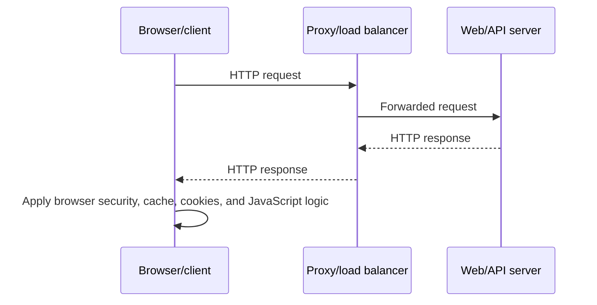
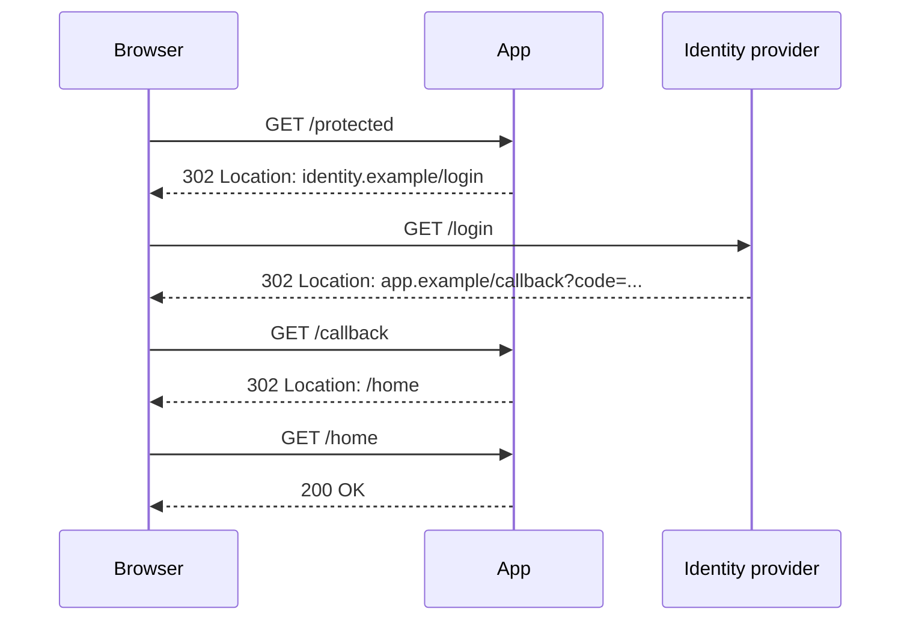
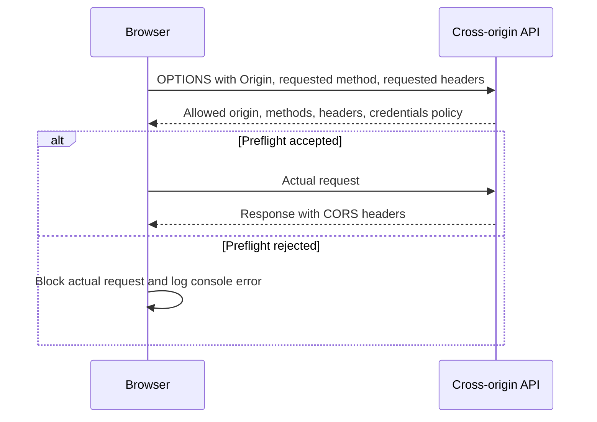
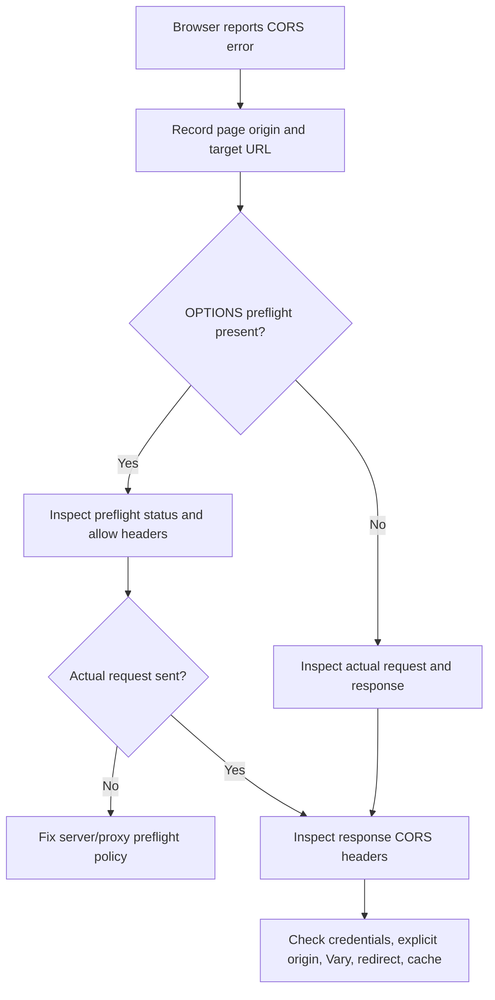
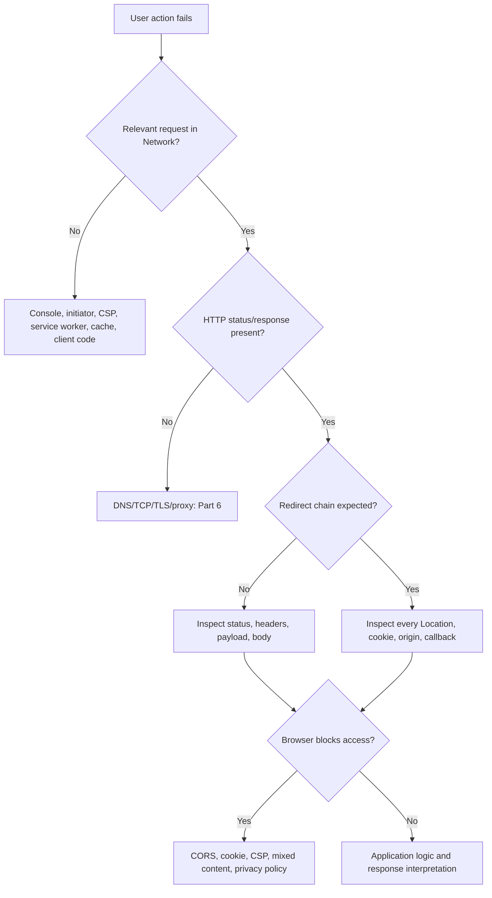

# Part 7 - HTTP, Web Applications, and Browser Developer Tools

> **Section goal:** Read web requests and responses, identify browser-only policy failures, and use Developer Tools to collect safe evidence for authentication, API, loading, redirect, cookie, caching, and CORS issues.
>
> **Covers index item:** Part 7. **Maps to JD responsibilities:** analyze browser traces, troubleshoot SaaS applications and REST APIs, support SSO flows, isolate root causes, document evidence, and communicate precise customer impact.

> **Evidence safety note:** Browser traces can contain authorization headers, session cookies, tokens, user data, query parameters, and response bodies. Prefer sanitized HAR export, reproduce with harmless data, and follow customer-approved storage and transfer procedures.
>
> **Safety rule:** Never bypass browser protections. Keep credentials, tokens, cookies, and session data confidential, and correct the server, client, identity, or policy configuration through an approved path.

---

## JD Mapping

| Job requirement | Preparation in this Part |
|---|---|
| Analyze browser trace files | Capture, filter, inspect, sanitize, export, and correlate HAR evidence |
| Troubleshoot REST APIs | Read methods, URLs, headers, payloads, status codes, and timings |
| Support SSO/SAML/OAuth | Follow redirects, cookies, origins, and browser policy symptoms |
| Isolate root cause | Separate network, server response, browser policy, cache, and JavaScript failures |
| Fully document issues | Record exact request, initiator, response, timing, user context, and correlation ID |

---

## 1. HTTP Begins After the Secure Connection

Part 6 proved DNS, route, TCP, and TLS. HTTP is the application protocol that carries a web or API message over the established path.



### Plain-English deep-dive: HTTP is stateless, sessions add memory

HTTP treats each request as an independent message. Cookies, bearer tokens, and server-side session records let an application connect requests to the same user or workflow.

**Analogy:** Each support email is separate, but a case number lets the team connect all emails to one incident.

**Why it matters:** A working page load does not prove a later API request carries the correct session cookie or token.

---

## 2. Anatomy of a URL

```text
https://app.example.com:443/api/search?q=policy#results
|scheme|      host       |port|   path   | query | fragment
```

| Component | Purpose | Support risk |
|---|---|---|
| Scheme | Protocol, usually HTTP or HTTPS | Mixed content or wrong redirect scheme |
| Host | DNS name and application origin | Wrong tenant, region, or endpoint |
| Port | Service listener | Nonstandard port blocked |
| Path | Resource or route | Wrong version or missing object |
| Query string | Parameters after `?` | Secrets or personal data may leak into logs/HAR |
| Fragment | Client-side location after `#` | Usually not sent to server |

An **origin** is the combination of scheme, host, and port. Paths do not change the origin.

---

## 3. HTTP Request and Response

### Request

```http
POST /api/search HTTP/1.1
Host: app.example.com
Authorization: Bearer <redacted>
Content-Type: application/json
Accept: application/json
X-Request-ID: 8d1f...

{"query":"travel policy"}
```

### Response

```http
HTTP/1.1 200 OK
Content-Type: application/json
Cache-Control: no-store
X-Request-ID: 8d1f...

{"results":[]}
```

| Message part | Request | Response |
|---|---|---|
| Start line | Method, path, version | Version, status code, reason |
| Headers | Context and instructions | Result metadata and policy |
| Body | Optional input | Optional returned representation/error |

### Headers are not the body

Headers describe the message. The body carries content. A `200` with an application error object may still represent business failure; a `204` intentionally has no body.

---

## 4. Methods, Safety, and Idempotency

| Method | Typical intent | Safe? | Usually idempotent? |
|---|---|---:|---:|
| GET | Read resource | Yes | Yes |
| HEAD | Read headers only | Yes | Yes |
| OPTIONS | Discover communication options/CORS preflight | Yes | Yes |
| POST | Create or execute operation | No | Not guaranteed |
| PUT | Replace resource at known URI | No | Yes by semantics |
| PATCH | Partially modify | No | Not guaranteed |
| DELETE | Remove resource | No | Yes by intended final state |

- **Safe:** Intended not to change server state.
- **Idempotent:** Repeating the same operation has the same intended final state.

Never replay a captured POST, PATCH, DELETE, payment, invitation, or agent action without understanding side effects and receiving authorization.

---

## 5. Status Code Families

| Family | Meaning | Examples |
|---|---|---|
| 1xx | Informational | `101 Switching Protocols` |
| 2xx | Request handled successfully | `200`, `201`, `202`, `204` |
| 3xx | Redirect or cache-related | `301`, `302`, `303`, `304`, `307`, `308` |
| 4xx | Client/request/auth/policy issue | `400`, `401`, `403`, `404`, `409`, `413`, `415`, `422`, `429` |
| 5xx | Server/gateway unavailable or failed | `500`, `502`, `503`, `504` |

### High-value distinctions

| Code | Meaning | First check |
|---|---|---|
| 400 | Request invalid | Payload, query, header, format |
| 401 | Authentication absent/invalid | Token/session and challenge |
| 403 | Authenticated but forbidden/policy denied | Role, scope, resource permission |
| 404 | Resource not found or intentionally hidden | URL, version, tenant, object ID |
| 409 | Current state conflicts | Version, duplicate, workflow state |
| 413 | Request too large | Body/file and documented limit |
| 415 | Unsupported media type | `Content-Type` and body encoding |
| 429 | Rate limited | `Retry-After`, quota, concurrency |
| 502 | Gateway received bad upstream response | Proxy/load balancer to backend |
| 503 | Temporarily unavailable | Capacity, maintenance, health |
| 504 | Gateway timed out waiting upstream | Backend/dependency timing |

A status code proves an HTTP responder answered. It does not by itself identify the originating component.

---

## 6. Redirects



| Code | Method behavior in practice |
|---|---|
| 301/302 | Historically clients may change POST to GET |
| 303 | Follow using GET |
| 307/308 | Preserve method and body |

### Redirect failures

- Loop between two URLs.
- Wrong scheme, hostname, tenant, or callback.
- Cookie not sent on return.
- Proxy rewrites host/scheme incorrectly.
- Redirect URI does not match identity configuration.
- Preflighted cross-origin redirect behaves differently by browser.

In DevTools, enable **Preserve log** before reproducing so navigation does not erase earlier requests.

---

## 7. Headers You Should Recognize

### Request headers

| Header | Purpose |
|---|---|
| Host / `:authority` | Target virtual host |
| Authorization | Credentials such as bearer token; highly sensitive |
| Accept | Desired response media type |
| Content-Type | Media type of request body |
| Cookie | Browser session/state; highly sensitive |
| Origin | Origin initiating a browser cross-origin request |
| Referer | Page context, subject to policy |
| User-Agent | Client/runtime identity |
| If-None-Match | Cache validation using ETag |
| X-Request-ID / traceparent | Correlation, if supported |

### Response headers

| Header | Purpose |
|---|---|
| Content-Type | Body media type |
| Content-Length | Body size when known |
| Location | Redirect target |
| Set-Cookie | Create/update browser cookie; sensitive |
| Cache-Control | Caching policy |
| ETag / Last-Modified | Cache validators |
| Retry-After | Suggested retry timing |
| WWW-Authenticate | Authentication challenge/details |
| Access-Control-* | Browser cross-origin policy |
| Content-Security-Policy | Browser content restrictions |
| Strict-Transport-Security | HTTPS-only policy for future requests |

Header names are case-insensitive. Values and semantics are not interchangeable.

---

## 8. Content Types and Payloads

| Media type | Typical content |
|---|---|
| `application/json` | JSON API body |
| `application/x-www-form-urlencoded` | Form fields |
| `multipart/form-data` | Forms/files with boundaries |
| `text/html` | Web page |
| `text/plain` | Plain text |
| `application/octet-stream` | Generic binary |

A JSON-looking body sent as `text/plain` may be rejected or parsed differently. Character encoding can also matter.

### Evidence checklist

- Raw method and URL.
- Request `Content-Type`.
- Payload encoding and size.
- Response `Content-Type`.
- Status and error body.
- Correlation/request ID.

---

## 9. Cookies and Browser Sessions

A server sends `Set-Cookie`; the browser later sends eligible cookies in `Cookie`.

```mermaid
sequenceDiagram
    participant B as Browser
    participant S as Server

    B->>S: Sign-in request
    S-->>B: Set-Cookie: session=...; Secure; HttpOnly; SameSite=Lax
    B->>B: Store cookie if attributes are valid
    B->>S: Later request with Cookie: session=...
    S-->>B: Authenticated response
```

### Cookie attributes

| Attribute | Effect |
|---|---|
| Secure | Send only over HTTPS, subject to browser rules |
| HttpOnly | JavaScript cannot read through `document.cookie` |
| SameSite | Controls cross-site sending: Strict, Lax, None |
| Domain | Hosts eligible to receive cookie |
| Path | URL path scope |
| Expires / Max-Age | Lifetime |

`SameSite=None` requires `Secure` in modern browsers. Third-party-cookie policy can still block cross-site behavior.

### Cookie failure patterns

- `Set-Cookie` appears but browser blocks it.
- Domain or path does not match callback/API request.
- Cookie expired or client clock is wrong.
- Secure cookie used over HTTP.
- Cross-site flow needs `SameSite=None; Secure` but receives restrictive attributes.
- Cookie stored under one tenant/domain while request goes to another.
- Browser privacy policy or extension blocks third-party cookie.

Use Network > Cookies and Application > Cookies. Do not ask customers to share raw session values.

---

## 10. Caching

Caching reuses a previous representation to reduce latency and load.

| Header/result | Meaning |
|---|---|
| `Cache-Control: no-store` | Do not store response |
| `no-cache` | May store but revalidate before reuse |
| `max-age=N` | Fresh for N seconds |
| `private` | Intended for private client cache |
| `public` | Shared caches may store, subject to policy |
| ETag | Version identifier used with `If-None-Match` |
| `304 Not Modified` | Reuse cached body after successful validation |
| `Vary` | Cache key must vary by listed request headers |

### Cache troubleshooting

Compare:

- Normal reload.
- Hard reload or DevTools **Disable cache** while DevTools is open.
- Request served `from memory cache`, `from disk cache`, service worker, or network.
- Response age/ETag/Last-Modified.
- User-specific data and `Vary` behavior.

Clearing all browser data is disruptive and destroys evidence. First record the request and cache source.

---

## 11. Same-Origin Policy and CORS

The browser's **same-origin policy** restricts scripts from reading resources from another origin unless the server opts in through CORS headers.

CORS means Cross-Origin Resource Sharing.

### Plain-English deep-dive: CORS is a browser read policy

A CORS error does not always mean the server never received the request. The server may return a response that command-line tools can read, while the browser refuses to expose it to JavaScript.

**Analogy:** A courier delivers a sealed letter, but office policy prevents one department from opening it.

**Why it matters:** "It works in Postman/curl" is consistent with a CORS misconfiguration because those clients do not enforce browser same-origin policy in the same way.

### Preflight

For certain cross-origin requests, the browser sends `OPTIONS` first.



### Key CORS headers

| Header | Direction | Purpose |
|---|---|---|
| Origin | Request | Calling origin |
| Access-Control-Request-Method | Preflight request | Intended actual method |
| Access-Control-Request-Headers | Preflight request | Intended non-safelisted headers |
| Access-Control-Allow-Origin | Response | Origin permitted to read response |
| Access-Control-Allow-Methods | Preflight response | Methods allowed |
| Access-Control-Allow-Headers | Preflight response | Headers allowed |
| Access-Control-Allow-Credentials | Response | Credentialed response may be exposed |
| Access-Control-Max-Age | Preflight response | Cache preflight decision |
| Vary: Origin | Response | Cache separates dynamic origin responses |

Credentialed requests cannot use `Access-Control-Allow-Origin: *`; they need an explicit allowed origin.

### CORS diagnostic flow



Do not weaken browser protections or install an unapproved CORS-bypass extension as a customer fix.

---

## 12. Browser Storage and Service Workers

| Storage | Scope/use | Network implication |
|---|---|---|
| Cookies | Sent with eligible HTTP requests | Authentication/session failures |
| localStorage | Origin-scoped persistent key/value | Not automatically sent to server |
| sessionStorage | Origin/tab session | Lost with session lifecycle |
| IndexedDB | Structured browser storage | Can hold cached/offline app data |
| Cache Storage | Request/response cache, often service worker | May serve old/offline response |
| Service worker | Script intercepting network requests | Can respond from cache or alter flow |

A request may appear to come from a service worker rather than the network. DevTools Timing and Initiator evidence matters.

---

## 13. HTTP/1.1, HTTP/2, HTTP/3, and WebSockets

| Protocol | Key idea | Support clue |
|---|---|---|
| HTTP/1.1 | Persistent connections, usually multiple per origin | Queueing can reflect connection limits |
| HTTP/2 | Binary frames, multiplexed streams over one connection | One connection can carry many requests |
| HTTP/3 | HTTP over QUIC/UDP | Firewall/UDP differences may trigger fallback |
| WebSocket | HTTP upgrade to long-lived bidirectional messages | Inspect upgrade status and Messages tab |
| Server-Sent Events | Long-lived one-way HTTP event stream | Inspect EventStream and idle proxy behavior |

The HTTP semantics remain similar even when transport/framing changes.

---

## 14. Chrome DevTools Network Workflow

### Capture steps

1. Open DevTools before reproducing.
2. Select **Network**.
3. Confirm recording is active.
4. Enable **Preserve log** for redirects/navigation.
5. Clear previous entries.
6. Optionally enable **Disable cache** only for a controlled comparison.
7. Record UTC start time and user context.
8. Reproduce once with minimal unrelated activity.
9. Stop recording.
10. Filter to relevant domain, Fetch/XHR, Doc, WS, status, or time.
11. Inspect initiator, request, response, cookies, body, and timing.
12. Export sanitized HAR through the approved process.

### Request tabs

| Tab/field | Question answered |
|---|---|
| General | URL, method, status, remote address, referrer policy |
| Request headers | What context/auth/content was sent? |
| Response headers | What policy/result metadata returned? |
| Payload | What query/form/body was sent? |
| Preview/Response | What did the server return? |
| Cookies | Which cookies were sent, set, or blocked? |
| Initiator | Which parser/script/redirect caused request? |
| Timing | Where was time spent? |
| Messages | What WebSocket frames flowed? |

### Timing phases

| Phase | Meaning |
|---|---|
| Queueing/Stalled | Browser scheduling, connection availability, cache work |
| DNS Lookup | Name resolution |
| Initial connection | TCP and often TLS setup |
| Proxy negotiation | Proxy connection/authentication |
| Request sent | Upload request bytes |
| Waiting/TTFB | Round trip plus server processing until first byte |
| Content download | Receive response body |
| Service worker phases | Local worker startup/interception |

If TTFB dominates, do not call it DNS slowness.

---

## 15. Console, Issues, and Initiator Evidence

The Console shows JavaScript errors, policy blocks, unhandled promise failures, CORS details, CSP messages, and application logging.

### Console categories

| Message | Direction |
|---|---|
| CORS block | Origin/preflight/response header/credential policy |
| CSP violation | Content-Security-Policy blocked resource/action |
| Mixed content | HTTPS page attempted insecure resource |
| `TypeError: Failed to fetch` | Generic browser fetch failure; inspect Network/Console details |
| Uncaught exception | Client JavaScript bug or unexpected response |
| Source-map failure | Debugging artifact, not always user-impact cause |
| Cookie warning | SameSite, third-party, domain, Secure, malformed attributes |

The Initiator column and stack can identify which script or redirect caused a request. A failing request may be a downstream symptom of an earlier script error.

---

## 16. HAR: HTTP Archive

A HAR file is JSON describing recorded browser network requests, responses, headers, timings, and related metadata.

### Plain-English deep-dive: HAR is a browser-side timeline, not a packet capture

HAR records HTTP-level information the browser exposes. It does not contain every packet, kernel event, server log, or decrypted interaction outside the captured browser context.

**Analogy:** HAR is an itemized travel itinerary; a packet capture is the road camera footage.

### Sensitive fields

- `Authorization`.
- `Cookie` and `Set-Cookie`.
- URL query tokens/codes.
- Request and response bodies.
- Personal or company data.
- Internal hostnames/IPs.

Chrome offers sanitized HAR export that excludes common sensitive headers by default. Still inspect the file because bodies and query strings can remain sensitive.

### HAR collection request

```text
Browser/version:
Affected user/test account:
UTC capture window:
Exact reproduction steps:
Expected vs actual result:
Preserve log enabled:
Cache condition recorded:
Sanitized HAR exported:
Console errors captured separately:
Customer approval/storage location:
```

---

## 17. Browser vs Server vs API Client

| Observation | Interpretation |
|---|---|
| curl and browser both fail same status | Likely server/request/auth behavior, assuming equivalent request |
| curl succeeds, browser CORS fails | Browser cross-origin policy/header issue |
| browser UI succeeds, copied curl fails | Missing browser cookies/token/headers or unsafe copy/redaction |
| one browser profile fails | Cache, cookie, extension, storage, policy, session |
| incognito succeeds | Profile state/extension/cookie difference, not a final fix |
| server logs request but browser shows generic fetch failure | Inspect response, CORS, connection close, and console |
| no request in Network | Client code, service worker/cache, CSP, extension, or reproduction/capture issue |

A copied request can contain live credentials. Sanitize and use a test environment/account.

---

## 18. Browser Troubleshooting Decision Tree



---

## 19. Hands-On Lab: Login Loop

### Scenario

A user signs in, returns to the application, then is redirected back to sign-in repeatedly.

Evidence:

- DNS/TCP/TLS succeed.
- Identity provider returns to `/callback`.
- Callback response includes `Set-Cookie`.
- Cookie is marked `SameSite=Strict`.
- The return is cross-site.
- Next `/home` request has no session cookie.

### Tasks

1. Build the redirect sequence.
2. Identify where authentication succeeded and session establishment failed.
3. Inspect the blocked-cookie reason.
4. Explain why clearing cache is not the root fix.
5. Propose a secure cookie configuration review, not a protection-bypass workaround.
6. Draft a customer update with facts and next owner.

Expected reasoning: the identity response completed, but browser cookie policy prevented the application session from continuing. Confirm application requirements and current security guidance before changing `SameSite`.

---

## 20. Hands-On Lab: CORS Preflight Failure

### Scenario

A web page at `https://app.example.com` sends POST JSON with `Authorization` to `https://api.example.net/search`.

- Browser sends OPTIONS.
- API returns `200` but omits `Access-Control-Allow-Headers: Authorization`.
- Browser never sends POST.
- Postman sends POST successfully.

### Tasks

1. Explain why Postman success is compatible with browser failure.
2. Identify the exact failed exchange.
3. List required origin/method/header checks.
4. Explain credential/wildcard restrictions.
5. Draft engineering-ready expected vs actual evidence.
6. Define verification in Network and Console.

---

## Likely Interview Questions for This Section

### Q1. "What is in an HTTP request and response?"

> **Model answer:** "A request contains a method, target path/URL, protocol version, headers, and sometimes a body. A response contains a protocol version, status code, headers, and optional body. During support I capture raw method, URL, content type, authentication/session context without exposing secrets, status, error body, timing, and correlation ID."

### Q2. "What is the difference between 401 and 403?"

> **Model answer:** "401 generally means authentication is missing or invalid and may include an authentication challenge. 403 means the server understood the authenticated request but refuses it due to authorization or policy. Implementations vary, so I inspect the error body and server documentation while preserving user/resource context."

### Q3. "Why can an API work in Postman but fail in a browser?"

> **Model answer:** "The requests may differ in headers, cookies, token, proxy, or origin. Browsers also enforce CORS, SameSite and third-party cookie policy, CSP, mixed-content rules, service workers, and extensions. I compare the actual requests and responses rather than assuming equivalent clients."

### Q4. "How do you troubleshoot a redirect loop?"

> **Model answer:** "I enable Preserve log, reproduce once, and map every status and Location header. I inspect callback parameters safely, cookie Set-Cookie and subsequent Cookie behavior, origin/domain/path/SameSite attributes, proxy host/scheme rewriting, and application logs using request IDs. I identify the first repeated state rather than only the last redirect."

### Q5. "What is CORS?"

> **Model answer:** "CORS is an HTTP-header mechanism used by browsers to decide whether script from one origin may read a response from another. Some requests trigger an OPTIONS preflight describing the intended method and headers. The server must return compatible allow headers; credentialed requests require an explicit origin. A CORS failure can occur even when the server received or answered a request."

### Q6. "How do you interpret browser request timing?"

> **Model answer:** "I separate queueing/stalled, DNS, connection/TLS, proxy negotiation, request upload, waiting or TTFB, and content download. A long TTFB points toward server or upstream processing after transport, while long connection setup points lower in the stack. I compare a known-good request under the same conditions."

### Q7. "What is a HAR file and how do you handle it safely?"

> **Model answer:** "HAR is JSON describing browser HTTP requests, responses, headers, timings, and metadata. It can contain tokens, cookies, query secrets, bodies, and personal data. I request a minimal controlled reproduction, use sanitized export, inspect remaining sensitive fields, store and transfer it through approved channels, and record browser, user context, UTC time, expected behavior, and console evidence."

### Q8. "The Network panel shows no request. What do you check?"

> **Model answer:** "I confirm recording was active before reproduction and filters are clear. Then I check Console errors, initiator/client code, CSP or mixed-content blocking, service-worker/cache responses, extensions, and whether the action actually fired. No network row means I should not start with server logs unless another component made the request."

---

## 30-Second Memory Hooks

- **HTTP:** Request in, response out; browser policy comes afterward.
- **Origin:** Scheme + host + port.
- **401:** Who are you? **403:** You may not do this.
- **Redirect:** Preserve log and follow every Location.
- **Cookie:** Set by response, sent only when attributes allow.
- **Cache:** Record before clearing; `304` reuses a cached body.
- **CORS:** Browser permission to read cross-origin response.
- **Preflight:** OPTIONS asks before the actual request.
- **TTFB:** Network round trip plus server preparation.
- **Initiator:** Which script/parser/redirect caused the request?
- **HAR:** HTTP itinerary, not packet capture; sanitize it.
- **No Network row:** Start with browser/client behavior.

---

## Completion Checklist

- [ ] I can parse a URL, request, and response.
- [ ] I can explain methods, safety, and idempotency.
- [ ] I can interpret major 2xx/3xx/4xx/5xx codes.
- [ ] I can follow a redirect chain with Preserve log.
- [ ] I can inspect headers, payload, response, cookies, initiator, and timing.
- [ ] I can explain cookie Domain, Path, Secure, HttpOnly, SameSite, and lifetime.
- [ ] I can distinguish cache, service-worker, and network responses.
- [ ] I can explain same-origin policy, CORS, and preflight.
- [ ] I can capture and sanitize HAR evidence safely.
- [ ] I completed the login-loop and CORS labs aloud.

---

## Official Source Anchors

- [MDN HTTP overview](https://developer.mozilla.org/en-US/docs/Web/HTTP/Guides/Overview)
- [MDN CORS guide](https://developer.mozilla.org/en-US/docs/Web/HTTP/Guides/CORS)
- [MDN cookie guide](https://developer.mozilla.org/en-US/docs/Web/HTTP/Guides/Cookies)
- [Chrome DevTools Network reference](https://developer.chrome.com/docs/devtools/network/reference)
- [Chrome DevTools Console](https://developer.chrome.com/docs/devtools/console)

---

*Next suggested section: Part 8 - REST API Troubleshooting with Postman and cURL. Open [Part-08-rest-api-troubleshooting-lab.md](Part-08-rest-api-troubleshooting-lab.md). It turns HTTP evidence into a repeatable API investigation covering resource design, JSON, authentication, pagination, rate limits, retries, idempotency, and error handling.*
