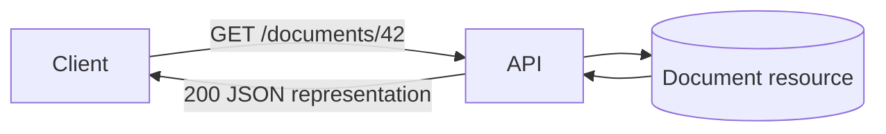
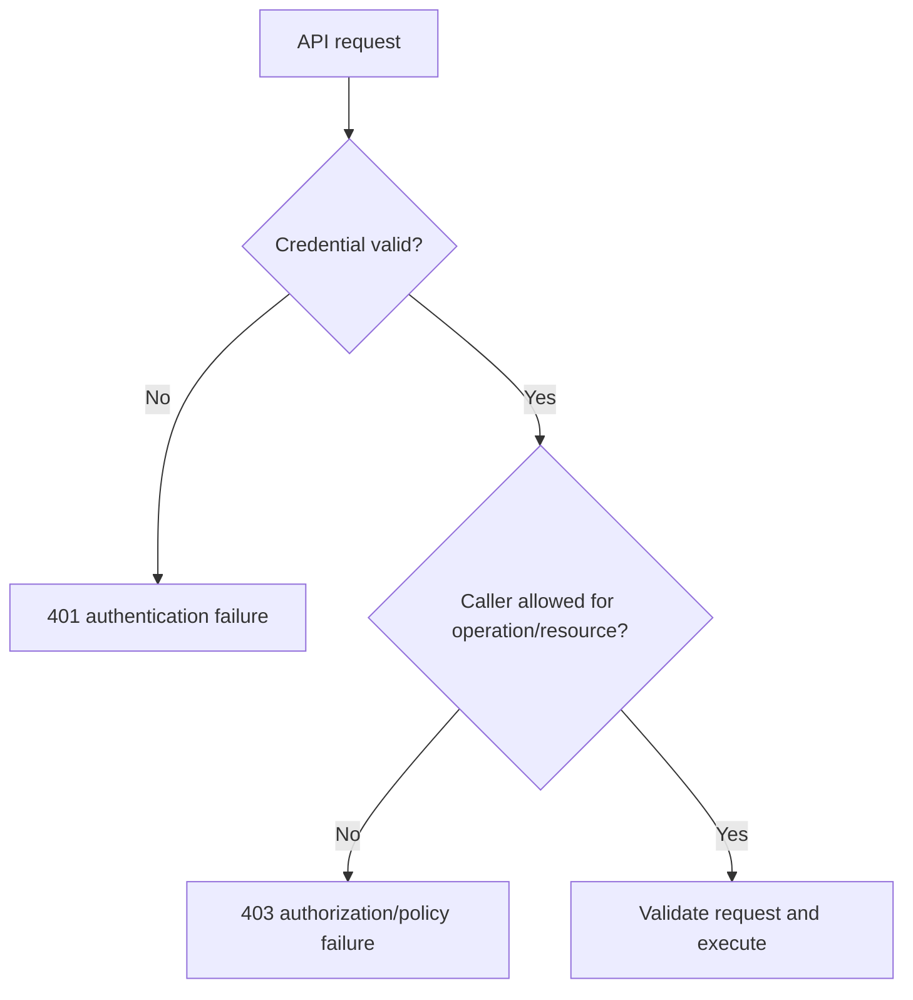
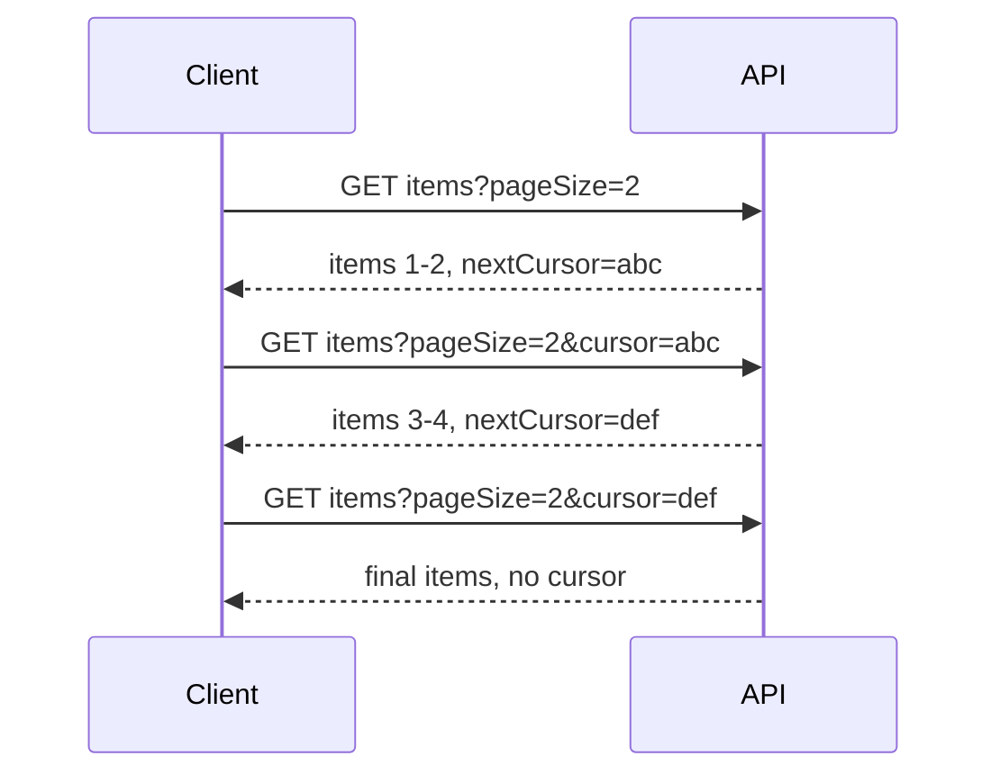
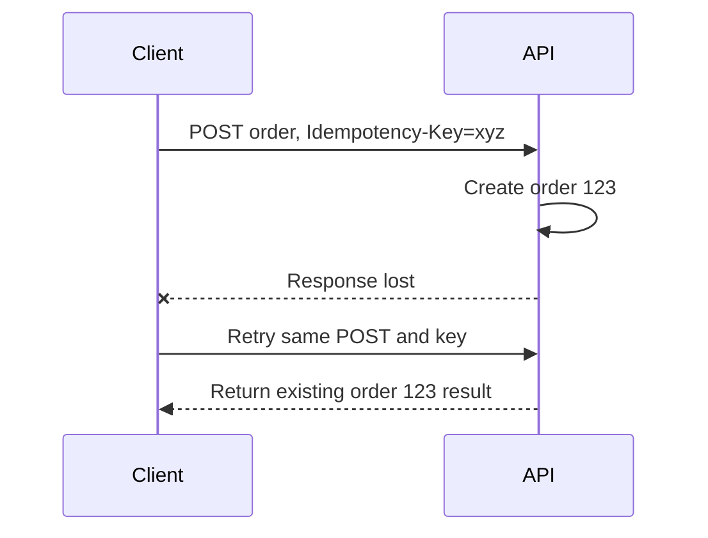
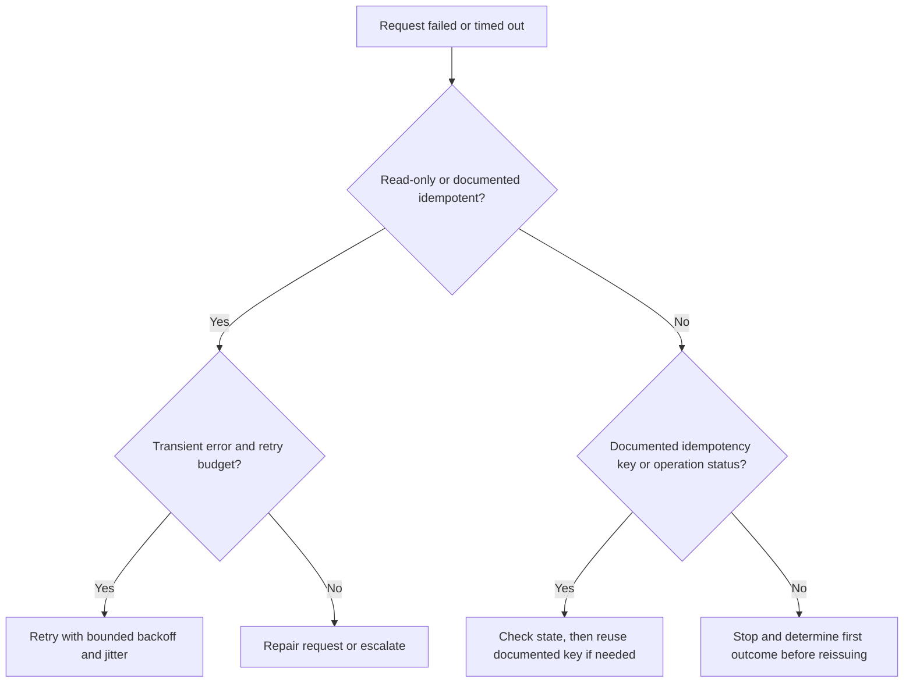
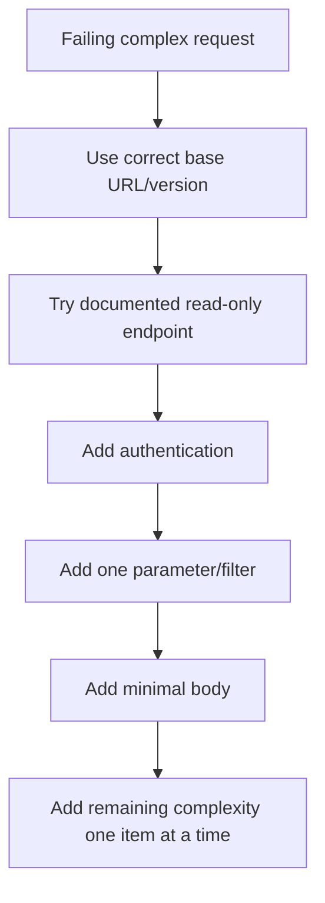

# Part 8 - REST API Troubleshooting with Postman and cURL

> **Section goal:** Build, inspect, and troubleshoot HTTP APIs methodically using Postman and cURL, with special attention to caller identity, request shape, pagination, idempotency, rate limits, safe retries, and useful escalation evidence.
>
> **Maps to JD:** must-have REST API troubleshooting, SaaS integrations, root-cause isolation, logs/browser traces, customer communication, and content-source verification.

## Evidence Safety and Honesty

Use test accounts and harmless resources. Keep tokens, credentials, cookies, and customer payloads confidential. Store sensitive values in approved protected storage or Postman Vault, never in shared collections, screenshots, shell history, source control, or tickets. This Part builds lab familiarity, not a claim of production Glean API administration.

---

## JD Mapping

| Requirement | Practice in this Part |
|---|---|
| Troubleshoot REST APIs | Execute a request checklist from URL through response semantics |
| Configure SaaS integrations | Validate authentication, scopes, versions, pagination, and rate limits |
| Analyze logs and traces | Correlate request IDs, UTC time, status, body, and server evidence |
| Root-cause isolation | Separate network, authentication, authorization, validation, state, quota, and server failures |
| Document issues | Produce a minimal reproducible request with sensitive values removed |

---

## 1. What REST Means

REST is an architectural style for networked systems. A REST-like API usually exposes **resources** through URLs and uses HTTP semantics.

- **Resource:** Business object such as document, user, connector, or search result.
- **Representation:** JSON or another format describing a resource.
- **Endpoint:** Method plus URL used to interact with the API.
- **Stateless:** Each request carries the context needed for the server to process it; the server does not rely on hidden conversational state between requests.



### Plain-English deep-dive: Resource vs action

A resource-oriented API treats `/documents/42` as a noun and uses HTTP methods to read or change it. Some operations are actions, such as `/documents/42:reindex`.

**Analogy:** The URL is a file folder; the method says whether you read, create, replace, modify, or remove its contents.

The exact design varies. Troubleshoot the documented contract, not an imagined pure-REST ideal.

---

## 2. Request Anatomy

```text
Method + URL
Query/path parameters
Headers
Authentication
Body
Timeout/retry behavior
Caller identity and environment
```

| Element | Example | Common failure |
|---|---|---|
| Base URL | `https://api.example.com` | Wrong region/tenant/environment |
| Version | `/v1` or version header | Unsupported/deprecated version |
| Path parameter | `/documents/42` | Wrong encoding or ID |
| Query parameter | `?pageSize=50` | Wrong name/type/filter |
| Header | `Content-Type: application/json` | Missing/wrong media type |
| Authentication | Bearer token | Expired/wrong audience/token type |
| Body | JSON object | Invalid syntax/schema/value |
| User context | User-scoped credential | Wrong user/permission |

### Path vs query vs body

| Location | Best for |
|---|---|
| Path | Identifying resource or hierarchy |
| Query | Filtering, sorting, pagination, optional behavior |
| Header | Metadata/auth/content negotiation/correlation |
| Body | Structured create/update/action input |

---

## 3. JSON Fundamentals

```json
{
  "query": "quarterly planning",
  "pageSize": 10,
  "filters": ["confluence", "sharepoint"],
  "includeArchived": false,
  "cursor": null
}
```

| JSON type | Example |
|---|---|
| Object | `{"name":"Arti"}` |
| Array | `["a","b"]` |
| String | `"ten"` |
| Number | `10` |
| Boolean | `true` |
| Null | `null` |

JSON requires double quotes around keys/strings. `null`, an omitted field, empty string, empty array, and zero can have different meanings.

### Common payload errors

- Trailing comma.
- Single quotes.
- Number sent as string.
- Wrong property casing.
- Missing required field.
- Unknown field rejected by strict schema.
- Invalid enum/date/time zone.
- Body does not match `Content-Type`.
- Shell quoting changes JSON.

---

## 4. Authentication and Authorization



### Credential patterns

| Pattern | Sent as | Support note |
|---|---|---|
| API key | Header/query, per documentation | Key scope, rotation, environment |
| Bearer token | `Authorization: Bearer ...` | Expiry, issuer, audience, scopes, user |
| Basic auth | Encoded username/password | Use only over TLS and where explicitly supported |
| OAuth token | Bearer token from authorization flow | Client, grant, scopes, tenant, consent |
| mTLS | Client certificate during TLS | Certificate/key/trust/identity |

### Glean public API distinction

| API family | Public authentication model | Context |
|---|---|---|
| Client API | OAuth or user-scoped Glean-issued token | Search results reflect authenticated user's permitted content |
| Indexing API | Glean-issued Indexing API token; public docs state OAuth is not supported | Service-level datasource/indexing operations with token/app scope |

Always confirm current Glean documentation and deployment behavior.

---

## 5. API Status Diagnosis

| Status | Category | Discriminating questions |
|---|---|---|
| 400 | Invalid request | Is JSON valid? Required fields? Header/body match? |
| 401 | Authentication | Correct token type, expiry, issuer, audience, signature? |
| 403 | Authorization/policy | Correct user, role, scope, datasource, IP restriction? |
| 404 | Resource/route | Base URL, version, tenant, path, ID, hidden unauthorized object? |
| 409 | State conflict | Duplicate ID, optimistic version, workflow state, idempotency key? |
| 413 | Too large | Body/file/document limit and supported bulk/chunk method? |
| 415 | Media type | Correct `Content-Type` and encoding? |
| 422 | Semantically invalid | Correct syntax but invalid field values/business rule? |
| 429 | Rate limit | Quota, concurrency, `Retry-After`, caller/source? |
| 500 | Server error | Request ID, reproducibility, status, server logs, safe retry? |
| 502 | Bad upstream response | Gateway-to-service path and backend health? |
| 503 | Unavailable | Maintenance, capacity, dependency, retry guidance? |
| 504 | Upstream timeout | Backend/dependency latency and operation size? |

### Plain-English deep-dive: HTTP success vs business success

A `200` can contain an empty result set or an application-level failure field. A `202` means accepted for later processing, not completed. A successful indexing request may still require asynchronous verification.

**Analogy:** A courier accepting a parcel is not proof it reached the recipient.

---

## 6. Error Bodies and Correlation IDs

A useful error response may include:

```json
{
  "error": "invalid_request",
  "message": "pageSize must be between 1 and 100",
  "field": "pageSize",
  "requestId": "req-7f21",
  "timestamp": "2026-08-24T12:30:00Z"
}
```

Capture:

- Status and reason.
- Error code/message/field.
- Request or correlation ID.
- UTC time.
- Method and sanitized URL.
- Caller context.
- Response headers such as `Retry-After`.

Do not paste a raw authorization header into an escalation.

---

## 7. Pagination

APIs limit response size and return pages.

| Model | Client sends | Server returns | Risk |
|---|---|---|---|
| Offset/page | Page number or offset | Items and total/next page | Changes can cause duplicates/skips |
| Cursor | Opaque cursor | Items and next cursor | Cursor expiry/wrong query reuse |
| Continuation token | Service token | Items and token | Token must remain opaque |
| Link header | Current URL | `next` relation | Client must parse/follow safely |



### Pagination bugs

- Only first page processed.
- Cursor reused with changed filters.
- Infinite loop on repeated cursor.
- No deduplication where needed.
- Items change during offset pagination.
- Rate limit ignored across pages.
- Empty page incorrectly treated as completion despite next token.

---

## 8. Rate Limits, Backoff, Jitter, and Quotas

Rate limits protect service capacity and fairness.

Evidence can appear in:

- `429`.
- `Retry-After`.
- Limit/remaining/reset headers, if documented.
- Error body.
- API dashboard or server logs.

### Retry formula

$$
\operatorname{delay}=\min(\operatorname{cap},\operatorname{base}\cdot2^{attempt})+\operatorname{jitter}
$$

Respect `Retry-After` where provided. Reduce concurrency, batch appropriately, and coordinate quota changes rather than increasing retries without understanding the cause.

---

## 9. Safe Retries and Idempotency

| Request | Retry posture |
|---|---|
| GET/HEAD | Usually safe if no unusual side effects |
| PUT/DELETE | Semantically idempotent, but verify API contract |
| POST/PATCH/action | Do not assume safe; use documented idempotency key/status lookup |
| Timeout after request body sent | Outcome may be unknown; check operation state before reissuing |
| 400/401/403 | Fix request/auth; repeated identical retry is wasteful |
| 429/502/503/504 | Controlled retry if method/operation is safe |

### Idempotency key

An API may accept a unique key so repeated create attempts map to one logical operation.



Do not invent an idempotency header if the API does not document one.

### Plain-English deep-dive: Retry vs reissue

A retry repeats an operation after a failure. Reissuing may repeat an operation whose first outcome is unknown. The difference matters most for writes.

**Analogy:** If a payment confirmation page times out, submitting payment again may charge twice. First check whether the original payment exists.



---

## 10. API Versions and Compatibility

Version may be in:

- URL path.
- Header.
- Media type.
- Date/version parameter.

Check:

- Endpoint and documentation version.
- Deprecation/sunset headers or notices.
- Client library version.
- Required/removed fields.
- Changed enum or pagination behavior.
- Regional/tenant rollout differences.

A sudden `404` after an upgrade may be a version/route issue rather than missing data.

---

## 11. Postman Workflow, Tests, and Vault

1. Create an environment for base URL and harmless IDs.
2. Store sensitive values in Postman Vault or approved protected handling, not shared variables.
3. Build method and URL.
4. Add path/query parameters through the Params UI.
5. Select documented authorization type.
6. Add headers.
7. Add body and correct media type.
8. Send once.
9. Inspect status, headers, body, size, and timing.
10. Open Postman Console for actual request detail where approved.
11. Save sanitized examples and tests, not live credentials.

### Useful test assertions

```javascript
pm.test("status is successful", () => {
  pm.expect(pm.response.code).to.be.oneOf([200, 201, 202, 204]);
});

pm.test("request ID is present", () => {
  pm.expect(pm.response.headers.has("X-Request-ID")).to.eql(true);
});
```

Adapt to the documented contract. Do not assert that every successful operation must be `200`.

---

## 12. cURL Workflow

### Safe Echo GET

```powershell
curl.exe --show-error --verbose "https://postman-echo.com/get?topic=search&page=1"
```

### Safe Echo POST JSON

```powershell
curl.exe --show-error --request POST `
  --header "Content-Type: application/json" `
  --data-raw '{"topic":"search","mode":"practice"}' `
  https://postman-echo.com/post
```

On Bash:

```bash
curl --show-error --request POST \
  --header 'Content-Type: application/json' \
  --data-raw '{"topic":"search","mode":"practice"}' \
  https://postman-echo.com/post
```

### Timing without sensitive values

```bash
curl --output /dev/null --silent --show-error \
  --write-out 'code=%{response_code} dns=%{time_namelookup} connect=%{time_connect} tls=%{time_appconnect} first_byte=%{time_starttransfer} total=%{time_total}\n' \
  https://postman-echo.com/get
```

Use `NUL` instead of `/dev/null` where appropriate on Windows.

### cURL cautions

- `--verbose` and traces may show sensitive headers/data.
- Do not put live tokens in shared command history.
- Certificate-validation bypass options remove peer verification and are not a fix.
- `--location-trusted` can forward credentials to another host; avoid unless specifically justified and approved.
- Avoid retry settings that indiscriminately repeat failures and can duplicate side effects.
- Quote URLs containing `&`, `?`, braces, or shell-special characters.

---

## 13. Minimal Reproduction Strategy

Start with the smallest read-only request that proves authentication and endpoint access.



For Glean Indexing API, public docs recommend a read-only datasource configuration/status request before document writes. For Client API, test with a user-scoped query expected to return permitted content.

---

## 14. Troubleshooting Matrix

| Symptom | Leading hypotheses | Discriminating test |
|---|---|---|
| cURL exit 6 | DNS | Resolve from same environment |
| cURL exit 7 | TCP connect | Part 6 port/path checks |
| cURL exit 35/60 | TLS | Chain/hostname/trust evidence |
| 400 | Request syntax/schema | Compare minimal documented request |
| 401 | Credential invalid/type/expiry | Read-only auth test, token metadata |
| 403 | Role/scope/IP/resource policy | Same token to allowed resource; inspect scope |
| 404 | Route/version/tenant/ID | Known-good endpoint and exact effective URL |
| 409 | Duplicate/version/workflow | Read current resource state |
| 429 | Quota/concurrency | Retry headers and request-rate timeline |
| 500 only for one payload | Server defect or edge case | Reduce payload to minimal reproducer |
| 503 for all callers | Service/dependency/capacity | Status/health and controlled retry |
| Timeout after POST | Unknown commit state | Query operation/resource before reissuing |

---

## 15. Glean API Support Context

### Client API search

Public Glean docs describe a user-scoped permission-aware request. An empty result list can be a successful HTTP response and may reflect query or access, not transport failure.

### Indexing API

Public Glean docs describe Glean-issued Indexing API tokens, datasource scoping, expiration, optional IP restriction, rotation, asynchronous processing, rate limits, and separate verification.

### Support boundaries

- Request accepted is not indexing complete.
- Datasource enabled does not override document ACL.
- User-scoped search result depends on caller identity.
- Do not swap Client and Indexing token types.
- Keep production tokens out of Postman workspaces and command history.

---

## 16. Hands-On Echo Lab

Perform only harmless Echo operations.

| Step | Request | Prove |
|---:|---|---|
| 1 | GET with two query parameters | URL encoding and echoed args |
| 2 | POST JSON | Body and `Content-Type` |
| 3 | Add `X-Lab-ID` header | Header transmission |
| 4 | Set connect/total timeout | Client timer behavior |
| 5 | Record timing with cURL write-out | DNS/connect/TLS/TTFB/total |
| 6 | Save Postman request without sensitive values | Reusable collection hygiene |
| 7 | Add status/body assertions | Contract validation |

Record command/tool version, UTC time, method, effective URL, status, and sanitized response.

---

## 17. Failure Card Lab: 400 Through 5xx

For each card, state: proven layer, likely causes, next safe check, retry decision, and customer update.

| Card | Evidence |
|---|---|
| 400 | `pageSize` string instead of integer |
| 401 | Token expired ten minutes earlier |
| 403 | Valid token lacks datasource app scope |
| 404 | Client calls `/v2` but tenant supports documented `/v1` route |
| 409 | Same stable ID conflicts with incompatible object state |
| 413 | Single document exceeds documented request limit |
| 415 | JSON body sent as `text/plain` |
| 422 | Valid JSON contains unsupported enum |
| 429 | `Retry-After: 30`; client runs 100 concurrent requests |
| 500 | One specific valid payload consistently triggers request ID-linked server exception |
| 502 | Gateway cannot obtain valid backend response |
| 503 | Service reports maintenance/unavailable |
| 504 | Gateway waits beyond upstream timeout |

### Expected retry reasoning

- Repair 400/401/403/404/409/413/415/422 before retrying.
- For 429, honor guidance and reduce rate/concurrency.
- For transient 5xx, retry only safe/idempotent operations with bounded backoff.
- For unknown POST outcome, query state or use documented idempotency behavior before reissuing.

---

## 18. API Escalation Template

```text
Customer/business impact:
Environment/tenant/region:
UTC reproduction time:
Method and sanitized effective URL:
API/version:
Caller/token type and sanitized scope metadata:
Request headers/body, sanitized:
Status, response headers, error body:
Request/correlation ID:
Network/TLS result:
Expected vs actual:
Known-good comparison:
Reproduction frequency:
Retry/workaround already attempted:
Security/data sensitivity:
```

Weak: "API returns 500."

Strong: "POST `/v1/index` returns 500 only when `objectType=PolicyPDF`; text documents return 202 with the same scoped test token. Reproduced three times in test datasource at 12:30-12:34 UTC. Request IDs attached; payload reduced to one harmless object. No retries after the third controlled reproduction."

---

## Likely Interview Questions for This Section

### Q1. "How do you troubleshoot a REST API failure?"

> **Model answer:** "I capture method, effective URL/version, parameters, headers, body, caller context, UTC time, status, error body, and request ID. I first separate DNS/TCP/TLS from HTTP. Then I classify authentication, authorization, validation, resource/state, rate-limit, or server failure. I reduce to a documented read-only request, add complexity one variable at a time, compare known-good context, and retry only when semantics make it safe."

### Q2. "What is idempotency and why does it matter?"

> **Model answer:** "An idempotent operation has the same intended final state when repeated. It matters after timeouts because the server may have committed even though the response was lost. GET is normally safe to repeat; POST is not assumed safe unless the API documents an idempotency key or status lookup."

### Q3. "How do you distinguish 401 and 403?"

> **Model answer:** "401 points to missing or invalid authentication, while 403 means the credential is recognized but lacks authorization or violates policy. I check token type, expiry, issuer/audience first, then caller role, scope, resource ACL, datasource scope, or IP restriction."

### Q4. "How do you handle 429?"

> **Model answer:** "I inspect `Retry-After` and documented quota headers, identify caller and concurrency, stop aggressive retry, and use bounded exponential backoff with jitter. I reduce request rate or batch according to API guidance and verify backlog recovery."

### Q5. "What information belongs in an API escalation?"

> **Model answer:** "Business impact, environment, UTC time, sanitized method/URL/version/request, caller context without sensitive values, status/error/body, response headers, correlation ID, expected vs actual, controls, reproduction rate, and safe attempts. It should let engineering reproduce without requesting live credentials."

### Q6. "How do you troubleshoot pagination?"

> **Model answer:** "I identify offset, cursor, continuation, or link model; verify the client follows every next token without changing query context; detect repeated cursors; inspect empty pages with continuation; account for concurrent data changes; and reconcile counts or stable IDs where possible."

### Q7. "A POST timed out. Do you retry?"

> **Model answer:** "Not automatically. The request may have committed. I inspect documented idempotency behavior, operation ID, resource state, server logs/request ID, and whether a safe status endpoint exists. I retry with the same key only if the contract supports it."

### Q8. "What is different about Glean Client and Indexing API context?"

> **Model answer:** "Public Glean docs describe Client API use with OAuth or user-scoped credentials so results reflect that user's permitted content. The Indexing API uses Glean-issued indexing tokens for datasource/content administration and does not use OAuth according to current public docs. Token type, scope, caller context, and asynchronous verification are therefore distinct."

---

## 30-Second Memory Hooks

- **Request:** Method + URL + params + headers + auth + body.
- **REST:** Resources represented over HTTP; troubleshoot the documented contract.
- **401:** Credential invalid. **403:** Credential valid, action forbidden.
- **Pagination:** Follow the server's continuation until it ends.
- **429:** Slow down and honor guidance.
- **Idempotency:** Safe convergence under repetition.
- **POST timeout:** Outcome unknown until checked.
- **202:** Accepted, not completed.
- **Request ID:** Bridge between customer evidence and server logs.
- **Minimal reproduction:** Read-only first, one variable at a time.

---

## Completion Checklist

- [ ] I can build GET and POST requests in Postman and cURL.
- [ ] I can validate JSON, headers, parameters, and content type.
- [ ] I can classify 400/401/403/404/409/413/415/422/429/5xx.
- [ ] I can explain cursor pagination, rate limits, backoff, and idempotency.
- [ ] I can decide whether a failed operation is safe to retry.
- [ ] I completed Echo and failure-card labs.
- [ ] I can produce an engineering-ready sanitized escalation.
- [ ] I can distinguish current public Glean Client and Indexing API authentication contexts.

---

## Official Source Anchors

- [Postman Echo](https://learning.postman.com/docs/developer/echo-api/)
- [Postman requests](https://learning.postman.com/docs/sending-requests/requests/)
- [curl man page](https://curl.se/docs/manpage.html)
- [Glean Client API quickstart](https://developers.glean.com/api-info/client/getting-started/overview)
- [Glean Indexing API authentication](https://developers.glean.com/api-info/indexing/authentication/overview)

---

*Next suggested section: Part 9 - Identity and Access. Open [Part-09-identity-sso-saml-oauth-oidc-scim.md](Part-09-identity-sso-saml-oauth-oidc-scim.md). It explains SSO, SAML, OAuth 2.0, OpenID Connect, JWTs, and SCIM provisioning from first principles.*
