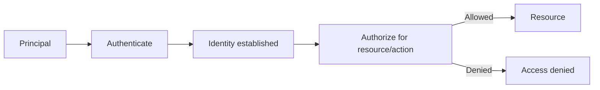
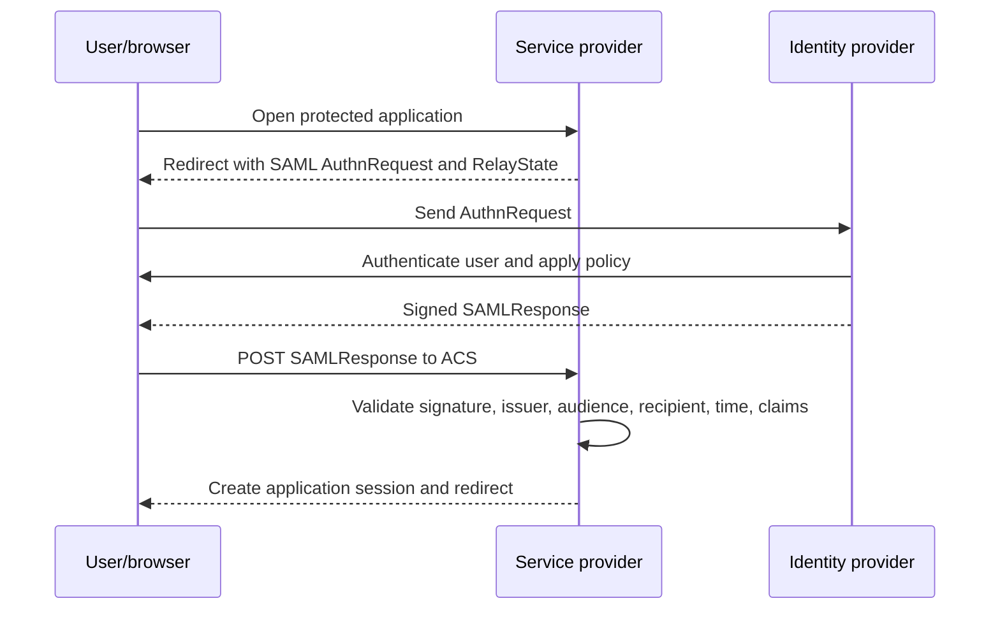
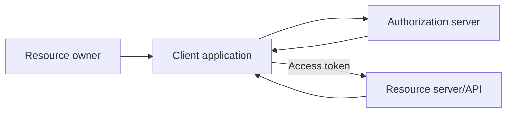
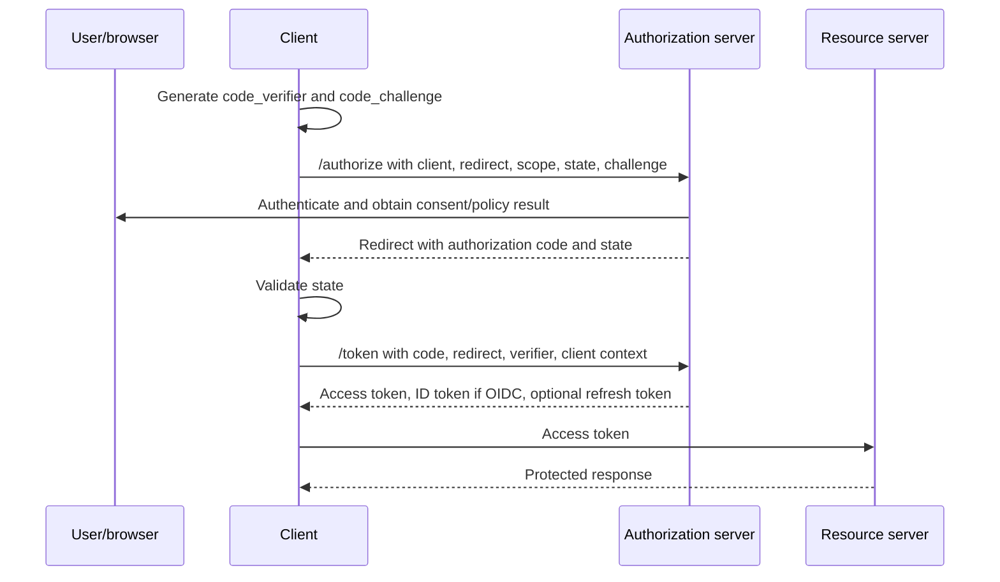
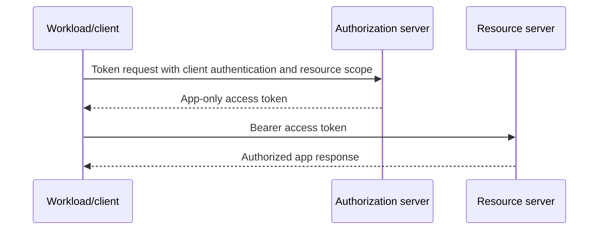
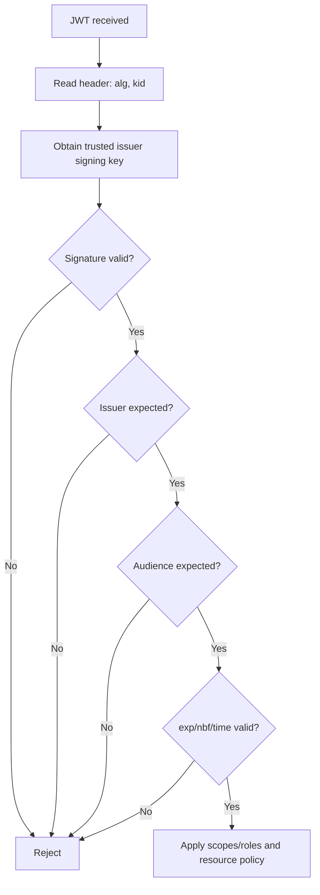
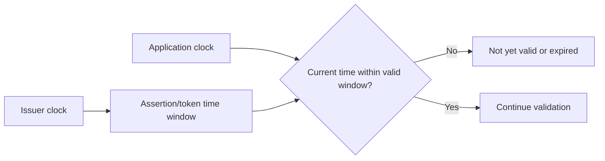
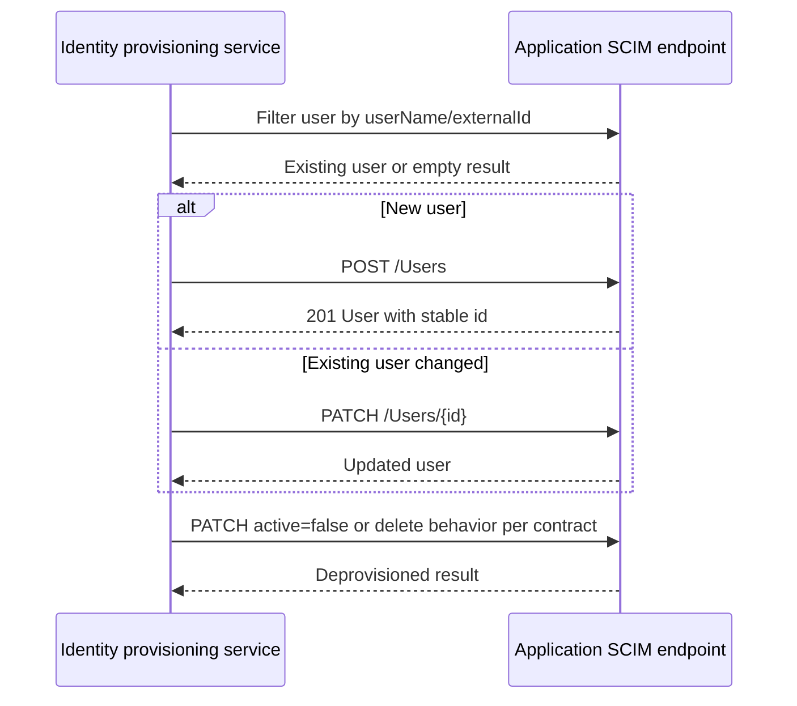
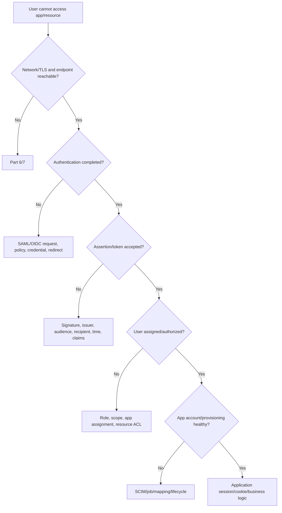

# Part 9 - Identity and Access: SSO, SAML, OAuth 2.0, OIDC, and SCIM

> **Section goal:** Explain enterprise identity protocols from first principles and troubleshoot login, token, consent, role, provisioning, and lifecycle failures using browser traces, protocol fields, and identity logs.
>
> **Maps to JD:** working experience with SSO, SAML, OAuth, network troubleshooting, SaaS integrations, secure customer access, and root-cause isolation.

> **Candidate honesty note:** This Part creates interview-ready protocol fluency. It does not claim production ownership of every identity protocol. Connect answers to real Active Directory, Azure, Microsoft 365, permissions, and enterprise-support experience, then state where knowledge is lab-based.

---

## JD Mapping

| Requirement | Preparation |
|---|---|
| SSO/SAML/OAuth | Whiteboard flows and field-level failure matrices |
| SaaS integration | Register endpoints, identifiers, certificates, scopes, claims, and provisioning |
| Network/browser troubleshooting | Follow redirects, POSTs, cookies, TLS, and correlation IDs |
| Security processes | Validate issuer, audience, signature, time, nonce/state, and least privilege |
| User health | Separate authentication, assignment, entitlement, provisioning, and application session |

---

## 1. Identity Vocabulary

| Term | Meaning |
|---|---|
| Identity | Representation of a user, service, device, or workload |
| Authentication | Prove who or what the principal is |
| Authorization | Decide what that principal may do |
| Principal | User/service/workload acting in a system |
| Identity provider (IdP) | Authenticates and issues identity/security statements |
| Service provider (SP) | Application relying on SAML identity assertion |
| Relying party | Application trusting an identity provider/token issuer |
| Single sign-on (SSO) | Authenticate once and access multiple integrated apps |
| Federation | Trust relationship between identity/security domains |
| Claim | Statement about identity or context |
| Entitlement | Application access, role, license, or permission |

### Plain-English deep-dive: Authentication is not authorization

A valid employee badge proves identity. The door policy decides which rooms that employee may enter.

A user can authenticate successfully and still receive `403`, no application assignment, no role, or no document access.



---

## 2. Four Protocols, Four Jobs

| Protocol | Primary job | Typical artifact |
|---|---|---|
| SAML 2.0 | Browser enterprise SSO/federation | XML assertion/response |
| OAuth 2.0 | Delegated authorization to APIs | Access token |
| OpenID Connect (OIDC) | Authentication layer on OAuth 2.0 | ID token plus OAuth artifacts |
| SCIM 2.0 | User/group provisioning lifecycle | JSON Users/Groups and PATCH operations |

Do not say "OAuth logs the user in" without qualification. OIDC defines authentication semantics; OAuth alone is about authorization.

---

## 3. SAML Roles and Metadata

SAML means Security Assertion Markup Language.

| Role/artifact | Purpose |
|---|---|
| IdP | Authenticates user and signs response/assertion |
| SP | Requests/accepts assertion and creates app session |
| Entity ID | Unique identifier for IdP or SP |
| SSO URL | IdP endpoint receiving SAML request |
| ACS URL | Assertion Consumer Service endpoint receiving response |
| Metadata XML | Identifiers, endpoints, certificates, supported bindings |
| Signing certificate | Verifies response/assertion signature |
| RelayState | Preserves destination/application state |

### SP-initiated flow



### IdP-initiated flow

The user launches an application from the IdP. There may be no original SP AuthnRequest. Some applications support only one initiation mode.

### Bindings

- HTTP Redirect binding often carries compressed/encoded `SAMLRequest` in URL.
- HTTP POST binding usually posts `SAMLResponse` in form data.

---

## 4. Inside SAML Request and Response

### AuthnRequest fields

| Field | Why it matters |
|---|---|
| Issuer | Identifies SP/application configuration |
| AssertionConsumerServiceURL | Where response should be delivered |
| Destination | IdP endpoint |
| Request ID | Correlates request/response |
| IssueInstant | Request time |
| NameIDPolicy | Requested subject identifier format |

### Response/assertion fields

| Field | Validation |
|---|---|
| Issuer | Expected trusted IdP |
| Signature | Valid under configured signing certificate/key |
| InResponseTo | Matches request where applicable |
| Status | Success or protocol error |
| NameID | User identifier expected by SP |
| Audience | Intended SP/entity ID |
| Recipient | Correct ACS URL |
| NotBefore/NotOnOrAfter | Assertion valid at current time |
| AuthnContext | Authentication method/context |
| Attributes/claims | Required email, name, role, groups, etc. |

### Plain-English deep-dive: Signed does not mean valid for this app

A signature can prove who signed an assertion and that it was not modified. The SP must still verify audience, recipient, time window, request correlation, and required claims.

**Analogy:** A genuine passport is not automatically a valid ticket for every flight.

---

## 5. SAML Failure Matrix

| Symptom | Leading checks |
|---|---|
| IdP cannot find app | AuthnRequest Issuer/entity ID |
| Response posts to wrong URL | ACS/Recipient/redirect configuration |
| Signature invalid | Current signing certificate, algorithm, metadata rollover |
| Assertion expired/not yet valid | Client/SP clock and Conditions |
| Audience mismatch | SP entity ID vs Audience |
| User not found | NameID format/value and account mapping |
| Missing role | Attribute mapping and application role logic |
| Login succeeds, app errors | Retrieve response; SP rejected claim/signature/audience/session |
| Loop | Session cookie, RelayState, initiation mode, ACS outcome |
| One user fails | Assignment, claims, group, NameID, app user state |

### SAML trace checklist

```text
UTC time and correlation/request ID:
Initiation mode:
SP entity ID and ACS:
IdP SSO endpoint:
AuthnRequest Issuer/Destination/ACS/ID:
Response Issuer/Destination/InResponseTo/Status:
Signature certificate thumbprint/validity, no private key:
Assertion Audience/Recipient/Conditions:
NameID and required claims, sanitized:
Application session result:
```

---

## 6. OAuth 2.0 Roles

| Role | Job |
|---|---|
| Resource owner | Usually the user owning/controlling data |
| Client | Application requesting access |
| Authorization server | Authenticates/authorizes and issues tokens |
| Resource server | API accepting access token |



### Scope and consent

- **Scope:** Delegated permission requested by client.
- **Consent:** User/admin approval for requested permissions.
- **Role/application permission:** App-only permission used by workload identity.
- **Least privilege:** Request only needed access.

---

## 7. Authorization Code Flow with PKCE

PKCE means Proof Key for Code Exchange.



### Key parameters

| Parameter | Purpose/failure |
|---|---|
| client_id | Identifies app registration |
| redirect_uri | Must match registered and token exchange value |
| scope | Requested permissions/OIDC scopes |
| state | Correlates response and mitigates request forgery |
| code_challenge | Derived from verifier at authorization time |
| code_verifier | Proves same client redeems code |
| nonce | OIDC replay/correlation protection for ID token |
| response_type | Requested artifact, commonly code |

Public clients cannot safely hold a long-lived confidential client credential. Authorization code with PKCE is the standard modern pattern for SPA/native scenarios.

---

## 8. Client Credentials Flow

Used for workload-to-workload app-only access without a user.



Checks include client ID, tenant/authority, certificate or protected client credential, application permission/admin consent, token audience, and API role.

Do not use client credentials from browser code.

---

## 9. OpenID Connect

OIDC adds authentication and identity claims to OAuth 2.0.

| Artifact | Audience/user |
|---|---|
| ID token | Client application; proves authentication and carries identity claims |
| Access token | Resource server/API; authorizes API call |
| Refresh token | Client uses to obtain new tokens; handle as highly sensitive value |
| UserInfo | Optional OIDC endpoint returning user claims |
| Discovery document | Publishes endpoints, issuer, supported features, JWKS URI |
| JWKS | Public signing keys used for JWT verification |

Never send an ID token to an API as a substitute for an access token unless that API explicitly defines such a nonstandard contract.

---

## 10. JWT Structure and Validation

JWT means JSON Web Token. It has Base64URL-encoded parts:

```text
header.payload.signature
```

Decoding is not validation.



### Important claims

| Claim | Meaning |
|---|---|
| iss | Issuer |
| aud | Intended audience/API/client |
| sub | Subject identifier |
| exp | Expiration |
| nbf | Not valid before |
| iat | Issued at |
| tid | Tenant identifier in Microsoft context |
| scp | Delegated scopes in Microsoft access tokens |
| roles | Application roles/app permissions |
| nonce | OIDC request correlation/replay protection |

### Plain-English deep-dive: Token inspection vs token validation

A decoder shows claims without proving the signature or trust. Validation requires trusted metadata/keys and claim checks.

**Analogy:** Reading a printed badge does not prove it was issued by security.

Do not paste production tokens into public decoder websites.

---

## 11. OAuth/OIDC Failure Matrix

| Error/symptom | Checks |
|---|---|
| redirect URI mismatch | Exact registered URI, scheme/host/port/path/platform |
| invalid_client | Client authentication, certificate/credential, app ID |
| invalid_grant | Expired/reused code, verifier mismatch, redirect mismatch |
| invalid_scope | Scope spelling/resource/registration/consent |
| consent_required | Consent policy and correct authorize flow |
| interaction_required | MFA/Conditional Access/session/user interaction |
| invalid audience at API | Token requested for wrong resource |
| expired/not yet valid | Token lifetime and clocks |
| signature/key failure | Issuer metadata, key ID, signing-key rollover |
| 401 from API | Token missing/invalid/expired/audience |
| 403 from API | Valid token lacks scope/role/resource permission |
| one tenant fails | Authority, app type, consent, assignment, tenant policy |
| SPA CORS token error | Correct SPA redirect platform and auth-code/PKCE flow |

Capture `error`, `error_description`, timestamp, trace ID, correlation ID, and sanitized request parameters.

---

## 12. Clock Skew

SAML Conditions and JWT `nbf`/`exp` depend on time.



Check authoritative time synchronization on IdP, SP/API, proxy where relevant, and test client. Do not extend token lifetime as the first fix for a broken clock.

---

## 13. SCIM Provisioning

SCIM means System for Cross-Domain Identity Management. It synchronizes users and groups between an identity system and application.

### Lifecycle



### SCIM objects/operations

| Concept | Purpose |
|---|---|
| `/Users` | User resources |
| `/Groups` | Group resources/memberships |
| `externalId` | Identifier from provisioning client/source |
| `id` | Identifier assigned by SCIM service provider |
| `userName` | User login identifier, often unique |
| `active` | Enable/disable lifecycle state |
| POST | Create |
| GET/filter | Query/reconcile |
| PATCH | Partial update |
| DELETE | Removal if contract uses it |
| Schemas/ServiceProviderConfig | Capability/schema discovery |

### SCIM failure patterns

| Symptom | Checks |
|---|---|
| Duplicate user | Filter behavior, normalization, externalId/userName uniqueness |
| User never created | Assignment/scope, endpoint auth, schema, 4xx response |
| Attribute missing | Mapping, source null, SCIM schema, PATCH behavior |
| Group members missing | Group provisioning enabled, membership PATCH, object order |
| Disabled user still active | `active` mapping, PATCH path/value type, app behavior |
| Endless retry | Non-compliant status/body, timeout, throttling |
| One user skipped | Provisioning logs, scoping filter, source attributes |

Provisioning is asynchronous. Record cycle/job, object, request/response, UTC time, and target state.

---

## 14. SSO vs Provisioning

| Question | SSO | SCIM provisioning |
|---|---|---|
| Can user authenticate now? | Yes | No |
| Does app account exist before login? | Maybe JIT or pre-created | Usually yes after sync |
| Carries browser assertion/token? | Yes | No, API lifecycle calls |
| Creates/disables users/groups? | Not its primary job | Yes |
| Failure evidence | Browser redirect/assertion/app session | Provisioning job/API logs |

A user can exist through SCIM but fail SSO. A user can authenticate through SSO but lack a provisioned account/assignment.

---

## 15. Identity Troubleshooting Workflow



### Evidence packet

```text
Affected user/object and expected access:
UTC time, tenant, app, environment:
Initiation mode and exact URL:
Browser redirect/HAR evidence, sanitized:
Identity sign-in result/error/correlation ID:
SAML issuer/ACS/audience/recipient/time/NameID/claims, sanitized:
OAuth client/authority/redirect/scope/grant, sanitized:
Token metadata: issuer/audience/time/scopes/roles/key ID, no token value:
Assignment/role/resource ACL:
SCIM job/object/mapping/request status:
Known-good user comparison:
```

---

## 16. Hands-On Paper Lab: SAML App Rejects Response

Evidence:

- User authenticates at IdP.
- Signed response reaches ACS.
- SP returns "invalid audience."
- AuthnRequest Issuer is `https://app.example.com/saml`.
- SP expects entity ID `https://app.example.com/saml/metadata`.

Tasks:

1. Identify proven stages.
2. Compare request issuer, assertion audience, and configured SP entity ID.
3. Explain why replacing signing certificate does not address audience mismatch.
4. Define repair and validation.
5. Draft customer update.

---

## 17. Hands-On Paper Lab: OAuth 401 vs 403

Evidence A:

- API receives access token.
- Token audience is another API.
- Result: `401`.

Evidence B:

- Audience is correct.
- Signature/time valid.
- Token delegated scope lacks `Documents.Read`.
- Result: `403`.

Explain the different repairs: request token for correct resource vs obtain/consent required scope and enforce least privilege.

---

## 18. Hands-On Paper Lab: User Disabled but App Access Remains

Possible paths:

- Source user disabled.
- SCIM cycle has not run.
- PATCH failed.
- Target ignored `active=false`.
- Existing application session remains valid.
- SSO policy still allows authentication through another identity.

Build a timeline across source state, provisioning job, SCIM response, target user state, sign-in, and session revocation.

---

## Likely Interview Questions for This Section

### Q1. "What is the difference between authentication and authorization?"

> **Model answer:** "Authentication establishes the principal's identity. Authorization evaluates whether that principal can perform an action on a resource. A user can sign in successfully but still lack application assignment, OAuth scope, role, or document permission."

### Q2. "Walk me through SAML SSO."

> **Model answer:** "In SP-initiated SSO, the app redirects the browser to the IdP with an AuthnRequest. The IdP authenticates the user and returns a signed SAMLResponse through the browser to the app's ACS. The SP validates signature, issuer, audience, recipient, time, request correlation, NameID, and claims, then creates its own session."

### Q3. "What is the difference between OAuth and OIDC?"

> **Model answer:** "OAuth 2.0 delegates authorization to APIs through access tokens. OIDC adds authentication semantics, including ID tokens, discovery, user identity claims, and nonce handling. The client consumes an ID token; the resource API consumes an access token."

### Q4. "How does authorization code with PKCE work?"

> **Model answer:** "The client creates a verifier and sends a derived challenge in the authorization request. After user authentication and consent, it receives a short-lived code and validates state. It redeems the code with the original verifier and matching redirect URI. A stolen code alone cannot be redeemed without the verifier."

### Q5. "How do you validate a JWT?"

> **Model answer:** "I use trusted issuer metadata and signing keys to verify signature and acceptable algorithm, then validate issuer, audience, expiration/not-before, tenant/context, and required scopes or roles. Decoding claims alone is not validation."

### Q6. "How do you troubleshoot SAML signature or certificate rollover?"

> **Model answer:** "I capture the response safely, identify which certificate/key ID signed it, compare with current IdP metadata and SP trust, check validity and rollover timing, and ensure the correct metadata/configuration is active. I still validate audience, recipient, time, and claims because a valid signature is only one gate."

### Q7. "What does SCIM do?"

> **Model answer:** "SCIM is a JSON/HTTP standard for provisioning users and groups. A provisioning client filters for existing objects, creates or patches users/groups, manages memberships, and disables or removes accounts. I troubleshoot source assignment, scope, endpoint auth, filters, attribute mapping, status/body compliance, target state, and asynchronous job logs."

### Q8. "A user can sign in but cannot access content. Where do you look?"

> **Model answer:** "Authentication is already partly proven. I check whether the assertion/token is accepted, then application assignment, role, OAuth scope, resource ACL, user provisioning/account state, and application session. I compare a known-good user and preserve correlation IDs and exact resource context."

---

## 30-Second Memory Hooks

- **Authentication:** Who are you? **Authorization:** May you do this?
- **SAML:** Signed XML assertion for browser SSO.
- **ACS:** Where the SP consumes SAML response.
- **Audience:** Which app/token recipient is intended.
- **OAuth:** Delegated API authorization.
- **OIDC:** Authentication added to OAuth.
- **ID token:** For client. **Access token:** For API.
- **PKCE:** Code is useless without verifier.
- **JWT:** Decode is not validate.
- **SCIM:** Provision, update, group, disable.
- **SSO is not provisioning:** Login and account lifecycle are separate.

---

## Completion Checklist

- [ ] I can distinguish SAML, OAuth, OIDC, and SCIM.
- [ ] I can whiteboard SP-initiated SAML and auth-code/PKCE.
- [ ] I can validate SAML signature, issuer, audience, recipient, time, and claims.
- [ ] I can distinguish ID, access, and refresh tokens.
- [ ] I can validate JWT metadata without sharing token values.
- [ ] I can distinguish OAuth 401 from 403.
- [ ] I can troubleshoot SCIM create/update/group/disable flows.
- [ ] I completed all three identity labs aloud.

---

## Official Source Anchors

- [Microsoft identity platform protocols](https://learn.microsoft.com/entra/identity-platform/v2-protocols)
- [OAuth authorization code flow](https://learn.microsoft.com/entra/identity-platform/v2-oauth2-auth-code-flow)
- [OpenID Connect](https://learn.microsoft.com/entra/identity-platform/v2-protocols-oidc)
- [SAML SSO protocol](https://learn.microsoft.com/entra/identity-platform/single-sign-on-saml-protocol)
- [Debug SAML SSO](https://learn.microsoft.com/entra/identity/enterprise-apps/debug-saml-sso-issues)
- [SCIM provisioning](https://learn.microsoft.com/entra/identity/app-provisioning/use-scim-to-provision-users-and-groups)

---

*Next suggested section: Part 10 - Logs, Stack Traces, HAR, and Correlation. Open [Part-10-logs-stack-traces-har-and-correlation.md](Part-10-logs-stack-traces-har-and-correlation.md). It teaches evidence timelines across distributed components.*
