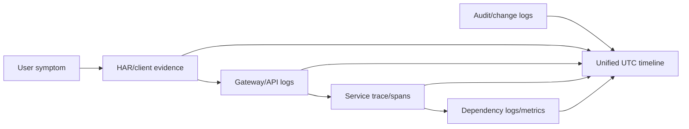
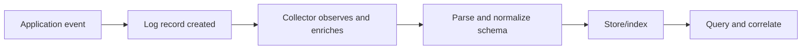
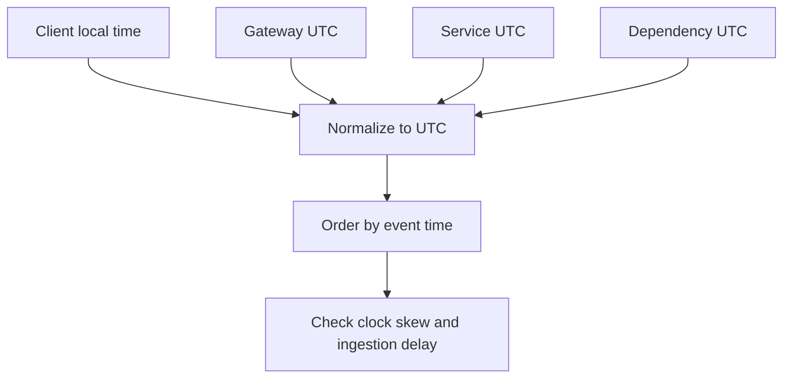
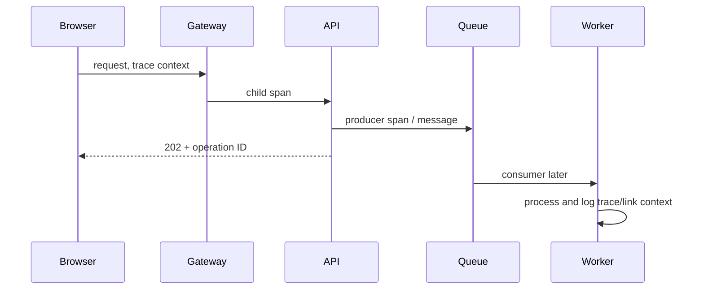
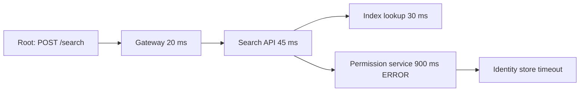
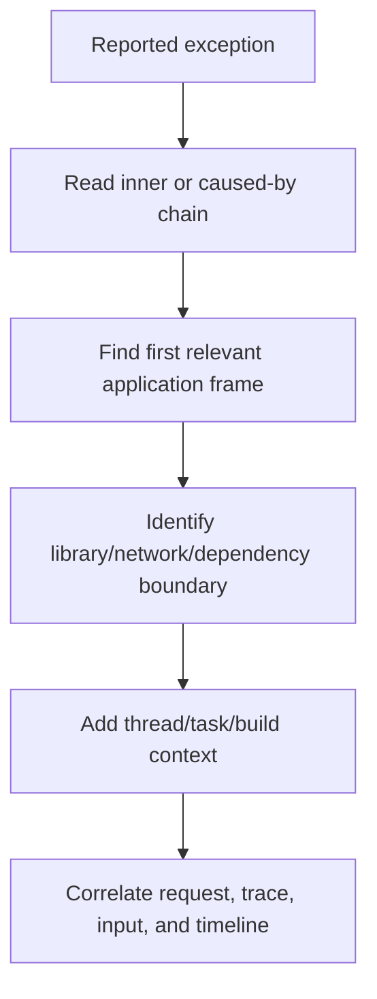
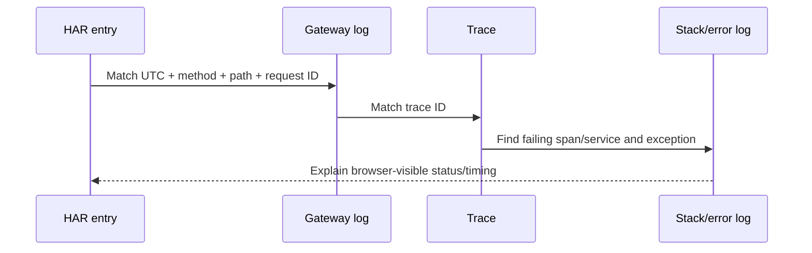
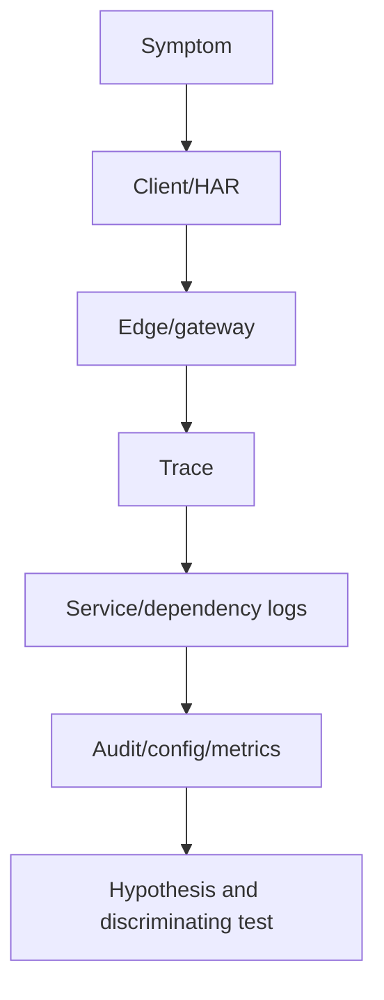

# Part 10 - Logs, Stack Traces, HAR Files, and Evidence Correlation

> **Section goal:** Turn scattered client, browser, service, identity, connector, and backend evidence into one defensible timeline that identifies the failing component without confusing symptoms for causes.
>
> **Maps to JD:** search/read application logs, analyze stack traces and browser traces, isolate root cause, document cases, coordinate internal teams, and provide precise customer updates.

> **Evidence rule:** Use approved access, collect the minimum necessary data, preserve originals, work from copies, normalize timestamps, and remove credentials, tokens, cookies, personal data, and restricted content before sharing.

---

## JD Mapping

| Requirement | Practice |
|---|---|
| Read application logs | Parse severity, fields, exceptions, IDs, and state transitions |
| Analyze stack traces | Identify exception type, origin, propagation, async boundaries, and missing symbols |
| Analyze browser traces | Correlate HAR requests, redirects, errors, timing, and initiators |
| Root-cause isolation | Join evidence by UTC, trace/request ID, user/object, and dependency |
| Document issues | Build evidence inventory, timeline, hypothesis table, and escalation packet |

---

## 1. Observability Signals

| Signal | Answers |
|---|---|
| Logs | What event/message occurred? |
| Traces | Where did one operation travel and spend time? |
| Metrics | How much/how often over time? |
| HAR/browser trace | What did this browser request/receive/block? |
| Stack trace | Which code path was active when an exception/failure surfaced? |
| Audit log | Who changed what configuration/permission and when? |
| Packet capture | What network packets crossed this capture point? |



No single signal automatically contains the complete truth.

---

## 2. Structured, Semi-Structured, and Unstructured Logs

A log is a timestamped record of an event with optional metadata.

### Structured Logs

Structured logs use a stable schema and typed fields that tools can parse consistently.

### Semi-Structured Logs

Semi-structured logs contain useful key/value or JSON-like fields, but field names or types may vary and require normalization.

### Unstructured Logs

Unstructured logs are free-form messages. They can be readable but are harder to query and correlate reliably at scale.

### Structured vs unstructured

| Type | Example | Strength |
|---|---|---|
| Structured | JSON/stable typed fields | Reliable filtering, aggregation, correlation |
| Semistructured | Key/value or variable JSON | Easier than free text but needs normalization |
| Unstructured | Human sentence | Readable, harder to parse at scale |

### Useful fields

```json
{
  "timestamp": "2026-08-24T12:30:15.412Z",
  "severity": "ERROR",
  "service": "connector-worker",
  "environment": "production",
  "traceId": "8f21...",
  "spanId": "41ac...",
  "requestId": "req-2048",
  "operation": "FetchChanges",
  "datasource": "sharepoint-test",
  "status": 429,
  "durationMs": 30125,
  "message": "Source API rate limited"
}
```



| Log-record field | Diagnostic use |
|---|---|
| Timestamp | Order producer events |
| Observed timestamp | Detect collection delay |
| Severity | Prioritize, not prove cause |
| Service/environment | Locate emitter |
| Trace/span/request ID | Join operation evidence |
| Event name/body | Describe what occurred |
| Attributes | Filter by tenant, route, object, status, duration |

### Plain-English deep-dive: A log line is an observation, not automatically a cause

`ERROR database timeout` in a frontend service may be the final symptom of thread-pool starvation, network loss, overloaded database, or an overly short client deadline.

**Analogy:** A smoke alarm proves smoke at the sensor, not where the fire started.

---

## 3. Severity and Signal Quality

| Level | Typical purpose | Caution |
|---|---|---|
| TRACE | Very detailed execution | High volume/sensitive risk |
| DEBUG | Diagnostic state | May be disabled in production |
| INFO | Normal lifecycle/business event | High volume is not failure |
| WARN | Degraded/unexpected but continuing | Can precede customer impact |
| ERROR | Operation failed | May be handled/retried successfully |
| FATAL/CRITICAL | Process/system cannot continue | Naming varies by platform |

Do not filter only ERROR. A WARN five seconds earlier may contain the causal quota or certificate warning, while ERROR is a downstream consequence.

### Evidence strength

| Evidence | Strength |
|---|---|
| Controlled reproduction plus matching IDs | High |
| Direct service/audit record | High |
| Trace across dependencies | High |
| Aggregate metric aligned to incident | Medium/high |
| Screenshot without IDs/time | Limited |
| Memory/paraphrase | Low |
| Assumption | Not evidence |

---

## 4. Time and Clock Normalization

Record all events in UTC with subsecond precision where available.

| Time field | Meaning |
|---|---|
| Event timestamp | When producer says event happened |
| Observed/ingestion timestamp | When collector received event |
| Client time | May be skewed |
| Server time | Different host clock |
| HAR startedDateTime | Browser request start |
| Duration | Time interval, often more reliable than wall-clock alignment |



### Clock-skew clues

- Response appears before request.
- Token is "not yet valid."
- Same request ID differs by fixed offset.
- Ingestion time is much later than event time.

Never silently mix time zones in an incident timeline.

---

## 5. Correlation IDs and Distributed Context

A correlation/request ID helps locate one operation across components.

OpenTelemetry traces use:

- **Trace ID:** Entire distributed operation.
- **Span ID:** One operation/unit within trace.
- **Parent span ID:** Relationship to calling span.
- **Attributes:** Method, route, service, status, object, etc.
- **Events:** Meaningful timestamped points inside a span.
- **Links:** Causal relationship for asynchronous work.



### `traceparent` concept

W3C Trace Context defines a standard header carrying trace and parent identifiers plus flags. Treat these as correlation metadata, not authorization credentials.

### Plain-English deep-dive: Trace vs request ID

A request ID may identify one HTTP hop. A trace ID can connect many nested or downstream operations. An asynchronous job may need an operation ID or span link because it starts after the original response.

**Analogy:** Request ID is one flight number; trace ID is the entire multi-flight itinerary.

---

## 6. Distributed Trace Reading



Ask:

- Which span first becomes slow/error?
- Is parent duration mostly child duration?
- Which dependency dominates critical path?
- Did retries multiply work?
- Was error handled or propagated?
- Are spans missing because context was not propagated/sampled?
- Does trace status match actual operation semantics?

A missing span is not proof a call never occurred; instrumentation or sampling may be incomplete.

---

## 7. Stack Trace Fundamentals

A stack trace lists active/recorded call frames when an exception or diagnostic capture occurred.

```text
TimeoutError: permission lookup exceeded 500 ms
  at PermissionClient.getAccess(permission_client.py:142)
  at SearchService.filterResults(search_service.py:311)
  at SearchController.query(controller.py:88)
Caused by: ConnectionPoolTimeout
  at HttpPool.acquire(pool.py:57)
```

### Frame fields

| Field | Meaning |
|---|---|
| Exception type/message | Failure classification/context |
| Function/method | Code operation |
| Module/file | Owning component/source |
| Line/offset | Code location, build-dependent |
| Cause/inner exception | Underlying wrapped failure |
| Thread/task | Execution context |

### Read direction carefully

Languages format stacks differently. Identify:

1. Top-level exception reported.
2. Inner/caused-by chain.
3. First frame owned by relevant application.
4. Boundary into library/framework/network.
5. Caller context.



| Stack evidence | Question |
|---|---|
| Exception type/message | What failure surfaced? |
| Inner exception | What lower-level condition was wrapped? |
| Application frame | Which owned operation handled it? |
| Boundary frame | Which dependency/library was entered? |
| Thread/task | What execution context was active? |
| Build/symbol/source map | Can addresses/lines be trusted? |

### Plain-English deep-dive: Faulting frame vs root cause

The frame throwing an exception may only enforce a timeout or report invalid state. Root cause can be a slower dependency or earlier corruption.

**Analogy:** The cashier saying "card declined" is where failure surfaces, not necessarily why the bank declined it.

---

## 8. Async and Distributed Stack Limitations

- Async/await can split logical flow across tasks.
- Thread-pool callback may not show original requester.
- Optimized/inlined code may change frames.
- Missing symbols can shorten/mislabel stacks.
- Minified browser JavaScript needs source maps.
- Wrapped exceptions can hide inner cause if logging is poor.
- Remote dependency does not appear as local call frames.

Use task/activity IDs, inner exceptions, trace IDs, and server logs to reconstruct logical flow.

---

## 9. Stack Trace Classifications

| Pattern | First direction |
|---|---|
| Null/invalid reference | Validate object lifecycle/input, not only null-check symptom |
| Timeout/deadline | Identify which wait/dependency and configured deadline |
| Connection refused/reset | Network/server lifecycle from Part 6 |
| Authentication exception | Token/assertion/certificate context from Part 9 |
| Parser/serialization | Input format/schema/encoding/object type |
| Permission denied | Caller/resource/policy, not authentication alone |
| Out of memory | Process/system memory, allocation pattern, leak/load |
| Rate-limit exception | Quota/concurrency/backoff |
| Repeated recursive frames | Recursion/cycle/stack exhaustion |
| Lock/wait frames | Contention/deadlock/blocked dependency |

Do not diagnose from one function name without exception, parameters, thread, timeline, and surrounding evidence.

---

## 10. HAR Correlation

HAR provides browser-side HTTP entries.

| HAR field | Correlate with |
|---|---|
| startedDateTime | Server UTC timeline |
| request URL/method | Gateway route/access log |
| request headers | Correlation/trace header, sanitized |
| status/response headers | Server/gateway response |
| timings | DNS/connect/TLS/wait/download |
| redirectURL | Next browser entry |
| cookies | Session behavior, never share raw value |
| initiator (DevTools import/UI) | JavaScript/redirect source |



Sanitized HAR may remove common sensitive headers, but inspect URLs and bodies before transfer.

---

## 11. Evidence Collection Order

1. Define exact symptom and original reproduction.
2. Record UTC window, user/test identity, object, source, environment.
3. Capture browser/client request and correlation ID.
4. Locate edge/gateway response.
5. Follow trace or IDs into service logs.
6. Inspect first anomalous dependency/span.
7. Read exception/stack and inner cause.
8. Compare known-good request.
9. Check metrics/change/audit around same time.
10. Form and test causal hypothesis.



---

## 12. Search Strategy and Filter Progression

Start narrow:

- Exact request/trace/operation ID.
- UTC window around reproduction.
- Affected tenant/datasource/object ID.
- Service/component.
- Error code/status.

Then widen only if needed.

| Search pass | Filter |
|---|---|
| 1 | Exact trace/request/operation ID |
| 2 | Same ID plus UTC window and service |
| 3 | Same tenant/object/error code around window |
| 4 | Compare known-good request under same context |
| 5 | Widen to metric/change pattern only when IDs are missing |

### Avoid

- Searching entire day for word `error` and choosing first hit.
- Ignoring timezone/clock skew.
- Treating duplicate retry errors as independent root causes.
- Filtering out WARN/INFO lifecycle events.
- Sharing raw payloads or tokens.
- Editing original logs.

---

## 13. Evidence Inventory

| Artifact | Source/owner | Time range | IDs | Sanitized | Purpose |
|---|---|---|---|---|---|
| HAR | Customer browser | 12:29-12:31 UTC | req-2048 | Yes | Client request/response |
| Gateway log | Edge team | same | req-2048/trace-8f | Yes | Routing/status |
| Trace | Observability | same | trace-8f | Yes | Dependency path |
| Worker log | Connector service | same | span-41 | Yes | Exception/retry |
| Audit | Customer admin | 12:00-12:40 | config event | Yes | Recent change |

Track provenance and access restrictions.

---

## 14. Unified Timeline Template

```text
UTC timestamp | component | event | ID | evidence source | confidence | interpretation
```

Example:

| UTC | Component | Event | ID | Interpretation |
|---|---|---|---|---|
| 12:30:15.000 | Browser | POST /search | req-2048 | User action starts |
| 12:30:15.020 | Gateway | Forward to search-api | trace-8f | Edge healthy |
| 12:30:15.080 | Search API | Permission call | span-41 | Dependency starts |
| 12:30:16.081 | Search API | Deadline exceeded | span-41 | First failure |
| 12:30:16.090 | Gateway | Return 504 | req-2048 | Browser symptom |

Root direction: permission dependency, not browser DNS or gateway routing.

---

## 15. Evidence-to-Hypothesis Table

| Hypothesis | Predicted evidence | Observed | Status |
|---|---|---|---|
| Browser CORS block | Server response but console blocks read | HAR has 504, no CORS error | Rejected |
| Gateway timeout due to backend | Gateway 504 after backend wait | Trace shows 1s dependency deadline | Supported |
| Permission service slow | Permission span dominates and errors | 900-1000 ms timeout repeated | Stronger |
| Database downstream cause | Permission trace child times out | Identity-store child span error | Strongest current |

This prevents an attractive stack frame from becoming root cause without corroboration.

---

## 16. Log Redaction and Safe Handling

Use least-privilege access and maintain chain of custody: record who collected, copied, sanitized, stored, transferred, and deleted each artifact. Secret values, passwords, private keys, and session material must remain confidential and must not be copied into ordinary case notes.

Redact or tokenize:

- Authorization/cookies/session values.
- SAML assertions/JWTs.
- Client credentials/private keys.
- Personal data.
- Customer document contents.
- Internal infrastructure identifiers according to policy.

Preserve diagnostically useful metadata:

- Header name and whether present.
- Token type and non-sensitive claims metadata.
- Certificate subject/issuer/thumbprint/validity, not private key.
- Error code, request ID, trace ID.
- Object type and harmless test ID.
- Timing/status/size.

Never turn on verbose production logging broadly without evaluating performance, retention, and data-exposure risk.

---

## 17. Engineering Escalation Packet

```text
Impact and affected scope:
UTC reproduction window:
Expected vs actual:
Exact safe reproduction:
Affected and known-good controls:
Client/HAR summary:
Request/trace/operation IDs:
Unified timeline:
First anomalous span/log event:
Exception and stack summary:
Relevant metrics/audit/change:
Hypotheses tested and rejected:
Current causal statement:
Mitigation/customer update:
Artifact locations and access policy:
```

Include excerpts, not uncontrolled multi-gigabyte dumps, unless engineering requests them through an approved channel.

---

## 18. Hands-On Lab: Distributed Timeout

### Evidence

- Browser HAR: POST returns 504 after 1.1 seconds.
- Gateway: forwards in 20 ms and waits for search API.
- Search trace: permission call consumes 900 ms.
- Permission service: connection-pool acquisition times out.
- Database metrics: normal query latency, connection count at configured maximum.
- Deployment audit: new worker release increased parallel permission calls 20 minutes earlier.

### Tasks

1. Build UTC timeline.
2. Distinguish browser symptom, gateway response, immediate cause, and root mechanism.
3. Explain why database query latency is not the issue.
4. State a mitigation and evidence to preserve.
5. Propose corrective/detective actions.
6. Draft customer update without exposing internals unnecessarily.

Expected causal direction: increased concurrency exhausted permission-service connection pool; gateway 504 and browser failure are downstream symptoms.

---

## 19. Contextless-Stack Lab

Given only:

```text
TimeoutError at SearchController.query
```

List what is missing:

- Build/version.
- Full exception chain.
- Request/trace ID.
- User/tenant/object.
- UTC time.
- Thread/task.
- Dependency timings.
- Reproduction.
- Controls.
- Recent changes.

Create an evidence request that is minimal and actionable rather than asking for "all logs."

---

## Likely Interview Questions for This Section

### Q1. "How do you approach application logs?"

> **Model answer:** "I begin with exact UTC reproduction and request/trace/object context, then search by IDs rather than broad error text. I include lifecycle INFO/WARN events, normalize time, identify first anomalous event, follow downstream dependencies, compare a known-good request, and treat log statements as observations that must support a causal mechanism."

### Q2. "How do you read a stack trace?"

> **Model answer:** "I identify top-level and inner exception chain, first relevant application frame, library/dependency boundary, thread or task, and build/symbol context. I do not assume the throw site is root cause; I correlate request IDs, traces, logs, inputs, and timelines."

### Q3. "What is a distributed trace?"

> **Model answer:** "A trace represents one operation across services as spans. Spans carry trace ID, span ID, parent relationship, timestamps, attributes, events, status, and links. Context propagation lets us assemble client, server, producer, and consumer work and locate the slow or failing dependency."

### Q4. "How do you correlate HAR with backend logs?"

> **Model answer:** "I use UTC time, method/path, user/test context, request or trace header, status, and duration. I locate the gateway entry, follow trace into service/dependency spans, and match the browser-visible response to the first backend anomaly. I sanitize HAR and preserve provenance."

### Q5. "What is the difference between trace ID and span ID?"

> **Model answer:** "Trace ID identifies the complete distributed operation. Span ID identifies one unit of work within that trace. Parent IDs establish hierarchy; links connect causally related asynchronous work where direct parentage is unsuitable."

### Q6. "Why are structured logs better?"

> **Model answer:** "Stable typed fields make logs reliably filterable, aggregatable, and correlatable with traces and metrics. JSON alone is not enough if field names/types vary. Useful fields include UTC event time, observed time, service, environment, severity, operation, trace/span/request IDs, status, duration, and safe attributes."

### Q7. "How do you handle sensitive trace data?"

> **Model answer:** "I use approved access and minimal reproduction, prefer sanitized export, redact credentials/session values/assertions/personal content, preserve useful metadata, store artifacts in controlled locations, document provenance and retention, and avoid broad verbose logging without a data-risk review."

### Q8. "A stack shows a timeout. What do you do next?"

> **Model answer:** "I identify what operation was waiting, configured deadline, dependency span, request context, and whether timeout is connect, pool, read, or overall request. I correlate with dependency logs/metrics and controls. Timeout is a symptom until the wait and mechanism are established."

---

## 30-Second Memory Hooks

- **Logs:** Events. **Traces:** Path. **Metrics:** Trend. **HAR:** Browser HTTP. **Stack:** Code path.
- **UTC first:** Time is the join key when IDs fail.
- **Trace ID:** Whole journey. **Span ID:** One stop.
- **Throw site:** Where failure surfaced, not always why.
- **Inner exception:** Often closer to mechanism.
- **HAR:** Browser timeline, not packet capture.
- **First anomaly:** Follow upstream from visible symptom.
- **Evidence:** Observation plus provenance.
- **Redaction:** Remove values, preserve diagnostic structure.

---

## Completion Checklist

- [ ] I can distinguish logs, traces, metrics, HAR, stack, audit, and packet evidence.
- [ ] I can normalize event/observed times to UTC.
- [ ] I can follow trace/span/parent/link context.
- [ ] I can read exception chains and async limitations.
- [ ] I can correlate HAR to gateway, service, dependency, and audit evidence.
- [ ] I can build an evidence inventory and unified timeline.
- [ ] I completed both evidence labs.
- [ ] I can produce a sanitized engineering escalation packet.

---

## Official Source Anchors

- [OpenTelemetry logs](https://opentelemetry.io/docs/concepts/signals/logs/)
- [OpenTelemetry traces](https://opentelemetry.io/docs/concepts/signals/traces/)
- [W3C Trace Context](https://www.w3.org/TR/trace-context/)
- [Chrome HAR export](https://developer.chrome.com/docs/devtools/network/reference#save-all-network-requests-to-a-har-file)

---

*Next suggested section: Part 11 - Cloud Support Across Azure, AWS, and GCP. Open [Part-11-cloud-support-azure-aws-gcp.md](Part-11-cloud-support-azure-aws-gcp.md). It maps the cloud control planes and services that host the evidence and dependencies introduced here.*
