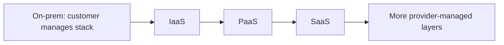
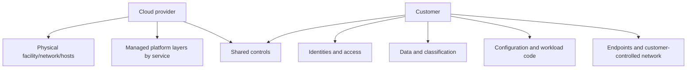
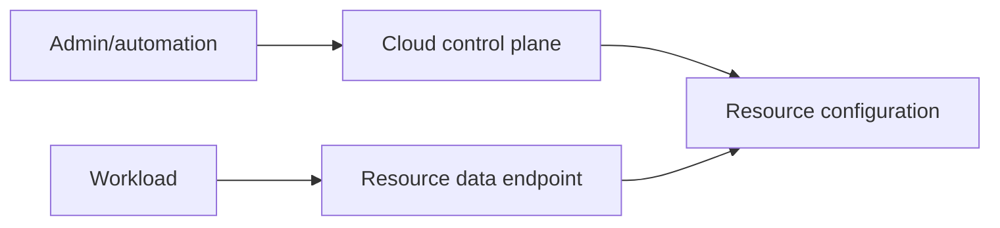
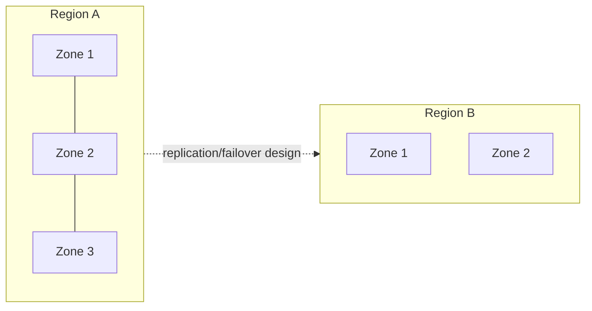
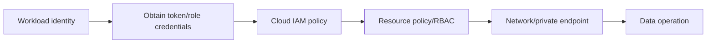
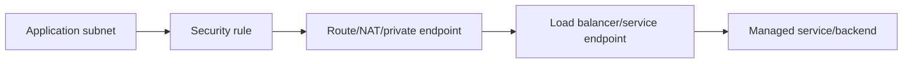
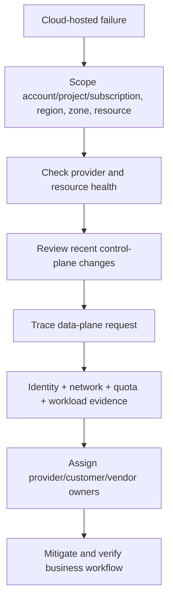

# Part 11 - Cloud Support Across Azure, AWS, and GCP

> **Section goal:** Troubleshoot cloud-hosted SaaS systems using cloud-neutral categories, understand shared responsibility, and translate strong Azure knowledge into AWS and Google Cloud without pretending equal product depth.
>
> **Maps to JD:** cloud experience, SaaS integration support, system health, alerts, security processes, networking, APIs, and cross-team coordination.

> **Candidate positioning:** Azure is your strongest cloud foundation. Use category mapping to reason about AWS and GCP, and say when service-specific operational experience is newly developed.

---

## JD Mapping

| Requirement | Preparation |
|---|---|
| Azure/AWS/GCP | Map equivalent control-plane categories and support evidence |
| Root-cause analysis | Separate provider, customer configuration, workload, and dependency failures |
| Security/access | Diagnose identity, role, network, encryption, and secret boundaries |
| Alerts/health | Use service, resource, workload, and application signals |
| SaaS integrations | Trace public/private endpoints, quotas, regions, and managed identities |

---

## 1. Cloud Service Models

| Model | Provider manages more | Customer still owns |
|---|---|---|
| IaaS | Physical infrastructure and virtualization | Guest OS, applications, data, identities, network configuration |
| PaaS | Infrastructure, OS, runtime/platform | Application/configuration, identities, data, network/access choices |
| SaaS | Complete hosted application stack | Data governance, users, access, configuration, endpoints |



### Plain-English deep-dive: Managed does not mean responsibility-free

A managed database removes server patching, but the customer still chooses identity, network access, schema, data protection, capacity tier, queries, and resilience configuration.

**Analogy:** A managed apartment includes building maintenance; the resident still controls keys, occupants, belongings, and safe use.

---

## 2. Shared Responsibility

Azure and AWS official guidance both emphasize that responsibility changes by service model. Customers always retain important responsibility for data, identity/access, and configuration.



### Incident ownership questions

- Is failing component provider-managed or customer-managed?
- Is service healthy but resource misconfigured?
- Is customer responsible for failover/zone deployment?
- Which logs are provider-visible versus customer-visible?
- Is support case with SaaS vendor, cloud provider, customer workload, or multiple parties?

"Cloud issue" is a scope, not a root cause.

---

## 3. Control Plane vs Data Plane

| Plane | Purpose | Failure example |
|---|---|---|
| Control plane | Create/configure/list/manage resources | Portal cannot update firewall rule |
| Data plane | Use resource's actual service endpoint | App cannot read object from storage |

A control-plane success does not prove data-plane network or authorization. A storage account can exist and be manageable while object reads return `403`.

### Plain-English deep-dive: Resource exists vs workload works

The cloud portal can successfully display a resource while the workload cannot resolve its private endpoint, obtain a valid identity, or access its data.

**Analogy:** A building appears in the property registry, but that does not prove your route, badge, or office application works.

| Evidence owner | Typical evidence |
|---|---|
| Cloud provider | Regional incident, platform health, managed-service fault |
| Customer cloud admin | Audit changes, IAM/RBAC, resource configuration, quota |
| Customer network/security | DNS, routes, firewall, private endpoint, proxy |
| Workload/application | Deployment, logs, traces, connection/payload behavior |
| SaaS/vendor support | Product tenant, connector, service-specific backend evidence |



---

## 4. Cloud Category Map

| Category | Azure | AWS | Google Cloud |
|---|---|---|---|
| Identity/access | Microsoft Entra ID, managed identities, RBAC | IAM users/roles/policies, instance roles | Cloud IAM, service accounts |
| Virtual compute | Virtual Machines | EC2 | Compute Engine |
| Managed containers | AKS | EKS/ECS | GKE |
| Serverless compute | Functions, Container Apps | Lambda, Fargate | Cloud Functions, Cloud Run |
| Object storage | Blob Storage | S3 | Cloud Storage |
| Network | VNet, NSG, Load Balancer/Application Gateway | VPC, security groups, ALB/NLB | VPC, firewall rules, Cloud Load Balancing |
| Private service access | Private Link/private endpoints | PrivateLink/VPC endpoints | Private Service Connect |
| Secrets/keys | Key Vault | Secrets Manager, KMS | Secret Manager, Cloud KMS |
| Logs/metrics | Azure Monitor, Log Analytics, Application Insights | CloudWatch, CloudTrail, X-Ray | Cloud Logging, Monitoring, Trace, Audit Logs |
| Health | Azure Service Health/Resource Health | AWS Health Dashboard | Personalized Service Health |
| Quotas | Subscription/service quotas | Service Quotas | Cloud Quotas |

Names are memory aids, not proof of identical behavior.

---

## 5. Regions, Zones, and Resilience

- **Region:** Geographic cloud deployment area.
- **Availability zone:** Physically separated datacenter grouping/location within a region.
- **Zonal resource:** Lives in one zone.
- **Zone-redundant/multi-zone:** Uses multiple zones.
- **Multi-region:** Uses more than one region.
- **Data residency:** Requirement controlling geographic storage/processing.



### Support questions

| Symptom | Check |
|---|---|
| Only one zone impacted | Zonal placement and failover |
| Entire region impacted | Multi-region plan/status |
| Failover did not occur | Automatic vs customer-managed design |
| Resource missing in portal | Selected subscription/account/project and region |
| Latency increased | Cross-zone/region route and dependency location |

### Plain-English deep-dive: Zone is not region

Multiple zones protect against a zone failure, not necessarily a full regional event. Multi-region adds resilience but also replication, consistency, cost, and data-residency decisions.

---

## 6. Identity in Cloud Support

### Human vs workload identity

Human identity troubleshooting focuses on the signed-in administrator or user: tenant/account/project, role assignment, MFA or policy, session, and resource scope. Workload identity troubleshooting focuses on the application, service account, managed identity, or IAM role and its trust/token path.

| Identity | Example | Risk |
|---|---|---|
| Human | Admin/support engineer | Excess role, stale account, MFA/policy |
| Workload | Managed identity/service account/IAM role | Wrong assignment, trust, token audience |
| External/federated | Customer IdP/workload federation | Issuer/subject/audience mapping |

Prefer short-lived workload identity over embedded static credentials where platform supports it.

### Authorization chain



A `403` can come from IAM, resource policy, API, or application. Network failure may prevent any HTTP response.

---

## 7. Compute Troubleshooting

| Layer | Evidence |
|---|---|
| Resource state | Running/stopped/deploying/failed |
| Instance/container health | Platform health/probe/restart |
| OS/runtime | CPU, memory, disk, process, event logs |
| Application | Startup, port listener, dependencies |
| Scaling | Desired vs actual replicas, limits |
| Deployment | Image/package/config/version |
| Identity | Workload role/token acquisition |
| Network | Route, firewall, DNS, load balancer |

A healthy VM resource does not prove the application process listens or serves correct responses.

---

## 8. Storage Troubleshooting

| Symptom | Check |
|---|---|
| 401/403 | Identity, token, IAM/RBAC, bucket/container policy, signed URL expiry |
| 404 | Account/bucket/container/object, region, case, version |
| Timeout | Private endpoint, firewall, DNS, route |
| Slow | Region distance, object size, throttling, request pattern |
| Missing data | Lifecycle/version/replication/application prefix |
| Encryption error | Key permission/state/region/rotation |

Separate management permission from object data permission.

---

## 9. Cloud Network Troubleshooting

Common constructs:

- Virtual network/VPC and subnets.
- Route tables.
- Security groups/NSGs/firewall rules.
- Public/private IP and NAT.
- DNS/private zones.
- Load balancers.
- Private endpoints/service endpoints.
- VPN/interconnect/peering.



Use Part 6: same source, resolved endpoint, route, TCP, TLS, and HTTP evidence.

---

## 10. Secrets and Key Troubleshooting

| Concept | Meaning |
|---|---|
| Secret store | Protects credentials/config values |
| KMS/key vault | Manages encryption/signing keys and operations |
| Envelope encryption | Data key encrypts data; key-encryption key protects data key |
| Rotation | Replace credentials/keys safely |
| Soft delete/recovery | Recover accidental deletion where supported |

Failure patterns:

- Workload identity cannot retrieve value.
- Wrong vault/project/region.
- Network/private endpoint blocks access.
- Credential version disabled/expired.
- Encryption key disabled/deleted or permission removed.
- Rotation updated one component but not another.

Do not log retrieved values.

---

## 11. Observability Troubleshooting and Audit

| Signal | Purpose |
|---|---|
| Platform service health | Provider incident/advisory |
| Resource health | Specific resource condition |
| Metrics | CPU, errors, latency, throttling, saturation |
| Application logs | Workload behavior |
| Audit/activity logs | Management/configuration changes |
| Data access logs | Resource operations where enabled |
| Traces | Cross-service request path |
| Alerts | Threshold/anomaly notification |

### Service health is not resource health

- Provider service can be healthy while one resource is misconfigured.
- Resource can look healthy while application/business flow fails.
- Status pages can lag early incident evidence.

---

## 12. Quotas, Limits, and Throttling

| Limit | Example symptom |
|---|---|
| API request rate | `429` and retries |
| Compute vCPU/instance quota | Scale/deployment fails |
| IP/NAT port capacity | Intermittent outbound connect failures |
| Storage throughput | Latency/throttling |
| Identity token/request rate | Authentication throttling |
| Log ingestion/retention | Missing/delayed evidence |

Check scope: per account/subscription/project, region, resource, API, identity, or time window.

---

## 13. Cloud Incident Workflow



### Evidence packet

```text
Cloud/provider and service model:
Account/subscription/project and region/zone:
Resource ID/type/state:
UTC window and correlation ID:
Provider health/resource health:
Recent audit/config/deployment changes:
Identity and role context:
Network path/private endpoint:
Quota/limit metrics:
Application logs/traces:
Known-good comparison:
```

---

## 14. Hands-On Paper Lab 1: 403 to Object Storage

Evidence:

- Workload starts after deployment.
- DNS/TCP/TLS to storage succeed.
- Token acquisition succeeds.
- Storage returns 403.
- Workload identity changed during deployment.
- New identity lacks read role at container/bucket scope.

Tasks: identify proven layers, compare old/new identity, repair least privilege, verify one harmless object, and check no broad role remains.

---

## 15. Hands-On Paper Lab 2: Regional Degradation

Evidence:

- Users in one geography see high latency.
- Service health reports regional degradation.
- Workload uses one region and one zonal dependency.
- No tested failover exists.

Separate provider event from customer architecture. Build mitigation, update, and long-term zone/multi-region review without promising instant redesign.

---

## 16. Azure-to-AWS/GCP Interview Translation

> "Azure is my strongest operational foundation. I reason cloud-neutrally: identity, resource policy, compute, storage, network path, secrets, observability, region, quota, and shared responsibility. In AWS I map these to IAM, EC2/Lambda/EKS, S3, VPC, Secrets Manager/KMS, and CloudWatch. In Google Cloud I map them to Cloud IAM/service accounts, Compute Engine/Cloud Run/GKE, Cloud Storage, VPC, Secret Manager/KMS, and Cloud Operations. I would confirm each service's exact semantics rather than assume equivalence."

---

## Likely Interview Questions for This Section

### Q1. "Explain shared responsibility."

> **Model answer:** "The provider secures and operates provider-controlled infrastructure and managed layers; the customer remains responsible for data, identities, access, configuration, endpoints, and customer-controlled workloads. The boundary shifts from IaaS to PaaS to SaaS, so I identify the exact service model before assigning an incident owner."

### Q2. "Control plane vs data plane?"

> **Model answer:** "Control plane creates/configures resources. Data plane performs the resource's business operation. Successful portal configuration does not prove an app can reach or access the data endpoint."

### Q3. "How do you troubleshoot a cloud 403?"

> **Model answer:** "I prove network/TLS and capture caller identity, token audience, role/policy, resource scope/policy, and operation. I compare a known-good identity and avoid broad admin grants."

### Q4. "Region vs availability zone?"

> **Model answer:** "A region is a geographic deployment area; zones are separated datacenter locations within it. Multi-zone protects against a zone failure, while full-region resilience requires additional design such as multi-region and tested failover."

### Q5. "How do Azure skills transfer?"

> **Model answer:** "Through categories and operating principles rather than name matching: identity, compute, storage, network, secrets, logs, health, quotas, and responsibility. I state Azure depth and use official service docs for AWS/GCP specifics."

### Q6. "Service status is green but app fails. Now what?"

> **Model answer:** "Green provider status is one signal. I inspect resource health, recent audit/deployment changes, identity, network, quota, workload logs/traces, and original customer flow."

### Q7. "How do you handle cloud quotas?"

> **Model answer:** "Identify exact quota scope and current usage, reduce abusive concurrency, request supported increase if justified, and add forecast/alerts. Retrying without capacity can worsen throttling."

### Q8. "How do you support private endpoints?"

> **Model answer:** "Validate private DNS answer from actual origin, route/peering/VPN, firewall/security rule, TCP/TLS hostname, resource policy, and public-access settings. Compare a known-good origin without bypassing approved private routing."

---

## 30-Second Memory Hooks

- **Cloud:** Provider layer + customer configuration + workload.
- **Shared responsibility:** More managed does not mean no responsibility.
- **Control plane:** Manage it. **Data plane:** Use it.
- **IAM chain:** Identity -> token/role -> resource policy -> network -> operation.
- **Region:** Geography. **Zone:** Isolated location inside region.
- **Green status:** Not proof your resource or app works.
- **Map categories, not names.**

---

## Completion Checklist

- [ ] I can explain IaaS/PaaS/SaaS and shared responsibility.
- [ ] I can distinguish control and data planes.
- [ ] I can map identity, compute, storage, network, secrets, monitoring, health, and quotas across all three clouds.
- [ ] I can troubleshoot cloud 403, timeout, quota, and regional cases.
- [ ] I completed both cloud labs.
- [ ] I can state Azure strength and AWS/GCP working familiarity honestly.

---

## Official Source Anchors

- [Azure shared responsibility](https://learn.microsoft.com/azure/security/fundamentals/shared-responsibility)
- [AWS shared responsibility](https://aws.amazon.com/compliance/shared-responsibility-model/)
- [Google Cloud shared responsibility/shared fate](https://docs.cloud.google.com/architecture/framework/security/shared-responsibility-shared-fate)
- [Azure availability zones](https://learn.microsoft.com/azure/reliability/availability-zones-overview)
- [AWS Regions and Availability Zones](https://docs.aws.amazon.com/global-infrastructure/latest/regions/aws-regions-availability-zones.html)
- [Google Cloud geography and regions](https://docs.cloud.google.com/docs/geography-and-regions)

---

*Next suggested section: [Part-12-sql-and-database-troubleshooting.md](Part-12-sql-and-database-troubleshooting.md). It applies the same identity, network, quota, and observability model to relational data and queries.*
