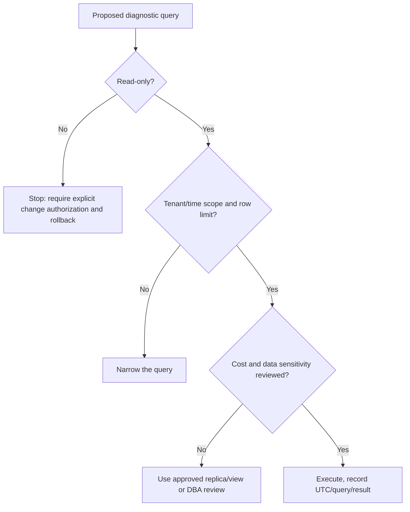
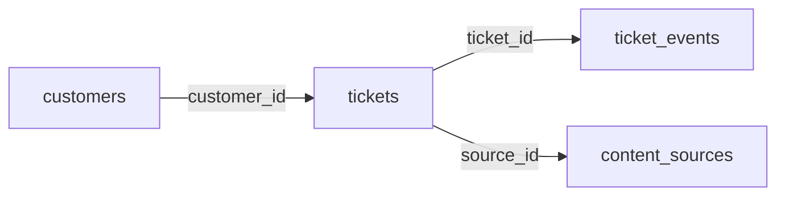
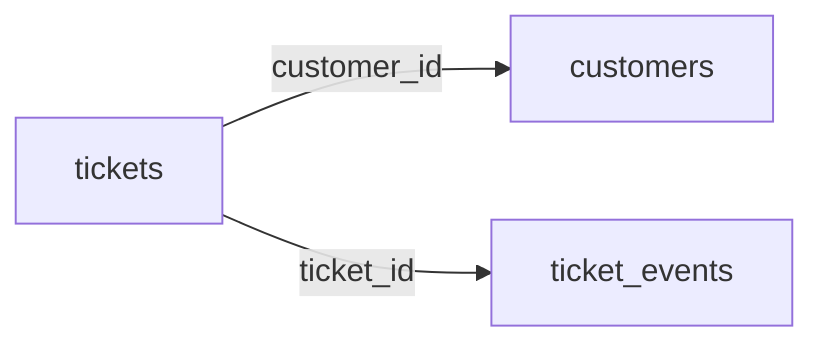
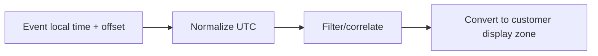
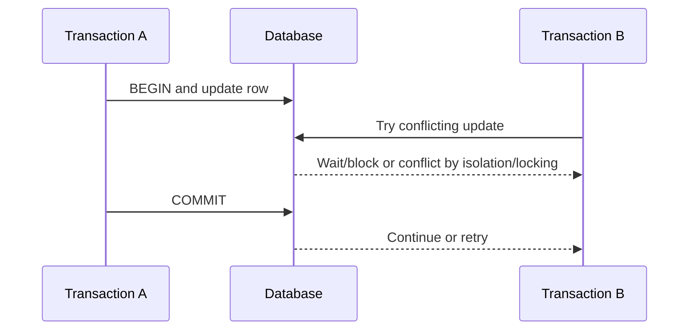
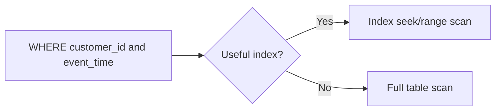
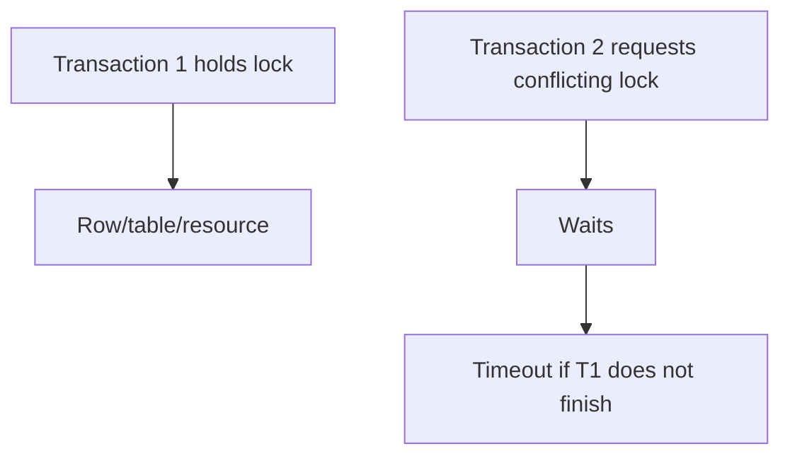
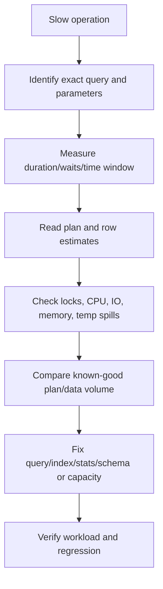

# Part 12 - SQL and Database Troubleshooting for Support

> **Section goal:** Use safe SQL to validate data and understand connection, transaction, lock, index, plan, and performance evidence during customer investigations.
>
> **Maps to JD:** SQL/database good-to-have, data-driven troubleshooting, SaaS integrations, root-cause isolation, metrics, and documentation.

> **Safety rule:** Default to read-only queries on approved replicas or support views. Confirm tenant scope, row limits, data classification, and query cost before execution. Never run writes, schema changes, lock-killing, or unrestricted production scans without explicit authorization and rollback planning.



---

## JD Mapping

| Requirement | Preparation |
|---|---|
| SQL/database knowledge | Relational model, keys, joins, filters, aggregates, nulls, timestamps |
| Root-cause isolation | Validate missing, duplicate, stale, and mismatched records |
| Performance support | Read plans, indexes, locks, pool, timeout, and resource evidence |
| Data-driven work | Produce reproducible counts/trends rather than anecdotes |
| Documentation | Record query, parameters, time, result, environment, and safety scope |

---

## 1. Relational Database Basics

| Term | Meaning |
|---|---|
| Database | Organized collection of data |
| Table | Rows with a defined set of columns |
| Row | One record |
| Column | One attribute with a data type |
| Schema | Namespace and/or structural definition |
| Primary key | Unique stable identifier for row |
| Foreign key | Reference to key in another table |
| Constraint | Rule such as unique, not null, or relationship |



### Plain-English deep-dive: Key vs displayed name

Names can change or duplicate. Stable keys preserve identity.

**Analogy:** Two people can share a name; an employee number distinguishes them.

A support query should join by documented keys, not guesses such as matching display names.

---

## 2. Example Support Dataset

### `tickets`

| Column | Type/purpose |
|---|---|
| ticket_id | Primary key |
| customer_id | Customer/tenant key |
| severity | Incident severity |
| state | Open, mitigated, resolved |
| created_at | UTC creation time |
| resolved_at | UTC resolution time, nullable |

### `ticket_events`

| Column | Purpose |
|---|---|
| event_id | Primary key |
| ticket_id | Foreign key |
| event_type | status_change, customer_update, alert |
| event_time | UTC timestamp |
| details | Sanitized event data |

### `content_sources`

| Column | Purpose |
|---|---|
| source_id | Primary key |
| customer_id | Tenant key |
| source_type | sharepoint, confluence, etc. |
| health | healthy, warning, failed |
| last_sync_at | Last successful sync |
| items_synced | Count/metric snapshot |

All examples use fictional values.

---

## 3. SELECT, WHERE, ORDER BY, LIMIT

```sql
SELECT ticket_id, severity, state, created_at
FROM tickets
WHERE customer_id = :customer_id
  AND created_at >= :window_start_utc
ORDER BY created_at DESC
LIMIT 100;
```

| Clause | Purpose |
|---|---|
| SELECT | Columns/expressions returned |
| FROM | Source table/view |
| WHERE | Row conditions |
| ORDER BY | Result ordering |
| LIMIT/TOP | Bound result size, syntax varies |

Use parameters rather than string concatenation. Include tenant/customer predicate where required.

| Safer query characteristic | Risk reduced |
|---|---|
| Explicit columns | Unnecessary sensitive/large data |
| Tenant/customer predicate | Cross-tenant exposure |
| UTC time window | Full-history scan |
| LIMIT/TOP | Excess result volume |
| Parameterization | Injection and quoting mistakes |
| Approved view/replica | Production load and privilege |

---

## 4. NULL and Three-Valued Logic

`NULL` means unknown/missing/not applicable, not zero or empty string.

```sql
SELECT ticket_id
FROM tickets
WHERE resolved_at IS NULL;
```

`resolved_at = NULL` is not correct SQL comparison.

### Plain-English deep-dive: Unknown is not false

SQL conditions can evaluate true, false, or unknown. Comparisons involving NULL often produce unknown and are filtered out.

**Analogy:** If you do not know someone's age, you cannot conclude they are older or younger than 30.

Use `IS NULL`, `IS NOT NULL`, and carefully chosen `COALESCE` only when replacement semantics are valid.

---

## 5. Aggregation and Grouping

```sql
SELECT severity, COUNT(*) AS open_count
FROM tickets
WHERE customer_id = :customer_id
  AND state <> 'resolved'
GROUP BY severity
ORDER BY open_count DESC;
```

| Function | Use |
|---|---|
| COUNT | Rows/non-null values |
| SUM | Total numeric value |
| AVG | Average, sensitive to distribution |
| MIN/MAX | Range endpoints |
| GROUP BY | Produce one aggregate row per group |
| HAVING | Filter groups after aggregation |

### Count traps

- `COUNT(*)` counts rows.
- `COUNT(column)` excludes NULL.
- Join duplication can inflate counts.
- Snapshot tables can contain multiple rows per object/time.
- Time zone boundaries change daily/weekly totals.

---

## 6. Joins



| Join | Result |
|---|---|
| INNER JOIN | Rows matching both sides |
| LEFT JOIN | All left rows plus right matches |
| RIGHT JOIN | All right rows plus left matches |
| FULL OUTER JOIN | All rows from both sides |
| CROSS JOIN | Every combination, often dangerous accidentally |

```sql
SELECT t.ticket_id, t.state, e.event_type, e.event_time
FROM tickets AS t
LEFT JOIN ticket_events AS e
  ON e.ticket_id = t.ticket_id
WHERE t.customer_id = :customer_id
ORDER BY t.ticket_id, e.event_time;
```

### Join duplication

One ticket with ten events becomes ten result rows. Count distinct tickets if that is the business question:

```sql
SELECT COUNT(DISTINCT t.ticket_id)
FROM tickets AS t
JOIN ticket_events AS e ON e.ticket_id = t.ticket_id
WHERE e.event_type = 'alert';
```

---

## 7. Missing and Duplicate Data Checks

### Missing relationship

```sql
SELECT t.ticket_id
FROM tickets AS t
LEFT JOIN customers AS c ON c.customer_id = t.customer_id
WHERE c.customer_id IS NULL
LIMIT 100;
```

### Duplicate key candidate

```sql
SELECT external_document_id, COUNT(*) AS copies
FROM indexed_documents
WHERE customer_id = :customer_id
GROUP BY external_document_id
HAVING COUNT(*) > 1
ORDER BY copies DESC;
```

### Freshness

```sql
SELECT source_id,
       last_sync_at,
       CURRENT_TIMESTAMP - last_sync_at AS sync_age
FROM content_sources
WHERE customer_id = :customer_id
ORDER BY sync_age DESC;
```

Timestamp subtraction syntax varies by engine.

---

## 8. Time and Time Zones

Store and compare event time consistently, commonly UTC, then convert for presentation.

| Time concept | Risk |
|---|---|
| Timestamp without zone | Ambiguous origin |
| UTC timestamp | Good correlation baseline |
| Local display time | DST/offset changes |
| Event time | When producer says it happened |
| Ingestion time | When database received it |
| Date truncation | Boundary differs by zone |



Avoid `BETWEEN` ambiguity for adjacent time windows. Half-open intervals are clearer:

```sql
WHERE event_time >= :start_utc
  AND event_time <  :end_utc
```

---

## 9. Transactions and ACID

| Property | Meaning |
|---|---|
| Atomicity | All operations commit or none |
| Consistency | Constraints/invariants preserved |
| Isolation | Concurrent work has controlled visibility |
| Durability | Committed data survives expected failures |



A failed request can leave no commit, a full commit, or an unknown client view after response loss. Check transaction/operation state before repeating non-idempotent work.

---

## 10. Isolation and Concurrency Symptoms

| Phenomenon | Meaning |
|---|---|
| Dirty read | Reads uncommitted data, if isolation permits |
| Non-repeatable read | Same row changes during transaction |
| Phantom | New matching rows appear |
| Lost update | Concurrent update overwrites another |
| Serialization conflict | Database aborts transaction to preserve isolation |
| Deadlock | Transactions wait in a cycle; one is usually selected as victim |

Isolation names and behavior vary by database engine. Use engine documentation.

---

## 11. Indexes

An index is an additional structure that helps locate rows without scanning the whole table.



### Plain-English deep-dive: Index tradeoff

A book index speeds reading but takes space and must be updated when the book changes. Database indexes speed selected reads but add storage and write cost.

| Index concern | Support clue |
|---|---|
| Missing useful index | Slow query/scans under volume |
| Wrong column order | Index exists but plan cannot use effectively |
| Low selectivity | Index returns too much data |
| Stale statistics | Planner estimates are wrong |
| Too many indexes | Writes/maintenance become expensive |
| Fragmentation/bloat | Engine-specific maintenance/performance issue |

Do not recommend creating an index from one slow sample without plan, workload, write, and engine review.

---

## 12. Query Plans

A query plan is the database's chosen execution strategy.

Look for:

- Scan vs seek/index access.
- Join type/order.
- Estimated vs actual rows.
- Sort/hash spills.
- Repeated nested operations.
- Filter pushed early or late.
- Parallelism.
- Wait/resource evidence.

Use read-only explain modes. Some engines' `EXPLAIN ANALYZE` executes the query; use caution on production.

---

## 13. Locks and Blocking



### Blocking vs deadlock

- **Blocking:** One waits for another; may resolve normally.
- **Deadlock:** Wait cycle cannot resolve without aborting one participant.

Evidence:

- Blocker/waiter IDs.
- Query/transaction start time.
- Locked resource.
- Wait type/duration.
- Open transaction and application owner.

Killing a session can roll back work and cause customer impact. Escalate through authorized database operations.

---

## 14. Connection and Pool Failures

| Symptom | Direction |
|---|---|
| DNS/connect timeout | Network/private endpoint/firewall |
| Authentication failed | User/workload credential/database identity |
| TLS failed | Trust/hostname/certificate/policy |
| Too many connections | Pool sizing/leak/database limit/load |
| Pool acquisition timeout | Connections busy/leaked or downstream slow |
| Idle connections reset | Firewall/load balancer/database idle timeout |
| One app instance affected | Local pool/config/runtime |

Connection pool evidence includes active/idle/waiting counts, acquisition time, checkout duration, leak warnings, and database session count.

| Pool metric | Interpretation |
|---|---|
| Active near max | Capacity or slow ownership path |
| Idle zero | No immediately available connection |
| Waiters rising | Requests queue for pool |
| Checkout duration high | App holds connections too long |
| DB sessions below pool total | Connectivity/creation or stale-pool issue |
| DB sessions at limit | Database/service capacity boundary |

---

## 15. Slow Query Workflow



Do not optimize only average latency. Check percentile/tail latency and customer-impacting query shape.

---

## 16. Read-Only Support Query Set

### Open case age

```sql
SELECT ticket_id,
       severity,
       CURRENT_TIMESTAMP - created_at AS age
FROM tickets
WHERE customer_id = :customer_id
  AND state <> 'resolved'
ORDER BY created_at
LIMIT 100;
```

### Alert trend

```sql
SELECT DATE_TRUNC('hour', event_time) AS hour_utc,
       COUNT(*) AS alerts
FROM ticket_events
WHERE event_type = 'alert'
  AND event_time >= :start_utc
  AND event_time < :end_utc
GROUP BY DATE_TRUNC('hour', event_time)
ORDER BY hour_utc;
```

Engine date functions vary. Never paste customer identifiers into shared examples.

---

## 17. Database Evidence Packet

```text
Database engine/version/service tier:
Environment/region:
UTC window:
Application/request/trace ID:
Exact query fingerprint, parameters sanitized:
Expected vs actual result/latency:
Connection/pool evidence:
Plan summary and estimated/actual rows:
Lock/wait/resource evidence:
Data volume/distribution:
Recent schema/index/statistics/deployment change:
Known-good comparison:
```

---

## 18. Hands-On Lab 1: Duplicate Connector Records

A customer sees duplicate content-source entries.

Tasks:

1. Query duplicate stable external IDs per customer.
2. Join to ingestion events.
3. Determine whether duplication began after deployment.
4. Do not delete records; any data change requires an explicitly authorized owner and rollback plan.
5. Produce evidence for idempotency/upsert investigation.

Expected direction: distinguish source duplicates, producer stable-ID bug, retry duplication, and display/join duplication.

---

## 19. Hands-On Lab 2: Pool Timeout

Evidence:

- API 504.
- Pool waiters rise.
- Database CPU/query latency normal.
- Connections stay checked out during slow external API call inside transaction.

Identify application lifecycle issue rather than database capacity. Mitigate safely, then shorten transaction/connection ownership and add pool telemetry.

---

## Likely Interview Questions for This Section

### Q1. "Primary key vs foreign key?"

> **Model answer:** "A primary key uniquely identifies a row. A foreign key references a key in another table and enforces or represents a relationship. I join using documented stable keys, not display names."

### Q2. "INNER vs LEFT JOIN?"

> **Model answer:** "INNER returns matching rows from both sides. LEFT returns all left rows and matching right rows, using NULL where no match exists. LEFT plus `right.key IS NULL` is useful for missing relationships."

### Q3. "How do NULLs affect queries?"

> **Model answer:** "NULL represents unknown/missing and comparisons often evaluate unknown. Use `IS NULL`/`IS NOT NULL`; understand that `COUNT(column)` excludes NULL and replacement through COALESCE changes semantics."

### Q4. "Why can joins inflate counts?"

> **Model answer:** "One-to-many relationships create multiple joined rows per parent. I define the counting grain, inspect duplicates, and use `COUNT(DISTINCT key)` only when that matches the business question."

### Q5. "How do indexes help and hurt?"

> **Model answer:** "They speed selective reads by avoiding full scans but consume storage and add write/maintenance cost. I use the actual plan, data distribution, workload, and engine guidance before recommending one."

### Q6. "Blocking vs deadlock?"

> **Model answer:** "Blocking is a waiter behind a holder and can resolve. Deadlock is a wait cycle requiring one transaction to abort. I collect blocker/waiter/resource/transaction evidence and do not kill sessions casually."

### Q7. "How do you troubleshoot a slow query?"

> **Model answer:** "Identify exact fingerprint/parameters/time, measure waits, inspect plan and estimated vs actual rows, check locks and resources, compare known-good plan/data, then verify any query/index/statistics/capacity change under representative load."

### Q8. "How do you query production safely?"

> **Model answer:** "Use approved read-only access/view or replica, tenant/time predicates, selected columns, row limit, query-cost review, parameterization, UTC evidence, and documented query/result. Avoid writes, unrestricted scans, and executing analyze modes without authorization."

---

## 30-Second Memory Hooks

- **Table:** Rows and typed columns.
- **Key:** Stable identity beats display name.
- **NULL:** Unknown, not zero.
- **JOIN:** Define result grain before counting.
- **Half-open time:** `>= start` and `< end`.
- **Transaction:** ACID boundary.
- **Index:** Faster read, extra write/storage cost.
- **Plan:** How database intends to execute.
- **Blocking:** Wait line. **Deadlock:** Wait cycle.
- **Pool timeout:** Connection ownership may be the cause.

---

## Completion Checklist

- [ ] I can safely SELECT/filter/order/limit.
- [ ] I can aggregate and join without count mistakes.
- [ ] I can handle NULL and UTC windows.
- [ ] I can explain ACID, isolation, indexes, plans, locks, and pools.
- [ ] I can diagnose missing, duplicate, stale, slow, and blocked data paths.
- [ ] I completed both SQL labs.
- [ ] I can create a database evidence packet.

---

*Next suggested section: [Part-13-linux-command-line-for-support.md](Part-13-linux-command-line-for-support.md). It teaches the shell tools used to collect the operating-system evidence around these database and SaaS failures.*
