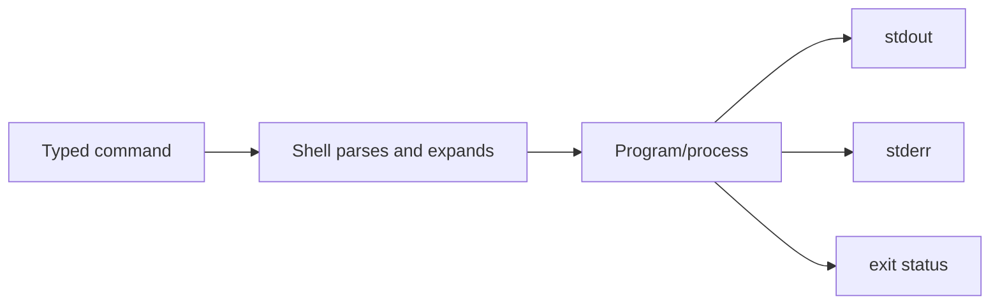
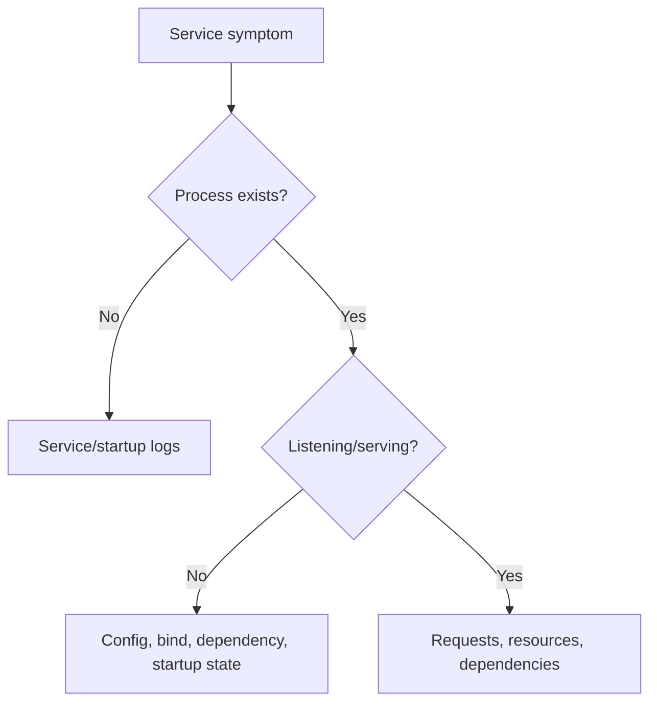
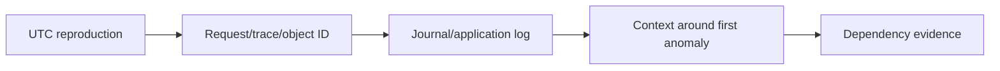

# Part 13 - Linux Command Line for Support Investigations

> **Section goal:** Collect Linux evidence safely and efficiently without turning a support investigation into an unauthorized configuration change.
>
> **Maps to JD:** Linux good-to-have, logs, networking, REST APIs, cloud/Kubernetes support, root-cause isolation, and documentation.

> **Safety rule:** Start read-only, use least privilege, record commands and UTC time, avoid printing sensitive environment values, and do not restart services, change permissions, edit files, install packages, or modify firewall/routing without explicit authorization.

---

## JD Mapping

| Need | Linux skill |
|---|---|
| Read logs | `journalctl`, `tail`, `grep` |
| API/network | `curl`, `dig`, `ss`, `openssl` |
| Process health | `ps`, `top`, `free`, `df`, `du` |
| Config context | paths, permissions, environment names |
| Evidence | pipes, redirection awareness, exit codes |

---

## 1. Shell Model



- **Shell:** Command interpreter such as Bash.
- **Terminal:** Interface hosting shell.
- **Process:** Running program.
- **stdin/stdout/stderr:** Input, normal output, error output.
- **Exit status:** Numeric result; conventionally 0 success, nonzero failure.

### Plain-English deep-dive: Pipeline

`command1 | command2` sends standard output of the first program to standard input of the second.

**Analogy:** One station produces evidence; the next filters it. A pipeline can hide upstream failure unless exit statuses are checked.

---

## 2. Paths and Files

| Command | Purpose |
|---|---|
| `pwd` | Current directory |
| `ls -la` | Detailed listing including hidden entries |
| `find /path -maxdepth 2 -type f -name '*.log'` | Locate files narrowly |
| `file name` | Identify file type |
| `stat name` | Size, ownership, timestamps, mode |
| `readlink -f path` | Resolve symbolic link/path |
| `head -n 50 file` | First lines |
| `tail -n 100 file` | Last lines |
| `less file` | Read interactively |

Quote paths with spaces. Avoid broad `find /` on production unless needed and approved.

---

## 3. Ownership and Permissions

```text
-rwxr-x--- 1 app support ... service.log
 |||||||||
 owner group other
```

| Permission | Meaning |
|---|---|
| r | Read |
| w | Write |
| x | Execute/traverse directory |
| owner/group/other | Principal classes |

```bash
id
namei -l /var/log/myapp/service.log
stat /var/log/myapp/service.log
```

### Plain-English deep-dive: Directory execute

Execute on a directory means permission to traverse it, not run the directory. A file can be readable but unreachable if a parent directory lacks traverse permission.

Do not use `chmod 777` as a diagnostic fix. Identify the intended owner/group and least privilege.

---

## 4. Processes

```bash
ps -ef
ps -eo pid,ppid,user,stat,lstart,etime,cmd
pgrep -af myservice
top
```

| State clue | Meaning |
|---|---|
| R | Running/runnable |
| S | Interruptible sleep |
| D | Uninterruptible wait, often I/O |
| Z | Zombie, exited but not reaped |
| High CPU | Busy loop/load/work |
| Growing RSS | Memory growth, cache, or leak hypothesis |



Do not kill processes before preserving evidence and confirming owner/impact.

---

## 5. Services and systemd

```bash
systemctl status myservice --no-pager
systemctl show myservice --property=ActiveState,SubState,MainPID,ExecMainStatus
journalctl -u myservice --since '2026-08-24 12:00:00 UTC' --until '2026-08-24 12:10:00 UTC' --no-pager
```

| State | Interpretation |
|---|---|
| active/running | Process managed as running, not proof workflow works |
| failed | Review exit/status/journal |
| activating | Startup in progress or stuck |
| inactive | Stopped/not configured to run |

A restart can erase transient state and is not root-cause analysis.

---

## 6. Text Search and Pipes

```bash
grep -n -i 'error\|timeout' app.log
grep -F 'request-id-123' app.log
grep -C 3 -F 'request-id-123' app.log
sort values.txt | uniq -c | sort -nr
cut -d' ' -f1 access.log | sort | uniq -c
```

- `grep -F` treats text literally.
- `-n` shows line number.
- `-C` gives context.
- Recursive searches can be expensive and expose unrelated data.

### Redirection caution

| Syntax | Effect |
|---|---|
| `>` | Overwrite file |
| `>>` | Append file |
| `2>` | Redirect stderr |
| `2>&1` | Combine stderr with stdout |

Prefer terminal output or an approved evidence path; do not overwrite logs.

---

## 7. JSON with jq

```bash
curl --silent --show-error https://postman-echo.com/get | jq .
jq -r '.status // "missing"' response.json
jq '.items | length' response.json
```

`jq` parses JSON structurally; it is safer than fragile text matching. Do not print token fields or entire customer payloads.

---

## 8. Environment and Runtime Context

```bash
printenv | cut -d= -f1 | sort
env | grep -i '^http_proxy\|^https_proxy\|^no_proxy'
which curl
command -v jq
curl --version
uname -a
cat /etc/os-release
```

List variable names rather than values when secrets may exist.

Environment differs by:

- Interactive shell vs systemd service.
- User vs root.
- Container vs host.
- Cron/job runner vs terminal.
- Login vs non-login shell.

---

## 9. Logs

```bash
journalctl -u myservice -n 200 --no-pager
journalctl -u myservice --since '-15 min' --output short-iso-precise --no-pager
tail -n 200 /var/log/myapp/app.log
tail -F /var/log/myapp/app.log
```

`tail -F` follows rotation but is a continuing process; stop after controlled reproduction.

### Log workflow



---

## 10. Network Commands

```bash
getent ahosts api.example.com
dig api.example.com A
ip route get 203.0.113.10
ss -tan 'dport = :443'
ss -ltnp
curl -v https://api.example.com/
openssl s_client -connect api.example.com:443 -servername api.example.com -showcerts
```

| Command | Layer |
|---|---|
| getent/dig | Name resolution |
| ip route get | Route/interface |
| ss | Socket/listener/state |
| curl | DNS through HTTP |
| openssl s_client | TLS handshake/certificate |

Verbose output can contain sensitive headers. Sanitize before sharing.

---

## 11. Resources

```bash
uptime
free -h
df -hT
df -i
du -x -h --max-depth=1 /var/log 2>/dev/null | sort -h
vmstat 1 5
```

| Symptom | Evidence |
|---|---|
| Disk full | `df -hT` |
| Inodes full despite free bytes | `df -i` |
| Memory pressure | `free`, swap, OOM logs, process RSS |
| CPU/load | `uptime`, `top`, `vmstat` |
| I/O wait | `vmstat`, engine-specific tools |

Load average is not CPU percentage. Interpret relative to CPUs and workload.

---

## 12. Exit Codes and `set -o pipefail`

```bash
command
echo $?

set -o pipefail
producer | filter
status=$?
```

Without `pipefail`, pipeline status usually reflects the last command, potentially hiding producer failure.

### Plain-English deep-dive: Output is not success

A command may print partial output and still exit nonzero; another may print nothing and succeed. Capture both output and exit status.

---

## 13. Safe Investigation Ladder

1. Record host/container, user, UTC time, symptom.
2. Identify process/service.
3. Read status and narrow logs.
4. Check resource pressure.
5. Validate DNS, route, socket, TLS, HTTP.
6. Compare service environment and interactive shell.
7. Correlate request/trace IDs.
8. Propose a single reversible fix through authorized owner.
9. Repeat original workflow and monitor.

| Observation | Do not conclude yet | Next discriminating check |
|---|---|---|
| Process exists | Service is healthy | Listener and original request |
| Port listens | Dependency works | Local then remote HTTP/TLS request |
| DNS resolves | Endpoint is reachable | Route and TCP connection |
| Disk has free bytes | Files can still be created | Inode usage and mount state |
| Command prints output | Command succeeded | Exit status and stderr |

| Evidence area | Likely coordinating owner |
|---|---|
| systemd/service configuration | Application/platform owner |
| File ownership/mode | Application plus system administrator |
| DNS/route/firewall | Network/cloud owner |
| TLS trust/certificate | Security/PKI/service owner |
| Disk/inodes/log retention | System/platform owner |
| Container namespace | Kubernetes/container platform owner |

---

## 14. Command Evidence Template

```text
Host/container:
User/privilege:
UTC time:
Working directory:
Exact command:
Exit status:
Relevant output, sanitized:
Expected vs actual:
Artifact location/retention:
```

---

## 15. Hands-On Lab 1: Service Is Running but API Fails

Evidence:

- `systemctl status` active.
- `ss -ltnp` shows service listening only on `127.0.0.1:8080`.
- Load balancer targets host private IP port 8080.

Identify bind-address mismatch. Do not change config directly; preserve evidence, route to service owner, verify listener and health probe after authorized change.

---

## 16. Hands-On Lab 2: Disk vs Inode Exhaustion

Case A: `df -h` 100%. Case B: bytes free but `df -i` 100%.

Explain different causes, locate usage narrowly, preserve logs, and coordinate cleanup/retention rather than deleting arbitrary files.

---

## Likely Interview Questions for This Section

### Q1. "How do you investigate a Linux service?"
> **Model answer:** "I record host/user/time, inspect systemd state and PID, read a narrow UTC journal window, check listener and resource pressure, then dependencies. Active status is not workflow proof; I verify the original request."

### Q2. "How do permissions work?"
> **Model answer:** "Owner, group, and other receive read/write/execute bits. Directory execute means traverse. I inspect every path component and intended ownership instead of using broad chmod."

### Q3. "grep vs jq?"
> **Model answer:** "grep searches text; jq parses JSON fields and types. For structured API/log data I prefer jq to avoid brittle string matches."

### Q4. "What does `ss` show?"
> **Model answer:** "Socket state, local/remote addresses and ports, listeners, and optionally process context. It helps distinguish no listener, connect state, and accumulation such as CLOSE-WAIT or TIME-WAIT."

### Q5. "Service works in shell but not systemd. Why?"
> **Model answer:** "Different user, environment, working directory, PATH, proxy, permissions, limits, or network namespace. I compare service definition/environment names without dumping sensitive values."

### Q6. "Disk full but large files not obvious?"
> **Model answer:** "Check bytes and inodes, filesystem/mount, deleted-open files through authorized tooling, log growth, and container layers. Do not delete until owner and retention/rollback are clear."

### Q7. "Why use pipefail?"
> **Model answer:** "Otherwise a successful final filter can hide failure in an earlier pipeline command. Pipefail makes the pipeline report upstream failure."

### Q8. "When do you use sudo?"
> **Model answer:** "Only when required, authorized, and auditable. I begin unprivileged, explain the exact read or action needed, and avoid broad root shells or changes during evidence collection."

---

## 30-Second Memory Hooks

- **Shell:** Parse -> process -> stdout/stderr -> exit.
- **Path:** Every parent directory needs traverse.
- **Active service:** Process state, not customer success.
- **grep:** Text. **jq:** JSON structure.
- **ss:** Sockets. **dig:** DNS. **curl:** End-to-end request.
- **df -h:** Bytes. **df -i:** Inodes.
- **pipefail:** Do not hide upstream failure.
- **Read-only first.**

---

## Completion Checklist

- [ ] I can navigate/read files and permissions safely.
- [ ] I can inspect processes/systemd/logs/resources.
- [ ] I can filter text and JSON.
- [ ] I can collect DNS/socket/TLS/HTTP evidence.
- [ ] I understand stdout/stderr/exit codes/pipelines.
- [ ] I completed both labs.
- [ ] I can document a command evidence packet.

---

*Next suggested section: [Part-14-kubernetes-fundamentals-for-support.md](Part-14-kubernetes-fundamentals-for-support.md). It applies these Linux and network skills inside container orchestration.*
