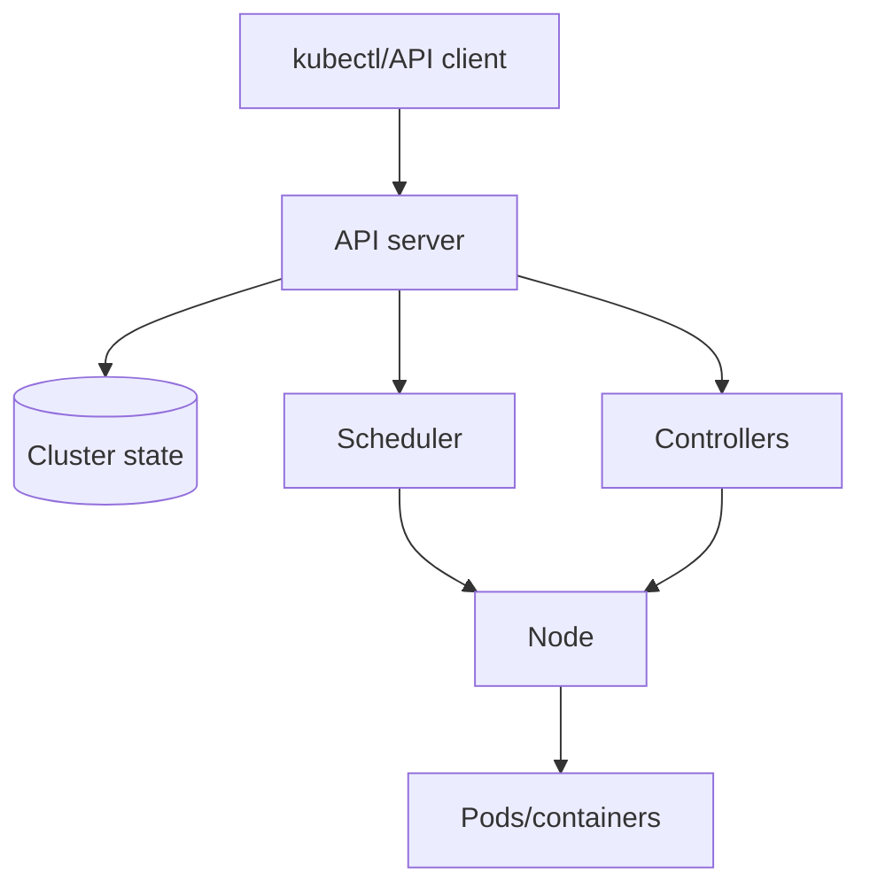
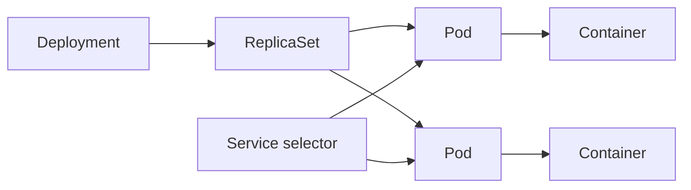
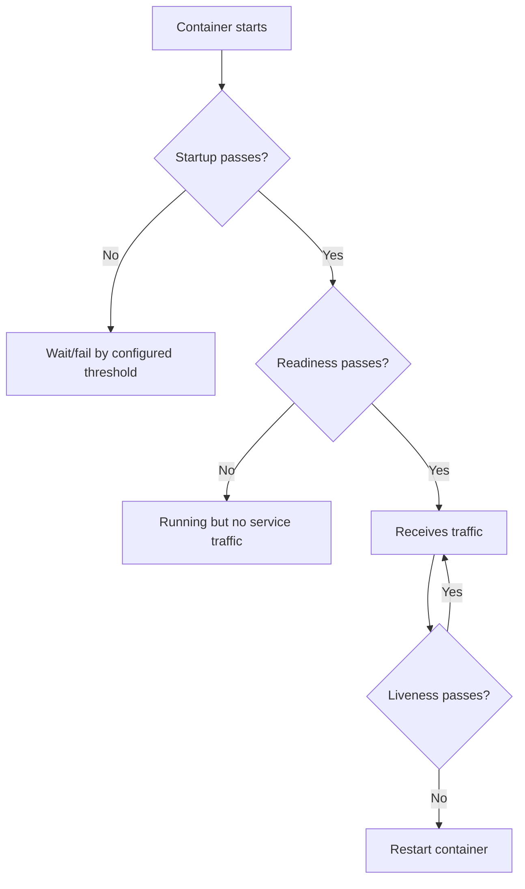
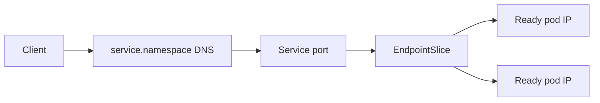
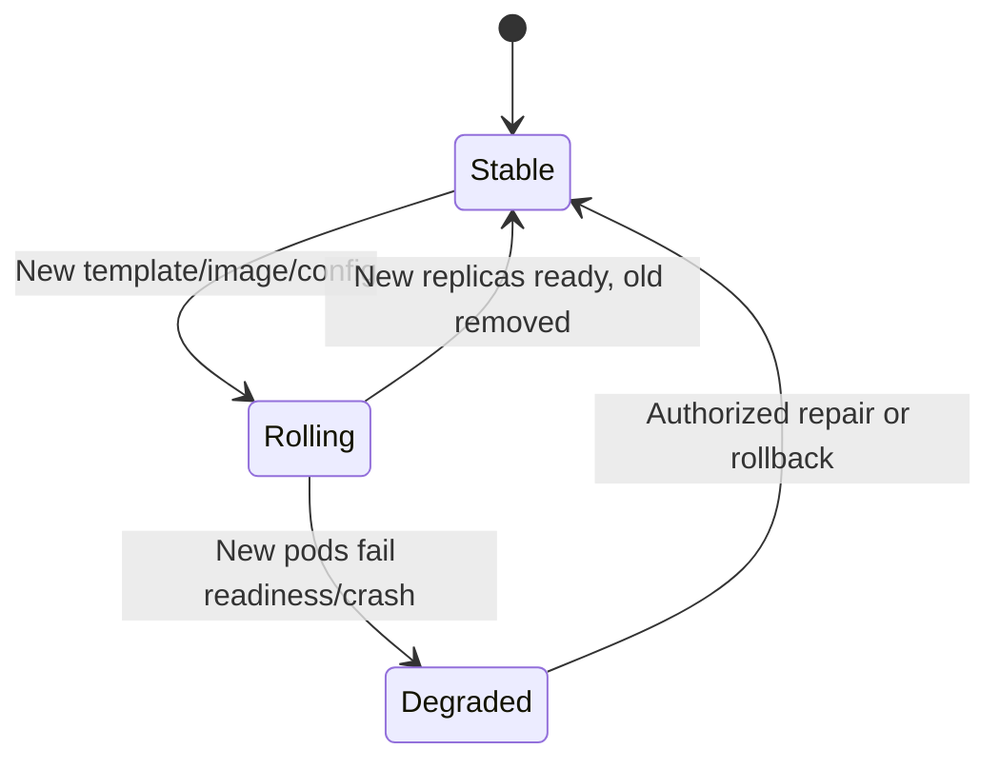
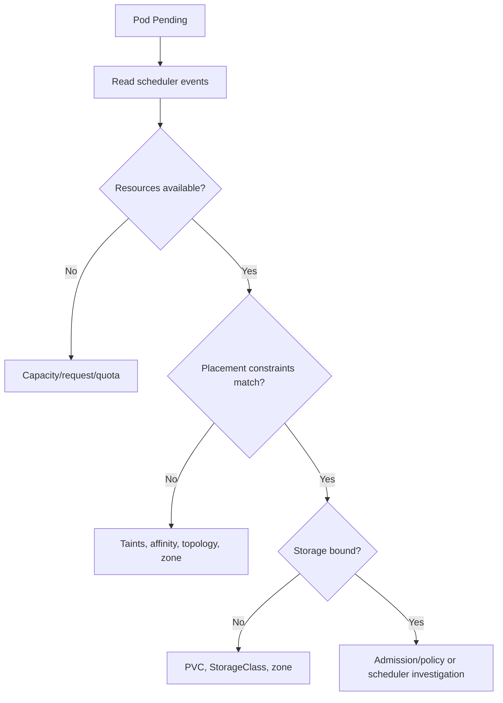

# Part 14 - Kubernetes Fundamentals for Support Engineers

> **Section goal:** Understand Kubernetes objects and collect safe evidence for deployment, pod, service, ingress, configuration, health-probe, and resource failures.
>
> **Maps to JD:** basic Kubernetes, Linux, cloud, logs, networking, alerts, and root-cause isolation.

> **Safety rule:** Start read-only in the correct context and namespace. Never dump Secret values, delete/restart pods, scale workloads, edit resources, or exec into production containers without explicit authorization and an impact/rollback plan.

---

## JD Mapping

| Need | Kubernetes preparation |
|---|---|
| System health | Desired vs ready replicas, pod state, probes, events |
| Logs | Current and previous container logs |
| Network | Service selectors, endpoints, DNS, ingress |
| Configuration | ConfigMap/Secret references and rollout state |
| Alerts | Crash loops, pending pods, failed health, saturation |

---

## 1. Kubernetes in One Picture



Kubernetes continuously reconciles **desired state** in the API with **observed state** in the cluster.

### Plain-English deep-dive: Reconciliation

You declare "three replicas should run." Controllers keep working toward that state after failures or changes.

**Analogy:** A thermostat compares desired temperature with observed temperature and acts until they converge.

---

## 2. Core Objects

| Object | Purpose |
|---|---|
| Cluster | Kubernetes control plane plus worker nodes |
| Node | Machine running pods |
| Namespace | Logical scope for names/access/policy |
| Pod | Smallest scheduled unit, one or more containers |
| Deployment | Manages replicated stateless pods and rollout |
| ReplicaSet | Maintains pod replica count, normally owned by Deployment |
| StatefulSet | Stable identity/storage ordering for stateful pods |
| DaemonSet | Pod on selected/all nodes |
| Job/CronJob | Finite/scheduled work |
| Service | Stable virtual address selecting pods |
| Ingress | HTTP(S) routing into services, implementation required |
| ConfigMap | Non-sensitive configuration |
| Secret | Sensitive data reference/storage object |

---

## 3. Ownership Chain



Do not troubleshoot a generated pod in isolation. Identify owning Deployment/StatefulSet/Job and rollout revision.

---

## 4. Context and Namespace

```bash
kubectl config current-context
kubectl config get-contexts
kubectl get namespaces
kubectl auth can-i get pods -n support-test
```

Always include `-n <namespace>` or confirm default. Same object name can exist in different namespaces.

### Plain-English deep-dive: Context

A context selects cluster, user/credential, and default namespace. A correct command against the wrong context can affect the wrong environment.

---

## 5. Safe Read-Only Ladder

```bash
kubectl get deployment,pods,services -n support-test -o wide
kubectl describe deployment search-api -n support-test
kubectl describe pod search-api-abc -n support-test
kubectl get events -n support-test --sort-by=.metadata.creationTimestamp
kubectl logs search-api-abc -n support-test --timestamps --tail=200
kubectl logs search-api-abc -n support-test --previous --timestamps --tail=200
kubectl get endpointslices -n support-test -l kubernetes.io/service-name=search-api
kubectl rollout status deployment/search-api -n support-test
kubectl rollout history deployment/search-api -n support-test
```

Exact capabilities depend on role and cluster version.

| Read-only command family | Primary evidence |
|---|---|
| `kubectl get` | Inventory, status, labels, replicas |
| `kubectl describe` | Conditions, events, references, last state |
| `kubectl logs` | Container stdout/stderr |
| `kubectl get events` | Scheduler/kubelet/controller events |
| `kubectl rollout status/history` | Deployment progress and revisions |
| `kubectl auth can-i` | Current authorization check |

---

## 6. Pod Lifecycle and Status

| Status/reason | Meaning/direction |
|---|---|
| Pending | Not scheduled/containers not ready to start |
| ContainerCreating | Image/volume/network setup |
| Running | At least one container running; not proof Ready |
| Succeeded | All containers completed successfully |
| Failed | Container terminated unsuccessfully and not restarting |
| CrashLoopBackOff | Repeated crash with increasing delay |
| ImagePullBackOff | Image cannot be pulled, retry backoff |
| ErrImagePull | Immediate pull error |
| OOMKilled | Container exceeded memory limit or node pressure path |
| Evicted | Node pressure/policy removed pod |
| Terminating | Shutdown/deletion in progress |

### Phase vs condition vs container state

- Phase is high-level.
- Conditions include `Ready`, `PodScheduled`.
- Container state includes Waiting/Running/Terminated and reason/exit code.

---

## 7. Describe, Events, and Logs

`kubectl describe pod` combines conditions, container state, mounts, probes, and recent events.

| Evidence | Question |
|---|---|
| Events | Scheduling, pulling, mounting, probe failures |
| Current logs | Current container execution |
| Previous logs | Last crashed instance |
| Exit code/reason | Why container ended |
| Restart count | Repetition severity |
| Start/finish times | Timeline |

Events are retained for limited time and may repeat/aggregate. Capture promptly.

---

## 8. Probes

| Probe | Question | Failure effect |
|---|---|---|
| Startup | Has application finished starting? | Protects slow start from other probes |
| Readiness | Can pod receive traffic? | Removed from Service endpoints |
| Liveness | Should container be restarted? | Container restart |



### Plain-English deep-dive: Liveness is not dependency health

A liveness probe that fails whenever a remote dependency is slow can restart healthy application processes and amplify an outage. Readiness may be the appropriate traffic gate.

Probe design belongs to application/platform owners; support identifies evidence and impact.

---

## 9. Resource Requests and Limits

| Setting | Purpose |
|---|---|
| CPU request | Scheduling/reserved planning signal |
| Memory request | Scheduling memory requirement |
| CPU limit | CPU throttling ceiling where enforced |
| Memory limit | Exceeding can cause OOM kill |

Symptoms:

- Pending: insufficient requested resources.
- CPU throttling: latency despite node capacity.
- OOMKilled: memory limit exceeded.
- Eviction: node pressure.

Metrics require a metrics system; `kubectl top` availability is not guaranteed.

---

## 10. Configuration and Secrets

```bash
kubectl describe deployment search-api -n support-test
kubectl get configmap app-settings -n support-test -o yaml
kubectl get secret api-credentials -n support-test
```

Do not output Secret YAML/data. Confirm reference name, key names (without values), mount/env path, resource version, and whether pods rolled after changes.

Configuration changes do not always update existing pod environment automatically; rollout behavior depends on workload design.

---

## 11. Services, Selectors, and Endpoints

A Service selects pods using labels and publishes stable discovery.



| Symptom | Check |
|---|---|
| Service has no endpoints | Selector vs pod labels, readiness |
| Connection refused | Target port/listener/container |
| Timeout | Network policy/route/pod health |
| Some requests fail | One endpoint/pod/version |
| Wrong port | Service port/targetPort/container listener |

```bash
kubectl get service search-api -n support-test -o yaml
kubectl get pods -n support-test --show-labels
kubectl get endpointslices -n support-test -l kubernetes.io/service-name=search-api -o wide
```

---

## 12. Ingress

Ingress defines HTTP(S) routes; an ingress controller implements them.

| Check | Evidence |
|---|---|
| Host/path rule | Correct request route |
| Backend Service/port | Exists and has endpoints |
| TLS Secret reference | Correct name/certificate lifecycle, do not dump value |
| Controller | Running/logs/events |
| External DNS/load balancer | Resolves/routes to controller |

An Ingress object existing does not prove a controller accepted or provisioned it.

---

## 13. Storage

| Object | Purpose |
|---|---|
| PersistentVolumeClaim | Workload storage request |
| PersistentVolume | Provisioned storage resource |
| StorageClass | Provisioning behavior/class |
| Volume mount | Path inside container |

Pending pods can result from unbound claims; start failures can result from mount/permission/zone issues.

---

## 14. Deployments and Rollouts



Check desired/current/updated/available replicas, image digest/tag, conditions, history, and events. Do not execute rollback without authorization.

---

## 15. Failure Playbooks

| Boundary | Typical symptom |
|---|---|
| Scheduler | Pod Pending/unschedulable |
| Kubelet/runtime | ContainerCreating, mount/pull/start failure |
| Application | CrashLoop, probe failure, wrong listener |
| Service discovery | DNS/selector/endpoints issue |
| Ingress/load balancer | Host/path/TLS/backend routing issue |
| Cloud/node | Capacity, zone, disk, network, provider health |

### CrashLoopBackOff

1. Describe pod.
2. Record last state/reason/exit/restarts.
3. Read previous logs.
4. Check config/secret references and dependencies.
5. Compare working replica/revision.
6. Verify authorized fix and stability.

### ImagePullBackOff

- Image name/tag/digest.
- Registry DNS/TLS/network.
- Pull credential reference (not value).
- Image existence/platform architecture.
- Registry limits.

### Pending

- Scheduler events.
- Requests vs node capacity.
- Taints/tolerations, affinity, zone.
- PVC binding.
- Quota/policy.



---

## 16. Evidence Packet

```text
Cluster/context and namespace:
UTC window:
Owning workload/revision:
Pod/node/container:
Desired/current/ready replicas:
Phase/conditions/reason/exit/restarts:
Events:
Current/previous logs, sanitized:
Service selector/endpoints/ports:
Probe results:
Requests/limits and pressure:
Recent rollout/config change:
Known-good pod/revision:
```

| Evidence/action owner | Typical responsibility |
|---|---|
| Application team | Image, startup, probes, listener, code/config |
| Platform team | Workload spec, admission, controllers, cluster services |
| Cloud/network team | Nodes, load balancer, VPC/VNet, DNS, storage |
| Security team | RBAC, policy, registry/access, Secret process |
| Support engineer | Customer impact, evidence, coordination, verification |

---

## 17. Hands-On Lab 1: Service Has No Endpoints

Evidence: Service selector `app=search`; pods labeled `app=search-api`; pods Ready.

Identify selector mismatch. Route change to owner, avoid direct mutation, verify EndpointSlice and original request after authorized correction.

---

## 18. Hands-On Lab 2: CrashLoop After Secret Rotation

Evidence: new pods fail startup; previous logs say required key missing; Secret object exists but key name changed; old pods continue until replaced.

Preserve key-name metadata without values, coordinate compatible rollout/rotation, verify new pods Ready and old credential revoked through approved process.

---

## Likely Interview Questions for This Section

### Q1. "Pod vs Deployment?"
> **Model answer:** "A pod is the scheduled unit containing containers. A Deployment declares and rolls out replicated stateless pods through ReplicaSets. I troubleshoot the owning workload and revision, not only one generated pod."

### Q2. "Running vs Ready?"
> **Model answer:** "Running means a container is executing; Ready means it passes readiness conditions and can receive Service traffic. A running unready pod may be correctly excluded."

### Q3. "CrashLoopBackOff?"
> **Model answer:** "Repeated container crashes with backoff. I inspect last state/exit, previous logs, events, config/secret references, probes, resources, dependencies, and compare the prior revision."

### Q4. "Liveness vs readiness?"
> **Model answer:** "Readiness controls traffic; liveness decides restart; startup protects slow initialization. Poor liveness dependency checks can amplify incidents."

### Q5. "Service has no endpoints?"
> **Model answer:** "Compare selector with pod labels and readiness, then ports. Service existence alone is not enough."

### Q6. "ImagePullBackOff?"
> **Model answer:** "Check image reference/existence, registry DNS/TLS/reachability, credential reference, architecture, and rate limits, without displaying credential values."

### Q7. "How do you collect Kubernetes evidence safely?"
> **Model answer:** "Confirm context/namespace and authorization, use get/describe/events/logs/rollout status, sanitize data, avoid Secret values and mutations, and record UTC/workload/revision/pod."

### Q8. "Would you delete a failing pod?"
> **Model answer:** "Not as a first diagnostic action. It destroys transient state and may simply recreate failure. I preserve evidence and identify the owning desired-state defect; any restart/delete requires authorization and impact awareness."

---

## 30-Second Memory Hooks

- **Kubernetes:** Desired state reconciled to observed state.
- **Pod:** Execution unit. **Deployment:** Replicated rollout owner.
- **Running is not Ready.**
- **Readiness:** Traffic. **Liveness:** Restart. **Startup:** Initialization.
- **Service:** Selector -> ready endpoints.
- **Previous logs:** Last crash.
- **Context + namespace first.**
- **Never dump Secret values.**

---

## Completion Checklist

- [ ] I can explain cluster/node/namespace/pod/workload/service/ingress.
- [ ] I can read pod conditions, events, current/previous logs.
- [ ] I can distinguish probes and resource failures.
- [ ] I can diagnose no endpoints, crash loops, image pulls, and pending pods.
- [ ] I completed both labs.
- [ ] I can create a safe Kubernetes evidence packet.

---

## Official Source Anchors

- [Kubernetes concepts](https://kubernetes.io/docs/concepts/)
- [Debug Pods](https://kubernetes.io/docs/tasks/debug/debug-application/debug-pods/)
- [Services](https://kubernetes.io/docs/concepts/services-networking/service/)
- [Probes](https://kubernetes.io/docs/concepts/configuration/liveness-readiness-startup-probes/)

---

*Next suggested section: [Part-15-github-jira-confluence-workflow.md](Part-15-github-jira-confluence-workflow.md). It connects support evidence to engineering defects, pull requests, releases, and durable knowledge.*
