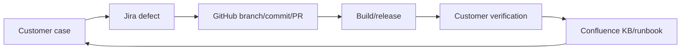
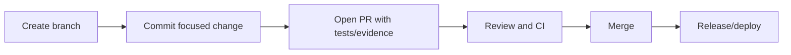
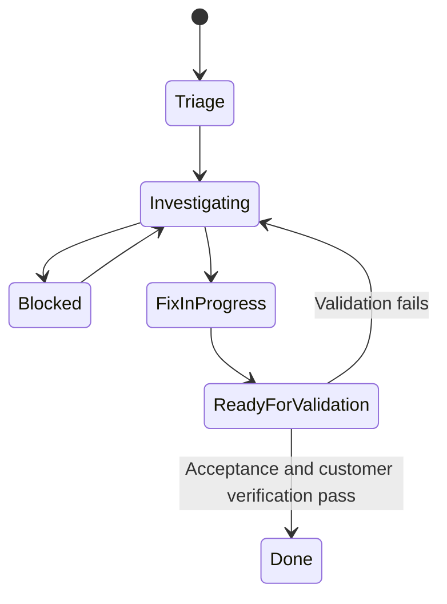
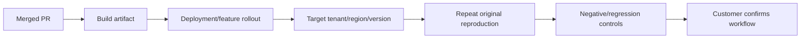
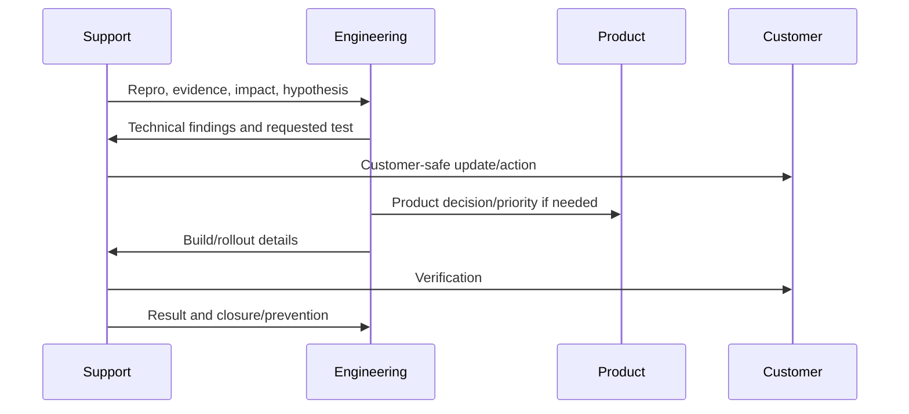
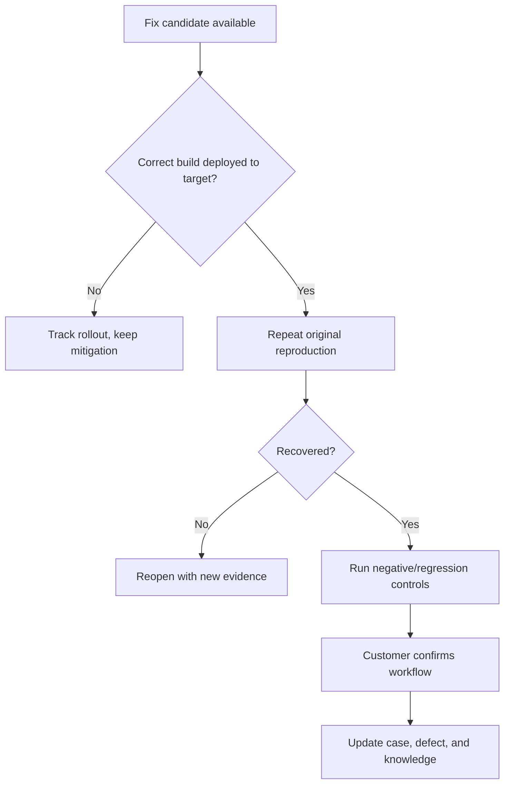

# Part 15 - GitHub, Jira, and Confluence in the Support-to-Engineering Workflow

> **Section goal:** Turn customer evidence into an actionable engineering defect, follow the change through review and release, and convert the outcome into reusable support knowledge.
>
> **Maps to JD:** GitHub/Jira/Confluence, cross-functional collaboration, product improvements, runbooks, knowledge base, issue completion, and support scale.

---

## JD Mapping

| Need | Tool/workflow |
|---|---|
| Escalate product defect | Jira issue with reproducible evidence |
| Understand code/change | GitHub commit/PR/release context |
| Preserve support knowledge | Confluence runbook/KB/decision record |
| Coordinate owners | Links, statuses, comments, due dates |
| Verify resolution | Build/release mapping and customer test |

---

## 1. One Traceability Chain



Every link should answer who, what, why, evidence, state, and next action without copying sensitive customer content broadly.

| Tool | System of record for |
|---|---|
| Customer case system | Customer communication, impact, support actions |
| Jira | Product/engineering work, priority, owner, acceptance |
| GitHub | Code, review, tests, commits, release artifacts |
| Confluence | Durable knowledge, runbooks, decisions, post-incident learning |

| Gate | Evidence needed |
|---|---|
| Case -> defect | Repro, impact, scope, IDs, controls |
| Defect -> code | Supported mechanism and acceptance criteria |
| Code -> release | Review/tests/build/rollout plan |
| Release -> closure | Original and regression verification |
| Closure -> knowledge | Cause, safe steps, owner, review date |

### Plain-English deep-dive: Tool is not the process

A Jira ticket does not create ownership by itself; a PR does not prove a customer fix; a Confluence page does not create knowledge unless it is findable, current, and tested.

---

## 2. Git/GitHub Fundamentals

| Term | Meaning |
|---|---|
| Repository | Versioned project/files/history |
| Commit | Snapshot/change with identifier |
| Branch | Line of development |
| Pull request (PR) | Proposed change and review discussion |
| Review | Feedback/approval on change |
| Merge | Integrate change |
| Tag/release | Named version/distribution milestone |
| Issue | Tracked work/discussion, depending on team |
| CI/CD | Automated build/test/deploy pipeline |



Support normally reads/issues/PRs/releases and provides evidence; it should not change code or bypass review unless that is explicitly part of the role.

---

## 3. Reading Change History

Ask:

- Which release first contains behavior?
- What issue/PR explains intent?
- Which files/components changed?
- Were tests added?
- Did rollout reach customer tenant/region?
- Is feature flag/config required?
- Is rollback or mitigation documented?

### Correlation cautions

A recent commit is a hypothesis, not proof. Reproduce by build/feature state and causal mechanism.

| Evidence | Strength |
|---|---|
| Customer issue begins exactly after rollout and rollback reverses | Strong |
| Relevant code path changed and test reproduces | Strong |
| Commit exists near incident time | Weak alone |
| PR title sounds related | Weak alone |

---

## 4. Engineering-Ready Jira Defect

```text
Title: [Component] concise observed failure and scope
Customer/business impact:
Severity/priority rationale:
Environment, build, tenant/region:
First observed / last known good UTC:
Expected behavior:
Actual behavior:
Minimal safe reproduction:
Affected and known-good controls:
Evidence: request/trace IDs, logs, screenshots/HAR, sanitized
Current hypothesis and rejected alternatives:
Mitigation/workaround:
Acceptance criteria:
Support owner / engineering owner:
Customer update cadence:
Related case/PR/release/KB links with access controls:
```

### Plain-English deep-dive: Severity vs priority

Severity describes impact; priority orders work. Record both rationale instead of using labels as emotion.

---

## 5. Bug Quality Checklist

| Quality | Good evidence |
|---|---|
| Reproducible | Exact steps/input/context |
| Scoped | Affected/unaffected dimensions |
| Versioned | Build/release/feature state |
| Correlated | IDs and UTC timeline |
| Safe | Sanitized artifacts and access controls |
| Actionable | Expected vs actual and acceptance criteria |
| Owned | Named current/next owner |
| Customer-aware | Impact, mitigation, update time |

Avoid vague titles such as "Search broken" and raw log dumps without explanation.

---

## 6. Jira Workflow



Actual states vary. Never equate "code merged" with "customer resolved."

### Comments should add change

A useful update includes new evidence, decision, owner, or risk. Avoid repeated "any update?" comments; use agreed escalation/cadence.

| Weak comment | Better comment |
|---|---|
| "Any update?" | "Customer impact remains X; next committed update is Y; is owner Z still on target?" |
| "Still broken" | "Build A in tenant B reproduces step C; request ID D attached." |
| "Please prioritize" | "Priority rationale: no workaround, launch blocked at UTC deadline." |

---

## 7. Pull Request Support Review

Support may validate:

- Does change match customer failure mechanism?
- Are regression tests representative?
- Are permissions/security cases included?
- Is telemetry added to diagnose recurrence?
- Are rollout/compatibility/feature-flag impacts documented?
- Is the mitigation still needed after release?
- Which build contains fix?

Do not approve code correctness outside your expertise; provide customer and diagnostic context.

---

## 8. Release-to-Customer Verification



Capture build, deployment time, scope, feature state, and verification evidence.

---

## 9. Confluence Knowledge Types

| Page type | Purpose |
|---|---|
| KB article | Reusable symptom/diagnosis/resolution |
| Runbook | Operational steps, owners, safety, rollback, validation |
| Decision record | Context, options, decision, consequences |
| Post-incident review | Timeline, cause, impact, actions |
| Customer page | Restricted customer-specific architecture/process |
| Troubleshooting matrix | Symptom -> evidence -> next check |

### Knowledge quality

- Clear audience and prerequisites.
- Searchable title/keywords.
- Owner and review date.
- Tested steps.
- Safety/permissions/rollback.
- Version applicability.
- Links to source documentation.
- No copied credentials or uncontrolled customer data.

| Lifecycle step | Requirement |
|---|---|
| Draft | Named author and source evidence |
| Review | SME/security/operations review as risk requires |
| Publish | Searchable title, audience, scope, owner |
| Use | Feedback and successful execution evidence |
| Refresh | Review date/version check |
| Retire | Redirect/archive stale guidance |

---

## 10. KB Article Template

```text
Title:
Audience/scope/version:
Symptoms:
Impact:
Prerequisites and safety:
Cause(s):
Diagnostic flow:
Resolution/mitigation:
Verification:
Rollback:
When to escalate and required evidence:
Owner/review date/source links:
```

### Plain-English deep-dive: Runbook vs KB

A KB explains an issue and helps diagnosis. A runbook guides an operational action safely. One page can contain both, but ownership and risk controls differ.

---

## 11. Linking Without Data Leakage

| Artifact | Access rule |
|---|---|
| Customer case | Restricted to authorized support/customer participants |
| Engineering defect | Sanitized minimum customer details |
| PR/repo | Code access policy |
| Confluence customer page | Customer-specific restricted space |
| Reusable KB | No customer identifiers/secrets |

Use references to controlled artifacts rather than copying sensitive payloads into every tool.

---

## 12. Metrics and Process Improvement

Track:

- Defect acceptance/rejection rate.
- Time from escalation to engineering engagement.
- Reproduction completeness.
- Reopen/validation failure rate.
- Cases avoided by KB/runbook.
- Recurring defect patterns.
- Time from merge to customer verification.

Metrics should improve flow, not reward ticket volume alone.

---

## 13. Support-to-Engineering Handoff



Support owns customer progress even while engineering owns code action.



---

## 14. Hands-On Lab 1: Write a Jira Defect

Scenario: archived policy outranks verified current policy for all pilot users.

Produce title, impact, controlled query/result order, metadata, user context, build, IDs, expected ranking rationale, controls, acceptance criteria, and safe artifacts.

---

## 15. Hands-On Lab 2: Convert Resolution to KB

Scenario: connector private content was missing because per-user authorization was required for that mode.

Create reusable KB that distinguishes admin setup, per-user setup, symptoms, evidence, verification, and escalation without naming the customer.

---

## Likely Interview Questions for This Section

### Q1. "What makes a good engineering bug?"
> **Model answer:** "Clear impact/scope/version, expected vs actual, minimal reproduction, affected/known-good controls, IDs/timeline, sanitized evidence, hypothesis, mitigation, and measurable acceptance criteria."

### Q2. "Commit, branch, PR, release?"
> **Model answer:** "Commit is a versioned change; branch is a development line; PR proposes/reviews integration; release packages/deploys a version. Customer resolution requires rollout and verification beyond merge."

### Q3. "How do you avoid blaming a recent release?"
> **Model answer:** "Treat timing as hypothesis, map build/rollout, reproduce by version/feature state, inspect relevant change, and seek rollback/control evidence and mechanism."

### Q4. "Jira severity vs priority?"
> **Model answer:** "Severity is impact; priority is ordering/urgency based on impact, risk, deadlines, workaround, and commitments. Document rationale."

### Q5. "What belongs in a runbook?"
> **Model answer:** "Trigger/scope, prerequisites, safety/access, steps, decisions, owners, expected output, rollback, verification, escalation, and review ownership."

### Q6. "How do you protect customer data across tools?"
> **Model answer:** "Minimize and sanitize, store artifacts in controlled locations, link rather than copy, restrict customer pages, and keep reusable KB free of identifiers and credentials."

### Q7. "How do you validate a product fix?"
> **Model answer:** "Confirm build/rollout/tenant state, repeat original reproduction, run negative/regression controls, observe telemetry, and obtain customer workflow confirmation."

### Q8. "How do you improve support scale?"
> **Model answer:** "Find recurring patterns, improve defect evidence/telemetry, create tested KB/runbooks, automate safe repeatable steps, and measure reuse, recurrence, and resolution quality."

---

## 30-Second Memory Hooks

- **Chain:** Case -> Jira -> PR -> release -> customer verify -> KB.
- **Merged is not resolved.**
- **Bug:** Repro + evidence + impact + acceptance.
- **Comment:** Add evidence, decision, owner, or risk.
- **KB:** Explain. **Runbook:** Operate safely.
- **Link controlled evidence; do not copy it everywhere.**

---

## Completion Checklist

- [ ] I can explain GitHub/Jira/Confluence roles.
- [ ] I can write an engineering-ready defect.
- [ ] I can follow PR/release/customer verification.
- [ ] I can build a KB/runbook with safety and ownership.
- [ ] I completed both labs.
- [ ] I can describe metrics for handoff quality and scale.

---

*Next suggested section: [Part-16-llm-gpt-rag-and-ai-support.md](Part-16-llm-gpt-rag-and-ai-support.md). It connects Glean search/context to LLM answers, agents, evaluation, and AI-specific support failures.*
