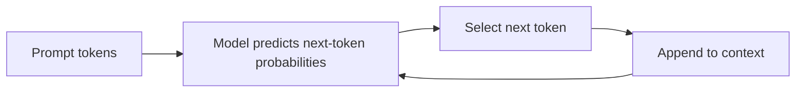
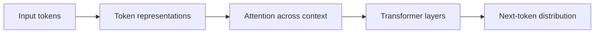
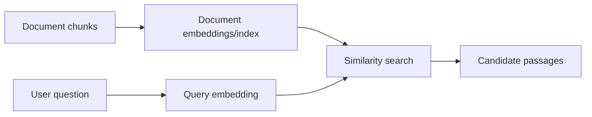
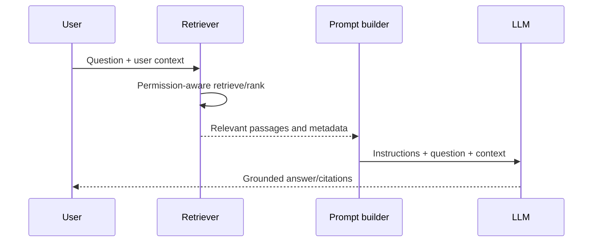
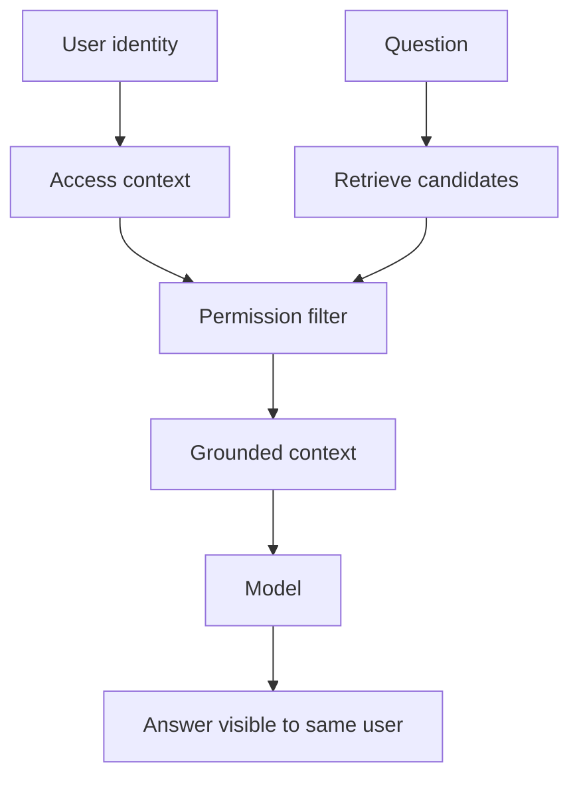
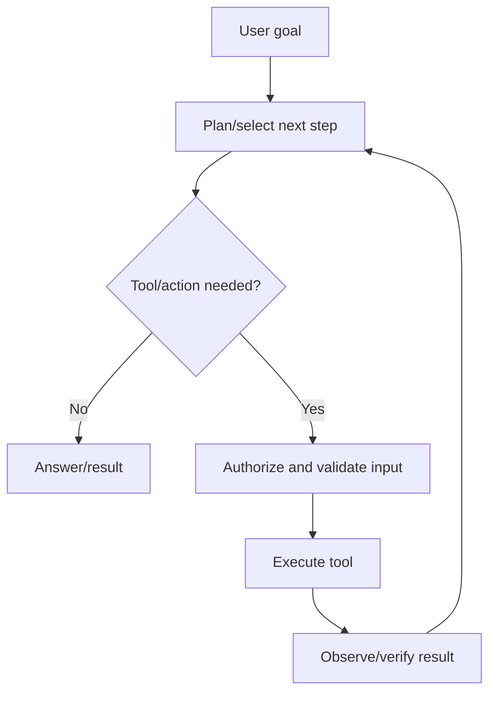
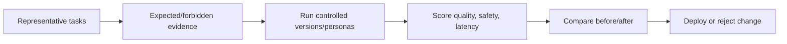
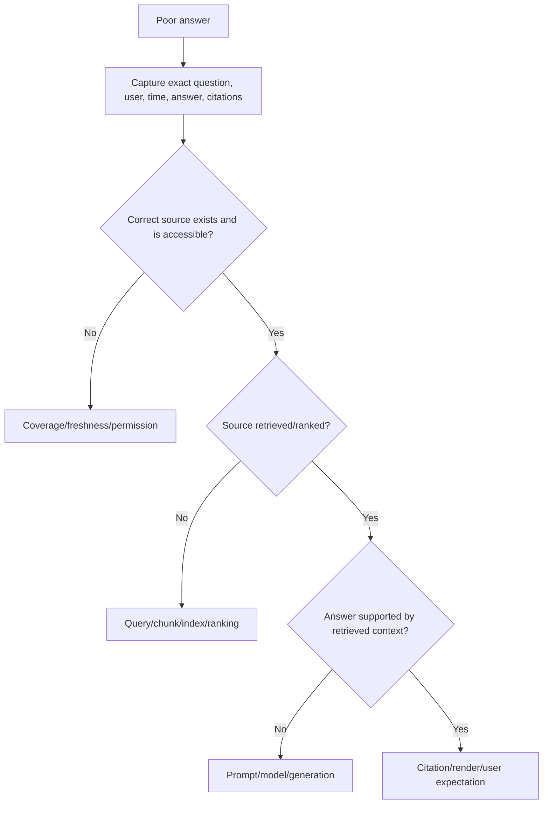

# Part 16 - LLM, GPT, Embeddings, RAG, and AI Support Fundamentals

> **Section goal:** Explain how enterprise AI retrieves context and generates answers, then diagnose quality, permission, latency, safety, and agent failures without blaming the model for every symptom.
>
> **Maps to JD:** basic LLM/GPT knowledge, Glean AI features, search/knowledge, customer education, system/user health, product improvement, and root-cause isolation.

> **Candidate bridge:** Use AI certifications, Copilot, Copilot Studio agents, and training experience as your professional foundation. Treat Glean-specific internal models, prompts, weights, and tooling as product knowledge to learn; do not claim undocumented architecture.

---

## JD Mapping

| Need | Preparation |
|---|---|
| Explain LLM/GPT | Tokens, transformer intuition, prediction, context |
| Support enterprise AI | Retrieval, grounding, citations, permission-aware context |
| Diagnose poor answers | Separate source, retrieval, ranking, prompt, generation, UI |
| Support agents | Tools, actions, identity, approval, state, observability |
| Improve product | Evaluation sets, feedback, latency/error/adoption metrics |

---

## 1. What an LLM Does

A Large Language Model predicts the next token based on prior context, repeatedly producing output.

- **Token:** Chunk of text, not always a word.
- **Model parameters:** Learned numeric values.
- **Prompt/context:** Input tokens available for current generation.
- **Inference:** Running the trained model to produce output.
- **GPT:** Generative Pre-trained Transformer family/category term.

### Plain-English deep-dive: Fluency is not truth

The model generates statistically plausible text. It does not automatically query current company systems or verify every statement.

**Analogy:** A skilled improviser can complete a story convincingly without possessing the source records.

---

## 2. Transformer Intuition

Transformers use **attention** to weigh relationships among tokens in context.

| Concept | Plain meaning |
|---|---|
| Attention | Which context tokens matter to this prediction |
| Layer | Repeated transformation of representations |
| Pre-training | Learn broad patterns from large data |
| Fine-tuning | Additional training for task/behavior |
| Instruction tuning | Improve following natural-language instructions |
| Temperature | Sampling randomness control, implementation-dependent |

No need to derive matrix equations in this interview; explain purpose and limitations.

---

## 3. Context Window

The context window is the token budget available for instructions, conversation, retrieved passages, tool results, and output.

| Context consumer | Example |
|---|---|
| System instructions | Safety/product behavior |
| User conversation | Current request/history |
| Retrieved content | Documents/passages |
| Tool results | API/search output |
| Agent state | Plan/intermediate steps |
| Output allowance | Generated answer |

Too much low-value context can crowd out useful evidence, increase latency/cost, and confuse generation.

---

## 4. Embeddings and Vector Retrieval

An embedding maps text to a numeric vector representing aspects of meaning. Vector search retrieves nearby representations.

### Plain-English deep-dive: Similar is not authoritative

A semantically similar old draft can be closer than the current official policy. Retrieval needs metadata, authority, freshness, permissions, lexical signals, and reranking.

| Retrieval method | Strength |
|---|---|
| Lexical | Exact names, codes, phrases |
| Vector/semantic | Related meaning/vocabulary |
| Hybrid | Combines exact and semantic candidates |
| Graph/entity | People/project/ownership relationships |
| Filters/metadata | Source, date, type, status, authority |

---

## 5. RAG

RAG means Retrieval-Augmented Generation.

| Stage | Failure |
|---|---|
| Source | Missing/stale/wrong content |
| Ingestion/chunking | Text absent or context split badly |
| Permission | False deny/false allow |
| Retrieval | Right content not selected |
| Ranking | Weak source outranks authority |
| Prompt assembly | Instructions/context truncated/conflicting |
| Generation | Unsupported statement/misinterpretation |
| Citation/UI | Citation missing/wrong/not accessible |

### Grounding

Grounding constrains/supports generation with selected evidence. It reduces but does not eliminate unsupported output.

---

## 6. Hallucination and Answer Quality

A **hallucination** is generated content unsupported or contradicted by reliable evidence.

| Quality dimension | Question |
|---|---|
| Correctness | Is statement factually right? |
| Groundedness | Is it supported by provided sources? |
| Relevance | Does it answer the question? |
| Completeness | Are key parts missing? |
| Citation quality | Do citations support claims and open for user? |
| Freshness | Is current authoritative content used? |
| Safety | Does answer violate policy or expose data? |
| Calibration | Does it express uncertainty appropriately? |

Do not label every poor answer hallucination. It may be missing source coverage, stale data, retrieval failure, ambiguous question, or permission context.

---

## 7. Permission-Aware AI

Security principle: unauthorized content must not influence answer, citation, summary, recommendation, or action.

Test:

- Allowed user gets expected supported answer.
- Denied user does not retrieve/cite/reveal restricted content.
- Access removal propagates.
- Shared answer/link re-evaluates recipient access as product defines.

Possible false allow is a security incident.

---

## 8. Prompt Anatomy

| Prompt component | Purpose |
|---|---|
| System/product instruction | Highest-level behavior/policy |
| User request | Desired task |
| Retrieved context | Enterprise evidence |
| Tool definitions/results | Available actions/current data |
| Output format | Structure/constraints |
| Conversation state | Prior relevant turns |

Prompt injection is untrusted content attempting to override instructions or manipulate tool use. Treat retrieved documents, webpages, and tool output as data, not automatically trusted instructions.

---

## 9. Agent Fundamentals

An agent uses a model to plan/reason and invoke tools toward a goal.

| Agent component | Support question |
|---|---|
| Trigger | Did event/schedule/user invoke it? |
| Instructions | Are goal/limits clear? |
| Knowledge | Are sources connected/permitted/current? |
| Tool | Available and correctly described? |
| Identity | Which user/workload acts? |
| Approval | Required human checkpoint occurred? |
| State | Did prior step/result persist? |
| Execution | API accepted and completed? |
| Verification | Was final system state checked? |
| Observability | Can step/error/adoption be traced? |

---

## 10. Read vs Write Risk

| Operation | Risk/control |
|---|---|
| Search/read | Permission filtering, data minimization |
| Generate draft | Grounding, review, privacy |
| Send message | Recipient/content approval |
| Update record | Authorization, validation, audit, rollback |
| Delete/financial/security action | Strong approval, least privilege, idempotency, recovery |

**Human-in-the-loop** approval should occur with enough context for an informed decision before consequential actions.

---

## 11. AI Latency

$$
T_{total}=T_{auth}+T_{retrieve}+T_{rerank}+T_{prompt}+T_{model}+T_{tools}+T_{render}
$$

| Slow segment | Direction |
|---|---|
| Authentication | Identity/token/policy |
| Retrieval | Search/index/filter/dependency |
| Rerank | Candidate volume/model/service |
| Model first token | Provider queue/model/prompt size |
| Generation | Output length/model throughput |
| Tool | Downstream API/network/action |
| Rendering | Client/browser |

Streaming improves perceived latency but not necessarily completion time.

---

## 12. AI Evaluation

Build a representative evaluation set:

| Field | Example |
|---|---|
| Question/task | "What is current travel limit?" |
| Persona/access | Employee, not executive |
| Expected sources | Verified FY26 policy |
| Forbidden sources | Executive exception, archived policy |
| Required facts | Limit, effective date, owner |
| Quality grades | Correctness, groundedness, relevance, citation |
| Safety expectation | No restricted disclosure |

### Plain-English deep-dive: One good demo is not evaluation

A demo proves one path once. Evaluation tests a representative set, negative cases, user permissions, and regressions.

---

## 13. Online Signals

| Signal | Interpretation caution |
|---|---|
| Upvote/downvote | Sparse/subjective |
| Task completion | Stronger if outcome verified |
| Citation click | Interest, not correctness |
| Regeneration/rephrase | Possible dissatisfaction/ambiguity |
| Agent success/error | Needs step and business verification |
| Adoption | Use, not value alone |
| Time saved | Must define credible baseline |

Combine automated, human, behavioral, and business evaluation.

---

## 14. Troubleshooting Poor Answers

Compare exact query, paraphrases, users, sources, and product/version. Preserve customer data safely.

---

## 15. Troubleshooting Agent Failure

| Symptom | First checks |
|---|---|
| Never runs | Trigger/schedule/deployment/permission |
| Wrong plan | Instructions, task ambiguity, available tools |
| Tool not called | Tool description/eligibility/policy |
| Tool 401/403 | Acting identity/token/scope/resource |
| Tool 400 | Generated payload/schema/required fields |
| Repeated action | State/idempotency/verification/loop guard |
| Partial completion | Step failure/timeout/compensation |
| Unsafe proposed action | Guardrail/approval/tool scope |
| Success reported but state unchanged | Verify target response and final state |

---

## 16. Customer Communication

Do not say "the AI is random." State:

- Exact task and expected outcome.
- Reproduction/user/access context.
- Sources and citations expected/used.
- Which stage is healthy/failing.
- Safety or access impact.
- Mitigation: authoritative source/direct workflow/human review.
- Next test/owner/update.

---

## 17. Hands-On Lab 1: Wrong Policy Answer

Assistant cites archived policy although verified current policy exists.

Test source freshness, visibility, exact retrieval, ranking, authority metadata, retrieved context, answer support, and denied-user cases. Build evaluation case and remediation.

---

## 18. Hands-On Lab 2: Agent Updates Wrong Record

Agent receives ambiguous customer name and updates first match.

Identify missing stable identifier/disambiguation, approval context, tool validation, idempotency, and post-action verification. Propose safe lookup, confirmation, least privilege, audit, and rollback.

---

## Likely Interview Questions for This Section

### Q1. "How does an LLM work at a high level?"
> **Model answer:** "It tokenizes context and uses transformer attention/layers to predict next-token probabilities repeatedly. Fluency does not guarantee truth or current enterprise knowledge."

### Q2. "What is RAG?"
> **Model answer:** "Retrieve relevant permitted enterprise passages, assemble them with instructions/question, then generate a grounded answer and citations. Failures can occur at source, ingestion, permission, retrieval, ranking, prompt, generation, or UI."

### Q3. "Embeddings/vector search?"
> **Model answer:** "Embeddings represent meaning numerically; vector search retrieves nearby meanings. It helps vocabulary mismatch but must be combined with exact, metadata, authority, freshness, and permission signals."

### Q4. "What is hallucination?"
> **Model answer:** "Generated content unsupported or contradicted by reliable evidence. I first verify source/retrieval/grounding before assigning it solely to generation."

### Q5. "How do you evaluate AI quality?"
> **Model answer:** "Representative tasks/personas, expected and forbidden sources/facts, graded correctness/groundedness/relevance/citations, permission and safety tests, latency/cost, and before/after regression comparison."

### Q6. "How do you troubleshoot a poor answer?"
> **Model answer:** "Capture exact user/query/answer/citations/time; prove correct source exists and user may access it; check retrieval/ranking/context; then generation and UI. Compare controls and create an evaluation case."

### Q7. "What makes agents riskier?"
> **Model answer:** "They can execute multi-step writes. Identity, authorization, approval, tool input, idempotency, state, audit, rollback, and final-state verification become critical."

### Q8. "How does Copilot experience transfer?"
> **Model answer:** "Through grounded enterprise AI, agent knowledge/tools, testing, adoption, and user education. I would apply that foundation while learning Glean's specific product controls and observability."

---

## 30-Second Memory Hooks

- **LLM:** Next-token prediction over context.
- **Fluent is not factual.**
- **Embedding:** Meaning vector.
- **RAG:** Retrieve -> ground -> generate -> cite.
- **Permission:** Restricted content must not influence answer.
- **Hallucination:** Unsupported generation, after checking retrieval.
- **Agent:** Model + plan + tools + state + controls.
- **Evaluation:** Representative cases, not one demo.

---

## Completion Checklist

- [ ] I can explain tokens, attention, context, embeddings, vector/hybrid search.
- [ ] I can draw RAG and agent flows.
- [ ] I can separate source/retrieval/generation failures.
- [ ] I can test permission-aware AI.
- [ ] I can build an evaluation set and latency breakdown.
- [ ] I completed both AI labs.
- [ ] I can connect Copilot experience honestly.

---

## Official Source Anchors

- [Glean Assistant](https://www.glean.com/product/assistant)
- [Glean Agents](https://www.glean.com/product/agents)
- [Glean connectors](https://www.glean.com/connectors)
- [Glean security](https://www.glean.com/security)
- [Glean developer documentation](https://developers.glean.com/)

---

*Next suggested section: [Part-17-customer-ownership-and-communication.md](Part-17-customer-ownership-and-communication.md). It applies all technical evidence to designated-customer leadership and executive communication.*
