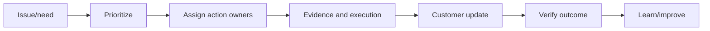
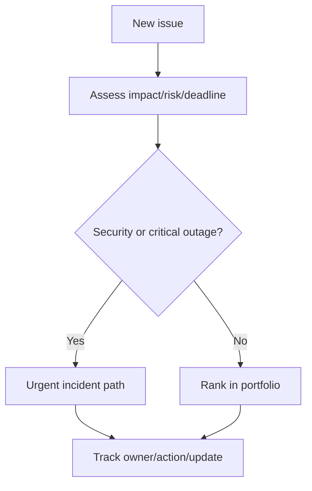
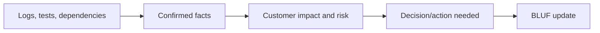
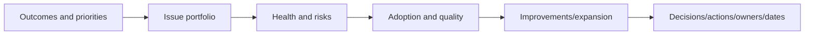
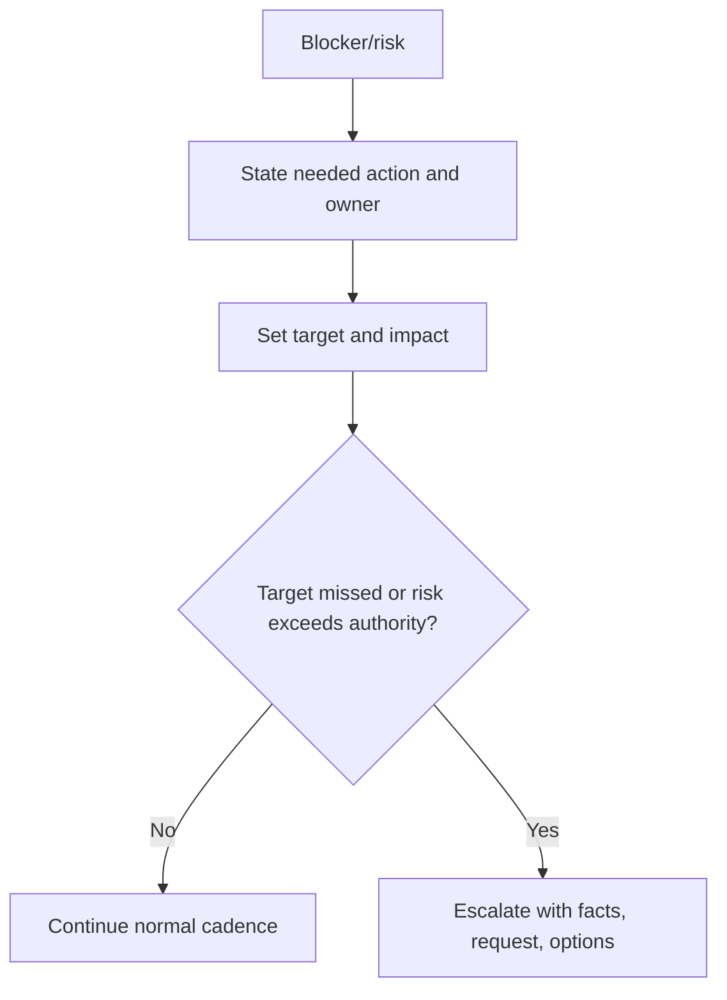
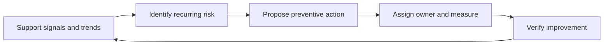

# Part 17 - Designated-Customer Ownership and Executive Communication

> **Section goal:** Own a customer's complete support experience across multiple issues, teams, and time horizons while communicating with clarity, urgency, and credibility.
>
> **Maps to JD:** assigned-customer ownership, regular reviews, collaborative channels, timely updates, issue prioritization, continuous improvement, security coordination, and customer representation.

---

## JD Mapping

| Responsibility | Practice |
|---|---|
| Own proactive/reactive support | Issue portfolio and operating cadence |
| Regular customer meetings | Review agenda, decisions, actions, risks |
| Timely updates | Update templates and communication triggers |
| High urgency | Severity/risk/deadline prioritization |
| Represent customer needs | Impact narrative and product feedback |

---

## 1. Ownership Is an Outcome

Ownership does not mean personally fixing every component. It means ensuring the customer outcome continues moving.



### Plain-English deep-dive: Action owner vs outcome owner

Engineering may own code; the customer admin may own configuration; support owns the coherent plan, communication, and verification.

**Analogy:** A conductor does not play every instrument but owns the coordinated performance.

---

## 2. Customer Context Map

| Area | Capture |
|---|---|
| Business goals | Priority use cases and outcomes |
| Stakeholders | Admins, security, champions, executives, source owners |
| Architecture | Sources, identity, network, regions, integrations |
| Security process | Access, evidence, escalation, approvals |
| Support commitments | Channels, hours, response expectations |
| Change calendar | Launches, audits, migrations, freezes |
| Success measures | Health, adoption, quality, business value |
| Known risks | Technical debt, expiring credentials, gaps |

Keep customer-specific data in approved restricted systems.

---

## 3. Issue Portfolio

A designated customer can have many concurrent issues.

| Field | Purpose |
|---|---|
| Issue/outcome | Concise customer language |
| Impact/scope | Users, workflow, risk |
| Severity/priority | Why now |
| State | Investigating, mitigated, blocked, monitoring |
| Next action | Specific observable work |
| Owner | One accountable owner |
| Target/update | Date/time |
| Blocker/dependency | Decision, access, team, release |
| Verification | How closure is proven |



---

## 4. Prioritization

| Factor | Question |
|---|---|
| Security/data | Unauthorized access or loss? |
| Business criticality | Revenue, launch, legal, executive workflow? |
| Scope | One user or enterprise? |
| Workaround | Safe and sustainable? |
| Deadline | Audit/launch/change window? |
| Duration/trend | Stable, recurring, expanding? |
| Commitment | SLA/contract/explicit promise? |
| Dependency | Blocking adoption or other fixes? |

Priority is explainable, not whoever asks most loudly.

---

## 5. Communication Cadence

| Situation | Cadence |
|---|---|
| Active critical incident | Time-based updates even without root cause |
| High-priority investigation | Agreed milestone/time updates |
| Blocked on customer action | Reminder/escalation agreed in advance |
| Monitoring after mitigation | Stability checkpoints |
| Normal portfolio | Weekly/biweekly/monthly review |
| Strategic improvement | Milestone/business review |

### Communication triggers

Update when impact changes, hypothesis changes, mitigation occurs, risk emerges, owner/date changes, decision is needed, or commitment may slip.

---

## 6. Status Update

```text
Status:
Customer impact now:
Confirmed facts:
What changed since last update:
Current hypothesis / unknowns:
Actions and owners:
Mitigation/workaround:
Risk or decision needed:
Verification target:
Next update time:
```

### Plain-English deep-dive: Update without progress

"No new root cause" can still be a valuable update if it states tests completed, hypotheses rejected, current action, risk, and next milestone.

Do not go silent because diagnosis is incomplete.

---

## 7. Executive Summary

Executives need outcome, risk, decision, and confidence, not raw logs.

| Technical detail | Executive translation |
|---|---|
| Connector 429/backlog | New content freshness delayed for X users |
| Token scope missing | Integration cannot access required source; admin approval needed |
| Fix merged | Code change exists but customer rollout/validation pending |
| Unknown cause | Impact mitigated; causal investigation continues with no current recurrence |

### BLUF

**Bottom Line Up Front:** Lead with customer impact/status, then evidence and detail.

### Plain-English deep-dive: Executive compression

Compression removes implementation detail without hiding uncertainty, risk, or ownership. The technical record remains available behind the summary.



---

## 8. Regular Customer Review



### Agenda

1. Business priorities and upcoming changes.
2. Critical/open issues by impact.
3. Health, alerts, freshness, access risks.
4. Adoption and quality signals.
5. Recurring themes and improvements.
6. Feature/source expansion.
7. Decisions, actions, owners, dates.

Send a written recap.

---

## 9. Difficult Conversations

| Situation | Response |
|---|---|
| Missed commitment | Acknowledge, explain facts, revised plan, prevention |
| Customer demands unsupported ETA | Give evidence-based milestone and dependencies |
| Customer action blocks progress | State exact need, why, owner, deadline, escalation |
| Product limitation | Be direct, offer workaround, document impact/feedback |
| Customer blames without evidence | Validate impact, align on shared facts/tests |
| Security concern | Follow incident path; facts and containment over speculation |

Do not overpromise to reduce tension temporarily.

---

## 10. Channel Discipline

| Channel | Best use |
|---|---|
| Case/work item | System of record, evidence, decisions |
| Collaborative chat | Rapid coordination, not sole record |
| Email | Formal recap/decision/stakeholder reach |
| Live call | Complex/urgent alignment |
| Business review | Trends, outcomes, strategy |
| Secure artifact channel | Sensitive logs/traces/files |

After chat/call, update the system of record.

---

## 11. Escalation

Escalation should accelerate a specific decision/action, not merely add senior people.



Escalation packet: impact, timeline, evidence, actions attempted, blocker, specific ask, deadline, consequence.

---

## 12. Customer Advocacy

Translate individual issues into patterns:

- Frequency and affected population.
- Business/security impact.
- Workaround burden.
- Support cost.
- Product gap.
- Proposed outcome and success measure.

Advocacy is evidence-based, not promising roadmap decisions.

---

## 13. Proactive Support

| Reactive signal | Proactive action |
|---|---|
| Credential expired | Ownership/rotation review |
| Repeated missing content | Source coverage/freshness health review |
| Same API 429 | Rate/concurrency improvement |
| Low adoption | Use-case training and quality review |
| Repeated handoff delay | Runbook/owner matrix |
| Permission incident | Access canary and security process |



---

## 14. Microsoft Experience Bridge

| Experience | Glean story |
|---|---|
| CRITSIT/escalations | Urgent outcome ownership |
| Technical Advisor | Guide teams without direct authority |
| Business reviews | Metrics to decisions/actions |
| 4.75/4.85 CSAT | Sustained customer experience discipline |
| Product defect validation | Close loop from impact to verified fix |
| Mentoring/KB | Scale quality beyond individual case |

---

## 15. Hands-On Lab 1: Monthly Customer Review

Build a 30-minute agenda from: one critical mitigated issue, two investigations, one stale credential risk, declining adoption, and a requested new source. Produce priorities, decisions, owners, dates, and recap.

---

## 16. Hands-On Lab 2: Missed ETA

A dependency team misses promised fix. Write an update that acknowledges miss, preserves trust, gives impact/mitigation, explains dependency without blame, sets revised milestone, and identifies escalation/prevention.

---

## Likely Interview Questions for This Section

### Q1. "What does customer ownership mean?"
> **Model answer:** "One coherent outcome plan: prioritize, assign owners, maintain evidence and updates, mitigate, verify, and improve, even when other teams execute actions."

### Q2. "How do you prioritize multiple issues?"
> **Model answer:** "Security/data risk, business criticality, scope, workaround, deadline, duration/trend, commitments, and dependencies; I make rationale visible."

### Q3. "How do you communicate without root cause?"
> **Model answer:** "State impact, confirmed facts, tests/results, current hypotheses/unknowns, mitigation, owners, next milestone and update time."

### Q4. "How do you handle an angry customer?"
> **Model answer:** "Acknowledge impact, listen for required outcome, align on facts, present immediate plan/cadence, avoid defensiveness/unsupported promises, then deliver and recap."

### Q5. "What belongs in a customer review?"
> **Model answer:** "Outcomes, issue portfolio, health/security risks, adoption/quality, recurring improvements, expansion opportunities, and explicit decisions/actions."

### Q6. "When do you escalate?"
> **Model answer:** "When impact/risk exceeds authority, an owned target slips, or a decision/blocker needs higher authority. I escalate with a specific ask and consequence."

### Q7. "How do you advocate for product change?"
> **Model answer:** "Aggregate frequency, users, business/security impact, workaround burden, evidence, and desired measurable outcome; do not promise roadmap."

### Q8. "Why are you suited for assigned customers?"
> **Model answer:** "I already own enterprise escalations across customer IT, partners, engineering and product, lead technical syncs/business reviews, and use CSAT/backlog/case trends to drive outcomes."

---

## 30-Second Memory Hooks

- **Ownership:** Actions can move; accountability stays.
- **Portfolio:** Impact + owner + next action + date + verify.
- **Cadence:** Time-based during critical uncertainty.
- **BLUF:** Outcome and risk first.
- **Escalate:** Specific ask, not more audience.
- **Advocate:** Pattern and impact, not promise.

---

## Completion Checklist

- [ ] I can build customer context and issue portfolio.
- [ ] I can prioritize and communicate cadence.
- [ ] I can write technical and executive updates.
- [ ] I can run/re-cap a customer review.
- [ ] I can handle missed ETA and escalation.
- [ ] I completed both labs.

---

*Next suggested section: [Part-18-alerts-health-incidents-and-remediation.md](Part-18-alerts-health-incidents-and-remediation.md). It turns alerts and health signals into coordinated incident and remediation plans.*
