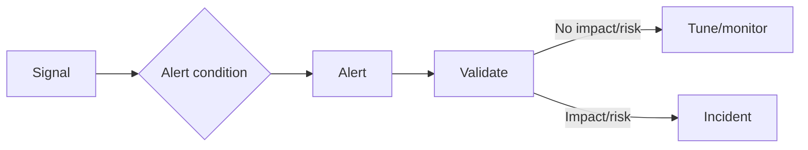
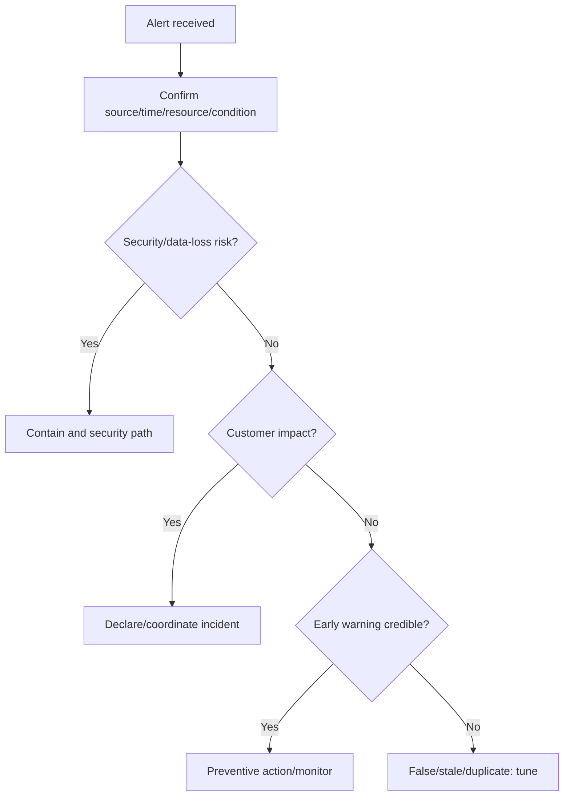
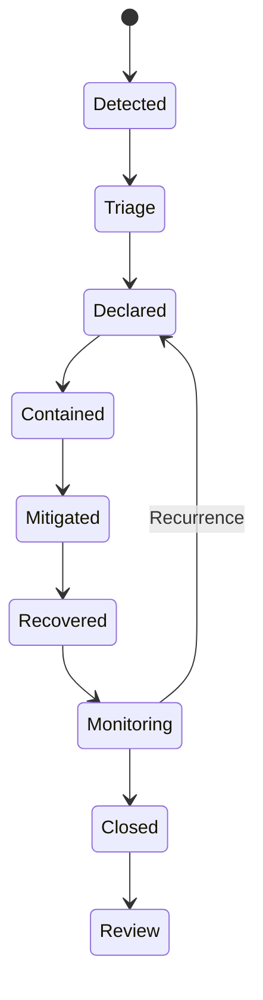
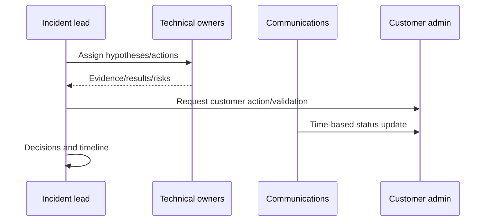
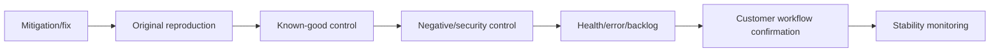
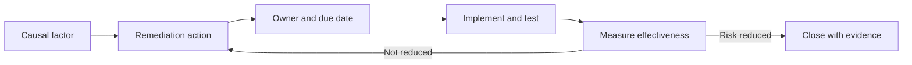

# Part 18 - Alerts, System Health, Incidents, and Remediation Plans

> **Section goal:** Validate alerts, coordinate incidents, restore customer outcomes, verify recovery, and turn causal findings into measurable remediation.
>
> **Maps to JD:** customer-impacting alerts, system/user health, remediation plans, customer admin coordination, urgent updates, and continuous improvement.

---

## JD Mapping

| Responsibility | Practice |
|---|---|
| Handle alerts | Validate signal, impact, scope, urgency |
| Coordinate resolution | Incident roles, action log, cadence |
| Identify health issues | Baselines, leading/lagging signals, controls |
| Execute remediation | Cause-linked owners, dates, measures |
| Update customer | Impact/facts/actions/next update |

---

## 1. Signal, Alert, Symptom, Incident

| Term | Meaning |
|---|---|
| Signal | Measured event/value |
| Baseline | Expected behavior/range |
| Threshold | Condition used to trigger |
| Alert | Notification requiring evaluation/action |
| Symptom | Observed undesired behavior |
| Incident | Unplanned interruption/degradation/security impact needing coordination |
| Root cause | Correctable underlying mechanism |



### Plain-English deep-dive: Alert is not root cause

An alert is a smoke detector. It may be accurate, noisy, downstream, or early; investigation finds the fire and impact.

---

## 2. Health Layers

| Layer | Example |
|---|---|
| Provider/platform | Regional/service event |
| Tenant/resource | Connector stopped, quota reached |
| Component | API errors, queue backlog |
| Dependency | Source API/identity/database |
| User | Login/content/permission failure |
| Business | Launch, support, compliance workflow blocked |

A component can be healthy while the business workflow is not.

---

## 3. Alert Quality

| Quality | Question |
|---|---|
| Actionable | Is an owner/action defined? |
| Sensitive | Does it detect meaningful failure? |
| Specific | Does it avoid normal noise? |
| Timely | Early enough to reduce impact? |
| Routed | Correct primary/backup owner? |
| Contextual | Resource, tenant, region, runbook, dashboard? |
| Suppressed/deduplicated | Avoid alert storms? |

### False positive vs false negative

- False positive: alert fires without target condition.
- False negative: harmful condition occurs without alert.

Tuning balances both; security false negatives can be especially severe.

---

## 4. Alert Triage



### Initial checks

- Is alert current and unique?
- What exact condition and evaluation window?
- Is telemetry delayed/missing?
- Which resource/tenant/region?
- Customer-visible tests?
- Recent changes?
- Runbook/owner/escalation?

---

## 5. Severity and Incident Roles

| Role | Responsibility |
|---|---|
| Incident lead | Decisions, priorities, coordination |
| Technical lead(s) | Investigation/repair by component |
| Communications lead | Stakeholder cadence and summaries |
| Scribe | Timeline, actions, decisions |
| Customer admin | Source/config/access/customer validation |
| Security lead | Security assessment/containment where needed |

One person may hold multiple roles for small incidents; responsibilities must remain explicit.

---

## 6. Incident Lifecycle



- Contained: spread/harm limited.
- Mitigated: impact reduced.
- Recovered: workflow restored.
- Resolved: cause repaired and closure criteria met, team terminology varies.

---

## 7. Incident Command



### Plain-English deep-dive: Parallelism needs coordination

Many people working randomly can duplicate changes and destroy evidence. Parallel tracks need explicit questions, owners, and merge points.

---

## 8. Incident Artifacts

| Artifact | Contents |
|---|---|
| Timeline | UTC events/evidence |
| Action log | Action, owner, target, status |
| Decision log | Decision, evidence, risk, revisit condition |
| Hypothesis ledger | Predictions/tests/status |
| Stakeholder map | Customer/internal/security/product |
| Status update | Impact, facts, action, next time |
| Remediation tracker | Cause-linked prevention |

| Alert domain | First coordinating owner |
|---|---|
| Credential/connector setup | Customer admin plus support |
| Permission exposure/revocation | Security, source admin, support |
| Product/API errors | Support and engineering |
| Cloud/network dependency | Customer cloud/network plus vendor |
| Adoption/quality degradation | Customer champion, support, product |

---

## 9. Mitigation Decision

| Option | Benefit | Risk |
|---|---|---|
| Rollback | Restore prior behavior | Data/schema/compatibility |
| Disable feature/action | Limit blast radius | Lost functionality |
| Reduce traffic/concurrency | Relieve overload | Slower service/backlog |
| Failover | Restore availability | Stale state/capacity/data |
| Hide content | Contain exposure | Search completeness |
| Direct-source workaround | Business continuity | Manual effort |

Prefer reversible, tested, least-risk action. Preserve evidence first when safety permits.

---

## 10. Recovery Verification



Green dashboards without customer workflow are insufficient.

---

## 11. Post-Incident Review

A useful PIR is blame-free and evidence-based.

```text
Impact/scope/duration:
Detection and response:
Timeline:
Trigger/mechanism/root cause/contributing factors:
What worked/failed:
Why prevention/detection did not stop it:
Recovery verification:
Corrective/preventive/detective actions:
Owners/dates/effectiveness measures:
```

---

## 12. Remediation Plan

| Causal factor | Action | Owner | Due | Measure |
|---|---|---|---|---|
| Credential expiry | Automated rotation | Identity owner | Date | No unplanned expiry |
| Alert unowned | Primary/backup routing | Support admin | Date | Test ack within target |
| Permission lag invisible | Revocation canary | Product/support | Date | Lag below threshold |
| Retry storm | Bounded backoff | Integration team | Date | No sustained 429 amplification |

### Plain-English deep-dive: Action completed vs risk reduced

Closing a task means implementation happened. Effectiveness review proves the causal risk actually declined.



---

## 13. Health Scorecard

| Dimension | Measure |
|---|---|
| Availability | Successful customer workflow rate |
| Latency | p50/p95/p99 by operation |
| Errors | Rate by code/component |
| Freshness | Source change to visible state |
| Permissions | Access/revocation canaries |
| Backlog | Age/size/rate |
| Adoption | Active users/use cases |
| Quality | Search/answer/agent success |

Avoid one composite score that hides a security or critical failure.

---

## 14. Customer Update

```text
Status and severity:
Impact/scope:
Confirmed facts:
Mitigation/recovery state:
Actions/owners:
Customer action needed:
Risk/unknowns:
Verification/monitoring:
Next update:
```

---

## 15. Hands-On Lab 1: Connector Credential Alert

Alert: credential expires in seven days; no current impact; customer launch in ten days.

Treat as credible preventive risk. Assign customer admin/backup, schedule rotation before launch, define rollback/test, verify content and ACL freshness, and test alert closure.

---

## 16. Hands-On Lab 2: Permission Revocation Lag

A former contractor can retrieve a document after source removal.

Treat as security incident: preserve user/object/time evidence, contain through approved path, verify scope, involve security/source admin, update on fixed cadence, test revocation and allowed controls, then create canary/remediation.

---

## Likely Interview Questions for This Section

### Q1. "Alert vs incident?"
> **Model answer:** "An alert is a signal notification requiring validation. An incident is actual or credible service/security impact requiring coordinated response."

### Q2. "How do you triage an alert?"
> **Model answer:** "Confirm condition/source/time/resource, validate telemetry, assess security and customer impact, compare baseline/controls, identify owner/runbook, then incident, preventive, or tuning path."

### Q3. "Incident roles?"
> **Model answer:** "Incident lead, technical owners, communications, scribe, customer admin, and security where needed; explicit even if combined."

### Q4. "How do you choose mitigation?"
> **Model answer:** "Compare time-to-impact reduction, reversibility, security/data risk, evidence loss, customer cost, and rollback; choose least-risk viable path."

### Q5. "How do you verify recovery?"
> **Model answer:** "Original reproduction, known-good and negative/security controls, health/error/backlog, customer workflow, stability interval."

### Q6. "What makes a good remediation?"
> **Model answer:** "Tied to causal factor, owner/date, measurable completion and effectiveness, including preventive and detective controls."

### Q7. "How do you reduce alert fatigue?"
> **Model answer:** "Actionable thresholds/windows, deduplication, correct routing, context/runbook, baseline-aware tuning, and review false positives/negatives."

### Q8. "Permission alert priority?"
> **Model answer:** "Possible false allow or stale revocation is security-sensitive even with one user; contain, preserve evidence, coordinate security, and verify both allowed/denied controls."

---

## 30-Second Memory Hooks

- **Alert:** Signal needing judgment.
- **Incident:** Impact needing coordination.
- **Roles:** Lead, technical, communication, scribe.
- **Lifecycle:** Detect -> contain -> mitigate -> recover -> monitor -> learn.
- **Green is not recovered until customer workflow passes.**
- **Remediation:** Cause -> owner -> date -> effectiveness.

---

## Completion Checklist

- [ ] I can distinguish signal/alert/symptom/incident/cause.
- [ ] I can triage security and customer impact.
- [ ] I can coordinate roles/artifacts/cadence.
- [ ] I can choose and verify mitigation.
- [ ] I can write PIR/remediation/health scorecard.
- [ ] I completed both labs.

---

*Next suggested section: [Part-19-content-source-setup-and-feature-adoption.md](Part-19-content-source-setup-and-feature-adoption.md). It applies health and remediation discipline to planned source/feature rollout and customer education.*
