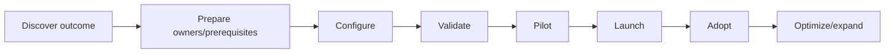
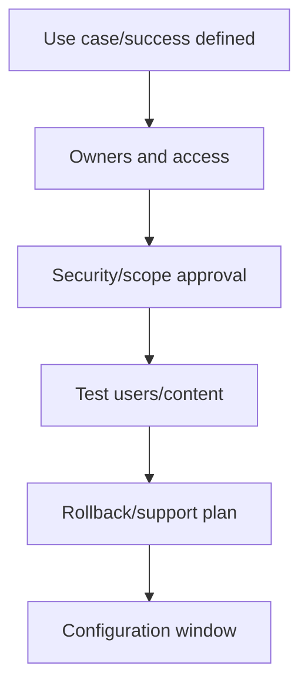
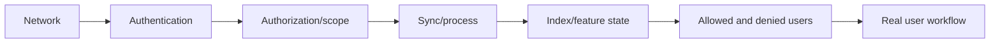
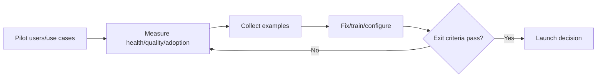
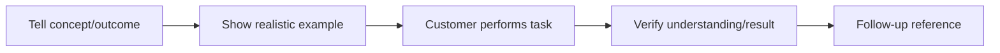
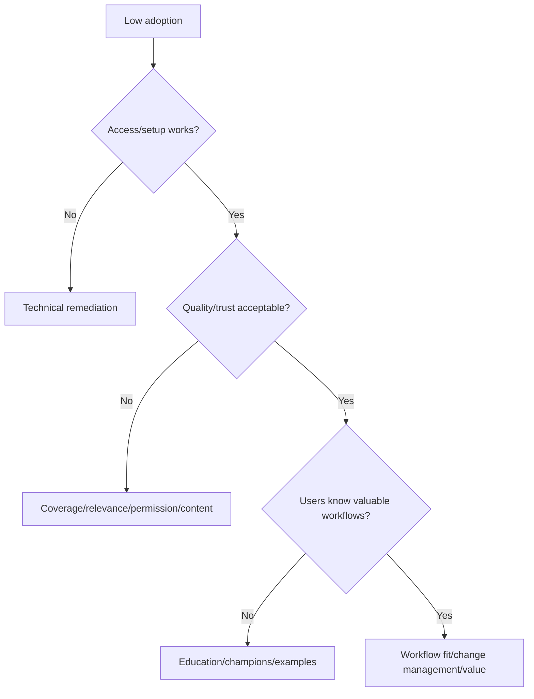

# Part 19 - Content-Source Setup, Feature Verification, and Customer Education

> **Section goal:** Lead a safe content-source or feature rollout from discovery through verified customer value, training, adoption, and operational handoff.
>
> **Maps to JD:** configure/setup/verify sources and features, educate customers, realize additional value, coordinate admins/security, and execute remediation.

---

## JD Mapping

| Responsibility | Practice |
|---|---|
| Configure source/feature | Prerequisites, roles, scope, settings |
| Verify | Positive/negative/freshness/rollback tests |
| Educate | Persona/use-case training and support handoff |
| Create value | Adoption and business outcome measurement |
| Coordinate security | Least privilege, test data, approvals |

---

## 1. Setup Is a Change Project



A saved configuration is not a successful rollout.

### Plain-English deep-dive: Feature vs outcome

"Connector enabled" is a feature state. "Employees find current permitted policy without asking HR" is an outcome.

---

## 2. Discovery

| Question | Example |
|---|---|
| Business problem | New employees cannot find onboarding answers |
| Target personas | Employees, HR admins, managers |
| Sources | SharePoint policy site |
| Required objects | Pages, files, owners, permissions |
| Security boundary | HR case files excluded |
| Freshness | Updates visible within expected window |
| Success | Search success and fewer repeated requests |
| Deadline | Pilot/launch date |

Do not start with "connect everything."

---

## 3. Stakeholders and RACI

| Role | Contribution |
|---|---|
| Business champion | Outcome/adoption |
| Glean admin | Product configuration |
| Source admin | App/API/content scope |
| Identity admin | Users/groups/auth |
| Security/privacy | Scope/data/access approval |
| Network/cloud | Endpoint/private path |
| Support | Plan/evidence/runbook/coordination |
| Users/pilot | Real workflow feedback |

RACI: Responsible, Accountable, Consulted, Informed. One accountable owner per decision.

---

## 4. Readiness Checklist



| Area | Ready evidence |
|---|---|
| Product/license | Feature available in target tenant |
| Source | Required admin/API/settings available |
| Identity | Test users/groups mapped |
| Network | Endpoints/proxy/firewall validated |
| Data | Controlled expected/denied items |
| Security | Scope/least privilege/evidence approved |
| Operations | Monitoring, alerts, runbook, owners |
| Customer | Pilot users/training/acceptance scheduled |

---

## 5. Least-Privilege Configuration

- Use documented app/credential type.
- Grant only required scopes/roles.
- Limit source inclusion/exclusion intentionally.
- Separate dev/test/prod where available.
- Store credentials safely and plan rotation.
- Assign primary/backup owners.
- Record current configuration without sensitive values.

### Plain-English deep-dive: Broad access is not a shortcut

Overbroad access can hide missing permission logic during testing and creates risk. Test with realistic least privilege.

---

## 6. Controlled Test Dataset

| Item | Access | Purpose |
|---|---|---|
| Broad harmless document | Pilot group | Basic path |
| Group-restricted document | Group A | Positive/negative ACL |
| Recently updated document | Pilot | Freshness |
| Disposable document | Pilot | Deletion |
| Known metadata fields | Pilot | Filters/rendering |
| Explicitly excluded item | Restricted/excluded | Scope control |

Use distinctive harmless markers.

---

## 7. Configuration Record

```text
Feature/source/version/mode:
Customer outcome:
Owners:
Credential type/scope metadata, no value:
Included/excluded scope:
Identity/group mapping:
Network endpoints:
Test group/content:
Expected freshness:
Monitoring/alerts:
Rollback:
Change window and approval:
```

---

## 8. Acceptance Test Layers



| Test | Pass criterion |
|---|---|
| Basic object | Exact marker found |
| Positive ACL | Allowed user sees it |
| Negative ACL | Denied user cannot see/influence answer |
| Update | New marker visible in expected interval |
| Delete/revoke | Disappears in expected path |
| Metadata | Correct source/type/owner/link |
| Assistant | Controlled answer grounded correctly |
| Action | Approved harmless action and final state verified |
| Failure/alert | Correct owner receives actionable signal |

---

## 9. Pilot

| Pilot dimension | Choice |
|---|---|
| Audience | Representative small group |
| Duration | Enough normal usage/change cycles |
| Use cases | High-value and measurable |
| Support | Known channel/cadence |
| Feedback | Structured examples, not general sentiment |
| Exit criteria | Technical, security, quality, adoption |



---

## 10. Rollout

- Phased audience/groups.
- Change communications.
- Admin/user training.
- Known limitations/workarounds.
- Support channel and runbook.
- Monitoring and alert recipients.
- Stop/rollback criteria.
- Post-launch checkpoints.

Avoid all-at-once rollout when risk/unknowns justify phases.

---

## 11. Customer Education

### Persona-based training

| Persona | Teach |
|---|---|
| End user | High-value search/assistant workflows and feedback |
| Admin | Health, access, source settings, alerts, escalation |
| Security | Permission model, evidence, controls, incident path |
| Champion | Use cases, adoption, outcomes, coaching |
| Developer | API/auth/version/rate/error evidence |

### Tell-show-do-verify



Do not overload users with feature lists. Teach jobs they need to complete.

---

## 12. Adoption

| Signal | Meaning |
|---|---|
| Activated users | Setup completed |
| Weekly/monthly active | Continued use |
| Repeat use | Habit/usefulness |
| Feature/use-case mix | Breadth |
| Search/answer success | Quality |
| Training completion | Exposure, not outcome alone |
| Time/tickets saved | Business value if baseline credible |

### Plain-English deep-dive: Adoption is not login count

Usage can be forced or shallow. Customer value needs successful repeated workflows and outcomes.

---

## 13. Low Adoption Diagnosis



---

## 14. Handoff to Operations

| Deliverable | Owner |
|---|---|
| Configuration record | Admin |
| Credential rotation | Named primary/backup |
| Monitoring/alerts | Operations/support |
| Runbook | Support/admin |
| User guide | Champion/enablement |
| Acceptance evidence | Project owner |
| Known issues | Support/product |
| Review cadence | Assigned support owner |

---

## 15. Rollback

Define:

- Trigger/threshold.
- Authority.
- Steps.
- Data/access implications.
- Communication.
- Verification.
- Evidence preservation.

Rollback can be disabling rollout visibility, reverting config, or stopping an action, not necessarily deleting a connector.

---

## 16. Hands-On Lab 1: SharePoint Pilot

Design a test-group rollout with broad/restricted/updated/deleted/excluded documents, current policy question, source links, positive/negative users, expected freshness, admin alert, training, adoption metrics, and rollback.

---

## 17. Hands-On Lab 2: New Agent Feature

Pilot a harmless agent that drafts a support summary but does not send it. Define sources, permission personas, expected output, forbidden disclosure, human review, quality rubric, latency, error monitoring, training, and expansion gate.

---

## Likely Interview Questions for This Section

### Q1. "How do you set up a new source?"
> **Model answer:** "Start with outcome/personas/sources/security/success, confirm owners and prerequisites, configure least privilege/scope, run controlled content/ACL/freshness/deletion tests, pilot, launch in phases, train, monitor, and hand off with rollback."

### Q2. "What acceptance tests matter most?"
> **Model answer:** "Basic content, allowed and denied users, update and delete/revoke, metadata/source link, realistic search/assistant workflow, alert ownership, and customer sign-off."

### Q3. "How do you educate customers?"
> **Model answer:** "Persona-based jobs, tell-show-do-verify, realistic safe examples, references, practice, and follow-up quality/adoption measurement."

### Q4. "How do you measure adoption?"
> **Model answer:** "Activation, active/repeat use, use-case/feature mix, quality/task success, and business outcome against baseline; not login count alone."

### Q5. "Why pilot?"
> **Model answer:** "Limit risk while testing technical, security, quality, training, workflow, and support assumptions with representative users."

### Q6. "How do you handle low adoption?"
> **Model answer:** "Separate access/setup, quality/trust, education, workflow fit, and change-management/value hypotheses; test examples and build a measurable plan."

### Q7. "What belongs in handoff?"
> **Model answer:** "Configuration, owners/rotation, monitoring/alerts, runbook, user guide, evidence, known issues, escalation, and review cadence."

### Q8. "How does M365 experience transfer?"
> **Model answer:** "SharePoint/OneDrive administration, permissions, feature guidance, partner training, enterprise support, and adoption give direct patterns while Glean-specific controls are learned."

---

## 30-Second Memory Hooks

- **Outcome before configuration.**
- **Readiness:** Owners + prerequisites + test + rollback.
- **Acceptance:** Positive and negative users.
- **Pilot:** Limit risk, learn fast.
- **Education:** Tell -> show -> do -> verify.
- **Adoption:** Successful repeated workflow, not login.
- **Handoff:** Config + owners + monitor + runbook + cadence.

---

## Completion Checklist

- [ ] I can lead discovery/readiness/configuration.
- [ ] I can design controlled acceptance tests.
- [ ] I can plan pilot/rollout/rollback.
- [ ] I can teach by persona and diagnose adoption.
- [ ] I can create operational handoff.
- [ ] I completed both labs.

---

*Next suggested section: [Part-20-runbooks-knowledge-and-documentation.md](Part-20-runbooks-knowledge-and-documentation.md). It turns setup and incident learning into durable customer-specific and reusable guidance.*
