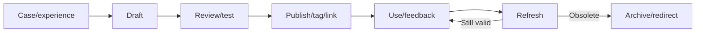
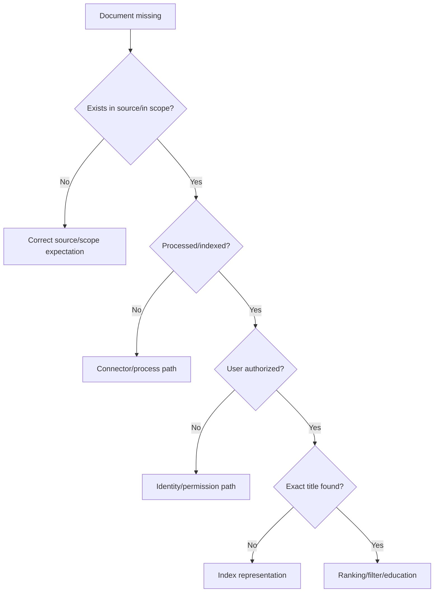
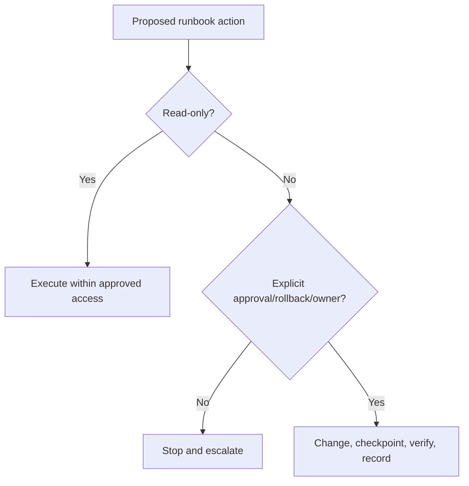
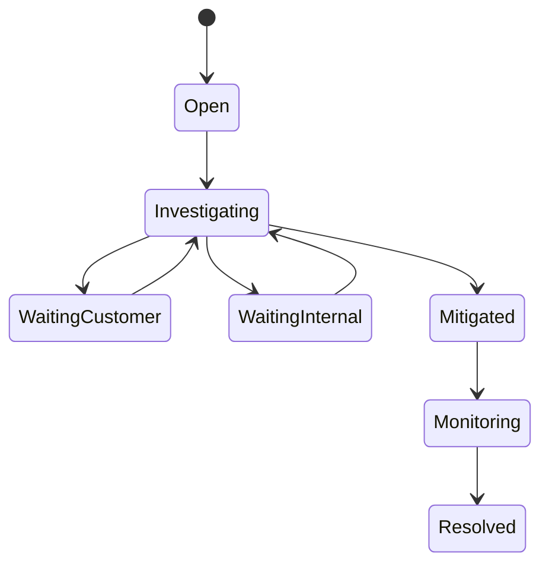
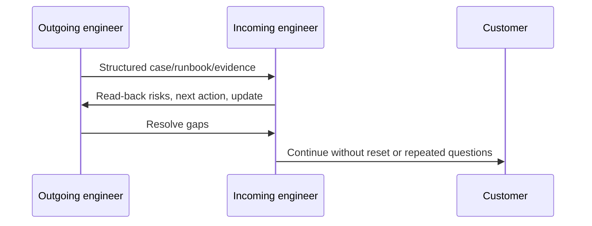
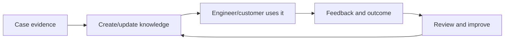

# Part 20 - Runbooks, Knowledge Articles, and Case Documentation

> **Section goal:** Create documentation that another authorized engineer can use safely, accurately, and quickly without relying on undocumented tribal knowledge.
>
> **Maps to JD:** customer-specific runbooks, knowledge articles, complete issue documentation, customer communication, support efficiency, and security processes.

---

## JD Mapping

| Deliverable | Role need |
|---|---|
| Customer runbook | Unique architecture/access/owners |
| Reusable KB | Repeatable cross-customer issue |
| Case notes | Current incident truth/handoff |
| PIR/decision record | Learning and rationale |
| Checklist | Consistent execution/verification |

---

## 1. Documentation Types

| Type | Audience | Purpose |
|---|---|---|
| Case record | Case participants | Live timeline/actions/evidence |
| Customer runbook | Authorized support/admin | Operate customer-specific workflow |
| KB article | Broad support/users | Diagnose/resolve reusable issue |
| Troubleshooting guide | Technical support | Branching evidence flow |
| Post-incident review | Stakeholders/owners | Cause/learning/actions |
| Decision record | Future maintainers | Why option was selected |
| User guide | End users/admins | Complete product task |

| Need | Choose |
|---|---|
| Preserve live investigation | Case record |
| Repeat customer-specific operation | Restricted runbook |
| Solve recurring general symptom | KB/troubleshooting guide |
| Explain why architecture changed | Decision record |
| Capture incident learning/actions | PIR |

### Plain-English deep-dive: Documented is not discoverable

A correct page with poor title, tags, ownership, or links is effectively hidden.

---

## 2. Knowledge Lifecycle



Every page needs an owner and review date.

---

## 3. Customer-Specific vs Reusable

| Customer-specific | Reusable |
|---|---|
| Tenant/source topology | General connector symptom |
| Named customer owners/channels | Generic role/owner types |
| Approved access process | General least-privilege principle |
| Customer change windows | Generic validation flow |
| Restricted architecture | Sanitized examples |

Do not copy customer identifiers/configuration into general KB.

| Evidence handling | Practice |
|---|---|
| Large/sensitive artifact | Link to controlled store |
| Reusable excerpt | Sanitize/minimize |
| Credential/token | Never copy value |
| Customer architecture | Restricted page/space |
| Official product fact | Link current source/version |

---

## 4. Runbook Anatomy

```text
Title and purpose:
Audience/scope/version:
Owner/backup/review date:
Trigger and expected outcome:
Prerequisites/access/approvals:
Safety and data classification:
Inputs:
Decision flow:
Steps with expected results:
Failure branches:
Rollback/containment:
Verification and customer confirmation:
Escalation evidence and contacts:
Related source documentation:
```

### Plain-English deep-dive: Step vs checkpoint

A step says what to do. A checkpoint says what evidence proves it worked and whether to continue.

---

## 5. Decision Trees



Each branch should request evidence, not just state a cause.

---

## 6. Step Quality

| Weak | Strong |
|---|---|
| "Check logs" | "Filter connector logs by request ID and UTC +/-2 minutes; record first auth/rate error" |
| "Restart" | "After evidence and approval, restart named component; record revision, time, expected state, rollback" |
| "Verify" | "Repeat original exact-title test as allowed and denied control users" |
| "Escalate" | "Attach sanitized request ID/timeline/config metadata and state specific engineering ask" |

---

## 7. Safety and Access

Runbook must state:

- Required role and least privilege.
- Approval/change window.
- Sensitive fields to redact.
- Operations that are read-only vs mutating.
- Blast radius.
- Backup/rollback/containment.
- Audit and artifact retention.
- When to stop and escalate.



---

## 8. Verification

| Verification | Example |
|---|---|
| Original case | Customer workflow succeeds |
| Known-good control | Unaffected path remains healthy |
| Negative/security | Denied user remains denied |
| Health | Error/backlog/freshness recovers |
| Stability | No recurrence in agreed interval |
| Cleanup | Temporary access/config removed |

Runbook completion is not the same as customer outcome verification.

---

## 9. KB Article Template

```text
Title using symptom and product:
Applies to/version:
Audience:
Symptoms and exact errors:
Impact:
Likely causes:
Prerequisites/safety:
Diagnosis flow:
Resolution/mitigation:
Verification:
When to escalate and evidence required:
Related articles/source docs:
Owner/review date:
```

### Searchability

Include user language, error codes, product/source names, and synonyms naturally. Avoid keyword stuffing.

---

## 10. Case Documentation



Every update should answer:

- Current impact/state.
- New evidence or decision.
- Action/owner/target.
- Customer request.
- Next update.

| Weak note | Strong note |
|---|---|
| "Investigating" | Test, result, current hypothesis, next owner/time |
| "Waiting on customer" | Exact requested evidence/action, why, due/next contact |
| "Fixed" | Change, original/negative tests, customer confirmation |
| Raw log pasted | Sanitized excerpt plus interpretation and artifact link |

---

## 11. Handoff

A handoff is successful when the receiver can state:

- Customer impact and current status.
- What is known/unknown.
- What evidence matters.
- Next action and owner.
- Risks/deadlines.
- Update commitment.
- Access/artifact location.



### Plain-English deep-dive: Handoff is transfer of understanding

Forwarding a ticket is not a handoff if the receiver must reconstruct the incident.

---

## 12. Documentation Review Checklist

| Check | Question |
|---|---|
| Accuracy | Current product/version/official source? |
| Completeness | Prerequisites, branches, rollback, verify? |
| Safety | Access/data/change risk explicit? |
| Testability | Another engineer successfully followed it? |
| Discoverability | Title/tags/links/user language? |
| Ownership | Owner/backup/review date? |
| Accessibility | Right authorized audience can open it? |
| Concision | Critical actions visible under pressure? |

---

## 13. Documentation Metrics

- Successful use rate.
- Cases using article.
- Time-to-resolution change.
- Escalations avoided.
- Search success/no-result terms.
- Feedback/corrections.
- Stale pages past review date.
- Runbook execution errors.

Views alone do not prove usefulness.

| Review trigger | Action |
|---|---|
| Product/release change | Re-test affected steps/version |
| Repeated user failure | Clarify branch/prerequisite |
| Security/access change | Re-review role/data handling |
| Owner leaves | Assign replacement before expiry |
| Better article exists | Merge and redirect/archive |



---

## 14. Hands-On Lab 1: Customer Connector Runbook

Write a restricted runbook for credential rotation: owners, prerequisites, access, pre-check, change, rollback, content/ACL/freshness tests, monitoring, communication, and next review.

---

## 15. Hands-On Lab 2: Reusable Missing-Content KB

Convert a case into a customer-neutral article with symptom, scope, source/index/permission/query decision tree, evidence checklist, verification, and escalation criteria.

---

## Likely Interview Questions for This Section

### Q1. "Runbook vs KB?"
> **Model answer:** "Runbook guides safe operation with prerequisites, actions, rollback and verification. KB explains reusable symptoms/causes/diagnosis/resolution. Customer runbooks may include restricted specifics."

### Q2. "What makes documentation useful?"
> **Model answer:** "Correct, discoverable, scoped, tested, safe, owned, current, and explicit about expected evidence and next branches."

### Q3. "What belongs in case notes?"
> **Model answer:** "Impact/status, UTC timeline, facts/hypotheses, evidence/IDs, actions/owners/targets, mitigation, customer requests, risks, verification, next update."

### Q4. "How do you protect customer data?"
> **Model answer:** "Restricted customer pages, minimal data, sanitization, controlled artifact links, no credential copying, approved retention/access, customer-neutral reusable KB."

### Q5. "How do you validate a runbook?"
> **Model answer:** "Peer/SME review plus controlled execution by someone other than author, including failure branches, rollback, security and outcome verification."

### Q6. "How do you avoid stale docs?"
> **Model answer:** "Named owner/backup, review date, version scope, source links, feedback, usage signals, release/change triggers, archive/redirect."

### Q7. "What is a good handoff?"
> **Model answer:** "Receiver understands impact, evidence, unknowns, next action/owner, risks/deadlines and customer update, confirmed through read-back."

### Q8. "How do docs scale support?"
> **Model answer:** "They standardize evidence and safe actions, reduce rediscovery and handoff loss, improve first response, and feed product/process improvements; measure outcomes, not page count."

---

## 30-Second Memory Hooks

- **Runbook:** Operate. **KB:** Explain.
- **Step + checkpoint.**
- **Every mutation:** Approval + rollback + verify.
- **Case note:** New fact/decision/action/update.
- **Handoff:** Transfer understanding, not ticket.
- **Owner + review date or stale by design.**

---

## Completion Checklist

- [ ] I can choose correct documentation type.
- [ ] I can write safe runbook and searchable KB.
- [ ] I can document case and handoff.
- [ ] I can review ownership/freshness/metrics.
- [ ] I completed both labs.

---

*Next suggested section: [Part-21-support-metrics-and-continuous-improvement.md](Part-21-support-metrics-and-continuous-improvement.md). It measures whether support processes and documentation improve outcomes.*
