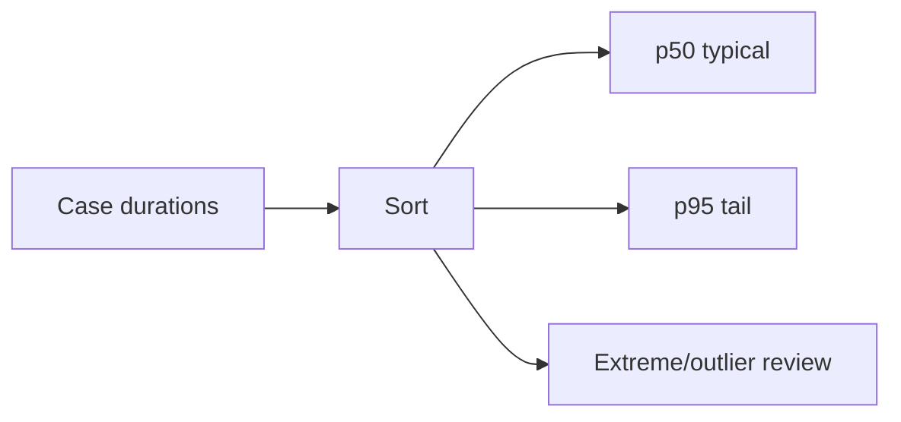
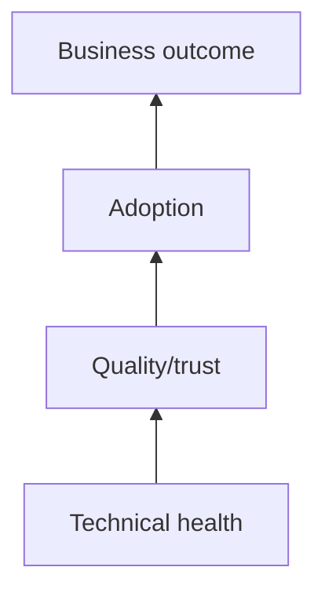
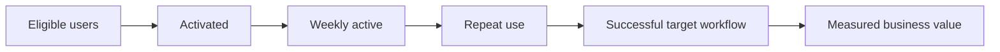
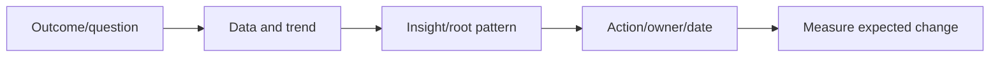
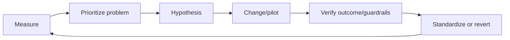

# Part 21 - Support Metrics, Business Reviews, and Continuous Improvement

> **Section goal:** Use objective measures to find customer risk, prioritize improvement, prove outcomes, and avoid vanity metrics or metric gaming.
>
> **Maps to JD:** data-driven support, customer reviews, system/user health, scale/efficiency projects, continuous improvement, and customer experience.

---

## JD Mapping

| Responsibility | Measure/workflow |
|---|---|
| Timely support | First response/update/mitigation time |
| Manage to completion | Resolution, reopen, backlog age |
| Health/remediation | Availability/error/freshness/permission signals |
| Improve scale | Deflection/reuse/automation and quality guardrails |
| Customer value | CSAT, adoption, task/business outcomes |

---

## 1. Metric Anatomy

A useful metric has definition, numerator/denominator, scope, source, owner, target, and decision.

```text
Name:
Question answered:
Formula:
Population/exclusions:
Time window/timezone:
Data source/quality:
Segment/cohort:
Target/baseline:
Owner:
Decision/action triggered:
Guardrail metric:
```

### Plain-English deep-dive: Measure is not target

A metric describes reality; a target expresses desired performance. Turning a metric into a target can change behavior and create gaming.

---

## 2. SLA, SLO, SLI

| Term | Meaning |
|---|---|
| SLI | Service level indicator: measured behavior |
| SLO | Objective/target for indicator |
| SLA | Formal commitment with terms/consequences |

Do not use interchangeably. Customer-specific contracts govern SLA.

---

## 3. Support Flow Metrics


| Metric | Meaning |
|---|---|
| Time to first response | Creation to meaningful acknowledgement |
| Time to next update | Update cadence adherence |
| Time to mitigation | Impact reduced |
| Time to resolution | Closure criteria met |
| Reopen rate | Closed issues returning |
| Escalation rate | Issues requiring another tier/team |
| Backlog size/age | Open work and aging distribution |
| Handoff count | Transfers, not automatically bad |
| First-contact resolution | Resolved without later handling, quality needed |

### Percentiles

Average can hide severe tail cases.

| Percentile | Meaning |
|---|---|
| p50 | Median |
| p90 | 90% at/below value |
| p95/p99 | Tail experience |



---

## 4. Quality Metrics

| Metric | Risk it reveals |
|---|---|
| Case-note completeness | Handoff/reconstruction loss |
| Reproduction completeness | Engineering delay |
| Reopen rate | Premature closure |
| Defect rejection | Weak evidence/wrong routing |
| Runbook success | Operational quality |
| Customer effort | Friction |
| Escalation recurrence | Prevention gap |

Speed without quality can worsen trust.

---

## 5. Customer Metrics

| Metric | Interpretation |
|---|---|
| CSAT | Satisfaction with interaction/outcome |
| DSAT | Dissatisfied responses/themes |
| Response rate | Sample reliability clue |
| Sentiment | Qualitative, should not replace evidence |
| Customer effort | Ease of getting outcome |
| Executive risk | Strategic/relationship impact |

### Plain-English deep-dive: CSAT is a signal, not a verdict

CSAT can be biased by who responds, issue severity, timing, and expectations. Pair score with comments, response rate, cohorts, and operational outcomes.

Your sustained 4.75 Enterprise and 4.85 SMB results are strong evidence; explain behaviors behind them.

---

## 6. Product Health and Adoption

| Layer | Metric |
|---|---|
| Connector | Errors, sync age, items/change rate |
| Search | Zero-result, reformulation, top-result success |
| Assistant | Groundedness/helpfulness/citation/error |
| Agent | Step/action success, approval, final-state verification |
| Access | Positive/negative canary, revocation lag |
| Adoption | Active/repeat users, use-case mix |
| Business | Time/tickets saved, onboarding/task completion |



---

## 7. Leading and Lagging Indicators

| Leading | Lagging |
|---|---|
| Credential days to expiry | Connector outage |
| Backlog age growth | Missed resolution target |
| Training/activation | Adoption/value |
| Permission canary lag | Access incident |
| Error/retry trend | Customer-visible failure |

Leading indicators enable prevention; lagging confirm outcome.

---

## 8. Segmentation and Cohorts

Compare by:

- Customer/segment/tier.
- Severity/issue type/source.
- Product/version/region.
- New vs experienced engineers.
- Pilot vs broad rollout.
- Before/after change.
- User persona/team.

Aggregates can hide one customer's critical deterioration.

---

## 9. Funnel and Conversion



Find largest meaningful drop; do not optimize login if workflow quality is poor.

---

## 10. Metric Guardrails

| Target | Possible gaming | Guardrail |
|---|---|---|
| Faster resolution | Premature closure | Reopen/CSAT/verification |
| Lower backlog | Reject/close hard cases | Age/severity/customer impact |
| Higher deflection | Hide access to support | Customer effort/outcome |
| More KB pages | Low-quality content | Successful reuse/staleness |
| Higher adoption | Forced/shallow usage | Task success/value |
| Fewer escalations | Avoid needed engineering | Recurrence/defect quality |

### Plain-English deep-dive: Goodhart's law

When a measure becomes the goal, people may optimize the number instead of the outcome. Pair target with quality guardrails.

---

## 11. Data Quality

Before trusting dashboard:

- Definition stable?
- Missing/duplicate records?
- Correct timezone?
- Status transitions complete?
- Exclusions documented?
- Sampling/response bias?
- Joined at correct grain?
- Dashboard refresh current?

A precise chart from bad data is still wrong.

---

## 12. Business Review Story



### Review structure

1. Customer/business outcomes.
2. Current health and commitments.
3. Trends/segments, not isolated snapshot.
4. Top risks/root patterns.
5. Improvements and evidence.
6. Decisions/actions/owners/dates.
7. Next-period targets/guardrails.

---

## 13. Continuous Improvement Cycle



Avoid large unmeasured projects. Choose a scoped baseline and target.

---

## 14. Improvement Project Template

```text
Problem and customer impact:
Baseline and segment:
Root pattern/hypothesis:
Proposed intervention:
Owner/stakeholders/timeline:
Primary metric:
Quality/security guardrails:
Pilot/control:
Risks/rollback:
Result and confidence:
Standardization/follow-up:
```

---

## 15. Example: Improve API Escalations

Baseline:

- 30% engineering defects returned for missing reproduction/IDs.
- Median engagement delay 2 days.

Intervention:

- API evidence template, training, peer review, required request ID.

Measures:

| Primary | Guardrails |
|---|---|
| Defect return rate | Engineer time to create case |
| Engagement time | Customer update timeliness |
| First engineering acceptance | Incorrect escalations |
| Resolution time | Reopen/CSAT |

Pilot one team, compare before/after and similar cases, then standardize if quality improves.

---

## 16. Hands-On Lab 1: Backlog Health

Given cases with severity, created time, owner, state, last update, blocker, and CSAT, calculate aging buckets, p50/p95 age, stale updates, severity-weighted risks, and actions. Do not rank only by oldest.

---

## 17. Hands-On Lab 2: Adoption Improvement

A connector is technically healthy but weekly active use declines. Segment by department/use case; compare source coverage, zero results, answer quality, training, repeat use, and workflow outcomes; design pilot and guardrails.

---

## Likely Interview Questions for This Section

### Q1. "SLA vs SLO vs SLI?"
> **Model answer:** "SLI is measured behavior, SLO target, SLA formal commitment/terms."

### Q2. "Which support metrics matter?"
> **Model answer:** "Response/update/mitigation/resolution, backlog age, reopen/escalation, quality, CSAT/effort, plus product health/adoption/value, segmented with guardrails."

### Q3. "Why percentiles?"
> **Model answer:** "Average hides tail pain. p50 shows typical, p95/p99 reveal worst customer experience."

### Q4. "How do you use CSAT?"
> **Model answer:** "Trend and comments by cohort with response rate and operational context; identify behavior themes and actions, not score alone."

### Q5. "How do you measure adoption?"
> **Model answer:** "Funnel from eligible/activated to active/repeat to successful workflow and business outcome; pair with quality/trust."

### Q6. "How do you avoid metric gaming?"
> **Model answer:** "Define outcome and pair primary target with quality/security guardrails; review segments/unintended behavior."

### Q7. "Describe improvement project."
> **Model answer:** "Problem/impact, baseline, hypothesis, scoped intervention/pilot, owner/timeline, primary and guardrail metrics, result, standardize/revert."

### Q8. "How does your background show data-driven work?"
> **Model answer:** "I use CSAT, backlog health, case quality, escalation trends and business reviews; sustained 4.75 Enterprise/4.85 SMB CSAT while recommending follow-ups."

---

## 30-Second Memory Hooks

- **SLI:** Measure. **SLO:** Target. **SLA:** Commitment.
- **p50:** Typical. **p95:** Tail.
- **Speed needs quality guardrails.**
- **Health -> quality -> adoption -> value.**
- **Review:** Data -> insight -> owner/action -> measure.
- **Improve:** Baseline -> pilot -> verify -> standardize.

---

## Completion Checklist

- [ ] I can define support/customer/product/value metrics.
- [ ] I can use percentiles, segments, cohorts, funnels.
- [ ] I can identify data-quality and gaming risks.
- [ ] I can structure business review and improvement project.
- [ ] I completed both labs.
- [ ] I can explain CSAT achievements with behaviors.

---

*Next suggested section: [Part-22-security-access-and-urgent-coordination.md](Part-22-security-access-and-urgent-coordination.md). It applies strict access, evidence, and escalation controls to enterprise customers.*
