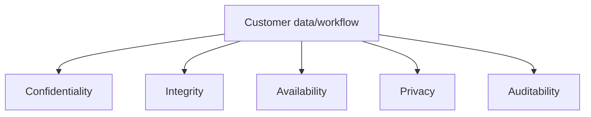
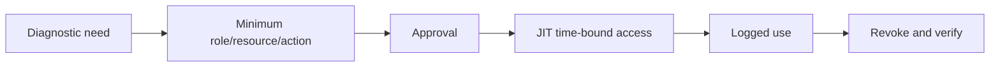
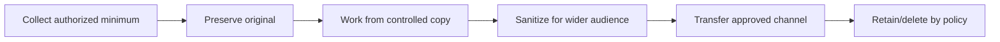
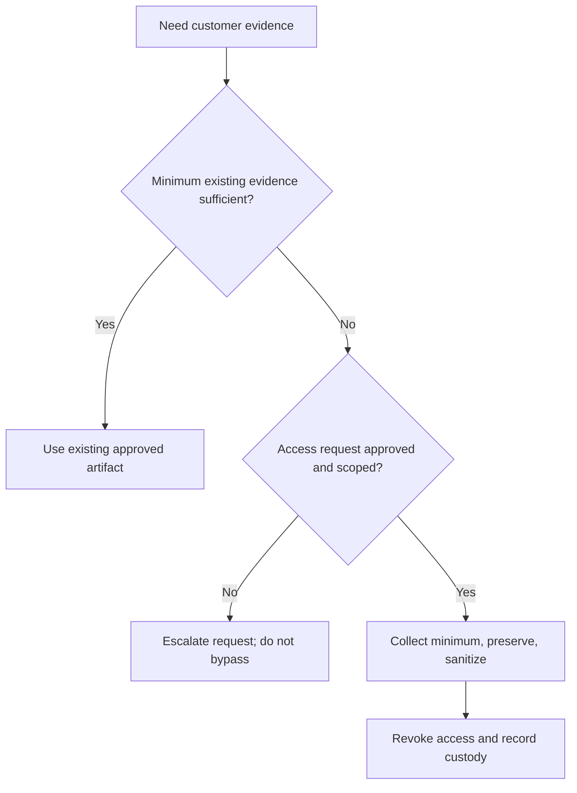
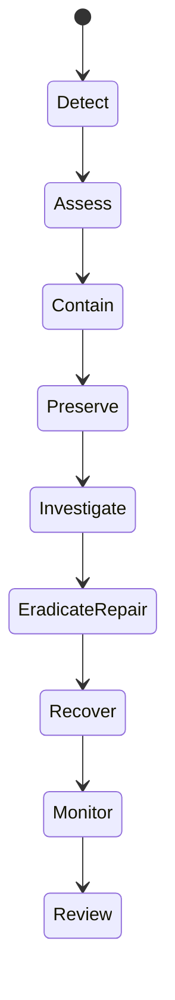
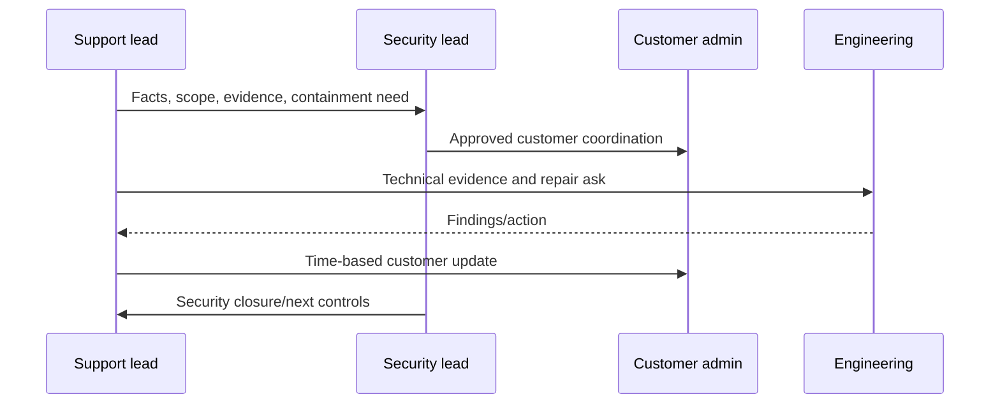

# Part 22 - Enterprise Security, Access Controls, and High-Urgency Coordination

> **Section goal:** Investigate urgent enterprise issues while preserving customer data boundaries, least privilege, auditability, and security incident discipline.
>
> **Maps to JD:** stringent access/security processes, high urgency, customer coordination, represent security needs, logs/traces, and complete documentation.

> **Safety rule:** Urgency never authorizes bypassing customer access, privacy, change, or evidence-handling controls. Escalate the process rather than going around it.

---

## JD Mapping

| Need | Practice |
|---|---|
| Stringent access | Least privilege, JIT, approvals, audit |
| Security improvements | Evidence-based product/process feedback |
| Urgent issue | Containment, roles, cadence, decisions |
| Customer trust | Data minimization and approved channels |
| Documentation | Chain of custody, access/change logs |

---

## 1. Security Objectives

| Objective | Meaning |
|---|---|
| Confidentiality | Only authorized access/disclosure |
| Integrity | Data/configuration remains accurate and authorized |
| Availability | Authorized users can access when needed |
| Privacy | Personal data handled lawfully/appropriately |
| Auditability | Actions/evidence attributable and reviewable |



### Plain-English deep-dive: Security and availability can conflict

Broad access may restore service quickly but violate confidentiality. A sound response balances objectives under authorized risk decisions.

---

## 2. Least Privilege

Grant only necessary:

- Principal.
- Resource/tenant.
- Operation.
- Time window.
- Environment.
- Network/source location.



### JIT/JEA

- Just-in-time: access only during approved period.
- Just-enough-access: only required capabilities.

Avoid shared accounts and standing admin where possible.

| Access type | Preferred control |
|---|---|
| Routine read | Role-scoped named account |
| Sensitive diagnostic read | Approved JIT/JEA access |
| Production mutation | Change approval, owner, rollback, verifier |
| Emergency/break-glass | Emergency policy, short expiry, live audit |
| Customer artifact | Restricted store and need-to-know ACL |

---

## 3. Tenant and Data Boundaries

| Boundary | Risk |
|---|---|
| Customer tenant | Cross-tenant access/data mix |
| Environment | Production data in dev/test |
| Region/residency | Data leaves approved geography |
| Role/team | Unauthorized internal viewing |
| Artifact store | Trace/log copied to broad tool |
| Model/AI context | Restricted content influences output |

Always confirm tenant/customer and test identity before action.

---

## 4. Data Classification and Minimization

| Data | Handling |
|---|---|
| Public | Normal approved handling |
| Internal | Authorized workforce only |
| Confidential | Restricted need-to-know |
| Highly restricted/regulated | Strong controls, explicit process |
| Credentials/session data | Never ordinary case notes/chat |
| Personal data/PII | Minimize/redact per policy |

Collect only fields necessary to test hypothesis.

### Plain-English deep-dive: Redaction vs masking vs tokenization

- Redaction removes value.
- Masking hides part/all for display.
- Tokenization substitutes a reference.

Preserve diagnostically useful structure without exposing original value.

---

## 5. Evidence Chain of Custody

```text
Artifact ID/type:
Customer/tenant/classification:
Collector and authority:
UTC collection time/method:
Original hash/location:
Copies/sanitization performed:
Who accessed/transferred and when:
Retention/deletion requirement:
```





---

## 6. Approved Channels

| Content | Channel principle |
|---|---|
| Case updates | Approved case/system of record |
| Credentials/private keys | Never chat/email/ticket; approved secret exchange only |
| HAR/log/dump | Controlled artifact store |
| Customer architecture | Restricted customer workspace |
| Reusable KB | Sanitized customer-neutral content |
| Security incident | Dedicated incident channel/process |

Chat speed does not replace record/audit.

---

## 7. Access Request

```text
Business/incident need:
Customer/tenant/resource:
Exact read/action required:
Why existing evidence is insufficient:
Role/scope/environment:
Start/end time:
Approver:
Audit/artifact location:
Rollback/revocation:
```

Deny or narrow requests without clear necessity.

---

## 8. Security Incident Triggers

| Trigger | Response |
|---|---|
| Possible unauthorized content visibility | Security incident/containment |
| Stale access revocation | Urgent scope/containment |
| Credential/token exposure | Revoke/rotate and incident process |
| Data corruption/deletion | Preserve/contain/recovery |
| Cross-tenant data | Stop exposure, security escalation |
| Agent unauthorized action | Disable/contain, audit actions/state |
| Suspicious access pattern | Security investigation |

Do not independently notify broad audiences or make attribution claims outside the incident process.

---

## 9. Security Response Lifecycle



Exact security policy and legal/privacy notification obligations are customer/company-specific.

---

## 10. High-Urgency Coordination



### Urgent update

```text
Security/customer impact:
Known scope and time:
Confirmed facts only:
Containment completed/in progress:
Evidence preserved:
Actions/owners:
Customer decision/action:
Unknowns/risk:
Next update:
```

| Safe to state broadly | Restricted to incident need-to-know |
|---|---|
| Customer impact and service status | Exact sensitive content |
| Containment state | Credentials/session/assertion values |
| Owners and next update | Detailed exploit path before approval |
| Confirmed high-level cause | Personal data/raw artifacts |
| Customer action needed | Internal security controls beyond audience need |

---

## 11. Break-Glass Access

Break-glass is exceptional emergency access, not convenience.

| Control | Requirement |
|---|---|
| Trigger | Defined severe scenario |
| Approval | Authorized emergency policy |
| Identity | Individual attributable account |
| Scope/time | Minimum and expiring |
| Monitoring | Real-time/log review |
| Post-use | Revoke, audit, review |

### Plain-English deep-dive: Escalate process, do not bypass it

If normal approval is too slow for incident risk, activate the documented emergency path. Do not improvise access.

---

## 12. Change Safety

| Control | Question |
|---|---|
| Authorization | Who approved? |
| Blast radius | What tenants/users/data? |
| Backup/rollback | Can state be restored? |
| Evidence | What must be captured first? |
| Separation | Who executes vs verifies? |
| Validation | Original and negative tests? |
| Cleanup | Temporary access/config removed? |

High urgency increases need for concise checkpoints, not fewer controls.

---

## 13. Support Data in AI Tools

Before using customer evidence in any AI system:

- Confirm tool and tenant are approved.
- Confirm data classification and contractual limits.
- Minimize/redact.
- Avoid credentials/assertions/private content.
- Confirm retention/training/processor terms through policy.
- Use controlled enterprise context and permissions.
- Review generated output for leakage/inaccuracy.

Do not paste customer traces into unapproved public AI services.

---

## 14. Security Improvement Feedback

Structure product/security request:

```text
Customer security need:
Threat/failure scenario:
Frequency/scope:
Existing control and gap:
Workaround burden/risk:
Desired control/outcome:
Audit/permission requirements:
Success measure:
```

Do not promise roadmap.

---

## 15. Hands-On Lab 1: Unauthorized Search Result

A denied test user sees a restricted policy snippet.

Actions: stop broad testing, preserve user/query/item/time, confirm source ACL without spreading content, invoke security path, contain via approved method, scope other users/items, verify denied and allowed controls, document cause/remediation.

---

## 16. Hands-On Lab 2: Emergency Diagnostic Access

A production incident needs restricted connector logs. Build JIT request with exact read scope, approver, 60-minute expiry, audit, secure artifact handling, two-person verification, revocation, and post-use review.

---

## Likely Interview Questions for This Section

### Q1. "How do you work under stringent customer access?"
> **Model answer:** "Clarify exact evidence/action, use least privilege and JIT/JEA, obtain approval, log access, minimize/sanitize data, use approved channels, revoke and verify, maintain customer outcome ownership."

### Q2. "What if process slows a critical incident?"
> **Model answer:** "Activate documented emergency/break-glass escalation with attribution, minimum scope/time and audit; never bypass controls informally."

### Q3. "How do you handle possible unauthorized visibility?"
> **Model answer:** "Treat as security incident, preserve exact evidence, contain through approved path, scope impact, coordinate security/customer admin, verify denied/allowed controls, communicate facts only."

### Q4. "What is chain of custody?"
> **Model answer:** "Record artifact origin, collector, authority, time/method, original/copies, sanitization, access/transfers, retention/deletion so evidence integrity is defensible."

### Q5. "How do you protect secrets in support?"
> **Model answer:** "Never ordinary tickets/chat/logs; approved protected exchange/store, minimal access, rotation/revocation if exposed, redact values while preserving metadata."

### Q6. "Least privilege?"
> **Model answer:** "Minimum principal, resource, action, environment, network and time required, with approval/audit/revocation."

### Q7. "How do you use AI with customer data?"
> **Model answer:** "Only approved enterprise tool and policy/contract, minimize/redact, exclude credentials/restricted content, confirm retention/processing, enforce permissions, review output."

### Q8. "How do you represent customer security needs?"
> **Model answer:** "Translate threat scenario, scope, current control gap, workaround risk, desired auditable control and success measure into product/security feedback without promising roadmap."

---

## 30-Second Memory Hooks

- **CIA + privacy + auditability.**
- **Least privilege:** Principal + resource + action + time.
- **JIT:** Temporary. **JEA:** Minimum capability.
- **Urgency activates emergency process, not bypass.**
- **Evidence:** Original, copy, sanitize, transfer, retire.
- **Possible false allow = security incident.**

---

## Completion Checklist

- [ ] I can define access request and chain of custody.
- [ ] I can handle restricted evidence and approved channels.
- [ ] I can coordinate possible exposure/credential incidents.
- [ ] I can explain break-glass and change safety.
- [ ] I can define approved AI-data handling.
- [ ] I completed both labs.

---

*Next suggested section: [Part-23-content-source-validation-lab.md](Part-23-content-source-validation-lab.md). It combines Parts 2-22 into an end-to-end connector acceptance runbook.*
