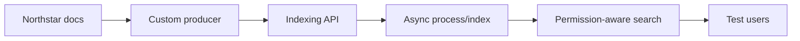
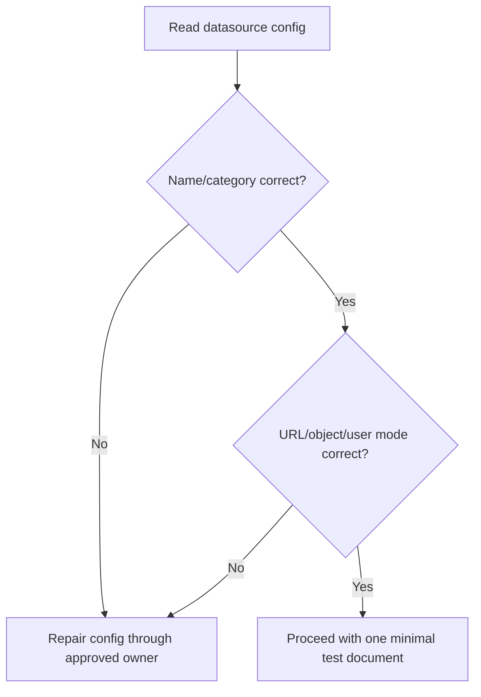
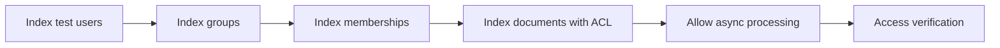
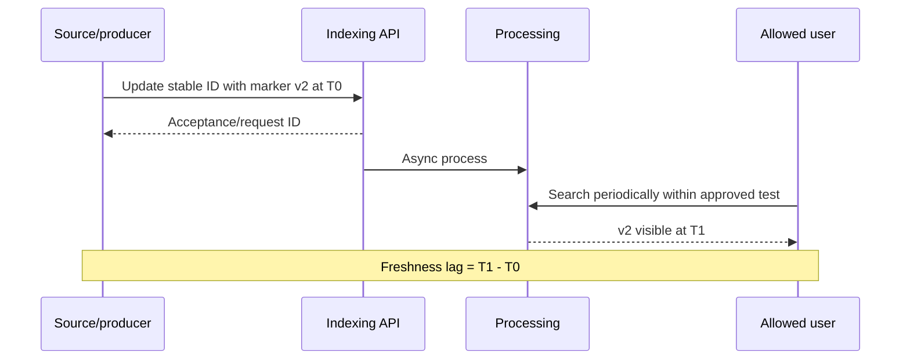
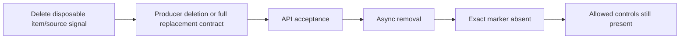
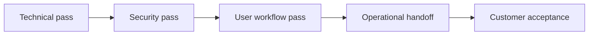

# Part 23 - Hands-On Lab: Validate a New Content Source End to End

> **Section goal:** Produce and execute an interview-ready validation plan that proves connectivity, identity, content, permissions, freshness, deletion, search behavior, monitoring, rollback, and customer acceptance.
>
> **Maps to JD:** source setup/verification, REST API, auth, search, documentation, customer coordination, security, health, and education.

> **Lab safety:** Use a test datasource, test users/groups, harmless synthetic content, approved credentials, and a restricted pilot. Never use production customer secrets or broad anonymous access for restricted test objects.

---

## JD Mapping

| Requirement | Lab artifact |
|---|---|
| Configure source | Readiness/configuration record |
| Verify source | Acceptance matrix |
| REST troubleshooting | Sanitized request/response worksheet |
| Permissions | Allowed/denied/revocation tests |
| Runbook | Operational handoff document |
| Customer updates | Pilot recap and acceptance sign-off |

---

## 1. Fictional Scenario

Customer **Northstar (fictional)** wants internal engineering documentation searchable in Glean. A custom producer pushes content from `https://docs.northstar.test` through the Indexing API.

Use case: engineers find current runbooks.

Security: team-restricted incident documents must remain hidden from general employees.

Success:

- Current documents found by exact and realistic queries.
- Links/metadata correct.
- ACL positive/negative tests pass.
- Updates and deletions converge within agreed expectation.
- Admin receives actionable failure signal.
- Pilot users complete task and sign off.



---

## 2. Owners

| Role | Fictional owner |
|---|---|
| Business champion | Engineering enablement |
| Source owner | Docs platform admin |
| Producer owner | Integration team |
| Glean admin | Customer admin |
| Identity/security | IAM/security admin |
| Support coordinator | Candidate/support engineer |
| Pilot users | Engineer A, Engineer B, General User |

### Plain-English deep-dive: Validation needs independent controls

One admin seeing one public document proves little. Use different items and allowed/denied identities so each control tests one boundary.

---

## 3. Preflight Checklist

| Area | Required evidence |
|---|---|
| Use case/success | Written outcome and criteria |
| Datasource | Unique name/category/URL pattern/object types |
| Token | Correct Indexing API type/scope/expiry/IP policy, value protected |
| Producer | Network/TLS and bounded retry |
| Identity | Test users/groups and reference mode |
| Content | Synthetic test objects |
| Rollout | Test group only |
| Monitoring | Request/status/count/freshness/access evidence |
| Rollback | Disable visibility, stop producer, restore snapshot |
| Approval | Customer admin/security/change window |

Stop if scope/access/rollback is unclear.

---

## 4. Test Objects

| ID | Title/content marker | ACL | Purpose |
|---|---|---|---|
| public-001 | `NORTHSTAR-PUBLIC-ALPHA` | Pilot group | Basic content |
| team-001 | `NORTHSTAR-TEAM-BRAVO` | Engineering group | Group ACL |
| direct-001 | `NORTHSTAR-DIRECT-CHARLIE` | Engineer A only | Direct user ACL |
| update-001 | `NORTHSTAR-UPDATE-v1` | Pilot group | Update/freshness |
| delete-001 | `NORTHSTAR-DELETE-ECHO` | Pilot group | Deletion |
| excluded-001 | `NORTHSTAR-EXCLUDED-FOXTROT` | Out of configured scope | Exclusion |

All content must be harmless and fictional.

---

## 5. Test Identities

| Identity | Expected access |
|---|---|
| Engineer A | public, team, direct |
| Engineer B | public, team; not direct |
| General User | public only |
| Disabled Former User | none after lifecycle propagation |

Record exact identity mapping and group membership without sensitive attributes.

---

## 6. Datasource Configuration Validation

Check:

- Stable unique datasource name.
- Display name.
- Appropriate category/object type.
- URL regex matches only intended source.
- User-reference mode aligns with permission payload.
- Result rendering/source URL.
- Test-group visibility.
- Current config through read-only endpoint where supported.



---

## 7. Authentication and Network Test

Use current official API docs. Begin with documented read-only config/status request.

Record:

```text
Source host/environment:
DNS/TCP/TLS result:
Effective endpoint/version:
Token type/scope/expiry metadata, no value:
HTTP status/error/request ID:
UTC time:
```

Interpret 401, 403/IP scope, 400 datasource, 429, and 5xx using Parts 6-8.

---

## 8. Identity and ACL Load Order



Do not attach ACL references to identities/groups that were never represented as required by the API contract.

---

## 9. Content Request Validation

For each document validate:

| Field | Check |
|---|---|
| Datasource | Exact configured identifier |
| Stable ID | Same logical item keeps ID |
| Object type | Defined and correct |
| Title/body | Distinctive and parseable |
| View URL | Opens item and matches URL pattern |
| Updated time | Valid UTC/contract |
| Metadata | Expected type/owner/filter fields |
| Permissions | Intended users/groups only |

Request acceptance is not search availability; asynchronous processing follows.

### Plain-English deep-dive: Accepted vs available

An API acceptance confirms the service received or queued work. Availability requires later processing, datasource rollout, ACL resolution, and query retrieval.

**Analogy:** A warehouse receipt confirms delivery at the dock, not that the item is shelved and available to the intended employee.

---

## 10. Acceptance Matrix

| Test | User | Expected | Actual/evidence | Pass |
|---|---|---|---|---|
| Exact public marker | All pilot identities | Visible |  |  |
| Team marker | A/B | Visible |  |  |
| Team marker | General | Hidden |  |  |
| Direct marker | A | Visible |  |  |
| Direct marker | B/General | Hidden |  |  |
| Excluded marker | All | Hidden |  |  |
| Source link/metadata | Allowed | Correct |  |  |

### Plain-English deep-dive: Hidden is harder to prove

A no-result test needs a distinctive exact marker, confirmed source state, known identity, no filters, and expected processing interval. Otherwise absence is ambiguous.

---

## 11. Search and Relevance Tests

| Query | Expected |
|---|---|
| Exact marker | Exact document top result |
| "Northstar public setup" | public-001 relevant |
| Team runbook query | team-001 for engineers only |
| Filter by source/type | Correct narrowing |
| General user team query | No restricted result/snippet/citation |

Record user, query, filters, order, source, timestamps, and citations.

---

## 12. Freshness Test



Repeat enough to establish behavior; do not hammer search/API.

---

## 13. Permission Change Test

1. Confirm Engineer B sees team-001.
2. Remove B from Engineering group in test source/identity path.
3. Record source change time.
4. Observe membership/permission processing.
5. Verify B no longer retrieves or receives AI context.
6. Verify A remains allowed.
7. Record revocation lag.

Possible false allow invokes security path.

---

## 14. Deletion Test



Know whether integration uses explicit delete, event, or complete snapshot replacement. Do not infer.

---

## 15. Failure Injection

Only approved harmless tests:

| Failure | Expected behavior |
|---|---|
| Invalid test datasource name | Clear 400/no production effect |
| Rate reduced in controlled harness | Backoff/queue/alert, no storm |
| Expired test credential | Authentication failure and owner alert |
| Invalid harmless document field | Per-item error and no bad index state |

Never intentionally expose restricted data or disrupt production.

---

## 16. Monitoring and Alerts

| Signal | Acceptance |
|---|---|
| Producer success/error | Visible with request IDs |
| Backlog/failed items | Bounded and actionable |
| Document counts | Reconcile expected test corpus |
| Freshness | Within agreed test target |
| Permission canary | Revocation verified |
| Credential expiry | Primary/backup alerted |
| Alert routing | Correct owner/runbook |

---

## 17. Customer Acceptance

```text
Use case demonstrated:
Technical tests passed:
Security/permission tests passed:
Known limitations:
Freshness expectation:
Monitoring/owners:
Training completed:
Rollback/support process:
Customer approver/date:
Follow-up/adoption review:
```



---

## 18. Final Runbook Artifact

Include:

- Architecture/data flow.
- Owners/escalations.
- Config metadata.
- Credential rotation.
- Producer monitoring/retry.
- Content/identity/ACL order.
- Acceptance canaries.
- Freshness/deletion expectations.
- Incident/rollback.
- Customer updates.
- Review date.

---

## 19. Timed Interview Drill

In 10 minutes, explain:

1. Discovery and safety.
2. Configuration.
3. Minimal API/auth test.
4. Content plus users/groups/ACL.
5. Positive/negative/freshness/deletion.
6. Monitoring/rollback.
7. Customer acceptance/adoption.

Use CLEAR and draw the source-to-user pipeline.

---

## Likely Interview Questions for This Section

### Q1. "How do you validate a connector end to end?"
> **Model answer:** "Readiness and least privilege; read-only auth/config; minimal stable document; users/groups/ACL; async processing; exact/realistic search; allowed/denied, update, revoke, delete; monitoring/alerts; rollback; customer workflow acceptance."

### Q2. "Why test denied users?"
> **Model answer:** "Positive access proves usability; negative proves security boundary. Both are required."

### Q3. "API request returned 200/202; done?"
> **Model answer:** "No. It proves acceptance/response, not async processing, rollout visibility, ACL resolution, search, or customer outcome."

### Q4. "How test freshness?"
> **Model answer:** "Stable controlled ID, distinctive version marker, UTC source/request/visible times, bounded polling, repeat samples, expected path."

### Q5. "How test deletion?"
> **Model answer:** "Use disposable item and documented delete/full-replacement semantics; verify exact marker absent and controls remain."

### Q6. "What if denied user sees content?"
> **Model answer:** "Stop broad testing, security incident path, preserve exact evidence, contain approved, scope, repair, verify denied/allowed controls, remediate."

### Q7. "What belongs in handoff?"
> **Model answer:** "Architecture/config, owners/rotation, monitoring/alerts, canaries, freshness/deletion, runbook, rollback, known limits, customer acceptance."

### Q8. "How do you avoid testing with customer data?"
> **Model answer:** "Synthetic distinctive content and test identities/groups in controlled scope; validate mechanics without exposing real sensitive records."

---

## 30-Second Memory Hooks

- **Preflight -> config -> minimal object -> ACL -> search -> lifecycle -> operate.**
- **Accepted is not indexed.**
- **Positive + negative access.**
- **Stable ID for update.**
- **Disposable item for delete.**
- **Customer acceptance includes operations and value.**

---

## Completion Checklist

- [ ] I completed readiness/owner/config records.
- [ ] I defined synthetic content and identities.
- [ ] I can execute/describe API, ACL, search, update, revoke, delete tests.
- [ ] I defined monitoring/alerts/rollback.
- [ ] I created acceptance and final runbook.
- [ ] I can complete 10-minute drill.

---

*Next suggested section: [Part-24-integrated-troubleshooting-scenarios.md](Part-24-integrated-troubleshooting-scenarios.md). It tests rapid diagnosis across all layers under interview conditions.*
