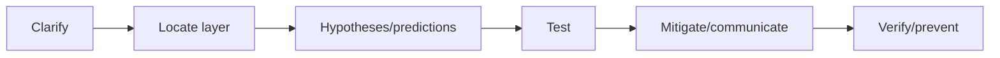
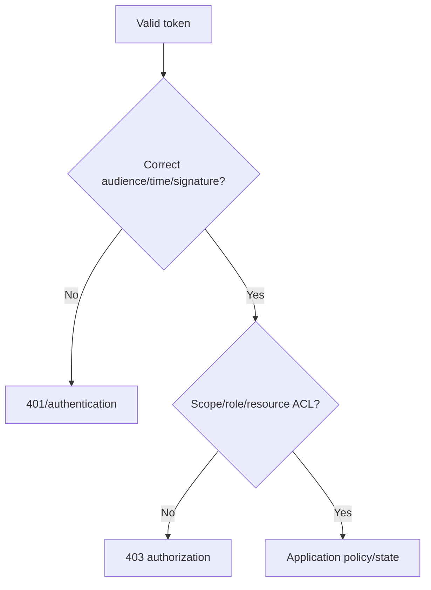
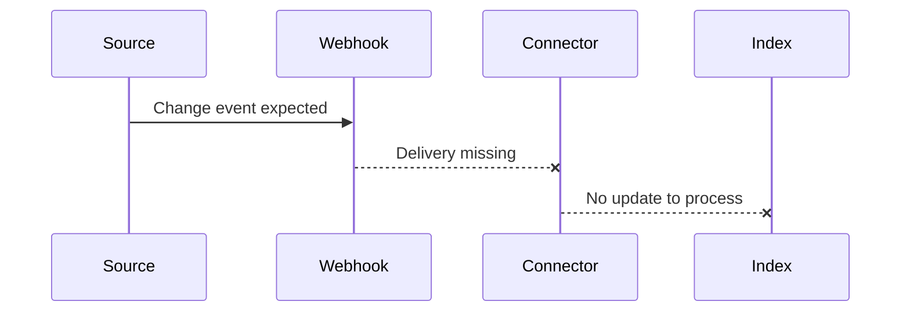
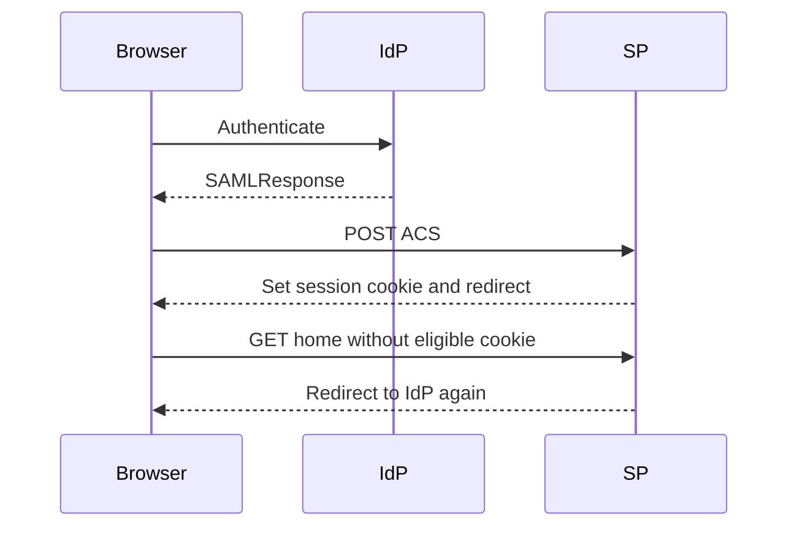
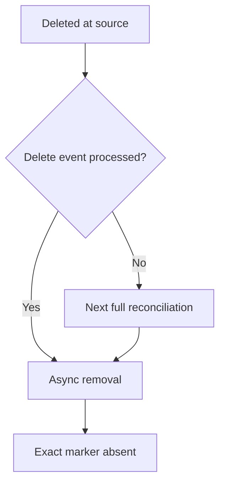
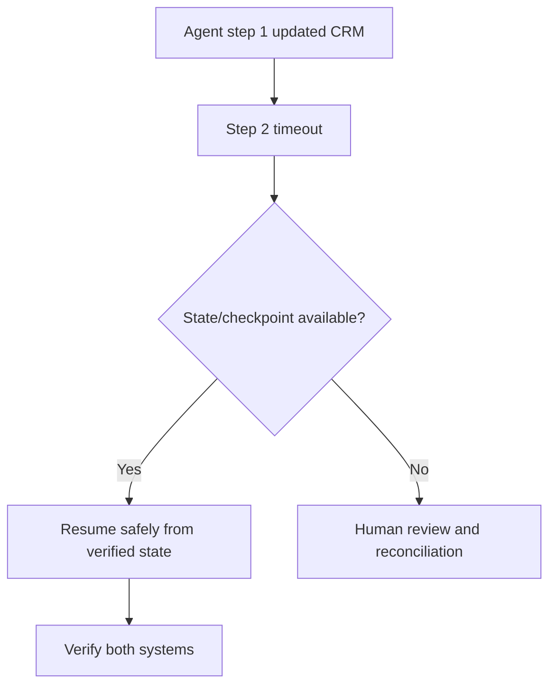

# Part 24 - Integrated Troubleshooting Scenarios and Mock Support Cases

> **Section goal:** Practice solving ambiguous cross-layer customer cases aloud with structured evidence, communication, mitigation, and verification.
>
> **Maps to JD:** tough technical issues, root cause, customer updates, alerts, APIs, SSO, search, SaaS integrations, Linux/Kubernetes, and cross-functional resolution.

---

## Case Answer Contract

For every case provide:

```text
1. Impact/safety/priority
2. Scope and known-good control
3. Three hypotheses with predictions
4. Cheapest safe discriminating test
5. Evidence requested
6. Mitigation/workaround
7. Customer update and next time
8. Verification and prevention
```



### Plain-English deep-dive: Interviewer wants decisions, not a checklist dump

Explain why your next test is most discriminating and how each possible result changes direction.

---

## Case 1 - OAuth 401 Wrong Audience

**Evidence:** DNS/TCP/TLS work. API receives bearer token. Signature/time valid. `aud` identifies a different API. Response 401.

| Ask | Expected direction |
|---|---|
| Proven | Transport and token structure/signature |
| Cause | Token requested for wrong resource/audience |
| Repair | Correct authority/resource/scope request per docs |
| Verify | New token metadata and original API call |

Do not paste token into public decoder.

---

## Case 2 - Permission 403

**Evidence:** Correct API audience; User A succeeds, User B gets 403; B authenticates but is outside required group.



Use least privilege; do not grant broad admin to test.

---

## Case 3 - API 429 Retry Storm

**Evidence:** 100 concurrent workers, `Retry-After: 30`, clients retry every second, backlog grows.

Expected: stop amplification, bound concurrency, honor guidance, exponential backoff/jitter, preserve failed work, measure backlog recovery, add rate-limit alert and load test.

---

## Case 4 - Stale New Content

**Evidence:** Old content works; only updates after 10:00 UTC missing; connector auth succeeds; source webhook delivery stopped after source app change.



Compare webhook/event and fallback incremental/full reconciliation; define freshness workaround and verification.

---

## Case 5 - Unauthorized Search Result

**Evidence:** Former contractor sees restricted snippet after group removal.

Priority: security. Preserve exact user/query/item/time, contain approved, scope other users/items, compare source ACL and mirrored identity/membership, verify denied and allowed controls, remediate revocation canary.

---

## Case 6 - Irrelevant Ranking

**Evidence:** Current verified policy appears at rank 8; archived policy rank 1; exact title finds both; permissions correct.

| Compare | Evidence |
|---|---|
| Freshness | Updated timestamps |
| Authority | Verified/owner/source |
| Content | Title/body/query match |
| Duplicates | Versions/canonical items |
| Persona | Same controlled user |

Build judged query case rather than saying "search is bad."

---

## Case 7 - SAML Login Loop

**Evidence:** IdP authenticates; signed response reaches ACS; SP sets cookie with incompatible cross-site SameSite behavior; next request lacks session.



Follow redirects/cookies; do not repeatedly change SAML certificate.

---

## Case 8 - Browser-Only CORS Failure

**Evidence:** OPTIONS omits allowed Authorization header; POST never sent; Postman succeeds.

Expected: inspect origin/preflight/allow headers/credentials/cache; fix server/proxy CORS policy; verify Network and Console; never weaken browser protections.

---

## Case 9 - Connector Alert After Credential Expiry

**Evidence:** Alert routes to former admin mailbox; incremental updates stop; old content remains.

Immediate: owner/customer admin, rotate via approved path, assess stale permissions/content, verify update/revocation. Prevention: primary/backup, expiry alert, scheduled rotation, canary.

---

## Case 10 - Deleted Document Persists

**Evidence:** Source deleted; connector relies on webhook plus periodic full reconciliation; deletion event missing.



For sensitive content, approved hiding/urgent support path may be needed.

---

## Case 11 - Kubernetes CrashLoop

**Evidence:** New revision; previous logs show missing config key; ConfigMap key renamed; old pods had old environment.

Expected: owning Deployment/revision, previous logs/events, reference mismatch, authorized compatible rollout/rollback, verify Ready/endpoints/original API.

---

## Case 12 - Kubernetes Service Has No Endpoints

**Evidence:** Service selector `app=assistant`; pods label `app=assistant-api`; pods Ready.

Expected: selector mismatch; avoid deleting pods; authorized Service/workload correction; verify EndpointSlice, DNS/port, client workflow.

---

## Case 13 - Cloud Storage 403

**Evidence:** Network/TLS/token work; deployment changed managed identity; new identity lacks object-read role.

Repair exact scope, verify harmless object, remove temporary broad role, audit deployment guardrail.

---

## Case 14 - Agent Partial Write

**Evidence:** Agent updates CRM then times out before ticket creation; retries could repeat CRM update.



Need stable operation IDs, idempotency/compensation, approval, audit, final-state verification.

---

## Case 15 - Multi-Layer Ambiguity

Customer says "Glean is slow and wrong."

Questions:

- One/all users and sources?
- Search, Assistant, or agent?
- Slow phase: browser/network/retrieval/model/tool?
- Wrong: stale, unauthorized, irrelevant, unsupported generation?
- Exact examples and expected authority?
- Recent source/permission/config/release?

Separate into measurable subproblems before diagnosis.

---

## Case 16 - Intermittent One-in-Four Failure

Evidence: DNS returns four IPs; one IP refuses TCP; others succeed.

Expected: endpoint-specific path/backend/listener; capture resolved IP and repeated outcome; coordinate load balancer/service owner; verify all pool members.

---

## Timed Drill Modes

| Mode | Time | Output |
|---|---:|---|
| Rapid triage | 3 min | Impact, scope, first hypotheses/test/update |
| Technical deep dive | 10 min | Full evidence loop |
| Customer update | 2 min | BLUF and next action/time |
| Whiteboard | 5 min | Layer diagram and branch tests |
| Retrospective | 5 min | Root cause/remediation |

### Plain-English deep-dive: Say assumptions aloud

Interview scenarios omit details deliberately. State assumptions and ask clarifying questions; do not silently invent architecture.

### Plain-English deep-dive: Decompose compound complaints

"Slow and wrong" contains at least two measurable symptoms. Split availability, latency, correctness, permission, freshness, and workflow completion before proposing a cause.

| Symptom family | First artifact |
|---|---|
| Browser/login | Preserved HAR/redirect/cookie evidence |
| API | Method/status/body/request ID |
| Connector/freshness | Source time, job/status, controlled object |
| Search quality | User/query/result order/expected authority |
| Kubernetes | Workload revision, events, previous logs |
| Agent | Step/tool/action ID and final system state |

| Failure | Safe short-term mitigation |
|---|---|
| Missing fresh content | Direct source link/manual authoritative path |
| API throttling | Reduce concurrency and queue safely |
| Poor answer | Link authoritative source/human review |
| Failing new rollout | Pause/rollback approved scope |
| Unsafe agent action | Disable action/require approval |
| Permission exposure | Approved containment/security path |

| Domain | Coordinating owner |
|---|---|
| Identity/SSO | Customer identity admin plus support |
| Source connector | Customer source admin/integration plus support |
| Product defect | Support plus engineering/product |
| Network/cloud | Customer network/cloud plus vendor |
| Security/access | Security lead/customer admin/support |
| Adoption/quality | Champion/support/product |

| Update element | Minimum statement |
|---|---|
| Impact | Who/workflow/how severe |
| Facts | Confirmed evidence only |
| Hypotheses | Current and test |
| Mitigation | What customer can do now |
| Owners | Named next actions |
| Next update | Time/milestone |

| Verification family | Control |
|---|---|
| Function | Original reproduction |
| Baseline | Known-good case |
| Security | Denied/negative case |
| Health | Errors/backlog/latency/freshness |
| Customer | Business workflow confirmation |
| Stability | Agreed monitoring interval |

| Recurrence pattern | Prevention direction |
|---|---|
| Expiry | Rotation ownership/alerts |
| Retry storm | Backoff/concurrency/idempotency |
| Missing evidence | Correlation/structured telemetry |
| Permission lag | Revocation canary |
| Ranking regression | Judged evaluation set |
| Handoff delay | Runbook/owner matrix |

---

## Self-Scoring Rubric

| Dimension | 0 | 1 | 2 |
|---|---|---|---|
| Impact/safety | Missing | Partial | Clear priority/security |
| Scope/controls | None | Broad | Discriminating |
| Hypotheses | One guess | Multiple vague | Falsifiable predictions |
| Test | Random | Relevant | Cheapest safe discriminator |
| Communication | Technical dump | Basic | Facts/actions/next time |
| Verification | "Looks fixed" | One check | Original + controls + customer |
| Prevention | None | Generic | Cause-linked owner/measure |

Target 12/14 or higher.

---

## Mock Customer Update Template

```text
Status/impact:
Confirmed facts:
Current hypotheses and tests:
Mitigation/workaround:
Actions/owners:
Customer action:
Risk/unknowns:
Verification:
Next update:
```

---

## Likely Interview Questions for This Section

### Q1. "Where do you begin with an ambiguous issue?"
> **Model answer:** "Expected vs actual, impact/security, scope/time/change, affected and known-good controls; then competing layer hypotheses and one discriminating test."

### Q2. "How many hypotheses?"
> **Model answer:** "A small evidence-backed set, usually 2-4; each predicts different evidence. Avoid one guess or endless list."

### Q3. "When do you involve engineering?"
> **Model answer:** "After routing evidence supports product/service defect or internal telemetry/action is needed; provide repro/IDs/impact/controls/specific ask while retaining customer ownership."

### Q4. "How do you handle security possibility?"
> **Model answer:** "Prioritize containment and approved security path, preserve exact evidence, communicate facts, test allowed/denied controls, avoid broad changes."

### Q5. "How do you communicate during uncertainty?"
> **Model answer:** "Facts vs hypotheses/unknowns, current impact, mitigation, actions/owners, decision/risk, and next time."

### Q6. "How do you avoid random troubleshooting?"
> **Model answer:** "Layer model, scope controls, prediction-led tests, one variable, hypothesis ledger, evidence timeline."

### Q7. "How do you verify?"
> **Model answer:** "Original reproduction, known-good, negative/security, health/backlog, customer workflow, stability interval."

### Q8. "How do you practice?"
> **Model answer:** "Timed drills aloud, draw layers, record answer, score rubric, repeat weakest dimensions, convert real experiences into STAR/CLEAR stories."

---

## 30-Second Memory Hooks

- **Every case:** Impact -> scope -> hypotheses -> discriminator -> mitigate/update -> verify/prevent.
- **401 identity; 403 permission; 429 pace; 5xx service.**
- **Exact title separates availability from ranking.**
- **Browser-only: CORS/cookie/client policy.**
- **Possible false allow: security first.**
- **State before retrying writes.**

---

## Completion Checklist

- [ ] I answered all 16 cases aloud.
- [ ] I completed rapid, deep, update, whiteboard, retrospective modes.
- [ ] I score at least 12/14 consistently.
- [ ] I state assumptions and next update.
- [ ] I distinguish symptom, mitigation, verification, and prevention.

---

*Next suggested section: [Part-25-miscellaneous-and-deeper-topics.md](Part-25-miscellaneous-and-deeper-topics.md). It adds architecture, reliability, security, search/AI evaluation, and competitive context for extra interview depth.*
