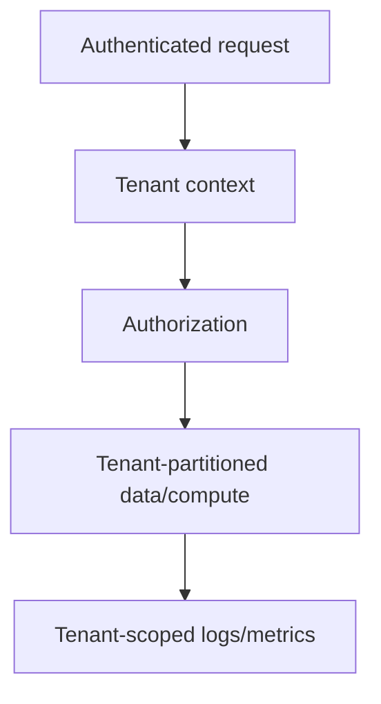
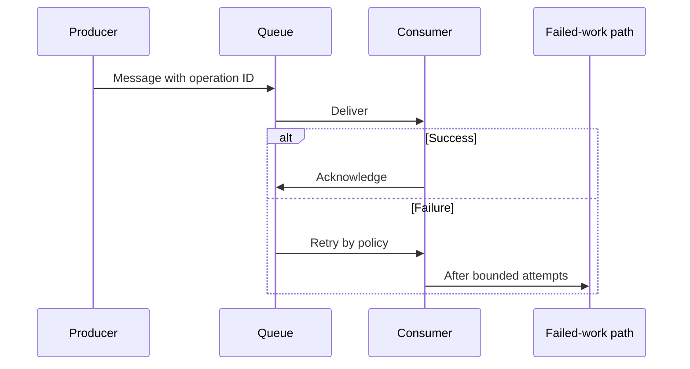
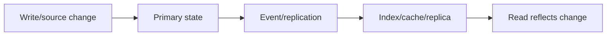
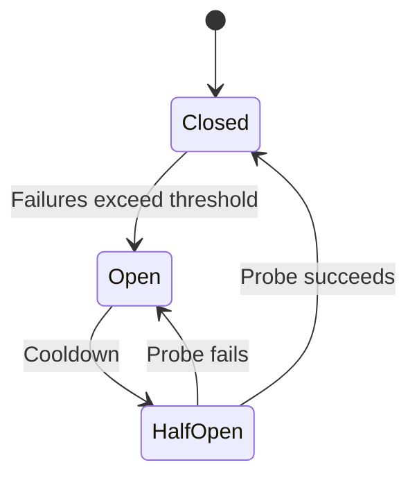
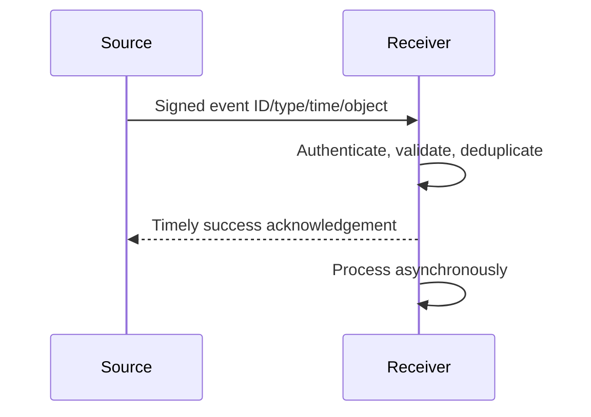
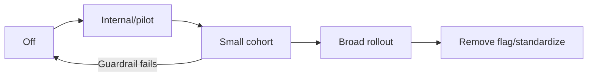
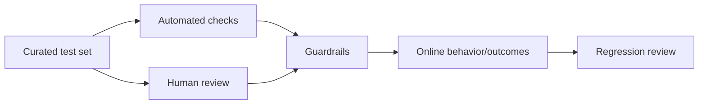

# Part 25 - Miscellaneous and Deeper Topics

> **Section goal:** Add adjacent architecture, reliability, security, search, AI, and market context that strengthens advanced interview answers without overclaiming product internals.
>
> **Currency note:** Product capabilities and competitive positioning change quickly. Verify official sources immediately before the interview; use categories and customer tradeoffs rather than absolute claims.

---

## 1. Multi-Tenant SaaS

A multi-tenant service hosts multiple customer tenants on shared or logically shared infrastructure while enforcing boundaries.

| Model | Tradeoff |
|---|---|
| Shared service/data with tenant partitioning | Efficiency; strong logical isolation required |
| Shared service, separate database/schema | More isolation/operations |
| Dedicated/single-tenant deployment | Isolation/customization; cost/management |

### Plain-English deep-dive: Tenant ID is not a security control by itself

Every data access and cache/log/job path must enforce tenant context. A field existing does not prove enforcement.

---

## 2. Distributed Systems Basics

| Property | Question |
|---|---|
| Partial failure | Which component failed while others worked? |
| Latency | Which dependency/path dominates? |
| Concurrency | Can operations race? |
| Replication | Which copy/version is read? |
| Consistency | When do replicas converge? |
| Idempotency | Can operation repeat safely? |
| Backpressure | What happens when producer outruns consumer? |

Distributed systems fail in combinations; use trace IDs and state evidence.

---

## 3. Queues and Asynchronous Work

| Term | Meaning |
|---|---|
| At-least-once delivery | Duplicates possible; consumer must handle |
| At-most-once | Loss possible; no duplicate retry |
| Dead-letter queue | Failed work held for investigation/replay |
| Visibility timeout | Period message hidden while processing |
| Backlog age | Oldest queued work latency |

Exactly-once business effect usually requires idempotency/deduplication, not faith in transport wording.

---

## 4. Eventual Consistency

A write can succeed in one component before all read paths reflect it.

Define convergence expectation, read-your-writes need, and security-sensitive revocation behavior.

### Plain-English deep-dive: Eventual is not infinite

Eventual consistency still needs a measurable expected interval and monitoring. "Wait" is not a diagnosis without a target and evidence.

---

## 5. Caching

| Cache | Risk |
|---|---|
| Browser/client | Stale UI/session |
| CDN/edge | Regional stale response |
| API/service | Incorrect key/tenant/permission |
| Database/query | Stale data |
| Model/prompt/result | Stale/permission-sensitive AI output |

Cache invalidation must account for tenant, identity/access, query, version, and freshness. Never cache restricted results under a key missing user/access context.

---

## 6. Retries, Backoff, and Circuit Breakers

- Retry handles transient individual failure.
- Backoff/jitter prevents retry storms.
- Circuit breaker stops calls to unhealthy dependency temporarily.
- Timeout bounds wait.
- Bulkhead limits one dependency from consuming all resources.

| Anti-pattern | Impact |
|---|---|
| Layered retries at every service | Multiplicative load |
| Retrying 400/403 | Waste/no repair |
| No idempotency on writes | Duplicate side effects |
| Timeout longer than caller deadline | Wasted work |
| Circuit opens with no fallback | Fast failure, still needs customer strategy |

---

## 7. Webhooks

A webhook notifies another system through HTTP when an event occurs.

Security/operations:

- Verify signature/auth and destination TLS.
- Prevent replay with timestamp/event ID.
- Deduplicate.
- Respond quickly, process asynchronously.
- Retry bounded; expose delivery history.
- Reconcile periodically because events can be missed.

---

## 8. Feature Flags and Safe Rollout

| Flag use | Risk/control |
|---|---|
| Tenant pilot | Correct targeting/audit |
| Percentage rollout | Representative cohorts |
| Kill switch | Tested authority and effect |
| Experiment | Consent/metrics/guardrails |
| Compatibility | Avoid permanent flag debt |

A merged feature may not be enabled for customer's tenant.

---

## 9. Observability Maturity

| Level | Capability |
|---|---|
| Reactive logs | Search after report |
| Structured correlation | IDs and schema |
| Metrics/alerts | Detect trends/failures |
| Distributed tracing | Dependency path/latency |
| SLOs/canaries | Customer-outcome monitoring |
| Automated remediation | Safe bounded response |

Observability should answer customer questions, not maximize telemetry volume.

---

## 10. Zero Trust

Principles:

- Verify explicitly.
- Use least privilege.
- Assume breach/limit blast radius.
- Continuously evaluate identity/device/context/risk.

Zero trust does not mean trusting nobody or prompting every second; it means no implicit trust based solely on network location.

---

## 11. Data Residency, Sovereignty, and Compliance

| Concept | Meaning |
|---|---|
| Residency | Where data is stored/processed |
| Sovereignty | Jurisdiction/control requirements |
| Retention | How long data remains |
| Deletion | Removal obligations/path |
| Subprocessor | External party processing data |
| Encryption | In transit/at rest and key control |
| Audit | Evidence of control/action |

Do not make legal/compliance promises; involve authorized privacy/legal/security teams and current contractual documentation.

---

## 12. Search Quality Deeper Metrics

| Metric | Use |
|---|---|
| Precision/recall | Returned quality/coverage |
| MRR | First relevant result rank |
| NDCG | Graded ranking quality |
| Success@K | Relevant result in top K |
| Zero-result rate | Coverage/query/access clue |
| Reformulation | First query dissatisfaction/iteration |
| Freshness lag | Source-to-visible |
| Permission canary | Access correctness |

Evaluation must include personas/access and forbidden results.

---

## 13. AI Evaluation Deeper Topics

| Evaluation | Strength/limit |
|---|---|
| Exact rule | Deterministic, narrow |
| Model-as-judge | Scalable, needs calibration/bias review |
| Human expert | Rich, slower/variable |
| A/B test | Real behavior, needs safety/sample |
| Business outcome | Meaningful, confounded/lagging |

Track correctness, groundedness, citation, relevance, safety, latency, cost, and task completion.

---

## 14. Prompt Injection and Tool Safety

Untrusted content may instruct an agent to ignore rules or leak data.

Controls:

- Separate instructions from data.
- Treat retrieved/tool content as untrusted.
- Limit tools/permissions.
- Validate action inputs/outputs.
- Require approval for consequence.
- Audit and monitor.
- Protect system/internal instructions and sensitive context.

### Plain-English deep-dive: Content can be adversarial

A document is not trustworthy just because search retrieved it. It can contain malicious instructions; the system must treat it as data.

---

## 15. Competitive Landscape

Time-sensitive categories, not rankings:

| Category | Examples | Customer tradeoff |
|---|---|---|
| Horizontal enterprise AI/search | Glean and other enterprise knowledge platforms | Cross-app context, permissions, breadth |
| Suite-native copilots/search | Microsoft, Google, Atlassian, Salesforce ecosystems | Native integration vs cross-suite breadth |
| Search platforms | Elastic and managed search offerings | Build/control vs packaged experience |
| Knowledge/intranet | Confluence, SharePoint, Notion and intranet tools | Authoring/system of record vs federated discovery |
| General model/agent platforms | Cloud/model vendors | Flexible building vs governance/integration effort |

Interview answer:

> "I would compare source coverage, permission fidelity, retrieval quality, AI/agent capabilities, governance, deployment/residency, admin effort, observability, adoption, total cost, and measurable customer outcomes. I would verify current vendor capabilities rather than make absolute claims."

---

## 16. 2026 Enterprise AI Trends to Verify

These are **current trends** to verify against official sources immediately before the interview:

- Shift from chat-only pilots to agents/workflows.
- More MCP/tool interoperability.
- Permission-aware enterprise context and governance.
- Agent observability/evaluation and ROI pressure.
- Security focus: prompt injection, data leakage, action controls.
- Model choice/routing and cost/token efficiency.
- Human approval for consequential actions.
- Regulatory/data sovereignty requirements.

Verify current official material before interview.

---

## 17. Hands-On Lab 1: Design a Reliable Async Connector

Include stable IDs, queue, bounded retry/backoff/jitter, DLQ, idempotency, webhook verification, full reconciliation, metrics, alerts, tenant/access keys, and safe replay.

---

## 18. Hands-On Lab 2: Evaluate an Enterprise Agent

Create personas, allowed/forbidden sources/actions, representative tasks, injection cases, tool errors, approval, final-state checks, latency/cost, human rubric, online guardrails, rollback.

---

## Likely Interview Questions for This Section

### Q1. "What is eventual consistency?"
> **Model answer:** "Components can temporarily disagree after change but should converge within an expected measurable interval. Security revocation may need stricter treatment."

### Q2. "Why idempotency?"
> **Model answer:** "At-least-once delivery/retries can repeat work; stable keys/dedup/status make business effect converge safely."

### Q3. "Circuit breaker?"
> **Model answer:** "Stops calls after repeated dependency failure, probes after cooldown, and prevents resource exhaustion; still needs fallback/customer plan."

### Q4. "Webhook reliability?"
> **Model answer:** "Authenticate/sign, deduplicate event IDs, acknowledge quickly, process async, bounded retry, delivery logs, periodic reconciliation."

### Q5. "Feature flags?"
> **Model answer:** "Decouple deploy from release, target pilot/cohort, guardrails/kill switch/audit, then remove stale flag."

### Q6. "Zero trust?"
> **Model answer:** "Verify explicitly, least privilege, assume breach/limit blast radius, continuous context—not implicit network trust."

### Q7. "How compare Glean competitors?"
> **Model answer:** "Coverage, permission fidelity, search/AI/agents, governance, deployment/residency, observability, adoption, cost, outcomes; verify current facts."

### Q8. "AI evaluation?"
> **Model answer:** "Curated personas/tasks/evidence, automated and calibrated human checks, safety/permissions, latency/cost, online outcomes, regression gates."

---

## 30-Second Memory Hooks

- **Distributed:** Partial failure is normal.
- **Queue:** At-least-once needs idempotency.
- **Eventual:** Converges within measured expectation.
- **Cache key needs tenant/access context.**
- **Retry + backoff; circuit breaker stops amplification.**
- **Webhook + reconciliation.**
- **Feature flag:** Deploy is not release.
- **Zero trust:** Verify, least privilege, assume breach.
- **Competitive answer:** Tradeoffs, not slogans.

---

## Completion Checklist

- [ ] I can explain multi-tenancy, queues, consistency, caching, retries, breakers, webhooks, flags.
- [ ] I can discuss zero trust, residency and AI/tool safety.
- [ ] I can explain deeper search and AI evaluation.
- [ ] I can compare market categories cautiously.
- [ ] I completed both labs.

---

*Next suggested section: [Part-26-interview-question-bank.md](Part-26-interview-question-bank.md). It converts the full guide into 100+ tracked practice questions.*
