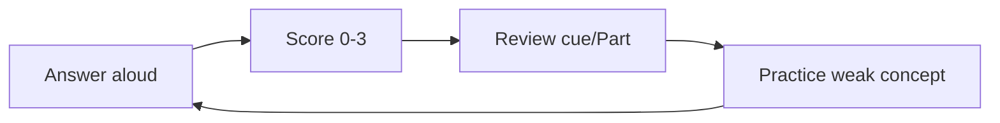
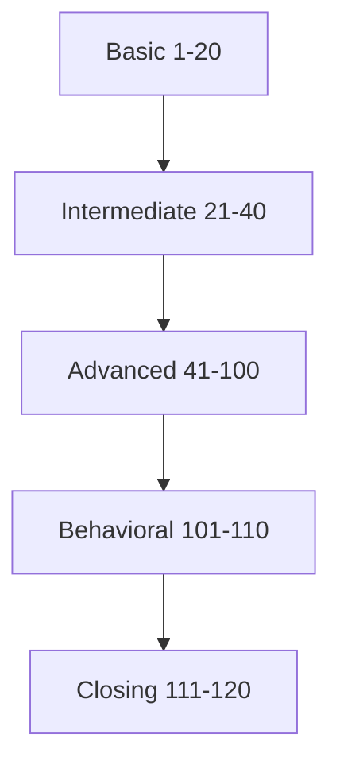
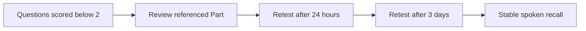

# Part 26 - Interview Question Bank: 100+ Technical and Scenario Questions

> **Section goal:** Practice retrieval, not recognition. Answer aloud before reading the cue, then revisit the referenced Part for gaps.
>
> **Distribution:** 20 Basic, 20 Intermediate, 60 Advanced, 10 Behavioral, 10 Closing/Company Fit = **120 questions**.

---

## How to Use

1. Hide the answer cue.
2. Answer aloud within the target time.
3. Score 0-3.
4. Read cue and referenced Part.
5. Repeat misses after 24 hours and 3 days.

| Score band | Meaning |
|---|---|
| Zero (0) | Blank/incorrect |
| One (1) | Partial concepts, unstructured |
| Two (2) | Correct and structured, weak example |
| Three (3) | Correct, concise, evidence/example/tradeoff |

---

## Basic Questions (1-20)

**Question count: 20.**

| # | Question | Concise answer cue | Ref |
|---:|---|---|---|
| 1 | What does Glean do? | Connect enterprise context for permission-aware search, Assistant, agents/actions and governed work. | 2 |
| 2 | Search vs Assistant vs Agent? | Retrieve/rank; synthesize/create; multi-step goal/tool execution. | 2 |
| 3 | Authentication vs authorization? | Establish identity; decide allowed action/resource. | 9 |
| 4 | What is REST? | HTTP-based resource-oriented architectural style; follow documented contract. | 8 |
| 5 | 401 vs 403? | Invalid/missing auth; authenticated but forbidden. | 8-9 |
| 6 | What is DNS? | Name-to-record resolution; success does not prove connectivity. | 6 |
| 7 | TCP handshake? | SYN, SYN-ACK, ACK. | 6 |
| 8 | Refused vs timeout? | Quick rejection vs no acceptable response. | 6 |
| 9 | What does TLS provide? | Encryption plus endpoint identity/integrity through certificate validation. | 6 |
| 10 | What is HTTP status 429? | Rate limited; honor guidance, reduce rate, bounded backoff. | 8 |
| 11 | What is a cookie? | Browser state sent under domain/path/security/SameSite rules. | 7 |
| 12 | What is CORS? | Browser cross-origin response-read policy using HTTP headers/preflight. | 7 |
| 13 | What is SAML? | Signed XML federation/SSO assertion flow. | 9 |
| 14 | OAuth vs OIDC? | API authorization; authentication identity layer on OAuth. | 9 |
| 15 | What is SCIM? | User/group provisioning lifecycle over JSON/HTTP. | 9 |
| 16 | What is an inverted index? | Term-to-document postings for fast lexical retrieval. | 3 |
| 17 | Lexical vs semantic search? | Exact tokens/phrases vs meaning through embeddings. | 3 |
| 18 | What is RAG? | Retrieve permitted evidence, assemble context, generate grounded answer/citations. | 16 |
| 19 | What is a Kubernetes pod? | Smallest scheduled unit containing one or more containers. | 14 |
| 20 | What is root cause? | Underlying correctable mechanism, not symptom/trigger alone. | 5 |

---

## Intermediate Questions (21-40)

**Question count: 20.**

| # | Question | Concise answer cue | Ref |
|---:|---|---|---|
| 21 | Walk through enterprise search pipeline. | Acquire, parse, normalize, index/graph, understand query, permission-filter, retrieve/rank. | 3 |
| 22 | Full vs incremental crawl? | Complete reconciliation vs changes since progress/checkpoint. | 4 |
| 23 | Indexed vs live vs hybrid access? | Pre-crawled corpus; query-time source; combination. | 4 |
| 24 | Why stable document IDs? | Updates converge on same object; avoid duplicates. | 4 |
| 25 | Precision vs recall? | Relevant among returned; returned among all relevant. | 3 |
| 26 | How do filters differ from ranking? | Filters include/exclude; ranking orders eligible candidates. | 3 |
| 27 | What is idempotency? | Repetition converges to same intended final state. | 8 |
| 28 | How do you handle 429? | Retry-After, backoff+jitter, reduce concurrency, quota evidence. | 8 |
| 29 | What belongs in HAR capture request? | Browser/user/time/repro/expected, Preserve log, sanitized export, console. | 7/10 |
| 30 | SAML fields to validate? | Signature, issuer, audience, recipient/ACS, time, request correlation, NameID/claims. | 9 |
| 31 | ID token vs access token? | Client authentication identity vs API authorization. | 9 |
| 32 | What is PKCE? | Challenge/verifier binds authorization code redemption to client. | 9 |
| 33 | What does a trace ID do? | Correlates whole distributed operation; span ID one unit. | 10 |
| 34 | How read stack trace? | Exception chain, relevant app frame, boundary, task/build, correlate context. | 10 |
| 35 | INNER vs LEFT JOIN? | Matches only vs all left plus right matches. | 12 |
| 36 | Why joins inflate counts? | One-to-many produces multiple rows; define grain. | 12 |
| 37 | Running vs Ready pod? | Process running vs eligible for traffic/readiness condition. | 14 |
| 38 | Liveness vs readiness? | Restart decision vs traffic eligibility. | 14 |
| 39 | What makes good Jira defect? | Impact/version/repro/controls/IDs/evidence/hypothesis/acceptance. | 15 |
| 40 | Runbook vs KB? | Safe operation vs reusable explanation/diagnosis. | 20 |

---

## Advanced Questions (41-100)

**Question count: 60.**

| # | Question | Concise answer cue | Ref |
|---:|---|---|---|
| 41 | Missing doc: first three checks? | Exact source/scope, processing/index, user permission; then exact query/ranking. | 3-5 |
| 42 | Exact title works but natural query fails? | Availability/auth likely healthy; relevance/query-understanding investigation. | 3 |
| 43 | Old policy outranks current? | Freshness, authority, duplicate, metadata, personalization; judged controlled case. | 3 |
| 44 | Denied user sees snippet? | Security incident: preserve, contain, scope, ACL/identity, verify controls. | 22/24 |
| 45 | Connector green but content missing? | Status/count not correctness; object scope/auth/process/ACL/query controls. | 4 |
| 46 | New content missing, old works? | Incremental/webhook/checkpoint/rate/credential path. | 4-5 |
| 47 | Deleted content persists? | Delete event vs full reconciliation; sensitive hide/escalation path. | 4 |
| 48 | Admin auth succeeds but private content missing? | Scope/central credential/per-user auth/identity mapping/source access. | 4 |
| 49 | Bulk replacement risk? | Incomplete snapshot deletes omitted documents; validate pages/counts/finalization/rollback. | 4 |
| 50 | Permission propagation validation? | Source change UTC, identity/group/ACL processing, allowed/denied controls, lag. | 4 |
| 51 | Form falsifiable hypothesis for stale sync. | Cause predicts cutoff/errors/control; name result that rejects it. | 5 |
| 52 | Choose best diagnostic test. | Highest information gain, safe/read-only, one variable, objective evidence. | 5 |
| 53 | Why restart is weak first action? | Destroys state, changes variables, may mask recurrence, no cause. | 5 |
| 54 | Mitigation vs root-cause fix? | Reduce current impact vs remove causal condition. | 5 |
| 55 | What proves resolution? | Original repro, known-good, negative/security, health, customer, stability. | 5 |
| 56 | Blame-free RCA content? | Trigger, mechanism, impact, control gaps, evidence, actions/effectiveness. | 5 |
| 57 | DNS works but connect fails? | Verify address, route/proxy/VPN, TCP handshake/firewall/listener. | 6 |
| 58 | SYN repeated no response? | Drop/unreachable/server/return path; capture both sides/log tuple. | 6 |
| 59 | Immediate RST after SYN? | Reached rejector/no listener/policy; identify source. | 6 |
| 60 | TCP works, TLS unknown CA? | Trust chain/intermediate/inspection/runtime store, not firewall. | 6 |
| 61 | Browser works, service fails? | Different origin/proxy/PAC/trust/identity/DNS/network path. | 6-7 |
| 62 | Small works, large stalls? | MTU/fragmentation/proxy size/loss; size-correlated evidence. | 6 |
| 63 | One of four IPs fails? | Endpoint/backend/IP-specific path; correlate resolved IP. | 6/24 |
| 64 | HTTP 502 vs 504? | Gateway bad upstream response vs upstream timeout. | 7-8 |
| 65 | No request in DevTools? | Recording/filter, client code, CSP, service worker/cache, extension. | 7 |
| 66 | Postman works, browser fails? | CORS/cookies/client policy or request differences. | 7-8 |
| 67 | CORS preflight failure? | OPTIONS origin/requested method/headers vs allow response; actual may not send. | 7 |
| 68 | Login redirect loop? | Preserve log; redirect, callback, Set-Cookie/Cookie, SameSite/domain/path/session. | 7/9 |
| 69 | POST timeout: retry? | Unknown commit; query state/idempotency key/operation ID first. | 8 |
| 70 | 400 vs 422? | Protocol/schema invalid vs syntactically valid semantic/business invalid. | 8 |
| 71 | Pagination misses items? | Model/cursor reuse/filter changes/offset mutations/repeated cursor/empty page. | 8 |
| 72 | API 500 escalation? | Sanitized minimal valid repro, IDs/time/build/controls/impact; bounded attempts. | 8/15 |
| 73 | SAML app rejects after IdP success? | Response signature/issuer/audience/recipient/time/NameID/claims/session. | 9 |
| 74 | Invalid SAML audience? | Assertion audience vs SP entity ID/AuthnRequest issuer. | 9 |
| 75 | OAuth invalid_grant? | Expired/reused code, PKCE verifier, redirect mismatch. | 9 |
| 76 | Valid JWT but API 403? | Correct signature/issuer/aud/time, missing scope/role/resource ACL. | 9 |
| 77 | Decode vs validate JWT? | Reading claims vs cryptographic and semantic trust checks. | 9 |
| 78 | SCIM user duplicated? | Filter/normalization/externalId/userName uniqueness and target behavior. | 9 |
| 79 | Disabled user still accesses app? | Source, SCIM cycle/PATCH/target active, SSO policy, existing session. | 9 |
| 80 | HAR shows 504; trace first failing span? | Correlate request/trace, critical path, immediate cause vs upstream mechanism. | 10 |
| 81 | Stack timeout at controller? | Identify wait/dependency/deadline/inner exception/trace, not controller as cause. | 10 |
| 82 | Missing spans prove no call? | No; instrumentation/sampling/context propagation may be missing. | 10 |
| 83 | Event time vs observed time? | Producer occurrence vs collector receipt; detect delay/skew. | 10 |
| 84 | Cloud status green but app fails? | Resource/config/identity/network/quota/workload/data plane. | 11 |
| 85 | Cloud control vs data plane? | Manage resource vs use endpoint; permissions/paths differ. | 11 |
| 86 | Private endpoint troubleshooting? | Private DNS, route, firewall, TLS hostname, resource policy, origin. | 11 |
| 87 | Managed identity storage 403? | Token audience/identity/RBAC/resource scope; network already proven. | 11 |
| 88 | SQL duplicate detection trap? | Define grain/stable key; joins/snapshots can inflate. | 12 |
| 89 | Slow query workflow? | Fingerprint/params, waits, plan, rows, locks/resources, compare, verify. | 12 |
| 90 | Pool timeout with normal DB CPU? | Connections held/leaked/slow external work; pool evidence. | 12 |
| 91 | Linux service active but unavailable? | Listener/bind/probe/network/dependency/original request. | 13 |
| 92 | Disk has bytes but writes fail? | Inodes, mount/read-only, quotas, deleted-open files. | 13 |
| 93 | Kubernetes CrashLoop? | Describe, last state/exit, previous logs, events, config/probes/resources/revision. | 14 |
| 94 | Service no endpoints? | Selector vs labels and readiness; ports. | 14 |
| 95 | Pod Pending? | Scheduler events, resources, taints/affinity, PVC, quota/policy. | 14 |
| 96 | Agent repeated write? | State/idempotency/operation ID/verification/loop guard/approval. | 16/24 |
| 97 | Poor AI answer diagnostic? | Source/access, retrieval/ranking, context, generation, citation/UI. | 16 |
| 98 | Evaluate permission-aware RAG? | Personas, expected/forbidden sources, allowed/denied, revoke, citations. | 16/25 |
| 99 | Connector validation acceptance? | Config/auth/content/ACL/search/freshness/delete/alerts/customer sign-off. | 23 |
| 100 | Explain ambiguous "slow and wrong." | Split latency and quality/access/freshness symptoms; scope and measure each. | 24 |

---

## Behavioral Questions (101-110)

**Question count: 10.**

| # | Question | STAR cue | Ref |
|---:|---|---|---|
| 101 | Critical incident ownership | Real CRITSIT: impact, triage, coordination, verify, prevention. | 1/27 |
| 102 | Difficult customer | Trust risk, listening, cadence, evidence, outcome. | 17/27 |
| 103 | First hypothesis wrong | Contradictory test, pivot, humility, learning. | 5/27 |
| 104 | Product defect influence | Repro/impact, engineering, validation, customer close. | 15/27 |
| 105 | Process improvement | Baseline, intervention, metrics, guardrails, result. | 21/27 |
| 106 | Learned technology quickly | ODSP SME/AI/Advisor: plan, practice, applied/shared result. | 1/27 |
| 107 | Mentored engineer | Need, coaching, feedback, readiness/outcome. | 1/27 |
| 108 | Mistake/failure | Own action, impact, correction, system prevention. | 27 |
| 109 | Conflict without authority | Shared outcome, facts/options, decision, relationship. | 17/27 |
| 110 | AI adoption leadership | User need, agent/training, evaluation, adoption/feedback. | 16/27 |

---

## Closing and Company-Fit Questions (111-120)

**Question count: 10.**

| # | Question | Answer cue | Ref |
|---:|---|---|---|
| 111 | Tell me about yourself | Microsoft support scope, evidence, Glean bridge. | 1 |
| 112 | Why Glean? | Enterprise knowledge + AI + customer ownership + technical growth. | 1-2 |
| 113 | Why leave Microsoft? | Move toward designated-customer ownership/integrations, not away negatively. | 1/27 |
| 114 | Why should we hire you? | Proven support operating discipline + adjacent content/AI depth + honest learning. | 1 |
| 115 | Biggest gap? | Glean internals/API/identity hands-on; concrete lab/study plan. | 1/27 |
| 116 | First 30 days? | Product/runbooks, shadow cases, customer context, labs, feedback, measured ramp. | 27 |
| 117 | What does customer obsession mean? | Outcome ownership, facts, urgency, trust, prevention. | 17 |
| 118 | Questions for hiring manager? | Success/rounds/customer model/escalation/product feedback/learning. | 27 |
| 119 | Compensation expectations? | Market-aligned, scope/level/total package, recruiter range. | 27 |
| 120 | Anything else? | Reiterate fit/evidence/curiosity and ask next steps. | 27 |

---

## Scenario Whiteboard Tracker

| Area | Questions | Best score | Retest date |
|---|---|---:|---|
| Product/search/connectors | 1-2, 16-19, 21-26, 41-50 |  |  |
| Troubleshooting/network/web/API | 20, 27-30, 51-72 |  |  |
| Identity/observability | 3, 13-15, 30-34, 73-83 |  |  |
| Cloud/SQL/Linux/Kubernetes | 35-38, 84-95 |  |  |
| AI/agents | 18, 96-98 |  |  |
| Customer/process | 39-40, 99-100 |  |  |
| Behavioral | 101-110 |  |  |
| Closing | 111-120 |  |  |

---

## Daily Self-Quiz Tracker

| Session | Range | Score / max | Questions below 2 | Retest |
|---|---|---:|---|---|
| Day 1 AM | 1-20 | /60 |  |  |
| Day 1 PM | 21-40 | /60 |  |  |
| Day 2 AM | 41-60 | /60 |  |  |
| Day 2 PM | 61-80 | /60 |  |  |
| Day 3 AM | 81-100 | /60 |  |  |
| Day 3 PM | 101-120 | /60 |  |  |
| Day 4 | All misses |  |  |  |

### Readiness thresholds

| Level | Standard |
|---|---|
| Needs study | Average below 1.5 or blanks in must-haves |
| Developing | Average 1.5-2.0, structure inconsistent |
| Interview-capable | Average 2.0+, no blanks in API/identity/search/network |
| Strong | Average 2.5+, evidence/tradeoffs/examples natural |

---

## 30-Second Memory Hooks

- **Answer first; read cue second.**
- **Score structure and evidence, not confidence.**
- **Every technical answer:** scope -> hypotheses -> test -> mitigate/update -> verify.
- **Every behavioral answer:** Situation -> responsibility -> actions/reasoning -> measurable result -> learning.
- **Retest misses after spacing, not immediately only.**

---

## Completion Checklist

- [ ] I answered all 120 aloud.
- [ ] No blanks in search/connectors, API, SSO/OAuth, networking, logs.
- [ ] Advanced average is at least 2.
- [ ] I have real STAR evidence for 101-110.
- [ ] Closing answers sound natural, not memorized.
- [ ] All questions below 2 are scheduled for retest.

---

*Next suggested section: [Part-27-behavioral-closing-and-cheat-sheet.md](Part-27-behavioral-closing-and-cheat-sheet.md). It converts the final 20 questions into personalized stories and a night-before sheet.*
