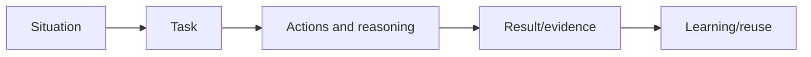
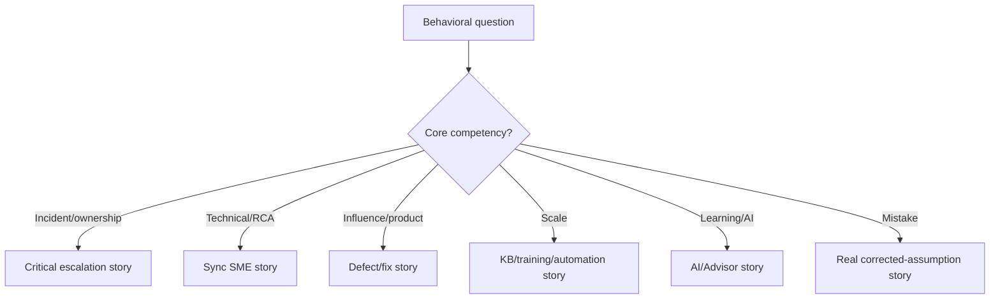
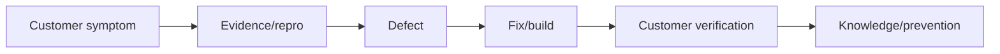
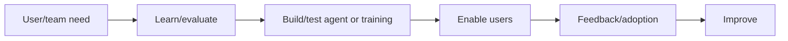
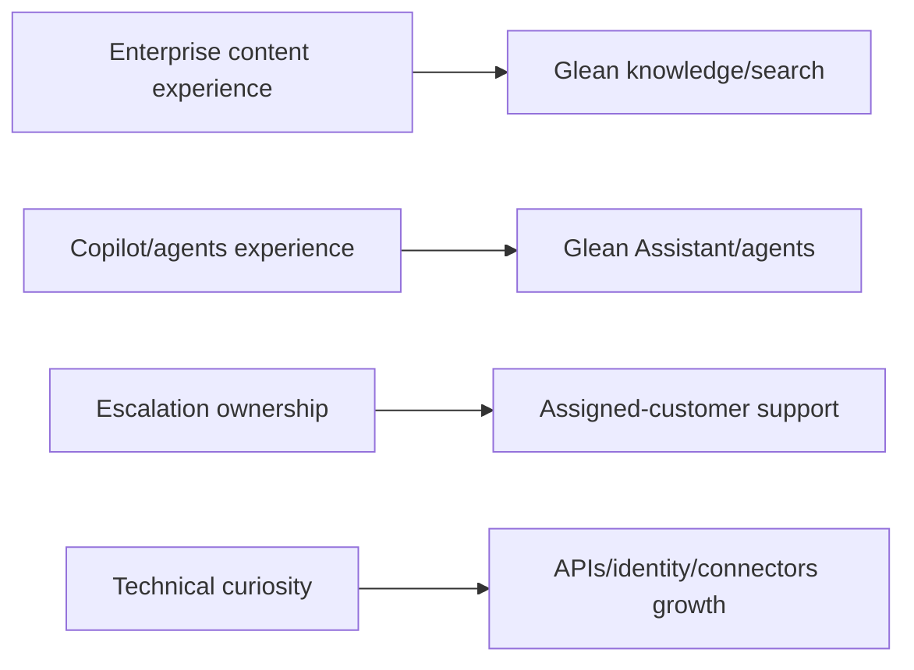
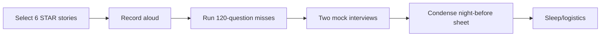

# Part 27 - Behavioral, STAR Stories, Company Fit, and Night-Before Sheet

> **Section goal:** Turn verified Microsoft experience into concise behavioral evidence, answer motivation/fit questions honestly, ask strong closing questions, and review the entire interview in one page.
>
> **Honesty rule:** The story scaffolds use facts supported by the CV, but bracketed case details must be filled from memory. Never invent customer names, technical causes, dates, metrics, or outcomes.

---

## 1. STAR and STAR-L

| Step | Purpose |
|---|---|
| Situation | Essential context and stakes |
| Task | Your responsibility/outcome |
| Action | What you personally did and why |
| Result | Measured or verified outcome |
| Learning | What changed in your future approach |



### Plain-English deep-dive: STAR is evidence compression

It is not a script formula; it prevents background from consuming the answer and makes your individual judgment visible.

### Time budget

| Section | Approximate share |
|---|---:|
| Situation + Task | 20-25% |
| Action | 50-60% |
| Result + Learning | 20-25% |

---

## 2. Competency Map

| Glean competency | CV-backed evidence source |
|---|---|
| Customer ownership | Enterprise escalations and CRITSITs |
| Technical depth | ODSP Sync Client SME |
| Communication | Technical syncs, business reviews, global events |
| Cross-functional work | Customer IT, partners, engineering, product, vendors |
| Data-driven | CSAT, backlog health, case quality, escalation trends |
| Documentation/scale | KBs, guides, triages, case bashes, mentoring |
| Product improvement | Defect escalation and fix validation |
| Learning/curiosity | Intern -> engineer -> escalation; TA and AI programs |
| AI | Copilot Studio agents, AI training, AI-102/AI-900 |
| Leadership | Aspire council, mentoring, interviews, events |

---

## 3. Story Selection Matrix



Avoid using the same story for every question.

| Story | Evidence to have ready |
|---|---|
| Critical escalation | Impact, timeline, owners, verification |
| Technical RCA | Hypotheses, discriminating evidence, cause |
| Product defect | Repro/IDs, engineering path, build/customer result |
| Improvement | Baseline, intervention, metric/guardrail |
| Learning | Gap, practice, applied proof, teaching |
| Mistake | Detection, correction, prevention |

---

## 4. Story 1 - Business-Critical Escalation

**Use for:** ownership, pressure, difficult customer, ambiguity, communication.

```text
Situation: [Real enterprise ODSP/Copilot incident, impact, urgency]
Task: I owned customer progress across [teams].
Actions:
- Established scope, safety, timeline, known-good controls.
- Created one resolution plan with owners/update cadence.
- Drove mitigation while evidence isolated [actual layer].
- Coordinated customer IT, partner, engineering/product/vendor as real case required.
Result: [Verified recovery, customer confirmation, recognition/metric if this case truly had one].
Learning: [Runbook/monitoring/communication improvement].
```

### Follow-up readiness

- Exact first decision.
- Hypotheses and evidence.
- What you personally did.
- Hardest stakeholder moment.
- Verification and prevention.

---

## 5. Story 2 - Sync Client SME Root Cause

**Use for:** technical depth, fearlessness, learning, mentoring.

```text
Situation: [Real complex OneDrive sync scenario].
Task: As ODSP Sync Client SME, isolate cause and guide engineers/customer.
Actions: [Affected/unaffected comparison, evidence, hypothesis pivot, cross-team escalation].
Result: [Technical resolution/readiness/customer outcome].
Learning: [Diagnostic method reused/shared].
```

Do not substitute generic product description for the actual investigation.

---

## 6. Story 3 - Product Defect and Fix Validation

**Use for:** influence, customer advocacy, cross-functional, detail.

```text
Situation: Recurring customer behavior suggested product defect.
Task: Convert impact into engineering-ready evidence and close loop.
Actions: Repro, controls, logs/IDs, impact, defect escalation, engineering tests, rollout tracking, customer validation.
Result: [Real defect/fix/customer outcome].
Learning: Better evidence/telemetry/KB.
```



---

## 7. Story 4 - Data-Driven Business Review

**Use for:** metrics, executive communication, improvement.

CV evidence: CSAT above 4.75 Enterprise and 4.85 SMB, backlog/case-quality/escalation trends, leadership reviews.

Fill:

- Trend/problem identified.
- Cohort/baseline and data quality.
- Insight and recommended action.
- Owner/follow-up.
- Measured outcome.

Do not imply the CSAT values came from one project if they were broader business results.

---

## 8. Story 5 - Documentation and Team Scale

**Use for:** KB/runbooks, mentoring, support efficiency.

Source: authored KB/troubleshooting/best-practice guidance; partner triages, roadblocks, case bashes; onboarding/mentoring.

```text
Repeated problem:
Audience and gap:
What I created/taught:
How I tested/adapted it:
Reuse/readiness/outcome:
What I would measure now:
```

---

## 9. Story 6 - Automation Improvement

**Use for:** innovation, scale, initiative.

Source: Evolve program, Power Automate/Power Apps solutions, top honors.

Fill only verified details:

- Manual problem.
- Users/process.
- Design and your contribution.
- Safety/quality checks.
- Competition recognition and operational outcome.

---

## 10. Story 7 - AI Adoption

**Use for:** Glean motivation, curiosity, communication, leadership.

Source: evaluate AI tools/models, build agents, team/org training and triage, Copilot Studio Power Up, AI credentials.



Mention AI risks/evaluation, not only enthusiasm.

---

## 11. Story 8 - Leadership Without Authority

Use Aspire Leadership Council, global events, peer recognition, mentoring, or cross-team escalation.

Show:

- Shared outcome.
- Stakeholders with different priorities.
- How you used facts/listening/options.
- Decision/commitment.
- Relationship/outcome.

---

## 12. Story 9 - Mistake or Failed Hypothesis

Choose a real, bounded example.

```text
Initial assumption/action:
Why it seemed reasonable:
Evidence that contradicted it:
How I corrected course and communicated:
Customer/team result:
System/process change preventing recurrence:
```

### Plain-English deep-dive: The best mistake story demonstrates control

Do not choose "I work too hard." Show ownership, detection, correction, impact management, and prevention without selecting an unrecoverable ethical failure.

---

## 13. Behavioral Answer Quality

| Weak | Strong |
|---|---|
| "We solved it" | Your decisions/actions inside team result |
| Technical chronology only | Customer impact and judgment |
| No result | Verified/measured outcome |
| Perfect hero | Tradeoff, uncertainty, learning |
| Invented metric | Honest qualitative verification |
| Blame | System factors and shared outcome |

| Red flag | Correction |
|---|---|
| Confidential customer detail | Anonymize while preserving stakes |
| Unsupported number | Use verified qualitative result |
| Team story with no personal action | State decisions/actions you owned |
| Result without verification | Explain test/customer/metric |
| Memorized monologue | Use anchor bullets and natural language |

---

## 14. Tell Me About Yourself

### 60-second version

> "I am a Support Escalation Engineer at Microsoft with more than five years of progressive enterprise support experience. My core technical background is SharePoint Online, OneDrive for Business and the sync client, Microsoft 365 administration, and Copilot. I own complex and business-critical escalations, coordinate customer IT, partners, engineering and product teams, validate fixes, and use CSAT, backlog health, case quality, and escalation trends to improve outcomes. I also mentor engineers, author troubleshooting guidance, and support AI adoption through Copilot Studio agents and training. Glean interests me because it combines enterprise knowledge, AI, integrations, and high-touch customer ownership, which matches my strengths while deepening my search, API, and identity expertise."

Keep natural; do not recite every certification.

---

## 15. Why Glean?



> "Glean sits at the intersection of areas I already work in and want to deepen: enterprise content and permissions, AI, complex integrations, and customer outcomes. I am especially drawn to a role where one engineer owns both reactive resolution and proactive customer improvement."

Verify current product/company facts before interview.

### Plain-English deep-dive: Motivation needs a bridge

A strong "why" connects verified past experience, the actual role, and the next capability you want to build. Generic excitement about AI or growth can apply to any company.

---

## 16. Why This Move?

> "Microsoft has given me a strong foundation in enterprise support, critical incidents, content platforms, and cross-functional problem solving. My next step is deeper ownership of a designated customer's technical experience, combining proactive support, adoption, integrations, and continuous improvement. Glean makes that move coherent because enterprise knowledge and AI are close to my SharePoint, OneDrive, and Copilot experience while expanding my depth in search, APIs, and identity."

Move toward opportunity; do not criticize current employer.

---

## 17. Why You?

| Need | Evidence |
|---|---|
| Enterprise support ownership | Escalations/CRITSITs |
| Search/knowledge adjacency | SharePoint, OneDrive, Delve |
| Customer communication | Syncs/business reviews/CSAT |
| Cross-functional | Customer/partner/engineering/product/vendor |
| Documentation/scale | KB/training/mentoring |
| AI | Copilot/agents/certifications |
| Learning | Career progression/TA/MBA |

> "I bring the support operating discipline already: ownership, structured RCA, customer communication, engineering evidence, verification, documentation, and metrics. I also bring adjacent product depth in enterprise content, permissions, sync and Copilot. I am honest about Glean-specific internals being new and have built practical API, identity, network, Linux and Kubernetes working knowledge to ramp quickly."

---

## 18. Biggest Gap

Use strength-boundary-plan-evidence:

1. Strongest production depth: M365/ODSP/escalations.
2. Gap: Glean-specific platform/internal tooling and production depth in some listed tools.
3. Plan: labs/docs/shadowing/runbooks/SME feedback.
4. Evidence: past SME/AI/TA progression.

Do not say "no gaps."

---

## 19. First 30/60/90 Days

| Period | Focus |
|---|---|
| 0-30 | Product architecture, runbooks, tools/access, shadow cases, assigned-customer context, reproduce standard labs |
| 31-60 | Own scoped cases/reviews with feedback, build source/identity/API fluency, identify recurring pattern |
| 61-90 | Independent portfolio ownership, deliver one measured support/runbook/process improvement, deepen customer value plan |

Adjust to hiring manager expectations.

---

## 20. Questions to Ask Interviewers

### Hiring manager

- What outcomes define success at 30, 90, and 180 days?
- How is proactive vs reactive time balanced?
- How many designated customers and what complexity?
- What incident authority and escalation model does the role use?
- How does customer feedback reach product/security?
- Which technical gaps most often slow new hires?

### Technical panel

- Which evidence and tools are most useful for connector/search/identity cases?
- How are permission-sensitive incidents handled?
- What distinguishes excellent engineering escalations?
- How are runbooks tested and maintained?

### Team/culture

- How does the team share learning after difficult cases?
- What does healthy on-call/channel coverage look like?
- How are priorities resolved across customers?

Ask questions not already fully answered.

---

## 21. Compensation-Safe Phrasing

> "I am focused first on role scope, level, and fit. I would expect a market-aligned package for this position and location, considering base, variable, equity, and benefits. Could you share the approved range and level so we can confirm alignment?"

Do not fabricate market data. Prepare personal minimum privately.

---

## 22. Closing Statement

> "The conversation reinforces the fit I saw in the role. My strongest contribution would be bringing proven enterprise escalation ownership, content and AI adjacency, and a disciplined customer communication and improvement approach. I am also clear on the areas I would ramp in Glean-specific tooling and integrations, and that learning path matches how I have progressed into SME and advisory responsibilities before."

---

## 23. Night-Before One-Page Sheet

### Product

- Glean: connect enterprise context -> permission-aware Search/Assistant/Agents -> governed action/value.
- Search issue layers: source -> connector -> process/index -> identity/ACL -> retrieve/rank -> answer/action.

### Technical

- Network: DNS -> route/proxy -> TCP -> TLS -> HTTP.
- API: method/URL/version/auth/body -> status/error/request ID -> retry only safe.
- Identity: SAML SSO; OAuth API authorization; OIDC authentication; SCIM lifecycle.
- Evidence: UTC + user/object + request/trace ID + affected/control.
- AI: source -> permission -> retrieval -> grounding -> generation -> citation/tool.

### Troubleshooting

- CLEAR: Clarify, Locate, Evidence, Act, Resolve.
- Three hypotheses, predictions, cheapest safe discriminator.
- Mitigate/update in parallel.
- Verify original + known-good + negative/security + customer.

### Customer

- BLUF: impact/status, facts, actions/owners, risk, next update.
- Portfolio: priority, owner, action, date, verification.
- Escalate with specific ask.

### Stories

1. Critical escalation.
2. Sync SME root cause.
3. Product defect/fix.
4. Metrics/business review.
5. KB/training/mentoring.
6. Automation.
7. AI adoption.
8. Influence.
9. Mistake/pivot.

### Evidence

- 5+ years Microsoft support.
- CSAT >4.75 Enterprise / >4.85 SMB.
- 100+ recognitions for critical escalation handling.
- ODSP Sync Client SME; Technical Advisor program.
- AI-102/AZ-900/DP-900/AI-900/MS-900 and Copilot work.

Only quote these where context is accurate.

---

## 24. Final Practice Plan



| Practice | Target |
|---|---|
| Intro | 30 and 60 seconds |
| STAR | 90-150 seconds each |
| Technical scenario | 5-10 minutes |
| Customer update | 60-90 seconds |
| Why Glean/move/you | 45-75 seconds |
| Interviewer questions | 5 prioritized |

| Interview-day check | Ready |
|---|---|
| Role/JD and interviewer names reviewed |  |
| CV and five story anchors accessible |  |
| Product facts rechecked from official sources |  |
| Audio/video/network/quiet room tested |  |
| Time zone and meeting link confirmed |  |
| Water/notepad and questions ready |  |

---

## Likely Behavioral Questions

### Q1. "Tell me about a critical incident."
> **Model structure:** Story 1; emphasize impact, first decisions, coordination, cadence, verification, prevention.

### Q2. "Difficult customer?"
> **Model structure:** Trust risk, listening, facts, plan, expectation reset, delivered result.

### Q3. "First hypothesis wrong?"
> **Model structure:** Why plausible, falsifying evidence, pivot, communication, learning.

### Q4. "Influenced product without authority?"
> **Model structure:** Recurring evidence/impact, stakeholder alignment, defect/decision, validation.

### Q5. "Improved process?"
> **Model structure:** Baseline, root pattern, intervention, metrics/guardrails, outcome.

### Q6. "Learned quickly?"
> **Model structure:** ODSP SME/AI/TA: gap, plan, practice, applied proof, enabled others.

### Q7. "Mistake?"
> **Model structure:** Own action, detection, impact management, correction, system prevention.

### Q8. "Why Glean/why now?"
> **Model answer:** Enterprise content + AI + designated-customer ownership + next technical growth, grounded in current experience.

---

## 30-Second Memory Hooks

- **STAR:** Context short; actions long; result verified; learning real.
- **Use "I" for your actions and "we" for team result.**
- **Why move:** Toward scope, never away through complaint.
- **Why you:** Proven operating discipline + adjacent depth + honest ramp.
- **Question quality shows role understanding.**
- **Night before: retrieve, do not cram new topics.**

---

## Completion Checklist

- [ ] I filled all bracketed story details from real memory.
- [ ] I can deliver six distinct STAR stories naturally.
- [ ] I can answer intro/why Glean/why move/why you/gap/30-60-90.
- [ ] I selected five interviewer questions.
- [ ] I completed two mock interviews.
- [ ] I reviewed one-page sheet and logistics.
- [ ] I did not invent facts or metrics.

---

*You have completed the structured guide. Return to the [master study guide](../Glean%20Support%20Engineering%20-%20Study%20Guide.md), practice the Part 26 misses, and run a mock interview using Part 24.*
