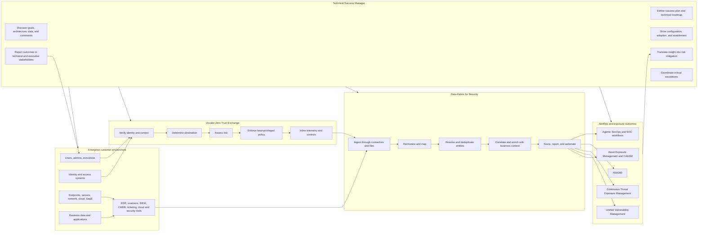
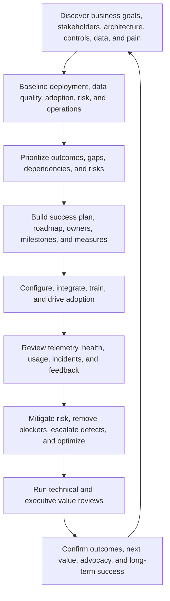
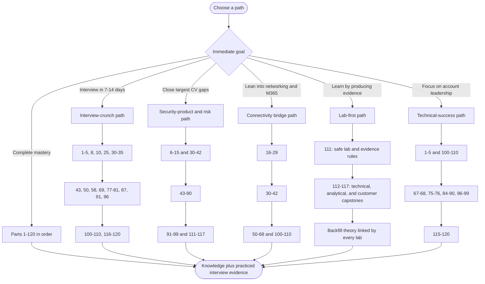

# Zscaler SecOps Technical Success Manager - Complete Study Guide

> **Target role:** Zscaler SecOps Technical Success Manager (TSM)
> **Built for:** Candidates moving from Microsoft 365 Support Escalation Engineering into cybersecurity technical success
> **Mode:** Complete learning path plus interview preparation
> **Goal:** Never go blank: understand concepts from first principles, analyze a customer environment, explain Zscaler SecOps value, recommend defensible actions, and communicate with engineers, security leaders, and executives
> **Depth promise:** No page or size limit. Every Part will be beginner-first, technically deep, diagram-rich, scenario-driven, mapped to the job description, and explicit about production experience versus learned or lab knowledge
> **Currency:** Curriculum mapped to the supplied job description and official Zscaler product material reviewed on August 24, 2026
> **Index status:** Curriculum proposed for confirmation; lesson files have not yet been generated

> **How to use this guide:** It is written for **any** candidate preparing for this role. The background table below describes a *typical* starting profile, not one person's CV, and every model answer is a template. Replace the bracketed details, metrics, employers, products, and examples with evidence from your own CV before you use them, and never claim experience you cannot defend.

---

## Assumed starting background: how this guide is built

| Demonstrated starting strength | How the guide uses it | Main bridge to build |
|---|---|---|
| 5+ years in enterprise support and escalation engineering | Customer ownership, technical advisory, investigation, defect escalation, and high-pressure examples begin with familiar support motions | Reframe reactive support depth as proactive cybersecurity technical success, value realization, risk reduction, and strategic account leadership |
| SharePoint Online, OneDrive for Business, sync-client, and Microsoft 365 expertise | SaaS, browser, identity, permissions, data, endpoint, and connectivity scenarios start from known workloads | Extend from workload troubleshooting into zero trust, exposure management, vulnerability programs, security data, and SecOps outcomes |
| Deliberate networking upskilling in TCP/IP, OSI, HTTP/HTTPS, TLS/SSL, DNS/DHCP, proxies, firewalls, and routing | Provides a strong base for understanding Zscaler traffic flows, TLS inspection, policy enforcement, and cross-layer troubleshooting | Add SSE/SASE, proxy architecture, ZIA, ZPA, Client Connector, Service Edges, traffic forwarding, and zero trust policy design |
| Wireshark, Netsh, Network Monitor, Procmon, HAR, Fiddler, and browser-tool familiarity | Supports evidence-driven troubleshooting labs and customer-facing root-cause narratives | Learn Zscaler-specific telemetry, logs, Data Fabric connector health, entity correlation, risk evidence, and platform troubleshooting |
| Business-critical incidents, critical situations, RCA, engineering collaboration, and fix validation | Maps naturally to critical escalations, multi-workstream coordination, containment, and post-incident improvement | Add SOC workflows, exposure-to-incident feedback loops, executive risk framing, and risk-appropriate response |
| A strong customer-satisfaction record, backlog/case-quality analysis, and repeated peer and customer recognition | Provides factual evidence for customer obsession, execution, accountability, and data-driven service improvement | Build customer health models, success plans, adoption metrics, value reviews, executive dashboards, and renewal-risk reasoning |
| SQL, PostgreSQL, Excel, Power BI, Python, R, statistics, and a postgraduate business-analytics qualification | Strong starting point for Data Fabric, data modeling, reporting, and risk analytics | Apply analytics to security entities, vulnerabilities, exposures, business context, scoring, SLAs, remediation trends, and board communication |
| Technical advisor work, mentoring, onboarding, interviews, partner training, and knowledge articles | Directly supports consulting, enablement, and service-delivery expectations | Add CISO communication, security workshops, product adoption plans, stakeholder governance, and scalable TSM playbooks |
| Copilot Studio agents, AI tool evaluation, AI certifications, and organization-wide training | Aligns with Zscaler's AI-forward and Agentic SecOps direction | Add AI-assisted triage, investigation, response, model risk, validation, privacy, prompt safety, and human-approval controls |
| Cross-functional work with customers, partners, Engineering, Product Groups, and vendors | Supports the role's Sales, Support, Product, and customer coordination | Learn account-team operating models, RACI, escalation boundaries, constructive debate, decision records, and executive alignment |

### Honest gap map

This guide assumes no production experience with Zscaler products, the Zero Trust Exchange, ZIA, ZPA, ZDX, Client Connector, Data Fabric for Security, Asset Exposure Management, Unified Vulnerability Management (UVM), Risk360, Continuous Threat Exposure Management (CTEM), SIEM/SOAR/XDR administration, vulnerability scanners, CVE triage, enterprise risk quantification, or a formal SecOps program. The guide treats these as **learning and lab areas**, never as past experience.

Interview answers will distinguish clearly among:

- **I have done this in production.** Use only for the support, escalation, customer, networking, analytics, mentoring, and AI facts supported by your own CV.
- **I have done this in a lab or structured case exercise.** Use after completing the relevant guide lab and retaining the evidence.
- **I understand the architecture and would validate it this way.** Use for learned concepts not yet practiced in a licensed environment.
- **I have not used that product directly yet; here is the transferable method, the evidence I would collect, and my ramp plan.** Use when product access is unavailable.

---

## Mastery outcomes: what mastery looks like

By the end of this guide, you should be able to:

1. Explain the SecOps TSM role, Zscaler's operating context, and the difference among Technical Success, Customer Success, Support, Professional Services, Sales Engineering, Product, and a SOC.
2. Draw an enterprise environment from users, identities, endpoints, networks, apps, cloud, and data through security tools and business systems into the Zscaler Data Fabric and its product workflows.
3. Explain cybersecurity, vulnerability, exposure, attack-path, control, zero trust, SOC, SIEM, SOAR, XDR, CTEM, CAASM, and cyber-risk concepts from zero knowledge.
4. Trace DNS, TCP, TLS, HTTP, proxy, identity, policy, and SaaS dependencies and use packet, process, browser, and application evidence to isolate connectivity failures.
5. Explain the Zero Trust Exchange, proxy-brokered one-to-one access, identity/context policy, TLS inspection, ZIA, ZPA, Client Connector, ZDX, and adjacent Zscaler capabilities at an interview-ready level.
6. Model security data, write and explain SQL, assess connector/data quality, reason about ETL/ELT, harmonization, entity resolution, deduplication, correlation, enrichment, and security graphs.
7. Explain how Data Fabric for Security ingests and operationalizes data, applies business logic, powers dashboards and workflows, and differs from a SIEM, data lake, warehouse, and integration platform.
8. Explain and demonstrate the logic of Asset Exposure Management, golden records, coverage gaps, CMDB hygiene, UVM, contextual multifactor scoring, remediation workflows, and CTEM.
9. Convert technical findings into risk statements, prioritized mitigations, owners, SLAs, validation criteria, residual risk, and executive-ready recommendations.
10. Explain Risk360's four attack stages, risk factors, trend views, financial exposure concepts, guided mitigation, and board-level reporting without overstating certainty.
11. Describe proactive and reactive SecOps, alert-to-threat stories, business-context enrichment, agentic triage, threat hunting, deception, MDR, and risk-based inline response.
12. Lead discovery, onboarding, success planning, adoption, health reviews, business reviews, training, escalations, and cross-functional execution for a strategic enterprise account.
13. Handle ambiguous data, product limitations, disagreements, customer objections, executive pressure, and critical escalations with transparency, ownership, and urgency.
14. Build a portfolio of labs, dashboards, SQL queries, risk registers, executive decks, success plans, escalation packages, and a complete fictional customer engagement.
15. Answer technical, scenario, analytical, product, customer-success, behavioral, culture, and closing interview questions honestly and confidently.

---

## The role in one architecture picture

## The security-data-to-business-outcome chain

```mermaid
flowchart LR
    RAW[Raw findings, logs, inventory, identity, controls, and business data] --> QUALITY[Freshness, completeness, ownership, and quality checks]
    QUALITY --> ENTITY[Normalized and resolved entities]
    ENTITY --> CONTEXT[Asset criticality, user, owner, process, exposure, and controls]
    CONTEXT --> FINDING[Verified finding]
    FINDING --> SCORE[Contextual risk score and priority]
    SCORE --> ACTION[Mitigation or response action]
    ACTION --> OWNER[Owner, SLA, dependency, and workflow]
    OWNER --> VALIDATE[Completion and effectiveness validation]
    VALIDATE --> OUTCOME[Reduced exposure, faster response, stronger posture, and measurable value]
    OUTCOME --> FEEDBACK[Feedback into data, policy, scoring, and success plan]
    FEEDBACK --> QUALITY
```

## The recurring TSM success loop

## Proactive and reactive security operations as one loop

```mermaid
flowchart LR
    INVENTORY[Know assets and identities] --> EXPOSURE[Find vulnerabilities and exposures]
    EXPOSURE --> PRIORITY[Prioritize with exploitability, context, controls, and business impact]
    PRIORITY --> REMEDIATE[Remediate, compensate, accept, or transfer]
    REMEDIATE --> VERIFY[Validate risk reduction]
    VERIFY --> DETECT[Detect active threat behavior]
    DETECT --> INVESTIGATE[Correlate, scope, and investigate]
    INVESTIGATE --> CONTAIN[Apply right-sized containment and response]
    CONTAIN --> LEARN[Feed incident lessons into exposure and posture programs]
    LEARN --> INVENTORY
```

---

## Learning paths

| Path | Best for | Suggested order |
|---|---|---|
| **Linear mastery** | No deadline; wants complete role readiness | Parts 1-120, then Appendices A-L |
| **Interview crunch** | Interview within 7-14 days | 1-5, 8, 10, 25, 30-35, 43, 50, 58, 69, 77-81, 87, 91, 96, 100-110, 116-120 |
| **Gap-first** | Fastest closure of security-product, vulnerability, and risk gaps | 6-15, 30-42, 43-99, 111-117, then interview Parts |
| **Connectivity bridge** | Build from OneDrive/SharePoint and networking strengths | 16-42, 50-68, 100-110, then exposure and SecOps Parts |
| **Technical-success** | Strong technical base but limited formal TSM practice | 1-5, 67-68, 75-76, 84-90, 96-110, 115-120 |
| **Lab-first** | Learns fastest through tangible evidence | 111-117, following each lab's theory backlinks, then 118-120 |
| **Data-first** | Wants to emphasize SQL, analytics, and Business Analytics | 43-68, 69-90, 97-99, 105-107, 112-116 |

---

## JD coverage matrix

| Job expectation, qualification, or culture signal | Primary Parts | Proof produced by the guide |
|---|---:|---|
| Lead strategic engagements for high-profile enterprise accounts | 1-5, 100-110, 115-117 | Account discovery pack, stakeholder map, success plan, governance cadence, executive review, and complete engagement simulation |
| Align solutions with business needs and drive long-term success | 4-5, 84-90, 100-110, 116-117 | Business-outcome map, risk-to-value narrative, adoption roadmap, KPI tree, and renewal/value plan |
| Analyze complex technical environments and identify security risks | 6-29, 43-90, 93-99, 112-114 | Architecture map, data-quality assessment, SQL analysis, attack-path model, risk register, and prioritized findings |
| Deliver tailored mitigation strategies | 8-13, 75-90, 94-99, 104-110, 114-117 | Contextual risk model, mitigation decision record, owner/SLA plan, validation criteria, and residual-risk statement |
| Deep expertise in Data Fabric for Security | 43-68, 112 | Source-to-outcome architecture, connector plan, mapping model, entity-resolution rules, dashboard, and troubleshooting runbook |
| Deep expertise in Unified Vulnerability Management | 77-86, 113 | Multifactor scoring model, prioritized vulnerability backlog, remediation workflow, SLA dashboard, and program review |
| Advocate product and program best practices | 30-42, 58-90, 100-110 | Best-practice assessment, maturity roadmap, adoption workshop, health review, and optimization plan |
| Partner across Sales, Support, and Product | 102-104, 108-110, 115-117 | RACI, escalation package, product feedback brief, account-team plan, and decision log |
| Resolve critical customer escalations | 25-29, 38-42, 97-99, 108-110, 114 | Fault tree, evidence timeline, bridge cadence, severity plan, engineering escalation package, and PIR |
| Deliver expert technical consulting and training virtually and on-site | 5, 100-107, 110, 115-117 | Discovery workshop, whiteboard, technical enablement session, executive briefing, lab guide, and teach-back rubric |
| Customer obsession and empathy for enterprise security leaders | 2-5, 100-110, 117, 120 | Persona map, listening plan, outcome language, expectation model, difficult-conversation scripts, and STAR answers |
| Problem solving in complex environments | 6-29, 51-57, 66-68, 83-86, 97-99, 114 | Hypothesis matrix, evidence plan, SQL checks, data lineage, prioritization model, and escalation scenario |
| Data modeling, SQL, ETL, and security analytics | 43-57, 58-68, 112-113 | Relational and graph models, query pack, ETL map, quality checks, analytical dashboard, and scored backlog |
| Executive stakeholder management | 88-90, 100-110, 116-117, 120 | Board/CISO narrative, executive dashboard, QBR, objection handling, and executive STAR stories |
| Explain complex cybersecurity and vulnerability metrics simply | 6-15, 77-90, 105-107, 116-120 | Analogy bank, one-page risk brief, metric dictionary, executive story, and whiteboard practice |
| High-trust cross-functional collaboration | 2-5, 102-104, 108-110, 115-120 | RACI, decision record, constructive-debate script, conflict STAR story, and escalation ownership model |
| Active exploration and workflow integration of AI tools | 96, 98-99, 107, 114, 118-120 | AI-assisted workflow, validation checklist, prompt/evidence log, governance controls, and factual AI adoption story |
| Customer-facing technical consultancy or success in cybersecurity | 1-5, 100-110, 115-120 | Transferable positioning narrative, customer lifecycle artifacts, security case simulations, and honest gap language |
| Hands-on technical analysis and troubleshooting | 16-29, 38-42, 51-57, 66-68, 83-86, 97-99, 112-114 | Packet/browser/process evidence, connector checks, SQL reconciliation, product health runbook, and root-cause narrative |
| Vulnerability-management programs | 77-86, 113, 117 | Program charter, intake and prioritization model, SLAs, exceptions, remediation governance, metrics, and maturity review |
| Enterprise risk scoring and security operations | 8-13, 84-99, 113-117 | Contextual score, attack-stage model, SOC workflow, threat story, risk dashboard, and executive mitigation plan |
| Security data fabric and multi-tool integration | 43-68, 112, 115 | Connector inventory, canonical schema, mapping, deduplication, correlation, outbound workflow, and integration troubleshooting |
| Mentor technical engineers and elevate service delivery | 103, 106-107, 110, 115, 120 | Mentoring plan, competency matrix, training session, quality rubric, coaching scenario, and STAR answer |
| Bachelor's degree in a technical field | 1, 120 | Factual positioning of the Computer Science engineering degree and continued MBA learning |
| Impact over activity | 2, 89-90, 100-107, 116-120 | Outcome metrics, value hypothesis, before/after evidence, prioritization logic, and impact-based stories |
| Transparency and constructive, honest debate | 2, 89, 103-104, 108-110, 120 | Assumption log, evidence labels, decision record, disagreement script, bad-news update, and culture-fit answers |
| Customer obsession, collaboration, ownership, and accountability | 2-5, 100-110, 114-120 | Success measures, owner/action register, escalation leadership, follow-through evidence, and behavioral story bank |
| Urgency with high quality | 12, 25, 57, 86, 97-99, 108-110, 114, 120 | Severity model, rapid-triage checklist, quality gates, communication cadence, and time-pressure scenario answers |
| Hybrid customer engagement and on-site delivery | 101, 105-107, 115-117 | Remote/on-site workshop plans, facilitation checklist, whiteboard sequence, travel-ready briefing, and follow-up package |

---

## Part index and progress tracker

## Group A - Role orientation, company context, and the complete customer story

| # | Part | What mastery provides | Status |
|---:|---|---|---|
| 1 | [Role Map, JD Deconstruction, and the SecOps TSM Story](prep/Part-01-role-map-jd-secops-tsm-story.md) | Translate every JD line into customer outcomes, technical depth, stakeholders, activities, artifacts, success measures, interview evidence, and an honest support-to-TSM positioning narrative | Done |
| 2 | [Zscaler Mission, AI-Forward Strategy, Culture, and Interview Signals](prep/Part-02-zscaler-mission-ai-culture.md) | Zero trust mission, AI-forward enterprise, impact over activity, trust through results, customer obsession, urgency, ownership, accountability, transparency, constructive debate, and how to evidence culture fit | Done |
| 3 | [Technical Success Management from Zero](prep/Part-03-technical-success-management-from-zero.md) | TSM versus CSM, TAM, Support, Professional Services, Sales Engineering, Product, and SOC; reactive versus proactive value; adoption, health, risk, outcomes, trust, retention, and advocacy | Done |
| 4 | [Enterprise Customer Environment and Stakeholder Thinking](prep/Part-04-enterprise-environment-stakeholders.md) | Map business services, users, identities, endpoints, networks, applications, cloud, SaaS, data, controls, tools, owners, regulations, SLAs, and executive/technical stakeholder needs | Done |
| 5 | [Complete Fictional Strategic Account Engagement](prep/Part-05-complete-fictional-account-engagement.md) | Follow one enterprise from discovery and Data Fabric onboarding through UVM prioritization, escalation, executive review, adoption, risk reduction, renewal, and expansion; reuse the story across later Parts | Done |

## Group B - Cybersecurity, risk, and zero trust foundations

| # | Part | What mastery provides | Status |
|---:|---|---|---|
| 6 | [Cybersecurity Fundamentals: Assets, Threats, Vulnerabilities, Risk, and Controls](prep/Part-06-cybersecurity-fundamentals.md) | CIA triad, assets, adversaries, threats, vulnerabilities, exploits, exposures, likelihood, impact, inherent/residual risk, safeguards, and preventive/detective/corrective controls | Done |
| 7 | [Attack Surface, Attack Paths, Kill Chains, and MITRE ATT&CK](prep/Part-07-attack-surface-paths-kill-chain-mitre.md) | External/internal attack surface, exposure paths, tactics/techniques, intrusion stages, blast radius, choke points, and mapping observations to attacker behavior | Done |
| 8 | [Vulnerability, Exposure, Threat, Finding, Alert, Incident, and Risk](prep/Part-08-security-term-distinctions.md) | Precise distinctions that prevent weak analysis; how a CVE becomes an exposure, an exposure becomes an attack path, and telemetry becomes an alert or incident | Done |
| 9 | [Defense in Depth, Least Privilege, Segmentation, and Compensating Controls](prep/Part-09-defense-in-depth-least-privilege.md) | Layered controls, trust boundaries, microsegmentation, prevention versus detection, control failure, compensating safeguards, and control-evidence reasoning | Done |
| 10 | [Zero Trust from First Principles and NIST SP 800-207](prep/Part-10-zero-trust-nist-800-207.md) | Never trust/always verify, policy decision and enforcement points, identity/context signals, continuous evaluation, resource-centric access, and zero trust versus perimeter security | Done |
| 11 | [Security Architecture, Cloud Shared Responsibility, and Control Planes](prep/Part-11-security-architecture-shared-responsibility.md) | On-premises, IaaS, PaaS, SaaS, control/data/management planes, north-south/east-west traffic, shared responsibility, ownership boundaries, and architecture-review thinking | Done |
| 12 | [Security Governance: NIST CSF, CIS Controls, ISO 27001, and Policies](prep/Part-12-security-frameworks-governance.md) | Identify/protect/detect/respond/recover/govern, control frameworks, policy/standard/procedure, maturity, evidence, exceptions, and practical framework mapping | Done |
| 13 | [Risk Assessment, Treatment, Appetite, Tolerance, and Residual Risk](prep/Part-13-risk-assessment-treatment.md) | Qualitative and quantitative risk, risk register, avoid/mitigate/transfer/accept, appetite versus tolerance, ownership, due dates, validation, and residual risk | Done |
| 14 | [Identity, Endpoint, Network, Application, Cloud, SaaS, and Data Security Domains](prep/Part-14-security-domains-and-controls.md) | How security domains interact, common tools and signals in each, control coverage, ownership, and cross-domain exposure reasoning | Done |
| 15 | [Incident Response, Evidence, RCA, and Post-Incident Improvement](prep/Part-15-incident-response-evidence-rca.md) | Preparation, detection, analysis, containment, eradication, recovery, lessons learned, evidence integrity, timeline building, blame-free RCA, and feedback to exposure management | Done |

## Group C - Networking, web, identity, cloud, and Microsoft 365 connectivity

| # | Part | What mastery provides | Status |
|---:|---|---|---|
| 16 | [OSI and TCP/IP Models from Zero](prep/Part-16-osi-tcp-ip-models.md) | Encapsulation, layers, devices, protocols, PDUs, fault localization, and a practical layer-by-layer troubleshooting map | Done |
| 17 | [Ethernet, ARP, IP Addressing, Subnetting, Routing, and NAT](prep/Part-17-ethernet-ip-subnet-routing-nat.md) | Local versus routed delivery, MAC/IP resolution, CIDR, gateways, routing tables, NAT/PAT, asymmetric paths, MTU, fragmentation, and packet journey diagrams | Done |
| 18 | [TCP, UDP, Ports, Sockets, State, and Reliability](prep/Part-18-tcp-udp-ports-sockets.md) | Three-way handshake, sequence/acknowledgment, windows, retransmission, reset, timeout, congestion, ephemeral ports, socket tuples, and UDP tradeoffs | Done |
| 19 | [DNS and DHCP End to End](prep/Part-19-dns-dhcp.md) | Resolution hierarchy, records, caching, TTL, split DNS, DNSSEC concepts, DHCP lease flow, options, failure patterns, and diagnostic commands | Done |
| 20 | [HTTP, HTTPS, URLs, Methods, Headers, Cookies, Sessions, and Status Codes](prep/Part-20-http-https-web-protocol.md) | Browser-to-service flow, request/response anatomy, redirects, authentication, caching, compression, proxies, common status families, and API troubleshooting | Done |
| 21 | [TLS, SSL History, PKI, Certificates, Handshakes, and Inspection](prep/Part-21-tls-pki-certificates-inspection.md) | Encryption, integrity, authentication, keys, chains, trust stores, SNI, cipher negotiation, TLS 1.2/1.3, certificate failures, interception, and privacy/security tradeoffs | Done |
| 22 | [Proxies, Firewalls, VPNs, Load Balancers, CDN, SSE, and SASE](prep/Part-22-proxies-firewalls-vpn-sse-sase.md) | Forward/reverse proxy, stateful firewall, VPN, traffic steering, application delivery, cloud security edge, policy points, and traditional versus zero trust architectures | Done |
| 23 | [Identity Protocols: AD, Entra ID, SAML, OAuth 2.0, OIDC, SCIM, and MFA](prep/Part-23-identity-protocols.md) | Authentication versus authorization, federation, tokens/claims/scopes, provisioning, conditional access, service accounts, certificate/secret lifecycle, and identity troubleshooting | Done |
| 24 | [REST APIs, JSON, Webhooks, Authentication, Pagination, and Rate Limits](prep/Part-24-rest-api-json-webhooks.md) | API contracts, CRUD, idempotency, schemas, API keys/OAuth, pagination, retries, backoff, throttling, error handling, Postman/cURL concepts, and integration debugging | Done |
| 25 | [Evidence Collection with Wireshark, Netsh, Network Monitor, and Packet Traces](prep/Part-25-wireshark-netsh-network-monitor.md) | Safe capture planning, filters, conversations, DNS/TCP/TLS/HTTP analysis, timestamps, retransmissions, resets, ownership boundaries, and evidence minimization | Done |
| 26 | [Procmon, Browser Developer Tools, HAR Logs, and Fiddler](prep/Part-26-procmon-har-fiddler.md) | Process/file/registry/network events, browser waterfall analysis, request correlation, proxy capture, redaction, client-versus-service isolation, and trace limitations | Done |
| 27 | [Structured Connectivity Troubleshooting and Fault Isolation](prep/Part-27-connectivity-troubleshooting-fault-isolation.md) | Scope, baseline, hypotheses, discriminating tests, layer ownership, binary isolation, known-good comparison, timeline correlation, and customer-safe data collection | Done |
| 28 | [OneDrive Sync and SharePoint Online Connectivity Architecture](prep/Part-28-onedrive-sharepoint-connectivity.md) | Client, browser, identity, endpoint, proxy, DNS, TLS, CDN, Microsoft service, permissions, throttling, sync state, logs, and escalation evidence | Done |
| 29 | [Bridging Microsoft 365 Support Skills to Zero Trust and SecOps](prep/Part-29-m365-to-zero-trust-secops-bridge.md) | Translate SaaS escalation, sync, permissions, networking, RCA, telemetry, and stakeholder skills into Zscaler architecture, exposure, risk, adoption, and executive-outcome language | Done |

## Group D - Zscaler platform and Zero Trust Exchange

| # | Part | What mastery provides | Status |
|---:|---|---|---|
| 30 | [Zscaler Company, Platform, Portfolio, and Market Vocabulary](prep/Part-30-zscaler-company-platform-portfolio.md) | Zero Trust Exchange, secure workforce/cloud/IoT/B2B use cases, ZIA, ZPA, ZDX, data security, exposure management, Agentic SecOps, product relationships, and factual positioning | Done |
| 31 | [Zero Trust Exchange Architecture and One-to-One Proxy Connections](prep/Part-31-zero-trust-exchange-architecture.md) | Identity/context verification, destination, risk, policy, proxy-brokered connections, application invisibility, least privilege, attack-surface reduction, and contrast with routed network access | Done |
| 32 | [Zscaler Cloud, Service Edges, Control/Data Planes, and Traffic Flow](prep/Part-32-zscaler-cloud-service-edges-traffic.md) | Cloud-delivered enforcement, service-edge selection, control versus data planes, forwarding paths, failover concepts, scale, logging paths, and dependency mapping | Done |
| 33 | [Identity, Device Posture, Context, Policy, and Adaptive Access](prep/Part-33-zscaler-identity-context-policy.md) | IdP integration, user/device/workload context, policy criteria, risk signals, step-up authentication, reduced access, isolation, and right-sized enforcement | Done |
| 34 | [Zscaler Internet Access (ZIA) Fundamentals](prep/Part-34-zia-fundamentals.md) | Secure internet/SaaS access, proxying, URL filtering, firewall, threat protection, sandboxing, data controls, traffic forwarding, policy order, and troubleshooting concepts | Done |
| 35 | [Zscaler Private Access (ZPA) Fundamentals](prep/Part-35-zpa-fundamentals.md) | Application segmentation, connectors, access policy, identity-based private-app access, no inbound exposure, app discovery, health, and VPN replacement reasoning | Done |
| 36 | [Zscaler Client Connector, Forwarding, Posture, and User Experience](prep/Part-36-client-connector-forwarding-posture.md) | Endpoint traffic steering, profiles, authentication, posture, tunnels, bypasses, updates, logging, common failures, and user-impact analysis | Done |
| 37 | [TLS Inspection, Certificates, Privacy, Bypass, and Troubleshooting in Zscaler](prep/Part-37-zscaler-tls-inspection.md) | Inspection flow, enterprise root trust, certificate pinning, privacy categories, bypass decisions, application compatibility, risk tradeoffs, and trace-based diagnosis | Done |
| 38 | [Zscaler Digital Experience (ZDX) and End-to-End Experience Analysis](prep/Part-38-zdx-digital-experience.md) | User, device, network, path, application, and service telemetry; baselines; hop isolation; SaaS experience; experience scoring; and proactive support scenarios | Done |
| 39 | [Zscaler Data Security, DLP, CASB, SaaS, and AI Data Protection](prep/Part-39-zscaler-data-security.md) | Data discovery/classification concepts, inline/API controls, DLP, CASB, SaaS posture, browser/endpoint considerations, Microsoft Copilot protection, and data-loss risk | Done |
| 40 | [Zscaler Cloud, Workload, Branch, IoT/OT, and B2B Security Overview](prep/Part-40-zscaler-cloud-branch-iot-b2b.md) | Workload communications, ingress/egress/east-west controls, microsegmentation, branch, SD-WAN, IoT/OT, privileged remote access, and partner access use cases | Done |
| 41 | [Zscaler Logging, Nanolog Concepts, NSS, SIEM, APIs, and Integrations](prep/Part-41-zscaler-logging-nss-siem-integrations.md) | Telemetry categories, streaming/export concepts, connector/API paths, SIEM integration, retention/latency, time correlation, privacy, and troubleshooting data flow | Done |
| 42 | [Zscaler Deployment, Operations, Health, Change, and Troubleshooting](prep/Part-42-zscaler-deployment-operations-troubleshooting.md) | Discovery, prerequisites, pilot, policy staging, rollout rings, health checks, change management, rollback, support boundaries, escalation evidence, and operational readiness | Done |

## Group E - Data modeling, SQL, ETL, analytics, and security data engineering

| # | Part | What mastery provides | Status |
|---:|---|---|---|
| 43 | [Security Data Literacy and the Data Lifecycle](prep/Part-43-security-data-literacy-lifecycle.md) | Sources, events, findings, entities, dimensions, measures, metadata, lineage, batch/stream, analytical/operational workloads, and raw-to-decision flow | Done |
| 44 | [Relational Data Modeling from Zero](prep/Part-44-relational-data-modeling.md) | Tables, rows, columns, keys, relationships, cardinality, constraints, indexes, schemas, normalization, integrity, and modeling users/assets/findings/vulnerabilities | Done |
| 45 | [Dimensional, Star, Snowflake, Event, Document, and Graph Models](prep/Part-45-analytical-security-data-models.md) | Facts/dimensions, slowly changing dimensions, event schemas, JSON documents, graph nodes/edges, model selection, and security-use-case tradeoffs | Done |
| 46 | [SQL Fundamentals for Security and Customer Analytics](prep/Part-46-sql-fundamentals.md) | SELECT, WHERE, ORDER BY, GROUP BY, aggregates, CASE, NULL, date/time, string functions, safe querying, and readable analytical reasoning | Done |
| 47 | [SQL Joins, CTEs, Subqueries, Window Functions, and Set Operations](prep/Part-47-sql-joins-ctes-window-functions.md) | Entity combination, latest-record selection, ranking, rolling trends, deduplication, cohorts, exceptions, anti-joins, performance, and common logic errors | Done |
| 48 | [Security Analytics Query Patterns](prep/Part-48-security-analytics-query-patterns.md) | Asset coverage, vulnerability aging, SLA breach, duplicate entity, stale connector, risk trend, control gap, owner backlog, incident correlation, and executive KPI queries | Done |
| 49 | [Statistics, Baselines, Outliers, Trends, and Analytical Honesty](prep/Part-49-statistics-baselines-outliers.md) | Distribution, percentiles, rates, denominators, variance, correlation versus causation, seasonality, confidence, outliers, sampling, bias, and avoiding misleading dashboards | Done |
| 50 | [ETL, ELT, Pipelines, Batch, Streaming, and Change Data](prep/Part-50-etl-elt-security-pipelines.md) | Extract/transform/load choices, orchestration, schedules, incremental loads, CDC, idempotency, replay, late data, backfill, schema drift, lineage, and failure recovery | Done |
| 51 | [Security Data Ingestion: APIs, Connectors, Files, and Formats](prep/Part-51-security-data-ingestion-connectors-formats.md) | JSON, JSONL, CSV, XML, ZIP, compression, APIs, webhooks, agents, authentication, pagination, limits, retries, validation, and connector contracts | Done |
| 52 | [Data Quality, Profiling, Completeness, Freshness, and Reconciliation](prep/Part-52-data-quality-profiling-reconciliation.md) | Quality dimensions, source-of-truth conflicts, missing/stale values, uniqueness, validity, referential integrity, volume drift, sampling, controls, and acceptance thresholds | Done |
| 53 | [Entity Resolution, Deduplication, Identity Matching, and Golden Records](prep/Part-53-entity-resolution-golden-records.md) | Deterministic/probabilistic matching, survivorship, confidence, composite keys, aliases, merge/split errors, temporal identity, provenance, and human review | Done |
| 54 | [Taxonomy, Ontology, Canonical Schemas, and Data Mapping](prep/Part-54-taxonomy-ontology-canonical-schema.md) | Naming, semantics, source-to-canonical mapping, controlled vocabularies, units, enums, relationship types, extensibility, and avoiding false equivalence | Done |
| 55 | [Correlation, Enrichment, Security Graphs, and Business Context](prep/Part-55-correlation-enrichment-security-graphs.md) | Joining users/assets/apps/vulnerabilities/controls/events, temporal correlation, graph traversal, asset criticality, ownership, business process, and context confidence | Done |
| 56 | [Data Governance, Privacy, Security, RBAC, and Retention](prep/Part-56-data-governance-privacy-rbac-retention.md) | Classification, minimization, purpose limitation, access control, segregation, encryption, retention/deletion, audit, residency, sensitive logs, and safe customer handling | Done |
| 57 | [Dashboards, KPIs, SLAs, Power BI, Excel, and Executive Data Stories](prep/Part-57-dashboards-kpis-power-bi-excel.md) | Metric trees, leading/lagging indicators, filters, drill-down, visual choice, denominators, targets, SLA/aging, risk trends, accessibility, executive narrative, and action-oriented reporting | Done |

## Group F - Zscaler Data Fabric for Security

| # | Part | What mastery provides | Status |
|---:|---|---|---|
| 58 | [Data Fabric for Security Architecture and Value Proposition](prep/Part-58-data-fabric-architecture-value.md) | Why security risk is a data problem; flexible/extensible fabric, unified truth, analytical plus operational workloads, business logic, product feedback loops, and exposure outcomes | Done |
| 59 | [Data Fabric Source Discovery and Connector Planning](prep/Part-59-data-fabric-source-connector-planning.md) | Source inventory, 150+ integration concept, inbound/outbound paths, API/file options, owners, credentials, permissions, frequency, volume, dependencies, and onboarding sequencing | Done |
| 60 | [Data Fabric Ingestion, Authentication, Scheduling, and Reliability](prep/Part-60-data-fabric-ingestion-reliability.md) | Connector setup concepts, full/incremental loads, retries, backoff, checkpointing, quotas, freshness, observability, error queues, and secure secret management | Done |
| 61 | [Data Fabric Harmonization, Mapping, and Custom Data Models](prep/Part-61-data-fabric-harmonization-mapping.md) | Source schemas, canonical entities, field/type/unit transformations, custom attributes, organizational hierarchy, validation, schema evolution, and mapping defects | Done |
| 62 | [Data Fabric Deduplication, Entity Resolution, and Golden Context](prep/Part-62-data-fabric-dedup-entity-resolution.md) | Multi-source identity, match rules, precedence, confidence, provenance, merge/split handling, duplicate risk, and high-fidelity asset/user records | Done |
| 63 | [Data Fabric Correlation, Enrichment, Relationships, and Security Graph](prep/Part-63-data-fabric-correlation-enrichment.md) | Cross-domain relationships, business context, mitigating controls, behavior, identity, organizational structure, temporal correlation, and context-rich risk analysis | Done |
| 64 | [Data Fabric Business Logic, Grouping, Scoring, and Customization](prep/Part-64-data-fabric-business-logic-scoring.md) | Custom factors, weights, groups, policies, exceptions, organizational rules, calculation governance, testing, versioning, and explainability | Done |
| 65 | [Data Fabric Automated Workflows and Outbound Actions](prep/Part-65-data-fabric-automated-workflows.md) | Trigger/condition/action design, ticket creation and reconciliation, assignment, notifications, CMDB updates, approvals, retries, idempotency, audit, and human control | Done |
| 66 | [Data Fabric Dynamic Reporting and Dashboards](prep/Part-66-data-fabric-reporting-dashboards.md) | Dynamic views across fabric elements, role-based dashboards, filters, KPIs, trends, drill-down, exports, executive versus operator views, and actionability | Done |
| 67 | [Data Fabric versus SIEM, Data Lake, Warehouse, CMDB, and iPaaS](prep/Part-67-data-fabric-comparisons.md) | Scope and use-case differences, complementary architectures, event versus entity focus, operationalization, source-of-truth boundaries, cost, and integration positioning | Done |
| 68 | [Data Fabric Implementation, Health, Troubleshooting, and Customer Adoption](prep/Part-68-data-fabric-implementation-troubleshooting.md) | Discovery-to-value plan, connector health, count reconciliation, freshness, schema/mapping errors, entity defects, workflow failures, ownership, success metrics, and adoption roadmap | Done |

## Group G - Asset Exposure Management and CAASM

| # | Part | What mastery provides | Status |
|---:|---|---|---|
| 69 | [Cyber Assets, Inventory, CAASM, and Asset Exposure Fundamentals](prep/Part-69-cyber-assets-caasm-fundamentals.md) | Asset types, ephemeral/cloud assets, attack-surface inventory, CAASM purpose, discovery versus inventory, control coverage, and why unknown assets distort risk | Done |
| 70 | [Multi-Source Asset Discovery and Inventory Reconciliation](prep/Part-70-asset-discovery-reconciliation.md) | EDR, scanner, CMDB, IAM, cloud, network, SaaS, MDM, Zscaler, and business sources; count mismatches; scope; trust; and reconciliation methods | Done |
| 71 | [Asset Golden Records, Relationships, Ownership, and Criticality](prep/Part-71-asset-golden-records-relationships.md) | Deduplicated asset views, relationships, user/owner/department/location, business service, criticality, internet exposure, lifecycle, confidence, and provenance | Done |
| 72 | [Control-Coverage Gaps, Hygiene, and Misconfiguration Analysis](prep/Part-72-asset-control-coverage-gaps.md) | Missing EDR/scanner/patching/encryption/owner, stale records, unmanaged devices, unsupported software, misconfiguration, exception validation, and prioritized coverage gaps | Done |
| 73 | [CMDB Health, Automated Updates, and Asset Lifecycle Workflows](prep/Part-73-cmdb-health-asset-lifecycle.md) | Create/update/retire flows, source authority, reconciliation, ownership, ticketing, approvals, audit, false merges, orphan records, and measurable CMDB improvement | Done |
| 74 | [Asset Risk, Attack Surface, and Vulnerability-Prioritization Context](prep/Part-74-asset-risk-vulnerability-context.md) | How visibility, exposure, business criticality, identity, reachability, controls, and ownership alter vulnerability and enterprise risk decisions | Done |
| 75 | [Asset Exposure Dashboards, Reports, and Customer Reviews](prep/Part-75-asset-exposure-reporting.md) | Inventory confidence, unknown assets, source coverage, control gaps, aging, owner distribution, critical assets, trend narratives, and remediation tracking | Done |
| 76 | [Asset Exposure Implementation, Troubleshooting, and Adoption Scenarios](prep/Part-76-asset-exposure-implementation-scenarios.md) | Connector rollout, record validation, gap triage, ownership disputes, false merge/split, CMDB workflow, stakeholder enablement, success criteria, and executive outcomes | Done |

## Group H - Vulnerability management, UVM, CTEM, and Risk360

| # | Part | What mastery provides | Status |
|---:|---|---|---|
| 77 | [Vulnerability Management Fundamentals and Program Lifecycle](prep/Part-77-vulnerability-management-fundamentals.md) | Scope, discover, assess, prioritize, remediate, validate, report, improve; scanner/asset/application/cloud findings; ownership; cadence; governance; and maturity | Done |
| 78 | [CVE, CWE, CVSS, EPSS, KEV, Exploits, and Threat Intelligence](prep/Part-78-cve-cwe-cvss-epss-kev.md) | Identifier/taxonomy/severity/exploitability distinctions, vector reasoning, known exploitation, threat context, limitations, and avoiding severity-equals-risk errors | Done |
| 79 | [Vulnerability Discovery, Scanners, Coverage, Credentials, and False Results](prep/Part-79-vulnerability-discovery-scanners.md) | Agent/agentless/network/application/cloud approaches, authenticated scans, scope, frequency, blind spots, false positives/negatives, duplicates, evidence, and validation | Done |
| 80 | [Why Traditional Vulnerability Prioritization Fails](prep/Part-80-traditional-vm-prioritization-gaps.md) | Siloed tools, CVSS-only queues, missing assets/context/controls, data duplication, ownership gaps, static reports, alert fatigue, SLA gaming, and business disconnect | Done |
| 81 | [Zscaler Unified Vulnerability Management Architecture](prep/Part-81-zscaler-uvm-architecture.md) | UVM on Data Fabric, aggregated/correlated data, Zscaler and third-party sources, identities/assets/behavior/controls/business context, and product workflow | Done |
| 82 | [Contextual Multifactor Risk Scoring in UVM](prep/Part-82-uvm-contextual-risk-scoring.md) | Vulnerability severity, exploitability, asset criticality, reachability, exposure, threat activity, identities, mitigating controls, custom factors/weights, and explainability | Done |
| 83 | [UVM Prioritization, Grouping, and Remediation Backlogs](prep/Part-83-uvm-prioritization-backlogs.md) | Risk-ranked to-do lists, grouping by owner/system/root cause, campaigns, quick wins, dependencies, due dates, bulk actions, and avoiding misleading prioritization | Done |
| 84 | [UVM Workflows, Ticketing, SLAs, Exceptions, and Reconciliation](prep/Part-84-uvm-workflows-ticketing-slas.md) | Automated assignment, remediation rationale, ticket creation/update/closure, SLA tiers, approval, compensating controls, risk acceptance, reopen rules, and audit | Done |
| 85 | [UVM Dashboards, KPIs, Trends, and Executive Reporting](prep/Part-85-uvm-dashboards-kpis.md) | Risk reduction, critical exposure aging, SLA compliance, backlog, recurrence, exception debt, ownership, control coverage, trend integrity, and executive action narrative | Done |
| 86 | [UVM Program Operations, Tuning, Troubleshooting, and Adoption](prep/Part-86-uvm-program-operations.md) | Source onboarding, scoring calibration, data defects, stakeholder trust, workflow health, remediation resistance, governance cadence, maturity, and value measurement | Done |
| 87 | [Continuous Threat Exposure Management (CTEM) from Zero](prep/Part-87-ctem-from-zero.md) | Scoping, discovery, prioritization, validation, mobilization, iterative improvement, business-aligned scope, attack surface, and CTEM versus vulnerability management | Done |
| 88 | [Exposure Validation, Attack Paths, Controls, and Mobilization](prep/Part-88-exposure-validation-mobilization.md) | Validate exploitability and reachability safely, connect weaknesses into paths, test control effectiveness, prioritize choke points, coordinate remediation, and measure reduction | Done |
| 89 | [Risk360 Architecture, Telemetry, Factors, and Four Attack Stages](prep/Part-89-risk360-architecture-four-stages.md) | ZIA/ZPA/DLP/ThreatLabz/external signals, enterprise score, normalized factors, trends, and external attack surface, compromise, lateral propagation, and data-loss stages | Done |
| 90 | [Risk360 Quantification, Financial Exposure, Guided Mitigation, and Board Reporting](prep/Part-90-risk360-quantification-reporting.md) | Factor drill-down, weighting, uncertainty, potential financial exposure, policy-linked recommendations, presentation-ready reporting, board language, and responsible caveats | Done |

## Group I - Security operations, Agentic SecOps, and response

| # | Part | What mastery provides | Status |
|---:|---|---|---|
| 91 | [SOC Fundamentals, Roles, Tiers, Processes, and Operating Models](prep/Part-91-soc-fundamentals-operating-model.md) | SOC mission, people/process/technology, L1-L3, detection engineering, hunting, incident response, threat intelligence, case management, shift handoff, and managed services | Done |
| 92 | [SIEM, SOAR, XDR, EDR, NDR, UEBA, and Security Data Fabric](prep/Part-92-siem-soar-xdr-edr-ndr.md) | Tool purposes, overlaps, event/entity focus, detections, orchestration, response, strengths/limits, integration patterns, and how Zscaler complements existing stacks | Done |
| 93 | [From Atomic Alerts to Unified Threat Stories](prep/Part-93-alerts-to-threat-stories.md) | Alert quality, deduplication, correlation, entities, timelines, attack paths, scope, severity, confidence, evidence, business impact, and incident narrative | Done |
| 94 | [Threat Triage, Investigation, Containment, and Right-Sized Response](prep/Part-94-threat-triage-investigation-response.md) | Initial triage, hypothesis/evidence, blast radius, prioritization, containment tradeoffs, step-up auth, reduced access, isolation, third-party actions, approvals, and recovery | Done |
| 95 | [Threat Hunting, Deception, MDR, and Proactive Detection](prep/Part-95-threat-hunting-deception-mdr.md) | Hypothesis-driven hunts, network/identity context, decoys, high-fidelity signals, 24x7 managed detection and response, escalation, and feedback into detections/exposures | Done |
| 96 | [Zscaler Agentic SecOps Architecture and Workflows](prep/Part-96-zscaler-agentic-secops.md) | First/third-party signals, security graph, business-context enrichment, risk prioritization, agentic triage/investigation, adaptive controls, feedback loops, and portfolio map | Done |
| 97 | [SecOps Integrations, Data Flow, Health, and Troubleshooting](prep/Part-97-secops-integrations-troubleshooting.md) | SIEM/EDR/IAM/ticketing integration, data latency/loss, time sync, schema mismatch, entity errors, action failures, evidence collection, ownership, and escalation boundaries | Done |
| 98 | [AI Agents for Security: Prompting, Grounding, Validation, and Governance](prep/Part-98-ai-agents-security-governance.md) | Agent/tool/workflow concepts, grounding, summaries/recommendations, hallucination risk, data leakage, prompt injection, authorization, human approval, audit, and responsible use | Done |
| 99 | [SecOps Metrics, Quality, Cost, and Continuous Improvement](prep/Part-99-secops-metrics-continuous-improvement.md) | MTTD/MTTA/MTTR, dwell time, false positives, coverage, containment, recurrence, analyst effort, SIEM cost optimization, denominator integrity, and improvement loops | Done |

## Group J - Technical success delivery, consulting, and account leadership

| # | Part | What mastery provides | Status |
|---:|---|---|---|
| 100 | [Enterprise Discovery, Qualification, and Current-State Assessment](prep/Part-100-enterprise-discovery-assessment.md) | Business goals, risk priorities, architecture, data/tool inventory, stakeholders, workflows, constraints, pain, maturity, success criteria, assumptions, and discovery questions | Done |
| 101 | [Onboarding, Technical Success Plans, Milestones, and Time to Value](prep/Part-101-onboarding-success-plans.md) | Kickoff, prerequisites, roles, phased plan, dependencies, adoption outcomes, milestones, health checks, risks, documentation, remote/on-site cadence, and early wins | Done |
| 102 | [Stakeholder Mapping, Executive Management, and Governance Cadence](prep/Part-102-stakeholder-executive-governance.md) | CISO/CIO, SecOps, VM, IT, networking, data, application, compliance, procurement, champions/detractors, influence, RACI, steering cadence, and executive alignment | Done |
| 103 | [Cross-Functional Partnership with Sales, Support, Product, and Engineering](prep/Part-103-cross-functional-account-team.md) | Account-team roles, handoffs, shared plans, technical/commercial boundaries, product feedback, roadmap communication, support engagement, decision rights, and conflict prevention | Done |
| 104 | [Risk Findings to Tailored Mitigation Strategy](prep/Part-104-risk-findings-to-mitigation.md) | Evidence, context, business impact, options, dependencies, control owners, priority, effort, SLA, validation, residual risk, and customer-specific recommendation writing | Done |
| 105 | [Technical Consulting, Workshops, Whiteboarding, and Training](prep/Part-105-consulting-workshops-training.md) | Audience analysis, learning objectives, discovery versus design workshops, architecture whiteboards, demos, hands-on exercises, teach-back, virtual/on-site facilitation, and follow-up | Done |
| 106 | [Customer Health, Adoption, Value Realization, and Success Metrics](prep/Part-106-customer-health-adoption-value.md) | Product usage, data health, workflow adoption, outcomes, risk reduction, stakeholder sentiment, support trends, maturity, health scores, leading/lagging indicators, and value hypotheses | Done |
| 107 | [Business Reviews, Executive Narratives, and Board-Ready Communication](prep/Part-107-business-reviews-executive-narratives.md) | QBR/EBR structure, outcome-first storytelling, dashboard interpretation, risk translation, decisions needed, roadmap, bad news, concise slides, and technical appendix | Done |
| 108 | [Critical Escalation Leadership and Executive Communication](prep/Part-108-critical-escalation-leadership.md) | Severity, first 15 minutes, workstreams, bridge roles, impact, hypotheses, evidence, cadence, ETA discipline, Support/Product escalation, recovery, closure, and PIR | Done |
| 109 | [Difficult Conversations, Objections, Constructive Debate, and Trust](prep/Part-109-difficult-conversations-trust.md) | Listen/validate/reframe, evidence versus assumption, disagreement, accountability, scope limits, roadmap requests, low adoption, data distrust, missed commitments, escalation, and transparent recovery | Done |
| 110 | [Mentoring, Service Quality, Knowledge Scaling, and 30/60/90-Day Ramp](prep/Part-110-mentoring-service-quality-ramp.md) | Competency model, shadow/reverse-shadow, coaching, case review, quality rubric, documentation, communities of practice, learning plan, role ramp, and measurable contribution | Done |

## Group K - Labs, capstones, deeper topics, and interview readiness

| # | Part | What mastery provides | Status |
|---:|---|---|---|
| 111 | [Safe Lab Setup, Evidence Portfolio, and Honesty Rules](prep/Part-111-safe-lab-evidence-honesty.md) | Legal/safe practice, synthetic data, local SQL and BI setup, packet/privacy precautions, reproducibility, evidence capture, claim labels, reflection, and portfolio organization | Done |
| 112 | [Data Fabric and Security Data Modeling Lab](prep/Part-112-data-fabric-modeling-lab.md) | Build synthetic multi-tool sources, canonical entities, mappings, quality checks, deduplication, relationships, enrichment, connector health, SQL queries, and dynamic dashboards | Done |
| 113 | [UVM and Vulnerability Prioritization Lab](prep/Part-113-uvm-prioritization-lab.md) | Create vulnerability/asset/control/business data, contextual scoring, calibration, prioritized backlog, owner/SLA workflow, exceptions, metrics, and executive explanation | Done |
| 114 | [Connectivity and Critical Escalation Lab](prep/Part-114-connectivity-escalation-lab.md) | Analyze DNS/TCP/TLS/HTTP/HAR/process evidence for a Microsoft 365-style failure behind a proxy, isolate ownership, run a bridge, write escalation evidence, and deliver an RCA | Done |
| 115 | [Strategic Customer Discovery, Onboarding, and Training Simulation](prep/Part-115-customer-discovery-onboarding-training-simulation.md) | Conduct discovery, map stakeholders and architecture, define outcomes, create onboarding/success plan, facilitate a technical workshop, answer objections, and issue follow-up actions | Done |
| 116 | [Executive Risk Review, Dashboard, and Mitigation Roadmap Capstone](prep/Part-116-executive-risk-review-capstone.md) | Convert Data Fabric/UVM/Risk360-style outputs into a technical review, executive deck, risk register, prioritized roadmap, decision requests, and measurable next-quarter outcomes | Done |
| 117 | [Complete SecOps TSM Account Capstone](prep/Part-117-complete-secops-tsm-capstone.md) | Run the fictional account end to end: discovery, integration, data defect, UVM tuning, critical escalation, training, cross-functional decision, QBR, value proof, renewal risk, and next roadmap | Done |
| 118 | [Miscellaneous and Deeper Topics: Competitive Landscape, Standards, Trends, and Edge Cases](prep/Part-118-miscellaneous-deeper-topics.md) | Exposure-management and SecOps market map, SIEM/XDR/CAASM/RBVM comparisons, regulations, third-party risk, M&A, OT/IoT, AI attack surface, agentic threats, current trends, and unusual scenarios | Done |
| 119 | [Master Interview Question Bank and Self-Quiz Tracker](prep/Part-119-master-interview-question-bank.md) | At least 200 questions with concise model answers/hints and Part references: about 20% basic, 20% intermediate, 60% advanced, plus product, SQL, troubleshooting, scenario, behavioral, culture, and closing questions | Done |
| 120 | [Behavioral, Culture, Closing, and Night-Before Preparation](prep/Part-120-behavioral-culture-closing.md) | STAR method, background-to-competency mapping, factual story bank, why Zscaler/why SecOps TSM/why you, gap handling, questions to ask, mock loops, negotiation basics, and one-page night-before sheet | Done |

---

The skill requires at least 100 questions; this curriculum deliberately targets at least 200 questions.

---

## Planned appendices

| Appendix | Reference | Purpose | Status |
|---|---|---|---|
| A | [Glossary and Acronym Dictionary](prep/Appendix-A-glossary-acronyms.md) | Plain-English definitions for every cybersecurity, networking, data, Zscaler, vulnerability, SecOps, and TSM term | Done |
| B | [Ports, Protocols, Handshakes, and Troubleshooting Commands](prep/Appendix-B-ports-protocols-commands.md) | Fast reference for DNS, DHCP, TCP, TLS, HTTP, identity protocols, packet fields, Windows/Linux commands, filters, and failure signatures | Done |
| C | [SQL and Security Analytics Cheat Sheet](prep/Appendix-C-sql-security-analytics.md) | Query syntax, joins, windows, dates, quality checks, deduplication, vulnerability/SLA patterns, and dashboard-source queries | Done |
| D | [Security Data Schemas, Entities, and Mapping Templates](prep/Appendix-D-security-data-schemas.md) | Canonical user, asset, application, vulnerability, finding, control, ticket, incident, and business-context models with mapping worksheets | Done |
| E | [Risk, Vulnerability, Exposure, and SecOps Metrics Dictionary](prep/Appendix-E-risk-vulnerability-secops-metrics.md) | Definitions, formulas, denominators, interpretation, misuse warnings, targets, and audience-specific presentation guidance | Done |
| F | [Zscaler Product and Portfolio Comparison Matrix](prep/Appendix-F-zscaler-product-matrix.md) | Zero Trust Exchange, ZIA, ZPA, ZDX, Data Security, Data Fabric, AEM, UVM, Risk360, CTEM, Agentic SecOps, and adjacent offerings | Done |
| G | [Discovery, Assessment, and Success-Plan Templates](prep/Appendix-G-discovery-success-plan-templates.md) | Reusable questions, environment inventory, stakeholder map, maturity baseline, outcomes, milestones, RAID log, and health model | Done |
| H | [Risk Register, Mitigation, and Decision Templates](prep/Appendix-H-risk-mitigation-decision-templates.md) | Evidence-to-risk statement, scoring assumptions, options, owner, SLA, dependency, acceptance, validation, residual risk, and decision record | Done |
| I | [QBR, EBR, Executive Deck, and Training Templates](prep/Appendix-I-qbr-executive-training-templates.md) | Slide storyboards, technical appendix, workshop agenda, facilitator notes, teach-back, action register, and follow-up email | Done |
| J | [Escalation, Incident, RCA, and Handoff Templates](prep/Appendix-J-escalation-incident-rca-templates.md) | Severity intake, first-15-minute checklist, timeline, workstreams, evidence package, stakeholder update, PIR, and follow-the-sun handoff | Done |
| K | [Lab Dataset, Tooling, and Evidence Portfolio Guide](prep/Appendix-K-lab-dataset-tooling.md) | Synthetic datasets, local tools, folder conventions, screenshots, query evidence, scoring workbook, dashboard artifacts, and claim labeling | Done |
| L | [Official Sources, Product Currency, and Verification Checklist](prep/Appendix-L-official-sources-currency.md) | Dated official Zscaler links, standards, source hierarchy, terminology drift, product-access caveats, and a pre-interview fact-check routine | Done |

### Completion gate

**PASS (validated 2026-08-25):** All 120/120 Parts and 12/12 Appendices are complete (132/132 guide files). Validation covered exact H1 inventory, I-L structural and count targets, conservative 8,000-word gates, 230 official source URLs, the complete Part 1-120 source map, appendix-local links, ASCII, balanced fences, safety/privacy boundaries, and labeled fillable blanks.

---

## Quality contract for every Part

Every Part will:

- Assume zero prior knowledge and define each term before using it.
- Use plain-English analogies, then deepen into architecture, mechanics, tradeoffs, operations, and failure modes.
- Include Mermaid architecture diagrams, flowcharts, sequence diagrams, decision trees, state diagrams, or timelines wherever they improve understanding.
- Include at least three diagrams when the subject supports them; dense protocol, data-flow, and customer-lifecycle Parts may contain many more.
- Include at least three **Plain-English deep-dive** sections for difficult concepts.
- Use comparison tables, checklists, field maps, quick references, and decision matrices.
- Tie concepts back to your OneDrive, SharePoint, networking, escalation, analytics, mentoring, and AI background.
- Map explicitly to the supplied job description and Zscaler customer outcomes.
- Include architecture, implementation, operations, troubleshooting, security, privacy, limitations, and common misconceptions.
- Include a continuing fictional customer story and one or more realistic scenario drills.
- Distinguish documented product facts from general industry concepts and from reasoned assumptions.
- Label experience honestly as production, lab, conceptual, or not-yet-used.
- End with 5-8 likely interview questions and model answers, 30-second memory hooks, a completion checklist, and a link to the next Part.
- Prefer current official Zscaler and standards sources and record the date checked where product behavior may change.

## Artifact portfolio produced across the guide

| Artifact family | Planned evidence |
|---|---|
| Architecture | Enterprise context map, Zero Trust Exchange flow, security-data pipeline, entity graph, exposure path, SecOps response flow |
| Data and analytics | Source inventory, connector matrix, canonical schema, mapping rules, SQL query pack, quality report, dashboard, reconciliation log |
| Exposure and vulnerability | Asset golden record, coverage-gap report, contextual score, prioritized backlog, SLA/exception model, remediation workflow, CTEM plan |
| Risk communication | Risk register, factor dictionary, mitigation decision, residual-risk statement, executive dashboard, board/CISO narrative |
| Customer success | Discovery pack, stakeholder/RACI map, onboarding plan, technical success plan, adoption/health model, QBR/EBR, value roadmap |
| Escalation and operations | Severity plan, evidence timeline, bridge roles, stakeholder updates, escalation package, RCA/PIR, feedback-loop actions |
| Enablement | Workshop agenda, whiteboard, training deck, lab, knowledge article, teach-back rubric, mentoring plan |
| Interview | Honest positioning narrative, STAR bank, product whiteboards, scenario answers, 200+ question bank, night-before sheet |

---

## Official product anchors used to design this curriculum

The index was grounded in the supplied job description and these official Zscaler pages as available on August 24, 2026:

- [Zero Trust Exchange](https://www.zscaler.com/products-and-solutions/zero-trust-exchange-zte)
- [Agentic Security Operations](https://www.zscaler.com/products-and-solutions/security-operations)
- [Data Fabric for Security](https://www.zscaler.com/products-and-solutions/data-fabric)
- [Unified Vulnerability Management](https://www.zscaler.com/products-and-solutions/vulnerability-management)
- [Asset Exposure Management / CAASM](https://www.zscaler.com/products-and-solutions/caasm)
- [Continuous Threat Exposure Management](https://www.zscaler.com/products-and-solutions/ctem)
- [Risk360](https://www.zscaler.com/products-and-solutions/zscaler-risk-360)

Product interfaces, packaging, metrics, connector counts, and terminology can change. Each product Part will re-check current official material when it is written.

---

## Completed-guide navigation

All lesson and appendix files are available under `ATCV/ZScaler/prep/`. Use the learning-path diagram near the top of this guide to choose a complete, interview-crunch, gap-first, connectivity, technical-success, lab-first, or data-first route.

Recommended starting point for the full path: [Part 1 - Role Map, JD Deconstruction, and the SecOps TSM Story](prep/Part-01-role-map-jd-secops-tsm-story.md).
