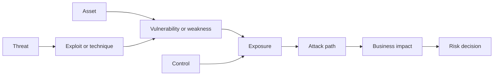
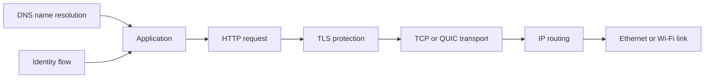
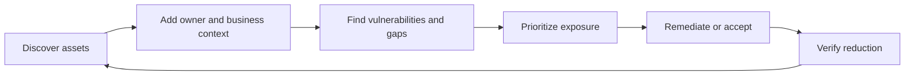
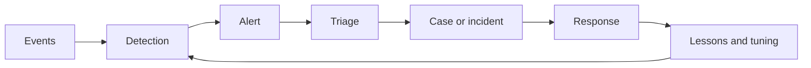
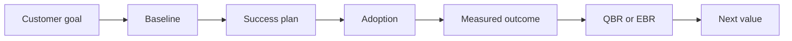
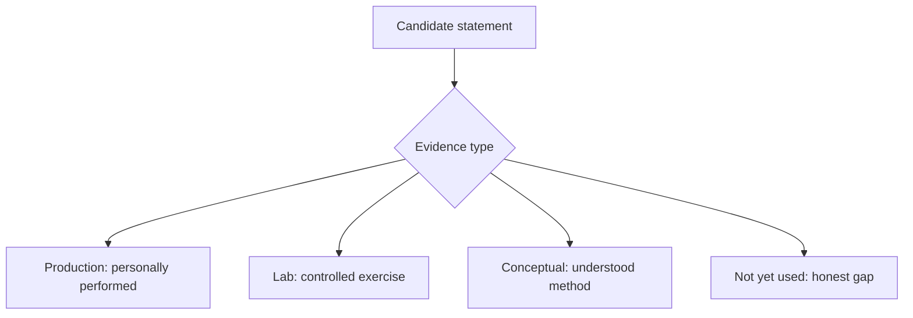
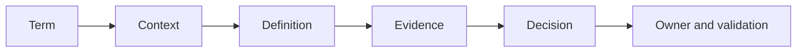

# Appendix A - Glossary and Acronym Dictionary

> **Purpose:** Provide a beginner-friendly, interview-ready dictionary for the full 120-Part curriculum, from cybersecurity and networking through Zscaler, security data, exposure management, SecOps, analytics, and technical success.
>
> **Currency and source note:** This reference was compiled from the curriculum's standards-based concepts and public product context reviewed on **2026-08-24**. Official product names and high-level descriptions are labeled as public context; general practices are not product guarantees; Northstar Meridian Holdings (NMH) examples are synthetic; and Arti's production experience remains limited to her factual background. Product packaging, interfaces, fields, algorithms, limits, and terminology can change, so verify current official documentation and licensed tenant behavior.
>
> **Safety and honesty:** A definition explains a concept; it does not prove that a capability is licensed, configured, effective, or present in a customer environment. Never turn study, public documentation, or an NMH exercise into a production claim.

[Back to the master study guide](../Zscaler%20SecOps%20Technical%20Success%20Manager%20-%20Complete%20Study%20Guide.md) | [Next appendix: Ports, Protocols, Handshakes, and Troubleshooting Commands](Appendix-B-ports-protocols-commands.md)

## How to use this dictionary

Every glossary row has one unique term, an expansion where one is useful, a plain-English definition, an analogy or memory hook, why the term matters, and at least one link to the Part that teaches it in context. Read the linked Part when a short definition is not enough to support a customer decision.

| Reading rule | Practical meaning | Example |
|---|---|---|
| Expansion is `Not applicable` | The term is not an acronym | Asset |
| Context label appears in the term | The same letters have multiple meanings | CA as certificate authority versus conditional access |
| Public product context | Bounded description from public material, not an internal implementation claim | Data Fabric for Security |
| General practice | Common architecture or operating method whose implementation varies | Golden record |
| Synthetic template | A reusable NMH learning structure, not a vendor schema | Canonical finding |
| Cross-reference | A route to explanation, caveats, diagrams, and practice | Part 54 for mapping |

## Alphabetical navigation

[A](#a) [B](#b) [C](#c) [D](#d) [E](#e) [F](#f) [G](#g) [H](#h) [I](#i) [J](#j) [K](#k) [L](#l) [M](#m) [N](#n) [O](#o) [P](#p) [Q](#q) [R](#r) [S](#s) [T](#t) [U](#u) [V](#v) [W](#w) [X](#x) [Y](#y) [Z](#z)

## Concept maps

## Plain-English deep-dive 1 - Acronym collisions require context

An acronym is a shortcut, not a universal definition. `CA` can mean certificate authority in public key infrastructure or conditional access in identity policy. `IR` can mean incident response or information retrieval. Before answering, expand the letters, name the domain, and confirm the surrounding workflow. Think of the word `bank`: a riverbank and a financial bank share spelling but not meaning.

| Collision | Meaning 1 | Meaning 2 | Safe handling |
|---|---|---|---|
| CA | Certificate Authority | Conditional Access | Say `PKI CA` or `identity CA` |
| CI | Configuration Item | Confidence Interval | Name CMDB or statistics context |
| CSP | Cloud Service Provider | Content Security Policy | Name cloud or browser context |
| DLP | Data Loss Prevention | Data Leakage Prevention | Treat as closely related wording; verify organizational usage |
| IR | Incident Response | Information Retrieval | Name SecOps or search context |
| NAT | Network Address Translation | Network Access Translation in some informal speech | Prefer the standards-based network expansion |
| PEP | Policy Enforcement Point | Python Enhancement Proposal | Name zero trust or software context |
| SCD | Slowly Changing Dimension | System Center Configuration Manager-era shorthand in some teams | Name data-model context |
| SLA | Service Level Agreement | Service Level Objective used incorrectly as a synonym | State contract versus internal target |
| TTP | Tactics, Techniques, and Procedures | Time to Patch in some dashboards | Expand before using a metric |

## A

| ID | Term or acronym | Expansion | Plain-English definition | Analogy or memory hook | Why it matters | Cross-reference |
|---|---|---|---|---|---|---|
| G001 | AAA | Authentication, Authorization, and Accounting | A framework for proving identity, deciding access, and recording activity. | Who are you, what may you do, what happened? | Separates three controls often blurred in troubleshooting. | [Part 23](Part-23-identity-protocols.md) |
| G002 | ABAC | Attribute-Based Access Control | Access decisions based on attributes such as role, device, resource, location, or risk. | A rule checks many labels on a pass. | Supports context-aware least privilege. | [Part 33](Part-33-zscaler-identity-context-policy.md) |
| G003 | Access control | Not applicable | A safeguard that permits or denies use of a resource under defined policy. | A guarded door with an approved guest list. | It turns identity and policy into enforced boundaries. | [Part 9](Part-09-defense-in-depth-least-privilege.md) |
| G004 | Access token | Not applicable | A credential representing delegated authorization to call a protected resource. | A time-limited service ticket. | Mishandled tokens can expose APIs and user data. | [Part 23](Part-23-identity-protocols.md) |
| G005 | Account | Not applicable | A digital identity record used by a person, service, device, or workload. | A named locker in a system. | Accounts connect identity, privileges, events, and risk. | [Part 14](Part-14-security-domains-and-controls.md) |
| G006 | Account team | Not applicable | Cross-functional group serving a customer, commonly including Sales, Success, Support, and specialists. | One crew around one customer plan. | Clear roles prevent conflicting promises and lost actions. | [Part 103](Part-103-cross-functional-account-team.md) |
| G007 | ACK | Acknowledgment | A TCP flag and number indicating the next byte expected from the peer. | A receipt for transport bytes. | It proves transport progress, not application success. | [Part 18](Part-18-tcp-udp-ports-sockets.md) |
| G008 | ACL | Access Control List | A list of subjects and allowed or denied operations on an object or network flow. | Names and permissions on a door list. | Misordered or stale rules can create outages or exposure. | [Part 9](Part-09-defense-in-depth-least-privilege.md) |
| G009 | Action | Not applicable | A controlled step taken after a trigger or decision, such as creating a ticket. | The move after the decision. | Actions need owners, authorization, audit, and validation. | [Part 65](Part-65-data-fabric-automated-workflows.md) |
| G010 | Active Directory | Not applicable | Microsoft's directory service for identities, computers, groups, and domain resources. | An enterprise identity phonebook plus rules. | It often supplies identity and authorization context. | [Part 23](Part-23-identity-protocols.md) |
| G011 | Active risk | Not applicable | Risk currently requiring treatment, monitoring, or an explicit decision. | An open item on the safety board. | It distinguishes live decisions from historical records. | [Part 13](Part-13-risk-assessment-treatment.md) |
| G012 | Adaptive access | Not applicable | Access that changes according to current identity, device, behavior, resource, or risk context. | A checkpoint that tightens when conditions change. | It supports right-sized controls instead of static trust. | [Part 33](Part-33-zscaler-identity-context-policy.md) |
| G013 | Address Resolution Protocol | ARP | The IPv4 local-link protocol that maps an IP address to a link-layer address. | Ask, who owns this local IP? | ARP failures block local delivery before routing. | [Part 17](Part-17-ethernet-ip-subnet-routing-nat.md) |
| G014 | Adversary | Not applicable | A person or group attempting to cause harm or gain unauthorized advantage. | The opposing player with a goal. | Threat modeling must consider capability, intent, and opportunity. | [Part 6](Part-06-cybersecurity-fundamentals.md) |
| G015 | AEM | Asset Exposure Management | Public Zscaler product context for connected asset visibility, exposure, and coverage-gap workflows. | Know assets, context, and weak coverage. | Use public descriptions without inventing fields or algorithms. | [Part 69](Part-69-cyber-assets-caasm-fundamentals.md) |
| G016 | Agent | Not applicable | Software that runs on a system to collect data, enforce policy, or perform an approved action. | A local representative on the device. | Agent health and version affect visibility and control. | [Part 51](Part-51-security-data-ingestion-connectors-formats.md) |
| G017 | Agentic AI | Not applicable | AI that can plan or perform multi-step work through tools under defined authority. | An assistant that can use approved instruments. | Security requires scoped permissions, validation, and human control. | [Part 98](Part-98-ai-agents-security-governance.md) |
| G018 | Agentic SecOps | Not applicable | Public Zscaler context for applying agentic workflows to security operations and connected context. | AI-assisted investigation with guardrails. | Product behavior and availability require current official validation. | [Part 96](Part-96-zscaler-agentic-secops.md) |
| G019 | Aggregate | Not applicable | A value calculated from multiple rows, such as a count, sum, or average. | Many receipts summarized into one total. | Correct grain and denominator make aggregates trustworthy. | [Part 46](Part-46-sql-fundamentals.md) |
| G020 | Alert | Not applicable | A signal raised when detection logic identifies activity needing review. | A smoke alarm, not proof of a fire. | Analysts must validate evidence, scope, and severity. | [Part 93](Part-93-alerts-to-threat-stories.md) |
| G021 | Alert fatigue | Not applicable | Reduced effectiveness caused by too many low-value or repetitive alerts. | Too many alarms make every alarm easier to ignore. | Tuning should improve decision value, not merely reduce counts. | [Part 99](Part-99-secops-metrics-continuous-improvement.md) |
| G022 | Alias | Not applicable | An alternative name for an entity, field, table, user, or host. | Another label on the same folder. | Aliases support matching but can also create false merges. | [Part 53](Part-53-entity-resolution-golden-records.md) |
| G023 | Allowlist | Not applicable | A list of explicitly permitted entities or operations. | The approved guest list. | Broad allowlists can bypass intended inspection and control. | [Part 37](Part-37-zscaler-tls-inspection.md) |
| G024 | Analysis | Not applicable | Structured examination of evidence to answer a bounded question. | Assemble clues against hypotheses. | Good analysis separates observation, inference, and conclusion. | [Part 27](Part-27-connectivity-troubleshooting-fault-isolation.md) |
| G025 | Analyst | Not applicable | A person who evaluates data, alerts, risk, or operations to support decisions. | The investigator at the evidence desk. | Role clarity affects triage, escalation, and handoff quality. | [Part 91](Part-91-soc-fundamentals-operating-model.md) |
| G026 | Anomaly | Not applicable | An observation that differs materially from an expected baseline. | A note outside the usual melody. | An anomaly is a lead, not automatic maliciousness. | [Part 49](Part-49-statistics-baselines-outliers.md) |
| G027 | ANSI SQL | American National Standards Institute Structured Query Language | Standardized SQL concepts shared across dialects, with implementation differences. | Common grammar with regional accents. | Dialect notes prevent copied queries from being assumed portable. | [Part 46](Part-46-sql-fundamentals.md) |
| G028 | API | Application Programming Interface | A defined contract by which software exchanges requests, responses, and data. | A service counter with a published menu. | APIs drive connectors, automation, and troubleshooting boundaries. | [Part 24](Part-24-rest-api-json-webhooks.md) |
| G029 | API key | Application Programming Interface key | A credential used to identify or authorize an API client. | A machine's entry badge. | It must be scoped, protected, rotated, and never placed in shared evidence. | [Part 24](Part-24-rest-api-json-webhooks.md) |
| G030 | Application | Not applicable | Software or a service that performs a business or technical function. | A destination where work gets done. | Applications connect users, data, dependencies, owners, and risk. | [Part 4](Part-04-enterprise-environment-stakeholders.md) |
| G031 | Application Connector | Not applicable | Public ZPA context for a component that provides outbound connectivity toward private applications. | A private-app side bridge that calls outward. | Exact deployment and health behavior require official guidance. | [Part 35](Part-35-zpa-fundamentals.md) |
| G032 | Application segment | Not applicable | A logical grouping of private applications used for access policy. | A labeled set of destinations. | Good segmentation limits access scope and blast radius. | [Part 35](Part-35-zpa-fundamentals.md) |
| G033 | Application visibility | Not applicable | Ability to identify applications, dependencies, usage, and relevant context. | A map of which services are actually used. | Visibility supports policy, troubleshooting, and exposure decisions. | [Part 38](Part-38-zdx-digital-experience.md) |
| G034 | ARP cache | Address Resolution Protocol cache | A host's temporary table of local IP-to-link-address mappings. | A recently used local delivery address book. | Stale or conflicting mappings can interrupt local traffic. | [Part 17](Part-17-ethernet-ip-subnet-routing-nat.md) |
| G035 | Asset | Not applicable | Anything valuable or relevant to security, such as a device, account, app, service, or data set. | Something the organization must know and protect. | Unknown ownership or lifecycle distorts security priority. | [Part 69](Part-69-cyber-assets-caasm-fundamentals.md) |
| G036 | Asset criticality | Not applicable | Governed rating of how important an asset is to business or safety outcomes. | Priority label on essential equipment. | It changes remediation priority but must have an owner and definition. | [Part 71](Part-71-asset-golden-records-relationships.md) |
| G037 | Asset inventory | Not applicable | A maintained record of assets, identifiers, context, lifecycle, and sources. | The enterprise equipment and service register. | Risk analysis cannot cover assets it does not know. | [Part 69](Part-69-cyber-assets-caasm-fundamentals.md) |
| G038 | Attack path | Not applicable | A sequence of weaknesses, relationships, and privileges an adversary could use toward impact. | Stepping stones to a valuable target. | Choke points may reduce more risk than isolated fixes. | [Part 7](Part-07-attack-surface-paths-kill-chain-mitre.md) |
| G039 | Attack surface | Not applicable | The set of reachable or usable entry points and interactions that could be abused. | All doors, windows, and service hatches. | Scope and exposure change over time. | [Part 7](Part-07-attack-surface-paths-kill-chain-mitre.md) |
| G040 | Authentication | Not applicable | The process of establishing that an identity claim is sufficiently trustworthy. | Prove who holds the badge. | Authentication precedes many access and audit decisions. | [Part 23](Part-23-identity-protocols.md) |

## B

| ID | Term or acronym | Expansion | Plain-English definition | Analogy or memory hook | Why it matters | Cross-reference |
|---|---|---|---|---|---|---|
| G041 | B2B | Business-to-Business | Access or services exchanged between organizations, partners, or suppliers. | A controlled door between companies. | Third-party identity, scope, and ownership require explicit governance. | [Part 40](Part-40-zscaler-cloud-branch-iot-b2b.md) |
| G042 | Backfill | Not applicable | Loading historical data that was previously missing or not processed. | Replacing missing pages in a ledger. | Backfills can change trends and duplicate records without idempotency. | [Part 50](Part-50-etl-elt-security-pipelines.md) |
| G043 | Backlog | Not applicable | Work items not yet completed, such as findings, tickets, or actions. | The queue waiting at a service desk. | Backlog needs grain, priority, owner, age, and capacity context. | [Part 83](Part-83-uvm-prioritization-backlogs.md) |
| G044 | Backoff | Not applicable | Increasing delay between retries after repeated failures or throttling. | Knock less often when the door stays closed. | It protects services and improves connector reliability. | [Part 60](Part-60-data-fabric-ingestion-reliability.md) |
| G045 | Baseline | Not applicable | A defined reference state or expected range used for comparison. | The normal line on a measuring chart. | Changes and anomalies need a trustworthy comparison point. | [Part 49](Part-49-statistics-baselines-outliers.md) |
| G046 | Bastion host | Not applicable | A hardened, controlled system used as an administrative access point. | A guarded entry room before sensitive areas. | It concentrates access and therefore needs strong controls and logging. | [Part 9](Part-09-defense-in-depth-least-privilege.md) |
| G047 | Batch processing | Not applicable | Processing collected records together on a schedule or trigger. | Sort a day's mail in one run. | Batch timing affects freshness, cost, and recovery. | [Part 50](Part-50-etl-elt-security-pipelines.md) |
| G048 | Bearer token | Not applicable | A token usable by whoever possesses it, unless additional protections apply. | A ticket accepted from the holder. | Exposure can allow impersonation until expiry or revocation. | [Part 23](Part-23-identity-protocols.md) |
| G049 | Behavioral analytics | Not applicable | Analysis of activity patterns to find meaningful deviation or risk. | Notice a routine suddenly changing. | Baselines and context are required to avoid noisy conclusions. | [Part 92](Part-92-siem-soar-xdr-edr-ndr.md) |
| G050 | Binary isolation | Not applicable | A troubleshooting method that divides a path or variable set to narrow the failure boundary. | Test the middle of a long cable first. | It reduces random testing and speeds ownership isolation. | [Part 27](Part-27-connectivity-troubleshooting-fault-isolation.md) |
| G051 | Blast radius | Not applicable | The people, systems, data, or processes potentially affected by a failure or attack. | How far damage can spread. | It guides severity, containment, and executive communication. | [Part 94](Part-94-threat-triage-investigation-response.md) |
| G052 | Blocklist | Not applicable | A list of explicitly denied entities or operations. | A do-not-admit list. | It is useful but cannot enumerate every future threat. | [Part 9](Part-09-defense-in-depth-least-privilege.md) |
| G053 | Board-ready | Not applicable | Concise, decision-oriented communication suitable for governance leaders. | The dashboard view, not the engine manual. | It must state impact, uncertainty, action, owner, and trend honestly. | [Part 107](Part-107-business-reviews-executive-narratives.md) |
| G054 | Boolean | Not applicable | A logical value or operation involving true and false, with SQL also using unknown. | A yes-or-no switch, sometimes unknown in SQL. | Boolean precedence and null behavior affect filters. | [Part 46](Part-46-sql-fundamentals.md) |
| G055 | Branch | Not applicable | A remote office or site connected to enterprise services and controls. | A smaller office connected to headquarters and cloud. | Branch paths, local breakout, and ownership shape security design. | [Part 40](Part-40-zscaler-cloud-branch-iot-b2b.md) |
| G056 | Break-glass account | Not applicable | A tightly governed emergency identity used when normal administration is unavailable. | The sealed emergency key. | It needs strong protection, monitoring, testing, and review. | [Part 23](Part-23-identity-protocols.md) |
| G057 | Bridge call | Not applicable | A coordinated live meeting used to manage a critical incident or escalation. | One control room for many workstreams. | Roles, cadence, evidence, and decisions prevent noise. | [Part 108](Part-108-critical-escalation-leadership.md) |
| G058 | Browser developer tools | Not applicable | Built-in browser tools for network, console, storage, performance, and page inspection. | A dashboard under the browser hood. | They reveal request timing and client-side failures with privacy caveats. | [Part 26](Part-26-procmon-har-fiddler.md) |
| G059 | Business context | Not applicable | Ownership, process, criticality, geography, customer, and impact information attached to technical entities. | The label explaining why equipment matters. | It turns technical observations into priorities. | [Part 55](Part-55-correlation-enrichment-security-graphs.md) |
| G060 | Business key | Not applicable | A stable domain identifier used to recognize the same member across versions or systems. | The member number, not the row number. | Poor keys cause duplicate, merge, and historical errors. | [Part 44](Part-44-relational-data-modeling.md) |

## C

| ID | Term or acronym | Expansion | Plain-English definition | Analogy or memory hook | Why it matters | Cross-reference |
|---|---|---|---|---|---|---|
| G061 | CA (identity) | Conditional Access | Identity policy that evaluates signals before allowing, blocking, or constraining access. | A checkpoint that checks current conditions. | Do not confuse it with certificate authority. | [Part 23](Part-23-identity-protocols.md) |
| G062 | CA (PKI) | Certificate Authority | A trusted issuer that signs digital certificates under defined policy. | A passport office for digital identities. | Trust depends on issuer, chain, policy, and private-key protection. | [Part 21](Part-21-tls-pki-certificates-inspection.md) |
| G063 | CAASM | Cyber Asset Attack Surface Management | A category that aggregates and reconciles asset and control data for visibility and action. | An asset census cross-checked across many registers. | It finds unknown assets and coverage gaps. | [Part 69](Part-69-cyber-assets-caasm-fundamentals.md) |
| G064 | Cache | Not applicable | Stored prior data used to answer future requests faster. | Keep a recently used answer nearby. | Stale caches can explain inconsistent DNS, web, or application behavior. | [Part 19](Part-19-dns-dhcp.md) |
| G065 | Callback URL | Not applicable | A registered destination to which an identity or application flow returns. | The approved return address. | Mismatch or tampering can break or redirect authentication. | [Part 23](Part-23-identity-protocols.md) |
| G066 | Canonical model | Not applicable | A shared, source-neutral representation used across integrations and analyses. | A common translation language. | It reduces pairwise mappings but needs governance and provenance. | [Part 54](Part-54-taxonomy-ontology-canonical-schema.md) |
| G067 | Cardinality | Not applicable | The permitted or observed number of relationships or distinct values. | How many links can each item have? | Wrong assumptions cause invalid models and query fanout. | [Part 44](Part-44-relational-data-modeling.md) |
| G068 | CASB | Cloud Access Security Broker | Security capabilities that provide visibility and policy control for cloud-service use and data. | A policy desk between users and cloud services. | Inline and API modes see and control different things. | [Part 39](Part-39-zscaler-data-security.md) |
| G069 | Case | Not applicable | A managed record that groups investigation evidence, decisions, owners, and actions. | A folder for one investigation. | A case is an operating container, not automatic proof of an incident. | [Part 91](Part-91-soc-fundamentals-operating-model.md) |
| G070 | Case management | Not applicable | The workflow for creating, assigning, investigating, documenting, and closing cases. | The investigation filing and handoff system. | It supports continuity, audit, and measurable operations. | [Part 91](Part-91-soc-fundamentals-operating-model.md) |
| G071 | CAST | Not applicable | An explicit conversion from one SQL data type to another. | Change the measuring cup before comparing. | Explicit types expose bad data and dialect assumptions. | [Part 46](Part-46-sql-fundamentals.md) |
| G072 | Catalog | Not applicable | An organized registry of data, assets, controls, sources, or metadata. | A searchable library index. | Catalogs improve discovery but require current ownership and definitions. | [Part 43](Part-43-security-data-literacy-lifecycle.md) |
| G073 | CBC | Cipher Block Chaining | A historical block-cipher mode used by some TLS cipher suites. | Each locked block depends on the previous block. | Legacy mode support and implementation weaknesses affect policy. | [Part 21](Part-21-tls-pki-certificates-inspection.md) |
| G074 | CDC | Change Data Capture | A method for capturing inserts, updates, and deletes since a prior point. | Record only ledger changes, not recopy every page. | It enables incremental pipelines but needs ordering and replay rules. | [Part 50](Part-50-etl-elt-security-pipelines.md) |
| G075 | CDN | Content Delivery Network | Distributed infrastructure that serves content closer to users and absorbs load. | Nearby warehouses for web content. | DNS, TLS, routing, and cache behavior can vary by location. | [Part 22](Part-22-proxies-firewalls-vpn-sse-sase.md) |
| G076 | Certificate | Not applicable | A signed data structure binding a public key to a named subject under issuer policy. | A signed digital identity card. | Validation requires chain, name, time, usage, and revocation context. | [Part 21](Part-21-tls-pki-certificates-inspection.md) |
| G077 | Certificate chain | Not applicable | Ordered certificates connecting an end entity through intermediates to a trusted root. | A chain of introductions to a trusted authority. | Missing or untrusted links cause TLS failures. | [Part 21](Part-21-tls-pki-certificates-inspection.md) |
| G078 | Certificate pinning | Not applicable | An application restriction that accepts only specific certificates or public keys. | Trust only this exact badge pattern. | It can conflict with authorized TLS inspection. | [Part 37](Part-37-zscaler-tls-inspection.md) |
| G079 | Certificate revocation | Not applicable | A mechanism for indicating that a certificate should no longer be trusted before expiry. | Cancel a badge before its printed date. | Checking behavior varies and affects security and availability. | [Part 21](Part-21-tls-pki-certificates-inspection.md) |
| G080 | Change control | Not applicable | A governed method to propose, assess, approve, implement, validate, and roll back change. | A flight plan for production change. | It balances urgency, risk, evidence, and accountability. | [Part 42](Part-42-zscaler-deployment-operations-troubleshooting.md) |
| G081 | Change window | Not applicable | Approved period during which a production change may occur. | Reserved time for safe maintenance. | Timing should consider impact, support, rollback, and observation. | [Part 42](Part-42-zscaler-deployment-operations-troubleshooting.md) |
| G082 | Checkpoint | Not applicable | Saved pipeline progress from which processing can resume. | A bookmark in a long import. | Bad checkpoints can lose or duplicate data. | [Part 60](Part-60-data-fabric-ingestion-reliability.md) |
| G083 | CIDR | Classless Inter-Domain Routing | Prefix notation for IP networks, such as `192.0.2.0/24`. | Address block plus mask length. | It defines subnet scope and route matching. | [Part 17](Part-17-ethernet-ip-subnet-routing-nat.md) |
| G084 | CI (CMDB) | Configuration Item | A managed component or service relationship recorded in configuration management. | One item in the service blueprint. | Do not confuse it with statistical confidence interval. | [Part 73](Part-73-cmdb-health-asset-lifecycle.md) |
| G085 | CI (statistics) | Confidence Interval | A range produced by a method intended to contain an unknown parameter at a stated confidence level over repeated samples. | Uncertainty bars around an estimate. | It prevents false precision in sampled analysis. | [Part 49](Part-49-statistics-baselines-outliers.md) |
| G086 | CIA triad | Confidentiality, Integrity, and Availability | Three foundational security objectives: prevent improper disclosure, change, and loss of access. | Secret, correct, and reachable. | It structures impact and control discussions. | [Part 6](Part-06-cybersecurity-fundamentals.md) |
| G087 | Cipher | Not applicable | An algorithm for encryption or decryption using a key. | A lock design operated with a key. | Strength depends on algorithm, key, mode, implementation, and use. | [Part 21](Part-21-tls-pki-certificates-inspection.md) |
| G088 | Cipher suite | Not applicable | A named combination of cryptographic algorithms negotiated for a TLS connection, especially in TLS 1.2. | The agreed security tool kit. | Compatibility and policy failures appear during negotiation. | [Part 21](Part-21-tls-pki-certificates-inspection.md) |
| G089 | CISA KEV | Cybersecurity and Infrastructure Security Agency Known Exploited Vulnerabilities Catalog | A public catalog of vulnerabilities with evidence of exploitation under its criteria. | A list of weaknesses known to be used. | It adds urgency context but not complete business priority. | [Part 78](Part-78-cve-cwe-cvss-epss-kev.md) |
| G090 | CIS Controls | Center for Internet Security Critical Security Controls | A prioritized set of cybersecurity safeguards and implementation guidance. | A practical security improvement checklist. | Framework mapping supports governance but does not prove effectiveness. | [Part 12](Part-12-security-frameworks-governance.md) |
| G091 | CISO | Chief Information Security Officer | Executive responsible for leading an organization's information-security program. | The executive owner of security direction. | Communication should connect evidence to business risk and decisions. | [Part 102](Part-102-stakeholder-executive-governance.md) |
| G092 | Client | Not applicable | A process or system that initiates a request to a service. | The customer at a service counter. | Client evidence shows one side of a distributed transaction. | [Part 20](Part-20-http-https-web-protocol.md) |
| G093 | Client Connector | Not applicable | Public Zscaler endpoint software context for traffic forwarding, identity, posture, and user experience. | The endpoint's route and policy companion. | Exact profiles, tunnels, and diagnostics require current documentation. | [Part 36](Part-36-client-connector-forwarding-posture.md) |
| G094 | Cloud | Not applicable | Shared or dedicated computing resources delivered through provider-operated infrastructure and services. | Rent adaptable computing instead of owning every machine. | Responsibility remains divided, not removed. | [Part 11](Part-11-security-architecture-shared-responsibility.md) |
| G095 | Cloud Service Edge | Not applicable | Public Zscaler context for distributed cloud locations that process or enforce traffic and policy. | A nearby cloud security checkpoint. | Selection, forwarding, and availability must be validated in the environment. | [Part 32](Part-32-zscaler-cloud-service-edges-traffic.md) |
| G096 | CMDB | Configuration Management Database | A system that records configuration items and their service relationships. | The service equipment and dependency register. | Stale records undermine ownership, impact, and workflow decisions. | [Part 73](Part-73-cmdb-health-asset-lifecycle.md) |
| G097 | CNAPP | Cloud-Native Application Protection Platform | A category combining security capabilities across cloud build, posture, workload, identity, and runtime. | Cloud security from blueprint to operation. | Category scope varies by vendor and use case. | [Part 118](Part-118-miscellaneous-deeper-topics.md) |
| G098 | Cohort | Not applicable | A group sharing a defined start, characteristic, or treatment for comparison over time. | Students who entered in the same class. | Cohorts prevent unlike populations from being compared casually. | [Part 49](Part-49-statistics-baselines-outliers.md) |
| G099 | Column | Not applicable | A named attribute in a relational table. | One labeled field on every form row. | Type, nullability, meaning, and lineage form its contract. | [Part 44](Part-44-relational-data-modeling.md) |
| G100 | Compensating control | Not applicable | An alternative safeguard used when the preferred control is unavailable or impractical. | A guarded detour around a broken gate. | It needs evidence, owner, duration, and effectiveness review. | [Part 9](Part-09-defense-in-depth-least-privilege.md) |
| G101 | Completeness | Not applicable | Degree to which required records or fields are present for the defined scope. | Are all expected boxes filled? | Missing data can look like low risk or low activity. | [Part 52](Part-52-data-quality-profiling-reconciliation.md) |
| G102 | Composite key | Not applicable | A key formed from more than one field. | Several coordinates identify one location. | It can represent natural grain when one field is insufficient. | [Part 44](Part-44-relational-data-modeling.md) |
| G103 | Confidence | Not applicable | Degree of support for a match, finding, inference, or conclusion under stated evidence. | How strong is the evidence bridge? | Confidence should not be confused with impact or severity. | [Part 93](Part-93-alerts-to-threat-stories.md) |
| G104 | Connector | Not applicable | A configured integration component that moves or exchanges data between systems. | A governed pipe with a contract. | Health depends on auth, schema, scope, latency, and ownership. | [Part 59](Part-59-data-fabric-source-connector-planning.md) |
| G105 | Containment | Not applicable | Actions that limit the spread or impact of an incident while preserving necessary operations and evidence. | Close selected doors around a fire. | Response must balance urgency, authority, safety, and rollback. | [Part 94](Part-94-threat-triage-investigation-response.md) |
| G106 | Context | Not applicable | Additional information that changes interpretation, such as owner, time, location, or business importance. | The label that makes a clue meaningful. | Context turns isolated signals into defensible decisions. | [Part 55](Part-55-correlation-enrichment-security-graphs.md) |
| G107 | Control | Not applicable | A safeguard designed to change likelihood, impact, detection, response, or recovery. | A barrier, alarm, or recovery plan. | Presence is not effectiveness; evidence and scope matter. | [Part 6](Part-06-cybersecurity-fundamentals.md) |
| G108 | Control plane | Not applicable | The functions that define policy, configuration, routing, or orchestration rather than carrying user data. | The traffic-control tower. | Control-plane health differs from data-plane reachability. | [Part 11](Part-11-security-architecture-shared-responsibility.md) |
| G109 | Correlation | Not applicable | Linking observations that share meaningful identity, time, behavior, or relationships. | Put related clues on one case board. | Weak correlation creates false stories; provenance must remain visible. | [Part 55](Part-55-correlation-enrichment-security-graphs.md) |
| G110 | CTEM | Continuous Threat Exposure Management | A recurring program of scoping, discovery, prioritization, validation, and mobilization. | Find, focus, prove, fix, repeat. | It organizes exposure reduction as a continuous operating cycle. | [Part 87](Part-87-ctem-from-zero.md) |

## D

| ID | Term or acronym | Expansion | Plain-English definition | Analogy or memory hook | Why it matters | Cross-reference |
|---|---|---|---|---|---|---|
| G111 | Dashboard | Not applicable | A visual surface showing governed measures, filters, trends, and drill paths. | An instrument panel for decisions. | Attractive charts are harmful when grain or denominator is unclear. | [Part 57](Part-57-dashboards-kpis-power-bi-excel.md) |
| G112 | Data classification | Not applicable | Labeling data by sensitivity, handling, and business requirements. | Colored handling labels on packages. | Classification drives access, sharing, retention, and protection. | [Part 56](Part-56-data-governance-privacy-rbac-retention.md) |
| G113 | Data contract | Not applicable | Agreed schema, semantics, quality, timing, ownership, and change expectations between producer and consumer. | A delivery agreement for data. | It prevents silent schema and meaning drift. | [Part 51](Part-51-security-data-ingestion-connectors-formats.md) |
| G114 | Data Fabric for Security | Not applicable | Public Zscaler context for ingesting, harmonizing, correlating, enriching, and operationalizing security data. | Woven security context across sources. | Do not infer undocumented schemas, engines, fields, or limits. | [Part 58](Part-58-data-fabric-architecture-value.md) |
| G115 | Data lineage | Not applicable | Recorded path from source through transformations to a consumed value. | A receipt trail for every data change. | It supports trust, debugging, audit, and correction. | [Part 43](Part-43-security-data-literacy-lifecycle.md) |
| G116 | Data loss | Not applicable | Unauthorized disclosure, destruction, corruption, or unavailability of data. | Information leaves, breaks, or disappears. | Controls differ according to the loss mode and business impact. | [Part 39](Part-39-zscaler-data-security.md) |
| G117 | Data minimization | Not applicable | Collecting, using, and retaining only data necessary for an approved purpose. | Carry only what the task requires. | It reduces privacy, security, and evidence-handling risk. | [Part 56](Part-56-data-governance-privacy-rbac-retention.md) |
| G118 | Data model | Not applicable | Structured representation of entities, attributes, relationships, events, and constraints. | A blueprint for meaning and storage. | Model choice controls valid questions and joins. | [Part 44](Part-44-relational-data-modeling.md) |
| G119 | Data plane | Not applicable | Functions that carry and process user or workload traffic under control-plane decisions. | The roads carrying vehicles. | A healthy policy service does not prove traffic can traverse. | [Part 32](Part-32-zscaler-cloud-service-edges-traffic.md) |
| G120 | Data quality | Not applicable | Fitness of data for a defined use across accuracy, completeness, validity, uniqueness, freshness, and consistency. | Is the measuring instrument fit for this decision? | Quality is use-specific, not a single universal score. | [Part 52](Part-52-data-quality-profiling-reconciliation.md) |
| G121 | Data residency | Not applicable | Requirements or constraints about geographic locations where data is stored or processed. | Keep specified records within approved borders. | Architecture must follow current legal and organizational guidance. | [Part 56](Part-56-data-governance-privacy-rbac-retention.md) |
| G122 | Data retention | Not applicable | Policy and implementation governing how long data is kept and when it is deleted. | A disposal date on a record box. | Over-retention increases risk; under-retention can remove needed evidence. | [Part 56](Part-56-data-governance-privacy-rbac-retention.md) |
| G123 | Data steward | Not applicable | Person accountable for the meaning, quality, and governed use of a data domain. | The librarian responsible for one collection. | Technical owners alone may not define business meaning. | [Part 54](Part-54-taxonomy-ontology-canonical-schema.md) |
| G124 | Data warehouse | Not applicable | A governed analytical store designed for integrated historical reporting and analysis. | A curated library for repeatable questions. | It differs from operational systems and raw data lakes. | [Part 67](Part-67-data-fabric-comparisons.md) |
| G125 | Database | Not applicable | Organized data managed by software for controlled storage, retrieval, and change. | A managed filing system with rules. | Database type and workload determine modeling and query choices. | [Part 44](Part-44-relational-data-modeling.md) |
| G126 | DDoS | Distributed Denial of Service | An attack that uses many sources to exhaust or disrupt a target's capacity. | A crowd blocking every entrance. | Availability controls need scale, filtering, and provider coordination. | [Part 6](Part-06-cybersecurity-fundamentals.md) |
| G127 | Decision record | Not applicable | Written statement of a decision, evidence, assumptions, alternatives, owner, and review trigger. | The signed reasoning page. | It prevents future confusion and preserves accountability. | [Part 103](Part-103-cross-functional-account-team.md) |
| G128 | Decryption | Not applicable | Converting protected ciphertext back into readable plaintext with authorized keys and method. | Open a locked message with the right key. | Authorization and sensitive-data handling are essential. | [Part 21](Part-21-tls-pki-certificates-inspection.md) |
| G129 | Deduplication | Not applicable | Identifying and managing multiple records that represent the same real-world item or event. | Remove duplicate contact cards without merging different people. | Errors can inflate risk or erase distinct assets. | [Part 53](Part-53-entity-resolution-golden-records.md) |
| G130 | Defense in depth | Not applicable | Layering different safeguards so one failure does not decide the outcome. | Several independent locks and alarms. | Layers should address distinct failure modes, not duplicate labels. | [Part 9](Part-09-defense-in-depth-least-privilege.md) |
| G131 | Denominator | Not applicable | The eligible population against which a rate or percentage is calculated. | The `out of how many` number. | Hidden denominator changes make metrics misleading. | [Part 57](Part-57-dashboards-kpis-power-bi-excel.md) |
| G132 | Dependency | Not applicable | A service, system, identity, route, or process required for another outcome. | A link in the delivery chain. | Unmapped dependencies cause blind spots and failed changes. | [Part 4](Part-04-enterprise-environment-stakeholders.md) |
| G133 | Detection | Not applicable | Logic or process that identifies activity matching suspicious or policy-relevant conditions. | A smoke sensor with defined sensitivity. | Quality requires coverage, testing, context, and feedback. | [Part 92](Part-92-siem-soar-xdr-edr-ndr.md) |
| G134 | Detection engineering | Not applicable | Designing, testing, deploying, measuring, and tuning security detections. | Build and maintain the alarm system. | It converts threat knowledge into operational signals. | [Part 91](Part-91-soc-fundamentals-operating-model.md) |
| G135 | DHCP | Dynamic Host Configuration Protocol | Protocol that supplies clients with IP configuration such as address, gateway, and DNS servers. | The network front desk assigns temporary room details. | Lease and option failures can look like broad connectivity problems. | [Part 19](Part-19-dns-dhcp.md) |
| G136 | Dimension | Not applicable | Descriptive analytical context used to filter and group facts. | Labels around a measured event. | Shared dimensions make measures comparable. | [Part 45](Part-45-analytical-security-data-models.md) |
| G137 | Directory | Not applicable | A structured service that stores identities, groups, devices, and related attributes. | An organization-wide identity registry. | Directory quality affects authentication, policy, and ownership. | [Part 23](Part-23-identity-protocols.md) |
| G138 | Discovery | Not applicable | Structured work to learn goals, environment, stakeholders, constraints, data, and current state. | Survey the site before designing. | Strong discovery prevents solving the wrong problem. | [Part 100](Part-100-enterprise-discovery-assessment.md) |
| G139 | DLP | Data Loss Prevention | Controls that identify sensitive data and prevent or govern risky use or movement. | A package inspector for information. | Classification, context, policy, and false-positive handling matter. | [Part 39](Part-39-zscaler-data-security.md) |
| G140 | DNS | Domain Name System | Distributed naming system that maps names to records such as IP addresses. | The internet's directory assistance. | Resolution path, cache, policy, and answer all affect connectivity. | [Part 19](Part-19-dns-dhcp.md) |
| G141 | DNSSEC | Domain Name System Security Extensions | Extensions that let resolvers validate signed DNS data authenticity and integrity. | Tamper-evident seals on directory answers. | It does not encrypt DNS or prove application safety. | [Part 19](Part-19-dns-dhcp.md) |
| G142 | Document model | Not applicable | A data model storing self-contained nested records, commonly as JSON documents. | One flexible case folder. | It preserves source shape but complicates cross-record consistency. | [Part 45](Part-45-analytical-security-data-models.md) |
| G143 | Domain | Not applicable | A bounded naming, administrative, business, or security area; context determines meaning. | A managed neighborhood with its own rules. | DNS, identity, and data domains are related but not identical. | [Part 14](Part-14-security-domains-and-controls.md) |
| G144 | DSPM | Data Security Posture Management | A category for discovering sensitive data and assessing its exposure and controls. | Find important data and check its doors. | Vendor scope and evidence depth vary. | [Part 118](Part-118-miscellaneous-deeper-topics.md) |
| G145 | Dwell time | Not applicable | Time an adversary or harmful condition remains present before detection or resolution, depending on definition. | How long the problem stays unnoticed or active. | Publish the exact start and stop events. | [Part 99](Part-99-secops-metrics-continuous-improvement.md) |

## Plain-English deep-dive 2 - A score is not a fact

A source can observe a fact such as `asset A had finding F at time T`. A model may then derive severity, exploitability, reachability, or a contextual priority. A score compresses selected evidence and assumptions into a decision aid. It does not become objective truth because it has decimals. Treat the source observations as ingredients, the scoring contract as a recipe, and the score as the resulting dish. Keep recipe version, missing-data behavior, owner, and intended decision visible.

## E

| ID | Term or acronym | Expansion | Plain-English definition | Analogy or memory hook | Why it matters | Cross-reference |
|---|---|---|---|---|---|---|
| G146 | EBR | Executive Business Review | Strategic meeting focused on outcomes, risks, decisions, and next value. | A steering meeting, not a product tour. | It should connect evidence to executive action. | [Part 107](Part-107-business-reviews-executive-narratives.md) |
| G147 | ECDHE | Elliptic Curve Diffie-Hellman Ephemeral | A key-agreement method using temporary elliptic-curve keys. | Agree on a temporary secret without sending it directly. | It supports forward secrecy in modern TLS configurations. | [Part 21](Part-21-tls-pki-certificates-inspection.md) |
| G148 | Edge | Not applicable | A processing or enforcement location near users, devices, networks, or services. | A checkpoint closer to the traveler. | The word is architectural; exact product placement must be validated. | [Part 32](Part-32-zscaler-cloud-service-edges-traffic.md) |
| G149 | EDR | Endpoint Detection and Response | Technology that observes endpoints and supports detection, investigation, and response. | A recorder and guard on the device. | Coverage and action authority must be understood. | [Part 92](Part-92-siem-soar-xdr-edr-ndr.md) |
| G150 | Effective date | Not applicable | Date or timestamp from which a definition, record version, policy, or mapping applies. | The moment a new rulebook starts. | Time-aware data needs valid intervals to avoid rewriting history. | [Part 54](Part-54-taxonomy-ontology-canonical-schema.md) |
| G151 | Egress | Not applicable | Traffic leaving a network, workload, or controlled boundary. | Vehicles exiting a facility. | Egress policy and visibility help limit unwanted destinations and data loss. | [Part 11](Part-11-security-architecture-shared-responsibility.md) |
| G152 | ELT | Extract, Load, Transform | Pipeline pattern that loads source data before transforming it in the target platform. | Deliver ingredients, then prepare them in the kitchen. | It preserves source data but shifts governance and compute choices. | [Part 50](Part-50-etl-elt-security-pipelines.md) |
| G153 | Encryption | Not applicable | Transforming plaintext into ciphertext so unauthorized readers cannot understand it. | Lock a message with a key. | Encryption does not alone provide identity, integrity, or safe endpoints. | [Part 21](Part-21-tls-pki-certificates-inspection.md) |
| G154 | Endpoint | Not applicable | A user or workload device that communicates and runs software, such as a laptop or server. | A working desk at the network's edge. | Endpoint identity, posture, process, and controls shape risk. | [Part 14](Part-14-security-domains-and-controls.md) |
| G155 | Enrichment | Not applicable | Adding useful context to an observation or entity from other governed sources. | Add owner and location to an unlabeled device card. | Enrichment improves decisions but can propagate stale or wrong data. | [Part 55](Part-55-correlation-enrichment-security-graphs.md) |
| G156 | Entity | Not applicable | A distinct thing represented in data, such as a user, asset, app, or incident. | A noun with a stable identity. | Entity identity anchors relationships and deduplication. | [Part 44](Part-44-relational-data-modeling.md) |
| G157 | Entity resolution | Not applicable | Determining which records refer to the same real-world entity. | Match several contact cards to one person. | Match evidence, confidence, and merge/split controls are essential. | [Part 53](Part-53-entity-resolution-golden-records.md) |
| G158 | Enum | Enumeration | A controlled set of named values allowed for a field. | A governed dropdown list. | Unknown and deprecated values need explicit handling. | [Part 54](Part-54-taxonomy-ontology-canonical-schema.md) |
| G159 | Ephemeral asset | Not applicable | A short-lived resource such as an autoscaled cloud instance or container. | Equipment assembled for one shift. | Periodic inventories can miss its entire lifetime. | [Part 69](Part-69-cyber-assets-caasm-fundamentals.md) |
| G160 | Ephemeral port | Not applicable | Temporary local transport port selected for an outgoing communication. | A temporary extension for one call. | Port ranges and NAT state affect flow attribution. | [Part 18](Part-18-tcp-udp-ports-sockets.md) |
| G161 | EPSS | Exploit Prediction Scoring System | Public model estimating probability of exploitation in the wild over a defined future window. | A weather forecast for exploitation, not impact. | It adds likelihood context but needs current version and business factors. | [Part 78](Part-78-cve-cwe-cvss-epss-kev.md) |
| G162 | Eradication | Not applicable | Removing the cause or persistence of an incident after containment. | Remove the fire source after closing the room. | Recovery without eradication can allow recurrence. | [Part 15](Part-15-incident-response-evidence-rca.md) |
| G163 | Error budget | Not applicable | Allowed amount of unreliability under a service objective for a period. | A limited allowance for missed performance. | It supports tradeoffs between reliability and change velocity. | [Part 99](Part-99-secops-metrics-continuous-improvement.md) |
| G164 | ETL | Extract, Transform, Load | Pipeline pattern that extracts data, transforms it, then loads the target. | Move, clean, and place. | Transformation before load can enforce target contracts early. | [Part 50](Part-50-etl-elt-security-pipelines.md) |
| G165 | ETL (Windows file) | Event Trace Log | Windows file format that stores Event Tracing for Windows records. | A Windows diagnostic event container. | Context distinguishes it from Extract, Transform, Load. | [Part 25](Part-25-wireshark-netsh-network-monitor.md) |
| G166 | ETW | Event Tracing for Windows | Windows framework in which providers emit structured events to trace sessions. | Windows diagnostic plumbing. | Provider, session, clock, and schema define what evidence means. | [Part 25](Part-25-wireshark-netsh-network-monitor.md) |
| G167 | Event | Not applicable | A time-stamped record that something occurred or was observed. | One dated line in a diary. | Event grain, actor, target, result, source, and time need definition. | [Part 43](Part-43-security-data-literacy-lifecycle.md) |
| G168 | Event envelope | Not applicable | Common metadata around event-specific details, including ID, type, time, source, and version. | The addressed package around varied contents. | It supports routing, replay, correlation, and evolution. | [Part 45](Part-45-analytical-security-data-models.md) |
| G169 | Evidence | Not applicable | Information that supports or challenges a claim under known collection conditions. | A documented clue, not a conclusion. | Evidence needs provenance, scope, time, integrity, and limitations. | [Part 15](Part-15-incident-response-evidence-rca.md) |
| G170 | Evidence integrity | Not applicable | Assurance that evidence remains complete and unaltered from its documented state. | A sealed, logged evidence bag. | Hashes and custody records support trust but not interpretation. | [Part 25](Part-25-wireshark-netsh-network-monitor.md) |
| G171 | Exception | Not applicable | Approved, time-bounded deviation from a policy, control, or SLA with recorded risk. | A signed temporary detour. | It needs owner, rationale, compensating controls, expiry, and review. | [Part 84](Part-84-uvm-workflows-ticketing-slas.md) |
| G172 | Executive narrative | Not applicable | A concise story connecting current state, business impact, evidence, decisions, and next outcomes. | The route from signal to decision. | It avoids both technical dumping and unsupported certainty. | [Part 107](Part-107-business-reviews-executive-narratives.md) |
| G173 | Exploit | Not applicable | Code or technique that takes advantage of a weakness to produce an unintended outcome. | A method that uses a faulty lock. | Exploit availability is one priority factor, not the whole risk. | [Part 78](Part-78-cve-cwe-cvss-epss-kev.md) |
| G174 | Exploitability | Not applicable | Degree to which a weakness can be used under stated conditions. | How usable the faulty lock is. | Reachability, prerequisites, controls, and evidence affect it. | [Part 82](Part-82-uvm-contextual-risk-scoring.md) |
| G175 | Exposure | Not applicable | A condition that leaves an asset, identity, application, or data open to potential harm. | An unlocked route to something valuable. | Exposure connects weakness, reachability, context, and controls. | [Part 8](Part-08-security-term-distinctions.md) |
| G176 | Exposure management | Not applicable | Continuous practice of understanding, prioritizing, validating, and reducing exploitable conditions. | Manage paths to harm, not just flaw lists. | It broadens prioritization beyond vulnerability severity. | [Part 87](Part-87-ctem-from-zero.md) |
| G177 | External attack surface | Not applicable | Assets and services observable or reachable from defined external vantage points. | The doors visible from the street. | Observation scope and validation method must be stated. | [Part 7](Part-07-attack-surface-paths-kill-chain-mitre.md) |
| G178 | External key | Not applicable | Identifier assigned by another system and retained for correlation. | The other system's case number. | Namespaces prevent collisions among sources. | [Part 44](Part-44-relational-data-modeling.md) |
| G179 | External table | Not applicable | Queryable table whose data resides outside the database or is accessed through a connector. | A catalog entry pointing to another warehouse. | Performance, consistency, and authorization differ by platform. | [Part 67](Part-67-data-fabric-comparisons.md) |
| G180 | Extranet | Not applicable | Controlled network or application access extended to external partners. | A private partner lobby. | Modern zero trust alternatives can reduce broad network exposure. | [Part 40](Part-40-zscaler-cloud-branch-iot-b2b.md) |

## F

| ID | Term or acronym | Expansion | Plain-English definition | Analogy or memory hook | Why it matters | Cross-reference |
|---|---|---|---|---|---|---|
| G181 | Fact | Not applicable | An observation at a declared analytical grain, often linked to descriptive dimensions. | The measured event at the center. | Without grain, aggregation and joins become unsafe. | [Part 45](Part-45-analytical-security-data-models.md) |
| G182 | Factless fact | Not applicable | A fact table containing keys but no stored numeric measure, representing occurrence or coverage. | Count the recorded relationship itself. | It supports asset-source or expected-control coverage analysis. | [Part 45](Part-45-analytical-security-data-models.md) |
| G183 | Fail closed | Not applicable | Deny or stop when a required security decision cannot be made. | Keep the door shut when the guard system fails. | It favors security but can reduce availability. | [Part 9](Part-09-defense-in-depth-least-privilege.md) |
| G184 | Fail open | Not applicable | Permit or continue when a required security component fails. | Leave the door open if the guard system breaks. | It favors availability but increases exposure. | [Part 9](Part-09-defense-in-depth-least-privilege.md) |
| G185 | Failover | Not applicable | Moving service or traffic to an alternate component or path after failure. | Use the backup road. | Successful failover requires health detection, state, and testing. | [Part 32](Part-32-zscaler-cloud-service-edges-traffic.md) |
| G186 | False merge | Not applicable | Entity-resolution error that combines records from different real entities. | Two people get one identity folder. | It corrupts ownership, risk, and action. | [Part 53](Part-53-entity-resolution-golden-records.md) |
| G187 | False negative | Not applicable | A harmful or relevant condition that a test or control fails to identify. | The alarm stays silent during smoke. | Measuring only alerts cannot reveal all misses. | [Part 79](Part-79-vulnerability-discovery-scanners.md) |
| G188 | False positive | Not applicable | A benign or irrelevant condition incorrectly identified as harmful or relevant. | The alarm rings for burnt toast. | Excess false positives waste capacity and reduce trust. | [Part 79](Part-79-vulnerability-discovery-scanners.md) |
| G189 | False split | Not applicable | Entity-resolution error that keeps one real entity as several records. | One person gets several identity folders. | It inflates asset and finding counts. | [Part 53](Part-53-entity-resolution-golden-records.md) |
| G190 | Fanout | Not applicable | Multiplication of rows caused by joining one row to multiple matching rows. | One receipt copied for every tag. | It can silently inflate counts and sums. | [Part 47](Part-47-sql-joins-ctes-window-functions.md) |
| G191 | Federation | Not applicable | Trust arrangement allowing one identity system to authenticate users for another service. | One organization accepts another's badge office. | Claims, audience, signing, time, and trust configuration matter. | [Part 23](Part-23-identity-protocols.md) |
| G192 | Fiddler | Not applicable | A web-debugging proxy used to inspect authorized HTTP and HTTPS client traffic. | A controlled mailroom recording web exchanges. | Decryption captures sensitive data and needs approval and redaction. | [Part 26](Part-26-procmon-har-fiddler.md) |
| G193 | Field | Not applicable | A named data element within a record or message. | One box on a form. | Meaning includes type, unit, null behavior, source, and time. | [Part 54](Part-54-taxonomy-ontology-canonical-schema.md) |
| G194 | Finding | Not applicable | A recorded observation of a potential weakness, gap, or policy issue from a source. | An inspector's noted issue. | A finding is not automatically a verified exposure or incident. | [Part 8](Part-08-security-term-distinctions.md) |
| G195 | FIN | Finish | TCP flag indicating a sender has no more bytes to send in that direction. | One speaker says, I am done talking. | TCP closes each direction independently. | [Part 18](Part-18-tcp-udp-ports-sockets.md) |
| G196 | Firewall | Not applicable | A control that permits, denies, or inspects traffic according to policy and observed attributes. | A network checkpoint. | Rule, direction, state, identity, and layer determine behavior. | [Part 22](Part-22-proxies-firewalls-vpn-sse-sase.md) |
| G197 | First observed | Not applicable | Earliest governed timestamp at which a source or model recorded an entity or condition. | First dated sighting in the ledger. | It is not necessarily when the condition began. | [Part 48](Part-48-security-analytics-query-patterns.md) |
| G198 | Five-tuple | Not applicable | Protocol, source IP, source port, destination IP, and destination port identifying a flow context. | Five coordinates for one network conversation. | NAT and proxies can create different tuples on each leg. | [Part 18](Part-18-tcp-udp-ports-sockets.md) |
| G199 | Foreign key | Not applicable | A relational field constrained to reference a key in another table. | A form's valid pointer to another register. | It protects referential integrity where enforced. | [Part 44](Part-44-relational-data-modeling.md) |
| G200 | Forensics | Not applicable | Disciplined collection and analysis of evidence to reconstruct events under legal and organizational requirements. | Rebuild the timeline from preserved traces. | Scope, integrity, authority, and expertise matter. | [Part 15](Part-15-incident-response-evidence-rca.md) |
| G201 | Forward proxy | Not applicable | Intermediary that acts on behalf of clients toward destinations. | A mailroom sending staff packages outward. | It creates separate client-proxy and proxy-destination legs. | [Part 22](Part-22-proxies-firewalls-vpn-sse-sase.md) |
| G202 | Forward secrecy | Not applicable | Property where compromise of a long-term key does not reveal past session keys. | Today's master key cannot reopen yesterday's temporary locks. | Ephemeral key exchange supports this protection. | [Part 21](Part-21-tls-pki-certificates-inspection.md) |
| G203 | FQDN | Fully Qualified Domain Name | Complete DNS name identifying a host or service within the DNS hierarchy. | Full postal address for a named service. | Policy and certificates often depend on exact names. | [Part 19](Part-19-dns-dhcp.md) |
| G204 | Frame | Not applicable | Link-layer unit carrying network-layer data over a local medium. | The local delivery envelope. | MAC addressing and capture point apply at this layer. | [Part 16](Part-16-osi-tcp-ip-models.md) |
| G205 | Framework | Not applicable | Organized set of concepts, outcomes, or controls used to structure a program. | A building frame, not the finished building. | Adoption and evidence determine value, not framework naming alone. | [Part 12](Part-12-security-frameworks-governance.md) |
| G206 | Freshness | Not applicable | How current data is relative to its source event and intended use. | How old is the last delivery? | Stale data can make a clean dashboard dangerously wrong. | [Part 52](Part-52-data-quality-profiling-reconciliation.md) |
| G207 | Full load | Not applicable | Pipeline run that reads the complete defined source scope. | Recopy the entire ledger. | It is simple but can be costly and duplicate data. | [Part 60](Part-60-data-fabric-ingestion-reliability.md) |
| G208 | Function | Not applicable | Named SQL or software operation that returns a result from inputs. | A reusable calculation machine. | Dialect, null, type, and determinism behavior must be known. | [Part 46](Part-46-sql-fundamentals.md) |
| G209 | Funnel | Not applicable | Stage-based view showing how items progress or drop between steps. | Items moving through narrowing gates. | Consistent stage definitions prevent misleading conversion claims. | [Part 106](Part-106-customer-health-adoption-value.md) |
| G210 | Fuzzing | Not applicable | Testing by supplying varied or malformed inputs to reveal weaknesses or failures. | Shake the input box in many controlled ways. | Use only in authorized, controlled environments. | [Part 111](Part-111-safe-lab-evidence-honesty.md) |

## G

| ID | Term or acronym | Expansion | Plain-English definition | Analogy or memory hook | Why it matters | Cross-reference |
|---|---|---|---|---|---|---|
| G211 | Gateway | Not applicable | A device or service that forwards traffic between networks or protocol contexts. | The exit door to another neighborhood. | Wrong gateway or policy prevents routed delivery. | [Part 17](Part-17-ethernet-ip-subnet-routing-nat.md) |
| G212 | General practice | Not applicable | Common industry method whose implementation and suitability vary by environment. | A usual recipe, not a vendor guarantee. | It keeps educational guidance separate from product facts. | [Part 111](Part-111-safe-lab-evidence-honesty.md) |
| G213 | Golden record | Not applicable | Governed best available representation of an entity assembled from sources and survivorship rules. | The trusted contact card with receipts attached. | It is a managed conclusion, not infallible truth. | [Part 53](Part-53-entity-resolution-golden-records.md) |
| G214 | Governance | Not applicable | Decision rights, policies, roles, evidence, and review that direct accountable operation. | The rules and owners around the work. | Technology without governance produces unmanaged risk. | [Part 12](Part-12-security-frameworks-governance.md) |
| G215 | Grain | Not applicable | Exact statement of what one row represents. | One sentence defining one record. | Grain controls keys, joins, measures, and deduplication. | [Part 45](Part-45-analytical-security-data-models.md) |
| G216 | Graph | Not applicable | Model of entities as nodes and relationships as edges. | Dots connected by labeled arrows. | It helps with paths, dependencies, and blast radius. | [Part 55](Part-55-correlation-enrichment-security-graphs.md) |
| G217 | Ground truth | Not applicable | Best independently validated reference used to evaluate a model or observation. | The answer key built from trusted checking. | Security truth may be incomplete, delayed, or contested. | [Part 49](Part-49-statistics-baselines-outliers.md) |
| G218 | Grounding | Not applicable | Supplying an AI system with approved evidence or context for a task. | Give the assistant the right case file. | Grounding reduces but does not eliminate unsupported output. | [Part 98](Part-98-ai-agents-security-governance.md) |
| G219 | Group | Not applicable | Set of users, assets, findings, or rows treated together under a definition. | A labeled basket. | Group logic changes policy, reports, and ownership. | [Part 64](Part-64-data-fabric-business-logic-scoring.md) |
| G220 | GROUP BY | Not applicable | SQL clause that forms groups sharing selected expression values. | Put matching items into baskets before counting. | Every selected nonaggregate expression must follow dialect rules. | [Part 46](Part-46-sql-fundamentals.md) |
| G221 | Grouping set | Not applicable | SQL feature that computes several grouping combinations in one query. | Produce several basket summaries in one pass. | Useful for subtotals but requires clear output labels. | [Part 47](Part-47-sql-joins-ctes-window-functions.md) |
| G222 | Guardrail | Not applicable | Constraint or control that keeps actions within approved boundaries. | Rails that keep a vehicle on the road. | AI and automation need authority, scope, review, and rollback guardrails. | [Part 98](Part-98-ai-agents-security-governance.md) |
| G223 | Guided mitigation | Not applicable | Recommendations that connect evidence or factors to possible risk-reduction actions. | A map suggesting routes, not driving for you. | Owners must validate fit, side effects, and effectiveness. | [Part 90](Part-90-risk360-quantification-reporting.md) |
| G224 | GUID | Globally Unique Identifier | Large identifier designed to have negligible collision probability across systems. | A very unlikely-to-repeat serial number. | Uniqueness does not provide business meaning or source authority. | [Part 44](Part-44-relational-data-modeling.md) |
| G225 | GRC | Governance, Risk, and Compliance | Discipline and tooling that connects objectives, risks, controls, obligations, evidence, and oversight. | The rule, risk, and proof office. | Compliance evidence does not automatically prove security effectiveness. | [Part 12](Part-12-security-frameworks-governance.md) |

## H

| ID | Term or acronym | Expansion | Plain-English definition | Analogy or memory hook | Why it matters | Cross-reference |
|---|---|---|---|---|---|---|
| G226 | Hallucination | Not applicable | AI output that is unsupported, fabricated, or incorrectly inferred despite sounding plausible. | A confident answer without a receipt. | High-impact recommendations require evidence and human validation. | [Part 98](Part-98-ai-agents-security-governance.md) |
| G227 | Handshake | Not applicable | Initial exchange used to establish state, negotiate parameters, or authenticate peers. | Agree on language and rules before talking. | TCP, TLS, and identity handshakes fail at different boundaries. | [Part 27](Part-27-connectivity-troubleshooting-fault-isolation.md) |
| G228 | Handoff | Not applicable | Transfer of work, context, evidence, and ownership to another person or team. | Pass the baton with the route map. | A message sent is not an accepted handoff. | [Part 103](Part-103-cross-functional-account-team.md) |
| G229 | HAR | HTTP Archive | JSON-based browser export of web requests, responses, timing, and related metadata. | A browser's web trip ledger. | It can contain tokens, cookies, URLs, and personal data. | [Part 26](Part-26-procmon-har-fiddler.md) |
| G230 | Harm | Not applicable | Adverse effect on people, operations, finances, data, reputation, safety, or obligations. | The consequence security seeks to avoid. | Risk statements should name credible harm, not only technical flaws. | [Part 13](Part-13-risk-assessment-treatment.md) |
| G231 | Harmonization | Not applicable | Aligning source data to shared types, formats, units, and meanings while preserving lineage. | Translate measurements into a common language. | Superficial renaming can create false equivalence. | [Part 61](Part-61-data-fabric-harmonization-mapping.md) |
| G232 | Hash | Not applicable | Fixed-length value computed from data, commonly used for integrity checks or matching. | A data fingerprint. | A matching hash supports sameness under the algorithm, not trustworthiness. | [Part 15](Part-15-incident-response-evidence-rca.md) |
| G233 | HAVING | Not applicable | SQL clause filtering groups after aggregation. | Remove baskets after counting their contents. | It differs from `WHERE`, which filters input rows. | [Part 46](Part-46-sql-fundamentals.md) |
| G234 | Header | Not applicable | Protocol metadata describing how to process a message, packet, or request. | Instructions written on an envelope. | Field meaning depends on protocol layer and direction. | [Part 20](Part-20-http-https-web-protocol.md) |
| G235 | Health check | Not applicable | Bounded test or measure of a component's current ability to perform a defined function. | A vital-sign reading, not a full diagnosis. | A green check can miss end-to-end user failure. | [Part 42](Part-42-zscaler-deployment-operations-troubleshooting.md) |
| G236 | Health score | Not applicable | Composite model summarizing selected customer, service, adoption, or risk signals. | A dashboard gauge built from several sensors. | Publish factors, weights, freshness, missingness, and actions. | [Part 106](Part-106-customer-health-adoption-value.md) |
| G237 | Heartbeat | Not applicable | Periodic signal indicating that a component or connection is alive at a basic level. | A regular `still here` pulse. | It does not prove full business function or fresh data. | [Part 60](Part-60-data-fabric-ingestion-reliability.md) |
| G238 | HMAC | Hash-Based Message Authentication Code | Keyed cryptographic construction used to verify message integrity and authenticity. | A fingerprint only authorized parties can produce. | Key management and canonical message construction matter. | [Part 24](Part-24-rest-api-json-webhooks.md) |
| G239 | Hop | Not applicable | One router or network transition along a path. | One stop on a route. | Path observations vary by protocol, policy, and return route. | [Part 17](Part-17-ethernet-ip-subnet-routing-nat.md) |
| G240 | Host | Not applicable | A networked computing system identified in a specific context. | One addressable machine. | Host, asset, endpoint, and workload overlap but are not synonyms. | [Part 69](Part-69-cyber-assets-caasm-fundamentals.md) |
| G241 | HTTP | Hypertext Transfer Protocol | Application protocol using requests, responses, methods, headers, status codes, and message bodies. | A structured web conversation. | TCP success does not prove HTTP success. | [Part 20](Part-20-http-https-web-protocol.md) |
| G242 | HTTP/2 | Hypertext Transfer Protocol version 2 | HTTP version using binary framing and multiplexed streams over one connection. | Many organized conversations on one channel. | Stream-level behavior differs from HTTP/1.1. | [Part 20](Part-20-http-https-web-protocol.md) |
| G243 | HTTP/3 | Hypertext Transfer Protocol version 3 | HTTP carried over QUIC, commonly using UDP and integrated TLS. | Web requests on a modern multi-lane secure transport. | Blocking UDP can cause fallback or failure depending on clients. | [Part 20](Part-20-http-https-web-protocol.md) |
| G244 | HTTPS | Hypertext Transfer Protocol Secure | HTTP protected by TLS between defined connection endpoints. | A web conversation in a protected tunnel. | Proxies and inspection can create separate TLS legs. | [Part 20](Part-20-http-https-web-protocol.md) |
| G245 | Human in the loop | Not applicable | Required human review or approval within an automated or AI-assisted workflow. | A responsible operator holds the final switch. | Review must have evidence, authority, time, and a real ability to stop. | [Part 98](Part-98-ai-agents-security-governance.md) |

## I

| ID | Term or acronym | Expansion | Plain-English definition | Analogy or memory hook | Why it matters | Cross-reference |
|---|---|---|---|---|---|---|
| G246 | IaaS | Infrastructure as a Service | Cloud model providing virtualized compute, storage, and networking while customers manage higher layers. | Rent the building shell and furnish it. | Shared-responsibility boundaries differ from SaaS and PaaS. | [Part 11](Part-11-security-architecture-shared-responsibility.md) |
| G247 | IAM | Identity and Access Management | People, processes, and technology governing identities and access. | Who exists, and what may each identity do? | IAM is central to zero trust and audit. | [Part 23](Part-23-identity-protocols.md) |
| G248 | ICMP | Internet Control Message Protocol | Network-layer control protocol used for errors and diagnostic messages. | Road signs and delivery notices for IP. | Filtering all ICMP can break diagnostics or path MTU discovery. | [Part 17](Part-17-ethernet-ip-subnet-routing-nat.md) |
| G249 | Idempotency | Not applicable | Property that repeating the same operation has the intended single logical effect. | Pressing the elevator button twice does not summon two elevators. | It prevents duplicate tickets, loads, and actions during retries. | [Part 65](Part-65-data-fabric-automated-workflows.md) |
| G250 | IdP | Identity Provider | System that authenticates identities and issues assertions or tokens to relying services. | The trusted badge office. | Signing, claims, audience, time, and availability affect access. | [Part 23](Part-23-identity-protocols.md) |
| G251 | Identity | Not applicable | Digital representation of a person, service, device, or workload with governed identifiers and attributes. | A record answering who or what. | Identity quality affects access, correlation, and accountability. | [Part 23](Part-23-identity-protocols.md) |
| G252 | Identity graph | Not applicable | Relationships among people, accounts, groups, roles, devices, and resources. | A map of who connects to what. | It supports blast-radius and privilege reasoning. | [Part 55](Part-55-correlation-enrichment-security-graphs.md) |
| G253 | Identity lifecycle | Not applicable | Creation, change, review, suspension, and retirement of identities and access. | Join, move, review, and leave. | Orphaned or overprivileged accounts create exposure. | [Part 23](Part-23-identity-protocols.md) |
| G254 | IDS | Intrusion Detection System | Technology that identifies suspicious network or host activity and raises signals. | An alarm that watches for intrusion. | Detection alone does not block or prove an incident. | [Part 14](Part-14-security-domains-and-controls.md) |
| G255 | Impact | Not applicable | Consequence if a threat or failure affects an asset or objective. | What happens if the door is used? | Risk needs impact tied to business context. | [Part 13](Part-13-risk-assessment-treatment.md) |
| G256 | Incident | Not applicable | Security event or series of events that requires coordinated response under defined criteria. | A confirmed or sufficiently credible fire response. | Not every alert or finding is an incident. | [Part 15](Part-15-incident-response-evidence-rca.md) |
| G257 | Incident response | Not applicable | Preparation, detection, analysis, containment, eradication, recovery, and learning around incidents. | The complete emergency-management cycle. | Roles, evidence, authority, and communication determine quality. | [Part 15](Part-15-incident-response-evidence-rca.md) |
| G258 | Incremental load | Not applicable | Pipeline run that processes only data new or changed since a checkpoint. | Add ledger changes since the last bookmark. | Late changes, deletes, and checkpoint errors need explicit handling. | [Part 60](Part-60-data-fabric-ingestion-reliability.md) |
| G259 | Index | Not applicable | Data structure that speeds selected database lookups at storage and maintenance cost. | A book index for faster finding. | An index helps only matching workloads and plans. | [Part 44](Part-44-relational-data-modeling.md) |
| G260 | Indicator | Not applicable | Observable or metric that suggests a condition, trend, or possible compromise. | A dashboard light, not the entire engine diagnosis. | Context and confidence determine actionability. | [Part 93](Part-93-alerts-to-threat-stories.md) |
| G261 | Indicator of compromise | IOC | Observable associated with malicious activity, such as a hash, domain, or address. | A clue linked to known harmful behavior. | IOCs age, can be shared, and require context. | [Part 95](Part-95-threat-hunting-deception-mdr.md) |
| G262 | Ingress | Not applicable | Traffic entering a network, workload, or controlled boundary. | Vehicles entering a facility. | Ingress exposure and policy shape reachable attack surface. | [Part 11](Part-11-security-architecture-shared-responsibility.md) |
| G263 | Inherent risk | Not applicable | Risk before considering selected controls or treatments. | Fire risk before sprinklers and procedures. | It separates underlying exposure from control effect. | [Part 13](Part-13-risk-assessment-treatment.md) |
| G264 | INNER JOIN | Not applicable | SQL join returning only rows with matching conditions on both sides. | Keep only paired records. | Missing matches disappear and can bias analysis. | [Part 47](Part-47-sql-joins-ctes-window-functions.md) |
| G265 | Input validation | Not applicable | Checking that incoming data follows allowed type, structure, range, and semantics. | Inspect ingredients before cooking. | It limits corruption and unsafe processing but is not sufficient alone. | [Part 54](Part-54-taxonomy-ontology-canonical-schema.md) |
| G266 | Insider threat | Not applicable | Risk from trusted or authorized people or identities acting maliciously, negligently, or under compromise. | Harm can come through an existing badge. | Controls need behavior, least privilege, data, and fair governance. | [Part 14](Part-14-security-domains-and-controls.md) |
| G267 | Inspection | Not applicable | Examining traffic, content, configuration, or evidence to apply policy or analysis. | Open or scan a package at a checkpoint. | Visibility, privacy, performance, and compatibility tradeoffs apply. | [Part 37](Part-37-zscaler-tls-inspection.md) |
| G268 | Integrity | Not applicable | Assurance that data or systems are complete, accurate, and not improperly changed. | The seal shows the contents were not altered. | It is one objective of the CIA triad. | [Part 6](Part-06-cybersecurity-fundamentals.md) |
| G269 | Internet exposure | Not applicable | Reachability from a defined external vantage point under a documented method. | A door reachable from the public street. | Public DNS alone does not prove direct reachability. | [Part 74](Part-74-asset-risk-vulnerability-context.md) |
| G270 | Internet Protocol | IP | Network-layer protocol providing addressing and best-effort packet delivery. | The addressing and routing envelope. | IP does not guarantee delivery, order, or application success. | [Part 17](Part-17-ethernet-ip-subnet-routing-nat.md) |
| G271 | IoT | Internet of Things | Network-connected devices that sense, control, or interact with physical environments. | Connected equipment beyond ordinary computers. | Lifecycle, identity, patching, and safety constraints differ. | [Part 40](Part-40-zscaler-cloud-branch-iot-b2b.md) |
| G272 | IP address | Internet Protocol address | Logical address used for packet delivery within an IP network. | A routable network address. | Addresses can be dynamic, translated, shared, and insufficient for identity. | [Part 17](Part-17-ethernet-ip-subnet-routing-nat.md) |
| G273 | IPFIX | IP Flow Information Export | Standard framework for exporting summarized flow records from network devices. | A travel ledger without every packet. | Flow metadata aids visibility but lacks full payload and process context. | [Part 25](Part-25-wireshark-netsh-network-monitor.md) |
| G274 | iPaaS | Integration Platform as a Service | Cloud service for building, operating, and monitoring application and data integrations. | A managed integration workshop. | It complements rather than automatically replaces security data platforms. | [Part 67](Part-67-data-fabric-comparisons.md) |
| G275 | IPS | Intrusion Prevention System | Technology that detects and can block suspicious activity inline. | An alarm connected to a gate. | Inline action needs tuning, bypass, resilience, and evidence. | [Part 14](Part-14-security-domains-and-controls.md) |
| G276 | IR (SecOps) | Incident Response | Coordinated process for managing a security incident. | The emergency-response team and playbook. | Do not confuse with information retrieval. | [Part 15](Part-15-incident-response-evidence-rca.md) |
| G277 | Isolation | Not applicable | Restricting an entity's communication or capabilities to limit harm. | Move a suspect item into a controlled room. | Scope, approval, user impact, and rollback matter. | [Part 94](Part-94-threat-triage-investigation-response.md) |
| G278 | ISO 27001 | International Organization for Standardization/International Electrotechnical Commission 27001 | Standard specifying requirements for an information security management system. | A management-system rulebook for information security. | Certification scope and evidence must not be overstated. | [Part 12](Part-12-security-frameworks-governance.md) |
| G279 | ITDR | Identity Threat Detection and Response | Category focused on detecting and responding to identity-related threats and exposures. | A security watch focused on identities and privilege. | Scope varies, so evaluate data, detections, and actions. | [Part 118](Part-118-miscellaneous-deeper-topics.md) |
| G280 | IV | Initialization Vector | Nonsecret or protocol-defined value used with encryption modes to ensure distinct outputs under required rules. | A fresh starting position for the lock. | Reuse or misuse can break cryptographic security. | [Part 21](Part-21-tls-pki-certificates-inspection.md) |

## J

| ID | Term or acronym | Expansion | Plain-English definition | Analogy or memory hook | Why it matters | Cross-reference |
|---|---|---|---|---|---|---|
| G281 | JD | Job Description | Document listing role responsibilities, qualifications, and behavioral expectations. | The role's stated problem set. | Translate every verb into activity, evidence, and outcome. | [Part 1](Part-01-role-map-jd-secops-tsm-story.md) |
| G282 | Jitter | Not applicable | Variation in packet delay over time. | Delivery times wobble even when average is stable. | Real-time applications can fail under high variation. | [Part 27](Part-27-connectivity-troubleshooting-fault-isolation.md) |
| G283 | Join | Not applicable | SQL operation combining rows when a defined condition matches. | Attach records using agreed identifiers. | Grain, cardinality, nulls, and fanout must be checked. | [Part 47](Part-47-sql-joins-ctes-window-functions.md) |
| G284 | JSON | JavaScript Object Notation | Text format for objects, arrays, strings, numbers, booleans, and null. | A nested labeled data package. | Flexible shape still needs schema, type, and version governance. | [Part 24](Part-24-rest-api-json-webhooks.md) |
| G285 | JSONL | JSON Lines | Format containing one JSON value, commonly one object, per line. | One self-contained record per ledger line. | It supports streaming but each line still needs validation. | [Part 51](Part-51-security-data-ingestion-connectors-formats.md) |
| G286 | JSON Schema | Not applicable | Vocabulary for describing and validating JSON structure and constraints. | A machine-checkable form template. | Structural validity does not prove semantic truth. | [Part 54](Part-54-taxonomy-ontology-canonical-schema.md) |
| G287 | JSON Web Key | JWK | JSON representation of a cryptographic key and metadata. | A standard key card for software. | Key use, ID, rotation, and trust source require validation. | [Part 23](Part-23-identity-protocols.md) |
| G288 | JSON Web Key Set | JWKS | JSON document containing one or more JWK public keys. | A published key ring. | Consumers use it to validate signatures under issuer policy. | [Part 23](Part-23-identity-protocols.md) |
| G289 | JSON Web Token | JWT | Compact signed or encrypted claims format used in identity and API flows. | A tamper-evident claim envelope. | Decode is not validate; signature, issuer, audience, and time matter. | [Part 23](Part-23-identity-protocols.md) |
| G290 | Just-in-time access | JIT access | Time-bounded access granted when needed under policy and approval. | Borrow the key only for the task. | It reduces standing privilege and improves auditability. | [Part 33](Part-33-zscaler-identity-context-policy.md) |

## K

| ID | Term or acronym | Expansion | Plain-English definition | Analogy or memory hook | Why it matters | Cross-reference |
|---|---|---|---|---|---|---|
| G291 | Kerberos | Not applicable | Ticket-based network authentication protocol widely used in Active Directory domains. | A trusted ticket office issues service passes. | Time, names, tickets, SPNs, and trust affect failures. | [Part 23](Part-23-identity-protocols.md) |
| G292 | KEV | Known Exploited Vulnerability | Vulnerability with evidence of exploitation under a defined catalog or source. | A flaw known to be used, not merely possible. | Verify source, date, scope, and remediation requirements. | [Part 78](Part-78-cve-cwe-cvss-epss-kev.md) |
| G293 | Key | Not applicable | Value used by cryptographic algorithms or database relationships, depending on context. | A lock secret or record identifier. | Always name cryptographic versus relational context. | [Part 21](Part-21-tls-pki-certificates-inspection.md) |
| G294 | Key derivation | Not applicable | Process that creates one or more cryptographic keys from shared secret material and context. | Turn raw secret material into purpose-specific keys. | Salt, labels, algorithm, and parameters affect security. | [Part 21](Part-21-tls-pki-certificates-inspection.md) |
| G295 | Key performance indicator | KPI | Measure selected to show progress toward an important outcome. | A gauge tied to a decision. | A count is not a KPI unless it supports action. | [Part 57](Part-57-dashboards-kpis-power-bi-excel.md) |
| G296 | Key risk indicator | KRI | Measure intended to signal changing risk exposure. | A warning gauge for risk conditions. | Threshold, scope, lag, and response must be defined. | [Part 90](Part-90-risk360-quantification-reporting.md) |
| G297 | Key rotation | Not applicable | Replacing cryptographic keys or credentials according to risk and policy. | Change locks on a controlled schedule or after compromise. | Rotation needs overlap, rollback, and dependent-system coordination. | [Part 60](Part-60-data-fabric-ingestion-reliability.md) |
| G298 | Key-value pair | Not applicable | Data represented as a named key associated with a value. | A label and its contents. | Names, types, duplicates, and nesting define meaning. | [Part 24](Part-24-rest-api-json-webhooks.md) |
| G299 | Kill chain | Not applicable | Stage model describing progression of adversary activity toward objectives. | Steps in an attack journey. | Models help organize evidence but real attacks are not always linear. | [Part 7](Part-07-attack-surface-paths-kill-chain-mitre.md) |
| G300 | Known good | Not applicable | Verified comparison condition that behaves as expected under controlled similarity. | A working sample beside the failing one. | It is useful only when differences are documented. | [Part 27](Part-27-connectivity-troubleshooting-fault-isolation.md) |
| G301 | Known unknown | Not applicable | Explicitly recognized information gap that could affect a decision. | A blank box labeled honestly. | It drives targeted validation and prevents false certainty. | [Part 109](Part-109-difficult-conversations-trust.md) |
| G302 | KPI tree | Key Performance Indicator tree | Hierarchy connecting operational measures to intermediate and business outcomes. | Branches from work to value. | It exposes weak causal assumptions and duplicate measures. | [Part 106](Part-106-customer-health-adoption-value.md) |
| G303 | KQL | Kusto Query Language | Query language used in Azure Data Explorer and several Microsoft security and monitoring experiences. | A query dialect for columnar telemetry. | It is not SQL even when concepts overlap. | [Part 29](Part-29-m365-to-zero-trust-secops-bridge.md) |
| G304 | Kubernetes | Not applicable | Platform for orchestrating containerized workloads, services, configuration, and scaling. | A dispatcher for fleets of containers. | Ephemeral identities and assets challenge inventory and policy. | [Part 40](Part-40-zscaler-cloud-branch-iot-b2b.md) |
| G305 | Kurtosis | Not applicable | Statistical description related to tail heaviness of a distribution. | How much probability lives in the extremes. | Use carefully; it does not by itself label security anomalies. | [Part 49](Part-49-statistics-baselines-outliers.md) |

## L

| ID | Term or acronym | Expansion | Plain-English definition | Analogy or memory hook | Why it matters | Cross-reference |
|---|---|---|---|---|---|---|
| G306 | L1 analyst | Level 1 analyst | Front-line SOC role commonly handling monitoring and initial triage under playbooks. | First investigator at the alarm desk. | Titles and responsibilities vary by organization. | [Part 91](Part-91-soc-fundamentals-operating-model.md) |
| G307 | L2 analyst | Level 2 analyst | SOC role commonly performing deeper investigation and escalation. | The next investigative depth. | Tiering should support quality, not become a handoff maze. | [Part 91](Part-91-soc-fundamentals-operating-model.md) |
| G308 | L3 analyst | Level 3 analyst | Senior SOC or specialist role commonly handling complex investigation, hunting, or detection improvement. | The specialist for difficult cases. | Actual role scope differs by operating model. | [Part 91](Part-91-soc-fundamentals-operating-model.md) |
| G309 | Lateral movement | Not applicable | Adversary movement from one identity or system to others after initial access. | Move room to room after entering the building. | Segmentation, identity controls, and telemetry limit or reveal spread. | [Part 7](Part-07-attack-surface-paths-kill-chain-mitre.md) |
| G310 | Latency | Not applicable | Time delay between a cause, request, transmission, processing step, or result. | How long the trip takes. | Define start, stop, direction, percentile, and capture point. | [Part 27](Part-27-connectivity-troubleshooting-fault-isolation.md) |
| G311 | Layer | Not applicable | Conceptual level of responsibility in a protocol or architecture model. | One floor of a delivery system. | Layering helps fault isolation but implementations cross boundaries. | [Part 16](Part-16-osi-tcp-ip-models.md) |
| G312 | Leading indicator | Not applicable | Measure expected to change before a desired outcome. | An early sign on the road. | It supports proactive action but does not prove causation. | [Part 106](Part-106-customer-health-adoption-value.md) |
| G313 | Least privilege | Not applicable | Grant only the access needed for the task, scope, and time. | Give the smallest useful key. | It reduces blast radius and standing exposure. | [Part 9](Part-09-defense-in-depth-least-privilege.md) |
| G314 | LEFT JOIN | Not applicable | SQL join retaining every left-side row and matching right-side rows, using nulls for no match. | Keep the full left list and attach what matches. | Right-side filters in `WHERE` can accidentally turn it into an inner join. | [Part 47](Part-47-sql-joins-ctes-window-functions.md) |
| G315 | Legacy system | Not applicable | Older technology retained despite modernization, often with compatibility or support constraints. | An old machine still essential to the factory. | Risk treatment must include business dependency and feasible controls. | [Part 4](Part-04-enterprise-environment-stakeholders.md) |
| G316 | Likelihood | Not applicable | Assessed chance that a threat scenario produces an outcome within a defined period. | How plausible is the event during this window? | State evidence, horizon, assumptions, and uncertainty. | [Part 13](Part-13-risk-assessment-treatment.md) |
| G317 | Lineage | Not applicable | Origin and transformation path of a data item or result. | Follow the ingredient back to its supplier. | It enables correction and accountable interpretation. | [Part 43](Part-43-security-data-literacy-lifecycle.md) |
| G318 | Listener | Not applicable | Socket waiting for inbound connection requests on a local protocol and port. | A service desk waiting at an extension. | A listener does not prove reachability through every path. | [Part 18](Part-18-tcp-udp-ports-sockets.md) |
| G319 | Load balancer | Not applicable | Component that distributes requests or connections across service instances. | A receptionist routing visitors among available desks. | Health, persistence, TLS, and backend behavior create separate boundaries. | [Part 22](Part-22-proxies-firewalls-vpn-sse-sase.md) |
| G320 | Log | Not applicable | Time-stamped record emitted by software, systems, or controls about activity or state. | A system diary entry. | Logging is selective and does not automatically prove complete truth. | [Part 41](Part-41-zscaler-logging-nss-siem-integrations.md) |
| G321 | Log source | Not applicable | System or component that produces events supplied to analysis or monitoring. | A witness providing a specific diary. | Coverage, parsing, time, and loss determine usefulness. | [Part 92](Part-92-siem-soar-xdr-edr-ndr.md) |
| G322 | Logical model | Not applicable | Technology-neutral representation of entities, attributes, relationships, and constraints. | A blueprint before choosing building materials. | It separates business meaning from physical implementation. | [Part 44](Part-44-relational-data-modeling.md) |
| G323 | Long tail | Not applicable | Distribution with many uncommon values or rare extreme observations. | A few common items and many rare ones. | Averages can hide rare but important security conditions. | [Part 49](Part-49-statistics-baselines-outliers.md) |
| G324 | Lookback window | Not applicable | Defined period of historical data examined by a rule, query, or analysis. | How far back the investigator looks. | Window choice changes detections, counts, cost, and bias. | [Part 48](Part-48-security-analytics-query-patterns.md) |
| G325 | Loopback | Not applicable | Local network interface or address used for communication within the same host. | A letter delivered inside the same building. | Physical captures may not observe loopback traffic. | [Part 25](Part-25-wireshark-netsh-network-monitor.md) |
| G326 | Loss | Not applicable | Data, packet, event, or evidence that fails to reach or remain at the expected stage. | A missing parcel in a delivery chain. | Locate the first bad boundary before assigning cause. | [Part 27](Part-27-connectivity-troubleshooting-fault-isolation.md) |
| G327 | Lower confidence bound | Not applicable | Lower end of a confidence interval under a stated estimation method. | Conservative edge of an uncertainty range. | It can support cautious decisions but depends on assumptions. | [Part 49](Part-49-statistics-baselines-outliers.md) |
| G328 | LTS | Long-Term Support | Software release maintained for an extended support period under vendor policy. | A version kept serviced longer. | Support dates and included fixes must be verified officially. | [Part 42](Part-42-zscaler-deployment-operations-troubleshooting.md) |
| G329 | Lure | Not applicable | Decoy or attractive artifact intended to reveal suspicious interaction. | A monitored fake key left for an intruder. | Deception requires authorization and careful operational design. | [Part 95](Part-95-threat-hunting-deception-mdr.md) |
| G330 | L2 frame | Layer 2 frame | Data-link unit carrying network packets over a local segment. | Local envelope around an IP parcel. | It distinguishes Ethernet evidence from routed IP behavior. | [Part 16](Part-16-osi-tcp-ip-models.md) |

## M

| ID | Term or acronym | Expansion | Plain-English definition | Analogy or memory hook | Why it matters | Cross-reference |
|---|---|---|---|---|---|---|
| G331 | M365 | Microsoft 365 | Microsoft's cloud productivity and collaboration service family. | A connected suite of work services. | Identity, browser, endpoint, DNS, proxy, TLS, and service dependencies interact. | [Part 28](Part-28-onedrive-sharepoint-connectivity.md) |
| G332 | MAC address | Media Access Control address | Link-layer identifier used for local network frame delivery. | A local delivery label on an interface. | It is not a stable global user or asset identity. | [Part 17](Part-17-ethernet-ip-subnet-routing-nat.md) |
| G333 | Machine identity | Not applicable | Digital identity used by a device, application, service, or workload. | A badge issued to software or equipment. | Nonhuman identities need lifecycle, ownership, and least privilege. | [Part 23](Part-23-identity-protocols.md) |
| G334 | Managed asset | Not applicable | Asset under defined organizational ownership and operational controls. | Equipment enrolled in the maintenance system. | `Managed` needs a specific control and current evidence. | [Part 72](Part-72-asset-control-coverage-gaps.md) |
| G335 | Managed service | Not applicable | Capability operated partly or fully by an external provider under an agreement. | Contract a specialist team to run the function. | Customer and provider responsibilities remain explicit. | [Part 95](Part-95-threat-hunting-deception-mdr.md) |
| G336 | Management plane | Not applicable | Administrative interfaces and functions used to configure and operate a service. | The control console. | It needs strong identity, audit, network, and change controls. | [Part 11](Part-11-security-architecture-shared-responsibility.md) |
| G337 | Mapping | Not applicable | Explicit rule connecting a source field or concept to a target field or concept. | A translation dictionary with conversion notes. | Similar names do not prove equivalent meaning. | [Part 54](Part-54-taxonomy-ontology-canonical-schema.md) |
| G338 | Material risk | Not applicable | Risk significant enough under organizational criteria to influence decisions or reporting. | A risk large enough to change the plan. | Materiality depends on approved context, not a universal number. | [Part 90](Part-90-risk360-quantification-reporting.md) |
| G339 | Maturity | Not applicable | Assessed capability level based on defined process, people, technology, evidence, and outcomes. | How repeatable and governed is the work? | Maturity labels need criteria and improvement purpose. | [Part 12](Part-12-security-frameworks-governance.md) |
| G340 | MDM | Mobile Device Management | Technology for enrolling, configuring, and managing endpoint devices. | A central device administration desk. | Enrollment and compliance signals inform access and asset coverage. | [Part 70](Part-70-asset-discovery-reconciliation.md) |
| G341 | MDR | Managed Detection and Response | Provider-delivered service for monitoring, investigation, and response support under agreed scope. | An external security watch team. | Coverage, authority, handoffs, telemetry, and outcomes vary. | [Part 95](Part-95-threat-hunting-deception-mdr.md) |
| G342 | Mean | Not applicable | Arithmetic average: sum divided by count. | Share the total equally. | Outliers and skew can make the mean unrepresentative. | [Part 49](Part-49-statistics-baselines-outliers.md) |
| G343 | Measure | Not applicable | Numeric fact with defined aggregation and business meaning. | A number plus rules for using it. | Additive, semi-additive, and non-additive behavior differ. | [Part 45](Part-45-analytical-security-data-models.md) |
| G344 | Median | Not applicable | Middle value after observations are ordered. | The person standing in the middle of the line. | It is robust to extremes but does not show distribution alone. | [Part 49](Part-49-statistics-baselines-outliers.md) |
| G345 | Metadata | Not applicable | Data describing other data, such as schema, owner, source, time, or classification. | The library card about the book. | Metadata supports discovery, trust, handling, and change. | [Part 43](Part-43-security-data-literacy-lifecycle.md) |
| G346 | Metric | Not applicable | Defined measurement with scope, grain, formula, time, denominator, and interpretation. | A ruler with instructions. | A number without a contract invites misuse. | [Part 57](Part-57-dashboards-kpis-power-bi-excel.md) |
| G347 | Metric contract | Not applicable | Written definition of a metric's purpose, formula, population, exclusions, time, owner, and tests. | The instruction sheet attached to the gauge. | It keeps dashboards and conversations consistent. | [Part 57](Part-57-dashboards-kpis-power-bi-excel.md) |
| G348 | MFA | Multi-Factor Authentication | Authentication using factors from different categories, such as knowledge and possession. | Two different kinds of proof. | Repeated factors of one type may not provide true factor diversity. | [Part 23](Part-23-identity-protocols.md) |
| G349 | Microsegmentation | Not applicable | Fine-grained separation of workloads or applications with explicit communication policy. | Many small rooms instead of one open hall. | It limits lateral movement and blast radius. | [Part 40](Part-40-zscaler-cloud-branch-iot-b2b.md) |
| G350 | Milestone | Not applicable | Meaningful checkpoint showing completion of a defined outcome or capability. | A marked point on the journey. | Completion criteria should measure result, not activity alone. | [Part 101](Part-101-onboarding-success-plans.md) |
| G351 | Mitigation | Not applicable | Action that reduces likelihood, impact, exposure, or uncertainty. | Strengthen the door or remove the path. | It needs owner, due date, validation, and residual-risk decision. | [Part 104](Part-104-risk-findings-to-mitigation.md) |
| G352 | MITRE ATT&CK | MITRE Adversarial Tactics, Techniques, and Common Knowledge | Public knowledge base organizing adversary tactics and techniques. | A catalog of attacker behaviors. | Mapping needs evidence and should not imply complete coverage. | [Part 7](Part-07-attack-surface-paths-kill-chain-mitre.md) |
| G353 | Mobilization | Not applicable | CTEM stage that turns validated priorities into owned, coordinated reduction work. | Move from ranked map to crews fixing routes. | Prioritization without mobilization does not reduce exposure. | [Part 87](Part-87-ctem-from-zero.md) |
| G354 | MTTA | Mean Time to Acknowledge | Average time from a defined start event until work is acknowledged. | How quickly someone accepts the alarm. | Average and timestamps can hide queue and severity differences. | [Part 99](Part-99-secops-metrics-continuous-improvement.md) |
| G355 | MTTD | Mean Time to Detect | Average time from a defined activity start until detection. | How long before the alarm notices. | True start time is often uncertain or unavailable. | [Part 99](Part-99-secops-metrics-continuous-improvement.md) |
| G356 | MTTR | Mean Time to Resolve or Respond | Ambiguous metric whose final `R` must be explicitly defined. | State whether the clock stops at response, recovery, or resolution. | Acronym ambiguity can invalidate comparisons. | [Part 99](Part-99-secops-metrics-continuous-improvement.md) |
| G357 | MTU | Maximum Transmission Unit | Largest network-layer packet size a link can carry without fragmentation at that link. | The height limit on a road. | Path MTU issues can break larger transfers selectively. | [Part 17](Part-17-ethernet-ip-subnet-routing-nat.md) |
| G358 | Multi-source | Not applicable | Derived from more than one independent or related data source. | Several witnesses describing one object. | More sources add coverage but also conflict and duplication. | [Part 70](Part-70-asset-discovery-reconciliation.md) |
| G359 | Mutual TLS | mTLS | TLS in which client and server both authenticate with certificates. | Both sides show verified digital badges. | Certificate lifecycle and trust on both sides affect availability. | [Part 21](Part-21-tls-pki-certificates-inspection.md) |
| G360 | MX record | Mail Exchange record | DNS record identifying mail servers for a domain. | The domain's mail receiving address. | It is relevant to mail flow, not ordinary web routing. | [Part 19](Part-19-dns-dhcp.md) |

## N

| ID | Term or acronym | Expansion | Plain-English definition | Analogy or memory hook | Why it matters | Cross-reference |
|---|---|---|---|---|---|---|
| G361 | NACK | Negative Acknowledgment | Explicit indication that requested data or operation was not accepted, with protocol-specific meaning. | A receipt saying delivery failed. | Do not assume one meaning across DHCP, APIs, or other protocols. | [Part 19](Part-19-dns-dhcp.md) |
| G362 | Namespace | Not applicable | Naming scope that prevents identifiers from colliding. | An area code added to a local number. | Source-qualified IDs avoid false merges. | [Part 54](Part-54-taxonomy-ontology-canonical-schema.md) |
| G363 | NAT | Network Address Translation | Rewriting IP addresses, often with ports, as traffic crosses a boundary. | Reception replaces internal return addresses with a public desk. | It changes observed tuples and requires state. | [Part 17](Part-17-ethernet-ip-subnet-routing-nat.md) |
| G364 | Natural key | Not applicable | Key formed from real domain attributes that are expected to identify a record. | Use the official member number. | Natural keys can change, collide, or differ among sources. | [Part 44](Part-44-relational-data-modeling.md) |
| G365 | NDR | Network Detection and Response | Technology analyzing network activity to detect, investigate, and sometimes respond to threats. | A watchtower for network behavior. | Encryption and placement limit visibility. | [Part 92](Part-92-siem-soar-xdr-edr-ndr.md) |
| G366 | Negative cache | Not applicable | Cached record that a requested item or DNS name was not found. | Remember a failed lookup for a while. | It can prolong apparent failure after a change. | [Part 19](Part-19-dns-dhcp.md) |
| G367 | NetFlow | Not applicable | Family of network flow-export technologies summarizing conversations rather than full packets. | A traffic ledger, not camera footage. | Useful for volume and path clues, limited for payload and application proof. | [Part 25](Part-25-wireshark-netsh-network-monitor.md) |
| G368 | Netsh trace | Network Shell trace | Windows command family for collecting approved network and ETW diagnostics. | A Windows network evidence recorder. | Scenarios, providers, privacy, and OS version matter. | [Part 25](Part-25-wireshark-netsh-network-monitor.md) |
| G369 | Network | Not applicable | Connected systems and links that exchange data under protocols and policy. | Roads connecting digital locations. | Topology, routing, identity, and control points affect outcomes. | [Part 16](Part-16-osi-tcp-ip-models.md) |
| G370 | Network segment | Not applicable | Logical or physical portion of a network with defined boundaries. | One neighborhood of the road system. | Segmentation controls reachability and blast radius. | [Part 9](Part-09-defense-in-depth-least-privilege.md) |
| G371 | Next hop | Not applicable | Immediate router or destination selected for forwarding a packet. | The next junction on the route. | Routing tables choose next hops, not complete end-to-end outcomes. | [Part 17](Part-17-ethernet-ip-subnet-routing-nat.md) |
| G372 | NIST | National Institute of Standards and Technology | United States standards and guidance organization publishing cybersecurity resources. | A public source of structured technical guidance. | Cite the exact publication and version, not the acronym alone. | [Part 12](Part-12-security-frameworks-governance.md) |
| G373 | NIST CSF | NIST Cybersecurity Framework | Framework organizing cybersecurity outcomes around Govern, Identify, Protect, Detect, Respond, and Recover. | A map of security outcomes. | Profiles and evidence make it operational. | [Part 12](Part-12-security-frameworks-governance.md) |
| G374 | NIST SP 800-207 | NIST Special Publication 800-207 | NIST publication describing zero trust architecture concepts. | A zero trust architecture reference map. | It is guidance, not proof that a deployment is zero trust. | [Part 10](Part-10-zero-trust-nist-800-207.md) |
| G375 | Node | Not applicable | Entity represented as a point in a graph. | A dot with identity and properties. | Duplicate or unstable nodes corrupt paths. | [Part 55](Part-55-correlation-enrichment-security-graphs.md) |
| G376 | Non-additive measure | Not applicable | Measure such as a ratio or score that should not be summed across groups. | Recalculate percentages; do not pile them up. | Aggregation errors create false executive trends. | [Part 45](Part-45-analytical-security-data-models.md) |
| G377 | Nonhuman identity | NHI | Identity used by software, service, device, automation, or workload rather than a person. | A machine's badge. | Ownership, secrets, scope, and rotation are frequent gaps. | [Part 118](Part-118-miscellaneous-deeper-topics.md) |
| G378 | Normalization | Not applicable | Data-model design reducing redundant relational facts, or data transformation into common form, depending on context. | Organize facts once, or align formats. | State relational versus data-pipeline meaning. | [Part 44](Part-44-relational-data-modeling.md) |
| G379 | North-south traffic | Not applicable | Traffic crossing a defined environment boundary, such as user-to-internet or external-to-service. | Vehicles entering or leaving the city. | Boundary definitions vary across cloud and enterprise designs. | [Part 11](Part-11-security-architecture-shared-responsibility.md) |
| G380 | Not applicable | N/A | A concept does not apply to the record, distinct from unknown or missing. | The form asks about wings on a car. | Mixing it with null distorts quality metrics. | [Part 54](Part-54-taxonomy-ontology-canonical-schema.md) |
| G381 | Not observed | Not applicable | A source did not record a condition within its scope and period. | The camera did not capture it. | It is not equivalent to proving absence. | [Part 52](Part-52-data-quality-profiling-reconciliation.md) |
| G382 | NSS | Nanolog Streaming Service | Public Zscaler context for streaming selected logs toward customer destinations or integrations. | A governed log delivery stream. | Current deployment, fields, licensing, and limits require official validation. | [Part 41](Part-41-zscaler-logging-nss-siem-integrations.md) |
| G383 | Null | Not applicable | SQL marker for missing or unknown value, distinct from zero or empty text. | An empty box whose reason needs definition. | Comparisons yield unknown and require `IS NULL`. | [Part 46](Part-46-sql-fundamentals.md) |
| G384 | Null hypothesis | Not applicable | Statistical baseline proposition tested against evidence under a stated method. | Assume no effect, then evaluate evidence. | It does not prove practical significance or causality. | [Part 49](Part-49-statistics-baselines-outliers.md) |
| G385 | Numerator | Not applicable | Count or amount meeting a condition within a defined denominator. | The successful items in `x out of y`. | Numerator and denominator must share scope, grain, and time. | [Part 57](Part-57-dashboards-kpis-power-bi-excel.md) |

## O

| ID | Term or acronym | Expansion | Plain-English definition | Analogy or memory hook | Why it matters | Cross-reference |
|---|---|---|---|---|---|---|
| G386 | OAuth 2.0 | Open Authorization 2.0 | Framework for delegated authorization using grants and access tokens. | Let an app use a limited service ticket. | It is authorization, not by itself user authentication. | [Part 23](Part-23-identity-protocols.md) |
| G387 | Object | Not applicable | A resource, record, or JSON structure with named attributes, depending on context. | A thing with labeled properties. | Clarify data, programming, storage, or access-control context. | [Part 24](Part-24-rest-api-json-webhooks.md) |
| G388 | Observation | Not applicable | Source-bounded record of something seen or measured at a time. | A witness note with date and location. | Observation should remain separate from inference. | [Part 43](Part-43-security-data-literacy-lifecycle.md) |
| G389 | Observability | Not applicable | Ability to understand internal state through outputs such as logs, metrics, traces, and health signals. | Diagnose the machine from its instruments. | More telemetry is not useful without questions, quality, and ownership. | [Part 60](Part-60-data-fabric-ingestion-reliability.md) |
| G390 | OCSP | Online Certificate Status Protocol | Protocol for checking certificate revocation status from a responder. | Ask whether a badge has been canceled. | Availability, privacy, stapling, and client behavior vary. | [Part 21](Part-21-tls-pki-certificates-inspection.md) |
| G391 | OIDC | OpenID Connect | Identity layer on OAuth 2.0 that defines authentication and ID tokens. | Add a verified identity card to delegated authorization. | Issuer, audience, nonce, signature, and time validation matter. | [Part 23](Part-23-identity-protocols.md) |
| G392 | OneDrive | Not applicable | Microsoft cloud file storage and synchronization service for users and organizations. | A cloud library synchronized to devices. | Client, identity, permissions, network, and service evidence intersect. | [Part 28](Part-28-onedrive-sharepoint-connectivity.md) |
| G393 | One-to-one connection | Not applicable | Public zero trust context describing separately brokered user-to-application communication rather than broad network placement. | Connect one approved visitor to one room. | Exact architecture and enforcement need product-specific validation. | [Part 31](Part-31-zero-trust-exchange-architecture.md) |
| G394 | Onboarding | Not applicable | Guided process that moves a customer from purchase or kickoff to working adoption and early value. | Prepare the route, equipment, and first milestones. | Prerequisites, roles, data, success criteria, and risks need tracking. | [Part 101](Part-101-onboarding-success-plans.md) |
| G395 | Ontology | Not applicable | Explicit model of concepts, relationships, and constraints or axioms in a domain. | A city map plus rules about what connections mean. | It is richer than a taxonomy and costs more to govern. | [Part 54](Part-54-taxonomy-ontology-canonical-schema.md) |
| G396 | Open finding | Not applicable | Finding whose governed lifecycle has not reached validated closure. | An issue card still requiring disposition. | `Open` needs source, status mapping, and reconciliation definition. | [Part 48](Part-48-security-analytics-query-patterns.md) |
| G397 | Operational workload | Not applicable | Data work supporting current transactions, actions, and state changes. | The live service desk, not the reporting archive. | Operational and analytical designs have different priorities. | [Part 43](Part-43-security-data-literacy-lifecycle.md) |
| G398 | Orchestration | Not applicable | Coordinating multiple steps, systems, and decisions in a workflow. | A conductor keeps many instruments in sequence. | Orchestration needs retries, idempotency, audit, and authority. | [Part 65](Part-65-data-fabric-automated-workflows.md) |
| G399 | Origin server | Not applicable | Backend server or service that is the authoritative source behind proxies or caches. | The factory behind distribution centers. | Client traffic may never connect directly to it. | [Part 22](Part-22-proxies-firewalls-vpn-sse-sase.md) |
| G400 | Orphan record | Not applicable | Record whose required parent, owner, or matching entity is absent. | A file with no valid folder. | Orphans indicate integrity, lifecycle, or mapping gaps. | [Part 73](Part-73-cmdb-health-asset-lifecycle.md) |
| G401 | OSI model | Open Systems Interconnection model | Seven-layer conceptual model for network communication responsibilities. | Seven floors of a delivery system. | It helps vocabulary and fault isolation, not packet proof alone. | [Part 16](Part-16-osi-tcp-ip-models.md) |
| G402 | OT | Operational Technology | Systems that monitor or control physical processes and equipment. | Computers operating the factory floor. | Safety, availability, lifecycle, and change constraints are distinctive. | [Part 40](Part-40-zscaler-cloud-branch-iot-b2b.md) |
| G403 | Outlier | Not applicable | Observation unusually distant from most values under a defined method. | A point far from the cluster. | Investigate data quality and context before calling it malicious. | [Part 49](Part-49-statistics-baselines-outliers.md) |
| G404 | Out-of-band | Not applicable | Communication or control path separate from the primary path. | A backup radio apart from the main network. | Useful for recovery and administration if independently secured. | [Part 11](Part-11-security-architecture-shared-responsibility.md) |
| G405 | Owner | Not applicable | Person or role accountable for a resource, decision, action, metric, or risk. | The named person who must answer for the outcome. | `Team` without accountable ownership often stalls remediation. | [Part 102](Part-102-stakeholder-executive-governance.md) |

## Plain-English deep-dive 3 - No single source is the whole truth

An EDR tool sees managed endpoints, a scanner sees what it scans, a CMDB sees registered configuration items, an identity provider sees accounts, and cloud APIs see resources within granted scopes. Each is like a camera at a different entrance. A golden record is a governed reconciliation of those views, not a magical database that makes uncertainty disappear. Preserve source IDs, observation times, scope, precedence, conflicts, and confidence so a correction can be traced.

## P

| ID | Term or acronym | Expansion | Plain-English definition | Analogy or memory hook | Why it matters | Cross-reference |
|---|---|---|---|---|---|---|
| G406 | PaaS | Platform as a Service | Cloud model providing managed application platform components while customers manage code, data, and configuration responsibilities. | Rent a fitted workshop, not just the building shell. | Responsibility differs from IaaS and SaaS. | [Part 11](Part-11-security-architecture-shared-responsibility.md) |
| G407 | Packet | Not applicable | Network-layer data unit observed or forwarded under IP. | One routed envelope. | A packet capture sees a point, not the whole path. | [Part 25](Part-25-wireshark-netsh-network-monitor.md) |
| G408 | Pagination | Not applicable | API method for returning a large result across multiple pages or cursors. | Read a long catalog one page at a time. | Missing pages silently reduce completeness. | [Part 24](Part-24-rest-api-json-webhooks.md) |
| G409 | Parameter | Not applicable | Named input controlling a query, function, request, model, or policy. | A setting supplied to a machine. | Type, bounds, defaults, and trust affect behavior. | [Part 24](Part-24-rest-api-json-webhooks.md) |
| G410 | Partition | Not applicable | Logical or physical division of data or processing, often by date or key. | Shelve records in labeled sections. | Good partitioning improves manageability; wrong keys create skew. | [Part 50](Part-50-etl-elt-security-pipelines.md) |
| G411 | Passive discovery | Not applicable | Identifying assets from observed existing traffic or records without actively probing them. | Learn who uses the road by watching traffic. | It is safer in some environments but misses silent assets. | [Part 70](Part-70-asset-discovery-reconciliation.md) |
| G412 | Password | Not applicable | Knowledge-based secret used as an authentication factor. | A secret phrase for a door. | Reuse, phishing, storage, reset, and guessing risks require stronger controls. | [Part 23](Part-23-identity-protocols.md) |
| G413 | Path | Not applicable | Ordered sequence of network hops, graph relationships, or workflow steps. | The route between start and outcome. | State whether network, attack, data, or process path is meant. | [Part 7](Part-07-attack-surface-paths-kill-chain-mitre.md) |
| G414 | PAT | Port Address Translation | NAT technique translating addresses and transport ports so many internal flows share fewer public addresses. | Reception assigns a public number plus temporary extension. | It complicates attribution and can exhaust state. | [Part 17](Part-17-ethernet-ip-subnet-routing-nat.md) |
| G415 | Payload | Not applicable | Data carried by a protocol after that layer's header. | Contents inside the envelope. | Payload can be encrypted, sensitive, compressed, or incomplete. | [Part 16](Part-16-osi-tcp-ip-models.md) |
| G416 | PCAP | Packet Capture | Common file format or shorthand for captured network packets. | A network camera recording. | It may expose sensitive content and only reflects capture scope. | [Part 25](Part-25-wireshark-netsh-network-monitor.md) |
| G417 | PCAPNG | Packet Capture Next Generation | Capture format supporting richer metadata and multiple interfaces. | A camera reel with better labels. | Metadata improves context but still requires secure handling. | [Part 25](Part-25-wireshark-netsh-network-monitor.md) |
| G418 | PDU | Protocol Data Unit | Generic term for a unit at a protocol layer, such as frame, packet, or segment. | The package name changes by floor. | It keeps encapsulation terminology precise. | [Part 16](Part-16-osi-tcp-ip-models.md) |
| G419 | PEP | Policy Enforcement Point | Zero trust component that applies the policy decision to communication or resource access. | The gate that executes the decision. | Enforcement telemetry should link to decision context. | [Part 10](Part-10-zero-trust-nist-800-207.md) |
| G420 | Percentile | Not applicable | Value below which a stated percentage of observations falls. | The line that most observations do not exceed. | P95 latency shows tails better than a mean, but needs sample context. | [Part 49](Part-49-statistics-baselines-outliers.md) |
| G421 | Phishing | Not applicable | Social-engineering attempt to trick people into revealing information or performing harmful actions. | A fake message baiting a trusted action. | Identity, browser, email, training, and response controls combine. | [Part 6](Part-06-cybersecurity-fundamentals.md) |
| G422 | Physical model | Not applicable | Technology-specific implementation of a logical data model, including tables, indexes, partitions, and types. | The built structure from the blueprint. | Performance and platform constraints appear here. | [Part 44](Part-44-relational-data-modeling.md) |
| G423 | Pilot | Not applicable | Limited deployment used to validate assumptions, design, user impact, operations, and outcomes. | Test the route with a small convoy. | A representative pilot needs exit criteria and rollback. | [Part 42](Part-42-zscaler-deployment-operations-troubleshooting.md) |
| G424 | PIR | Post-Incident Review | Structured review of impact, timeline, decisions, causes, response, and improvement after an incident. | Learn after the emergency without blame. | Actions need owners, dates, and effectiveness checks. | [Part 15](Part-15-incident-response-evidence-rca.md) |
| G425 | PKI | Public Key Infrastructure | Roles, policies, keys, certificates, validation, and lifecycle supporting public-key trust. | The full digital passport system. | A certificate is only one artifact in PKI. | [Part 21](Part-21-tls-pki-certificates-inspection.md) |
| G426 | Plaintext | Not applicable | Data in readable or unencrypted form at a given layer. | The unlocked message. | It requires handling controls even if transported inside encryption. | [Part 21](Part-21-tls-pki-certificates-inspection.md) |
| G427 | Playbook | Not applicable | Documented decision and action sequence for a recurring scenario. | A rehearsed response recipe. | It needs triggers, authority, exceptions, evidence, and review. | [Part 94](Part-94-threat-triage-investigation-response.md) |
| G428 | PMTUD | Path Maximum Transmission Unit Discovery | Process for learning the largest packet size usable across a path. | Find the lowest bridge before sending a truck. | Blocked signals can cause selective large-transfer failure. | [Part 25](Part-25-wireshark-netsh-network-monitor.md) |
| G429 | Policy | Not applicable | Management-approved statement of intent and requirements, or an enforceable rule set in technical context. | The rulebook or its configured gate rules. | State governance policy versus product policy context. | [Part 12](Part-12-security-frameworks-governance.md) |
| G430 | Policy decision point | PDP | Zero trust component that evaluates policy and context to decide access. | The brain deciding whether the gate opens. | Inputs, freshness, failure behavior, and audit matter. | [Part 10](Part-10-zero-trust-nist-800-207.md) |
| G431 | Port | Not applicable | Sixteen-bit TCP or UDP endpoint identifier used to direct transport traffic. | The extension at an IP address. | Port number does not prove the application protocol. | [Part 18](Part-18-tcp-udp-ports-sockets.md) |
| G432 | Posture | Not applicable | Current assessed state of a device, user, configuration, data, or security program. | Today's condition report. | Signals can be stale, incomplete, or differently defined. | [Part 33](Part-33-zscaler-identity-context-policy.md) |
| G433 | Power BI | Microsoft Power BI | Business-intelligence platform for models, measures, reports, dashboards, and governed sharing. | A visual layer over a semantic model. | SQL grain, relationships, filters, and metric contracts must reconcile. | [Part 57](Part-57-dashboards-kpis-power-bi-excel.md) |
| G434 | Precision | Not applicable | Among items predicted positive, proportion that are truly positive under the reference labels. | Of alarms raised, how many were right? | It must be balanced with recall and label quality. | [Part 99](Part-99-secops-metrics-continuous-improvement.md) |
| G435 | Primary key | Not applicable | Column or columns uniquely and non-nullably identifying each table row. | The official row number. | It protects entity integrity at the table grain. | [Part 44](Part-44-relational-data-modeling.md) |
| G436 | Principle of least privilege | PoLP | Security principle of minimizing access by task, scope, and time. | The smallest key for the shortest need. | It reduces accidental and adversarial blast radius. | [Part 9](Part-09-defense-in-depth-least-privilege.md) |
| G437 | Privacy | Not applicable | Appropriate, lawful, transparent handling of information about people under defined purposes and rights. | Use personal information only as agreed and needed. | Security evidence can contain highly sensitive personal data. | [Part 56](Part-56-data-governance-privacy-rbac-retention.md) |
| G438 | Private application | Not applicable | Application not intended for direct public internet access and reached under controlled enterprise access. | A room inside the private building. | Access should be scoped to application, identity, and context. | [Part 35](Part-35-zpa-fundamentals.md) |
| G439 | Procedure | Not applicable | Detailed steps for performing a task under a policy and standard. | The exact recipe. | Procedures require current ownership, prerequisites, and exceptions. | [Part 12](Part-12-security-frameworks-governance.md) |
| G440 | Procmon | Process Monitor | Microsoft Sysinternals tool that records authorized process, file, registry, network-summary, and related events. | A detailed activity camera for Windows processes. | Filters, symbols, scope, and privacy affect interpretation. | [Part 26](Part-26-procmon-har-fiddler.md) |
| G441 | Product claim | Not applicable | Statement about a product's capability, behavior, limit, architecture, or outcome. | A feature promise that needs an official receipt. | Verify current official sources and tenant evidence. | [Part 111](Part-111-safe-lab-evidence-honesty.md) |
| G442 | Provenance | Not applicable | Origin, custody, and transformation history of data or evidence. | The chain of receipts. | It allows trust assessment and correction. | [Part 43](Part-43-security-data-literacy-lifecycle.md) |
| G443 | Proxy | Not applicable | Intermediary that terminates, forwards, or represents communication between parties. | A mailroom handling messages between sender and destination. | It creates separate legs, identities, logs, and failure boundaries. | [Part 22](Part-22-proxies-firewalls-vpn-sse-sase.md) |
| G444 | Pseudonymization | Not applicable | Replacing identifying data with a controlled substitute while retaining a reidentification path separately. | Use a coded label with the key stored elsewhere. | It reduces direct exposure but is not anonymization. | [Part 56](Part-56-data-governance-privacy-rbac-retention.md) |
| G445 | Public context | Not applicable | Bounded information supported by current publicly available official material. | A published map, not private operational proof. | It keeps product learning honest and current. | [Part 111](Part-111-safe-lab-evidence-honesty.md) |

## Q

| ID | Term or acronym | Expansion | Plain-English definition | Analogy or memory hook | Why it matters | Cross-reference |
|---|---|---|---|---|---|---|
| G446 | QBR | Quarterly Business Review | Periodic customer review of outcomes, risks, adoption, actions, and next priorities. | A quarterly course-correction meeting. | It should show decisions and value, not activity slides. | [Part 107](Part-107-business-reviews-executive-narratives.md) |
| G447 | QoS | Quality of Service | Network mechanisms that classify and prioritize traffic under policy. | Give emergency vehicles priority lanes. | QoS cannot create bandwidth and must be consistent across boundaries. | [Part 17](Part-17-ethernet-ip-subnet-routing-nat.md) |
| G448 | Qualitative risk | Not applicable | Risk assessment using ordered labels and documented judgment rather than monetary values. | Rate on an agreed high-to-low scale. | Criteria and rationale must be explicit. | [Part 13](Part-13-risk-assessment-treatment.md) |
| G449 | Quantitative risk | Not applicable | Risk assessment using numeric estimates such as frequency and financial impact. | Estimate expected loss with uncertainty ranges. | Inputs and model assumptions can dominate the result. | [Part 90](Part-90-risk360-quantification-reporting.md) |
| G450 | Query | Not applicable | Structured request for data or a result. | Ask the database a precise question. | A correct query starts with grain, scope, and expected shape. | [Part 46](Part-46-sql-fundamentals.md) |
| G451 | Query plan | Not applicable | Database strategy for executing a query through scans, joins, sorts, and other operators. | The kitchen's preparation route. | Inspect measured plans before performance recommendations. | [Part 47](Part-47-sql-joins-ctes-window-functions.md) |
| G452 | Queue | Not applicable | Ordered or prioritized collection of work awaiting processing. | A line at a service desk. | Age, arrival rate, capacity, retries, and poison items affect health. | [Part 60](Part-60-data-fabric-ingestion-reliability.md) |
| G453 | Quarantine | Not applicable | Isolating suspicious data, files, devices, or messages pending review. | Put the item in a controlled holding room. | Authority, release criteria, user impact, and retention matter. | [Part 94](Part-94-threat-triage-investigation-response.md) |
| G454 | QUIC | Not applicable | IETF secure transport built over UDP with TLS, streams, and loss recovery. | Modern secure lanes built over UDP datagrams. | HTTP/3 and network policy require QUIC-aware troubleshooting. | [Part 18](Part-18-tcp-udp-ports-sockets.md) |
| G455 | Quick win | Not applicable | Valuable, feasible action deliverable early without undermining the longer plan. | A small repair that proves momentum. | It must reduce a real gap, not merely produce activity. | [Part 101](Part-101-onboarding-success-plans.md) |

## R

| ID | Term or acronym | Expansion | Plain-English definition | Analogy or memory hook | Why it matters | Cross-reference |
|---|---|---|---|---|---|---|
| G456 | RACI | Responsible, Accountable, Consulted, Informed | Role matrix showing who performs work, owns outcome, advises, and receives updates. | One owner, clear helpers, known audience. | Multiple accountable owners often mean no accountable owner. | [Part 102](Part-102-stakeholder-executive-governance.md) |
| G457 | RAID log | Risks, Assumptions, Issues, and Dependencies log | Project or success-plan register for uncertainties, active problems, and required inputs. | The trip's hazard and dependency board. | Items need owners, dates, and decisions. | [Part 101](Part-101-onboarding-success-plans.md) |
| G458 | Rate limit | Not applicable | Restriction on requests or operations within a time or resource window. | A turnstile limits entries per minute. | Connectors need backoff, pagination, and quota visibility. | [Part 24](Part-24-rest-api-json-webhooks.md) |
| G459 | RBAC | Role-Based Access Control | Access model assigning permissions through roles associated with job functions. | Give keys by job role. | Role sprawl and stale membership can violate least privilege. | [Part 56](Part-56-data-governance-privacy-rbac-retention.md) |
| G460 | RBVM | Risk-Based Vulnerability Management | Prioritizing vulnerability work with exploit, asset, exposure, control, and business context beyond severity. | Fix what matters first, not every red label first. | Scoring must remain explainable and validated. | [Part 80](Part-80-traditional-vm-prioritization-gaps.md) |
| G461 | RCA | Root Cause Analysis | Structured explanation of causal and contributing conditions plus recurrence-reduction actions. | Repair the system, not assign blame. | Evidence, counterfactuals, and action validation matter. | [Part 15](Part-15-incident-response-evidence-rca.md) |
| G462 | RCODE | Response Code | DNS header field indicating result such as no error, name error, or server failure. | The DNS reply's outcome label. | Read it with flags, answers, authority, and resolver path. | [Part 19](Part-19-dns-dhcp.md) |
| G463 | Reachability | Not applicable | Ability to communicate with a target under defined source, path, protocol, identity, and policy conditions. | Can this traveler reach that door? | Ping failure or success alone does not prove application reachability. | [Part 27](Part-27-connectivity-troubleshooting-fault-isolation.md) |
| G464 | Recall | Not applicable | Among truly positive items, proportion correctly identified. | Of all real fires, how many did alarms catch? | High recall can increase noise; ground-truth quality matters. | [Part 99](Part-99-secops-metrics-continuous-improvement.md) |
| G465 | Reconciliation | Not applicable | Comparing systems or stages to explain and resolve count, identity, status, or value differences. | Balance two ledgers and explain every gap. | It reveals loss, duplication, scope mismatch, and stale state. | [Part 52](Part-52-data-quality-profiling-reconciliation.md) |
| G466 | Record | Not applicable | One structured collection of fields representing an entity, event, or relationship at a grain. | One completed form. | Record identity and grain must be explicit. | [Part 43](Part-43-security-data-literacy-lifecycle.md) |
| G467 | Recovery | Not applicable | Restoring safe, validated operation after disruption or incident. | Reopen the building after checks. | Recovery needs criteria, monitoring, and stakeholder confirmation. | [Part 15](Part-15-incident-response-evidence-rca.md) |
| G468 | Recursive CTE | Recursive Common Table Expression | SQL construct that repeatedly applies a query to traverse hierarchies or paths. | Follow parent links step by step. | Cycles, depth, duplicate paths, and performance need controls. | [Part 47](Part-47-sql-joins-ctes-window-functions.md) |
| G469 | Redaction | Not applicable | Removing or masking sensitive information from a controlled copy. | Black out unnecessary details on a shared document. | Preserve the restricted original and document transformations. | [Part 25](Part-25-wireshark-netsh-network-monitor.md) |
| G470 | Referential integrity | Not applicable | Assurance that relationships point to valid referenced records. | Every folder reference must point to a real folder. | Missing parents create orphaned facts and misleading reports. | [Part 44](Part-44-relational-data-modeling.md) |
| G471 | Refresh token | Not applicable | Credential used to obtain new access tokens under authorization rules. | A longer-lived voucher for short-lived tickets. | It is high-value and needs strict storage, rotation, and revocation. | [Part 23](Part-23-identity-protocols.md) |
| G472 | Regression | Not applicable | Previously working behavior that becomes worse after change. | A repaired door starts sticking again. | Baselines, change timelines, and reproducible tests isolate it. | [Part 42](Part-42-zscaler-deployment-operations-troubleshooting.md) |
| G473 | Relational model | Not applicable | Data represented in tables with keys, relationships, constraints, and set-based operations. | Governed spreadsheets connected by valid IDs. | It supports integrity and precise joins. | [Part 44](Part-44-relational-data-modeling.md) |
| G474 | Relationship | Not applicable | Typed connection between entities, often with direction, source, and time. | A labeled arrow between two things. | Relationship quality drives graph and business-context analysis. | [Part 55](Part-55-correlation-enrichment-security-graphs.md) |
| G475 | Remediation | Not applicable | Corrective work that removes or reduces a weakness or harmful condition. | Repair the faulty lock. | Closure should require evidence that the condition changed. | [Part 77](Part-77-vulnerability-management-fundamentals.md) |
| G476 | Replay | Not applicable | Reprocessing previously captured events or data under controlled logic. | Run saved deliveries through the sorter again. | Idempotency, versioning, order, and audit prevent duplication. | [Part 50](Part-50-etl-elt-security-pipelines.md) |
| G477 | Residual risk | Not applicable | Risk remaining after controls and treatments are considered. | Fire risk after sprinklers and procedures. | It needs an authorized owner and review. | [Part 13](Part-13-risk-assessment-treatment.md) |
| G478 | Resolver | Not applicable | DNS component that performs or coordinates name lookups for clients. | The directory clerk finding an address. | Cache, policy, server selection, and validation affect answers. | [Part 19](Part-19-dns-dhcp.md) |
| G479 | Resource | Not applicable | Protected or managed object such as an application, API, file, asset, or data set. | The thing access policy protects. | Zero trust centers decisions on resources, not assumed network trust. | [Part 10](Part-10-zero-trust-nist-800-207.md) |
| G480 | REST | Representational State Transfer | Architectural style for networked APIs using resources and standard web semantics. | Operate on named resources through a common service counter. | An HTTP API is not automatically fully RESTful. | [Part 24](Part-24-rest-api-json-webhooks.md) |
| G481 | Retransmission | Not applicable | Sending transport data again because delivery or acknowledgment is uncertain. | Resend a parcel lacking a receipt. | It indicates uncertainty, not automatically network loss or provider fault. | [Part 18](Part-18-tcp-udp-ports-sockets.md) |
| G482 | Retry | Not applicable | Reattempting a failed or uncertain operation under defined policy. | Try the delivery again after waiting. | Retries need backoff, limits, idempotency, and error classification. | [Part 60](Part-60-data-fabric-ingestion-reliability.md) |
| G483 | Reverse proxy | Not applicable | Intermediary that represents one or more backend services to clients. | A reception desk in front of service teams. | It can terminate TLS, route requests, cache, or enforce policy. | [Part 22](Part-22-proxies-firewalls-vpn-sse-sase.md) |
| G484 | Risk | Not applicable | Effect of uncertainty on objectives, commonly reasoned through scenarios, likelihood, impact, and controls. | What could happen, how likely, and how much it matters. | A vulnerability score alone is not risk. | [Part 13](Part-13-risk-assessment-treatment.md) |
| G485 | Risk acceptance | Not applicable | Authorized decision to retain residual risk under stated rationale and conditions. | Sign that the remaining risk is understood and owned. | It needs authority, expiry or review, and evidence. | [Part 84](Part-84-uvm-workflows-ticketing-slas.md) |
| G486 | Risk appetite | Not applicable | Amount and type of risk an organization is willing to pursue or retain in support of objectives. | The broad boundary for risk-taking. | It guides but does not replace scenario-level decisions. | [Part 13](Part-13-risk-assessment-treatment.md) |
| G487 | Risk register | Not applicable | Governed list of risk scenarios, evidence, ratings, treatments, owners, dates, and status. | The organization's risk decision ledger. | Entries must remain current and action-oriented. | [Part 13](Part-13-risk-assessment-treatment.md) |
| G488 | Risk tolerance | Not applicable | Acceptable variation or threshold around objectives or risk appetite for a specific context. | The operational guardrail inside the broad boundary. | It should be measurable and owned. | [Part 13](Part-13-risk-assessment-treatment.md) |
| G489 | Risk360 | Not applicable | Public Zscaler product context for cyber-risk factors, stages, trends, mitigation, and executive-oriented reporting. | Translate connected telemetry into risk conversations. | Do not invent internal calculations, fields, or guaranteed outcomes. | [Part 89](Part-89-risk360-architecture-four-stages.md) |
| G490 | Rollback | Not applicable | Controlled restoration to a prior known state after a change causes unacceptable results. | Return to the last safe route. | Rollback must be tested, authorized, timed, and validated. | [Part 42](Part-42-zscaler-deployment-operations-troubleshooting.md) |

## S

| ID | Term or acronym | Expansion | Plain-English definition | Analogy or memory hook | Why it matters | Cross-reference |
|---|---|---|---|---|---|---|
| G491 | SaaS | Software as a Service | Software delivered as a provider-operated online service. | Rent a complete service rather than run the application stack. | Customers still own identity, data, configuration, and governance duties. | [Part 11](Part-11-security-architecture-shared-responsibility.md) |
| G492 | SAML | Security Assertion Markup Language | XML-based federation standard for exchanging authentication and attribute assertions. | A signed identity letter handed to a service. | Entity IDs, endpoints, signatures, audience, claims, and time matter. | [Part 23](Part-23-identity-protocols.md) |
| G493 | SASE | Secure Access Service Edge | Architecture converging network and cloud-delivered security capabilities for distributed access. | The road and security checkpoint designed together. | Evaluate required jobs and implementation, not the label alone. | [Part 22](Part-22-proxies-firewalls-vpn-sse-sase.md) |
| G494 | Schema | Not applicable | Structural contract defining fields, types, constraints, and organization of data. | A machine-readable form template. | Valid shape does not prove valid meaning. | [Part 54](Part-54-taxonomy-ontology-canonical-schema.md) |
| G495 | Schema drift | Not applicable | Unexpected or unmanaged change in source data structure or type. | A supplier changes the form without notice. | It can break or silently corrupt pipelines. | [Part 50](Part-50-etl-elt-security-pipelines.md) |
| G496 | Scope | Not applicable | Explicit boundary of systems, people, time, data, and responsibilities included in work. | Draw the fence before counting. | Unclear scope invalidates metrics and ownership. | [Part 100](Part-100-enterprise-discovery-assessment.md) |
| G497 | SCD | Slowly Changing Dimension | Dimensional technique for handling descriptive attribute changes over time. | Decide whether to overwrite or preserve old labels. | Type 2 history supports time-correct reporting. | [Part 45](Part-45-analytical-security-data-models.md) |
| G498 | SCIM | System for Cross-domain Identity Management | Standard protocol and schema for provisioning and managing identity records between systems. | Automated joiner, mover, and leaver delivery. | Mapping, authorization, deprovisioning, and reconciliation matter. | [Part 23](Part-23-identity-protocols.md) |
| G499 | Score | Not applicable | Numeric or ordered summary derived from selected factors and rules. | A compressed dashboard gauge. | Version, factors, missingness, calibration, and purpose must be known. | [Part 82](Part-82-uvm-contextual-risk-scoring.md) |
| G500 | Scoring model | Not applicable | Governed method that transforms factors into a score or band. | A recipe for the gauge. | Test sensitivity, bias, explainability, and decision usefulness. | [Part 64](Part-64-data-fabric-business-logic-scoring.md) |
| G501 | Secret | Not applicable | Sensitive credential material such as password, token, or private key. | A key that must not appear in shared notes. | Store, scope, rotate, audit, and redact it. | [Part 60](Part-60-data-fabric-ingestion-reliability.md) |
| G502 | Secret scanning | Not applicable | Automated checking for credential-like material in code, files, or repositories. | Search drawers for accidentally exposed keys. | Findings need validation and immediate credential response when real. | [Part 14](Part-14-security-domains-and-controls.md) |
| G503 | SecOps | Security Operations | Ongoing work to prevent, detect, investigate, respond to, and learn from security conditions. | The organization's continuous security operation. | It is broader than one SOC or tool. | [Part 91](Part-91-soc-fundamentals-operating-model.md) |
| G504 | Security control | Not applicable | Administrative, technical, or physical safeguard intended to modify risk. | A rule, gate, alarm, or recovery tool. | Design, implementation, coverage, and effectiveness are separate claims. | [Part 14](Part-14-security-domains-and-controls.md) |
| G505 | Security data fabric | Not applicable | General architecture for connected, governed, reusable security data and workflows. | Woven context, not one undifferentiated data pile. | Do not assume it replaces SIEM, warehouse, lake, or CMDB. | [Part 67](Part-67-data-fabric-comparisons.md) |
| G506 | Security graph | Not applicable | Graph connecting security entities, relationships, observations, and context. | A case board of entities and links. | Path conclusions depend on entity and edge quality. | [Part 63](Part-63-data-fabric-correlation-enrichment.md) |
| G507 | Security posture | Not applicable | Current state of controls, exposures, configurations, and governance under a defined scope. | The security condition report today. | It changes and must be supported by fresh evidence. | [Part 14](Part-14-security-domains-and-controls.md) |
| G508 | Segment | Not applicable | TCP data unit or a separated network/application group, depending on context. | A transport parcel or a divided zone. | Expand transport versus segmentation meaning. | [Part 18](Part-18-tcp-udp-ports-sockets.md) |
| G509 | Segmentation | Not applicable | Dividing access or communication into controlled groups or boundaries. | Build rooms instead of one open floor. | It limits reachability and lateral movement. | [Part 9](Part-09-defense-in-depth-least-privilege.md) |
| G510 | SELECT | Not applicable | SQL clause defining columns and expressions in the result. | Choose what appears on the plate. | Explicit columns protect readability and data minimization. | [Part 46](Part-46-sql-fundamentals.md) |
| G511 | Semantic model | Not applicable | Governed layer defining business entities, relationships, measures, and user-facing meaning. | A shared dictionary and calculation layer for reports. | It prevents every report from redefining metrics. | [Part 57](Part-57-dashboards-kpis-power-bi-excel.md) |
| G512 | Semantics | Not applicable | Meaning of data or a term, distinct from its spelling or structure. | What the label actually means. | Matching column names can hide different definitions. | [Part 54](Part-54-taxonomy-ontology-canonical-schema.md) |
| G513 | Semi-additive measure | Not applicable | Measure additive across some dimensions but not others, commonly not across time. | Sum across teams for one day, not across daily snapshots. | Backlog snapshots are easily overcounted. | [Part 45](Part-45-analytical-security-data-models.md) |
| G514 | Sequence number | Not applicable | TCP byte-position number used for ordering and acknowledgment. | Number every byte in the transport ledger. | SYN and FIN consume sequence space. | [Part 18](Part-18-tcp-udp-ports-sockets.md) |
| G515 | Server | Not applicable | Process or system that listens for and handles client requests. | The service desk receiving requests. | A responding port does not prove full application health. | [Part 20](Part-20-http-https-web-protocol.md) |
| G516 | Service account | Not applicable | Nonhuman account used by an application, process, or integration. | A software worker's badge. | Ownership, secret rotation, scope, and interactive use need control. | [Part 23](Part-23-identity-protocols.md) |
| G517 | Service edge | Not applicable | Distributed point providing connectivity or policy-enforcement functions in a service architecture. | A nearby service checkpoint. | Vendor-specific behavior requires current official validation. | [Part 32](Part-32-zscaler-cloud-service-edges-traffic.md) |
| G518 | Service level agreement | SLA | Agreement defining service commitments, responsibilities, and consequences or governance. | The promised service contract. | Distinguish it from an internal objective or operational target. | [Part 84](Part-84-uvm-workflows-ticketing-slas.md) |
| G519 | Service level indicator | SLI | Measured quantity representing service performance or reliability. | The actual reading from the gauge. | It should align with user experience and a defined objective. | [Part 99](Part-99-secops-metrics-continuous-improvement.md) |
| G520 | Service level objective | SLO | Target range or threshold for an SLI over a period. | The desired gauge range. | It may support an SLA but is not automatically contractual. | [Part 99](Part-99-secops-metrics-continuous-improvement.md) |
| G521 | Session | Not applicable | Stateful interaction across requests, connections, or identity exchanges. | A continuing visit recognized across steps. | HTTP, TLS, TCP, and login sessions have different lifecycles. | [Part 20](Part-20-http-https-web-protocol.md) |
| G522 | Shared responsibility | Not applicable | Division of security and operational duties among provider, customer, and other parties. | Landlord and tenant protect different layers. | Cloud consumption moves responsibilities; it does not erase them. | [Part 11](Part-11-security-architecture-shared-responsibility.md) |
| G523 | SharePoint Online | Not applicable | Microsoft cloud collaboration and content service. | A governed cloud workspace and document platform. | Identity, permissions, browser, sync, network, and service layers interact. | [Part 28](Part-28-onedrive-sharepoint-connectivity.md) |
| G524 | SIEM | Security Information and Event Management | Platform category for collecting, searching, correlating, detecting, and investigating security event data. | A central event library and alarm desk. | Ingest volume is not the same as useful detection. | [Part 92](Part-92-siem-soar-xdr-edr-ndr.md) |
| G525 | Signal | Not applicable | Observation or derived indication that may contribute to a security or operational decision. | One sensor reading. | A signal needs context, quality, and correlation. | [Part 93](Part-93-alerts-to-threat-stories.md) |
| G526 | SLO | Service Level Objective | Internal or agreed target for a measured service indicator. | The target line on the reliability gauge. | Define period, population, exclusions, and error budget. | [Part 99](Part-99-secops-metrics-continuous-improvement.md) |
| G527 | Snapshot | Not applicable | Representation of state at a defined point or period. | A photograph rather than a movie. | Summing snapshots across time usually double counts state. | [Part 45](Part-45-analytical-security-data-models.md) |
| G528 | SNI | Server Name Indication | TLS extension through which a client indicates intended server name during connection setup. | Name the destination at the encrypted-service front desk. | Visibility and encryption differ by TLS evolution and deployment. | [Part 21](Part-21-tls-pki-certificates-inspection.md) |
| G529 | SOAR | Security Orchestration, Automation, and Response | Technology coordinating security playbooks, integrations, cases, and response actions. | The workflow conductor. | Automation needs approvals, idempotency, audit, and rollback. | [Part 92](Part-92-siem-soar-xdr-edr-ndr.md) |
| G530 | SOC | Security Operations Center | Team or function monitoring, investigating, and responding to threats. | The security watch floor. | SOC is part of broader SecOps. | [Part 91](Part-91-soc-fundamentals-operating-model.md) |
| G531 | Socket | Not applicable | Operating-system communication endpoint associated with protocol and address state. | The active phone endpoint. | Process, tuple, user, and time are needed for attribution. | [Part 18](Part-18-tcp-udp-ports-sockets.md) |
| G532 | Source of truth | Not applicable | System designated authoritative for a defined field, entity, process, and time. | The official register for one question. | Authority is scoped; no source is universally authoritative. | [Part 52](Part-52-data-quality-profiling-reconciliation.md) |
| G533 | Source system | Not applicable | System from which a record, event, or value originated. | The witness or supplier. | Preserve source identity and raw values through transformation. | [Part 51](Part-51-security-data-ingestion-connectors-formats.md) |
| G534 | Split DNS | Not applicable | DNS design returning different answers based on resolver, network, identity, or view. | Different directories for inside and outside callers. | Client resolver path must be known during troubleshooting. | [Part 19](Part-19-dns-dhcp.md) |
| G535 | SQL | Structured Query Language | Language for defining, querying, and managing relational data. | Ask tables a precise, set-based question. | Dialects, access, grain, nulls, and performance vary. | [Part 46](Part-46-sql-fundamentals.md) |
| G536 | SSE | Security Service Edge | Cloud-delivered security capabilities focused on access, traffic, and data protection. | Security checkpoints delivered as cloud services. | Packaging and category scope vary; evaluate required outcomes. | [Part 22](Part-22-proxies-firewalls-vpn-sse-sase.md) |
| G537 | SSL | Secure Sockets Layer | Obsolete predecessor family to TLS; often used informally to mean TLS. | The old name still used for the modern lock. | Use TLS terminology and avoid enabling obsolete protocols. | [Part 21](Part-21-tls-pki-certificates-inspection.md) |
| G538 | Standard | Not applicable | Mandatory or agreed technical or organizational rule supporting a policy. | The required specification beneath the rulebook. | Distinguish standards from guidance and procedures. | [Part 12](Part-12-security-frameworks-governance.md) |
| G539 | STAR | Situation, Task, Action, Result | Interview structure for describing context, responsibility, personal actions, and measurable outcome. | Set scene, own task, show work, prove result. | It keeps behavioral answers concise and evidence-based. | [Part 120](Part-120-behavioral-culture-closing.md) |
| G540 | Star schema | Not applicable | Dimensional model with facts at the center and denormalized dimensions around them. | A measured event surrounded by descriptive labels. | It supports understandable BI filtering and aggregation. | [Part 45](Part-45-analytical-security-data-models.md) |
| G541 | Stateful firewall | Not applicable | Firewall tracking connection state to evaluate packets in context. | A guard remembers an approved conversation. | Asymmetry, timeout, NAT, and failover affect state. | [Part 22](Part-22-proxies-firewalls-vpn-sse-sase.md) |
| G542 | Statistical significance | Not applicable | Measure of compatibility between observed data and a statistical null model under assumptions. | Is the result surprising under the baseline model? | It is not effect size, practical value, or causation. | [Part 49](Part-49-statistics-baselines-outliers.md) |
| G543 | Stream processing | Not applicable | Processing records continuously or in small windows as they arrive. | Sort mail while it enters the building. | Ordering, lateness, replay, and state require design. | [Part 50](Part-50-etl-elt-security-pipelines.md) |
| G544 | Subnet | Not applicable | IP address range sharing a network prefix for local or routed treatment. | One address neighborhood. | Prefix length determines local versus gateway decisions. | [Part 17](Part-17-ethernet-ip-subnet-routing-nat.md) |
| G545 | Survivorship | Not applicable | Rules choosing which source values populate a golden record. | Decide which witness supplies each trusted field. | Precedence must consider scope, freshness, confidence, and time. | [Part 53](Part-53-entity-resolution-golden-records.md) |

## T

| ID | Term or acronym | Expansion | Plain-English definition | Analogy or memory hook | Why it matters | Cross-reference |
|---|---|---|---|---|---|---|
| G546 | Table | Not applicable | Relational structure containing rows at a grain and columns under a schema. | A governed worksheet with integrity rules. | Name, grain, keys, and constraints define safe use. | [Part 44](Part-44-relational-data-modeling.md) |
| G547 | Tactic | Not applicable | Adversary's tactical objective within a behavior framework such as MITRE ATT&CK. | The goal of one stage in the plan. | Do not confuse tactic with the specific technique used. | [Part 7](Part-07-attack-surface-paths-kill-chain-mitre.md) |
| G548 | Taxonomy | Not applicable | Hierarchical classification of categories and subcategories. | Library shelves within shelves. | It organizes labels but does not model every relationship. | [Part 54](Part-54-taxonomy-ontology-canonical-schema.md) |
| G549 | TCP | Transmission Control Protocol | Stateful transport providing ordered byte delivery, acknowledgments, retransmission, flow control, and congestion response. | A tracked conversation with numbered bytes. | It does not provide encryption or business transaction proof. | [Part 18](Part-18-tcp-udp-ports-sockets.md) |
| G550 | TCP/IP model | Transmission Control Protocol/Internet Protocol model | Practical layered model covering application, transport, internet, and link responsibilities. | Four floors of network delivery. | It complements the seven-layer OSI model. | [Part 16](Part-16-osi-tcp-ip-models.md) |
| G551 | Technique | Not applicable | Method an adversary uses to achieve a tactical objective. | The method used for one step. | Evidence should support mapping, not keyword similarity alone. | [Part 7](Part-07-attack-surface-paths-kill-chain-mitre.md) |
| G552 | Telemetry | Not applicable | Measurements and events emitted by systems for monitoring and analysis. | Instruments reporting from the field. | Collection scope, loss, semantics, time, and privacy matter. | [Part 41](Part-41-zscaler-logging-nss-siem-integrations.md) |
| G553 | Tenant | Not applicable | Logically isolated customer or organizational environment in a shared service. | A private suite in a shared building. | Licensing, configuration, data, and behavior are tenant-specific. | [Part 11](Part-11-security-architecture-shared-responsibility.md) |
| G554 | Threat | Not applicable | Potential cause or actor capable of exploiting weakness and producing harm. | Something that could use the unlocked door. | Threat, vulnerability, exposure, and risk are distinct. | [Part 8](Part-08-security-term-distinctions.md) |
| G555 | Threat hunting | Not applicable | Proactive, hypothesis-driven search for evidence of threats not already resolved by alerts. | Investigate a plausible pattern before an alarm confirms it. | Hunts need scope, data, stopping rules, and feedback. | [Part 95](Part-95-threat-hunting-deception-mdr.md) |
| G556 | Threat intelligence | Not applicable | Evidence and analysis about threat actors, behavior, infrastructure, vulnerabilities, and campaigns. | Context about who may attack and how. | Timeliness, source, confidence, and relevance determine value. | [Part 78](Part-78-cve-cwe-cvss-epss-kev.md) |
| G557 | Threat model | Not applicable | Structured representation of assets, trust boundaries, adversaries, attack paths, controls, and assumptions. | A map of how harm could happen. | It guides design and testing under explicit scope. | [Part 7](Part-07-attack-surface-paths-kill-chain-mitre.md) |
| G558 | Threat story | Not applicable | Correlated narrative connecting alerts, entities, timeline, behavior, evidence, scope, and impact. | Turn separate clues into one tested case story. | Correlation must preserve uncertainty and source evidence. | [Part 93](Part-93-alerts-to-threat-stories.md) |
| G559 | Throttling | Not applicable | Deliberate reduction or rejection of request rate to protect capacity or policy limits. | A gate meters arrivals. | Clients need backoff and visibility into quotas. | [Part 24](Part-24-rest-api-json-webhooks.md) |
| G560 | Ticket | Not applicable | Workflow record assigning work, status, ownership, timing, and evidence. | A tracked work order. | Ticket closure is not automatic proof of remediation. | [Part 84](Part-84-uvm-workflows-ticketing-slas.md) |
| G561 | Time to value | TTV | Time from a defined starting point until a customer realizes a validated useful outcome. | How soon the investment produces usable benefit. | Define start, outcome, evidence, and dependencies. | [Part 101](Part-101-onboarding-success-plans.md) |
| G562 | Timeline | Not applicable | Ordered sequence of events normalized to a shared time basis. | Put every witness note on one clock. | Clock skew, time zones, and ingestion time can mislead. | [Part 15](Part-15-incident-response-evidence-rca.md) |
| G563 | TLS | Transport Layer Security | Protocol protecting communication confidentiality, integrity, and peer authentication under configured trust. | A protected and authenticated connection wrapper. | Handshake, certificate, version, and inspection evidence matter. | [Part 21](Part-21-tls-pki-certificates-inspection.md) |
| G564 | TLS inspection | Transport Layer Security inspection | Authorized intermediary termination and re-establishment of TLS to inspect allowed traffic. | Security mailroom opens, checks, and reseals approved packages. | Privacy, trust, pinning, compatibility, and policy exceptions matter. | [Part 37](Part-37-zscaler-tls-inspection.md) |
| G565 | Token | Not applicable | Data representing identity, authorization, state, or continuation in a protocol. | A signed pass with purpose and lifetime. | Type, issuer, audience, scope, storage, and expiry determine risk. | [Part 23](Part-23-identity-protocols.md) |
| G566 | Tokenization | Not applicable | Replacing sensitive values with controlled tokens whose mapping is protected. | Substitute a claim-check number for the valuable item. | It reduces exposure but requires mapping-system security. | [Part 39](Part-39-zscaler-data-security.md) |
| G567 | Topology | Not applicable | Arrangement of systems, links, services, and boundaries. | The map of roads and junctions. | Capture points and failure hypotheses depend on topology. | [Part 27](Part-27-connectivity-troubleshooting-fault-isolation.md) |
| G568 | Trace | Not applicable | Time-ordered diagnostic record from packets, processes, applications, or distributed operations. | A detailed journey log. | It is bounded by collection point, provider, time, and privacy. | [Part 25](Part-25-wireshark-netsh-network-monitor.md) |
| G569 | Traffic forwarding | Not applicable | Method that directs selected traffic through a service, proxy, tunnel, or route. | Choose which checkpoint the vehicle visits. | Forwarding method changes paths, identities, and evidence. | [Part 36](Part-36-client-connector-forwarding-posture.md) |
| G570 | Transaction | Not applicable | Logical unit of database or business work with defined completion semantics. | All steps commit together or follow recovery rules. | TCP delivery does not prove transaction commit. | [Part 44](Part-44-relational-data-modeling.md) |
| G571 | Transformation | Not applicable | Explicit operation changing data representation, value, type, unit, or structure. | Convert and relabel ingredients under a recipe. | Preserve rule version, lineage, errors, and tests. | [Part 61](Part-61-data-fabric-harmonization-mapping.md) |
| G572 | Trend | Not applicable | Pattern of change over time under consistent definitions and populations. | The direction of the line, not one point. | Backfills, seasonality, scope, and denominator changes can fake trends. | [Part 49](Part-49-statistics-baselines-outliers.md) |
| G573 | Triage | Not applicable | Rapid structured assessment of scope, severity, evidence, and next ownership. | Decide which patient needs which care first. | Triage prioritizes investigation; it is not final root cause. | [Part 94](Part-94-threat-triage-investigation-response.md) |
| G574 | Trigger | Not applicable | Event or condition that starts a workflow, detection, or action. | The switch that starts the sequence. | Duplicate, late, and missing triggers need handling. | [Part 65](Part-65-data-fabric-automated-workflows.md) |
| G575 | Trust boundary | Not applicable | Point where data, identity, authority, or control assumptions change. | A border checkpoint between responsibility zones. | Threat modeling and validation should focus on crossings. | [Part 11](Part-11-security-architecture-shared-responsibility.md) |
| G576 | Trust store | Not applicable | Repository of trusted certificate authorities or keys used for validation. | The approved issuer list. | Different stores among apps and OSs explain inconsistent TLS results. | [Part 21](Part-21-tls-pki-certificates-inspection.md) |
| G577 | TSM | Technical Success Manager | Technical, outcome-oriented partner who helps customers adopt a platform and realize durable value. | A guide connecting technology to customer outcomes. | The role orchestrates success without claiming every specialist task. | [Part 3](Part-03-technical-success-management-from-zero.md) |
| G578 | TTL | Time to Live | Lifetime or hop limit for cached DNS data or IP packets, depending on context. | Expiry timer for an answer or travel allowance. | State DNS versus IP context. | [Part 19](Part-19-dns-dhcp.md) |
| G579 | TTP | Tactics, Techniques, and Procedures | Description of adversary goals, methods, and operational patterns. | What attackers seek, how they do it, and their routines. | Expand it because some dashboards use TTP for time to patch. | [Part 7](Part-07-attack-surface-paths-kill-chain-mitre.md) |
| G580 | Tunnel | Not applicable | Encapsulation carrying traffic through another network path. | Put one set of envelopes inside a larger protected vehicle. | Inner and outer flows require different capture points. | [Part 22](Part-22-proxies-firewalls-vpn-sse-sase.md) |

## U

| ID | Term or acronym | Expansion | Plain-English definition | Analogy or memory hook | Why it matters | Cross-reference |
|---|---|---|---|---|---|---|
| G581 | UDP | User Datagram Protocol | Minimal message-oriented transport without TCP connection, ordering, or retransmission semantics. | Independent postcards between ports. | Applications such as DNS and QUIC add their own behavior. | [Part 18](Part-18-tcp-udp-ports-sockets.md) |
| G582 | UEBA | User and Entity Behavior Analytics | Analytics that model activity of users and entities to identify notable deviations or risk. | Compare today's behavior with the usual pattern. | Baseline, identity, seasonality, and explainability affect quality. | [Part 92](Part-92-siem-soar-xdr-edr-ndr.md) |
| G583 | Unique constraint | Not applicable | Database rule preventing duplicate values across a defined column set. | Do not allow two rows with the same official key. | It enforces part of grain and deduplication at write time. | [Part 44](Part-44-relational-data-modeling.md) |
| G584 | Unit | Not applicable | Measurement scale attached to a numeric value, such as seconds, bytes, or currency. | The label on a measuring cup. | A number without unit can be dangerously ambiguous. | [Part 54](Part-54-taxonomy-ontology-canonical-schema.md) |
| G585 | Unknown | Not applicable | Value exists conceptually but is not known from current evidence. | The answer exists, but the form cannot supply it. | It differs from not applicable, false, and absent. | [Part 54](Part-54-taxonomy-ontology-canonical-schema.md) |
| G586 | Unmanaged asset | Not applicable | Asset not under the expected management or security-control process. | Equipment outside the maintenance register. | Validate scope and evidence before declaring it uncontrolled. | [Part 72](Part-72-asset-control-coverage-gaps.md) |
| G587 | Unmapped value | Not applicable | Source value without an approved target mapping. | A word the translator cannot safely translate. | Quarantine and review are safer than guessed defaults. | [Part 61](Part-61-data-fabric-harmonization-mapping.md) |
| G588 | Unstructured data | Not applicable | Data without a fixed tabular schema, such as free text or documents. | A stack of notes rather than completed forms. | Search and AI can help, but classification and validation remain necessary. | [Part 43](Part-43-security-data-literacy-lifecycle.md) |
| G589 | UPN | User Principal Name | User sign-in name commonly formatted like an email address in Microsoft identity systems. | A user's login address. | It can change and is not always a durable person key. | [Part 23](Part-23-identity-protocols.md) |
| G590 | URI | Uniform Resource Identifier | String identifying a resource by name, location, or both. | A general resource address label. | URL is a common URI type. | [Part 20](Part-20-http-https-web-protocol.md) |
| G591 | URL | Uniform Resource Locator | URI that identifies how and where to access a resource. | Full delivery address plus scheme. | Scheme, host, port, path, query, and fragment have distinct roles. | [Part 20](Part-20-http-https-web-protocol.md) |
| G592 | User experience | Not applicable | What users observe in performance, reliability, usability, and outcome. | The traveler's whole journey, not one road sensor. | End-to-end experience can fail while components look healthy. | [Part 38](Part-38-zdx-digital-experience.md) |
| G593 | UTC | Coordinated Universal Time | Global time standard used to align cross-system timestamps. | One shared investigation clock. | Preserve offsets and source clock quality during normalization. | [Part 15](Part-15-incident-response-evidence-rca.md) |
| G594 | UVM | Unified Vulnerability Management | Public Zscaler context for aggregated, contextual vulnerability prioritization and workflows. | Bring findings and context together to focus remediation. | Verify current capabilities; do not invent scores, fields, or results. | [Part 81](Part-81-zscaler-uvm-architecture.md) |
| G595 | UUID | Universally Unique Identifier | Standard form of large identifier designed for extremely low collision probability. | A globally unlikely-to-repeat serial number. | It identifies records but does not prove entity equality. | [Part 44](Part-44-relational-data-modeling.md) |

## V

| ID | Term or acronym | Expansion | Plain-English definition | Analogy or memory hook | Why it matters | Cross-reference |
|---|---|---|---|---|---|---|
| G596 | Validation | Not applicable | Testing whether data, configuration, control, finding, or action meets defined requirements and evidence. | Check the repair against acceptance criteria. | Completion without validation is only reported activity. | [Part 88](Part-88-exposure-validation-mobilization.md) |
| G597 | Validity | Not applicable | Degree to which data conforms to allowed syntax, domain, and rules. | Does the value fit the approved form? | Valid form still may be inaccurate or stale. | [Part 52](Part-52-data-quality-profiling-reconciliation.md) |
| G598 | Value realization | Not applicable | Demonstrated achievement of useful customer outcomes from adopted capabilities. | The purchased tool produces verified benefit. | Usage alone is not value. | [Part 106](Part-106-customer-health-adoption-value.md) |
| G599 | Variable | Not applicable | Named value that can change in code, analysis, experiment, or configuration. | A labeled box whose contents can vary. | Define type, scope, source, and allowed values. | [Part 49](Part-49-statistics-baselines-outliers.md) |
| G600 | Variance | Not applicable | Statistical measure of squared spread around a mean. | How widely values scatter around the center. | It is sensitive to outliers and uses squared units. | [Part 49](Part-49-statistics-baselines-outliers.md) |
| G601 | Vector | Not applicable | Ordered list of values, or CVSS metric string, depending on context. | Coordinates describing one item. | State mathematical, AI, or CVSS context. | [Part 78](Part-78-cve-cwe-cvss-epss-kev.md) |
| G602 | Versioning | Not applicable | Managing identifiable revisions of schemas, APIs, mappings, policies, models, or artifacts. | Number each rulebook edition. | Consumers need compatibility and migration plans. | [Part 54](Part-54-taxonomy-ontology-canonical-schema.md) |
| G603 | View | Not applicable | Stored SQL query exposed like a table without necessarily storing its result. | A governed window onto underlying tables. | Views support abstraction and minimization but inherit source quality. | [Part 46](Part-46-sql-fundamentals.md) |
| G604 | Virtual private network | VPN | Encrypted or controlled tunnel extending network connectivity between endpoints or sites. | A protected road into a broader network. | Network-level access can create more reachability than app-level access. | [Part 22](Part-22-proxies-firewalls-vpn-sse-sase.md) |
| G605 | VM | Vulnerability Management | Program for discovering, assessing, prioritizing, remediating, validating, and reporting vulnerabilities. | Continuous maintenance for known weaknesses. | It is broader than scanning and ticket creation. | [Part 77](Part-77-vulnerability-management-fundamentals.md) |
| G606 | Volume drift | Not applicable | Unexpected change in record counts or data volume relative to baseline. | Deliveries suddenly shrink or surge. | It can signal source, scope, duplication, or pipeline failure. | [Part 52](Part-52-data-quality-profiling-reconciliation.md) |
| G607 | VPN | Virtual Private Network | Technology creating protected network connectivity over another network. | A private tunnel through public roads. | Authentication, routing, DNS, split tunneling, and broad access affect risk. | [Part 22](Part-22-proxies-firewalls-vpn-sse-sase.md) |
| G608 | Vulnerability | Not applicable | Weakness that could be exploited or otherwise lead to an unwanted outcome. | A faulty lock. | It is not automatically reachable, exploited, or high business risk. | [Part 77](Part-77-vulnerability-management-fundamentals.md) |
| G609 | Vulnerability age | Not applicable | Time since a defined vulnerability or finding start event. | How long the issue has been on the clock. | Publication, discovery, first observed, and reopen dates differ. | [Part 85](Part-85-uvm-dashboards-kpis.md) |
| G610 | Vulnerability scanner | Not applicable | Tool that tests or observes systems for known weaknesses or configuration issues. | An inspector checking assets against known fault patterns. | Scope, credentials, timing, signatures, and validation affect coverage. | [Part 79](Part-79-vulnerability-discovery-scanners.md) |
| G611 | CVE | Common Vulnerabilities and Exposures | Public identifier for a disclosed vulnerability record. | A catalog number for a known issue. | CVE naming does not establish affected inventory or business priority. | [Part 78](Part-78-cve-cwe-cvss-epss-kev.md) |
| G612 | CWE | Common Weakness Enumeration | Public taxonomy of software and hardware weakness types. | A catalog of flaw families. | CWE classifies weakness patterns, while CVE identifies specific disclosures. | [Part 78](Part-78-cve-cwe-cvss-epss-kev.md) |
| G613 | CVSS | Common Vulnerability Scoring System | Framework describing vulnerability severity through defined metric groups and vectors. | A standardized severity ruler. | Severity is an input to risk, not the final remediation priority. | [Part 78](Part-78-cve-cwe-cvss-epss-kev.md) |
| G614 | CVSS base score | Common Vulnerability Scoring System base score | Score derived from intrinsic vulnerability characteristics under the selected CVSS version. | The flaw's general severity label before local context. | Version, vector, and environmental context must be stated. | [Part 78](Part-78-cve-cwe-cvss-epss-kev.md) |
| G615 | Vantage point | Not applicable | Exact location and perspective from which an observation or test is made. | The camera position. | Reachability and packet claims are bounded by vantage point. | [Part 25](Part-25-wireshark-netsh-network-monitor.md) |

## W

| ID | Term or acronym | Expansion | Plain-English definition | Analogy or memory hook | Why it matters | Cross-reference |
|---|---|---|---|---|---|---|
| G616 | WAF | Web Application Firewall | Control inspecting web requests and responses against application-focused security policy. | A checkpoint reading web envelopes. | Tuning and application context affect false positives and coverage. | [Part 14](Part-14-security-domains-and-controls.md) |
| G617 | Watermark | Not applicable | Timestamp or sequence boundary indicating event progress processed by a streaming system. | A moving bookmark in an event stream. | Late data and clock assumptions affect completeness. | [Part 50](Part-50-etl-elt-security-pipelines.md) |
| G618 | Webhook | Not applicable | HTTP callback sent when an event occurs. | The source calls you when something changes. | Authentication, signature validation, retries, idempotency, and secrets matter. | [Part 24](Part-24-rest-api-json-webhooks.md) |
| G619 | WHERE | Not applicable | SQL clause retaining input rows whose predicate evaluates true. | Keep only items passing the gate. | False and unknown rows are removed. | [Part 46](Part-46-sql-fundamentals.md) |
| G620 | Window function | Not applicable | SQL calculation across related rows while retaining each row in output. | Compare each runner with the group without collapsing the runners. | Useful for ranking, latest records, rolling values, and deduplication. | [Part 47](Part-47-sql-joins-ctes-window-functions.md) |
| G621 | Wireshark | Not applicable | Packet-analysis application for decoding, filtering, and examining authorized captures. | A microscope for network envelopes. | Decode labels are evidence aids, not automatic root cause. | [Part 25](Part-25-wireshark-netsh-network-monitor.md) |
| G622 | Workflow | Not applicable | Ordered set of human and automated steps turning a trigger into an outcome. | A work item moving through controlled stations. | State, owner, retry, approval, audit, and reconciliation matter. | [Part 65](Part-65-data-fabric-automated-workflows.md) |
| G623 | Workload | Not applicable | Application, service, process, or compute unit performing work. | A digital worker with dependencies and identity. | Cloud and nonhuman identities make workload context important. | [Part 40](Part-40-zscaler-cloud-branch-iot-b2b.md) |
| G624 | Workshop | Not applicable | Facilitated session designed to discover, decide, design, practice, or align. | A working room, not a lecture hall. | Objectives, participants, artifacts, and follow-up define value. | [Part 105](Part-105-consulting-workshops-training.md) |
| G625 | Writeback | Not applicable | Sending a derived update or action from an analytical system to an operational source. | Return corrected information to the operating ledger. | Approval, source authority, idempotency, and conflict handling are essential. | [Part 65](Part-65-data-fabric-automated-workflows.md) |
| G626 | WSS | Web Security Service | Generic wording for cloud or managed web security capabilities; exact meaning varies. | A security checkpoint for web traffic. | Avoid treating a generic acronym as a specific product guarantee. | [Part 22](Part-22-proxies-firewalls-vpn-sse-sase.md) |
| G627 | WAN | Wide Area Network | Network connecting geographically separated sites or environments. | Long-distance roads between offices. | Latency, routing, carrier, encryption, and failover affect design. | [Part 17](Part-17-ethernet-ip-subnet-routing-nat.md) |
| G628 | WebSocket | Not applicable | Protocol enabling a persistent bidirectional message channel after an HTTP-based opening handshake. | Turn a web request into an ongoing two-way line. | Proxies, timeouts, TLS, and upgrade headers affect operation. | [Part 20](Part-20-http-https-web-protocol.md) |
| G629 | Weighted score | Not applicable | Score combining factors after multiplying them by governed weights. | Some ingredients count more in the recipe. | Weights encode judgment and require sensitivity testing. | [Part 82](Part-82-uvm-contextual-risk-scoring.md) |
| G630 | WinHTTP | Windows HTTP Services | Windows API stack used by applications and services for HTTP communication. | A Windows-provided web client engine. | Proxy and credential behavior can differ from browsers and WinINet. | [Part 28](Part-28-onedrive-sharepoint-connectivity.md) |

## X

| ID | Term or acronym | Expansion | Plain-English definition | Analogy or memory hook | Why it matters | Cross-reference |
|---|---|---|---|---|---|---|
| G631 | X.509 | Not applicable | Standard certificate and public-key infrastructure format used widely by TLS. | The standard layout for digital identity cards. | Extensions, names, key use, issuer, and validity shape trust. | [Part 21](Part-21-tls-pki-certificates-inspection.md) |
| G632 | XDR | Extended Detection and Response | Category correlating detection, investigation, and response across multiple security domains. | One investigator connecting clues across rooms. | Domain depth, openness, retention, and action authority vary. | [Part 92](Part-92-siem-soar-xdr-edr-ndr.md) |
| G633 | XML | Extensible Markup Language | Text format representing structured elements, attributes, and namespaces. | A tagged hierarchical document. | Parsing, schema, namespaces, and entity security need care. | [Part 51](Part-51-security-data-ingestion-connectors-formats.md) |
| G634 | XPath | XML Path Language | Language for selecting nodes from XML documents. | A route to a tagged item in a document tree. | Namespace handling can make apparently correct paths fail. | [Part 51](Part-51-security-data-ingestion-connectors-formats.md) |
| G635 | XSS | Cross-Site Scripting | Vulnerability class allowing attacker-controlled script execution in another user's browser context. | Untrusted text becomes active instructions. | Output encoding, input handling, CSP, and framework behavior matter. | [Part 14](Part-14-security-domains-and-controls.md) |
| G636 | X-Forwarded-For | Not applicable | HTTP header commonly carrying original client IP information through proxies. | A forwarded sender-address note. | It is trustworthy only through controlled proxy chains and policy. | [Part 20](Part-20-http-https-web-protocol.md) |
| G637 | X.509 subject alternative name | SAN | Certificate extension listing identities, commonly DNS names, valid for the certificate. | The approved names printed on the badge. | Modern hostname validation relies on appropriate SAN entries. | [Part 21](Part-21-tls-pki-certificates-inspection.md) |
| G638 | X-axis | Not applicable | Horizontal chart axis commonly representing time or categories. | The bottom ruler of a chart. | Irregular intervals and truncated ranges can mislead trends. | [Part 57](Part-57-dashboards-kpis-power-bi-excel.md) |

## Y

| ID | Term or acronym | Expansion | Plain-English definition | Analogy or memory hook | Why it matters | Cross-reference |
|---|---|---|---|---|---|---|
| G639 | YAML | YAML Ain't Markup Language | Human-readable structured-data format based on mappings, sequences, and scalar values. | An indentation-sensitive configuration form. | Whitespace, types, anchors, and secret handling can cause risk. | [Part 51](Part-51-security-data-ingestion-connectors-formats.md) |
| G640 | Year-over-year | YoY | Comparison of a measure with the corresponding period one year earlier. | Compare this season with the same season last year. | Definitions, scope, missing periods, and seasonality must align. | [Part 49](Part-49-statistics-baselines-outliers.md) |
| G641 | Y-axis | Not applicable | Vertical chart axis representing a measured value or scale. | The side ruler of a chart. | Truncation, log scales, and units can distort perception. | [Part 57](Part-57-dashboards-kpis-power-bi-excel.md) |
| G642 | Yield | Not applicable | Proportion of processed items producing a usable result under a defined process. | Useful outputs divided by inputs. | Define exclusions and quality; volume alone is not success. | [Part 99](Part-99-secops-metrics-continuous-improvement.md) |

## Z

| ID | Term or acronym | Expansion | Plain-English definition | Analogy or memory hook | Why it matters | Cross-reference |
|---|---|---|---|---|---|---|
| G643 | ZDX | Zscaler Digital Experience | Public Zscaler product context for analyzing user, device, network, path, application, and service experience. | Follow the user's journey across dependencies. | Current telemetry, scoring, and licensing require official validation. | [Part 38](Part-38-zdx-digital-experience.md) |
| G644 | Zero-day vulnerability | Not applicable | Vulnerability for which defenders may have little or no advance remediation time, with usage varying by source. | A newly revealed faulty lock with no ready repair. | Confirm definition, affected assets, exploitation, and mitigations. | [Part 78](Part-78-cve-cwe-cvss-epss-kev.md) |
| G645 | Zero trust | Not applicable | Security model that removes implicit trust based on network location and continuously evaluates access to resources. | Verify each trip to each resource. | It is an architecture and operating approach, not one product. | [Part 10](Part-10-zero-trust-nist-800-207.md) |
| G646 | Zero Trust Exchange | Not applicable | Public Zscaler platform context for brokering and enforcing policy between users, workloads, devices, and applications. | A cloud exchange that connects approved parties, not networks broadly. | Exact services and architecture require current official sources. | [Part 31](Part-31-zero-trust-exchange-architecture.md) |
| G647 | Zero window | Not applicable | TCP receiver advertisement indicating no current receive-buffer space. | The receiving shelf is full. | It points to receiver-side flow pressure, not automatically network loss. | [Part 18](Part-18-tcp-udp-ports-sockets.md) |
| G648 | ZIA | Zscaler Internet Access | Public Zscaler service context for securing internet and SaaS access through cloud-delivered controls. | A cloud security checkpoint for internet-bound work. | Policy, forwarding, licensing, and behavior require tenant validation. | [Part 34](Part-34-zia-fundamentals.md) |
| G649 | ZPA | Zscaler Private Access | Public Zscaler service context for identity- and policy-based access to private applications. | Connect an approved user to an approved app, not the whole network. | Deployment and policy details require current official documentation. | [Part 35](Part-35-zpa-fundamentals.md) |
| G650 | Zscaler | Not applicable | Company and platform vendor associated with the Zero Trust Exchange and security offerings covered in this curriculum. | The vendor context, not a substitute for product-specific names. | Verify current portfolio, packaging, and claims in official sources. | [Part 30](Part-30-zscaler-company-platform-portfolio.md) |

## Plain-English deep-dive 4 - Terms should lead to testable questions

Knowing a definition is the start, not the outcome. If a customer says `the proxy is slow`, translate the label into a testable chain: which user operation, client, destination, time, forwarding method, proxy leg, DNS answer, TCP connection, TLS handshake, HTTP request, policy decision, and comparison changed? If a dashboard says `risk decreased`, ask which population, factors, model version, missing-data behavior, actions, and independently validated outcomes changed. Vocabulary is useful when it sharpens evidence and ownership.

## Fast distinction tables

| Often confused | First concept | Second concept | Reliable distinction |
|---|---|---|---|
| Authentication vs authorization | Proves identity | Decides permitted action | Who are you versus what may you do |
| Threat vs vulnerability | Potential cause or actor | Weakness | Something harmful versus something exploitable |
| Vulnerability vs exposure | Weakness | Weakness or condition reachable in context | Flaw versus usable path to harm |
| Finding vs incident | Recorded issue or observation | Coordinated response-worthy security event | Inspector note versus emergency case |
| Severity vs risk | Intrinsic seriousness under a model | Effect of uncertainty on objectives in context | General flaw score versus business decision |
| Asset vs configuration item | Anything valuable/relevant | Governed item in configuration management | Broad security noun versus CMDB-managed record |
| Event vs alert | Something observed | Detection-raised item for review | Diary line versus alarm |
| Control presence vs effectiveness | Control appears deployed | Control measurably changes outcome | Installed versus working |

| Data term | Core question | Common mistake |
|---|---|---|
| Grain | What does one row mean? | Mixing snapshots and events |
| Key | How is a row or entity identified? | Treating changing names as stable IDs |
| Provenance | Where did this value come from? | Losing raw source and transformation history |
| Freshness | How current is it for this decision? | Showing stale green status |
| Completeness | Is expected scope represented? | Treating absent records as safe assets |
| Confidence | How strongly is this conclusion supported? | Treating confidence as impact |
| Score | How were factors compressed? | Treating decimals as objective truth |
| Metric | What exact formula, population, and time apply? | Comparing differently defined values |

| Customer term | Meaning | Evidence of quality |
|---|---|---|
| Adoption | Intended users and workflows use the capability correctly | Governed usage plus outcome evidence |
| Health | Current ability to sustain desired use and outcomes | Product, data, workflow, stakeholder, and support signals |
| Value | Useful customer outcome attributable with appropriate caution | Baseline, result, assumptions, and validation |
| Success plan | Shared roadmap from goals to milestones and measures | Owners, dates, dependencies, risks, and decisions |
| Escalation | Elevated coordination for impact, risk, or blocked ownership | Severity, evidence, workstreams, cadence, and decision rights |
| QBR/EBR | Periodic outcome and decision review | Trend, value, risk, asks, and next plan |

## Source, honesty, and currency boundaries

| Boundary | What this appendix does | What it does not do |
|---|---|---|
| Official fact | Uses bounded public names and high-level context reviewed 2026-08-24 | Guarantee current licensing, fields, algorithms, limits, roadmap, or tenant behavior |
| General practice | Explains standards and common engineering or operating methods | Claim every organization implements them identically |
| Synthetic template | Uses NMH-style learning examples and reusable concepts | Represent a real customer, production result, or Zscaler internal schema |
| Candidate experience | Links concepts to transferable Microsoft support, analytics, networking, mentoring, and AI learning | Convert study or lab work into production Zscaler or SecOps experience |
| Interview use | Supplies precise language, analogies, distinctions, and follow-up questions | Replace speaking practice, current fact-checking, or honest gap statements |

## Completion checklist

- [x] Exactly one H1 uses the master-linked Appendix A title.
- [x] Entries are alphabetized under A through Z and numbered G001 through G650.
- [x] Every entry has one table row, a definition, memory hook, why it matters, and a local Part cross-reference.
- [x] Acronym collisions and contextual expansions are explicit.
- [x] Cybersecurity, risk, networking, web, identity, cloud, Microsoft 365, Zscaler, data, SQL, ETL, Data Fabric, CAASM/AEM, VM/UVM/CTEM/Risk360, SOC/SIEM/SOAR/XDR/AI, and TSM language are represented.
- [x] Public product context, general practice, synthetic templates, and factual experience are separated.
- [x] Eight concept diagrams and more than fifteen tables are included.
- [x] The content is ASCII, uses balanced fences, and links only to existing Parts plus the planned next appendix.

[Back to the master study guide](../Zscaler%20SecOps%20Technical%20Success%20Manager%20-%20Complete%20Study%20Guide.md) | [Next appendix: Ports, Protocols, Handshakes, and Troubleshooting Commands](Appendix-B-ports-protocols-commands.md)