# Appendix B - Ports, Protocols, Handshakes, and Troubleshooting Commands

> **Purpose:** Provide a safe, beginner-first field reference for tracing an authorized user operation across link, IP, transport, name resolution, web, encryption, proxy, identity, API, Microsoft 365, and Zscaler-related conceptual boundaries.
>
> **Currency and source note:** Standards concepts, operating-system commands, Wireshark fields, and public product context were reviewed for this curriculum on **2026-08-24**. Protocol standards and general troubleshooting practice are not product guarantees. Zscaler and Microsoft 365 references stay conceptual and public; exact endpoints, forwarding methods, tenant fields, logs, licensed capabilities, and support procedures must be verified in current official documentation and direct environment evidence.
>
> **Authorization and safety:** Use these commands only on systems, networks, accounts, and captures you own or are explicitly authorized to troubleshoot. Examples use documentation domains and reserved addresses. They do not disable TLS, certificate checks, firewalls, endpoint controls, inspection, or policy; they do not scan address ranges; and they never contain real credentials. Packet, process, HAR, and proxy traces can contain tokens, cookies, personal data, file names, queries, and content. Obtain approval, minimize collection, restrict access, redact a controlled copy, and delete according to policy.
>
> **Synthetic-example boundary:** Northstar Meridian Holdings (NMH) is the guide's fictional customer. This appendix uses generic synthetic protocol examples rather than customer-specific evidence; neither form represents a real organization, tenant, incident, or production result.

[Back to the master study guide](../Zscaler%20SecOps%20Technical%20Success%20Manager%20-%20Complete%20Study%20Guide.md) | [Previous appendix: Glossary and Acronym Dictionary](Appendix-A-glossary-acronyms.md) | [Next appendix: SQL and Security Analytics Cheat Sheet](Appendix-C-sql-security-analytics.md)

## Field method: operation before packet

Do not begin with a tool. Begin with a bounded user operation: who did what, from which device and network, toward which named service, at what UTC time, with what expected and actual outcome? Then draw the dependency chain and collect the cheapest evidence that can disconfirm the leading hypothesis. A packet trace is one witness at one location, not the entire network.

| Evidence contract field | Question to record | Why it prevents weak conclusions |
|---|---|---|
| Authorization | Who approved the collection and sharing? | Technical access is not legal or organizational authority |
| Operation | What exact click, API call, sync action, or request failed? | A generic `network issue` cannot be tested |
| Scope | Which users, devices, apps, sites, and times are affected? | Scope drives severity and comparison selection |
| Expected/actual | What should have happened, and what was observed? | Separates a requirement from an assumption |
| UTC interval | What are start, failure, and stop times with offsets? | Enables cross-system correlation |
| Vantage point | Where was each packet, process, browser, proxy, or service record captured? | Defines what the evidence can prove |
| Known-good comparator | Which similar operation worked, and what differed? | Creates a discriminating test |
| Change timeline | What changed before the first failure? | Supports regression hypotheses without proving causality |
| Privacy class | Which sensitive fields might appear? | Determines minimization and handling |
| Stop condition | When will collection stop? | Prevents indefinite or unrelated capture |

### Diagram B01 - Evidence-led troubleshooting loop

```mermaid
flowchart LR
    OP[Define exact operation and impact] --> MAP[Map dependencies and owners]
    MAP --> HYP[Write falsifiable hypotheses]
    HYP --> TEST[Choose cheapest discriminating test]
    TEST --> OBS[Collect bounded evidence]
    OBS --> COMP[Compare expected failing and known-good]
    COMP --> DECIDE[Update confidence owner and next step]
    DECIDE --> VALIDATE[Validate recovery and outcome]
```

### Plain-English deep-dive 1 - A port is not an application identity

Ports are transport identifiers used by operating systems and intermediaries to direct traffic. Port 443 is commonly associated with HTTPS, but any permitted process can use it, a proxy may terminate one connection and create another, QUIC commonly uses UDP 443, and encrypted payload may conceal application details. Treat `destination port 443` as one observed field, not proof of browser traffic, safety, identity, or business success. Correlate process, name, certificate, application protocol negotiation, HTTP evidence, proxy policy, request ID, and service outcome.

## OSI and TCP/IP quick map

| OSI layer | TCP/IP grouping | Examples | Evidence question | Frequent mistake |
|---:|---|---|---|---|
| 7 Application | Application | DNS, HTTP, SAML, REST | Did the requested operation receive a valid response? | Calling every failure a network failure |
| 6 Presentation | Application | TLS encoding, JSON, compression | Could peers negotiate and interpret protected data? | Treating TLS as transport delivery |
| 5 Session | Application | Login session, token/session state | Was continuing state created and accepted? | Confusing HTTP, TLS, and identity sessions |
| 4 Transport | Transport | TCP, UDP, QUIC | Did process endpoints exchange transport data? | Treating TCP ACK as transaction commit |
| 3 Network | Internet | IPv4, IPv6, ICMP, routing | Was the packet addressed and forwarded? | Assuming one-way reachability proves return path |
| 2 Data link | Link | Ethernet, Wi-Fi, ARP | Could the local segment deliver the frame? | Using MAC address as durable asset identity |
| 1 Physical | Link/physical | Cable, radio, optics | Was signal/link present and stable? | Ignoring virtual adapters and tunnels |

### Diagram B02 - Encapsulation and decapsulation

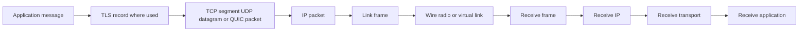

### Diagram B03 - Practical fault boundaries

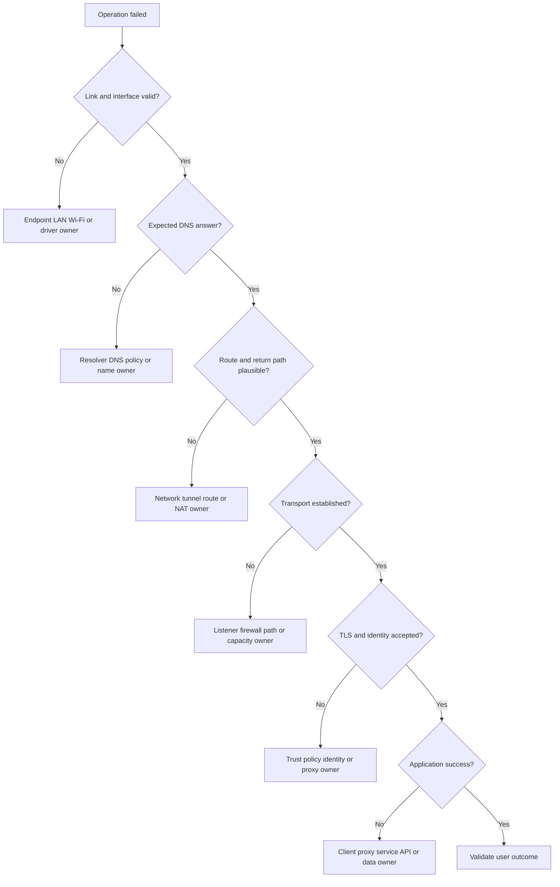

Read [Part 16](Part-16-osi-tcp-ip-models.md) and [Part 27](Part-27-connectivity-troubleshooting-fault-isolation.md) for layered reasoning.

## Ethernet, ARP, IP, subnetting, routing, and NAT

### Ethernet field map

| Ethernet field | Purpose | Useful question | Caveat |
|---|---|---|---|
| Destination MAC | Local-link receiver or multicast/broadcast destination | Which next local interface should receive the frame? | Routers replace link headers at each routed hop |
| Source MAC | Sender interface on the observed local link | Which local transmitter emitted this frame? | Virtualization, spoofing, and gateways limit identity value |
| EtherType | Identifies carried protocol such as IPv4, IPv6, or ARP | Which next-layer decoder applies? | VLAN tags can add headers |
| VLAN tag | Optional virtual LAN identifier and priority metadata | Which logical link segment carried traffic? | Capture points and adapter offload can hide or alter visibility |
| Frame check sequence | Link-level error detection on supported captures | Was corruption detected on the local link? | Host captures often do not expose the wire FCS |

### Diagram B04 - Local delivery with ARP

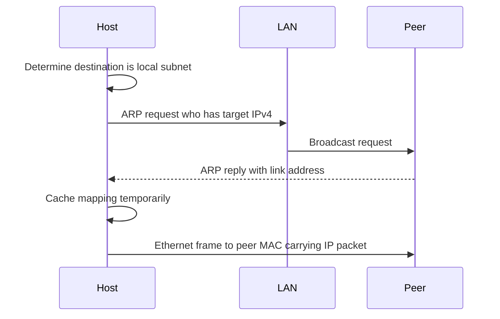

### ARP field map

| ARP field | Meaning | Diagnostic use | Caution |
|---|---|---|---|
| Hardware/protocol type | Link and network protocol families | Confirms ordinary Ethernet/IPv4 context | Do not assume every link uses ARP |
| Operation | Request or reply | Reconstruct who asked and who answered | Gratuitous ARP has special update/detection uses |
| Sender protocol address | Claimed sender IPv4 | Compare with expected host or gateway | A claim is not authenticated by ordinary ARP |
| Sender hardware address | Claimed sender MAC | Detect changing or conflicting mappings | Virtual gateways can move addresses legitimately |
| Target protocol address | IPv4 being resolved | Shows intended local recipient | Off-subnet destinations resolve the gateway instead |
| Target hardware address | Known/unknown target MAC | Filled in replies | Interpret according to operation |

### Diagram B05 - Routed delivery

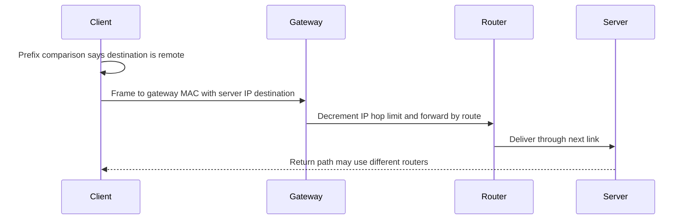

### IPv4 and IPv6 field map

| Field | IPv4/IPv6 role | Troubleshooting question | Caveat |
|---|---|---|---|
| Source address | Sender network address | Is this pre- or post-NAT? | Address is not durable person identity |
| Destination address | Intended network destination | Does it match the DNS answer and route? | Proxy/tunnel outer destination can differ from app destination |
| TTL/Hop Limit | Remaining router hops | Did values change across paths? | It is not elapsed time |
| Protocol/Next Header | Identifies TCP, UDP, ICMP, or extension | Which decoder follows? | IPv6 extension headers can form a chain |
| Total/Payload length | Packet or payload size | Do failures correlate with size? | Offload can change host-capture representation |
| Fragment fields | IPv4 fragmentation identity and offset | Are fragments missing or blocked? | IPv6 routers do not fragment in the IPv4 manner |
| DSCP/traffic class | QoS marking | Is marking preserved and governed? | Priority does not create capacity |

### Diagram B06 - Subnet decision

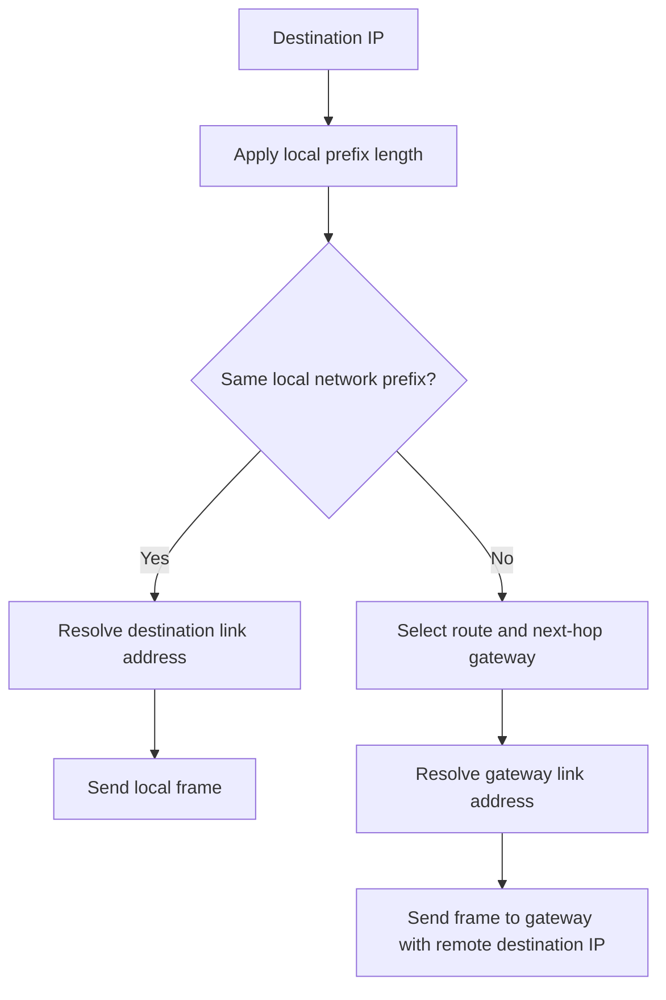

### Routing table reading

| Route component | Meaning | Selection principle | Failure signature |
|---|---|---|---|
| Destination prefix | Address range matched | Longest matching prefix generally wins | Unexpected broad/default route selected |
| Next hop | Immediate router or on-link target | Chosen by matching route | Gateway unreachable or wrong interface |
| Interface | Local egress adapter | Must be operational and suitable | Traffic exits physical instead of tunnel adapter |
| Metric | Preference among otherwise relevant routes | Lower-preference value often selected under OS rules | Route changes after VPN or interface event |
| Default route | Catch-all when no specific route matches | Used last | Black hole when gateway/path is unavailable |

### Diagram B07 - NAT/PAT state

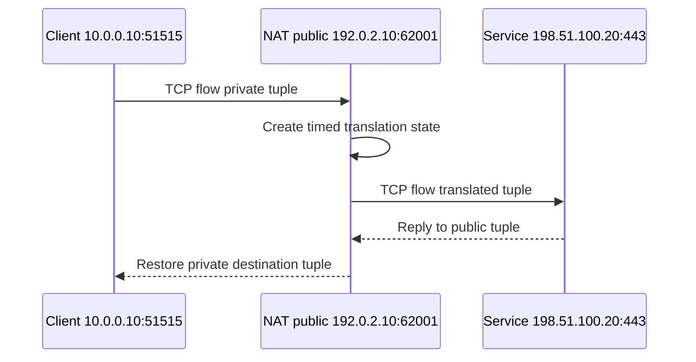

### Diagram B08 - NAT troubleshooting decision

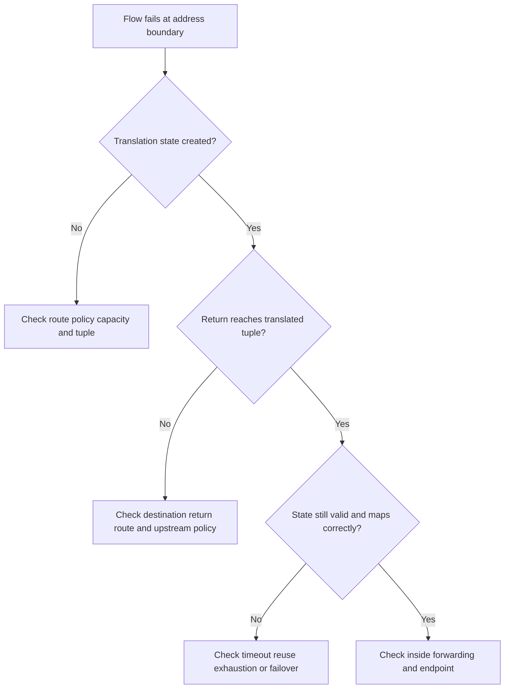

Use reserved documentation ranges (`192.0.2.0/24`, `198.51.100.0/24`, and `203.0.113.0/24`) in learning material. Read [Part 17](Part-17-ethernet-ip-subnet-routing-nat.md).

## TCP, UDP, sockets, and reliability

### TCP field map

| TCP field | Plain meaning | Strong observation | Weak leap to avoid |
|---|---|---|---|
| Source/destination port | Transport endpoint identifiers | This tuple used these ports at this point | Port 443 proves a safe HTTPS application |
| Sequence number | First byte position in this segment | Bytes and retransmission can be reconstructed | Packet number equals application message number |
| Acknowledgment number | Next byte expected from peer | Peer transport acknowledged earlier bytes | Remote application committed the transaction |
| SYN | Establish sequence space and options | Connection attempt or SYN-ACK observed | User authentication succeeded |
| ACK | Acknowledgment field valid | Cumulative transport progress | Every individual segment was separately acknowledged |
| FIN | Sender finished sending stream bytes | Orderly half-close began | Both directions closed immediately |
| RST | Abrupt rejection or termination | Reset came from observed address/path point | The server application definitely caused it |
| Window | Receiver-advertised capacity | Flow-control pressure in one direction | Network congestion without other evidence |
| Options | MSS, scaling, SACK, timestamps, and others | Handshake capabilities offered/negotiated | Midstream capture knows all negotiated context |
| Checksum | Error-detection value | On-wire corruption may be detectable | Sender-host bad checksum display proves corruption; offload may explain it |

### Diagram B09 - TCP three-way handshake

```mermaid
sequenceDiagram
    participant C as Client
    participant S as Server
    C->>S: SYN seq x options
    S-->>C: SYN ACK seq y ack x+1 options
    C->>S: ACK ack y+1
    Note over C,S: Established transport state; application work still follows
```

### Diagram B10 - TCP application data and acknowledgment

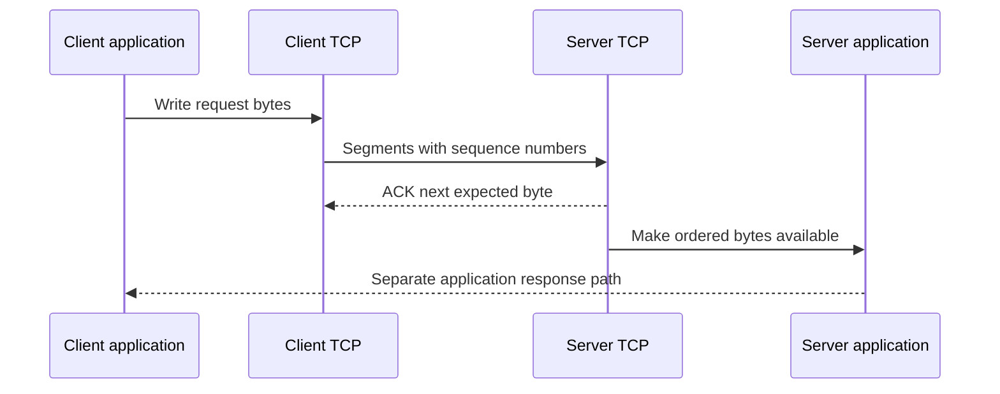

### Diagram B11 - Loss and retransmission reasoning

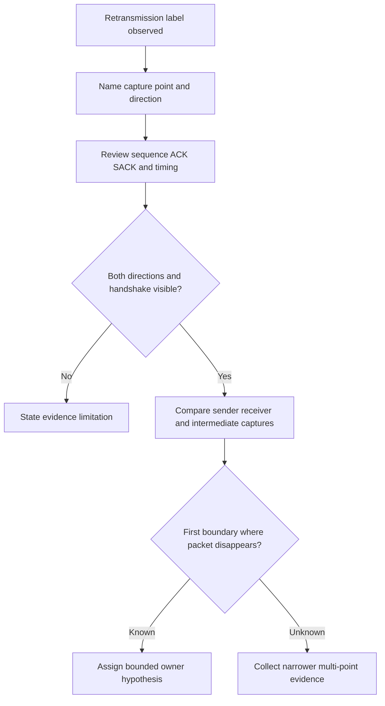

### Diagram B12 - Orderly TCP close

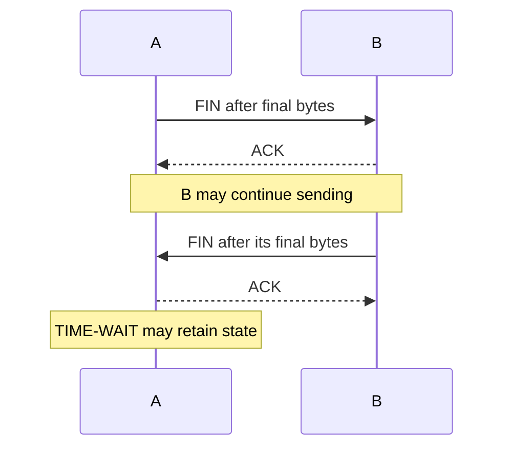

### Diagram B13 - TCP failure signature decision

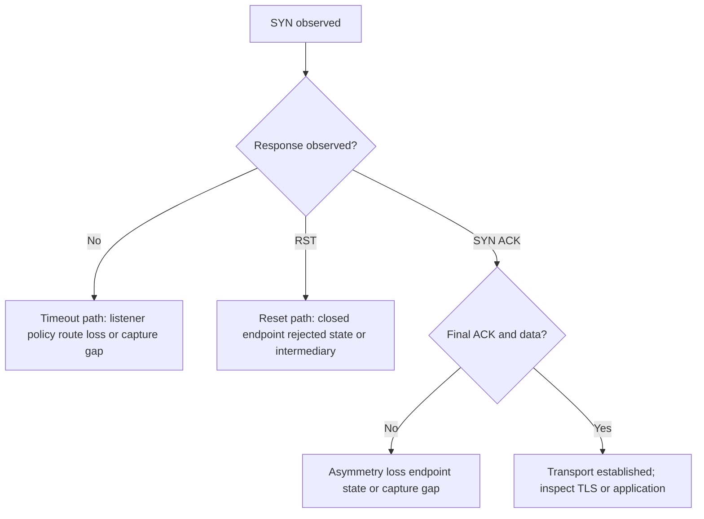

### UDP and QUIC field map

| Field/concept | UDP | QUIC over UDP | Diagnostic meaning |
|---|---|---|---|
| Source/destination ports | Present | Present in outer UDP | Identifies observed transport endpoints |
| Length | Header plus payload length | Covers carried QUIC packet | Truncation or capture snap length matters |
| Checksum | Integrity check with IPv4/IPv6 rules | UDP protection plus QUIC cryptographic protection | Offload can affect host captures |
| Connection handshake | None in UDP itself | QUIC establishes secure connection state | No UDP handshake does not mean no application handshake |
| Reliability | Not supplied by UDP | QUIC provides loss recovery and streams | Application chooses semantics |
| Multiplexing | Datagram boundaries | Multiple streams without TCP head-of-line across streams | Tool and key visibility affect analysis |

### Diagram B14 - UDP request and response

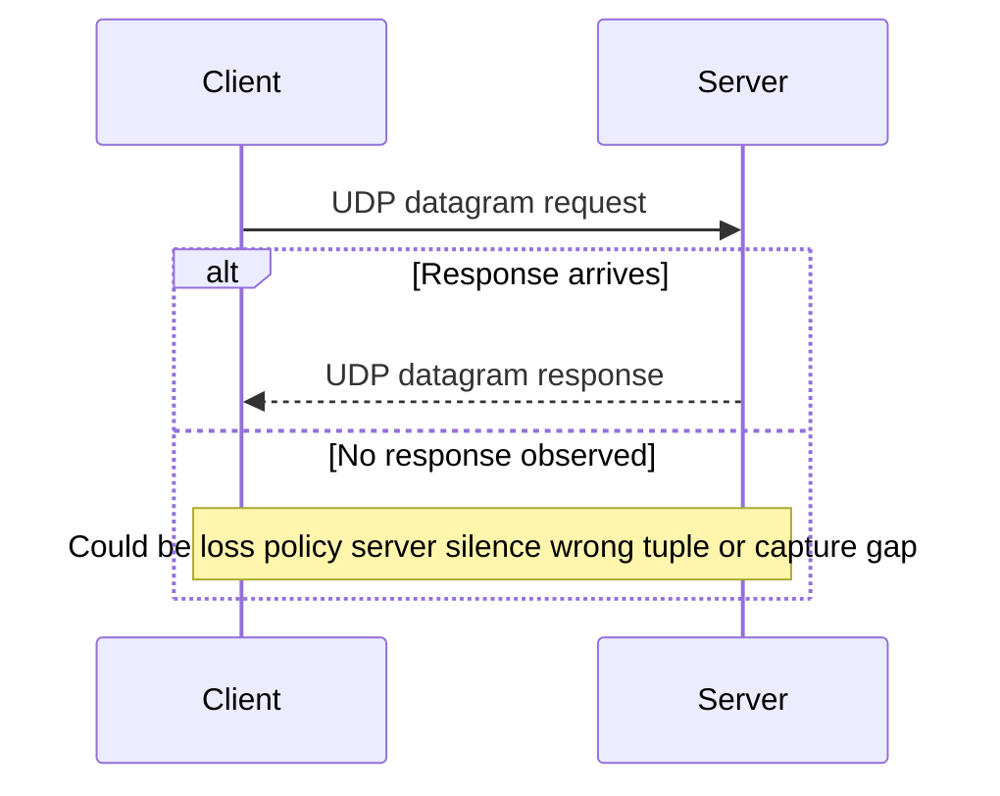

Read [Part 18](Part-18-tcp-udp-ports-sockets.md).

## DNS and DHCP

### DNS field map

| DNS field | Meaning | Useful check | Caveat |
|---|---|---|---|
| Transaction ID | Correlates request and response within context | Does reply match query? | Transport reuse and implementations require full tuple/time context |
| QR | Query versus response | Which direction is represented? | Do not infer success from response presence |
| Opcode | Kind of operation | Usually standard query | Other operations exist |
| Flags | Recursion, authoritative, truncation, validation-related indicators | Did resolver recurse and was response truncated? | Flag meaning is specific; do not overgeneralize DNSSEC status |
| RCODE | Response outcome | No error, name error, server failure, and others | `NOERROR` can still have no requested answer |
| Question | Name, type, and class requested | Was the expected FQDN/type asked? | Search suffixes can generate several names |
| Answer | Returned records | Which IP, alias, TTL, or service record resulted? | Answer can differ by resolver, geography, policy, and time |
| Authority/additional | Delegation and supporting records | Where did authority or glue come from? | Presence is not automatic validation |

### Diagram B15 - Recursive DNS resolution

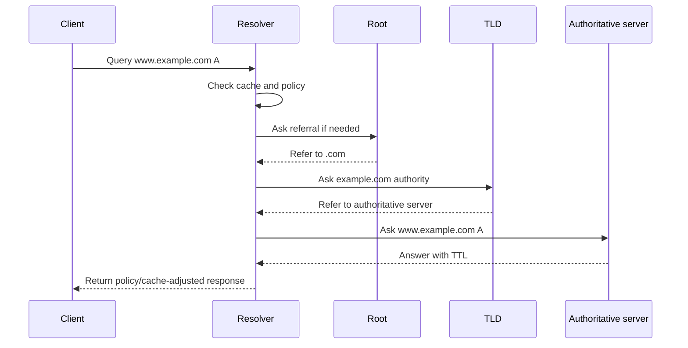

### Diagram B16 - DNS troubleshooting path

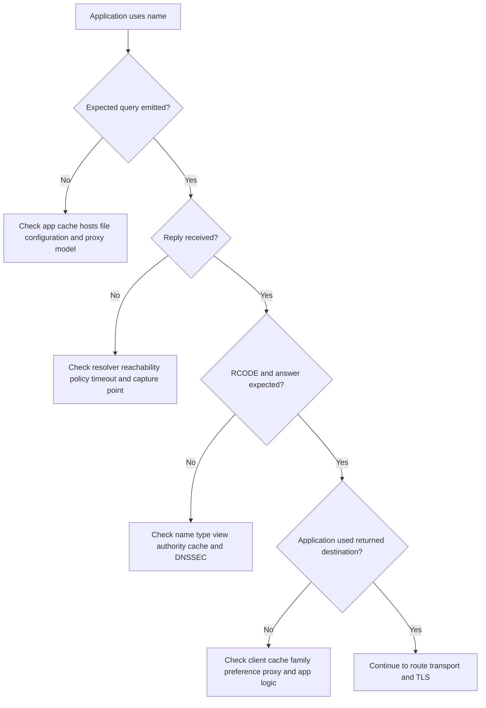

### Diagram B17 - DHCP DORA

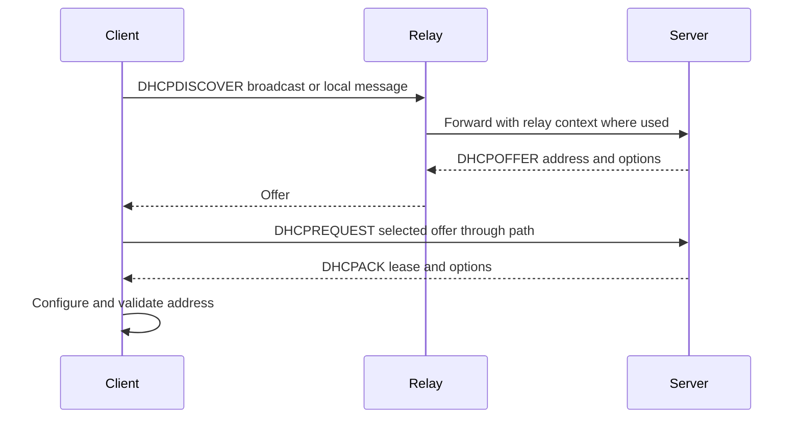

### Diagram B18 - DHCP failure decision

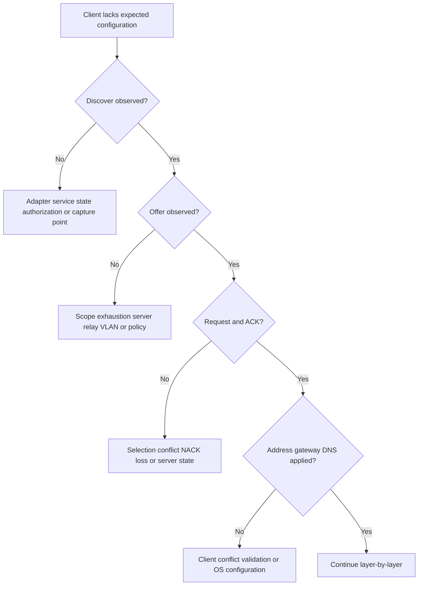

| DHCP item | Typical content | Why it matters |
|---|---|---|
| Client identifier/MAC context | Identifies lease requester under implementation rules | Hardware address alone is not durable person identity |
| Offered address | Candidate client address | Must belong to correct scope and not conflict |
| Subnet mask/prefix | Defines local-network decision | Wrong value changes local versus routed delivery |
| Router option | Default gateway | Missing/wrong gateway blocks remote paths |
| DNS server option | Resolver addresses | Explains name-resolution path |
| Lease time | Validity interval | Renewal/rebind behavior affects continuity |
| Relay information | Network segment context | Helps server select the right scope |

Read [Part 19](Part-19-dns-dhcp.md).

## HTTP, HTTPS, TLS, and PKI

### HTTP request and response map

| Element | Request meaning | Response meaning | Diagnostic question |
|---|---|---|---|
| Method/status | Requested operation such as GET/POST | Result category and code | Was operation safe/idempotent, redirected, denied, throttled, or failed? |
| Scheme/authority | `http` or `https`, host, optional port | Connection/service context | Did proxy or redirect change destination? |
| Path/query | Resource and parameters | Not applicable | Does it contain sensitive data needing redaction? |
| Headers | Metadata, negotiation, auth, cookies, tracing | Metadata, cache, type, location, correlation | Which headers are authoritative and safe to share? |
| Body | Optional request content | Optional response content | Was it complete, compressed, encrypted, or truncated? |
| Timing | DNS/connect/TLS/request/upload/wait/download | Client-observed phases | Browser phase labels do not alone identify root cause |

### Diagram B19 - HTTPS operation chain

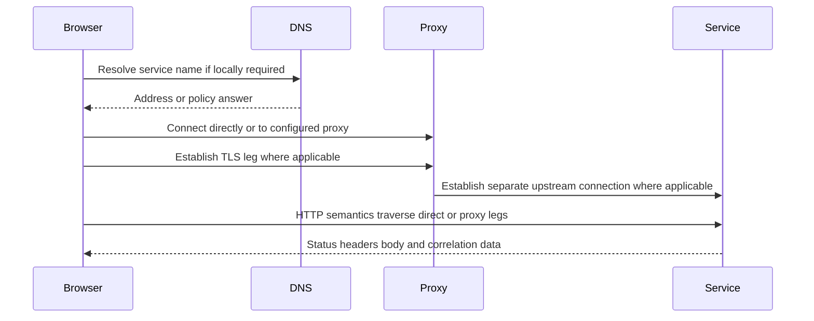

### Diagram B20 - HTTP status family decision

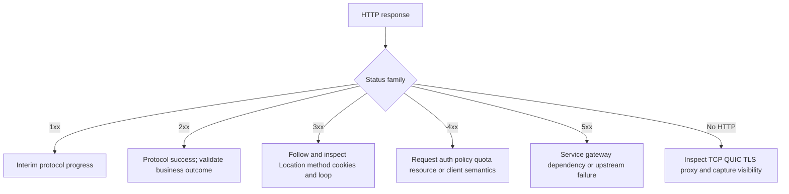

### TLS record and handshake field map

| TLS evidence | Meaning | What it can support | What it cannot prove alone |
|---|---|---|---|
| ClientHello | Client offers versions, algorithms, extensions, name and protocol context as applicable | Client reached peer and began negotiation | Server certificate or application acceptance |
| ServerHello | Server selects compatible parameters | Negotiation progressed | Certificate validation completed at client |
| Certificate | Peer presents a chain under protocol rules | Names, issuer, validity, key use can be inspected | Private key ownership or business trust without validation |
| CertificateVerify/Finished | Cryptographic handshake integrity and possession evidence under version rules | Handshake authentication progress | User authentication or HTTP success |
| Alert | TLS warning/fatal condition under version behavior | Failure stage and alert description where visible | Which organizational owner caused policy mismatch |
| Application Data | Protected bytes after handshake | Encrypted application traffic exists | HTTP status or content without authorized decryption |

### Diagram B21 - Simplified TLS 1.3 handshake

```mermaid
sequenceDiagram
    participant Client
    participant Server
    Client->>Server: ClientHello versions key share SNI ALPN
    Server-->>Client: ServerHello selected version and key share
    Server-->>Client: Encrypted extensions certificate proof finished
    Client->>Client: Validate name chain time usage and policy
    Client->>Server: Finished
    Note over Client,Server: Protected application data can flow
```

### Diagram B22 - Certificate validation decision

```mermaid
flowchart TD
    CERT[Peer certificate chain] --> TIME{Within validity period?}
    TIME -->|No| CLOCK[Check certificate dates and client clock]
    TIME -->|Yes| NAME{Name matches intended service?}
    NAME -->|No| SAN[Check SAN destination proxy and redirect]
    NAME -->|Yes| CHAIN{Builds to trusted root under policy?}
    CHAIN -->|No| TRUST[Check intermediates trust store and enterprise root]
    CHAIN -->|Yes| USE{Key usage algorithm and policy accepted?}
    USE -->|No| POLICY[Check current client and organizational requirements]
    USE -->|Yes| REV{Revocation behavior acceptable?}
    REV -->|No| REVPATH[Check responder reachability status and policy]
    REV -->|Yes| OK[Continue handshake and application validation]
```

### Diagram B23 - TLS inspection creates two legs

```mermaid
sequenceDiagram
    participant Client
    participant Inspector as Authorized inspection proxy
    participant Origin
    Client->>Inspector: TLS handshake for requested service
    Inspector-->>Client: Enterprise-trusted generated/presented certificate
    Inspector->>Origin: Separate TLS handshake to origin
    Origin-->>Inspector: Origin certificate and protected response
    Inspector->>Inspector: Apply approved policy and logging
    Inspector-->>Client: Re-protected response
```

### Plain-English deep-dive 2 - TLS success is not login success

TLS establishes cryptographic protection and peer authentication for a connection endpoint. It does not prove that the user signed in, the access token has the right scope, the application accepted a file, or the backend committed a change. Think of TLS as a protected courier route to a building. The courier can arrive securely while reception still rejects the visitor's badge or the department rejects the form. Correlate TLS with HTTP status, redirect chain, identity protocol, application request ID, and service outcome.

Read [Part 20](Part-20-http-https-web-protocol.md), [Part 21](Part-21-tls-pki-certificates-inspection.md), and [Part 37](Part-37-zscaler-tls-inspection.md).

## Proxy, firewall, VPN, SSE, SASE, and zero trust paths

| Component | Main job | Connection effect | Evidence to correlate |
|---|---|---|---|
| Forward proxy | Represents clients toward destinations | Usually creates client-proxy and proxy-origin legs | Client proxy config, proxy log, upstream tuple, policy/request ID |
| Reverse proxy | Represents services toward clients | Terminates client leg and routes backend leg | Edge and backend status, TLS, routing, correlation ID |
| Stateful firewall | Enforces flow policy with connection state | Passes or blocks without necessarily terminating application connection | Rule, direction, zone, tuple, state, time, action |
| VPN | Tunnels network traffic | Adds inner and outer paths and often routes/DNS | Adapter, routes, inner/outer tuple, gateway, policy |
| SSE | Cloud-delivered security capabilities | May steer and enforce access/data policy | Forwarding, identity, policy, service health, tenant evidence |
| SASE | Converged networking and security architecture | Coordinates connectivity and security controls | Requirement, path, policy, ownership, user experience |
| Zero trust broker | Connects approved subjects to resources under context | Avoids assuming broad network trust | Identity, device, resource, policy decision, enforcement evidence |

### Diagram B24 - Proxy leg isolation

```mermaid
flowchart LR
    CLIENT[Client process] --> LEG1[Client-to-proxy DNS TCP TLS HTTP]
    LEG1 --> PROXY[Proxy policy and processing]
    PROXY --> LEG2[Proxy-to-destination DNS TCP TLS HTTP]
    LEG2 --> SERVICE[Destination service]
    E1[Client trace and HAR] --> LEG1
    E2[Proxy logs and policy ID] --> PROXY
    E3[Upstream trace and service logs] --> LEG2
```

### Diagram B25 - VPN inner and outer flow

```mermaid
flowchart LR
    APP[Application tuple] --> INNER[Inner IP packet]
    INNER --> TUNNEL[VPN encapsulation and protection]
    TUNNEL --> OUTER[Outer gateway tuple]
    OUTER --> NETWORK[Underlay network]
    NETWORK --> GATEWAY[VPN gateway]
    GATEWAY --> DECAP[Decapsulation]
    DECAP --> DEST[Destination route and policy]
```

### Diagram B26 - Zero trust conceptual decision

```mermaid
flowchart TD
    REQUEST[Subject requests resource] --> ID[Verify identity]
    ID --> DEVICE[Evaluate device and context]
    DEVICE --> RESOURCE[Identify intended resource]
    RESOURCE --> RISK[Evaluate current risk signals]
    RISK --> POLICY[Make policy decision]
    POLICY --> ENFORCE[Enforce allow deny step-up isolate or reduced access]
    ENFORCE --> LOG[Record decision and outcome]
    LOG --> REEVAL[Reevaluate when context changes]
```

Read [Part 22](Part-22-proxies-firewalls-vpn-sse-sase.md), [Part 31](Part-31-zero-trust-exchange-architecture.md), and [Part 32](Part-32-zscaler-cloud-service-edges-traffic.md).

## Identity handshakes: SAML, OAuth 2.0, OIDC, and SCIM

| Protocol | Primary job | Main artifacts | Frequent confusion |
|---|---|---|---|
| SAML | Browser-oriented federation and assertions | AuthnRequest, Response, Assertion, signature, claims | XML assertion is not an OAuth token |
| OAuth 2.0 | Delegated authorization | Authorization code, access token, refresh token, scopes | OAuth alone is not user authentication |
| OIDC | Authentication identity layer over OAuth 2.0 | ID token, UserInfo, nonce, issuer, subject | ID token should not be used as a generic API access token |
| SCIM | Identity provisioning and lifecycle | Users, groups, schemas, create/update/delete/filter | Provisioning success is not sign-in success |
| MFA | Multiple factor categories for authentication | Challenge, factor registration, result | Two passwords are not two independent factors |

### Diagram B27 - SAML service-provider initiated flow

```mermaid
sequenceDiagram
    participant User
    participant SP as Service Provider
    participant IdP as Identity Provider
    User->>SP: Request protected resource
    SP-->>User: Redirect with AuthnRequest
    User->>IdP: Present request and authenticate
    IdP-->>User: Signed SAML Response
    User->>SP: Post response to assertion consumer endpoint
    SP->>SP: Validate signature issuer audience time and request state
    SP-->>User: Create application session or reject
```

### Diagram B28 - OAuth authorization code with PKCE

```mermaid
sequenceDiagram
    participant User
    participant Client
    participant AS as Authorization Server
    participant API as Resource Server
    Client->>Client: Create verifier and challenge
    Client->>AS: Authorization request challenge state scopes
    AS->>User: Authenticate and obtain authorization
    AS-->>Client: Redirect with code and state
    Client->>AS: Redeem code with verifier
    AS-->>Client: Access token and optional refresh token
    Client->>API: Access token for approved scope/audience
    API-->>Client: Resource response or authorization error
```

### Diagram B29 - OIDC validation focus

```mermaid
flowchart TD
    TOKEN[Receive ID token] --> SIG{Signature valid with trusted issuer key?}
    SIG -->|No| REJECT[Reject]
    SIG -->|Yes| ISS{Expected issuer?}
    ISS -->|No| REJECT
    ISS -->|Yes| AUD{Expected audience and authorized party?}
    AUD -->|No| REJECT
    AUD -->|Yes| TIME{Current under exp nbf and clock policy?}
    TIME -->|No| REJECT
    TIME -->|Yes| NONCE{Expected nonce and flow state?}
    NONCE -->|No| REJECT
    NONCE -->|Yes| ACCEPT[Create bounded identity session]
```

### Diagram B30 - SCIM lifecycle and reconciliation

```mermaid
sequenceDiagram
    participant HR as Authoritative lifecycle source
    participant IdP
    participant SCIM as SCIM client/service
    participant App
    HR->>IdP: Joiner mover or leaver event
    IdP->>SCIM: Create update disable or group change
    SCIM->>App: Authorized SCIM request
    App-->>SCIM: Resource result and identifier
    SCIM-->>IdP: Status
    IdP->>App: Periodic reconciliation detects drift
```

Identity troubleshooting checks exact redirect URI, issuer/entity ID, audience, signature/key, certificate or JWKS rotation, state/nonce, timestamps and clock skew, claims, group size, token scope, consent, session cookie, provisioning mapping, account lifecycle, and application authorization. Never paste a live token into a public decoder or ticket. Use an approved offline or tenant-controlled method and redact signatures and claims according to policy. Read [Part 23](Part-23-identity-protocols.md).

## REST APIs and webhooks

### REST/API field map

| Contract area | Questions | Failure modes | Safe evidence |
|---|---|---|---|
| Base URL/version | Correct scheme, host, path, API version? | Wrong environment, retired version, proxy rewrite | Redacted request line and official contract |
| Method/resource | Is operation GET, POST, PATCH, PUT, DELETE, or other? | Wrong semantics, non-idempotent retry | Method, path template, correlation ID; no secret query values |
| Authentication | Which approved scheme and audience? | Expired token, wrong scope, rotated key | Error code, token metadata only when safely redacted |
| Content type/schema | Expected media type, fields, types, nulls? | Parsing, unknown enum, schema drift | Synthetic payload and schema-validation output |
| Pagination | Page size, cursor, next link, termination? | Missing or repeated pages | Page IDs/counts without sensitive content |
| Rate limit | Quota window and retry guidance? | 429, burst rejection, connector lag | Status, safe headers, retry timeline |
| Idempotency | Can retry create duplicates? | Duplicate tickets/actions | Synthetic idempotency key and target reconciliation |
| Error model | Stable code, message, retryability, request ID? | Generic retries hide permanent errors | Redacted response and request ID |

### Diagram B31 - API pagination and safe retry

```mermaid
flowchart TD
    REQ[Request authorized page] --> RESP{Response class}
    RESP -->|2xx| SAVE[Validate schema and checkpoint page]
    SAVE --> NEXT{Next cursor or link?}
    NEXT -->|Yes| REQ
    NEXT -->|No| RECON[Reconcile counts and completeness]
    RESP -->|429 or transient 5xx| WAIT[Honor approved retry guidance and bounded backoff]
    WAIT --> REQ
    RESP -->|Permanent 4xx| QUAR[Stop retry; quarantine and escalate contract issue]
```

### Diagram B32 - Signed webhook intake

```mermaid
sequenceDiagram
    participant Source
    participant Receiver
    participant Queue
    participant Worker
    Source->>Receiver: HTTPS event with ID timestamp and signature
    Receiver->>Receiver: Validate TLS signature freshness and replay rules
    alt Valid and new
        Receiver->>Queue: Enqueue immutable event
        Receiver-->>Source: Timely success response
        Queue->>Worker: Deliver with bounded retry
        Worker->>Worker: Process idempotently and audit outcome
    else Invalid duplicate or stale
        Receiver-->>Source: Governed rejection or duplicate acknowledgment
    end
```

Read [Part 24](Part-24-rest-api-json-webhooks.md).

## Port and protocol field reference

The table lists common defaults and registrations for orientation. It is not a firewall rule set, endpoint allowlist, product deployment guide, or proof of observed application. Protocols can use alternate ports, dynamic ports, service discovery, proxies, tunnels, and vendor-specific endpoints. Modern cloud services often use HTTPS across changing destination sets; use current official endpoint documentation, identity, DNS names, certificates, application metadata, policy logs, and direct evidence.

| Port(s) | Transport | Common association | Handshake/evidence focus | Caveat |
|---:|---|---|---|---|
| 20/21 | TCP | FTP data/control historical modes | Control commands and separate data connection | Cleartext FTP is generally unsuitable for sensitive use |
| 22 | TCP | SSH, SFTP, SCP | Server key, user auth, channel requests | Port does not prove SSH; follow authorization policy |
| 23 | TCP | Telnet | Cleartext session | Insecure for credentials; do not enable for troubleshooting |
| 25 | TCP | SMTP relay/server transfer | Greeting, EHLO, STARTTLS, response codes | Client submission commonly uses 587 or 465 |
| 53 | UDP/TCP | DNS | Query/response, RCODE, answers, truncation | TCP also supports large responses and zone operations |
| 67/68 | UDP | DHCPv4 server/client | Discover, Offer, Request, ACK | Relays cross broadcast boundaries |
| 69 | UDP | TFTP | Application request/block behavior | No confidentiality or strong authentication |
| 80 | TCP | HTTP | Request method, host, status, redirects | May redirect to HTTPS; not proof of benign traffic |
| 88 | TCP/UDP | Kerberos | Ticket exchanges, time, principal, SPN | Authentication details are sensitive |
| 110 | TCP | POP3 | Greeting and optional TLS upgrade | Prefer protected, approved mail access |
| 123 | UDP | NTP | Client/server time exchange | Accurate time supports TLS, identity, and correlation |
| 135 | TCP | Microsoft RPC endpoint mapper | Endpoint mapping followed by dynamic ports | Exposure and firewall scope require care |
| 137-139 | UDP/TCP | NetBIOS services | Legacy name/session behavior | Legacy use; do not open broadly |
| 143 | TCP | IMAP | Greeting and optional TLS upgrade | IMAPS commonly uses 993 |
| 161/162 | UDP | SNMP queries/traps | Version, community/security model, object IDs | Protect credentials and management-plane access |
| 389 | TCP/UDP | LDAP | Bind/search and optional StartTLS | LDAPS commonly uses 636; policy varies |
| 443 | TCP | HTTPS/TLS | TCP, TLS, ALPN, HTTP status | Also many nonbrowser TLS apps; UDP 443 commonly QUIC |
| 443 | UDP | QUIC/HTTP/3 commonly | QUIC connection and encrypted streams | Blocking may trigger fallback, not guaranteed |
| 445 | TCP | SMB | Negotiation, session setup, share/tree operations | Do not expose broadly to untrusted networks |
| 465 | TCP | Message submission with implicit TLS | TLS then SMTP | Verify current mail-provider guidance |
| 500 | UDP | IKE | Security association negotiation | VPN specifics and NAT traversal vary |
| 514 | UDP/TCP | Syslog convention | Message format, loss, framing, TLS alternative | UDP lacks delivery assurance; secure transport may use other ports |
| 546/547 | UDP | DHCPv6 client/server | Solicit, Advertise, Request, Reply | IPv6 behavior differs from DHCPv4 |
| 587 | TCP | SMTP message submission | EHLO, STARTTLS, authentication | Follow provider and organizational policy |
| 636 | TCP | LDAP over TLS convention | TLS and directory operations | Validate certificate, identity, and current guidance |
| 853 | TCP | DNS over TLS | TLS plus DNS framing | Resolver policy and privacy behavior vary |
| 993 | TCP | IMAP over TLS | TLS then IMAP | Credentials/content are sensitive |
| 995 | TCP | POP3 over TLS | TLS then POP3 | Follow approved mail protocol policy |
| 1433 | TCP | Microsoft SQL Server convention | Prelogin/login/database protocol | Do not infer database identity from port alone |
| 1521 | TCP | Oracle database listener convention | Listener and database negotiation | Configuration can use other ports |
| 1812/1813 | UDP | RADIUS authentication/accounting | Request/response attributes | Shared secrets and attributes are sensitive |
| 3268/3269 | TCP | Active Directory Global Catalog/plain and TLS | Directory bind/search, optional protected variant | Current environment and certificate policy govern |
| 3306 | TCP | MySQL convention | Database handshake/auth | Never test unknown databases without authorization |
| 3389 | TCP/UDP | Remote Desktop Protocol | Negotiation, TLS/CredSSP, session | Strong access controls and exposure reduction are essential |
| 5432 | TCP | PostgreSQL convention | Startup, TLS negotiation, auth | Port alone does not prove PostgreSQL |
| 5671/5672 | TCP | AMQP TLS/plain conventions | Broker protocol/auth/channel | Broker configuration varies |
| 5985/5986 | TCP | WinRM HTTP/HTTPS conventions | HTTP, authentication, management operation | Restrict management plane; HTTPS does not replace auth policy |
| 8080/8443 | TCP | Alternate HTTP/HTTPS conventions | HTTP/TLS behavior | Common but not registered proof of application |

## Safe command and tool reference

Every example is read-only observation or bounded diagnostic collection. Replace `example.com`, `192.0.2.10`, and synthetic file paths only with explicitly authorized targets and approved storage. Commands can still disclose local configuration in output; redact before sharing. Do not run packet capture, Procmon, HAR export, or Fiddler decryption without authorization.

### Windows PowerShell and built-in commands

| Goal | Safe example | What it shows | Limitation/privacy |
|---|---|---|---|
| Interface configuration | `Get-NetIPConfiguration` | Addresses, gateways, DNS, adapters | May expose internal addresses and suffixes |
| IP addresses | `Get-NetIPAddress` | Address family, prefix, interface, state | Does not prove reachability |
| Route table | `Get-NetRoute | Sort-Object DestinationPrefix, RouteMetric` | Routes, interfaces, next hops, metrics | Selection also depends on prefix and OS behavior |
| DNS resolution | `Resolve-DnsName example.com -Type A` | Resolver answer and record details | Cached/policy answer can vary |
| DNS client cache | `Get-DnsClientCache` | Locally cached records | Output can contain sensitive internal names |
| TCP connections | `Get-NetTCPConnection` | Local/remote tuples and state | Correlate owning process and exact time |
| UDP endpoints | `Get-NetUDPEndpoint` | Local UDP listeners/endpoints | No TCP-style connection state |
| Process lookup | `Get-Process -Id 1234` | Process for an authorized PID | PID can be recycled; process names are sensitive |
| Single target connection | `Test-NetConnection example.com -Port 443 -InformationLevel Detailed` | DNS, route/interface, TCP test summary | Active connection to one authorized target, not application proof |
| HTTP headers | `curl.exe --head https://example.com/` | TLS/HTTP attempt and response headers | Sends a HEAD request; use only approved endpoint |
| Proxy settings | `netsh winhttp show proxy` | WinHTTP proxy configuration | Browser and application proxy paths can differ |
| ARP/neighbor cache | `Get-NetNeighbor` | IP-to-link neighbor state | Local-link state only |

```powershell
# Read-only Windows snapshot. Review output before sharing.
Get-Date -AsUTC
Get-NetIPConfiguration
Get-NetRoute | Sort-Object DestinationPrefix, RouteMetric
Resolve-DnsName example.com -Type A
Get-NetTCPConnection | Where-Object RemotePort -eq 443
netsh winhttp show proxy
```

```powershell
# Bounded active checks to a documentation domain; obtain authorization for any real target.
Test-NetConnection example.com -Port 443 -InformationLevel Detailed
curl.exe --head --max-time 15 https://example.com/
```

Do not use `curl -k`, `--insecure`, trust-store deletion, firewall disablement, or inspection bypass as a diagnostic shortcut. A certificate failure is evidence to understand, not a control to remove.

### Linux commands

| Goal | Safe example | What it shows | Limitation/privacy |
|---|---|---|---|
| Addresses | `ip address show` | Interface addresses and state | Namespace/container view can differ |
| Routes | `ip route show` | Current routing table | Policy routing may require additional authorized review |
| Neighbors | `ip neighbor show` | ARP/IPv6 neighbor cache | Local-link evidence only |
| Sockets | `ss -tupn` | TCP/UDP sockets and process info when permitted | Process details may require privilege and are sensitive |
| DNS | `getent ahosts example.com` | System resolver results | Not the same as querying a chosen DNS server |
| DNS detail | `dig example.com A` | Query flags, answers, authority, timing | Uses configured/default resolver unless specified |
| Path | `tracepath example.com` | Path/PMTU hints using bounded probes | Routers may filter or rate-limit responses |
| HTTP headers | `curl --head --max-time 15 https://example.com/` | HTTP/TLS outcome for one approved target | Application and proxy behavior vary |
| Certificate metadata | `openssl s_client -connect example.com:443 -servername example.com </dev/null` | Presented chain and handshake diagnostics | Active connection; output is not full policy validation |

```bash
# Read-only local state and bounded documentation-domain checks.
date -u
ip address show
ip route show
ip neighbor show
ss -tupn
getent ahosts example.com
dig example.com A
curl --head --max-time 15 https://example.com/
```

### macOS commands

| Goal | Safe example | What it shows | Limitation/privacy |
|---|---|---|---|
| Interfaces | `ifconfig` | Address and link configuration | Output includes virtual and private interfaces |
| Routes | `netstat -rn` | Routing table | Interface service order and VPN state also matter |
| DNS configuration | `scutil --dns` | Resolver scopes and search domains | Can expose internal names |
| DNS answer | `dig example.com A` | DNS query/response detail | Resolver selection must be understood |
| Sockets | `lsof -nP -iTCP -sTCP:ESTABLISHED` | Established TCP sockets and processes | Process/user details are sensitive |
| Path | `traceroute example.com` | Bounded hop responses | Missing hops do not prove packet loss |
| HTTP headers | `curl --head --max-time 15 https://example.com/` | One approved HTTPS request | Do not use insecure options |

```bash
# Read-only local state and one bounded documentation-domain request.
date -u
ifconfig
netstat -rn
scutil --dns
lsof -nP -iTCP -sTCP:ESTABLISHED
dig example.com A
curl --head --max-time 15 https://example.com/
```

### Wireshark display filters

Display filters change the view of an existing capture; they do not delete packets from the file. These are not capture filters. Preserve the restricted original and export a minimized/redacted derivative only under policy.

| Question | Display filter example | Interpretation caution |
|---|---|---|
| DNS only | `dns` | TCP DNS and encrypted DNS visibility differ |
| One DNS name | `dns.qry.name == "example.com"` | Search suffix and aliases may use other names |
| TCP handshake SYNs | `tcp.flags.syn == 1` | Includes SYN-ACK unless ACK is also constrained |
| Initial SYN only | `tcp.flags.syn == 1 && tcp.flags.ack == 0` | Retransmitted SYNs remain visible |
| TCP resets | `tcp.flags.reset == 1` | Identify direction, sequence, and capture point |
| Zero window | `tcp.analysis.zero_window` | Tool inference; inspect actual advertised window |
| Retransmission hints | `tcp.analysis.retransmission || tcp.analysis.fast_retransmission` | Analysis labels depend on capture completeness |
| TLS handshakes | `tls.handshake` | Encrypted ClientHello evolution can reduce visible names |
| TLS alerts | `tls.alert_message` | Alert visibility and description vary by version |
| HTTP visible | `http` | HTTPS content is encrypted unless lawfully decrypted |
| One IP pair | `ip.addr == 192.0.2.10 && ip.addr == 198.51.100.20` | Direction is not distinguished |
| One TCP stream | `tcp.stream == 7` | Stream number is local to the capture/tool processing |
| QUIC | `quic` | Decryption and dissector support affect fields |
| ICMP/ICMPv6 | `icmp || icmpv6` | Error messages may be rate-limited or filtered |

```text
dns.qry.name == "example.com"
tcp.flags.syn == 1 && tcp.flags.ack == 0
tcp.flags.reset == 1
tcp.analysis.retransmission || tcp.analysis.fast_retransmission
tls.handshake || tls.alert_message
http.response.code >= 400
quic
icmp || icmpv6
```

### Wireshark safe analysis sequence

| Step | Action | Output to record |
|---:|---|---|
| 1 | Work on an approved copy; record hash and capture metadata | File identity, tool version, UTC interval, interface |
| 2 | Check capture drops, snap length, interfaces, and offload caveats | Evidence-quality note |
| 3 | Open Statistics > Endpoints and Conversations | Candidate tuples and volume, redacted if shared |
| 4 | Filter exact reproduction time and expected name/tuple | Bounded packet set |
| 5 | Reconstruct DNS, TCP/QUIC, TLS, and visible HTTP in order | Layered timeline |
| 6 | Compare failing and known-good with one changed variable | Difference table |
| 7 | Name last confirmed good and first confirmed bad boundary | Bounded owner hypothesis |
| 8 | Export only authorized/minimized evidence | Manifest, redaction log, retention date |

### Netsh trace: authorized Windows collection

`netsh trace` writes an ETL diagnostic file and changes only the temporary trace-session state; it does not disable security controls. Provider and scenario availability vary by Windows build. Use the organization's approved command and storage location, keep the interval short, and always stop the trace. The following is an example pattern, not a universal support prescription:

```powershell
# Run only with explicit authorization and an approved local evidence path.
New-Item -ItemType Directory -Path C:\Temp\AuthorizedTrace -ErrorAction SilentlyContinue
netsh trace start scenario=InternetClient capture=yes report=yes persistent=no maxSize=256 tracefile=C:\Temp\AuthorizedTrace\network.etl
# Reproduce only the approved operation, then stop immediately.
netsh trace stop
Get-FileHash C:\Temp\AuthorizedTrace\network.etl -Algorithm SHA256
```

The directory creation and trace file write are clearly bounded diagnostic actions, not read-only. Obtain approval because ETL data may contain host, user, endpoint, and packet metadata. Do not leave a trace running or upload the raw file to an unapproved location.

### Procmon safe collection and filters

Procmon records process, file, registry, image, network-summary, and related events. It can expose usernames, file paths, registry values, command lines, network destinations, and application behavior. Start with a short approved reproduction and restrictive filters rather than recording an entire workday.

| Filter | Example condition | Purpose | Caution |
|---|---|---|---|
| Process | `Process Name is OneDrive.exe` | Limit to a known authorized client | Child/helper processes may also matter |
| PID | `PID is 1234` | Limit one process instance | PID reuse and restart can invalidate filter |
| Time | Capture only reproduction interval | Reduce unrelated activity | Record UTC and local offset |
| Operation | `Operation is TCP Connect` | Focus selected network-summary operations | Procmon is not a packet capture |
| Result | `Result is not SUCCESS` | Find errors for review | Expected misses and probes are common |
| Path | `Path begins with C:\SyntheticLab\` | Limit file evidence to lab content | Never collect unrelated user folders casually |

Safe workflow: clear existing events, set filters, begin capture, reproduce once with synthetic or approved content, stop immediately, save the native PML to restricted storage, record tool version and filter list, then create a minimized CSV only if policy permits. Do not infer a root cause from one `ACCESS DENIED` without operation and fallback context. Read [Part 26](Part-26-procmon-har-fiddler.md).

### Browser DevTools and HAR

| Browser task | Safe action | Evidence | Secret/privacy risk |
|---|---|---|---|
| Preserve one navigation | Open Network panel and enable Preserve log only for the approved reproduction | Request order and redirects | Captures unrelated background requests if left running |
| Disable cache for comparison | Use DevTools test setting only during approved reproduction | Distinguishes some cache effects | Changes behavior; document it |
| Inspect timing | Select request Timing/Waterfall | DNS/connect/TLS/wait/download client phases | Browser labels do not name responsible component |
| Inspect headers | Review redacted request/response headers | Host, status, content type, correlation IDs | Authorization, cookies, and query values may be secrets |
| Export HAR | Save with content only when explicitly required and approved | Portable browser transaction evidence | HAR can contain tokens, cookies, personal data, and response bodies |

Before sharing a HAR, use an approved sanitizer or manually review a derivative copy for `Authorization`, `Cookie`, `Set-Cookie`, access/refresh/ID tokens, signed URLs, query strings, emails, tenant names, file names, request/response bodies, IP addresses, and correlation data. Do not edit the restricted original; document every redaction in the shared derivative.

### Fiddler safe use

Fiddler is an explicit debugging proxy. Merely starting it can alter proxy routing and application behavior. HTTPS decryption installs or uses trust material and exposes plaintext, so it requires separate authorization, approved lab or customer procedure, a short scope, secure storage, and clean removal through the documented tool process after collection. Never bypass certificate errors or corporate controls to make a capture work.

| Safe preparation | Why |
|---|---|
| Confirm the application uses the proxy stack Fiddler can observe | Absence of traffic may be a routing fact, not application silence |
| Record before/after proxy configuration | The tool changes the path being investigated |
| Filter to approved hosts and reproduction interval | Reduces unrelated personal and service traffic |
| Prefer metadata without decryption when it answers the question | Minimizes plaintext exposure |
| Use synthetic test accounts/data where possible | Prevents real customer content entering a lab artifact |
| Stop capture and restore through documented settings | Avoids accidental persistent routing or trust changes |
| Preserve raw restricted evidence and sanitize a derivative | Maintains integrity and privacy |

## M365 and Zscaler-related conceptual flows

No static appendix can safely replace current Microsoft endpoint documentation, Zscaler deployment guidance, tenant policy, or support instructions. Microsoft 365 uses distributed identity, front doors, CDNs, service APIs, and application-specific endpoints. Zscaler forwarding and product paths vary by licensed service, policy, endpoint/client profile, branch/workload design, and tenant. Validate actual DNS names, IPs, certificates, policy decisions, service-edge selection, connector health, logs, and request IDs.

### Diagram B33 - M365-style browser operation

```mermaid
sequenceDiagram
    participant User
    participant Browser
    participant IdP as Identity provider
    participant Edge as Proxy/security edge
    participant M365 as Microsoft 365 service
    User->>Browser: Open approved collaboration resource
    Browser->>IdP: Authentication and token/session flow
    IdP-->>Browser: Validated identity result
    Browser->>Edge: HTTPS request under forwarding and policy
    Edge->>M365: Authorized upstream request leg
    M365-->>Browser: Redirects status content and request IDs through path
    Browser-->>User: Render success or bounded error
```

### Diagram B34 - ZIA conceptual internet/SaaS path

```mermaid
flowchart LR
    USER[User and device] --> FORWARD[Configured traffic forwarding]
    FORWARD --> EDGE[Zscaler service-edge context]
    ID[Identity device and policy context] --> EDGE
    EDGE --> POLICY[Applicable licensed policy controls]
    POLICY --> INTERNET[Internet or SaaS destination]
    EDGE --> LOGS[Authorized tenant telemetry and integrations]
    INTERNET --> OUTCOME[User operation outcome]
```

### Diagram B35 - ZPA conceptual private-application path

```mermaid
flowchart LR
    USER[User and device] --> REQUEST[Private app request]
    REQUEST --> BROKER[Identity context and policy decision]
    APP[Private application] --> CONNECTOR[Outbound app-side connectivity]
    CONNECTOR --> BROKER
    BROKER --> SESSION[Brokered user-to-application connectivity]
    SESSION --> RESULT[Application response and telemetry]
```

### Diagram B36 - Cross-layer escalation timeline

```mermaid
flowchart LR
    CLICK[10:00:00 user action] --> DNS[10:00:00.1 DNS evidence]
    DNS --> TCP[10:00:00.2 TCP or QUIC evidence]
    TCP --> TLS[10:00:00.3 TLS evidence]
    TLS --> HTTP[10:00:00.5 HTTP request ID]
    HTTP --> POLICY[10:00:00.6 policy decision]
    POLICY --> SERVICE[10:00:01 service result]
    SERVICE --> CLIENT[10:00:01.2 client-visible outcome]
```

Although Appendix B requires at least thirty diagrams, it includes thirty-six to cover the major boundaries explicitly. Product diagrams are conceptual, not packet-exact or undocumented architecture claims. Read [Part 28](Part-28-onedrive-sharepoint-connectivity.md), [Part 34](Part-34-zia-fundamentals.md), [Part 35](Part-35-zpa-fundamentals.md), and [Part 41](Part-41-zscaler-logging-nss-siem-integrations.md).

## Troubleshooting decision paths

### First fifteen minutes

| Minute | Action | Deliverable |
|---:|---|---|
| 0-3 | Confirm safety, scope, business impact, incident owner, and communication channel | Bounded impact statement |
| 3-5 | Record exact operation, UTC, affected/working comparisons, and recent change | Reproduction card |
| 5-8 | Draw client, identity, DNS, path, proxy, service, and data dependencies | One-page flow |
| 8-11 | Name top hypotheses and disconfirming observations | Hypothesis matrix |
| 11-13 | Assign endpoint, network, security, identity, and service evidence owners | Workstream RACI |
| 13-15 | Set update cadence and collect narrow existing evidence first | Customer-safe status update |

### Symptom-to-evidence matrix

| Symptom | First evidence | Discriminating comparison | Avoid saying |
|---|---|---|---|
| Name not found | Resolver query, RCODE, answer, cache, expected name | Same client through expected resolver; working user/site | `DNS is down` from one application message |
| Connection timeout | SYN/response, route, firewall state, capture point | Same destination/port from working path | `Server dropped packets` from client trace alone |
| Immediate reset | RST direction, sequence, listener, intermediary logs | Direct/proxy leg and known-good tuple | `Application crashed` without process/service evidence |
| Certificate warning | Presented chain, SAN, clock, trust store, proxy leg | Browser versus affected client trust context | `TLS is broken` without validation stage |
| 401/403 | HTTP headers, identity flow, claims/scopes, app authorization | Same identity/resource with controlled difference | `Network issue` after application denial |
| 429 | Status, retry headers, request rate, pagination, quota scope | Connector rate before/after backoff | `Service outage` without quota context |
| 5xx | Edge/backend request IDs, status chain, timing | Direct versus proxy and regional comparator | `Vendor defect` from one response |
| Slow request | Phase timings, percentiles, packet RTT/loss, service timing | Same payload/user/path at same period | `Latency` without start/stop definition |
| Sync backlog | Client state, auth, network, throttling, service request IDs | Browser operation and unaffected file/library | `Bandwidth` without transfer evidence |
| Missing security records | Source count, connector checkpoint, errors, mapping, target count | Prior period and source-export sample | `No events happened` from target absence |

### Plain-English deep-dive 3 - Last good and first bad beat tool labels

Suppose a browser says `connection reset`. The useful question is not whether Wireshark labels a reset; it is where the last expected event appeared and where the first expected event did not. If the client and proxy both observe the request, the proxy creates an upstream connection, the service returns a response, and the proxy resets only the downstream client leg, the failure interval differs from a reset emitted by the service. Build the sequence across capture points and clocks. Tool labels are clues; boundaries assign responsible investigation.

### Root-cause confidence ladder

| Level | Statement style | Example |
|---|---|---|
| Observation | What was directly recorded | `Client capture observed three SYNs and no SYN-ACK between 10:00:00 and 10:00:07 UTC.` |
| Bounded inference | Best explanation within evidence scope | `Transport establishment failed somewhere after the client capture point and before a responding endpoint.` |
| Correlated finding | Multiple sources agree | `Firewall egress saw SYN; server ingress did not, narrowing loss to the intervening path.` |
| Validated cause | Controlled change/test explains failure and recovery | `Correcting the documented route restored the same operation; rollback reproduced failure.` |
| Systemic root cause | Causal and contributing conditions explain recurrence | `A deployment process allowed an unvalidated route template; tests and approval gates were added.` |

## Evidence privacy, redaction, and retention

| Artifact | Sensitive content examples | Minimum handling |
|---|---|---|
| PCAP/PCAPNG | Addresses, names, payload, cookies, credentials, user behavior | Restricted original, hash, short scope, approved encrypted storage |
| ETL | Host/user metadata, provider events, packets, paths | Restricted access, tool/version record, approved transfer |
| HAR | Tokens, cookies, URLs, request/response bodies, emails | Separate approval, sanitize derivative, never public decoder |
| Procmon PML | Usernames, paths, registry, process command lines, destinations | Process/time filters and secure native file |
| Fiddler SAZ | Decrypted web content, identity data, tokens | Highest care; authorized decryption and sanitized derivative |
| Screenshots | Tenant names, account IDs, policies, notifications | Crop/redact only a copy; retain context needed for claim |
| Logs | User IDs, IPs, queries, file names, security policy | Purpose limitation, RBAC, retention, approved sharing |
| Command output | Internal routes, domains, processes, adapter names | Review line by line before ticket or chat upload |

Redaction is a controlled transformation. Keep the restricted original when policy requires it, calculate a hash, record collector, UTC interval, tool/version, system, interface, filters, authorization, file size, and storage location, then create a derivative and document removed or replaced fields. Hash equality proves byte equality under the selected algorithm; it does not prove the original interpretation or lawful collection.

### Plain-English deep-dive 4 - Encrypted does not mean nonsensitive evidence

A TLS packet capture may hide page content, yet expose names, addresses, timing, sizes, user routines, certificate identities, and organizational topology. A HAR or Fiddler archive may expose much more, including bearer tokens that grant access. Think of sealed envelopes: even when contents are hidden, sender, recipient, time, and package size reveal information. Minimize every artifact, not only plaintext.

## Interview-ready troubleshooting language

| Weak phrase | Stronger evidence-led phrase |
|---|---|
| `Port 443 is open, so HTTPS works.` | `A TCP handshake succeeded to the observed endpoint on port 443; I still need TLS, HTTP, proxy, and application outcome evidence.` |
| `The network dropped it.` | `The packet was observed at capture point A and not at synchronized capture point B; that narrows the failure interval but does not yet name the device.` |
| `DNS is correct.` | `The configured resolver returned the expected record type and answer for this client at this UTC time; I will verify the application used it.` |
| `The certificate is valid.` | `The client accepted the presented chain, name, time, key use, and policy for this connection leg.` |
| `It is a Zscaler issue.` | `The operation reaches the identified policy/service-edge boundary; I will correlate tenant evidence, forwarding, request ID, and an approved comparison before attribution.` |
| `Microsoft is down.` | `The bounded operation failed with this request ID and status across these users/regions; current official health and service evidence are needed.` |
| `The fix worked.` | `The same reproduction passed after the controlled change, rollback behavior is understood, telemetry remained healthy, and the user outcome was confirmed.` |

## Completion checklist

- [x] Exactly one H1 uses the master-linked Appendix B title.
- [x] OSI/TCP-IP, Ethernet, ARP, IP, subnetting, routing, NAT, TCP, UDP, DNS, DHCP, HTTP/S, TLS/PKI, proxy, firewall, VPN, SSE/SASE, SAML, OAuth, OIDC, SCIM, REST, webhooks, M365, and conceptual Zscaler paths are covered.
- [x] Port references explicitly warn that ports do not prove applications.
- [x] Packet and handshake field maps separate observations from unsupported conclusions.
- [x] Thirty-six Mermaid flows, sequence diagrams, and decision trees are included.
- [x] Windows, Linux, macOS, browser, Wireshark, Netsh, Procmon, HAR, and Fiddler references are bounded and safe.
- [x] No example disables TLS verification, firewalls, endpoint security, inspection, or policy; no live range scanning or real secrets appear.
- [x] Evidence authorization, minimization, privacy, redaction, hashing, sharing, and retention are explicit.
- [x] Public product context, general practice, and direct environment evidence remain separate.
- [x] Local links point to existing Parts plus the planned next appendix.

[Back to the master study guide](../Zscaler%20SecOps%20Technical%20Success%20Manager%20-%20Complete%20Study%20Guide.md) | [Previous appendix: Glossary and Acronym Dictionary](Appendix-A-glossary-acronyms.md) | [Next appendix: SQL and Security Analytics Cheat Sheet](Appendix-C-sql-security-analytics.md)