# Appendix C - SQL and Security Analytics Cheat Sheet

> **Purpose:** Teach SQL from zero through advanced security and customer analytics using a fully synthetic Northstar Meridian Holdings (NMH) model, explicit row grains, expected result shapes, dialect notes, validation habits, and decision-oriented patterns.
>
> **Currency and source note:** SQL and analytical concepts in this appendix were reviewed on **2026-08-24**. Examples target PostgreSQL 15+ unless a note says otherwise and use broadly portable SQL where practical. SQL dialects, functions, JSON operators, time behavior, optimizers, permissions, Power BI connectors, and product schemas change. Verify the deployed platform, current documentation, source contracts, approved read-only access, and measured query plans.
>
> **Honesty and safety:** NMH, every schema, row, threshold, query, result description, metric, and outcome in this appendix are synthetic. They are not Zscaler tables, product fields, internal algorithms, APIs, or customer results. `CREATE` and `INSERT` statements are only for a disposable local lab schema. All analytical examples are read-only. Never run copied DDL or DML against a real system; use an approved sandbox, least-privileged role, bounded result, and data-minimization policy.

[Back to the master study guide](../Zscaler%20SecOps%20Technical%20Success%20Manager%20-%20Complete%20Study%20Guide.md) | [Previous appendix: Ports, Protocols, Handshakes, and Troubleshooting Commands](Appendix-B-ports-protocols-commands.md) | [Next appendix: Security Data Schemas, Entities, and Mapping Templates](Appendix-D-security-data-schemas.md)

## How to use the cheat sheet

Each example has a stable number, a query, an expected shape or logic statement, and a dialect note. Read the question first, state the input and output grain aloud, predict the answer shape, run only in the synthetic lab, and reconcile a known case. Syntax memorization is not enough: customer-facing analysis must explain nulls, duplicates, time, denominator, scope, source authority, and uncertainty.

| Rule | Beginner question | Reviewer question |
|---|---|---|
| Declare grain | What does one row mean? | Can any join multiply that grain? |
| Name population | Which rows are eligible? | Are exclusions and missing records visible? |
| Define time | Which timestamp and time zone apply? | Are late data and snapshot semantics handled? |
| Define null | Does missing mean unknown, absent, withheld, or not applicable? | Does the predicate silently remove unknowns? |
| Define metric | What are numerator and denominator? | Can the measure be summed or averaged safely? |
| Preserve evidence | Which source supplied the value? | Can a result be traced to source and transformation version? |
| Bound output | How many rows and fields are needed? | Is sensitive data minimized? |
| Validate | Which known answer should hold? | What independent reconciliation can falsify the result? |

## Model context: relational, dimensional, document, and graph

| Model | Best at | NMH examples | Main analytical trap |
|---|---|---|---|
| Normalized relational | Current entities, integrity, and workflows | `asset`, `finding`, `ticket` | Many joins can multiply rows |
| Dimensional star | Repeated filtering, aggregation, and trends | `fact_finding_daily`, dimensions | Summing snapshots across time |
| Event | Ordered changes and replay | `security_event`, `finding_status_event` | Treating event history as current state |
| Document/JSON | Variable nested source payload | `raw_payload` | Missing key, JSON null, and SQL null differ |
| Graph/edge table | Dependencies, ownership, paths | `entity_edge` | Cycles and duplicate paths inflate reachability |

### Diagram C01 - Question to validated answer

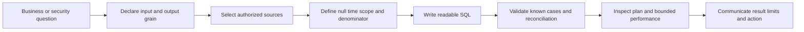

### Diagram C02 - Synthetic normalized core

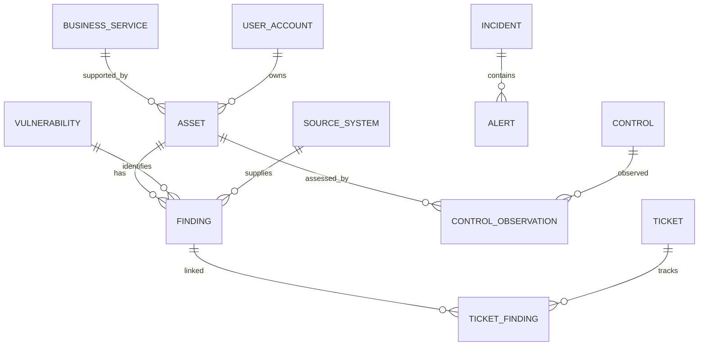

### Diagram C03 - Dimensional analytical path

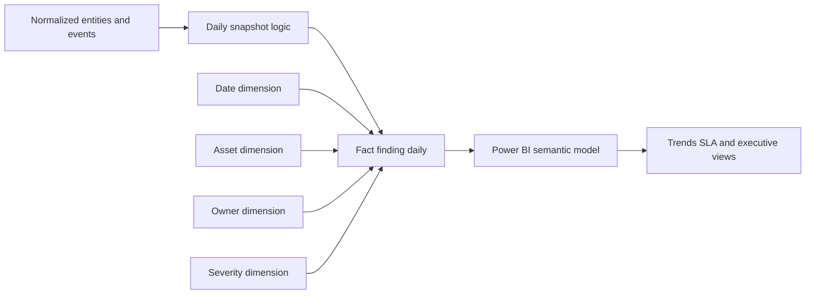

### Diagram C04 - Graph edge table

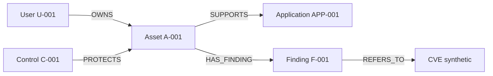

Read [Part 44](Part-44-relational-data-modeling.md), [Part 45](Part-45-analytical-security-data-models.md), [Part 46](Part-46-sql-fundamentals.md), and [Part 47](Part-47-sql-joins-ctes-window-functions.md).

## Synthetic schema and data contract

| Table | One-row grain | Key | Selected fields |
|---|---|---|---|
| `nmh.user_account` | One canonical synthetic account | `user_id` | email, department, manager, status, privileged |
| `nmh.business_service` | One synthetic business service | `service_id` | name, owner, criticality, RTO hours |
| `nmh.asset` | One canonical synthetic asset | `asset_id` | name, type, owner, service, criticality, lifecycle, internet-facing |
| `nmh.vulnerability` | One synthetic vulnerability definition | `vulnerability_id` | CVE, CWE, CVSS, EPSS, KEV, title |
| `nmh.finding` | One source finding instance on one asset | `finding_id` | source, severity, status, first/last observed, due, score, payload |
| `nmh.control` | One governed control definition | `control_id` | name, family, preventive/detective/corrective |
| `nmh.control_observation` | One asset-control-source observation at a time | composite | state, observed time, confidence |
| `nmh.ticket` | One remediation workflow ticket | `ticket_id` | owner, status, dates, SLA tier |
| `nmh.ticket_finding` | One ticket-to-finding relationship | composite | linked time and reason |
| `nmh.alert` | One source alert instance | `alert_id` | entity, source, severity, confidence, time, incident |
| `nmh.incident` | One governed incident | `incident_id` | severity, status, start/detect/contain/close times |
| `nmh.connector_run` | One connector execution | `run_id` | source, status, counts, start/end, checkpoint |
| `nmh.customer_health_daily` | One customer metric snapshot per UTC day | composite | adoption, data health, support risk, outcome score |
| `nmh.entity_edge` | One typed directed entity relationship for a validity interval | `edge_id` | source/target type and ID, relation, confidence, validity |
| `nmh.fact_finding_daily` | One finding state at end of one UTC day | composite | open flag, overdue flag, age days, contextual score |

### Plain-English deep-dive 1 - Grain is the contract before syntax

Suppose one finding is linked to two tickets and three control observations. Joining all three tables directly can produce six rows for the one finding. `COUNT(*)` then reports six findings even though only one exists. SQL did exactly what the join asked. The analyst failed to preserve grain. Think of attaching every ticket receipt to every control receipt: the copies multiply. Pre-aggregate each many-side to one row per finding or use `COUNT(DISTINCT finding_id)` only when that matches the metric definition. Distinct is not a universal repair because it can hide a modeling error.

## Local synthetic setup

The next four examples create a disposable PostgreSQL lab. Use a dedicated local database and schema. Do not adapt these statements into production migration code.

### SQL001 - Create the local lab schema

```sql
CREATE SCHEMA IF NOT EXISTS nmh;
```

**Expected shape/logic:** Creates only the synthetic `nmh` namespace in a disposable local lab; no result rows.  
**Dialect note:** PostgreSQL supports `CREATE SCHEMA IF NOT EXISTS`; syntax differs elsewhere.

### SQL002 - Create core synthetic entity tables

```sql
CREATE TABLE nmh.user_account (
    user_id text PRIMARY KEY,
    email text NOT NULL,
    department text,
    manager_user_id text REFERENCES nmh.user_account(user_id),
    account_status text NOT NULL CHECK (account_status IN ('active', 'disabled')),
    is_privileged boolean NOT NULL DEFAULT false
);

CREATE TABLE nmh.business_service (
    service_id text PRIMARY KEY,
    service_name text NOT NULL,
    owner_user_id text REFERENCES nmh.user_account(user_id),
    criticality text NOT NULL CHECK (criticality IN ('critical', 'high', 'medium', 'low')),
    recovery_time_objective_hours integer CHECK (recovery_time_objective_hours > 0)
);

CREATE TABLE nmh.asset (
    asset_id text PRIMARY KEY,
    asset_name text NOT NULL,
    asset_type text NOT NULL,
    owner_user_id text REFERENCES nmh.user_account(user_id),
    service_id text REFERENCES nmh.business_service(service_id),
    criticality text NOT NULL,
    lifecycle_status text NOT NULL,
    is_internet_facing boolean,
    first_observed_at timestamptz NOT NULL,
    last_observed_at timestamptz NOT NULL
);
```

**Expected shape/logic:** Creates three synthetic relational tables with explicit keys and selected integrity checks.  
**Dialect note:** `timestamptz` and check behavior shown are PostgreSQL; use equivalent timezone-aware types elsewhere.

### SQL003 - Create synthetic finding and workflow tables

```sql
CREATE TABLE nmh.vulnerability (
    vulnerability_id text PRIMARY KEY,
    cve_id text,
    cwe_id text,
    title text NOT NULL,
    cvss_base numeric(3,1),
    epss_probability numeric(6,5),
    is_known_exploited boolean NOT NULL DEFAULT false
);

CREATE TABLE nmh.finding (
    finding_id text PRIMARY KEY,
    asset_id text NOT NULL REFERENCES nmh.asset(asset_id),
    vulnerability_id text REFERENCES nmh.vulnerability(vulnerability_id),
    source_system text NOT NULL,
    source_severity text,
    finding_status text NOT NULL,
    first_observed_at timestamptz NOT NULL,
    last_observed_at timestamptz NOT NULL,
    due_at timestamptz,
    closed_at timestamptz,
    contextual_score numeric(5,2),
    raw_payload jsonb
);

CREATE TABLE nmh.ticket (
    ticket_id text PRIMARY KEY,
    external_key text UNIQUE,
    owner_user_id text REFERENCES nmh.user_account(user_id),
    ticket_status text NOT NULL,
    sla_tier text,
    created_at timestamptz NOT NULL,
    closed_at timestamptz
);

CREATE TABLE nmh.ticket_finding (
    ticket_id text REFERENCES nmh.ticket(ticket_id),
    finding_id text REFERENCES nmh.finding(finding_id),
    linked_at timestamptz NOT NULL,
    link_reason text,
    PRIMARY KEY (ticket_id, finding_id)
);
```

**Expected shape/logic:** Creates synthetic vulnerability, finding, ticket, and bridge tables; the bridge makes many-to-many linkage explicit.  
**Dialect note:** `jsonb` and numeric type details are PostgreSQL-specific.

### SQL004 - Insert a tiny synthetic test fixture

```sql
INSERT INTO nmh.user_account
    (user_id, email, department, manager_user_id, account_status, is_privileged)
VALUES
    ('U-001', 'alex@example.invalid', 'Security', NULL, 'active', true),
    ('U-002', 'casey@example.invalid', 'Infrastructure', 'U-001', 'active', false),
    ('U-003', 'morgan@example.invalid', 'Application', 'U-001', 'disabled', false);

INSERT INTO nmh.business_service
    (service_id, service_name, owner_user_id, criticality, recovery_time_objective_hours)
VALUES
    ('SVC-001', 'Synthetic Patient Portal', 'U-003', 'critical', 4),
    ('SVC-002', 'Synthetic Reporting', 'U-002', 'medium', 24);

INSERT INTO nmh.asset
    (asset_id, asset_name, asset_type, owner_user_id, service_id, criticality,
     lifecycle_status, is_internet_facing, first_observed_at, last_observed_at)
VALUES
    ('A-001', 'web-lab-01', 'server', 'U-003', 'SVC-001', 'critical', 'active', true,
     TIMESTAMPTZ '2026-07-01 00:00:00+00', TIMESTAMPTZ '2026-08-24 08:00:00+00'),
    ('A-002', 'db-lab-01', 'database', 'U-002', 'SVC-001', 'critical', 'active', false,
     TIMESTAMPTZ '2026-07-01 00:00:00+00', TIMESTAMPTZ '2026-08-24 08:00:00+00'),
    ('A-003', 'old-lab-01', 'server', NULL, 'SVC-002', 'medium', 'retired', NULL,
     TIMESTAMPTZ '2026-01-01 00:00:00+00', TIMESTAMPTZ '2026-06-01 00:00:00+00');
```

**Expected shape/logic:** Inserts only synthetic `.invalid` identities and reserved lab entities; subsequent examples can return known answers.  
**Dialect note:** PostgreSQL typed timestamp literals are used. This is the only kind of DML permitted here: local synthetic setup.

## SELECT, expressions, filtering, sorting, and nulls

### SQL005 - Select explicit columns

```sql
SELECT
    asset_id,
    asset_name,
    asset_type,
    criticality
FROM nmh.asset;
```

**Expected shape/logic:** One output row per synthetic asset and four named columns; order is not guaranteed.  
**Dialect note:** Portable SQL. Avoid `SELECT *` in durable analytics because schema drift and sensitive fields can change output.

### SQL006 - Use clear aliases and derived labels

```sql
SELECT
    a.asset_id,
    a.asset_name AS canonical_asset_name,
    'synthetic' AS evidence_class,
    upper(a.criticality) AS criticality_label
FROM nmh.asset AS a;
```

**Expected shape/logic:** One row per asset with renamed and derived text fields.  
**Dialect note:** `upper` is widely supported; identifier quoting and collation vary.

### SQL007 - Filter with explicit Boolean grouping

```sql
SELECT
    a.asset_id,
    a.criticality,
    a.is_internet_facing
FROM nmh.asset AS a
WHERE a.lifecycle_status = 'active'
  AND (
      a.criticality = 'critical'
      OR a.is_internet_facing IS TRUE
  );
```

**Expected shape/logic:** Active assets that are critical or explicitly internet-facing; parentheses make precedence reviewable.  
**Dialect note:** `IS TRUE` is standard-style SQL and preserves unknown separately from false.

### SQL008 - Filter an inclusive range

```sql
SELECT
    f.finding_id,
    f.contextual_score
FROM nmh.finding AS f
WHERE f.contextual_score BETWEEN 70 AND 90;
```

**Expected shape/logic:** One row per finding whose non-null score is inclusively from 70 through 90.  
**Dialect note:** `BETWEEN` is inclusive in common SQL dialects; null scores evaluate unknown and are excluded.

### SQL009 - Filter a controlled list

```sql
SELECT
    f.finding_id,
    f.source_severity
FROM nmh.finding AS f
WHERE f.source_severity IN ('critical', 'high');
```

**Expected shape/logic:** Findings carrying either selected source label; this is source severity, not contextual risk.  
**Dialect note:** Portable SQL; enum spelling and case are data-contract concerns.

### SQL010 - Match text safely for analysis

```sql
SELECT
    a.asset_id,
    a.asset_name
FROM nmh.asset AS a
WHERE lower(a.asset_name) LIKE '%lab%';
```

**Expected shape/logic:** Assets whose normalized name contains `lab`; wildcard search may scan many rows.  
**Dialect note:** PostgreSQL also has `ILIKE`; `lower` plus `LIKE` is more portable but collation still matters.

### SQL011 - Handle SQL null explicitly

```sql
SELECT
    a.asset_id,
    a.owner_user_id,
    a.is_internet_facing
FROM nmh.asset AS a
WHERE a.owner_user_id IS NULL
   OR a.is_internet_facing IS NULL;
```

**Expected shape/logic:** Assets with unknown owner or unknown exposure flag; no comparison with `= NULL` is used.  
**Dialect note:** Portable SQL. SQL null is not zero, empty text, false, or not applicable.

### SQL012 - Label null without overwriting meaning

```sql
SELECT
    a.asset_id,
    coalesce(a.owner_user_id, '[unknown-owner]') AS owner_display,
    CASE
        WHEN a.is_internet_facing IS TRUE THEN 'yes'
        WHEN a.is_internet_facing IS FALSE THEN 'no'
        ELSE 'unknown'
    END AS internet_exposure_display
FROM nmh.asset AS a;
```

**Expected shape/logic:** Presentation labels preserve three states for exposure and make missing owner visible.  
**Dialect note:** `coalesce` and searched `CASE` are broadly portable. Do not store display labels back into canonical data.

### SQL013 - Sort deterministically

```sql
SELECT
    a.asset_id,
    a.criticality,
    a.asset_name
FROM nmh.asset AS a
ORDER BY
    CASE a.criticality
        WHEN 'critical' THEN 1
        WHEN 'high' THEN 2
        WHEN 'medium' THEN 3
        WHEN 'low' THEN 4
        ELSE 5
    END,
    a.asset_name,
    a.asset_id;
```

**Expected shape/logic:** Assets ordered by governed severity rank, then stable name and ID tie-breakers.  
**Dialect note:** Portable SQL. Alphabetical severity order is usually not business order.

### SQL014 - Bound a top-N result

```sql
SELECT
    f.finding_id,
    f.asset_id,
    f.contextual_score
FROM nmh.finding AS f
WHERE f.finding_status = 'open'
ORDER BY f.contextual_score DESC NULLS LAST, f.finding_id
LIMIT 10;
```

**Expected shape/logic:** At most ten open findings with highest non-null scores and deterministic ties.  
**Dialect note:** PostgreSQL supports `NULLS LAST` and `LIMIT`; SQL Server uses `TOP`/`OFFSET FETCH` patterns.

### SQL015 - Remove duplicate output combinations deliberately

```sql
SELECT DISTINCT
    f.source_system,
    f.source_severity
FROM nmh.finding AS f
ORDER BY f.source_system, f.source_severity;
```

**Expected shape/logic:** One row per observed source/severity combination, not one row per finding.  
**Dialect note:** Portable SQL. `DISTINCT` applies to the whole selected row and should not hide accidental join duplication.

### Plain-English deep-dive 2 - SQL has true, false, and unknown

If `is_internet_facing` is null, the predicate `is_internet_facing = false` is not true; it is unknown. `WHERE` keeps only true rows, so unknown disappears. That may hide exactly the assets needing investigation. Think of a form asking `Is the door locked?` with answers yes, no, and not checked. Treating not checked as no would be unsafe. Write explicit null branches and publish unknown counts.

| Conceptual stage | Main question | Frequent review defect |
|---|---|---|
| `FROM`/`JOIN` | Which source rows and relationships exist? | Unexpected fanout or missing match |
| `WHERE` | Which input rows remain true? | Null rows silently disappear |
| `GROUP BY` | Which rows form each output group? | Selected fields do not match grain |
| `HAVING` | Which completed groups remain? | Aggregate condition incorrectly placed in `WHERE` |
| `SELECT` | Which expressions form output? | Sensitive or unstable columns included |
| `DISTINCT` | Which identical output rows collapse? | Used to hide a bad join |
| `ORDER BY` | What deterministic order applies? | Missing stable tie-breaker |
| `LIMIT` | Which bounded ordered subset returns? | Limit used without order |

## Aggregation and metric contracts

| Aggregate | Ignores null input? | Security use | Main caution |
|---|---|---|---|
| `count(*)` | No, counts rows | Record population | Row grain may already be multiplied |
| `count(column)` | Yes | Present-value count | Missingness becomes invisible without total |
| `sum` | Yes | Additive event or flag totals | Snapshot and score measures may not be additive |
| `avg` | Yes | Average latency or score | Publish non-null population and distribution |
| `min`/`max` | Yes | Earliest due date or highest score | Does not identify the complete corresponding row |
| `percentile_cont` | Yes | Median and tail analysis | Platform syntax and interpolation vary |

### SQL016 - Count rows and non-null values

```sql
SELECT
    count(*) AS asset_rows,
    count(a.owner_user_id) AS assets_with_nonnull_owner,
    count(*) - count(a.owner_user_id) AS assets_with_null_owner
FROM nmh.asset AS a;
```

**Expected shape/logic:** Exactly one summary row; `count(column)` excludes null while `count(*)` counts rows.  
**Dialect note:** Portable SQL.

### SQL017 - Group assets by criticality

```sql
SELECT
    a.criticality,
    count(*) AS asset_count
FROM nmh.asset AS a
GROUP BY a.criticality
ORDER BY asset_count DESC, a.criticality;
```

**Expected shape/logic:** One row per observed criticality with asset count.  
**Dialect note:** PostgreSQL allows output alias in `ORDER BY`; broadly supported.

### SQL018 - Filter groups with HAVING

```sql
SELECT
    f.asset_id,
    count(*) AS open_finding_count
FROM nmh.finding AS f
WHERE f.finding_status = 'open'
GROUP BY f.asset_id
HAVING count(*) >= 5
ORDER BY open_finding_count DESC, f.asset_id;
```

**Expected shape/logic:** One row per asset having at least five open finding instances.  
**Dialect note:** Portable SQL. `WHERE` filters rows before grouping; `HAVING` filters groups.

### SQL019 - Calculate a rate with an explicit denominator

```sql
SELECT
    count(*) FILTER (WHERE a.owner_user_id IS NOT NULL) AS owned_assets,
    count(*) AS eligible_assets,
    round(
        100.0 * count(*) FILTER (WHERE a.owner_user_id IS NOT NULL)
        / nullif(count(*), 0),
        2
    ) AS ownership_percent
FROM nmh.asset AS a
WHERE a.lifecycle_status = 'active';
```

**Expected shape/logic:** One row with numerator, denominator, and active-asset ownership percentage; zero denominator yields null.  
**Dialect note:** PostgreSQL `FILTER` is not supported everywhere; use `SUM(CASE WHEN ... THEN 1 ELSE 0 END)` for portability.

### SQL020 - Conditional aggregation for a compact quality profile

```sql
SELECT
    count(*) AS active_assets,
    sum(CASE WHEN a.owner_user_id IS NULL THEN 1 ELSE 0 END) AS missing_owner,
    sum(CASE WHEN a.service_id IS NULL THEN 1 ELSE 0 END) AS missing_service,
    sum(CASE WHEN a.is_internet_facing IS NULL THEN 1 ELSE 0 END) AS unknown_exposure
FROM nmh.asset AS a
WHERE a.lifecycle_status = 'active';
```

**Expected shape/logic:** One row containing selected completeness counts for active assets.  
**Dialect note:** Portable pattern; some engines require explicit numeric casts.

### SQL021 - Average only after showing population

```sql
SELECT
    f.source_system,
    count(f.contextual_score) AS scored_findings,
    count(*) AS all_findings,
    round(avg(f.contextual_score), 2) AS average_contextual_score
FROM nmh.finding AS f
GROUP BY f.source_system
ORDER BY f.source_system;
```

**Expected shape/logic:** One row per source showing how many scores feed the average and how many findings lack one.  
**Dialect note:** PostgreSQL `round(numeric, integer)` is used; casts may be required in other engines.

### SQL022 - Percentile for finding age

```sql
SELECT
    percentile_cont(0.50) WITHIN GROUP (
        ORDER BY extract(epoch FROM (TIMESTAMPTZ '2026-08-24 00:00:00+00' - f.first_observed_at)) / 86400.0
    ) AS median_age_days,
    percentile_cont(0.95) WITHIN GROUP (
        ORDER BY extract(epoch FROM (TIMESTAMPTZ '2026-08-24 00:00:00+00' - f.first_observed_at)) / 86400.0
    ) AS p95_age_days
FROM nmh.finding AS f
WHERE f.finding_status = 'open';
```

**Expected shape/logic:** One row with median and 95th-percentile age among open findings at a fixed synthetic as-of time.  
**Dialect note:** Ordered-set aggregate syntax is PostgreSQL; use platform equivalents such as `PERCENTILE_CONT` window/aggregate forms.

### SQL023 - Weighted score with visible factors

```sql
SELECT
    f.finding_id,
    v.cvss_base,
    v.epss_probability,
    a.criticality,
    round(
        coalesce(v.cvss_base, 0) * 5
        + coalesce(v.epss_probability, 0) * 30
        + CASE a.criticality WHEN 'critical' THEN 20 WHEN 'high' THEN 10 ELSE 0 END
        + CASE WHEN a.is_internet_facing IS TRUE THEN 15 ELSE 0 END,
        2
    ) AS synthetic_priority_score
FROM nmh.finding AS f
JOIN nmh.vulnerability AS v ON v.vulnerability_id = f.vulnerability_id
JOIN nmh.asset AS a ON a.asset_id = f.asset_id;
```

**Expected shape/logic:** One row per matched finding with visible synthetic ingredients and a lab-only score.  
**Dialect note:** PostgreSQL numeric behavior shown. This is not a product formula or recommended production model.

### SQL024 - Recompute a combined SLA rate correctly

```sql
WITH owner_counts AS (
    SELECT
        t.owner_user_id,
        count(*) FILTER (WHERE t.closed_at IS NOT NULL AND t.closed_at <= t.created_at + interval '7 days') AS met_count,
        count(*) FILTER (WHERE t.closed_at IS NOT NULL) AS eligible_count
    FROM nmh.ticket AS t
    GROUP BY t.owner_user_id
)
SELECT
    sum(met_count) AS total_met,
    sum(eligible_count) AS total_eligible,
    round(100.0 * sum(met_count) / nullif(sum(eligible_count), 0), 2) AS combined_percent
FROM owner_counts;
```

**Expected shape/logic:** One correctly weighted combined rate from summed counts, not an unweighted average of owner percentages.  
**Dialect note:** PostgreSQL interval syntax; time targets should come from a governed SLA table in real designs.

## Joins, anti-joins, semi-joins, and set operations

### SQL025 - Inner join asset and service context

```sql
SELECT
    a.asset_id,
    a.asset_name,
    s.service_name,
    s.criticality AS service_criticality
FROM nmh.asset AS a
JOIN nmh.business_service AS s
  ON s.service_id = a.service_id;
```

**Expected shape/logic:** One row per asset with a valid service match; orphan/null service assets disappear.  
**Dialect note:** Portable SQL.

### SQL026 - Left join to preserve all assets

```sql
SELECT
    a.asset_id,
    a.asset_name,
    s.service_name
FROM nmh.asset AS a
LEFT JOIN nmh.business_service AS s
  ON s.service_id = a.service_id
ORDER BY a.asset_id;
```

**Expected shape/logic:** One row per asset; missing service context appears as null.  
**Dialect note:** Portable SQL. Keep right-side optional predicates in `ON` when preservation is intended.

### SQL027 - Anti-join for ownerless active assets

```sql
SELECT
    a.asset_id,
    a.asset_name
FROM nmh.asset AS a
LEFT JOIN nmh.user_account AS u
  ON u.user_id = a.owner_user_id
 AND u.account_status = 'active'
WHERE a.lifecycle_status = 'active'
  AND u.user_id IS NULL;
```

**Expected shape/logic:** Active assets without a matching active owner account, including null, missing, or disabled owner references.  
**Dialect note:** Portable anti-join pattern.

### SQL028 - NOT EXISTS anti-join for findings without tickets

```sql
SELECT
    f.finding_id,
    f.asset_id,
    f.contextual_score
FROM nmh.finding AS f
WHERE f.finding_status = 'open'
  AND NOT EXISTS (
      SELECT 1
      FROM nmh.ticket_finding AS tf
      WHERE tf.finding_id = f.finding_id
  );
```

**Expected shape/logic:** One row per open finding with no ticket relationship.  
**Dialect note:** Portable SQL; `NOT EXISTS` avoids `NOT IN` null surprises.

### SQL029 - EXISTS semi-join for assets with open findings

```sql
SELECT
    a.asset_id,
    a.asset_name
FROM nmh.asset AS a
WHERE EXISTS (
    SELECT 1
    FROM nmh.finding AS f
    WHERE f.asset_id = a.asset_id
      AND f.finding_status = 'open'
);
```

**Expected shape/logic:** At most one row per asset even if many open findings exist.  
**Dialect note:** Portable SQL and often clearer than joining plus `DISTINCT`.

### SQL030 - Pre-aggregate before joining two many-sides

```sql
WITH finding_counts AS (
    SELECT asset_id, count(*) AS open_findings
    FROM nmh.finding
    WHERE finding_status = 'open'
    GROUP BY asset_id
),
ticket_counts AS (
    SELECT f.asset_id, count(DISTINCT tf.ticket_id) AS linked_tickets
    FROM nmh.finding AS f
    JOIN nmh.ticket_finding AS tf ON tf.finding_id = f.finding_id
    GROUP BY f.asset_id
)
SELECT
    a.asset_id,
    coalesce(fc.open_findings, 0) AS open_findings,
    coalesce(tc.linked_tickets, 0) AS linked_tickets
FROM nmh.asset AS a
LEFT JOIN finding_counts AS fc ON fc.asset_id = a.asset_id
LEFT JOIN ticket_counts AS tc ON tc.asset_id = a.asset_id;
```

**Expected shape/logic:** Exactly one row per asset with independently aggregated finding and ticket measures.  
**Dialect note:** Portable CTE pattern; some optimizer behavior differs by engine/version.

### SQL031 - UNION ALL for compatible event streams

```sql
SELECT
    f.finding_id AS object_id,
    'finding_opened' AS event_type,
    f.first_observed_at AS event_at
FROM nmh.finding AS f
UNION ALL
SELECT
    t.ticket_id AS object_id,
    'ticket_created' AS event_type,
    t.created_at AS event_at
FROM nmh.ticket AS t;
```

**Expected shape/logic:** Appends finding and ticket events without deduplication; output grain is one synthetic event row.  
**Dialect note:** Portable SQL; types must be union-compatible.

### SQL032 - UNION removes identical rows

```sql
SELECT owner_user_id
FROM nmh.asset
WHERE owner_user_id IS NOT NULL
UNION
SELECT owner_user_id
FROM nmh.ticket
WHERE owner_user_id IS NOT NULL;
```

**Expected shape/logic:** One distinct owner ID appearing in either assets or tickets.  
**Dialect note:** Portable SQL. `UNION` adds duplicate-removal work; prefer `UNION ALL` when duplicates are meaningful.

### SQL033 - INTERSECT owners present in both domains

```sql
SELECT owner_user_id
FROM nmh.asset
WHERE owner_user_id IS NOT NULL
INTERSECT
SELECT owner_user_id
FROM nmh.ticket
WHERE owner_user_id IS NOT NULL;
```

**Expected shape/logic:** Distinct owners appearing in both asset and ticket records.  
**Dialect note:** PostgreSQL and many platforms support `INTERSECT`; MySQL version support should be checked.

### SQL034 - EXCEPT for owners missing ticket ownership

```sql
SELECT owner_user_id
FROM nmh.asset
WHERE owner_user_id IS NOT NULL
EXCEPT
SELECT owner_user_id
FROM nmh.ticket
WHERE owner_user_id IS NOT NULL;
```

**Expected shape/logic:** Distinct asset owners who do not appear as ticket owners.  
**Dialect note:** SQL Server uses `EXCEPT`; Oracle commonly uses `MINUS`; validate platform syntax.

### Diagram C05 - Join fanout test

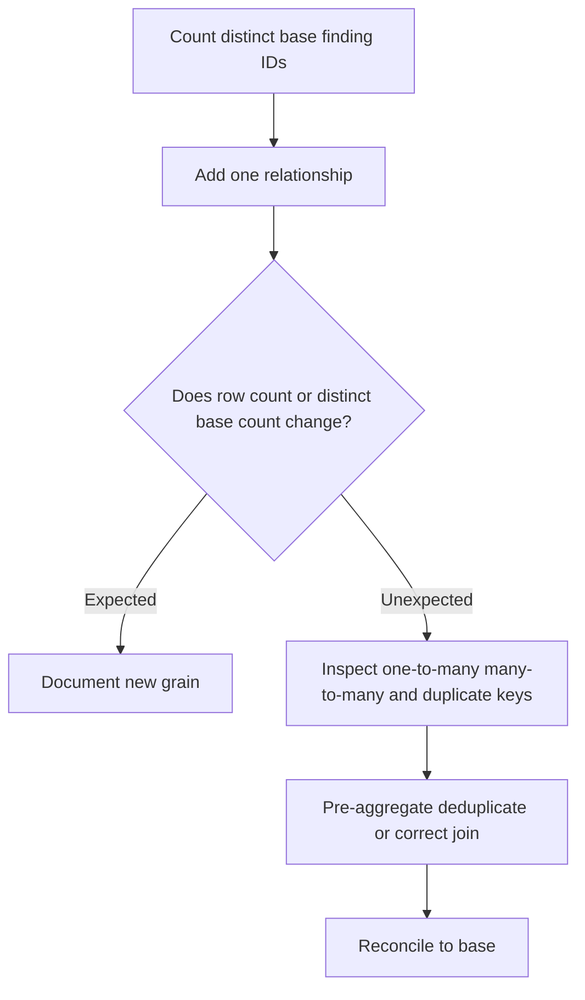

## CTEs, subqueries, and window functions

### SQL035 - CTE as a named analytical stage

```sql
WITH active_critical_assets AS (
    SELECT asset_id, asset_name, owner_user_id
    FROM nmh.asset
    WHERE lifecycle_status = 'active'
      AND criticality = 'critical'
)
SELECT
    owner_user_id,
    count(*) AS critical_asset_count
FROM active_critical_assets
GROUP BY owner_user_id;
```

**Expected shape/logic:** One row per owner, including a null owner group, for active critical assets.  
**Dialect note:** Portable CTE; a CTE improves readability but does not guarantee materialization.

### SQL036 - Scalar subquery with a safe aggregate

```sql
SELECT
    a.asset_id,
    a.asset_name,
    (
        SELECT max(f.contextual_score)
        FROM nmh.finding AS f
        WHERE f.asset_id = a.asset_id
          AND f.finding_status = 'open'
    ) AS highest_open_score
FROM nmh.asset AS a;
```

**Expected shape/logic:** One row per asset with maximum open-finding score or null when none exists.  
**Dialect note:** Portable correlated scalar subquery; compare plan with pre-aggregation on large data.

### SQL037 - ROW_NUMBER for latest record selection

```sql
WITH ranked AS (
    SELECT
        co.*,
        row_number() OVER (
            PARTITION BY co.asset_id, co.control_id
            ORDER BY co.observed_at DESC, co.source_system, co.observation_id DESC
        ) AS row_rank
    FROM nmh.control_observation AS co
)
SELECT
    asset_id,
    control_id,
    control_state,
    observed_at
FROM ranked
WHERE row_rank = 1;
```

**Expected shape/logic:** One deterministic latest observation per asset/control pair.  
**Dialect note:** Assumes the documented table and tie-breaker exist; window syntax is widely supported.

### SQL038 - RANK for tied priorities

```sql
SELECT
    f.finding_id,
    f.contextual_score,
    rank() OVER (
        ORDER BY f.contextual_score DESC NULLS LAST
    ) AS priority_rank
FROM nmh.finding AS f
WHERE f.finding_status = 'open';
```

**Expected shape/logic:** Open findings with equal scores sharing rank and gaps after ties.  
**Dialect note:** `NULLS LAST` is PostgreSQL syntax; emulate explicitly where unsupported.

### SQL039 - DENSE_RANK for priority bands

```sql
SELECT
    f.finding_id,
    f.contextual_score,
    dense_rank() OVER (
        ORDER BY f.contextual_score DESC NULLS LAST
    ) AS dense_priority_rank
FROM nmh.finding AS f
WHERE f.finding_status = 'open';
```

**Expected shape/logic:** Equal scores share rank and the next distinct score receives the next consecutive rank.  
**Dialect note:** Window function is broadly supported; null ordering varies.

### SQL040 - Running count by first observation

```sql
SELECT
    f.finding_id,
    f.first_observed_at,
    count(*) OVER (
        ORDER BY f.first_observed_at, f.finding_id
        ROWS BETWEEN UNBOUNDED PRECEDING AND CURRENT ROW
    ) AS cumulative_findings
FROM nmh.finding AS f;
```

**Expected shape/logic:** One row per finding with deterministic cumulative count by first-observed order.  
**Dialect note:** Explicit `ROWS` avoids peer-group surprises from default window frames.

### SQL041 - Seven-day rolling average

```sql
SELECT
    h.snapshot_date,
    h.adoption_score,
    avg(h.adoption_score) OVER (
        ORDER BY h.snapshot_date
        ROWS BETWEEN 6 PRECEDING AND CURRENT ROW
    ) AS adoption_7_row_average
FROM nmh.customer_health_daily AS h
ORDER BY h.snapshot_date;
```

**Expected shape/logic:** One row per available daily snapshot with average of current and prior six rows.  
**Dialect note:** This is seven rows, not guaranteed seven calendar days if dates are missing; use a calendar join for continuous days.

### SQL042 - LAG for day-over-day change

```sql
SELECT
    h.snapshot_date,
    h.data_health_score,
    h.data_health_score
      - lag(h.data_health_score) OVER (ORDER BY h.snapshot_date) AS change_from_prior_row
FROM nmh.customer_health_daily AS h
ORDER BY h.snapshot_date;
```

**Expected shape/logic:** One row per snapshot with null change on the first row and difference from previous available snapshot thereafter.  
**Dialect note:** `lag` is broadly supported; missing calendar dates need explicit handling.

### SQL043 - LEAD for next workflow event

```sql
SELECT
    e.finding_id,
    e.status,
    e.changed_at,
    lead(e.status) OVER (
        PARTITION BY e.finding_id
        ORDER BY e.changed_at, e.event_id
    ) AS next_status,
    lead(e.changed_at) OVER (
        PARTITION BY e.finding_id
        ORDER BY e.changed_at, e.event_id
    ) AS next_changed_at
FROM nmh.finding_status_event AS e;
```

**Expected shape/logic:** One row per status event with the next event's status and time for the same finding.  
**Dialect note:** Assumes a synthetic event table; event ID provides deterministic ties.

### SQL044 - NTILE for workload bands

```sql
WITH owner_backlog AS (
    SELECT
        a.owner_user_id,
        count(*) AS open_findings
    FROM nmh.finding AS f
    JOIN nmh.asset AS a ON a.asset_id = f.asset_id
    WHERE f.finding_status = 'open'
    GROUP BY a.owner_user_id
)
SELECT
    owner_user_id,
    open_findings,
    ntile(4) OVER (ORDER BY open_findings DESC) AS backlog_quartile
FROM owner_backlog;
```

**Expected shape/logic:** Owners distributed across four row-count bands; small populations may leave bands uneven.  
**Dialect note:** `ntile` is broadly supported; quartiles are descriptive, not SLA tiers.

### SQL045 - FIRST_VALUE with an explicit full frame

```sql
SELECT
    f.asset_id,
    f.finding_id,
    f.contextual_score,
    first_value(f.finding_id) OVER (
        PARTITION BY f.asset_id
        ORDER BY f.contextual_score DESC NULLS LAST, f.finding_id
        ROWS BETWEEN UNBOUNDED PRECEDING AND UNBOUNDED FOLLOWING
    ) AS highest_priority_finding_id
FROM nmh.finding AS f
WHERE f.finding_status = 'open';
```

**Expected shape/logic:** Every open finding row also shows its asset's deterministic highest-priority finding ID.  
**Dialect note:** Full frame is explicit; default frame behavior can surprise with `last_value` and peers.

### Diagram C06 - Window functions preserve rows

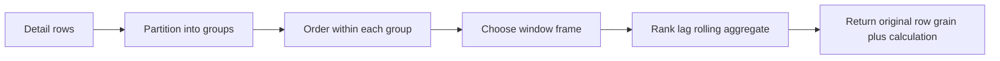

| Window function | Result | Useful security pattern | Tie/frame caution |
|---|---|---|---|
| `row_number` | Unique sequence within partition | Select one deterministic latest record | Must include stable tie-breaker |
| `rank` | Equal values share rank with gaps | Priority competition ranking | Ties create skipped ranks |
| `dense_rank` | Equal values share rank without gaps | Distinct score bands | Still not a business severity definition |
| `lag`/`lead` | Prior or next row value | Status transitions and trend changes | Previous row may not mean previous calendar day |
| Running aggregate | Value from frame to current row | Cumulative events | Specify `ROWS` versus `RANGE` behavior |
| Rolling aggregate | Value over bounded frame | Moving health or alert baseline | Rows are not calendar duration when dates are missing |
| `first_value`/`last_value` | Boundary value in frame | Highest item or latest state | Default frame can surprise, especially `last_value` |

## Dates, intervals, snapshots, and SLA logic

| Temporal field | Meaning | Correct analytical use | Confusion to avoid |
|---|---|---|---|
| Event time | When source says activity occurred | Incident and behavior timeline | Ingest time is not event time |
| Observed time | When a source measured a condition | Freshness and current-state evidence | First observed is not condition creation |
| Ingest time | When pipeline received a record | Latency and late-data analysis | Does not establish source occurrence |
| Effective interval | When a version or relationship is valid | Historical entity and policy joins | Current value should not rewrite history |
| Snapshot date | State represented at a chosen boundary | Backlog and posture trend | Do not sum state across dates |
| Due time | Governed deadline under a rule version | SLA aging and breach analysis | Target may differ by tier and exception |
| As-of time | Fixed evaluation instant | Reproducible age and status | `current_timestamp` changes rerun answers |

### SQL046 - Normalize display to UTC date

```sql
SELECT
    f.finding_id,
    f.first_observed_at,
    (f.first_observed_at AT TIME ZONE 'UTC')::date AS first_observed_utc_date
FROM nmh.finding AS f;
```

**Expected shape/logic:** One row per finding with original timezone-aware timestamp and derived UTC calendar date.  
**Dialect note:** PostgreSQL `AT TIME ZONE` and cast syntax; timezone semantics differ across platforms.

### SQL047 - Calculate finding age at a fixed as-of time

```sql
SELECT
    f.finding_id,
    floor(
        extract(epoch FROM (
            TIMESTAMPTZ '2026-08-24 00:00:00+00' - f.first_observed_at
        )) / 86400.0
    ) AS age_days
FROM nmh.finding AS f
WHERE f.finding_status = 'open';
```

**Expected shape/logic:** Open findings with whole elapsed 24-hour periods at a fixed reproducible timestamp.  
**Dialect note:** PostgreSQL interval/epoch functions; calendar-day age is a different contract.

### SQL048 - Group by UTC month

```sql
SELECT
    date_trunc('month', f.first_observed_at AT TIME ZONE 'UTC')::date AS opened_month,
    count(*) AS findings_opened
FROM nmh.finding AS f
GROUP BY opened_month
ORDER BY opened_month;
```

**Expected shape/logic:** One row per UTC month with count of finding instances first observed.  
**Dialect note:** PostgreSQL `date_trunc`; use engine-specific month functions elsewhere.

### SQL049 - Generate a complete daily calendar

```sql
WITH calendar AS (
    SELECT day::date AS snapshot_date
    FROM generate_series(
        DATE '2026-08-01',
        DATE '2026-08-24',
        interval '1 day'
    ) AS day
)
SELECT
    c.snapshot_date,
    coalesce(count(f.finding_id), 0) AS findings_opened
FROM calendar AS c
LEFT JOIN nmh.finding AS f
  ON (f.first_observed_at AT TIME ZONE 'UTC')::date = c.snapshot_date
GROUP BY c.snapshot_date
ORDER BY c.snapshot_date;
```

**Expected shape/logic:** Exactly one row for every date in range, including zero-count dates.  
**Dialect note:** `generate_series` is PostgreSQL-specific; use a permanent date dimension for portable BI.

### SQL050 - Identify overdue open findings

```sql
SELECT
    f.finding_id,
    f.asset_id,
    f.due_at,
    TIMESTAMPTZ '2026-08-24 00:00:00+00' - f.due_at AS overdue_by
FROM nmh.finding AS f
WHERE f.finding_status = 'open'
  AND f.due_at IS NOT NULL
  AND f.due_at < TIMESTAMPTZ '2026-08-24 00:00:00+00'
ORDER BY f.due_at, f.finding_id;
```

**Expected shape/logic:** One row per open finding past a non-null due timestamp at the fixed as-of time.  
**Dialect note:** PostgreSQL returns an interval; other engines use date-difference functions.

### SQL051 - SLA attainment with eligible population

```sql
SELECT
    t.sla_tier,
    count(*) FILTER (WHERE t.closed_at IS NOT NULL) AS closed_eligible,
    count(*) FILTER (
        WHERE t.closed_at IS NOT NULL
          AND t.closed_at <= t.created_at
              + CASE t.sla_tier
                    WHEN 'tier_1' THEN interval '2 days'
                    WHEN 'tier_2' THEN interval '7 days'
                    ELSE interval '30 days'
                END
    ) AS met_sla
FROM nmh.ticket AS t
GROUP BY t.sla_tier;
```

**Expected shape/logic:** One row per SLA tier with closed-ticket denominator and count meeting the synthetic duration.  
**Dialect note:** Targets are lab-only and should be joined from a versioned SLA contract in real analysis.

### SQL052 - Detect reopened lifecycle events

```sql
WITH transitions AS (
    SELECT
        e.finding_id,
        e.status,
        lag(e.status) OVER (
            PARTITION BY e.finding_id
            ORDER BY e.changed_at, e.event_id
        ) AS prior_status
    FROM nmh.finding_status_event AS e
)
SELECT
    finding_id,
    count(*) AS reopen_count
FROM transitions
WHERE prior_status = 'closed'
  AND status = 'open'
GROUP BY finding_id;
```

**Expected shape/logic:** One row per finding that transitioned from closed to open, with number of reopen events.  
**Dialect note:** Portable window pattern; status vocabulary and event completeness are contract dependencies.

### SQL053 - Snapshot backlog without summing days

```sql
SELECT
    d.snapshot_date,
    sum(d.open_flag) AS open_backlog_at_day_end,
    sum(d.overdue_flag) AS overdue_backlog_at_day_end
FROM nmh.fact_finding_daily AS d
GROUP BY d.snapshot_date
ORDER BY d.snapshot_date;
```

**Expected shape/logic:** One row per snapshot date; sums within a date, never across dates, because backlog is semi-additive over time.  
**Dialect note:** Portable SQL when flags are numeric; Boolean aggregation differs.

### Diagram C07 - Event versus snapshot time

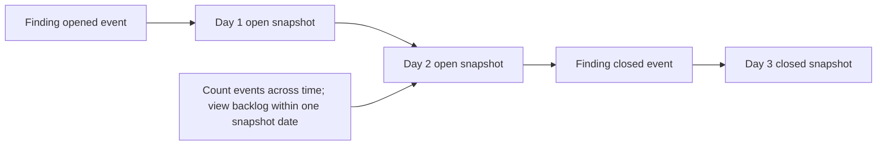

## JSON and semi-structured security data

| JSON/SQL state | Example | Recommended interpretation | Query implication |
|---|---|---|---|
| Missing key | `{}` lacks `port` | Source did not supply the element | Test key existence separately |
| JSON null | `{"port": null}` | Source explicitly supplied JSON null | Preserve distinction if contract needs it |
| SQL null | Relational expression is null | Database has no value under current expression | Use `IS NULL`, not equality |
| Empty string | `{"port": ""}` | Present text with zero characters | Usually invalid for numeric port, not null |
| Wrong type | `{"port": "443"}` when number required | Schema/type drift or source contract variation | Validate type before cast |
| Valid scalar | `{"port": 443}` | Numeric value still needs range and semantic validation | Check 0-65535 and transport context |

### SQL054 - Extract JSON text safely

```sql
SELECT
    f.finding_id,
    f.raw_payload ->> 'scanner_plugin_id' AS scanner_plugin_id,
    f.raw_payload ->> 'evidence_summary' AS evidence_summary
FROM nmh.finding AS f
WHERE f.raw_payload IS NOT NULL;
```

**Expected shape/logic:** One row per finding with a payload; missing keys yield SQL null in PostgreSQL text extraction.  
**Dialect note:** PostgreSQL `jsonb` operators; SQL Server, BigQuery, Snowflake, and others use different JSON functions.

### SQL055 - Distinguish missing JSON key from present key

```sql
SELECT
    f.finding_id,
    f.raw_payload ? 'scanner_plugin_id' AS has_plugin_key,
    f.raw_payload -> 'scanner_plugin_id' AS plugin_json_value
FROM nmh.finding AS f
WHERE f.raw_payload IS NOT NULL;
```

**Expected shape/logic:** One row per payload-bearing finding with key-presence Boolean and raw JSON value.  
**Dialect note:** PostgreSQL `?` key-existence operator is dialect-specific; JSON null and missing key remain distinct concepts.

### SQL056 - Validate JSON scalar type before casting

```sql
SELECT
    f.finding_id,
    CASE
        WHEN jsonb_typeof(f.raw_payload -> 'port') = 'number'
        THEN (f.raw_payload ->> 'port')::integer
        ELSE NULL
    END AS validated_port
FROM nmh.finding AS f
WHERE f.raw_payload IS NOT NULL;
```

**Expected shape/logic:** One row per payload-bearing finding; only numeric JSON port values are cast.  
**Dialect note:** PostgreSQL-specific. Range validation from 0 through 65535 should be an additional rule.

### SQL057 - Expand a JSON array

```sql
SELECT
    f.finding_id,
    tag.value AS source_tag
FROM nmh.finding AS f
CROSS JOIN LATERAL jsonb_array_elements_text(
    coalesce(f.raw_payload -> 'tags', '[]'::jsonb)
) AS tag(value);
```

**Expected shape/logic:** Zero or more rows per finding, one for each JSON tag; output grain changes to finding-tag.  
**Dialect note:** PostgreSQL lateral and JSON functions; exploding arrays can multiply rows dramatically.

### SQL058 - Aggregate relational values to JSON for an export

```sql
SELECT
    a.asset_id,
    jsonb_build_object(
        'asset_name', a.asset_name,
        'criticality', a.criticality,
        'open_findings', count(f.finding_id) FILTER (WHERE f.finding_status = 'open')
    ) AS synthetic_asset_summary
FROM nmh.asset AS a
LEFT JOIN nmh.finding AS f ON f.asset_id = a.asset_id
GROUP BY a.asset_id, a.asset_name, a.criticality;
```

**Expected shape/logic:** One row per asset with a generated synthetic JSON summary.  
**Dialect note:** PostgreSQL JSON construction; output is a template, not a product API contract.

### SQL059 - Find unexpected JSON keys

```sql
WITH allowed_keys(key_name) AS (
    VALUES ('scanner_plugin_id'), ('evidence_summary'), ('port'), ('tags')
),
observed_keys AS (
    SELECT DISTINCT jsonb_object_keys(f.raw_payload) AS key_name
    FROM nmh.finding AS f
    WHERE f.raw_payload IS NOT NULL
)
SELECT o.key_name
FROM observed_keys AS o
LEFT JOIN allowed_keys AS a USING (key_name)
WHERE a.key_name IS NULL
ORDER BY o.key_name;
```

**Expected shape/logic:** One row per observed payload key outside the synthetic allowlist.  
**Dialect note:** PostgreSQL JSON and `VALUES` syntax; schema drift can be legitimate and requires source-owner review.

## Deduplication, entity resolution, and survivorship

### SQL060 - Detect duplicate business-key candidates

```sql
SELECT
    lower(trim(a.asset_name)) AS normalized_name,
    count(*) AS candidate_count,
    array_agg(a.asset_id ORDER BY a.asset_id) AS asset_ids
FROM nmh.asset AS a
GROUP BY lower(trim(a.asset_name))
HAVING count(*) > 1;
```

**Expected shape/logic:** One row per duplicated normalized name with candidate IDs; it is a review queue, not an automatic merge.  
**Dialect note:** PostgreSQL `array_agg`; use string/list aggregation equivalents elsewhere.

### SQL061 - Deterministic source-record winner

```sql
WITH ranked AS (
    SELECT
        r.*,
        row_number() OVER (
            PARTITION BY r.source_system, r.source_asset_id
            ORDER BY r.observed_at DESC, r.ingested_at DESC, r.raw_record_id DESC
        ) AS winner_rank
    FROM nmh.raw_asset_record AS r
)
SELECT *
FROM ranked
WHERE winner_rank = 1;
```

**Expected shape/logic:** One latest deterministic record per source-native asset ID.  
**Dialect note:** Assumes synthetic raw table; `SELECT *` is acceptable only for this bounded inspection example, not durable production output.

### SQL062 - Survivorship by field authority

```sql
SELECT
    a.asset_id,
    coalesce(cmdb.owner_user_id, edr.owner_user_id, cloud.owner_user_id) AS surviving_owner,
    CASE
        WHEN cmdb.owner_user_id IS NOT NULL THEN 'cmdb'
        WHEN edr.owner_user_id IS NOT NULL THEN 'edr'
        WHEN cloud.owner_user_id IS NOT NULL THEN 'cloud'
        ELSE 'unknown'
    END AS owner_provenance
FROM nmh.asset AS a
LEFT JOIN nmh.asset_source_current AS cmdb
  ON cmdb.asset_id = a.asset_id AND cmdb.source_system = 'synthetic_cmdb'
LEFT JOIN nmh.asset_source_current AS edr
  ON edr.asset_id = a.asset_id AND edr.source_system = 'synthetic_edr'
LEFT JOIN nmh.asset_source_current AS cloud
  ON cloud.asset_id = a.asset_id AND cloud.source_system = 'synthetic_cloud';
```

**Expected shape/logic:** One row per asset with owner chosen by synthetic precedence and provenance named.  
**Dialect note:** Portable SQL. Real survivorship must consider time, scope, confidence, exceptions, and field-specific authority.

### SQL063 - Match candidates with multiple signals

```sql
SELECT
    left_record.raw_record_id AS left_id,
    right_record.raw_record_id AS right_id,
    (left_record.normalized_hostname = right_record.normalized_hostname)::integer
      + (left_record.serial_number = right_record.serial_number)::integer
      + (left_record.cloud_resource_id = right_record.cloud_resource_id)::integer AS matching_signals
FROM nmh.raw_asset_record AS left_record
JOIN nmh.raw_asset_record AS right_record
  ON left_record.raw_record_id < right_record.raw_record_id
WHERE left_record.normalized_hostname = right_record.normalized_hostname
   OR left_record.serial_number = right_record.serial_number
   OR left_record.cloud_resource_id = right_record.cloud_resource_id;
```

**Expected shape/logic:** One row per candidate pair with count of exact synthetic matching signals; no automatic merge occurs.  
**Dialect note:** PostgreSQL Boolean-to-integer casts are specific; use `CASE` expressions elsewhere.

### SQL064 - Measure duplicate-rate denominator

```sql
WITH normalized AS (
    SELECT
        asset_id,
        lower(trim(asset_name)) AS normalized_name
    FROM nmh.asset
),
duplicate_rows AS (
    SELECT normalized_name
    FROM normalized
    GROUP BY normalized_name
    HAVING count(*) > 1
)
SELECT
    count(*) FILTER (WHERE d.normalized_name IS NOT NULL) AS rows_in_duplicate_groups,
    count(*) AS all_asset_rows,
    round(
        100.0 * count(*) FILTER (WHERE d.normalized_name IS NOT NULL)
        / nullif(count(*), 0),
        2
    ) AS duplicate_group_row_percent
FROM normalized AS n
LEFT JOIN duplicate_rows AS d USING (normalized_name);
```

**Expected shape/logic:** One row with clearly named row-level duplicate-group rate.  
**Dialect note:** PostgreSQL `FILTER`; this is not the same as number of duplicate entities.

### Diagram C08 - Deduplication validation

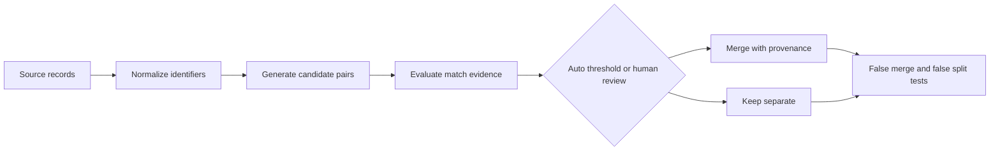

Read [Part 53](Part-53-entity-resolution-golden-records.md) and [Part 62](Part-62-data-fabric-dedup-entity-resolution.md).

## Data quality, connector health, and reconciliation

### SQL065 - Required-field completeness by source

```sql
SELECT
    f.source_system,
    count(*) AS finding_rows,
    count(*) FILTER (WHERE f.asset_id IS NULL) AS missing_asset_id,
    count(*) FILTER (WHERE f.source_severity IS NULL) AS missing_severity,
    count(*) FILTER (WHERE f.first_observed_at IS NULL) AS missing_first_observed
FROM nmh.finding AS f
GROUP BY f.source_system;
```

**Expected shape/logic:** One quality profile row per source with visible denominators and missing counts.  
**Dialect note:** The table definition makes some fields non-null; retained checks document contract and can expose imported views with weaker constraints.

### SQL066 - Freshness against a fixed as-of time

```sql
SELECT
    a.asset_id,
    a.last_observed_at,
    TIMESTAMPTZ '2026-08-24 00:00:00+00' - a.last_observed_at AS observation_age
FROM nmh.asset AS a
WHERE a.lifecycle_status = 'active'
  AND a.last_observed_at < TIMESTAMPTZ '2026-08-24 00:00:00+00' - interval '24 hours';
```

**Expected shape/logic:** Active assets whose last observation is older than the synthetic 24-hour threshold.  
**Dialect note:** Threshold must reflect source cadence and use case; it is not a universal control.

### SQL067 - Referential integrity check in an imported view

```sql
SELECT
    f.finding_id,
    f.asset_id
FROM nmh.finding_import_view AS f
LEFT JOIN nmh.asset AS a ON a.asset_id = f.asset_id
WHERE a.asset_id IS NULL;
```

**Expected shape/logic:** One row per finding whose asset reference cannot be resolved.  
**Dialect note:** The synthetic base table foreign key would prevent this; imported views/staging often need explicit checks.

### SQL068 - Connector run health summary

```sql
SELECT
    r.source_system,
    count(*) FILTER (WHERE r.run_status = 'succeeded') AS succeeded_runs,
    count(*) FILTER (WHERE r.run_status = 'failed') AS failed_runs,
    max(r.ended_at) FILTER (WHERE r.run_status = 'succeeded') AS last_success_at,
    sum(r.source_record_count) AS source_records_reported,
    sum(r.loaded_record_count) AS records_loaded
FROM nmh.connector_run AS r
WHERE r.started_at >= TIMESTAMPTZ '2026-08-17 00:00:00+00'
  AND r.started_at < TIMESTAMPTZ '2026-08-24 00:00:00+00'
GROUP BY r.source_system;
```

**Expected shape/logic:** One row per source for a half-open seven-day UTC interval, with run and volume context.  
**Dialect note:** PostgreSQL `FILTER`; source-reported counts may not share target grain.

### SQL069 - Reconcile stage counts

```sql
SELECT
    r.run_id,
    r.source_record_count,
    r.loaded_record_count,
    r.quarantined_record_count,
    r.source_record_count
      - r.loaded_record_count
      - r.quarantined_record_count AS unexplained_difference
FROM nmh.connector_run AS r
WHERE r.run_status = 'succeeded'
  AND r.source_record_count
      <> r.loaded_record_count + r.quarantined_record_count;
```

**Expected shape/logic:** Only runs whose synthetic accounting identity does not reconcile.  
**Dialect note:** Real pipelines may have filters, updates, deletes, and fanout; encode the correct conservation equation.

### SQL070 - Volume drift from trailing baseline

```sql
WITH daily AS (
    SELECT
        r.source_system,
        r.started_at::date AS run_date,
        sum(r.loaded_record_count) AS loaded_count
    FROM nmh.connector_run AS r
    GROUP BY r.source_system, r.started_at::date
),
scored AS (
    SELECT
        d.*,
        avg(d.loaded_count) OVER (
            PARTITION BY d.source_system
            ORDER BY d.run_date
            ROWS BETWEEN 7 PRECEDING AND 1 PRECEDING
        ) AS prior_7_row_average
    FROM daily AS d
)
SELECT
    source_system,
    run_date,
    loaded_count,
    prior_7_row_average
FROM scored
WHERE prior_7_row_average IS NOT NULL
  AND (
      loaded_count < prior_7_row_average * 0.5
      OR loaded_count > prior_7_row_average * 1.5
  );
```

**Expected shape/logic:** Source-days outside a synthetic 50%-150% band around prior seven available daily rows.  
**Dialect note:** Threshold is illustrative; seasonality, missing days, expected changes, and distribution need real modeling.

### Diagram C09 - Pipeline quality gates

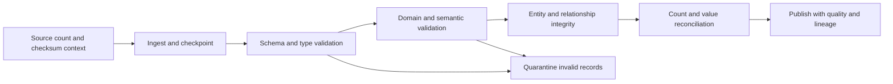

## Vulnerability, risk, exposure, and SecOps patterns

### SQL071 - Prioritized vulnerability backlog

```sql
SELECT
    f.finding_id,
    a.asset_id,
    a.criticality AS asset_criticality,
    a.is_internet_facing,
    v.cve_id,
    v.cvss_base,
    v.epss_probability,
    v.is_known_exploited,
    f.contextual_score,
    f.due_at
FROM nmh.finding AS f
JOIN nmh.asset AS a ON a.asset_id = f.asset_id
LEFT JOIN nmh.vulnerability AS v ON v.vulnerability_id = f.vulnerability_id
WHERE f.finding_status = 'open'
ORDER BY
    v.is_known_exploited DESC NULLS LAST,
    f.contextual_score DESC NULLS LAST,
    f.due_at NULLS LAST,
    f.finding_id;
```

**Expected shape/logic:** One row per open finding ordered by visible factors; it does not claim this is the only valid priority method.  
**Dialect note:** PostgreSQL null ordering; factor selection and precedence are synthetic.

### SQL072 - Group remediation campaign by root context

```sql
SELECT
    f.vulnerability_id,
    a.owner_user_id,
    count(*) AS finding_count,
    count(DISTINCT f.asset_id) AS affected_assets,
    max(f.contextual_score) AS highest_score,
    min(f.due_at) AS earliest_due_at
FROM nmh.finding AS f
JOIN nmh.asset AS a ON a.asset_id = f.asset_id
WHERE f.finding_status = 'open'
GROUP BY f.vulnerability_id, a.owner_user_id
HAVING count(*) >= 2
ORDER BY highest_score DESC NULLS LAST;
```

**Expected shape/logic:** One candidate campaign row per vulnerability/owner grouping with workload and urgency context.  
**Dialect note:** Grouping is a decision aid; shared fix, dependency, and ownership require validation.

### SQL073 - Critical assets missing an observed control

```sql
SELECT
    a.asset_id,
    a.asset_name,
    a.owner_user_id
FROM nmh.asset AS a
WHERE a.lifecycle_status = 'active'
  AND a.criticality = 'critical'
  AND NOT EXISTS (
      SELECT 1
      FROM nmh.control_observation AS co
      WHERE co.asset_id = a.asset_id
        AND co.control_id = 'CTRL-EDR'
        AND co.control_state = 'effective'
        AND co.observed_at >= TIMESTAMPTZ '2026-08-24 00:00:00+00' - interval '24 hours'
  );
```

**Expected shape/logic:** Critical active assets without a fresh synthetic effective EDR observation. It means coverage not evidenced, not necessarily no EDR.  
**Dialect note:** Threshold and control ID are synthetic; negative evidence must be worded carefully.

### SQL074 - Correlate alerts into an incident timeline

```sql
SELECT
    i.incident_id,
    i.severity AS incident_severity,
    a.alert_id,
    a.alerted_at,
    a.source_system,
    a.alert_type,
    a.entity_type,
    a.entity_id,
    a.confidence
FROM nmh.incident AS i
JOIN nmh.alert AS a ON a.incident_id = i.incident_id
WHERE i.incident_id = 'INC-SYN-001'
ORDER BY a.alerted_at, a.alert_id;
```

**Expected shape/logic:** One row per alert associated with the selected synthetic incident in deterministic timeline order.  
**Dialect note:** Portable SQL; association can be analyst judgment and needs provenance.

### SQL075 - Incident response durations

```sql
SELECT
    i.incident_id,
    i.detected_at - i.started_at AS time_to_detect,
    i.contained_at - i.detected_at AS time_to_contain_after_detection,
    i.closed_at - i.started_at AS total_time_to_close
FROM nmh.incident AS i
WHERE i.started_at IS NOT NULL;
```

**Expected shape/logic:** One row per incident with intervals only when required timestamps exist; each clock has a different meaning.  
**Dialect note:** PostgreSQL timestamp subtraction. Do not call every duration `MTTR`.

### SQL076 - Alert precision review sample

```sql
SELECT
    a.source_system,
    a.alert_type,
    count(*) FILTER (WHERE a.disposition = 'true_positive') AS true_positive,
    count(*) FILTER (WHERE a.disposition = 'false_positive') AS false_positive,
    count(*) FILTER (WHERE a.disposition IS NULL OR a.disposition = 'unknown') AS unlabeled,
    round(
        100.0 * count(*) FILTER (WHERE a.disposition = 'true_positive')
        / nullif(count(*) FILTER (
            WHERE a.disposition IN ('true_positive', 'false_positive')
        ), 0),
        2
    ) AS labeled_precision_percent
FROM nmh.alert AS a
GROUP BY a.source_system, a.alert_type;
```

**Expected shape/logic:** One row per detection source/type with labeled precision and unlabeled count kept visible.  
**Dialect note:** Analyst labels can be biased; this does not estimate recall.

### SQL077 - Recursive graph path with cycle guard

```sql
WITH RECURSIVE paths AS (
    SELECT
        e.source_type,
        e.source_id,
        e.target_type,
        e.target_id,
        e.relationship_type,
        ARRAY[e.source_type || ':' || e.source_id,
              e.target_type || ':' || e.target_id] AS visited,
        1 AS depth
    FROM nmh.entity_edge AS e
    WHERE e.source_type = 'user'
      AND e.source_id = 'U-001'

    UNION ALL

    SELECT
        p.source_type,
        p.source_id,
        e.target_type,
        e.target_id,
        e.relationship_type,
        p.visited || (e.target_type || ':' || e.target_id),
        p.depth + 1
    FROM paths AS p
    JOIN nmh.entity_edge AS e
      ON e.source_type = p.target_type
     AND e.source_id = p.target_id
    WHERE p.depth < 5
      AND NOT (e.target_type || ':' || e.target_id = ANY (p.visited))
)
SELECT *
FROM paths
ORDER BY depth, target_type, target_id;
```

**Expected shape/logic:** Synthetic paths up to depth five from one user, preventing revisits within a path.  
**Dialect note:** PostgreSQL arrays and recursive CTE; graph engines use different traversal languages. A path is not proof of exploitability.

### Diagram C10 - Vulnerability-to-action chain

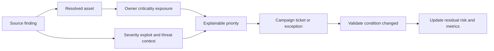

## Customer health, trends, and BI handoff

### SQL078 - Customer health trend with components

```sql
SELECT
    h.snapshot_date,
    h.adoption_score,
    h.data_health_score,
    h.support_risk_score,
    h.outcome_score,
    round(
        h.adoption_score * 0.25
        + h.data_health_score * 0.25
        + (100 - h.support_risk_score) * 0.20
        + h.outcome_score * 0.30,
        2
    ) AS synthetic_health_score
FROM nmh.customer_health_daily AS h
ORDER BY h.snapshot_date;
```

**Expected shape/logic:** One row per daily snapshot with every synthetic component and a transparent lab-only composite.  
**Dialect note:** This is not a Zscaler or recommended health formula; weights require governance, calibration, and sensitivity testing.

### SQL079 - Power BI fact extract at declared grain

```sql
SELECT
    d.snapshot_date,
    d.finding_id,
    d.asset_key,
    d.owner_key,
    d.severity_key,
    d.open_flag,
    d.overdue_flag,
    d.age_days,
    d.contextual_score
FROM nmh.fact_finding_daily AS d
WHERE d.snapshot_date >= DATE '2026-08-01'
  AND d.snapshot_date < DATE '2026-09-01';
```

**Expected shape/logic:** One row per finding per UTC day in August 2026, ready for dimension relationships; no pre-aggregated percentage.  
**Dialect note:** Portable SQL. Import versus DirectQuery, incremental refresh, and query folding need platform validation.

### SQL080 - Final reconciliation and assertion report

```sql
WITH tests AS (
    SELECT
        'asset_primary_key_unique' AS test_name,
        count(*) = count(DISTINCT asset_id) AS passed,
        count(*) - count(DISTINCT asset_id) AS failure_count
    FROM nmh.asset

    UNION ALL

    SELECT
        'finding_asset_resolved',
        count(*) FILTER (WHERE a.asset_id IS NULL) = 0,
        count(*) FILTER (WHERE a.asset_id IS NULL)
    FROM nmh.finding AS f
    LEFT JOIN nmh.asset AS a ON a.asset_id = f.asset_id

    UNION ALL

    SELECT
        'closed_finding_has_closed_at',
        count(*) FILTER (
            WHERE f.finding_status = 'closed' AND f.closed_at IS NULL
        ) = 0,
        count(*) FILTER (
            WHERE f.finding_status = 'closed' AND f.closed_at IS NULL
        )
    FROM nmh.finding AS f
)
SELECT
    test_name,
    passed,
    failure_count
FROM tests
ORDER BY passed, test_name;
```

**Expected shape/logic:** One row per named validation test, with failures first; it reports evidence and does not silently discard bad records.  
**Dialect note:** PostgreSQL Boolean output and `FILTER`; adapt assertions to the testing framework and pipeline contract.

### Diagram C11 - Metric contract to Power BI

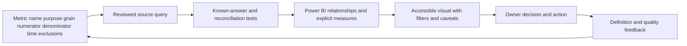

### Diagram C12 - Excel handoff control

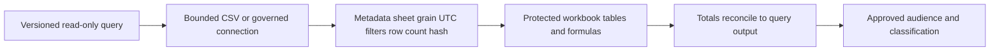

## SQL example inventory

| Range | Capability | Examples |
|---|---|---:|
| SQL001-SQL004 | Local synthetic setup | 4 |
| SQL005-SQL015 | SELECT, filters, aliases, nulls, order, limits | 11 |
| SQL016-SQL024 | Aggregation and metric contracts | 9 |
| SQL025-SQL034 | Joins, anti/semi-joins, set operations | 10 |
| SQL035-SQL045 | CTEs, subqueries, windows | 11 |
| SQL046-SQL053 | Dates, intervals, snapshots, SLA | 8 |
| SQL054-SQL059 | JSON and semi-structured data | 6 |
| SQL060-SQL064 | Deduplication and survivorship | 5 |
| SQL065-SQL070 | Data quality and connector health | 6 |
| SQL071-SQL077 | Vulnerability, exposure, risk, SecOps, graph | 7 |
| SQL078-SQL080 | Customer health, BI, final validation | 3 |
| **Total** | **Numbered fenced SQL examples** | **80** |

## Anti-patterns and repairs

| Anti-pattern | Why it fails | Better pattern |
|---|---|---|
| `SELECT *` in durable extract | New/sensitive columns change shape and exposure | Select named fields and version the contract |
| `= NULL` | Comparison evaluates unknown | Use `IS NULL` or `IS NOT NULL` |
| `NOT IN` with nullable subquery | One null can make all comparisons unknown | Use correlated `NOT EXISTS` |
| Average of percentages | Gives small groups equal weight | Sum numerators and denominators, then divide |
| Summing daily backlog | Counts the same open item repeatedly | Aggregate within one snapshot or use event flow |
| Join then `DISTINCT` | Can hide fanout and remove legitimate duplicates | Declare grain and pre-aggregate each many-side |
| Current timestamp in reproducible report | Results change on rerun | Pass and record an explicit as-of timestamp |
| Local date without zone | Cross-region boundaries disagree | Normalize event instant and state reporting zone |
| `LIMIT` without `ORDER BY` | Returned subset is nondeterministic | Define business sort plus stable tie-breaker |
| Severity equals risk | Omits exposure, asset, threat, control, and impact context | Show factors and intended decision |
| Closed ticket equals remediated | Workflow state may not prove condition changed | Join independent validation evidence |
| Missing record equals no exposure | Source scope or connector may be incomplete | Publish coverage, freshness, and unknowns |
| Broad regex/text search | Slow and semantically weak | Normalize governed fields and index tested predicates |
| Function on indexed filter column | May prevent efficient index use | Compare bounded raw range when semantics permit |
| Unbounded recursive graph | Cycles and path explosion | Depth, visited-node, edge type, time, and confidence guards |
| Dynamic SQL with string concatenation | Injection and quoting risk | Parameterize through approved APIs |

### Plain-English deep-dive 3 - A correct query can answer the wrong question

A query can be syntactically valid, fast, and still misleading. `COUNT(*) FROM finding WHERE status='open'` answers how many rows satisfy one stored label. It does not automatically answer how many unique vulnerabilities, affected assets, remediation actions, or material risks exist. Think of counting hospital forms: several forms can describe one patient, and one form can contain several diagnoses. Name the decision and grain before trusting the number.

## Performance without superstition

| Practice | Good question | Warning |
|---|---|---|
| Explain plan | Which scans, joins, estimates, sorts, and spills occur? | A plan from tiny lab data does not predict production |
| Predicate selectivity | How much data remains after each filter? | `LIMIT` may not prevent expensive upstream work |
| Index review | Which repeated predicates and joins justify maintenance cost? | More indexes slow writes and consume storage |
| Partition pruning | Does time/key filter eliminate partitions? | Functions/casts can prevent pruning |
| Statistics | Are estimates current for real distributions? | Security data is often highly skewed |
| Pre-aggregation | Can repeated dashboard work be summarized safely? | Never change grain or lose drill evidence silently |
| Materialized view | Is freshness tradeoff acceptable and visible? | Cached result can look current when stale |
| JSON extraction | Should frequently queried fields become governed columns? | Duplicated projections need reconciliation |
| Result bound | Are rows/columns minimized for the task? | Small output can still require a huge scan |
| Concurrency | What happens under dashboard refresh and analyst load? | One fast isolated query may harm shared workload |

Use `EXPLAIN` in an approved environment to inspect planned operations. `EXPLAIN ANALYZE` executes the statement, so use it only for authorized read-only queries in a safe environment with timeouts and workload approval. Never run it casually against writable or expensive statements.

## Validation and test-data strategy

| Test type | Synthetic test | Defect detected |
|---|---|---|
| Known-answer | Three assets, one ownerless | Incorrect null filter |
| Boundary | Due time exactly equals as-of | Wrong inclusive/exclusive SLA rule |
| Null | Unknown internet exposure | Null silently treated as false |
| Duplicate | Two source retries with same source key | Idempotency or dedup failure |
| Fanout | One finding, two tickets, three controls | Inflated count after join |
| Late data | Event arrives after snapshot | Incorrect historical restatement |
| Reopen | Closed then open finding | Lifecycle query misses recurrence |
| Time zone | Event around UTC/local midnight | Wrong daily grouping |
| Schema drift | JSON port changes number to text | Unsafe cast or silent null |
| Orphan | Finding references absent staging asset | Missing relationship validation |
| Cycle | Graph A to B to A | Infinite/duplicate traversal |
| Threshold | Score exactly 70/90 | Inclusive range misunderstanding |
| Authorization | Restricted field present in source | Overbroad select/export |
| Reconciliation | Source = loaded + quarantined | Unexplained data loss |

### Diagram C13 - Test pyramid for analytics

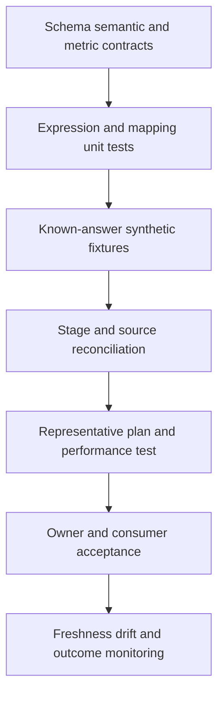

## Power BI and Excel handoff

| Handoff item | Required content | Why |
|---|---|---|
| Query version | Repository path or immutable version ID | Reproduce source logic |
| Output grain | One sentence | Prevent visual double counting |
| Keys | Fact and dimension relationship fields | Enforce one-to-many intent |
| Time | Source timestamp, UTC rule, snapshot calendar | Align daily and SLA views |
| Measures | Formula, numerator, denominator, additivity | Keep SQL and DAX consistent |
| Filters | Included/excluded statuses, sources, assets | Make population visible |
| Unknowns | Missing/unmapped display and count | Avoid false clean posture |
| Refresh | Cadence, last success, expected latency | Distinguish stale from healthy |
| Security | Classification, RLS, export policy | Protect customer and security data |
| Reconciliation | SQL totals and expected BI totals | Detect relationship/filter defects |
| Accessibility | Text, color, labels, keyboard considerations | Make reports usable |
| Owner | Metric, data, report, and action owners | Separate technical maintenance from decisions |

Power BI should usually receive a stable fact grain and conformed dimensions, then calculate explicit measures in a governed semantic model. Avoid bidirectional relationships unless the model and ambiguity are understood. Do not rely on implicit sums for scores, percentages, snapshot balances, or age. Excel exports need a metadata sheet with query version, UTC as-of, row count, hash when appropriate, classification, filters, and refresh date. Formulas should reference structured tables, not fragile cell ranges.

### Plain-English deep-dive 4 - The dashboard is the last mile, not the source of truth

A chart can make a number look authoritative even when the underlying source is stale or the denominator changed. Think of a polished speedometer wired to the wrong sensor. The visual layer should expose last refresh, population, unknowns, drill path, and metric definition. The authoritative source can differ by field: CMDB for an approved owner, scanner for a source finding, ticketing for workflow state, and validation evidence for actual remediation. The semantic model reconciles governed meanings; it does not declare one universal truth by convenience.

## Query review checklist

| Review area | Pass question |
|---|---|
| Purpose | Does the query answer one named business/security question? |
| Authorization | Is the role read-only and approved for every selected field? |
| Grain | Is one input/output row defined, and preserved after joins? |
| Keys | Are join keys stable, scoped, and qualified by source where needed? |
| Cardinality | Are one-to-many and many-to-many relationships handled intentionally? |
| Nulls | Are unknown, absent, false, zero, empty, and not-applicable distinguished? |
| Time | Are event time, ingest time, snapshot date, as-of, zone, and interval boundaries explicit? |
| Status | Are lifecycle mappings and reopen cases represented? |
| Metrics | Are numerator, denominator, exclusions, and additivity published? |
| Duplicates | Are source retries, record duplicates, and entity duplicates distinguished? |
| Provenance | Can every derived value be traced to source and transformation? |
| Quality | Are freshness, completeness, validity, and reconciliation visible? |
| Safety | Is output bounded and sensitive data minimized? |
| Performance | Has a representative plan been reviewed without unsafe execution? |
| Validation | Do synthetic known answers and independent totals pass? |
| Portability | Are PostgreSQL-specific functions and target dialect changes noted? |
| Communication | Does the result state limitations, confidence, owner, and next action? |

## Source, product, and claim boundaries

| Evidence class | Safe statement | Unsafe statement |
|---|---|---|
| General SQL | `A window function can rank rows without collapsing detail.` | `Every database optimizes this query the same way.` |
| Synthetic NMH | `The lab query prioritizes fictional findings with visible factors.` | `This is Zscaler UVM's scoring query.` |
| Public product context | `Public material describes connected security data and contextual workflows.` | `The product exposes these exact tables and fields.` |
| Candidate production transfer | `you can discuss SQL, PostgreSQL, Power BI, statistics, and support analytics factually.` | `You administered a production Zscaler data warehouse.` |
| Current customer evidence | `I would validate tenant schema, source contracts, licensing, and approved access.` | `The remembered field name must exist.` |

## Completion checklist

- [x] Exactly one H1 uses the master-linked Appendix C title.
- [x] SQL is explained from selection and nulls through joins, CTEs, windows, JSON, temporal logic, reconciliation, and recursive graph paths.
- [x] Relational, dimensional, event, document, and graph contexts are explicit.
- [x] Exactly 80 numbered fenced SQL examples use synthetic schemas and state expected shape/logic plus dialect notes.
- [x] Local `CREATE` and `INSERT` statements are clearly restricted to a disposable synthetic lab; analytical examples are read-only.
- [x] Security-data quality, trends, SLA, vulnerability, risk, exposure, SecOps, customer health, Power BI, and Excel patterns are present.
- [x] Anti-patterns, performance, validation, test data, metric contracts, and query review are covered.
- [x] Thirteen Mermaid diagrams and more than fifteen tables are included.
- [x] Product facts, general SQL, synthetic templates, and factual candidate experience remain separated.
- [x] Content is ASCII with balanced fences and local links to existing Parts plus the planned next appendix.

[Back to the master study guide](../Zscaler%20SecOps%20Technical%20Success%20Manager%20-%20Complete%20Study%20Guide.md) | [Previous appendix: Ports, Protocols, Handshakes, and Troubleshooting Commands](Appendix-B-ports-protocols-commands.md) | [Next appendix: Security Data Schemas, Entities, and Mapping Templates](Appendix-D-security-data-schemas.md)