# Appendix D - Security Data Schemas, Entities, and Mapping Templates

> **Purpose:** Provide source-neutral, beginner-friendly canonical templates for security entities, observations, relationships, workflows, business context, customer success, metrics, evidence, and provenance. The appendix is a design workbook for learning, discovery, mapping, review, and synthetic labs.
>
> **Currency and source note:** General data-modeling, security-data, privacy, and integration practices in this appendix were reviewed on **2026-08-24**. Standards, source schemas, regulations, APIs, product packaging, field names, and organizational definitions change. Current official documentation, source contracts, legal/privacy guidance, customer policy, tenant evidence, and approved architecture always govern production.
>
> **Official/general/synthetic boundary:** Public Zscaler material supplies only bounded high-level context that security data can be ingested, harmonized, correlated, enriched, and operationalized. Nothing below is a Zscaler schema, Data Fabric field list, connector contract, UVM model, Risk360 formula, product API, storage claim, or guaranteed capability. Northstar Meridian Holdings (NMH), all identifiers, records, mappings, thresholds, and outcomes are synthetic. You may discuss the general method and completed lab evidence but must not describe these templates as production Zscaler experience.
>
> **Safety:** Templates minimize direct identifiers, secrets, content, and raw payloads. Do not paste real tokens, credentials, packet payloads, customer content, or regulated data into a lab. Production mapping requires approved access, classification, purpose, retention, residency, field-level controls, change review, and source-owner validation.

[Back to the master study guide](../Zscaler%20SecOps%20Technical%20Success%20Manager%20-%20Complete%20Study%20Guide.md) | [Previous appendix: SQL and Security Analytics Cheat Sheet](Appendix-C-sql-security-analytics.md) | [Next planned appendix: Risk, Vulnerability, Exposure, and SecOps Metrics Dictionary](Appendix-E-risk-vulnerability-secops-metrics.md)

## How to read a canonical template

A canonical model is a shared translation shape between sources and consumers. It reduces pairwise integration, but it is not automatically true. Every field needs meaning, grain, source, time, quality, classification, and owner. Preserve raw source values and source-native identifiers so mappings can be corrected without pretending that the first interpretation was perfect.

| Label in this appendix | Meaning | Required reviewer question |
|---|---|---|
| Canonical | Source-neutral concept used by several workflows | Does every mapped source mean the same thing? |
| Source-native | Identifier or value supplied by one producer | Is namespace, version, and raw value preserved? |
| Derived | Calculated or inferred from other values | Which rule/version/inputs produced it? |
| Observed | Recorded by a source at a time and vantage point | What exactly could the source see? |
| Asserted | Supplied as a claim by a system or owner | What authority and validation support it? |
| Synthetic | Invented only for this learning guide | Is it clearly separated from product/customer fact? |
| Current | Best representation for a defined as-of time | Which history and conflict rules created it? |
| Historical | Prior version or event retained for time-correct analysis | Which effective and recorded times apply? |

### Diagram D01 - Canonical security ecosystem

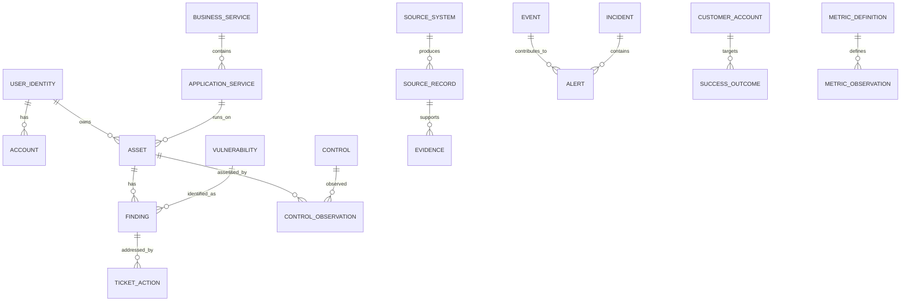

### Diagram D02 - Source to decision layers

```mermaid
flowchart LR
    RAW[Immutable or source-faithful record] --> STAGE[Parsed staging record]
    STAGE --> MAP[Mapped canonical observation]
    MAP --> ENTITY[Resolved entity and relationships]
    ENTITY --> ENRICH[Business control threat and owner context]
    ENRICH --> ANALYZE[Finding alert metric risk or health analysis]
    ANALYZE --> ACTION[Ticket response decision or review]
    ACTION --> VALIDATE[Independent outcome validation]
    VALIDATE --> FEEDBACK[Mapping quality and policy feedback]
```

## Core modeling rules

| Rule | Practical interpretation | Failure when ignored |
|---|---|---|
| Grain first | Define exactly what one record means before fields or keys | Mixed events, entities, and snapshots become uncountable |
| Stable canonical key | Use a nonsemantic internal identifier for the canonical entity | Names and source IDs change or collide |
| Preserve source key | Store source system, object type, native ID, and tenant/scope | Corrections cannot return to the source record |
| Separate entity and observation | Asset identity differs from a scanner's sighting of that asset | Last source wins and history disappears |
| Separate definition and instance | Vulnerability definition differs from a finding on an asset | CVE counts are mistaken for affected assets |
| Type relationships | `owns`, `runs_on`, and `observed_by` are not generic links | Graph paths lose meaning |
| Time every changing assertion | Record observed, effective, ingested, and processed time as needed | Current values rewrite history |
| Model unknown explicitly | Unknown is not false, zero, absent, or not applicable | Clean dashboards hide missing evidence |
| Keep provenance | Derived values retain sources, rules, and confidence | Consumers cannot challenge or repair conclusions |
| Govern enums and units | Values have versioned definitions and units | `critical` and `10` mean different things by source |
| Validate cardinality | Expected one-to-one, one-to-many, and many-to-many are tested | Joins multiply facts or discard relationships |
| Minimize sensitive data | Store only what is needed for approved purpose | Security analytics becomes a privacy liability |

### Plain-English deep-dive 1 - Entity, observation, finding, and event are different records

An asset is the thing: a synthetic server `A-001`. An observation says a source saw something about it at a particular time: scanner `SRC-VM` saw address `192.0.2.10` at 08:00 UTC. A finding says the source associated a weakness or gap with that asset: `F-001` refers to synthetic vulnerability `V-001`. An event says something happened: a login or process action at 08:05 UTC. Think of a person, a photograph of the person, a medical test result, and a diary entry. Combining all four into one wide row destroys history and meaning.

## Identifier and key strategy

| Key type | Example | Scope | Use | Do not assume |
|---|---|---|---|---|
| Canonical surrogate | `asset_id=A-001` | Canonical repository | Stable joins and relationships | It has external meaning |
| Source-native composite | `source=vm1`, `type=host`, `id=7788` | One source/tenant/object type | Traceability and idempotency | Native ID is globally unique |
| Business key | `employee_number=E-1001` | Governed business domain | Cross-system identity under owner rules | It never changes or is always present |
| Natural candidate | Hostname plus serial | Defined asset class and time | Match evidence | One field proves identity |
| Event ID | `EVT-SYN-001` | Producer or canonical event namespace | Deduplication and trace | Retries always preserve it |
| External workflow key | `SYN-12345` | Ticketing project/tenant | Reconciliation to work | Closed means validated remediation |
| Version key | `asset_version_id=AV-003` | Historical dimension/model | Time-correct joins | Current entity ID selects historical attributes |
| Hash | SHA-256 of governed canonical bytes | Defined transformation | Integrity or duplicate candidate | Hash proves truth or safe collection |

Use a source-reference table rather than adding one column per source to every canonical entity.

| Source-reference field | Type | Required | Meaning and validation |
|---|---|---:|---|
| `source_reference_id` | UUID/text | Yes | Canonical row key for this reference |
| `canonical_entity_type` | enum | Yes | User, account, asset, app, vulnerability, and so on |
| `canonical_entity_id` | text | Yes | Existing canonical entity under matching type |
| `source_system_id` | text | Yes | Existing governed source system |
| `source_tenant_scope` | text | Yes | Namespace preventing cross-tenant collision |
| `source_object_type` | text | Yes | Producer's object category |
| `source_native_id` | text | Yes | Exact source identifier, preserved as text |
| `first_linked_at` | timestamptz | Yes | First canonical linkage time |
| `last_confirmed_at` | timestamptz | Yes | Latest evidence that linkage still holds |
| `match_method` | enum | Yes | Exact key, deterministic rule, probabilistic, or human review |
| `match_confidence` | numeric | Conditional | Bounded confidence under versioned model |
| `match_rule_version` | text | Yes | Rule or review procedure used |
| `link_status` | enum | Yes | Active, disputed, split, superseded, or retired |
| `provenance_id` | text | Yes | Link to mapping and evidence chain |

## User, identity, and account templates

### Diagram D03 - Person, identity, account, and credential

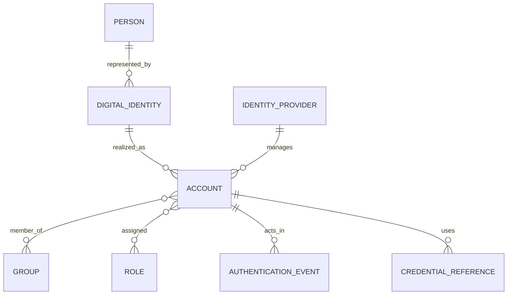

One person can have several identities and accounts; service accounts may have no person. Never store a password, private key, access token, refresh token, session cookie, or recovery secret in the canonical analytical model.

### Canonical person/identity field dictionary

| Field | Type | Required | Meaning | Validation/privacy |
|---|---|---:|---|---|
| `identity_id` | text/UUID | Yes | Stable canonical digital-identity key | Nonsemantic; unique |
| `identity_kind` | enum | Yes | Person, service, device, workload, partner, shared, unknown | Governed code list |
| `display_name` | text | No | Human-readable approved label | Personal data; minimize exports |
| `primary_business_key` | text | No | Governed employee/partner/workload identifier | Sensitive; never assume email stability |
| `organization_id` | text | Yes | Owning organization or tenant | Prevent cross-tenant merge |
| `department_id` | text | No | Current governed department reference | Historical changes need effective dates |
| `manager_identity_id` | text | No | Canonical manager relationship shortcut | Prefer typed temporal relationship for history |
| `employment_type` | enum | No | Employee, contractor, partner, service, not applicable | Classification-sensitive context |
| `identity_status` | enum | Yes | Active, disabled, pending, departed, unknown | Map source lifecycle explicitly |
| `privilege_tier` | enum | No | Governed privilege classification | High sensitivity; role definitions vary |
| `risk_state` | enum | No | Derived identity-risk band under a named model | Store rule/version and as-of time |
| `created_at_source` | timestamptz | No | Source-reported creation time | Not canonical ingest time |
| `effective_from` | timestamptz | Yes | Start of this identity version's validity | UTC instant |
| `effective_to` | timestamptz | No | Exclusive end of version validity | Null can mean current under contract |
| `recorded_at` | timestamptz | Yes | Time canonical system learned this version | Supports bitemporal questions |
| `classification` | enum | Yes | Handling label for the record | Enforce field/row controls |
| `provenance_id` | text | Yes | Source and transformation lineage | Must resolve |

### Canonical account field dictionary

| Field | Type | Required | Meaning | Validation/privacy |
|---|---|---:|---|---|
| `account_id` | text/UUID | Yes | Stable canonical account key | Unique and nonsemantic |
| `identity_id` | text | No | Canonical identity represented by account | Null allowed for unresolved/nonhuman cases |
| `idp_id` | text | Yes | Governing identity provider/directory | Existing provider reference |
| `source_account_id` | text | Yes | Native account identifier in source scope | Preserve exact source value |
| `username_normalized` | text | No | Normalized sign-in label | Personal data; not a durable person key |
| `account_type` | enum | Yes | Human, service, shared, guest, device, workload | Governed definition |
| `account_status` | enum | Yes | Enabled, disabled, locked, expired, unknown | Do not collapse lock and disable |
| `is_privileged` | boolean | No | Governed privilege assertion | Null means unknown, not false |
| `mfa_state` | enum | No | Enrolled, required, satisfied, exception, unknown under defined context | Do not store factor secret |
| `last_authentication_at` | timestamptz | No | Latest qualifying authentication event | Define qualifying result/source |
| `last_password_change_at` | timestamptz | No | Source-reported credential-change time | Not applicable to every auth type |
| `owner_identity_id` | text | No | Account owner for nonhuman/shared use | Require for service accounts where policy says |
| `valid_from` | timestamptz | Yes | Account-version effective start | UTC |
| `valid_to` | timestamptz | No | Account-version exclusive end | No overlap for same versioned account |
| `provenance_id` | text | Yes | Lineage to source record(s) | Required |

### Identity relationship template

| Field | Example | Rule |
|---|---|---|
| `relationship_id` | `REL-ID-001` | Stable unique edge key |
| `source_identity_id` | `U-001` | Existing canonical identity |
| `relationship_type` | `MANAGES` | Versioned controlled vocabulary |
| `target_entity_type` | `identity` | Typed target prevents ambiguous ID |
| `target_entity_id` | `U-002` | Existing target under target type |
| `effective_from` | `2026-08-01T00:00:00Z` | Required temporal start |
| `effective_to` | null | Current only under explicit convention |
| `source_system_id` | `SRC-HR-SYN` | Authority and scope recorded |
| `confidence` | `1.00` | Exact HR assertion in synthetic example |
| `provenance_id` | `PROV-001` | Complete lineage |

## Asset, application, service, and workload templates

### Diagram D04 - Asset and business-service context

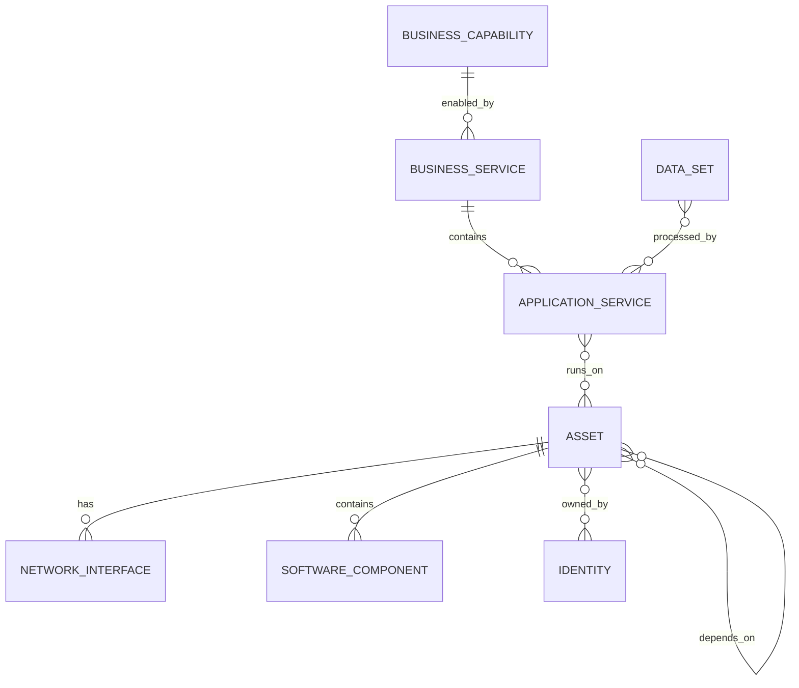

### Canonical asset field dictionary

| Field | Type | Required | Meaning | Validation/privacy |
|---|---|---:|---|---|
| `asset_id` | text/UUID | Yes | Stable canonical cyber-asset key | Unique, nonsemantic |
| `asset_kind` | enum | Yes | Endpoint, server, VM, container, cloud resource, network device, IoT, OT, SaaS tenant, other | Extensible controlled list |
| `canonical_name` | text | Yes | Selected human-readable label | Not an identity key |
| `lifecycle_status` | enum | Yes | Planned, active, suspended, retired, disposed, unknown | Time-versioned |
| `owner_identity_id` | text | No | Accountable technical or business owner | Null is visible quality gap |
| `custodian_identity_id` | text | No | Operational maintainer | Distinct from owner |
| `business_service_id` | text | No | Primary supported service | Many-to-many may need relationship table |
| `criticality` | enum | No | Governed business importance | Store authority and effective interval |
| `data_classification_max` | enum | No | Highest governed data sensitivity associated | Derived; rule/version required |
| `environment` | enum | No | Production, test, development, lab, disaster recovery, unknown | Source mappings vary |
| `internet_exposure_state` | enum | No | Validated exposed, not observed exposed, unknown, disputed | Avoid simple false for absence of evidence |
| `network_zone_id` | text | No | Governed network/security zone | Zone changes over time |
| `platform` | text | No | Operating system, cloud service, appliance, or runtime family | Normalize separately from raw value |
| `platform_version` | text | No | Current observed version string | Freshness and source needed |
| `first_observed_at` | timestamptz | Yes | Earliest retained observation within model scope | Not creation time |
| `last_observed_at` | timestamptz | Yes | Latest qualifying observation | Must be at/after first observed |
| `retired_at` | timestamptz | No | Governed retirement time | Status consistency rule |
| `identity_confidence` | numeric | Yes | Confidence in canonical resolution | Bounded 0-1 with method |
| `classification` | enum | Yes | Record handling classification | Asset names/addresses can be sensitive |
| `provenance_id` | text | Yes | Golden-record lineage | Required |

### Asset identifier table

| Field | Type | Grain | Rule |
|---|---|---|---|
| `asset_identifier_id` | text | One identifier assertion | Unique canonical row |
| `asset_id` | text | Many identifiers per asset | Existing asset |
| `identifier_type` | enum | Hostname, serial, cloud ARN/resource ID, device ID, MAC, IP, agent ID | Define stability and scope |
| `identifier_value_raw` | text | Exact source value | Restricted as needed |
| `identifier_value_normalized` | text | Match-ready representation | Never overwrite raw |
| `namespace` | text | Source/tenant/domain scope | Required for collision-prone values |
| `valid_from`/`valid_to` | timestamptz | Temporal assertion | IP and hostname can move |
| `source_system_id` | text | Producer | Required |
| `confidence` | numeric | Assertion confidence | Do not infer identity from one IP alone |

### Application/service field dictionary

| Field | Type | Required | Meaning | Validation/privacy |
|---|---|---:|---|---|
| `application_id` | text/UUID | Yes | Stable canonical application/service key | Unique |
| `application_name` | text | Yes | Approved display name | Names can collide; use key |
| `application_kind` | enum | Yes | Web app, API, SaaS, private app, database, batch, mobile, other | Controlled list |
| `business_service_id` | text | No | Service enabled by application | Existing reference |
| `business_owner_identity_id` | text | No | Outcome/accountability owner | Separate from technical owner |
| `technical_owner_identity_id` | text | No | Operational owner | Current effective relationship |
| `environment` | enum | Yes | Production/test/development/lab/other | Governed |
| `criticality` | enum | No | Business impact classification | Authority required |
| `authentication_model` | enum | No | Federated, local, certificate, workload, mixed, unknown | No secrets |
| `access_model` | enum | No | Public, private, partner, administrative, unknown | Reachability must be separately observed |
| `data_classification_max` | enum | No | Highest approved data class handled | Derived or asserted with source |
| `recovery_objective_id` | text | No | Link to governed continuity target | Do not store an undocumented number |
| `lifecycle_status` | enum | Yes | Planned, active, retiring, retired, unknown | Effective time required |
| `first_observed_at` | timestamptz | Yes | First model observation | Not deployment time |
| `last_observed_at` | timestamptz | Yes | Most recent qualifying observation | Freshness rule |
| `provenance_id` | text | Yes | Lineage | Required |

### Application endpoint template

| Field | Example | Meaning and caution |
|---|---|---|
| `endpoint_id` | `ENDP-001` | Stable canonical endpoint record |
| `application_id` | `APP-001` | Parent application |
| `scheme` | `https` | Application scheme, not proof of observed TLS success |
| `host_name` | `portal.example.invalid` | Synthetic FQDN; classification may be sensitive |
| `port` | `443` | Configured port; does not prove protocol identity |
| `path_pattern` | `/api/v1/*` | Avoid real sensitive URLs or query strings |
| `exposure_intent` | `partner_only` | Design intent, not observed reachability |
| `observed_reachability` | `unknown` | Separate evidence-driven state |
| `valid_from` | `2026-08-01T00:00:00Z` | Effective interval |
| `provenance_id` | `PROV-APP-01` | Source and mapping evidence |

## Vulnerability, finding, and exposure templates

### Diagram D05 - Definition, instance, exposure, and risk

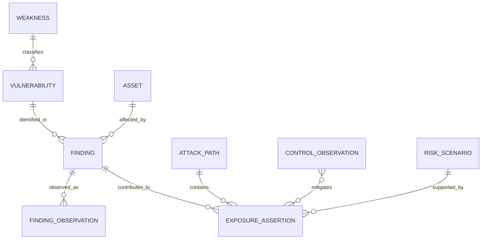

### Vulnerability definition field dictionary

| Field | Type | Required | Meaning | Validation/caveat |
|---|---|---:|---|---|
| `vulnerability_id` | text/UUID | Yes | Canonical vulnerability definition key | Unique |
| `external_namespace` | text | No | CVE or another advisory namespace | Qualify every external ID |
| `external_id` | text | No | Identifier such as a CVE | Pattern validation by namespace |
| `weakness_id` | text | No | CWE or other weakness classification | Vulnerability and weakness differ |
| `title` | text | Yes | Source-neutral display title | Avoid copying restricted content |
| `description_summary` | text | No | Approved concise description | Source and license considerations apply |
| `published_at` | timestamptz | No | Authority's publication time | Not discovery time on asset |
| `modified_at` | timestamptz | No | Authority's record update time | Version source |
| `severity_system` | text | No | CVSS version or source severity scheme | Required with score |
| `severity_vector` | text | No | Full vector under named system | Validate version syntax |
| `severity_score` | numeric | No | General severity score | Not business risk |
| `exploit_prediction_score` | numeric | No | Model output under named version/date | Store horizon/version |
| `known_exploited_state` | enum | No | Listed/not listed/unknown under named catalog/date | Absence is time-bounded |
| `remediation_summary` | text | No | General vendor/authority guidance | Verify affected product/version |
| `provenance_id` | text | Yes | Advisory and transformation lineage | Required |

### Finding instance field dictionary

| Field | Type | Required | Meaning | Validation/caveat |
|---|---|---:|---|---|
| `finding_id` | text/UUID | Yes | Canonical source-finding instance key | Unique |
| `asset_id` | text | Yes | Affected canonical asset | Existing asset |
| `vulnerability_id` | text | No | Canonical vulnerability definition | Null for configuration/control findings |
| `finding_type` | enum | Yes | Vulnerability, misconfiguration, control gap, secret, policy, other | Controlled list |
| `source_system_id` | text | Yes | Producer | Required |
| `source_finding_id` | text | Yes | Native finding key in source scope | Composite uniqueness with source/scope |
| `source_severity_raw` | text | No | Exact producer label | Preserve raw |
| `source_severity_mapped` | enum | No | Canonical label under mapping version | Not contextual risk |
| `finding_status` | enum | Yes | Open, closed, suppressed, accepted, duplicate, unknown | Map source lifecycle carefully |
| `first_observed_at` | timestamptz | Yes | First source/model observation | Not vulnerability publication |
| `last_observed_at` | timestamptz | Yes | Latest confirming observation | Must follow first |
| `closed_at` | timestamptz | No | Source/model closure time | Closure is not independent validation |
| `due_at` | timestamptz | No | Workflow deadline under SLA version | Store SLA reference |
| `evidence_id` | text | No | Minimized evidence reference | Never embed credentials/raw secrets |
| `contextual_score` | numeric | No | Derived priority under model/version | Explain factors and missingness |
| `priority_band` | enum | No | Derived work band | Versioned rule |
| `provenance_id` | text | Yes | Source/mapping lineage | Required |

### Finding observation field dictionary

| Field | Type | Grain/purpose | Validation |
|---|---|---|---|
| `finding_observation_id` | text | One source observation of one finding at one time | Unique |
| `finding_id` | text | Parent finding | Existing reference |
| `observed_at` | timestamptz | Source event/scan time | UTC and source clock quality |
| `ingested_at` | timestamptz | Canonical receipt time | At/after observation only when clocks reliable |
| `observation_result` | enum | Present, absent, error, not assessed, unknown | Absence must have scope |
| `scanner_scope_id` | text | Scan/job/connector scope | Required to interpret nonobservation |
| `evidence_id` | text | Supporting evidence reference | Classification and integrity |
| `raw_record_reference` | text | Source-faithful record location/key | Restricted and resolvable |
| `mapping_version` | text | Applied source-to-canonical rule | Required |

### Exposure assertion field dictionary

| Field | Type | Required | Meaning | Validation/caveat |
|---|---|---:|---|---|
| `exposure_id` | text/UUID | Yes | Canonical exposure assertion key | Unique |
| `subject_entity_type` | enum | Yes | Asset, identity, application, data set, path | Typed |
| `subject_entity_id` | text | Yes | Exposed subject | Existing under type |
| `exposure_type` | enum | Yes | Internet reachability, excessive privilege, missing control, exploitable path, other | Governed definition |
| `assertion_state` | enum | Yes | Validated, suspected, not observed, disputed, remediated | State is evidence-sensitive |
| `vantage_point` | text | Yes | Observation location/method | Required for reachability claim |
| `preconditions` | text/JSON | No | Required identity, network, version, or attacker conditions | Minimize sensitive details |
| `supporting_finding_ids` | relationship | No | Findings supporting exposure | Use bridge table in relational model |
| `mitigating_control_ids` | relationship | No | Controls reducing scenario | Presence is not effectiveness |
| `confidence` | numeric | Yes | Evidence confidence 0-1 | Not impact/likelihood |
| `first_validated_at` | timestamptz | No | First validation time | Method/version needed |
| `last_validated_at` | timestamptz | No | Latest validation time | Freshness threshold by use |
| `remediated_at` | timestamptz | No | Time exposure was independently validated changed | Do not infer from ticket closure |
| `provenance_id` | text | Yes | Complete evidence lineage | Required |

### Plain-English deep-dive 2 - CVE, vulnerability, finding, and affected asset have different counts

One CVE can affect a product family. An organization may have 100 asset findings referring to that CVE. A scanner might report the same asset twice through an agent and network scan, creating source duplicates. Ten findings might share one patch campaign. Counting CVEs, source findings, canonical findings, affected assets, tickets, and validated exposures answers six different questions. Think of a vehicle recall: one recall notice, many affected cars, several inspection records per car, and one repair appointment can all coexist.

## Control and control-observation templates

### Diagram D06 - Control definition and effectiveness evidence

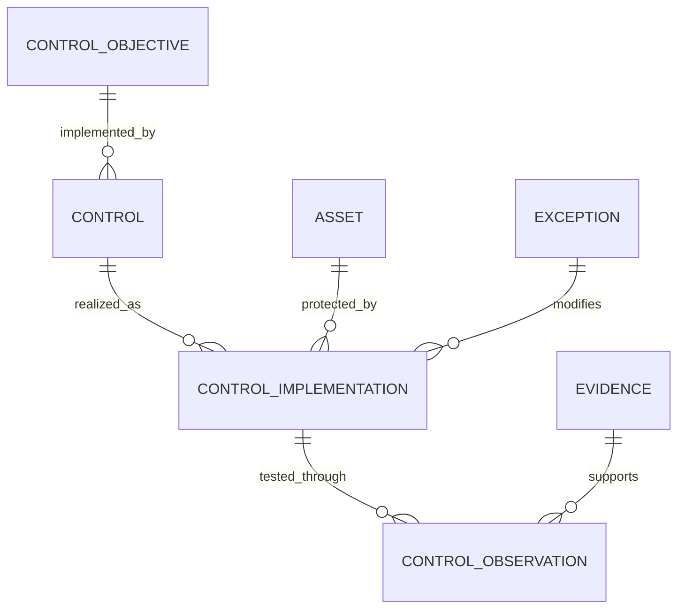

### Control definition field dictionary

| Field | Type | Required | Meaning | Validation/caveat |
|---|---|---:|---|---|
| `control_id` | text/UUID | Yes | Canonical safeguard definition | Unique |
| `control_name` | text | Yes | Approved display name | Versioned definition |
| `control_family` | enum | Yes | Identity, endpoint, network, application, cloud, data, governance, physical | Controlled list |
| `control_function` | enum | Yes | Preventive, detective, corrective, recovery, directive, compensating | Multiple functions may need bridge |
| `objective_id` | text | No | Governed objective/control-framework mapping | Mapping is not compliance proof |
| `control_owner_identity_id` | text | Yes | Accountable owner | Current relationship |
| `required_scope_rule` | text/JSON | No | Which entities should have the control | Versioned and testable |
| `effectiveness_definition` | text | Yes | What evidence counts as effective | Separate installed from effective |
| `evidence_freshness_hours` | integer | No | Maximum age for selected decision | Context-specific |
| `lifecycle_status` | enum | Yes | Draft, active, deprecated, retired | Governance required |
| `effective_from` | timestamptz | Yes | Definition version starts | No overlapping active versions |
| `effective_to` | timestamptz | No | Exclusive end | Null-current convention documented |
| `provenance_id` | text | Yes | Policy/standard/source lineage | Required |

### Control observation field dictionary

| Field | Type | Required | Meaning | Validation/caveat |
|---|---|---:|---|---|
| `control_observation_id` | text/UUID | Yes | One observation/test record | Unique |
| `control_id` | text | Yes | Control assessed | Existing definition/version |
| `subject_type` | enum | Yes | Asset, account, app, data set, process, organization | Typed |
| `subject_id` | text | Yes | Assessed entity | Existing under type |
| `source_system_id` | text | Yes | Producer/tester | Required |
| `observation_method` | enum | Yes | Agent, API, configuration, test, attestation, audit, other | Method affects confidence |
| `control_state` | enum | Yes | Effective, ineffective, absent, partial, not assessed, unknown, excepted | Do not collapse unknown with absent |
| `coverage_scope` | text/JSON | No | Portion of subject/control tested | Required for partial claims |
| `observed_at` | timestamptz | Yes | Source/test time | UTC |
| `expires_at` | timestamptz | No | End of evidence freshness | Derived from governed rule where used |
| `confidence` | numeric | Yes | Confidence in observation | 0-1 and method version |
| `evidence_id` | text | No | Minimized evidence reference | Restricted |
| `exception_id` | text | No | Approved exception changing requirement | Must be active and in scope |
| `provenance_id` | text | Yes | Source and mapping lineage | Required |

## Source, connector, run, and provenance templates

### Diagram D07 - Connector and lineage chain

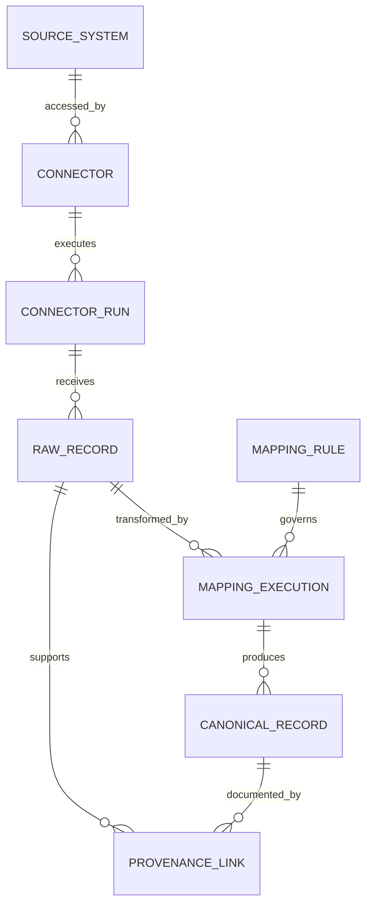

### Source system field dictionary

| Field | Type | Required | Meaning | Validation/security |
|---|---|---:|---|---|
| `source_system_id` | text/UUID | Yes | Canonical source registry key | Unique |
| `source_name` | text | Yes | Approved display name | No credentials in name/description |
| `source_category` | enum | Yes | IAM, EDR, scanner, CMDB, cloud, SIEM, ticketing, business, other | Controlled list |
| `source_owner_identity_id` | text | Yes | Accountable source owner | Existing identity |
| `technical_contact_identity_id` | text | No | Operational contact | Keep current |
| `tenant_scope` | text | Yes | Customer/account/subscription/project namespace | Sensitive; prevents collisions |
| `authority_scope` | text | Yes | Fields/entities for which source is authoritative | Field-specific, never universal |
| `expected_cadence` | interval/text | Yes | Expected availability or update rhythm | Used for freshness |
| `data_classification` | enum | Yes | Highest source handling label | Drives controls |
| `retention_policy_id` | text | Yes | Approved retention/deletion policy | Existing policy |
| `contract_version` | text | Yes | Current source schema/API contract | Change-controlled |
| `lifecycle_status` | enum | Yes | Planned, active, degraded, retiring, retired | Operational state separate from run health |
| `official_documentation_reference` | text | No | Approved source contract/docs location | Current access controlled as needed |

### Connector field dictionary

| Field | Type | Required | Meaning | Validation/security |
|---|---|---:|---|---|
| `connector_id` | text/UUID | Yes | Configured integration identity | Unique |
| `source_system_id` | text | Yes | Source read/written | Existing source |
| `direction` | enum | Yes | Inbound, outbound, bidirectional | Bidirectional requires conflict authority |
| `transport_method` | enum | Yes | API, webhook, file, stream, agent, database view, other | No secret in config record |
| `authentication_reference` | secret reference | Yes | Pointer to approved secret manager | Never store credential value |
| `permission_scope` | text | Yes | Granted read/write scope summary | Least privilege review |
| `schedule` | text | No | Governed schedule/event trigger | Time zone explicit |
| `full_incremental_mode` | enum | Yes | Full, incremental, CDC, event, hybrid | Checkpoint rules |
| `checkpoint_strategy` | text | No | Cursor/watermark/version behavior | Replay and late-data handling |
| `rate_limit_contract` | text | No | Quota and retry behavior | Current source docs |
| `schema_contract_version` | text | Yes | Expected producer/consumer schema | Compatibility matrix |
| `owner_identity_id` | text | Yes | Connector operational owner | Required |
| `lifecycle_status` | enum | Yes | Draft, test, active, paused, retired | Change approval |

### Connector run field dictionary

| Field | Type | Required | Meaning | Validation |
|---|---|---:|---|---|
| `run_id` | text/UUID | Yes | One connector execution/stream checkpoint interval | Unique/idempotent |
| `connector_id` | text | Yes | Executed connector | Existing |
| `started_at` | timestamptz | Yes | Start time | UTC |
| `ended_at` | timestamptz | No | End time | At/after start |
| `run_status` | enum | Yes | Running, succeeded, partial, failed, cancelled | Terminal-state rules |
| `checkpoint_in` | text | No | Starting cursor/watermark | Sensitive if source embeds data |
| `checkpoint_out` | text | No | Committed ending cursor/watermark | Only advance after governed success |
| `source_record_count` | bigint | No | Producer/stage input count under defined grain | Not always comparable to output |
| `loaded_record_count` | bigint | No | Accepted canonical/staging count | Define inserts vs updates |
| `quarantined_record_count` | bigint | No | Invalid records held for review | Must reconcile under contract |
| `duplicate_record_count` | bigint | No | Source retry/content duplicates under rule | Rule/version required |
| `error_class` | enum | No | Auth, quota, transport, schema, semantic, target, unknown | Stable classification |
| `error_reference` | text | No | Restricted diagnostic reference | No token or secret |
| `correlation_id` | text | No | Cross-system request/run ID | Classification applies |

### Provenance field dictionary

| Field | Type | Required | Meaning | Validation |
|---|---|---:|---|---|
| `provenance_id` | text/UUID | Yes | Lineage bundle key | Unique |
| `source_system_id` | text | Yes | Originating producer | Existing |
| `source_record_reference` | text | Yes | Native record ID/location | Restricted and resolvable |
| `source_observed_at` | timestamptz | No | Source event/observation time | Clock quality noted |
| `ingested_at` | timestamptz | Yes | Receipt time | UTC |
| `mapping_rule_id` | text | Yes | Transformation specification | Existing version |
| `mapping_rule_version` | text | Yes | Exact mapping revision | Immutable reference |
| `mapping_executed_at` | timestamptz | Yes | Transformation time | UTC |
| `input_hash` | text | No | Hash of governed canonical source bytes | Algorithm/canonicalization recorded |
| `output_hash` | text | No | Hash of governed output bytes | Integrity, not truth |
| `confidence` | numeric | No | Confidence in derived assertion | Method-defined |
| `quality_status` | enum | Yes | Accepted, warning, quarantined, rejected, corrected | Reason reference required for nonaccepted |
| `parent_provenance_ids` | relationship | No | Upstream lineage links | Use bridge/edge for many parents |
| `retention_until` | timestamptz | No | Approved lineage retention boundary | Policy-derived |

### Plain-English deep-dive 3 - Provenance is a receipt trail, not a decorative field

If a customer challenges an asset owner, the model should answer: which source record supplied the owner, under which tenant and timestamp, what transformation normalized it, which precedence rule chose it over another value, what confidence applied, and when the decision was recorded. A single text field saying `source=CMDB` is not enough. Think of a food label: useful traceability includes supplier, batch, processing, date, and inspection, not merely `from a farm`.

## Event, alert, threat, and incident templates

### Diagram D08 - Event to incident lifecycle


### Event envelope field dictionary

| Field | Type | Required | Meaning | Validation/privacy |
|---|---|---:|---|---|
| `event_id` | text/UUID | Yes | Canonical event key | Unique under dedup rule |
| `source_system_id` | text | Yes | Producer | Existing |
| `source_event_id` | text | No | Native event identifier | Composite namespace |
| `event_type` | enum/text | Yes | Canonical event category | Versioned taxonomy |
| `event_action` | text | No | Observed action | Preserve raw and mapped values |
| `event_outcome` | enum | No | Success, failure, denied, unknown, other | Protocol-specific mapping |
| `event_at` | timestamptz | Yes | When activity occurred according to source | Clock quality/source timezone |
| `observed_at` | timestamptz | No | Sensor observation time | Distinct from event time |
| `ingested_at` | timestamptz | Yes | Canonical receipt time | UTC |
| `actor_type` | enum | No | User, account, service, process, device, unknown | Typed reference |
| `actor_id` | text | No | Canonical actor | Resolution confidence linked |
| `target_type` | enum | No | Asset, app, account, data, URL, other | Typed |
| `target_id` | text | No | Canonical target | Existing where resolved |
| `source_address` | network/text | No | Observed source network address | Sensitive and temporal |
| `destination_address` | network/text | No | Observed destination address | Not application identity |
| `session_id` | text | No | Source session/correlation reference | Sensitive, never a bearer token |
| `severity` | enum | No | Source/mapped event severity | Not incident risk |
| `raw_record_reference` | text | Yes | Restricted source-faithful evidence | Required |
| `provenance_id` | text | Yes | Full lineage | Required |

### Alert field dictionary

| Field | Type | Required | Meaning | Validation/caveat |
|---|---|---:|---|---|
| `alert_id` | text/UUID | Yes | Canonical alert instance | Unique |
| `detection_rule_id` | text | Yes | Rule/model that produced alert | Exact version required |
| `detection_run_id` | text | No | Execution/batch reference | Useful for replay |
| `source_alert_id` | text | No | Producer-native ID | Source namespace |
| `alert_type` | enum/text | Yes | Canonical detection category | Versioned taxonomy |
| `alerted_at` | timestamptz | Yes | Alert creation time | Not activity start |
| `event_ids` | relationship | No | Supporting events | Bridge, not array in relational core |
| `entity_ids` | relationship | No | Involved canonical entities | Typed bridge |
| `severity` | enum | Yes | Triage urgency under defined scheme | Separate from confidence |
| `confidence` | numeric | No | Confidence in detection/association | 0-1 and calibrated definition |
| `disposition` | enum | No | True positive, false positive, benign positive, unknown, duplicate | Reviewer/time required |
| `status` | enum | Yes | New, assigned, investigating, closed, suppressed | Workflow lifecycle |
| `incident_id` | text | No | Associated canonical incident | Association provenance |
| `owner_identity_id` | text | No | Current alert owner | Temporal assignment events preferred |
| `evidence_id` | text | No | Supporting evidence bundle | Minimized/restricted |
| `provenance_id` | text | Yes | Source and detection lineage | Required |

### Threat entity/indicator field dictionary

| Field | Type | Required | Meaning | Validation/caveat |
|---|---|---:|---|---|
| `threat_object_id` | text/UUID | Yes | Canonical threat-context key | Unique |
| `object_type` | enum | Yes | Indicator, actor, campaign, technique, malware family, infrastructure | Evidence requirements differ |
| `value_normalized` | text | Conditional | Indicator value such as domain/hash/IP | Sensitive; type-specific validation |
| `namespace` | text | Yes | Producer or standard context | Prevent collision |
| `confidence` | numeric/enum | Yes | Source confidence under stated scale | Do not compare scales blindly |
| `valid_from` | timestamptz | No | Start of asserted relevance | Time-bounded |
| `valid_until` | timestamptz | No | Expiry/review boundary | Indicators age |
| `first_seen_at` | timestamptz | No | Source's first sighting | Not universal first occurrence |
| `last_seen_at` | timestamptz | No | Source's latest sighting | Freshness context |
| `handling_marking` | enum | Yes | Sharing/classification rule | Enforce dissemination |
| `source_reference` | text | Yes | Intelligence origin | Authority/terms |
| `provenance_id` | text | Yes | Full lineage | Required |

### Incident field dictionary

| Field | Type | Required | Meaning | Validation/caveat |
|---|---|---:|---|---|
| `incident_id` | text/UUID | Yes | Canonical incident key | Unique |
| `incident_title` | text | Yes | Concise approved summary | Avoid personal/restricted content in title |
| `incident_type` | enum | Yes | Governed category | Versioned taxonomy |
| `severity` | enum | Yes | Current operational severity | Preserve severity-change history |
| `status` | enum | Yes | Declared, investigating, contained, recovering, closed, cancelled | Transition rules |
| `started_at` | timestamptz | No | Best-known harmful activity start | May be revised; provenance required |
| `detected_at` | timestamptz | Yes | Time detection met definition | Separate alert time |
| `declared_at` | timestamptz | Yes | Time incident process began | Governance clock |
| `contained_at` | timestamptz | No | Time containment criteria met | Scope-specific |
| `recovered_at` | timestamptz | No | Service/security recovery criteria met | Not same as closed |
| `closed_at` | timestamptz | No | Formal closure time | PIR can follow |
| `incident_commander_id` | text | Yes | Accountable coordinator | Role not necessarily technical resolver |
| `affected_entity_ids` | relationship | No | Typed affected entities | Temporal scope |
| `business_impact_id` | text | No | Governed impact assessment | Evidence and owner |
| `root_cause_id` | text | No | Validated causal-analysis record | Not mandatory at initial triage |
| `evidence_bundle_id` | text | Yes | Controlled incident evidence | Chain of custody/classification |
| `provenance_id` | text | Yes | Lineage | Required |

## Ticket, action, exception, and decision templates

### Diagram D09 - Finding to validated closure

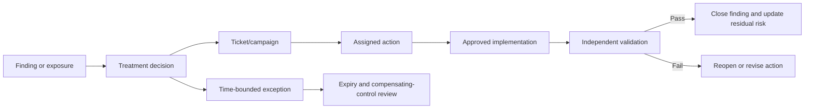

### Ticket/action field dictionary

| Field | Type | Required | Meaning | Validation/caveat |
|---|---|---:|---|---|
| `work_item_id` | text/UUID | Yes | Canonical action/work item key | Unique |
| `external_system_id` | text | Yes | Ticketing/workflow source | Existing source |
| `external_key` | text | Yes | Native ticket key | Unique within project/tenant |
| `work_item_type` | enum | Yes | Ticket, task, campaign, change, validation, decision | Controlled list |
| `title` | text | Yes | Minimized work summary | Avoid secrets/personal data |
| `status` | enum | Yes | New, accepted, in progress, blocked, resolved, closed, cancelled, unknown | Source-to-canonical lifecycle mapping |
| `owner_identity_id` | text | No | Current accountable assignee | Missing owner is explicit gap |
| `assignment_group_id` | text | No | Responsible team | Team is not accountable person by itself |
| `priority` | enum | No | Work priority under workflow scheme | Do not equate with vulnerability severity |
| `created_at` | timestamptz | Yes | Ticket creation time | Not finding start |
| `accepted_at` | timestamptz | No | Owner acceptance time | Defines acknowledgment metric when used |
| `due_at` | timestamptz | No | Governed deadline | SLA/exception reference |
| `resolved_at` | timestamptz | No | Reporter/system says work resolved | Validation still needed |
| `closed_at` | timestamptz | No | Workflow closure time | Not proof of risk reduction |
| `blocked_reason_code` | enum | No | Dependency, owner, change window, vendor, risk decision, other | Stable categories |
| `linked_object_type` | relationship | Yes | Finding, exposure, incident, control, connector, success outcome | Use bridge for many links |
| `validation_evidence_id` | text | No | Independent validation reference | Required for verified closure |
| `provenance_id` | text | Yes | Workflow lineage | Required |

### Exception field dictionary

| Field | Type | Required | Meaning | Validation/caveat |
|---|---|---:|---|---|
| `exception_id` | text/UUID | Yes | Canonical approved-deviation key | Unique |
| `exception_type` | enum | Yes | Policy, SLA, vulnerability, control, data, access, other | Controlled |
| `subject_type`/`subject_id` | typed reference | Yes | Item covered by exception | Exact scope |
| `rationale` | text | Yes | Approved reason and alternatives considered | Minimize sensitive detail |
| `risk_statement_id` | text | Yes | Linked risk scenario | Existing |
| `approver_identity_id` | text | Yes | Authorized risk/control owner | Authority validation |
| `approved_at` | timestamptz | Yes | Approval time | UTC |
| `effective_from` | timestamptz | Yes | Exception start | Not before approval unless explicitly governed |
| `expires_at` | timestamptz | Yes | Mandatory review/end time | No silent permanent exception |
| `compensating_control_ids` | relationship | No | Alternative safeguards | Effectiveness evidence required |
| `review_cadence` | interval/text | Yes | Required reassessment rhythm | Owner assigned |
| `status` | enum | Yes | Draft, approved, active, expired, revoked, closed | Transition rules |
| `closure_evidence_id` | text | No | Evidence exception is no longer needed | Required for close when applicable |
| `provenance_id` | text | Yes | Decision lineage | Required |

### Decision record template

| Field | Worksheet prompt |
|---|---|
| Decision ID | Stable key and title |
| Decision owner | Who has authority and accountability? |
| Decision date | When was it made and when is it effective? |
| Problem statement | Which bounded risk, data, product, or customer question? |
| Evidence | Which minimized artifacts and provenance IDs support it? |
| Assumptions/unknowns | Which facts remain unverified? |
| Options | What feasible alternatives were considered? |
| Criteria | Security, customer impact, cost, effort, reversibility, policy, timing |
| Decision | What was chosen and why? |
| Dissent | Which material objections remain? |
| Actions | Owner, due date, dependency, validation criterion |
| Review trigger | Date, metric, incident, source change, product change, or failed assumption |

## Business context and risk templates

### Diagram D10 - Technical entity to business impact

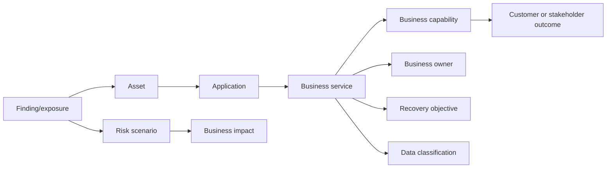

### Business service field dictionary

| Field | Type | Required | Meaning | Validation/caveat |
|---|---|---:|---|---|
| `business_service_id` | text/UUID | Yes | Stable canonical service key | Unique |
| `service_name` | text | Yes | Approved service label | Names can change |
| `capability_id` | text | No | Business capability enabled | Existing context |
| `business_owner_identity_id` | text | Yes | Accountable outcome owner | Effective relationship |
| `technical_owner_identity_id` | text | Yes | Accountable technical owner | Separate role |
| `criticality` | enum | Yes | Governed service importance | Criteria and authority stored |
| `customer_impact_scope` | text/JSON | No | Affected customer/employee/process populations | Minimize personal detail |
| `recovery_time_objective` | interval | No | Maximum targeted restoration time under continuity plan | Not actual SLA unless contracted |
| `recovery_point_objective` | interval | No | Maximum targeted data-loss interval | Applicability varies |
| `availability_target` | numeric/text | No | Governed service objective | Period and exclusions required |
| `data_classification_max` | enum | Yes | Highest governed data sensitivity | Source/owner |
| `regulatory_tags` | relationship | No | Applicable obligation references | Not legal conclusion |
| `lifecycle_status` | enum | Yes | Planned, active, suspended, retired | Effective interval |
| `provenance_id` | text | Yes | Authority and lineage | Required |

### Risk scenario field dictionary

| Field | Type | Required | Meaning | Validation/caveat |
|---|---|---:|---|---|
| `risk_scenario_id` | text/UUID | Yes | Canonical risk scenario key | Unique |
| `scenario_statement` | text | Yes | Threat/condition, asset/objective, and credible harm | Avoid vague `high risk` wording |
| `business_service_id` | text | No | Affected service | Existing context |
| `threat_context_ids` | relationship | No | Supporting threat evidence | Time/confidence |
| `exposure_ids` | relationship | No | Supporting exposures/findings | Many-to-many |
| `inherent_likelihood` | numeric/enum | No | Pre-control likelihood under method | Model/version/time horizon |
| `inherent_impact` | numeric/enum | No | Pre-control impact under method | Unit/criteria |
| `control_observation_ids` | relationship | No | Relevant control evidence | Effectiveness not presence |
| `residual_likelihood` | numeric/enum | No | Post-control likelihood estimate | Assumptions visible |
| `residual_impact` | numeric/enum | No | Post-control impact estimate | Controls may change likelihood and/or impact |
| `risk_rating` | numeric/enum | No | Derived summary under named model | Not universal truth |
| `uncertainty_statement` | text | Yes | Data limits and plausible range | Required for quantification |
| `treatment` | enum | Yes | Avoid, mitigate, transfer/share, accept, monitor | Owner decision |
| `risk_owner_identity_id` | text | Yes | Authorized accountable owner | Authority required |
| `review_at` | timestamptz | Yes | Next review trigger/date | Current |
| `provenance_id` | text | Yes | Evidence/model lineage | Required |

## Customer-success and account templates

### Diagram D11 - Customer outcome model

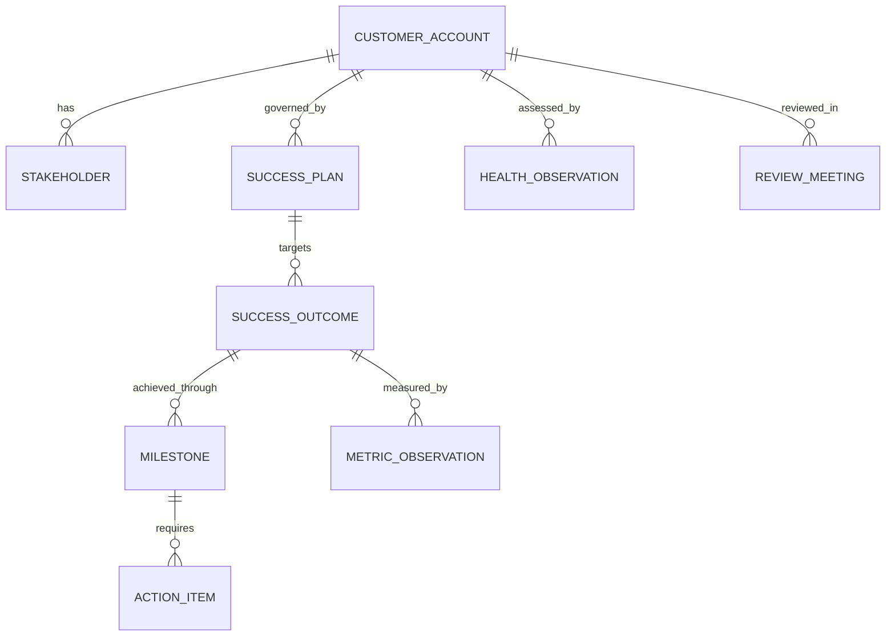

### Customer account field dictionary

| Field | Type | Required | Meaning | Validation/privacy |
|---|---|---:|---|---|
| `customer_account_id` | text/UUID | Yes | Canonical customer/account key | Restricted |
| `customer_display_name` | text | Yes | Approved account label | Restricted; synthetic in labs |
| `segment` | enum | No | Governed customer segment | Definition/version |
| `industry` | enum/text | No | Approved industry classification | Do not infer regulation automatically |
| `region` | enum/text | No | Commercial/operational region | Not exact location unless needed |
| `technical_success_owner_id` | text | Yes | TSM/technical-success owner | Current effective assignment |
| `sales_owner_id` | text | No | Commercial owner | Role boundary |
| `support_owner_id` | text | No | Support/TAM owner where applicable | Role boundary |
| `lifecycle_stage` | enum | Yes | Onboarding, adopting, realizing value, renewing, expanding, exiting | Governed |
| `licensed_capability_reference` | restricted text/relationship | No | Approved entitlement source | Do not infer from public docs |
| `success_plan_id` | text | No | Current governed plan | Historical plans retained |
| `health_state` | enum | No | Derived state under model | Factors/time/version |
| `risk_flags` | relationship | No | Account risks with owners | Avoid vague free-text labels |
| `classification` | enum | Yes | Handling label | Strong RBAC |
| `provenance_id` | text | Yes | CRM/approved-source lineage | Required |

### Success outcome field dictionary

| Field | Type | Required | Meaning | Validation/caveat |
|---|---|---:|---|---|
| `outcome_id` | text/UUID | Yes | Stable customer-outcome key | Unique |
| `customer_account_id` | text | Yes | Parent account | Existing |
| `outcome_statement` | text | Yes | Specific customer-valued result | Not a feature/activity |
| `baseline_definition` | text | Yes | Starting state, scope, time, source | Reproducible |
| `target_definition` | text | Yes | Desired state and deadline | Owner-approved |
| `metric_definition_ids` | relationship | Yes | Measures used to assess outcome | Versioned contracts |
| `owner_identity_id` | text | Yes | Customer accountable owner | TSM can coordinate, not own customer action |
| `tsm_owner_identity_id` | text | Yes | Technical-success coordinator | Clear boundary |
| `target_at` | timestamptz/date | Yes | Outcome target date | Time zone/calendar |
| `status` | enum | Yes | Proposed, agreed, on track, at risk, achieved, missed, retired | Evidence-based transitions |
| `confidence` | numeric/enum | No | Confidence in outcome assessment | Not sentiment alone |
| `validation_evidence_id` | text | No | Evidence that outcome occurred | Required for achieved |
| `next_value_hypothesis` | text | No | Proposed next outcome and assumptions | Not committed roadmap |
| `provenance_id` | text | Yes | Plan and evidence lineage | Required |

### Health observation field dictionary

| Field | Type | Required | Meaning | Validation/caveat |
|---|---|---:|---|---|
| `health_observation_id` | text/UUID | Yes | One account-health assessment at an as-of time | Unique |
| `customer_account_id` | text | Yes | Assessed account | Existing |
| `as_of_at` | timestamptz | Yes | Fixed assessment instant | UTC |
| `model_version` | text | Yes | Health model revision | Required for trend comparability |
| `adoption_component` | numeric/enum | No | Governed workflow/usage assessment | Usage is not outcome |
| `data_health_component` | numeric/enum | No | Freshness/quality/integration assessment | Source coverage visible |
| `support_component` | numeric/enum | No | Case/escalation trend under contract | Avoid punishing healthy reporting |
| `stakeholder_component` | numeric/enum | No | Structured sentiment/engagement evidence | Subjective and privacy-sensitive |
| `outcome_component` | numeric/enum | No | Progress against agreed outcomes | Strongest value signal when validated |
| `overall_health_state` | enum | Yes | Derived state | Factors/weights/missingness explained |
| `top_risk_id` | text | No | Most decision-relevant account risk | Owner/action linked |
| `recommended_action_id` | text | No | Next controlled action | Not automated commitment |
| `provenance_id` | text | Yes | Metric and review evidence | Required |

## Metric, evidence, and provenance extensions

### Diagram D12 - Metric definition and observation

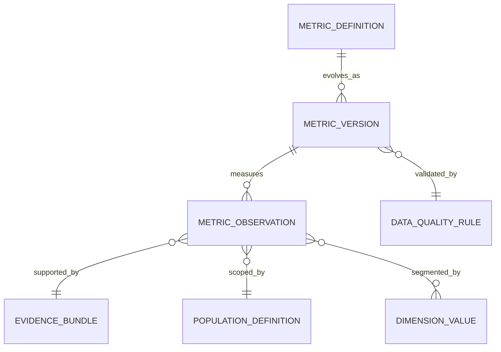

### Metric definition field dictionary

| Field | Type | Required | Meaning | Validation/caveat |
|---|---|---:|---|---|
| `metric_definition_id` | text/UUID | Yes | Stable metric concept key | Unique |
| `metric_name` | text | Yes | Approved display name | Avoid acronym ambiguity |
| `purpose` | text | Yes | Decision the metric supports | No decision means vanity risk |
| `grain` | text | Yes | Meaning of one observation row | Precise sentence |
| `numerator_definition` | text | Conditional | Count/value meeting condition | Required for rate |
| `denominator_definition` | text | Conditional | Eligible population | Required for rate |
| `formula` | text/DSL | Yes | Governed calculation | Versioned/tested |
| `unit` | enum/text | Yes | Count, percent, seconds, hours, currency, score, other | No unitless ambiguity |
| `aggregation_rule` | enum | Yes | Sum, recompute, last snapshot, weighted, non-additive | BI enforcement |
| `time_basis` | text | Yes | Event/snapshot/as-of and timezone | Required |
| `inclusions`/`exclusions` | text | Yes | Population boundaries | Visible to consumer |
| `unknown_handling` | text | Yes | Treatment of missing/unmapped values | Never silently coerce |
| `owner_identity_id` | text | Yes | Metric owner | Authority |
| `version` | text | Yes | Exact contract version | Immutable observations refer to it |
| `effective_from`/`effective_to` | timestamptz | Yes/No | Validity interval | No overlap for active version |
| `validation_rule_ids` | relationship | Yes | Tests/reconciliations | Required |

### Metric observation field dictionary

| Field | Type | Required | Meaning | Validation/caveat |
|---|---|---:|---|---|
| `metric_observation_id` | text/UUID | Yes | One measured result at grain | Unique |
| `metric_definition_id` | text | Yes | Metric contract | Existing/versioned |
| `metric_version` | text | Yes | Exact formula revision | Required |
| `as_of_at` or `period_start/end` | timestamptz | Yes | Temporal scope | Half-open period preferred |
| `dimension_set` | relationship/JSON | No | Governed segmentation values | Stable dimension IDs |
| `numerator_value` | numeric | Conditional | Observed numerator | Retain for rates |
| `denominator_value` | numeric | Conditional | Eligible denominator | Zero handling explicit |
| `metric_value` | numeric/text | Yes | Calculated result | Unit and precision apply |
| `quality_state` | enum | Yes | Valid, warning, incomplete, stale, disputed | Visible in reports |
| `confidence_interval_low/high` | numeric | No | Statistical uncertainty when applicable | Method/sample required |
| `evidence_bundle_id` | text | Yes | Query/source evidence | Reproducible |
| `calculated_at` | timestamptz | Yes | Processing time | Not measurement time |
| `provenance_id` | text | Yes | Full lineage | Required |

### Evidence bundle field dictionary

| Field | Type | Required | Meaning | Validation/security |
|---|---|---:|---|---|
| `evidence_bundle_id` | text/UUID | Yes | Controlled evidence collection key | Unique |
| `purpose` | text | Yes | Approved question/claim supported | Purpose limitation |
| `collector_identity_id` | text | Yes | Person/system collecting | Accountability |
| `authorization_reference` | text | Yes | Ticket/change/incident/approval | Must resolve |
| `collected_from` | text | Yes | System/vantage point | Exact scope |
| `collection_started_at`/`ended_at` | timestamptz | Yes | UTC interval | End at/after start |
| `artifact_reference` | restricted URI/text | Yes | Approved repository location | No public links |
| `artifact_type` | enum | Yes | Log, PCAP, ETL, HAR, screenshot, query result, report, attestation | Handling varies |
| `hash_algorithm`/`hash_value` | text | No | Integrity value | Canonical bytes and algorithm recorded |
| `classification` | enum | Yes | Handling label | Enforced |
| `redaction_state` | enum | Yes | Original, minimized, redacted derivative, anonymized under review | Do not overwrite original |
| `redaction_log_reference` | text | Conditional | What changed in derivative | Required for redacted copy |
| `retention_until` | timestamptz | Yes | Deletion/review deadline | Policy-derived |
| `chain_of_custody_reference` | text | No | Transfer/access record | Required for forensic use where applicable |
| `limitations` | text | Yes | Capture gaps, clock, scope, missing fields | Required honesty field |

### Diagram D13 - Evidence and claim ladder

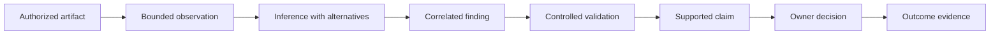

## Temporal modeling

Security data changes in several clocks. Event time says when activity happened. Observed time says when a sensor saw a state. Ingest time says when a pipeline received it. Effective time says when an assertion is valid in the modeled world. Recorded time says when the model learned or stored it. Processing time says when a transformation ran. Keep only the clocks needed for the approved use, but never merge different meanings into one `timestamp`.

### Diagram D14 - Bitemporal record

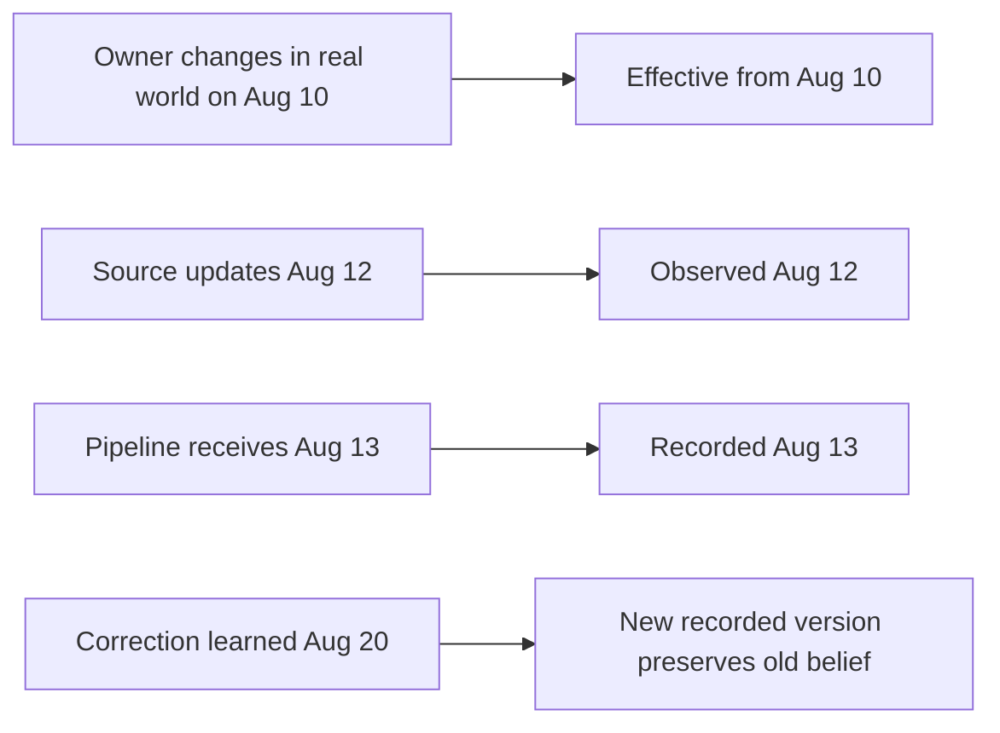

| Temporal field | Question answered | Example | Rule |
|---|---|---|---|
| `event_at` | When did activity occur? | Login attempt | Source clock and precision |
| `observed_at` | When did sensor see condition? | Scanner found service | Vantage point required |
| `ingested_at` | When did pipeline receive record? | Connector receipt | Pipeline-owned UTC |
| `processed_at` | When did transformation execute? | Mapping run | Version linked |
| `effective_from/to` | When is assertion valid in the modeled world? | Asset owner interval | Nonoverlap rules |
| `recorded_from/to` | When did model believe/version the assertion? | Late correction | Enables audit of prior reports |
| `as_of_at` | At what instant is state evaluated? | Health review | Fixed and reproducible |
| `period_start/end` | Which interval does metric cover? | Monthly SLA | Prefer start-inclusive/end-exclusive |
| `expires_at` | When must evidence/exception be revalidated? | Control observation | Policy-derived |

### Slowly changing dimension template

| Field | Purpose | Example validation |
|---|---|---|
| `asset_version_id` | Surrogate key for one attribute version | Unique |
| `asset_id` | Stable canonical business entity | Many versions allowed |
| `effective_from` | Inclusive version start | Required |
| `effective_to` | Exclusive version end | Greater than start; null only current |
| `is_current` | Convenience flag | Exactly one current version per asset |
| `owner_identity_id` | Historical owner | Existing identity version as appropriate |
| `criticality` | Historical governed criticality | Code valid under date |
| `recorded_at` | Warehouse/model record time | UTC |
| `change_reason` | Source change, correction, merge, split | Controlled code plus reference |
| `provenance_id` | Supporting lineage | Required |

## Source-to-canonical mapping

### Diagram D15 - Mapping lifecycle

```mermaid
flowchart LR
    DISC[Profile source fields and examples] --> DEFINE[Confirm source semantics and owner]
    DEFINE --> TARGET[Select canonical concept and grain]
    TARGET --> RULE[Specify type enum unit time and null rules]
    RULE --> TEST[Known-answer positive negative and boundary tests]
    TEST --> REVIEW[Source semantic privacy and consumer review]
    REVIEW --> VERSION[Approve immutable mapping version]
    VERSION --> RUN[Execute with lineage and quarantine]
    RUN --> MONITOR[Monitor drift quality and outcomes]
    MONITOR --> CHANGE[Controlled change request]
```

### Reusable source inventory worksheet

| Worksheet field | Prompt |
|---|---|
| Source ID/name | What stable registry ID and approved name apply? |
| Owner/contact | Who defines semantics and who operates access? |
| Business/security purpose | Which approved decisions need this source? |
| Entities/events | What does each record represent? |
| Native keys | Which fields are unique, stable, scoped, or reused? |
| Time fields | Event, observation, update, ingest, and deletion meanings? |
| Full/incremental behavior | How are changes, deletes, and late corrections represented? |
| Authentication | Which secret-manager reference and least privilege scope? |
| Limits | Pagination, quotas, windows, retention, size, ordering? |
| Classification | Which sensitive/personal/security fields appear? |
| Data quality | Expected volume, cadence, nulls, duplicates, enums? |
| Change process | How are versions announced, tested, and retired? |
| Authority | Which fields is this source authoritative for, under what scope? |
| Evidence | Which official contract and sample prove the statements? |

### Reusable field-mapping worksheet

| Column | Required content |
|---|---|
| Mapping ID/version | Immutable identifier for review and execution |
| Source system/object | Registry ID, tenant/scope, endpoint/file/object version |
| Source grain | Exact meaning of one source record |
| Source field/path | Case-sensitive path or column |
| Source type/format | Type, unit, timezone, enum, null/missing behavior |
| Source definition | Owner-approved semantic meaning and exclusions |
| Canonical entity/grain | Target record type and exact row meaning |
| Canonical field | Target path/column and version |
| Transformation | Trim, parse, cast, normalize, lookup, derive, preserve raw |
| Enum crosswalk | Every known source value, unknown rule, unmapped behavior |
| Time rule | Source zone/precision, UTC conversion, effective/observed meaning |
| Validation | Type, domain, referential, temporal, semantic, reconciliation tests |
| Error handling | Reject, quarantine, warning, default only if governed |
| Provenance | Source record, run, rule version, hashes, confidence |
| Classification | Input/output label, minimization, masking, access, retention |
| Owner/approvers | Source, canonical, privacy, security, consumer signoff |

### Mapping example: synthetic scanner asset

| Source path | Source meaning | Canonical target | Transformation | Validation/error |
|---|---|---|---|---|
| `device.id` | Scanner-native device key | `source_reference.source_native_id` | Preserve as trimmed text | Reject empty; namespace by tenant/object |
| `device.hostname` | Source-reported host label | `asset_identifier.normalized_value` | Preserve raw; lowercase DNS-like label for candidate match | Quarantine invalid encoding; never merge on hostname alone |
| `device.ip` | IP observed during scan | `asset_identifier` type `ip` | Parse IP; retain observed interval | Reject invalid; make temporal |
| `device.os` | Scanner fingerprint text | `asset.platform` | Map through versioned platform crosswalk | Unmapped becomes unknown plus raw |
| `last_seen` | Last scan observation time | `asset.last_observed_at` | Parse declared source zone to UTC | Quarantine ambiguous/invalid time |
| `internet_facing` | Source's own exposure flag | `exposure_assertion` candidate | Do not copy directly to canonical Boolean; record method/vantage | Requires source definition and independent validation |
| `owner_email` | Optional source owner label | owner match candidate | Normalize only for candidate resolution | Personal data; unresolved stays unresolved |
| Entire record | Source evidence | provenance/raw reference | Hash canonical source bytes and store restricted reference | Never copy credentials or unnecessary payload |

### Enum crosswalk worksheet

| Source value | Source definition | Canonical value | Match relation | Handling |
|---|---|---|---|---|
| `sev_5` | Source-defined highest technical severity | `critical` | Close/exact only if definitions align | Store source scheme/version |
| `sev_4` | Source-defined high severity | `high` | Reviewed mapping | Unit tests |
| `informational` | Observation requiring no vulnerability severity | `informational` or separate finding class | Possibly narrower/different | Do not force into `low` |
| Empty | Producer did not populate | `unknown` | Missing | Quality warning |
| New unrecognized value | Contract drift | Unmapped | Unknown relation | Quarantine or warning; never default silently |

### Diagram D16 - Mapping error decision

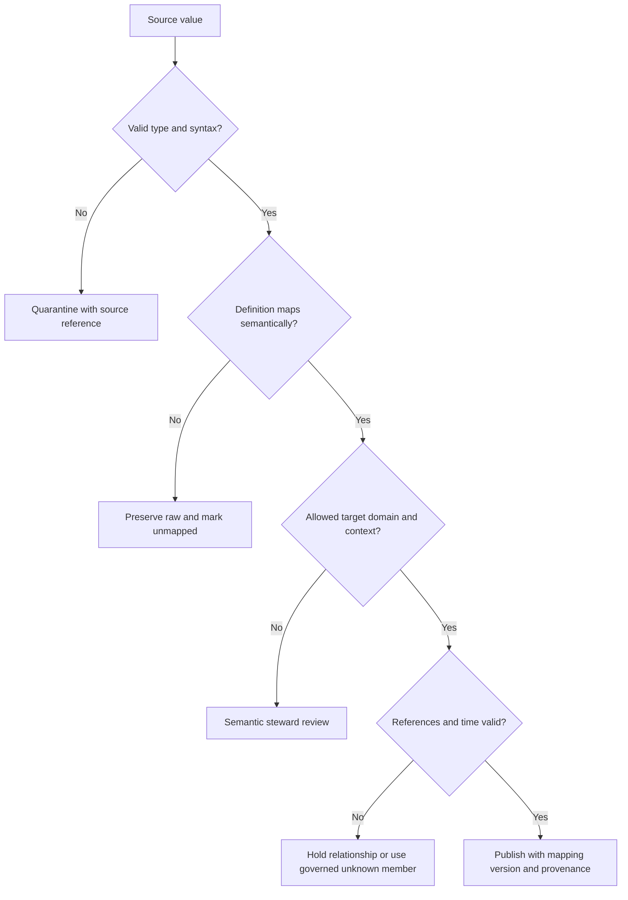

## Entity resolution, deduplication, and survivorship

### Diagram D17 - Candidate matching and merge/split control

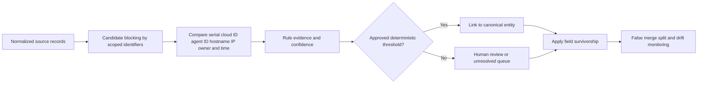

### Match-rule worksheet

| Field | Example/prompt |
|---|---|
| Rule ID/version | `ASSET-MATCH-003 v2` |
| Entity class | Which asset/identity/app subtype? |
| Candidate blocking | Which scoped fields create a manageable candidate set? |
| Positive signals | Exact serial, cloud resource ID, agent ID, stable account ID |
| Negative signals | Overlapping active serial conflict, impossible geography/time, incompatible type |
| Temporal rule | Can identifiers move or be reused? Which intervals must overlap? |
| Normalization | Case, whitespace, Unicode, domain suffix, vendor format |
| Weight/evidence | Why does each signal support identity? |
| Auto-link threshold | Only for tested and approved deterministic/high-confidence cases |
| Review band | Which candidates require human decision? |
| No-link rule | When must records remain separate? |
| Merge reversal | How are false merges split and downstream facts restated? |
| Test corpus | Known matches, nonmatches, edge cases, ephemeral assets |
| Metrics | Precision, recall estimate, unresolved rate, reversal rate, review age |

### Survivorship worksheet

| Canonical field | Candidate sources | Selection rule | Tie/conflict behavior | Freshness/expiry |
|---|---|---|---|---|
| Owner | CMDB, cloud tags, EDR user | Approved CMDB owner when current; else governed fallback | Conflict is visible and assigned to steward | 7-day example only in synthetic lab |
| Hostname | Directory, EDR, DNS, scanner | Most recent stable managed-source assertion | Preserve aliases; do not overwrite identity | Asset-class-specific |
| Criticality | Business service registry, CMDB | Business-owner-approved value | No scanner-derived default | Review on service change |
| Internet exposure | Validated external observation, architecture intent | Validated observation wins for observed state; intent remains separate | Disputed state retained | Short evidence expiry |
| Lifecycle | Cloud control plane, CMDB, EDR | Source authority depends on asset class | `Retired` requires no fresh contradictory evidence | Class/cadence-specific |
| Platform version | EDR, scanner, cloud inventory | Freshest authoritative observation | Conflicts remain visible | Short operational freshness |

### Diagram D18 - Field-level survivorship

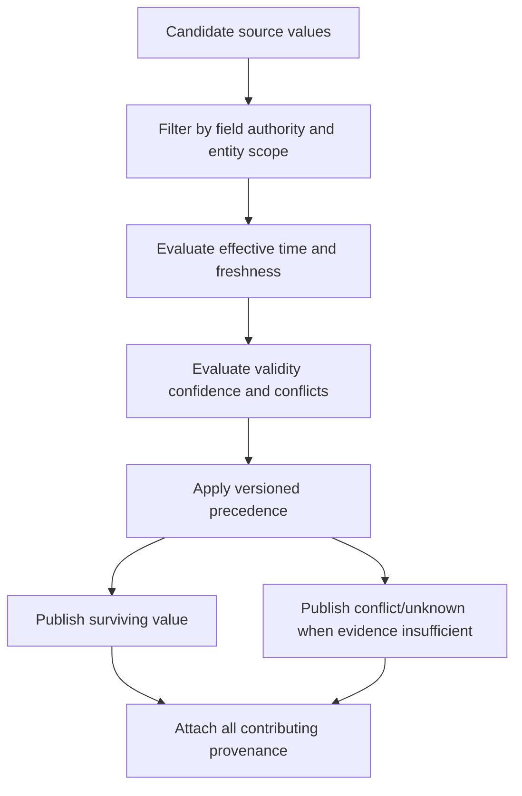

## Validation rules and data-quality controls

### Diagram D19 - Validation layers

```mermaid
flowchart LR
    BYTES[Encoding and file integrity] --> STRUCT[Schema type and required fields]
    STRUCT --> DOMAIN[Enum range unit and format]
    DOMAIN --> REL[Key cardinality and referential integrity]
    REL --> TIME[Temporal sequence and overlap]
    TIME --> SEM[Cross-field semantic rules]
    SEM --> RECON[Source-stage-target reconciliation]
    RECON --> FIT[Fitness for named decision]
```

| Validation layer | Example rule | Failure action |
|---|---|---|
| Encoding | Input is approved UTF-8 and parseable | Reject/quarantine file or record |
| Structural | `finding_id`, `asset_id`, and source are present | Quarantine record |
| Type | Port parses as integer | Preserve raw, reject mapped field |
| Range | Port from 0 through 65535; confidence from 0 through 1 | Quarantine invalid value |
| Enum | Status exists in active code-list version | Mark unmapped; do not guess |
| Unit | Latency explicitly milliseconds or duration type | Reject ambiguous number |
| Referential | Finding asset resolves or enters governed unresolved queue | Do not drop silently |
| Cardinality | One current owner relationship under defined role | Flag conflict |
| Temporal | `first_observed <= last_observed`; intervals do not overlap improperly | Quarantine/correct with lineage |
| Semantic | Closed finding has closure source and time | Quality error, not auto-fill |
| Reconciliation | Source = accepted + quarantined + governed filtered under contract | Stop publication or mark incomplete |
| Freshness | Last successful run within source-specific expectation | Publish stale warning and owner action |
| Drift | Unexpected field, enum, type, or volume change | Pause risky mapping and review |
| Privacy | Restricted field not exported to broad view | Block publication |
| Outcome | Closed ticket has independent validation when metric says remediated | Exclude from validated-remediation metric |

### Data-quality rule template

| Field | Prompt |
|---|---|
| Rule ID/version | Stable immutable identifier |
| Name/purpose | Which bad decision does the rule prevent? |
| Target entity/field/grain | Where exactly does it apply? |
| Expression | Machine-testable condition |
| Severity | Warning, quarantine, reject, publication block |
| Expected threshold | Exact percentage/count and time window |
| Unknown behavior | How missing evidence is represented |
| Owner | Who investigates and decides? |
| Evidence | Which failing records and source/run references are retained? |
| Remediation | Source correction, mapping change, backfill, exception, consumer warning |
| Validation | How is correction independently confirmed? |
| Effective interval | When does this version apply? |

### Acceptance test matrix

| Test case | Input | Expected canonical result |
|---|---|---|
| Exact identifier | Same scoped cloud resource ID in two current records | One candidate/entity link with both provenance sources |
| Reused IP | Same IP on nonoverlapping assets/times | Two assets; temporal identifiers remain separate |
| Null owner | Source owner absent | Canonical owner unknown; completeness warning |
| New severity | `urgent_plus` not in mapping | Raw retained; unmapped state; no `critical` default |
| Invalid timestamp | `08/09/10` with no format/zone | Quarantine ambiguous time |
| Late event | Event arrives after daily snapshot | Preserve event time and ingest time; governed restatement |
| Duplicate retry | Same source event ID and payload | Idempotent duplicate count, one canonical event |
| Conflicting retry | Same event ID but different payload | Conflict quarantine and source escalation |
| Closed ticket | Ticket closed, finding still observed | Workflow closed; finding/exposure remains until validation |
| Expired exception | Current time after expiry | Exception inactive; control/finding workflow reopens per policy |
| Missing parent | Finding references unknown asset | Unresolved queue/unknown member; no silent drop |
| False merge test | Similar hostname, conflicting current serials | Keep separate and flag review |

## Privacy, classification, security, and retention

### Diagram D20 - Data-handling decision

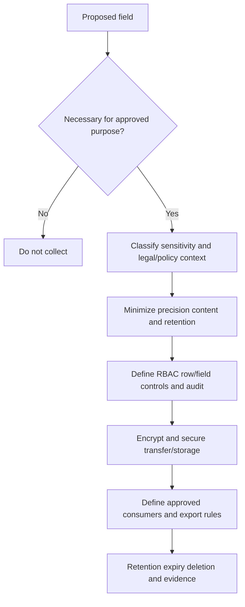

### Classification worksheet

| Field category | Examples | Default handling question |
|---|---|---|
| Direct identity | Name, email, employee ID | Can a canonical pseudonymous ID satisfy the use? |
| Network identity | IP, hostname, MAC, device ID | Is full precision needed and for how long? |
| Authentication | Account state, MFA status, sign-in metadata | Is it high sensitivity and role-restricted? |
| Secret/credential | Token, cookie, password, private key | Do not ingest; store only secret-manager reference |
| Content | File name, URL query, payload, document text | Can metadata or classification replace content? |
| Vulnerability/exposure | Asset flaw, reachable service, missing control | Restrict because it can aid attackers |
| Threat/incident | Indicators, timeline, affected identities | Apply incident/intelligence sharing markings |
| Business context | Criticality, revenue/process/customer impact | Restrict strategic information |
| Customer success | Entitlement, adoption, sentiment, renewal risk | Account-team RBAC and purpose limitation |
| Evidence | PCAP, HAR, logs, screenshots | Highest contained classification and short retention |

### Privacy and security control checklist

| Control | Design question |
|---|---|
| Purpose limitation | Which approved decision requires each field? |
| Minimization | Can precision, content, history, or population be reduced? |
| Pseudonymization | Can direct identity be replaced with a controlled key? |
| Access | Which roles need raw, canonical, aggregate, or export access? |
| Segregation | Must customers, regions, incidents, or duties be isolated? |
| Encryption | How are data protected in transit and at rest under current policy? |
| Secret handling | Are only secret-manager references stored? |
| Audit | Which reads, exports, mappings, merges, decisions, and deletions are logged? |
| Retention | Which field/entity has which retention trigger and owner? |
| Deletion | How are source deletion, legal hold, derived records, and backups handled? |
| Residency | Which storage/processing locations are allowed? |
| Export | Which fields can enter CSV, BI, tickets, emails, or support packages? |
| Incident response | How is unauthorized access or data leakage handled? |
| Review | Which legal, privacy, security, data, and business owners approve? |

### Plain-English deep-dive 4 - Security data can be dangerous data

A security data set may reveal which servers are unpatched, which users are privileged, which controls are absent, how applications connect, and where response teams are slow. Even without passwords, that is useful to an attacker and sensitive to employees and customers. Think of a building safety map showing every weak door and camera location. Access should follow purpose and role, exports should be minimized, and evidence should expire when no longer needed.

## Reusable schema formats

The examples are intentionally synthetic and source-neutral. They demonstrate shape, not a production API. JSON permits nested convenience, CSV flattens relationships awkwardly, and SQL-style relational tables enforce explicit keys. Choose a representation based on workload while keeping the same semantic contract.

### JSON example 1 - Synthetic canonical asset

```json
{
  "schema_name": "nmh.canonical.asset",
  "schema_version": "1.0.0",
  "asset_id": "A-SYN-001",
  "asset_kind": "server",
  "canonical_name": "web-lab-01",
  "lifecycle_status": "active",
  "owner_identity_id": "U-SYN-003",
  "business_service_id": "SVC-SYN-001",
  "criticality": "critical",
  "internet_exposure_state": "validated",
  "first_observed_at": "2026-08-01T08:00:00Z",
  "last_observed_at": "2026-08-24T08:00:00Z",
  "identity_confidence": 0.99,
  "classification": "synthetic-internal",
  "provenance_id": "PROV-SYN-001"
}
```

### JSON example 2 - Synthetic finding with source boundary

```json
{
  "schema_name": "nmh.canonical.finding",
  "schema_version": "1.0.0",
  "finding_id": "F-SYN-001",
  "asset_id": "A-SYN-001",
  "vulnerability_id": "V-SYN-001",
  "finding_type": "vulnerability",
  "source": {
    "source_system_id": "SRC-VM-SYN",
    "source_scope": "tenant-lab",
    "source_finding_id": "sf-7788",
    "source_severity_raw": "sev_5"
  },
  "source_severity_mapped": "critical",
  "finding_status": "open",
  "first_observed_at": "2026-08-20T08:00:00Z",
  "last_observed_at": "2026-08-24T08:00:00Z",
  "contextual_score": 88.5,
  "score_model_version": "nmh-lab-2",
  "provenance_id": "PROV-SYN-002"
}
```

### JSON example 3 - Synthetic event envelope

```json
{
  "schema_name": "nmh.event.envelope",
  "schema_version": "1.0.0",
  "event_id": "EVT-SYN-001",
  "source_system_id": "SRC-ID-SYN",
  "source_event_id": "login-10001",
  "event_type": "authentication",
  "event_action": "sign_in",
  "event_outcome": "denied",
  "event_at": "2026-08-24T10:00:00Z",
  "ingested_at": "2026-08-24T10:00:05Z",
  "actor": {
    "entity_type": "account",
    "entity_id": "ACCT-SYN-001",
    "resolution_confidence": 1.0
  },
  "target": {
    "entity_type": "application",
    "entity_id": "APP-SYN-001"
  },
  "provenance_id": "PROV-SYN-003"
}
```

### JSON example 4 - Synthetic mapping specification

```json
{
  "mapping_id": "MAP-ASSET-SYN-001",
  "mapping_version": "1.2.0",
  "source_system_id": "SRC-VM-SYN",
  "source_object": "device",
  "target_schema": "nmh.canonical.asset/1.0.0",
  "fields": [
    {
      "source_path": "device.id",
      "target_path": "source_reference.source_native_id",
      "transform": "trim_preserve_text",
      "on_error": "quarantine"
    },
    {
      "source_path": "device.last_seen",
      "target_path": "last_observed_at",
      "transform": "parse_iso8601_to_utc",
      "on_error": "quarantine"
    }
  ],
  "approved_at": "2026-08-24T00:00:00Z",
  "classification": "synthetic-internal"
}
```

### CSV example 1 - Flat synthetic asset export

```csv
schema_version,asset_id,asset_kind,canonical_name,lifecycle_status,owner_identity_id,business_service_id,criticality,internet_exposure_state,last_observed_at,provenance_id
1.0.0,A-SYN-001,server,web-lab-01,active,U-SYN-003,SVC-SYN-001,critical,validated,2026-08-24T08:00:00Z,PROV-SYN-001
1.0.0,A-SYN-002,database,db-lab-01,active,U-SYN-002,SVC-SYN-001,critical,not_observed,2026-08-24T08:00:00Z,PROV-SYN-004
```

CSV cannot reliably express nested provenance or many-to-many relationships in one row. Use separate relationship files with keys, publish quoting/encoding/null rules, and never use an empty string as an unexplained universal null.

### CSV example 2 - Synthetic relationship export

```csv
schema_version,relationship_id,source_type,source_id,relationship_type,target_type,target_id,effective_from,effective_to,confidence,provenance_id
1.0.0,REL-SYN-001,asset,A-SYN-001,SUPPORTS,business_service,SVC-SYN-001,2026-08-01T00:00:00Z,,1.0,PROV-SYN-005
1.0.0,REL-SYN-002,identity,U-SYN-003,OWNS,asset,A-SYN-001,2026-08-01T00:00:00Z,,1.0,PROV-SYN-006
```

### SQL-style schema example 1 - Local synthetic core

```sql
-- Local disposable lab only. This is not a product schema.
CREATE SCHEMA IF NOT EXISTS nmh_template;

CREATE TABLE nmh_template.asset (
    asset_id text PRIMARY KEY,
    asset_kind text NOT NULL,
    canonical_name text NOT NULL,
    lifecycle_status text NOT NULL,
    owner_identity_id text,
    business_service_id text,
    criticality text,
    internet_exposure_state text,
    first_observed_at timestamptz NOT NULL,
    last_observed_at timestamptz NOT NULL,
    identity_confidence numeric(4,3) NOT NULL
        CHECK (identity_confidence BETWEEN 0 AND 1),
    classification text NOT NULL,
    provenance_id text NOT NULL,
    CHECK (last_observed_at >= first_observed_at)
);

CREATE TABLE nmh_template.source_reference (
    source_reference_id text PRIMARY KEY,
    asset_id text NOT NULL REFERENCES nmh_template.asset(asset_id),
    source_system_id text NOT NULL,
    source_tenant_scope text NOT NULL,
    source_object_type text NOT NULL,
    source_native_id text NOT NULL,
    match_method text NOT NULL,
    match_confidence numeric(4,3),
    match_rule_version text NOT NULL,
    first_linked_at timestamptz NOT NULL,
    last_confirmed_at timestamptz NOT NULL,
    provenance_id text NOT NULL,
    UNIQUE (source_system_id, source_tenant_scope, source_object_type, source_native_id)
);
```

### SQL-style schema example 2 - Temporal relationship

```sql
-- Local disposable lab only. Use exclusion constraints or governed tests
-- for nonoverlap according to the selected database and relationship rules.
CREATE TABLE nmh_template.entity_relationship (
    relationship_id text PRIMARY KEY,
    source_entity_type text NOT NULL,
    source_entity_id text NOT NULL,
    relationship_type text NOT NULL,
    target_entity_type text NOT NULL,
    target_entity_id text NOT NULL,
    effective_from timestamptz NOT NULL,
    effective_to timestamptz,
    observed_at timestamptz NOT NULL,
    confidence numeric(4,3) NOT NULL CHECK (confidence BETWEEN 0 AND 1),
    source_system_id text NOT NULL,
    provenance_id text NOT NULL,
    CHECK (effective_to IS NULL OR effective_to > effective_from),
    CHECK (source_entity_type <> target_entity_type OR source_entity_id <> target_entity_id)
);
```

## Worked synthetic example: scanner plus CMDB plus identity context

NMH's fictional scanner reports host `WEB-LAB-01`, address `192.0.2.10`, native ID `dev-77`, source severity `sev_5`, and last seen `2026-08-24T08:00:00Z`. The fictional CMDB reports configuration item `ci-900`, serial `SER-SYN-100`, business service `SVC-SYN-001`, and owner email `morgan@example.invalid`. The fictional EDR reports agent `agent-5`, the same serial, normalized host `web-lab-01`, and a fresh control observation. The identity source resolves Morgan to `U-SYN-003` but marks the account disabled. Every statement is synthetic.

### Diagram D21 - Worked entity resolution

```mermaid
flowchart LR
    SCAN[Scanner dev-77 hostname and IP] --> CAND[Candidate set]
    CMDB[CMDB ci-900 serial and owner] --> CAND
    EDR[EDR agent-5 same serial and hostname] --> CAND
    CAND --> RULE[Exact scoped serial plus compatible time]
    RULE --> ASSET[Canonical asset A-SYN-001]
    ASSET --> REFS[Three source references]
    CMDB --> OWNER[Resolve owner email to U-SYN-003]
    OWNER --> CONFLICT[Disabled owner account quality/risk flag]
```

### Worked canonical records

| Record | Grain | Key output | Honest interpretation |
|---|---|---|---|
| Asset | One canonical asset | `A-SYN-001` | Three records are linked by tested synthetic evidence |
| Source references | One source object linked to asset | `dev-77`, `ci-900`, `agent-5` | Raw IDs stay namespaced and reversible |
| Owner relationship | One effective ownership assertion | `U-SYN-003 OWNS A-SYN-001` | CMDB authority selected under lab rule |
| Identity quality issue | One account/owner inconsistency | Owner account disabled | Requires steward/customer validation, not automatic owner removal |
| Finding | One scanner finding on asset | `F-SYN-001` | Source severity remains distinct from contextual score |
| Control observation | One EDR observation on asset/time | `effective` at 08:05 UTC | Fresh evidence under synthetic definition |
| Exposure assertion | One validated reachability claim | Internet-facing from named vantage point | Requires separate method/evidence from scanner flag |
| Ticket | One remediation work item | `WORK-SYN-001` | Workflow state does not close finding by itself |

### Worked mapping decisions

| Decision | Reason | Alternative rejected | Validation |
|---|---|---|---|
| Link all three source records | Exact synthetic serial across CMDB/EDR plus compatible hostname/time | Hostname-only match is too weak | Known-match fixture and no conflicting active serial |
| Choose CMDB owner | Synthetic field-authority rule and current CMDB record | Last-ingested source wins has no semantic basis | Source owner approves; identity resolves |
| Preserve disabled account state | Identity source is authoritative for account lifecycle | Overwrite disabled to active would fabricate data | Customer identity owner reviews inconsistency |
| Keep scanner severity raw and mapped | Supports source trace and common reporting | Replacing raw loses context | Enum crosswalk unit tests |
| Create separate exposure assertion | Scanner flag does not describe vantage/method sufficiently | Copying Boolean would overstate certainty | Authorized synthetic reachability evidence |
| Require validation before finding closure | Ticket state is workflow evidence only | Closed ticket equals fixed is unsafe | Fresh scanner/independent evidence after change |

### Diagram D22 - Worked finding to action

```mermaid
sequenceDiagram
    participant Scanner
    participant Model
    participant Owner
    participant Ticket
    participant Validator
    Scanner->>Model: Synthetic finding F-SYN-001 on A-SYN-001
    Model->>Model: Map severity and enrich owner service control exposure
    Model->>Owner: Present evidence factors and uncertainty
    Owner->>Ticket: Approve remediation WORK-SYN-001
    Ticket-->>Model: Workflow reports resolved
    Model->>Validator: Request independent re-observation
    Validator-->>Model: Condition absent under approved scope
    Model->>Model: Close finding and update outcome evidence
```

## Reusable worksheets

### Entity definition worksheet

| Prompt | Response space |
|---|---|
| Entity name and version | |
| Plain-English definition | |
| Included examples | |
| Explicit exclusions | |
| One-record grain | |
| Canonical key | |
| Source identifiers and namespaces | |
| Required attributes | |
| Relationship types/cardinality | |
| Temporal behavior | |
| Unknown/not-applicable rules | |
| Authority/steward | |
| Classification/retention | |
| Validation suite | |
| Consumers/decisions | |
| Change/compatibility policy | |

### Relationship definition worksheet

| Prompt | Response space |
|---|---|
| Relationship name/verb | |
| Source entity type | |
| Target entity type | |
| Direction and inverse | |
| Cardinality | |
| Required attributes | |
| Effective/observed time | |
| Source authority | |
| Confidence method | |
| Allowed cycles/self-links | |
| Merge/split behavior | |
| Privacy classification | |
| Validation query | |

### Mapping review worksheet

| Review role | Required signoff question |
|---|---|
| Source owner | Is source field meaning, scope, lifecycle, and key behavior correct? |
| Canonical steward | Does target preserve meaning without false equivalence? |
| Data engineer | Are type, time, null, retry, checkpoint, and error rules executable? |
| Security | Are credentials, permissions, transport, logging, and misuse risks controlled? |
| Privacy/legal | Is purpose, minimization, residency, retention, and sharing approved? |
| Consumer | Does mapped grain support the intended decision without hidden assumptions? |
| Operations | Are health, alerting, ownership, runbook, replay, and rollback ready? |
| QA | Do known-answer, negative, boundary, drift, and reconciliation tests pass? |

### Change request worksheet

| Field | Required content |
|---|---|
| Change ID | Stable ticket/decision reference |
| Trigger | Source schema, product, business definition, defect, privacy, performance, consumer need |
| Current contract | Schema/mapping/code-list/model versions |
| Proposed change | Fields, types, semantics, enums, keys, time, relationships |
| Classification | Additive, breaking, semantic, operational, security/privacy |
| Impacted producers | Systems/runs/backfills |
| Impacted consumers | Queries, dashboards, workflows, models, exports |
| Data migration | Backfill, restatement, dual-run, no-history change |
| Compatibility | Reader/writer matrix and deprecation period |
| Tests | Contract, quality, reconciliation, performance, privacy, rollback |
| Approvers | Source, steward, security, privacy, operations, consumers |
| Rollout | Dev/test/pilot/rings/date/owner |
| Rollback | Restore contract and data state; replay/checkpoint plan |
| Communication | Release note, training, consumer acknowledgment |
| Success/monitoring | Metrics and stop criteria |

### Diagram D23 - Schema change control

```mermaid
flowchart LR
    REQUEST[Change request] --> CLASS[Classify additive breaking semantic security operational]
    CLASS --> IMPACT[Producer consumer history privacy and cost impact]
    IMPACT --> DESIGN[Versioned contract and migration design]
    DESIGN --> TEST[Contract quality performance privacy and rollback tests]
    TEST --> APPROVE[Named approvals]
    APPROVE --> DUAL[Dual run pilot or compatibility period]
    DUAL --> RELEASE[Controlled release]
    RELEASE --> MONITOR[Drift quality and consumer monitoring]
    MONITOR --> RETIRE[Deprecate and retire old version]
```

### Compatibility matrix worksheet

| Producer version | Consumer v1 | Consumer v2 | Migration action |
|---|---|---|---|
| v1 | Supported | Supported through adapter | Monitor legacy usage |
| v2 additive optional field | Supported if unknown fields ignored safely | Supported | Communicate semantics |
| v2 required field | Potentially breaking | Supported | Dual-write/default only if semantically valid |
| v3 enum extension | Unsafe if consumer rejects/defaults | Test required | Add explicit unmapped handling |
| v3 semantic redefinition | Breaking even with same type/name | Breaking | New field/version and restatement decision |

### Data-reconciliation worksheet

| Stage | Count/value | Expected equation | Difference owner |
|---|---:|---|---|
| Source selected | | Scope definition | Source owner |
| Extracted | | Source selected minus authorized filters/errors | Connector owner |
| Parsed | | Extracted = parsed + parse quarantine | Data engineer |
| Mapped | | Parsed = mapped + semantic quarantine | Data steward |
| Entity-linked | | Mapped = linked + unresolved under documented grain | Resolution owner |
| Published | | Accepted records under target grain | Platform owner |
| Consumer loaded | | Published under export/filter contract | BI/workflow owner |
| Actioned | | Consumer items mapped to workflow statuses | Process owner |
| Validated outcome | | Independent completed evidence | Risk/control owner |

## Change classification and versioning

| Change | Example | Compatibility posture |
|---|---|---|
| Additive optional | Add nullable `custodian_identity_id` | Usually reader-compatible, but privacy and semantics still reviewed |
| Additive enum | Add `suspended` status | Potentially breaking to strict/defaulting consumers |
| Type widening | Integer to decimal score | Test serialization, comparison, BI, and precision |
| Rename | `owner` to `owner_identity_id` | Breaking without alias/migration |
| Required field | Make `business_service_id` mandatory | Breaking for historical/unresolved records |
| Semantic change | Redefine `internet_facing` | Breaking even if name/type unchanged; create new version/field |
| Grain change | Finding per asset to finding per asset/port | Major breaking change and count restatement |
| Key change | Hostname key to canonical UUID | Migration and relationship rewrite |
| Time change | Local date to UTC instant | Historical boundary and report impact |
| Privacy change | Field becomes restricted | Immediate access/export/retention review |
| Source retirement | Remove old scanner feed | Coverage, authority, lineage, and trend discontinuity |

Semantic versioning can label contracts, but version numbers do not replace impact analysis. A seemingly additive field can expose personal data or change a consumer's `SELECT *` result. A same-name field with redefined meaning can be more dangerous than a visible schema break.

## Implementation review and troubleshooting

### Diagram D24 - First bad data stage

```mermaid
flowchart TD
    BAD[Consumer sees wrong or missing value] --> RAW{Correct in source-faithful record?}
    RAW -->|No| SOURCE[Source scope contract or producer issue]
    RAW -->|Yes| PARSE{Correct after parse/type conversion?}
    PARSE -->|No| INGEST[Parser encoding schema or time issue]
    PARSE -->|Yes| MAP{Correct canonical mapping?}
    MAP -->|No| RULE[Mapping enum unit null or semantic defect]
    MAP -->|Yes| ENTITY{Correct entity and survivorship?}
    ENTITY -->|No| MATCH[Match merge split precedence or temporal defect]
    ENTITY -->|Yes| CONSUME{Correct consumer query/model?}
    CONSUME -->|No| BI[Join grain filter metric cache or access defect]
    CONSUME -->|Yes| QUESTION[Recheck expected requirement and evidence]
```

| Symptom | First checks | Common root classes |
|---|---|---|
| Missing assets | Source scope, connector run, pagination, incremental checkpoint, filters | Permission, quota, bad cursor, source exclusion |
| Duplicate assets | Native-key namespace, retry idempotency, match rules, reused identifiers | Source retries, false split, temporal key reuse |
| Wrong owner | Field authority, effective time, source freshness, identity resolution | Last-write-wins, stale CMDB, changed email, false merge |
| Wrong severity | Source scheme/version, enum crosswalk, raw preservation | Unmapped default, case change, semantic mismatch |
| Stale dashboard | Last connector success, pipeline latency, semantic refresh, cache | Run failure, partial publish, BI refresh failure |
| Closed-but-open finding | Ticket status versus scanner observation and validation | Workflow/finding lifecycle conflated |
| Inflated count | Grain, bridge joins, snapshot summing, duplicate facts | Fanout, retries, mixed grains |
| Broken graph path | Missing/duplicate nodes, edge direction/type/time, confidence filter | False merge, stale edge, generic relationship |
| Lost history | Type 1 overwrite, missing effective dates, late correction | Current-state-only model used for trend |
| Privacy incident | Export fields, broad view, raw payload, stale permissions | Missing minimization/RBAC/review |

## Interview-ready explanation

| Interview question | Concise model answer |
|---|---|
| What is a canonical schema? | A governed source-neutral contract that reduces pairwise mappings while preserving source identity, meaning, time, provenance, and unknowns. It is a translation layer, not automatic truth. |
| How do you model an asset? | Separate canonical asset identity from source observations and temporal identifiers. Use source references, typed relationships, lifecycle, owner, criticality, confidence, and provenance. |
| Finding versus vulnerability? | A vulnerability is a weakness definition; a finding is one source instance associating a weakness or gap with an asset and time. One vulnerability can produce many findings. |
| How do you prevent duplicate counts? | Declare grain, enforce source idempotency, resolve entities separately, validate cardinality, pre-aggregate many-sides, and reconcile distinct base keys before and after joins. |
| How do you handle conflicting sources? | Define field-level authority, scope, time, freshness, quality, and survivorship. Preserve conflicts and provenance when evidence is insufficient rather than silently choosing the latest. |
| What timestamps matter? | Event, observed, ingest, processing, effective, recorded, as-of, due, and expiry answer different questions. Keep only needed clocks but never merge their semantics. |
| How do you map unknown values? | Preserve raw, mark unmapped/unknown, route to steward review, and avoid a convenient default that fabricates meaning. |
| How do you secure security data? | Purpose limitation, minimization, classification, RBAC, segregation, encryption, audit, short retention, controlled exports, secret references, and approved deletion. |

## Source and honesty boundaries

| Boundary | This appendix supports | It does not establish |
|---|---|---|
| General data practice | Entity/grain/key/time/provenance/mapping reasoning | Universal best schema for every organization |
| Public product context | Interview-level discussion of connected security data | Zscaler internal fields, APIs, storage, algorithms, or licensed behavior |
| Synthetic NMH | A safe lab and worked mapping portfolio | A real customer implementation or outcome |
| Candidate background | Transferable SQL, Power BI, support telemetry, RCA, networking, and stakeholder skills | Production Data Fabric, UVM, CAASM, SIEM, or SecOps administration |
| Current deployment | A checklist of facts to validate | Permission to infer tenant behavior from this template |

## Completion checklist

- [x] Exactly one H1 uses the master-linked Appendix D title.
- [x] User/identity, asset, application/service, vulnerability/CVE/finding/exposure, control, source/connector, event/alert/threat/incident, ticket/action/exception, business context, customer success, metric/evidence/provenance templates are included.
- [x] Every domain states grain, keys, cardinality, temporal meaning, confidence, provenance, validation, and classification concerns.
- [x] Source-to-canonical mapping, enum crosswalk, matching, survivorship, deduplication, reconciliation, privacy, and schema change control are reusable.
- [x] JSON, CSV, and SQL-style schema examples are clearly synthetic and source-neutral.
- [x] Twenty-four numbered Mermaid ER, flow, sequence, and decision diagrams are included.
- [x] More than fifteen field-dictionary and worksheet tables are included.
- [x] Four Plain-English deep-dives explain record types, counting, provenance, and sensitive security data.
- [x] Public product context, general practice, synthetic templates, and factual experience are explicitly separated.
- [x] Content is ASCII with balanced fences and links only to existing Parts/appendices plus planned Appendix E.

[Back to the master study guide](../Zscaler%20SecOps%20Technical%20Success%20Manager%20-%20Complete%20Study%20Guide.md) | [Previous appendix: SQL and Security Analytics Cheat Sheet](Appendix-C-sql-security-analytics.md) | [Next planned appendix: Risk, Vulnerability, Exposure, and SecOps Metrics Dictionary](Appendix-E-risk-vulnerability-secops-metrics.md)