# Appendix E - Risk, Vulnerability, Exposure, and SecOps Metrics Dictionary

> **Purpose:** Provide a source-neutral metric contract and reference for risk, vulnerability management, exposure management, security data, SOC operations, AI agents, and technical success management. Each metric states what is counted, when it is counted, who should use it, and how it can mislead.
>
> **Currency and source note:** General measurement practices and public Zscaler portfolio context were reviewed on **2026-08-24**. Product names, public positioning, interfaces, fields, calculations, packages, entitlements, and documentation change. Current official documentation, licensed-tenant evidence, customer policy, source contracts, and approved measurement definitions govern production.
>
> **Official/general/synthetic boundary:** No formula, threshold, benchmark, target, score, weight, factor, field, service level, or outcome below is a Zscaler internal definition. Public product context is bounded to the official pages cited in the linked Parts. Northstar Meridian Holdings (NMH), every value, target, record, and calculation is fictional and synthetic. Customize these general templates only after source owners and decision owners approve the grain, clocks, scope, exclusions, and interpretation.
>
> **Safety and privacy:** Prefer aggregated, minimized, access-controlled measures. Suppress small groups, redact identifiers, document lawful purpose, and never turn employee telemetry into covert performance surveillance. Metrics support decisions; they do not replace investigation, professional judgment, risk ownership, or validation.

[Back to the master study guide](../Zscaler%20SecOps%20Technical%20Success%20Manager%20-%20Complete%20Study%20Guide.md) | [Previous appendix: Security Data Schemas, Entities, and Mapping Templates](Appendix-D-security-data-schemas.md) | [Next appendix: Zscaler Product and Portfolio Comparison Matrix](Appendix-F-zscaler-product-matrix.md)

## Metric contract before metric value

A metric is a repeatable rule for turning observations into a number. A KPI is a metric selected to indicate progress toward an outcome. An SLI is a measured service indicator; an SLO is its agreed objective; an SLA is a contractual commitment with defined consequences. Do not rename an available count a KPI until a decision owner explains what decision it changes.

| Contract field | Required question | Example, not a default |
|---|---|---|
| Name and ID | Is the label unique and versioned? | `E-V005 Open eligible finding count v1` |
| Decision | What action could change because of this value? | Reallocate patch capacity |
| Grain | What does one counted row represent? | One current finding on one canonical asset |
| Population | Which entities could qualify? | Active, in-scope, scanner-eligible assets |
| Numerator | Which population members satisfy the condition? | Assets scanned inside 7 days |
| Denominator | Which population members are eligible? | Active scanner-eligible assets |
| Unit | Count, percent, hours, currency, score, or rate? | Percent, not percentage points |
| Clocks | Event, observation, ingest, decision, due, or close time? | Scanner observation time in UTC |
| Source | Which authoritative record and version? | Governed scanner snapshot plus asset scope |
| Exclusions | What is omitted and why? | Approved lab devices, separately reported |
| Uncertainty | What is unknown, delayed, sampled, or inferred? | 4% unresolved asset identity |
| Owner/audience | Who certifies it and who acts on it? | VM owner; application owners act |
| Direction | Is higher, lower, or a bounded range better? | Lower, without suppressing discovery |
| Target method | Baseline, capacity model, risk tolerance, or contract? | Reduce p90 age against trailing baseline |
| Guardrail | Which paired metric prevents gaming? | Discovery coverage with backlog count |

### Diagram E01 - Observation to governed decision

### Plain-English deep-dive 1 - A denominator is the map boundary

Saying "95 percent covered" is like saying "95 percent of the rooms are checked" without naming the building. The denominator defines the building: active assets, eligible assets, discovered assets, or all assets believed to exist. A shrinking denominator can make coverage rise while reality gets worse. Always display numerator, denominator, excluded count, unknown count, and as-of time together.

## How to read the dictionary

Every row is a candidate definition, not an organizational standard. `Num/den` says `n/a` for counts or distributions. `Source/clock` names the evidence family and decisive clock. `Use, misuse, guardrail, target` combines interpretation, audience, Goodhart warning, paired control, and target-setting guidance. Part links provide the full concept.

## Risk and executive metrics - 32 entries

| ID | Name/acronym | Exact general definition or formula | Grain | Num/den | Unit | Source/clock | Interpretation and audience | Misuse, guardrail, and target guidance | Part |
|---|---|---|---|---|---|---|---|---|---|
| E-R001 | Risk scenario count | Count of distinct, active, approved risk scenarios at cutoff | Scenario snapshot | n/a | Count | Risk register; decision-time cutoff | Portfolio size for CISO and owners | More discovery can raise count; pair with evidence coverage; target review completeness, not zero | [Part 13](Part-13-risk-assessment-treatment.md) |
| E-R002 | Inherent risk rating | Approved pre-treatment likelihood band combined with impact band under named matrix version | Scenario assessment | n/a | Ordinal band | Assessment record; assessed_at | Starting exposure for owner | Ordinal bands are not arithmetic; show matrix/version; target only through appetite policy | [Part 13](Part-13-risk-assessment-treatment.md) |
| E-R003 | Residual risk rating | Approved post-treatment likelihood and impact under named matrix and evidence date | Scenario assessment | n/a | Ordinal band | Register plus control evidence; validated_at | Remaining decision burden for executives | Do not subtract bands; pair with evidence age/confidence; target within tolerance or escalate | [Part 104](Part-104-risk-findings-to-mitigation.md) |
| E-R004 | Risk above appetite count | Count of active scenarios whose approved residual band exceeds applicable appetite boundary | Scenario snapshot | n/a | Count | Register/policy; cutoff | Executive exception workload | Appetite mappings can hide ambiguity; show unmapped scenarios; target time-bound treatment decisions | [Part 13](Part-13-risk-assessment-treatment.md) |
| E-R005 | Risk within tolerance rate | Active scenarios within approved tolerance / active scenarios with applicable tolerance x 100 | Scenario snapshot | Within tolerance / applicable assessed | Percent | Register/policy; cutoff | Portfolio alignment for risk committee | Excluding unknowns inflates rate; report unknown separately; target by governed appetite | [Part 90](Part-90-risk360-quantification-reporting.md) |
| E-R006 | Unassessed scenario rate | Active scenarios lacking current assessment / all active scenarios x 100 | Scenario snapshot | Unassessed / active | Percent | Register; cutoff and review_due | Visibility gap for governance | Deleting stale scenarios games result; pair with intake volume; target from review capacity and criticality | [Part 13](Part-13-risk-assessment-treatment.md) |
| E-R007 | Overdue risk review rate | Active scenarios past review_due / active scenarios requiring review x 100 | Scenario snapshot | Overdue / due-population | Percent | Register; cutoff | Governance debt for owners | Future-dating due dates games result; audit changes; target by policy cadence | [Part 104](Part-104-risk-findings-to-mitigation.md) |
| E-R008 | Median risk-review age | Median days from last approved review to cutoff for active scenarios | Scenario snapshot | n/a | Days, p50 | Register; cutoff | Typical staleness for program owner | Median hides tail; pair with p90/max; target by review policy | [Part 49](Part-49-statistics-baselines-outliers.md) |
| E-R009 | p90 risk-review age | 90th percentile of active-scenario days since approved review | Scenario snapshot | n/a | Days, p90 | Register; cutoff | Stale tail for risk committee | Small populations make p90 unstable; show N; target against policy and baseline | [Part 49](Part-49-statistics-baselines-outliers.md) |
| E-R010 | Expected annual loss (EAL) | Sum across modeled scenarios of event frequency per year x loss per event, preserving distributions where available | Portfolio model | n/a | Currency/year | Approved model; model_as_of | Scenario planning for finance and board | Point estimates create fake precision; show ranges/assumptions; target decisions, not cosmetic reduction | [Part 90](Part-90-risk360-quantification-reporting.md) |
| E-R011 | Annualized loss expectancy (ALE) | For one simplified scenario: annual rate of occurrence x single loss expectancy | Scenario model | n/a | Currency/year | Scenario assumptions; model_as_of | Teaching-level quantitative risk | Not a Zscaler formula or forecast; use sensitivity ranges; target via approved risk method | [Part 90](Part-90-risk360-quantification-reporting.md) |
| E-R012 | Single loss expectancy (SLE) | Asset/business value x exposure factor under a documented simplified model | Scenario model | n/a | Currency/event | Finance assumptions; model_as_of | Illustrative event loss | Value and exposure factor are uncertain; show intervals; never present as audited truth | [Part 90](Part-90-risk360-quantification-reporting.md) |
| E-R013 | Modeled loss p50 | Median of simulated or elicited annual-loss distribution | Scenario/portfolio model | n/a | Currency/year | Model run; run_at | Central modeled case for finance | Median is not expected or guaranteed; pair p10/p90; set tolerance, not forecast target | [Part 90](Part-90-risk360-quantification-reporting.md) |
| E-R014 | Modeled loss p90 | 90th percentile of modeled annual-loss distribution | Scenario/portfolio model | n/a | Currency/year | Model run; run_at | Tail planning value for board | Depends on model and correlations; publish assumptions; use for stress discussion | [Part 90](Part-90-risk360-quantification-reporting.md) |
| E-R015 | Risk concentration ratio | Modeled exposure attributed to top N scenarios / total modeled exposure x 100 | Portfolio model | Top-N exposure / total exposure | Percent | Model run; cutoff | Concentration for prioritization | Attribution may overlap; use non-overlapping scenario rules; choose N before viewing | [Part 90](Part-90-risk360-quantification-reporting.md) |
| E-R016 | Treatment plan coverage | Active above-tolerance scenarios with approved treatment plan / active above-tolerance scenarios x 100 | Scenario snapshot | Planned / above tolerance | Percent | Register; cutoff | Planning completeness for committee | Weak plans count equally; pair with milestone quality; target 100% only with definition controls | [Part 104](Part-104-risk-findings-to-mitigation.md) |
| E-R017 | Treatment milestone on-time rate | Milestones completed by approved due time / milestones due in period x 100 | Milestone due cohort | On time / due | Percent | Plan records; due/completed clock | Execution reliability for owners | Moving due dates hides misses; preserve original due; target from criticality/capacity | [Part 104](Part-104-risk-findings-to-mitigation.md) |
| E-R018 | Mitigation validation rate | Completed treatment items with independent postcondition evidence / completed treatment items x 100 | Completed item cohort | Validated / completed | Percent | Ticket plus evidence; validated_at | Closure quality for assurance | Closing tickets without testing games result; require evidence rubric; target risk-based | [Part 88](Part-88-exposure-validation-mobilization.md) |
| E-R019 | Control evidence currency | In-scope controls with evidence within approved freshness / in-scope controls x 100 | Control snapshot | Current evidence / in scope | Percent | GRC/evidence; observed_at | Assurance freshness for audit | Uploading documents is not effectiveness; pair with test pass rate; target by control schedule | [Part 12](Part-12-security-frameworks-governance.md) |
| E-R020 | Control test pass rate | Control tests passing defined procedure / valid control tests executed x 100 | Test cohort | Passed / valid tests | Percent | Test records; executed_at | Effectiveness evidence for control owners | Easy tests inflate rate; version test design and sample; target by control criticality | [Part 12](Part-12-security-frameworks-governance.md) |
| E-R021 | Compensating-control coverage | Accepted exceptions with approved active compensating controls / active exceptions requiring compensation x 100 | Exception snapshot | Covered / requiring | Percent | Exception register; cutoff | Exception safety for risk owners | Paper controls may not operate; pair with evidence freshness; target per policy | [Part 9](Part-09-defense-in-depth-least-privilege.md) |
| E-R022 | Exception count | Count of distinct active approved policy/control exceptions | Exception snapshot | n/a | Count | Exception register; cutoff | Governance workload | Low count can mean hidden exceptions; pair with discovery/audit findings; target managed expiry | [Part 13](Part-13-risk-assessment-treatment.md) |
| E-R023 | Expired exception rate | Active-use exceptions past approved expiry / exceptions observed in use x 100 | Exception snapshot | Expired / in use | Percent | Register plus control observation; cutoff | Unapproved exposure for governance | Missing usage evidence can undercount; show unknown use; target zero after grace policy | [Part 84](Part-84-uvm-workflows-ticketing-slas.md) |
| E-R024 | Risk acceptance age | Days from acceptance decision to cutoff or expiry, whichever first | Acceptance snapshot | n/a | Days/distribution | Decision record; accepted_at | Duration of retained risk | Long age is not automatically wrong; pair with evidence/change; target review cadence | [Part 104](Part-104-risk-findings-to-mitigation.md) |
| E-R025 | Decision latency | Time from decision-ready evidence timestamp to approved decision timestamp | Decision instance | n/a | Hours/days | Evidence package and ADR; timestamps | Governance responsiveness | Declaring evidence ready late games metric; define readiness gate; target by severity | [Part 107](Part-107-business-reviews-executive-narratives.md) |
| E-R026 | Open decision debt | Count of decision-ready items without accountable decision past agreed window | Decision snapshot | n/a | Count | Decision log; cutoff | Blockers for executives | Premature readiness inflates debt; require entry criteria; target by service cadence | [Part 102](Part-102-stakeholder-executive-governance.md) |
| E-R027 | Risk data confidence coverage | Active scenarios with documented evidence confidence / all active scenarios x 100 | Scenario snapshot | Confidence documented / active | Percent | Register/provenance; cutoff | Epistemic health for analysts | Assigning arbitrary confidence games result; require rubric; target completeness before precision | [Part 49](Part-49-statistics-baselines-outliers.md) |
| E-R028 | High-uncertainty exposure share | Modeled exposure from scenarios marked low-confidence / total modeled exposure x 100 | Portfolio model | Low-confidence exposure / total | Percent | Model/provenance; run_at | Where better evidence matters | Numeric exposure itself may be unstable; show scenario count/range; target evidence collection | [Part 90](Part-90-risk360-quantification-reporting.md) |
| E-R029 | Risk-reduction attribution share | Validated reduction with documented contribution evidence / total claimed reduction x 100 | Claim portfolio | Supported / claimed | Percent | Benefit register; validation time | Claim quality for executives | Correlation is not causation; allow shared attribution and counterfactual limits; target evidence quality | [Part 107](Part-107-business-reviews-executive-narratives.md) |
| E-R030 | Avoided-loss claim coverage | Avoided-loss claims with approved model, baseline, counterfactual, and uncertainty / all avoided-loss claims x 100 | Claim cohort | Governed / all claims | Percent | Value register; claim_at | Financial-claim hygiene | Avoided loss is not realized cash; label scenario estimate; target 100% governance, not amount | [Part 90](Part-90-risk360-quantification-reporting.md) |
| E-R031 | Risk velocity | Change in approved portfolio measure / elapsed time under unchanged model and scope | Portfolio interval | Delta / time | Score or currency/time | Versioned snapshots; interval | Direction for risk committee | Scope/model changes mimic movement; reconcile bridge; target only after comparable baseline | [Part 57](Part-57-dashboards-kpis-power-bi-excel.md) |
| E-R032 | Risk appetite utilization | Current governed exposure / approved appetite capacity x 100, only where both share units/model | Appetite category snapshot | Exposure / appetite | Percent | Model and policy; cutoff | Capacity signal for board | False comparability is dangerous; show model/range; thresholds come only from governance | [Part 90](Part-90-risk360-quantification-reporting.md) |

## Vulnerability and UVM metrics - 36 entries

| ID | Name/acronym | Exact general definition or formula | Grain | Num/den | Unit | Source/clock | Interpretation and audience | Misuse, guardrail, and target guidance | Part |
|---|---|---|---|---|---|---|---|---|---|
| E-V001 | Scanner-eligible asset count | Distinct active canonical assets meeting approved scanner eligibility at cutoff | Asset snapshot | n/a | Count | Asset scope; cutoff | Denominator for VM operators | Inventory changes alter count; reconcile sources; target scope accuracy | [Part 79](Part-79-vulnerability-discovery-scanners.md) |
| E-V002 | Scan coverage rate | Eligible assets with qualifying successful observation in freshness window / eligible assets x 100 | Asset snapshot | Recently observed / eligible | Percent | Scanner observed_at; cutoff | Visibility for VM owner | Narrow eligibility inflates result; publish exclusions/unknowns; target by policy | [Part 79](Part-79-vulnerability-discovery-scanners.md) |
| E-V003 | Authenticated scan rate | Eligible assets with qualifying authenticated scan / eligible assets successfully scanned x 100 | Asset snapshot | Authenticated / scanned | Percent | Scanner result; observed_at | Depth signal for operators | Authentication success may not equal full coverage; pair with check coverage; target by asset class | [Part 79](Part-79-vulnerability-discovery-scanners.md) |
| E-V004 | Scan freshness p90 | 90th percentile days since latest qualifying scan among eligible assets | Asset snapshot | n/a | Days, p90 | Scanner observed_at; cutoff | Stale tail for operations | Unseen assets may be absent; include never-scanned bucket; target by scan policy | [Part 85](Part-85-uvm-dashboards-kpis.md) |
| E-V005 | Open eligible finding count | Distinct current findings on active in-scope assets after governed deduplication | Finding snapshot | n/a | Count | Finding state; cutoff | Work inventory for VM | Discovery raises count; pair with coverage and age; do not target zero blindly | [Part 77](Part-77-vulnerability-management-fundamentals.md) |
| E-V006 | Affected asset count | Distinct active assets with at least one current qualifying finding | Asset snapshot | n/a | Count | Findings plus assets; cutoff | Blast population for owners | Not equal finding or CVE count; preserve distinct asset grain; target by risk tier | [Part 77](Part-77-vulnerability-management-fundamentals.md) |
| E-V007 | Distinct vulnerability count | Distinct weakness definitions represented by current in-scope findings | Vulnerability snapshot | n/a | Count | Finding-to-definition mapping; cutoff | Variety for analysts | One CVE can affect many assets; pair with affected assets; no universal target | [Part 78](Part-78-cve-cwe-cvss-epss-kev.md) |
| E-V008 | Critical-severity finding share | Current findings in source-defined critical band / current findings with mapped severity x 100 | Finding snapshot | Critical / mapped | Percent | Source severity; observed_at | Severity mix | Severity is not risk; show source/version/unmapped; target contextual backlog, not label | [Part 80](Part-80-traditional-vm-prioritization-gaps.md) |
| E-V009 | KEV finding count | Current findings whose vulnerability identifier is in applicable current KEV catalog at cutoff | Finding snapshot | n/a | Count | Finding plus KEV snapshot; cutoff | Known-exploited workload | Catalog membership is time-dependent; retain as-of; prioritize by policy/context | [Part 78](Part-78-cve-cwe-cvss-epss-kev.md) |
| E-V010 | KEV affected asset count | Distinct active assets with at least one current applicable KEV finding | Asset snapshot | n/a | Count | Findings/KEV/assets; cutoff | Exposure population | Duplicate findings inflate without distinct assets; target time-bound action | [Part 78](Part-78-cve-cwe-cvss-epss-kev.md) |
| E-V011 | Exploit-evidence coverage | Current findings with current exploitability evidence state / current findings eligible for enrichment x 100 | Finding snapshot | Enriched / eligible | Percent | Threat enrichment; as_of | Context completeness | Missing means unknown, not no exploit; report stale/unmapped; target freshness | [Part 82](Part-82-uvm-contextual-risk-scoring.md) |
| E-V012 | EPSS-above-threshold share | Current CVE findings with EPSS at/above governed threshold / findings with current applicable EPSS x 100 | Finding snapshot | Above / scored | Percent | EPSS snapshot date | Probabilistic triage input | Threshold is local and EPSS not certainty; show distribution; tune by capacity/outcomes | [Part 78](Part-78-cve-cwe-cvss-epss-kev.md) |
| E-V013 | Internet-exposed finding count | Current findings on assets with current validated internet-exposure evidence | Finding snapshot | n/a | Count | Exposure evidence; observed_at | Reachability context | Internet-exposed definition varies; require evidence/freshness; target high-risk paths | [Part 74](Part-74-asset-risk-vulnerability-context.md) |
| E-V014 | Critical-business-service finding count | Current findings mapped to assets supporting approved critical services | Finding snapshot | n/a | Count | Service map plus findings; cutoff | Business context for owners | Bad mappings misattribute; show mapping confidence; target by service tolerance | [Part 82](Part-82-uvm-contextual-risk-scoring.md) |
| E-V015 | Prioritized backlog count | Current findings satisfying versioned prioritization policy | Finding snapshot | n/a | Count | Versioned rule; cutoff | Actionable workload | Shrinking rule games count; publish policy/version and excluded count; target capacity | [Part 83](Part-83-uvm-prioritization-backlogs.md) |
| E-V016 | Prioritized backlog density | Prioritized current findings / 100 active in-scope assets | Asset/finding snapshot | Prioritized / assets | Findings/100 assets | Findings/assets; cutoff | Normalized comparison | Asset mix differs; segment by class/criticality; target trend within cohort | [Part 85](Part-85-uvm-dashboards-kpis.md) |
| E-V017 | New finding arrival rate | Findings first observed in period / period duration | Finding arrival cohort | New findings / time | Findings/day | First_observed_at | Demand for capacity planning | Scanner expansion creates spikes; annotate scope; forecast by comparable periods | [Part 86](Part-86-uvm-program-operations.md) |
| E-V018 | Validated closure rate | Findings independently observed absent or otherwise validated closed in period / period duration | Closure event | Valid closures / time | Findings/day | Validated_at | Throughput for VM | Ticket closure is not remediation; require postcondition; target above sustained arrival by cohort | [Part 84](Part-84-uvm-workflows-ticketing-slas.md) |
| E-V019 | Net backlog change | Ending current prioritized backlog - beginning comparable backlog, reconciled for scope/rule changes | Portfolio interval | n/a | Findings | Snapshots; interval | Whether debt grows | Raw subtraction confounds changes; include bridge; target by capacity/risk | [Part 85](Part-85-uvm-dashboards-kpis.md) |
| E-V020 | Finding age p50 | Median days from first qualifying observation to cutoff for current findings | Finding snapshot | n/a | Days, p50 | First_observed_at; cutoff | Typical age | Reopened/dedup rules change age; publish lifecycle rule; pair p90 | [Part 85](Part-85-uvm-dashboards-kpis.md) |
| E-V021 | Finding age p90 | 90th percentile current-finding age under fixed scope | Finding snapshot | n/a | Days, p90 | Finding clock; cutoff | Tail debt | Excluding accepted items may hide risk; show dispositions; target by tier | [Part 85](Part-85-uvm-dashboards-kpis.md) |
| E-V022 | Mean time to remediate (MTTR-v) | Mean validated_at - first_observed_at for findings validated in cohort | Validated closure cohort | n/a | Days, mean | Finding lifecycle | Average closure duration | Survivor/cohort bias and outliers; show p50/p90 and open age; target by priority | [Part 84](Part-84-uvm-workflows-ticketing-slas.md) |
| E-V023 | Median time to remediate | Median validated_at - first_observed_at for validated closure cohort | Validated closure cohort | n/a | Days, p50 | Finding lifecycle | Robust typical duration | Closed-only bias remains; pair open backlog age; target by tier | [Part 49](Part-49-statistics-baselines-outliers.md) |
| E-V024 | SLA compliance rate | Findings validated by approved due time / findings whose due time fell in cohort x 100 | Due cohort | On time / due | Percent | Original due/validated_at | Commitment reliability | Re-scoping or due-date edits game it; preserve history; target per governed SLA | [Part 84](Part-84-uvm-workflows-ticketing-slas.md) |
| E-V025 | SLA breach count | Current findings past approved due time without validated resolution or active approved exception | Finding snapshot | n/a | Count | Due/validation/exception; cutoff | Urgent debt | Bad ownership may dominate; segment owner/dependency; target risk-based burn-down | [Part 84](Part-84-uvm-workflows-ticketing-slas.md) |
| E-V026 | Exception rate | Current prioritized findings under active approved exception / current prioritized findings x 100 | Finding snapshot | Excepted / prioritized | Percent | Exception register; cutoff | Risk-treatment mix | Exceptions can become closure mechanism; pair expiry/evidence; set ceiling by appetite | [Part 84](Part-84-uvm-workflows-ticketing-slas.md) |
| E-V027 | Reopen rate | Validated-closed findings becoming current again within defined window / validated closures eligible for window x 100 | Closure cohort | Reopened / eligible closures | Percent | Finding lifecycle | Remediation durability | Recurrence may be new instance; define identity; target by root cause | [Part 86](Part-86-uvm-program-operations.md) |
| E-V028 | False-positive disposition rate | Findings approved false positive / findings dispositioned in period x 100 | Disposition cohort | False positive / dispositioned | Percent | Review decisions; decided_at | Detection/input quality | Pressure can relabel work; sample audits; no generic lower-is-better target | [Part 79](Part-79-vulnerability-discovery-scanners.md) |
| E-V029 | Unowned finding rate | Current prioritized findings lacking accountable owner / current prioritized findings x 100 | Finding snapshot | Unowned / prioritized | Percent | Ownership map; cutoff | Mobilization gap | Placeholder owners game it; require acknowledged owner; target near zero by criticality | [Part 83](Part-83-uvm-prioritization-backlogs.md) |
| E-V030 | Ticket linkage rate | Current actionable findings linked to governed remediation work item / current actionable findings x 100 | Finding snapshot | Linked / actionable | Percent | Finding-ticket bridge; cutoff | Workflow coverage | Bulk empty tickets inflate result; pair ticket quality; target by workflow design | [Part 84](Part-84-uvm-workflows-ticketing-slas.md) |
| E-V031 | Ticket reconciliation accuracy | Sampled finding-ticket links matching source states and identity / sampled links x 100 | Audited link sample | Correct / sampled | Percent | Reconciliation audit; audit_at | Integration quality | Biased sample misleads; stratify and publish confidence; target from error tolerance | [Part 84](Part-84-uvm-workflows-ticketing-slas.md) |
| E-V032 | Patch success rate | Assets with patch reaching defined postcondition / assets where patch attempted and outcome known x 100 | Patch attempt cohort | Successful / known attempts | Percent | Deployment/validation; attempt_at | Change effectiveness | Excluding unknown attempts inflates; report unknown/fail; target by platform/ring | [Part 86](Part-86-uvm-program-operations.md) |
| E-V033 | Remediation campaign completion | Campaign items independently validated complete / campaign items in approved baseline x 100 | Campaign | Valid complete / baseline | Percent | Campaign baseline; cutoff | Progress for owner | Removing items games denominator; preserve baseline/change log; target milestones | [Part 83](Part-83-uvm-prioritization-backlogs.md) |
| E-V034 | Risk-priority override rate | Findings whose governed final priority differs from source severity / findings with both values x 100 | Finding snapshot | Overridden / comparable | Percent | Priority decision; cutoff | Context influence | High/low is not inherently good; audit reasons/outcomes; tune model, no quota | [Part 82](Part-82-uvm-contextual-risk-scoring.md) |
| E-V035 | Priority precision at K | Among top K prioritized items reviewed, items confirmed action-worthy under rubric / K reviewed x 100 | Reviewed top-K cohort | Relevant / K | Percent | Human validation; reviewed_at | Ranking usefulness | Reviewer bias and changing K; define rubric/blind sample; target against baseline | [Part 82](Part-82-uvm-contextual-risk-scoring.md) |
| E-V036 | Time to owner acknowledgment | Acknowledged_at - assignment_at for actionable finding work, reported p50/p90 | Assignment cohort | n/a | Hours/days | Workflow events | Mobilization speed | Auto-acknowledgment games it; require meaningful acceptance; target by priority | [Part 83](Part-83-uvm-prioritization-backlogs.md) |

## Exposure, AEM, and CTEM metrics - 34 entries

| ID | Name/acronym | Exact general definition or formula | Grain | Num/den | Unit | Source/clock | Interpretation and audience | Misuse, guardrail, and target guidance | Part |
|---|---|---|---|---|---|---|---|---|---|
| E-X001 | Discovered asset count | Distinct source-faithful asset candidates observed within governed window | Candidate snapshot | n/a | Count | Source observations; observed_at | Raw visibility for asset team | Not canonical inventory; pair golden count/duplicates; no universal target | [Part 70](Part-70-asset-discovery-reconciliation.md) |
| E-X002 | Golden asset count | Distinct active canonical assets after governed resolution at cutoff | Asset snapshot | n/a | Count | Canonical inventory; cutoff | Current inventory denominator | False merges shrink count; pair match quality/conflicts; target accuracy | [Part 71](Part-71-asset-golden-records-relationships.md) |
| E-X003 | Source coverage breadth | Governed source categories with current successful data / required source categories x 100 | Source-category snapshot | Current / required | Percent | Source contracts; cutoff | Visibility breadth for architects | Category present may be shallow; pair field/entity coverage; target from use cases | [Part 70](Part-70-asset-discovery-reconciliation.md) |
| E-X004 | Unresolved asset rate | Active candidates not confidently linked or separated / active candidates x 100 | Candidate snapshot | Unresolved / candidates | Percent | Resolution queue; cutoff | Identity uncertainty | Forced matches lower rate but create harm; pair false-merge audit; target by risk/capacity | [Part 71](Part-71-asset-golden-records-relationships.md) |
| E-X005 | Duplicate candidate rate | Candidates placed in duplicate-review sets / active candidates x 100 | Candidate snapshot | Duplicate candidates / candidates | Percent | Match engine/review; cutoff | Reconciliation workload | More sources raise rate; segment source pair; target verified reduction | [Part 70](Part-70-asset-discovery-reconciliation.md) |
| E-X006 | False-merge rate | Audited canonical assets containing source records from different real entities / audited canonical assets x 100 | Audited sample | False merges / audited | Percent | Human audit; audit_at | Harmful resolution error | Small biased samples mislead; confidence interval; set strict risk-based tolerance | [Part 71](Part-71-asset-golden-records-relationships.md) |
| E-X007 | False-split rate | Audited real entities represented by multiple canonical assets / audited real entities x 100 | Audited sample | False splits / audited | Percent | Human audit; audit_at | Duplicate identity error | Easy cohorts hide edge cases; stratify; target balanced with false merges | [Part 71](Part-71-asset-golden-records-relationships.md) |
| E-X008 | Asset freshness coverage | Active canonical assets supported by qualifying current observation / active canonical assets x 100 | Asset snapshot | Fresh / active | Percent | Observation time; cutoff | Inventory currency | Assets may disappear silently; include unknown/never seen; target by asset class | [Part 75](Part-75-asset-exposure-reporting.md) |
| E-X009 | Unknown-owner rate | Active assets without validated accountable owner / active assets requiring owner x 100 | Asset snapshot | Unknown owner / requiring | Percent | CMDB/IAM/review; cutoff | Mobilization gap | Generic queues are not owners; require acceptance; target critical assets first | [Part 71](Part-71-asset-golden-records-relationships.md) |
| E-X010 | Criticality coverage | Active assets with current approved business criticality / assets requiring criticality x 100 | Asset snapshot | Classified / requiring | Percent | Service/CMDB; effective_at | Context completeness | Defaulting all to medium games result; audit provenance; target by use-case scope | [Part 74](Part-74-asset-risk-vulnerability-context.md) |
| E-X011 | Business-service mapping coverage | In-scope assets mapped with confidence to service / in-scope assets requiring mapping x 100 | Asset snapshot | Mapped / requiring | Percent | Service graph; cutoff | Impact context | Any link may be wrong; pair confidence/audit; target critical domains | [Part 71](Part-71-asset-golden-records-relationships.md) |
| E-X012 | Internet-exposed asset count | Distinct active assets with current validated external reachability or public exposure under defined test | Asset snapshot | n/a | Count | ASM/cloud/network evidence; observed_at | External surface for security | Public IP alone may not prove reachability; retain test definition; target justified surface | [Part 74](Part-74-asset-risk-vulnerability-context.md) |
| E-X013 | Unmanaged asset count | Active assets failing approved management/control eligibility rule without valid exception | Asset snapshot | n/a | Count | Asset/control data; cutoff | Hygiene workload | Eligibility errors create false gaps; show unknown/exempt; target by owner and class | [Part 72](Part-72-asset-control-coverage-gaps.md) |
| E-X014 | EDR coverage | Eligible active assets with current healthy enforcing EDR evidence / eligible active assets x 100 | Asset snapshot | Covered / eligible | Percent | EDR/asset; observed_at | Control coverage | Installed is not healthy/enforcing; show unknown/stale; target by policy | [Part 72](Part-72-asset-control-coverage-gaps.md) |
| E-X015 | Vulnerability-scanner coverage | Eligible active assets with current qualifying scan / eligible active assets x 100 | Asset snapshot | Covered / eligible | Percent | Scanner/asset; observed_at | Assessment coverage | Same caveats as E-V002; reconcile scope; target by asset class | [Part 72](Part-72-asset-control-coverage-gaps.md) |
| E-X016 | Encryption coverage | Eligible assets with current validated encryption state meeting policy / eligible assets x 100 | Asset snapshot | Compliant / eligible | Percent | MDM/cloud/config; observed_at | Data protection posture | Reported enabled may not cover all volumes; validate semantics; target by policy | [Part 72](Part-72-asset-control-coverage-gaps.md) |
| E-X017 | Multi-control gap count | Active assets missing at least N required current controls under versioned rule | Asset snapshot | n/a | Count | Control observations; cutoff | Compound hygiene risk | N is arbitrary unless governed; show components; target by criticality | [Part 72](Part-72-asset-control-coverage-gaps.md) |
| E-X018 | Stale CMDB rate | Active canonical assets whose authoritative CMDB record exceeds freshness rule / CMDB-eligible active assets x 100 | Asset snapshot | Stale / eligible | Percent | CMDB updated_at; cutoff | CMDB health | Update timestamps can change without accuracy; pair reconciliation audit; target by lifecycle | [Part 73](Part-73-cmdb-health-asset-lifecycle.md) |
| E-X019 | Orphan CMDB record rate | Active CMDB records lacking corroborating evidence in required sources / active CMDB records reviewed x 100 | CMDB record snapshot | Orphans / reviewed | Percent | CMDB/source reconciliation; cutoff | Possible retirement debt | New/isolated assets may be valid; require owner review; target disposition, not deletion | [Part 73](Part-73-cmdb-health-asset-lifecycle.md) |
| E-X020 | CTEM scope coverage | Approved critical business scopes with current exposure assessment / approved CTEM scopes x 100 | Scope snapshot | Assessed / approved | Percent | CTEM plan; cutoff | Program coverage | Broad superficial assessments inflate; require exit evidence; target by cycle plan | [Part 87](Part-87-ctem-from-zero.md) |
| E-X021 | Exposure candidate count | Distinct evidence-backed weakness-path-condition candidates in active CTEM scope | Exposure snapshot | n/a | Count | Exposure repository; cutoff | Discovery workload | More discovery can increase count; pair confidence/validation; no zero target | [Part 87](Part-87-ctem-from-zero.md) |
| E-X022 | Exposure validation rate | Candidates tested or corroborated under approved method / candidates selected for validation x 100 | Selected cohort | Validated / selected | Percent | Test evidence; validated_at | Evidence depth | Selecting easy cases games rate; publish selection method; target by risk/capacity | [Part 88](Part-88-exposure-validation-mobilization.md) |
| E-X023 | Confirmed exposure rate | Candidates confirmed materially exploitable/reachable under rubric / validly tested candidates x 100 | Tested cohort | Confirmed / valid tests | Percent | Validation records | Discovery precision | A high rate is not inherently good; selection bias; use to tune discovery | [Part 88](Part-88-exposure-validation-mobilization.md) |
| E-X024 | Attack-path count | Distinct active validated paths under explicit node/edge/path identity and cutoff | Path snapshot | n/a | Count | Security graph/test; cutoff | Route inventory for operators | Path explosion/overlap makes counts unstable; show path rules; target choke points | [Part 88](Part-88-exposure-validation-mobilization.md) |
| E-X025 | Critical-asset reachable path count | Validated active attack paths terminating at approved critical assets | Path snapshot | n/a | Count | Graph plus criticality; cutoff | Material paths for executives | Mapping errors distort; require confidence; target validated interruption | [Part 88](Part-88-exposure-validation-mobilization.md) |
| E-X026 | Choke-point concentration | Validated material paths traversing selected control/node / all validated material paths x 100 | Path portfolio | Traversing / material paths | Percent | Graph snapshot | Leverage candidate for architects | Correlated/duplicate paths inflate; test sensitivity; do not assume remediation success | [Part 88](Part-88-exposure-validation-mobilization.md) |
| E-X027 | Mobilization rate | Prioritized exposures with accountable accepted work / prioritized exposures x 100 | Exposure snapshot | Mobilized / prioritized | Percent | Work links; cutoff | Action conversion | Empty tickets game it; require owner/plan/due; target by priority | [Part 87](Part-87-ctem-from-zero.md) |
| E-X028 | Time to mobilize | Accepted_work_at - priority_decided_at, reported p50/p90 | Prioritized cohort | n/a | Hours/days | Decision/workflow events | Organizational speed | Auto-created work is not acceptance; define gate; target by tier | [Part 87](Part-87-ctem-from-zero.md) |
| E-X029 | Exposure interruption rate | Validated material paths no longer meeting path postcondition after treatment / paths selected and eligible for retest x 100 | Retest cohort | Interrupted / eligible | Percent | Independent retest; validated_at | Outcome for CTEM leaders | Topology drift can mimic success; preserve baseline and cause; target by campaign | [Part 88](Part-88-exposure-validation-mobilization.md) |
| E-X030 | Exposure recurrence rate | Previously interrupted exposures recurring within defined comparable window / interrupted exposures eligible for window x 100 | Closure cohort | Recurring / eligible | Percent | Exposure history; cutoff | Durability | Identity/version errors create false recurrence; define equivalence; target root causes | [Part 88](Part-88-exposure-validation-mobilization.md) |
| E-X031 | Discovery-to-decision lead time | Decision_at - first_evidence_at for exposure candidates reaching decision, p50/p90 | Decision cohort | n/a | Days | Evidence/decision clocks | CTEM cycle efficiency | Closed-only bias; show open age; target by scope and priority | [Part 87](Part-87-ctem-from-zero.md) |
| E-X032 | CTEM cycle completion | Planned stage exit criteria evidenced / total approved stage exit criteria x 100 | Cycle/stage | Evidenced / planned | Percent | Cycle plan; cutoff | Program execution | Checking boxes without quality games it; independent review; target staged completion | [Part 87](Part-87-ctem-from-zero.md) |
| E-X033 | Exposure evidence confidence | Weighted or ordinal confidence from approved provenance rubric, never inferred as probability unless calibrated | Exposure assessment | n/a | Band/score | Evidence/provenance; assessed_at | Decision confidence | Score theater; publish rubric/components; target reduction of unknowns | [Part 88](Part-88-exposure-validation-mobilization.md) |
| E-X034 | Material exposure burn-down | Beginning baseline material exposures - remaining comparable baseline exposures, with additions shown separately | Campaign interval | n/a | Count | Versioned campaign snapshots | Progress for executives | Hiding new exposures misleads; use waterfall; target validated baseline reduction | [Part 75](Part-75-asset-exposure-reporting.md) |

## Data Fabric, connector, and data-quality metrics - 38 entries

| ID | Name/acronym | Exact general definition or formula | Grain | Num/den | Unit | Source/clock | Interpretation and audience | Misuse, guardrail, and target guidance | Part |
|---|---|---|---|---|---|---|---|---|---|
| E-D001 | Required source onboarding | Required approved sources producing accepted data / required approved sources x 100 | Source snapshot | Active / required | Percent | Source inventory; cutoff | Program coverage | Counting connection without usable data games it; pair acceptance tests; target roadmap | [Part 59](Part-59-data-fabric-source-connector-planning.md) |
| E-D002 | Connector success rate | Successful completed runs / all terminal runs in period x 100 | Run cohort | Success / terminal runs | Percent | Orchestrator ended_at | Reliability for data ops | Retries can alter denominator; report first-attempt too; target per criticality | [Part 60](Part-60-data-fabric-ingestion-reliability.md) |
| E-D003 | First-attempt success rate | Runs succeeding without retry / scheduled runs reaching terminal state x 100 | Schedule cohort | First success / terminal schedules | Percent | Orchestrator | Latent fragility signal | Suppressing schedules inflates; pair schedule adherence; target from source stability | [Part 60](Part-60-data-fabric-ingestion-reliability.md) |
| E-D004 | Schedule adherence | Runs started inside allowed schedule window / expected scheduled runs x 100 | Expected schedule | On-window / expected | Percent | Scheduler start time | Timeliness for operations | Disabling expected runs games denominator; version calendar; target by contract | [Part 60](Part-60-data-fabric-ingestion-reliability.md) |
| E-D005 | Ingestion latency p50 | Median ingested_at - source_event_or_observed_at for accepted records | Record cohort | n/a | Minutes/hours | Source and ingest clocks | Typical freshness | Clock skew/source semantics; validate clocks; pair p90 | [Part 60](Part-60-data-fabric-ingestion-reliability.md) |
| E-D006 | Ingestion latency p95 | 95th percentile ingest latency for accepted comparable records | Record cohort | n/a | Minutes/hours | Source/ingest clocks | Tail freshness | Missing late records are censored; include delayed backlog; target by use case | [Part 49](Part-49-statistics-baselines-outliers.md) |
| E-D007 | End-to-end data freshness | Decision cutoff - latest complete source observation represented in published product/view | Dataset snapshot | n/a | Minutes/hours/days | Watermarks; cutoff | Usability for consumers | Max timestamp may be one record; use completeness watermark; target by decision need | [Part 52](Part-52-data-quality-profiling-reconciliation.md) |
| E-D008 | Watermark lag | Current time - latest contiguous successfully processed source checkpoint | Connector snapshot | n/a | Time | Checkpoint; cutoff | Backlog for data ops | Skipping gaps makes watermark lie; require contiguous rule; target source SLO | [Part 60](Part-60-data-fabric-ingestion-reliability.md) |
| E-D009 | Record acceptance rate | Records passing contract and accepted / records received x 100 | Ingest batch | Accepted / received | Percent | Validation logs; received_at | Contract quality | Dropping unreadable input before count inflates; count transport receipts; target by source | [Part 51](Part-51-security-data-ingestion-connectors-formats.md) |
| E-D010 | Reject rate | Rejected records / received records x 100 | Ingest batch | Rejected / received | Percent | Validation logs | Mapping/source defect signal | Retrying duplicates can inflate; separate unique/retry; target with error budget | [Part 52](Part-52-data-quality-profiling-reconciliation.md) |
| E-D011 | Quarantine backlog | Distinct unresolved rejected records or batches at cutoff | Quarantine snapshot | n/a | Count | Error queue; cutoff | Recovery debt | Purging lowers count; pair disposition/audit; target age-based | [Part 60](Part-60-data-fabric-ingestion-reliability.md) |
| E-D012 | Quarantine age p90 | 90th percentile time since first quarantine among unresolved items | Quarantine snapshot | n/a | Hours/days | First_failed_at; cutoff | Tail recovery debt | Requeue resetting age games it; preserve first time; target by severity | [Part 60](Part-60-data-fabric-ingestion-reliability.md) |
| E-D013 | Replay success rate | Failed eligible batches recovered by governed replay / replay attempts reaching terminal state x 100 | Replay attempt | Successful / terminal | Percent | Orchestrator | Recoverability | Repeated attempts distort; also show batch recovery; target tested resilience | [Part 50](Part-50-etl-elt-security-pipelines.md) |
| E-D014 | Duplicate input rate | Received records identified as transport/source duplicates / received records x 100 | Record cohort | Duplicates / received | Percent | Idempotency keys; ingest | Producer/retry quality | Duplicate rules can overmatch; audit false duplicate; target by source | [Part 53](Part-53-entity-resolution-golden-records.md) |
| E-D015 | Idempotent replay variance | Absolute difference in accepted canonical state before and after same-input replay, expected zero under contract | Replay test | n/a | Count/delta | Test run; compared_at | Determinism | Some clocks legitimately change; define excluded metadata; target zero business-state variance | [Part 50](Part-50-etl-elt-security-pipelines.md) |
| E-D016 | Required-field completeness | Non-null valid values for required field / eligible records x 100 | Field-record cohort | Present / eligible | Percent | Profile snapshot | Data quality for steward | Filling placeholders games it; validity guardrail; target per contract | [Part 52](Part-52-data-quality-profiling-reconciliation.md) |
| E-D017 | Semantic validity rate | Values meeting type, range, enum, and business rules / values evaluated x 100 | Field-value cohort | Valid / evaluated | Percent | Validation version; processed_at | Meaning quality | Rules may be incomplete; publish rule coverage; target source contract | [Part 52](Part-52-data-quality-profiling-reconciliation.md) |
| E-D018 | Unmapped enum rate | Source values without approved canonical mapping / distinct or row-weighted source values evaluated x 100 | Field-value cohort | Unmapped / evaluated | Percent | Crosswalk version | Mapping drift | Row weighting hides rare critical values; show both; target reviewed mapping | [Part 54](Part-54-taxonomy-ontology-canonical-schema.md) |
| E-D019 | Referential integrity rate | Foreign-key references resolving to eligible canonical parent / references evaluated x 100 | Relationship cohort | Resolved / evaluated | Percent | Canonical store; cutoff | Graph/model integrity | Creating unknown parent stubs can inflate; report stubs; target by contract | [Part 52](Part-52-data-quality-profiling-reconciliation.md) |
| E-D020 | Orphan relationship count | Active relationships whose required endpoint is absent, invalid, or out of scope | Relationship snapshot | n/a | Count | Graph validation; cutoff | Broken graph workload | Deletes can hide; preserve rejection lineage; target age/criticality | [Part 63](Part-63-data-fabric-correlation-enrichment.md) |
| E-D021 | Entity resolution coverage | Eligible source entities linked to canonical entity or explicit reviewed-new decision / eligible source entities x 100 | Source entity snapshot | Resolved / eligible | Percent | Match records; cutoff | Resolution completeness | Forced matches game it; pair false merge/split; target confidence tiers | [Part 62](Part-62-data-fabric-dedup-entity-resolution.md) |
| E-D022 | Match confidence distribution | Count/percent of active links by approved confidence band and method | Link snapshot | Band count / active links | Percent distribution | Match provenance; cutoff | Review allocation | Confidence is not calibrated probability by default; audit outcomes; no average-only target | [Part 62](Part-62-data-fabric-dedup-entity-resolution.md) |
| E-D023 | Human review queue | Distinct ambiguous match cases awaiting governed human decision | Case snapshot | n/a | Count | Review system; cutoff | Steward workload | Auto-approving lowers queue at quality cost; pair errors; target age/capacity | [Part 62](Part-62-data-fabric-dedup-entity-resolution.md) |
| E-D024 | Mapping test pass rate | Mapping test cases passing expected canonical output / valid test cases executed x 100 | Test suite run | Passed / executed | Percent | CI/test run | Change safety | Weak tests inflate; mutation/sample tests; target all critical contracts | [Part 61](Part-61-data-fabric-harmonization-mapping.md) |
| E-D025 | Schema drift event count | Distinct source contract changes detected under versioned comparison in period | Drift event | n/a | Count | Schema registry; detected_at | Change load | More detection can raise count; pair impact/response; no zero target | [Part 61](Part-61-data-fabric-harmonization-mapping.md) |
| E-D026 | Drift response time | Approved disposition_at - detected_at for schema drift, p50/p90 | Drift cohort | n/a | Hours/days | Change records | Adaptation speed | Auto-dismissal games it; require impact evidence; target by criticality | [Part 61](Part-61-data-fabric-harmonization-mapping.md) |
| E-D027 | Reconciliation variance | Canonical qualifying count - source qualifying count for same scope/as-of, plus absolute and percent variance | Reconciliation cell | n/a | Count/percent | Paired snapshots | Count alignment | Equality can hide offsetting errors; drill samples; target explained variance | [Part 52](Part-52-data-quality-profiling-reconciliation.md) |
| E-D028 | Explained variance share | Absolute reconciled difference assigned to approved reason codes / total absolute difference x 100 | Reconciliation | Explained / absolute diff | Percent | Recon log; cutoff | Understanding for owners | Vague `other` games it; cap generic codes/audit; target actionable explanation | [Part 68](Part-68-data-fabric-implementation-troubleshooting.md) |
| E-D029 | Pipeline availability | Minutes pipeline met defined ready-to-serve condition / scheduled service minutes x 100 | Service interval | Ready minutes / scheduled | Percent | Monitoring clock | Data service reliability | Process up is not data ready; define postcondition; target from consumer need | [Part 60](Part-60-data-fabric-ingestion-reliability.md) |
| E-D030 | Data incident count | Distinct governed incidents where data failed agreed quality/timeliness/security threshold | Incident | n/a | Count | Incident system; opened_at | Reliability workload | Underreporting lowers count; pair detection coverage; target severity reduction | [Part 68](Part-68-data-fabric-implementation-troubleshooting.md) |
| E-D031 | Mean time to detect data incident | Mean detected_at - first_failed_condition_at for confirmed incidents | Incident cohort | n/a | Time, mean | Monitoring/incident | Observability lag | First failure often uncertain; show bounds; use median/p90 too | [Part 68](Part-68-data-fabric-implementation-troubleshooting.md) |
| E-D032 | Mean time to recover data (MTTR-D) | Mean ready_postcondition_at - incident_start_at for recovered incidents | Recovery cohort | n/a | Time, mean | Incident timeline | Recovery duration | Closed-only bias; include open age; target by severity | [Part 68](Part-68-data-fabric-implementation-troubleshooting.md) |
| E-D033 | Lineage coverage | Published decision fields with resolvable source/transformation lineage / published decision fields requiring lineage x 100 | Field snapshot | Lineaged / requiring | Percent | Catalog/provenance; cutoff | Explainability | Generic dataset lineage is insufficient; sample field paths; target critical metrics | [Part 63](Part-63-data-fabric-correlation-enrichment.md) |
| E-D034 | Quality rule coverage | Critical data elements with approved active quality rules / identified critical data elements x 100 | Data-element snapshot | Governed / identified | Percent | Data catalog; cutoff | Control completeness | Declaring fewer critical elements inflates; governance review; target roadmap | [Part 52](Part-52-data-quality-profiling-reconciliation.md) |
| E-D035 | Sensitive-field minimization | Sensitive fields demonstrably required and approved / sensitive fields collected x 100 | Field inventory | Required / collected | Percent | Classification/purpose register | Privacy hygiene | A high rate does not prove necessity; independent privacy review; target remove unjustified fields | [Part 56](Part-56-data-governance-privacy-rbac-retention.md) |
| E-D036 | Retention compliance | Eligible records deleted or archived by approved deadline / records reaching retention deadline x 100 | Deadline cohort | Compliant / due | Percent | Lifecycle logs; due clock | Data governance | Legal holds/exceptions need separate reporting; target policy compliance | [Part 56](Part-56-data-governance-privacy-rbac-retention.md) |
| E-D037 | Access review completion | In-scope data entitlements reviewed with evidence / entitlements due for review x 100 | Review cohort | Reviewed / due | Percent | IAM/governance; due | Access governance | Rubber-stamp reviews game it; sample decision quality; target policy cadence | [Part 56](Part-56-data-governance-privacy-rbac-retention.md) |
| E-D038 | Consumer trust score | Survey distribution across defined questions on correctness, freshness, explainability, and actionability; never average without item/N | Response cohort | n/a | Ordinal distribution | Survey submitted_at | Perception for data product owner | Response bias and vanity averages; pair objective quality; target item-level improvement | [Part 68](Part-68-data-fabric-implementation-troubleshooting.md) |

## SOC, detection, investigation, and response metrics - 42 entries

| ID | Name/acronym | Exact general definition or formula | Grain | Num/den | Unit | Source/clock | Interpretation and audience | Misuse, guardrail, and target guidance | Part |
|---|---|---|---|---|---|---|---|---|---|
| E-S001 | Security event volume | Count of accepted security events in period under source/schema scope | Event | n/a | Events/time | Event store; event/ingest clocks | Workload input | Volume is not risk; annotate source changes; capacity target only | [Part 91](Part-91-soc-fundamentals-operating-model.md) |
| E-S002 | Alert volume | Distinct alerts created in period under rule/version scope | Alert creation | n/a | Alerts/time | Detection system; created_at | Queue demand | Disabling rules lowers volume; pair coverage/incident outcomes; target manageable quality | [Part 93](Part-93-alerts-to-threat-stories.md) |
| E-S003 | Alert-to-incident conversion | Alerts linked as material to confirmed incidents / dispositioned alerts x 100 | Disposition cohort | Material / dispositioned | Percent | Case system; decided_at | Yield for detection leaders | Incidents depend on policy; low conversion not automatically bad; segment rule/use case | [Part 93](Part-93-alerts-to-threat-stories.md) |
| E-S004 | True-positive rate (precision) | Alerts confirmed true under rubric / alerts with final valid disposition x 100 | Disposition cohort | True / dispositioned | Percent | Case decisions | Analyst signal quality | Unreviewed alerts excluded; report coverage; target by use case and miss cost | [Part 99](Part-99-secops-metrics-continuous-improvement.md) |
| E-S005 | False-positive rate | Alerts confirmed false under rubric / alerts with final valid disposition x 100 | Disposition cohort | False / dispositioned | Percent | Case decisions | Noise for detection engineering | Pressure can call benign true positives false; preserve categories; tune by rule | [Part 99](Part-99-secops-metrics-continuous-improvement.md) |
| E-S006 | Benign-positive rate | Alerts correctly detecting governed behavior judged authorized/benign / dispositioned alerts x 100 | Disposition cohort | Benign true / dispositioned | Percent | Case system | Rule/context opportunity | Conflating with false positives hides correctness; improve context/policy | [Part 94](Part-94-threat-triage-investigation-response.md) |
| E-S007 | Disposition coverage | Alerts with valid final disposition / alerts whose review window ended x 100 | Alert cohort | Dispositioned / due | Percent | Case system; cutoff | Label completeness | Bulk closure games it; audit evidence; target by severity/sample design | [Part 99](Part-99-secops-metrics-continuous-improvement.md) |
| E-S008 | Alert backlog | Distinct active alerts requiring analyst action at cutoff | Alert snapshot | n/a | Count | Queue; cutoff | Current demand | Suppression/closure lowers it without safety; pair age/coverage; target capacity | [Part 91](Part-91-soc-fundamentals-operating-model.md) |
| E-S009 | Alert backlog age p90 | 90th percentile time since created for active actionable alerts | Alert snapshot | n/a | Hours, p90 | Queue; cutoff | Tail delay | Priority mix matters; segment severity; target response objectives | [Part 99](Part-99-secops-metrics-continuous-improvement.md) |
| E-S010 | Mean time to acknowledge (MTTA) | Mean acknowledged_at - available_to_analyst_at for acknowledged alerts in cohort | Acknowledged cohort | n/a | Minutes, mean | Queue events | Initial response speed | Auto-ack games it; require ownership; show p50/p90 and open alerts | [Part 94](Part-94-threat-triage-investigation-response.md) |
| E-S011 | Median time to triage | Median triage_decision_at - available_to_analyst_at for completed triage cohort | Triaged cohort | n/a | Minutes, p50 | Case timeline | Typical triage speed | Closed-only bias; pair open age; target by priority | [Part 94](Part-94-threat-triage-investigation-response.md) |
| E-S012 | p90 time to triage | 90th percentile triage duration for comparable completed cohort | Triaged cohort | n/a | Minutes, p90 | Case timeline | Slow tail | Small N/shift mix; show N and cohort; target staffing/process | [Part 99](Part-99-secops-metrics-continuous-improvement.md) |
| E-S013 | Mean time to detect (MTTD) | Mean detected_at - first_adversary_or_policy_relevant_activity_at for confirmed incidents where start is estimable | Incident cohort | n/a | Time, mean | Incident timeline | Detection delay | Start is uncertain and survivor-biased; show bounds/median; target use-case improvement | [Part 15](Part-15-incident-response-evidence-rca.md) |
| E-S014 | Mean time to contain (MTTC) | Mean containment_postcondition_at - incident_declared_at for contained incidents | Contained cohort | n/a | Time, mean | Incident timeline | Response speed | Declaring early/weak containment games it; define postcondition; segment severity | [Part 94](Part-94-threat-triage-investigation-response.md) |
| E-S015 | Mean time to recover (MTTR-I) | Mean recovery_postcondition_at - incident_start_or_declared_at under explicit convention | Recovered cohort | n/a | Time, mean | Incident timeline | Service/security recovery | Acronym collides with remediate/respond; label clock; show open incidents | [Part 15](Part-15-incident-response-evidence-rca.md) |
| E-S016 | Dwell time estimate | Containment_at - earliest supported malicious_activity_at, reported as interval when uncertain | Incident | n/a | Time/range | Evidence timeline | Adversary opportunity | Earliest evidence is not necessarily entry; state bounds/confidence; target detection layers | [Part 15](Part-15-incident-response-evidence-rca.md) |
| E-S017 | SLA response compliance | Cases meeting defined response milestone by due time / cases whose response milestone was due x 100 | Due cohort | Met / due | Percent | Case SLA clocks | Operational reliability | Priority changes/due edits game it; preserve history; target by contract/policy | [Part 91](Part-91-soc-fundamentals-operating-model.md) |
| E-S018 | Escalation rate | Cases escalated under approved criteria / cases dispositioned x 100 | Case cohort | Escalated / dispositioned | Percent | Case workflow | Tiering and severity mix | Low is not inherently good; pair escalation quality; calibrate by rubric | [Part 94](Part-94-threat-triage-investigation-response.md) |
| E-S019 | Escalation acceptance rate | Escalations accepted as meeting entry criteria / escalations reviewed x 100 | Escalation cohort | Accepted / reviewed | Percent | Escalation decisions | Handoff quality | Strict rejection can hide risk; audit false rejects; target shared criteria | [Part 108](Part-108-critical-escalation-leadership.md) |
| E-S020 | Handoff completeness | Required handoff fields/evidence present and valid / required elements across sampled handoffs x 100 | Handoff-element sample | Valid / required | Percent | Handoff audit | Continuity for SOC leads | Filling fields with placeholders games it; validity audit; target critical elements | [Part 108](Part-108-critical-escalation-leadership.md) |
| E-S021 | Case reopen rate | Closed cases reopened for same unresolved condition within window / eligible closed cases x 100 | Closure cohort | Reopened / eligible | Percent | Case lifecycle | Closure quality | New activity may be distinct; define identity; target root causes | [Part 99](Part-99-secops-metrics-continuous-improvement.md) |
| E-S022 | Investigation evidence completeness | Required evidence elements validly captured / required elements for investigation type x 100 | Investigation | Valid / required | Percent | Case/evidence checklist | Defensibility | More evidence can violate privacy; minimization guardrail; target sufficient not maximal | [Part 15](Part-15-incident-response-evidence-rca.md) |
| E-S023 | Detection coverage by technique | Governed techniques/use cases with at least one tested active detection / in-scope techniques/use cases x 100 | Technique snapshot | Covered / in scope | Percent | Detection catalog/test; cutoff | Coverage for engineers | One weak rule is not coverage; pair test effectiveness/telemetry; target threat model | [Part 92](Part-92-siem-soar-xdr-edr-ndr.md) |
| E-S024 | Detection validation pass rate | Detection tests producing expected alert/story / valid approved tests executed x 100 | Test execution | Passed / valid tests | Percent | Test harness; executed_at | Rule health | Easy tests inflate; include negative/adversarial cases; target critical rules | [Part 93](Part-93-alerts-to-threat-stories.md) |
| E-S025 | Telemetry coverage | Required telemetry sources currently meeting content/freshness contract / required sources x 100 | Source snapshot | Healthy / required | Percent | Source contracts; cutoff | Detection readiness | Connected is not usable; validate fields/clock; target by use-case dependency | [Part 97](Part-97-secops-integrations-troubleshooting.md) |
| E-S026 | Telemetry drop rate | Expected events minus accepted events / expected events x 100 where expectation is valid | Source interval | Missing / expected | Percent | Producer/consumer counters | Loss signal | Expected volume uncertainty; use sequence/counter evidence; target source SLO | [Part 97](Part-97-secops-integrations-troubleshooting.md) |
| E-S027 | Rule health rate | Active rules passing compile, dependency, recent execution, and test criteria / active rules x 100 | Rule snapshot | Healthy / active | Percent | Rule registry/test | Operational readiness | Rules with no matching traffic may appear healthy; pair coverage; target all critical | [Part 97](Part-97-secops-integrations-troubleshooting.md) |
| E-S028 | Rule change failure rate | Rule changes causing rollback, incident, invalid output, or SLO breach / deployed rule changes x 100 | Change cohort | Failed / deployed | Percent | Change/incident logs | Change quality | Avoiding changes lowers rate; pair delivery cadence; target learning/error budget | [Part 99](Part-99-secops-metrics-continuous-improvement.md) |
| E-S029 | Automation execution count | Governed playbook/action executions in period by action and mode | Execution | n/a | Count | SOAR/action audit | Automation use | Volume is not value; pair success/safety/outcome; no volume quota | [Part 92](Part-92-siem-soar-xdr-edr-ndr.md) |
| E-S030 | Automation technical success | Executions reaching defined technical postcondition / terminal executions x 100 | Execution cohort | Successful / terminal | Percent | Action audit; ended_at | Reliability | Technical success may be wrong action; pair decision accuracy/harm; target by action | [Part 99](Part-99-secops-metrics-continuous-improvement.md) |
| E-S031 | Human approval rate | Proposed high-impact actions explicitly approved / proposals requiring approval x 100 | Proposal cohort | Approved / requiring | Percent | Approval audit | Governance and recommendation fit | High approval can be rubber stamp; audit reasoning; no generic target | [Part 98](Part-98-ai-agents-security-governance.md) |
| E-S032 | Automation rollback rate | Executed actions requiring rollback / rollback-eligible executed actions x 100 | Execution cohort | Rolled back / eligible | Percent | Change/action audit | Safety signal | Some safe rollbacks are healthy; analyze severity/cause; target harm reduction | [Part 99](Part-99-secops-metrics-continuous-improvement.md) |
| E-S033 | Analyst touches per case | Count of substantive human workflow transitions or updates / closed cases, distribution | Case cohort | Touches / cases | Touches/case | Case audit | Friction for SOC manager | Fewer touches can mean missed work; pair quality/outcomes; baseline by case type | [Part 99](Part-99-secops-metrics-continuous-improvement.md) |
| E-S034 | Active analyst load | Active actionable cases / available analyst capacity at cutoff | Team snapshot | Cases / capacity units | Ratio | Queue/roster; cutoff | Staffing pressure | Capacity is not headcount alone; respect privacy; set sustainable bands | [Part 91](Part-91-soc-fundamentals-operating-model.md) |
| E-S035 | Alert suppression share | Alerts suppressed by active governed logic / all would-have-fired alerts x 100 where shadow count exists | Rule interval | Suppressed / potential | Percent | Detection engine; event clock | Noise control | Suppression can hide attacks; test misses and expiry; no maximize target | [Part 93](Part-93-alerts-to-threat-stories.md) |
| E-S036 | Duplicate alert reduction | Baseline duplicate alerts - current comparable duplicates / baseline duplicates x 100 | Comparable interval | Reduction / baseline | Percent | Alert grouping; interval | Correlation benefit | Definition/model changes; pair incident recall; target validated reduction | [Part 93](Part-93-alerts-to-threat-stories.md) |
| E-S037 | Threat-story compression ratio | Atomic alerts linked to governed threat stories / resulting stories for comparable cohort | Story cohort | Linked alerts / stories | Alerts/story | Correlation output | Analyst consolidation | Higher can over-group unrelated events; audit purity; target useful grouping | [Part 93](Part-93-alerts-to-threat-stories.md) |
| E-S038 | Story purity | Reviewed stories whose linked alerts belong to same security narrative / reviewed stories x 100 | Reviewed story cohort | Coherent / reviewed | Percent | Analyst audit | Correlation accuracy | Reviewer hindsight bias; blind rubric; target against baseline | [Part 93](Part-93-alerts-to-threat-stories.md) |
| E-S039 | Hunt hypothesis yield | Hunts producing evidence-backed new finding/detection/gap / completed hunts x 100 | Hunt cohort | Useful / completed | Percent | Hunt reports | Learning yield | Negative hunts still reduce uncertainty; classify outcomes; no simplistic quota | [Part 95](Part-95-threat-hunting-deception-mdr.md) |
| E-S040 | Detection-to-prevention feedback time | Production_control_or_detection_change_at - validated_learning_at for accepted lessons | Learning cohort | n/a | Days | Improvement log | Feedback speed | Shipping a change is not effectiveness; pair validation; target by risk | [Part 96](Part-96-zscaler-agentic-secops.md) |
| E-S041 | Post-incident action completion | PIR actions validated complete / PIR actions due by cutoff x 100 | Due action cohort | Valid complete / due | Percent | PIR/work items | Learning execution | Closing paperwork games it; require outcome evidence; target by severity | [Part 15](Part-15-incident-response-evidence-rca.md) |
| E-S042 | Cost per validated case | Allocated comparable operating cost / validated cases completed in period | Team-period | Cost / cases | Currency/case | Finance/case records | Efficiency for leaders | Cases vary in complexity/quality; segment and pair outcomes; use trend, not quota | [Part 99](Part-99-secops-metrics-continuous-improvement.md) |

## AI-agent quality, safety, and operations metrics - 34 entries

| ID | Name/acronym | Exact general definition or formula | Grain | Num/den | Unit | Source/clock | Interpretation and audience | Misuse, guardrail, and target guidance | Part |
|---|---|---|---|---|---|---|---|---|---|
| E-A001 | Task completion rate | Evaluated tasks meeting all rubric-required postconditions / valid evaluated tasks x 100 | Evaluation task | Complete / valid | Percent | Eval harness; run_at | Utility for AI owner | Weak rubrics inflate; include adversarial/negative cases; target per task risk | [Part 98](Part-98-ai-agents-security-governance.md) |
| E-A002 | Answer correctness | Rubric points earned / applicable rubric points x 100, with item distribution | Evaluation response | Earned / applicable | Percent | Labeled eval; run_at | Quality for reviewers | Subjective labels and leakage; inter-rater checks; target per use case | [Part 98](Part-98-ai-agents-security-governance.md) |
| E-A003 | Grounded claim rate | Verifiable factual claims supported by cited authorized evidence / verifiable factual claims x 100 | Claim cohort | Grounded / verifiable | Percent | Claim audit; response_at | Evidence discipline | Citation presence is not entailment; manually verify sample; target high for consequential tasks | [Part 98](Part-98-ai-agents-security-governance.md) |
| E-A004 | Citation entailment rate | Cited evidence that actually supports associated claim / citations reviewed x 100 | Citation cohort | Supporting / reviewed | Percent | Audit | Citation quality | Easy samples inflate; stratify consequential claims; target risk-based | [Part 98](Part-98-ai-agents-security-governance.md) |
| E-A005 | Unsupported claim rate | Verifiable claims lacking adequate support / verifiable claims reviewed x 100 | Claim cohort | Unsupported / reviewed | Percent | Claim audit | Hallucination-like failure signal | Not every uncited common statement is wrong; define support policy; minimize consequential failures | [Part 98](Part-98-ai-agents-security-governance.md) |
| E-A006 | Abstention appropriateness | Cases where agent abstains when evidence/policy requires it plus answers when evidence permits / evaluated cases x 100 | Evaluation case | Correct behavior / cases | Percent | Eval harness | Calibration | Maximizing abstention destroys utility; pair completion; target risk/coverage balance | [Part 98](Part-98-ai-agents-security-governance.md) |
| E-A007 | Unsafe action proposal rate | Proposals violating approved safety/policy constraints / action proposals reviewed x 100 | Proposal cohort | Unsafe / reviewed | Percent | Safety audit | Hazard signal | Under-testing hides failures; adversarial coverage guardrail; target zero for prohibited classes with confidence | [Part 98](Part-98-ai-agents-security-governance.md) |
| E-A008 | Unauthorized execution count | Executed actions lacking valid authority, approval, scope, or identity context | Execution | n/a | Count | Immutable action audit | Critical governance breach | Detection completeness matters; target zero plus tested controls | [Part 96](Part-96-zscaler-agentic-secops.md) |
| E-A009 | Approval bypass rate | Approval-required executions without valid approval / approval-required executions x 100 | Execution cohort | Bypassed / requiring | Percent | Approval/action audit | Control effectiveness | Misclassified actions shrink denominator; independent policy test; target zero | [Part 98](Part-98-ai-agents-security-governance.md) |
| E-A010 | Tool-call success rate | Tool calls reaching defined protocol/technical success / terminal tool calls x 100 | Tool call | Success / terminal | Percent | Agent trace; ended_at | Integration reliability | A successful wrong call is unsafe; pair task correctness/action validity | [Part 96](Part-96-zscaler-agentic-secops.md) |
| E-A011 | Tool selection accuracy | Reviewed steps selecting an allowed appropriate tool/action / reviewed tool-selection steps x 100 | Step cohort | Appropriate / reviewed | Percent | Trace labels | Planning quality | Reviewer ambiguity; dual review; target by task class | [Part 98](Part-98-ai-agents-security-governance.md) |
| E-A012 | Argument validity rate | Tool calls whose parameters meet schema, scope, semantics, and policy / reviewed calls x 100 | Tool call | Valid / reviewed | Percent | Trace/schema audit | Execution quality | Schema-valid can be semantically wrong; include task context; target high before autonomy | [Part 98](Part-98-ai-agents-security-governance.md) |
| E-A013 | Action postcondition success | Executed actions with independently verified intended postcondition / executions eligible for verification x 100 | Execution cohort | Verified / eligible | Percent | Action plus validation | Outcome quality | Agent self-report is not validation; external evidence; target by action risk | [Part 96](Part-96-zscaler-agentic-secops.md) |
| E-A014 | Unintended effect rate | Executions with observed material unintended effect / executions monitored for defined window x 100 | Execution cohort | Harmful effect / monitored | Percent | Monitoring/incidents | Safety outcome | Missing monitoring undercounts; report coverage; target minimal with severity | [Part 98](Part-98-ai-agents-security-governance.md) |
| E-A015 | Rollback readiness | High-impact action types with tested rollback/containment / enabled high-impact action types x 100 | Action-type snapshot | Tested / enabled | Percent | Control catalog/test | Resilience for governance | Paper rollback is not tested; evidence age guardrail; target 100% before enablement | [Part 98](Part-98-ai-agents-security-governance.md) |
| E-A016 | Human override rate | Agent recommendations/executions materially changed or stopped by authorized human / reviewed opportunities x 100 | Decision cohort | Overridden / reviewed | Percent | Approval/trace | Calibration signal | High or low is not inherently good; analyze reasons/outcomes; no quota | [Part 96](Part-96-zscaler-agentic-secops.md) |
| E-A017 | Recommendation acceptance | Recommendations accepted for execution or planned action / recommendations reaching decision x 100 | Decision cohort | Accepted / decided | Percent | Decision log | Relevance/adoption | Rubber stamping or conservative rejection; pair outcomes; target by class | [Part 96](Part-96-zscaler-agentic-secops.md) |
| E-A018 | Recommendation precision | Accepted recommendations later validated beneficial/correct / accepted recommendations with mature outcome x 100 | Mature outcome cohort | Correct / mature | Percent | Outcome audit | Decision quality | Outcome lag/censoring; show pending; target by severity | [Part 98](Part-98-ai-agents-security-governance.md) |
| E-A019 | Miss rate on test set | Required actions/answers not identified / all labeled required actions/answers x 100 | Evaluation case | Missed / required | Percent | Gold eval | Recall failure | Gold set may be incomplete; refresh/adversarial tests; target by harm | [Part 98](Part-98-ai-agents-security-governance.md) |
| E-A020 | Sensitive-data exposure rate | Outputs/traces containing prohibited or unnecessary sensitive data / reviewed outputs/traces x 100 | Artifact cohort | Violating / reviewed | Percent | DLP/privacy audit | Privacy safety | Sampling can miss rare severe leaks; combine automated/manual; target zero prohibited disclosures | [Part 98](Part-98-ai-agents-security-governance.md) |
| E-A021 | Prompt-injection resistance | Adversarial cases where agent preserves policy/data/tool boundaries / valid injection tests x 100 | Test case | Resisted / valid | Percent | Red-team eval | Security robustness | Test-set overfitting; rotate hidden cases; target by threat model | [Part 98](Part-98-ai-agents-security-governance.md) |
| E-A022 | Policy adherence rate | Evaluated responses/actions satisfying all applicable policy rules / valid evaluated cases x 100 | Evaluation case | Adherent / valid | Percent | Policy eval/version | Governance conformance | Incomplete policy encoding; human audit; target strict on non-negotiables | [Part 98](Part-98-ai-agents-security-governance.md) |
| E-A023 | Evaluation coverage | Identified risk-task-condition cells with at least one current valid test / required cells x 100 | Coverage cell snapshot | Tested / required | Percent | Eval catalog; cutoff | Assurance breadth | One shallow test inflates; depth/adversarial guardrail; target risk-prioritized | [Part 98](Part-98-ai-agents-security-governance.md) |
| E-A024 | Regression pass rate | Previously passing critical tests still passing candidate version / applicable regression tests x 100 | Version test run | Passing / applicable | Percent | Eval CI; run_at | Change safety | Frozen tests invite overfit; add novel set; target all safety-critical | [Part 98](Part-98-ai-agents-security-governance.md) |
| E-A025 | Inter-rater agreement | Agreement statistic or simple same-label rate among independent reviewers under stated method | Labeled item | Agreements / comparable ratings | Percent/statistic | Review audit | Label reliability | Percent agreement ignores chance; use suitable statistic; improve rubric/training | [Part 49](Part-49-statistics-baselines-outliers.md) |
| E-A026 | Calibration error | Difference between stated confidence bins and empirical correctness, weighted by bin population | Evaluation predictions | n/a | Percentage points | Eval labels | Confidence reliability | Only valid for meaningful confidence; publish bins/N; target lower on consequential tasks | [Part 98](Part-98-ai-agents-security-governance.md) |
| E-A027 | Response latency p50 | Median response_end - request_ready for comparable successful tasks | Request cohort | n/a | Seconds, p50 | Agent telemetry | Typical experience | Excluding failures inflates; pair success/error; target per workflow | [Part 99](Part-99-secops-metrics-continuous-improvement.md) |
| E-A028 | Response latency p95 | 95th percentile comparable task latency including defined timeout treatment | Request cohort | n/a | Seconds, p95 | Agent telemetry | Tail experience | Mixed task complexity; segment; target user/time-critical need | [Part 99](Part-99-secops-metrics-continuous-improvement.md) |
| E-A029 | Agent availability | Requests accepted and served within availability definition / eligible requests x 100 | Request cohort | Served / eligible | Percent | Service telemetry | Reliability | Rejecting hard requests may look available; include valid demand; SLO by service need | [Part 99](Part-99-secops-metrics-continuous-improvement.md) |
| E-A030 | Cost per successful task | Allocated inference/tool/platform cost / tasks meeting completion and safety rubric | Period/task class | Cost / successful tasks | Currency/task | Billing plus eval | Efficiency | Cheap incorrect tasks are not success; pair quality; optimize within safety floor | [Part 99](Part-99-secops-metrics-continuous-improvement.md) |
| E-A031 | Tokens per successful task | Input plus output tokens / rubric-successful tasks for comparable class | Task cohort | Tokens / successes | Tokens/task | Model telemetry | Efficiency diagnostic | Token counts differ by model/tool; do not equate brevity with quality; baseline by class | [Part 99](Part-99-secops-metrics-continuous-improvement.md) |
| E-A032 | Trace completeness | Required auditable steps, evidence, decisions, tool calls, approvals, and outcomes recorded / required elements x 100 | Task trace | Present valid / required | Percent | Audit trace | Investigability | Logging sensitive content creates risk; minimization guardrail; target sufficient auditability | [Part 98](Part-98-ai-agents-security-governance.md) |
| E-A033 | Drift detection lead time | Detected_at - earliest supported quality/safety drift onset for confirmed drift events | Drift event | n/a | Time | Monitoring/eval | Monitoring effectiveness | Onset uncertain; show range; target faster detection with stable false alarms | [Part 98](Part-98-ai-agents-security-governance.md) |
| E-A034 | Safe autonomy eligibility | Action types satisfying approved quality, authorization, rollback, monitoring, and incident criteria / candidate action types x 100 | Action-type snapshot | Eligible / candidate | Percent | Governance gate; cutoff | Deployment readiness | Lowering gate games result; independent approval; target is evidence quality, not autonomy volume | [Part 96](Part-96-zscaler-agentic-secops.md) |

## TSM, customer health, adoption, and value metrics - 38 entries

| ID | Name/acronym | Exact general definition or formula | Grain | Num/den | Unit | Source/clock | Interpretation and audience | Misuse, guardrail, and target guidance | Part |
|---|---|---|---|---|---|---|---|---|---|
| E-T001 | Stakeholder coverage | Required stakeholder roles with named active representative / required roles x 100 | Account snapshot | Covered / required | Percent | Stakeholder map; cutoff | Relationship breadth for TSM | A name is not engagement; pair participation/decision rights; target role completeness | [Part 102](Part-102-stakeholder-executive-governance.md) |
| E-T002 | Executive sponsor engagement | Meaningful sponsor interactions meeting defined purpose / planned sponsor interactions in period x 100 | Account-period | Completed / planned | Percent | Engagement log | Sponsorship health | Meetings are activity, not value; capture decisions/outcomes; target agreed cadence | [Part 102](Part-102-stakeholder-executive-governance.md) |
| E-T003 | Governance attendance | Required represented roles attending decision-capable governance / required role-seats x 100 | Meeting | Attended / required seats | Percent | Meeting record | Decision readiness | Attendance without authority; pair decisions/actions; target by governance charter | [Part 102](Part-102-stakeholder-executive-governance.md) |
| E-T004 | Decision closure rate | Decisions approved or explicitly deferred with owner/date / decision items due in period x 100 | Due decision cohort | Closed / due | Percent | Decision log | Governance effectiveness | Deferral can masquerade as closure; separate outcomes; target by severity | [Part 107](Part-107-business-reviews-executive-narratives.md) |
| E-T005 | Action on-time rate | Customer/account actions completed with evidence by original due time / actions due x 100 | Due action cohort | On time / due | Percent | Action log | Execution reliability | Moving due dates games it; preserve original/current due; target shared capacity | [Part 101](Part-101-onboarding-success-plans.md) |
| E-T006 | Blocked action rate | Active actions in blocked state with validated dependency / active actions x 100 | Action snapshot | Blocked / active | Percent | Action/RAID log | Dependency pressure | Declaring blocked avoids accountability; require blocker owner/next step; target resolution cadence | [Part 101](Part-101-onboarding-success-plans.md) |
| E-T007 | Milestone completion | Milestones with accepted exit evidence / approved baseline milestones x 100 | Success plan | Accepted / baseline | Percent | Plan/evidence; cutoff | Program progress | Removing milestones games denominator; version change log; target agreed plan | [Part 101](Part-101-onboarding-success-plans.md) |
| E-T008 | Milestone predictability | Milestones completed within forecast window / milestones completed or due in period x 100 | Milestone cohort | Predictable / eligible | Percent | Forecast history | Planning quality | Reforecasting late inflates; retain forecast vintages; target better variance | [Part 101](Part-101-onboarding-success-plans.md) |
| E-T009 | Time to first value (TTFV) | Accepted_first_value_at - approved_start_at under named value postcondition | Account/workstream | n/a | Days | Success plan; timestamps | Onboarding outcome speed | A login is not value; customer approves postcondition; target by prerequisites/use case | [Part 101](Part-101-onboarding-success-plans.md) |
| E-T010 | Time to technical readiness | Readiness_exit_at - approved_start_at for defined deployment/readiness criteria | Workstream | n/a | Days | Onboarding plan | Technical progress | Readiness is not adoption/value; pair next-stage metrics; target by design scope | [Part 101](Part-101-onboarding-success-plans.md) |
| E-T011 | Prerequisite completion | Prerequisites with accepted evidence / prerequisites due or required for gate x 100 | Gate snapshot | Complete / required | Percent | Onboarding checklist | Blocker visibility | Checkbox completion without validity; owner acceptance; target gate-specific | [Part 101](Part-101-onboarding-success-plans.md) |
| E-T012 | Eligible-user activation | Distinct eligible users completing defined activation / eligible users in approved cohort x 100 | User cohort | Activated / eligible | Percent | Product/customer records; cutoff | Rollout reach | Activation is not sustained use; privacy aggregation; target by rollout wave | [Part 106](Part-106-customer-health-adoption-value.md) |
| E-T013 | Active-user adoption | Eligible users meeting meaningful-use rule in window / eligible users x 100 | User snapshot | Active / eligible | Percent | Minimized usage; window | Sustained use | Surveillance and vanity logins; define outcome-linked use; target by persona | [Part 106](Part-106-customer-health-adoption-value.md) |
| E-T014 | Feature/workflow adoption | Eligible teams using governed workflow to completion / eligible teams x 100 | Team snapshot | Adopting / eligible | Percent | Workflow events; window | Capability use | Feature clicks are not outcomes; pair quality/value; target agreed use cases | [Part 106](Part-106-customer-health-adoption-value.md) |
| E-T015 | Use-case coverage | Approved priority use cases operational with exit evidence / approved priority use cases x 100 | Account snapshot | Operational / approved | Percent | Success plan; cutoff | Breadth for account team | Defining tiny use cases inflates; business owner approves; target roadmap | [Part 106](Part-106-customer-health-adoption-value.md) |
| E-T016 | Adoption depth | Completed meaningful workflows / active adopting user or team in period, distribution | User/team-period | Workflows / active adopter | Uses/adopter | Minimized telemetry | Intensity | More is not always better; cap interpretation; target sufficient regular use | [Part 106](Part-106-customer-health-adoption-value.md) |
| E-T017 | Training completion | Learners meeting attendance and required assessment / assigned eligible learners x 100 | Learner cohort | Complete / assigned | Percent | LMS/workshop records | Enablement reach | Completion is not competence; pair teach-back; target by role | [Part 105](Part-105-consulting-workshops-training.md) |
| E-T018 | Teach-back proficiency | Learners meeting rubric on independent explanation/task / learners assessed x 100 | Learner assessment | Proficient / assessed | Percent | Assessment; assessed_at | Knowledge transfer | Easy rubrics/social pressure; blind scoring/sample; target role readiness | [Part 105](Part-105-consulting-workshops-training.md) |
| E-T019 | Self-service resolution share | Eligible recurring questions resolved with approved reusable guidance without escalation / eligible recurring questions x 100 | Request cohort | Self-served / eligible | Percent | Support/knowledge records | Enablement outcome | Deflecting users can hide failure; pair satisfaction/correctness; target suitable cases | [Part 110](Part-110-mentoring-service-quality-ramp.md) |
| E-T020 | Case arrival rate | New customer support/escalation cases / time for comparable scope | Account-period | Cases / time | Cases/week | Case created_at | Demand signal | Low volume may mean disengagement; pair adoption/health; no zero target | [Part 106](Part-106-customer-health-adoption-value.md) |
| E-T021 | Escalation recurrence | Cases repeating same validated root cause within window / eligible resolved cases x 100 | Resolution cohort | Recurrent / eligible | Percent | Case/RCA records | Improvement durability | Bad taxonomy mislabels recurrence; audit linkage; target root-cause reduction | [Part 108](Part-108-critical-escalation-leadership.md) |
| E-T022 | Customer-blocked time | Sum of intervals work was blocked awaiting customer-owned prerequisite, separately from vendor-owned time | Work item | n/a | Hours/days | State history | Dependency transparency | Blame metric harms trust; validate states jointly; use for planning, not scoring people | [Part 109](Part-109-difficult-conversations-trust.md) |
| E-T023 | Provider-blocked time | Sum of intervals blocked awaiting vendor/account-team action under agreed ownership | Work item | n/a | Hours/days | State history | Accountability | State manipulation; preserve audit and shared review; target cause-specific reduction | [Part 103](Part-103-cross-functional-account-team.md) |
| E-T024 | Health signal coverage | Required health domains with current evidence / required health domains x 100 | Account snapshot | Evidenced / required | Percent | Health model; cutoff | Confidence in health | Filling unknowns with neutral games it; show unknown; target evidence completeness | [Part 106](Part-106-customer-health-adoption-value.md) |
| E-T025 | Account health state | Rule-based categorical synthesis of named signals, weights/logic/version, and override reason | Account snapshot | n/a | Band | Health model; cutoff | Attention routing | Never claim objective truth; show components/confidence; thresholds governed locally | [Part 106](Part-106-customer-health-adoption-value.md) |
| E-T026 | Health forecast accuracy | Accounts/workstreams whose forecasted state matched defined future outcome / matured forecasts x 100 | Forecast cohort | Correct / matured | Percent | Forecast vintages/outcomes | Model usefulness | Class imbalance and changing labels; confusion matrix/calibration; target baseline improvement | [Part 106](Part-106-customer-health-adoption-value.md) |
| E-T027 | Risk register closure quality | Closed account risks with accepted mitigation/decision and validation / closed risks reviewed x 100 | Closed-risk cohort | Valid / reviewed | Percent | RAID/evidence | Plan hygiene | Closing to clean dashboard games it; audit; target evidence-based closure | [Part 104](Part-104-risk-findings-to-mitigation.md) |
| E-T028 | Outcome evidence coverage | Approved outcomes with baseline, target method, owner, data source, and current evidence / approved outcomes x 100 | Outcome snapshot | Governed / approved | Percent | Success plan; cutoff | Value credibility | Inventing easy outcomes; customer approval; target all claimed outcomes | [Part 107](Part-107-business-reviews-executive-narratives.md) |
| E-T029 | Outcome attainment | Outcomes meeting accepted exit condition / outcomes due for assessment x 100 | Due outcome cohort | Attained / due | Percent | Outcome evidence; assessed_at | Value progress | Binary measure hides partial/context; show narrative and confidence; target jointly | [Part 106](Part-106-customer-health-adoption-value.md) |
| E-T030 | Validated hours avoided | Baseline comparable effort - observed comparable effort, adjusted for volume/scope and bounded at zero unless increase explained | Workflow-period | n/a | Hours/period | Time study; interval | Efficiency value | Counterfactual weak and can pressure staff; show assumptions/range; customer validates | [Part 107](Part-107-business-reviews-executive-narratives.md) |
| E-T031 | Value realization coverage | Claimed value items with accepted baseline, attribution, calculation, and evidence / all claimed value items x 100 | Value-claim cohort | Governed / claimed | Percent | Value register | Claim integrity | Omitting failed outcomes; include full portfolio; target evidence quality | [Part 107](Part-107-business-reviews-executive-narratives.md) |
| E-T032 | Benefit attribution confidence | Approved ordinal confidence in causal contribution based on design, alternatives, and evidence | Benefit claim | n/a | Band | Benefit review; assessed_at | Honesty for executives | Do not convert to probability; disclose shared causes; improve evidence, not score | [Part 107](Part-107-business-reviews-executive-narratives.md) |
| E-T033 | Executive narrative actionability | Readouts producing an explicit approved decision, owner, or next action / readouts delivered x 100 | Readout cohort | Actionable / delivered | Percent | Meeting/decision log | Communication value | Manufacturing trivial actions games it; require materiality; target better decisions | [Part 107](Part-107-business-reviews-executive-narratives.md) |
| E-T034 | Customer satisfaction (CSAT) | Distribution of responses to exact question/scale for eligible interaction cohort; optionally favorable responses / valid responses x 100 | Survey response | Favorable / valid | Percent/distribution | Survey submitted_at | Perceived interaction quality | Response bias and agent targeting; show N/question; no universal benchmark | [Part 106](Part-106-customer-health-adoption-value.md) |
| E-T035 | Net Promoter Score (NPS) | Percent promoters (9-10) - percent detractors (0-6) on standard 0-10 recommendation item | Survey cohort | Promoter% - detractor% | Points -100 to 100 | Survey submitted_at | Relationship sentiment | Not causal, low N, cultural bias; show distribution/N; use trend cautiously | [Part 106](Part-106-customer-health-adoption-value.md) |
| E-T036 | Customer effort score (CES) | Distribution or approved favorable share for exact effort question/scale | Survey response | Per scale | Score/distribution | Survey submitted_at | Friction | Scales differ; never compare without wording; pair objective workflow time | [Part 106](Part-106-customer-health-adoption-value.md) |
| E-T037 | Reference readiness | Accounts meeting explicit consent, outcome evidence, relationship, legal, and timing criteria / accounts evaluated x 100 | Account snapshot | Ready / evaluated | Percent | Account/legal records | Advocacy readiness | Never pressure or imply consent; privacy/legal guardrail; no volume quota | [Part 106](Part-106-customer-health-adoption-value.md) |
| E-T038 | Renewal-risk evidence coverage | Renewal-risk claims with current named evidence and owner / active renewal-risk claims x 100 | Risk snapshot | Evidenced / claims | Percent | Account risk register | Forecast honesty | Product usage alone does not predict renewal; disclose uncertainty; target evidence quality | [Part 103](Part-103-cross-functional-account-team.md) |

## Metric trees

### Diagram E02 - Enterprise risk tree

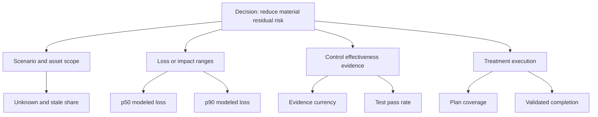

### Diagram E03 - Vulnerability outcome tree

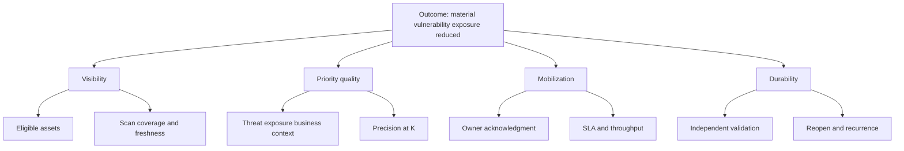

### Diagram E04 - Data product tree

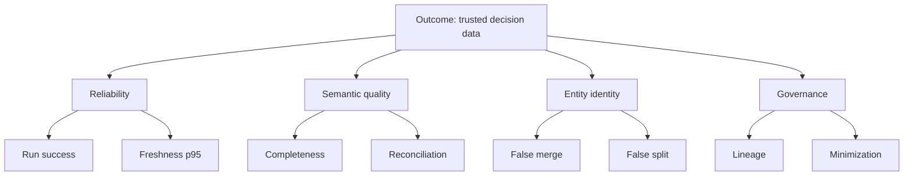

### Diagram E05 - SOC outcome tree

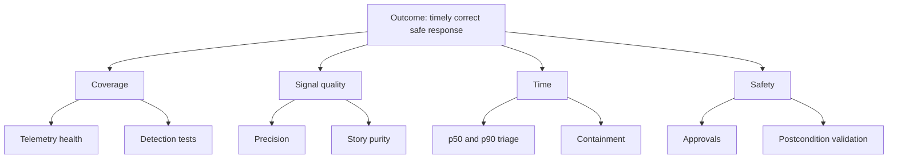

### Diagram E06 - Customer success tree

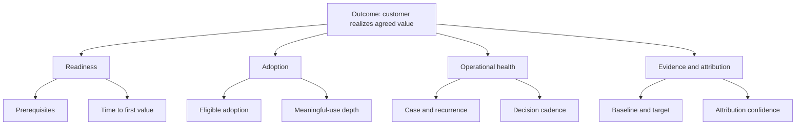

### Plain-English deep-dive 2 - A metric tree is a hypothesis, not plumbing

The top box is an outcome. Lower boxes are proposed drivers or evidence. An arrow means "we believe this helps explain or influence that," not "we proved causation." For example, faster triage can support better response, but reckless triage can miss incidents. Each driver therefore needs a quality or safety guardrail. Review the tree when customer conditions, scope, or evidence change.

## Thirty-two worked synthetic calculations

All calculations below are fictional NMH teaching examples. Values are deliberately simple. They are not product output, benchmark, forecast, or recommended target.

| Calc ID | Synthetic inputs | Calculation | Result | Interpretation and caveat |
|---|---|---|---|---|
| E-C01 | 84 active scenarios; 63 within tolerance | `63 / 84 x 100` | 75.0% within tolerance | Also report unassessed and above-tolerance counts |
| E-C02 | 19 above tolerance; 17 have approved plans | `17 / 19 x 100` | 89.5% plan coverage | Plan quality and validation remain unknown |
| E-C03 | 40 risk reviews ages; ordered middle values 44 and 48 days | `(44 + 48) / 2` | 46-day median | Median hides the oldest tail |
| E-C04 | Simplified frequency 0.2/year; loss/event range $1M-$4M | `0.2 x range` | $0.2M-$0.8M/year | Illustrative range, not prediction |
| E-C05 | Top five modeled exposures $6M; portfolio $15M | `6 / 15 x 100` | 40.0% concentration | Requires non-overlapping comparable scenarios |
| E-C06 | 2,400 eligible assets; 2,184 qualifying scans | `2184 / 2400 x 100` | 91.0% scan coverage | Show 216 unseen and eligibility rules |
| E-C07 | 2,184 scanned; 1,920 authenticated | `1920 / 2184 x 100` | 87.9% authenticated share | Authentication depth still needs validation |
| E-C08 | 8,200 prioritized findings; 2,400 assets | `8200 / 2400 x 100` | 341.7 findings/100 assets | Segment asset classes before comparison |
| E-C09 | Start backlog 8,200; arrivals 1,100; valid closures 1,450 | `8200 + 1100 - 1450` | 7,850 ending backlog | Reconcile scope and rule changes |
| E-C10 | 510 findings due; 438 validated on time | `438 / 510 x 100` | 85.9% SLA compliance | Preserve original due dates |
| E-C11 | 300 valid closures; 24 reopen in 30 days | `24 / 300 x 100` | 8.0% reopen rate | Confirm same condition, not new occurrence |
| E-C12 | 900 actionable findings; 810 linked to work | `810 / 900 x 100` | 90.0% ticket linkage | Empty tickets do not qualify as quality work |
| E-C13 | 12,500 candidates; 10,000 golden assets | `12500 - 10000` | 2,500 candidate-to-golden difference | Not automatically 2,500 duplicates |
| E-C14 | 10,000 active assets; 740 unknown owners | `740 / 10000 x 100` | 7.4% unknown-owner rate | Validate accountable owner, not placeholder |
| E-C15 | 8,800 EDR-eligible; 8,360 healthy and current | `8360 / 8800 x 100` | 95.0% EDR coverage | Report stale, exempt, and unknown separately |
| E-C16 | 120 selected exposures; 90 validly tested; 36 confirmed | `90/120`, then `36/90` | 75.0% validated; 40.0% confirmed | Selection bias controls both values |
| E-C17 | 50 material paths retested; 38 interrupted | `38 / 50 x 100` | 76.0% interruption rate | Topology drift and test equivalence matter |
| E-C18 | 64 approved CTEM exit criteria; 48 evidenced | `48 / 64 x 100` | 75.0% cycle completion | Evidence quality needs independent review |
| E-C19 | 720 scheduled connector runs; 684 succeed | `684 / 720 x 100` | 95.0% run success | Also report first-attempt success |
| E-C20 | 1,000,000 received records; 9,500 rejected | `9500 / 1000000 x 100` | 0.95% reject rate | Severity and source distribution matter |
| E-C21 | Source 99,000; canonical 97,020 same scope | `(97020-99000)/99000 x 100` | -2.0% variance | Equality alone would not prove row correctness |
| E-C22 | 240 critical fields; 216 have field lineage | `216 / 240 x 100` | 90.0% lineage coverage | Dataset-level lineage is insufficient |
| E-C23 | 18,000 alerts; 15,000 dispositioned; 3,000 true | `3000 / 15000 x 100` | 20.0% precision | Report 3,000 un-dispositioned separately |
| E-C24 | Triage durations ordered; middle values 18 and 20 minutes | `(18 + 20) / 2` | 19-minute median | Segment severity and shift |
| E-C25 | 800 due response milestones; 760 met | `760 / 800 x 100` | 95.0% response compliance | Due-time changes need audit history |
| E-C26 | 250 reviewed stories; 220 coherent | `220 / 250 x 100` | 88.0% story purity | Use blinded, stratified review |
| E-C27 | 600 AI eval tasks; 528 meet full rubric | `528 / 600 x 100` | 88.0% task completion | Safety failures should be shown separately |
| E-C28 | 2,400 reviewed claims; 2,280 supported | `2280 / 2400 x 100` | 95.0% grounded claims | Support must entail the claim |
| E-C29 | 160 injection tests; 148 preserve boundaries | `148 / 160 x 100` | 92.5% resistance | Twelve failures require severity review |
| E-C30 | 1,200 successful tasks; $360 allocated cost | `360 / 1200` | $0.30/successful task | Only comparable rubric-successful tasks count |
| E-C31 | 1,500 eligible users; 1,050 meaningful active users | `1050 / 1500 x 100` | 70.0% adoption | Use minimized aggregate data and persona cohorts |
| E-C32 | Baseline 1,000 hours; comparable observed 760 hours | `1000 - 760` | 240 synthetic hours avoided | Validate scope, workload, attribution, and range |

### Diagram E07 - Worked rate anatomy

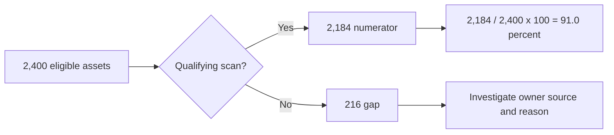

### Diagram E08 - Backlog bridge

## Percentiles, uncertainty, and attribution

| Topic | Correct practice | Executive translation | Common failure |
|---|---|---|---|
| Mean | Sum divided by N; show when additive average is meaningful | "Average was 42 minutes" | Outliers dominate |
| Median/p50 | Middle ordered value | "Half were at or below 19 minutes" | Hides tail |
| p90 | Value at/below which about 90% of observations fall under stated method | "Nine in ten completed within 4 hours" | Called worst case |
| p95/p99 | Tail service view with large enough N | "The slowest recurring tail is worsening" | Unstable small cohorts |
| Confidence interval | Range from a stated inferential procedure | "Sample suggests 2-5% error" | Treated as probability truth after observation |
| Measurement uncertainty | Range due to source, clock, identity, and model limitations | "Result is directionally useful, not exact" | Hidden behind decimals |
| Missingness | Unknown numerator/denominator membership shown explicitly | "7% of scope lacks evidence" | Unknown treated as compliant |
| Sampling | Define frame, method, strata, N, and nonresponse | "Audit estimates quality across source tiers" | Convenience sample presented as population |
| Attribution | State contribution evidence, alternatives, lags, and shared causes | "The program contributed; it was not the only cause" | Correlation sold as causation |
| Counterfactual | Explain what likely would have happened without action and uncertainty | "Compared with approved baseline scenario" | Fictional avoided loss called realized cash |

### Diagram E09 - Percentile workflow

### Plain-English deep-dive 3 - Percentiles describe a line, not a promise

If p90 triage time is four hours, about 90 percent of the measured comparable cohort fell at or below four hours under the chosen percentile method. It does not guarantee the next alert will finish in four hours, and it does not describe the slowest case. Open items may be censored, small samples jump sharply, and a changed case mix can move the percentile without process change.

### Diagram E10 - Attribution ladder

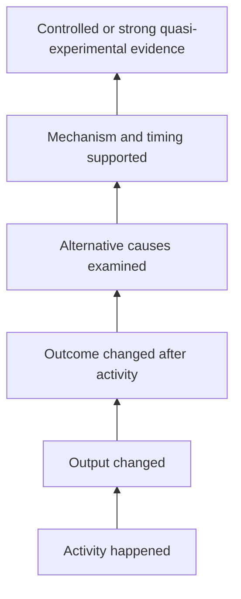

Use language that matches evidence: "coincided with," "likely contributed to," "supported by," or "caused" only when the design warrants it.

## Dashboard designs and executive translation

| Dashboard | Primary audience | Top row | Diagnostic row | Mandatory guardrail |
|---|---|---|---|---|
| Enterprise risk | Board/risk committee | Above appetite, p50/p90 range, concentration | Drivers, uncertainty, decisions | Model/scope version and unknown share |
| VM/UVM | CISO/VM owner | Material backlog, p90 age, SLA, validated closure | Coverage, owner, KEV/threat context | Arrival rate and scan coverage |
| CTEM/AEM | Security architecture | Critical paths, control gaps, interruption | Source/identity confidence, recurrence | Scope and validation selection |
| Data Fabric | Data/product operations | Freshness, availability, incident status | Connector, rejects, mappings, reconciliation | Consumer-ready watermark |
| SOC | SOC leadership | Material cases, p90 triage, containment, coverage | Rule/source/team cohorts | Miss testing and open-item age |
| AI agent | AI/security governance | Safety violations, task success, grounded claims | Tool, prompt, model, task class | Eval coverage and human oversight |
| Customer success | Customer/account team | Agreed outcomes, milestones, risks, decisions | Adoption, health evidence, blockers | Eligibility, evidence, attribution confidence |

### Diagram E11 - Layered dashboard navigation

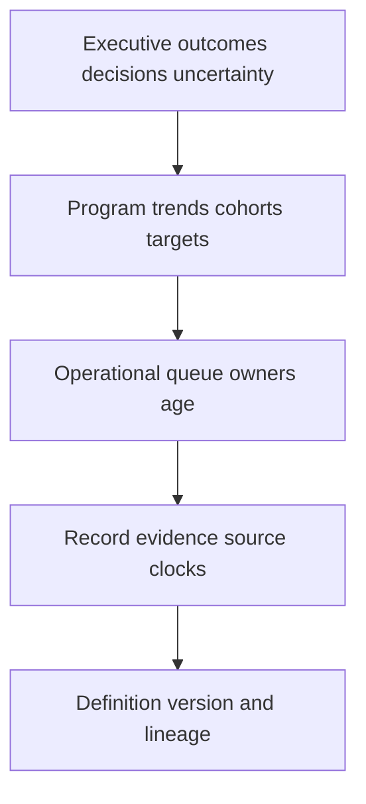

| Technical statement | Honest executive translation | Avoid |
|---|---|---|
| Scan coverage is 91% of 2,400 eligible assets | "We have current evidence for 2,184 eligible assets; 216 remain visibility gaps." | "We are 91% secure." |
| p90 triage rose from 3 to 4 hours | "The slower tail worsened; case mix and staffing are being tested as causes." | "SOC performance fell 33%." |
| 38 of 50 paths were interrupted | "Retesting no longer found 38 baseline paths; 12 remain and recurrence monitoring continues." | "Risk fell 76%." |
| AI grounded-claim rate is 95% | "In the governed test set, 5% of reviewed factual claims lacked adequate support." | "The agent is 95% truthful." |
| Adoption is 70% | "1,050 of 1,500 eligible users completed the agreed meaningful workflow in the window." | "Customer health is 70%." |
| 240 hours were avoided | "A comparable synthetic time study estimates 240 hours; scope and contribution assumptions are documented." | "We saved $X" without approved conversion |

### Diagram E12 - Executive sentence builder

### Plain-English deep-dive 4 - Targets are decisions about tradeoffs

A target is not a motivational decoration. It encodes risk tolerance, customer impact, capacity, cost, and measurement limits. Start with a stable baseline, segment by meaningful cohorts, model achievable change, and pair the target with a guardrail. For example, reducing alert volume without detection tests rewards silence. A safer target might combine lower duplicate volume, stable tested coverage, no increase in confirmed misses, and improved p90 triage.

## Target-setting worksheet

| Step | Fillable question | NMH synthetic example |
|---|---|---|
| Outcome | Which decision/outcome matters? | Reduce aging material vulnerability exposure |
| Metric | Which measure and version? | E-V021 p90 age under policy v1 |
| Baseline | Comparable value, N, period, scope? | Synthetic 74 days, N=8,200, 90-day baseline |
| Segments | Which cohorts differ? | Internet-exposed, critical service, endpoint, server |
| Capacity | What arrival/closure capacity constrains change? | 1,100 arrivals and 1,450 valid closures/month |
| Target | What evidence-based value and date? | Locally proposed; customer must approve |
| Guardrail | What prevents gaming? | E-V002 coverage, E-V018 valid closure, reopen rate |
| Uncertainty | What can invalidate comparison? | Scanner rollout, identity merge, policy revision |
| Review | Who can revise and when? | VM governance monthly |

### Diagram E13 - Target governance loop

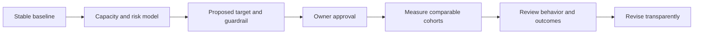

## Goodhart and anti-gaming review

| Metric pressure | Likely gaming behavior | Required guardrail |
|---|---|---|
| Lower finding count | Narrow scope, merge findings, suppress discovery | Eligible assets, scan coverage, rule version |
| Faster MTTR | Close easy cases, close without validation | Open-age distribution, validated closure, recurrence |
| Higher connector success | Disable unstable schedules, hide partial loads | Expected runs, accepted records, ready watermark |
| Lower alert volume | Disable detections or over-suppress | Technique coverage, test pass, confirmed misses |
| Higher automation | Automate low-value actions | Validated outcome, unintended effects, rollback |
| Higher adoption | Count logins or broaden telemetry | Meaningful-use definition, privacy, outcome evidence |
| Better health | Default unknown signals to green | Health evidence coverage and override log |
| More value | Claim gross savings or avoided loss | Baseline, attribution confidence, finance approval |

### Diagram E14 - Goodhart control pattern

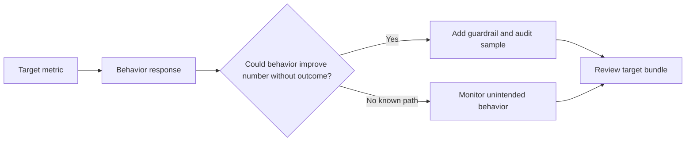

## Review cadences

| Cadence | Suitable measures | Decision | Avoid |
|---|---|---|---|
| Near-real-time | Source failure, safety violation, critical queue | Contain or route | Executive trend inference |
| Daily | Backlog, freshness, SLA breach, run health | Staff and recover | Changing strategic targets |
| Weekly | Cohort throughput, rule health, milestone blockers | Tune operations | Board conclusions from noise |
| Monthly | p50/p90 trends, control gaps, adoption, health | Reprioritize program | Ignoring scope bridges |
| Quarterly | Risk scenarios, outcomes, value evidence, roadmap | Executive decisions | Activity-only scorecards |
| Event-driven | Incident, model change, acquisition, new regulation | Rebaseline/reassess | Comparing across broken definitions |

### Diagram E15 - Metric version change bridge

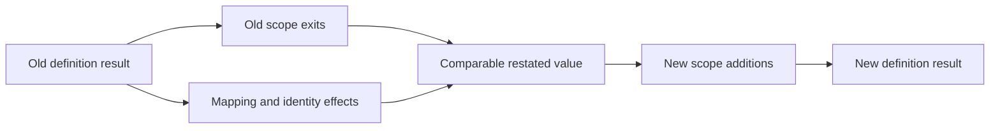

## Metric review and deprecation template

| Field | Fillable content |
|---|---|
| Metric ID/version |  |
| Decision owner |  |
| Current decision supported |  |
| Last definition review |  |
| Evidence of actionability |  |
| Known gaming or harm |  |
| Privacy classification |  |
| Overlap with other metrics |  |
| Proposed keep/change/deprecate |  |
| Comparison bridge needed |  |
| Approval and effective date |  |

### Diagram E16 - Metric retirement

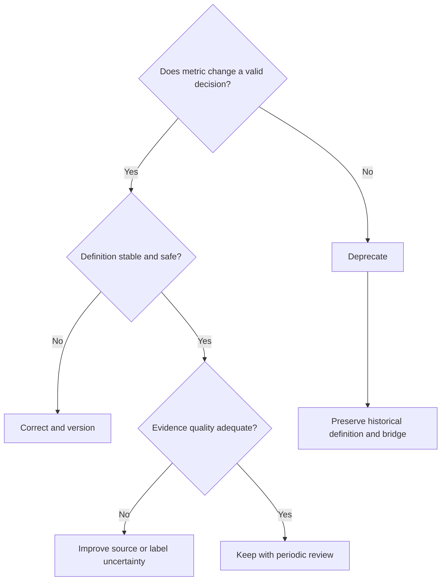

## Interview-ready explanations

| Question | Concise model answer |
|---|---|
| How do you define a useful security metric? | I start with the decision, then grain, eligible population, numerator, denominator, clocks, source, exclusions, uncertainty, owner, target method, and an anti-gaming guardrail. |
| Why are counts dangerous? | Counts change with scope and discovery. I pair them with coverage, rates, cohort age, and a bridge for source or definition changes. |
| Mean or percentile? | Means support additive planning but are outlier-sensitive. Median shows the typical case; p90/p95 shows the recurring slow tail. I publish N, cohort, open-item treatment, and method. |
| How would you measure vulnerability improvement? | I combine eligible scan coverage, contextual prioritized backlog, arrival and validated closure, p90 open age, SLA, owner acknowledgment, recurrence, and independent postcondition evidence. |
| How do you avoid fake ROI? | I document baseline, comparable workload, calculation, cost source, counterfactual, shared attribution, uncertainty, and finance/customer approval. I distinguish realized savings, capacity released, and avoided-loss scenarios. |
| How should AI-agent quality be measured? | Task correctness and completion must sit beside grounded claims, miss tests, policy adherence, unsafe proposals, authorization, postcondition validation, unintended effects, rollback, and evaluation coverage. |
| Are these Zscaler formulas? | No. They are source-neutral teaching templates. Current official documentation and tenant evidence govern product metrics; I never infer internal formulas or benchmarks. |

## Source and honesty boundaries

| Boundary | Supported use | Not established |
|---|---|---|
| General measurement | Reusable formulas, grains, warnings, dashboard design | Universal benchmark or mandatory target |
| Public Zscaler context | Vocabulary and product relationships in linked Parts, reviewed 2026-08-24 | Internal fields, formulas, weights, score ranges, SLAs, or outcomes |
| Synthetic NMH | Safe worked arithmetic and interview practice | Customer result, prediction, case study, or production evidence |
| Candidate use | Explain measurement design and transferable analytics | Claim Zscaler tenant administration or proprietary knowledge |
| Customer deployment | Ask precise validation questions | Replace contract, policy, licensed documentation, or source owners |

## Completion checklist

- [x] Exactly one H1 uses the master-linked Appendix E title.
- [x] The dictionary contains 254 uniquely keyed metric rows: 32 risk, 36 vulnerability/UVM, 34 exposure/AEM/CTEM, 38 data, 42 SOC, 34 AI-agent, and 38 TSM/customer-success entries.
- [x] Every metric row includes definition/formula, grain, numerator/denominator, units, source/clock, interpretation/audience, misuse warning, guardrail, target guidance, and a valid Part link.
- [x] Thirty-two labeled synthetic calculations are included.
- [x] Metric trees, dashboards, uncertainty, percentiles, attribution, target setting, Goodhart review, and executive translation are included.
- [x] Sixteen numbered Mermaid diagrams and more than fifteen tables are included.
- [x] Four Plain-English deep-dives explain denominators, metric trees, percentiles, and targets.
- [x] No metric is represented as a Zscaler internal formula, benchmark, field, entitlement, SLA, or guarantee.
- [x] Public/general/synthetic boundaries, privacy safeguards, and the exact 2026-08-24 source date are explicit.
- [x] Content is ASCII with balanced fences and navigation to the master, Appendix D, and Appendix F.

[Back to the master study guide](../Zscaler%20SecOps%20Technical%20Success%20Manager%20-%20Complete%20Study%20Guide.md) | [Previous appendix: Security Data Schemas, Entities, and Mapping Templates](Appendix-D-security-data-schemas.md) | [Next appendix: Zscaler Product and Portfolio Comparison Matrix](Appendix-F-zscaler-product-matrix.md)