# Appendix F - Zscaler Product and Portfolio Comparison Matrix

> **Purpose:** Provide a dated, bounded, public-information map of Zscaler platform, product, program, service, data, exposure, and SecOps concepts so a Technical Success Manager (TSM) can ask the right discovery and verification questions without turning a portfolio diagram into an entitlement or architecture claim.
>
> **Currency and source note:** Official public Zscaler pages listed near the end were reviewed on **2026-08-24**. Public names, navigation, portfolio groupings, capabilities, interfaces, integrations, fields, service descriptions, previews, availability, packages, editions, entitlements, and limits change. Current official technical and ordering documentation, licensed-tenant evidence, contract and statement of work, customer architecture, release notes, specialists, and Zscaler Support govern production.
>
> **Official/general/synthetic boundary:** Attributed high-level product statements are bounded to official public pages. General architecture, security, customer-success, and verification methods are vendor-neutral. Northstar Meridian Holdings (NMH), every architecture, question answer, plan, outcome, date beyond the source snapshot, and example is fictional and synthetic. No table asserts an internal schema, algorithm, field, factor, score, SLA, connector direction, product dependency, entitlement, roadmap, or guaranteed outcome.
>
> **Safety and privacy:** Discovery should collect the minimum architecture and operational detail needed for an approved purpose. Do not place secrets, tokens, raw sensitive content, regulated records, production attack instructions, or unnecessary employee-level telemetry in comparison worksheets. Validate authority before testing, changing policy, enabling response, or sharing evidence.

[Back to the master study guide](../Zscaler%20SecOps%20Technical%20Success%20Manager%20-%20Complete%20Study%20Guide.md) | [Previous appendix: Risk, Vulnerability, Exposure, and SecOps Metrics Dictionary](Appendix-E-risk-vulnerability-secops-metrics.md) | [Next appendix: Discovery, Assessment, and Success-Plan Templates](Appendix-G-discovery-success-plan-templates.md)

## Read this as a decision map, not a catalog

The Zero Trust Exchange is publicly positioned as Zscaler's cloud platform. Product and solution pages describe different jobs around access, experience, data, cloud/branch/device connectivity, exposure management, and security operations. A platform is not automatically one license. A product family is not automatically one deployable component. A program such as Continuous Threat Exposure Management (CTEM) is not reducible to one tool. A managed service is not the same thing as customer-operated software. A public integration logo does not prove direction, objects, permissions, version, region, entitlement, or fitness for a customer use case.

Use five statement classes:

| Statement class | What may be said | Required evidence |
|---|---|---|
| Official public positioning | "The reviewed public page positions X for Y." | URL, title, and 2026-08-24 review date |
| Current product fact | "This licensed tenant supports this behavior." | Current technical documentation and observed tenant evidence |
| Customer fact | "NMH uses this design and owns this dependency." | Customer-approved current-state evidence |
| General practice | "A sound rollout normally validates scope, identity, traffic, policy, logs, and rollback." | Industry/engineering reasoning, clearly not a product claim |
| Unknown | "Current evidence does not establish that." | Verification owner, source, and date |

### Diagram F01 - Claim ladder

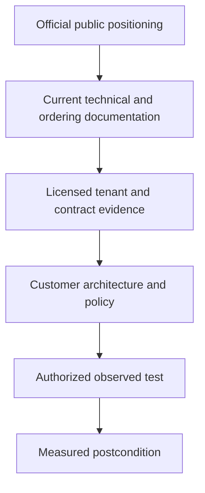

### Plain-English deep-dive 1 - Platform, product, program, and service

Think of a city. The platform is the shared road and utility environment. A product is a defined vehicle or service used for a job. A program is the city's repeatable way of choosing goals, coordinating people, measuring progress, and improving. A managed service adds people operating within a contracted scope. Seeing all four on one map does not prove they are bundled, enabled, or required together. The TSM's job is to make each noun testable.

## Matrix F01 - Portfolio master comparison

| Offering or concept | Kind | Primary job | Inputs/context | Control or decision point | Output | Primary personas | Dependencies and integrations | Complementary context | Limits and verification questions | TSM value |
|---|---|---|---|---|---|---|---|---|---|---|
| Zero Trust Exchange | Cloud platform/public architecture story | Broker policy-based, context-aware connections and connect users, devices, workloads, and business partners to authorized resources | Identity, device/workload context, destination/resource, policy, risk and telemetry as applicable | Policy decision and cloud enforcement/proxy path under current design | Allowed, blocked, inspected, isolated, or otherwise governed connection plus telemetry as supported | Security/network/identity architects, operations, app owners | Identity, traffic steering, endpoints/connectors, service edges, policy, logging; exact components vary | ZIA, ZPA, ZDX, data security, cloud/branch/device and SecOps stories | Verify traffic/resource scope, path, policy, inspection, tenant, region, availability, logs, and entitlement; do not infer one package | Give one architecture narrative while preserving product ownership and proof boundaries |
| Zscaler Internet Access (ZIA) | Product/solution | Secure internet and SaaS access through cloud-delivered security service edge capabilities | User/device identity and context, internet/SaaS traffic, forwarding, policy, threat/data context | Internet/SaaS access and inspection policy | Access decision, threat/data enforcement as configured, and logs | Network security, security operations, data security, endpoint, help desk | Forwarding, identity, Client Connector or other approved paths, TLS trust/inspection decisions, policy and logging | ZDX for experience context; data security; Agentic SecOps/SOC use cases using applicable telemetry | Verify forwarding method, traffic classes, policy order, bypass, certificate behavior, logs, edition, and current help; outcomes are not guaranteed | Align rollout, evidence, adoption, exceptions, operational health, and customer outcomes |
| Zscaler Private Access (ZPA) | Product/solution | Provide identity/context-based access to private applications rather than broad network access | Identity, device posture/context, application definitions, connectors/service edges, policy | User/device-to-application authorization and brokered connection | Authorized one-to-one application access and applicable telemetry | Zero trust/network/identity/app teams, help desk | IdP, endpoint/browser approach, app discovery/definitions, App Connectors/private edge choices, DNS and app reachability | ZDX experience; Client Connector; segmentation, third-party/BYOD and privileged access stories | Verify exact objects, protocols, browser/client compatibility, connector placement/health, DNS, policy, entitlement, and continuity design | Translate app journeys into staged migration and measurable user/business outcomes |
| Zscaler Digital Experience (ZDX) | Product/solution | Observe and analyze user digital experience across device, network/path, application, and service context | Endpoint probes/telemetry, paths, applications/services, user/device context under current deployment | Diagnostic and prioritization decision, not access authorization | Experience indicators, views, alerts/insights or troubleshooting evidence as currently supported | EUC, service desk, network/app/SaaS owners, TSM | Client/telemetry deployment, monitored app definitions, identity, network and service context | ZIA/ZPA journey context; ITSM and operational workflows where supported | Verify collection scope, scores, retention, privacy, supported apps, tenant behavior, licensing, and exact diagnostic claims | Reduce blame loops with evidence, define baselines, and connect experience to adoption |
| Unified Data Security | Portfolio/solution umbrella | Discover, classify, govern, and protect data across supported channels and stores | Data/content context, identity, app, channel, policy, classifiers, labels and posture signals as supported | Data access/use/movement and posture decision points vary by capability | Discoveries, classifications, policy actions, incidents/findings, posture context, workflow | Data security, privacy, compliance, SaaS/cloud and endpoint teams | Traffic/API/endpoint/cloud integrations, classifiers, policies, workflows; exact coverage varies | DLP, CASB, DSPM, SaaS security, AI/Copilot security, browser/endpoint controls | Verify channel, mode, object, classifier, action, latency, data handling, app support, region and entitlement | Build a channel-by-data-by-action coverage map and evidence-safe success plan |
| Data Loss Prevention (DLP) | Product/capability family | Detect and control sensitive-data movement or use under configured policy across supported channels | Content, metadata, identity, destination, classifier, policy and channel | Inline, endpoint, email, API, or other supported enforcement/inspection point | Classification match, incident, allow/block/coach/quarantine or other supported action | Data security, privacy, compliance, incident response | Channel integration, inspection feasibility, classifier tuning, exceptions and incident workflow | CASB, DSPM, browser, endpoint, ZIA, SaaS and AI data-protection context | Verify exact channels/actions/classifiers, encrypted content handling, accuracy, privacy and package; never promise perfect detection | Coordinate safe pilot, false-result taxonomy, business exceptions, validation and operator readiness |
| Multi-Mode CASB | Product/solution | Apply cloud application visibility and governance through supported inline and out-of-band modes | SaaS/app identity, traffic or API data, user/activity and policy context | Inline session or API-based cloud-app decision/workflow depending on mode | App visibility, activity/data findings, posture or policy actions as supported | SaaS security, data security, IAM, SecOps | App/API support, authorization scopes, traffic path, tenant/app configuration, policy and workflow | DLP, SaaS security, SSPM context, ZIA, DSPM | Verify app, mode, action timing, historical reach, API permissions, rate limits, tenant and entitlement | Separate real-time from asynchronous expectations and align owners to response paths |
| Data Security Posture Management (DSPM) | Product/solution | Discover/classify sensitive data at rest and relate it to access, exposure, and posture context in supported stores | Cloud/data-store inventories, metadata/content sampling as applicable, permissions, configuration and business context | Prioritization and remediation decision for at-rest data posture | Data inventory/classification, exposure/access/posture findings and context as supported | Cloud/data security, privacy, platform owners | Supported clouds/stores, permissions, scanning design, classification, identity and workflow integrations | DLP for movement; CASB/SaaS security; cloud security; Risk360/exposure context only where verified | Verify stores, scan method, permissions, data handling, freshness, actions, regions, entitlement and remediation ownership | Turn discoveries into owned, bounded remediation outcomes without claiming inline enforcement |
| Data Fabric for Security | Product/platform capability publicly positioned as data foundation | Aggregate, harmonize/map, deduplicate, correlate/enrich security data and support business logic, workflows and reports | Supported first/third-party sources, source contracts, identifiers, business context and rules | Data mapping, entity resolution, correlation, logic and workflow decisions | Unified context, entities/relationships, analyses, workflows and reports as supported | Security data/product teams, exposure/VM/SecOps leaders, TSM | Connectors/APIs/files as supported, credentials, source quality, canonical mapping, governance | Publicly positioned foundation for AEM/UVM; broader security operations context must be verified | Verify connector direction/objects/version, schemas, refresh, identity rules, limits, licensing and tenant behavior; no internal architecture inferred | Lead source discovery, contracts, reconciliation, adoption and evidence-based value mapping |
| Asset Exposure Management (AEM)/CAASM | Product/category | Unify multi-source asset context, improve cyber-asset visibility, reveal coverage gaps and support workflows | Asset observations from approved sources, identifiers, ownership, controls, business/service context | Entity resolution, lifecycle, coverage-gap and remediation decisions | Golden-record-style asset views, relationships, gaps, reporting/workflows as publicly positioned | Asset/CMDB, security architecture, vulnerability, endpoint/cloud and operations teams | Data sources, identity/matching governance, CMDB/ITSM and control telemetry where supported | Data Fabric; UVM; CTEM program; Risk360 context only where verified | Verify asset classes, sources, matching/correction, history, authority, workflow, entitlement and freshness; do not claim completeness | Reconcile definitions, ownership and source confidence before celebrating inventory counts |
| Unified Vulnerability Management (UVM) | Product/solution | Contextually prioritize vulnerability findings and mobilize remediation using correlated risk/business/control context | Vulnerability findings, assets, threat/exploitability, controls, identity/business context as supported | Multifactor/customized priority, grouping, owner/workflow and exception decisions | Prioritized views/backlogs, reports, workflow/ticket context as publicly positioned | VM, infrastructure, cloud/app owners, risk and executives | Data Fabric context, vulnerability/source integrations, asset identity, workflow/ITSM and governance | AEM, CTEM, Risk360 and SecOps learning loops where verified | Verify that it is not assumed to be a scanner; validate factors, fields, weights, direction, tickets, SLA, package and tenant behavior | Shift discussion from severity volume to explainable, owned, validated remediation |
| Continuous Threat Exposure Management (CTEM) | Ongoing program/industry-aligned practice with Zscaler public solution context | Continuously scope, discover, prioritize, validate and mobilize treatment of material exposures | Business scope, assets, vulnerabilities/misconfigurations, attack paths, threat/control evidence, owners | Program stage gates and risk-based treatment decisions | Validated exposure priorities, campaigns, control changes, decisions and learning | CISO, exposure/VM, security architecture, red/purple team, business owners | Cross-tool data, authorized validation, governance, work systems and outcome evidence | AEM, UVM, Risk360, Data Fabric and controls may contribute; exact dependencies are not assumed | Verify whether discussing a program, product capability, service, or combination; define scope/exit evidence and safe validation | Orchestrate people, data, decisions and success measures across a repeatable cycle |
| Zscaler Risk360 | Product/solution | Provide enterprise cyber-risk context, drivers/trends, guided mitigation, potential financial exposure, and executive/board reporting as publicly positioned | Zscaler and applicable external signals plus business/risk context as supported | Enterprise risk prioritization and mitigation/communication decision | Risk views/drivers/trends, mitigation context, financial-exposure modeling/reporting as supported | CISO, risk leaders, executives, board-facing teams | Current sources, factor/model governance, business context and reporting workflows; exact implementation unknown | Zero Trust Exchange, Data Fabric, AEM/UVM/CTEM context only where current evidence establishes it | Verify formula, factors, counts, weights, ranges, data sources, currency, uncertainty, package and tenant behavior; public page wording changed/conflicted | Preserve model honesty, translate drivers to decisions, and avoid presenting scores as objective truth |
| Agentic Security Operations / Agentic SecOps | Public portfolio/architecture story | Connect proactive exposure and reactive security operations using signals, context, security graph, AI agents, human oversight and controls as publicly positioned | First/third-party signals, entity/business context, detections/exposures, policy and human decisions as supported | Investigation, prioritization, recommendation, workflow and adaptive-control decisions under governed scope | Unified threat/exposure context, agent-supported work, actions/feedback as currently supported | SOC, detection, IR, exposure, threat hunting, CISO | Telemetry, identity/security graph/context, integrations, permissions, models, approvals, audit and response controls | Agentic SOC, exposure management, threat hunting, deception, MDR, Zero Trust controls | Emerging names and scope change; verify product/service boundaries, autonomy, actions, data, retention, evaluation, package and outcome | Define human-control gates, measurable quality/safety and an evidence-led adoption path |
| Agentic SOC | Named current public solution/product context | Support SOC investigation and response workflows with agentic methods under current public positioning | Alerts/signals, context, cases and governed tools as supported | Triage/investigation/recommendation/action decision | Case/threat context and workflow outputs as supported | Analysts, SOC leads, detection/IR teams | Data/integration/tool access, authorization, audit, human oversight | Broader Agentic SecOps, Zero Trust controls, hunting/MDR/deception as verified | Verify exact workflows, UI, agents, actions, models, package, GA/preview state and tenant evidence | Establish evals, approval gates, escalation and operational acceptance before outcome claims |
| Threat Hunting | Product/service offering publicly described as expert-led proactive hunting | Search for evidence of threats not adequately surfaced by existing alerts using available telemetry and hypotheses | Contracted telemetry scope, hypotheses, intelligence, user/network context and historical data | Hunt hypothesis, query, evidence review and escalation decision | Hunt report, evidence-backed finding, detection recommendation or documented negative result | Threat hunters, SOC/IR and detection engineering | Data access/retention, service scope, expertise, customer coordination and escalation paths | MDR, Agentic SecOps/SOC, ZIA telemetry context in public positioning | Verify service hours, sources, methods, deliverables, escalation, retention, region, contract and customer responsibilities | Prepare hypotheses, context, evidence handoffs and closure of resulting improvements |
| Managed Detection and Response (MDR) | Managed security service | Complement customer SOC with contracted detection, investigation, hunting and response assistance | Contracted telemetry/integrations, customer context, playbooks, contacts and authority | Provider/customer triage, escalation and response decisions within contract | Notifications, investigation/hunt findings, recommendations or actions as contracted | SOC leadership, IR, security operations executives | Statement of work, integrations, contacts, authority, data, service levels and customer runbooks | Threat hunting, Agentic SecOps/SOC, ZIA context under public positioning | Verify scope, coverage hours, SLA, hands-on authority, exclusions, data sources, retention, region and handoff | Operationalize RACI, evidence, exercises, escalation paths and service-value reviews |
| Deception | Product/solution | Deploy governed decoys, lures or breadcrumbs to surface suspicious interaction and add detection context | Approved deception surface, identity/network context, placement policy and telemetry | Design/placement and response decision after interaction | Deception signal/alert and investigation context as supported | SOC, threat hunting, identity/network security, incident response | Authorized placement, safety/change controls, telemetry and case integrations | Agentic SecOps/SOC, threat hunting, MDR and response workflows | Verify supported surfaces, deployment method, signal semantics, false activity, containment, safety and entitlement; no perfect-fidelity claim | Coordinate safe design, response playbooks, drills and evidence-based tuning |

### Diagram F02 - Portfolio job map

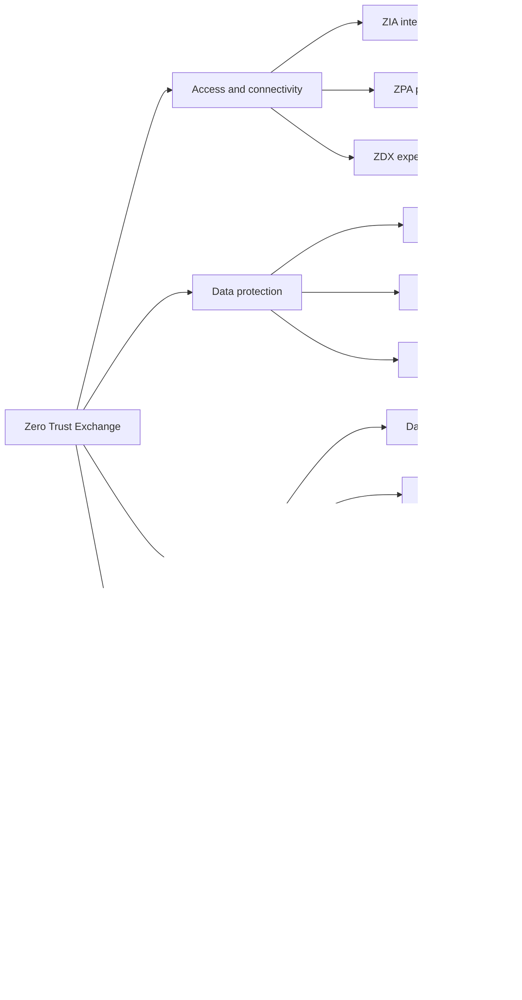

## Matrix F02 - Kind and boundary comparison

| Kind | Examples in this appendix | What it answers | What it does not prove | Verification artifact |
|---|---|---|---|---|
| Platform | Zero Trust Exchange; public Data Fabric foundation context | Shared architecture/value story | One license, one control plane, or every feature enabled | Current platform/ordering docs and tenant inventory |
| Product/solution | ZIA, ZPA, ZDX, AEM, UVM, Risk360, DLP, DSPM | Defined customer job and capability family | Exact edition, field, integration or behavior | Entitlement, current help and observed test |
| Portfolio umbrella | Unified Data Security; Agentic SecOps | Relationship among capabilities | Automatic bundling or common object model | Current navigation, ordering material and specialist confirmation |
| Program | CTEM | Repeatable operating cycle and outcomes | One tool can complete organizational work alone | Program charter, stage exits, RACI and measures |
| Managed service | MDR; threat hunting may include service context | Human expertise and contracted operations | Unlimited scope, authority or universal SLA | Contract/SOW, runbook and exercise evidence |
| Category | CAASM, CASB, DSPM, SSE, ZTNA | Market/architectural job vocabulary | Feature parity among products or competitors | Requirements-based evaluation, no ranking |

### Diagram F03 - Boundary decision

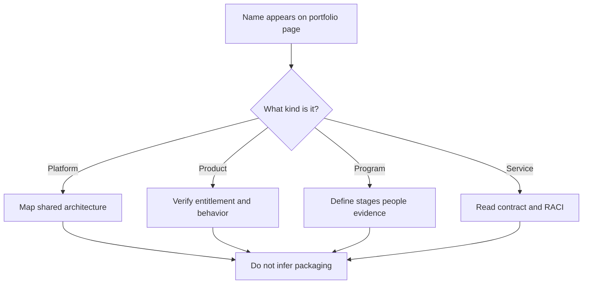

## Matrix F03 - Zero Trust Exchange decision chain

| Stage | General/public context | Customer evidence needed | Decision owner | Failure question | Complementary view |
|---|---|---|---|---|---|
| Identify requestor/entity | Identity, device, workload or partner context can inform policy | IdP flow, identity mapping, device/workload state, clock and failure logs | IAM and endpoint/workload owner | Is identity absent, stale, duplicated or mapped to wrong policy? | Client Connector, identity provider, device posture |
| Identify destination/resource | Internet/SaaS destination or private application/resource must be understood | DNS, URL/app definition, ports/protocols, tenancy and business owner | Network/app owner | Is the requested resource classified or defined correctly? | ZIA for internet/SaaS; ZPA for private apps |
| Evaluate context and policy | Policy can use applicable identity/context/risk signals | Current rule, order, scope, entitlement and test case | Security policy owner | Which exact rule and condition decided the request? | Data security and posture context where supported |
| Broker/enforce | Cloud service path applies configured access/security decision | Forwarding path, service edge, connector reachability, certificates, bypasses | Network/security operations | Did traffic reach the expected enforcement point? | ZDX and network evidence for experience |
| Observe and improve | Logs and outcomes support operations and improvement | Event time, source, fields, retention, export and postcondition | SOC/data/TSM | Can the decision be correlated to user impact and business outcome? | Logging, SIEM, Data Fabric or SecOps as verified |

### Diagram F04 - Zero trust request path

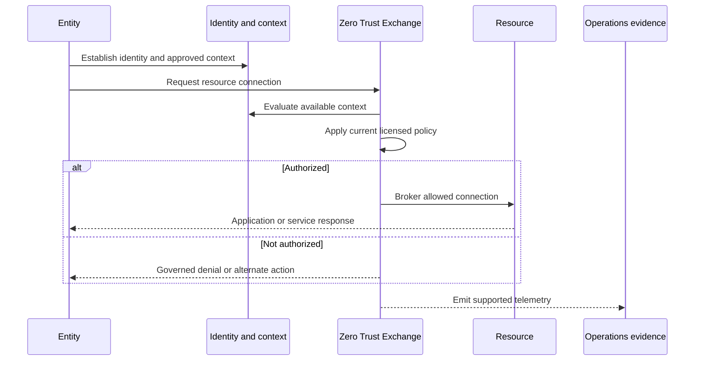

## Matrix F04 - ZIA versus ZPA versus ZDX

| Dimension | ZIA | ZPA | ZDX |
|---|---|---|---|
| Core question | Should and how may this entity access internet/SaaS under security policy? | Should this entity access this private application under policy? | Where and why is the user's digital experience degraded? |
| Resource side | Public internet and SaaS | Private applications/resources | Device, network/path, application and service observations |
| Main decision | Access/security/data policy enforcement | Application-level private-access authorization | Diagnosis, prioritization and experience operations |
| Typical inputs | Forwarded traffic, identity/device context, destination, security/data policy | Identity/posture, app definition, connectors/edges, private DNS/reachability, policy | Endpoint/probe telemetry, path and application/service context |
| Typical output | Governed connection/action and logs | Brokered authorized app connection and logs | Experience evidence, trends and diagnostic context |
| Does it replace another? | Do not infer it replaces all network/security controls | Do not infer every VPN/app/protocol migration is automatic | Does not itself prove or enforce access policy |
| TSM first question | Which traffic is in scope and how is it forwarded? | Which exact apps, users, protocols and connector paths are in scope? | Which user journey and baseline are decision-relevant? |

### Diagram F05 - Three customer journeys

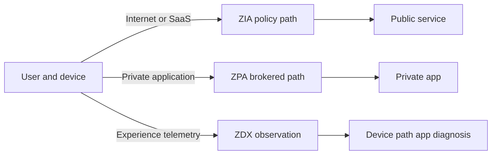

## Matrix F05 - ZIA discovery and operational comparison

| Question area | Inputs/context | Decision/control | Expected evidence/output | Common ambiguity | Verification question | TSM action |
|---|---|---|---|---|---|---|
| Traffic forwarding | User location, device, network, traffic class and selected forwarding method | Route traffic to expected service path | Path observation and applicable logs | Some traffic bypasses or takes another path | Which user/device/traffic/location combinations use which current method? | Build a forwarding matrix and test one bounded journey per cell |
| Identity | Authentication, groups, tenant, clock and user mapping | Apply user/group policy | Auth event and policy identity | Shared device, stale group or wrong tenant | Which identity did the policy engine evaluate at decision time? | Correlate IdP, endpoint and policy evidence |
| TLS inspection | Destination, certificate behavior, privacy category, enterprise trust and policy | Inspect, bypass, block or other supported action | Certificate chain and policy log | Pinning, mTLS, privacy/legal constraint | What current rule and documented exception governs this flow? | Establish approved exception and validation process |
| Threat protection | Content/traffic and configured engines/policy | Permit, block, sandbox or other current action | Verdict/action evidence | File type/mode/timing and marketing efficacy | Which licensed control evaluated which object, with what postcondition? | Define safe test and incident handoff |
| Data protection | Content, classifier, user/app/destination and channel | Apply supported DLP/data policy | Incident/action evidence | Channel and classifier scope differ | Is this inline ZIA path, another DLP channel, or out-of-band workflow? | Build channel-action ownership map |
| Operations | Service status, policy version, forwarding and log path | Detect and recover failures | Health, case and change evidence | Access success does not equal good experience | What was last good, first bad, scope and discriminating test? | Run evidence-led escalation and post-change validation |

### Diagram F06 - ZIA verification flow

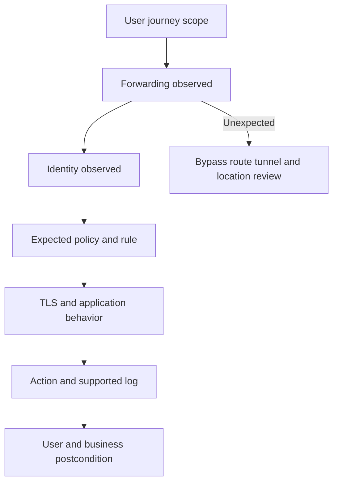

## Matrix F06 - ZPA discovery and operational comparison

| Question area | Inputs/context | Decision/control | Expected evidence/output | Common ambiguity | Verification question | TSM action |
|---|---|---|---|---|---|---|
| Application definition | Hostnames, addresses, ports, protocols, service owner and environment | Decide which private resource request maps to which app segment | Current app object and observed mapping | Wildcards, overlaps, dynamic services or unsupported behavior | Which request tuple mapped to which current app definition? | Inventory journeys and resolve overlaps before migration |
| Identity and posture | IdP result, groups, device context and posture | Authorize entity to app under rule | Policy decision evidence | Unknown/stale posture or group | Which exact context values and rule produced the decision? | Create positive, negative and exception tests |
| App Connector path | Connector placement, health, DNS and reachability to app | Select available path and establish outbound connectivity as designed | Connector and app reachability evidence | Connector healthy but app/DNS unhealthy | Can the selected connector resolve and reach the app protocol? | Separate control, connector, DNS, network and app ownership |
| Client/browser path | Client Connector, browser/agentless method and endpoint state as supported | Steer private-app request to brokered path | Endpoint/client and policy evidence | Browser/client/protocol compatibility | Which access form factor is licensed and supported for this journey? | Segment managed, unmanaged and partner cohorts |
| Segmentation | App groups, identity groups, policy and business need | Grant specific app rather than broad network reach | Authorized app set | Existing dependencies discovered late | Which dependent apps, DNS, identity and update services are needed? | Pilot by business service and dependency graph |
| Continuity | Edge/connector design, DNS, identity and customer recovery procedures | Failover or alternate process under current design | Tested recovery evidence | Public positioning mistaken for complete DR | What failure modes and recovery objectives have been authorized and tested? | Facilitate tabletop and bounded failover validation |

### Diagram F07 - ZPA dependency chain

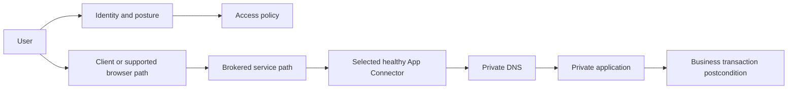

## Matrix F07 - ZDX diagnostic layers

| Layer | Context needed | Question answered | Output used for | Limitation | Customer verification |
|---|---|---|---|---|---|
| User/session | Persona, location, device, time and privacy-approved identifier | Who experienced which journey and when? | Scope/cohort comparison | Identity may be missing or sensitive | Which identifiers are collected, retained and visible to which roles? |
| Device | OS, resource state, client/probe state and local network | Is endpoint condition correlated with degradation? | Endpoint remediation or exclusion | Correlation is not causation | Which measurements and sampling are current for this device class? |
| Local network | Wi-Fi/LAN/DNS/gateway context as supported | Does degradation begin near the user? | Site or endpoint triage | Observation vantage and definitions vary | What exactly is measured and from where? |
| Path | Hops/latency/loss or route context as supported | Where does path behavior diverge from baseline? | Network/provider escalation | Hops can hide or deprioritize responses | Which path evidence is diagnostic versus conclusive? |
| Application/service | App transaction or service health context | Is the destination or transaction degraded? | App/SaaS owner escalation | Synthetic test is not every user transaction | What journey, frequency and success condition are configured? |
| Experience score | Current product-defined aggregation if available | How does product summarize experience? | Trend and prioritization | Formula, range and meaning may change | What is the current documented formula and component drill-down? |

### Diagram F08 - ZDX fault isolation

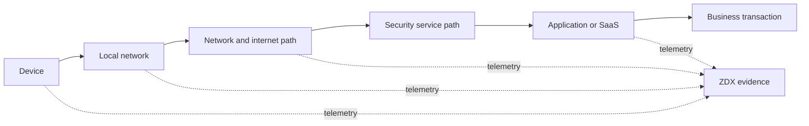

## Matrix F08 - DLP, CASB, and DSPM context

| Dimension | DLP | CASB | DSPM |
|---|---|---|---|
| Primary data state | Data in motion/use across supported channels, with channel-specific exceptions | Cloud-app use/data/activity in inline and/or out-of-band modes | Data at rest and its access/exposure/posture in supported stores |
| Main context | Content/classifier, user, destination, channel, policy | App/tenant, user/activity, content/metadata, API or session mode | Store/object, classification, permissions, configuration, owner/business context |
| Decision point | Inspect and apply supported policy action | Govern session/action or asynchronous API workflow | Prioritize and mobilize posture remediation |
| Time expectation | May be inline or asynchronous depending on channel | Inline can be session-time; API mode is generally asynchronous | Discovery/posture cycle, not assumed inline |
| Output | Match/incident/action and evidence | App visibility/findings/actions as supported | Inventory/classification/exposure/posture findings |
| Key dependency | Classifier quality, channel support, exception workflow | App/API support, authorization, traffic path and rate limits | Store support, permissions, safe discovery and ownership |
| Dangerous assumption | One policy covers every channel identically | API mode blocks every event in real time | It enforces live data movement |
| TSM value | Tune safely and validate business exceptions | Make mode/timing explicit and align app owners | Convert discovery to owned remediation with privacy controls |

### Diagram F09 - Data state and decision points

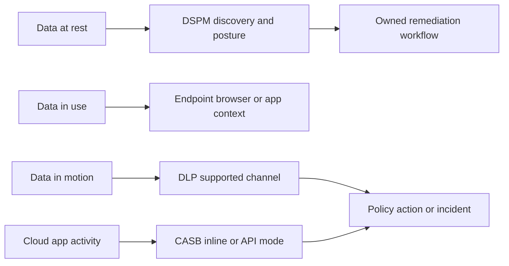

## Matrix F09 - Data-security channel worksheet

| Channel/use case | Inspection/discovery mode to verify | Context required | Candidate action to verify | Owner | Evidence and safety question |
|---|---|---|---|---|---|
| Web upload | Inline traffic path | User, destination, content/classifier, TLS and policy | Allow, block, coach or other supported action | Web/data security | Can content be lawfully inspected and does the app tolerate inspection? |
| SaaS stored content | API/out-of-band where supported | App tenant, API scope, object, owner, sharing, classifier | Alert, workflow or remediation as supported | SaaS/data owner | What historical scope, latency, permission and rollback apply? |
| Endpoint transfer | Endpoint channel where licensed/supported | Device, user, process/channel, file and policy | Monitor/block/coach or other supported action | Endpoint/data security | Which OS, app, channel and offline behavior are current? |
| Email | Supported email integration/mode | Sender, recipient, content, label/classifier and route | Policy action as supported | Messaging/data security | Which mail flow and encryption cases are covered? |
| Cloud data store | DSPM discovery/posture | Account/subscription, store/object, permissions and classification | Finding/workflow/remediation as supported | Cloud/data owner | What data is accessed, sampled, retained, and in which region? |
| Generative AI prompt/file | Supported inline/browser/endpoint/app control | User, app, prompt/file classification and business policy | Visibility or control as supported | AI governance/data security | Which app/action/form factor and privacy terms are current? |

### Diagram F10 - Data policy lifecycle

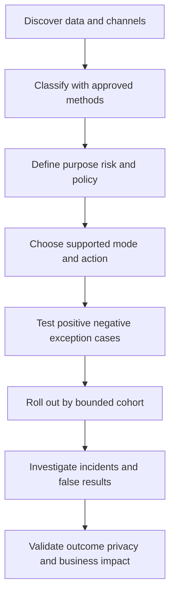

## Matrix F10 - Data Fabric capability chain

| Publicly positioned stage | Job | Input contract | Output/decision | Quality failure | Verification question | TSM outcome |
|---|---|---|---|---|---|---|
| Ingest/aggregate | Bring supported data into governed scope | Source, direction, object, auth, permission, pagination, frequency, volume, clock | Accepted source-faithful records and run evidence | Partial load, expired secret, quota, stale cursor | What exact connector behavior and completeness evidence exist now? | Approved source inventory and acceptance tests |
| Harmonize/map | Translate source semantics to shared model | Source schema/version, units, enums, nulls and grain | Mapped observations with raw preservation | False equivalence, defaulted unknowns, type/unit loss | Which mappings are customer-configurable and how are changes versioned? | Mapping workbook, test cases and steward ownership |
| Deduplicate/resolve | Relate source records to entities | Namespaced IDs, match attributes, time and source authority | Candidate links/golden context as supported | False merge, false split, identifier reuse | What correction, confidence, history and review mechanisms are supported? | Identity-quality baseline and reconciliation |
| Correlate/enrich | Add relationships and business/control/threat context | Time-correct entities, edges, scope and provenance | Context-rich graph/view or analytic input | Stale edge, fanout, unsupported causality | Which relationship is observed, asserted or inferred and at what time? | Decision-use-case graph with evidence confidence |
| Business logic | Apply grouping/scoring/rules as supported | Versioned factors, conditions, weights/logic and governance | Priority/group/decision input | Score theater, double counting, opaque override | Which parts are documented, configurable, explainable and auditable? | Governed logic dictionary and change test |
| Workflow/report | Route action and present decision views | Trigger, owner, approval, idempotency, ticket/report contract | Work item, notification, update, report or dashboard | Duplicate tickets, stale state, vanity dashboard | How are retries, reconciliation, closure and access controlled? | Adopted workflow with independent postcondition |

### Diagram F11 - Data Fabric bounded flow

```mermaid
flowchart LR
    SRC[Approved sources] --> ING[Ingest]
    ING --> MAP[Harmonize and map]
    MAP --> RES[Deduplicate and resolve]
    RES --> COR[Correlate and enrich]
    COR --> LOG[Governed business logic]
    LOG --> WF[Workflow and reporting]
    WF --> DEC[Human decision and action]
    DEC --> VAL[Independent validation]
    VAL --> QUAL[Source mapping and logic feedback]
```

## Matrix F11 - Data Fabric versus adjacent data systems

| System/category | Primary job | Typical grain emphasis | Strength in joint architecture | Boundary question | Do not say |
|---|---|---|---|---|---|
| Data Fabric for Security, public context | Unify security entities/context and operationalize supported logic/workflows/reports | Entities, relationships, findings and business context as supported | Context for exposure/security decisions | Which sources, models, workflows and products are current and licensed? | "It replaces every SIEM, lake, warehouse, CMDB or iPaaS." |
| SIEM | Collect/search/correlate security events and support detection/investigation | Events, alerts and cases | Event analytics and SOC workflows | Which events, retention, detections and case integrations remain authoritative? | "Data Fabric and SIEM are identical." |
| Data lake/warehouse | Store and analyze governed data for broad use cases | Raw/curated records, facts/dimensions | Historical, scalable analysis and reporting | Which transformations, latency, costs and consumers apply? | "A storage layer automatically resolves security meaning." |
| CMDB | Govern configuration items/services and lifecycle relationships for IT processes | Configuration items and service relationships | Operational authority/workflows | Which fields are authoritative and how are reconciled updates approved? | "Any discovered asset should overwrite the CMDB." |
| iPaaS/automation | Integrate systems and orchestrate data/process flows | Messages, API objects and workflow state | General integration and automation | Which connector, transformation, retry and ownership contract is needed? | "A connector catalog proves a use case works." |

### Diagram F12 - Complementary data architecture

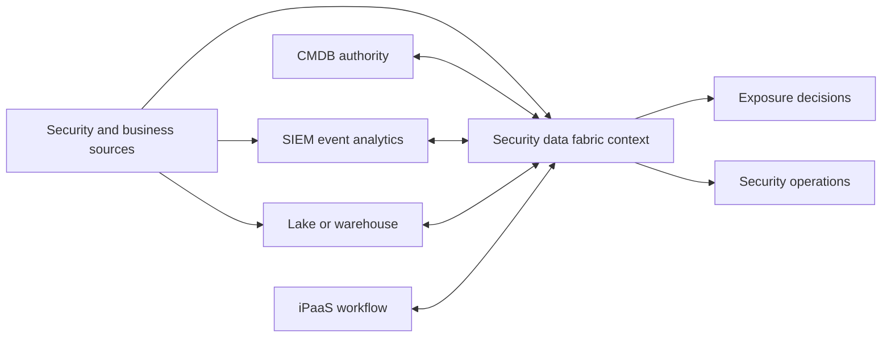

## Matrix F12 - AEM, UVM, Risk360, and CTEM

| Dimension | AEM/CAASM | UVM | Risk360 | CTEM |
|---|---|---|---|---|
| Kind | Product/category context | Product/solution | Product/solution | Continuous program with solution context |
| Core noun | Asset and control context | Vulnerability finding and remediation priority | Enterprise cyber-risk driver/scenario/context | Material exposure and repeatable cycle |
| Primary question | What assets exist, how are they related, and where are control/ownership gaps? | Which vulnerability work matters most and how is it mobilized? | Which enterprise risk drivers/trends merit executive action? | Which exposures should be scoped, discovered, prioritized, validated and mobilized now? |
| Key input | Multi-source asset observations, ownership, control and business context | Vulnerability, asset, threat, control, identity and business context | Supported Zscaler/external signals and business/risk context | Cross-domain exposure evidence, validation capability, owners and business scope |
| Decision point | Entity resolution, coverage and lifecycle/remediation | Priority, grouping, assignment, exception and validation | Risk priority, mitigation and communication | Stage exit, validation, campaign and treatment decision |
| Output | Asset context, golden records/gaps/workflows as supported | Prioritized backlog/reports/workflows as supported | Drivers/trends/mitigation/financial and executive views as supported | Validated priorities, campaigns, control changes and learning |
| Critical boundary | Inventory count is not complete truth | Not assumed to be a scanner or risk acceptance authority | Score/model is not objective fact | Not one dashboard or one product |

### Diagram F13 - Exposure operating system

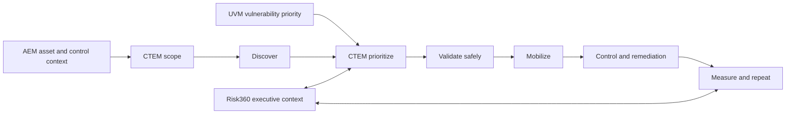

## Matrix F13 - Asset Exposure Management / CAASM verification

| Area | Customer question | Evidence required | Failure mode | Complementary owner | TSM value |
|---|---|---|---|---|---|
| Scope | Which asset classes, business units, clouds, sites and lifecycle states are in scope? | Approved source/scope inventory | "All assets" claim without denominator | CMDB, cloud, endpoint, network | Establish explicit eligible populations |
| Sources | Which systems observe each class and with what authority/freshness? | Source contract and reconciliation | Connector presence mistaken for completeness | Source owner and data steward | Sequence onboarding by decision value |
| Identity | How are source records matched, separated, corrected and time-bounded? | Current product docs/tenant behavior plus audit sample | False merge/split hidden by one count | Asset governance | Create quality metrics and review path |
| Ownership | What proves accountable owner and how are disputes handled? | CMDB/IAM/business mapping and acceptance | Placeholder queue treated as owner | Business/service owner | Turn gaps into accepted work |
| Controls | What makes a control present, healthy, enforcing, fresh, eligible or exempt? | Source semantics and policy | Installed equals protected | Control owner | Define denominator and postcondition |
| Workflow | How does a gap create, update, reconcile, close and validate work? | ITSM contract and run evidence | Duplicate/stale tickets | ITSM and remediation teams | Design idempotent ownership loop |
| Value | Which decisions improve because asset context is better? | Baseline, target method and outcome evidence | Inventory volume called risk reduction | Executive sponsor | Connect quality to business-service outcomes |

### Diagram F14 - Asset evidence reconciliation

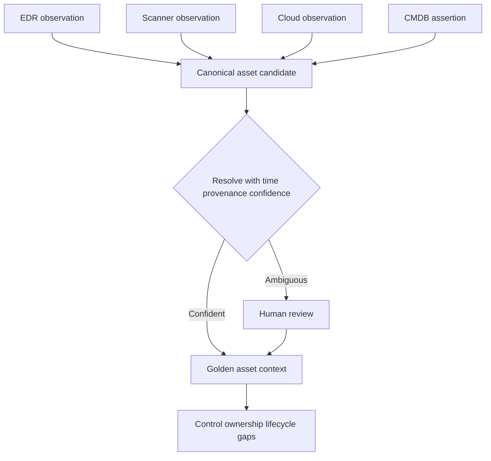

## Matrix F14 - UVM prioritization contract

| Context family | General role | Verification question | Misuse to prevent | Customer owner | Outcome evidence |
|---|---|---|---|---|---|
| Vulnerability characteristics | Describe weakness/severity and affected software | Which source/version and finding identity apply? | CVSS equals business risk | VM/scanner owner | Source reconciliation and valid finding |
| Threat/exploitability | Add current exploitation likelihood/evidence context | Which intelligence source, timestamp and mapping apply? | Probability treated as certainty | Threat intel | As-of snapshot and mapping coverage |
| Asset/exposure | Add reachability, location, asset class and path context | Is exposure observed, asserted or inferred? | Public IP equals exploitable | Asset/architecture | Validation evidence and confidence |
| Business | Add service criticality, owner and operational impact | Who approved mapping and effective time? | Every server labeled critical | Business/service owner | Accepted service map |
| Identity/behavior | Add privilege/use context where lawful and supported | Which minimized signal and purpose are approved? | Employee scoring/surveillance | IAM/privacy | Aggregated governed evidence |
| Controls | Add mitigating/preventive/detective control evidence | Is control healthy, enforcing, current and relevant? | Tool installed equals effective | Control owner | Test/postcondition evidence |
| Workflow | Convert priority to owner, due date, exception and validation | How are ticket states reconciled to finding states? | Ticket closed equals remediated | ITSM/remediation | Independent rescan or postcondition |

### Diagram F15 - UVM decision path

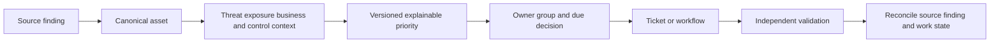

## Matrix F15 - CTEM stage gates

| Stage | Required job | Inputs | Exit evidence | Zscaler-context questions | TSM contribution |
|---|---|---|---|---|---|
| Scope | Choose business-aligned domain and decision boundary | Services, crown-jewel objectives, appetite, owners, timebox | Approved scope, exclusions, success and safety criteria | Which products/data sources contribute, and what remains outside them? | Facilitate bounded charter and stakeholder agreement |
| Discover | Gather evidence of relevant assets, weaknesses, misconfigurations, paths and controls | AEM/UVM/scanners/cloud/IAM/network and other approved evidence | Candidate inventory with provenance, unknowns and quality | Which current licensed sources and objects are available? | Reconcile sources and prevent count inflation |
| Prioritize | Rank exposure scenarios by material context and feasibility | Threat, business, path, control, owner and confidence | Explainable shortlist and decision record | Which product priority/risk context is documented versus customer logic? | Make assumptions and tradeoffs explicit |
| Validate | Safely test or corroborate selected exposure and controls | Authorized method, safety plan, rollback and evidence | Confirmed/refuted/unknown result with confidence | Which product/service supports validation, if any, and under what authority? | Enforce authorization and evidence discipline |
| Mobilize | Assign treatment, exception or acceptance and coordinate work | Owners, options, dependencies, change windows and due criteria | Accepted plan/work, escalation and validation postcondition | Which workflows/integrations are current and how are states reconciled? | Run governance, remove blockers and report outcomes |

### Diagram F16 - CTEM cycle

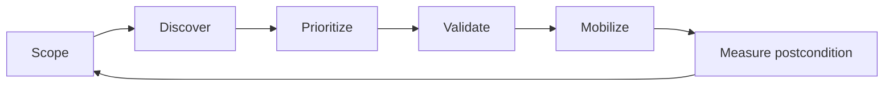

## Matrix F16 - Risk360 interpretation and verification

| Public positioning area | Bounded explanation | Must verify now | Executive use | Caveat |
|---|---|---|---|---|
| Enterprise risk context | Public page describes enterprise cyber-risk visibility using signals/context | Current sources, scope, update timing and tenant prerequisites | Focus discussion on major risk drivers | Visibility is bounded by evidence and model |
| Four attack stages | Public material organizes risk context across external attack surface, compromise, lateral propagation and data-loss context | Current labels, definitions and how tenant data maps | Explain risk journey at a high level | A framework is not proof of an actual attack path |
| Risk factors/drivers | Public page describes drivers/factors; wording/counts on the live page were not treated as stable | Current official model documentation, count, meaning, weight and version | Drill from summary to contributing evidence | Never invent formula or repeat volatile counts as permanent fact |
| Trends | Public material describes risk trends and comparison over time | Scope/model version and restatement behavior | Discuss direction and interventions | Model/source changes can mimic improvement |
| Guided mitigation | Public material describes mitigation guidance | Exact recommendation logic, action ownership and applicability | Compare treatment options | Recommendation is not authorization or guaranteed outcome |
| Potential financial exposure | Public material describes financial-exposure context | Model, ranges, assumptions, uncertainty, currency and governance | Scenario planning with finance/risk | Not an audited forecast or promised avoided loss |
| Board reporting | Public material describes executive/board communication | Current report, fields, access, narrative and evidence drill-down | Translate technical drivers to decisions | A score without assumptions creates false precision |

### Diagram F17 - Risk360 claim-safe path

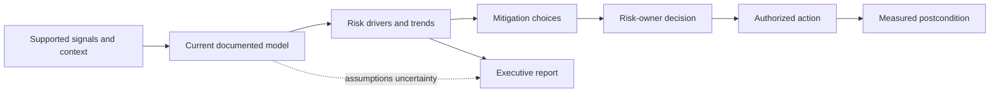

## Matrix F17 - Agentic SecOps, Agentic SOC, hunting, MDR, and deception

| Dimension | Agentic SecOps | Agentic SOC | Threat hunting | MDR | Deception |
|---|---|---|---|---|---|
| Kind | Portfolio/architecture story | Named solution/product context | Product/service context | Managed service | Product/solution |
| Main job | Connect proactive and reactive security work with context, agents and controls | Support SOC workflows with agentic methods | Proactively search hypotheses in available telemetry | Provide contracted managed detection/investigation/hunting/response help | Create governed deceptive signals and context |
| Human role | Define policy, supervise, approve, investigate and own risk | Analyst oversight and case decisions | Expert hypothesis, query and evidence review | Shared provider/customer RACI | Design placement and investigate interactions |
| Key dependency | Signals, graph/context, tools, authorization, audit, evaluations | Cases/data/tools, current workflow and licensed behavior | Data scope/retention, expertise and service scope | Contract, telemetry, contacts, authority and runbooks | Safe placement, telemetry, response integration and change control |
| Output | Unified context, recommendations/actions/feedback as supported | Case/threat workflow output as supported | Finding, detection idea or confidence-reducing negative result | Contracted notification/findings/recommendation/action | Signal/alert and investigation context |
| Safety boundary | Agent output is not authority | Autonomy/action scope must be verified | Hunting must be authorized and privacy-aware | Provider authority is contractual | Deception must not disrupt production or mislead authorized users |
| Success evidence | Correctness, grounding, response outcome, safety and learning | Case quality/time plus safety | Useful learning and detection/control improvement | SLA/RACI plus validated customer outcome | Signal usefulness and safe response, not alert volume |

### Diagram F18 - Proactive-reactive feedback

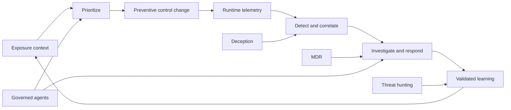

## Matrix F18 - Agent/tool/action control levels

| Level | Agent role | Human control | Suitable evidence before use | Failure containment | Verification question |
|---|---|---|---|---|---|
| L0 Inform | Summarize or retrieve authorized evidence | Human interprets and acts | Grounding, access control, citation and privacy tests | No production write access | Which sources and claims are authorized and auditable? |
| L1 Recommend | Propose priority, query, or action | Human reviews every recommendation | Correctness, miss, calibration and rationale evaluation | Reject proposal without side effect | What rubric and confidence justify recommendation? |
| L2 Prepare | Draft case/ticket/change or stage tool parameters | Human validates before commit | Schema/semantic argument tests and preview | No commit without approval | Can reviewer see exact target, scope and effect? |
| L3 Execute bounded | Perform allowlisted reversible action after approval or within strict policy | Explicit approval or tightly governed policy | Authorization, postcondition, rollback, monitoring and adversarial tests | Kill switch, rollback and incident runbook | Which action, target, limit, approval and audit record apply? |
| L4 Higher autonomy | Multi-step action under defined policy, if current product supports and governance approves | Ongoing oversight and exception handling | Strong evaluation, monitoring, segregation, fail-safe design and legal/risk approval | Independent control plane and rapid containment | Is this current licensed capability, and is the organization actually ready? |

### Diagram F19 - Agent action gate

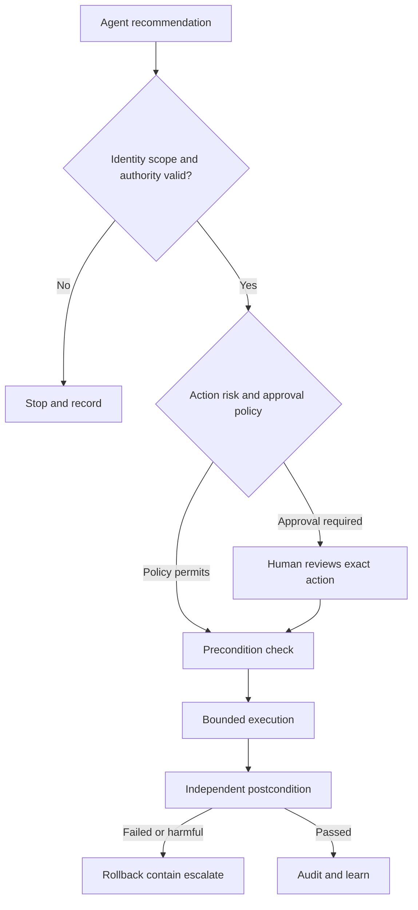

## Matrix F19 - Integration evidence matrix

| Integration claim | Weak evidence | Sufficient discovery evidence | Production proof | Owner | TSM warning |
|---|---|---|---|---|---|
| "Connector exists" | Logo or catalog name | Current official listing plus object/direction/version questions | Licensed config, successful acceptance test and reconciliation | Source/product owner | Catalog presence is only a lead |
| "Data flows" | Green status | Run IDs, watermarks, received/accepted counts and errors | Reconciled representative records under scope | Data operations | Success status can hide partial load |
| "Identity matches" | Similar display name | Namespaced keys, matching method and conflict rules | Audited links and correction workflow | IAM/data steward | Never join users on display name alone |
| "Tickets sync" | Ticket created | Trigger, fields, idempotency, state map, retry and authority | Bidirectional or defined-direction reconciliation and closure test | ITSM owner | Created is not reconciled or remediated |
| "Control can act" | API credential configured | Allowed actions, targets, approval, limits and rollback | Authorized bounded test with postcondition | Control owner | Write access is not permission to use it |
| "Dashboard is current" | Recent timestamp on one tile | Source watermark, semantic refresh and cache rules | End-to-end known-record test | Analytics owner | Latest timestamp may not mean complete |
| "Service covers us" | Marketing page | Contract/SOW, sources, hours, SLA, contacts and exclusions | Tabletop/exercise and real handoff evidence | Service owner | Public service story does not define contract |

### Diagram F20 - Integration proof ladder

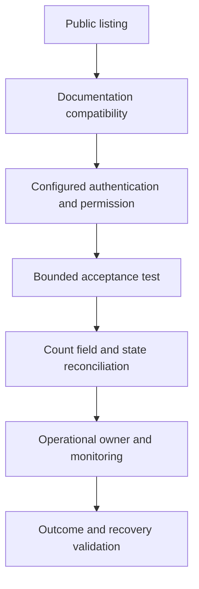

## Matrix F20 - Persona and decision-right comparison

| Persona | Primary portfolio concerns | Decisions owned | Evidence needed | TSM conversation | Privacy/safety guardrail |
|---|---|---|---|---|---|
| CISO/security executive | Material risk, resilience, operating capacity and accountability | Priority, appetite escalation, investment and acceptance sponsorship | Trends, uncertainty, scenarios, outcomes and decisions | Translate capabilities into bounded risk/outcome roadmap | Avoid false precision and guaranteed risk reduction |
| Network/security architect | Traffic/resource paths, trust boundaries, controls, dependencies and continuity | Approved architecture and design exceptions | Diagrams, tests, policy and failure modes | Compare ZIA/ZPA/ZDX and control points by journey | No production test without change authority |
| SOC leader | Telemetry, detection quality, cases, response, automation and services | Operating model, response authority and quality targets | Coverage, p90 time, misses, safety, RACI | Map Agentic SOC, hunting, MDR and deception into current process | Human oversight and least privilege |
| Exposure/VM leader | Asset truth, priorities, remediation, validation and CTEM | Scope, priority policy, SLA/exception and campaigns | Source quality, backlog, paths, outcomes | Separate AEM, UVM, Risk360 and CTEM jobs | No unauthorized exploit validation |
| Data security/privacy | Sensitive-data discovery/control, purpose and handling | Classification, policy, exception and response | Channel matrix, data flow, incidents and privacy review | Separate DLP/CASB/DSPM modes and owners | Minimize content and employee telemetry |
| IAM/endpoint | Identity, posture, device state and user impact | Identity/device policies and lifecycle | Auth/posture logs, group mappings and cohorts | Clarify context dependencies for access and operations | Do not expose personal attributes broadly |
| App/business owner | Availability, transaction, dependencies, change and value | App acceptance, maintenance and risk treatment | Journey test, business KPI, rollback and owner map | Anchor products to business services | Protect production and regulated data |
| TSM/account team | Adoption, health, risk, value, escalation and roadmap | Facilitation, evidence quality and cross-team plan; not customer risk acceptance | Success plan, RAID, measures and decisions | Keep product truth, customer truth and hypothesis separate | Do not overclaim experience, access or outcome |

### Diagram F21 - Decision-right routing

```mermaid
flowchart TD
    Q[Customer question] --> K{Question kind}
    K -->|Product behavior| P[Product owner docs tenant specialist]
    K -->|Architecture| A[Customer architect and change authority]
    K -->|Risk acceptance| R[Accountable risk owner]
    K -->|Data privacy| D[Privacy legal data owner]
    K -->|Incident action| I[Incident commander and control owner]
    K -->|Contract service| C[Contract and service owner]
    P --> T[TSM coordinates evidence and decision]
    A --> T
    R --> T
    D --> T
    I --> T
    C --> T
```

## Matrix F21 - Customer use-case selection

| Customer need | Candidate portfolio context | Start with | Do not jump to | Exit evidence for first phase | Next complementary question |
|---|---|---|---|---|---|
| Secure internet/SaaS access | ZIA, Client Connector/forwarding, data/threat controls | One user-site-app journey and policy objective | "Replace everything" migration | Positive/negative tests, experience baseline, logs, rollback | Does ZDX evidence or data policy improve operations? |
| Replace broad private-network access | ZPA, Client Connector/browser, connectors/edges | One business app cohort and dependency map | Whole VPN shutdown | Authorized app access, denied non-entitled case, performance and continuity test | Which applications and third parties form next wave? |
| Reduce SaaS troubleshooting time | ZDX with current access paths | High-volume user journey, baseline and owner RACI | Score-only dashboard | Reproducible layer isolation and accepted escalation path | Can health/adoption reviews use trend evidence? |
| Protect sensitive data | Data security, DLP/CASB/DSPM by channel/state | Data class, channel, business action and privacy review | One universal policy | Valid classifier cases, exception, incident route and business acceptance | Which at-rest, in-motion and SaaS gaps remain? |
| Reconcile asset inventory | Data Fabric/AEM context | Two or three authoritative sources and one asset class | Enterprise "single truth" claim | Reconciled count, false merge/split sample, owner gaps | Which control or CTEM decision benefits first? |
| Prioritize vulnerability work | UVM context | One scanner/source, asset cohort and priority policy | Import all data before defining decision | Explainable shortlist, accepted owner workflow and validation | Which CTEM validation/campaign follows? |
| Establish CTEM | CTEM program with AEM/UVM/Risk360/data/control context as verified | One critical business service and cycle charter | Tool-only deployment | Stage exits, validated exposures, accepted work and repeat schedule | Which learning feeds prevention and SOC? |
| Improve enterprise risk narrative | Risk360 context and customer risk governance | One scenario/driver decision and model review | Single score as truth | Assumptions, uncertainty, mitigation owner and board-ready decision | Which technical evidence improves confidence? |
| Improve SOC quality/capacity | Agentic SecOps/SOC, hunting, MDR, deception as applicable | One bounded workflow and baseline quality/safety | Autonomous response by default | Eval results, RACI, approval/rollback and validated outcome | Which exposure/control feedback loop closes? |

### Diagram F22 - Use-case selection loop

```mermaid
flowchart LR
    NEED[Business and security need] --> JOB[Choose job not product count]
    JOB --> EVID[Inventory current evidence and dependencies]
    EVID --> CAND[Candidate product program or service]
    CAND --> VERIFY[Verify current scope entitlement behavior]
    VERIFY --> PILOT[Bounded pilot with exit evidence]
    PILOT --> VALUE[Validate outcome and operating ownership]
    VALUE --> ROAD[Sequence complementary roadmap]
```

## Matrix F22 - TSM lifecycle value by portfolio area

| Lifecycle | Access/experience | Data security | Data Fabric/exposure/risk | Agentic SecOps/services | Core TSM artifact |
|---|---|---|---|---|---|
| Discover | User/app/traffic journeys, identity, forwarding/connectors and experience | Data classes, stores/channels, modes, owners and privacy | Sources, entities, business services, findings, risk decisions and maturity | SOC workflows, telemetry, tools, authority, service contracts and safety | Discovery pack and current-state architecture |
| Assess | Dependency gaps, policy readiness, rollout and support model | Coverage by data-state/channel/action and classifier quality | Source quality, identity, priority, CTEM/risk governance | Coverage, case quality/time, evaluations, RACI and failure modes | Maturity baseline and RAID register |
| Plan | Cohorts, milestones, tests, rollback, operational acceptance | Policy pilots, exceptions, incident workflow and measurement | Connector waves, mappings, campaigns, model review and decisions | Bounded workflow pilots, approval/rollback, service exercises | Technical success plan and exit evidence |
| Adopt | Enable operators/users, monitor health and remove blockers | Tune false results and business workflows | Train stewards/remediation/risk users and reconcile work | Train analysts, validate agent/service handoffs and controls | Adoption plan, workshops and action log |
| Operate | Health, change, escalation and experience trend | Incident response, policy/change and privacy review | Connector/data quality, backlog, CTEM cycles and risk reviews | Detection/agent quality, service performance, incidents and learning | Governance dashboard and escalation package |
| Realize value | Access/security and user-experience outcome with guardrails | Reduced governed exposure or improved response, not alert count alone | Better decisions, validated treatment and evidence confidence | Safer/faster/correct work and closed preventive feedback | Executive readout with attribution caveats |
| Expand | Next app/site/persona or complementary experience use case | Next channel/store/data class | Next source/service/campaign/scenario | Next workflow/use case after safety evidence | Evidence-led roadmap, never entitlement assumption |

## Product-specific customer question bank

| Area | Discovery questions that expose real architecture and value |
|---|---|
| Zero Trust Exchange | Which entities and resources are in scope? Which policy and enforcement point governs each journey? Which claim is public positioning versus observed tenant behavior? What telemetry proves the decision and user postcondition? |
| ZIA | Which traffic is forwarded, by which method and cohort? Which identity and rule apply? Which TLS/privacy exceptions exist? Which threat/data controls are licensed and tested? How are logs and service-impact escalations handled? |
| ZPA | Which private apps, dependencies, protocols and user cohorts exist? How are apps defined? Which connector and DNS path reaches them? What client/browser form factor applies? How is continuity tested? |
| ZDX | Which user journey and baseline matter? What is collected at device, network/path and app layers? What does the current score mean? How are privacy, retention, alerts and operational ownership governed? |
| DLP/data security | Which data class, state, channel, application and business action matter? Is control inline or asynchronous? Which classifier and exception cases are approved? What content is processed and retained? |
| CASB | Which app/tenant, inline or API mode, permissions, objects, timing and actions are supported now? Who owns SaaS remediation and rollback? How are rate limits and API changes monitored? |
| DSPM | Which stores/accounts/regions and data types are supported? What permissions and discovery method apply? How is sensitive content handled? Who owns access, configuration and data-lifecycle remediation? |
| Data Fabric | Which source/object/direction/version and authentication apply? What are grain, keys, clocks and mappings? How are false merges/splits corrected? How are workflows reconciled? Which product/use case consumes the output? |
| AEM | What is the eligible asset population? Which sources are authoritative by field and time? What proves identity, lifecycle, owner, criticality and control health? How is CMDB change approved and audited? |
| UVM | Which vulnerability sources and asset identities are in scope? Which context changes priority? Which factors are documented/current? How do owner, SLA, ticket, exception and validation states reconcile? |
| CTEM | What business scope and cycle cadence apply? What counts as candidate versus validated exposure? Who authorizes validation? What evidence exits each stage? How is mobilized work measured and repeated? |
| Risk360 | Which current data and model support the risk view? What are factors, ranges and uncertainty? Which mitigation decision should change? How are source/model changes bridged? Which financial statements are scenario estimates? |
| Agentic SecOps/SOC | Which workflow, model/agent, data, tools and actions are current? What is human versus automated? What approval, least privilege, evaluation, audit, rollback and incident process exists? |
| Threat hunting | Which hypotheses, telemetry, history, methods, hours and deliverables are contracted? How are findings escalated and detections improved? What does a negative hunt mean? |
| MDR | Which sources, service hours, SLA, contacts, authority, actions and exclusions are in the SOW? What remains customer-owned? Has the handoff been exercised? |
| Deception | Which surfaces and placement methods are supported and safe? What constitutes interaction? How is signal routed and investigated? What change, privacy and rollback approvals apply? |

## Fictional NMH portfolio decision walkthrough

Northstar Meridian Holdings (NMH) is fictional and synthetic. NMH leadership asks three questions: employees report slow access to a hosted clinical scheduling service; the security team cannot reconcile endpoint and cloud assets; and the SOC wants to evaluate AI-assisted triage. None of the following is a Zscaler tenant design or result.

| Need | First hypothesis | Candidate context | Evidence gate | Synthetic decision | Explicit non-claim |
|---|---|---|---|---|---|
| Slow hosted scheduling access | Delay could begin at device, local network, security path, internet or application | ZDX may add experience evidence; ZIA context matters only if traffic traverses that path | Verify current entitlement, collection, privacy, monitored journey and baseline | NMH proposes a 30-user diagnostic pilot | No claim that ZDX finds or fixes the cause |
| Conflicting endpoint/cloud inventory | Source semantics and identity rules differ | Data Fabric/AEM public context may fit asset reconciliation | Verify connectors, objects, direction, refresh, matching/correction and CMDB workflow | NMH starts with Windows endpoints and two source systems | No claim of completeness or automated golden truth |
| AI-assisted triage | Analysts need grounded summaries and recommended next checks | Agentic SOC/Agentic SecOps may be relevant under current licensed scope | Verify workflow, data, tools, model, actions, human gates and eval capability | NMH evaluates inform/recommend mode on synthetic cases | No claim of autonomous action or improved MTTR |

The TSM does not respond with three product demos. The TSM builds three outcome and evidence contracts, identifies common identity/data/operations dependencies, verifies current product facts, and sequences the least risky experiment.

## Verification record template

| Field | Fillable value |
|---|---|
| Claim ID and wording |  |
| Kind: public/current product/customer/general/unknown |  |
| Official URL and review date |  |
| Current technical/ordering document and version |  |
| Tenant, package, region and environment |  |
| Customer use case and scope |  |
| Inputs, objects, direction and clocks |  |
| Decision/control point |  |
| Output/action and authority |  |
| Dependencies and owners |  |
| Bounded test and expected postcondition |  |
| Observed result and evidence reference |  |
| Limitations, privacy and safety |  |
| Reviewer and next verification date |  |

## Common portfolio reasoning failures

| Failure | Why it fails | Repair |
|---|---|---|
| Treat platform diagram as package diagram | Public architecture does not establish commercial entitlement | Verify ordering/contract and tenant inventory |
| Treat adjacent products as mandatory dependencies | Portfolio proximity is not technical necessity | Ask which current data/control path is documented and observed |
| Compare names instead of jobs | Overlapping marketing nouns hide distinct decision points | Start with customer job, input, decision, output and owner |
| Treat integration logo as operational integration | Direction, object, version, permission and workflow are unknown | Build integration evidence matrix and acceptance test |
| Treat score as objective truth | Formula, scope, confidence and model changes matter | Drill to drivers/evidence and disclose uncertainty |
| Treat AI recommendation as authorization | Correctness and authority are separate | Add identity, least privilege, approval, rollback and postcondition gates |
| Treat managed service as software feature | People, hours, RACI and actions are contractual | Read SOW and exercise handoffs |
| Claim risk reduction from activity | Deployment, findings and tickets are not validated outcomes | Define independent postcondition and attribution boundary |
| Use competitor ranking without requirements | Ranking is ungrounded and quickly stale | Compare customer requirements and verified evidence, not vendors |

### Plain-English deep-dive 2 - Complementary does not mean dependent

Two offerings can be useful together without one technically requiring the other. ZDX evidence may help operations understand an experience issue on a journey that also uses ZIA or ZPA, but the exact relationship depends on current deployment and entitlement. AEM context may improve a CTEM program, but CTEM still requires scope, validation, ownership, treatment, and governance. Use arrows labeled "may contribute" until documentation and tenant evidence prove a dependency.

### Plain-English deep-dive 3 - A connector is a contract, not a cable

A cable either connects or does not. A data connector has many dimensions: authentication, permission, direction, object types, API version, filters, pagination, rate limits, retries, checkpoints, deletions, clocks, schemas, mapping, reconciliation, privacy, monitoring, and ownership. A green icon proves very little. The TSM asks what arrived, what was accepted, what was missing, and which decision became trustworthy.

### Plain-English deep-dive 4 - Agentic is an operating-model question

An agent can summarize, recommend, prepare, or execute. Those verbs have different risk. Before discussing autonomy, name the exact task, evidence, tools, identities, permissions, approvals, side effects, rollback, monitoring, audit, and human owner. A technically successful API call can still be the wrong action. Quality and safety therefore need task correctness plus authority plus postcondition plus harm monitoring.

## Portfolio due-diligence and acceptance playbook

The following tables extend the comparison into a repeatable TSM operating method. They do not prescribe Zscaler implementation steps. They show how to progress from a dated public statement to a customer-accepted outcome without skipping entitlement, architecture, safety, operations, or evidence.

| Area | Public-claim gate | Current product/contract gate | Bounded pilot gate | Operational-acceptance gate | Outcome/value gate |
|---|---|---|---|---|---|
| Zero Trust Exchange | Attribute only the public platform, context, policy and brokered-connection story to the reviewed page | Confirm current products, editions, regions, tenant, control planes, service paths, limits and responsibilities; a platform name does not establish all components | Select one entity-to-resource journey and verify identity, destination, policy, path, telemetry, positive/negative cases and rollback | Name service owners, monitoring, incident/change routes, continuity tests, support evidence and exception governance | Show the agreed access/security or operational outcome with eligible scope, baseline, user/business postcondition and guardrails; do not claim the platform alone caused broad risk reduction |
| ZIA | Confirm the public internet/SaaS, security service edge, threat and data-protection positioning without promising a feature | Verify forwarding methods, traffic classes, locations, authentication, policy families/order, TLS behavior, inspection, logs, editions and entitlements in current sources | Pilot representative user, site, device and application cohorts; include bypass, certificate, privacy, failure and user-experience cases | Prove operators can identify expected path/rule, monitor health, handle false results, route cases, change safely and recover | Compare user/security outcomes against a stable cohort and record scope changes; blocked events alone are an output, not business value |
| ZPA | Attribute only private-application/ZTNA and public one-to-one, no-broad-network-access positioning | Verify current application objects, client/browser forms, protocols, App Connector/private-edge behavior, identity/posture, policy, discovery, logs and entitlement | Choose one business service, map dependencies, test entitled and non-entitled users, connector/DNS/app failure, performance, change and continuity | App, IAM, endpoint, network and support owners accept runbooks, monitoring, connector capacity/health, escalation and application-change procedures | Demonstrate the agreed access migration, least-privilege, experience or operating result without claiming every VPN risk or application dependency disappeared |
| ZDX | Confirm the public device, network/path, application/service and digital-experience diagnostic story | Verify current collection, probes, monitored apps, scores/components, retention, privacy, roles, alerts/insights, interfaces and entitlement | Establish a user-journey baseline and inject or observe safe known layer-specific conditions; confirm what evidence can and cannot localize | EUC, network, app, SaaS and service-desk teams agree on alerts, triage, ownership, evidence sharing, privacy and escalation thresholds | Measure reduced fault-isolation effort, recurring experience improvement or better service decisions with case-mix and attribution caveats; a score movement is not value by itself |
| DLP | Attribute public data-classification and supported channel-control positioning | Verify each channel, mode, app, classifier, label, action, file/content case, encryption behavior, incident workflow, data handling and package | Use approved synthetic data for true match, non-match, near-match, exception, encrypted/unsupported and business-impact tests | Data security, privacy, legal, support and business owners accept tuning, exception, investigation, retention, change and rollback procedures | Show validated policy coverage and safer workflow under agreed false-result/business guardrails; do not promise complete discovery or prevention |
| CASB | Attribute public inline and out-of-band cloud-app governance positioning | Verify exact app/tenant, session or API mode, authorization scopes, objects, actions, historical reach, rate limits, latency, regions and entitlement | Test representative app events in each claimed mode and distinguish synchronous from asynchronous outcomes | SaaS owner, data security, IAM and SecOps accept API-health monitoring, permission reviews, incident workflow and remediation rollback | Measure an agreed SaaS visibility/control/posture outcome; do not combine modes into one universal real-time claim |
| DSPM | Attribute public at-rest data discovery, classification and posture/access/exposure positioning | Verify supported stores/accounts/regions, permissions, discovery method, content processing, classifiers, refresh, findings, workflows, actions and package | Use a controlled nonproduction store with known synthetic classes, permission states, configuration gaps and remediation cases | Cloud/data owners accept scanning windows, access review, false-result correction, workflow, change, deletion and privacy evidence | Demonstrate improved ownership, exposure/posture treatment or evidence quality in bounded stores; discovered volume is not risk reduction |
| Data Fabric | Attribute only public ingest, harmonize/map, deduplicate, correlate/enrich, logic, workflow and report positioning | Verify connector/object/direction/version, auth, schemas, mappings, identity correction, refresh, limits, configurability, product relationships, package and tenant behavior | Start with two sources, one entity class and one decision; reconcile counts/records and test malformed, duplicate, late, deleted and ambiguous data | Data/source/product owners accept source contracts, monitoring, recovery, mapping changes, identity review, privacy, workflow reconciliation and data-quality SLOs | Show that a named decision became more timely, explainable or actionable; connected sources and a dashboard are outputs, not value |
| AEM/CAASM | Attribute public multi-source asset context, deduplication/golden-record, relationship, coverage-gap, workflow and CMDB-health positioning | Verify asset classes, sources, identity/match/correction/history, field authority, control semantics, workflow, reporting, product package and tenant behavior | Select one asset class and known labeled sample; measure false merge/split, freshness, owner/criticality/control evidence and workflow outcomes | Asset/CMDB, endpoint, cloud, VM, data and ITSM owners accept correction, lifecycle, source conflict, ticket, exception and audit processes | Demonstrate a bounded visibility, ownership, control-gap or remediation decision improvement with identity-quality guardrails; never claim complete inventory |
| UVM | Attribute public contextual multifactor vulnerability priority, workflow and reporting positioning | Verify source integrations, finding/asset identity, factors, weights/logic, custom context, explainability, groupings, workflow/ticket behavior, SLAs, reporting and package | Use a labeled finding cohort; compare source severity with context, review top-K relevance, test ownership, ticket reconciliation, exception and independent validation | VM, infrastructure, cloud/app, risk and ITSM teams accept priority governance, tuning, source health, appeals, due dates, campaigns and closure rules | Measure contextual work quality, aging, validated treatment, recurrence and owner mobilization; a lower backlog can result from scope/model change and needs a bridge |
| CTEM | Attribute the public five-stage scoping, discovery, prioritization, validation and mobilization alignment | Clarify which product capabilities or services support which stages and which organizational work remains customer-owned | Run one timeboxed cycle for a critical business service with authorized validation, explicit exit evidence and treatment capacity | Establish recurring scope governance, validation safety, cross-team mobilization, campaign ownership, measures, exceptions and feedback | Show validated exposure interruption, improved decision confidence or durable control change; stage completion and finding counts are not enterprise risk reduction |
| Risk360 | Attribute public risk-driver/trend, four-stage, guided-mitigation, potential-financial-exposure and board-reporting positioning | Verify current model documentation, sources, factors/counts, weights, ranges, refresh, financial method, report behavior, product package and tenant evidence | Select one scenario/driver and trace summary to evidence, assumptions, mitigation, model sensitivity and an accountable decision | Risk, finance, CISO and executive-report owners accept model governance, source/model change bridges, uncertainty language, access and review cadence | Improve a material decision or communication process; do not treat a score change or modeled avoided loss as realized, attributable outcome |
| Agentic SecOps/Agentic SOC | Attribute current public signals, context/graph, agent, unified-threat, workflow/control and feedback story narrowly | Verify exact named products, workflows, models/agents, data, tools, actions, permissions, human gates, audit, retention, evaluation, release and package state | Begin in inform/recommend mode on labeled safe cases; test correctness, grounding, misses, policy, prompt injection, tool choice, approvals, latency and privacy | SOC, detection, IR, exposure, IAM, risk and platform owners accept eval thresholds, least privilege, monitoring, rollback/kill switch, incident and change governance | Demonstrate safer, correct and useful analyst/workflow outcomes with quality/safety guardrails; automation volume and technical tool success are insufficient |
| Threat hunting | Attribute the public expert-led proactive hunting and available telemetry/context positioning | Verify service/product form, SOW, source scope, history/retention, regions, hours, methods, deliverables, contacts, escalation and exclusions | Run an approved hypothesis with synthetic or authorized evidence and exercise finding/no-finding handoff | Customer SOC/detection and provider roles accept cadence, evidence handling, escalation, finding ownership and feedback into detections/controls | Measure useful learning and closed improvements; a negative hunt can reduce uncertainty and should not be branded failure |
| MDR | Attribute public managed detection, investigation, hunting and response-assistance positioning | Verify SOW, telemetry/integrations, coverage hours, SLAs, contacts, authority, actions, customer duties, data handling, regions, exclusions and package | Tabletop representative incident, contact failure, evidence request, provider/customer decision, approved action and recovery handoff | Both parties accept RACI, runbooks, communications, access, escalation, exercises, service review, issue and contract-change process | Assess validated service timeliness, decision quality, response outcomes and improvement actions in contracted scope; never infer hands-on authority from a web page |
| Deception | Attribute public decoy/lure/breadcrumb and high-fidelity-positioning language as vendor positioning | Verify supported surfaces, deployment, identity/network interaction, telemetry, alert semantics, integrations, limits, package and safety guidance | Deploy only authorized non-disruptive lab/pilot artifacts; test expected interaction, normal operations, signal route, false activity and removal | SOC, identity/network, threat hunting and change owners accept placement inventory, monitoring, incident playbook, rollback and periodic review | Demonstrate useful investigation context and safe control learning; do not promise perfect fidelity, complete attacker coverage or automatic containment |

### Acceptance-case library

| Case | What a weak completion claim sounds like | Required acceptance evidence | TSM response when evidence is missing |
|---|---|---|---|
| Product enabled | "The feature toggle is on." | Entitlement, scoped configuration, representative positive/negative/exception tests, supported telemetry and business postcondition | Keep milestone at configured, not accepted; assign test owner and current documentation source |
| Connector healthy | "The connector is green." | Expected runs, source watermark, received/accepted/rejected counts, representative record reconciliation, error/replay test and owner | Separate transport health from data completeness and semantic quality |
| Policy deployed | "The rule is in production." | Version/scope/order, change approval, expected and unexpected matches, bypass/exception, user impact, logs and rollback | Record deployment as an activity; do not claim protection until control postconditions pass |
| Asset inventory unified | "We now have one source of truth." | Eligible population, source authority, freshness, identity audit, false merge/split, conflicts, lifecycle and correction process | Use "current governed representation" and preserve source disagreement/provenance |
| Vulnerabilities prioritized | "The top list is risk-based." | Current rule/factor evidence, explainability, missing context, labeled top-K review, owner acceptance, workflow and outcome validation | Label it a priority hypothesis until decision quality is tested |
| CTEM completed | "We finished the five stages." | Approved stage exits, validated exposures, accepted treatment, postcondition, residual decision and next-cycle feedback | CTEM is continuous; distinguish cycle completion from exposure outcome |
| Risk reduced | "The score fell 20 percent." | Stable scope/model bridge, driver changes, validated controls, uncertainty, residual assessment and accountable owner conclusion | Translate score movement as model output and drill to evidence; do not restate as objective risk reduction |
| AI workflow successful | "The agent completed the task." | Correct and grounded result, authorized tool/action, valid arguments, approval, independent postcondition, no material unintended effect and auditable trace | Separate technical completion, task correctness, authority and safety |
| Managed service operational | "The contract started." | Integrated data, contacts, RACI, SLA clocks, runbook, tabletop, evidence handoff, customer duties and issue governance | Keep service readiness open until both parties demonstrate the handoff |
| Adoption achieved | "Users logged in." | Eligible population, meaningful behavior, repeat use, workflow quality, outcome link, barrier evidence and privacy guardrail | Reframe login as activation and measure the agreed job-to-be-done |
| Value realized | "We saved the customer money." | Accepted baseline/counterfactual, comparable volume, calculation, source, contribution evidence, uncertainty and finance/customer validation | Classify capacity released, cost avoided, realized saving and modeled avoided loss separately |
| Expansion ready | "The pilot worked, so scale globally." | Pilot representativeness, unresolved limits, operating capacity, privacy/region, dependencies, failure recovery, change plan and staged exits | Sequence the next cohort as a new hypothesis; do not extrapolate silently |

### TSM portfolio review prompts

| Review moment | Questions to ask aloud | Artifact updated |
|---|---|---|
| First customer conversation | What business/security decision is blocked? Which service or journey matters? What has already been tried? Which statement is fact, assumption or public positioning? Who owns the decision and evidence? | Engagement charter, stakeholder and journey map |
| Architecture review | Which entity requests which resource? Through which observed path and control point? Which identity, context, data and telemetry are available? What fails open/closed, and who recovers it? | Current-state architecture and dependency map |
| Product verification | Which current documentation, tenant, package, region and contract establish this capability? What object, direction, action, limit and evidence are exact? What remains unknown? | Claim/verification ledger |
| Pilot design | What is the smallest representative cohort? Which positive, negative, exception, recovery and privacy cases are required? What would disconfirm the value hypothesis? | Pilot plan and exit-evidence checklist |
| Operational acceptance | Who monitors, changes, investigates, escalates and restores service? Which runbooks, access controls, alerts, evidence, support routes and drills prove readiness? | Handoff and health model |
| Executive review | Which objective changed, for whom and under what scope? What is numerator/denominator, uncertainty and guardrail? Which decision is needed now? | Executive readout and decision log |
| Expansion decision | Which pilot conditions differ in the next cohort? Which unresolved risks, capacity, data, region, privacy, product and service constraints could break extrapolation? | Evidence-led roadmap and RAID register |

## Official public source anchors

All sources below are vendor-authored public pages reviewed on **2026-08-24**. They support current public names and bounded positioning only. They do not independently establish licensed behavior, superiority, customer outcomes, internal implementation, fields, integrations, packaging, or candidate experience.

| Source ID | Official public page | Bounded use here | Must still verify |
|---|---|---|---|
| F-S01 | [Zero Trust Exchange](https://www.zscaler.com/products-and-solutions/zero-trust-exchange-zte) | Platform, context/policy and connection architecture story | Current mechanics, packages and tenant behavior |
| F-S02 | [Unified Platform](https://www.zscaler.com/products-and-services/zscaler-unified-platform) | Current public portfolio grouping | Navigation and grouping are not ordering guidance |
| F-S03 | [Zscaler Internet Access](https://www.zscaler.com/products-and-solutions/zscaler-internet-access) | Internet/SaaS access and security positioning | Edition, forwarding, policies, logs and outcome |
| F-S04 | [Zscaler Private Access](https://www.zscaler.com/products-and-solutions/zscaler-private-access) | Private-app/ZTNA public positioning | Objects, protocols, connectors, edges and entitlement |
| F-S05 | [Zscaler Digital Experience](https://www.zscaler.com/products-and-solutions/zscaler-digital-experience-zdx) | Device/network/app experience positioning | Collection, scores, diagnostics, retention and license |
| F-S06 | [Zscaler Client Connector](https://www.zscaler.com/products-and-solutions/zscaler-client-connector) | Endpoint forwarding/context relationship | Profiles, platform support, activation and exact behavior |
| F-S07 | [Unified Data Security](https://www.zscaler.com/products-and-solutions/data-security) | Data-security umbrella and channel story | Package, mode, action and supported scope |
| F-S08 | [Data Loss Prevention](https://www.zscaler.com/products-and-solutions/data-loss-prevention) | DLP channel/classification positioning | Classifiers, accuracy, channels, actions and license |
| F-S09 | [Multi-Mode CASB](https://www.zscaler.com/products-and-solutions/cloud-access-security-broker-casb) | Inline/API CASB positioning | App, mode, permissions, timing and actions |
| F-S10 | [SaaS Security](https://www.zscaler.com/products-and-solutions/saas-security) | SaaS posture/access/data context | Current component scope and integrations |
| F-S11 | [DSPM](https://www.zscaler.com/products-and-solutions/data-security-posture-management-dspm) | At-rest discovery/classification/posture context | Stores, scan/data handling, permissions and remediation |
| F-S12 | [AI Access Security](https://www.zscaler.com/products-and-solutions/ai-access-security) | Public AI application/data protection context | Apps, actions, form factors and package |
| F-S13 | [Microsoft Copilot Security](https://www.zscaler.com/products-and-solutions/microsoft-copilot-security) | Public Copilot data-security use cases | Microsoft/Zscaler prerequisites, tenant and actions |
| F-S14 | [Data Fabric for Security](https://www.zscaler.com/products-and-solutions/data-fabric) | Ingest/map/dedupe/correlate/enrich/logic/workflow/report positioning | Internal architecture, schemas, algorithms, SLA and entitlement |
| F-S15 | [Data Fabric Integrations](https://www.zscaler.com/products-and-solutions/data-fabric/integrations) | Public connector catalog/AnySource/AnyTarget positioning | Direction, objects, versions, permissions and compatibility |
| F-S16 | [Asset Exposure Management / CAASM](https://www.zscaler.com/products-and-solutions/caasm) | Asset context, golden records, gaps, workflows and CAASM context | Completeness, matching, sources, fields and package |
| F-S17 | [Unified Vulnerability Management](https://www.zscaler.com/products-and-solutions/vulnerability-management) | Contextual multifactor priority/workflow/reporting positioning | Scanner boundary, factors, weights, fields and tenant behavior |
| F-S18 | [Continuous Threat Exposure Management](https://www.zscaler.com/products-and-solutions/ctem) | Five-stage CTEM-aligned public solution context | Product/program/service boundary and exact capabilities |
| F-S19 | [Zscaler Risk360](https://www.zscaler.com/products-and-solutions/zscaler-risk-360) | Enterprise risk drivers/trends, mitigation, financial and reporting positioning | Formula, factors/count, sources, uncertainty and package |
| F-S20 | [Agentic Security Operations](https://www.zscaler.com/products-and-solutions/security-operations) | Proactive/reactive SecOps portfolio and architecture story | Products, agents, actions, autonomy, models and entitlement |
| F-S21 | [Agentic SOC](https://www.zscaler.com/products-and-solutions/security-operations-core) | Current named Agentic SOC context | Workflow, technical behavior, release/package state |
| F-S22 | [Threat Hunting](https://www.zscaler.com/products-and-solutions/managed-threat-hunting) | Expert-led proactive hunting positioning | Contract, telemetry, hours, methods and deliverables |
| F-S23 | [Managed Detection and Response](https://www.zscaler.com/products-and-solutions/managed-detection-and-response) | Managed detection/investigation/hunting/response context | SOW, SLA, data, actions, regions and customer duties |
| F-S24 | [Deception](https://www.zscaler.com/products-and-solutions/deception-technology) | Decoy/lure/breadcrumb and detection context | Surfaces, deployment, signal, integration, safety and package |
| F-S25 | [Zero Trust Browser](https://www.zscaler.com/products-and-solutions/zero-trust-browser) | Browser form-factor and security/data/access context | Supported use cases, actions, platforms and entitlement |
| F-S26 | [Zero Trust Cloud](https://www.zscaler.com/products-and-solutions/zero-trust-cloud) | Workload/cloud ingress/egress/east-west public story | Deployment modes, design and package |
| F-S27 | [Zero Trust Branch](https://www.zscaler.com/products-and-solutions/zero-trust-branch) | Branch, connectivity and segmentation public grouping | Hardware/software, topology, features and outcomes |
| F-S28 | [Zero Trust Device Segmentation](https://www.zscaler.com/products-and-solutions/zero-trust-device-segmentation) | Agentless IoT/OT/device segmentation context | Safety, discovery, topology, policies and package |

## Interview-ready explanations

| Question | Concise model answer |
|---|---|
| How do ZIA, ZPA, and ZDX differ? | ZIA focuses on governed internet/SaaS access, ZPA on identity/context-based private-application access, and ZDX on digital-experience evidence across device, path and application layers. Exact licensed behavior must be verified. |
| How do AEM and UVM differ? | AEM/CAASM centers on multi-source asset identity, relationships, ownership and control gaps. UVM centers on contextual vulnerability prioritization and remediation workflow. They can share useful context without being treated as the same product. |
| Is CTEM a product? | CTEM is fundamentally a continuous program: scope, discover, prioritize, validate and mobilize. Products and services may support stages, but people, governance, safe validation and treatment ownership remain essential. |
| What is Data Fabric for Security? | As of the public page reviewed 2026-08-24, Zscaler positions it to ingest, map, deduplicate, correlate/enrich, apply business logic, and support workflows/reports. I would verify every connector, object, schema and licensed behavior. |
| How would you discuss Risk360? | I would attribute its public enterprise-risk, driver/trend, mitigation, financial-exposure and reporting story, then verify the current model, factors, sources and uncertainty. I would never invent a formula or present a score as objective truth. |
| What is Agentic SecOps? | It is Zscaler's current public proactive/reactive security-operations story connecting signals, context, graph, agents, controls and feedback. The exact products, workflows, agents, actions, autonomy and services need current verification and governance. |
| How do you compare Zscaler with competitors? | I do not rank vendors from marketing pages. I translate customer requirements into jobs, inputs, decisions, outputs, dependencies, safety and acceptance tests, then compare verified evidence under the same criteria. |
| What value does a TSM add? | A TSM turns product interest into an evidence-led success plan: accurate discovery, dependency ownership, bounded pilots, adoption, operating health, escalation, measurable outcomes and honest executive communication. |

## Source and honesty boundaries

| Boundary | This appendix supports | It does not establish |
|---|---|---|
| Public product research | Dated names and high-level vendor positioning | Independent validation, superiority, entitlement or performance |
| General architecture | Questions about identity, paths, data, controls, workflows and evidence | Zscaler internal topology or undocumented behavior |
| Comparison | Job-to-be-done and complementary relationship reasoning | Competitor ranking or feature parity |
| Synthetic NMH | Safe scenario practice | Customer architecture, tenant output or outcome |
| TSM practice | Discovery, success planning, verification and executive translation | Authority to accept risk or change production |

## Completion checklist

- [x] Exactly one H1 uses the master-linked Appendix F title.
- [x] Zero Trust Exchange, ZIA, ZPA, ZDX, DLP/CASB/DSPM and data-security context, Data Fabric, AEM/CAASM, UVM, Risk360, CTEM, Agentic SecOps/SOC, threat hunting, MDR, deception, and adjacent offerings are covered.
- [x] Jobs, inputs/context, control/decision points, outputs, personas, dependencies, integrations, complementary products, customer questions, use cases, limitations, verification questions, and TSM value are included.
- [x] Twenty-two numbered comparison matrices and twenty-two numbered Mermaid diagrams are included.
- [x] Twenty-eight current official public source anchors are dated exactly 2026-08-24 and bounded to vendor positioning.
- [x] Four Plain-English deep-dives explain portfolio kinds, complementarity, connectors, and agentic operations.
- [x] No competitor ranking, invented field, internal formula, package, entitlement, connector behavior, SLA, or guaranteed outcome is asserted.
- [x] Northstar Meridian Holdings (NMH) is the only fictional customer and all its examples are labeled synthetic.
- [x] Content is ASCII with balanced fences, more than fifteen tables, valid Part links, and exact master/previous/next navigation.

[Back to the master study guide](../Zscaler%20SecOps%20Technical%20Success%20Manager%20-%20Complete%20Study%20Guide.md) | [Previous appendix: Risk, Vulnerability, Exposure, and SecOps Metrics Dictionary](Appendix-E-risk-vulnerability-secops-metrics.md) | [Next appendix: Discovery, Assessment, and Success-Plan Templates](Appendix-G-discovery-success-plan-templates.md)