# Appendix G - Discovery, Assessment, and Success-Plan Templates

> **Purpose:** Provide a reusable workbook for enterprise discovery, assessment, onboarding, technical success planning, governance, adoption, health, value, executive communication, and handoff. Every template includes a blank copy and a fictional worked sample so the expected reasoning is visible.
>
> **Currency and source note:** General consulting, architecture, data, security, customer-success, and program-management practices were reviewed on **2026-08-24**. Zscaler products, fields, interfaces, integrations, packages, entitlements, documentation, and service descriptions change. Current official documentation, licensed-tenant evidence, contracts, customer policy, approved architecture, and accountable owners govern production.
>
> **Official/general/synthetic boundary:** These are vendor-neutral templates informed by the curriculum and bounded public product context; they are not Zscaler forms, required methods, schemas, SLAs, health formulas, maturity models, or success-plan standards. Northstar Meridian Holdings (NMH), every date, person-role combination, system, count, target, status, outcome, and example is fictional and synthetic. Replace samples with customer-approved facts or mark the value unknown.
>
> **Safety and privacy:** Collect the minimum information required for an approved decision. Use role names instead of personal data where possible. Reference secrets rather than recording them. Do not paste raw customer content, tokens, credentials, regulated records, production attack details, or unnecessary user-level telemetry. Define classification, access, retention, residency, and deletion for every discovery artifact.

[Back to the master study guide](../Zscaler%20SecOps%20Technical%20Success%20Manager%20-%20Complete%20Study%20Guide.md) | [Previous appendix: Zscaler Product and Portfolio Comparison Matrix](Appendix-F-zscaler-product-matrix.md) | [Next appendix: Risk Register, Mitigation, and Decision Templates](Appendix-H-risk-mitigation-decision-templates.md)

## Workbook operating rules

1. Start with the decision and business service, not a product inventory.
2. Separate confirmed fact, official public positioning, assumption, hypothesis, and unknown.
3. Date every changing statement and name its owner/source.
4. Define grain, scope, clocks, exclusions, and evidence before a KPI or target.
5. Give each action one accountable owner and one accepted due condition.
6. Treat a milestone as complete only when its exit evidence is accepted.
7. Keep architecture, data, risk, adoption, and value connected through traceable IDs.
8. Version material changes instead of silently rewriting the baseline.
9. Minimize sensitive data and restrict the workbook to approved roles.
10. Close the loop: discovery leads to a decision, action, postcondition, and learning.

| Label | Meaning | Allowed treatment |
|---|---|---|
| Confirmed | Supported by current customer-authoritative evidence | State with source, owner and as-of time |
| Official public | Attributed to dated official public source | State narrowly; verify tenant/contract behavior |
| Assumption | Planning premise not yet verified | Assign validation owner/date and impact if false |
| Hypothesis | Testable explanation or value proposition | State discriminating test and alternatives |
| Unknown | Evidence is absent or conflicting | Preserve unknown; do not default to green/zero |
| Synthetic | Invented for learning only | Never present as customer/product fact |

### Diagram G01 - Discovery-to-value thread

```mermaid
flowchart LR
    NEED[Business need] --> SCOPE[Scope and stakeholders]
    SCOPE --> CURRENT[Current state and evidence]
    CURRENT --> GAP[Gap risk and readiness]
    GAP --> OUT[Outcome and measures]
    OUT --> PLAN[Milestones owners dependencies]
    PLAN --> ADOPT[Adoption and governance]
    ADOPT --> VALID[Validated outcome]
    VALID --> NEXT[Decision and next horizon]
```

### Plain-English deep-dive 1 - Discovery is not an interrogation

Discovery is collaborative model building. A good question explains why the answer matters, accepts "unknown," and produces an artifact the customer can correct. Instead of asking for every tool, start with one business journey and ask which identities, devices, networks, applications, data, controls, teams, and evidence keep it safe and available. The result is a shared map, not a pile of notes.

## Template G-T01 - Engagement charter

**Use:** Before detailed discovery. Confirm sponsor, purpose, boundaries, authority, artifacts, decision cadence, and privacy. Do not let a broad phrase such as "improve SecOps" pass without an initial decision and excluded scope.

**Blank copy**

| Engagement ID | Business purpose | In scope | Out of scope | Sponsor | Working lead | Decisions expected | Artifacts | Start/end | Data handling | Approval |
|---|---|---|---|---|---|---|---|---|---|---|
|  |  |  |  |  |  |  |  |  |  |  |

**NMH synthetic sample**

| Engagement ID | Business purpose | In scope | Out of scope | Sponsor | Working lead | Decisions expected | Artifacts | Start/end | Data handling | Approval |
|---|---|---|---|---|---|---|---|---|---|---|
| NMH-ENG-01 | Improve visibility and ownership of internet-exposed scheduling assets | Synthetic scheduling service, endpoint/cloud inventory sources, owner workflow | Production changes, clinical records, exploit testing | CISO role | Exposure program lead role | Approve source pilot, owner model and phase-1 exit | Current-state map, source contracts, RAID, TSP | 2026-09-01 to 2026-10-30, synthetic | Aggregated metadata; no patient data or secrets | Sponsor role pending signature |

## Template G-T02 - Pre-discovery questionnaire

**Use:** Send a short version before workshops. Ask for existing artifacts and known constraints, not exhaustive technical details. Score no one; unanswered questions become planned discovery.

**Blank copy**

| Theme | Question | Why it matters | Requested artifact | Owner | Answer/evidence status |
|---|---|---|---|---|---|
| Business |  |  |  |  |  |
| Technology |  |  |  |  |  |
| Operations |  |  |  |  |  |
| Risk/privacy |  |  |  |  |  |
| Success |  |  |  |  |  |

**NMH synthetic sample**

| Theme | Question | Why it matters | Requested artifact | Owner | Answer/evidence status |
|---|---|---|---|---|---|
| Business | Which scheduling interruption would be material? | Bounds business impact | Synthetic service tier policy | Service owner | Confirmed: Tier 1 in sample policy |
| Technology | Which two inventories disagree? | Selects first reconciliation | Redacted source dictionaries | Asset lead | Endpoint and cloud sources, assumed until workshop |
| Operations | Who accepts ownership tickets? | Tests mobilization | RACI and queue map | ITSM owner | Unknown |
| Risk/privacy | Which metadata is prohibited? | Minimizes collection | Data handling standard | Privacy role | No patient content; sample states metadata only |
| Success | What phase-1 decision must be possible? | Prevents connector-only milestone | Sponsor decision statement | Sponsor | Approve source expansion based on quality |

### Diagram G02 - Pre-discovery routing

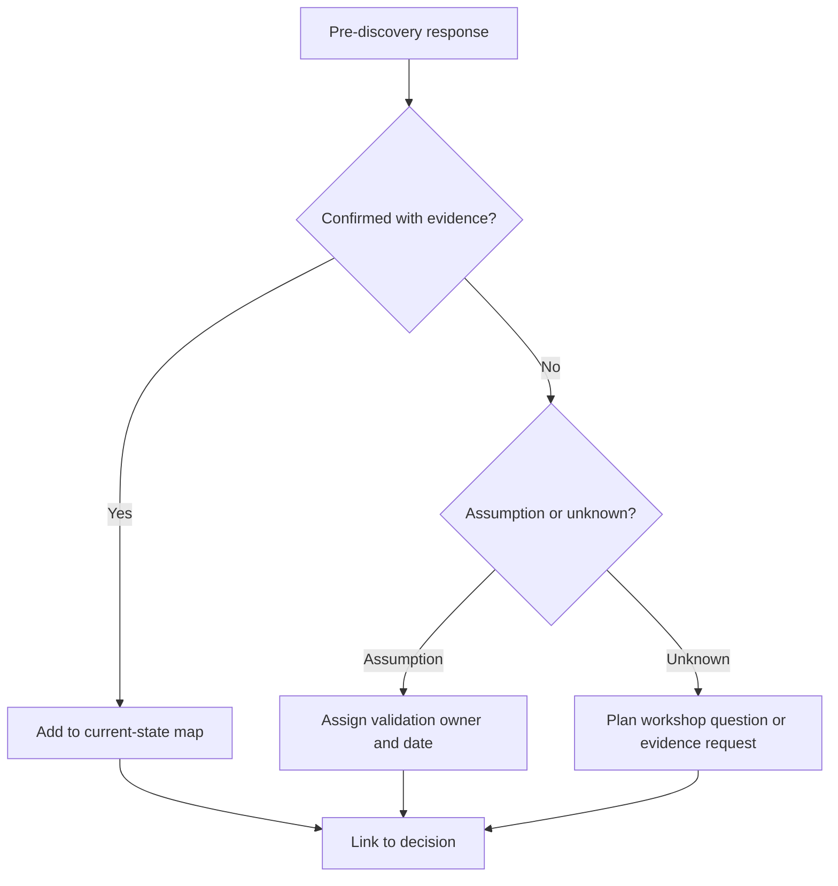

## Template G-T03 - Discovery evidence register

**Use:** Track where every consequential statement came from. Store references, not secrets or raw sensitive payloads. Record conflicts rather than selecting the most convenient source.

**Blank copy**

| Evidence ID | Claim supported | Type | Source owner | As-of/observed time | Location/reference | Classification | Confidence | Conflict/limit | Reviewer |
|---|---|---|---|---|---|---|---|---|---|
|  |  |  |  |  |  |  |  |  |  |

**NMH synthetic sample**

| Evidence ID | Claim supported | Type | Source owner | As-of/observed time | Location/reference | Classification | Confidence | Conflict/limit | Reviewer |
|---|---|---|---|---|---|---|---|---|---|
| NMH-EV-001 | Scheduling service is Tier 1 | Approved synthetic policy excerpt | Business continuity role | 2026-08-20 synthetic | Controlled sample reference | Internal synthetic | High under sample | Asset-to-service map remains unverified | Service owner role |

## Template G-T04 - Stakeholder map

**Use:** Map interests, influence, decision rights, evidence needs, and communication. Do not reduce stakeholders to "supporter" or "blocker"; objections often expose an unowned risk.

**Blank copy**

| Stakeholder role | Business/technical interest | Influence | Decision right | Evidence needed | Concern | Engagement method | Cadence | Relationship owner |
|---|---|---|---|---|---|---|---|---|
|  |  |  |  |  |  |  |  |  |

**NMH synthetic sample**

| Stakeholder role | Business/technical interest | Influence | Decision right | Evidence needed | Concern | Engagement method | Cadence | Relationship owner |
|---|---|---|---|---|---|---|---|---|
| CISO role | Material exposure and accountable treatment | High | Sponsor scope and escalation | Trend, unknowns, owner acceptance | Dashboard without action | Monthly decision review | Monthly | TSM role |
| Privacy role | Minimal lawful security metadata | High | Approve handling pattern | Field inventory, purpose, retention | Patient/user data overcollection | Design review | Gate/event | Data lead role |

## Template G-T05 - Persona and decision-right profile

**Use:** Go deeper than job title. Capture what a persona decides, what evidence earns trust, where work happens, and what they should never be asked to approve.

**Blank copy**

| Persona | Goals | Decisions owned | Inputs trusted | Workflow/tool | Friction | Success signal | Not accountable for | Enablement need |
|---|---|---|---|---|---|---|---|---|
|  |  |  |  |  |  |  |  |  |

**NMH synthetic sample**

| Persona | Goals | Decisions owned | Inputs trusted | Workflow/tool | Friction | Success signal | Not accountable for | Enablement need |
|---|---|---|---|---|---|---|---|---|
| Application owner role | Keep scheduling safe and available | Accept remediation window and app test | Dependency map, validated finding, rollback | Synthetic ITSM queue | Security tickets lack business context | Owned plan with tested postcondition | Enterprise risk acceptance | 45-minute priority/workflow workshop |

### Diagram G03 - Stakeholder influence and evidence

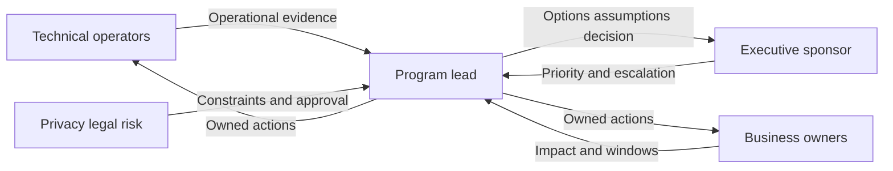

## Template G-T06 - RACI and authority matrix

**Use:** Assign one Accountable role per decision. Responsible performs work; Consulted gives input; Informed receives output. Add an explicit authority limit for incident, risk, privacy, or production changes.

**Blank copy**

| Decision/activity | Accountable | Responsible | Consulted | Informed | Authority limit | Escalation path | Evidence of acceptance |
|---|---|---|---|---|---|---|---|
|  |  |  |  |  |  |  |  |

**NMH synthetic sample**

| Decision/activity | Accountable | Responsible | Consulted | Informed | Authority limit | Escalation path | Evidence of acceptance |
|---|---|---|---|---|---|---|---|
| Approve asset match rule pilot | Asset governance role | Data engineering role | Cloud, endpoint, privacy roles | CISO role | Synthetic data only; no production merge | Architecture review role | Signed rule/test record |

## Template G-T07 - Business-service profile

**Use:** Anchor technical scope in a business service. Capture customers, transactions, criticality authority, recovery needs, data classes, dependencies, owners, and known failure modes.

**Blank copy**

| Service ID/name | Purpose/users | Criticality source | Key transactions | Data classes | Upstream dependencies | Downstream impact | Business owner | Technical owner | Recovery/availability needs | Evidence/as-of |
|---|---|---|---|---|---|---|---|---|---|---|
|  |  |  |  |  |  |  |  |  |  |  |

**NMH synthetic sample**

| Service ID/name | Purpose/users | Criticality source | Key transactions | Data classes | Upstream dependencies | Downstream impact | Business owner | Technical owner | Recovery/availability needs | Evidence/as-of |
|---|---|---|---|---|---|---|---|---|---|---|
| NMH-BS-01 Scheduling | Fictional staff schedule appointments | Synthetic Tier-1 policy | Sign in, search slot, book, confirm | Synthetic regulated and internal metadata | IdP, endpoint, DNS, internet path, hosted app | Appointment delay | Clinical operations role | App platform role | Use customer-approved values; sample says unknown | NMH-EV-001; 2026-08-20 synthetic |

## Template G-T08 - User and business journey

**Use:** Describe one observable start-to-finish transaction. Include actors, devices, locations, identity, protocols, dependencies, success, failure, telemetry, and owner at each step.

**Blank copy**

| Journey ID | Actor/cohort | Start trigger | Steps/resources | Identity/context | Data involved | Success postcondition | Failure symptom | Evidence sources | Journey owner |
|---|---|---|---|---|---|---|---|---|---|
|  |  |  |  |  |  |  |  |  |  |

**NMH synthetic sample**

| Journey ID | Actor/cohort | Start trigger | Steps/resources | Identity/context | Data involved | Success postcondition | Failure symptom | Evidence sources | Journey owner |
|---|---|---|---|---|---|---|---|---|---|
| NMH-J-01 | Synthetic scheduler on managed Windows device | Open hosted scheduling URL | DNS, TLS, federated sign-in, app search, booking API | Employee role, managed posture | No real content; metadata only in lab | Synthetic confirmation ID returned within agreed baseline | Sign-in loop or slow search | Endpoint, DNS/TLS, access log, app synthetic test | Service owner role |

### Diagram G04 - Business journey map

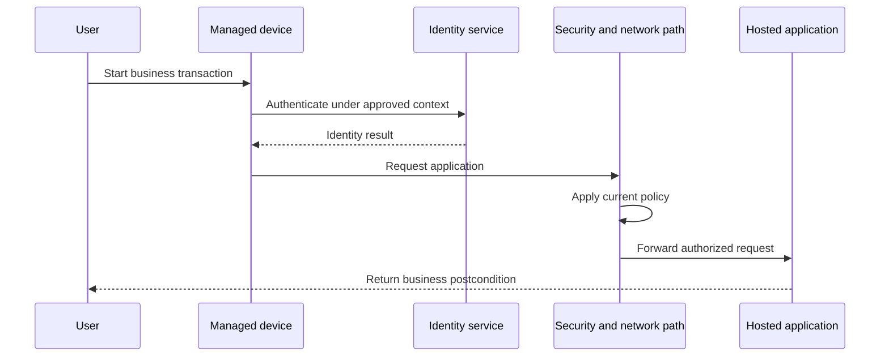

## Template G-T09 - Environment inventory

**Use:** Inventory bounded environments and trust zones, not every device. Capture purpose, ownership, lifecycle, connectivity, identity, change windows, data class, and evidence freshness.

**Blank copy**

| Environment/zone | Purpose | Hosting/location | Identity boundary | Network/connectivity | Data class | Owner | Lifecycle | Change window | Evidence/as-of | Unknowns |
|---|---|---|---|---|---|---|---|---|---|---|
|  |  |  |  |  |  |  |  |  |  |  |

**NMH synthetic sample**

| Environment/zone | Purpose | Hosting/location | Identity boundary | Network/connectivity | Data class | Owner | Lifecycle | Change window | Evidence/as-of | Unknowns |
|---|---|---|---|---|---|---|---|---|---|---|
| Synthetic corporate endpoint cohort | Scheduling access pilot | Fictional regional offices | Workforce IdP tenant | Local network to internet/SaaS path | Internal metadata | Endpoint role | Active | Weekly pilot window | Inventory extract, 2026-08-22 synthetic | Contractor devices excluded pending decision |

## Template G-T10 - Tool and product inventory

**Use:** Record job, owner, authoritative scope, integration, evidence, lifecycle, contract, and gap. A product name alone is not an architecture.

**Blank copy**

| Tool/product | Job/use case | Scope/population | Owner/operator | Authoritative for | Inputs/outputs | Integrations | Environment/tenant | Contract/lifecycle | Evidence | Gap/overlap |
|---|---|---|---|---|---|---|---|---|---|---|
|  |  |  |  |  |  |  |  |  |  |  |

**NMH synthetic sample**

| Tool/product | Job/use case | Scope/population | Owner/operator | Authoritative for | Inputs/outputs | Integrations | Environment/tenant | Contract/lifecycle | Evidence | Gap/overlap |
|---|---|---|---|---|---|---|---|---|---|---|
| Synthetic endpoint inventory source | Endpoint management | Managed corporate pilot cohort | Endpoint role | Enrollment status under sample rule | Device observations/API | Proposed asset workflow | Lab only | Fictional evaluation | Sample schema v1 | Not authoritative for cloud workloads |

## Template G-T11 - Security and business data-source inventory

**Use:** Define source grain, key, clocks, authority, quality, classification, and consumer. This is the discovery predecessor to a connector contract.

**Blank copy**

| Source ID | System/object | Record grain | Native key/scope | Event/observed clock | Update pattern | Field authority | Quality known | Classification | Owner | Intended consumer |
|---|---|---|---|---|---|---|---|---|---|---|
|  |  |  |  |  |  |  |  |  |  |  |

**NMH synthetic sample**

| Source ID | System/object | Record grain | Native key/scope | Event/observed clock | Update pattern | Field authority | Quality known | Classification | Owner | Intended consumer |
|---|---|---|---|---|---|---|---|---|---|---|
| NMH-SRC-01 | Synthetic endpoint device observation | One device observation per source object and pull | Namespaced device ID | Source last_seen plus ingest time | Daily lab file | Enrollment state only | 3% sample missing serial; synthetic | Internal synthetic | Endpoint data role | Asset identity pilot |

### Diagram G05 - Inventory relationships

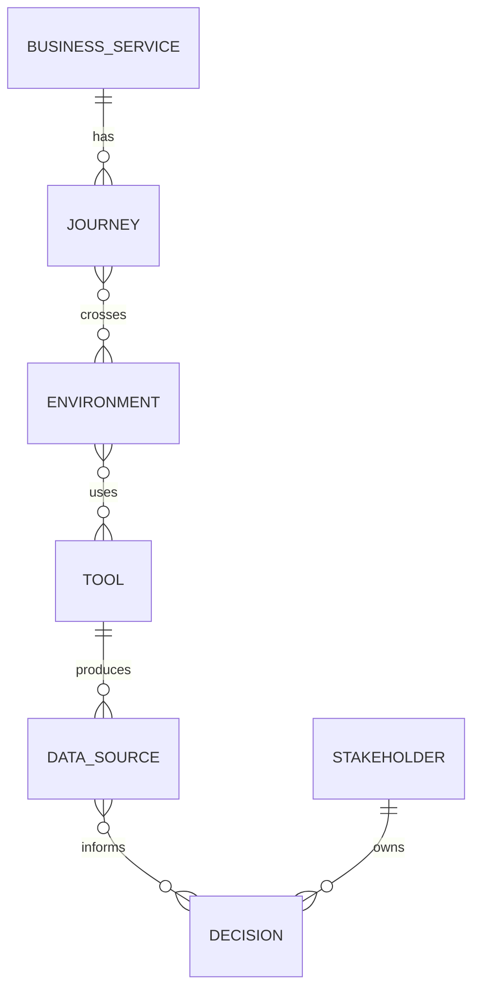

## Template G-T12 - Integration inventory

**Use:** Capture each data or action interface independently. Direction, objects, permissions, rates, clocks, retries, and monitoring are part of the integration.

**Blank copy**

| Integration ID | Producer -> consumer | Objects/direction | Interface/version | Auth/permission | Frequency/volume | Checkpoint/retry | Error path | Monitoring | Owner | Current proof |
|---|---|---|---|---|---|---|---|---|---|---|
|  |  |  |  |  |  |  |  |  |  |  |

**NMH synthetic sample**

| Integration ID | Producer -> consumer | Objects/direction | Interface/version | Auth/permission | Frequency/volume | Checkpoint/retry | Error path | Monitoring | Owner | Current proof |
|---|---|---|---|---|---|---|---|---|---|---|
| NMH-INT-01 | Synthetic endpoint export -> lab asset model | Device observations inbound | CSV schema v1 | Controlled lab file, no secret | Daily; 5,000 rows synthetic | Whole-file idempotent load | Reject file with row reason | Count and checksum | Data engineering role | Acceptance test pending |

## Template G-T13 - Current-state architecture context

**Use:** Pair a diagram with a component ledger. Mark trust boundaries, control points, owners, protocols, data, dependencies, telemetry, and unknowns. Never let an unlabeled arrow imply verified traffic.

**Blank copy**

| Component/flow ID | Purpose | Boundary/zone | Inputs | Outputs | Protocol/interface | Decision/control | Owner | Telemetry | Availability/change | Evidence/confidence |
|---|---|---|---|---|---|---|---|---|---|---|
|  |  |  |  |  |  |  |  |  |  |  |

**NMH synthetic sample**

| Component/flow ID | Purpose | Boundary/zone | Inputs | Outputs | Protocol/interface | Decision/control | Owner | Telemetry | Availability/change | Evidence/confidence |
|---|---|---|---|---|---|---|---|---|---|---|
| NMH-FLOW-01 | Synthetic user reaches hosted scheduling app | Endpoint to internet/SaaS | Identity and HTTPS request | App response | DNS, TLS, HTTPS | Current access policy, unverified in sample | Network security role | Endpoint/access/app synthetic logs | Pilot change window | Hypothesis; packet path not yet observed |

### Diagram G06 - Architecture evidence overlay

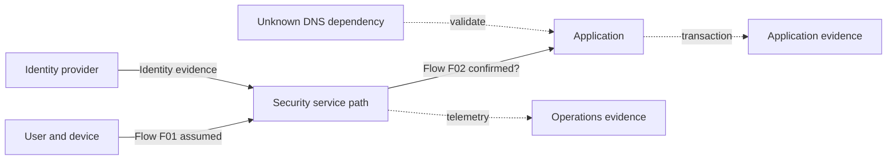

## Template G-T14 - Access and traffic-flow worksheet

**Use:** Trace one exact request. Capture tuple, identity, DNS, path, enforcement, TLS, destination, expected response, logs, and failure owner.

**Blank copy**

| Flow ID | Actor/device/location | Resource | DNS result | Source/destination/port/protocol | Steering/path | Identity/context | Policy/control | TLS behavior | Expected postcondition | Evidence | Failure owner |
|---|---|---|---|---|---|---|---|---|---|---|---|
|  |  |  |  |  |  |  |  |  |  |  |  |

**NMH synthetic sample**

| Flow ID | Actor/device/location | Resource | DNS result | Source/destination/port/protocol | Steering/path | Identity/context | Policy/control | TLS behavior | Expected postcondition | Evidence | Failure owner |
|---|---|---|---|---|---|---|---|---|---|---|---|
| NMH-FLOW-01 | Synthetic managed Windows user at office | Documentation-domain scheduling lab | Test address only | HTTPS 443 | Assumed security path; must observe | Workforce test user/managed | Synthetic pilot rule | Standard trusted chain in lab | HTTP success plus sample transaction | DNS/TLS/access/app timestamps | Named by first failing layer |

## Template G-T15 - Data-flow and privacy worksheet

**Use:** Map collection through deletion. Record purpose, fields, classification, lawful/customer authority, location, access, transformations, retention, and data-subject risk.

**Blank copy**

| Data-flow ID | Purpose | Source/fields | Classification | Transfer/path | Processing/derivation | Storage/region | Access roles | Retention/deletion | Legal/privacy approval | Risk/control |
|---|---|---|---|---|---|---|---|---|---|---|
|  |  |  |  |  |  |  |  |  |  |  |

**NMH synthetic sample**

| Data-flow ID | Purpose | Source/fields | Classification | Transfer/path | Processing/derivation | Storage/region | Access roles | Retention/deletion | Legal/privacy approval | Risk/control |
|---|---|---|---|---|---|---|---|---|---|---|
| NMH-DF-01 | Reconcile synthetic pilot assets | Hashed lab ID, asset class, source last_seen | Internal synthetic | Controlled local import | Normalize class; preserve raw value | Approved lab workspace | Data lead and reviewer roles | Delete after 30 synthetic days | Sample approval pending | No names/content/secrets; access log |

### Diagram G07 - Data lifecycle

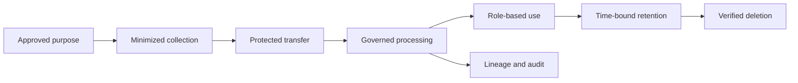

## Template G-T16 - Source and connector contract

**Use:** Convert source inventory into acceptance criteria. A current official listing is not enough; verify exact behavior in the licensed environment.

**Blank copy**

| Contract ID | Use case/consumer | Source/object/grain | Interface/direction | Auth/least privilege | Scope/filter | Full/incremental/delete | Frequency/freshness | Schema/version | Acceptance/reconciliation | Error/recovery | Owner/review |
|---|---|---|---|---|---|---|---|---|---|---|---|
|  |  |  |  |  |  |  |  |  |  |  |  |

**NMH synthetic sample**

| Contract ID | Use case/consumer | Source/object/grain | Interface/direction | Auth/least privilege | Scope/filter | Full/incremental/delete | Frequency/freshness | Schema/version | Acceptance/reconciliation | Error/recovery | Owner/review |
|---|---|---|---|---|---|---|---|---|---|---|---|
| NMH-SC-01 | Asset owner pilot | Synthetic endpoint device observation | File inbound | Controlled read-only lab path | Active pilot cohort | Daily full; deletion semantics explicit inactive row | Complete by 09:00 synthetic | CSV v1 | Count +/- explained variance; key sample | Quarantine whole bad file; replay idempotently | Endpoint/data roles; weekly |

## Template G-T17 - Source-to-canonical mapping

**Use:** Map meaning, not just names. Preserve raw values and document null, unit, enum, time, transformation, default, and test cases.

**Blank copy**

| Mapping ID | Source field/type/meaning | Canonical field/type/meaning | Transform/unit | Null/unknown rule | Enum crosswalk | Time semantics | Provenance | Positive/negative test | Steward/version |
|---|---|---|---|---|---|---|---|---|---|
|  |  |  |  |  |  |  |  |  |  |

**NMH synthetic sample**

| Mapping ID | Source field/type/meaning | Canonical field/type/meaning | Transform/unit | Null/unknown rule | Enum crosswalk | Time semantics | Provenance | Positive/negative test | Steward/version |
|---|---|---|---|---|---|---|---|---|---|
| NMH-MAP-01 | `last_seen_local`, text, source observation | `observed_at`, UTC timestamp | Parse approved zone then UTC | Null remains unknown; no ingest default | n/a | Source observation, not event time | Source row ID and rule v1 | DST edge and malformed value | Data steward role/v1 |

### Diagram G08 - Source contract acceptance

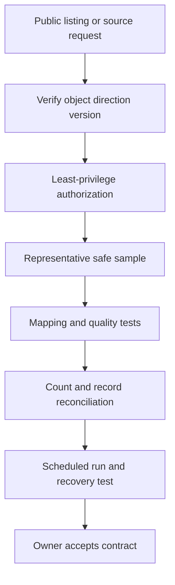

## Template G-T18 - Data-quality acceptance plan

**Use:** Define tests by critical data element and decision impact. Include completeness, validity, uniqueness, timeliness, integrity, reconciliation, and identity quality.

**Blank copy**

| Test ID | Data element/grain | Quality dimension | Rule/formula | Scope/window | Threshold method | Failure impact | Owner | Test evidence | Disposition |
|---|---|---|---|---|---|---|---|---|---|
|  |  |  |  |  |  |  |  |  |  |

**NMH synthetic sample**

| Test ID | Data element/grain | Quality dimension | Rule/formula | Scope/window | Threshold method | Failure impact | Owner | Test evidence | Disposition |
|---|---|---|---|---|---|---|---|---|---|
| NMH-DQ-01 | Native device ID per synthetic row | Completeness/uniqueness | Non-null and unique within source scope/file | Daily pilot file | Contract requires 100% for primary key | Reject file to prevent false merge | Data owner role | Validation report | Quarantine and notify source owner |

## Template G-T19 - Current-state maturity baseline

**Use:** Assess observable practices, not people. Define levels locally and require evidence. A maturity number should identify a next capability, not rank teams.

**Blank copy**

| Domain | Current practice | Evidence | Locally defined level | Strength | Gap/risk | Desired capability | Next experiment | Owner/date | Confidence |
|---|---|---|---|---|---|---|---|---|---|
|  |  |  |  |  |  |  |  |  |  |

**NMH synthetic sample**

| Domain | Current practice | Evidence | Locally defined level | Strength | Gap/risk | Desired capability | Next experiment | Owner/date | Confidence |
|---|---|---|---|---|---|---|---|---|---|
| Asset identity | Two sources reviewed separately | Synthetic reports and interview | Level 1 of NMH sample rubric | Source owners known | No governed match/correction | Tested cross-source identity for pilot class | Review 100 ambiguous pairs | Asset role/2026-09-20 synthetic | Medium |

## Template G-T20 - Capability maturity rubric

**Use:** Define what each level means before scoring. Use capability statements with exit evidence; never copy a generic five-level model and call it fact.

**Blank copy**

| Capability | L0 absent/unknown | L1 repeatable locally | L2 governed | L3 measured | L4 adaptive | Current evidence | Target rationale |
|---|---|---|---|---|---|---|---|
|  |  |  |  |  |  |  |  |

**NMH synthetic sample**

| Capability | L0 absent/unknown | L1 repeatable locally | L2 governed | L3 measured | L4 adaptive | Current evidence | Target rationale |
|---|---|---|---|---|---|---|---|
| Asset source onboarding | No inventory | Manual source checklist | Approved contract and owner | Quality/freshness trends | Feedback changes source/mapping | Synthetic manual checklist supports L1 | Reach L2 for two-source pilot; L4 not needed |

### Diagram G09 - Maturity evidence path

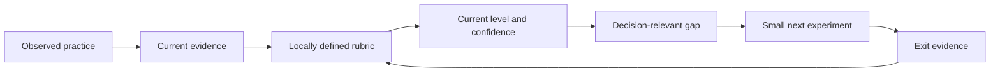

## Template G-T21 - Readiness checklist

**Use:** Gate a pilot or rollout. Each item needs evidence, owner, status, and consequence if absent. `Ready with exception` requires an approved exception and compensating control.

**Blank copy**

| Readiness item | Required evidence | Status: ready/not ready/exception/unknown | Owner | Due | Impact if absent | Compensating control | Approver |
|---|---|---|---|---|---|---|---|
|  |  |  |  |  |  |  |  |

**NMH synthetic sample**

| Readiness item | Required evidence | Status: ready/not ready/exception/unknown | Owner | Due | Impact if absent | Compensating control | Approver |
|---|---|---|---|---|---|---|---|
| Privacy approval for synthetic field set | Approved data-flow worksheet | Not ready | Privacy role | 2026-09-05 synthetic | Pilot data cannot be loaded | None; use generated data until approval | Privacy approver role |

## Template G-T22 - RAID register

**Use:** Track Risks, Assumptions, Issues, and Dependencies separately. A risk is uncertain; an issue is happening; an assumption is a planning premise; a dependency is needed from elsewhere.

**Blank copy**

| RAID ID/type | Statement | Evidence/source | Probability/impact or current effect | Owner | Response/validation | Dependency | Due/review | Status | Escalation trigger |
|---|---|---|---|---|---|---|---|---|---|
|  |  |  |  |  |  |  |  |  |  |

**NMH synthetic sample**

| RAID ID/type | Statement | Evidence/source | Probability/impact or current effect | Owner | Response/validation | Dependency | Due/review | Status | Escalation trigger |
|---|---|---|---|---|---|---|---|---|---|
| NMH-A-01 Assumption | Synthetic endpoint source retains stable device IDs for pilot | Sample schema only | If false, identity quality and schedule affected | Endpoint source role | Test identifier reuse and lifecycle sample | Source owner interview | 2026-09-07 synthetic | Open | Any reused ID across two active devices |

### Plain-English deep-dive 2 - RAID categories change the next action

If a dependency is unavailable, coordinate an owner and date. If an issue is happening, contain and resolve it. If an assumption lacks evidence, test it. If a risk might occur, choose mitigation, contingency, transfer, avoidance, or acceptance through the accountable owner. Calling everything a "risk" blurs action and makes the register ceremonial.

## Template G-T23 - Assumption validation plan

**Use:** Turn material assumptions into cheap discriminating checks. State what would falsify the assumption and what changes if it fails.

**Blank copy**

| Assumption ID | Assumption | Why needed | Evidence for/against | Disconfirming check | Owner | Due | If true | If false | Result/confidence |
|---|---|---|---|---|---|---|---|---|---|
|  |  |  |  |  |  |  |  |  |  |

**NMH synthetic sample**

| Assumption ID | Assumption | Why needed | Evidence for/against | Disconfirming check | Owner | Due | If true | If false | Result/confidence |
|---|---|---|---|---|---|---|---|---|---|
| NMH-A-01 | Device ID is stable within source scope | Candidate key design | Schema says ID; no lifecycle sample | Compare 90 synthetic days for reuse/collision | Data analyst role | 2026-09-07 synthetic | Use composite source key | Add temporal key and manual review | Pending/low |

## Template G-T24 - Dependency map and contract

**Use:** Define deliverable, provider, consumer, acceptance, lead time, fallback, and escalation. Avoid vague dependencies such as "network team support."

**Blank copy**

| Dependency ID | Provider | Consumer | Deliverable/decision | Needed by | Entry condition | Acceptance evidence | Lead time | Fallback | Escalation | Status |
|---|---|---|---|---|---|---|---|---|---|---|
|  |  |  |  |  |  |  |  |  |  |  |

**NMH synthetic sample**

| Dependency ID | Provider | Consumer | Deliverable/decision | Needed by | Entry condition | Acceptance evidence | Lead time | Fallback | Escalation | Status |
|---|---|---|---|---|---|---|---|---|---|---|
| NMH-DEP-01 | Privacy role | Data pilot team | Field-set handling approval | Before first import | Completed G-T15 | Signed scope/retention decision | Five synthetic business days | Generated records only | Sponsor role after due date | Open |

### Diagram G10 - RAID routing

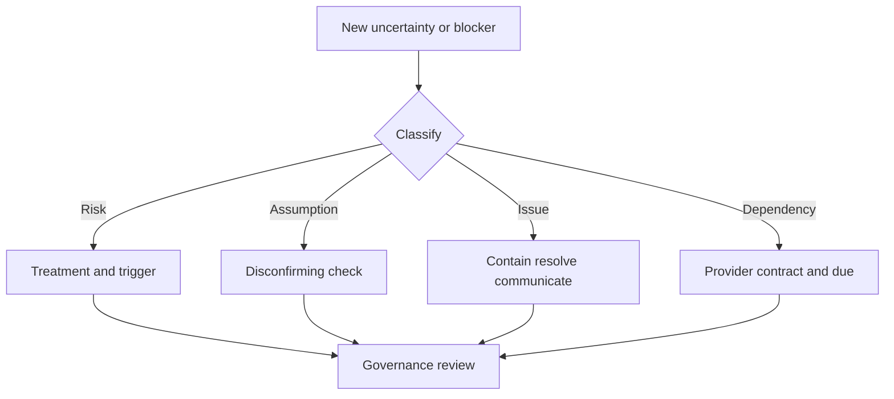

## Template G-T25 - Outcome statement

**Use:** Define who experiences what measurable change, by when, under which scope and guardrails. Separate outcome from activity and product deployment.

**Blank copy**

| Outcome ID | Beneficiary | Current problem/baseline | Desired observable change | Scope/cohort | Measure/source | Target method/date | Guardrail | Accountable owner | Evidence confidence |
|---|---|---|---|---|---|---|---|---|---|
|  |  |  |  |  |  |  |  |  |  |

**NMH synthetic sample**

| Outcome ID | Beneficiary | Current problem/baseline | Desired observable change | Scope/cohort | Measure/source | Target method/date | Guardrail | Accountable owner | Evidence confidence |
|---|---|---|---|---|---|---|---|---|---|
| NMH-OUT-01 | Asset and app owners | Synthetic pilot has 18% unknown owner among reconciled candidates | Reduce unknown ownership through accepted mapping/workflow | Two-source scheduling asset pilot | E-X009-style rate plus accepted owner evidence | Target set after two comparable baselines; no invented number | False owner audit and excluded count | Asset governance role | Low until baseline |

## Template G-T26 - KPI and metric contract

**Use:** Define the metric before assigning a target. Reference [Appendix E](Appendix-E-risk-vulnerability-secops-metrics.md) for examples, but approve local definitions.

**Blank copy**

| Metric ID/name/version | Decision | Grain | Numerator | Denominator | Units | Source/clock | Scope/exclusions | Interpretation | Goodhart risk | Guardrail | Target method/owner |
|---|---|---|---|---|---|---|---|---|---|---|---|
|  |  |  |  |  |  |  |  |  |  |  |  |

**NMH synthetic sample**

| Metric ID/name/version | Decision | Grain | Numerator | Denominator | Units | Source/clock | Scope/exclusions | Interpretation | Goodhart risk | Guardrail | Target method/owner |
|---|---|---|---|---|---|---|---|---|---|---|---|
| NMH-KPI-01 Owner coverage v1 | Whether to expand source pilot | Canonical asset at cutoff | Active pilot assets with validated owner | Active pilot assets requiring owner | Percent plus counts | Canonical snapshot at synthetic cutoff | Excludes approved lab devices, separately counted | Mobilization readiness | Assigning generic queue inflates | Owner acceptance audit | Baseline/capacity proposal; asset role approves |

## Template G-T27 - Value hypothesis and attribution plan

**Use:** Link capability, behavior, output, outcome, value, and evidence. State alternate causes and what attribution language is justified.

**Blank copy**

| Value ID | Capability/change | Behavior/output | Expected outcome | Baseline/counterfactual | Measure | Other causes | Attribution method/confidence | Financial treatment | Validator |
|---|---|---|---|---|---|---|---|---|---|
|  |  |  |  |  |  |  |  |  |  |

**NMH synthetic sample**

| Value ID | Capability/change | Behavior/output | Expected outcome | Baseline/counterfactual | Measure | Other causes | Attribution method/confidence | Financial treatment | Validator |
|---|---|---|---|---|---|---|---|---|---|
| NMH-VAL-01 | Governed two-source asset reconciliation | Owners receive context-rich work | Less analyst rework on duplicate asset triage | Synthetic time sample before/after comparable weekly volume | Minutes per validated case and error sample | Staffing, case mix, training | Contribution only; low-medium confidence | Capacity released, not booked savings | Operations and finance roles |

### Diagram G11 - Outcome traceability

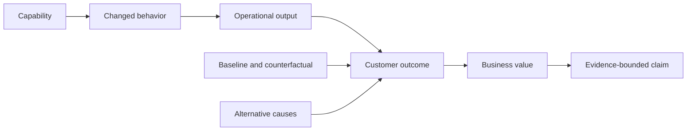

## Template G-T28 - Technical success plan (TSP)

**Use:** Make this the traceability spine. Link business outcome, technical workstream, milestones, owner, dependencies, evidence, measures, risks, and governance.

**Blank copy**

| Workstream ID | Linked outcome | Current state/gap | Technical objective | Milestones | Customer owner | TSM/account owner | Dependencies | Measure/guardrail | Risks | Governance | Status |
|---|---|---|---|---|---|---|---|---|---|---|---|
|  |  |  |  |  |  |  |  |  |  |  |  |

**NMH synthetic sample**

| Workstream ID | Linked outcome | Current state/gap | Technical objective | Milestones | Customer owner | TSM/account owner | Dependencies | Measure/guardrail | Risks | Governance | Status |
|---|---|---|---|---|---|---|---|---|---|---|---|
| NMH-WS-01 | NMH-OUT-01 | Two sources, no accepted identity/owner workflow | Produce reconciled pilot asset context and accepted owner loop | Source contracts; mapping tests; 100-pair audit; workflow pilot; exit review | Asset role | TSM role | NMH-DEP-01, source exports | Owner coverage plus false-merge audit | Privacy delay, unstable ID | Weekly working; monthly sponsor | Planned |

## Template G-T29 - Milestone card

**Use:** Define a milestone as a decision-ready state, not a date or activity. Include entry, exit, evidence, approver, dependency, rollback, and status reason.

**Blank copy**

| Milestone ID/name | Outcome link | Entry criteria | Work/deliverables | Exit criteria | Evidence | Approver | Planned/current date | Dependencies | Rollback/contingency | Status/reason |
|---|---|---|---|---|---|---|---|---|---|---|---|
|  |  |  |  |  |  |  |  |  |  |  |

**NMH synthetic sample**

| Milestone ID/name | Outcome link | Entry criteria | Work/deliverables | Exit criteria | Evidence | Approver | Planned/current date | Dependencies | Rollback/contingency | Status/reason |
|---|---|---|---|---|---|---|---|---|---|---|---|
| NMH-MS-02 Mapping accepted | NMH-OUT-01 | Two accepted source contracts | Mapping rules and tests | Critical mappings pass; unknowns preserved; steward signs | Test run and mapping workbook | Data steward role | 2026-09-18 synthetic | Privacy and samples | Revert to isolated source views | Not started |

## Template G-T30 - Exit-evidence checklist

**Use:** Make acceptance objective enough for a reviewer to reproduce. Include positive, negative, exception, recovery, privacy, operations, and outcome evidence.

**Blank copy**

| Exit item | Test/postcondition | Evidence reference | Result | Reviewer | Date | Exception/limit | Follow-up |
|---|---|---|---|---|---|---|---|
| Positive case |  |  |  |  |  |  |  |
| Negative case |  |  |  |  |  |  |  |
| Exception case |  |  |  |  |  |  |  |
| Recovery case |  |  |  |  |  |  |  |
| Privacy/operations |  |  |  |  |  |  |  |
| Outcome/guardrail |  |  |  |  |  |  |  |

**NMH synthetic sample**

| Exit item | Test/postcondition | Evidence reference | Result | Reviewer | Date | Exception/limit | Follow-up |
|---|---|---|---|---|---|---|---|
| Negative case | Missing native ID causes file rejection, not fabricated ID | NMH-DQ-01 synthetic run | Pass in generated lab | Data reviewer role | 2026-09-18 synthetic | Does not test production connector behavior | Repeat under approved environment |

### Diagram G12 - Milestone acceptance

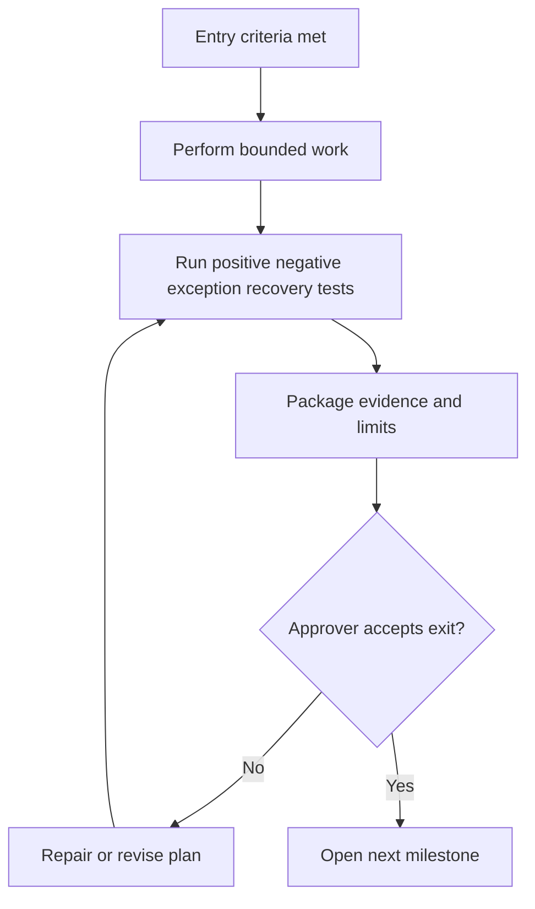

## Template G-T31 - 30/60/90-day plan

**Use:** Organize learning, relationships, delivery, and evidence by phase. Days are planning horizons, not guarantees. Each phase needs outcomes and proof.

**Blank copy**

| Horizon | Objectives | Learn/relationships | Deliver | Decisions | Measures/evidence | Risks/dependencies | Exit condition |
|---|---|---|---|---|---|---|---|
| Days 1-30 |  |  |  |  |  |  |  |
| Days 31-60 |  |  |  |  |  |  |  |
| Days 61-90 |  |  |  |  |  |  |  |

**NMH synthetic sample**

| Horizon | Objectives | Learn/relationships | Deliver | Decisions | Measures/evidence | Risks/dependencies | Exit condition |
|---|---|---|---|---|---|---|---|
| Days 1-30 | Approve scope and source contracts | Sponsor, asset, privacy, endpoint/cloud roles | Charter, service map, inventories, RAID | Pilot scope and data handling | Accepted artifacts | Privacy/source access | Two contracts ready |
| Days 31-60 | Validate identity and owner workflow | Data steward, ITSM, app owners | Mapping tests, audit, workflow prototype | Correct/expand/stop | Error and owner coverage with guardrails | False merges | Phase-1 exit review |
| Days 61-90 | Operationalize and plan next horizon | Governance and operations roles | Runbook, dashboard, training, executive readout | Expand one source/use case or stabilize | Health, adoption and outcome evidence | Capacity/change | Accepted handoff and roadmap |

## Template G-T32 - Onboarding plan

**Use:** Cover commercial/entitlement confirmation, technical prerequisites, security/privacy, configuration, integrations, testing, rollout, operations, enablement, and value. Installation is not onboarding completion.

**Blank copy**

| Phase | Objective | Prerequisites | Activities | Owner | Evidence/exit | Dependencies | Customer impact | Rollback | Status |
|---|---|---|---|---|---|---|---|---|---|
| Confirm |  |  |  |  |  |  |  |  |  |
| Design |  |  |  |  |  |  |  |  |  |
| Configure/integrate |  |  |  |  |  |  |  |  |  |
| Validate/pilot |  |  |  |  |  |  |  |  |  |
| Roll out/operate |  |  |  |  |  |  |  |  |  |

**NMH synthetic sample**

| Phase | Objective | Prerequisites | Activities | Owner | Evidence/exit | Dependencies | Customer impact | Rollback | Status |
|---|---|---|---|---|---|---|---|---|---|
| Validate/pilot | Test synthetic two-source reconciliation | Contracts/mappings approved | Load, reconcile, audit 100 pairs, route five generated work items | Data/asset roles | Accepted exit checklist | ITSM sandbox | No production impact | Delete lab model and retain report | Planned |

### Diagram G13 - Onboarding gates

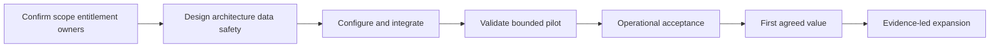

## Template G-T33 - Governance cadence

**Use:** Give each forum a purpose, decision set, inputs, outputs, quorum, and escalation route. Cancel meetings that produce neither decisions nor coordinated action.

**Blank copy**

| Forum | Purpose | Cadence | Required roles/quorum | Inputs/pre-read | Decisions | Outputs | Facilitator | Escalation path | Effectiveness review |
|---|---|---|---|---|---|---|---|---|---|
|  |  |  |  |  |  |  |  |  |  |

**NMH synthetic sample**

| Forum | Purpose | Cadence | Required roles/quorum | Inputs/pre-read | Decisions | Outputs | Facilitator | Escalation path | Effectiveness review |
|---|---|---|---|---|---|---|---|---|---|
| NMH working review | Resolve pilot evidence/blocks | Weekly synthetic | Asset, data, source owner; privacy when needed | Dashboard, RAID, decisions by prior day | Mapping corrections, blocker owner | Updated logs and tests | TSM role | Monthly sponsor forum | Four-week decision/action yield |

## Template G-T34 - Working-session agenda

**Use:** Timebox context, evidence, decisions, and actions. Send decision questions in advance; record unknowns without derailing the meeting.

**Blank copy**

| Time | Topic | Desired result | Presenter/owner | Pre-read/evidence | Decision method | Parking lot rule |
|---|---|---|---|---|---|---|
|  |  |  |  |  |  |  |

**NMH synthetic sample**

| Time | Topic | Desired result | Presenter/owner | Pre-read/evidence | Decision method | Parking lot rule |
|---|---|---|---|---|---|---|
| 0-10 | Scope/RAID delta | Confirm changed assumptions | TSM role | One-page delta | Owners confirm/correct | New topic gets owner/date |
| 10-35 | Ambiguous identity sample | Approve rule correction or human review | Data steward role | Ten redacted synthetic pairs | Evidence and false-merge risk | Product behavior unknown goes to verification log |
| 35-45 | Decisions/actions | One owner and due per item | Facilitator | Decision/action logs | Accountable role approves | No anonymous action |

### Diagram G14 - Governance stack

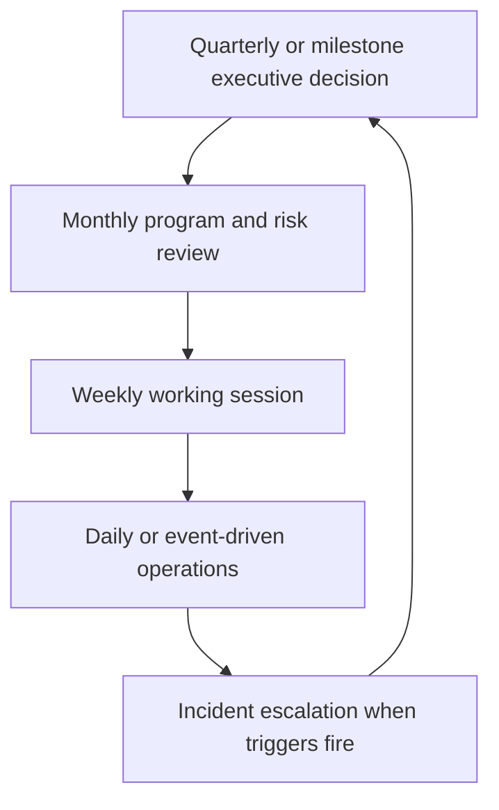

## Template G-T35 - Action log

**Use:** An action begins with a verb and ends with evidence. One accountable owner accepts the due date. Preserve original due dates and status history.

**Blank copy**

| Action ID | Action/deliverable | Outcome/milestone link | Accountable owner | Contributors | Original/current due | Status/reason | Dependency | Completion evidence | Accepted by/date |
|---|---|---|---|---|---|---|---|---|---|
|  |  |  |  |  |  |  |  |  |  |

**NMH synthetic sample**

| Action ID | Action/deliverable | Outcome/milestone link | Accountable owner | Contributors | Original/current due | Status/reason | Dependency | Completion evidence | Accepted by/date |
|---|---|---|---|---|---|---|---|---|---|
| NMH-ACT-01 | Provide synthetic 90-day device-ID lifecycle sample | NMH-MS-02 | Endpoint source role | Data analyst role | 2026-09-07 / same, synthetic | Open | Sample generation approval | Controlled file checksum and schema | Data steward role/pending |

## Template G-T36 - Decision log

**Use:** Record context, options, criteria, decision, owner, rationale, dissent, assumptions, consequences, evidence, and revisit trigger. A non-decision is also recorded.

**Blank copy**

| Decision ID/date | Question/context | Options | Criteria | Decision | Accountable decider | Rationale/evidence | Dissent/unknown | Consequence/actions | Revisit trigger/date |
|---|---|---|---|---|---|---|---|---|---|
|  |  |  |  |  |  |  |  |  |  |

**NMH synthetic sample**

| Decision ID/date | Question/context | Options | Criteria | Decision | Accountable decider | Rationale/evidence | Dissent/unknown | Consequence/actions | Revisit trigger/date |
|---|---|---|---|---|---|---|---|---|---|
| NMH-DEC-01 / 2026-09-08 synthetic | How to handle ambiguous device pairs? | Auto-merge; keep separate; human review | False-merge harm, capacity, evidence | Keep separate and review high-impact pairs | Asset governance role | Lifecycle evidence incomplete | False-split workload accepted temporarily | Add review queue and audit | Revisit after 100-pair labeled sample |

### Diagram G15 - Decision lifecycle

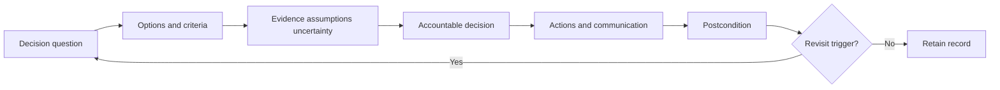

## Template G-T37 - Customer health model

**Use:** Define domains, signals, source, freshness, direction, thresholds, confidence, owner, and override. Never invent a Zscaler health formula. Unknown is a state, not neutral green.

**Blank copy**

| Health domain | Signal/definition | Source/clock | Weight/logic if used | Green/amber/red/unknown rule | Confidence | Owner | Action trigger | Guardrail | Override/reason |
|---|---|---|---|---|---|---|---|---|---|
| Technical |  |  |  |  |  |  |  |  |  |
| Adoption |  |  |  |  |  |  |  |  |  |
| Outcomes |  |  |  |  |  |  |  |  |  |
| Relationship/governance |  |  |  |  |  |  |  |  |  |
| Risk/support |  |  |  |  |  |  |  |  |  |

**NMH synthetic sample**

| Health domain | Signal/definition | Source/clock | Weight/logic if used | Green/amber/red/unknown rule | Confidence | Owner | Action trigger | Guardrail | Override/reason |
|---|---|---|---|---|---|---|---|---|---|
| Technical | Accepted daily synthetic source run and quality tests | Lab run/day | No combined score in sample | Green: last 3 accepted; amber: 1 failed; red: decision data unavailable; unknown: no evidence | Medium | Data ops role | Amber opens recovery action | Record acceptance and reconciliation | None |
| Outcomes | NMH-OUT-01 evidence | Monthly cutoff | Not weighted | Unknown until two baselines; no default green | Low | Asset role | Unknown after baseline due escalates | False-owner audit | None |

### Diagram G16 - Health from evidence to action

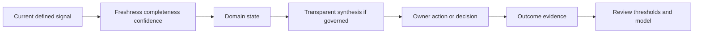

## Template G-T38 - Adoption plan

**Use:** Define eligible personas, meaningful behavior, barriers, interventions, measures, privacy, and reinforcement. Login count is rarely enough.

**Blank copy**

| Persona/cohort | Eligible population | Meaningful behavior | Current baseline | Barrier/hypothesis | Intervention | Owner | Adoption measure | Outcome/guardrail | Privacy | Review |
|---|---|---|---|---|---|---|---|---|---|---|
|  |  |  |  |  |  |  |  |  |  |  |

**NMH synthetic sample**

| Persona/cohort | Eligible population | Meaningful behavior | Current baseline | Barrier/hypothesis | Intervention | Owner | Adoption measure | Outcome/guardrail | Privacy | Review |
|---|---|---|---|---|---|---|---|---|---|---|
| Synthetic app-owner pilot | 12 owner roles | Accept/reject contextual asset work with reason and postcondition | No workflow baseline | Tickets lack service context | Co-design fields, 30-minute lab, office hour | Asset program role | Completed valid decisions / eligible work | Owner correctness sample; no individual ranking | Aggregate team reporting | Biweekly synthetic |

## Template G-T39 - Adoption barrier log

**Use:** Separate awareness, skill, access, workflow, trust, relevance, capacity, policy, and technical barriers. Test causes before prescribing training.

**Blank copy**

| Barrier ID | Persona | Observed behavior | Barrier hypothesis/type | Evidence | Discriminating check | Intervention | Owner | Measure | Result/learning |
|---|---|---|---|---|---|---|---|---|---|
|  |  |  |  |  |  |  |  |  |  |

**NMH synthetic sample**

| Barrier ID | Persona | Observed behavior | Barrier hypothesis/type | Evidence | Discriminating check | Intervention | Owner | Measure | Result/learning |
|---|---|---|---|---|---|---|---|---|---|
| NMH-BAR-01 | App owner role | Synthetic work items reassigned without decision | Trust/relevance: asset-to-service evidence unclear | Five generated ticket reviews | Add provenance and compare acceptance to original | Prototype context panel, then teach-back | TSM and asset roles | Valid decision share plus interview | Pending |

### Diagram G17 - Adoption diagnosis

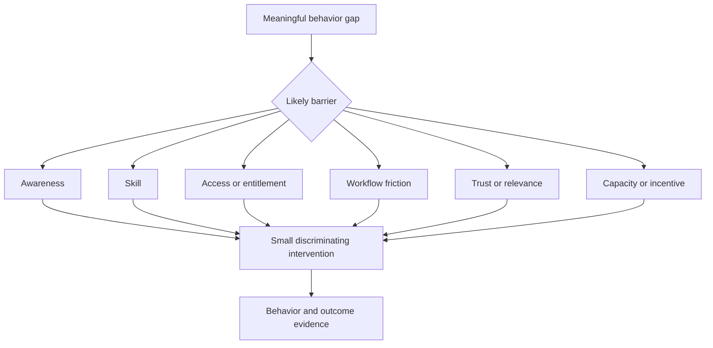

## Template G-T40 - Workshop design and facilitator plan

**Use:** Design for a decision or artifact, not a presentation. Include pre-work, roles, timeboxes, exercises, safety, parking lot, decision method, and follow-up.

**Blank copy**

| Workshop | Objective/artifact | Participants/roles | Pre-work | Agenda/exercises | Materials/data | Safety/privacy | Decision method | Success evidence | Follow-up owner/date |
|---|---|---|---|---|---|---|---|---|---|
|  |  |  |  |  |  |  |  |  |  |

**NMH synthetic sample**

| Workshop | Objective/artifact | Participants/roles | Pre-work | Agenda/exercises | Materials/data | Safety/privacy | Decision method | Success evidence | Follow-up owner/date |
|---|---|---|---|---|---|---|---|---|---|
| NMH asset identity lab | Approve v1 match/review logic | Endpoint, cloud, asset, privacy, data roles | Review schemas and ten generated pairs | Grain/key lesson; classify pairs; test rules; decide ambiguity route | Synthetic records only | No real IDs/content; controlled notes | Asset governance role decides with dissent logged | Approved mapping/rules and open unknowns | Data steward/2026-09-12 synthetic |

## Template G-T41 - Training and teach-back plan

**Use:** Define learner job, prerequisites, learning objectives, practice, assessment, accessibility, reinforcement, and operational handoff. Attendance is not proficiency.

**Blank copy**

| Learner/persona | Job to perform | Prerequisites | Objectives | Demo/practice | Assessment/teach-back rubric | Materials | Accessibility/privacy | Reinforcement | Owner/date |
|---|---|---|---|---|---|---|---|---|---|---|
|  |  |  |  |  |  |  |  |  |  |

**NMH synthetic sample**

| Learner/persona | Job to perform | Prerequisites | Objectives | Demo/practice | Assessment/teach-back rubric | Materials | Accessibility/privacy | Reinforcement | Owner/date |
|---|---|---|---|---|---|---|---|---|---|
| App owner role | Decide and validate synthetic asset work | Service map and sample workflow access | Explain priority context; choose owner/action; state postcondition | Three generated work items | Correctly distinguishes evidence, assumption and decision in 2/3 plus feedback | One-page guide and lab | No employee ranking; accessible format | Office hour and sampled review | Enablement role/2026-09-25 synthetic |

### Diagram G18 - Workshop-to-adoption loop

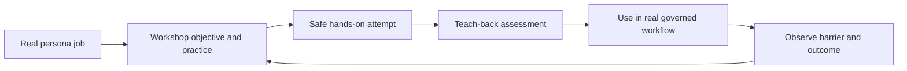

## Template G-T42 - Executive readout

**Use:** Keep one page decision-oriented. Lead with business objective and current evidence; show change, uncertainty, choices, recommendation, owner, date, and next horizon. Put technical detail in an appendix.

**Blank copy**

| Section | Fillable content |
|---|---|
| Objective and scope/as-of |  |
| What changed since last review |  |
| Outcome/KPI with numerator, denominator and guardrail |  |
| Top evidence-backed risks/unknowns |  |
| Decisions needed and options |  |
| Recommendation and caveat |  |
| Owners, dates and escalation |  |
| Value evidence and attribution confidence |  |
| Next horizon |  |

**NMH synthetic sample**

| Section | Fillable content |
|---|---|
| Objective and scope/as-of | Synthetic two-source scheduling-asset pilot as of 2026-10-15 synthetic |
| What changed since last review | Source contracts accepted; mapping tests pass in lab; identity audit found false-merge risk in reused IDs |
| Outcome/KPI with numerator, denominator and guardrail | 410/500 generated assets have validated owner (82%); 90 remain unknown; false-owner audit is guardrail |
| Top evidence-backed risks/unknowns | Production connector behavior and privacy approval remain unknown; no product outcome claimed |
| Decisions needed and options | Stabilize pilot, add cloud source, or stop; recommendation is stabilize until lifecycle rule validated |
| Recommendation and caveat | Keep ambiguous records separate and fund review sample; may increase apparent duplicates temporarily |
| Owners, dates and escalation | Asset governance role decides by synthetic review date |
| Value evidence and attribution confidence | Reduced synthetic rework is directional; low confidence and not financial savings |
| Next horizon | Validate lifecycle, operational handoff, then reconsider source expansion |

### Diagram G19 - Executive story

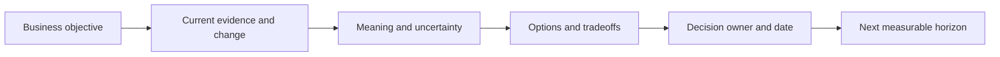

## Template G-T43 - Operational handoff

**Use:** Transfer an accepted capability to named operators. Include scope, runbook, access, monitoring, normal/abnormal states, support, changes, recovery, known limits, training, and acceptance.

**Blank copy**

| Handoff ID | Capability/scope | Service owner/operator | Runbook/location | Access/segregation | Health/alerts | Routine tasks | Incident/escalation | Change/rollback | Known limits/debt | Training evidence | Acceptance/date |
|---|---|---|---|---|---|---|---|---|---|---|---|
|  |  |  |  |  |  |  |  |  |  |  |  |

**NMH synthetic sample**

| Handoff ID | Capability/scope | Service owner/operator | Runbook/location | Access/segregation | Health/alerts | Routine tasks | Incident/escalation | Change/rollback | Known limits/debt | Training evidence | Acceptance/date |
|---|---|---|---|---|---|---|---|---|---|---|---|
| NMH-HO-01 | Synthetic daily asset lab pipeline only | Data ops role | Controlled sample runbook | Separate operator/reviewer roles | Run completion, rejects, freshness, reconciliation | Review run and quarantine | Data incident route to source/asset roles | Versioned mapping; replay previous package | Production connector untested | Teach-back run passed | Pending |

## Template G-T44 - Executive-to-operations handoff and next-horizon plan

**Use:** Close a phase without losing decisions or residual risk. Confirm achieved/not achieved outcomes, accepted operations, open risks, ownership, evidence archive, and the next investment decision.

**Blank copy**

| Phase/outcome | Achieved evidence | Not achieved/unknown | Operational owner | Residual risks/exceptions | Open actions/dependencies | Evidence archive/retention | Next options | Decision owner/date | Closure approval |
|---|---|---|---|---|---|---|---|---|---|---|
|  |  |  |  |  |  |  |  |  |  |

**NMH synthetic sample**

| Phase/outcome | Achieved evidence | Not achieved/unknown | Operational owner | Residual risks/exceptions | Open actions/dependencies | Evidence archive/retention | Next options | Decision owner/date | Closure approval |
|---|---|---|---|---|---|---|---|---|---|---|
| NMH phase 1 / NMH-OUT-01 | Synthetic source/mapping tests, owner workflow and audit package accepted | Production behavior and financial value not established | Asset/data roles | Identifier reuse and privacy approval tracked | Validate lifecycle and runbook | Controlled synthetic archive, 30-day sample retention | Stabilize, expand one source, or stop | Sponsor role/2026-10-30 synthetic | Pending |

### Diagram G20 - Operational handoff gate

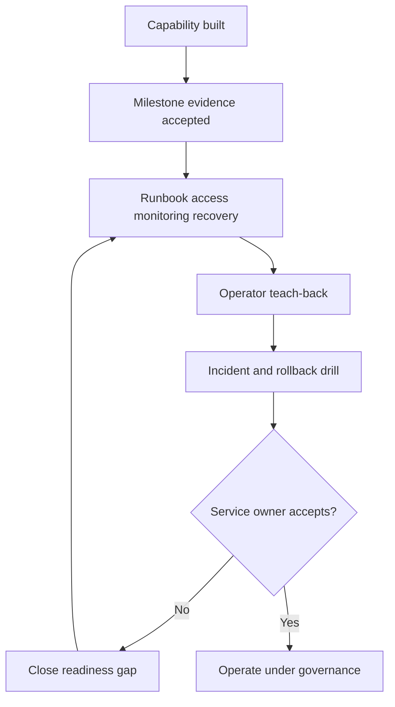

## Cross-template traceability model

| Link | From | To | Why it matters |
|---|---|---|---|
| Business trace | G-T07 service, G-T08 journey | G-T25 outcome | Technical work stays tied to beneficiary and transaction |
| Evidence trace | G-T03 evidence | Every confirmed claim/exit | Statements remain challengeable and current |
| Architecture trace | G-T09 through G-T18 | G-T28 workstream | Dependencies and data contracts become planned work |
| Risk trace | G-T22 through G-T24 | G-T28/G-T29 | Assumptions and dependencies affect dates and decisions |
| Measure trace | G-T25 through G-T27 | G-T37/G-T42 | Health and value use governed definitions |
| Execution trace | G-T28 through G-T36 | G-T43/G-T44 | Milestones, actions and decisions survive handoff |
| Adoption trace | G-T38 through G-T41 | G-T25 outcome | Training is evaluated through behavior and outcome |

### Diagram G21 - Template entity model

```mermaid
erDiagram
    BUSINESS_SERVICE ||--o{ JOURNEY : contains
    JOURNEY ||--o{ OUTCOME : motivates
    OUTCOME ||--o{ METRIC_CONTRACT : measured_by
    OUTCOME ||--o{ WORKSTREAM : delivered_by
    WORKSTREAM ||--o{ MILESTONE : contains
    MILESTONE ||--o{ EXIT_EVIDENCE : accepted_by
    WORKSTREAM ||--o{ RAID_ITEM : constrained_by
    WORKSTREAM ||--o{ ACTION : executed_by
    DECISION ||--o{ ACTION : authorizes
    STAKEHOLDER ||--o{ DECISION : owns
```

## Discovery workshop sequence

| Session | Objective | Templates | Required output | Stop condition |
|---|---|---|---|---|
| 1. Purpose and people | Confirm charter, service, outcomes and decision rights | G-T01, G-T04 to G-T08, G-T25 | Approved scope and stakeholder/business map | No sponsor or no decision owner |
| 2. Technology and data | Map environment, tools, sources, integrations and flows | G-T09 to G-T18 | Evidence-backed current state and unknowns | Unsafe data request or missing source owner |
| 3. Maturity and readiness | Establish current practices, prerequisites and RAID | G-T19 to G-T24 | Evidence-based baseline and blockers | Score has no rubric/evidence |
| 4. Plan and measures | Agree outcomes, KPI, value, workstreams and exits | G-T25 to G-T32 | Approved TSP and pilot gates | Target lacks denominator/guardrail |
| 5. Operate and adopt | Design governance, logs, health, adoption and enablement | G-T33 to G-T41 | Operating/adoption model | No accountable operator |
| 6. Communicate and hand off | Package executive decision and operational acceptance | G-T42 to G-T44 | Readout, handoff and next decision | Residual risk has no owner |

### Diagram G22 - Six-session discovery sequence

```mermaid
flowchart LR
    S1[Purpose people service] --> S2[Technology data flows]
    S2 --> S3[Maturity readiness RAID]
    S3 --> S4[Outcomes plan measures]
    S4 --> S5[Governance adoption operations]
    S5 --> S6[Executive decision handoff]
```

## Quality-review checklists

### Discovery quality

| Check | Pass condition |
|---|---|
| Decision-first | Every major question links to a decision, risk, dependency, or success measure |
| Evidence labels | Confirmed, public, assumption, hypothesis, unknown and synthetic are not mixed |
| Time | Changing facts have an as-of or observed time |
| Ownership | Business, technical, data, privacy, risk and operation owners are distinguished |
| Scope | Included/excluded populations and environments are explicit |
| Privacy | Data purpose, classification, access, retention and minimization are approved |

### Success-plan quality

| Check | Pass condition |
|---|---|
| Outcome | Beneficiary and observable change are named |
| Baseline | Current state, source, scope and confidence exist or are planned |
| Measure | Grain, numerator, denominator, clocks and guardrail are defined |
| Milestones | Entry, exit, evidence and approver exist |
| RAID | Material assumptions and dependencies affect the plan |
| Adoption | Persona behavior and barrier hypotheses are explicit |
| Value | Attribution and uncertainty match evidence |
| Handoff | Operator, runbook, monitoring, recovery and acceptance exist |

### Diagram G23 - Quality gate

```mermaid
flowchart TD
    ART[Draft artifact] --> E{Evidence labels and time?}
    E -->|No| FIX[Repair]
    E -->|Yes| O{Owner decision and scope?}
    O -->|No| FIX
    O -->|Yes| P{Privacy and safety approved?}
    P -->|No| FIX
    P -->|Yes| X{Exit and postcondition testable?}
    X -->|No| FIX
    X -->|Yes| ACCEPT[Submit for acceptance]
    FIX --> ART
```

## Facilitation language library

| Situation | Useful wording | Avoid |
|---|---|---|
| Unknown | "Current evidence does not establish that. Who owns the cheapest safe check?" | Guessing to keep momentum |
| Conflict | "These sources disagree at different grains/as-of times; let us preserve both and reconcile." | Declaring one source truth without rules |
| Product claim | "The 2026-08-24 public page positions this capability; current tenant behavior needs verification." | Promising an undocumented feature |
| Target pressure | "Let us baseline the eligible population and pair the target with a guardrail." | Inventing an industry benchmark |
| Delay | "The original due date remains visible; dependency X changed the forecast to Y." | Quietly moving dates |
| Objection | "Which risk or operating constraint does the objection reveal?" | Labeling stakeholder resistant |
| Value | "Evidence supports contribution with these assumptions; it does not prove sole causation." | Claiming avoided loss as realized savings |
| Handoff | "Who can operate, detect failure, recover, and accept residual limitations?" | Declaring done after configuration |

## Detailed template-completion guidance

The templates are intentionally compact. The guidance below explains the minimum reasoning expected behind the cells. It is general practice, not a Zscaler requirement. When a field does not apply, record `Not applicable` with the reason and reviewer. When evidence is missing, record `Unknown`; do not leave a blank that readers may interpret as complete.

| Template family | How to complete it well | Evidence standard | Review questions | Frequent repair |
|---|---|---|---|---|
| Charter and pre-discovery | Write the business decision in a verb form, such as approve, choose, sequence, accept, pause or fund. Bound environments, populations, time and excluded work. Name the sponsor, working lead and authority limits. Request existing diagrams, policies and reports before asking people to recreate them. | Sponsor or delegated owner confirms purpose, scope, decision rights, dates and handling. Requested artifacts are references with as-of dates, not uncontrolled attachments. | If the engagement ended tomorrow, which decision would remain blocked? Which excluded area could invalidate the answer? Who can change scope and how is the change recorded? | Replace "implement platform" with one business journey, decision and phase exit. Add explicit non-goals and a privacy owner. |
| Stakeholders, personas and RACI | Use roles first and names only in controlled contact records. Distinguish influence from accountability. Ask what evidence a role trusts, where the role works, what constraints it owns, and what decision it cannot make. Assign one Accountable role for each decision while allowing several Responsible roles for execution. | Stakeholders confirm their interests, decision rights, communication and escalation. Policy or delegation supports high-impact authority. | Is the apparent detractor protecting a valid safety, privacy, availability, cost or capacity constraint? Is a committee hiding the absence of one accountable decision owner? | Add the missing business, privacy, operations or service owner. Split risk acceptance from technical implementation responsibility. |
| Business services and journeys | Begin with beneficiary and transaction, then map identity, device, network, application, data, control and support dependencies. Define success as an observable business postcondition and failure as a user/operator symptom. Record criticality source rather than inventing a tier. | Service owner accepts purpose, transaction, criticality, dependencies and impact. A representative journey can be observed safely end to end. | Which dependency is assumed because it is invisible? Does a synthetic probe represent the user transaction? Which downstream process fails when this step fails? | Separate login success from transaction success. Add business calendar, recovery need, data class and dependency confidence. |
| Environment, tool and product inventory | Inventory only the scope needed for the decision. For every product, record its job, authoritative fields, operating owner, tenant/environment, lifecycle and current evidence. Similar capabilities are not duplicates until input, decision point, output and ownership are compared. | Current architecture, configuration inventory, contract/entitlement and owner interviews agree, or conflicts remain explicit. | Is the tool installed, licensed, configured, operating, integrated and adopted, or only one of those? Which system owns a field at which time? | Replace a flat product list with job-to-be-done, scope, source/consumer and authority columns. |
| Data sources, integrations and contracts | Declare one-record grain before fields. Namespace native keys, distinguish event/observed/ingest/effective clocks, and define full, incremental and delete semantics. Include pagination, retries, checkpoints, rate limits, schema versions, classifications, accepted records and reconciliation. | Current source documentation and safe representative samples support the contract; a bounded run demonstrates acceptance, error and recovery paths. | Does green run status prove complete data? Can retry duplicate records? What happens to deletions and late updates? Which fields are source-authoritative versus derived? | Add received/accepted/rejected counts, contiguous watermark, idempotency key, error queue, replay test and source-owner acceptance. |
| Architecture and flows | Number every component and arrow. Label observed, documented, assumed and unknown paths. Include identity, DNS, protocols, control/decision point, data class, telemetry and owner. Pair the diagram with a ledger so labels stay readable and claims remain traceable. | Current documentation plus an authorized observed journey establishes the critical path; unresolved alternatives are shown. | From whose vantage was the path observed? Which control made the decision? What happens during dependency failure, bypass, failover or time skew? | Replace unlabeled arrows and generic clouds with bounded flows, evidence IDs, trust boundaries and failure ownership. |
| Maturity and readiness | Define capability levels before assessment. Score practices, never people. Require observable evidence and confidence. Select a next level only when it serves the outcome; a sophisticated level may be unnecessary. Readiness items must state consequence, owner and approved exception route. | Reviewers can reproduce the level/gate from current artifacts, interviews and tests. Exceptions include compensating controls and authority. | Does the score identify a next decision or merely compare teams? Is `ready` based on configuration or accepted end-to-end evidence? Which unknown blocks the gate? | Replace averages with domain-level evidence. Add a cheap next experiment and explicit not-ready impact. |
| RAID and dependencies | Use grammatical tests: a risk might happen; an issue is happening; an assumption is treated as true for planning; a dependency is an external deliverable or decision. Link each item to affected outcome/milestone, owner, due/review, response and escalation trigger. | The named owner accepts the next action, and material items appear in plan forecasts and executive decisions. | What would disconfirm the assumption? Who provides the dependency and what proves acceptance? What observable trigger converts a risk into an issue? | Reclassify vague items, split compound entries, preserve original dates and add fallback or contingency. |
| Outcomes, KPIs and value | Name beneficiary, observable change and bounded cohort. Define metric grain, numerator, denominator, source, clock, exclusions, unknowns and guardrail before target. Distinguish activity, output, outcome, capacity released, cost avoided, realized saving and modeled avoided loss. | Customer owner accepts outcome; data owner certifies definition; baseline and target method are reproducible; finance validates financial claims. | Could the metric improve while the outcome worsens? Did scope/model change? Which alternative cause explains movement? Is the counterfactual credible? | Add raw counts beside rates, a comparison bridge, attribution confidence and a nonfinancial outcome when finance evidence is weak. |
| TSP, milestones and exit evidence | Make each workstream trace to an outcome. A milestone is a decision-ready state with entry, exit, evidence, approver and dependencies. Include positive, negative, exception, recovery, privacy and operational cases. Preserve baseline and current forecasts. | Approver can reproduce tests, accepts limitations and records a decision. Completion evidence is independent of the team claiming completion where risk warrants it. | If the action were reversed, which evidence would detect it? Does ticket closure prove technical and business postconditions? What failed case is hidden by an aggregate pass? | Replace activity milestones with observable postconditions. Add rollback, open-item age and recurrence monitoring. |
| Governance, logs and health | Give each forum a decision purpose, quorum, pre-read and outputs. Actions use one owner and evidence; decisions retain options, rationale, dissent and revisit triggers. Health domains expose signals, freshness, confidence and action; unknown does not become green. | Meeting records show material decisions and accepted actions. Signal definitions are governed and traceable to sources. | Which meeting can be removed without losing decisions? Is a health score masking one red domain? Are due dates moved without preserving history? | Use delta-based pre-reads, publish component health, preserve original dates and review meeting decision/action yield. |
| Adoption, enablement and handoff | Define eligible persona and meaningful behavior. Diagnose awareness, skill, access, workflow, trust, relevance, capacity and policy barriers before prescribing training. Require safe practice and teach-back. Handoff covers service owner, access, monitoring, normal/abnormal state, change, recovery, support and residual limitations. | Behavior and outcome evidence follows the intervention; operators demonstrate runbook, detection, recovery and escalation without coaching. | Are logins being called adoption? Is lack of use rational because evidence or workflow is poor? Can operators recover at the worst practical time? | Add barrier hypotheses, a control group or comparison where feasible, sampled quality, incident drill and explicit service acceptance. |
| Executive readout and closure | Lead with objective, scope/as-of date and decision. Show changed evidence, numerator/denominator, uncertainty, guardrail, options, recommendation, owner/date and next horizon. Preserve a drill-down to technical records. Closure lists achieved, not achieved and unknown outcomes plus residual risk and operational ownership. | Accountable executive makes or explicitly defers the decision. Operators accept service; risk owner accepts residual state; evidence archive and retention are approved. | What is the one decision? Which sentence overstates causation? What remains unknown after the phase? Which next option is actually reversible? | Remove activity slides, add uncertainty and decision wording, and separate stabilization, expansion, redesign and stop options. |

## Facilitation case patterns

| Situation | Facilitator move | Example prompt | Artifact consequence | Why it works |
|---|---|---|---|---|
| Participants disagree on scope | Put both definitions on screen with populations, inclusions, exclusions and owner; ask which decision each supports | "Does active mean enrolled, observed in 30 days, or customer-approved production? Which denominator does the outcome require?" | Update charter, inventory and metric contract; retain both source-native definitions | Converts opinion into testable semantics without forcing false consensus |
| A technical team says a dependency is obvious | Ask for one end-to-end journey and a failure case; label each arrow by evidence state | "What evidence proves this DNS, identity or connector step for the affected cohort at the incident time?" | Add flow/evidence IDs and an assumption-validation action | Exposes hidden architecture without demanding a complete enterprise map |
| A sponsor asks for a target immediately | State the decision value of a target, then request eligible population, baseline, capacity and guardrail | "Which behavior should change, and what would stop us gaming that number?" | KPI remains draft until baseline; target method and owner are recorded | Preserves momentum while avoiding an invented benchmark |
| A product capability is debated | Split the statement into public positioning, current documentation, entitlement, configuration and observed behavior | "Which layer of the claim is supported today, and who owns the next verification source?" | Add claim ledger and bounded pilot check | Prevents both overclaiming and unproductive dismissal |
| A stakeholder objects to data collection | Treat the objection as a design requirement; ask purpose, minimum fields, alternatives and deletion | "Which decision requires this field, and can aggregate or generated data answer it instead?" | Reduce field set, add privacy approval and retention/deletion evidence | Builds trust and often improves the model |
| Teams argue about the source of truth | Move to field-level authority, scope, time and conflict behavior | "Which source is authoritative for owner as of which effective date, and what should happen when it is stale?" | Add source contract, survivorship rule and conflict queue | Replaces an impossible global truth label with governable decisions |
| A milestone is reported complete | Ask the independent reviewer to restate the postcondition and show failure/exception evidence | "What could still be broken even though configuration and ticket status are complete?" | Keep milestone open, accept with limit, or close with evidence | Stops status pressure from replacing customer acceptance |
| Adoption is low | Interview a small persona sample and compare awareness, skill, access, trust, workflow and capacity hypotheses | "If training were perfect tomorrow, what would still stop the meaningful behavior?" | Update barrier log and test one targeted intervention | Avoids defaulting every adoption issue to more training |
| An executive wants a green health score | Show component states and unknowns, then connect each to action | "Which amber or unknown would change the decision even if the aggregate were green?" | Preserve domain states; document any override and its owner | Makes health useful for attention rather than reassurance |
| A dependency slips | Preserve original date, update forecast, state consequence and compare fallback | "What decision or deliverable is late, what does it block, and when does escalation become cheaper than waiting?" | Update dependency, RAID, milestone and decision logs together | Creates accountability without blame or hidden schedule edits |
| Evidence contradicts the value story | Lead with the contradiction and propose options | "The headline improved but the guardrail worsened. Should we pause, repair measurement, or change the intervention?" | Update value confidence, decision log and executive readout | Protects credibility and catches harmful optimization |
| Phase is ending with open unknowns | Separate operational acceptance, residual risk and next-horizon investment | "Which unknown can operations own, which needs risk acceptance, and which blocks closure?" | Complete handoff/closure record with explicit not-achieved items | Allows honest closure without erasing uncertainty |

## Artifact acceptance examples

| Artifact | Minimum acceptable evidence | Evidence that is not enough | Rejection wording |
|---|---|---|---|
| Stakeholder map | Decision rights confirmed by relevant roles and escalation path tested or reviewed | Names copied from an organization chart | "Contacts are listed, but decision authority and evidence needs remain unconfirmed." |
| Architecture map | Numbered flows, trust/control points, owners, evidence state and at least one representative observed journey | Vendor diagram with customer labels | "The conceptual diagram is useful, but current customer paths and failure ownership remain assumptions." |
| Source contract | Grain, key/scope, clocks, direction/object/version, auth, incremental/delete, quality, error/recovery and owner acceptance | Successful authentication or connector status | "Connectivity passed; completeness, semantics, deletion and recovery are not yet accepted." |
| Maturity baseline | Locally defined rubric, current evidence, confidence, gap and next experiment | Average self-rating | "The rating lacks observable exit criteria and does not yet support a roadmap decision." |
| KPI | Decision, grain, numerator, denominator, scope, clocks, source, uncertainty, guardrail and target method | Dashboard label and percentage | "The value is visible, but the population and anti-gaming control are not defined." |
| Milestone | Entry/exit, positive/negative/exception/recovery tests, evidence, approver and known limits | Completed task checklist | "Activities are complete; the customer postcondition and recovery evidence remain open." |
| Adoption result | Eligible population, meaningful behavior, quality/outcome evidence and privacy guardrail | Login or attendance count | "Activation is measured; sustained useful behavior and outcome are not established." |
| Value claim | Comparable baseline, outcome, attribution method, alternatives, uncertainty and customer/finance validation | Gross hours multiplied by loaded rate | "The estimate may indicate capacity, but it is not validated realized savings." |
| Operational handoff | Named owner/operator, runbook, least privilege, monitoring, incident/change/rollback, known limits, training and drill | Document repository link | "Documentation exists; operational competence and recovery acceptance are not demonstrated." |
| Executive closure | Achieved/not achieved/unknown outcomes, residual risks, decisions, owners, evidence archive and next options | A green project status | "Delivery status is clear, but outcome, residual-risk and operating-owner acceptance are missing." |

### Plain-English deep-dive 3 - A success plan is a chain of promises with receipts

The business promises a decision and resources. Technical teams promise artifacts and controls. Owners promise actions. The TSM promises coordination and clarity. Exit evidence is the receipt showing which promise was met. If a milestone says only "connector configured," it has no receipt for useful data, reconciled identity, operational recovery, adoption, or customer outcome.

### Diagram G24 - Success-plan control loop

```mermaid
flowchart LR
    PLAN[Approved outcome and plan] --> DO[Execute milestone]
    DO --> CHECK[Validate exit and guardrail]
    CHECK --> LEARN[Review evidence assumptions risks]
    LEARN --> DECIDE[Continue correct pause or stop]
    DECIDE --> PLAN
```

### Plain-English deep-dive 4 - Health is a prompt for action, not a grade

An account can be technically healthy but failing to realize value, or highly adopted while carrying serious governance risk. A red/amber/green synthesis should always drill to current signals, confidence, owner, and action. Unknown should remain unknown. Never use health scoring to conceal disagreement or pressure individuals; use it to route attention and decisions.

### Diagram G25 - Executive and operator views

```mermaid
flowchart TD
    E[Executive: objective risk decision value] --> P[Program: milestones health RAID adoption]
    P --> O[Operations: queues runs incidents actions]
    O --> R[Record: source evidence clocks configuration]
    R --> O
    O --> P
    P --> E
```

### Diagram G26 - Phase closure and next horizon

```mermaid
flowchart LR
    BASE[Original outcome baseline] --> EVID[Accepted phase evidence]
    EVID --> GAP[Residual gaps risks unknowns]
    GAP --> OPT[Stabilize expand change or stop]
    OPT --> DEC[Accountable decision]
    DEC --> HAND[Operational handoff]
    DEC --> NEXT[Next-horizon success plan]
```

## Interview-ready explanations

| Question | Concise model answer |
|---|---|
| How do you run enterprise discovery? | I start with business services, journeys, decisions and stakeholders, then map environments, tools, data, architecture, operations and evidence. I label assumptions and unknowns, protect sensitive data, and convert findings into an owned success plan. |
| What makes a technical success plan useful? | Traceability: outcome to workstream to milestone to exit evidence, with owner, dependency, RAID, metric, guardrail, governance, adoption and handoff. It is a decision system, not a task list. |
| How do you set KPIs? | I define grain, eligible population, numerator, denominator, units, clocks, source, exclusions, interpretation, Goodhart risk and guardrail before jointly setting a target from baseline, capacity and risk tolerance. |
| How do you assess maturity? | I use a locally defined evidence rubric and observable practices. The score matters only if it identifies a decision-relevant gap and a small next capability with exit evidence. |
| How do you handle conflicting stakeholders? | I separate interests, decision rights and evidence needs, record dissent, and frame options/tradeoffs for the accountable owner. I do not treat objections as resistance by default. |
| How do you drive adoption? | I define an eligible persona and meaningful behavior, diagnose awareness/skill/access/workflow/trust/capacity barriers, test a focused intervention, and measure behavior plus outcome and privacy guardrails. |
| How do you communicate value? | I show baseline, observable outcome, contribution mechanism, other causes, uncertainty and validation. I distinguish activity, output, capacity released, realized savings and avoided-loss scenarios. |
| Are these Zscaler templates? | No. They are vendor-neutral study templates. Current official documentation, contracts, tenant evidence and customer governance control real Zscaler work. |

## Source and honesty boundaries

| Boundary | This appendix supports | It does not establish |
|---|---|---|
| General practice | Repeatable discovery, planning, governance and handoff structures | Mandatory Zscaler/customer process or universal maturity model |
| Public context | Product verification discipline tied to 2026-08-24 | Current entitlement, field, formula, SLA or behavior |
| Synthetic NMH | Worked examples and safe practice | Customer fact, result, case study or prediction |
| Candidate use | Interview artifacts and transferable support/analytics reasoning | Production Zscaler administration experience |
| Customer use | Fillable starting point under approved governance | Replacement for policy, contract, legal/privacy review or risk owner |

## Completion checklist

- [x] Exactly one H1 uses the master-linked Appendix G title.
- [x] Forty-four distinct numbered templates/checklists are included, each with instructions, a blank copy, and a clearly labeled fictional NMH worked sample.
- [x] Pre-discovery, stakeholders/personas/RACI, business services/journeys, environment/tool/data/integration inventories, architecture, traffic/data flows, source contracts, mappings, quality, maturity, readiness, RAID, outcomes/KPIs/value, TSP, milestones/exits, 30/60/90, onboarding, governance, action/decision logs, health, adoption, workshops/training, executive readout, and handoffs are covered.
- [x] Twenty-six numbered Mermaid diagrams and more than fifteen tables are included.
- [x] Four Plain-English deep-dives explain discovery, RAID, success plans, and health.
- [x] Public/general/synthetic boundaries, privacy safeguards, valid Part/appendix links, and the exact 2026-08-24 currency date are explicit.
- [x] No Zscaler internal field, formula, benchmark, entitlement, SLA, or guaranteed outcome is invented.
- [x] Content is ASCII with balanced fences and exact navigation to the master, Appendix F, and Appendix H.

[Back to the master study guide](../Zscaler%20SecOps%20Technical%20Success%20Manager%20-%20Complete%20Study%20Guide.md) | [Previous appendix: Zscaler Product and Portfolio Comparison Matrix](Appendix-F-zscaler-product-matrix.md) | [Next appendix: Risk Register, Mitigation, and Decision Templates](Appendix-H-risk-mitigation-decision-templates.md)