# Appendix H - Risk Register, Mitigation, and Decision Templates

> **Purpose:** Provide a source-neutral workbook for turning evidence into findings, exposures, risk scenarios, control and treatment decisions, validated postconditions, residual-risk statements, escalation, remediation campaigns, and executive communication. The goal is decision quality, not numerical theater.
>
> **Currency and source note:** General security-risk, control, exposure, governance, quantitative-analysis, and customer-success practices were reviewed on **2026-08-24**. Standards, threat evidence, product behavior, fields, models, contracts, regulations, and organizational risk methods change. Current authoritative sources, customer policy, approved risk method, legal/privacy guidance, licensed documentation, and accountable risk owners govern production.
>
> **Official/general/synthetic boundary:** Nothing below is a Zscaler Risk360, UVM, AEM, CTEM, Data Fabric, or Agentic SecOps field, factor, formula, score, threshold, workflow, SLA, benchmark, or output. Northstar Meridian Holdings (NMH), every scenario, asset, value, probability, date, control, score, path, target, decision, and outcome is fictional and synthetic. Formula examples teach assumptions and sensitivity; they do not predict loss or guarantee treatment effectiveness.
>
> **Safety and privacy:** Do not include secrets, exploitable production details, unnecessary personal data, raw regulated content, or unapproved attack instructions in risk artifacts. Restrict technical path details to authorized roles. Use safe validation, change control, rollback, evidence minimization, segregation of duties, and accountable human decisions. Risk acceptance belongs to the authorized customer risk owner, not a TSM, tool, score, or AI agent.

[Back to the master study guide](../Zscaler%20SecOps%20Technical%20Success%20Manager%20-%20Complete%20Study%20Guide.md) | [Previous appendix: Discovery, Assessment, and Success-Plan Templates](Appendix-G-discovery-success-plan-templates.md) | [Next planned appendix: QBR, EBR, Executive Deck, and Training Templates](Appendix-I-qbr-executive-training-templates.md)

## Evidence-to-decision rules

| Rule | Required behavior | Failure prevented |
|---|---|---|
| Separate records | Evidence, observation, finding, exposure, scenario, control, action and decision get distinct IDs | One scanner row being called enterprise risk |
| State grain | Define what one record represents | Counts and joins that mix assets, findings and scenarios |
| Preserve source and time | Record source-native meaning, vantage, observed/as-of time and provenance | Stale evidence presented as current truth |
| Write conditional scenarios | Use cause/event/asset/business impact language | Vague labels such as "critical vulnerability risk" |
| Name objective and control | Explain what must remain true and how control supports it | Tool presence confused with control effectiveness |
| Expose uncertainty | Show unknowns, ranges, confidence rubric and sensitivity | Decorative decimals and false certainty |
| Compare options | Include avoid, mitigate, transfer/share, accept and defer with tradeoffs as applicable | First solution becoming automatic decision |
| Assign authority | One accountable risk/decision owner; action owners are distinct | TSM or operator accepting business risk |
| Validate independently | Define observable postcondition before treatment | Ticket closure treated as risk reduction |
| Reassess residual risk | Use current evidence and approved method after treatment | Inherent score mechanically reduced without proof |

### Diagram H01 - Evidence-to-risk chain

```mermaid
flowchart LR
    E[Evidence] --> O[Observation]
    O --> F[Finding]
    F --> X[Exposure or attack path]
    X --> S[Risk scenario]
    S --> OBJ[Security and business objective]
    OBJ --> C[Current controls]
    C --> OPT[Treatment options]
    OPT --> D[Accountable decision]
    D --> A[Authorized action]
    A --> V[Independent validation]
    V --> R[Residual-risk decision]
```

### Plain-English deep-dive 1 - Finding, exposure, and risk are different

A finding says evidence does not meet a rule or expected state. An exposure says conditions may allow an unwanted path or outcome. A risk scenario says an uncertain event could affect an objective and cause business impact. A missing endpoint control is a finding; a reachable unmanaged device connected to a critical service may be an exposure; disruption or data compromise through that path is the scenario. Keeping them separate prevents severity labels from bypassing reasoning.

## Template H-T01 - Evidence record

**Use:** Register the minimum evidence needed to support or challenge a claim. Hash/reference controlled artifacts rather than duplicating sensitive payloads.

| Evidence ID | Source/vantage | Native object/grain | Observed/event/as-of time | Collected by/authority | Integrity/reference | Classification/access | Supports/refutes | Limit/conflict | Retention/review |
|---|---|---|---|---|---|---|---|---|---|
|  |  |  |  |  |  |  |  |  |  |

## Template H-T02 - Observation record

**Use:** State only what was observed, where, when, and under which method. Do not add impact or cause before evidence supports it.

| Observation ID | Evidence links | Entity/scope | Exact observed state | Expected/comparison state | Method/vantage | Time | Reproducibility | Confidence | Unknowns |
|---|---|---|---|---|---|---|---|---|---|
|  |  |  |  |  |  |  |  |  |  |

## Template H-T03 - Finding record

**Use:** Compare an observation with a named requirement, baseline, policy, or expected state. Record status and disposition independently of remediation work.

| Finding ID | Observation/evidence | Asset/entity grain | Requirement/baseline | Gap statement | Source severity | First/current observed | Status | Owner | False-result/exception path | Provenance |
|---|---|---|---|---|---|---|---|---|---|---|
|  |  |  |  |  |  |  |  |  |  |  |

## Template H-T04 - Exposure record

**Use:** Connect a weakness or condition to reachability, threat, business context, controls, and confidence. State whether each relationship is observed, asserted, inferred, or validated.

| Exposure ID | Findings/conditions | Entry/actor | Path/reachability | Target/objective | Threat evidence | Business context | Existing controls | Validation state | Confidence/unknown | Owner |
|---|---|---|---|---|---|---|---|---|---|---|
|  |  |  |  |  |  |  |  |  |  |  |

### Diagram H02 - Record separation

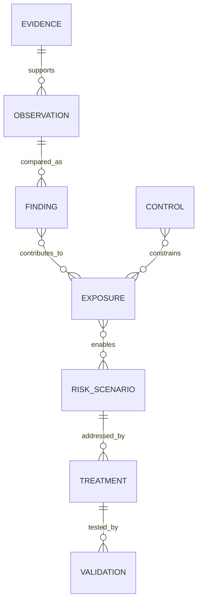

## Template H-T05 - Risk scenario statement

**Use:** Write: "Because [condition/cause], [threat/event] may affect [asset/service/objective], leading to [business impact], under [scope/time]." Include alternate scenarios and evidence confidence.

| Scenario ID | Because: condition/cause | Threat/event | May affect asset/service/objective | Leading to business impact | Scope/horizon | Evidence links | Assumptions/alternatives | Owner | Review trigger |
|---|---|---|---|---|---|---|---|---|---|---|
|  |  |  |  |  |  |  |  |  |  |

## Template H-T06 - Security and business objective

**Use:** Name what must be protected or sustained and who owns it. Objectives are more stable than findings and help compare treatments.

| Objective ID | Business service | Objective statement | Stakeholders/beneficiaries | Critical transaction/data | Tolerance/appetite source | Failure consequence | Accountable owner | Evidence/as-of |
|---|---|---|---|---|---|---|---|---|
|  |  |  |  |  |  |  |  |  |

## Template H-T07 - Threat event and actor hypothesis

**Use:** State capability, opportunity, intent/relevance, event sequence, evidence, and alternatives. Do not claim actor attribution from weak telemetry.

| Threat hypothesis ID | Scenario link | Actor/category if supportable | Capability/opportunity | Event sequence | Current evidence | Contrary evidence | Unknowns | Confidence rubric | Collection/decision need |
|---|---|---|---|---|---|---|---|---|---|
|  |  |  |  |  |  |  |  |  |  |

## Template H-T08 - Impact profile

**Use:** Decompose impact into operational, safety, confidentiality, integrity, availability, financial, legal/regulatory, customer, and reputation effects. Avoid summing incomparable categories.

| Scenario | Impact category | Affected service/population | Range/band | Duration | Basis/source | Dependencies | Recoverability | Confidence | Decision relevance |
|---|---|---|---|---|---|---|---|---|---|
|  |  |  |  |  |  |  |  |  |  |

### Diagram H03 - Scenario grammar

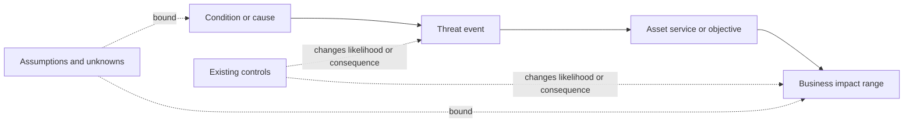

## Template H-T09 - Control record

**Use:** Describe the objective, mechanism, type, scope, owner, implementation, evidence, dependencies, failure modes, and test. A product is not itself a complete control statement.

| Control ID/name | Objective | Prevent/detect/correct/recover | Mechanism | Scope/population | Owner/operator | Implementation state | Dependencies | Evidence/freshness | Failure modes | Test method |
|---|---|---|---|---|---|---|---|---|---|---|---|
|  |  |  |  |  |  |  |  |  |  |  |

## Template H-T10 - Control design assessment

**Use:** Ask whether the designed mechanism would address the scenario if implemented correctly. Keep design adequacy separate from implementation and operation.

| Control/scenario | Intended mechanism | Coverage assumptions | Design criteria | Gaps/bypasses | Dependency assumptions | Design verdict | Evidence | Confidence | Improvement option |
|---|---|---|---|---|---|---|---|---|---|
|  |  |  |  |  |  |  |  |  |  |

## Template H-T11 - Control implementation and operating test

**Use:** Define sample/frame, test procedure, expected postcondition, actual result, exception, and retest. Installation is not effectiveness.

| Test ID | Control/scope | Population/sample | Procedure | Expected postcondition | Actual result | Exceptions/unknowns | Test time/evidence | Tester independence | Verdict/retest |
|---|---|---|---|---|---|---|---|---|---|
|  |  |  |  |  |  |  |  |  |  |

### Diagram H04 - Control effectiveness dimensions

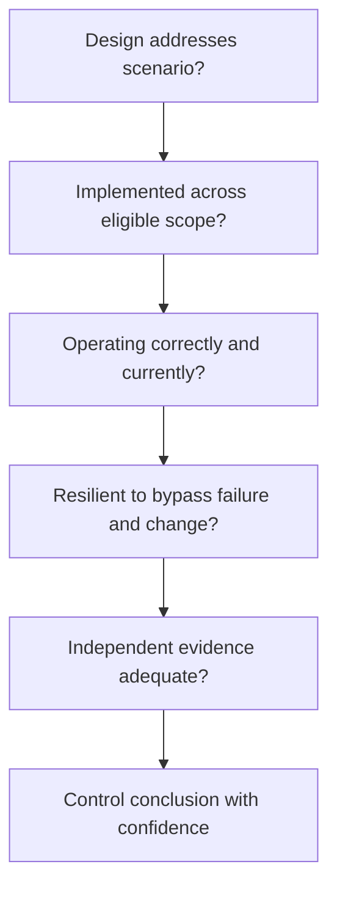

## Template H-T12 - Evidence confidence rubric

**Use:** Define confidence by provenance, directness, recency, completeness, agreement, reproducibility, and independence. Do not convert a rubric score into probability unless calibrated.

| Confidence level | Provenance/directness | Recency/scope | Corroboration/reproducibility | Suitable statement | Required next step |
|---|---|---|---|---|---|
| High | Authoritative/direct and traceable | Current and representative | Independently corroborated/reproducible | Strongly supported within stated scope | Monitor change and expiry |
| Medium | Credible but indirect/partial | Current for part of scope | Some corroboration | Directionally supported; decision with caveat | Target highest-impact gap |
| Low | Weak/unclear provenance | Stale, narrow or unknown | Conflicting or not reproducible | Hypothesis only | Collect discriminating evidence |
| Unknown | No adequate evidence | Unknown | None | Cannot conclude | Name owner/date or constrain decision |

## Template H-T13 - Scoring assumptions register

**Use:** Document every scale, factor, weight, threshold, normalization, correlation, missing-value rule, version, and decision purpose. This applies to qualitative and quantitative methods.

| Assumption ID | Model/decision | Assumption/rule | Basis | Range/alternative | Sensitivity | Missing-value treatment | Owner | Version/effective date | Validation/review |
|---|---|---|---|---|---|---|---|---|---|
|  |  |  |  |  |  |  |  |  |  |

## Template H-T14 - Qualitative likelihood-impact matrix

**Use:** Customer governance defines labels and boundaries. Use the matrix as a conversation aid, not arithmetic truth. Similar colors do not prove equal risk.

| Likelihood \ Impact | Minor | Moderate | Major | Severe |
|---|---|---|---|---|
| Unlikely | Low | Low | Medium | Medium |
| Possible | Low | Medium | High | High |
| Likely | Medium | High | High | Critical |
| Near-certain | Medium | High | Critical | Critical |

Record definitions separately:

| Label | Customer-approved definition | Evidence horizon/source | Boundary examples | Owner/version |
|---|---|---|---|---|
| Likelihood band |  |  |  |  |
| Impact band |  |  |  |  |
| Result band |  |  |  |  |

### Diagram H05 - Qualitative assessment

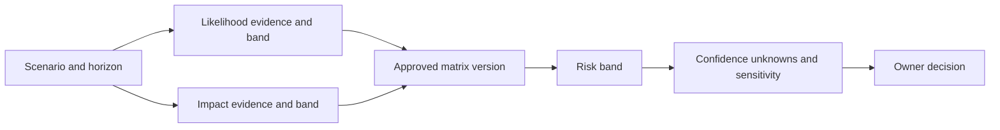

### Plain-English deep-dive 2 - Risk matrices are maps, not rulers

A map groups areas so people can navigate; it does not measure every meter precisely. Qualitative matrices help route scenarios, but "High" is an ordered category, not a number you can safely average or subtract. Two High scenarios may have very different impacts, urgency, evidence, or treatment options. Always retain the scenario and drivers behind the color.

## Template H-T15 - Quantitative scenario input sheet

**Use:** Use ranges/distributions where possible. Separate frequency, event loss components, control assumptions, correlation, time horizon, currency, and model uncertainty. Obtain finance/risk-method approval.

| Input ID | Scenario | Variable/unit | Low/base/high or distribution | Basis/source | Time horizon | Correlation/dependency | Control assumption | Confidence | Sensitivity rank | Owner |
|---|---|---|---|---|---|---|---|---|---|---|
|  |  |  |  |  |  |  |  |  |  |  |

## Template H-T16 - Quantitative calculation and sensitivity sheet

**Use:** State formula, units, ranges, method, samples if simulated, validation, and decision. Never hide uncertainty behind decimal places.

| Model ID/version | Purpose | Formula/method | Inputs/units | Output range/percentiles | Key sensitivity | Validation/backtest | Limitations | Approved use | Reviewer |
|---|---|---|---|---|---|---|---|---|---|
|  |  |  |  |  |  |  |  |  |  |

## Template H-T17 - Risk register

**Use:** Keep one row per scenario assessment, not per raw finding. Link evidence, controls, current assessment, response, owner, due/review, and residual decision.

| Risk ID | Scenario/objective | Evidence/exposures | Inherent assessment | Controls/effectiveness | Current/residual assessment | Response | Risk owner | Action owner | Due/review | Status | Decision link |
|---|---|---|---|---|---|---|---|---|---|---|---|
|  |  |  |  |  |  |  |  |  |  |  |  |

### Diagram H06 - Quantitative honesty

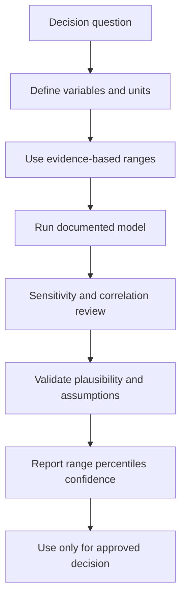

## Template H-T18 - Treatment option comparison

**Use:** Compare avoid, mitigate, transfer/share, accept, defer, or combinations. Include time-to-effect, cost range, operational impact, dependencies, reversibility, evidence and residual uncertainty.

| Option ID/type | Description | Scenario mechanism addressed | Expected effect/range | Time to effect | Cost/capacity | Business/operational impact | Dependencies | Reversibility | Evidence/confidence | Residual concerns |
|---|---|---|---|---|---|---|---|---|---|---|
|  |  |  |  |  |  |  |  |  |  |  |

## Template H-T19 - Mitigation plan

**Use:** Turn the selected option into actions with owners, milestones, dependencies, change controls, rollback, postconditions, guardrails and reporting.

| Plan ID | Risk/decision link | Action/milestone | Accountable owner | Responsible teams | Original/current due | Dependency | Change/rollback | Exit evidence | Guardrail | Status/reason |
|---|---|---|---|---|---|---|---|---|---|---|
|  |  |  |  |  |  |  |  |  |  |  |

## Template H-T20 - Risk ownership and RACI

**Use:** Distinguish risk owner, control owner, treatment/action owner, evidence owner, validator, decision authority, and informed stakeholders.

| Risk/decision | Risk owner | Control owner | Action owner | Evidence owner | Independent validator | Decision/acceptance authority | Consulted | Informed | Authority limit |
|---|---|---|---|---|---|---|---|---|---|
|  |  |  |  |  |  |  |  |  |  |

### Diagram H07 - Treatment selection

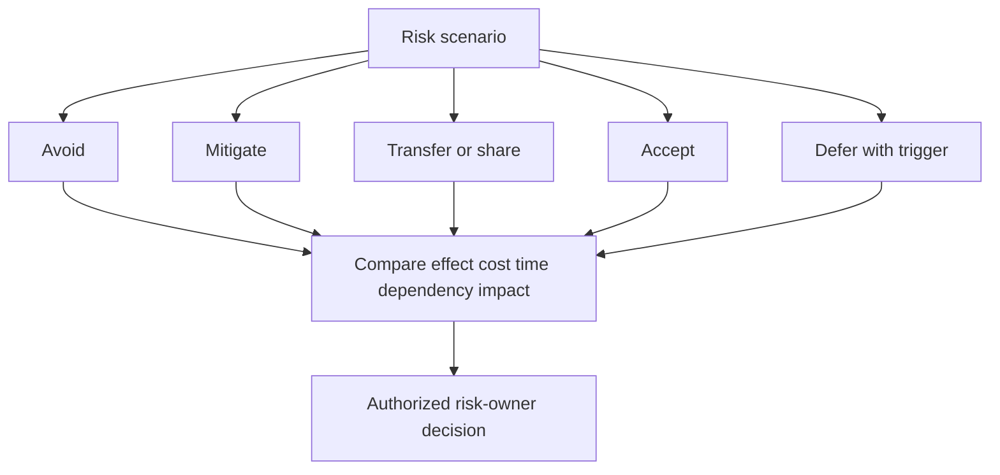

## Template H-T21 - SLA, urgency, and due-date rationale

**Use:** Derive response milestones from scenario severity, exploit/threat evidence, exposure, business windows, dependency lead times, capacity and policy. Preserve original dates and exception history.

| Work/risk ID | Priority rationale | Policy/SLA source | Start clock | Milestones/due | Stop/pause rules | Dependency lead time | Business/change window | Breach trigger | Original/current due | Approver |
|---|---|---|---|---|---|---|---|---|---|---|
|  |  |  |  |  |  |  |  |  |  |  |

## Template H-T22 - Treatment dependency contract

**Use:** Specify provider, deliverable, consumer, acceptance, date, fallback and escalation. A dependency is not an excuse; it is managed work.

| Dependency ID | Treatment link | Provider | Consumer | Deliverable/decision | Needed by | Acceptance evidence | Lead time | Fallback/contingency | Escalation trigger/owner | Status |
|---|---|---|---|---|---|---|---|---|---|---|---|
|  |  |  |  |  |  |  |  |  |  |  |

## Template H-T23 - Exception request

**Use:** Request a time-bound deviation from policy/control. State scope, reason, risk, alternatives, compensating controls, monitoring, owner, expiry, validation and revocation.

| Exception ID | Requirement | Exact scope | Reason/constraint | Linked risk | Alternatives considered | Compensating controls/evidence | Monitoring/trigger | Owner | Start/expiry | Approver | Revocation/closure |
|---|---|---|---|---|---|---|---|---|---|---|---|
|  |  |  |  |  |  |  |  |  |  |  |  |

## Template H-T24 - Risk acceptance record

**Use:** Acceptance is a deliberate owner decision to retain a bounded residual scenario for a period. Include authority, rationale, assumptions, impact range, controls, alternatives, expiry and triggers.

| Acceptance ID | Risk/residual assessment | Scope/horizon | Basis and uncertainty | Controls/monitoring | Alternatives rejected and why | Conditions/triggers | Accountable acceptor/authority | Effective/expiry | Review cadence | Evidence/decision link |
|---|---|---|---|---|---|---|---|---|---|---|---|
|  |  |  |  |  |  |  |  |  |  |  |

### Diagram H08 - Exception lifecycle

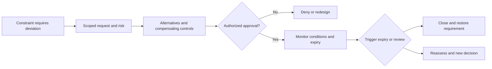

## Template H-T25 - Validation and retest plan

**Use:** Define the postcondition before implementation. Include positive/negative/exception/recovery tests, scope, safety, evidence, independence and fallback.

| Validation ID | Treatment/control | Claim/postcondition | Scope/sample | Procedure | Positive/negative/exception/recovery | Safety/authorization | Evidence | Validator | Pass/fail/unknown rule | Retest/rollback |
|---|---|---|---|---|---|---|---|---|---|---|---|
|  |  |  |  |  |  |  |  |  |  |  |

## Template H-T26 - Residual-risk reassessment

**Use:** Reassess using post-treatment evidence and the approved method. Do not subtract a mitigation score from an inherent score. State what changed, what did not, and confidence.

| Risk ID | Pre-treatment scenario/assessment | Treatment completed | Validation evidence | Changed likelihood drivers | Changed impact drivers | Remaining exposure/control gaps | Residual assessment | Confidence/unknowns | Owner decision | Next review/trigger |
|---|---|---|---|---|---|---|---|---|---|---|
|  |  |  |  |  |  |  |  |  |  |  |

## Template H-T27 - Closure and recurrence record

**Use:** Close only when the defined postcondition and decision are satisfied. Preserve recurrence/reopen criteria and monitoring window.

| Closure ID | Finding/exposure/risk/work link | Closure basis | Validation/postcondition | Residual disposition | Accepted by/date | Monitoring window | Recurrence identity rule | Reopen trigger | Evidence retention | Lessons |
|---|---|---|---|---|---|---|---|---|---|---|
|  |  |  |  |  |  |  |  |  |  |  |

### Diagram H09 - Validation before closure

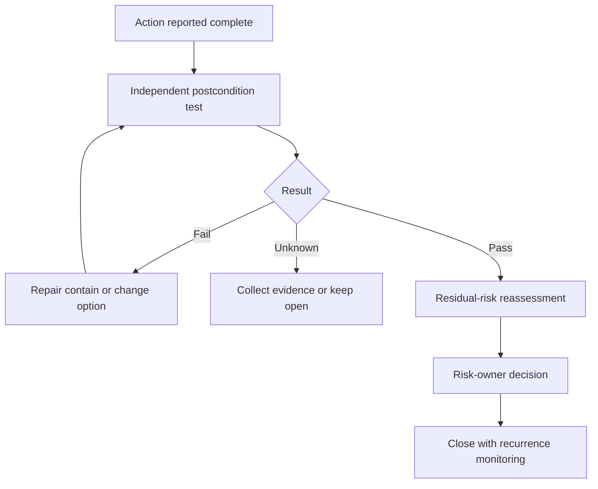

## Template H-T28 - Architecture decision record (ADR)

**Use:** Record the technical/risk decision, options, criteria, evidence, assumptions, dissent, consequences, controls and revisit trigger.

| ADR ID/date | Decision question/context | Options | Criteria | Selected decision | Accountable decider | Evidence/assumptions | Tradeoffs/dissent | Consequences/actions | Controls/validation | Revisit trigger |
|---|---|---|---|---|---|---|---|---|---|---|---|
|  |  |  |  |  |  |  |  |  |  |  |

## Template H-T29 - Escalation record

**Use:** Escalate when predefined risk, SLA, safety, authority, dependency, or executive triggers fire. State the decision needed, not just urgency.

| Escalation ID | Trigger/time | Scenario/customer impact | Scope/current state | Evidence/confidence | Actions taken | Blocker/authority gap | Decision needed/options | Decision owner/deadline | Communication cadence | Exit criteria |
|---|---|---|---|---|---|---|---|---|---|---|
|  |  |  |  |  |  |  |  |  |  |  |

## Template H-T30 - Board/executive risk card

**Use:** Translate one material scenario into objective, evidence, trend, range, uncertainty, treatment choices, accountable decision and next checkpoint. Technical detail remains linked, not hidden.

| Executive field | Fillable content |
|---|---|
| Objective and bounded scenario |  |
| What changed and as-of date |  |
| Current exposure/control evidence |  |
| Impact/loss range and assumptions |  |
| Confidence and unknowns |  |
| Treatment status/options/tradeoffs |  |
| Decision requested, owner and date |  |
| Residual risk and validation plan |  |
| Next trigger/checkpoint |  |

### Diagram H10 - Decision and escalation path

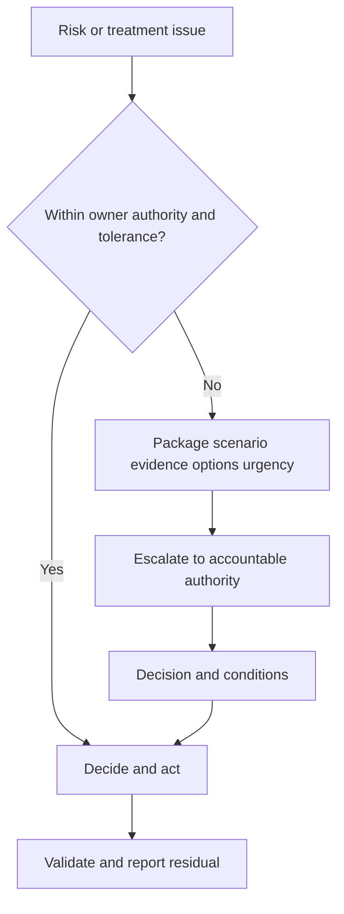

## Template H-T31 - Attack-path record

**Use:** Record nodes, typed edges, evidence/time/confidence, preconditions, control points, business target, validation authority, and path identity. Restrict sensitive detail.

| Path ID | Entry condition/node | Ordered nodes/typed edges | Target/objective | Preconditions | Evidence/time per edge | Confidence | Current controls/choke points | Safe validation state | Owner | Sensitive-detail location |
|---|---|---|---|---|---|---|---|---|---|---|
|  |  |  |  |  |  |  |  |  |  |  |

## Template H-T32 - Choke-point/control intervention analysis

**Use:** Compare where a path can be interrupted. Include coverage, bypass, operational impact, dependency, test, reversibility, and residual paths.

| Intervention ID | Path(s)/stage | Control/change | Mechanism | Path coverage | Bypass/failure | Business impact | Dependency/cost | Reversible? | Validation | Residual paths/confidence |
|---|---|---|---|---|---|---|---|---|---|---|
|  |  |  |  |  |  |  |  |  |  |  |

### Diagram H11 - Attack path and choke points

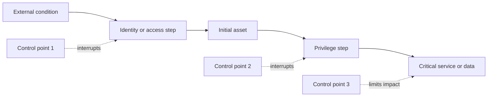

## Template H-T33 - Remediation campaign charter

**Use:** Group comparable exposure work under a fixed baseline and decision. Define scope, selection, owners, waves, capacity, exception, validation, metrics and change bridge.

| Campaign ID | Scenario/outcome | Baseline scope/as-of | Selection/prioritization | Cohorts/waves | Owners/capacity | Milestones | Exceptions/dependencies | Validation | Measures/guardrails | Governance/end condition |
|---|---|---|---|---|---|---|---|---|---|---|
|  |  |  |  |  |  |  |  |  |  |  |

## Template H-T34 - Campaign backlog item

**Use:** One actionable unit linked to asset/service, exposure, owner, due logic, dependency, change, validation and residual decision.

| Item ID | Campaign | Asset/service/exposure | Priority rationale | Owner | Due/SLA source | Dependency | Planned action/change | Rollback | Validation postcondition | Status | Exception/residual link |
|---|---|---|---|---|---|---|---|---|---|---|---|
|  |  |  |  |  |  |  |  |  |  |  |  |

## Template H-T35 - CTEM mobilization plan

**Use:** Convert prioritized/validated exposure into accepted work across security, IT and business teams. Include stage evidence, campaign, decision, owner, action, dependency, communication and validation.

| Mobilization ID | CTEM scope/cycle | Exposure/validation | Treatment decision | Campaign/work items | Accountable risk owner | Action owners | Dependencies/windows | Communication/escalation | Postcondition | Feedback to next cycle |
|---|---|---|---|---|---|---|---|---|---|---|
|  |  |  |  |  |  |  |  |  |  |  |

### Diagram H12 - CTEM mobilization

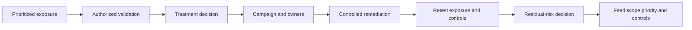

## Template H-T36 - Risk-to-executive translation ledger

**Use:** Preserve technical truth while changing vocabulary for operator, program, executive and board audiences. Record what is omitted and where details remain available.

| Risk ID | Technical statement | Operator action | Program implication | Executive translation | Board-level objective/decision | Uncertainty sentence | Prohibited overclaim | Detail link/reviewer |
|---|---|---|---|---|---|---|---|---|
|  |  |  |  |  |  |  |  |  |

### Diagram H13 - Audience translation

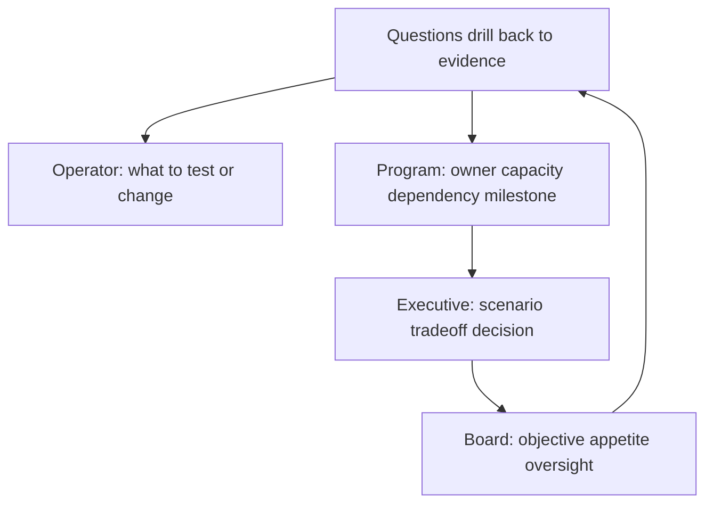

## Formula caveats and approved uses

| Method | Formula or structure | Useful for | Required caveat | Never do |
|---|---|---|---|---|
| Rate | `qualifying / eligible x 100` | Coverage, completion, validation | Publish numerator, denominator, exclusions, clocks | Let denominator shrink silently |
| Backlog bridge | `beginning + arrivals - validated closures +/- scope changes` | Operational flow | Reconcile identity, rules and scope | Call ticket closures remediation without postcondition |
| Simplified SLE | `asset/business value x exposure factor` | Teaching/sensitivity under approved model | Both inputs are estimates/ranges | Present as audited event loss |
| Simplified ALE | `annual rate of occurrence x single loss expectancy` | Scenario comparison | Frequency/loss dependence and uncertainty | Present one decimal as forecast |
| Expected loss | `sum(probability-weighted outcome)` or distribution model | Approved quantitative risk analysis | Tail, correlation and model uncertainty matter | Use uncalibrated ordinal likelihood as probability |
| Control reduction | Re-model event/loss drivers after evidence | Compare treatment mechanisms | Effect must be evidence-based and bounded | Subtract control percentage from risk score |
| Qualitative matrix | Approved likelihood band x impact band lookup | Routing and governance | Bands are ordinal, context-specific | Average, divide or monetize colors |
| Priority score | Versioned local factors/logic | Queue ordering | Explain factors, missing values, overrides and validation | Call score objective risk or Zscaler formula |

### Diagram H14 - Formula selection

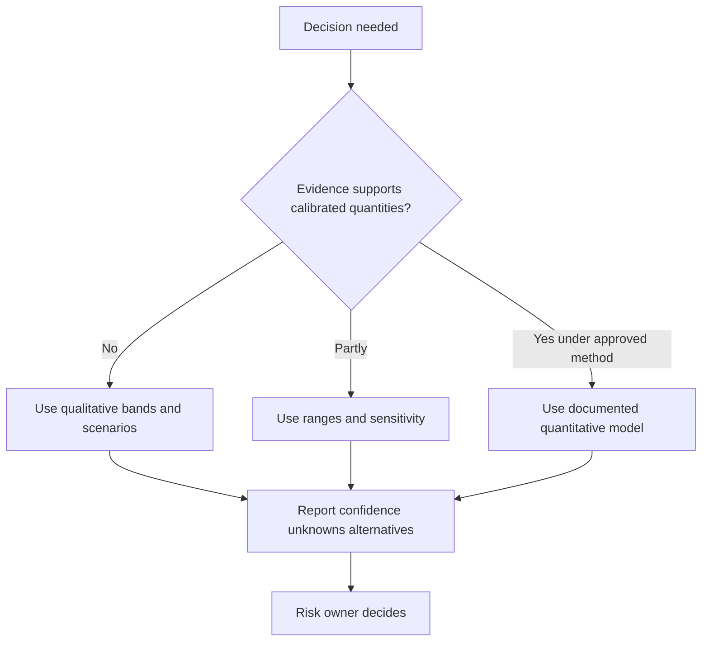

### Plain-English deep-dive 3 - Residual risk is reassessed, not subtracted

Suppose a control was planned to reduce a scenario. You cannot safely calculate "High minus 30 percent equals Medium." First validate whether the control is designed for the scenario, implemented across the eligible population, operating now, resistant to bypass, and independently evidenced. Then reassess the scenario's likelihood and impact drivers using the organization's approved method. The residual conclusion may stay High even after useful work because uncertainty or tail impact remains.

## Forty-two worked synthetic examples and calculations

Every row below is a fictional NMH example. Numbers are deliberately simple and rounded. They are not benchmarks, forecasts, product outputs, recommended targets, or evidence of a real customer.

| Worked ID | Synthetic setup | Calculation/reasoning | Result | Decision use and caveat |
|---|---|---|---|---|
| H-W01 | 500 synthetic pilot assets; 410 have validated owners | `410 / 500 x 100` | 82.0% owner coverage; 90 unknown | Mobilization baseline; audit false owners before expansion |
| H-W02 | 1,200 eligible assets; 1,080 have current control evidence | `1080 / 1200 x 100` | 90.0% evidence coverage | Does not mean control is effective |
| H-W03 | 1,080 observed assets; 972 meet healthy/enforcing rule | `972 / 1080 x 100` | 90.0% among observed; 81.0% of eligible | Both denominators must be shown |
| H-W04 | 240 campaign items; 180 independently validated complete | `180 / 240 x 100` | 75.0% baseline completion | Removed/deferred items remain in bridge |
| H-W05 | Beginning backlog 240; 35 new; 60 valid closures | `240 + 35 - 60` | 215 ending before scope changes | Net improvement 25, but risk mix may differ |
| H-W06 | 80 due items; 68 validated by original due date | `68 / 80 x 100` | 85.0% SLA compliance | Due-date edits cannot rewrite original cohort |
| H-W07 | 60 valid closures; 6 recur in 30-day comparable window | `6 / 60 x 100` | 10.0% recurrence | Confirm same exposure identity |
| H-W08 | 100 ambiguous identity pairs; 3 false merges in stratified audit | `3 / 100 x 100` | 3.0% sample false-merge rate | Report sample design and interval, not population certainty |
| H-W09 | 100 ambiguous pairs; 11 false splits | `11 / 100 x 100` | 11.0% sample false-split rate | Tuning one error may worsen the other |
| H-W10 | 50 selected exposure candidates; 40 safely tested; 18 confirmed | `40/50`; `18/40` | 80.0% validation; 45.0% confirmation | Selection bias prevents portfolio extrapolation |
| H-W11 | 30 validated paths; proposed choke point appears in 21 | `21 / 30 x 100` | 70.0% path concentration | Duplicate/correlated paths and bypass need review |
| H-W12 | 20 path retests after change; 16 no longer meet postcondition | `16 / 20 x 100` | 80.0% interruption in retest cohort | Topology drift may contribute; 4 remain |
| H-W13 | Likelihood Possible and impact Severe under sample H-T14 matrix | Lookup, not multiplication | High qualitative band | Band is routing aid; confidence and scenario remain visible |
| H-W14 | Likelihood Likely and impact Major | Sample matrix lookup | High qualitative band | Same label as H-W13 does not imply equal risk |
| H-W15 | Simplified synthetic value range $2M-$5M; exposure factor 10%-30% | Low `2M x .10`; high `5M x .30` | SLE range $0.2M-$1.5M | Illustrative only; inputs require finance/risk approval |
| H-W16 | Synthetic annual frequency 0.1-0.4; H-W15 SLE range | Boundary sensitivity `0.1 x .2M`; `.4 x 1.5M` | ALE boundary range $0.02M-$0.60M/year | Naive boundaries ignore distributions/correlation |
| H-W17 | Base SLE $600K; frequency 0.25/year | `600K x .25` | $150K/year simplified ALE | Not a loss forecast or Zscaler metric |
| H-W18 | Treatment changes synthetic frequency range from 0.1-0.4 to 0.05-0.2; loss unchanged | Re-run H-W16 boundary | $0.01M-$0.30M/year | Assumes control effect supported; do not subtract 50% blindly |
| H-W19 | Alternative treatment reduces event-loss range from $0.2M-$1.5M to $0.1M-$0.8M; frequency unchanged 0.1-0.4 | Boundary multiplication | $0.01M-$0.32M/year | Compare mechanism and uncertainty, not just midpoint |
| H-W20 | Option A costs synthetic $80K and acts in 30 days; B costs $30K and acts in 120 days | No arithmetic ranking; compare timing, scenario and capacity | A may be preferred for urgent path | Cost alone is not risk-adjusted decision |
| H-W21 | 12 control tests; 9 pass, 2 fail, 1 unknown | `9 / 12`, plus categories | 75.0% pass; 16.7% fail; 8.3% unknown | Do not exclude unknown to claim 81.8% |
| H-W22 | 200 eligible assets; sample 40; 38 pass control test | `38 / 40 x 100` | 95.0% sample pass | Population conclusion needs sampling method/interval |
| H-W23 | 48 exception records; 6 expired while still in use | `6 / 48 x 100` | 12.5% expired-in-use | Validate use evidence and escalate per policy |
| H-W24 | 25 above-tolerance scenarios; 22 have approved plans | `22 / 25 x 100` | 88.0% plan coverage | Three need decisions; plan quality is separate |
| H-W25 | 22 plans; 15 have independent validation criteria defined | `15 / 22 x 100` | 68.2% validation readiness | Rounded to one decimal; target locally governed |
| H-W26 | 90 actions due; 63 on time, 18 late complete, 9 open | `63 / 90 x 100` | 70.0% on time | Completion and timeliness need separate views |
| H-W27 | Decision-ready at day 0; approved day 12 | `12 - 0` | 12-day decision latency | Readiness gate must be independently defined |
| H-W28 | Five decision items: latencies 2, 4, 4, 12, 28 days | Ordered middle | 4-day median; max 28 | Median alone hides oldest decision debt |
| H-W29 | 100 risk claims; 72 high confidence, 20 medium, 8 low | Distribution | 72% high, 20% medium, 8% low | Do not average ordinal confidence |
| H-W30 | 10 modeled scenarios; top 3 synthetic exposure values total $4M; all total $10M | `4 / 10 x 100` | 40.0% concentration | Requires non-overlapping comparable estimates |
| H-W31 | Baseline 30 paths; 16 interrupted, 4 invalidated as false model, 10 remain | Waterfall | 53.3% interrupted, 13.3% model correction, 33.3% remain | Do not call 66.7% risk reduction |
| H-W32 | 120 prioritized work items; 96 owners acknowledge substantively | `96 / 120 x 100` | 80.0% acknowledgment | Automated receipt does not count |
| H-W33 | 96 acknowledged; 70 have accepted treatment and window | `70 / 96 x 100` | 72.9% conversion after acknowledgment | Also show 70/120 = 58.3% end-to-end |
| H-W34 | 50 remediation changes; 45 pass postcondition; 3 fail; 2 unknown | Category rates | 90% pass, 6% fail, 4% unknown | Unknown remains open; rollback as planned |
| H-W35 | Synthetic effect estimate low 20%, base 45%, high 65% for frequency reduction | Sensitivity, no single score | Report three cases | Source and control-test basis must be explicit |
| H-W36 | Base annual frequency 0.4 and H-W35 reductions | `0.4 x (1-effect)` | 0.32, 0.22, 0.14 events/year cases | Scenario cases, not calibrated predictions |
| H-W37 | 64 CTEM exit criteria; 52 evidenced | `52 / 64 x 100` | 81.3% stage completion | Evidence quality and critical missing criteria matter |
| H-W38 | 40 prioritized exposures; 30 accepted into work | `30 / 40 x 100` | 75.0% mobilization | Empty tickets do not qualify; owner acceptance required |
| H-W39 | 30 mobilized; 21 validated interrupted | `21 / 30 x 100` | 70.0% mobilized-to-outcome | Also report 21/40 = 52.5% end-to-end |
| H-W40 | Synthetic board range p50 $0.6M and p90 $2.4M from an approved hypothetical simulation | Ratio only for communication: `2.4/.6` | Tail is 4x median | Do not call p90 worst case or certainty |
| H-W41 | Treatment benefit estimate $40K-$180K/year; cost $100K-$140K | Range overlap | Financial case is uncertain | Risk, timing and nonfinancial impact still matter; no forced ROI point |
| H-W42 | 500 assets; owner coverage rises 410 to 455 while false-owner audit rises 2% to 6% | Coverage `455/500=91%`; error +4 points | Vanity improvement with worse guardrail | Stop forced assignment and repair owner-validation method |

### Diagram H15 - Worked backlog waterfall

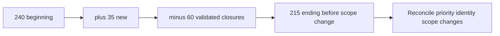

### Diagram H16 - Worked quantitative range

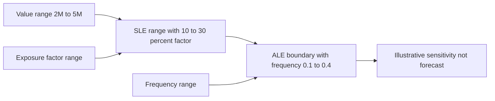

## Complete synthetic NMH risk thread

The following compact thread shows how the templates connect. It does not describe a real environment or any Zscaler product output.

| Record | NMH synthetic content |
|---|---|
| Evidence NMH-E-01 | Generated lab asset observations from two fictional sources, as of 2026-08-24 synthetic scenario time; no real identifiers |
| Observation NMH-O-01 | Three generated records lack stable owner mapping and one identifier appears reused across lifecycle rows |
| Finding NMH-F-01 | Synthetic pilot owner/key acceptance rule is not met for those records |
| Exposure NMH-X-01 | If ambiguous records are forced into one asset, remediation may route to the wrong owner and leave a critical-service asset untreated |
| Scenario NMH-R-01 | Because identity resolution may falsely merge lifecycle records, material scheduling-service exposure may be assigned incorrectly, delaying treatment and increasing disruption/compromise opportunity |
| Objective NMH-OBJ-01 | Maintain accountable, timely treatment of material exposures affecting the fictional scheduling service |
| Current controls | Source namespaces, keep-separate default, human review for high-impact ambiguity, audit sample |
| Decision | Preserve separate records and review; do not auto-merge until lifecycle evidence supports rule |
| Validation | Generated reused-ID case remains separate; normal stable-ID pair links; work routes to accepted owner; rollback tested |
| Residual | False splits increase review load; false-merge risk reduced in tested sample but production behavior remains unknown |

### Diagram H17 - Synthetic NMH thread

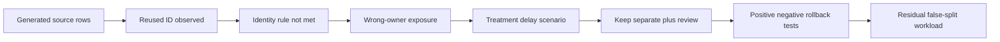

## Remediation campaign operating model

| Phase | Questions | Required evidence | Decision |
|---|---|---|---|
| Baseline | What fixed population, scenario and as-of date define campaign? | Versioned baseline and change bridge | Approve campaign scope |
| Prioritize | Which context and policy select work? | Explainable rules, overrides and owner input | Approve waves |
| Prepare | Are owners, capacity, dependencies, changes and exceptions ready? | Readiness, RACI, windows and rollback | Launch/pause wave |
| Execute | Is work performed safely with state reconciliation? | Change/work records and monitoring | Continue/contain |
| Validate | Does independent evidence meet postcondition? | Retest and control evidence | Close/rework |
| Reassess | What scenario drivers and residual uncertainty remain? | Updated scenario and confidence | Accept/escalate/next treatment |
| Learn | Did recurrence, false results or side effects occur? | Guardrails, PIR and trend bridge | Adjust rules/controls/next CTEM scope |

### Diagram H18 - Campaign waves

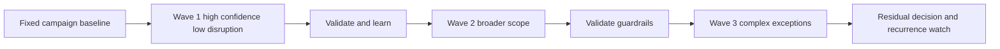

## Board and executive translation without fake precision

| Technical evidence | Executive translation | Decision request | Honest uncertainty sentence | Avoid |
|---|---|---|---|---|
| 21 of 30 validated paths traverse one identity control point | "A common control point may provide leverage across 70% of the tested path set." | Fund bounded control change and retest | "The set is selected and paths may overlap; this is not 70% enterprise risk reduction." | "Fixing identity reduces risk 70%." |
| 180 of 240 campaign items validated | "Three quarters of the fixed baseline meets the remediation postcondition; 60 remain." | Resolve capacity/dependency for remaining waves | "New exposures and scope changes are reported separately." | "We are 75% secure." |
| Simplified modeled range $0.02M-$0.60M/year | "Assumptions produce a wide planning range; frequency and loss magnitude drive the decision." | Approve better evidence or treatment under uncertainty | "This is a scenario model, not an audited forecast." | Reporting midpoint as expected savings |
| Owner coverage rises but false-owner audit worsens | "The headline improved while assignment quality degraded." | Pause forced assignments and repair matching | "The audit is a sample and production scope remains unknown." | Celebrating the unguarded KPI |
| Control test 9 pass, 2 fail, 1 unknown | "Evidence supports most sampled cases, with two failures and one unresolved case." | Fix failures and close evidence gap before broad claim | "The sample does not establish complete population effectiveness." | "Control is 75% effective." |

### Diagram H19 - Executive sentence structure

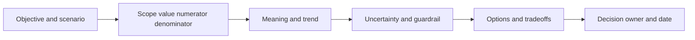

### Plain-English deep-dive 4 - Board communication is compression with a drill-down

Executives need the scenario, objective, material range, direction, uncertainty, treatment choice, owner, and date. They usually do not need every packet field or vulnerability identifier. But compression must remain reversible: every statement should drill down to the evidence, assumptions, model version, controls, work, and validation. Simplification without a drill-down becomes overclaiming.

## Risk review cadence and triggers

| Review type | Trigger/cadence | Inputs | Decisions | Output |
|---|---|---|---|---|
| Operational | Daily/weekly or material change | Findings, work, dependencies, validation | Reassign, unblock, contain, retest | Action/issue updates |
| Campaign | Weekly/biweekly | Fixed baseline, waves, throughput, guardrails | Continue, pause, change wave | Campaign bridge |
| Risk owner | Monthly or threshold trigger | Scenario, controls, residual, exceptions | Treatment, acceptance, escalation | Decision record |
| Executive | Quarterly or material event | Top scenarios, ranges, trends, choices | Priority, capacity, appetite escalation | Executive risk cards |
| Event-driven | New exploitation, control failure, acquisition, incident, model/source change | Current evidence and affected scope | Reassess/rebaseline/contain | Versioned assessment |

### Diagram H20 - Review cadence

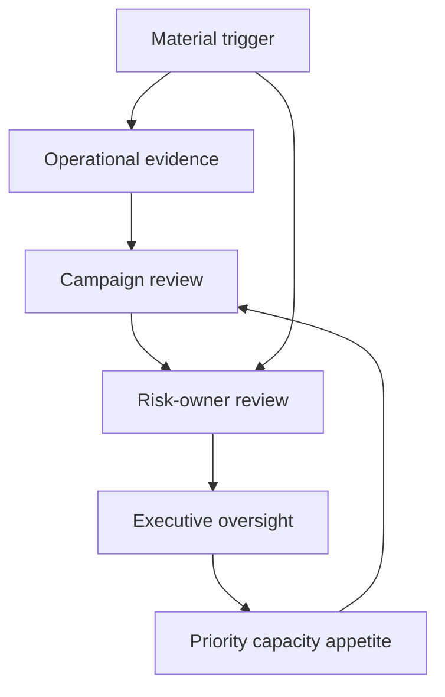

## Contrarian and challenge review

| Challenge | Reviewer question | Evidence sought |
|---|---|---|
| Wrong asset identity | Could the finding/path belong to a different asset or lifecycle? | Source keys, timestamps, match audit |
| Wrong scope | Did denominator or exclusions change? | Versioned scope bridge |
| Wrong causal story | What alternative event explains the evidence? | Competing hypotheses and disconfirming tests |
| Control overstatement | Is control installed versus healthy, enforcing and relevant? | Current control test and bypass cases |
| Validation bias | Were easy cases selected or tester aware of expected outcome? | Sampling and independence record |
| Quantitative fragility | Which input changes the decision? | Sensitivity and correlation review |
| Treatment side effect | Could mitigation increase outage, privacy or operational risk? | Change test, rollback and guardrails |
| Acceptance authority | Does signer have authority for this scenario/scope/horizon? | Policy/delegation evidence |
| Value overclaim | Is avoided loss being called realized savings? | Finance classification and attribution record |

### Diagram H21 - Contrarian gate

```mermaid
flowchart TD
    CLAIM[Proposed risk conclusion] --> ALT[Generate strongest alternative]
    ALT --> TEST[Find cheapest safe discriminating evidence]
    TEST --> RESULT{What does evidence support?}
    RESULT -->|Original| KEEP[Keep with bounded confidence]
    RESULT -->|Alternative| REVISE[Revise scenario or decision]
    RESULT -->|Neither| UNKNOWN[Preserve unknown and constrain action]
```

## Detailed risk-artifact completion guidance

These review notes explain how to use the templates as one connected evidence system. They are not a new scoring framework. A reviewer should be able to move from an executive sentence down to scenario, exposure, finding, observation and evidence, then forward through decision, action, validation and residual assessment.

| Artifact family | Completion standard | Challenge questions | Evidence to retain | Frequent repair |
|---|---|---|---|---|
| Evidence and observation | Preserve source-native meaning, grain, scope, vantage, event/observed/as-of clocks, collection authority, integrity and classification. State only what the method could observe. Keep conflicts and missing records explicit. | Could the source see the condition? Is the timestamp an event, scan, ingest or report time? Did selection exclude affected assets? Is a derived field being presented as observed? | Controlled reference/hash, source contract, method, collection log, redaction, as-of time and known gaps | Split compound evidence, restore raw value/provenance, add clock semantics, and downgrade confidence when scope or integrity is weak |
| Finding | Name the exact requirement, policy, baseline or expected state and compare it with the observation at the same grain and time. Keep source severity separate from customer priority and risk. | Does the requirement apply to this asset and lifecycle? Is the source mapping current? Is absence evidence of noncompliance or simply missing telemetry? | Requirement version, eligibility rule, observation, source disposition and false-result/exception review | Replace "critical risk" with a bounded gap statement; create separate exposure/scenario records |
| Exposure and attack path | State conditions, entry, ordered relationships, target/objective, reachability, threat relevance, current controls, validation state and confidence. Type each edge and preserve its evidence/time. | Is every edge observed, asserted, inferred or validated? Can identity or topology error break the path? Are alternate paths or controls omitted? Was validation authorized and representative? | Node/edge evidence, graph/version, safe validation record, control state, business map and sensitive-detail access record | Remove unsupported edges, split candidate from validated path, record selection bias and restrict exploit-sensitive detail |
| Risk scenario and objective | Use conditional cause/event/objective/impact grammar with scope and horizon. Link the service owner and objective/tolerance source. List alternate scenarios and assumptions. | What uncertain event could affect which objective? Is impact a technical inconvenience or business consequence? Which other event explains the evidence? Who owns this objective and horizon? | Scenario statement, objective/service map, impact profile, threat hypothesis, evidence links and review trigger | Replace a noun label with a complete scenario; separate confidentiality, integrity, availability, safety and financial effects |
| Control | Describe mechanism and objective, then assess design, implementation coverage, operation, resilience/bypass and evidence independently. Record eligible population and exceptions. | Would the design interrupt this scenario? Is it deployed where needed? Is it healthy and enforcing now? Which dependency or bypass defeats it? Who tested it independently? | Control design, configuration/version, population, health/operation evidence, test sample, failures, exceptions and retest | Replace "tool installed" with a control statement and multi-dimensional effectiveness conclusion |
| Confidence and assumptions | Apply a defined provenance/directness/recency/completeness/corroboration rubric. Record missing-value rules, score/model assumptions and sensitivity. Do not average ordinal confidence. | Which evidence gap could reverse the decision? Is confidence calibrated probability or only an ordered rubric? Were unknown values defaulted to safe/medium/zero? | Rubric/version, assumption register, contrary evidence, collection plan, sensitivity and reviewer rationale | Restore unknown as a category, show confidence by claim/driver and assign the cheapest discriminating check |
| Qualitative assessment | Define likelihood, impact and result bands under customer policy. Use the matrix as a lookup for the bounded scenario/horizon. Retain drivers and confidence. | Are bands applied consistently? Did reviewers multiply or average ordinal labels? Do two same-color scenarios require different urgency because of evidence, impact or treatment? | Approved definitions/matrix version, scenario evidence, selected bands, reviewer, dissent and sensitivity | Remove arithmetic on labels, add definitions and compare decisions rather than raw colors |
| Quantitative assessment | Define decision, variables, units, ranges/distributions, source/basis, horizon, dependencies/correlations, control assumptions, model method, sensitivity, validation and approved use. | Does evidence support probability/frequency? Are loss components overlapping? Which input drives p90? Is the tail truncated? Is a midpoint being sold as a forecast? | Versioned inputs, model/code or workbook, random seed/sample count if applicable, validation, sensitivity, peer review and output ranges | Replace single points with justified ranges, fix units/double counting, and use scenario language when calibration is weak |
| Treatment options and decision | Compare mechanism, expected effect range, time, cost/capacity, business impact, dependencies, reversibility and residual concerns across relevant options. Keep recommendation separate from authorized decision. | Does the option address the scenario driver or merely the finding? What new outage/privacy/operational risk appears? What happens while waiting? Who has authority? | Options, criteria, stakeholder input, evidence/uncertainty, dissent, decision, conditions and revisit trigger | Add avoid/share/accept/defer alternatives where relevant; state interim control and contingency |
| Plan, campaign and mobilization | Freeze baseline, define selection and waves, assign risk/action/control owners, preserve dates, manage dependencies/exceptions, integrate change/rollback and predefine independent postconditions. | Can owners absorb work? Which wave is safest for learning? Can scope changes manufacture burn-down? What blocks action after priority is accepted? | Campaign charter, baseline bridge, work items, RACI, dependency/exception logs, change records, validation and guardrails | Separate arrival from closure, ticket from postcondition, and planned from accepted work; add recurrence monitoring |
| Exception and acceptance | Bound requirement, scope and horizon; state risk, alternatives, compensating controls, monitoring, triggers, authority and expiry. Acceptance retains risk; it does not close evidence. | Does the signer have delegated authority? Are compensating controls operating? Is the exception still in use after expiry? Which change invalidates the decision? | Policy/delegation, request, linked assessment, approvals, conditions, monitoring, review and closure/restoration evidence | Add expiry and revocation, reject evergreen language, and require a new assessment rather than automatic renewal |
| Validation and residual risk | Define positive, negative, exception, recovery and safety postconditions before action. Use independent evidence to reassess drivers under the approved method. | Did the treatment work on representative scope? Did it create a side effect? Is the source finding merely stale? Which path/control gap remains? | Test authorization, procedure, raw/summary evidence, failures/unknowns, rollback, residual assessment, owner decision and recurrence window | Reopen unknown/failed cases, avoid score subtraction and distinguish technical closure from risk acceptance |
| Executive translation | State objective, bounded scenario, as-of scope, evidence/trend, range, uncertainty, options/tradeoffs, recommendation, decision owner/date and next checkpoint. Preserve drill-down. | Which sentence implies certainty or causation beyond evidence? Is a percentage missing numerator/denominator? Is modeled avoided loss called realized saving? What decision is requested? | Executive card, technical appendix links, model/metric version, dissent, decision record and communicated actions | Replace adjectives with counts/ranges, add uncertainty sentence and make the decision ask explicit |

## Risk challenge case patterns

| Pattern | Initial claim | Contrarian hypothesis | Cheap safe discriminating check | Decision implication |
|---|---|---|---|---|
| Missing control telemetry | "The endpoint is unprotected." | The asset is retired, ineligible, renamed, or telemetry is delayed | Reconcile lifecycle, eligibility, last observation and control-native state for a bounded sample | Do not remediate or accept risk until identity/scope is credible; fix telemetry if that is the gap |
| High-severity vulnerability | "Patch every critical CVE immediately." | Some findings are unreachable, mitigated, false, or affect low-impact assets; lower-severity path may be more material | Review asset identity, reachability, exploitation, business service, controls and top-K labels | Prioritize explainably while retaining emergency policy for known-exploited/material cases |
| Internet-exposed asset | "A public address proves exploitability." | Address maps through a control, stale resource, nonresponsive service or different asset | Validate current DNS/cloud/network ownership and authorized reachability without exploit activity | Correct inventory/path or mobilize treatment based on confirmed state |
| Apparent attack path | "The graph shows a path to critical data." | One edge is stale, inferred from a false merge, or blocked by an operating control | Inspect edge provenance/time and run approved control/path corroboration | Downgrade/refute, keep candidate open, or prioritize a confirmed choke point |
| Control coverage at 98% | "Residual risk is low." | The uncovered 2% contains the critical service, or covered means installed rather than enforcing | Segment by criticality and test healthy/enforcing state plus exception/unknown populations | Treat concentration and control quality; avoid portfolio-average reassurance |
| Backlog fell sharply | "Risk was reduced." | Scope narrowed, deduplication merged work, findings aged out or tickets closed without validation | Build beginning/arrival/closure/scope/model waterfall and sample closure postconditions | Restate trend and repair workflow/metric before executive claim |
| Faster remediation time | "The program is more efficient." | Easy items were selected and old open items were excluded from closed cohort | Compare arrival/priority mix, p90 open age, validated closure and recurrence | Keep speed result bounded; address tail and selection behavior |
| Quantified annual loss | "Expected loss is $150K." | Frequency and loss inputs are uncalibrated scenario guesses with dependent tails | Show low/base/high cases, sensitivity, source and alternate correlation assumptions | Use as planning range or revert to qualitative scenario; do not budget as forecast |
| Mitigation benefit exceeds cost | "The control pays for itself." | Estimated benefit is avoided loss with overlapping uncertainty, while cost omits operations and business impact | Compare ranges, timing, recurring costs, nonfinancial effects and treatment mechanism | Decide under risk appetite and strategic value, not a forced ROI point |
| Exception is monitored | "The exception is safe." | Monitoring is stale, does not detect the scenario, or has no responder | Test alert/postcondition, owner acknowledgment, expiry and response exercise | Repair compensating control, shorten exception, redesign or revoke |
| AI recommendation is high confidence | "The agent can execute automatically." | Confidence is uncalibrated; evidence grounding, authority or rollback is weak | Run hidden evals, authorization/tool tests and human-reviewed dry runs with postconditions | Limit to inform/recommend/prepare until safety gates pass; never infer product autonomy |
| Managed service owns response | "The provider will contain it." | Contract covers detection/advice but not hands-on action for this source/region/time | Read SOW and exercise a representative incident with contact/authority failure | Fix shared RACI/runbooks or adjust expectation and customer staffing |
| Adoption is high | "Users are getting value." | Logins are mandatory, workflows incomplete, or users create unsafe workarounds | Sample meaningful end-to-end behavior, quality, outcome and user interviews | Improve workflow/trust rather than celebrate activation |
| Board score improved | "Enterprise cyber risk decreased." | Source/model/weight changed or an unknown population disappeared | Recompute comparable scope/model and bridge each driver/change | Report model movement separately from validated control/outcome change |

## Quantitative documentation checklist

| Check | Required entry | Why it matters |
|---|---|---|
| Decision purpose | Exact choice or threshold the model informs | Prevents a number from becoming a general truth claim |
| Scenario/horizon | Bounded event, objective and time period | Keeps frequency and loss units coherent |
| Variable dictionary | Name, meaning, unit, range/distribution and owner | Prevents mixing percentages, rates, currency and ordinal labels |
| Evidence basis | Source, sample, date, relevance and transformation | Makes assumptions challengeable and updateable |
| Dependence | Correlation/common-cause assumptions and alternatives | Independent multiplication can suppress or inflate tails |
| Missing/unknown | Explicit treatment and sensitivity | Convenient defaults create hidden certainty |
| Control effect | Mechanism, evidence and bounded effect on specific driver | Prevents arbitrary score or probability subtraction |
| Model method | Formula, simulation/elicitation process, version and tooling | Supports reproduction and change review |
| Output | Ranges, percentiles, N/sample count and units | Avoids presenting a midpoint as the result |
| Sensitivity | Variables and assumptions that can reverse decision | Directs evidence collection and shows robustness |
| Validation | Plausibility, historical comparison where appropriate, peer review and backtest limits | Identifies errors without pretending past predicts future perfectly |
| Financial classification | Realized cost, capacity, avoided cost, modeled loss or insurance treatment | Prevents avoided-loss scenarios from becoming booked savings |
| Communication | Approved wording, uncertainty and prohibited interpretations | Keeps executive and board statements aligned with evidence |
| Review trigger | New evidence, incident, source/model change or scheduled date | Quantitative conclusions expire when inputs and context change |

## Interview-ready explanations

| Question | Concise model answer |
|---|---|
| How do you turn a finding into risk? | I preserve evidence and grain, test whether the condition creates a credible exposure or path, write a conditional scenario against a business/security objective, assess current controls and uncertainty, then take options to the accountable risk owner. |
| How do you score risk? | I use the customer's approved method. For qualitative bands, I preserve ordinal meaning and definitions. For quantitative analysis, I use documented ranges, units, dependencies, sensitivity and model limitations. I never invent a Zscaler formula. |
| How do you assess control effectiveness? | I separate design adequacy, implementation coverage, current operation, resilience/bypass, and evidence quality. Tool installation alone proves none of those. |
| What is residual risk? | The scenario remaining after treatment, reassessed from validated evidence under the approved method. It is not inherent risk minus a control percentage. |
| How do you manage exceptions? | Scope tightly, document reason and alternatives, assess linked risk, require compensating controls and monitoring, assign authorized owner/approver, set expiry/triggers, and restore or reassess at review. |
| How do you run remediation campaigns? | Fix the baseline, segment waves, assign capacity and dependencies, preserve original due dates, reconcile scope changes, validate postconditions independently, track guardrails/recurrence, and reassess residual risk. |
| How does CTEM mobilization differ from prioritization? | Prioritization identifies what matters; mobilization secures accepted decisions, owners, work, dependencies, windows, communication, controlled change, validation and feedback into the next cycle. |
| How do you brief a board? | State the objective and bounded scenario, current evidence and trend, impact range and uncertainty, treatment choices/tradeoffs, accountable decision and date, residual position, and a drill-down path. |

### Diagram H22 - Full governance loop

```mermaid
flowchart LR
    DISC[Discover evidence] --> ASSESS[Assess scenario controls uncertainty]
    ASSESS --> DECIDE[Risk-owner decision]
    DECIDE --> MOB[Mobilize treatment]
    MOB --> VALID[Validate postcondition]
    VALID --> RES[Reassess residual]
    RES --> REPORT[Executive oversight]
    REPORT --> DISC
```

## Source and honesty boundaries

| Boundary | This appendix supports | It does not establish |
|---|---|---|
| General risk practice | Evidence chains, scenarios, controls, options, governance and validation | Universal risk method, matrix or appetite |
| Public product context | Vocabulary linked to curriculum as of 2026-08-24 | Zscaler internal fields, formulas, factors, scores, SLAs or workflows |
| Quantitative examples | Arithmetic, ranges and sensitivity teaching | Forecast, actuarial result, audited loss or recommended benchmark |
| Synthetic NMH | Safe worked practice | Customer fact, incident, exposure, result or prediction |
| TSM role | Facilitation, evidence quality, planning, escalation and translation | Authority to accept risk, approve legal/privacy position or change production |

## Completion checklist

- [x] Exactly one H1 uses the master-linked Appendix H title.
- [x] Thirty-six distinct reusable numbered templates/tables cover evidence, observations, findings, exposures, scenarios, objectives, threats, impacts, controls, confidence, scoring assumptions, qualitative/quantitative methods, register, treatment, ownership, SLA/dependencies, exceptions/acceptance, validation, residual risk, closure, decisions, escalation, attack paths, campaigns, CTEM mobilization, and executive translation.
- [x] Forty-two numbered worked synthetic NMH examples/calculations include rates, backlog, control evidence, path analysis, qualitative lookup, financial ranges, sensitivity, campaign and executive interpretation.
- [x] Twenty-two numbered Mermaid diagrams and more than fifteen tables are included.
- [x] Four Plain-English deep-dives explain record distinctions, qualitative matrices, residual reassessment, and executive compression.
- [x] Formula caveats, uncertainty, sensitivity, percentiles/ranges, attribution limits, contrarian review, and board translation avoid fake precision.
- [x] No Zscaler internal formula, factor, field, benchmark, entitlement, SLA, workflow, or guaranteed outcome is invented.
- [x] Public/general/synthetic boundaries, safe validation, privacy, human authority, and the exact 2026-08-24 source date are explicit.
- [x] Content is ASCII with balanced fences, valid Part/appendix links, and exact navigation to the master, Appendix G, and planned Appendix I.

[Back to the master study guide](../Zscaler%20SecOps%20Technical%20Success%20Manager%20-%20Complete%20Study%20Guide.md) | [Previous appendix: Discovery, Assessment, and Success-Plan Templates](Appendix-G-discovery-success-plan-templates.md) | [Next planned appendix: QBR, EBR, Executive Deck, and Training Templates](Appendix-I-qbr-executive-training-templates.md)