# Appendix I - QBR, EBR, Executive Deck, and Training Templates

> **Purpose:** Provide reusable storyboards and fillable templates for technical reviews, quarterly business reviews (QBRs), executive business reviews (EBRs), board/CISO briefs, risk memos, dashboard narratives, decision requests, technical appendices, workshops, demos, labs, teach-backs, evaluation, actions, and follow-up. The recurring discipline is evidence -> meaning -> decision -> owner -> validation.
>
> **Currency and source note:** General customer-success, executive-communication, security-governance, technical-review, accessibility, privacy, and adult-learning practices were reviewed on **2026-08-24**. Product names, interfaces, packaging, metrics, contracts, customer policies, accessibility requirements, and regulations change. Recheck current authoritative sources, tenant behavior, contractual scope, customer policy, legal/privacy guidance, and accountable-owner decisions before production use.
>
> **Official/general/synthetic boundary:** These are source-neutral communication patterns, not official Zscaler slideware, fields, scores, commitments, benchmarks, roadmap statements, training certification, or customer evidence. Northstar Meridian Holdings (NMH), all people/roles, values, dates, services, risks, decisions, outcomes, and examples are fictional and synthetic. A sample demonstrates form, never a claim about Zscaler or any real organization.
>
> **Safety and privacy:** Minimize data, aggregate whenever detail is unnecessary, remove secrets and personal or regulated content, restrict technical exploit/path detail, and share only through approved channels. Never promise an unsupported ETA, roadmap item, root cause, risk reduction, financial value, or product behavior. Accessibility and privacy are release gates, not optional polish.

[Back to the master study guide](../Zscaler%20SecOps%20Technical%20Success%20Manager%20-%20Complete%20Study%20Guide.md) | [Previous appendix: Risk Register, Mitigation, and Decision Templates](Appendix-H-risk-mitigation-decision-templates.md) | [Next appendix: Escalation, Incident, RCA, and Handoff Templates](Appendix-J-escalation-incident-rca-templates.md)

## How to use this workbook

A strong review is not a pile of screenshots. It is a controlled argument: this was the agreed objective; this is the bounded evidence; this changed or did not; this is what the evidence means; this decision or action is now required; this is how completion will be validated. Keep a drill-down path so every summary can be traced to definitions, scope, clocks, sources, transformations, limitations, and an accountable owner.

| Operating rule | Required practice | Failure prevented |
|---|---|---|
| Start with audience | Name decision rights, prior knowledge, concern, time, and accessibility need | One generic deck for every room |
| Start with purpose | Define the decision, alignment, learning, or assurance outcome | Meetings that only transfer information |
| Preserve claims | Label confirmed evidence, official public facts, assumptions, hypotheses, unknowns, and synthetic examples | Polished speculation |
| State scope and clock | Give population, exclusions, denominator, baseline, observed time, and as-of time | Trend lines with changing meaning |
| Lead with outcome | Connect technical state to a business/security objective | Feature and activity reporting |
| Make asks explicit | One owner, decision, due date, dependency, and consequence of delay | Vague next steps |
| Keep a drill-down | Link summary -> appendix -> evidence manifest | Executive brevity that hides uncertainty |
| Design for access | Use structure, contrast, readable type, alt text, captions, and verbal descriptions | Excluding participants |
| Minimize exposure | Aggregate/redact; avoid secrets, identities, raw logs, and unnecessary path details | Privacy and security leakage |
| Close the loop | Send decisions/actions, validate completion, and update the next review | Recurring unresolved items |

### Diagram I01 - Evidence-to-action narrative

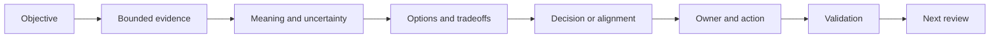

## Audience and artifact map

| Audience | Primary question | Preferred altitude | Useful artifact | Avoid |
|---|---|---|---|---|
| Board or board committee | Is material cyber risk understood, governed, and within appetite? | Enterprise objectives, scenarios, trend, choices, oversight | Board/CISO brief and decision memo | Operational queues and decorative scores |
| CISO/CIO executive | What changed, why, and what decision unlocks progress? | Risk, service outcome, investment, dependency | EBR, one-page risk memo, roadmap | Unbounded technical detail |
| Security/IT leader | Which program outcomes and cross-team constraints need action? | Program, control, adoption, accountability | QBR, dashboard narrative, action register | Feature tour without workflow |
| Technical owner | What exactly is happening and how do we validate it? | Architecture, data, controls, evidence, tests | Technical review and appendix | Unsupported executive simplification |
| Operator/analyst | What must I do, in which tool/process, and how do I know it worked? | Task, procedure, guardrail, expected result | Workshop, demo, lab, job aid | Abstract strategy only |
| Mixed audience | What common decision can we make despite different depth needs? | Layered summary with optional drill-down | Core deck plus appendix | Switching terminology midstream |

### Diagram I02 - Layered communication

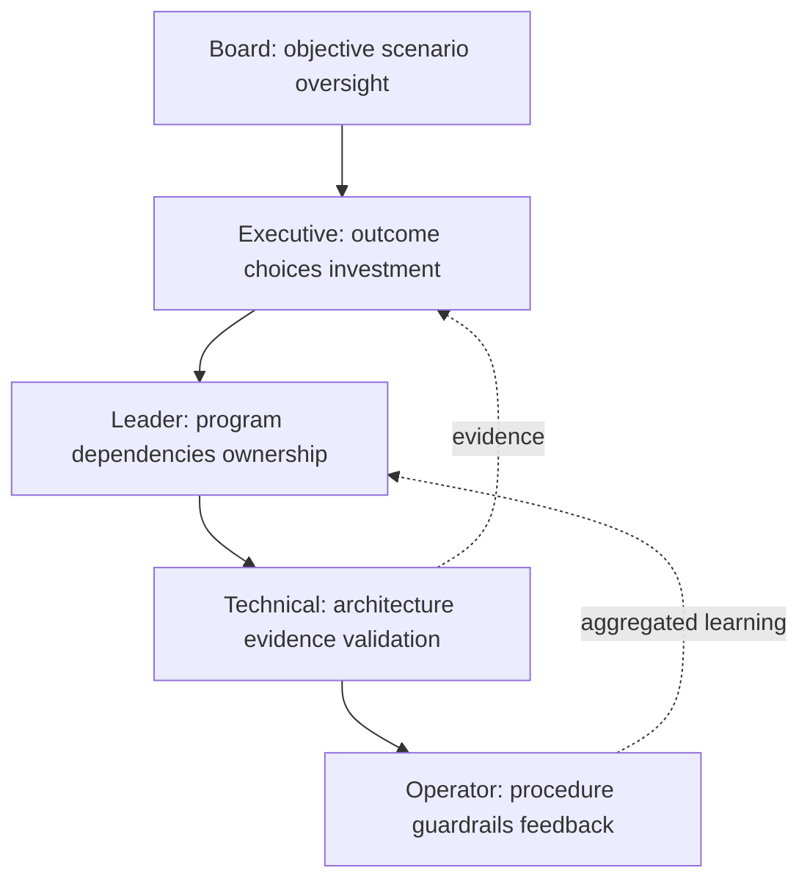

### Plain-English deep-dive 1 - A deck is a decision interface

Think of a deck as the control panel in a cockpit. The panel does not display every wire in the aircraft; it shows the few states and choices the pilot needs, while maintenance records preserve the detail. Likewise, an executive deck should not hide evidence, but it should route detail into an appendix. A slide earns its place when it changes understanding, enables a decision, confirms accountability, or supports validation. If removing a slide changes none of those, remove it.

## Template I-T01 - Review charter

**Use:** Define why the review exists before building slides. This prevents a QBR, EBR, technical review, and training session from becoming interchangeable. A QBR usually governs quarterly outcomes and plans; an EBR raises altitude to strategic value, risk, and decisions; a technical review tests architecture, data, controls, and operations.

**Fillable blank:**

| Field | Fillable blank |
|---|---|
| Review type and ID |  |
| Purpose/outcome |  |
| Audience and decision rights |  |
| In scope / out of scope |  |
| Evidence as-of date and baseline |  |
| Decisions required |  |
| Sensitive content classification |  |
| Accessibility/accommodation needs |  |
| Presenter, approver, distribution |  |
| Follow-up and validation date |  |

**Fictional NMH sample:**

| Field | NMH synthetic example |
|---|---|
| Review type and ID | NMH-QBR-2026-Q3 |
| Purpose/outcome | Decide whether to expand the synthetic asset-reconciliation pilot after quality gates |
| Audience and decision rights | CISO role sponsors; asset governance role approves match rules; privacy role approves fields |
| In scope / out of scope | Generated endpoint/cloud rows; no production, patient, user, or exploit data |
| Evidence as-of date and baseline | Synthetic snapshots through 2026-08-24; baseline 2026-06-30 |
| Decisions required | Approve phase 2, owners, and exit criteria; do not accept enterprise risk |
| Sensitive content classification | Internal synthetic training artifact |
| Accessibility/accommodation needs | Accessible PDF, captioned remote session, charts verbally described |
| Presenter, approver, distribution | TSM role presents; sponsor role approves; named fictional roles only |
| Follow-up and validation date | Action note next business day; gate review 2026-09-15 synthetic |

## Template I-T02 - Audience and decision profile

**Use:** Record how each person will use the material. Do not infer accessibility needs or personal attributes; ask through the customer's approved process.

**Fillable blank:**

| Role/persona | Decision or action | Prior context | Concern | Evidence needed | Detail level | Format/access need | Pre-wire owner |
|---|---|---|---|---|---|---|---|
|  |  |  |  |  |  |  |  |

**Fictional NMH sample:**

| Role/persona | Decision or action | Prior context | Concern | Evidence needed | Detail level | Format/access need | Pre-wire owner |
|---|---|---|---|---|---|---|---|
| CISO role | Sponsor phase 2 | Saw prior risk memo | Unknown population may distort trend | Comparable counts, exceptions, decision options | Executive | Accessible PDF plus verbal summary | TSM role |
| Data engineering role | Commit mapping capacity | Built sample transform | Scope creep | Rule tests, effort range, dependencies | Technical | Workbook and appendix | Program lead role |
| Privacy role | Approve retained fields | Reviewed field inventory | Identifier overcollection | Purpose, minimization, access, deletion | Governance | Controlled memo | Data owner role |

### Diagram I03 - Audience design loop

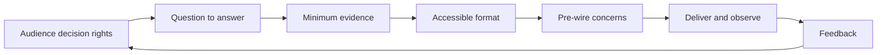

## Template I-T03 - Claim and evidence register

**Use:** Build this before slides. Every material sentence gets a label and evidence path. "Confirmed" means supported within stated scope and time, not universally true.

**Fillable blank:**

| Claim ID | Draft claim | Label | Scope/time | Evidence/source | Transformation | Limitation/alternative | Reviewer | Allowed wording |
|---|---|---|---|---|---|---|---|---|
|  |  | Confirmed / official public / assumption / hypothesis / unknown / synthetic |  |  |  |  |  |  |

**Fictional NMH sample:**

| Claim ID | Draft claim | Label | Scope/time | Evidence/source | Transformation | Limitation/alternative | Reviewer | Allowed wording |
|---|---|---|---|---|---|---|---|---|
| NMH-C-01 | Match quality improved in the test set | Synthetic | Generated 500-row labeled sample, run v0.3 | Local results.csv and manifest hash | Precision/recall from reviewed labels | Synthetic labels; not production performance | Data reviewer role | "In the synthetic labeled set, v0.3 improved both measures" |
| NMH-C-02 | Phase 2 will reduce enterprise risk | Hypothesis | Future phase | None yet | None | Adoption, coverage, and controls untested | Risk owner role | "Phase 2 is intended to improve decision evidence; outcome remains to be validated" |

### Diagram I04 - Claim release gate

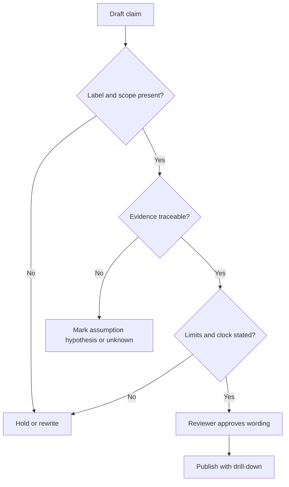

## Template I-T04 - Quarterly business review storyboard

**Use:** A QBR governs outcomes, adoption, service health, work, and next-quarter commitments. It is not a ticket recital. Keep ten to twelve core slides and move diagnostics to the appendix.

**Fillable slide-by-slide storyboard:**

| Slide | Question answered | Required content | Evidence/visual | Decision/action | Speaker/time |
|---:|---|---|---|---|---|
| 1 | Why are we here? | Purpose, period, attendees, as-of date | Title and one-sentence outcome | Confirm agenda |  |
| 2 | What was agreed? | Objectives and success measures | Objective tree | Confirm changes |  |
| 3 | What changed? | Executive outcome summary | Three evidence-backed headlines | Align on interpretation |  |
| 4 | Is the data trustworthy? | Coverage, freshness, quality, limits | Quality scorecard | Approve correction priority |  |
| 5 | Is adoption creating workflow value? | Active workflows and cohort use | Adoption funnel | Name adoption action |  |
| 6 | What security/risk signals matter? | Bounded scenario and trend | Trend plus denominator | Select focus |  |
| 7 | What value is evidenced? | Realized, capacity, modeled, unknown | Value bridge | Accept wording |  |
| 8 | What remains blocked? | Risks, issues, assumptions, dependencies | RAID summary | Escalate dependency |  |
| 9 | What did we learn? | Support/product feedback and changes | Learning loop | Confirm owners |  |
| 10 | What is next? | Roadmap and milestones | Now/next/later | Approve sequence |  |
| 11 | What decisions are needed? | Explicit decision requests | Decision cards | Decide/defer with owner/date |  |
| 12 | How will closure be proved? | Actions, postconditions, next cadence | Action register | Confirm minutes |  |

**Fictional NMH slide-by-slide example:**

| Slide | NMH synthetic headline | Evidence and honest caveat | Ask |
|---:|---|---|---|
| 1 | "Q3 pilot: decide whether evidence quality supports expansion" | Generated lab only | Confirm decision purpose |
| 2 | "Goal: reconcile two sources before prioritization" | Approved synthetic charter | Confirm unchanged objective |
| 3 | "Quality improved; owner workflow is still untested" | v0.3 test results; no production inference | Keep outcome split |
| 4 | "Freshness passed sample gate; 18 ambiguous pairs remain" | Manifested query output | Assign ambiguity review |
| 5 | "Three fictional roles completed teach-back" | Evaluation sheets; small synthetic cohort | Add operator cohort |
| 6 | "No enterprise-risk conclusion is available" | Lab lacks production exposure/control evidence | Preserve unknown |
| 7 | "Reusable analysis reduced lab preparation effort" | Timed exercise only; not booked savings | Accept capacity wording |
| 8 | "Privacy field approval blocks wider synthetic scenario" | Decision log | Privacy role decision by date |
| 9 | "Stable IDs should precede dashboard expansion" | Reconciliation errors | Fund mapping test |
| 10 | "Next: validate rules, workflow, then dashboard" | Dependency map | Approve sequence |
| 11 | "Approve phase 2 with three exit criteria" | Option matrix | Sponsor decision |
| 12 | "Seven actions; next review after evidence gate" | Action register | Confirm owners |

### Diagram I05 - QBR preparation and closure

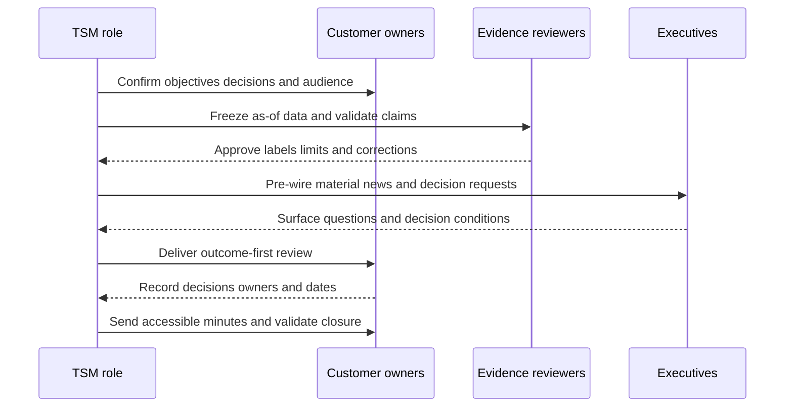

## Template I-T05 - Executive business review storyboard

**Use:** The EBR connects strategic objectives, material scenarios, value, partnership health, and forward choices. Product detail appears only when it explains a material outcome or dependency.

**Fillable blank:**

| Slide | Executive message | Proof/limit | Choice or oversight question | Appendix link |
|---:|---|---|---|---|
| 1 | Strategic purpose and as-of date |  |  |  |
| 2 | Business/security objectives |  |  |  |
| 3 | Material change since prior EBR |  |  |  |
| 4 | Risk/outcome position |  |  |  |
| 5 | Value realized and not-yet-proven |  |  |  |
| 6 | Adoption/operating maturity |  |  |  |
| 7 | Material constraints and bad news |  |  |  |
| 8 | Options and tradeoffs |  |  |  |
| 9 | Recommendation and decision |  |  |  |
| 10 | Next horizon and validation |  |  |  |

**Fictional NMH sample:**

| Slide | Executive message | Proof/limit | Choice or oversight question | Appendix link |
|---:|---|---|---|---|
| 1 | Synthetic program review through 2026-08-24 | Training scenario only | Is expansion the desired decision? | Charter |
| 2 | Improve trustworthy asset context for scheduling-service decisions | Fictional objective | Has objective changed? | Objective record |
| 3 | Matching evidence improved; workflow evidence did not | Local labeled set; no tenant data | Is quality enough to test workflow? | Quality pack |
| 4 | Exposure/risk remains unknown | No live reachability or control evidence | Preserve unknown pending authorized evidence? | Risk memo |
| 5 | Reusable workflow demonstrated; financial value not measured | Exercise timing only | Which value measure should be governed? | Value ledger |
| 6 | Analyst teach-back passed; service-owner adoption untested | Three fictional evaluations | Fund next cohort? | Evaluation summary |
| 7 | Identifier retention decision is late | Decision log | Escalate decision owner/date? | RAID |
| 8 | Pause, narrow, or expand with gates | Option matrix | Which tradeoff fits appetite/capacity? | Decision request |
| 9 | Recommend narrow expansion after privacy and ambiguity gates | Conditional recommendation | Approve/defer/reject | Decision record |
| 10 | Recheck at gate, then choose dashboard investment | Milestone plan | Confirm oversight cadence | Roadmap |

### Diagram I06 - EBR altitude

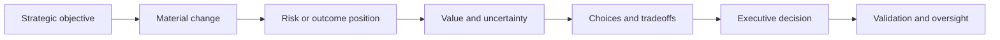

## Template I-T06 - Technical review storyboard

**Use:** Test the technical system and its evidence. A technical review should state architecture, source contracts, controls, tests, defects, ownership, and validation without turning into unsafe operational instructions.

**Fillable blank:**

| Section/slide | Technical question | Evidence | Expected state | Actual state | Gap/hypothesis | Owner/test | Decision |
|---|---|---|---|---|---|---|---|
| Scope and architecture |  |  |  |  |  |  |  |
| Identity/data flow |  |  |  |  |  |  |  |
| Dependencies |  |  |  |  |  |  |  |
| Health/quality |  |  |  |  |  |  |  |
| Security/privacy |  |  |  |  |  |  |  |
| Exceptions |  |  |  |  |  |  |  |
| Change/rollback |  |  |  |  |  |  |  |
| Validation/operations |  |  |  |  |  |  |  |

**Fictional NMH sample:**

| Section/slide | Technical question | Evidence | Expected state | Actual state | Gap/hypothesis | Owner/test | Decision |
|---|---|---|---|---|---|---|---|
| Scope and architecture | Are two generated sources isolated locally? | Folder manifest | Local synthetic only | Confirmed | None observed | Lab owner verifies hash | Continue |
| Identity/data flow | Are source IDs preserved? | Mapping output | Source namespace retained | 18 ambiguous pairs | Stable ID missing in source B | Data role reviews labels | Hold auto-merge |
| Security/privacy | Are identifiers necessary? | Field inventory | Minimum generated fields | One unused email-like field | Generator copied optional column | Privacy role approves deletion | Remove next version |
| Validation/operations | Can another learner reproduce results? | Run record | Same input/version produces same aggregates | Pending | Environment/version unknown | Peer follows README | Gate expansion |

### Diagram I07 - Technical review drill-down

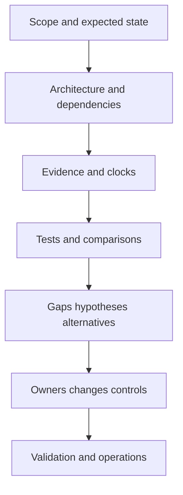

## Template I-T07 - Board/CISO brief

**Use:** Compress a material scenario into objective, current position, evidence, uncertainty, treatment, oversight, and decision. Do not present a vendor score as enterprise risk or a modeled loss as a forecast.

**Fillable blank:**

| Brief block | Fillable content |
|---|---|
| Objective at stake |  |
| Bounded risk scenario |  |
| Current position and trend |  |
| Evidence and as-of scope |  |
| Material uncertainty |  |
| Current controls and limits |  |
| Treatment progress |  |
| Options/tradeoffs |  |
| Recommendation |  |
| Decision/oversight requested |  |
| Next trigger/review |  |

**Fictional NMH sample:**

| Brief block | NMH synthetic content |
|---|---|
| Objective at stake | Maintain trustworthy security decisions for the fictional scheduling service |
| Bounded risk scenario | Incomplete asset identity may misroute remediation and leave important conditions unowned |
| Current position and trend | Sample matching improved between v0.2 and v0.3; production position is unknown |
| Evidence and as-of scope | Generated 500-row labeled set as of 2026-08-24, local manifest |
| Material uncertainty | No production coverage, reachability, control, or workflow evidence |
| Current controls and limits | Keep-separate default and human ambiguity review; no automated production action |
| Treatment progress | Rule tests complete; privacy and owner-workflow gates open |
| Options/tradeoffs | Pause; narrow validation; expand synthetic scope with gates |
| Recommendation | Narrow validation after field minimization |
| Decision/oversight requested | Sponsor approves phase, owner capacity, and exit criteria |
| Next trigger/review | Revisit after privacy approval and independent reproduction |

### Diagram I08 - Board compression with drill-down

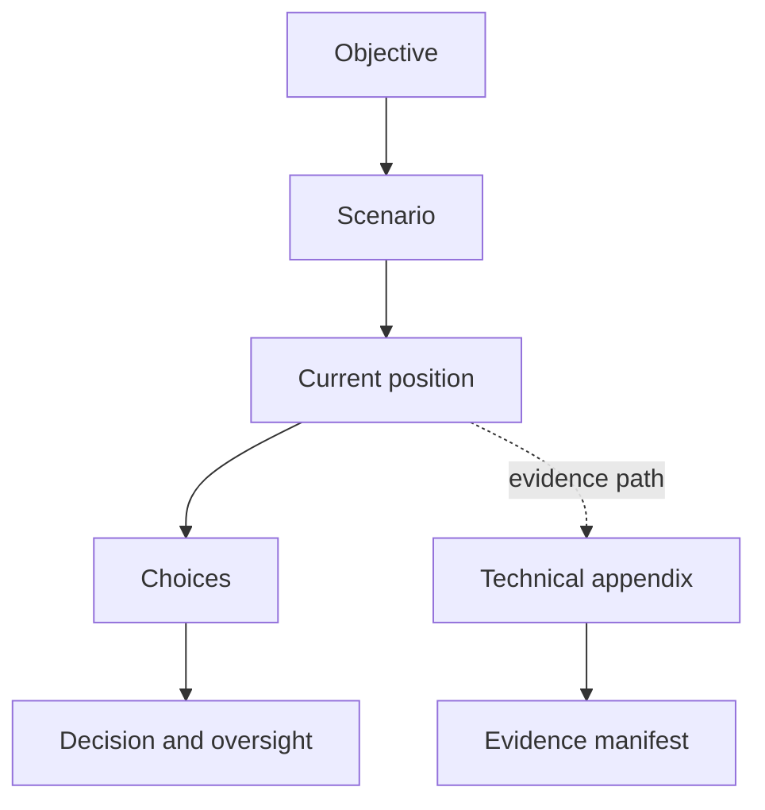

## Template I-T08 - One-page risk memo

**Use:** Provide a standalone decision record that remains understandable without the live presentation. Keep to one page by linking evidence rather than deleting caveats.

**Fillable blank:**

| Memo field | Fillable blank |
|---|---|
| To / from / date / classification |  |
| Subject and decision deadline |  |
| Executive summary |  |
| Scenario and objective |  |
| Evidence, scope, clock |  |
| Current controls |  |
| Options and tradeoffs |  |
| Recommendation and assumptions |  |
| Decision requested and authority |  |
| Validation, residual uncertainty, next review |  |
| Evidence links |  |

**Fictional NMH sample:**

| Memo field | NMH synthetic example |
|---|---|
| To / from / date / classification | Sponsor role / program role / 2026-08-24 / Internal synthetic |
| Subject and decision deadline | Approve narrow phase-2 lab by 2026-09-01 synthetic |
| Executive summary | Quality evidence supports more testing, not a production or risk conclusion |
| Scenario and objective | Identity ambiguity may misroute action against the fictional scheduling objective |
| Evidence, scope, clock | Local generated data, 500 labeled rows, v0.3, as of review date |
| Current controls | Keep-separate rule, human review, no live action |
| Options and tradeoffs | Pause preserves capacity; broad expansion adds uncertainty; narrow phase tests decisive gaps |
| Recommendation and assumptions | Narrow phase after privacy approval; assumes reviewer capacity |
| Decision requested and authority | Sponsor approves scope; privacy role approves fields; risk owner retains risk authority |
| Validation, residual uncertainty, next review | Peer reproduction plus owner-workflow exercise; production state remains unknown |
| Evidence links | Controlled manifest, query output, decision log |

### Diagram I09 - Risk memo logic

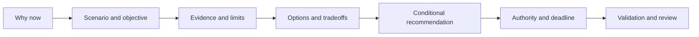

### Plain-English deep-dive 2 - Compression is not certainty

A weather forecast can be brief and still show a probability, location, and time. Executive communication works the same way. Brevity does not require removing scope or uncertainty. Replace a dense paragraph with a bounded sentence: "In the generated sample through August 24, matching quality improved; production coverage and risk remain unknown." That sentence is shorter and more honest than a confident claim. The appendix then proves how the result was calculated.

## Template I-T09 - Executive one-slide summary

**Use:** One slide for a sponsor who has five minutes. Use no more than three headlines, one bounded visual, one decision, and one next checkpoint.

**Fillable blank:**

| Zone | Fillable content | Quality test |
|---|---|---|
| Title |  | States outcome/change, not topic |
| Headline 1 |  | Evidence-backed and scoped |
| Headline 2 |  | Material uncertainty or constraint |
| Headline 3 |  | Forward implication |
| Visual |  | Denominator, clock, labels, accessible description |
| Decision |  | Owner, options, deadline |
| Next checkpoint |  | Observable postcondition |

**Fictional NMH sample:**

| Zone | NMH synthetic content | Quality test |
|---|---|---|
| Title | Synthetic match quality supports a narrower next test, not production rollout | Distinguishes result from decision |
| Headline 1 | v0.3 performed better on the fixed labeled set | Scope and version shown |
| Headline 2 | 18 ambiguous pairs and privacy approval remain open | Bad news visible |
| Headline 3 | Owner-workflow evidence is the next value gate | Outcome beyond model metric |
| Visual | Two-version comparison with text labels and sample size | Color-independent and described |
| Decision | Sponsor: approve narrow test by synthetic date | Authority named |
| Next checkpoint | Peer reproduction and workflow teach-back pass | Observable |

## Template I-T10 - Dashboard narrative

**Use:** Turn a dashboard into a guided interpretation. A dashboard shows; a narrative explains what moved, whether the movement is comparable, why it matters, what could also explain it, and what action follows.

**Fillable blank:**

| Narrative element | Fillable prompt |
|---|---|
| Objective/question |  |
| Metric definition/version |  |
| Population/denominator |  |
| Baseline/current/as-of |  |
| Observed movement |  |
| Drivers and evidence |  |
| Alternate explanations |  |
| Data-quality limitations |  |
| Audience-specific meaning |  |
| Action/decision |  |
| Validation/guardrail |  |

**Fictional NMH sample:**

| Narrative element | NMH synthetic response |
|---|---|
| Objective/question | Can generated asset records support accountable owner workflow? |
| Metric definition/version | Ambiguous-pair rate under mapping rules v0.3 |
| Population/denominator | All 500 generated candidate pairs in the fixed labeled set |
| Baseline/current/as-of | v0.2 versus v0.3, evaluated 2026-08-24 |
| Observed movement | Ambiguity declined, but 18 pairs still require review |
| Drivers and evidence | Stable source namespace and lifecycle rule explain most change |
| Alternate explanations | Label errors or generator regularity may overstate transferability |
| Data-quality limitations | Synthetic distribution; no production source drift |
| Audience-specific meaning | Technical: improve rule; executive: do not automate action yet |
| Action/decision | Fund reviewer and workflow exercise before wider use |
| Validation/guardrail | Independent reproduction; no auto-merge or production writeback |

### Diagram I10 - Dashboard interpretation tree

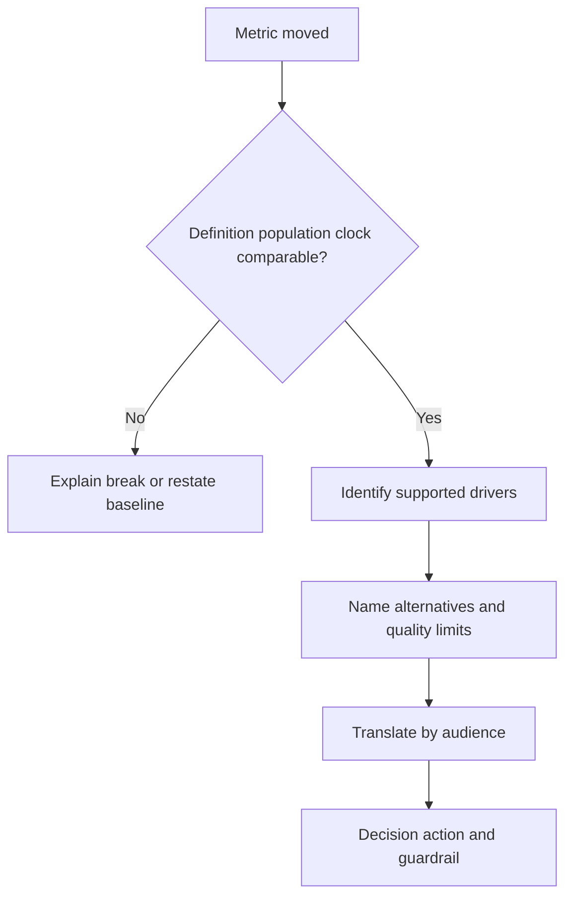

## Template I-T11 - KPI definition and bridge

**Use:** Prevent metric drift between periods. Bridge source, scope, definition, and model changes separately from operational or outcome movement.

**Fillable blank:**

| KPI | Objective | Formula/definition | Grain | Population/exclusions | Clock | Source/version | Target source | Change bridge | Misuse warning |
|---|---|---|---|---|---|---|---|---|---|
|  |  |  |  |  |  |  |  |  |  |

**Fictional NMH sample:**

| KPI | Objective | Formula/definition | Grain | Population/exclusions | Clock | Source/version | Target source | Change bridge | Misuse warning |
|---|---|---|---|---|---|---|---|---|---|
| Ambiguous-pair rate | Trustworthy identity | Ambiguous candidate pairs / reviewed candidate pairs | Pair | Fixed 500-row generated set; excludes unlabeled experiments | Evaluation time | local v0.3 | Lab charter gate | v0.2->v0.3 rule change shown separately | Not enterprise duplicate rate or risk reduction |

## Template I-T12 - Decision request card

**Use:** Make the ask answerable. Separate approval, recommendation, implementation, and risk-acceptance authority.

**Fillable blank:**

| Field | Fillable blank |
|---|---|
| Decision ID and statement |  |
| Why now / consequence of delay |  |
| Accountable decision owner |  |
| Options, including defer/do nothing |  |
| Evidence and uncertainty |  |
| Recommendation and assumptions |  |
| Cost/capacity/dependencies |  |
| Security/privacy/change guardrails |  |
| Deadline and fallback |  |
| Acceptance record and validation |  |

**Fictional NMH sample:**

| Field | NMH synthetic example |
|---|---|
| Decision ID and statement | NMH-D-14: approve narrow synthetic phase-2 validation |
| Why now / consequence of delay | Reviewer window expires; delay shifts exercise, not a production SLA |
| Accountable decision owner | Sponsor role for scope/capacity |
| Options, including defer/do nothing | Pause; broad lab expansion; narrow gated validation |
| Evidence and uncertainty | v0.3 result; no production outcome evidence |
| Recommendation and assumptions | Narrow option; assumes privacy approval and peer capacity |
| Cost/capacity/dependencies | Two fictional half-day roles; field decision first |
| Security/privacy/change guardrails | Local generated data, least privilege, no live writes |
| Deadline and fallback | Synthetic 2026-09-01; fallback pause and preserve artifacts |
| Acceptance record and validation | Signed decision row; peer reproduction and workflow postcondition |

### Diagram I11 - Decision request lifecycle

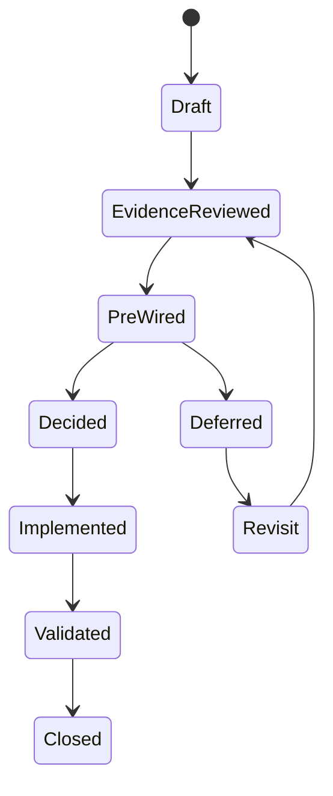

## Template I-T13 - Options and tradeoff matrix

**Use:** Compare choices against the same criteria. Never hide "defer" or "do nothing" when it is a legitimate governance option.

**Fillable blank:**

| Option | Outcome supported | Evidence | Benefit | Cost/capacity | Risk/side effect | Dependency | Reversibility | Validation | Owner view |
|---|---|---|---|---|---|---|---|---|---|
|  |  |  |  |  |  |  |  |  |  |

**Fictional NMH sample:**

| Option | Outcome supported | Evidence | Benefit | Cost/capacity | Risk/side effect | Dependency | Reversibility | Validation | Owner view |
|---|---|---|---|---|---|---|---|---|---|
| Pause | Preserve current artifacts | Known gates open | No added effort | Delays learning | Team loses window | None | High | Replan review | Acceptable fallback |
| Broad expansion | Test more variation | Current quality only | Wider synthetic coverage | High | Adds noise before field decision | Privacy and engineering | Medium | Larger label audit | Not recommended |
| Narrow gated test | Test workflow and reproduction | Best fit to unknowns | Decisive learning | Moderate | Small sample remains | Privacy then peer | High | Pass/fail postconditions | Recommended |

## Template I-T14 - Roadmap and milestone story

**Use:** Show outcome sequence and dependencies, not a feature wishlist. Separate committed, proposed, conditional, and unknown work.

**Fillable blank:**

| Horizon | Outcome | Deliverable | Status label | Dependency | Owner | Exit evidence | Decision trigger | Risk if delayed |
|---|---|---|---|---|---|---|---|---|
| Now |  |  |  |  |  |  |  |  |
| Next |  |  |  |  |  |  |  |  |
| Later |  |  |  |  |  |  |  |  |

**Fictional NMH sample:**

| Horizon | Outcome | Deliverable | Status label | Dependency | Owner | Exit evidence | Decision trigger | Risk if delayed |
|---|---|---|---|---|---|---|---|---|
| Now | Minimum lawful synthetic schema | Field decision | Committed internally | Privacy review | Data owner role | Approved inventory | Approval received | Exercise slips |
| Next | Reproducible matching | Peer run and result pack | Proposed | Approved fields | Engineering role | Matching hashes/aggregates | Pass/fail gate | Quality remains author-specific |
| Later | Accountable workflow learning | Simulated owner ticket flow | Conditional | Reproduction passes | Program role | Teach-back plus action closure | Sponsor choice | Value hypothesis remains untested |

### Diagram I12 - Outcome roadmap

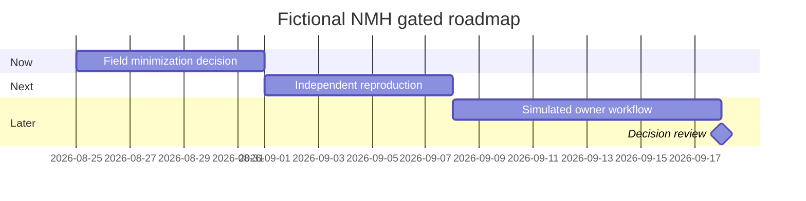

## Template I-T15 - Value realization ledger

**Use:** Distinguish realized outcome, avoided cost hypothesis, capacity release, modeled exposure, qualitative value, and future potential. Do not convert activity into money without a governed method.

**Fillable blank:**

| Value ID | Objective | Value type | Baseline | Current evidence | Attribution | Financial treatment | Confidence | Counterfactual/alternative | Owner approval | Next measure |
|---|---|---|---|---|---|---|---|---|---|---|
|  |  | Realized / capacity / modeled / qualitative / potential |  |  |  |  |  |  |  |  |

**Fictional NMH sample:**

| Value ID | Objective | Value type | Baseline | Current evidence | Attribution | Financial treatment | Confidence | Counterfactual/alternative | Owner approval | Next measure |
|---|---|---|---|---|---|---|---|---|---|---|
| NMH-V-01 | Faster repeatable lab analysis | Capacity | Manual exercise version | Timed synthetic rerun was shorter | Template and familiarity both contribute | Not booked savings | Low-medium | Learner experience may explain change | Program role pending | Repeat with second learner |
| NMH-V-02 | Lower enterprise exposure | Potential | Unknown | No production evidence | Cannot attribute | No financial claim | Unknown | Many controls/processes matter | Risk owner not asked | Define authorized outcome measure |

### Diagram I13 - Value evidence ladder

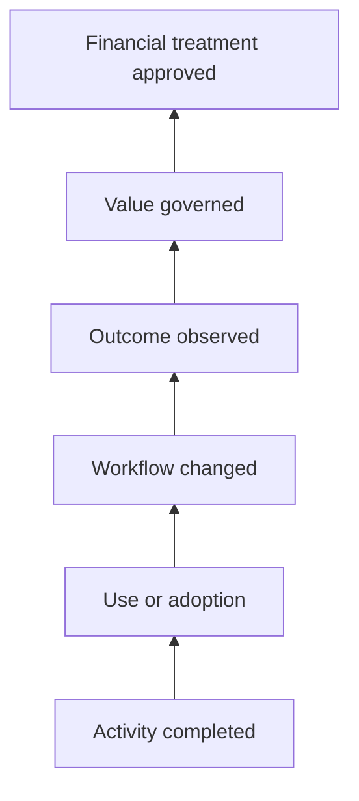

## Template I-T16 - Bad-news communication

**Use:** Communicate a missed result, defect, delay, or material unknown early. State facts, impact, containment, uncertainty, ownership, next evidence time, and decision need. Do not soften the headline until it becomes misleading.

**Fillable blank:**

| Block | Fillable prompt |
|---|---|
| Headline | What materially failed or changed? |
| Confirmed facts and clock | What is supported, where, and as of when? |
| Impact and affected scope | What is observed versus possible? |
| What is not known | Which cause, scope, outcome, or ETA is unsupported? |
| Immediate safe action | What was authorized and completed? |
| Work underway | Which owners are testing which hypotheses? |
| Customer decision/help needed | What can the recipient decide or unblock? |
| Next update trigger/time | When will evidence be reviewed even if no resolution? |

**Fictional NMH sample:**

| Block | NMH synthetic response |
|---|---|
| Headline | Independent reproduction did not match the original aggregate |
| Confirmed facts and clock | Peer run on 2026-08-24 produced a different ambiguous-pair count |
| Impact and affected scope | Lab quality gate failed; no production system or customer data is affected |
| What is not known | Root cause and completion time are not yet supported |
| Immediate safe action | Expansion paused; input and outputs preserved read-only |
| Work underway | Lab owner checks version manifest; peer checks environment and query |
| Customer decision/help needed | None now; sponsor may protect the next review window |
| Next update trigger/time | Update at synthetic 16:00 or earlier after a discriminating result |

### Diagram I14 - Bad-news update discipline

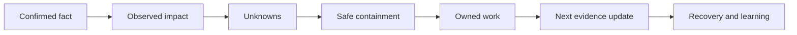

## Template I-T17 - Change communication pack

**Use:** Explain why a process, integration, policy, metric, or review cadence is changing. A change notice is incomplete without affected users, preparation, support, rollback/contingency, and validation.

**Fillable blank:**

| Change element | Fillable blank |
|---|---|
| Change ID/title |  |
| Why / objective |  |
| What changes and does not |  |
| Affected personas/cohorts |  |
| Effective window/time zone |  |
| Required preparation |  |
| Expected experience |  |
| Risk, privacy, accessibility |  |
| Support/escalation path |  |
| Rollback/contingency authority |  |
| Validation and success |  |
| Follow-up and record |  |

**Fictional NMH sample:**

| Change element | NMH synthetic response |
|---|---|
| Change ID/title | NMH-CHG-LAB-03: generated field set v0.4 |
| Why / objective | Remove an unnecessary email-like synthetic field |
| What changes and does not | Schema and fixtures change; no production connector exists |
| Affected personas/cohorts | Two fictional lab learners and reviewer |
| Effective window/time zone | 2026-09-02, 09:00-11:00 UTC synthetic |
| Required preparation | Preserve v0.3 manifest; use new folder |
| Expected experience | Queries may require explicit column list update |
| Risk, privacy, accessibility | Reduces identifier-like data; guide remains accessible text |
| Support/escalation path | Lab facilitator role |
| Rollback/contingency authority | Facilitator may return to read-only v0.3 for comparison |
| Validation and success | Schema test, row count, deterministic aggregate |
| Follow-up and record | Change log and learner note |

### Diagram I15 - Change adoption flow

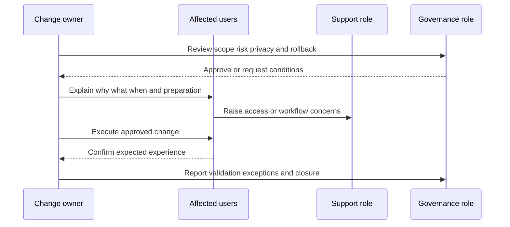

## Template I-T18 - Adoption and outcome communication

**Use:** Explain the path from enablement to behavior to workflow to outcome. Adoption percentages without an eligible population or meaningful use definition are not useful.

**Fillable blank:**

| Cohort | Eligible population | Enabled | Meaningful-use definition | Active count/rate | Workflow postcondition | Outcome evidence | Friction | Owner/action |
|---|---:|---:|---|---:|---|---|---|---|
|  |  |  |  |  |  |  |  |  |

**Fictional NMH sample:**

| Cohort | Eligible population | Enabled | Meaningful-use definition | Active count/rate | Workflow postcondition | Outcome evidence | Friction | Owner/action |
|---|---:|---:|---|---:|---|---|---|---|
| Synthetic analysts | 4 fictional roles | 3 | Completes query, explains limitation, records action | 3/4 | Correctly identifies ambiguous record and avoids merge | Three teach-backs; no production inference | One role lacks local tool | Facilitator provides approved portable option |

## Template I-T19 - Technical appendix index

**Use:** Give every summary a traceable path without crowding the main deck. Restrict access where details reveal sensitive architecture or investigation state.

**Fillable blank:**

| Appendix ID | Topic | Supports slide/claim | Evidence/reference | Scope/time | Classification | Owner | Access condition | Freshness/expiry |
|---|---|---|---|---|---|---|---|---|---|
|  |  |  |  |  |  |  |  |  |

**Fictional NMH sample:**

| Appendix ID | Topic | Supports slide/claim | Evidence/reference | Scope/time | Classification | Owner | Access condition | Freshness/expiry |
|---|---|---|---|---|---|---|---|---|---|
| NMH-APP-01 | Mapping rule tests | QBR slides 3-4 | Local test summary and manifest | Generated set v0.3, 2026-08-24 | Internal synthetic | Lab owner role | Named exercise team | Expires on generator/rule change |
| NMH-APP-02 | Field inventory | Decision request | Controlled schema review | Generated fields only | Internal synthetic | Privacy role | Governance reviewers | Review at v0.4 |

### Diagram I16 - Slide-to-evidence traceability

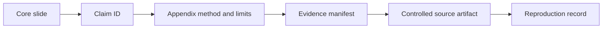

## Template I-T20 - Slide-by-slide quality review

**Use:** Review content, evidence, visual accessibility, privacy, and presentation behavior before release.

**Fillable blank:**

| Slide | One message? | Evidence/label | Scope/clock | Decision relevance | Accessible visual/text | Privacy/security | Speaker transition | Disposition |
|---:|---|---|---|---|---|---|---|---|
|  |  |  |  |  |  |  |  |  |

**Fictional NMH sample:**

| Slide | One message? | Evidence/label | Scope/clock | Decision relevance | Accessible visual/text | Privacy/security | Speaker transition | Disposition |
|---:|---|---|---|---|---|---|---|---|
| 4 | Yes | Synthetic claim NMH-C-01 | Fixed sample/v0.3/date | Supports quality gate | Direct labels; alt description drafted | Aggregates only | "Quality is necessary; workflow value is next" | Approved |
| 6 | No | Mixed risk and model claim | Production clock absent | Could imply risk reduction | Red/green only | Reveals sample hostnames | Split, relabel, remove identifiers | Rework |

## Template I-T21 - Workshop charter

**Use:** Define a workshop as a collaborative production session with an output, not a long presentation.

**Fillable blank:**

| Field | Fillable blank |
|---|---|
| Workshop title/purpose |  |
| Participants and roles |  |
| Learning/decision objectives |  |
| Inputs/prerequisites |  |
| In/out of scope |  |
| Activities |  |
| Outputs/acceptance |  |
| Safety/privacy/accessibility |  |
| Facilitation roles |  |
| Time boxes/breaks |  |
| Follow-up |  |

**Fictional NMH sample:**

| Field | NMH synthetic response |
|---|---|
| Workshop title/purpose | Resolve ambiguous synthetic asset identities and agree workflow |
| Participants and roles | Data, asset, privacy, service-owner, facilitator roles |
| Learning/decision objectives | Apply rule rubric; decide owner path; identify unknowns |
| Inputs/prerequisites | Generated sample, definitions, accessible worksheet |
| In/out of scope | Lab records only; no real scans, traffic, or tenant changes |
| Activities | Orient, classify examples, compare, design action, teach-back |
| Outputs/acceptance | Rule decisions, unresolved list, action register |
| Safety/privacy/accessibility | No real identifiers; captions; keyboard-accessible materials |
| Facilitation roles | Lead, scribe, timekeeper, technical observer |
| Time boxes/breaks | 90 minutes with a break and optional offline review |
| Follow-up | Accessible notes next business day |

### Diagram I17 - Workshop learning cycle

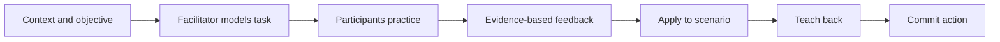

## Template I-T22 - Workshop agenda

**Use:** Show purpose, method, output, and accessibility for every block. Include breaks and buffer; cognitive load is a design constraint.

**Fillable blank:**

| Time | Block | Objective | Method | Participant action | Output | Lead | Material/access note |
|---|---|---|---|---|---|---|---|
|  |  |  |  |  |  |  |  |

**Fictional NMH sample:**

| Time | Block | Objective | Method | Participant action | Output | Lead | Material/access note |
|---|---|---|---|---|---|---|---|
| 00:00-00:10 | Welcome | Confirm outcome and boundaries | Verbal plus accessible slide | Ask clarifying questions | Shared goal | Facilitator | Captions and agenda sent ahead |
| 00:10-00:25 | Model | Explain identity rubric | Worked generated example | Annotate worksheet | Common vocabulary | Data role | Describe visual relationships |
| 00:25-00:50 | Practice | Apply rubric | Small groups | Classify six records | Decisions/evidence | Table leads | Keyboard-ready sheet |
| 00:50-01:00 | Break | Reduce fatigue | Pause | Optional questions offline | None | Timekeeper | Fixed return time |
| 01:00-01:20 | Design | Map owner workflow | Whiteboard/template | Assign fictional roles | Draft workflow | Program role | Scribe reads board aloud |
| 01:20-01:30 | Teach-back/close | Test transfer | Participant explanation | Explain rule and limit | Evaluation/actions | Facilitator | Multiple response modes |

## Template I-T23 - Facilitator run of show

**Use:** Separate visible participant agenda from backstage prompts, timing, transitions, decision gates, and contingency.

**Fillable blank:**

| Time/trigger | On-screen state | Facilitator words/question | Expected response | Probe/redirect | Decision/output | Contingency | Scribe cue |
|---|---|---|---|---|---|---|---|
|  |  |  |  |  |  |  |  |

**Fictional NMH sample:**

| Time/trigger | On-screen state | Facilitator words/question | Expected response | Probe/redirect | Decision/output | Contingency | Scribe cue |
|---|---|---|---|---|---|---|---|
| 00:25 | Generated pair A/B | "Which evidence supports merge or separation?" | Cite namespace and lifecycle | "What alternative explains similarity?" | Keep separate pending owner | Use text-only copy if board fails | Record evidence and unknown |
| 01:20 | Blank teach-back card | "Explain the rule to a new analyst" | Meaning, why, guardrail | Ask for failure mode | Pass/recoach | Accept written response | Record rubric result only |

## Template I-T24 - Virtual-session logistics

**Use:** Plan access, resilience, participation, privacy, and support for remote delivery.

**Fillable blank:**

| Area | Plan | Owner | Check time | Contingency | Privacy/accessibility evidence |
|---|---|---|---|---|---|
| Platform/access |  |  |  |  |  |
| Captions/audio |  |  |  |  |  |
| Materials/permissions |  |  |  |  |  |
| Breakout rooms |  |  |  |  |  |
| Demo/lab |  |  |  |  |  |
| Recording/transcript |  |  |  |  |  |
| Support channel |  |  |  |  |  |
| Time zones/breaks |  |  |  |  |  |

**Fictional NMH sample:**

| Area | Plan | Owner | Check time | Contingency | Privacy/accessibility evidence |
|---|---|---|---|---|---|
| Platform/access | Approved meeting room and guest test | Coordinator role | 24 hours before | Dial-in plus accessible PDF | Guest/access check recorded |
| Captions/audio | Live captions enabled; microphones tested | Producer role | 30 minutes before | Transcript only if approved | Caption check |
| Materials/permissions | Read-only generated workbook | Lab owner | Day before | Screen-share static examples | No real data |
| Recording/transcript | Off by default | Sponsor role | At start | Written summary | Consent and retention decision required |

## Template I-T25 - On-site logistics

**Use:** Plan room, travel, physical access, device/network constraints, privacy, safety, materials, and hybrid inclusion.

**Fillable blank:**

| Area | Requirement | Owner | Confirmation | Contingency | Constraint/handling |
|---|---|---|---|---|---|
| Site/visitor access |  |  |  |  |  |
| Room/layout |  |  |  |  |  |
| Display/audio/power |  |  |  |  |  |
| Network/device |  |  |  |  |  |
| Accessibility |  |  |  |  |  |
| Whiteboard/materials |  |  |  |  |  |
| Sensitive disposal |  |  |  |  |  |
| Hybrid participants |  |  |  |  |  |
| Emergency/contact |  |  |  |  |  |

**Fictional NMH sample:**

| Area | Requirement | Owner | Confirmation | Contingency | Constraint/handling |
|---|---|---|---|---|---|
| Site/visitor access | Fictional visitor roster | Host role | Prior day | Remote fallback | No personal details in deck |
| Room/layout | U-shape plus clear path | Facilities role | Morning check | Adjacent room | Accommodations handled privately |
| Network/device | Offline local synthetic lab | Lab owner | Test checksum | Printed/static walkthrough | No customer network access required |
| Sensitive disposal | Collect fictional worksheets | Facilitator | End of session | Approved disposal bin | Do not leave notes in room |

### Diagram I18 - Delivery mode decision

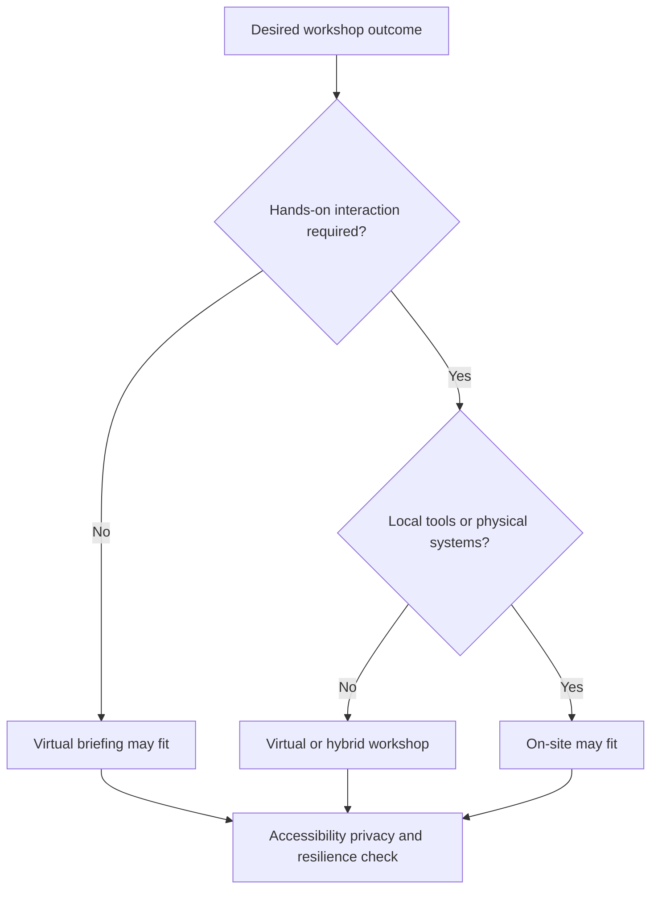

## Template I-T26 - Demo plan

**Use:** A demo proves a bounded capability or workflow. It does not prove production suitability, risk reduction, scale, or contractual entitlement.

**Fillable blank:**

| Demo field | Fillable blank |
|---|---|
| Audience/outcome |  |
| Claim being demonstrated |  |
| Environment/data label |  |
| Preconditions |  |
| Script checkpoints |  |
| Expected observable result |  |
| Known limits/non-claims |  |
| Privacy/safety controls |  |
| Failure fallback |  |
| Questions/parking lot |  |
| Evidence captured |  |

**Fictional NMH sample:**

| Demo field | NMH synthetic response |
|---|---|
| Audience/outcome | Technical owners understand a local reconciliation workflow |
| Claim being demonstrated | A deterministic rule can preserve source IDs and flag ambiguity |
| Environment/data label | Local generated fixtures v0.3; no paid product access |
| Preconditions | Approved files, read-only inputs, known hash |
| Script checkpoints | Inspect schema; run prepared query; review flagged pair; export summary |
| Expected observable result | Fixed sample aggregate matches documented result |
| Known limits/non-claims | No production scale, product UI, security efficacy, or risk claim |
| Privacy/safety controls | Synthetic names; no credentials, traffic collection, or external connection |
| Failure fallback | Use captured output labeled prior run; state live failure honestly |
| Questions/parking lot | Record product-specific questions for official verification |
| Evidence captured | Screenshot with version/date and manifest reference |

### Diagram I19 - Demo with honest fallback

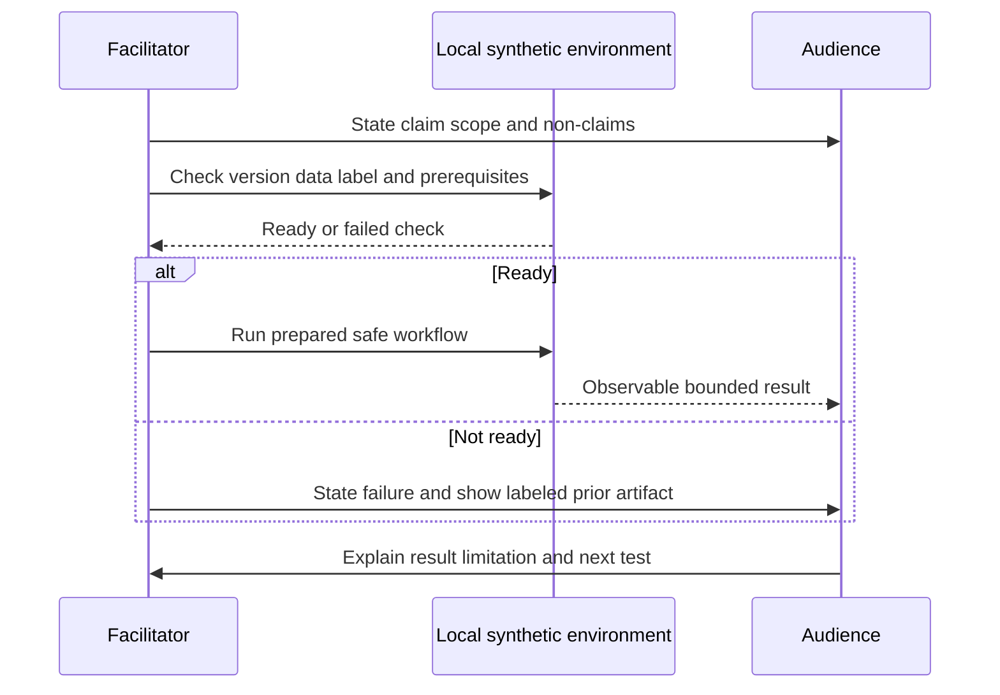

## Template I-T27 - Hands-on lab guide

**Use:** Give learners a safe, deterministic path with explicit expected results, troubleshooting, cleanup, and reflection. See [Part 111](Part-111-safe-lab-evidence-honesty.md) and [Appendix K](Appendix-K-lab-dataset-tooling.md) for the definitive lab evidence standard.

**Fillable blank:**

| Lab block | Fillable content |
|---|---|
| Objective and learner level |  |
| Safe boundaries/non-goals |  |
| Prerequisites and versions |  |
| Synthetic inputs and hashes |  |
| Steps/checkpoints |  |
| Expected result |  |
| Troubleshooting branch |  |
| Evidence to capture |  |
| Cleanup/privacy |  |
| Reflection/teach-back |  |

**Fictional NMH sample:**

| Lab block | NMH synthetic content |
|---|---|
| Objective and learner level | Beginner explains why two similar rows remain separate |
| Safe boundaries/non-goals | Local generated data; no scan, interception, bypass, tenant, or live traffic |
| Prerequisites and versions | Approved local SQL option and text editor; versions recorded |
| Synthetic inputs and hashes | assets_source_a.csv and b.csv; manifest contains checksums |
| Steps/checkpoints | Verify hash; inspect columns; run read-only query; examine ambiguity; export aggregate |
| Expected result | Documented row count and flagged-pair count for v0.3 |
| Troubleshooting branch | Check path, delimiter, types, version, then compare manifest |
| Evidence to capture | Command/query text, output, screenshot, timestamp, claim label |
| Cleanup/privacy | Delete temporary output per lab policy; retain approved portfolio summaries |
| Reflection/teach-back | Explain evidence, alternate cause, and why no production claim follows |

### Diagram I20 - Lab learning and evidence loop

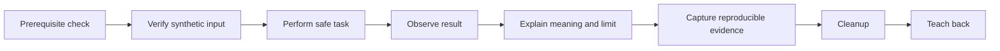

## Template I-T28 - Accessibility release check

**Use:** Apply to decks, memos, dashboards, workshops, demos, labs, emails, and exported files. Follow the customer's standards and applicable law; this checklist is not legal conformance certification.

**Fillable blank:**

| Check | Pass/fail/NA | Evidence | Issue | Owner/date |
|---|---|---|---|---|
| Logical heading/reading order |  |  |  |  |
| Descriptive title and link text |  |  |  |  |
| Sufficient contrast and no color-only meaning |  |  |  |  |
| Readable type and uncluttered layout |  |  |  |  |
| Alt text or nearby description |  |  |  |  |
| Charts include labels, units, denominator, clock |  |  |  |  |
| Tables have headers and simple structure |  |  |  |  |
| Captions/transcript and audio quality |  |  |  |  |
| Keyboard/focus behavior for interactive content |  |  |  |  |
| Acronyms/jargon explained |  |  |  |  |
| Accessible exported format tested |  |  |  |  |
| Accommodation path communicated privately |  |  |  |  |

**Fictional NMH sample:**

| Check | Pass/fail/NA | Evidence | Issue | Owner/date |
|---|---|---|---|---|
| No color-only meaning | Pass | Trend uses direct text labels and line patterns | None | Deck owner / synthetic date |
| Alt text or nearby description | Fail | Architecture image lacks description | Blocks release | Technical author / before review |
| Captions/transcript | Pass | Caption test complete; recording remains off | None | Producer role |
| Exported format tested | Pending | PDF check scheduled | Release conditional | Deck owner |

## Template I-T29 - Privacy and security release check

**Use:** Confirm purpose, minimization, authority, classification, access, retention, redaction, and safe distribution before any artifact leaves the working team.

**Fillable blank:**

| Check | Decision/evidence | Risk if absent | Owner/approver | Disposition |
|---|---|---|---|---|
| Purpose and audience |  |  |  |  |
| Data classification |  |  |  |  |
| Minimum necessary fields |  |  |  |  |
| Personal/regulated content removed or approved |  |  |  |  |
| Secrets/tokens/cookies/credentials absent |  |  |  |  |
| Technical path detail restricted |  |  |  |  |
| Screenshots redacted and metadata checked |  |  |  |  |
| Approved storage/channel/access |  |  |  |  |
| Retention/deletion/recording decision |  |  |  |  |
| External/third-party sharing approved |  |  |  |  |
| Legal/contract/customer policy checked |  |  |  |  |

**Fictional NMH sample:**

| Check | Decision/evidence | Risk if absent | Owner/approver | Disposition |
|---|---|---|---|---|
| Purpose and audience | Phase-2 lab decision; named fictional roles | Unnecessary distribution | Sponsor role | Pass |
| Minimum necessary fields | Remove unused email-like generated field | Identifier habit and confusion | Privacy role | Conditional |
| Secrets absent | Static scan/manual review of synthetic files | Credential exposure | Lab owner | Pass |
| Screenshots | Crop local path containing real user name | Personal metadata | Deck owner | Rework |
| Storage/channel | Approved local workspace only | Uncontrolled copy | Program role | Pass |

### Diagram I21 - Artifact release gate

```mermaid
flowchart TD
    ART[Artifact ready] --> CLAIM{Claims reviewed?}
    CLAIM -- No --> HOLD[Hold]
    CLAIM -- Yes --> ACC{Accessibility passed?}
    ACC -- No --> FIX[Remediate]
    ACC -- Yes --> PRIV{Privacy security passed?}
    PRIV -- No --> FIX
    PRIV -- Yes --> AUTH{Approver and channel valid?}
    AUTH -- No --> HOLD
    AUTH -- Yes --> REL[Release and log version]
```

### Plain-English deep-dive 3 - Accessibility and privacy change the design

Accessibility is not adding alt text at the last minute, and privacy is not blurring one screenshot after distribution. Both change what you collect and how you present. A chart designed with direct labels works for people who cannot distinguish color and is faster for everyone. An aggregate table that omits user identifiers is safer and often clearer. Good constraints improve the artifact because they force the author to identify what the audience truly needs.

## Template I-T30 - Teach-back card and rubric

**Use:** Test whether a learner can explain and apply the concept, not merely repeat a definition.

**Fillable blank:**

| Teach-back element | Learner response | Evidence/example | Facilitator rating | Feedback/next attempt |
|---|---|---|---|---|
| Plain meaning |  |  |  |  |
| Why it matters |  |  |  |  |
| Process/flow |  |  |  |  |
| Evidence needed |  |  |  |  |
| Limitation/failure mode |  |  |  |  |
| Safe application |  |  |  |  |

**Rubric:**

| Level | Observable behavior | Facilitator response |
|---|---|---|
| 0 - Not yet | Cannot explain or applies unsafe/unsupported claim | Re-model concept; do not authorize independent task |
| 1 - Recall | Gives definition but no mechanism or boundary | Ask for example and limitation |
| 2 - Apply | Uses concept correctly in familiar generated case | Add alternate case and evidence question |
| 3 - Transfer | Explains, applies, challenges assumptions, and sets safe guardrails | Record pass; invite peer coaching |

**Fictional NMH sample:**

| Teach-back element | Learner response | Evidence/example | Facilitator rating | Feedback/next attempt |
|---|---|---|---|---|
| Plain meaning | "Entity resolution decides whether records refer to the same thing" | Generated source A/B pair | 3 | Clear |
| Why it matters | "A false merge can assign evidence to the wrong asset" | Ambiguous pair 18 | 3 | Add lifecycle example |
| Evidence needed | Stable IDs, namespace, lifecycle, owner context, provenance | Worksheet | 2 | Distinguish asserted owner from verified owner |
| Limitation/failure mode | Similar names do not prove identity | Keep-separate rule | 3 | Clear |
| Safe application | Human review before any high-impact merge | Lab only | 3 | Pass |

### Diagram I22 - Teach-back decision

```mermaid
flowchart TD
    L[Learner explains meaning] --> M[Explains mechanism]
    M --> E[Names evidence]
    E --> LIM[Names limit or failure]
    LIM --> A[Applies safely]
    A --> T{Can transfer to new case?}
    T -- Yes --> PASS[Pass and reinforce]
    T -- No --> COACH[Coach and retry]
```

## Template I-T31 - Training evaluation plan

**Use:** Evaluate reaction, learning, behavior, and outcome separately. A satisfaction score does not prove learning, and a quiz does not prove workplace transfer.

**Fillable blank:**

| Level | Question | Measure/method | Baseline | Target source | Timing | Population | Limit | Owner/action |
|---|---|---|---|---|---|---|---|---|
| Reaction |  |  |  |  |  |  |  |  |
| Learning |  |  |  |  |  |  |  |  |
| Behavior |  |  |  |  |  |  |  |  |
| Outcome |  |  |  |  |  |  |  |  |

**Fictional NMH sample:**

| Level | Question | Measure/method | Baseline | Target source | Timing | Population | Limit | Owner/action |
|---|---|---|---|---|---|---|---|---|
| Reaction | Was format usable? | Anonymous accessibility/usability pulse | None | No numerical target invented | End | 4 fictional roles | Tiny cohort | Fix friction |
| Learning | Can learner explain safe identity decision? | Teach-back rubric | Pre-check | Charter says level 2+ | End | 4 roles | Facilitator judgment | Recoach below 2 |
| Behavior | Is rubric used in simulated workflow? | Worksheet audit | Not used | 3 of 3 test cases documented | One week synthetic | 3 operators | Simulation only | Observe second run |
| Outcome | Does ambiguity get owned rather than auto-merged? | Action-register postcondition | Unknown | All flagged cases have disposition | Exercise close | Generated cases | No production inference | Review workflow |

## Template I-T32 - Action register

**Use:** Record one observable action per row. A person can be responsible for work, while a different accountable owner approves the outcome or risk decision.

**Fillable blank:**

| Action ID | Decision/outcome link | Action | Responsible | Accountable | Due/time zone | Dependency | Status/evidence | Validation postcondition | Escalation trigger |
|---|---|---|---|---|---|---|---|---|---|
|  |  |  |  |  |  |  |  |  |  |

**Fictional NMH sample:**

| Action ID | Decision/outcome link | Action | Responsible | Accountable | Due/time zone | Dependency | Status/evidence | Validation postcondition | Escalation trigger |
|---|---|---|---|---|---|---|---|---|---|
| NMH-A-31 | NMH-D-14 | Remove unused generated field and version fixture | Lab engineer role | Data owner role | 2026-09-02 16:00 UTC synthetic | Privacy decision | Open | Schema test passes and manifest changes | Decision not received by prior day |
| NMH-A-32 | Quality gate | Reproduce v0.4 aggregate independently | Peer role | Program role | 2026-09-05 synthetic | NMH-A-31 | Not started | Hash and documented aggregate match | Environment unavailable |

## Template I-T33 - Follow-up email

**Use:** Send a short, accessible record of decisions, actions, unknowns, and links. Do not attach unnecessary sensitive artifacts.

**Fillable blank:**

| Email element | Fillable content |
|---|---|
| Subject | [Review ID] decisions, actions, and next checkpoint |
| Opening | Thank participants; restate purpose and as-of date |
| Outcomes |  |
| Decisions made/deferred |  |
| Material facts and unknowns |  |
| Actions with owner/date |  |
| Risks/dependencies/escalations |  |
| Approved artifact links |  |
| Next checkpoint |  |
| Correction/contact path |  |

**Fictional NMH sample email:**

| Email element | NMH synthetic content |
|---|---|
| Subject | NMH-QBR-2026-Q3: narrow lab validation approved with gates |
| Opening | Thank you. The review covered generated evidence through 2026-08-24 and sought a phase decision. |
| Outcomes | Quality improved in the fixed sample; workflow value and production state remain unproven. |
| Decisions made/deferred | Sponsor approved narrow validation after privacy field approval; dashboard expansion deferred. |
| Material facts and unknowns | Eighteen ambiguous pairs remain; no enterprise-risk or product-performance claim was made. |
| Actions with owner/date | NMH-A-31 and A-32 are in the linked accessible register. |
| Risks/dependencies/escalations | Privacy decision gates the fixture update. |
| Approved artifact links | Controlled synthetic deck, appendix, manifest, and minutes. |
| Next checkpoint | Review peer reproduction and simulated workflow after gates. |
| Correction/contact path | Reply to the program role with factual corrections; decision changes go to sponsor role. |

## Template I-T34 - Parking lot and FAQ register

**Use:** Preserve unanswered questions without improvising product, legal, contractual, or roadmap claims live.

**Fillable blank:**

| Question ID | Question | Category | What is known | Unknown/verification source | Owner | Due | Audience response | Final disposition |
|---|---|---|---|---|---|---|---|---|
|  |  | Technical / product / contract / policy / decision |  |  |  |  |  |  |

**Fictional NMH sample:**

| Question ID | Question | Category | What is known | Unknown/verification source | Owner | Due | Audience response | Final disposition |
|---|---|---|---|---|---|---|---|---|
| NMH-Q-08 | Does a named product expose this exact field in our tenant? | Product/tenant | Public concept is related | Current licensed docs and tenant behavior not checked | Product specialist role | Before next session | "We will verify; the lab field is source-neutral" | Open |
| NMH-Q-09 | Can the result be called savings? | Governance/finance | Exercise time declined | Finance classification and repeat evidence absent | Sponsor/finance roles | EBR prep | "We will call it a capacity hypothesis only" | Open |

## Template I-T35 - Audience variant rewrite matrix

**Use:** Keep one evidence base while changing altitude, vocabulary, and decision relevance. Do not change the underlying claim to make it more impressive.

**Fillable blank:**

| Core fact | Operator wording | Technical leader wording | CISO wording | Board wording | Prohibited overclaim |
|---|---|---|---|---|---|
|  |  |  |  |  |  |

**Fictional NMH sample:**

| Core fact | Operator wording | Technical leader wording | CISO wording | Board wording | Prohibited overclaim |
|---|---|---|---|---|---|
| 18 generated pairs remain ambiguous under v0.3 | Review these pairs; do not merge automatically | Quality gate remains open for identity workflow | Evidence is insufficient for broader automation | Management is gating expansion on identity quality | "Enterprise attack surface is reduced" |
| Peer result did not match | Compare versions, inputs, and query before rerun | Reproducibility control failed | Expansion paused pending evidence correction | Oversight gate operated as designed | "The platform is defective" |

## Template I-T36 - Rehearsal and speaker handoff

**Use:** Rehearse timing, transitions, questions, failure paths, and accessibility. Rehearsal is a content test, not just performance practice.

**Fillable blank:**

| Moment | Speaker | Message | Evidence/visual | Transition | Likely question | Approved answer boundary | Failure fallback | Time |
|---|---|---|---|---|---|---|---|---|
|  |  |  |  |  |  |  |  |  |

**Fictional NMH sample:**

| Moment | Speaker | Message | Evidence/visual | Transition | Likely question | Approved answer boundary | Failure fallback | Time |
|---|---|---|---|---|---|---|---|---|
| Quality slide | Data role | Fixed sample improved but gate remains | Direct-label comparison | "Quality alone is not value" | "Can we deploy now?" | No; only narrow synthetic test is supported | Use static accessible table | 2 min |
| Decision slide | TSM role | Narrow option best resolves unknowns | Option matrix | "Sponsor decision" | "What is the ETA?" | Give decision/checkpoint dates, not unsupported completion ETA | Record defer conditions | 3 min |

## Template I-T37 - Executive question preparation

**Use:** Prepare concise, evidence-bounded answers and identify questions that require another authority.

**Fillable blank:**

| Likely question | One-sentence answer | Evidence | Caveat | Decision relevance | Redirect/owner if outside authority |
|---|---|---|---|---|---|
|  |  |  |  |  |  |

**Fictional NMH sample:**

| Likely question | One-sentence answer | Evidence | Caveat | Decision relevance | Redirect/owner if outside authority |
|---|---|---|---|---|---|
| Did risk decrease? | We do not have production scenario/control evidence to support that conclusion. | Lab manifest only | Synthetic quality is not enterprise risk | Prevents false value claim | Risk owner defines assessment |
| When will it be done? | The next evidence checkpoint is after privacy approval and peer reproduction. | Action plan | Root cause and completion ETA unsupported | Sponsor can unblock decision | Owners provide estimates after evidence |
| Is this a product limitation? | No product conclusion follows from the source-neutral local lab. | Environment label | Tenant/product not tested | Avoids misrouting | Product specialist verifies official behavior |

## Template I-T38 - Trust-recovery communication

**Use:** When prior communication was wrong, late, inaccessible, or overconfident, acknowledge the exact failure and change the control that allowed it.

**Fillable blank:**

| Recovery element | Fillable response |
|---|---|
| What we got wrong |  |
| Corrected fact and evidence |  |
| Impact of the communication failure |  |
| What remains unknown |  |
| Immediate correction |  |
| Process/control improvement |  |
| Accountable owner/date |  |
| How recurrence will be measured |  |

**Fictional NMH sample:**

| Recovery element | NMH synthetic response |
|---|---|
| What we got wrong | Draft slide called a timed exercise "savings" |
| Corrected fact and evidence | One synthetic rerun took less time; finance treatment is absent |
| Impact of the communication failure | Could create an unsupported value expectation |
| What remains unknown | Repeatability, causal contribution, and financial relevance |
| Immediate correction | Replace with "capacity hypothesis" and notify recipients |
| Process/control improvement | Value-ledger and claim review become release gates |
| Accountable owner/date | Deck owner before redistribution |
| How recurrence will be measured | Slide QA samples contain value label and approval |

## Template I-T39 - Artifact package manifest

**Use:** Package the core deck, appendix, evidence references, action register, accessible exports, and version record without duplicating restricted data.

**Fillable blank:**

| Artifact ID | File/title | Purpose | Version/date | Hash/reference | Classification | Accessibility state | Approver | Retention/location | Supersedes |
|---|---|---|---|---|---|---|---|---|---|
|  |  |  |  |  |  |  |  |  |  |

**Fictional NMH sample:**

| Artifact ID | File/title | Purpose | Version/date | Hash/reference | Classification | Accessibility state | Approver | Retention/location | Supersedes |
|---|---|---|---|---|---|---|---|---|---|
| NMH-ART-01 | Q3 synthetic review | Decision deck | v1.0 / 2026-08-24 | Manifest reference only | Internal synthetic | Accessible PDF checked | Sponsor role | Approved workspace | Draft v0.9 |
| NMH-ART-02 | Technical appendix | Drill-down | v1.0 / 2026-08-24 | Manifest reference | Restricted synthetic | Heading/table check passed | Technical owner | Restricted folder | None |
| NMH-ART-03 | Action register | Closure | Live v1 | Controlled record | Internal synthetic | Accessible table | Program role | Governance folder | Prior minutes |

## Template I-T40 - Communication cadence and closure map

**Use:** Define which artifact goes to which audience, when, through which approved channel, and what closes the loop.

**Fillable blank:**

| Trigger/cadence | Audience | Artifact/message | Purpose | Owner | Channel/classification | Approval | Response/decision due | Closure evidence |
|---|---|---|---|---|---|---|---|---|
|  |  |  |  |  |  |  |  |  |

**Fictional NMH sample:**

| Trigger/cadence | Audience | Artifact/message | Purpose | Owner | Channel/classification | Approval | Response/decision due | Closure evidence |
|---|---|---|---|---|---|---|---|---|
| Monthly synthetic technical review | Technical roles | Quality pack and action register | Validate evidence/work | Lab owner | Approved internal folder | Technical reviewer | In meeting | Signed dispositions |
| Quarterly synthetic QBR | Leaders/sponsor | Outcome deck and decision cards | Govern next phase | TSM role | Approved meeting and PDF | Sponsor pre-read | Review date | Decision record |
| Material gate failure | Sponsor and owners | Bad-news update | Pause, inform, assign | Program role | Restricted email/channel | Incident/program lead | Next checkpoint | Corrected evidence and action |

## Communication patterns for common moments

| Moment | Lead sentence | Evidence discipline | Decision/action close |
|---|---|---|---|
| Positive result | "Within [scope/time], [measure] changed from [baseline] to [current]." | State definition, denominator, driver, alternative, and attribution | "Approve the next validation, not a broader claim." |
| Bad news | "[Expected result] was not achieved; [observed impact] is confirmed." | Separate fact, impact, cause hypothesis, and unknown ETA | "These owners are testing; next evidence update is [time/trigger]." |
| No change | "The measure is stable within comparable scope; this does not prove the system is static." | Check sensitivity, lag, and missing population | "Continue, change measure, or stop based on objective." |
| Metric break | "The series is not directly comparable because [source/definition/scope] changed." | Show a bridge and restated baseline where valid | "Approve revised definition and preserve old series." |
| Change request | "To achieve [objective], the team proposes [change] under [guardrails]." | State affected cohort, evidence, risk, rollback, and validation | "[Authority] approves/rejects/conditions by [date]." |
| Value claim | "Evidence supports [realized/capacity/modeled/qualitative/potential] value." | State baseline, attribution, confidence, and financial treatment | "Owner approves wording and next measure." |
| Roadmap question | "Public/current evidence supports [what]; [requested item/date] is unverified." | Do not infer confidential roadmap or entitlement | "Product/account owner verifies through approved source." |
| Product defect question | "Observed behavior is [fact]; product root cause is not yet established." | Preserve environment, reproduction, versions, alternatives | "Submit evidence package and await accountable finding." |

### Plain-English deep-dive 4 - Good value stories include the unproven step

A bridge diagram has solid spans and unfinished spans. A value story should show both. "Training completed" is an activity. "Operators used the rubric" is adoption. "Ambiguous records were routed correctly" is workflow evidence. "Material risk declined" requires a governed risk reassessment and often many other controls. Showing the unproven span makes the next investment clearer and makes the proven spans more credible.

## Slide design and delivery standards

| Design area | Minimum standard | Evidence/check |
|---|---|---|
| Title | Assertion or question that matches the slide | Read titles alone; they form a coherent story |
| Density | One main message; detail in appendix | Five-second message test |
| Text | Plain language, defined acronyms, readable size | Review at actual display/export size |
| Visual | Chosen for comparison/relationship, not decoration | Can presenter describe it without seeing color? |
| Chart | Metric, unit, denominator, scope, clock, source, uncertainty | Chart annotation checklist |
| Color | Sufficient contrast; never sole carrier of meaning | Accessibility checker plus human review |
| Images/screenshots | Necessary, cropped, redacted, described, versioned | Privacy and alt-description check |
| Animation | Only when sequence aids understanding; safe static export | PDF still communicates fully |
| Notes | Speaker boundary, transition, likely question | Rehearsal |
| Distribution | Correct version, classification, access, retention | Manifest and approval |

## Review-type comparison

| Dimension | Technical review | QBR | EBR | Board/CISO brief | Workshop/training |
|---|---|---|---|---|---|
| Primary outcome | Validate system/evidence/work | Govern quarterly outcomes/actions | Align strategic value/choices | Oversight and material decision | Build ability or co-create output |
| Detail | High | Medium with appendix | Low-medium | Very low with traceability | Progressive and task-based |
| Typical clock | Operational/as-of | Quarter and trend | Strategic horizon | Material event/cadence | Session plus transfer period |
| Evidence | Architecture, tests, logs/queries, health | Metrics, adoption, actions, support themes | Outcomes, risk, value, constraints | Scenarios, range, options, assurance | Demonstration, practice, teach-back |
| Ask | Technical decision/change | Owners, priority, roadmap | Investment/strategy/sponsorship | Oversight/risk decision | Participation, output, transfer action |
| Main failure | Detail without decision | Ticket/feature recital | Marketing narrative | False certainty | Lecture without practice |

## Meeting-day control sheet

| Phase | Check | Owner | Evidence |
|---|---|---|---|
| Before | Current approved version, audience, decision rights, pre-wire complete | Meeting owner | Manifest and invite |
| Before | Accessibility, privacy, classification, links, demo fallback | Producer/reviewers | Release check |
| Open | State purpose, scope, as-of date, labels, recording decision | Facilitator | Opening slide/minutes |
| During | Separate fact, interpretation, hypothesis, and decision | Speakers | Claim IDs/parking lot |
| During | Read visuals aloud; include remote participants; protect breaks | Facilitator | Run of show |
| Decide | Repeat exact decision, authority, conditions, owner, date | Decision owner/scribe | Decision record |
| Close | Read actions, unknowns, escalation, next checkpoint | Scribe | Action register |
| After | Send accessible summary through approved channel | Meeting owner | Distribution log |
| After | Correct errors visibly and validate closure | Artifact/action owners | Updated version/evidence |

## Interview-ready explanations

| Question | Concise model answer |
|---|---|
| How do you structure a QBR? | I begin with agreed outcomes, freeze and validate comparable evidence, present what changed and what remains unknown, connect adoption to workflow and value, surface constraints, and end with explicit decisions, owners, postconditions, and the next review. Technical detail remains traceable in an appendix. |
| How is an EBR different? | An EBR operates at strategic altitude: material outcomes, risk scenarios, value, partnership health, options, investment, and executive decisions. A QBR more often governs quarterly adoption, health, work, and commitments. The evidence base remains common. |
| How do you present bad news? | I lead with the material fact and observed impact, separate hypotheses and unknowns, state safe containment and owned work, avoid unsupported cause or ETA, identify any decision needed, and commit to the next evidence update even if resolution is not ready. |
| How do you communicate value? | I use an evidence ladder from activity to adoption, workflow, outcome, governed value, and approved financial treatment. I label realized, capacity, modeled, qualitative, and potential value separately and disclose attribution and uncertainty. |
| How do you make a board brief technical enough? | I state the objective, bounded scenario, current position, evidence scope, uncertainty, controls, options, decision, and oversight trigger. A linked technical appendix and manifest preserve drill-down without forcing operational detail into the board view. |
| How do you design training? | I define a learner behavior and safe postcondition, model it, provide generated practice, give feedback, require teach-back or transfer, evaluate learning separately from satisfaction, and close with actions and support. |
| How do you address accessibility and privacy? | I design them in: readable structure, color-independent meaning, descriptions, captions, keyboard-ready materials, minimum data, redacted metadata, approved access and retention. Both are release gates with owners and evidence. |
| What do you do when asked an unverified product or roadmap question? | I state what is known and its source, label the unknown, avoid improvising entitlement or roadmap, record the question, assign the correct product/account owner, and return with a dated authoritative answer. |

## Thirty-second memory hooks

| Topic | Memory hook |
|---|---|
| Review story | Objective -> evidence -> meaning -> choice -> owner -> validation. |
| QBR | Quarter, outcomes, adoption, constraints, decisions, next proof. |
| EBR | Strategy, material change, value, options, sponsorship. |
| Board brief | Scenario and oversight, not operational queue. |
| Dashboard | Define, compare, explain, challenge, act. |
| Bad news | Fact first; impact, unknowns, owners, next evidence. |
| Value | Activity is not adoption; adoption is not outcome; outcome is not booked savings. |
| Workshop | People produce and practice; they do not only watch. |
| Teach-back | Explain meaning, mechanism, evidence, limit, and safe use. |
| Accessibility/privacy | Design gate, not final decoration. |
| Decision | Owner, options, evidence, deadline, postcondition. |
| Appendix | Executive compression with a traceable evidence path. |

## Source and honesty boundaries

| Boundary | This appendix supports | It does not establish |
|---|---|---|
| General communication practice | Audience design, narrative, decisions, learning, follow-through | Universal corporate template or legal requirement |
| Public product context | A method for attributing and dating official claims | Current feature, entitlement, metric, roadmap, SLA, or tenant behavior |
| Synthetic NMH | Safe worked examples and rehearsal | Real customer, patient, product, incident, result, or value evidence |
| Executive risk | Bounded scenarios, choices, oversight, uncertainty | Board-approved appetite, audited risk, forecast, or risk acceptance |
| Training | Objectives, practice, teach-back, evaluation | Certification, production authorization, or proof of behavior transfer |
| TSM role | Facilitation, translation, evidence quality, action closure | Legal/privacy approval, production change authority, risk acceptance, or product RCA |

## Completion checklist

- [x] Exactly one H1 uses the master-linked Appendix I title.
- [x] Forty numbered reusable templates cover technical review, QBR, EBR, board/CISO brief, one-page risk memo, dashboard narrative, decision requests, technical appendix, workshops, facilitator notes, virtual/on-site logistics, demos, labs, teach-back, evaluation, actions, and follow-up email.
- [x] Every numbered template includes a clearly labeled fillable blank and a fictional NMH sample or worked application; no unlabeled placeholder is intended as completed content.
- [x] QBR and EBR sections provide slide-by-slide blank storyboards and fictional NMH examples; audience variants cover operator through board altitude.
- [x] Bad-news, change, value, trust-recovery, product/roadmap-boundary, and decision communication are explicit.
- [x] Twenty-two numbered Mermaid diagrams and substantially more than thirty-five tables are included.
- [x] Four Plain-English deep-dives explain decision interfaces, honest compression, accessibility/privacy design, and value-evidence gaps.
- [x] Accessibility and privacy/security release checks apply to decks, dashboards, workshops, demos, labs, emails, recordings, and exports.
- [x] No unsupported product behavior, roadmap, ETA, root cause, risk reduction, financial value, or customer claim is presented.
- [x] Content is ASCII, uses balanced fences, labels all NMH material synthetic, includes the exact 2026-08-24 currency date, and links to the master, Appendix H, Appendix J, Part 111, and Appendix K.

[Back to the master study guide](../Zscaler%20SecOps%20Technical%20Success%20Manager%20-%20Complete%20Study%20Guide.md) | [Previous appendix: Risk Register, Mitigation, and Decision Templates](Appendix-H-risk-mitigation-decision-templates.md) | [Next appendix: Escalation, Incident, RCA, and Handoff Templates](Appendix-J-escalation-incident-rca-templates.md)
