# Appendix J - Escalation, Incident, RCA, and Handoff Templates

> **Purpose:** Provide reusable, evidence-led templates for escalation, incident coordination, executive communication, recovery, closure, post-incident review (PIR), blameless root-cause analysis (RCA), corrective action, recurrence tracking, follow-the-sun handoff, and critical-account recovery. The templates support coordination and documentation; they do not replace an organization's incident command, emergency, legal, privacy, safety, change, or support procedures.
>
> **Currency and source note:** General incident-management, security-response, service-management, evidence, customer-success, privacy, safety, and blameless-learning practices were reviewed on **2026-08-24**. Product behavior, support processes, severity definitions, contracts, regulations, reporting duties, customer policies, and organizational runbooks change. Current authoritative sources, approved incident plans, legal/privacy direction, contractual support channels, and accountable incident/customer leaders govern production.
>
> **Official/general/synthetic boundary:** Nothing below is an official Zscaler severity, SLA, escalation path, support entitlement, bridge role, diagnostic procedure, product root cause, workaround, ETA, or commitment. Northstar Meridian Holdings (NMH), all incidents, people/roles, services, times, evidence, defects, impacts, communications, causes, and actions are fictional and synthetic. Samples demonstrate disciplined form and must never be represented as customer or product history.
>
> **Safety and privacy:** Do not run unapproved scans, collect live traffic, disable security controls, bypass policy, expose secrets, change production, contact third parties, or disclose regulated/personal data because a template suggests urgency. Use least privilege, minimum evidence, authorized channels, approved change/rollback, need-to-know distribution, legal/privacy escalation, and human decision authority. Never invent an ETA, scope, severity, attribution, root cause, recovery, or recurrence claim.

[Back to the master study guide](../Zscaler%20SecOps%20Technical%20Success%20Manager%20-%20Complete%20Study%20Guide.md) | [Previous appendix: QBR, EBR, Executive Deck, and Training Templates](Appendix-I-qbr-executive-training-templates.md) | [Next appendix: Lab Dataset, Tooling, and Evidence Portfolio Guide](Appendix-K-lab-dataset-tooling.md)

## Incident operating principles

| Principle | Required behavior | Failure prevented |
|---|---|---|
| Follow customer command | Use the approved incident commander, safety, emergency, change, legal, privacy, and support processes | A TSM or template silently taking authority |
| Impact first | State observed user/business/security effect, scope, start/clock, and confidence | Severity based on emotion or account size alone |
| Facts before causes | Separate observation, evidence, hypothesis, contributing factor, and validated cause | Early theory becoming official RCA |
| Time discipline | Preserve source time, observed time, received time, time zone, and corrections | False sequence and misleading duration |
| Safe parallelism | Assign bounded workstreams with one lead, question, evidence, and stop condition | Duplicate or harmful troubleshooting |
| Change control | Record authority, expected result, risk, rollback, and validation before action | Urgency bypassing governance |
| Communication cadence | Update on time even when the answer is "no material change" | Silence and improvised certainty |
| ETA discipline | Give next checkpoint; give restoration estimates only from accountable evidence | Unsupported promises |
| Recovery is tested | Validate business transactions, controls, data, exceptions, and monitoring | "Graph is green" mistaken for recovery |
| Blameless learning | Analyze system conditions and decision context; hold actions accountable without personal blame | Defensive RCA and hidden evidence |
| Close the loop | Convert lessons into owned, testable, governed improvements | PIR documents without change |
| Minimize evidence | Collect the least data needed; redact, classify, restrict, retain, and delete appropriately | Incident response creating another incident |

### Diagram J01 - Incident lifecycle

```mermaid
flowchart LR
    DET[Detect or report] --> INTAKE[Validate intake and impact]
    INTAKE --> CMD[Activate approved command]
    CMD --> TRIAGE[Evidence and hypotheses]
    TRIAGE --> RESP[Authorized response work]
    RESP --> REC[Recovery validation]
    REC --> CLOSE[Closure decision]
    CLOSE --> PIR[Blameless PIR and RCA]
    PIR --> IMP[Corrective actions]
    IMP --> VERIFY[Effectiveness and recurrence review]
```

## Status vocabulary and confidence

| Label | Meaning | Allowed wording |
|---|---|---|
| Reported | A person/system supplied a symptom; not yet independently confirmed | "Reported by [source] at [time]" |
| Observed | Evidence shows a bounded state from a stated vantage and time | "Observed in [scope/vantage]" |
| Confirmed impact | Accountable owner accepts evidence of business/user/security effect | "Confirmed impact is..." |
| Hypothesis | Testable explanation that may be wrong | "Current hypothesis; alternatives remain" |
| Contributing factor | Condition that increased likelihood, impact, duration, or detection delay | "Contributed within this scenario" |
| Root cause | Causal explanation supported by evidence and review, with counterfactual reasoning | "RCA-approved cause as of [date]" |
| Mitigated | Impact reduced or workaround active; underlying condition may remain | "Impact mitigated; permanent correction open" |
| Recovered | Approved recovery criteria passed for stated scope/time | "Recovery validated within [scope]" |
| Closed | Accountable authority accepts closure and remaining actions/risk path | "Incident closed; actions continue" |
| Unknown | Evidence absent, stale, or conflicting | "Unknown; owner and next evidence step are..." |

### Diagram J02 - Claim maturity

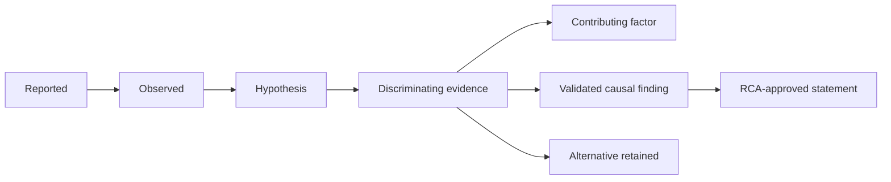

### Plain-English deep-dive 1 - Incident command is air-traffic control

Air-traffic control does not repair aircraft; it keeps many actors from colliding while specialists do their work. Incident command similarly establishes authority, priorities, roles, cadence, and decision records. Support, product, networking, identity, application, security, and customer teams may each own technical work. The coordinator makes their questions and dependencies visible without pretending to own every system or authorize every change.

## Template J-T01 - Incident/escalation charter

**Use:** Establish the record, purpose, authority, boundaries, and handling before work spreads across channels.

**Fillable blank:**

| Field | Fillable blank |
|---|---|
| Incident/escalation ID and title |  |
| Trigger/source and received time |  |
| Customer incident commander |  |
| Technical lead / communications lead |  |
| Business/service owner |  |
| Objective and current priority |  |
| In scope / out of scope |  |
| Approved channels/bridge |  |
| Classification and privacy/legal path |  |
| Change authority and emergency process |  |
| Cadence and next checkpoint |  |
| Closure authority |  |

**Fictional NMH sample:**

| Field | NMH synthetic example |
|---|---|
| Incident/escalation ID and title | NMH-INC-042: synthetic scheduling sign-in failures |
| Trigger/source and received time | Fictional help-desk spike received 2026-08-24 13:05 UTC |
| Customer incident commander | NMH incident commander role |
| Technical lead / communications lead | Identity lead role / customer communications role |
| Business/service owner | Scheduling service owner role |
| Objective and current priority | Restore approved synthetic journey while preserving security/privacy |
| In scope / out of scope | Generated logs and simulated service; no production, patient data, scanning, or security bypass |
| Approved channels/bridge | Fictional controlled bridge and incident record |
| Classification and privacy/legal path | Internal synthetic; escalate any unexpected real data immediately |
| Change authority and emergency process | Customer role only; lab is read-only by default |
| Cadence and next checkpoint | 30-minute evidence update; sooner on material change |
| Closure authority | Customer incident commander with service owner validation |

## Template J-T02 - Severity intake

**Use:** Record severity using the customer's definitions and contracts. Account importance may alter communication and leadership attention, but should not silently alter technical impact facts.

**Fillable blank:**

| Intake field | Fillable value |
|---|---|
| Reporter/contact/channel |  |
| First report / observed start / time zone |  |
| Affected service/journey |  |
| Observed symptom |  |
| User/site/region/cohort scope |  |
| Business/security/safety impact |  |
| Availability of workaround |  |
| Data/confidentiality/integrity concern |  |
| Customer severity definition/version |  |
| Proposed severity and rationale |  |
| Conflicts/unknowns |  |
| Assessor/approver/reassessment trigger |  |

**Fictional NMH sample:**

| Intake field | NMH synthetic value |
|---|---|
| Reporter/contact/channel | Help-desk role through fictional incident channel |
| First report / observed start / time zone | Report 13:00; earliest generated event 12:52 UTC |
| Affected service/journey | Synthetic scheduling federated sign-in |
| Observed symptom | Redirect loop for one generated cohort |
| User/site/region/cohort scope | 42 of 100 generated attempts in region A fixture; other regions untested |
| Business/security/safety impact | Simulated booking delay; no real safety or patient impact |
| Availability of workaround | Unknown; no bypass proposed |
| Data/confidentiality/integrity concern | None observed in generated data; not a production conclusion |
| Customer severity definition/version | Fictional NMH matrix v1.2 must be consulted |
| Proposed severity and rationale | Customer commander assigns after service-owner impact confirmation |
| Conflicts/unknowns | Start, all-region scope, and cause unknown |
| Assessor/approver/reassessment trigger | Commander role; reassess on scope, duration, data, or workaround change |

### Diagram J03 - Severity reasoning

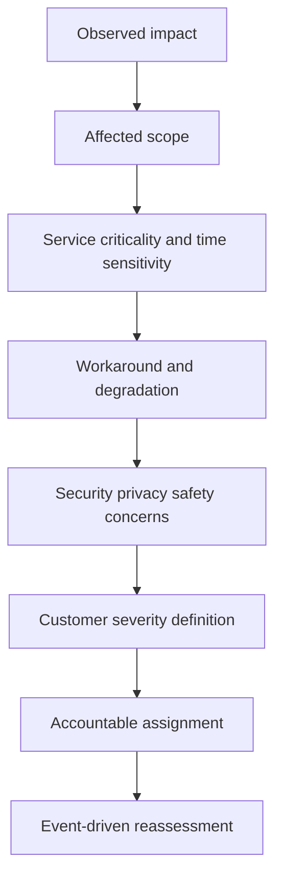

## Template J-T03 - Impact and scope statement

**Use:** Keep confirmed effects separate from possible effects. Count affected and eligible populations, and name the vantage that produced each count.

**Fillable blank:**

| Dimension | Confirmed/observed | Possible/not confirmed | Unaffected/known good | Evidence/time | Confidence | Owner/next test |
|---|---|---|---|---|---|---|
| Users/cohorts |  |  |  |  |  |  |
| Sites/regions |  |  |  |  |  |  |
| Services/journeys |  |  |  |  |  |  |
| Data/security |  |  |  |  |  |  |
| Business operations |  |  |  |  |  |  |
| Dependencies |  |  |  |  |  |  |

**Fictional NMH sample:**

| Dimension | Confirmed/observed | Possible/not confirmed | Unaffected/known good | Evidence/time | Confidence | Owner/next test |
|---|---|---|---|---|---|---|
| Users/cohorts | 42/100 generated attempts in cohort A looped | Remaining cohort A population | Cohort B sample passed | Fixture events 13:10 UTC | Medium | Identity role compares token-flow fixture |
| Sites/regions | Region A fixture | Other regions not tested | None claimed | Synthetic test source | Low | Service role runs approved static cases |
| Data/security | No generated disclosure signal | Production confidentiality/integrity unknown | Not applicable | Synthetic-only boundary | High for lab, none for production | Keep boundary explicit |
| Business operations | Simulated booking delay | Downstream confirmation delay | Existing synthetic sessions worked | Journey script | Medium | Service owner validates full journey |

### Diagram J04 - Scope expansion control

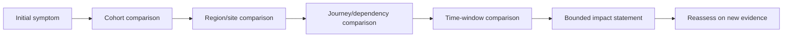

## Template J-T04 - First 15 minutes checklist

**Use:** A coordination checklist, not authority to change or investigate systems. The clock begins at accepted incident activation under customer policy.

**Fillable blank:**

| Minute/priority | Coordination action | Owner | Evidence/output | Safety/authority check | Done/time |
|---|---|---|---|---|---|
| 0-3 | Acknowledge, open record, preserve reporter wording/time |  |  |  |  |
| 0-5 | Confirm commander, service owner, technical and communications leads |  |  |  |  |
| 0-7 | State observed impact, scope, known good, and unknowns |  |  |  |  |
| 0-8 | Assign customer severity under approved definition |  |  |  |  |
| 0-10 | Establish bridge/channel, cadence, classification, and scribe |  |  |  |  |
| 0-12 | Protect evidence and define minimum safe requests |  |  |  |  |
| 0-13 | Open bounded workstreams with one question each |  |  |  |  |
| 0-14 | Identify decision/change/legal/privacy/support escalation needs |  |  |  |  |
| 0-15 | Issue first factual update and next checkpoint |  |  |  |  |

**Fictional NMH sample:**

| Minute/priority | Coordination action | Owner | Evidence/output | Safety/authority check | Done/time |
|---|---|---|---|---|---|
| 0-3 | Record generated-loop report and clocks | Scribe role | NMH-INC-042 opened | Synthetic data only | 13:08 |
| 0-5 | Confirm commander and leads | Commander role | Role roster | Customer authority retained | 13:09 |
| 0-7 | Bound cohort A observation | Service owner role | Impact table | No production inference | 13:11 |
| 0-10 | Open controlled bridge and 30-minute cadence | Communications role | Invite/minute record | Recording off by default | 13:12 |
| 0-13 | Identity, path, and app-fixture workstreams | Technical lead | Three questions | Read-only generated evidence | 13:14 |
| 0-15 | First update: impact observed, cause/ETA unknown | Communications role | Approved message | Commander approval | 13:15 |

### Diagram J05 - First 15 minutes

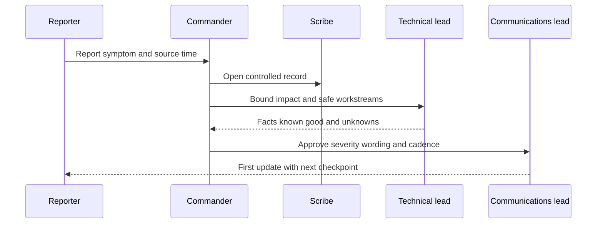

## Template J-T05 - Bridge activation and hygiene

**Use:** Keep the bridge usable, secure, and decision-centered.

**Fillable blank:**

| Bridge control | Plan/value | Owner | Evidence | Contingency |
|---|---|---|---|---|
| Approved meeting/channel |  |  |  |  |
| Invite/need-to-know |  |  |  |  |
| Recording/transcript decision |  |  |  |  |
| Commander/technical/comms/scribe |  |  |  |  |
| Current impact/status pinned |  |  |  |  |
| Cadence/time zones |  |  |  |  |
| Workstream breakout rule |  |  |  |  |
| Decision/change record |  |  |  |  |
| Evidence links/access |  |  |  |  |
| Conduct/fatigue/handoff |  |  |  |  |

**Fictional NMH sample:**

| Bridge control | Plan/value | Owner | Evidence | Contingency |
|---|---|---|---|---|
| Approved meeting/channel | Fictional controlled room | Commander role | Incident record | Alternate approved bridge |
| Invite/need-to-know | Named exercise roles only | Coordinator | Roster | Remove accidental attendee |
| Recording/transcript decision | Off; scribe creates approved minutes | Privacy role | Opening decision | Reassess only with consent/retention |
| Current impact/status pinned | Cohort A synthetic loop; cause/ETA unknown | Scribe | Timestamped status | Verbal repeat every update |
| Workstream breakout rule | One lead returns evidence, not speculation | Technical lead | Workstream table | Stop duplicate work |
| Conduct/fatigue/handoff | 60-minute lead rotation review | Commander | Handoff checkpoint | Add rested lead |

## Template J-T06 - Bridge RACI and authority matrix

**Use:** RACI means Responsible, Accountable, Consulted, and Informed. It clarifies contribution but never overrides formal incident authority.

**Fillable blank:**

| Activity/decision | Accountable | Responsible | Consulted | Informed | Authority limit | Escalation/backup |
|---|---|---|---|---|---|---|
| Incident command |  |  |  |  |  |  |
| Severity assignment |  |  |  |  |  |  |
| Technical diagnosis |  |  |  |  |  |  |
| Production change |  |  |  |  |  |  |
| Customer communication |  |  |  |  |  |  |
| Legal/privacy/reporting |  |  |  |  |  |  |
| Recovery acceptance |  |  |  |  |  |  |
| Support/Product escalation |  |  |  |  |  |  |
| Closure/PIR |  |  |  |  |  |  |

**Fictional NMH sample:**

| Activity/decision | Accountable | Responsible | Consulted | Informed | Authority limit | Escalation/backup |
|---|---|---|---|---|---|---|
| Incident command | NMH commander role | Coordinator role | Technical/service roles | Sponsor role | Customer exercise only | Backup commander role |
| Technical diagnosis | Technical lead role | Workstream leads | Support role | Commander | Generated read-only artifacts | Escalate conflicts to commander |
| Production change | Customer change authority | None in lab | Security/privacy roles | Bridge | No production action authorized | Follow customer process |
| Customer communication | Communications lead | Scribe/drafter | Commander/legal as needed | Named stakeholders | Approved facts only | Sponsor for executive message |
| Recovery acceptance | Commander | Service owner validates | Technical/security roles | Stakeholders | Synthetic journey scope | Do not infer production recovery |

### Diagram J06 - Command and workstream topology

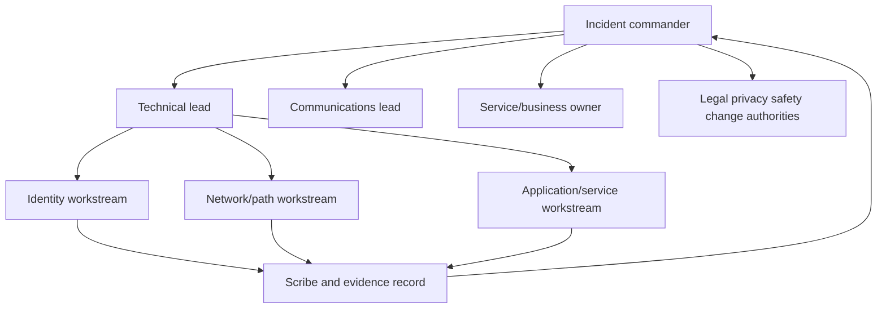

## Template J-T07 - Contact and escalation directory

**Use:** Keep role-based, approved contact routes. Do not copy personal phone numbers or credentials into broadly shared incident documents.

**Fillable blank:**

| Function | Primary role/channel | Backup | Hours/time zone | Activation rule | Data allowed | Last verified |
|---|---|---|---|---|---|---|
| Customer command |  |  |  |  |  |  |
| Service owner |  |  |  |  |  |  |
| Security/SOC |  |  |  |  |  |  |
| Identity/network/app |  |  |  |  |  |  |
| Change management |  |  |  |  |  |  |
| Privacy/legal/compliance |  |  |  |  |  |  |
| Vendor Support |  |  |  |  |  |  |
| Product/account leadership |  |  |  |  |  |  |
| Executive communications |  |  |  |  |  |  |

**Fictional NMH sample:**

| Function | Primary role/channel | Backup | Hours/time zone | Activation rule | Data allowed | Last verified |
|---|---|---|---|---|---|---|
| Customer command | NMH command role in exercise channel | Backup role | Synthetic 24x7 rotation | Accepted critical exercise | Incident summary only | 2026-08-24 |
| Privacy/legal | Privacy duty role | Legal role | Fictional business hours/on-call | Real data, disclosure, reporting concern | Minimum approved facts | 2026-08-24 |
| Vendor Support | Contract-approved support portal role | Account role | Per fictional contract | Product-relevant evidence after internal triage | Redacted package | Must verify before use |

## Template J-T08 - Update cadence plan

**Use:** Choose cadence from severity, stakeholder need, evidence tempo, and customer policy. Cadence is a promise to communicate, not a promise to resolve.

**Fillable blank:**

| Audience | Cadence/trigger | Content | Approver | Drafter/sender | Channel/classification | No-change wording | Stop/change condition |
|---|---|---|---|---|---|---|---|
| Bridge |  |  |  |  |  |  |  |
| Affected users/help desk |  |  |  |  |  |  |  |
| Technical leaders |  |  |  |  |  |  |  |
| Executives |  |  |  |  |  |  |  |
| Vendor/account team |  |  |  |  |  |  |  |
| Legal/privacy/regulatory |  |  |  |  |  |  |  |

**Fictional NMH sample:**

| Audience | Cadence/trigger | Content | Approver | Drafter/sender | Channel/classification | No-change wording | Stop/change condition |
|---|---|---|---|---|---|---|---|
| Bridge | Every 30 minutes | Impact, evidence, workstreams, decisions, next checkpoint | Commander | Scribe reads | Controlled bridge | "No material change; cause/ETA remain unknown; tests continue" | Recovery cadence approved |
| Executives | Hourly or material change | Business impact, trend, action, decision need | Commander/sponsor | Comms role | Restricted brief | Same facts at executive altitude | Sponsor changes cadence |
| Vendor support | On evidence package/material result | Reproduction, scope, artifacts, question | Technical lead | Support liaison | Approved portal | Not cadence-based | Case accepted/closed |

### Diagram J07 - Communication fan-out

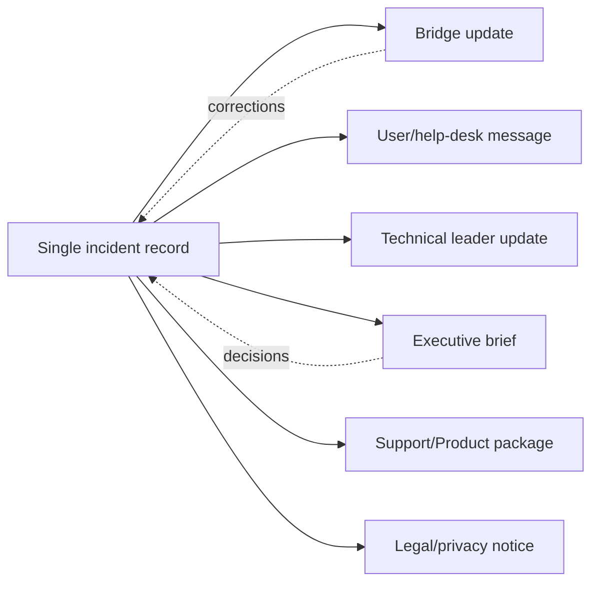

## Template J-T09 - Evidence manifest

**Use:** Reference controlled artifacts rather than copying raw data into decks or chat. Record integrity, provenance, access, and limits.

**Fillable blank:**

| Evidence ID | Description/type | Source/vantage | Event/observed/collected time | Collector/authority | Scope | Integrity/reference | Classification/access | Supports/refutes | Limitation/retention |
|---|---|---|---|---|---|---|---|---|---|
|  |  |  |  |  |  |  |  |  |  |

**Fictional NMH sample:**

| Evidence ID | Description/type | Source/vantage | Event/observed/collected time | Collector/authority | Scope | Integrity/reference | Classification/access | Supports/refutes | Limitation/retention |
|---|---|---|---|---|---|---|---|---|---|
| NMH-E-042-01 | Generated redirect event set | Synthetic identity fixture | Events 12:50-13:10; collected 13:12 UTC | Lab owner under exercise | 100 attempts in cohort A | Local hash in manifest | Internal synthetic/read-only | Supports loop count and sequence | Generator regularity; delete temp copy after PIR |
| NMH-E-042-02 | Known-good cohort B summary | Synthetic journey test | 13:06 UTC | Service role | 20 attempts | Controlled report | Internal synthetic | Refutes universal outage | Small sample and different cohort |

### Diagram J08 - Evidence custody and use

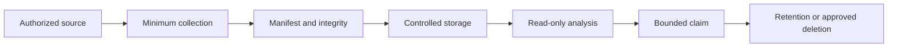

## Template J-T10 - Minimum evidence request

**Use:** Ask for the smallest artifact that can distinguish hypotheses. Include purpose and redaction instructions; never request passwords, tokens, cookies, secret keys, or unrestricted raw dumps through informal channels.

**Fillable blank:**

| Request ID | Question/hypotheses distinguished | Minimum artifact/fields | Scope/time window | Collection authority/method owner | Redaction/exclusions | Secure channel | Due/priority | Stop condition |
|---|---|---|---|---|---|---|---|---|
|  |  |  |  |  |  |  |  |  |

**Fictional NMH sample:**

| Request ID | Question/hypotheses distinguished | Minimum artifact/fields | Scope/time window | Collection authority/method owner | Redaction/exclusions | Secure channel | Due/priority | Stop condition |
|---|---|---|---|---|---|---|---|---|
| NMH-RQ-01 | Did loop begin before or after synthetic policy version change? | Generated event timestamp, correlation ID, policy-version label, result code | 12:45-13:15 UTC | Lab fixture owner | No real user names, tokens, URLs, or payloads | Controlled exercise folder | High | Ten representative failed and five passed records sufficient |

## Template J-T11 - Normalized incident timeline

**Use:** Preserve original timestamps and create a normalized display clock. Corrections are append-only; do not silently rewrite history.

**Fillable blank:**

| Event ID | Source-native time/zone | Normalized time | Observed/received/recorded | Actor/system | Event/action | Evidence ID | Confidence | Correction/version | Significance |
|---|---|---|---|---|---|---|---|---|---|
|  |  |  |  |  |  |  |  |  |  |

**Fictional NMH sample:**

| Event ID | Source-native time/zone | Normalized time | Observed/received/recorded | Actor/system | Event/action | Evidence ID | Confidence | Correction/version | Significance |
|---|---|---|---|---|---|---|---|---|---|
| NMH-T-01 | 12:52 UTC | 12:52 UTC | Event | Generated identity fixture | First loop in available set | NMH-E-042-01 | Medium | v1; earlier data unavailable | Earliest observed, not proven incident start |
| NMH-T-02 | 13:00 UTC | 13:00 UTC | Received | Help-desk role | Spike reported | Intake | High | v1 | Detection/report time |
| NMH-T-03 | 13:14 UTC | 13:14 UTC | Recorded | Technical lead | Three workstreams opened | Incident record | High | v1 | Parallel triage begins |

### Diagram J09 - Multiple incident clocks

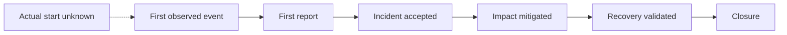

## Template J-T12 - Symptom, expected state, and known-good comparison

**Use:** Turn vague complaints into testable differences.

**Fillable blank:**

| Journey/component | Expected state | Observed symptom | Failed cohort | Known-good cohort | Variables held constant | Variables different | Evidence | Next discriminating comparison |
|---|---|---|---|---|---|---|---|---|
|  |  |  |  |  |  |  |  |  |

**Fictional NMH sample:**

| Journey/component | Expected state | Observed symptom | Failed cohort | Known-good cohort | Variables held constant | Variables different | Evidence | Next discriminating comparison |
|---|---|---|---|---|---|---|---|---|
| Federated sign-in fixture | One redirect sequence then synthetic session | Loop exceeds expected sequence | Cohort A generated claims | Cohort B passes | Same app fixture, clock, local path | Policy-version label and claim set | E-01/E-02 | Replay static inputs through both policy fixtures; no live authentication |

## Template J-T13 - Hypothesis register

**Use:** Keep alternatives alive until discriminating evidence changes confidence. Do not use confidence percentages unless calibrated.

**Fillable blank:**

| Hypothesis ID | Explanation | Evidence for | Evidence against | Prediction if true | Safe discriminating test | Owner | Status/confidence rubric | Next decision |
|---|---|---|---|---|---|---|---|---|
|  |  |  |  |  |  |  |  |  |

**Fictional NMH sample:**

| Hypothesis ID | Explanation | Evidence for | Evidence against | Prediction if true | Safe discriminating test | Owner | Status/confidence rubric | Next decision |
|---|---|---|---|---|---|---|---|---|
| NMH-H-01 | Static policy fixture maps cohort A claim incorrectly | Failures cluster on version/claim | Not all A rows fail | Same input differs across fixture versions | Offline replay of generated cases | Identity workstream | Plausible/medium | If supported, prepare corrected fixture under review |
| NMH-H-02 | App fixture state causes repeated redirect | Loop shape | Cohort B same app passes | Failure follows app state regardless of policy version | Compare sanitized generated state labels | App workstream | Possible/low | Retain until state comparison |
| NMH-H-03 | Network path causes loop | General connectivity complaint | Static local fixture has no live path | Path evidence would differ by cohort | No live test justified; compare architecture boundary | Path workstream | Unlikely in lab | Close if boundary confirmed |

### Diagram J10 - Hypothesis competition

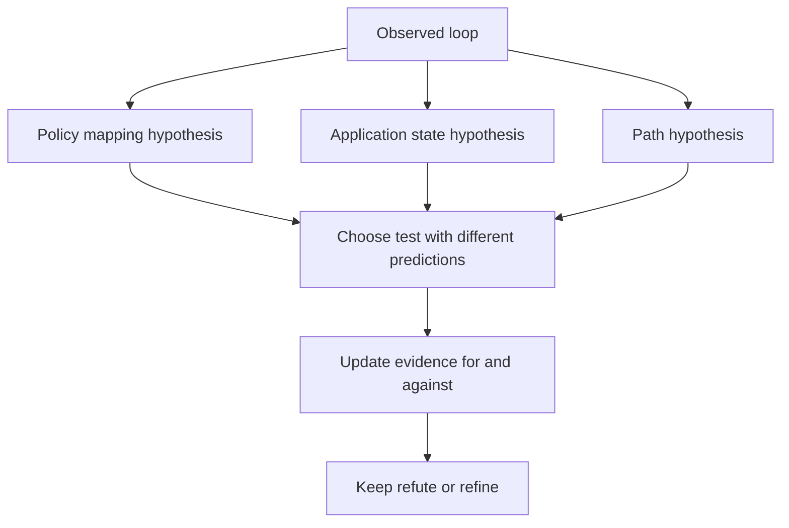

### Plain-English deep-dive 2 - A hypothesis is a suspect, not a verdict

A detective may have a leading suspect, but an alibi can overturn the case. An incident hypothesis works the same way. It should predict an observable difference and survive comparison with alternatives. "It is the proxy" is not a useful hypothesis; it has no bounded mechanism, prediction, or falsifying test. "Generated cohort A loops only under policy fixture v3" is testable and still does not claim a product cause.

## Template J-T14 - Safe discriminating-test plan

**Use:** Design a test that separates hypotheses while minimizing risk. Production tests require customer authority and approved runbooks; this template grants none.

**Fillable blank:**

| Test ID | Question | Hypotheses separated | Preconditions/authority | Input/scope | Method owner | Expected results by hypothesis | Risk/guardrail | Stop/rollback | Evidence/output |
|---|---|---|---|---|---|---|---|---|---|
|  |  |  |  |  |  |  |  |  |  |

**Fictional NMH sample:**

| Test ID | Question | Hypotheses separated | Preconditions/authority | Input/scope | Method owner | Expected results by hypothesis | Risk/guardrail | Stop/rollback | Evidence/output |
|---|---|---|---|---|---|---|---|---|---|
| NMH-TEST-01 | Does outcome follow static policy fixture version? | H-01 versus H-02 | Local generated lab approved | Ten failed/five passed fixtures | Identity role | H-01: result changes by policy version; H-02: follows app state | Offline/read-only; no credentials or traffic | Stop on unexpected real data or file mutation | Versioned result matrix and hashes |

## Template J-T15 - Workstream charter

**Use:** One bounded question, lead, deliverable, cadence, and stop condition per workstream.

**Fillable blank:**

| Workstream | Question/outcome | Lead | Contributors | Evidence available/requested | Safe actions | Dependencies | Return time | Stop/escalation condition | Deliverable |
|---|---|---|---|---|---|---|---|---|---|
|  |  |  |  |  |  |  |  |  |  |

**Fictional NMH sample:**

| Workstream | Question/outcome | Lead | Contributors | Evidence available/requested | Safe actions | Dependencies | Return time | Stop/escalation condition | Deliverable |
|---|---|---|---|---|---|---|---|---|---|
| Identity fixture | Does result follow policy version/claim? | Identity role | Lab owner | Generated events and static fixtures | Offline comparison only | Manifest version | 13:40 UTC | Unexpected real data or inconsistent hash | Test matrix |
| Service journey | Is synthetic booking usable after a new session? | Service role | QA role | Generated journey script | Approved static replay | Identity result | 13:45 UTC | Any unapproved external call | Journey result |
| Path boundary | Confirm lab has no live network dependency | Architecture role | Facilitator | README/environment | Inspect configuration text | None | 13:30 UTC | Any network collection request | Boundary statement |

### Diagram J11 - Workstream convergence

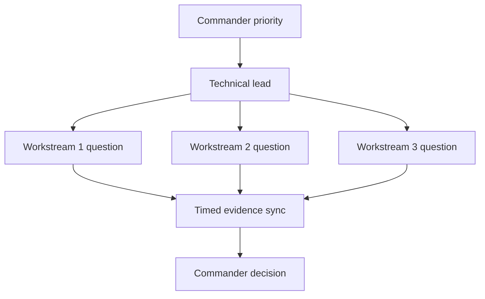

## Template J-T16 - Dependency and decision log

**Use:** Surface blocked work and exact decisions. A dependency is not an action owner.

**Fillable blank:**

| ID | Type | Statement | Needed by | Decision owner/provider | Options | Evidence | Consequence of delay | Status | Resolution/time |
|---|---|---|---|---|---|---|---|---|---|
|  | Dependency / decision / assumption |  |  |  |  |  |  |  |  |

**Fictional NMH sample:**

| ID | Type | Statement | Needed by | Decision owner/provider | Options | Evidence | Consequence of delay | Status | Resolution/time |
|---|---|---|---|---|---|---|---|---|---|
| NMH-DP-01 | Dependency | Confirm fixture v3 hash | Before replay | Lab owner | Verify, replace, or hold | Manifest conflict | Test result could be invalid | Open | Next sync |
| NMH-DEC-02 | Decision | Pause exercise expansion | Immediate | Commander role | Pause or continue read-only | Reproduction mismatch | Continuing may create confusing evidence | Approved | 13:20 UTC |

## Template J-T17 - Authorized change and action log

**Use:** Record operational actions only after formal authority. The sample intentionally stays inside a local synthetic exercise.

**Fillable blank:**

| Action/change ID | Purpose | Requested by | Approved by/process | Scope/time | Expected result | Risk/side effect | Rollback/stop | Executor | Actual result/evidence | Validation/disposition |
|---|---|---|---|---|---|---|---|---|---|---|
|  |  |  |  |  |  |  |  |  |  |  |

**Fictional NMH sample:**

| Action/change ID | Purpose | Requested by | Approved by/process | Scope/time | Expected result | Risk/side effect | Rollback/stop | Executor | Actual result/evidence | Validation/disposition |
|---|---|---|---|---|---|---|---|---|---|---|
| NMH-CHG-01 | Correct generated mapping fixture copy | Identity lead | Exercise commander/change role | New local v3.1 file; old read-only | Offline replay no longer loops for corrected cases | Could hide original evidence | Preserve v3 and hashes; stop on mismatch | Lab owner | Pending | Independent peer comparison required |

### Diagram J12 - Change-control loop

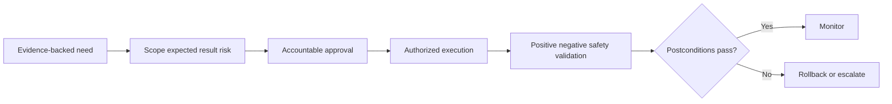

## Template J-T18 - Stakeholder status update

**Use:** A reusable concise update for technical and business stakeholders.

**Fillable blank:**

| Update block | Fillable content |
|---|---|
| Incident/severity/as-of |  |
| Confirmed impact/scope |  |
| What changed since last update |  |
| Current facts/known good |  |
| Hypotheses/unknowns |  |
| Actions/workstreams |  |
| Decisions/help needed |  |
| Recovery/validation state |  |
| Next update trigger/time |  |
| Classification/contact |  |

**Fictional NMH sample:**

| Update block | NMH synthetic content |
|---|---|
| Incident/severity/as-of | NMH-INC-042; customer-assigned exercise severity; 14:00 UTC |
| Confirmed impact/scope | 42/100 generated cohort-A attempts looped; no production impact |
| What changed since last update | Hash mismatch found between two fixture copies; causal role not yet validated |
| Current facts/known good | Cohort B static journey passes; original evidence preserved |
| Hypotheses/unknowns | Fixture-version hypothesis strengthened; exact cause and completion ETA unknown |
| Actions/workstreams | Verify authoritative fixture, replay fixed set, validate full journey |
| Decisions/help needed | None now; keep expansion paused |
| Recovery/validation state | Not recovered; no change executed |
| Next update trigger/time | 14:30 UTC or earlier on replay result |
| Classification/contact | Internal synthetic; commander role owns questions |

### Diagram J13 - Status-update construction

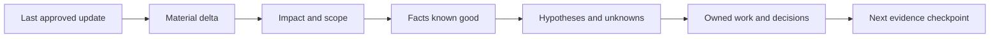

## Template J-T19 - Executive incident summary

**Use:** Give executives impact, direction, choices, confidence, and next checkpoint without exposing unnecessary technical detail.

**Fillable blank:**

| Executive field | Fillable content |
|---|---|
| One-line headline |  |
| Objective/service affected |  |
| Confirmed impact and trend |  |
| Response/recovery state |  |
| Material uncertainty |  |
| Business/security decision |  |
| Customer/vendor leadership alignment |  |
| Next checkpoint |  |
| Technical drill-down reference |  |

**Fictional NMH sample:**

| Executive field | NMH synthetic content |
|---|---|
| One-line headline | Synthetic sign-in exercise remains paused while fixture integrity is validated |
| Objective/service affected | Fictional scheduling journey in local training only |
| Confirmed impact and trend | 42 generated failures in original set; no new attempts during pause |
| Response/recovery state | Evidence preserved; authoritative fixture and replay in progress |
| Material uncertainty | Causal chain and completion ETA are not established |
| Business/security decision | Continue pause; protect reviewer capacity for validation |
| Customer/vendor leadership alignment | Customer exercise commander owns; no product escalation yet |
| Next checkpoint | Replay evidence at 14:30 UTC |
| Technical drill-down reference | Restricted timeline, hypotheses, and manifest |

## Template J-T20 - ETA and bad-news discipline

**Use:** Distinguish next update, task estimate, mitigation estimate, and restoration estimate. Each requires an owner, basis, assumptions, and confidence; "unknown" is valid.

**Fillable blank:**

| Time statement type | Time/range or unknown | Owner | Evidence/basis | Assumptions/dependencies | Confidence rubric | Customer wording | Recheck trigger |
|---|---|---|---|---|---|---|---|
| Next update |  |  |  |  |  |  |  |
| Evidence collection task |  |  |  |  |  |  |  |
| Mitigation decision |  |  |  |  |  |  |  |
| Recovery/restoration |  |  |  |  |  |  |  |
| Permanent correction |  |  |  |  |  |  |  |

**Fictional NMH sample:**

| Time statement type | Time/range or unknown | Owner | Evidence/basis | Assumptions/dependencies | Confidence rubric | Customer wording | Recheck trigger |
|---|---|---|---|---|---|---|---|
| Next update | 14:30 UTC | Communications role | Agreed cadence | Bridge continues | High | "Next update at 14:30 even if no material change" | Material evidence earlier |
| Evidence collection task | 20-30 minutes | Lab owner | File inventory is bounded | Access to controlled folder | Medium | "Fixture verification is expected by 14:25; this is not recovery ETA" | Hash conflict |
| Recovery/restoration | Unknown | Commander/service owner | No validated correction yet | Replay and journey tests pending | Unknown | "We do not yet have an evidence-based recovery estimate" | Corrected replay passes |
| Permanent correction | Unknown | Corrective-action owner not assigned | RCA not complete | PIR and design decision | Unknown | "Permanent-correction timing will follow RCA and approval" | PIR decision |

### Diagram J14 - ETA evidence ladder

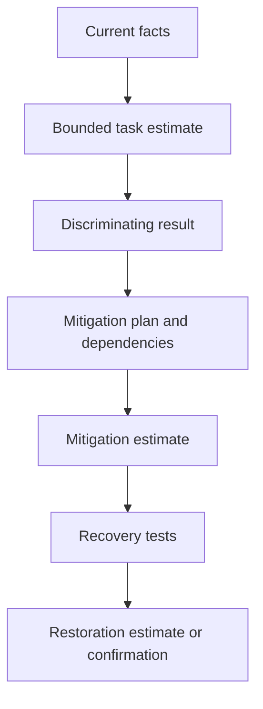

## Template J-T21 - Support escalation package

**Use:** Give Support a reproducible, minimized package and an answerable question. Verify contractual channel and current requirements.

**Fillable blank:**

| Package field | Fillable content |
|---|---|
| Customer/account and authorized contacts |  |
| Contract/support channel/severity reference |  |
| Product/service/environment/version |  |
| Business/user impact and scope |  |
| First observed/current time and time zone |  |
| Expected versus observed behavior |  |
| Reproduction frequency and safe steps |  |
| Known-good comparison |  |
| Evidence manifest/redaction |  |
| Hypotheses/tests/results |  |
| Changes/workarounds and outcomes |  |
| Exact assistance/question |  |
| Update cadence and access limits |  |

**Fictional NMH sample:**

| Package field | NMH synthetic content |
|---|---|
| Customer/account and authorized contacts | Fictional NMH roles only |
| Contract/support channel/severity reference | Must be verified; sample does not claim entitlement |
| Product/service/environment/version | Source-neutral local identity fixture v3; not a Zscaler product |
| Business/user impact and scope | Synthetic training loop; no customer impact |
| First observed/current time and time zone | First generated event 12:52 UTC; current 14:20 UTC |
| Expected versus observed behavior | One redirect sequence versus repeated static sequence |
| Reproduction frequency and safe steps | Offline fixed inputs; package omits secrets and live endpoints |
| Known-good comparison | Cohort B passes same app fixture |
| Evidence manifest/redaction | Generated events, hashes, no identities/tokens |
| Hypotheses/tests/results | Fixture-version comparison pending |
| Changes/workarounds and outcomes | Expansion paused; no workaround claim |
| Exact assistance/question | Not suitable for vendor support until product relevance exists |
| Update cadence and access limits | Internal exercise only |

### Diagram J15 - Support escalation flow

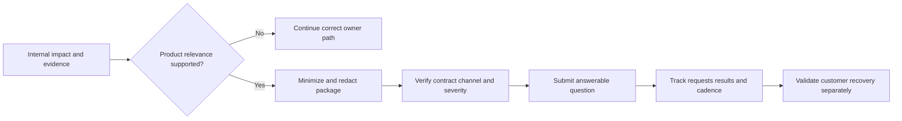

## Template J-T22 - Product/Engineering escalation package

**Use:** Escalate through approved Support/Product processes; do not bypass support ownership or label an observation a product defect.

**Fillable blank:**

| Field | Fillable content |
|---|---|
| Support case/ownership |  |
| Product area/build/tenant context |  |
| Problem statement |  |
| Customer impact/priority |  |
| Minimal reproducible scenario |  |
| Expected/actual with evidence |  |
| Regression/known-good version |  |
| Frequency/scope |  |
| Diagnostics already completed |  |
| Alternatives/refuting evidence |  |
| Privacy/data-access constraints |  |
| Engineering question/decision needed |  |
| Customer communication boundary |  |

**Fictional NMH sample:**

| Field | NMH synthetic content |
|---|---|
| Support case/ownership | None; local source-neutral exercise |
| Product area/build/tenant context | No product or tenant involved |
| Problem statement | Two local fixture copies have conflicting hashes |
| Customer impact/priority | Training gate only |
| Minimal reproducible scenario | Compare fixed generated input across fixture versions |
| Expected/actual with evidence | Documented static outputs differ; manifest attached internally |
| Regression/known-good version | v2 sample passes; causal significance pending |
| Frequency/scope | Fixed lab set only |
| Diagnostics already completed | File/version inventory and offline comparison |
| Alternatives/refuting evidence | User error or stale copy remain possible |
| Privacy/data-access constraints | Generated data only |
| Engineering question/decision needed | Internal lab owner, not Product, owns correction |
| Customer communication boundary | Do not describe as vendor defect |

## Template J-T23 - Cross-vendor or partner handoff

**Use:** Transfer only facts and minimum evidence under approved agreements. Preserve shared-responsibility boundaries without finger-pointing.

**Fillable blank:**

| Handoff field | Sender content | Receiver confirmation |
|---|---|---|
| Shared incident/question |  |  |
| Observed impact/scope/time |  |  |
| Architecture/ownership boundary |  |  |
| Evidence provided and classification |  |  |
| Tests/results/known good |  |  |
| Exact requested action/answer |  |  |
| Authority and access |  |  |
| Cadence/time zone |  |  |
| Return/escalation path |  |  |

**Fictional NMH sample:**

| Handoff field | Sender content | Receiver confirmation |
|---|---|---|
| Shared incident/question | Determine whether generated IdP fixture version is authoritative | Receiver repeats question |
| Observed impact/scope/time | Static cohort A loop in local lab after 12:52 UTC events | Scope accepted as synthetic only |
| Architecture/ownership boundary | Identity fixture team owns file; app team owns journey script | Ownership accepted |
| Evidence provided and classification | Hash/manifest and aggregate, internal synthetic | Access confirmed |
| Exact requested action/answer | Confirm approved fixture hash and change record | Owner/date returned |
| Cadence/time zone | 30-minute bridge sync UTC | Accepted |

### Diagram J16 - Boundary-safe handoff

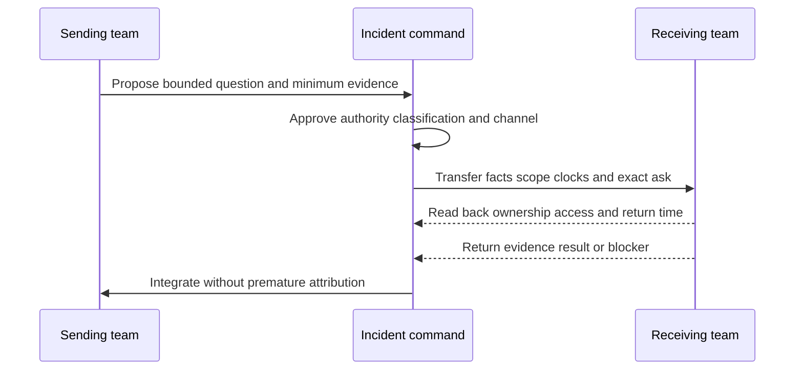

## Template J-T24 - Privacy, legal, compliance, and safety escalation

**Use:** Trigger qualified customer functions when evidence suggests regulated data, disclosure, legal hold, reporting duty, safety impact, or contractual notice. Do not make legal conclusions in the incident bridge.

**Fillable blank:**

| Trigger/concern | Observed fact | Data/person/service scope | Time/jurisdiction known | Immediate preservation/minimization | Qualified owner notified | Direction received | Communication restriction | Follow-up record |
|---|---|---|---|---|---|---|---|---|
|  |  |  |  |  |  |  |  |  |

**Fictional NMH sample:**

| Trigger/concern | Observed fact | Data/person/service scope | Time/jurisdiction known | Immediate preservation/minimization | Qualified owner notified | Direction received | Communication restriction | Follow-up record |
|---|---|---|---|---|---|---|---|---|
| Unexpected real identifier in lab screenshot | File path includes a real workstation user name | One screenshot; no patient content observed | Collected 14:10 UTC; jurisdiction not assessed | Stop distribution; preserve controlled original; create redacted copy only after direction | Privacy role | Pending | Need-to-know; no broad email | NMH-PR-01 synthetic exercise record |

## Template J-T25 - Customer action/decision request

**Use:** Make urgent requests precise, safe, and authorized.

**Fillable blank:**

| Request ID | Requested decision/action | Why now | Accountable customer owner | Evidence | Options | Risk/side effect | Authority/change path | Deadline/next checkpoint | Confirmation/postcondition |
|---|---|---|---|---|---|---|---|---|---|
|  |  |  |  |  |  |  |  |  |  |

**Fictional NMH sample:**

| Request ID | Requested decision/action | Why now | Accountable customer owner | Evidence | Options | Risk/side effect | Authority/change path | Deadline/next checkpoint | Confirmation/postcondition |
|---|---|---|---|---|---|---|---|---|---|
| NMH-REQ-03 | Confirm authoritative generated fixture version | Replay result depends on file integrity | Lab owner role | Conflicting hashes | Confirm v3, designate v3.1, or hold | Wrong choice invalidates exercise evidence | Exercise change record | Before 14:25 UTC checkpoint | Signed hash/version in manifest |

## Template J-T26 - Workaround assessment

**Use:** A workaround reduces impact without necessarily correcting cause. Evaluate security, privacy, compliance, usability, supportability, duration, rollback, and residual risk.

**Fillable blank:**

| Workaround | Impact reduced | Evidence/basis | Eligibility/scope | Security/privacy effect | Operational cost | Dependency | Approval | Expiry/exit | Validation | Residual concern |
|---|---|---|---|---|---|---|---|---|---|---|
|  |  |  |  |  |  |  |  |  |  |  |

**Fictional NMH sample:**

| Workaround | Impact reduced | Evidence/basis | Eligibility/scope | Security/privacy effect | Operational cost | Dependency | Approval | Expiry/exit | Validation | Residual concern |
|---|---|---|---|---|---|---|---|---|---|---|
| Use known-good static cohort B for facilitation while A remains paused | Keeps training discussion moving | B journey passed sample | Exercise demonstration only | No policy bypass; generated data | Does not test affected cohort | Facilitator approval | Ends when A evidence is resolved | State scope before demo; verify B result | Could confuse audience unless clearly labeled |

### Diagram J17 - Workaround decision

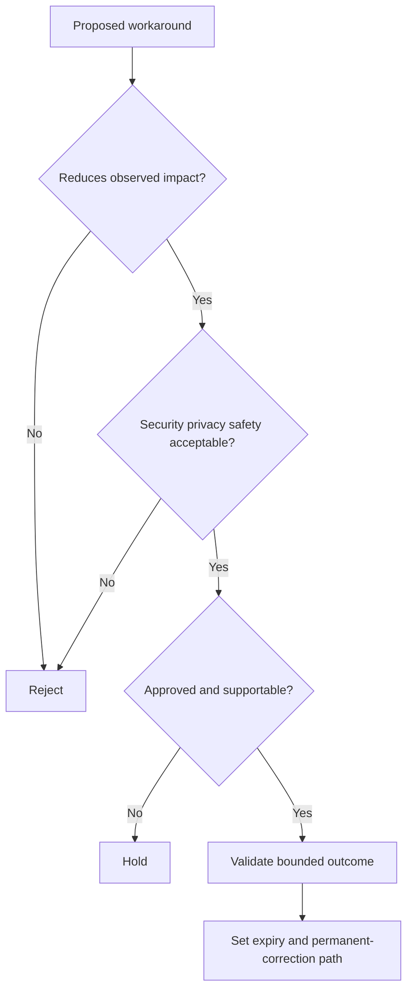

## Template J-T27 - Recovery criteria

**Use:** Define recovery before declaring it. Include positive journey, negative/security controls, data integrity, dependent services, exception rate, monitoring window, and business owner acceptance.

**Fillable blank:**

| Criterion ID | Dimension | Population/scope | Expected postcondition | Test owner/method | Evidence | Pass threshold source | Observation window | Failure action | Approver |
|---|---|---|---|---|---|---|---|---|---|
|  | Business / user / technical / security / data / dependency |  |  |  |  |  |  |  |  |

**Fictional NMH sample:**

| Criterion ID | Dimension | Population/scope | Expected postcondition | Test owner/method | Evidence | Pass threshold source | Observation window | Failure action | Approver |
|---|---|---|---|---|---|---|---|---|---|
| NMH-RC-01 | User journey | Fixed cohort A generated cases | One expected redirect and synthetic booking completion | QA role, offline journey script | Versioned result | Exercise charter | Two consecutive fixed runs | Reopen hypothesis/workstream | Service owner role |
| NMH-RC-02 | Security/negative | Invalid generated claim | Access remains denied; no broadening | Identity role, static negative case | Result record | Lab design | Each candidate fix | Reject change | Security role |
| NMH-RC-03 | Data integrity | Original evidence | Original files/hashes remain intact | Scribe verifies manifest | Hash comparison | Evidence policy | At closure | Restore controlled copy/escalate | Commander |

### Diagram J18 - Recovery validation stack

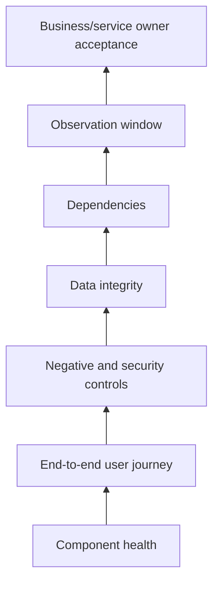

## Template J-T28 - Recovery validation record

**Use:** Record actual results and exceptions. A passed synthetic transaction does not prove all users or time periods recovered.

**Fillable blank:**

| Test/result ID | Criterion | Run time/time zone | Scope/input/version | Actual result | Evidence | Pass/fail/partial | Exception/unknown | Tester | Reviewer/decision |
|---|---|---|---|---|---|---|---|---|---|
|  |  |  |  |  |  |  |  |  |  |

**Fictional NMH sample:**

| Test/result ID | Criterion | Run time/time zone | Scope/input/version | Actual result | Evidence | Pass/fail/partial | Exception/unknown | Tester | Reviewer/decision |
|---|---|---|---|---|---|---|---|---|---|
| NMH-RV-01 | RC-01 | 15:10 UTC | Fixed A set, fixture v3.1 | Expected redirect and booking in run 1 | Output/hash | Partial | Second consecutive run pending | QA role | No recovery declaration |
| NMH-RV-02 | RC-02 | 15:12 UTC | Invalid generated claim | Denied as expected | Result record | Pass | Only fixed negative case | Identity role | Continue validation |
| NMH-RV-03 | RC-01 | 15:25 UTC | Same fixed set/version | Run 2 passes | Output/hash | Pass within lab scope | Production and broader population not tested | Peer QA role | Service owner may accept synthetic recovery |

## Template J-T29 - Stabilization and monitoring plan

**Use:** Define what could regress, what will be watched, by whom, and for how long. Use customer-approved tools and metrics.

**Fillable blank:**

| Signal/guardrail | Definition/scope | Baseline/expected | Source/freshness | Owner | Cadence/window | Alert/escalation trigger | Response | Exit evidence |
|---|---|---|---|---|---|---|---|---|
|  |  |  |  |  |  |  |  |  |

**Fictional NMH sample:**

| Signal/guardrail | Definition/scope | Baseline/expected | Source/freshness | Owner | Cadence/window | Alert/escalation trigger | Response | Exit evidence |
|---|---|---|---|---|---|---|---|---|
| Synthetic redirect outcome | Fixed A/B cases under v3.1 | Expected single sequence | Local run output per execution | QA role | Two runs plus next workshop rehearsal | Any repeated loop or hash drift | Pause, preserve evidence, reopen incident | Two passes and owner acceptance |
| Invalid-claim denial | Fixed negative case | Denied | Static result | Identity role | Every version change | Any unexpected allow | Reject version and escalate security review | Pass recorded |

### Diagram J19 - Recovery to stabilization

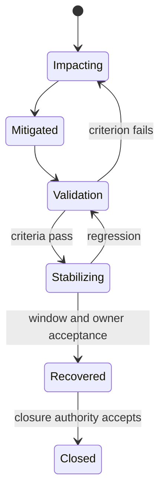

## Template J-T30 - Closure decision

**Use:** Close the incident record only when authority accepts recovery and remaining work has durable owners. Closure is not deletion of uncertainty.

**Fillable blank:**

| Closure field | Fillable content |
|---|---|
| Recovery scope/time accepted |  |
| Criteria and evidence |  |
| Remaining exceptions/unknowns |  |
| Workaround/permanent correction state |  |
| Residual risk/acceptance path |  |
| Open actions and governance location |  |
| Customer/user communication complete |  |
| Evidence retention/access/deletion |  |
| PIR/RCA owner/date |  |
| Recurrence watch |  |
| Closure authority/time |  |
| Reopen triggers |  |

**Fictional NMH sample:**

| Closure field | NMH synthetic content |
|---|---|
| Recovery scope/time accepted | Fixed generated A/B journeys under v3.1 at 15:30 UTC |
| Criteria and evidence | RC-01 through RC-03 passed; manifest linked |
| Remaining exceptions/unknowns | Why duplicate fixture copy persisted; no production inference |
| Workaround/permanent correction state | Workaround ended; fixture designation temporary pending PIR |
| Residual risk/acceptance path | Exercise-quality risk tracked by program owner; not enterprise risk acceptance |
| Open actions and governance location | Version-control and preflight actions in action register |
| Customer/user communication complete | Exercise participants notified |
| Evidence retention/access/deletion | Approved summaries retained; temporary copies scheduled for deletion |
| PIR/RCA owner/date | Program quality role within five synthetic business days |
| Recurrence watch | Next two lab rehearsals |
| Closure authority/time | Commander role, 15:35 UTC |
| Reopen triggers | Hash drift, loop recurrence, negative test failure |

### Diagram J20 - Closure gate

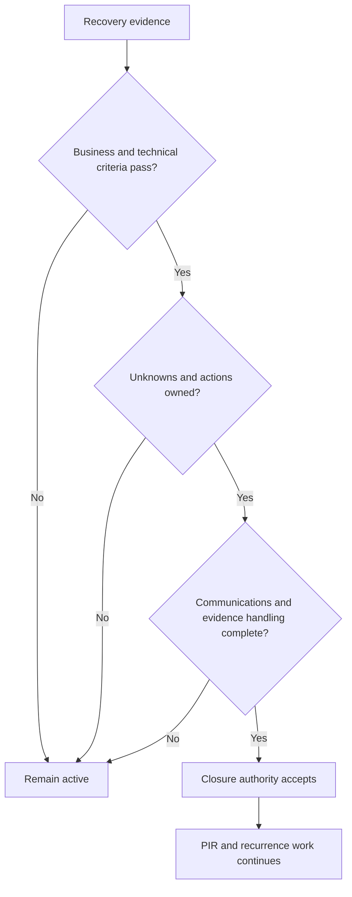

## Template J-T31 - Final executive incident summary

**Use:** Produce a stable record after closure. Keep preliminary versus final cause labels and correction dates visible.

**Fillable blank:**

| Summary block | Fillable content |
|---|---|
| Incident/title/date |  |
| Executive outcome |  |
| Confirmed impact/scope/duration |  |
| Detection and response |  |
| Cause status |  |
| Mitigation/recovery |  |
| Customer/business communication |  |
| What worked/did not |  |
| Remaining risk/actions |  |
| PIR/RCA and next oversight |  |
| Evidence/confidentiality note |  |

**Fictional NMH sample:**

| Summary block | NMH synthetic content |
|---|---|
| Incident/title/date | NMH-INC-042, synthetic sign-in fixture, 2026-08-24 |
| Executive outcome | Local exercise recovered after authoritative fixture v3.1 was designated and validated |
| Confirmed impact/scope/duration | 42 failures in fixed generated cohort A; earliest observed 12:52 to validated recovery 15:30 UTC |
| Detection and response | Help-desk scenario, bridge, three bounded workstreams, expansion pause |
| Cause status | Preliminary causal finding: uncontrolled duplicate fixture copy; PIR approval pending |
| Mitigation/recovery | Old copy quarantined read-only; two positive runs and negative control passed |
| Customer/business communication | Fictional participants received cadence updates and closure note |
| What worked/did not | Manifest exposed hash conflict; preflight did not verify authoritative copy |
| Remaining risk/actions | Version control, fixture registry, rehearsal preflight, recurrence watch |
| PIR/RCA and next oversight | Program quality role owns review within synthetic five days |
| Evidence/confidentiality note | Generated artifacts only; controlled internal workspace |

## Template J-T32 - PIR charter and agenda

**Use:** A PIR learns how the system behaved and improves it. It is not a performance hearing.

**Fillable blank:**

| PIR field | Fillable content |
|---|---|
| Purpose and psychological-safety statement |  |
| Facilitator/scribe/reviewer |  |
| Participants and perspectives |  |
| Scope/time/evidence cutoff |  |
| Questions |  |
| Decisions expected |  |
| Pre-read/artifacts |  |
| Agenda/time boxes |  |
| Confidentiality/legal/privacy direction |  |
| Action/effectiveness governance |  |

**Fictional NMH sample:**

| PIR field | NMH synthetic content |
|---|---|
| Purpose and psychological-safety statement | Learn why fixture control and preflight allowed conflicting evidence; analyze conditions, not blame people |
| Facilitator/scribe/reviewer | Quality facilitator / scribe / independent lab reviewer roles |
| Participants and perspectives | Lab owner, peer, facilitator, privacy, program roles |
| Scope/time/evidence cutoff | Local exercise 2026-08-24; evidence frozen at closure plus approved corrections |
| Questions | Detection, decision context, controls, recovery, communication, recurrence |
| Decisions expected | Approve causal statement and corrective-action portfolio |
| Pre-read/artifacts | Timeline, manifest, changes, validation, communications |
| Agenda/time boxes | Context 10; timeline 15; analysis 25; actions 20; close 10 minutes |
| Confidentiality/legal/privacy direction | Internal synthetic; consult qualified roles if unexpected real data appears |
| Action/effectiveness governance | Program owner tracks postconditions and recurrence |

### Diagram J21 - Blameless PIR loop

```mermaid
flowchart LR
    FACTS[Shared facts and timeline] --> CONTEXT[Decision context and constraints]
    CONTEXT --> CONDITIONS[System conditions and controls]
    CONDITIONS --> CAUSAL[Causal analysis and alternatives]
    CAUSAL --> ACTIONS[Balanced corrective actions]
    ACTIONS --> EFFECT[Effectiveness tests]
    EFFECT --> LEARN[Knowledge and recurrence review]
```

### Plain-English deep-dive 3 - Blameless does not mean consequence-free

A blameless review asks why an action made sense in the context and which system conditions made an error likely or harmful. It still records actions, decisions, and ownership. If someone chose the wrong fixture because two copies looked authoritative and preflight did not check a manifest, blaming the person teaches everyone to hide mistakes. Fixing designation, access, preflight, and review changes the system. Deliberate misconduct or policy violations still follow appropriate management processes; the PIR should not become a substitute tribunal.

## Template J-T33 - Causal analysis record

**Use:** State event, causal factor, mechanism, evidence, counterfactual, and alternatives. Avoid a single vague "root cause" noun.

**Fillable blank:**

| Causal ID | Event/outcome explained | Condition/action | Mechanism | Evidence | Counterfactual test | Alternatives | Causal status/confidence | Reviewer |
|---|---|---|---|---|---|---|---|---|
|  |  |  |  |  |  |  | Preliminary / validated / rejected |  |

**Fictional NMH sample:**

| Causal ID | Event/outcome explained | Condition/action | Mechanism | Evidence | Counterfactual test | Alternatives | Causal status/confidence | Reviewer |
|---|---|---|---|---|---|---|---|---|
| NMH-CF-01 | Conflicting replay aggregate | Two fixture copies shared v3 label but different content | Learners selected different files while assuming label implied identity | Hash conflict, paths, run manifests | With one designated hash, both peers reproduce same result | Query/environment difference | Validated for mismatch; high within lab | PIR panel |
| NMH-CF-02 | Loop in original A cases | One copy contained stale mapping | Static rule repeated redirect condition | Rule diff and fixed-input replay | Replacing only mapping removes loop while negative case stays denied | App state | Preliminary pending independent review | Technical reviewer |

### Diagram J22 - Causal chain and defenses

```mermaid
flowchart LR
    LAT[Latent condition: duplicate naming] --> TRIG[Trigger: different copy selected]
    TRIG --> MECH[Mechanism: stale mapping applied]
    MECH --> OUT[Generated redirect loop]
    PRE[Missing preflight hash check] -. allowed .-> TRIG
    DET[Manifest comparison] -. detected .-> MECH
    PAUSE[Expansion pause] -. limited .-> OUT
```

## Template J-T34 - Contributing-factor taxonomy

**Use:** Look across design, process, tools, data, communication, environment, staffing, governance, and detection. A taxonomy prompts questions; it does not force a cause.

**Fillable blank:**

| Factor domain | Observed condition | Evidence | Effect on likelihood/impact/duration/detection | Alternative | Action candidate | Owner |
|---|---|---|---|---|---|---|
| Design/architecture |  |  |  |  |  |  |
| Process/change |  |  |  |  |  |  |
| Tool/configuration |  |  |  |  |  |  |
| Data/identity/time |  |  |  |  |  |  |
| Human factors/usability |  |  |  |  |  |  |
| Communication/handoff |  |  |  |  |  |  |
| Governance/ownership |  |  |  |  |  |  |
| Detection/observability |  |  |  |  |  |  |

**Fictional NMH sample:**

| Factor domain | Observed condition | Evidence | Effect on likelihood/impact/duration/detection | Alternative | Action candidate | Owner |
|---|---|---|---|---|---|---|
| Process/change | Copy updated outside designated release record | File metadata/change log | Increased likelihood | Approved copy may be mislabeled | Controlled release record | Lab owner |
| Human factors/usability | Same visible version label on different content | File names/hash | Made wrong choice reasonable | User ignored README | Include hash and status in filename/registry | Quality role |
| Governance/ownership | No single authoritative fixture owner shown | Charter and folder | Delayed decision | Owner existed but was not documented | Assign owner and backup | Program role |
| Detection/observability | Preflight checked row count, not hash | Checklist | Detected only after mismatch | Hash tool unavailable | Add portable hash verification | Facilitator |

## Template J-T35 - Five-whys-with-evidence worksheet

**Use:** Five Whys is a prompt, not proof. Stop when evidence ends, branch when multiple mechanisms exist, and avoid ending at "human error."

**Fillable blank:**

| Level | Why question | Proposed answer | Evidence | Alternative branch | Confidence | Next validation |
|---:|---|---|---|---|---|---|
| 1 |  |  |  |  |  |  |
| 2 |  |  |  |  |  |  |
| 3 |  |  |  |  |  |  |
| 4 |  |  |  |  |  |  |
| 5 |  |  |  |  |  |  |

**Fictional NMH sample:**

| Level | Why question | Proposed answer | Evidence | Alternative branch | Confidence | Next validation |
|---:|---|---|---|---|---|---|
| 1 | Why did replay differ? | Different fixture content was used | Hashes and paths | Query version differed | High | Fix query/version and replay |
| 2 | Why could different content share a version? | File naming lacked immutable release identity | Names/change record | Copy corruption | High | Compare creation history |
| 3 | Why was immutable identity absent? | Release checklist required row count but not hash | Checklist | Hash step skipped | High | Review prior versions |
| 4 | Why did checklist omit it? | Reproducibility threat was not included in design review | Review notes | Tool portability concern | Medium | Interview authors/review decision |
| 5 | Why was threat missed? | Lab governance focused on result correctness, not artifact provenance | Charter | Informal ownership | Medium | Update threat/risk review |

## Template J-T36 - Corrective-action portfolio

**Use:** Balance immediate correction, prevention, detection, response, resilience, documentation, training, and governance. Avoid an action list made only of "train people" or "be more careful."

**Fillable blank:**

| Action ID | Causal/contributing factor | Action type | Control change | Owner | Due | Dependency | Completion evidence | Effectiveness postcondition | Side-effect guardrail | Status |
|---|---|---|---|---|---|---|---|---|---|---|
|  | Correct / prevent / detect / respond / recover / govern |  |  |  |  |  |  |  |  |  |

**Fictional NMH sample:**

| Action ID | Causal/contributing factor | Action type | Control change | Owner | Due | Dependency | Completion evidence | Effectiveness postcondition | Side-effect guardrail | Status |
|---|---|---|---|---|---|---|---|---|---|---|
| NMH-CA-01 | Duplicate version identity | Prevent | Immutable fixture release ID and authoritative registry | Lab owner | Synthetic date | Folder convention | Registry/version release | Two peers select same hash from instructions | Portable/local; no paid tool | Open |
| NMH-CA-02 | Missing preflight | Detect | Verify manifest hash before run | Facilitator | Synthetic date | Safe hash method | Revised checklist/test | Deliberately altered copy blocks start | No sensitive path in screenshot | Open |
| NMH-CA-03 | Delayed ownership | Govern | Owner/backup in charter | Program role | Synthetic date | Role agreement | Approved charter | Owner responds within exercise target | Target not called product SLA | Open |
| NMH-CA-04 | Communication overreach risk | Respond | Cause/ETA claim gate in update template | Comms role | Synthetic date | Reviewer | QA sample | Updates label hypothesis/unknown correctly | Does not delay urgent factual update | Open |

### Diagram J23 - Corrective-action coverage

```mermaid
flowchart LR
    CAUSE[Causal mechanism] --> COR[Correct current state]
    CAUSE --> PRE[Prevent recurrence]
    CAUSE --> DET[Detect earlier]
    CAUSE --> RESP[Respond more safely]
    CAUSE --> REC[Recover faster]
    CAUSE --> GOV[Govern ownership and change]
    PRE --> TEST[Effectiveness tests]
    DET --> TEST
    RESP --> TEST
    REC --> TEST
    GOV --> TEST
```

## Template J-T37 - Recurrence and effectiveness tracker

**Use:** Verify that actions changed the control and that similar events are detected over a defined window. "No incident reported" may simply mean poor detection.

**Fillable blank:**

| Action/control | Effectiveness question | Leading evidence | Lagging/recurrence signal | Eligible population/window | Baseline | Review cadence | Result | Counterevidence/side effect | Owner decision |
|---|---|---|---|---|---|---|---|---|---|
|  |  |  |  |  |  |  |  |  |  |

**Fictional NMH sample:**

| Action/control | Effectiveness question | Leading evidence | Lagging/recurrence signal | Eligible population/window | Baseline | Review cadence | Result | Counterevidence/side effect | Owner decision |
|---|---|---|---|---|---|---|---|---|---|
| Manifest preflight | Does a mismatched fixture stop the exercise? | Checklist results | Replay mismatch recurrence | Next three synthetic rehearsals | Preflight lacked hash | Every rehearsal | Pending | Could burden learners; facilitator owns step | Continue and review after three |
| Release registry | Do peers select same authoritative file? | Registry audit | Conflicting hash incidents | All fixture releases for one synthetic quarter | Duplicate existed | Each release/monthly | Pending | Offline access must remain possible | Add signed local copy process if needed |

### Diagram J24 - Learning-to-control loop

```mermaid
flowchart LR
    PIR[PIR finding] --> ACT[Corrective action]
    ACT --> COMP[Completion evidence]
    COMP --> EFF[Effectiveness test]
    EFF --> REC[Recurrence/side-effect watch]
    REC --> GOOD{Control works?}
    GOOD -- Yes --> STD[Standardize and share]
    GOOD -- No --> REDESIGN[Reopen and redesign]
    REDESIGN --> ACT
```

## Template J-T38 - Follow-the-sun handoff

**Use:** Transfer command awareness and technical state across time zones without losing evidence, ownership, or customer commitments. The outgoing lead remains responsible until the receiver reads back and accepts.

**Fillable blank:**

| Handoff field | Outgoing content | Incoming read-back/acceptance |
|---|---|---|
| Incident/severity/as-of |  |  |
| Confirmed impact/scope/known good |  |  |
| Customer objective/current priority |  |  |
| Timeline/material delta |  |  |
| Hypotheses with evidence for/against |  |  |
| Workstreams and exact state |  |  |
| Actions/changes and validation |  |  |
| Decisions/dependencies/risks |  |  |
| Stakeholder commitments/next update |  |  |
| Evidence locations/access/privacy |  |  |
| Named owners and contacts |  |  |
| Next three moves/stop conditions |  |  |
| Transfer time and commander approval |  |  |

**Fictional NMH sample:**

| Handoff field | Outgoing content | Incoming read-back/acceptance |
|---|---|---|
| Incident/severity/as-of | NMH-INC-042 synthetic, recovery validation, 15:15 UTC | ID/state/time repeated correctly |
| Confirmed impact/scope/known good | Original 42/100 A failures; B passed; no production impact | Scope accepted |
| Hypotheses with evidence for/against | Duplicate fixture explains mismatch; stale mapping cause preliminary | Labels preserved |
| Workstreams and exact state | Positive run 1 passed; run 2 due 15:25; negative passed | Incoming QA owns run 2 |
| Stakeholder commitments/next update | Update 15:30 even if run incomplete | Communications lead acknowledged |
| Evidence locations/access/privacy | Controlled manifest; generated only; no broad copy | Access tested |
| Next three moves/stop conditions | Run 2, verify hashes, service-owner decision; stop on mismatch | Read back |
| Transfer time and commander approval | 15:17 UTC, commander accepts | Incoming lead accepts 15:18 |

### Diagram J25 - Follow-the-sun transfer

```mermaid
sequenceDiagram
    participant O as Outgoing lead
    participant R as Incident record
    participant I as Incoming lead
    participant C as Commander
    O->>R: Update impact evidence workstreams decisions commitments
    O->>I: Walk handoff and demonstrate access
    I-->>O: Read back status next moves and stop conditions
    I->>R: Record acceptance and corrections
    C->>I: Confirm authority and communication cadence
    O-->>C: Remain until transfer accepted
```

## Template J-T39 - Critical customer/account recovery plan

**Use:** Restore trust and operating rhythm after a critical incident or escalation. Keep technical recovery, service recovery, relationship recovery, commercial decisions, and risk ownership separate.

**Fillable blank:**

| Recovery track | Objective | Current gap | Action | Responsible | Accountable | Evidence/postcondition | Cadence | Dependency | Exit |
|---|---|---|---|---|---|---|---|---|---|
| Technical |  |  |  |  |  |  |  |  |  |
| Support/service |  |  |  |  |  |  |  |  |  |
| Communication/trust |  |  |  |  |  |  |  |  |  |
| Adoption/value |  |  |  |  |  |  |  |  |  |
| Product feedback |  |  |  |  |  |  |  |  |  |
| Governance/risk |  |  |  |  |  |  |  |  |  |
| Commercial/contract |  |  |  |  |  |  |  |  |  |

**Fictional NMH sample:**

| Recovery track | Objective | Current gap | Action | Responsible | Accountable | Evidence/postcondition | Cadence | Dependency | Exit |
|---|---|---|---|---|---|---|---|---|---|
| Technical | Reliable lab evidence | Duplicate fixture path | Complete CA-01/02 and peer test | Lab owner | Program role | Three rehearsals select same hash | Weekly synthetic | Action completion | Effectiveness accepted |
| Support/service | Predictable updates | One update nearly mixed task/recovery ETA | Review templates and sample updates | Comms role | Commander role | QA shows labels and checkpoints | Per exercise | Training | Two clean reviews |
| Communication/trust | Correct value/cause language | Participants saw preliminary wording | Send correction and explain control change | TSM role | Sponsor role | Receipt/questions resolved | Event-driven | PIR approval | Sponsor accepts |
| Product feedback | Correct routing | Local issue could be mislabeled product defect | Record source-neutral boundary | Technical lead | Account role | No unsupported product case | Review | None | Routing checklist adopted |
| Governance/risk | Own remaining exercise risk | Version control action open | Track in program register | Quality role | Program owner | Postcondition passes | Monthly | CA-01 | Close after recurrence window |
| Commercial/contract | Keep decisions separate | None in exercise | No commercial commitment | Account role | Commercial authority | Boundary recorded | As needed | Contract source | Not applicable |

### Diagram J26 - Account recovery tracks

```mermaid
flowchart TD
    EVENT[Critical escalation] --> TECH[Technical recovery]
    EVENT --> SERV[Service/support recovery]
    EVENT --> TRUST[Communication and trust]
    EVENT --> GOV[Governance and risk]
    EVENT --> PROD[Product feedback]
    EVENT --> COMM[Commercial/contract path]
    TECH --> PLAN[Integrated recovery plan]
    SERV --> PLAN
    TRUST --> PLAN
    GOV --> PLAN
    PROD --> PLAN
    COMM --> PLAN
    PLAN --> EXIT[Evidence-based exit]
```

## Template J-T40 - Knowledge and feedback-loop package

**Use:** Convert an incident into reusable, appropriately classified learning without leaking customer detail or freezing a temporary workaround into permanent guidance.

**Fillable blank:**

| Knowledge item | Audience | Problem/use case | Approved facts | Procedure/pattern | Safety/privacy boundary | Version/owner | Review trigger | Distribution | Effectiveness signal |
|---|---|---|---|---|---|---|---|---|---|
|  |  |  |  |  |  |  |  |  |  |

**Fictional NMH sample:**

| Knowledge item | Audience | Problem/use case | Approved facts | Procedure/pattern | Safety/privacy boundary | Version/owner | Review trigger | Distribution | Effectiveness signal |
|---|---|---|---|---|---|---|---|---|---|
| Synthetic fixture preflight | Lab facilitators | Prevent conflicting input versions | PIR-approved duplicate-version finding | Verify release ID/hash, read-only input, negative control | Local generated files only; no secrets or live traffic | v1 / quality role | Tool/folder/schema change | Internal guide | Altered copy blocks rehearsal and is explained correctly |
| ETA wording card | Incident communicators | Separate update time from recovery ETA | Incident nearly conflated task estimate | Fact, impact, unknown, owner, checkpoint | No unsupported customer/vendor commitment | v1 / comms role | Policy/template change | Incident training | QA samples contain basis and label |

## Communication phrasebook

| Situation | Evidence-safe wording | Avoid |
|---|---|---|
| Initial report | "We received a report of [symptom] at [time]; validation and scope assessment are underway." | "The platform is down." |
| Impact | "We have confirmed [effect] for [scope] from [vantage] as of [time]." | "Everyone is affected." |
| Hypothesis | "The current hypothesis is [mechanism]; [test] will distinguish it from [alternative]." | "The root cause is probably..." |
| No material change | "No material change since [time]. Impact remains [scope]; [work] continues; next update is [time]." | Silence or recycled detail without timestamp |
| ETA unknown | "We do not yet have an evidence-based recovery estimate. The next decision/evidence checkpoint is [time]." | "It should be fixed soon." |
| Vendor ownership | "Observed behavior may involve [boundary]; the evidence package has been routed to [approved owner]." | "Vendor X caused it." |
| Mitigation | "The workaround reduced [observed impact] for [scope]; permanent correction and residual concerns remain open." | "Resolved." |
| Recovery | "Approved recovery criteria passed for [scope] through [time]; monitoring and open actions continue." | "Everything is back to normal." |
| RCA correction | "Earlier cause wording was preliminary. The approved causal finding as of [date] is..." | Quietly replacing the earlier story |
| Blameless learning | "We are examining conditions, decisions, controls, and evidence that shaped the outcome." | Naming an individual as the root cause |

## Anti-pattern review

| Anti-pattern | Why it fails | Replacement control |
|---|---|---|
| Account importance equals technical severity | Distorts impact facts and contractual process | Keep severity criteria separate from leadership/customer cadence |
| Giant bridge with no workstreams | Creates noise and duplicated changes | Small command bridge plus bounded breakout work |
| Raw logs pasted into chat | Leaks data and loses provenance | Controlled evidence manifest and references |
| One favored hypothesis | Encourages confirmation bias | Register alternatives and discriminating tests |
| Troubleshooting by random change | Destroys evidence and creates risk | Expected result, authority, rollback, validation |
| "No ETA" with no checkpoint | Feels like abandonment | Commit to next evidence update and owner |
| Green component equals recovery | Ignores journey, controls, data, dependencies | Layered recovery criteria and service-owner acceptance |
| PIR ends with training | Treats system defect as memory problem | Balanced prevention, detection, response, recovery, governance |
| Actions close on document upload | Proves work product, not control effectiveness | Observable postcondition and recurrence window |
| Handoff is a chat dump | Incoming team cannot act safely | Structured read-back and acceptance |

### Plain-English deep-dive 4 - Recovery, correction, and prevention are three clocks

A leaking pipe can be contained with a bucket, repaired with a new fitting, and prevented from recurring through better inspection. Those events happen at different times. Incident mitigation reduces current impact. Recovery proves the service works within a stated scope. Permanent correction removes or controls the causal condition. Prevention and detection improvements may take longer still. Communicating one of these clocks as another creates false closure.

## Interview-ready explanations

| Question | Concise model answer |
|---|---|
| What do you do in the first 15 minutes? | I acknowledge and open the record, confirm customer command and roles, bound observed impact and known-good scope, apply the customer's severity definition, establish secure cadence and evidence handling, create one-question workstreams, identify authority/escalation needs, and issue a factual update with the next checkpoint. |
| How do you avoid premature root cause? | I separate facts, hypotheses, contributing factors, and causal findings. Each hypothesis predicts evidence and competes with alternatives. Root-cause wording requires causal mechanism, timeline, counterfactual reasoning, and accountable review. |
| How do you handle ETA pressure? | I distinguish update time, bounded task estimate, mitigation estimate, recovery estimate, and permanent correction. I state owner, evidence, assumptions, and confidence; when recovery timing is unsupported, I say so and provide the next evidence checkpoint. |
| What belongs in a Support escalation? | Contract route and severity reference, bounded impact and clocks, environment/version, expected versus actual, safe reproduction, known-good comparison, redacted manifest, tests/results, changes, and one answerable question. |
| How do you validate recovery? | I predefine business journey, technical, security-negative, data-integrity, dependency, exception, and monitoring criteria. Accountable owners review evidence across the stated scope; a green component or single transaction is insufficient. |
| What makes an RCA blameless? | It explains how system conditions and decision context made the outcome possible, while preserving factual actions and ownership. It avoids "human error" as an endpoint and creates balanced controls with effectiveness tests. |
| How do you hand off across regions? | I update the canonical record, walk impact, evidence, hypotheses, workstreams, decisions, commitments, access, and next moves; the incoming lead reads back and accepts, and the outgoing lead remains until command confirms transfer. |
| How do you recover a critical account? | I separate technical, service, communication/trust, governance/risk, product feedback, adoption/value, and commercial tracks. Each gets an accountable owner, observable exit, cadence, and evidence; no track substitutes for another. |

## Thirty-second memory hooks

| Topic | Memory hook |
|---|---|
| Command | Authority and coordination, not ownership of every system. |
| Severity | Impact, scope, criticality, workaround, data/safety, customer definition. |
| First 15 | Record, roles, impact, severity, bridge, evidence, workstreams, update. |
| Hypothesis | Prediction plus falsifying test plus alternatives. |
| Evidence | Minimum, traceable, timed, classified, controlled. |
| Update | Impact, delta, facts, unknowns, work, decision, checkpoint. |
| ETA | Next update is not restoration ETA. |
| Workaround | Mitigation with expiry and residual concern. |
| Recovery | Journey plus controls plus data plus owner acceptance. |
| Closure | Recovery accepted; actions and unknowns remain governed. |
| RCA | Mechanism, evidence, counterfactual, alternatives, review. |
| Handoff | Canonical record, read-back, acceptance. |

## Source and honesty boundaries

| Boundary | This appendix supports | It does not establish |
|---|---|---|
| General incident practice | Coordination, evidence, communication, recovery, learning | Customer severity, emergency authority, legal duty, or universal SLA |
| Public/product context | A package for current approved escalation channels | Zscaler defect, RCA, workaround, entitlement, support severity, ETA, or roadmap |
| Synthetic NMH | Safe rehearsal and worked records | Real health-care organization, patient event, outage, attack, or product incident |
| Technical response | Questions, evidence, authorized change records, postconditions | Permission to scan, capture traffic, bypass controls, access data, or change production |
| TSM role | Facilitate, translate, escalate, preserve customer commitments and follow-through | Incident command, risk acceptance, legal/privacy judgment, production change approval, or Product engineering finding |

## Completion checklist

- [x] Exactly one H1 uses the master-linked Appendix J title.
- [x] Forty reusable templates cover severity intake, first 15 minutes, bridge roles/RACI, impact, evidence/timeline, hypotheses, workstreams, stakeholder updates, executive summary, Support/Product escalation, recovery, closure, PIR/RCA, corrective action, recurrence, handoff, and account recovery.
- [x] Every template includes a clearly labeled fillable blank and a fictional NMH sample; no unlabeled placeholder is intended as completed content.
- [x] Twenty-six numbered Mermaid diagrams and substantially more than forty tables are included.
- [x] Four Plain-English deep-dives explain command, hypotheses, blameless learning, and recovery/correction/prevention clocks.
- [x] Unsupported severity, scope, ETA, attribution, root cause, recovery, recurrence, product defect, SLA, and outcome claims are prohibited and modeled honestly.
- [x] Evidence minimization, classification, access, integrity, clocks, redaction, retention, legal/privacy/safety triggers, least privilege, and change authority are explicit.
- [x] No scan, live-traffic collection, bypass, security disabling, secret handling, unapproved production change, or harmful operational instruction is provided.
- [x] Content is ASCII, uses balanced fences, labels NMH as synthetic, includes the exact 2026-08-24 currency date, and links to the master, Appendix I, and Appendix K.

[Back to the master study guide](../Zscaler%20SecOps%20Technical%20Success%20Manager%20-%20Complete%20Study%20Guide.md) | [Previous appendix: QBR, EBR, Executive Deck, and Training Templates](Appendix-I-qbr-executive-training-templates.md) | [Next appendix: Lab Dataset, Tooling, and Evidence Portfolio Guide](Appendix-K-lab-dataset-tooling.md)
