# Appendix K - Lab Dataset, Tooling, and Evidence Portfolio Guide

> **Purpose:** Provide the definitive local, synthetic, reproducible companion for [Part 111](Part-111-safe-lab-evidence-honesty.md) through [Part 117](Part-117-complete-secops-tsm-capstone.md). It defines a safe dataset, generation and validation approach, local tool choices, evidence standards, scoring workbook, dashboard artifacts, portfolio packaging, interview demonstration, rubric, and troubleshooting path without requiring paid product access.
>
> **Currency and source note:** General local-development, SQL, Python, PowerShell, data-quality, hashing, evidence, dashboard, accessibility, privacy, and portfolio practices were reviewed on **2026-08-24**. Tool versions, operating systems, package support, vendor interfaces, security guidance, and organizational policy change. Recheck current official documentation, approved software policy, privacy/legal guidance, and customer authorization before using any approach outside this synthetic lab.
>
> **Official/general/synthetic boundary:** This guide does not reproduce or emulate a Zscaler tenant, internal schema, product score, factor, connector, API, UI, workflow, benchmark, or customer result. Northstar Meridian Holdings (NMH), every record, identifier, domain, address, timestamp, service, control, finding, score, ticket, incident, outcome, and screenshot is fictional and synthetic. Illustrative formulas teach transparent reasoning and are not Zscaler UVM, Risk360, Data Fabric, AEM, CTEM, or Agentic SecOps logic.
>
> **Safety and privacy:** Use only local generated fixtures. Do not scan networks, capture live traffic, query real tenants, send events externally, include credentials, disable security controls, bypass policy, weaken endpoint protection, or execute destructive cleanup. Use least privilege, relative paths, read-only source files after generation, synthetic reserved names/addresses, minimum artifacts, reviewed redaction, and approved manual retention/deletion. Stop if real or sensitive data appears.

[Back to the master study guide](../Zscaler%20SecOps%20Technical%20Success%20Manager%20-%20Complete%20Study%20Guide.md) | [Previous appendix: Escalation, Incident, RCA, and Handoff Templates](Appendix-J-escalation-incident-rca-templates.md) | [Next appendix: Official Sources, Product Currency, and Verification Checklist](Appendix-L-official-sources-currency.md)

## Companion map for Parts 111-117

| Part | Lab purpose | Appendix K deliverables | Honest interview claim |
|---:|---|---|---|
| [111](Part-111-safe-lab-evidence-honesty.md) | Establish safety, reproducibility, evidence, and claim boundaries | Charter, folders, manifest, environment, hashes, cleanup plan | "I built a local synthetic evidence portfolio under explicit safety and claim rules." |
| [112](Part-112-data-fabric-modeling-lab.md) | Model multi-source security data | Source dictionaries, canonical entities, mapping, quality, entity resolution, relationships | "I practiced source-to-canonical data engineering; I did not use a Zscaler Data Fabric tenant." |
| [113](Part-113-uvm-prioritization-lab.md) | Explain contextual prioritization | Findings, assets, controls, business context, transparent illustrative score, backlog, exceptions | "I built an illustrative source-neutral prioritization model, not a UVM formula." |
| [114](Part-114-connectivity-escalation-lab.md) | Correlate safe pre-generated network/web evidence | Static DNS/TCP/TLS/HTTP/HAR-like summaries, timeline, hypotheses, escalation package | "I analyzed generated evidence; I did not capture live traffic or test production." |
| [115](Part-115-customer-discovery-onboarding-training-simulation.md) | Practice consulting and enablement | Discovery artifacts, success plan, agenda, lab, teach-back, evaluation, actions | "I facilitated a fictional scenario and can explain how I would adapt it under customer process." |
| [116](Part-116-executive-risk-review-capstone.md) | Convert evidence into decisions | Dashboard exports, risk memo, decision card, roadmap, technical appendix | "I translated synthetic analysis into an executive decision story with explicit uncertainty." |
| [117](Part-117-complete-secops-tsm-capstone.md) | Integrate the account lifecycle | Versioned release, README, demo script, rubric, reflection, next steps | "I can demonstrate the end-to-end reasoning and artifacts; production product experience is separately labeled." |

### Diagram K01 - Capstone evidence chain

```mermaid
flowchart LR
    GEN[Generate synthetic sources] --> VAL[Validate contracts]
    VAL --> MODEL[Canonical model]
    MODEL --> QUERY[Read-only analysis]
    QUERY --> SCORE[Illustrative prioritization]
    SCORE --> DASH[Dashboard artifacts]
    DASH --> DEC[Decision communication]
    DEC --> PORT[Versioned portfolio]
    PORT --> DEMO[Interview demonstration]
```

## Non-negotiable lab boundaries

| Boundary | Allowed | Not allowed | Stop condition |
|---|---|---|---|
| Data | Generated NMH records with reserved domains/addresses | Customer, employer, patient, employee, credential, token, cookie, or scan data | Any unexpected real identifier or content |
| Network | No network required; pre-generated static summaries | Scanning, probing, packet capture, interception, replay to live services | Tool attempts external connection |
| Product | Public concepts and source-neutral models | Tenant scraping, undocumented API use, product emulation, entitlement assumptions | A result could be mistaken for product behavior |
| Execution | Local standard tools, relative paths, least privilege | Administrator elevation, security disabling, bypass, destructive commands | Tool requests elevation or control weakening |
| Analytics | Transparent educational formulas with assumptions | Calling an illustrative score a vendor/risk truth | Formula provenance or meaning is unclear |
| Evidence | Hashes, manifests, queries, aggregates, redacted screenshots | Secrets, raw regulated content, sensitive local metadata | Redaction cannot be confidently verified |
| Sharing | Approved portfolio subset with synthetic label | Public upload by default or unreviewed external transfer | Audience/storage approval absent |
| Cleanup | Review, archive, quarantine, or delete through approved manual process | Recursive deletion snippets or wiping commands | Scope/retention is uncertain |

### Diagram K02 - Safe lab gate

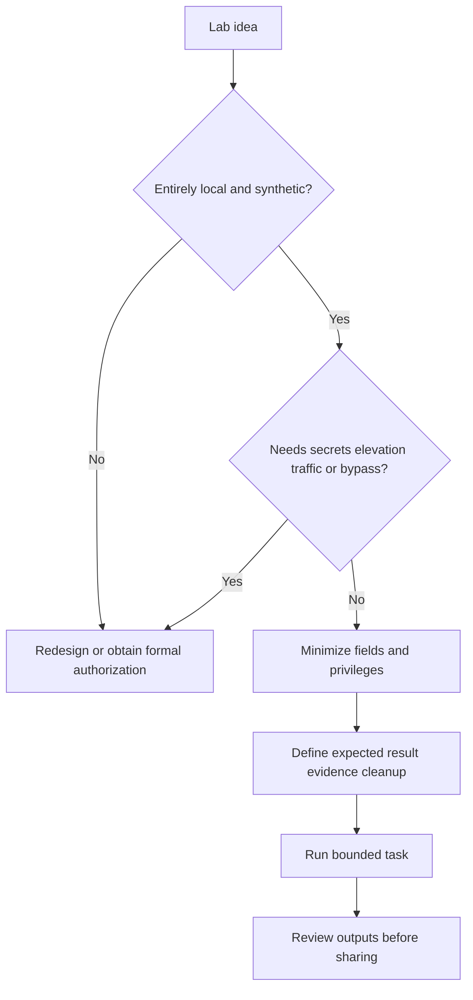

### Plain-English deep-dive 1 - A portfolio is a chain of custody for your reasoning

A museum label tells you where an object came from, what it is, and how experts know. A technical portfolio needs the same discipline. A screenshot without the input version, query, time, and limitation is decoration. A strong artifact lets another person trace the path from generated source to validation, transformation, output, interpretation, decision, and claim. Hashes help show that a file did not change, but they do not prove the data is true or the analysis is correct.

## Local tool options

No paid product is required. Choose the smallest approved stack that works on the local Windows machine. Record versions; do not install software without organizational approval.

| Need | Zero/low-cost local option | Why useful | Limits and guardrail |
|---|---|---|---|
| Text/Markdown/CSV/JSON | VS Code or approved text editor | Transparent artifacts and diff-friendly files | Extensions may have network access; approve before install |
| Shell and inventory | Windows PowerShell built-ins | Version checks, folders, file hashes | Do not elevate; avoid recursive destructive operations |
| Generation/validation | Python standard library | Deterministic fixtures without packages | Use local files only; pin interpreter version |
| Lightweight SQL | SQLite through an approved local distribution | Portable relational analysis | SQL features differ from PostgreSQL/Power BI |
| Analytical SQL optional | DuckDB local executable/package if approved | Reads CSV/Parquet and supports analytics | Not assumed installed; package approval required |
| Relational lab optional | Local PostgreSQL if already approved | Rich SQL and schema practice | Service/install overhead; no remote listener needed |
| Workbook | LibreOffice Calc or approved Excel | Scoring, review, charts | Formulas and date parsing can drift by locale |
| Dashboard | Power BI Desktop if approved/available | Model and visual practice | Windows desktop, licensing/sharing limits; optional |
| Diagram | Mermaid rendering in trusted local Markdown tooling | Text-based architecture | Rendering engine/version may differ |
| Hashing | `Get-FileHash` or Python `hashlib` | Integrity comparison | Hash does not establish truth, authorship, or safety |
| Archive | Approved local ZIP capability | Release package | Review metadata and contents before sharing |

## Template K-T01 - Lab charter

**Fillable blank:**

| Field | Fillable blank |
|---|---|
| Project/version |  |
| Learning questions |  |
| Parts/capstones supported |  |
| In scope / out of scope |  |
| Synthetic-data statement |  |
| Allowed tools/versions |  |
| Network/privilege boundary |  |
| Evidence and claim labels |  |
| Storage/access/retention |  |
| Review/approval |  |
| Stop conditions |  |

**Fictional NMH sample:**

| Field | NMH synthetic example |
|---|---|
| Project/version | NMH SecOps TSM lab v1.0 |
| Learning questions | Can multi-source records be reconciled, prioritized, communicated, and reproduced? |
| Parts/capstones supported | Parts 111-117 |
| In scope / out of scope | Generated CSV/JSON and local analysis; no tenant, scan, traffic, secrets, or production action |
| Synthetic-data statement | All NMH data is invented; names and outcomes do not describe a real organization |
| Allowed tools/versions | Approved VS Code, PowerShell, Python standard library, optional local SQL/BI |
| Network/privilege boundary | Offline-capable; standard user; no listener or external connection required |
| Evidence and claim labels | Synthetic, lab-observed, conceptual, official-public, not-yet-verified |
| Storage/access/retention | Local controlled workspace; portfolio release is minimized copy |
| Review/approval | Self-review plus peer reproduction where available |
| Stop conditions | Real data, secret, elevation request, unexpected network action, ambiguous sharing rights |

## Prerequisites and preflight

| Check | Expected state | Evidence | If not met |
|---|---|---|---|
| Workspace | Dedicated local project path with no real customer files | Folder review | Create an approved clean folder manually |
| Identity | Standard user account; no admin requirement | Session/user context noted without publishing personal path | Stop if elevation is requested |
| Network | Workflow can run offline | Tool configuration/review | Disable optional network-dependent feature through normal app setting only if approved; otherwise choose another tool |
| Python | Approved interpreter available for examples that need it | Version output | Use CSV/SQL-only path or approved interpreter |
| PowerShell | Built-in commands available | Version and command discovery | Use equivalent approved UI/manual process |
| SQL | One approved local engine, optional | Version and local database path | Use Python `sqlite3` standard library path |
| BI | Optional desktop tool | Version if used | Produce CSV plus accessible Markdown narrative |
| Data | Generated fixture version and manifest match | Hash/row/schema checks | Stop and restore designated synthetic release |
| Output | New versioned output folder | Folder review | Never overwrite a prior evidence release |
| Sharing | Audience and approved subset known | Release checklist | Keep local until reviewed |

### Diagram K03 - Preflight sequence

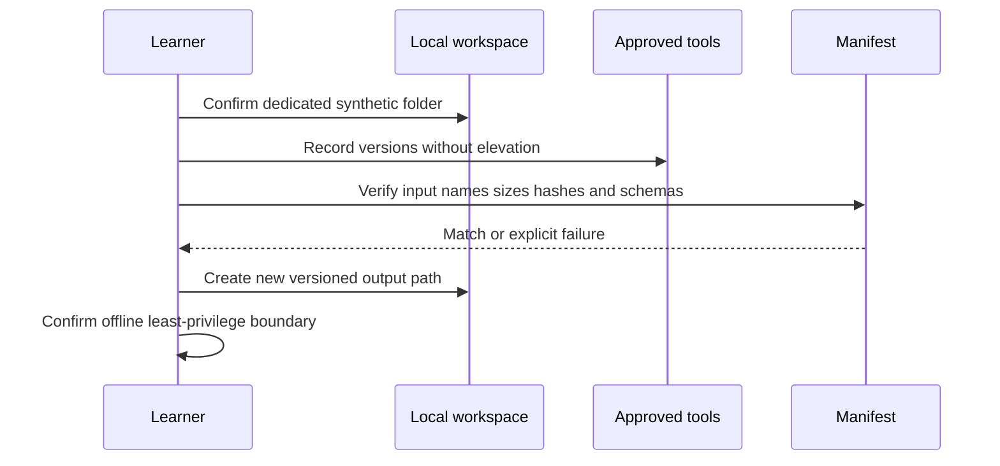

## Safe code/config/data example K-C01 - Folder convention (text)

```text
nmh-secops-lab/
  README.md
  LICENSE-NOTES.md
  config/
    project.json
  data/
    raw/v1/
    reference/v1/
    processed/v1/
  sql/
    schema/
    quality/
    analysis/
  src/
    generate/
    validate/
  evidence/
    manifests/
    queries/
    screenshots/
    logs/
  reports/
    technical/
    executive/
  dashboards/
    source/
    exports/
  releases/
    v1.0/
  scratch/
    local-only-review-before-removal/
```

**Convention rules:** Raw generated inputs are versioned and treated read-only after validation. Processed data never overwrites raw data. Scratch is excluded from the portfolio until reviewed. A release contains only approved summaries and reproduction material, not every working artifact.

### Diagram K04 - Folder data flow

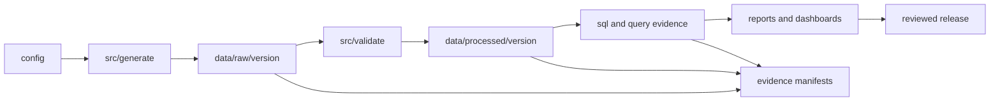

## Naming and version convention

| Artifact | Pattern | Example | Rule |
|---|---|---|---|
| Dataset | `nmh_<entity>_<source>_vNN.csv` | `nmh_asset_endpoint_v01.csv` | Lowercase ASCII; source namespace preserved |
| Script | `<verb>_<object>_vNN.py` | `validate_assets_v01.py` | Version when behavior changes materially |
| Query | `qNN_<purpose>.sql` | `q07_owner_backlog.sql` | One main question per file |
| Evidence | `EV-<area>-NNN_<label>.<ext>` | `EV-DQ-004_row-count.csv` | Manifest ID first |
| Screenshot | `SS-NNN_<view>_<date>.png` | `SS-003_quality-summary_20260824.png` | No real user/path in filename |
| Report | `<audience>_<purpose>_vN.N.md` | `executive_risk_review_v1.0.md` | Audience and semantic release visible |
| Release | `nmh-secops-portfolio-vN.N` | `nmh-secops-portfolio-v1.0` | Immutable after publication; supersede with new version |
| Date/time | ISO 8601 in content | `2026-08-24T14:30:00Z` | Preserve source time zone; use `Z` only for UTC |

## Safe code/config/data example K-C02 - Non-destructive prerequisite inventory (PowerShell)

```powershell
$commands = 'python', 'sqlite3', 'psql', 'code'
$commands | ForEach-Object {
    $found = Get-Command $_ -ErrorAction SilentlyContinue
    [pscustomobject]@{
        Command = $_
        Available = [bool]$found
        Source = if ($found) { $found.Source } else { '' }
    }
}
$PSVersionTable.PSVersion
```

This only inventories command availability. It does not install, elevate, alter policy, open a listener, or contact a service. Treat local paths as private metadata when capturing screenshots.

## Safe code/config/data example K-C03 - Create only missing local folders (PowerShell)

```powershell
$folders = @(
    'config', 'data/raw/v1', 'data/reference/v1', 'data/processed/v1',
    'sql/schema', 'sql/quality', 'sql/analysis', 'src/generate',
    'src/validate', 'evidence/manifests', 'evidence/queries',
    'evidence/screenshots', 'reports/technical', 'reports/executive',
    'dashboards/source', 'dashboards/exports', 'releases/v1.0', 'scratch'
)
foreach ($folder in $folders) {
    if (-not (Test-Path -LiteralPath $folder)) {
        New-Item -ItemType Directory -Path $folder | Out-Null
    }
}
```

Run only from the dedicated synthetic project root after reviewing `$folders`. This snippet never removes or overwrites a file.

## Safe code/config/data example K-C04 - Project configuration (JSON)

```json
{
  "project_id": "nmh-secops-lab",
  "release": "1.0",
  "data_classification": "synthetic-training-only",
  "seed": 20260824,
  "reference_time_utc": "2026-08-24T12:00:00Z",
  "network_required": false,
  "administrator_required": false,
  "paid_product_required": false,
  "source_version": "v1",
  "score_model": "illustrative-source-neutral-v1",
  "prohibited_inputs": [
    "credentials",
    "tokens",
    "cookies",
    "real_customer_data",
    "live_scan_results",
    "live_traffic"
  ]
}
```

### Diagram K05 - Configuration controls reproducibility

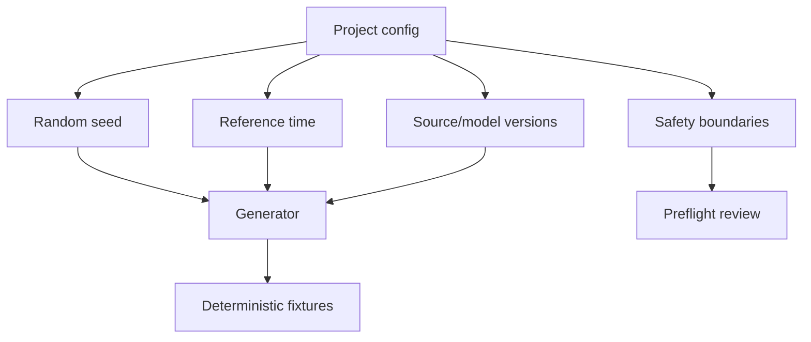

## Synthetic dataset model

The dataset is intentionally small enough to understand and rich enough to support data fabric, asset, vulnerability, connectivity, customer-success, and executive-capstone stories.

| Entity/file | Grain: one row represents | Primary key | Important foreign keys | Purpose |
|---|---|---|---|---|
| `source_system.csv` | One fictional source feed | `source_id` | None | Provenance, owner, clock, freshness, contract |
| `asset_observation.csv` | One source's observation of an asset at a time | `asset_observation_id` | `source_id` | Raw multi-source reconciliation |
| `asset.csv` | One canonical synthetic asset identity/lifecycle | `asset_id` | `owner_id`, `service_id` | Golden-record lab |
| `identity.csv` | One fictional user/service identity | `identity_id` | `owner_id` | Relationship and privilege context |
| `business_service.csv` | One fictional service | `service_id` | `owner_id` | Criticality/objective context |
| `vulnerability.csv` | One public-style vulnerability reference row | `vulnerability_id` | None | Severity/threat reference; use invented IDs unless official source verified |
| `finding.csv` | One source finding on an asset at an observation time | `finding_id` | `asset_id`, `vulnerability_id`, `source_id` | Backlog, age, status, provenance |
| `control.csv` | One source-neutral control definition | `control_id` | None | Objective/mechanism/evidence |
| `control_observation.csv` | One control state for an asset/time | `control_observation_id` | `control_id`, `asset_id`, `source_id` | Coverage and mitigating context |
| `relationship.csv` | One typed edge between entities | `relationship_id` | `from_id`, `to_id` | Security graph and service dependencies |
| `ticket.csv` | One fictional remediation work item | `ticket_id` | `finding_id`, `owner_id` | Workflow, SLA, exceptions, closure |
| `event_summary.csv` | One generated protocol/journey observation | `event_id` | `asset_id`, `identity_id`, `service_id` | Connectivity/escalation timeline without traffic capture |
| `decision.csv` | One governed choice | `decision_id` | Related entity IDs | Executive/capstone action trail |
| `metric_snapshot.csv` | One metric/version/population/as-of value | `metric_snapshot_id` | `service_id` | Dashboard trend and comparability |

### Diagram K06 - Core entity relationships

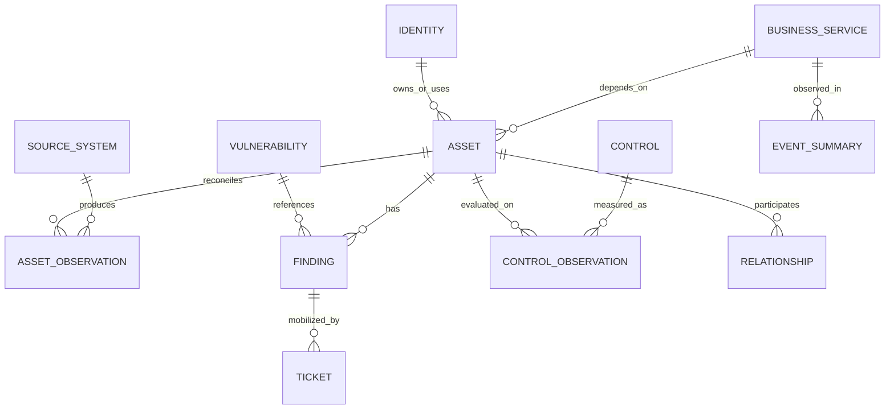

## Data dictionary: source and asset observations

| Field | Type | Required | Example | Meaning/validation |
|---|---|---:|---|---|
| `source_id` | text | Yes | `SRC-ENDPOINT` | Stable fictional namespace |
| `source_record_id` | text | Yes | `ep-00017` | Source-native ID; unique within source, not globally |
| `observed_at_utc` | timestamp text | Yes | `2026-08-23T10:15:00Z` | When source observed state |
| `ingested_at_utc` | timestamp text | Yes | `2026-08-24T12:00:00Z` | Lab load time; must not precede observation |
| `hostname` | text | No | `nmh-ws-017.example.invalid` | Reserved invalid domain; normalized lowercase separately |
| `ipv4` | text | No | `192.0.2.17` | Documentation prefix only; do not connect |
| `cloud_instance_id` | text | No | `i-nmh-0017` | Invented; source-specific |
| `device_serial` | text | No | `NMH-SYN-0017` | Generated, not real hardware identifier |
| `os_family` | enum | No | `Windows` | Controlled vocabulary |
| `lifecycle_state` | enum | Yes | `active` | `active`, `retiring`, `retired`, `unknown` |
| `owner_source_value` | text | No | `OWNER-APP-01` | Asserted source value; not automatically canonical |
| `source_deleted` | boolean | Yes | `false` | Tombstone/change-data practice |
| `record_version` | integer | Yes | `3` | Source record version |

## Data dictionary: canonical asset and service

| Field | Type | Required | Example | Meaning/validation |
|---|---|---:|---|---|
| `asset_id` | text | Yes | `AST-00017` | Stable generated canonical ID |
| `asset_type` | enum | Yes | `workstation` | Controlled source-neutral type |
| `display_name` | text | Yes | `NMH Workstation 017` | Fictional display only |
| `canonical_hostname` | text | No | `nmh-ws-017.example.invalid` | Reserved domain |
| `criticality_band` | enum | Yes | `high` | Synthetic customer-approved band in story, not universal |
| `internet_exposure_state` | enum | Yes | `unknown` | `observed`, `not_observed`, `unknown`; no scan inference |
| `owner_id` | text | No | `OWN-APP-01` | Fictional role owner |
| `service_id` | text | No | `SVC-SCHED` | Business-service relationship |
| `first_seen_utc` | timestamp text | Yes | `2026-06-01T00:00:00Z` | Minimum source observation in fixture |
| `last_seen_utc` | timestamp text | Yes | `2026-08-23T10:15:00Z` | Maximum source observation; not necessarily active now |
| `match_confidence` | enum | Yes | `reviewed` | `exact`, `reviewed`, `ambiguous`, `unmatched` |
| `survivorship_version` | text | Yes | `asset-rules-v1` | Rule provenance |

| Service field | Type | Example | Meaning |
|---|---|---|---|
| `service_id` | text | `SVC-SCHED` | Stable fictional service key |
| `service_name` | text | `Northstar Scheduling` | Fictional service name |
| `business_objective` | text | `Enable staff to schedule fictional appointments` | Outcome, not technical component |
| `criticality_band` | enum | `tier-1-synthetic` | Defined in lab reference file |
| `data_class` | enum | `synthetic-sensitive-like` | Trains handling without real sensitive data |
| `business_owner_id` | text | `OWN-CLINOPS-01` | Fictional role, not person |
| `recovery_requirement` | text | `use-approved-synthetic-value` | Avoid invented real RTO/RPO |

### Diagram K07 - Source-to-golden-record logic

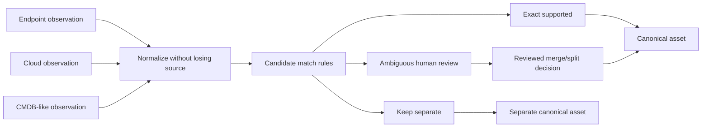

## Data dictionary: vulnerabilities, findings, and controls

| Field | Type | Required | Example | Meaning/validation |
|---|---|---:|---|---|
| `vulnerability_id` | text | Yes | `SYN-VULN-0042` | Invented lab ID; do not imply CVE |
| `weakness_family` | text | No | `input-validation-synthetic` | Source-neutral fictional category |
| `severity_band` | enum | Yes | `high` | Source severity, not enterprise priority |
| `severity_score` | decimal | No | `8.1` | Synthetic 0-10 input; not CVSS unless official vector/source used |
| `exploit_evidence_band` | enum | Yes | `none-observed` | Generated story label, not threat intelligence |
| `published_at_utc` | timestamp text | Yes | `2026-05-01T00:00:00Z` | Synthetic clock |
| `finding_id` | text | Yes | `FND-00123` | One asset-vulnerability-source observation |
| `asset_id` | text | Yes | `AST-00017` | Canonical asset link |
| `finding_status` | enum | Yes | `open` | Controlled lifecycle |
| `first_observed_utc` | timestamp text | Yes | `2026-07-01T00:00:00Z` | Evidence clock, not vulnerability publication |
| `last_observed_utc` | timestamp text | Yes | `2026-08-23T00:00:00Z` | Latest source observation |
| `source_severity` | enum | Yes | `high` | Preserved source label |
| `validation_state` | enum | Yes | `unvalidated` | `unvalidated`, `supported`, `refuted`, `exception` |

| Control field | Type | Example | Meaning |
|---|---|---|---|
| `control_id` | text | `CTL-ENDPOINT-01` | Fictional source-neutral control |
| `control_objective` | text | `Detect suspicious endpoint behavior` | Intended outcome |
| `control_type` | enum | `detective` | Preventive/detective/corrective/recovery |
| `coverage_state` | enum | `observed` | Bounded observation, not effectiveness |
| `operating_state` | enum | `unknown` | Separate from installation/coverage |
| `evidence_at_utc` | timestamp text | `2026-08-23T12:00:00Z` | Evidence freshness |
| `evidence_source_id` | text | `SRC-ENDPOINT` | Provenance |
| `exception_id` | text | blank | Approved synthetic exception if any |

## Data dictionary: events, tickets, metrics, and decisions

| Family | Required fields | Grain guardrail | Common analytical use |
|---|---|---|---|
| Event summary | `event_id`, journey, protocol layer, phase, result, event time, source, correlation ID | One generated observation, not packet or raw log | Timeline, failure phase, known-good comparison |
| Ticket | `ticket_id`, finding, owner, created/due/status, exception, closed, validation | One work item; one finding may have multiple tickets | SLA, aging, reopen, owner backlog |
| Metric snapshot | metric ID/version, value/unit, numerator/denominator, population, as-of, source | One metric definition/version/population/time | Comparable trend and dashboard narrative |
| Decision | decision ID, question, options, owner, date, evidence, conditions, validation | One accountable choice | QBR/EBR/incident/action trail |

### Diagram K08 - Finding-to-action lifecycle

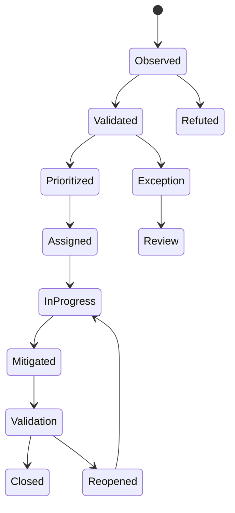

## Safe code/config/data example K-C05 - Synthetic assets (CSV)

```csv
asset_id,asset_type,display_name,canonical_hostname,criticality_band,internet_exposure_state,owner_id,service_id,last_seen_utc,match_confidence,survivorship_version
AST-00001,server,NMH Scheduling Web 01,nmh-sched-web-01.example.invalid,critical,unknown,OWN-APP-01,SVC-SCHED,2026-08-23T10:15:00Z,reviewed,asset-rules-v1
AST-00002,workstation,NMH Analyst Workstation 02,nmh-ws-002.example.invalid,medium,not_observed,OWN-SOC-01,SVC-SECOPS,2026-08-23T11:20:00Z,exact,asset-rules-v1
AST-00003,server,NMH Legacy API 03,nmh-api-003.example.invalid,high,unknown,OWN-APP-02,SVC-SCHED,2026-08-20T08:00:00Z,ambiguous,asset-rules-v1
```

The `.invalid` top-level domain and `192.0.2.0/24`, `198.51.100.0/24`, and `203.0.113.0/24` documentation address ranges are appropriate for examples, but the lab does not connect to them.

## Safe code/config/data example K-C06 - Synthetic findings (CSV)

```csv
finding_id,asset_id,vulnerability_id,source_id,source_severity,validation_state,first_observed_utc,last_observed_utc,finding_status
FND-00001,AST-00001,SYN-VULN-0042,SRC-SCANNER-A,high,supported,2026-07-01T00:00:00Z,2026-08-23T00:00:00Z,open
FND-00002,AST-00002,SYN-VULN-0011,SRC-SCANNER-A,medium,refuted,2026-08-01T00:00:00Z,2026-08-22T00:00:00Z,closed
FND-00003,AST-00003,SYN-VULN-0042,SRC-SCANNER-B,high,unvalidated,2026-06-15T00:00:00Z,2026-08-20T00:00:00Z,open
```

## Safe code/config/data example K-C07 - Synthetic controls (CSV)

```csv
control_observation_id,control_id,asset_id,source_id,coverage_state,operating_state,evidence_at_utc,exception_id
CO-00001,CTL-ENDPOINT-01,AST-00001,SRC-ENDPOINT,observed,unknown,2026-08-23T12:00:00Z,
CO-00002,CTL-ENDPOINT-01,AST-00002,SRC-ENDPOINT,observed,supported,2026-08-23T12:00:00Z,
CO-00003,CTL-ENDPOINT-01,AST-00003,SRC-ENDPOINT,not_observed,unknown,2026-08-20T12:00:00Z,EXC-SYN-01
```

## Safe code/config/data example K-C08 - Synthetic relationship edges (CSV)

```csv
relationship_id,from_id,relationship_type,to_id,source_id,observed_at_utc,confidence_state
REL-00001,AST-00001,supports,SVC-SCHED,SRC-CMDB-LIKE,2026-08-22T00:00:00Z,reviewed
REL-00002,ID-APP-01,administers,AST-00001,SRC-IAM-LIKE,2026-08-21T00:00:00Z,asserted
REL-00003,AST-00003,calls,AST-00001,SRC-APP-MAP,2026-08-20T00:00:00Z,ambiguous
```

### Diagram K09 - Relationship confidence

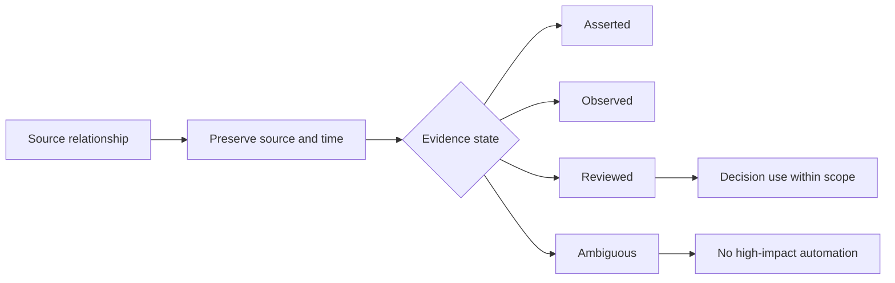

## Generation design

| Design choice | Rule | Why it matters |
|---|---|---|
| Seed | One recorded integer per dataset release | Same code/config can reproduce values |
| Reference time | Fixed UTC timestamp in config | Aging does not change every day |
| IDs | Prefix plus zero-padded generated number | Easy type recognition without real identifiers |
| Names/domains | NMH fictional names and `.invalid` | Clear synthetic boundary |
| IPs | Documentation ranges only | Avoid accidental real targets |
| Distributions | Explicit counts/rates in generator config | Bias and assumptions are reviewable |
| Missingness | Deliberately generated and documented | Quality queries have meaningful cases |
| Duplicates | Controlled exact/near/ambiguous pairs | Entity-resolution practice |
| Clocks | Event, observed, ingested, as-of separated | Timeline and freshness reasoning |
| Labels | Ground-truth reference file separate from candidate data | Prevent analysis from leaking answer |
| Expected outputs | Versioned test fixtures | Fast validation and regression checks |
| No external dependency | Standard library and local files | Reproducible without paid/network access |

## Safe code/config/data example K-C09 - Deterministic asset generator (Python)

```python
from __future__ import annotations

import csv
import random
from datetime import datetime, timedelta, timezone
from pathlib import Path

SEED = 20260824
ROW_COUNT = 50
REFERENCE_TIME = datetime(2026, 8, 24, 12, 0, tzinfo=timezone.utc)
OUTPUT = Path("data/raw/v1/nmh_asset_endpoint_v01.csv")

random_source = random.Random(SEED)
OUTPUT.parent.mkdir(parents=True, exist_ok=True)

with OUTPUT.open("w", newline="", encoding="utf-8") as stream:
    writer = csv.DictWriter(
        stream,
        fieldnames=[
            "source_id", "source_record_id", "observed_at_utc",
            "hostname", "ipv4", "os_family", "lifecycle_state",
        ],
    )
    writer.writeheader()
    for number in range(1, ROW_COUNT + 1):
        age_hours = random_source.randint(1, 240)
        observed = REFERENCE_TIME - timedelta(hours=age_hours)
        writer.writerow(
            {
                "source_id": "SRC-ENDPOINT",
                "source_record_id": f"ep-{number:05d}",
                "observed_at_utc": observed.isoformat().replace("+00:00", "Z"),
                "hostname": f"nmh-ws-{number:03d}.example.invalid",
                "ipv4": f"192.0.2.{(number % 250) + 1}",
                "os_family": random_source.choice(["Windows", "Linux"]),
                "lifecycle_state": random_source.choice(["active", "active", "retiring"]),
            }
        )

print(f"Wrote {ROW_COUNT} synthetic rows to {OUTPUT}")
```

This script creates a new designated fixture path and will overwrite that exact file if rerun. Review the path and preserve releases before execution. It does not use secrets, network access, subprocesses, elevation, or external packages.

### Diagram K10 - Deterministic generation

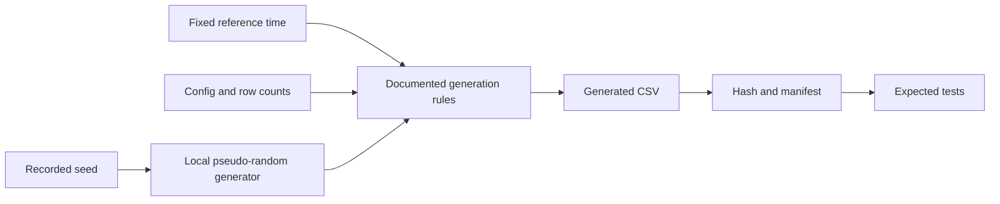

## Validation strategy

Validation is layered. A file can parse correctly and still be semantically wrong; a valid score can still be misleading.

| Layer | Question | Example checks | Failure handling |
|---|---|---|---|
| File | Can the file be read as declared? | Encoding, delimiter, JSON parse, header | Stop downstream load |
| Schema | Are names/types/required fields valid? | Required columns, timestamp parse, enum | Quarantine generated release for correction |
| Record | Does each row obey constraints? | Key nonblank, range, clock order | Write local validation report; do not silently coerce |
| Set | Are uniqueness and distribution expected? | Key uniqueness, row count, missingness | Compare generator config and expected fixture |
| Relationship | Do foreign keys and cardinalities hold? | Asset/service/source references | Keep unresolved rows explicit |
| Temporal | Are clocks consistent and freshness bounded? | observed <= ingested <= as-of | Correct generator or label exception |
| Semantic | Does meaning match the dictionary? | Severity separate from priority | Peer review and test cases |
| Analytical | Do queries use correct grain/denominator? | Join multiplication, NULL handling | Reconcile to independent totals |
| Presentation | Does dashboard preserve definition/scope/limits? | Metric metadata and accessible labels | Hold release |
| Reproducibility | Can a peer obtain expected aggregates? | Hash, version, deterministic output | Investigate environment/input/query drift |

## Safe code/config/data example K-C10 - CSV contract validator (Python)

```python
from __future__ import annotations

import csv
from datetime import datetime
from pathlib import Path

INPUT = Path("data/raw/v1/nmh_asset_endpoint_v01.csv")
REQUIRED = {
    "source_id", "source_record_id", "observed_at_utc", "hostname",
    "ipv4", "os_family", "lifecycle_state",
}
ALLOWED_OS = {"Windows", "Linux"}
ALLOWED_LIFECYCLE = {"active", "retiring", "retired", "unknown"}
errors: list[str] = []
seen: set[tuple[str, str]] = set()

with INPUT.open(newline="", encoding="utf-8") as stream:
    reader = csv.DictReader(stream)
    missing = REQUIRED - set(reader.fieldnames or [])
    if missing:
        errors.append(f"Missing columns: {sorted(missing)}")
    for line_number, row in enumerate(reader, start=2):
        key = (row.get("source_id", ""), row.get("source_record_id", ""))
        if not all(key):
            errors.append(f"Line {line_number}: blank source key")
        elif key in seen:
            errors.append(f"Line {line_number}: duplicate source key {key}")
        seen.add(key)
        if row.get("os_family") not in ALLOWED_OS:
            errors.append(f"Line {line_number}: invalid os_family")
        if row.get("lifecycle_state") not in ALLOWED_LIFECYCLE:
            errors.append(f"Line {line_number}: invalid lifecycle_state")
        try:
            datetime.fromisoformat(row.get("observed_at_utc", "").replace("Z", "+00:00"))
        except ValueError:
            errors.append(f"Line {line_number}: invalid observed_at_utc")

if errors:
    print("VALIDATION FAILED")
    for error in errors:
        print(error)
    raise SystemExit(1)
print(f"VALIDATION PASSED: {len(seen)} unique synthetic source records")
```

The validator reports and stops; it does not mutate source data.

## Safe code/config/data example K-C11 - Relational schema (SQL)

```sql
CREATE TABLE source_system (
    source_id TEXT PRIMARY KEY,
    source_name TEXT NOT NULL,
    owner_role TEXT NOT NULL,
    expected_cadence_hours INTEGER CHECK (expected_cadence_hours > 0)
);

CREATE TABLE asset (
    asset_id TEXT PRIMARY KEY,
    asset_type TEXT NOT NULL,
    display_name TEXT NOT NULL,
    canonical_hostname TEXT,
    criticality_band TEXT NOT NULL,
    internet_exposure_state TEXT NOT NULL,
    owner_id TEXT,
    service_id TEXT,
    last_seen_utc TEXT NOT NULL,
    match_confidence TEXT NOT NULL,
    survivorship_version TEXT NOT NULL
);

CREATE TABLE finding (
    finding_id TEXT PRIMARY KEY,
    asset_id TEXT NOT NULL REFERENCES asset(asset_id),
    vulnerability_id TEXT NOT NULL,
    source_id TEXT NOT NULL REFERENCES source_system(source_id),
    source_severity TEXT NOT NULL,
    validation_state TEXT NOT NULL,
    first_observed_utc TEXT NOT NULL,
    last_observed_utc TEXT NOT NULL,
    finding_status TEXT NOT NULL
);
```

Run in a new local synthetic database. Dialect details may require adaptation. Constraints teach contracts; they do not define a vendor schema.

### Diagram K11 - Validation gates

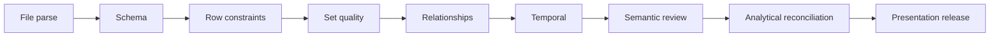

## Safe code/config/data example K-C12 - Data-quality profile (SQL)

```sql
SELECT
    COUNT(*) AS asset_count,
    COUNT(DISTINCT asset_id) AS distinct_asset_count,
    SUM(CASE WHEN owner_id IS NULL OR owner_id = '' THEN 1 ELSE 0 END) AS missing_owner_count,
    SUM(CASE WHEN match_confidence = 'ambiguous' THEN 1 ELSE 0 END) AS ambiguous_count,
    MIN(last_seen_utc) AS oldest_last_seen_utc,
    MAX(last_seen_utc) AS newest_last_seen_utc
FROM asset;
```

Interpret counts against the declared population and source version. `COUNT(DISTINCT asset_id)` matching `COUNT(*)` checks uniqueness only in this table; it does not prove identity correctness.

## Safe code/config/data example K-C13 - Orphan and join-multiplication checks (SQL)

```sql
SELECT f.finding_id, f.asset_id
FROM finding AS f
LEFT JOIN asset AS a ON a.asset_id = f.asset_id
WHERE a.asset_id IS NULL;

SELECT
    f.finding_id,
    COUNT(*) AS joined_rows
FROM finding AS f
JOIN asset AS a ON a.asset_id = f.asset_id
GROUP BY f.finding_id
HAVING COUNT(*) <> 1;
```

The first query finds missing parent records. The second detects unexpected multiplication at the intended one-finding-to-one-canonical-asset join.

## Safe code/config/data example K-C14 - Latest source observation (SQL)

```sql
WITH ranked AS (
    SELECT
        source_id,
        source_record_id,
        observed_at_utc,
        hostname,
        lifecycle_state,
        ROW_NUMBER() OVER (
            PARTITION BY source_id, source_record_id
            ORDER BY observed_at_utc DESC, record_version DESC
        ) AS row_rank
    FROM asset_observation
)
SELECT *
FROM ranked
WHERE row_rank = 1;
```

Tie-breakers are explicit. If identical clocks and versions contain conflicting values, the correct result is a quality exception, not an arbitrary winner.

### Diagram K12 - Query evidence pipeline

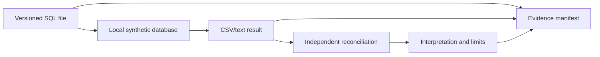

## Entity-resolution approach

| Stage | Output | Safety/quality rule |
|---|---|---|
| Normalize | Comparable casing, whitespace, host/domain form | Preserve source-native value alongside normalized value |
| Exact candidates | Same stable source IDs or approved composite key | Exact string equality is not automatically entity identity |
| Near candidates | Similar names plus supporting attributes | Generate candidates only; no automatic high-impact merge |
| Temporal check | Lifecycle overlap/sequence | Reused names/addresses can represent different assets |
| Relationship/context | Owner, service, cloud/account context | Source authority and freshness matter |
| Decision | Merge, keep separate, ambiguous, split correction | Record reviewer, evidence, rule version, date |
| Regression | Labeled cases rerun on rule changes | Measure false merge and false split separately |

## Safe code/config/data example K-C15 - Candidate match query (SQL)

```sql
SELECT
    left_obs.source_id AS left_source,
    left_obs.source_record_id AS left_record,
    right_obs.source_id AS right_source,
    right_obs.source_record_id AS right_record,
    left_obs.normalized_hostname,
    CASE
        WHEN left_obs.device_serial <> ''
         AND left_obs.device_serial = right_obs.device_serial THEN 'strong-candidate'
        WHEN left_obs.normalized_hostname = right_obs.normalized_hostname THEN 'review-hostname'
        ELSE 'no-candidate'
    END AS candidate_state
FROM latest_asset_observation AS left_obs
JOIN latest_asset_observation AS right_obs
  ON left_obs.source_id < right_obs.source_id
 AND (
      left_obs.device_serial = right_obs.device_serial
      OR left_obs.normalized_hostname = right_obs.normalized_hostname
 );
```

This generates review candidates. It does not merge records or write back to any system.

### Diagram K13 - False merge versus false split

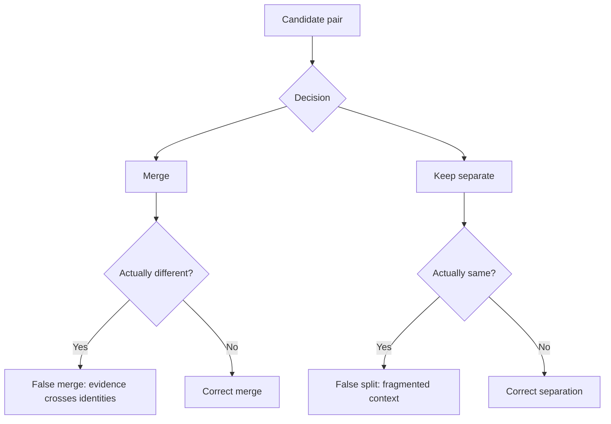

## Illustrative scoring workbook

The score is a transparent teaching device. Use customer-approved methodology in real work. Keep raw inputs, normalized inputs, weights, missing-value treatment, rule version, sensitivity, and rationale visible.

| Factor | Raw synthetic field | Illustrative normalized range | Example weight | Why included | Missing treatment | Caveat |
|---|---|---:|---:|---|---|---|
| Source severity | `severity_score` | 0-10 | 0.20 | Technical weakness intensity | Unknown, not zero | Not business risk |
| Exploit evidence | `exploit_evidence_band` | 0, 4, 8, 10 | 0.20 | Threat relevance in story | Unknown and review | Synthetic unless official feed cited |
| Criticality | `criticality_band` | 2, 5, 8, 10 | 0.20 | Business context | Unknown and owner action | Band definitions are fictional |
| Exposure/reachability | `internet_exposure_state` | 0, 7, unknown | 0.15 | Potential path context | Unknown, not safe | No scan; generated label only |
| Control gap | coverage/operation | 0-10 | 0.15 | Mitigating context | Unknown and evidence action | Coverage is not effectiveness |
| Age/SLA | days and approved tier | 0-10 | 0.10 | Operational urgency | Compute only with fixed clock | Do not double-count severity |

**Illustrative formula:**

$$
S = \frac{\sum_i w_i x_i}{\sum_i w_i\;\text{for known }x_i}
$$

The denominator uses only known factors and must be accompanied by completeness. This prevents an unknown factor from becoming zero, but it can make sparse records appear confidently high or low. Therefore show `known_weight`, unknown factors, and sensitivity beside the score.

## Safe code/config/data example K-C16 - Scoring workbook rows (CSV)

```csv
finding_id,severity_norm,exploit_norm,criticality_norm,exposure_norm,control_gap_norm,age_norm,known_weight,illustrative_score,unknown_factors,model_version
FND-00001,8.1,4,10,,6,7,0.85,7.10,exposure,illustrative-v1
FND-00002,5.0,0,5,0,0,2,1.00,2.20,,illustrative-v1
FND-00003,8.1,,8,,10,9,0.60,8.58,exploit|exposure,illustrative-v1
```

Values are worked synthetic examples. Recalculate from source fields rather than trusting this CSV as an authority.

## Safe code/config/data example K-C17 - Transparent illustrative score (SQL)

```sql
SELECT
    finding_id,
    known_weight,
    CASE
        WHEN known_weight = 0 THEN NULL
        ELSE ROUND(weighted_sum / known_weight, 2)
    END AS illustrative_score,
    unknown_factors,
    'illustrative-source-neutral-v1' AS model_version
FROM finding_score_components;
```

The view `finding_score_components` should expose every factor and weight. Never hide the formula inside a dashboard-only calculated column.

## Safe code/config/data example K-C18 - Sensitivity comparison (SQL)

```sql
SELECT
    finding_id,
    illustrative_score AS base_score,
    ROUND(score_if_exposure_low, 2) AS exposure_low_case,
    ROUND(score_if_exposure_high, 2) AS exposure_high_case,
    CASE
        WHEN priority_rank_low <> priority_rank_high THEN 'decision-sensitive'
        ELSE 'rank-stable-in-tested-range'
    END AS sensitivity_result
FROM score_sensitivity;
```

Sensitivity asks whether a plausible unknown can reverse the decision. It does not turn scenarios into probabilities.

### Diagram K14 - Score with uncertainty

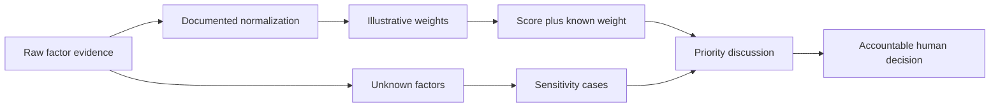

### Plain-English deep-dive 2 - A score is a sortable opinion with paperwork

A recipe combines ingredients according to chosen proportions. A score combines factors according to chosen normalization and weights. The arithmetic can be flawless while the recipe is wrong for the decision. That is why the workbook preserves factor evidence, missing values, version, sensitivity, and owner judgment. The score helps sort questions; it does not accept risk or prove exploitability.

## Backlog, SLA, and exception evidence

| Field | Purpose | Required caveat |
|---|---|---|
| Priority rank | Order work under one model/version/as-of time | Rank is relative to included population |
| Owner | Route work | Source assertion may be stale; record confidence |
| Due date | Govern timeliness | Cite customer tier/policy and pause rules |
| Original due date | Prevent reset gaming | Preserve through reassignment |
| Current due date | Show approved change | Link approval and reason |
| Status | Track workflow state | Ticket closed is not finding/control/risk closure |
| Exception | Time-bounded alternate handling | Needs authority, expiry, controls, monitoring |
| Validation | Prove postcondition | Independent evidence and scope |
| Reopen | Handle failed/recurring state | Record trigger and clock |

## Safe code/config/data example K-C19 - Aging and SLA query (SQL)

```sql
SELECT
    f.finding_id,
    f.asset_id,
    f.first_observed_utc,
    t.original_due_utc,
    t.current_due_utc,
    t.ticket_status,
    CASE
        WHEN t.ticket_status = 'closed' THEN 'workflow-closed-validate-finding'
        WHEN t.current_due_utc < '2026-08-24T12:00:00Z' THEN 'past-current-due'
        ELSE 'within-current-window'
    END AS due_state
FROM finding AS f
LEFT JOIN ticket AS t ON t.finding_id = f.finding_id
WHERE f.finding_status = 'open';
```

The fixed reference time preserves reproducibility. It is not the actual current time and does not define a real SLA.

### Diagram K15 - Finding, ticket, and risk are separate

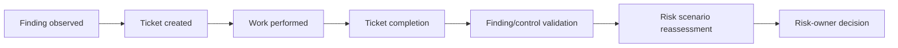

## Query evidence standard

| Evidence field | Example | Why |
|---|---|---|
| Query ID/path | `Q-DQ-007/sql/quality/q07_orphans.sql` | Stable reference |
| Question | "Which findings lack a canonical asset?" | Prevents purposeless querying |
| Engine/version | Local SQLite or PostgreSQL version | Dialect/reproduction context |
| Input database/data version | `nmh-lab-v1`, source hashes | Controls source drift |
| Query hash | SHA-256 | Detects changed query text |
| Run time/reference time | Actual run plus fixed analytical clock | Separates execution from model clock |
| Row count/aggregate | 3 rows, with reconciliation total | Fast reasonableness check |
| Output path/hash | Controlled CSV/text | Integrity path |
| Interpretation | Bounded statement | Separates result from claim |
| Limit/alternate explanation | Missing load versus true orphan | Prevents certainty |
| Reviewer | Peer/self and date | Accountability |

## Safe code/config/data example K-C20 - Query evidence record (JSON)

```json
{
  "evidence_id": "EV-QRY-007",
  "question": "Which synthetic findings lack a canonical asset?",
  "query_path": "sql/quality/q07_orphans.sql",
  "query_sha256": "FILLABLE-BLANK-AFTER-LOCAL-HASH",
  "engine": "FILLABLE-BLANK-APPROVED-LOCAL-ENGINE",
  "engine_version": "FILLABLE-BLANK",
  "input_release": "nmh-lab-v1",
  "analytical_reference_time_utc": "2026-08-24T12:00:00Z",
  "run_time_utc": "FILLABLE-BLANK",
  "result_row_count": "FILLABLE-BLANK",
  "output_path": "evidence/queries/EV-QRY-007_orphans.csv",
  "output_sha256": "FILLABLE-BLANK-AFTER-LOCAL-HASH",
  "claim_label": "synthetic-lab-observed",
  "interpretation": "FILLABLE-BLANK-AFTER-REVIEW",
  "limitations": ["local synthetic data", "load defects can resemble true orphans"]
}
```

Every `FILLABLE-BLANK` is intentionally incomplete until the local run; do not publish it as a finished record.

### Diagram K16 - Evidence versus claim

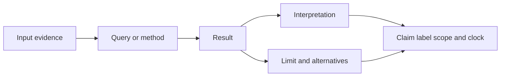

## Hashes and provenance

A cryptographic hash is a deterministic fingerprint of bytes. Matching hashes strongly support that two files are byte-for-byte identical under the chosen algorithm. They do not prove who created a file, whether its contents are correct, whether it was collected lawfully, or whether it is safe.

## Safe code/config/data example K-C21 - SHA-256 file inventory (PowerShell)

```powershell
$root = Resolve-Path 'data/raw/v1'
Get-ChildItem -LiteralPath $root -File |
    Sort-Object Name |
    ForEach-Object {
        $hash = Get-FileHash -LiteralPath $_.FullName -Algorithm SHA256
        [pscustomobject]@{
            RelativeName = $_.Name
            Bytes = $_.Length
            SHA256 = $hash.Hash.ToLowerInvariant()
        }
    } |
    Export-Csv -LiteralPath 'evidence/manifests/raw-v1-files.csv' -NoTypeInformation
```

Review the input and output paths first. This reads files and writes one manifest; it does not recurse beyond the designated folder or remove content.

## Safe code/config/data example K-C22 - SHA-256 verification (Python)

```python
from __future__ import annotations

import hashlib
from pathlib import Path

path = Path("data/raw/v1/nmh_asset_endpoint_v01.csv")
digest = hashlib.sha256()
with path.open("rb") as stream:
    for block in iter(lambda: stream.read(1024 * 1024), b""):
        digest.update(block)
print(f"{path.as_posix()} {digest.hexdigest()}")
```

### Diagram K17 - Provenance record

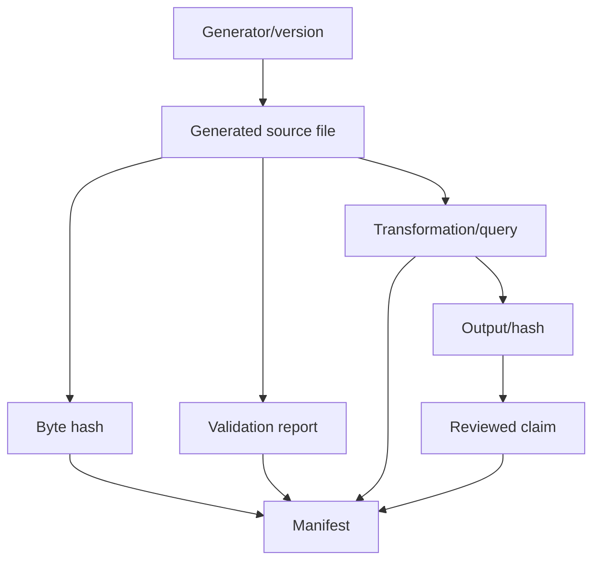

## Template K-T02 - Evidence manifest

**Fillable blank:**

| Evidence ID | Artifact/purpose | Producer/method | Source inputs | Version/time | Hash/reference | Classification | Claim supported | Limit | Reviewer/retention |
|---|---|---|---|---|---|---|---|---|---|
|  |  |  |  |  |  |  |  |  |  |

**Fictional NMH sample:**

| Evidence ID | Artifact/purpose | Producer/method | Source inputs | Version/time | Hash/reference | Classification | Claim supported | Limit | Reviewer/retention |
|---|---|---|---|---|---|---|---|---|---|
| EV-DQ-001 | Quality profile CSV | q01_profile.sql | raw-v1 manifest | Query v1 / run time recorded | SHA-256 in manifest | Synthetic portfolio | Fixed release contains declared row/missingness totals | Engine/dataset only | Peer reviewer; release retention |
| EV-SCR-001 | Dashboard screenshot | Approved local desktop export | Metric CSV v1 | Dashboard v1 / 2026-08-24 reference | File hash | Synthetic portfolio | Shows role-based summary layout | Screenshot does not prove calculation | Visual reviewer; replace on release |

## Screenshot and redaction standard

| Check | Required action | Common leak |
|---|---|---|
| Purpose | Capture only the area needed to support the claim | Entire desktop for one chart |
| Data | Use generated NMH labels and aggregates | Real recent files, accounts, hostnames, email |
| Window chrome | Crop or mask user profile, tenant, local path, notifications | Windows user name in title/path |
| Browser/app | Remove tabs, bookmarks, URL/query strings, account avatar | Tokens or customer identifiers |
| Terminal | Avoid history, prompt path, environment variables | Home path and secrets |
| Metadata | Review filename and image/document properties | Author/device/location metadata |
| Redaction | Flatten approved redaction; keep controlled original only if required | Movable shape over readable text |
| Context | Include version, as-of date, source label, limitation | Screenshot presented as current product UI |
| Accessibility | Add meaningful nearby description | Image-only result |
| Review | Second-person or deliberate zoomed inspection | Small text overlooked |

## Template K-T03 - Screenshot register

**Fillable blank:**

| Screenshot ID | Claim/purpose | Source view/version | Capture time | Crop/redaction | Sensitive-data check | Accessibility description | Reviewer | Release path/hash |
|---|---|---|---|---|---|---|---|---|---|
|  |  |  |  |  |  |  |  |  |

**Fictional NMH sample:**

| Screenshot ID | Claim/purpose | Source view/version | Capture time | Crop/redaction | Sensitive-data check | Accessibility description | Reviewer | Release path/hash |
|---|---|---|---|---|---|---|---|---|---|
| SS-003 | Demonstrate quality dashboard narrative | Local optional BI export v1 | Actual run time recorded | Cropped to chart; local path removed | Generated labels and aggregates only | "Bar chart compares known-owner and ambiguous counts for fixed v1 population" | Peer role | `dashboards/exports/SS-003...png`, hash in manifest |

### Diagram K18 - Screenshot release

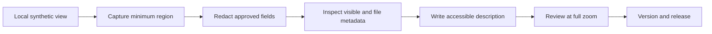

## Dashboard artifact design

A dashboard release is more than a `.pbix` or workbook. Preserve source exports, metric definitions, model relationships, filters, visual specifications, accessible screenshots, narrative, and known limitations so the work remains inspectable without proprietary software.

| Artifact | Required content | Portable fallback |
|---|---|---|
| Metric dictionary | Formula, grain, population, clock, version, owner, misuse warning | Markdown/CSV |
| Source extract | Synthetic minimal fields and hash | CSV |
| Model map | Tables, keys, cardinality, filter direction | Mermaid plus table |
| Transform record | Steps/query/version | SQL/Python text |
| Visual specification | Audience, question, encoding, filters, drill-down | JSON/Markdown |
| Dashboard source | Optional approved BI file | Not required for evaluation |
| Accessible export | Direct labels, descriptions, tables | PDF/PNG plus Markdown narrative |
| Reconciliation | Dashboard values versus independent query totals | CSV/table |
| Narrative | What changed, comparable scope, drivers, alternatives, action | Markdown |
| Release manifest | Files, versions, hashes, classification | CSV/JSON |

### Diagram K19 - Dashboard release package

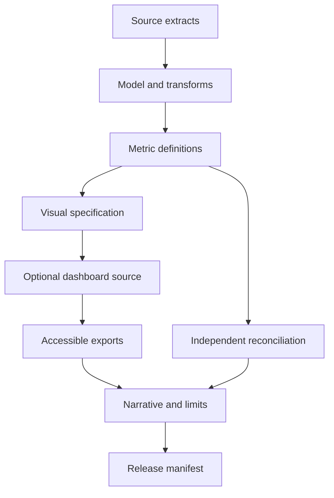

## Safe code/config/data example K-C23 - Dashboard visual specification (JSON)

```json
{
  "visual_id": "VIS-OWNER-BACKLOG-01",
  "audience": "technical-leader",
  "question": "Which fictional owner roles have the largest validated open backlog?",
  "metric_version": "open-validated-findings-v1",
  "grain": "finding",
  "population": "synthetic findings with validation_state=supported and finding_status=open",
  "reference_time_utc": "2026-08-24T12:00:00Z",
  "chart": "sorted-horizontal-bar",
  "category": "owner_role",
  "measure": "finding_count",
  "filters": ["service_id", "criticality_band"],
  "accessibility": ["direct value labels", "text summary", "data table"],
  "prohibited_interpretation": "owner count is not owner performance or enterprise risk"
}
```

## Safe code/config/data example K-C24 - Dashboard-source view (SQL)

```sql
CREATE VIEW dashboard_owner_backlog_v1 AS
SELECT
    COALESCE(a.owner_id, 'OWNER-UNKNOWN') AS owner_role,
    a.service_id,
    a.criticality_band,
    COUNT(*) AS finding_count,
    MIN(f.first_observed_utc) AS oldest_first_observed_utc,
    '2026-08-24T12:00:00Z' AS reference_time_utc,
    'open-validated-findings-v1' AS metric_version
FROM finding AS f
JOIN asset AS a ON a.asset_id = f.asset_id
WHERE f.finding_status = 'open'
  AND f.validation_state = 'supported'
GROUP BY COALESCE(a.owner_id, 'OWNER-UNKNOWN'), a.service_id, a.criticality_band;
```

## Safe code/config/data example K-C25 - Accessible dashboard narrative (text)

```text
Synthetic lab observation, not a customer or product result:

For the fixed v1 population at the analytical reference time 2026-08-24T12:00:00Z,
OWNER-APP-01 has the largest count of supported open findings. The count is a workload
indicator, not a measure of owner performance or enterprise risk. Unknown ownership is
shown as its own category rather than dropped. Before action, review finding grain,
criticality, validation evidence, duplicate state, existing tickets, and capacity.
```

### Diagram K20 - Metric-to-action drill-down

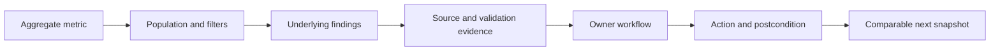

## Reproducibility run record

| Field | Required value |
|---|---|
| Run ID | Unique local ID |
| Project release/commit or snapshot | Exact version |
| Operating system | Edition/version without publishing device identity |
| Tool/interpreter versions | Python/SQL/PowerShell/BI as applicable |
| Config/seed/reference time | Exact values |
| Input manifest/hash | Controlled reference |
| Command or UI sequence | Minimum reproducible steps; no secrets |
| Start/end actual time | UTC or explicit zone |
| Output manifest/hash | Controlled reference |
| Expected/actual checks | Pass/fail with differences |
| Deviations | Any environment/manual change |
| Reviewer | Self/peer and date |

## Safe code/config/data example K-C26 - Environment capture (PowerShell)

```powershell
$python = Get-Command python -ErrorAction SilentlyContinue
[pscustomobject]@{
    PowerShellVersion = $PSVersionTable.PSVersion.ToString()
    PythonAvailable = [bool]$python
    PythonSource = if ($python) { $python.Source } else { '' }
    OperatingSystem = [System.Environment]::OSVersion.VersionString
    ProjectRelease = 'nmh-secops-lab-v1.0'
    CaptureTimeUtc = [DateTime]::UtcNow.ToString('o')
} | ConvertTo-Json -Depth 3
```

Review local path metadata before including output in a portfolio. This reads environment facts and prints JSON; it makes no change.

## Safe code/config/data example K-C27 - Reproducibility comparison (Python)

```python
from __future__ import annotations

import csv
from pathlib import Path

EXPECTED = {"asset_count": "50", "duplicate_source_keys": "0"}
RESULT = Path("evidence/queries/EV-DQ-001_summary.csv")

with RESULT.open(newline="", encoding="utf-8") as stream:
    row = next(csv.DictReader(stream))

failures = {
    key: {"expected": expected, "actual": row.get(key)}
    for key, expected in EXPECTED.items()
    if row.get(key) != expected
}
if failures:
    print("REPRODUCIBILITY CHECK FAILED")
    for key, values in failures.items():
        print(key, values)
    raise SystemExit(1)
print("REPRODUCIBILITY CHECK PASSED")
```

### Diagram K21 - Independent reproduction

```mermaid
sequenceDiagram
    participant A as Author
    participant P as Portfolio release
    participant R as Reviewer
    A->>P: Publish config inputs methods expected checks and hashes
    R->>P: Verify release integrity
    R->>R: Run locally with recorded versions
    R-->>A: Return outputs differences and environment
    A->>P: Correct defect or record reproducibility limit
```

## Claim labeling

| Label | Meaning | Example allowed wording | Prohibited leap |
|---|---|---|---|
| Synthetic input | Invented fixture | "The generated dataset contains 50 assets." | "The customer has 50 assets." |
| Lab-observed | Result from recorded local run | "The v1 local query returned three ambiguous assets." | "Zscaler found three assets." |
| Conceptual | Architecture/process understanding | "A data fabric can harmonize source schemas." | "I implemented the vendor platform." |
| Official public | Dated authoritative source claim | "Official documentation reviewed on [date] states..." | Assuming tenant entitlement/behavior |
| Production experience | Personally performed in authorized real work | State exact scope truthfully | Inflating adjacent experience |
| Not yet used | No hands-on production experience | "I have not used this product in production; here is my lab reasoning." | Hiding the gap |
| Hypothesis | Testable expectation | "This mapping may reduce false splits; the test is..." | Calling expected outcome realized |
| Unknown | Evidence absent/conflicting | "Production scale is unknown." | Filling with zero or confidence |

### Diagram K22 - Interview claim gate

```mermaid
flowchart TD
    C[Draft statement] --> TYPE{What evidence type?}
    TYPE --> SYN[Synthetic input]
    TYPE --> LAB[Lab-observed]
    TYPE --> CON[Conceptual]
    TYPE --> OFF[Official public]
    TYPE --> PROD[Production experience]
    SYN --> WORD[State scope source date and limit]
    LAB --> WORD
    CON --> WORD
    OFF --> WORD
    PROD --> WORD
    WORD --> CHK{Could listener infer more?}
    CHK -- Yes --> REWRITE[Rewrite explicitly]
    CHK -- No --> USE[Use with evidence link]
```

### Plain-English deep-dive 3 - Honesty makes the demo stronger

A flight simulator is valuable because everyone knows it is a simulator. The learner can still demonstrate checklists, diagnosis, communication, and judgment. Saying "I used generated multi-source data to practice entity resolution and can show my rules, tests, and errors" gives an interviewer inspectable evidence. Pretending it was a product tenant invites questions the artifact cannot answer and undermines trust.

## Template K-T04 - Portfolio README

**Fillable structure:**

```text
PROJECT TITLE: [FILLABLE]

## One-sentence purpose
[FILLABLE: learning question and audience]

## Safety and synthetic-data boundary
[FILLABLE: local-only, generated data, prohibited inputs/actions]

## What this demonstrates
[FILLABLE: modeling, SQL, quality, prioritization, communication]

## What this does not demonstrate
[FILLABLE: no product tenant, live scan/traffic, production efficacy, customer result]

## Architecture and data
[FILLABLE: diagram, entity list, versions]

## Reproduce locally
[FILLABLE: approved prerequisites, version check, generation/validation/query sequence]

## Expected evidence and checks
[FILLABLE: manifest, hashes, expected row counts, reconciliation]

## Key findings and limitations
[FILLABLE: bounded synthetic observations, alternatives, unknowns]

## Decision artifacts
[FILLABLE: technical review, dashboard narrative, risk memo, actions]

## Cleanup and privacy, accessibility, and data handling
[FILLABLE: review, approved release subset, retention]

## Interview demonstration
[FILLABLE: 5/10/20 minute route]

## Version history and sources
[FILLABLE: release notes and dated official references]
```

**Fictional NMH sample summary:** "This local synthetic portfolio demonstrates how I would structure a SecOps TSM evidence journey from multi-source data contracts through quality, contextual prioritization, escalation, and executive decision support. It does not claim Zscaler tenant or production experience. All records are generated NMH fixtures; the release includes reproducible SQL/Python, hashes, accessible exports, limitations, and an honest interview script."

## Portfolio release inventory

| Release area | Include | Exclude |
|---|---|---|
| README | Purpose, boundaries, reproduction, claims, navigation | Marketing language that overstates experience |
| Data | Minimum generated sample/reference labels | Huge redundant fixtures or any real data |
| Code/query | Reviewed local scripts and SQL | Secrets, environment-specific paths, unsafe commands |
| Evidence | Manifests, hashes, validation/query summaries | Raw sensitive metadata or unreviewed screenshots |
| Dashboard | Portable source CSV, metric dictionary, model map, accessible export | BI file as the only evidence |
| Communication | Technical review, executive memo, action register | Fictional customer artifact without synthetic banner |
| Reflection | What failed, corrected, remains unknown | Claim of perfection |
| Sources | Dated authoritative links and claim ledger | Blog where official source exists |
| License/rights | Notes for self-authored and third-party material | Copied proprietary templates/data |

### Diagram K23 - Portfolio navigation

```mermaid
flowchart TD
    README[README and boundaries] --> ARCH[Architecture and data]
    README --> RUN[Reproduce]
    README --> EVID[Evidence manifest]
    README --> FIND[Findings and limitations]
    README --> DEC[Decision artifacts]
    README --> DEMO[Interview route]
    RUN --> EVID
    ARCH --> FIND
    EVID --> FIND
    FIND --> DEC
```

## Interview demonstration routes

| Route | Time | Show | Say | Do not imply |
|---|---:|---|---|---|
| Executive | 5 min | One architecture, one dashboard narrative, one decision | Objective, evidence, uncertainty, choice, owner | Vendor performance or customer outcome |
| Technical | 10 min | Dictionary, quality query, model, reconciliation, manifest | Grain, provenance, tests, defect corrected | Production scale or tenant schema |
| Data | 15 min | Raw/canonical mapping, entity resolution, SQL, sensitivity | False merge/split, unknown handling, transparent formula | Proprietary Data Fabric/UVM logic |
| Escalation | 10 min | Generated timeline, hypotheses, update, recovery criteria | Facts versus cause, safe tests, no unsupported ETA | Real outage handling if not experienced |
| Training | 10 min | Agenda, lab, teach-back, evaluation | Learner behavior and transfer evidence | Certification or customer adoption |
| Complete capstone | 20 min | README path across Parts 111-117 | Discovery -> evidence -> action -> value/limits | That every artifact was used in production |

## Template K-T05 - Interview demo run of show

**Fillable blank:**

| Minute | Artifact | Message | Evidence/claim label | Likely question | Honest boundary | Fallback |
|---:|---|---|---|---|---|---|
|  |  |  |  |  |  |  |

**Fictional NMH sample:**

| Minute | Artifact | Message | Evidence/claim label | Likely question | Honest boundary | Fallback |
|---:|---|---|---|---|---|---|
| 0-1 | README | Local synthetic capstone and safety | Synthetic/conceptual | Did you use Zscaler? | Not in this lab; product experience stated separately | Show boundary banner |
| 1-4 | Model | Preserve source grain/provenance before entity resolution | Lab design | How did you match? | Source-neutral rules, not Data Fabric implementation | Open rule table |
| 4-7 | Quality/query | Orphans and ambiguous records remain visible | Lab-observed | Is quality good? | Fixed release only; gates and limits shown | Show reconciliation CSV |
| 7-10 | Score/sensitivity | Context changes priority; unknowns affect rank | Illustrative | Is this UVM scoring? | No; transparent educational formula only | Show factor dictionary |
| 10-13 | Dashboard | Metric translated to owner decision | Lab-observed | Did risk decrease? | No production risk evidence | Show narrative |
| 13-16 | Incident artifact | Reproduction mismatch became a safe escalation story | Synthetic simulation | Root cause? | PIR-approved lab cause only | Show timeline/hypotheses |
| 16-19 | Executive memo | Narrow decision with owners/postconditions | Synthetic | What value? | Reusable method/capacity hypothesis, no booked savings | Value ledger |
| 19-20 | Reflection | Defects corrected and next learning | Honest reflection | What would you change? | State next test | Close on question |

### Diagram K24 - Demo layers

```mermaid
flowchart LR
    WHY[Why this project] --> SAFE[Safety and honesty]
    SAFE --> HOW[Architecture and method]
    HOW --> PROOF[Evidence and reproduction]
    PROOF --> MEAN[Finding and limitation]
    MEAN --> DEC[Decision communication]
    DEC --> LEARN[Reflection and next test]
```

## Validation rubric for the portfolio

| Dimension | 0 - Missing/unsafe | 1 - Basic | 2 - Strong | 3 - Interview-ready |
|---|---|---|---|---|
| Safety | Real/unknown data, harmful action, secrets, or unclear authority | Synthetic statement but weak stop/cleanup controls | Local, least privilege, explicit prohibited actions | Safety threat model, stop gates, reviewed release |
| Data contracts | Files without grain/keys/types | Basic schemas | Dictionaries, provenance, clocks, relationship constraints | Versioned contracts, test fixtures, drift handling |
| Quality | Row count only | A few checks | Layered schema/set/relation/time checks | Independent reconciliation, regression, exceptions |
| Entity resolution | Name matching presented as truth | Simple rule | Candidates, confidence, review, provenance | False merge/split tests and temporal identity |
| SQL/analytics | Opaque output | Readable query | Grain, NULL, join, denominator, time discipline | Query evidence, alternate explanation, peer reproduction |
| Scoring | Hidden or vendor-implied score | Transparent simple score | Factors, weights, missingness, version | Sensitivity, completeness, decision limits, human authority |
| Dashboard | Decorative chart | Metric and labels | Audience, definition, drill-down, accessible narrative | Reconciled portable release and action path |
| Evidence | Screenshots only | Some files/notes | Manifest, hashes, versions, claims | Full source->method->result->decision chain |
| Communication | Technical dump | Summary | Technical and executive variants | Decisions, uncertainty, bad news, action closure |
| Reproducibility | Author-only | Instructions | Fixed config/input/expected output | Independent run and difference resolution |
| Honesty | Ambiguous product/experience claims | Synthetic noted | Labels throughout | Interview script proactively distinguishes all boundaries |
| Reflection | No defects or learning | Generic lesson | Specific failures and corrections | Contrarian review, remaining unknowns, next experiments |

## Troubleshooting matrix

| Symptom | Likely local cause | Safe discriminating check | Repair | Evidence to update |
|---|---|---|---|---|
| Python not found | Interpreter absent or PATH differs | `Get-Command python` inventory | Use approved interpreter path or SQL/manual route; do not install without approval | Environment record |
| CSV column shift | Delimiter/quoting/newline issue | Parse with standard library and inspect header/row lengths | Regenerate fixture from controlled config | Validation report/hash |
| Date parses differently | Locale or timezone ambiguity | Confirm ISO 8601 text and engine conversion | Keep UTC ISO text; document dialect | Dictionary/query test |
| Row counts differ | Wrong release, partial file, filter drift | Compare manifest/hash and query text | Select designated release; do not patch output | Run record |
| Join duplicates | Relationship cardinality or duplicate key | Count rows by left key before/after join | Fix model or aggregate deliberately | Quality query |
| Orphans appear | Load order, missing parent, wrong key | Left anti-join and source-row check | Correct generator/load or preserve quality exception | Exception record |
| Score differs | Weight/version/missing treatment drift | Compare factor components and model version | Recompute from source; never hand-edit score | Scoring manifest |
| Dashboard total differs | Filters, relationships, refresh, measure logic | Reconcile to independent SQL total | Correct model/filter and version export | Reconciliation record |
| Hash differs | File content/encoding/newline changed | Compare size, release, generation record | Stop; designate correct artifact or make new version | Manifest/change log |
| Screenshot leaks path | Window chrome/terminal prompt included | Zoomed review and metadata inspection | Recapture minimal view; follow approved redaction | Screenshot register |
| Mermaid does not render | Renderer/version/syntax difference | Use source preview and simple parser error | Simplify supported syntax; keep text explanation | Environment/README |
| Peer cannot reproduce | Version, path, seed, clock, input, or manual step drift | Compare run records in that order | Correct instructions or record limit | Reproducibility report |
| Unexpected network prompt | Tool/extension seeks external resource | Stop execution and inspect approved configuration | Use offline alternative or seek approval | Safety incident note |
| Real data appears | Wrong source/folder or pasted content | Stop, restrict access, notify approved privacy/security role | Follow organizational handling; do not improvise deletion | Incident/privacy record |

### Diagram K25 - Troubleshooting order

```mermaid
flowchart TD
    FAIL[Unexpected result] --> SAFE{Safety/privacy concern?}
    SAFE -- Yes --> STOP[Stop restrict and escalate]
    SAFE -- No --> VER[Check release and hashes]
    VER --> ENV[Check tool versions and locale]
    ENV --> CFG[Check seed clock config]
    CFG --> INPUT[Check schema row counts]
    INPUT --> METHOD[Check query/code version]
    METHOD --> OUT[Compare expected/actual]
    OUT --> FIX[Repair smallest local cause and rerun]
```

### Plain-English deep-dive 4 - Troubleshoot from identity before logic

If two cooks get different results, first check that they used the same recipe and ingredients before debating technique. In a data lab, confirm release, hashes, versions, seed, and reference time before editing SQL. Many "logic bugs" are actually input-identity or environment drift. This order preserves evidence and avoids changing a correct query to fit the wrong file.

## Cleanup, retention, and privacy

| Artifact class | Default handling | Review question | Safe action |
|---|---|---|---|
| Raw generated source | Retain designated release if needed for reproduction | Is every field synthetic and necessary? | Mark read-only through approved workflow; version rather than overwrite |
| Scratch output | Local, excluded from release | Does it contain paths, accidental data, redundant copies? | Review, then use approved manual deletion/retention process |
| Database | Local synthetic only | Is the database outside the dedicated folder or listening remotely? | Keep local and access-restricted; archive only if needed |
| Logs | Minimum local run/error evidence | Do logs include environment variables, command history, local identity? | Redact by regeneration where possible, not concealment |
| Screenshots | Release only after two-pass review | Does visible or metadata content leak identity/tenant/path? | Recapture minimal view; document approved redaction |
| BI/workbook | Optional source artifact | Are hidden tabs/queries/connections safe? | Inspect all connections and content before sharing |
| Release | Immutable approved subset | Does it reproduce claims without excessive data? | Hash, label, restrict, and supersede with new version |
| Superseded release | Retain/delete per policy | Is retention required for evidence/version history? | Follow approved retention record; no destructive script provided |

## Template K-T06 - Release and cleanup checklist

**Fillable blank:**

| Gate | Pass/fail/NA | Evidence | Issue/action | Owner/date |
|---|---|---|---|---|
| Synthetic-only content verified |  |  |  |  |
| No secrets/tokens/cookies/credentials |  |  |  |  |
| No live scans/traffic/tenant outputs |  |  |  |  |
| Local paths/user metadata removed |  |  |  |  |
| Inputs/methods/outputs versioned and hashed |  |  |  |  |
| Queries reconciled and claims labeled |  |  |  |  |
| Screenshots/accessibility reviewed |  |  |  |  |
| BI connections/hidden content reviewed |  |  |  |  |
| README/non-claims/current sources included |  |  |  |  |
| Scratch and temporary copies disposition approved |  |  |  |  |
| Release access/retention approved |  |  |  |  |
| Independent reproduction/known limit recorded |  |  |  |  |

**Fictional NMH sample:**

| Gate | Pass/fail/NA | Evidence | Issue/action | Owner/date |
|---|---|---|---|---|
| Synthetic-only content verified | Pass | Dictionary and sample review | None | Lab owner / 2026-08-24 |
| No secrets/tokens/cookies/credentials | Pass | Config/content review | None | Reviewer role |
| Local paths/user metadata removed | Conditional | Screenshot SS-003 | Recapture title bar | Visual reviewer |
| Queries reconciled and claims labeled | Pass | Query evidence and README | None | Data reviewer |
| Scratch disposition approved | Pending | Scratch inventory | Review before manual cleanup | Lab owner |
| Independent reproduction | Partial | Peer SQL totals match; optional BI not tested | Record BI limit | Peer role |

## Capstone artifact inventory

| Artifact | Part | Minimum evidence | Completion test |
|---|---:|---|---|
| Safety/lab charter | 111 | Boundaries, tools, stop/cleanup, claim labels | Reviewer can state what is prohibited |
| Dataset dictionary | 112 | Grain, keys, types, clocks, provenance | Schema validator and reader explanation |
| Source/canonical mapping | 112 | Rule versions, examples, false merge/split | Labeled regression cases pass |
| Data-quality report | 112 | Layered checks and reconciliation | Expected totals plus exceptions |
| Contextual backlog | 113 | Factor dictionary, score components, completeness, sensitivity | Rank changes explainable; no vendor claim |
| Workflow/exception pack | 113 | Owners, SLA source, tickets, validation | Ticket/finding/risk states separate |
| Connectivity timeline | 114 | Pre-generated events, clocks, hypotheses, known good | Cause/ETA language bounded |
| Escalation package | 114 | Impact, evidence, exact question, recovery criteria | Another team can act without raw-data sprawl |
| Discovery/success plan | 115 | Stakeholders, outcomes, milestones, RAID | Decisions and owners visible |
| Training pack | 115 | Agenda, lab, teach-back, evaluation | Learner demonstrates safe transfer |
| Dashboard/narrative | 116 | Metrics, model, reconciliation, accessible export | Summary traces to evidence |
| Risk memo/roadmap | 116 | Scenario, uncertainty, options, owner, postcondition | Decision is answerable |
| End-to-end README/demo | 117 | Navigation, reproduction, claims, reflection | 20-minute route works offline |
| Release manifest | 117 | Files, hashes, versions, classification | Approved subset verifies |

## Interview-ready explanations

| Question | Concise model answer |
|---|---|
| How did you make the lab safe? | I used only local generated NMH fixtures, reserved names and addresses, standard-user tools, no secrets, no tenant, no scans or traffic, and no bypass or control disabling. The charter includes stop conditions, evidence minimization, review, and approved cleanup. |
| How is it reproducible? | Configuration fixes the seed, reference time, source/model versions, and expected checks. Inputs, queries, outputs, environments, and run records are manifested and hashed, and a peer route compares known aggregates. |
| How did you model multi-source assets? | I preserved source-native grain and provenance, normalized into separate fields, generated candidate matches, considered temporal and relationship evidence, required review for ambiguity, and tested false merges and false splits. |
| Is the score a Zscaler score? | No. It is an explicitly source-neutral illustrative formula with visible factors, weights, missing-value treatment, known-weight completeness, version, and sensitivity. It teaches prioritization reasoning and never claims UVM or Risk360 logic. |
| How did you validate the dashboard? | I defined metric grain/population/clock, built a portable source view, reconciled totals with independent SQL, documented model and filters, produced accessible exports and narrative, and preserved the optional BI source as only one artifact. |
| What do hashes prove? | Matching SHA-256 hashes support byte identity. They do not prove truth, correctness, authorship, lawful collection, or security, so I pair them with provenance, validation, and review. |
| How do you present this in an interview? | I start with the synthetic boundary, then show one traceable chain from data contract through quality and analysis to a decision. I label lab-observed, conceptual, official-public, production, and not-yet-used experience explicitly. |
| What would you troubleshoot first if results differ? | Safety first, then release/hash identity, tool versions/locale, seed/reference time/config, input schema/counts, method version, and only then analytical logic. I record the difference rather than forcing the output. |

## Thirty-second memory hooks

| Topic | Memory hook |
|---|---|
| Safe lab | Local, synthetic, least privilege, no traffic, no secrets, stop on real data. |
| Reproducibility | Seed, clock, version, hash, expected result, peer run. |
| Data model | Grain before joins; source before canonical; provenance always. |
| Entity resolution | Candidate, evidence, time, confidence, human decision. |
| Quality | Parse, schema, row, set, relationship, time, meaning, analysis. |
| Score | Transparent sortable opinion plus completeness and sensitivity. |
| Evidence | Source -> method -> result -> interpretation -> decision. |
| Hash | Byte identity, not truth. |
| Dashboard | Metric dictionary plus model plus reconciliation plus narrative. |
| Screenshot | Minimum crop, synthetic content, metadata review, description. |
| Claim | Label the evidence type before the impressive sentence. |
| Demo | Boundary, method, proof, meaning, decision, reflection. |

## Source and honesty boundaries

| Boundary | This appendix supports | It does not establish |
|---|---|---|
| Local tooling | Approved standard-user synthetic workflows | Permission to install, elevate, connect externally, or change security policy |
| Data/analytics | Source-neutral schemas, queries, quality, illustrative scoring | Zscaler schema, formula, connector, UI, scale, behavior, or efficacy |
| Connectivity | Analysis of pre-generated summaries | Live packet capture, scanning, interception, bypass, or production diagnosis |
| Portfolio evidence | Reproducible proof of lab reasoning | Production/customer outcome or certification |
| Synthetic NMH | Safe coherent capstone story | Real health-care entity, patient, incident, asset, vulnerability, value, or risk |
| TSM readiness | Demonstrable method, communication, and learning | Replacement for product training, customer authority, or hands-on production experience |

## Completion checklist

- [x] Exactly one H1 uses the master-linked Appendix K title.
- [x] This is the definitive companion for Parts 111-117, with direct valid links and capstone artifact mapping.
- [x] Synthetic dataset dictionary, deterministic generation, layered validation, safe local tool options, prerequisites, folders, names, versions, evidence, screenshots, query evidence, scoring, dashboards, reproducibility, hashes, provenance, cleanup, privacy, claim labels, README, interview demo, rubric, and troubleshooting are covered.
- [x] Twenty-five numbered Mermaid diagrams and substantially more than thirty tables are included.
- [x] Twenty-seven numbered safe code/config/data examples span PowerShell, Python, SQL, JSON, CSV, and text.
- [x] Four Plain-English deep-dives explain evidence chain, score limitations, honest demos, and identity-first troubleshooting.
- [x] No paid product access, real scan, live traffic, secret, destructive cleanup command, security disabling, bypass, administrator privilege, or external service is required.
- [x] Every example is local, synthetic, least-privileged, source-neutral, and bounded; illustrative scoring is explicitly not Zscaler logic.
- [x] Content is ASCII, uses balanced fences, labels NMH synthetic, includes the exact 2026-08-24 currency date, and links to the master, Appendices J/L, and Parts 111-117.

[Back to the master study guide](../Zscaler%20SecOps%20Technical%20Success%20Manager%20-%20Complete%20Study%20Guide.md) | [Previous appendix: Escalation, Incident, RCA, and Handoff Templates](Appendix-J-escalation-incident-rca-templates.md) | [Next appendix: Official Sources, Product Currency, and Verification Checklist](Appendix-L-official-sources-currency.md)
