# Appendix L - Official Sources, Product Currency, and Verification Checklist

> **Purpose:** Provide the dated source hierarchy, official-source catalog, all-Part source map, product-currency controls, claim ledger, terminology-drift process, and pre-interview/pre-customer verification gates for this 120-Part guide. This appendix is an index for verification, not a substitute for reading the controlling source.
>
> **Currency and source note:** The source architecture and public-link catalog were reviewed on **2026-08-24**. Product pages, documentation, standards, laws, feeds, URLs, terminology, packaging, entitlements, tenant behavior, contracts, and customer evidence change. A listed URL is a dated lead, not a perpetual link-health or content guarantee. Reopen the current authoritative source and record the version/date before using a material claim.
>
> **Official/general/synthetic boundary:** Official vendor positioning can establish how a vendor publicly describes an offering; it does not establish a customer's entitlement, tenant configuration, observed behavior, SLA, roadmap, outcome, or root cause. Technical documentation can describe supported behavior for a version and context; it still does not prove a customer's state. Northstar Meridian Holdings (NMH) and every customer scenario in this guide are fictional and synthetic.
>
> **Safety and privacy:** Do not paste authenticated documentation, tenant screenshots, contracts, support cases, customer telemetry, personal data, secrets, or restricted evidence into public notes or unapproved tools. Capture the minimum metadata necessary, link to controlled records, respect licensing and access controls, and involve legal/privacy/procurement/security owners for contractual or regulated claims.

[Back to the master study guide](../Zscaler%20SecOps%20Technical%20Success%20Manager%20-%20Complete%20Study%20Guide.md) | [Previous appendix: Lab Dataset, Tooling, and Evidence Portfolio Guide](Appendix-K-lab-dataset-tooling.md) | [Return to master after this final appendix](../Zscaler%20SecOps%20Technical%20Success%20Manager%20-%20Complete%20Study%20Guide.md)

## How to read the source catalog

| Code | Source class | What it can support | What it cannot support alone |
|---|---|---|---|
| `STD` | Standards body, protocol specification, or official government framework | Normative definitions, protocol requirements, framework concepts, versioned guidance | Customer implementation or vendor conformance |
| `AUTH` | Government authority, regulator, or authoritative catalog | Official advisories, obligations within stated jurisdiction, catalog status, public guidance | Legal advice or universal applicability |
| `VT` | Vendor technical documentation, release note, advisory, or support article | Documented feature behavior, prerequisites, configuration concepts, limits for stated version/context | Entitlement, actual tenant state, customer outcome, confidential roadmap |
| `VP` | Vendor product/solution positioning | Current public naming, intended use cases, portfolio relationships, vendor claims | Detailed implementation, guaranteed result, independent validation |
| `CASE` | Vendor-published customer story | What the named customer/vendor chose to publish in that context | Transferable benchmark or NMH/customer evidence |
| `CUST` | Customer-controlled configuration, contract, policy, telemetry, test, decision | Actual authorized state within scope/time | General product or industry truth |
| `LAB` | Local synthetic evidence | Demonstrated method/result for the recorded fixture | Product behavior, production scale, or customer outcome |

### Diagram L01 - Source hierarchy is claim-dependent

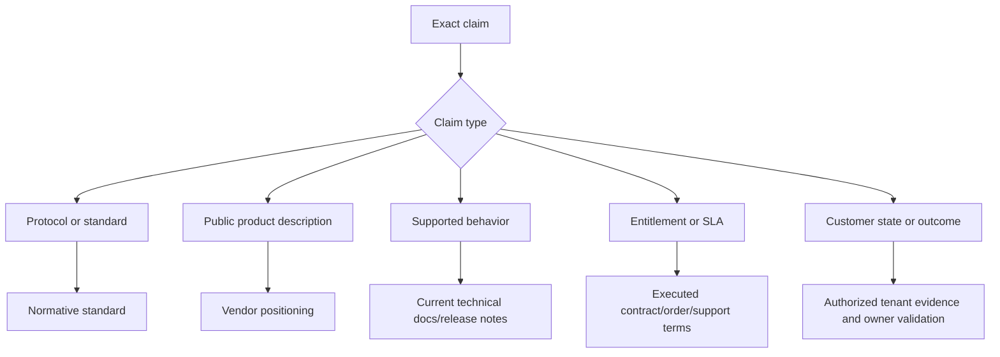

## Source selection hierarchy

There is no universal ranking that makes one source best for every claim. The controlling source depends on the claim. An IETF RFC controls an HTTP protocol statement; current Zscaler technical documentation controls documented product behavior; an executed order controls entitlement; approved tenant evidence controls the customer's actual state.

| Claim | Preferred source order | Required corroboration/caveat |
|---|---|---|
| Protocol meaning | Current RFC/standards body -> official implementation docs | Note obsoleted/updated RFCs and implementation variation |
| Security framework | Issuing authority's current publication -> official supplements | State version, scope, and whether guidance is normative or informative |
| Public product name/use case | Current vendor product page -> current technical docs | Label positioning; avoid outcome guarantee |
| Product behavior/configuration | Current technical docs/release notes/advisory -> authorized tenant test | State version, cloud/tenant, prerequisites, and entitlement |
| Packaging/entitlement | Executed contract/order/SKU record -> account/procurement owner | Public page is not a contract |
| Support severity/SLA | Executed support terms and current support process | Never infer from generic vendor page |
| Customer configuration | Authorized tenant export/screenshot/API evidence -> configuration owner | Record as-of time, scope, role, and redaction |
| Customer outcome/value | Customer-owned baseline/current evidence -> accountable business/finance owner | Separate attribution, modeled, capacity, and realized value |
| Incident cause/ETA | Approved incident record/RCA and accountable owner | Product docs cannot establish a specific incident cause |
| Roadmap | Authorized roadmap channel under applicable confidentiality | Never infer date/commitment from marketing language |
| Legal/privacy obligation | Current official law/regulator plus qualified counsel | Not legal advice; jurisdiction and applicability matter |
| Interview claim | Personal evidence plus dated official public source | Clearly separate production, lab, conceptual, and not-yet-used |

### Diagram L02 - Claim-to-source gate

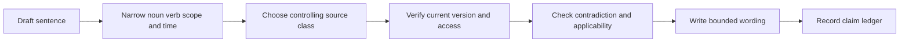

### Plain-English deep-dive 1 - Official does not mean sufficient

A passport is official, but it does not prove where its holder is standing today. A vendor product page is official for public positioning, but it does not prove a tenant has the feature. A technical article may describe supported behavior, but it does not prove a customer's observed result. Match the evidence to the verb in the sentence: "offers" may use positioning; "supports" needs technical documentation; "is enabled" needs tenant evidence; "reduced risk" needs governed customer outcome evidence.

## Source confidence model

| Dimension | High confidence | Medium confidence | Low/unknown confidence |
|---|---|---|---|
| Authority | Issuing body or accountable customer owner | Authorized vendor/customer secondary source | Unattributed or unclear owner |
| Directness | Source directly states or records the claim | Inference from related material | Marketing implication, memory, or analogy |
| Currency | Current version/date checked for use | Dated but no known conflict | Undated, stale, or superseded |
| Applicability | Exact product/version/tenant/jurisdiction/scope | Similar but not exact context | Context unknown |
| Evidence integrity | Controlled original, provenance, version/hash as appropriate | Copy with traceable origin | Screenshot/snippet without context |
| Corroboration | Independent or customer evidence agrees | Single credible source | Conflicting or absent evidence |
| Reproducibility | Authorized repeat test or deterministic source | Partially repeatable | One-off and not reviewable |
| Wording fit | Claim no broader than evidence | Minor interpretation disclosed | Causation, guarantee, or universality implied |

Do not collapse this rubric into a probability. A source can be authoritative but inapplicable, current but indirect, or direct but stale.

### Diagram L03 - Confidence is multidimensional

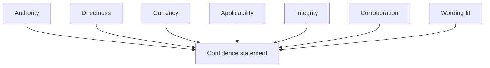

## Source capture template

| Field | Fillable blank |
|---|---|
| Source ID/title/owner |  |
| URL or controlled reference |  |
| Source class | STD / AUTH / VT / VP / CASE / CUST / LAB |
| Publication/version/effective date |  |
| Accessed/verified time and verifier |  |
| Authenticated/public and access caveat |  |
| Claim(s) supported |  |
| Exact relevant section/quote summary |  |
| Product/SKU/version/cloud/tenant/jurisdiction scope |  |
| Normative/informative/positioning/evidence status |  |
| Supersedes/is superseded by |  |
| Contradictions/limits |  |
| Capture allowed and retention |  |
| Next verification trigger/date |  |

**Fictional NMH sample:**

| Field | NMH synthetic example |
|---|---|
| Source ID/title/owner | NMH-CUST-017 synthetic configuration record / fictional owner role |
| URL or controlled reference | Controlled reference only; no tenant URL copied |
| Source class | CUST |
| Publication/version/effective date | Export schema v3, as-of 2026-08-24 synthetic |
| Accessed/verified time and verifier | Fictional authorized review 2026-08-24 14:00 UTC |
| Authenticated/public and access caveat | Restricted; do not paste into public guide |
| Claim(s) supported | A generated lab policy object is enabled in the fictional scenario |
| Exact relevant section/quote summary | Object ID/status only; no secrets or user data |
| Product/SKU/version/cloud/tenant/jurisdiction scope | Source-neutral lab, not a product tenant |
| Normative/informative/positioning/evidence status | Synthetic customer-style evidence |
| Supersedes/is superseded by | Replaces NMH-CUST-011 synthetic |
| Contradictions/limits | Does not prove traffic enforcement or production behavior |
| Capture allowed and retention | Minimal summary in controlled lab manifest |
| Next verification trigger/date | Fixture/version change |

### Diagram L04 - Source capture lifecycle

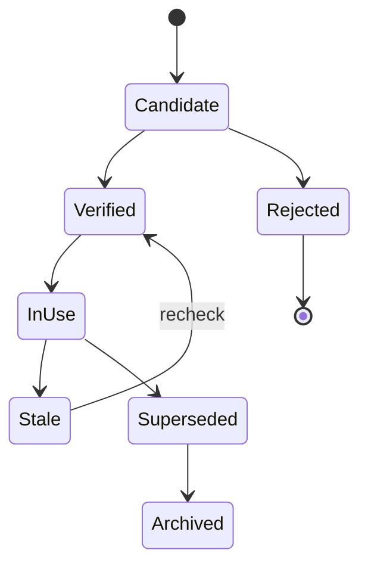

## Official source catalog: Zscaler public product and technical surfaces

The Zscaler product pages below are `VP` unless marked `VT`. They establish public naming and positioning as cataloged; they do not prove technical details, packaging, tenant behavior, or results. Help Portal pages may be public, partially public, authenticated, or context-dependent. Verify access and current article content.

| ID | Official source | Class | Primary use |
|---|---|---|---|
| S001 | [Zscaler home](https://www.zscaler.com/) | VP | Company/public navigation |
| S002 | [Products and solutions](https://www.zscaler.com/products-and-solutions) | VP | Current portfolio discovery |
| S003 | [Zscaler unified platform](https://www.zscaler.com/products-and-services/zscaler-unified-platform) | VP | Platform positioning |
| S004 | [Zero Trust Exchange](https://www.zscaler.com/products-and-solutions/zero-trust-exchange-zte) | VP | Architecture positioning and public vocabulary |
| S005 | [Secure Access Service Edge](https://www.zscaler.com/products-and-solutions/secure-access-service-edge-sase) | VP | SASE positioning |
| S006 | [Security Service Edge](https://www.zscaler.com/products-and-solutions/security-service-edge-sse) | VP | SSE positioning |
| S007 | [Zscaler Internet Access](https://www.zscaler.com/products-and-solutions/zscaler-internet-access) | VP | ZIA public capabilities |
| S008 | [Zscaler Private Access](https://www.zscaler.com/products-and-solutions/zscaler-private-access) | VP | ZPA public capabilities |
| S009 | [Zscaler Digital Experience](https://www.zscaler.com/products-and-solutions/zscaler-digital-experience-zdx) | VP | ZDX public capabilities |
| S010 | [Zero Trust Firewall](https://www.zscaler.com/products-and-solutions/cloud-firewall) | VP | Firewall positioning |
| S011 | [Cloud Sandbox](https://www.zscaler.com/products-and-solutions/cloud-sandbox) | VP | Sandbox positioning |
| S012 | [Zero Trust Browser](https://www.zscaler.com/products-and-solutions/browser-isolation) | VP | Browser isolation positioning |
| S013 | [Zero Trust Branch](https://www.zscaler.com/products-and-solutions/zero-trust-branch) | VP | Branch positioning |
| S014 | [Zero Trust SD-WAN](https://www.zscaler.com/products-and-solutions/zero-trust-sd-wan) | VP | SD-WAN positioning |
| S015 | [IoT/OT segmentation](https://www.zscaler.com/products-and-solutions/zero-trust-device-segmentation) | VP | Device segmentation positioning |
| S016 | [Privileged remote access and OT security](https://www.zscaler.com/products-and-solutions/ot-security) | VP | OT/PRA positioning |
| S017 | [Zscaler Cellular](https://www.zscaler.com/products-and-solutions/zscaler-cellular) | VP | Cellular positioning |
| S018 | [AI Security](https://www.zscaler.com/products-and-solutions/ai-security) | VP | AI-security portfolio positioning |
| S019 | [AI asset management](https://www.zscaler.com/products-and-solutions/ai-spm) | VP | AI asset/posture positioning |
| S020 | [AI access security](https://www.zscaler.com/products-and-solutions/ai-access-security) | VP | AI access positioning |
| S021 | [Continuous automated red teaming](https://www.zscaler.com/products-and-solutions/continuous-automated-red-teaming) | VP | Public red-team offering vocabulary |
| S022 | [AI Guardrails](https://www.zscaler.com/products-and-solutions/ai-guardrails) | VP | Public guardrail positioning |
| S023 | [Zero Trust Cloud](https://www.zscaler.com/products-and-solutions/zero-trust-cloud) | VP | Cloud-workload portfolio positioning |
| S024 | [Secure ingress and egress traffic](https://www.zscaler.com/products-and-solutions/secure-ingress-and-egress-traffic) | VP | Workload traffic positioning |
| S025 | [Secure east-west traffic](https://www.zscaler.com/products-and-solutions/secure-east-west-traffic) | VP | East-west positioning |

| ID | Official source | Class | Primary use |
|---|---|---|---|
| S026 | [Microsegmentation](https://www.zscaler.com/products-and-solutions/microsegmentation) | VP | Microsegmentation positioning |
| S027 | [Zero Trust Gateway](https://www.zscaler.com/products-and-solutions/zero-trust-gateway) | VP | Cloud gateway positioning |
| S028 | [Data Security](https://www.zscaler.com/products-and-solutions/data-security) | VP | Data-security portfolio positioning |
| S029 | [Data Loss Prevention](https://www.zscaler.com/products-and-solutions/data-loss-prevention) | VP | DLP positioning |
| S030 | [Endpoint DLP](https://www.zscaler.com/products-and-solutions/endpoint-dlp) | VP | Endpoint DLP positioning |
| S031 | [Cloud Access Security Broker](https://www.zscaler.com/products-and-solutions/cloud-access-security-broker-casb) | VP | CASB positioning |
| S032 | [Unified SaaS Security](https://www.zscaler.com/products-and-solutions/saas-security) | VP | SaaS-security positioning |
| S033 | [Data Security Posture Management](https://www.zscaler.com/products-and-solutions/data-security-posture-management-dspm) | VP | DSPM positioning |
| S034 | [Microsoft Copilot data protection](https://www.zscaler.com/products-and-solutions/microsoft-copilot-security) | VP | Copilot-related positioning |
| S035 | [Agentic Security Operations](https://www.zscaler.com/products-and-solutions/security-operations) | VP | SecOps portfolio positioning |
| S036 | [Agentic SOC](https://www.zscaler.com/products-and-solutions/agentic-soc) | VP | Agentic SOC positioning |
| S037 | [Deception technology](https://www.zscaler.com/products-and-solutions/deception-technology) | VP | Deception positioning |
| S038 | [Asset Exposure Management / CAASM](https://www.zscaler.com/products-and-solutions/caasm) | VP | Asset-exposure positioning |
| S039 | [Unified Vulnerability Management](https://www.zscaler.com/products-and-solutions/vulnerability-management) | VP | UVM positioning |
| S040 | [Managed threat hunting](https://www.zscaler.com/products-and-solutions/managed-threat-hunting) | VP | Threat-hunting service positioning |
| S041 | [Managed Detection and Response](https://www.zscaler.com/products-and-solutions/managed-detection-and-response) | VP | MDR positioning |
| S042 | [Data Fabric for Security](https://www.zscaler.com/products-and-solutions/data-fabric) | VP | Data Fabric public architecture/capabilities |
| S043 | [Data Fabric integrations](https://www.zscaler.com/products-and-solutions/data-fabric/integrations) | VP | Public integration catalog; counts/change require recheck |
| S044 | [Risk360](https://www.zscaler.com/products-and-solutions/zscaler-risk-360) | VP | Risk360 positioning |
| S045 | [Continuous Threat Exposure Management](https://www.zscaler.com/products-and-solutions/ctem) | VP | CTEM positioning |
| S046 | [Zscaler Help Portal](https://help.zscaler.com/) | VT | Technical-document entry point |
| S047 | [ZIA Help Portal](https://help.zscaler.com/zia) | VT | Current ZIA technical docs |
| S048 | [ZPA Help Portal](https://help.zscaler.com/zpa) | VT | Current ZPA technical docs |
| S049 | [ZDX Help Portal](https://help.zscaler.com/zdx) | VT | Current ZDX technical docs |
| S050 | [Client Connector Help Portal](https://help.zscaler.com/client-connector) | VT | Current Client Connector technical docs |

### Diagram L05 - Product claim verification

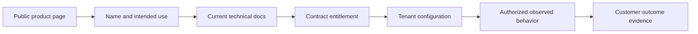

## Official source catalog: NIST

| ID | Official source | Class | Primary use |
|---|---|---|---|
| S051 | [NIST Cybersecurity Framework](https://www.nist.gov/cyberframework) | STD | CSF program and current resources |
| S052 | [NIST CSF 2.0 publication](https://nvlpubs.nist.gov/nistpubs/CSWP/NIST.CSWP.29.pdf) | STD | Versioned CSF 2.0 text |
| S053 | [NIST SP 800-207 Zero Trust Architecture](https://csrc.nist.gov/pubs/sp/800/207/final) | STD | Zero trust architecture |
| S054 | [NIST SP 800-207A cloud-native access control](https://csrc.nist.gov/pubs/sp/800/207/a/final) | STD | ZTA access-control models |
| S055 | [NIST SP 800-61 Rev. 3](https://csrc.nist.gov/pubs/sp/800/61/r3/final) | STD | Incident response and CSF integration |
| S056 | [NIST SP 800-53 Rev. 5 Update 1](https://csrc.nist.gov/pubs/sp/800/53/r5/upd1/final) | STD | Security/privacy controls |
| S057 | [NIST SP 800-30 Rev. 1](https://csrc.nist.gov/pubs/sp/800/30/r1/final) | STD | Risk assessment |
| S058 | [NIST SP 800-37 Rev. 2](https://csrc.nist.gov/pubs/sp/800/37/r2/final) | STD | Risk Management Framework |
| S059 | [NIST SP 800-137](https://csrc.nist.gov/pubs/sp/800/137/final) | STD | Continuous monitoring |
| S060 | [NIST SP 800-40 Rev. 4](https://csrc.nist.gov/pubs/sp/800/40/r4/final) | STD | Enterprise patch management planning |
| S061 | [NIST SP 800-115](https://csrc.nist.gov/pubs/sp/800/115/final) | STD | Security testing and assessment planning |
| S062 | [NIST SP 800-92](https://csrc.nist.gov/pubs/sp/800/92/final) | STD | Log management |
| S063 | [NIST SP 800-86](https://csrc.nist.gov/pubs/sp/800/86/final) | STD | Forensics integration |
| S064 | [NIST SP 800-52 Rev. 2](https://csrc.nist.gov/pubs/sp/800/52/r2/final) | STD | TLS guidance |
| S065 | [NIST SP 800-190](https://csrc.nist.gov/pubs/sp/800/190/final) | STD | Application container security |
| S066 | [NIST SP 800-204](https://csrc.nist.gov/pubs/sp/800/204/final) | STD | Microservices security strategies |
| S067 | [NIST SP 800-218 SSDF](https://csrc.nist.gov/pubs/sp/800/218/final) | STD | Secure software development |
| S068 | [NIST Digital Identity Guidelines SP 800-63-4](https://pages.nist.gov/800-63-4/) | STD | Digital identity overview/current suite |
| S069 | [NIST SP 800-63A-4 identity proofing](https://pages.nist.gov/800-63-4/sp800-63a.html) | STD | Identity proofing/enrollment |
| S070 | [NIST SP 800-63B-4 authentication](https://pages.nist.gov/800-63-4/sp800-63b.html) | STD | Authentication/authenticator management |
| S071 | [NIST SP 800-63C-4 federation](https://pages.nist.gov/800-63-4/sp800-63c.html) | STD | Federation/assertions |
| S072 | [NIST Privacy Framework](https://www.nist.gov/privacy-framework) | STD | Privacy-risk governance |
| S073 | [NIST AI Risk Management Framework](https://www.nist.gov/itl/ai-risk-management-framework) | STD | AI governance |
| S074 | [NIST Generative AI Profile publication page](https://www.nist.gov/publications/artificial-intelligence-risk-management-framework-generative-artificial-intelligence) | STD | GenAI risks/actions |
| S075 | [NICE Framework Resource Center](https://www.nist.gov/itl/applied-cybersecurity/nice/nice-framework-resource-center) | STD | Cybersecurity roles/knowledge/skills |
| S076 | [National Vulnerability Database](https://nvd.nist.gov/) | AUTH | NVD records and enrichment |
| S077 | [NVD vulnerability metrics](https://nvd.nist.gov/vuln-metrics/cvss) | AUTH | CVSS use in NVD |
| S078 | [NVD Common Platform Enumeration](https://nvd.nist.gov/products/cpe) | AUTH | CPE naming |
| S079 | [NIST cryptographic standards and guidelines](https://csrc.nist.gov/projects/cryptographic-standards-and-guidelines) | STD | Cryptographic source index |
| S080 | [NIST SP 800-161 Rev. 1](https://csrc.nist.gov/pubs/sp/800/161/r1/final) | STD | Cybersecurity supply-chain risk |

### Diagram L06 - Standard version check

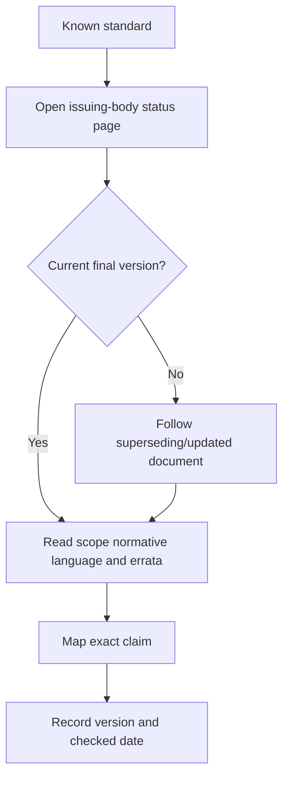

## Official source catalog: CISA

CISA page routes and downloadable feeds can change. During a live check, confirm that the page remains on an official CISA/DHS domain and that its title/content match the intended resource; an HTTP success or redirect alone is not enough.

| ID | Official source | Class | Primary use |
|---|---|---|---|
| S081 | [CISA home](https://www.cisa.gov/) | AUTH | Current CISA navigation |
| S082 | [Known Exploited Vulnerabilities Catalog](https://www.cisa.gov/known-exploited-vulnerabilities-catalog) | AUTH | KEV catalog context |
| S083 | [KEV JSON feed](https://www.cisa.gov/sites/default/files/feeds/known_exploited_vulnerabilities.json) | AUTH | Machine-readable KEV data |
| S084 | [KEV CSV feed](https://www.cisa.gov/sites/default/files/csv/known_exploited_vulnerabilities.csv) | AUTH | Tabular KEV data |
| S085 | [Zero Trust Maturity Model](https://www.cisa.gov/resources-tools/resources/zero-trust-maturity-model) | AUTH | Federal zero-trust maturity guidance |
| S086 | [Cross-Sector Cybersecurity Performance Goals](https://www.cisa.gov/cybersecurity-performance-goals-cpgs) | AUTH | Baseline cybersecurity practices |
| S087 | [Secure by Design](https://www.cisa.gov/securebydesign) | AUTH | Secure-by-design principles |
| S088 | [Secure by Design pledge](https://www.cisa.gov/securebydesign/pledge) | AUTH | Voluntary pledge context |
| S089 | [Cybersecurity best practices](https://www.cisa.gov/topics/cybersecurity-best-practices) | AUTH | CISA practice index |
| S090 | [Cybersecurity advisories](https://www.cisa.gov/news-events/cybersecurity-advisories) | AUTH | Current advisories |
| S091 | [ICS advisories](https://www.cisa.gov/news-events/ics-advisories) | AUTH | Industrial-control advisories |
| S092 | [Cyber Hygiene Services](https://www.cisa.gov/resources-tools/services/cyber-hygiene-services) | AUTH | CISA service descriptions |
| S093 | [StopRansomware](https://www.cisa.gov/stopransomware) | AUTH | Ransomware guidance/resources |
| S094 | [Report a cyber issue](https://www.cisa.gov/report) | AUTH | Current federal reporting route context |
| S095 | [SCuBA project](https://www.cisa.gov/resources-tools/services/secure-cloud-business-applications-scuba-project) | AUTH | SaaS security-configuration baselines |
| S096 | [CISA ScubaGear official repository](https://github.com/cisagov/ScubaGear) | AUTH | Official open-source assessment tooling/docs |
| S097 | [Cloud Security Technical Reference Architecture](https://www.cisa.gov/resources-tools/resources/cloud-security-technical-reference-architecture) | AUTH | Federal cloud-security architecture |
| S098 | [Cybersecurity resources and tools](https://www.cisa.gov/resources-tools) | AUTH | Current resource index |
| S099 | [Binding Operational Directive 22-01](https://www.cisa.gov/news-events/directives/bod-22-01-reducing-significant-risk-known-exploited-vulnerabilities) | AUTH | Federal KEV remediation directive context |
| S100 | [CISA Bad Practices](https://www.cisa.gov/resources-tools/resources/bad-practices) | AUTH | High-risk practice guidance |

### Diagram L07 - Redirect and link identity check

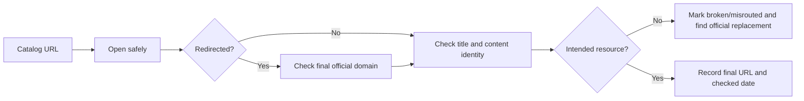

## Official source catalog: FIRST and MITRE

| ID | Official source | Class | Primary use |
|---|---|---|---|
| S101 | [FIRST Common Vulnerability Scoring System](https://www.first.org/cvss/) | STD | CVSS source index |
| S102 | [CVSS v4.0 specification](https://www.first.org/cvss/v4.0/specification-document) | STD | CVSS v4 normative details |
| S103 | [CVSS v4.0 user guide](https://www.first.org/cvss/v4.0/user-guide) | STD | CVSS v4 usage guidance |
| S104 | [CVSS v4.0 calculator](https://www.first.org/cvss/calculator/4.0) | STD | Vector exploration; record vector/version |
| S105 | [CVSS v3.1 specification](https://www.first.org/cvss/v3.1/specification-document) | STD | Legacy/current-record interpretation |
| S106 | [FIRST Exploit Prediction Scoring System](https://www.first.org/epss/) | STD | EPSS model context |
| S107 | [EPSS data and statistics](https://www.first.org/epss/data_stats) | STD | EPSS distributions/download context |
| S108 | [EPSS API documentation](https://www.first.org/epss/api) | STD | API use/current contract |
| S109 | [MITRE ATT&CK](https://attack.mitre.org/) | STD | ATT&CK source index |
| S110 | [Enterprise ATT&CK matrix](https://attack.mitre.org/matrices/enterprise/) | STD | Enterprise tactics/techniques map |
| S111 | [ATT&CK techniques](https://attack.mitre.org/techniques/enterprise/) | STD | Technique catalog |
| S112 | [ATT&CK tactics](https://attack.mitre.org/tactics/enterprise/) | STD | Tactic catalog |
| S113 | [ATT&CK groups](https://attack.mitre.org/groups/) | STD | Public group knowledge base |
| S114 | [ATT&CK software](https://attack.mitre.org/software/) | STD | Public software knowledge base |
| S115 | [ATT&CK data sources](https://attack.mitre.org/datasources/) | STD | Detection data-source vocabulary |
| S116 | [ATT&CK mitigations](https://attack.mitre.org/mitigations/enterprise/) | STD | Enterprise mitigations |
| S117 | [ATT&CK versions](https://attack.mitre.org/resources/versions/) | STD | Version/change history |
| S118 | [CVE Program](https://www.cve.org/) | STD | CVE identifiers/program |
| S119 | [Common Weakness Enumeration](https://cwe.mitre.org/) | STD | Weakness taxonomy |
| S120 | [CAPEC](https://capec.mitre.org/) | STD | Attack-pattern taxonomy |

## Official source catalog: IETF RFCs

| ID | Official source | Class | Primary use |
|---|---|---|---|
| S121 | [RFC 9293 TCP](https://datatracker.ietf.org/doc/html/rfc9293) | STD | Current TCP specification |
| S122 | [RFC 768 UDP](https://datatracker.ietf.org/doc/html/rfc768) | STD | UDP |
| S123 | [RFC 791 IPv4](https://datatracker.ietf.org/doc/html/rfc791) | STD | IPv4 base specification |
| S124 | [RFC 8200 IPv6](https://datatracker.ietf.org/doc/html/rfc8200) | STD | IPv6 base specification |
| S125 | [RFC 792 ICMPv4](https://datatracker.ietf.org/doc/html/rfc792) | STD | ICMPv4 |
| S126 | [RFC 4443 ICMPv6](https://datatracker.ietf.org/doc/html/rfc4443) | STD | ICMPv6 |
| S127 | [RFC 826 ARP](https://datatracker.ietf.org/doc/html/rfc826) | STD | ARP |
| S128 | [RFC 1034 DNS concepts](https://datatracker.ietf.org/doc/html/rfc1034) | STD | DNS architecture |
| S129 | [RFC 1035 DNS implementation](https://datatracker.ietf.org/doc/html/rfc1035) | STD | DNS messages/implementation |
| S130 | [RFC 2131 DHCPv4](https://datatracker.ietf.org/doc/html/rfc2131) | STD | DHCPv4 |
| S131 | [RFC 3315 DHCPv6](https://datatracker.ietf.org/doc/html/rfc3315) | STD | DHCPv6 historical/base; check updates |
| S132 | [RFC 9110 HTTP semantics](https://datatracker.ietf.org/doc/html/rfc9110) | STD | HTTP semantics |
| S133 | [RFC 9112 HTTP/1.1](https://datatracker.ietf.org/doc/html/rfc9112) | STD | HTTP/1.1 messaging |
| S134 | [RFC 9113 HTTP/2](https://datatracker.ietf.org/doc/html/rfc9113) | STD | HTTP/2 |
| S135 | [RFC 9114 HTTP/3](https://datatracker.ietf.org/doc/html/rfc9114) | STD | HTTP/3 |
| S136 | [RFC 8446 TLS 1.3](https://datatracker.ietf.org/doc/html/rfc8446) | STD | TLS 1.3 |
| S137 | [RFC 5246 TLS 1.2](https://datatracker.ietf.org/doc/html/rfc5246) | STD | TLS 1.2 historical/current deployments |
| S138 | [RFC 9325 TLS/DTLS recommendations](https://datatracker.ietf.org/doc/html/rfc9325) | STD | Current TLS deployment guidance |
| S139 | [RFC 3986 URI syntax](https://datatracker.ietf.org/doc/html/rfc3986) | STD | URI syntax |
| S140 | [RFC 8259 JSON](https://datatracker.ietf.org/doc/html/rfc8259) | STD | JSON format |

| ID | Official source | Class | Primary use |
|---|---|---|---|
| S141 | [RFC 6265 HTTP cookies](https://datatracker.ietf.org/doc/html/rfc6265) | STD | Cookie state management; check updates |
| S142 | [RFC 6797 HSTS](https://datatracker.ietf.org/doc/html/rfc6797) | STD | HTTP Strict Transport Security |
| S143 | [RFC 6455 WebSocket](https://datatracker.ietf.org/doc/html/rfc6455) | STD | WebSocket protocol |
| S144 | [RFC 9000 QUIC](https://datatracker.ietf.org/doc/html/rfc9000) | STD | QUIC transport |
| S145 | [RFC 9001 QUIC TLS](https://datatracker.ietf.org/doc/html/rfc9001) | STD | TLS with QUIC |
| S146 | [RFC 8305 Happy Eyeballs v2](https://datatracker.ietf.org/doc/html/rfc8305) | STD | IPv4/IPv6 connection racing |
| S147 | [RFC 3339 timestamps](https://datatracker.ietf.org/doc/html/rfc3339) | STD | Internet date/time format |
| S148 | [RFC 6749 OAuth 2.0](https://datatracker.ietf.org/doc/html/rfc6749) | STD | OAuth authorization framework |
| S149 | [RFC 6750 bearer tokens](https://datatracker.ietf.org/doc/html/rfc6750) | STD | OAuth bearer use |
| S150 | [RFC 7636 PKCE](https://datatracker.ietf.org/doc/html/rfc7636) | STD | Authorization-code interception mitigation |
| S151 | [RFC 8414 authorization-server metadata](https://datatracker.ietf.org/doc/html/rfc8414) | STD | OAuth metadata |
| S152 | [RFC 7009 token revocation](https://datatracker.ietf.org/doc/html/rfc7009) | STD | OAuth revocation |
| S153 | [RFC 7662 token introspection](https://datatracker.ietf.org/doc/html/rfc7662) | STD | OAuth introspection |
| S154 | [RFC 7591 dynamic client registration](https://datatracker.ietf.org/doc/html/rfc7591) | STD | OAuth client registration |
| S155 | [RFC 7519 JSON Web Token](https://datatracker.ietf.org/doc/html/rfc7519) | STD | JWT |
| S156 | [RFC 8725 JWT Best Current Practices](https://datatracker.ietf.org/doc/html/rfc8725) | STD | JWT security |
| S157 | [RFC 8705 OAuth mutual TLS](https://datatracker.ietf.org/doc/html/rfc8705) | STD | Certificate-bound OAuth |
| S158 | [RFC 9449 DPoP](https://datatracker.ietf.org/doc/html/rfc9449) | STD | Proof-of-possession OAuth |
| S159 | [RFC 7643 SCIM core schema](https://datatracker.ietf.org/doc/html/rfc7643) | STD | SCIM resource schema |
| S160 | [RFC 7644 SCIM protocol](https://datatracker.ietf.org/doc/html/rfc7644) | STD | SCIM HTTP protocol |

### Diagram L08 - Protocol verification

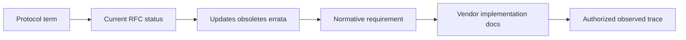

## Official source catalog: OpenID Connect and SAML

| ID | Official source | Class | Primary use |
|---|---|---|---|
| S161 | [OpenID Connect Core 1.0](https://openid.net/specs/openid-connect-core-1_0.html) | STD | OIDC authentication/core messages |
| S162 | [OpenID Connect Discovery 1.0](https://openid.net/specs/openid-connect-discovery-1_0.html) | STD | Provider discovery |
| S163 | [OpenID Connect Session Management 1.0](https://openid.net/specs/openid-connect-session-1_0.html) | STD | Session concepts |
| S164 | [OpenID Connect Front-Channel Logout 1.0](https://openid.net/specs/openid-connect-frontchannel-1_0.html) | STD | Front-channel logout |
| S165 | [OpenID Connect Back-Channel Logout 1.0](https://openid.net/specs/openid-connect-backchannel-1_0.html) | STD | Back-channel logout |
| S166 | [OpenID Connect RP-Initiated Logout 1.0](https://openid.net/specs/openid-connect-rpinitiated-1_0.html) | STD | RP-initiated logout |
| S167 | [SAML 2.0 Core](https://docs.oasis-open.org/security/saml/v2.0/saml-core-2.0-os.pdf) | STD | Assertions/protocols |
| S168 | [SAML 2.0 Bindings](https://docs.oasis-open.org/security/saml/v2.0/saml-bindings-2.0-os.pdf) | STD | Transport bindings |
| S169 | [SAML 2.0 Profiles](https://docs.oasis-open.org/security/saml/v2.0/saml-profiles-2.0-os.pdf) | STD | Web SSO and profiles |
| S170 | [SAML 2.0 Metadata](https://docs.oasis-open.org/security/saml/v2.0/saml-metadata-2.0-os.pdf) | STD | Entity metadata |

## Official source catalog: Microsoft, Windows, Microsoft 365, and Power BI

| ID | Official source | Class | Primary use |
|---|---|---|---|
| S171 | [Microsoft Entra documentation](https://learn.microsoft.com/en-us/entra/) | VT | Entra source index |
| S172 | [Microsoft identity platform OIDC](https://learn.microsoft.com/en-us/entra/identity-platform/v2-protocols-oidc) | VT | Microsoft OIDC implementation |
| S173 | [OAuth 2.0 authorization code flow](https://learn.microsoft.com/en-us/entra/identity-platform/v2-oauth2-auth-code-flow) | VT | Microsoft OAuth implementation |
| S174 | [Microsoft identity platform SAML protocol](https://learn.microsoft.com/en-us/entra/identity-platform/saml-protocol-reference) | VT | Microsoft SAML implementation |
| S175 | [Provision users and groups with SCIM](https://learn.microsoft.com/en-us/entra/identity/app-provisioning/use-scim-to-provision-users-and-groups) | VT | Microsoft SCIM provisioning |
| S176 | [Conditional Access overview](https://learn.microsoft.com/en-us/entra/identity/conditional-access/overview) | VT | Conditional Access concepts |
| S177 | [Microsoft Entra multifactor authentication](https://learn.microsoft.com/en-us/entra/identity/authentication/concept-mfa-howitworks) | VT | MFA concepts/behavior |
| S178 | [Microsoft Entra ID Protection](https://learn.microsoft.com/en-us/entra/id-protection/overview-identity-protection) | VT | Identity-risk protection |
| S179 | [Application provisioning documentation](https://learn.microsoft.com/en-us/entra/identity/app-provisioning/) | VT | Provisioning source index |
| S180 | [Microsoft Graph throttling guidance](https://learn.microsoft.com/en-us/graph/throttling) | VT | Rate-limit handling |
| S181 | [Microsoft Graph authentication basics](https://learn.microsoft.com/en-us/graph/auth/auth-concepts) | VT | Graph authentication |
| S182 | [Microsoft 365 URLs and IP address ranges](https://learn.microsoft.com/en-us/microsoft-365/enterprise/urls-and-ip-address-ranges) | VT | Current endpoint guidance |
| S183 | [OneDrive network utilization planning](https://learn.microsoft.com/en-us/sharepoint/network-utilization-planning) | VT | Sync/network planning |
| S184 | [OneDrive sync reports](https://learn.microsoft.com/en-us/sharepoint/sync-health) | VT | Sync health reporting |
| S185 | [SharePoint limits](https://learn.microsoft.com/en-us/office365/servicedescriptions/sharepoint-online-service-description/sharepoint-online-limits) | VT | Current service limits; verify plan/context |
| S186 | [PowerShell documentation](https://learn.microsoft.com/en-us/powershell/) | VT | PowerShell source index |
| S187 | [Get-FileHash](https://learn.microsoft.com/en-us/powershell/module/microsoft.powershell.utility/get-filehash) | VT | Local hashing command documentation |
| S188 | [netsh trace](https://learn.microsoft.com/en-us/windows-server/networking/technologies/netsh/netsh-trace) | VT | Windows trace command reference; authorization still required |
| S189 | [Packet Monitor (Pktmon)](https://learn.microsoft.com/en-us/windows-server/networking/technologies/pktmon/pktmon) | VT | Windows packet-monitor reference; authorization still required |
| S190 | [Power BI documentation](https://learn.microsoft.com/en-us/power-bi/) | VT | Power BI source index |
| S191 | [Power BI Desktop](https://learn.microsoft.com/en-us/power-bi/fundamentals/desktop-getting-started) | VT | Desktop fundamentals |
| S192 | [Power BI star schema guidance](https://learn.microsoft.com/en-us/power-bi/guidance/star-schema) | VT | Dimensional modeling |
| S193 | [Power BI model relationships](https://learn.microsoft.com/en-us/power-bi/transform-model/desktop-relationships-understand) | VT | Relationship/filter behavior |
| S194 | [DAX overview](https://learn.microsoft.com/en-us/dax/dax-overview) | VT | DAX concepts |
| S195 | [Power Query M language](https://learn.microsoft.com/en-us/powerquery-m/) | VT | M language reference |

### Diagram L09 - Microsoft protocol evidence layers

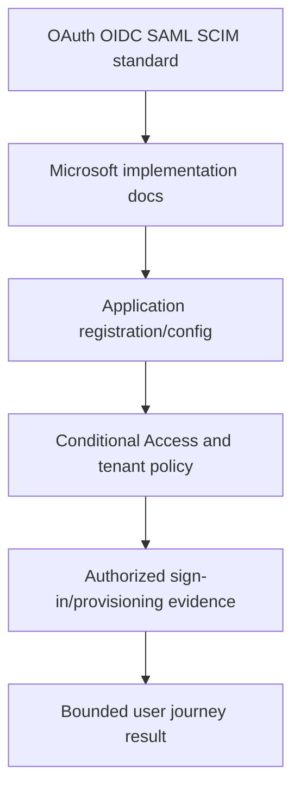

## Official source catalog: PostgreSQL and SQLite

| ID | Official source | Class | Primary use |
|---|---|---|---|
| S196 | [PostgreSQL current documentation](https://www.postgresql.org/docs/current/) | VT | Current PostgreSQL manual |
| S197 | [PostgreSQL SQL tutorial](https://www.postgresql.org/docs/current/tutorial-sql.html) | VT | SQL foundations |
| S198 | [PostgreSQL data definition](https://www.postgresql.org/docs/current/ddl.html) | VT | Tables/constraints/schemas |
| S199 | [PostgreSQL queries](https://www.postgresql.org/docs/current/queries.html) | VT | Query processing |
| S200 | [PostgreSQL functions and operators](https://www.postgresql.org/docs/current/functions.html) | VT | Functions/operators |
| S201 | [PostgreSQL window functions](https://www.postgresql.org/docs/current/tutorial-window.html) | VT | Window functions |
| S202 | [PostgreSQL WITH queries](https://www.postgresql.org/docs/current/queries-with.html) | VT | CTEs/recursion |
| S203 | [PostgreSQL indexes](https://www.postgresql.org/docs/current/indexes.html) | VT | Index concepts |
| S204 | [PostgreSQL concurrency control](https://www.postgresql.org/docs/current/mvcc.html) | VT | MVCC/isolation |
| S205 | [PostgreSQL database roles](https://www.postgresql.org/docs/current/user-manag.html) | VT | Roles/least privilege |
| S206 | [PostgreSQL backup and restore](https://www.postgresql.org/docs/current/backup.html) | VT | Backup/restore concepts |
| S207 | [PostgreSQL monitoring](https://www.postgresql.org/docs/current/monitoring.html) | VT | Monitoring/activity |
| S208 | [PostgreSQL EXPLAIN](https://www.postgresql.org/docs/current/using-explain.html) | VT | Query-plan analysis |
| S209 | [SQLite documentation](https://www.sqlite.org/docs.html) | VT | SQLite official index |
| S210 | [SQLite SQL language](https://www.sqlite.org/lang.html) | VT | SQLite SQL dialect |

## Official source catalog: governance, AI, accessibility, and supporting practice

| ID | Official source | Class | Primary use |
|---|---|---|---|
| S211 | [ISO/IEC 27001](https://www.iso.org/standard/27001) | STD | Information-security management-system standard page |
| S212 | [ISO/IEC 27002](https://www.iso.org/standard/75652.html) | STD | Information-security controls guidance page |
| S213 | [ISO 31000 risk management](https://www.iso.org/iso-31000-risk-management.html) | STD | Risk-management principles page |
| S214 | [ISO 22301 business continuity](https://www.iso.org/standard/75106.html) | STD | Business-continuity standard page |
| S215 | [ISO/IEC 42001 AI management systems](https://www.iso.org/standard/81230.html) | STD | AI management-system standard page |
| S216 | [CIS Controls](https://www.cisecurity.org/controls/cis-controls-list) | STD | CIS Controls official list |
| S217 | [OECD AI Principles](https://oecd.ai/en/ai-principles) | STD | Intergovernmental AI principles |
| S218 | [EU Artificial Intelligence Act regulation](https://eur-lex.europa.eu/eli/reg/2024/1689/oj) | AUTH | Official EU legal text; seek qualified applicability advice |
| S219 | [NIST AI RMF Playbook](https://airc.nist.gov/AI_RMF_Knowledge_Base/Playbook) | STD | AI RMF suggested actions |
| S220 | [NIST AI 600-1 Generative AI Profile](https://doi.org/10.6028/NIST.AI.600-1) | STD | Versioned GenAI profile |
| S221 | [MITRE ATLAS](https://atlas.mitre.org/) | STD | AI threat knowledge base |
| S222 | [CISA Artificial Intelligence](https://www.cisa.gov/topics/cybersecurity-best-practices/artificial-intelligence) | AUTH | CISA AI guidance index |
| S223 | [Microsoft Responsible AI](https://www.microsoft.com/en-us/ai/responsible-ai) | VP | Microsoft public responsible-AI approach; technical governance needs deeper sources |
| S224 | [Power BI accessibility overview](https://learn.microsoft.com/en-us/power-bi/create-reports/desktop-accessibility-overview) | VT | Accessible report design |
| S225 | [Power BI row-level security](https://learn.microsoft.com/en-us/fabric/security/service-admin-row-level-security) | VT | RLS behavior/configuration context |
| S226 | [Zscaler culture](https://www.zscaler.com/culture) | VP | Public culture/values positioning |
| S227 | [Zscaler careers](https://www.zscaler.com/careers) | VP | Current public employment context |
| S228 | [Microsoft Edge DevTools documentation](https://learn.microsoft.com/en-us/microsoft-edge/devtools-guide-chromium/) | VT | Browser troubleshooting tooling |
| S229 | [W3C Web Performance specifications](https://www.w3.org/webperf/) | STD | Web-performance standards index |
| S230 | [Power BI Performance Analyzer](https://learn.microsoft.com/en-us/power-bi/create-reports/desktop-performance-analyzer) | VT | Local report-performance analysis |

### Diagram L10 - Marketing, technical, and customer evidence

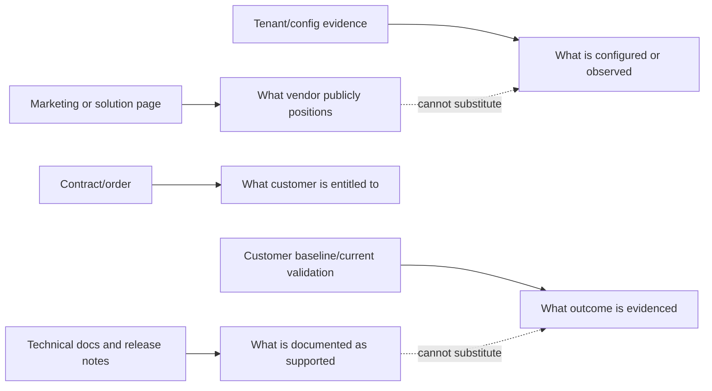

### Plain-English deep-dive 2 - Product truth has layers

A restaurant menu says what the restaurant offers. The kitchen recipe says how a dish is prepared. Your receipt says what you bought. The plate in front of you says what was delivered. Product positioning, technical documentation, contract entitlement, and tenant evidence have the same relationship. Quoting the menu cannot prove the plate; inspecting the plate cannot rewrite the general recipe.

## Major-area source map

| Major area | Parts | Primary source families | Customer-specific evidence still required |
|---|---:|---|---|
| Role/company/culture | 1-5, 120 | S001-S004, S035, S226-S227, supplied job description | Actual interview process, role scope, personal experience |
| Security/risk/governance | 6-15 | S051-S080, S211-S218 | Customer policies, appetite, controls, incidents, legal applicability |
| Networking/web/TLS | 16-22, 25-27 | S121-S147, S188-S189, S228-S229 | Authorized architecture, traces, device/service state |
| Identity/API/M365 | 23-24, 28-29 | S148-S181, S182-S185 | App registration, tenant policy, licenses, logs, user journey |
| Zscaler platform | 30-42 | S003-S050, S053-S054 | Entitlement, cloud/tenant, configuration, releases, support evidence |
| Data/SQL/analytics | 43-57 | S140, S147, S190-S210, S224-S225, S230 | Source contracts, quality, model, query output, metric approval |
| Data Fabric | 58-68 | S042-S043 plus current Help Portal | Licensed docs, connector contract, tenant model, data evidence |
| Asset exposure/CAASM | 69-76 | S038, S042-S043, S051-S060 | Source inventories, match decisions, CMDB, control evidence |
| Vulnerability/UVM/CTEM/Risk360 | 77-90 | S039, S044-S045, S076-S108, S118-S120 | Tenant factors/weights, findings, workflows, risk method/owner |
| SecOps/AI | 91-99 | S035-S041, S055, S062-S067, S073-S075, S109-S117, S219-S223 | Detections, incidents, response authority, AI governance/testing |
| TSM delivery | 100-110 | S051-S059, S075, current vendor/customer procedures | Contract, success plan, governance, adoption, value evidence |
| Labs/capstones/interview | 111-120 | S186-S210, S224-S230 plus [Appendix K](Appendix-K-lab-dataset-tooling.md) | Personal evidence, approved portfolio, current product verification |

### Diagram L11 - Curriculum source coverage

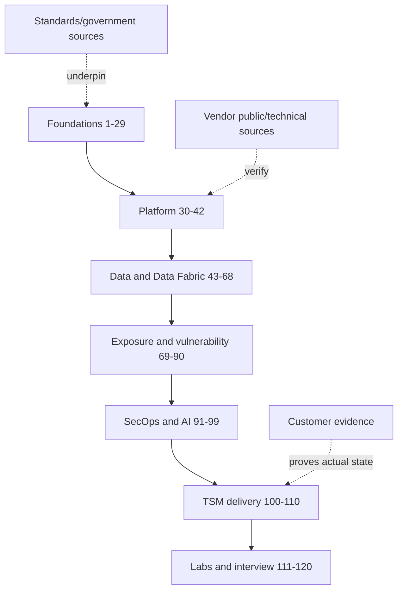

## Part 1-120 source map

Each row names a verification starting point. It does not mean every source applies to every sentence in that Part. Product-specific claims must be rechecked against current technical documentation, entitlement, and tenant evidence.

### Parts 1-10

| Part | Local guide | Primary catalog IDs | Verification focus |
|---:|---|---|---|
| 1 | [Role Map, JD Deconstruction, and the SecOps TSM Story](Part-01-role-map-jd-secops-tsm-story.md) | S001, S035, S075, S227 | Current job description, role scope, honest personal evidence |
| 2 | [Zscaler Mission, AI-Forward Strategy, Culture, and Interview Signals](Part-02-zscaler-mission-ai-culture.md) | S001, S018, S035, S226-S227 | Public company/culture/AI language versus personal fit evidence |
| 3 | [Technical Success Management from Zero](Part-03-technical-success-management-from-zero.md) | S046, S075 | Current vendor/customer role boundaries and support/service model |
| 4 | [Enterprise Customer Environment and Stakeholder Thinking](Part-04-enterprise-environment-stakeholders.md) | S051-S058 | Framework vocabulary plus customer architecture/ownership |
| 5 | [Complete Fictional Strategic Account Engagement](Part-05-complete-fictional-account-engagement.md) | S035, S042, S051 | Synthetic story label; no customer/product outcome inference |
| 6 | [Cybersecurity Fundamentals](Part-06-cybersecurity-fundamentals.md) | S051-S058 | Current framework definitions and context |
| 7 | [Attack Surface, Attack Paths, Kill Chains, and MITRE ATT&CK](Part-07-attack-surface-paths-kill-chain-mitre.md) | S109-S120 | ATT&CK version, taxonomy versus observed behavior |
| 8 | [Security Term Distinctions](Part-08-security-term-distinctions.md) | S076-S120 | CVE/CWE/CVSS/EPSS/KEV/ATT&CK distinctions |
| 9 | [Defense in Depth and Least Privilege](Part-09-defense-in-depth-least-privilege.md) | S053-S056, S216 | Control objectives and customer implementation evidence |
| 10 | [Zero Trust from First Principles](Part-10-zero-trust-nist-800-207.md) | S053-S054, S085 | NIST architecture versus vendor positioning |

### Parts 11-20

| Part | Local guide | Primary catalog IDs | Verification focus |
|---:|---|---|---|
| 11 | [Security Architecture and Shared Responsibility](Part-11-security-architecture-shared-responsibility.md) | S056, S065-S067, S097 | Control-plane/ownership model and provider/customer contract |
| 12 | [Security Frameworks and Governance](Part-12-security-frameworks-governance.md) | S051-S052, S056, S211-S216 | Framework versions; licensed ISO text/access caveat |
| 13 | [Risk Assessment and Treatment](Part-13-risk-assessment-treatment.md) | S057-S058, S213 | Customer-approved method, appetite, authority |
| 14 | [Security Domains and Controls](Part-14-security-domains-and-controls.md) | S056, S216 | Current control mapping and customer ownership |
| 15 | [Incident Response, Evidence, and RCA](Part-15-incident-response-evidence-rca.md) | S055, S062-S063, S090 | Current incident plan and approved evidence/process |
| 16 | [OSI and TCP/IP Models](Part-16-osi-tcp-ip-models.md) | S121-S146 | Protocol standards and layer analogy limits |
| 17 | [Ethernet, IP, Subnetting, Routing, and NAT](Part-17-ethernet-ip-subnet-routing-nat.md) | S123-S127 | Current/updated RFC status and actual routing evidence |
| 18 | [TCP, UDP, Ports, Sockets, and Reliability](Part-18-tcp-udp-ports-sockets.md) | S121-S122 | Current TCP spec and implementation trace |
| 19 | [DNS and DHCP](Part-19-dns-dhcp.md) | S128-S131 | RFC updates plus customer resolver/DHCP evidence |
| 20 | [HTTP, HTTPS, URLs, Methods, Headers, Cookies, and Sessions](Part-20-http-https-web-protocol.md) | S132-S143 | Current HTTP/URI/JSON/cookie standards |

### Parts 21-30

| Part | Local guide | Primary catalog IDs | Verification focus |
|---:|---|---|---|
| 21 | [TLS, PKI, Certificates, and Inspection](Part-21-tls-pki-certificates-inspection.md) | S064, S136-S138 | TLS version/guidance, customer policy, app compatibility |
| 22 | [Proxies, Firewalls, VPNs, SSE, and SASE](Part-22-proxies-firewalls-vpn-sse-sase.md) | S004-S010, S053 | Vendor positioning versus standards/customer architecture |
| 23 | [Identity Protocols](Part-23-identity-protocols.md) | S068-S071, S148-S170, S171-S179 | Standard versus Microsoft/vendor implementation and tenant policy |
| 24 | [REST APIs, JSON, Webhooks, and Rate Limits](Part-24-rest-api-json-webhooks.md) | S132, S140, S148-S158, S180-S181 | API contract/version, auth, rate limits, tenant evidence |
| 25 | [Wireshark, Netsh, and Packet Evidence](Part-25-wireshark-netsh-network-monitor.md) | S121-S146, S188-S189 | Authorization, minimization, tool version, trace limitations |
| 26 | [Procmon, HAR, Fiddler, and Browser Tools](Part-26-procmon-har-fiddler.md) | S228-S229 | Tool documentation, redaction, collection authority |
| 27 | [Connectivity Troubleshooting](Part-27-connectivity-troubleshooting-fault-isolation.md) | S121-S146, S182, S188-S189 | Layered evidence and known-good comparison |
| 28 | [OneDrive and SharePoint Connectivity](Part-28-onedrive-sharepoint-connectivity.md) | S182-S185 | Current endpoints, limits, sync health, tenant evidence |
| 29 | [M365 to Zero Trust and SecOps Bridge](Part-29-m365-to-zero-trust-secops-bridge.md) | S004, S053, S171-S185 | Transferable method versus distinct product experience |
| 30 | [Zscaler Company, Platform, and Portfolio](Part-30-zscaler-company-platform-portfolio.md) | S001-S006, S018, S035, S042 | Current public naming and portfolio drift |

### Parts 31-40

| Part | Local guide | Primary catalog IDs | Verification focus |
|---:|---|---|---|
| 31 | [Zero Trust Exchange Architecture](Part-31-zero-trust-exchange-architecture.md) | S004, S053-S054, S046 | Positioning versus technical implementation |
| 32 | [Zscaler Cloud and Traffic Flow](Part-32-zscaler-cloud-service-edges-traffic.md) | S004, S046-S050 | Current technical docs, cloud/tenant path, no inferred topology |
| 33 | [Zscaler Identity, Posture, Context, and Policy](Part-33-zscaler-identity-context-policy.md) | S046-S050, S068-S071, S171-S179 | Documented integration plus tenant policy/evidence |
| 34 | [ZIA Fundamentals](Part-34-zia-fundamentals.md) | S007, S047 | Public capability versus current technical docs/entitlement |
| 35 | [ZPA Fundamentals](Part-35-zpa-fundamentals.md) | S008, S048 | Public capability versus current technical docs/entitlement |
| 36 | [Client Connector, Forwarding, and Posture](Part-36-client-connector-forwarding-posture.md) | S050 | Current platform/version/profile documentation and endpoint evidence |
| 37 | [Zscaler TLS Inspection](Part-37-zscaler-tls-inspection.md) | S007, S047, S064, S136-S138 | Customer privacy/policy and app compatibility |
| 38 | [ZDX and Experience Analysis](Part-38-zdx-digital-experience.md) | S009, S049 | Metric definition, entitlement, tenant evidence |
| 39 | [Zscaler Data Security](Part-39-zscaler-data-security.md) | S028-S034 | Current product/technical docs, policy, data handling |
| 40 | [Cloud, Workload, Branch, IoT/OT, and B2B Security](Part-40-zscaler-cloud-branch-iot-b2b.md) | S013-S027 | Current portfolio names, technical docs, contract scope |

### Parts 41-50

| Part | Local guide | Primary catalog IDs | Verification focus |
|---:|---|---|---|
| 41 | [Zscaler Logging, NSS, SIEM, APIs, and Integrations](Part-41-zscaler-logging-nss-siem-integrations.md) | S046-S050, S062, S140, S147-S158 | Current schemas, limits, retention, privacy, connector contract |
| 42 | [Zscaler Deployment, Operations, and Troubleshooting](Part-42-zscaler-deployment-operations-troubleshooting.md) | S046-S050 | Current deployment docs, change authority, support process |
| 43 | [Security Data Literacy and Lifecycle](Part-43-security-data-literacy-lifecycle.md) | S056, S062, S140, S147 | Grain, clocks, lineage, customer data governance |
| 44 | [Relational Data Modeling](Part-44-relational-data-modeling.md) | S196-S210 | SQL-engine version and schema constraints |
| 45 | [Analytical Security Data Models](Part-45-analytical-security-data-models.md) | S192-S195, S196-S210 | Model choice, BI implementation, source grain |
| 46 | [SQL Fundamentals](Part-46-sql-fundamentals.md) | S196-S200, S209-S210 | Dialect/version and safe local data |
| 47 | [SQL Joins, CTEs, and Window Functions](Part-47-sql-joins-ctes-window-functions.md) | S199-S202 | Grain, NULL, join multiplication, dialect |
| 48 | [Security Analytics Query Patterns](Part-48-security-analytics-query-patterns.md) | S196-S210 | Source contracts, definitions, independent reconciliation |
| 49 | [Statistics, Baselines, Outliers, and Trends](Part-49-statistics-baselines-outliers.md) | S051, S059 | Customer-approved metric/statistical method and limits |
| 50 | [ETL, ELT, Pipelines, and Change Data](Part-50-etl-elt-security-pipelines.md) | S196-S210 | Engine/tool docs, idempotency/replay evidence |

### Parts 51-60

| Part | Local guide | Primary catalog IDs | Verification focus |
|---:|---|---|---|
| 51 | [Security Data Ingestion](Part-51-security-data-ingestion-connectors-formats.md) | S140, S147-S158, S180, S196 | Current source/API contracts, auth, quotas, privacy |
| 52 | [Data Quality and Reconciliation](Part-52-data-quality-profiling-reconciliation.md) | S196-S210 | Defined population, tests, exceptions, owner acceptance |
| 53 | [Entity Resolution and Golden Records](Part-53-entity-resolution-golden-records.md) | S038, S042, S196-S210 | Product positioning versus customer match evidence/rules |
| 54 | [Taxonomy, Ontology, and Canonical Schema](Part-54-taxonomy-ontology-canonical-schema.md) | S109-S120, S196-S210 | Taxonomy/version and source-to-canonical semantics |
| 55 | [Correlation, Enrichment, and Security Graphs](Part-55-correlation-enrichment-security-graphs.md) | S035, S042, S109-S117 | Public graph/correlation concepts versus tenant evidence |
| 56 | [Data Governance, Privacy, RBAC, and Retention](Part-56-data-governance-privacy-rbac-retention.md) | S056, S072, S205, S218 | Customer policy, legal applicability, least privilege |
| 57 | [Dashboards, KPIs, Power BI, and Excel](Part-57-dashboards-kpis-power-bi-excel.md) | S190-S195, S224-S225, S230 | Current BI behavior, metric definition, accessibility |
| 58 | [Data Fabric Architecture and Value](Part-58-data-fabric-architecture-value.md) | S042-S043 | Positioning versus licensed docs/tenant outcomes |
| 59 | [Data Fabric Source and Connector Planning](Part-59-data-fabric-source-connector-planning.md) | S042-S043, S046 | Current connector catalog, contract, source API |
| 60 | [Data Fabric Ingestion and Reliability](Part-60-data-fabric-ingestion-reliability.md) | S042-S043, S046, S140, S147-S158 | Current formats/auth/retries/quotas and tenant health |

### Parts 61-70

| Part | Local guide | Primary catalog IDs | Verification focus |
|---:|---|---|---|
| 61 | [Data Fabric Harmonization and Mapping](Part-61-data-fabric-harmonization-mapping.md) | S042, S046, S196-S210 | Current tenant model/mapping behavior and source contract |
| 62 | [Data Fabric Deduplication and Entity Resolution](Part-62-data-fabric-dedup-entity-resolution.md) | S038, S042, S046 | Public capability versus actual rules/false merge evidence |
| 63 | [Data Fabric Correlation and Enrichment](Part-63-data-fabric-correlation-enrichment.md) | S035, S042, S046 | Current relationship semantics and provenance |
| 64 | [Data Fabric Business Logic and Scoring](Part-64-data-fabric-business-logic-scoring.md) | S039, S042, S046 | Tenant factors/weights/version; never invent formula |
| 65 | [Data Fabric Automated Workflows](Part-65-data-fabric-automated-workflows.md) | S042-S043, S046 | Current actions/approvals/idempotency and customer authority |
| 66 | [Data Fabric Reporting and Dashboards](Part-66-data-fabric-reporting-dashboards.md) | S042, S046, S190-S195 | Current product/report behavior and metric reconciliation |
| 67 | [Data Fabric Comparisons](Part-67-data-fabric-comparisons.md) | S035, S042, S062, S190-S210 | Compare declared use cases, not marketing superlatives |
| 68 | [Data Fabric Implementation and Troubleshooting](Part-68-data-fabric-implementation-troubleshooting.md) | S042-S043, S046 | Current docs, tenant evidence, support ownership |
| 69 | [Cyber Assets, CAASM, and Exposure Fundamentals](Part-69-cyber-assets-caasm-fundamentals.md) | S038, S051-S060 | Public CAASM positioning and customer inventory truth |
| 70 | [Multi-Source Asset Discovery and Reconciliation](Part-70-asset-discovery-reconciliation.md) | S038, S042-S043 | Source coverage, count grain, reconciliation evidence |

### Parts 71-80

| Part | Local guide | Primary catalog IDs | Verification focus |
|---:|---|---|---|
| 71 | [Asset Golden Records and Relationships](Part-71-asset-golden-records-relationships.md) | S038, S042, S196-S210 | Identity/lifecycle/provenance and review decisions |
| 72 | [Control-Coverage Gaps](Part-72-asset-control-coverage-gaps.md) | S038, S056, S216 | Eligibility, source freshness, control effectiveness evidence |
| 73 | [CMDB Health and Asset Lifecycle](Part-73-cmdb-health-asset-lifecycle.md) | S038, S042-S043 | Source authority, writeback approval, lifecycle validation |
| 74 | [Asset Risk and Vulnerability Context](Part-74-asset-risk-vulnerability-context.md) | S038-S045, S057, S101-S108 | Contextual priority versus risk-owner decision |
| 75 | [Asset Exposure Reporting](Part-75-asset-exposure-reporting.md) | S038, S190-S195, S224 | Metric definitions, denominators, accessibility |
| 76 | [Asset Exposure Implementation Scenarios](Part-76-asset-exposure-implementation-scenarios.md) | S038, S042-S043, S046 | Current product/connector docs and tenant evidence |
| 77 | [Vulnerability Management Fundamentals](Part-77-vulnerability-management-fundamentals.md) | S060, S076-S108, S118-S120 | Program policy, identifier/severity/exploitation distinctions |
| 78 | [CVE, CWE, CVSS, EPSS, and KEV](Part-78-cve-cwe-cvss-epss-kev.md) | S076-S108, S118-S120 | Current record/model/catalog date and version |
| 79 | [Vulnerability Discovery and Scanners](Part-79-vulnerability-discovery-scanners.md) | S060-S061, S076-S080 | Authorized scope, credentials, coverage, false results |
| 80 | [Traditional VM Prioritization Gaps](Part-80-traditional-vm-prioritization-gaps.md) | S039, S057, S101-S108 | Vendor positioning versus customer backlog evidence |

### Parts 81-90

| Part | Local guide | Primary catalog IDs | Verification focus |
|---:|---|---|---|
| 81 | [Zscaler UVM Architecture](Part-81-zscaler-uvm-architecture.md) | S039, S042-S043, S046 | Current public/technical architecture and entitlement |
| 82 | [UVM Contextual Risk Scoring](Part-82-uvm-contextual-risk-scoring.md) | S039, S046, S101-S108 | Current documented factors/customization; tenant model version |
| 83 | [UVM Prioritization and Backlogs](Part-83-uvm-prioritization-backlogs.md) | S039, S046 | Current workflow behavior and customer ownership/capacity |
| 84 | [UVM Workflows, Tickets, SLAs, and Exceptions](Part-84-uvm-workflows-ticketing-slas.md) | S039, S043, S046 | Contract/customer SLA, approvals, reconciliation evidence |
| 85 | [UVM Dashboards and KPIs](Part-85-uvm-dashboards-kpis.md) | S039, S046, S190-S195 | Metric version/denominator and tenant evidence |
| 86 | [UVM Program Operations](Part-86-uvm-program-operations.md) | S039, S042-S043, S046 | Current docs, source health, tuning decisions, adoption |
| 87 | [CTEM from Zero](Part-87-ctem-from-zero.md) | S045, S051-S060 | Vendor CTEM positioning versus customer program design |
| 88 | [Exposure Validation and Mobilization](Part-88-exposure-validation-mobilization.md) | S045, S056-S061, S109-S120 | Authorized safe validation and owner/change governance |
| 89 | [Risk360 Architecture and Four Stages](Part-89-risk360-architecture-four-stages.md) | S044, S046 | Current public/technical model; factors may change |
| 90 | [Risk360 Quantification and Reporting](Part-90-risk360-quantification-reporting.md) | S044, S057-S058, S213 | Current model/docs, customer method, uncertainty, finance approval |

### Parts 91-100

| Part | Local guide | Primary catalog IDs | Verification focus |
|---:|---|---|---|
| 91 | [SOC Fundamentals and Operating Models](Part-91-soc-fundamentals-operating-model.md) | S055, S062-S063, S075, S109-S117 | Current roles/process and customer operating model |
| 92 | [SIEM, SOAR, XDR, EDR, NDR, and Data Fabric](Part-92-siem-soar-xdr-edr-ndr.md) | S035, S042, S062 | Product-specific docs and customer architecture |
| 93 | [From Alerts to Threat Stories](Part-93-alerts-to-threat-stories.md) | S035-S036, S109-S117 | Current product positioning versus detection/case evidence |
| 94 | [Threat Triage and Response](Part-94-threat-triage-investigation-response.md) | S035-S036, S055, S109-S117 | Incident authority, evidence, safe containment |
| 95 | [Threat Hunting, Deception, and MDR](Part-95-threat-hunting-deception-mdr.md) | S037, S040-S041, S109-S117 | Service entitlement/roles and customer evidence |
| 96 | [Zscaler Agentic SecOps](Part-96-zscaler-agentic-secops.md) | S035-S042, S073-S074, S219-S223 | Rapid product/AI terminology drift and human authority |
| 97 | [SecOps Integrations and Troubleshooting](Part-97-secops-integrations-troubleshooting.md) | S035-S043, S046, S140, S147-S158 | Current schemas/connectors/limits and tenant flow |
| 98 | [AI Agents for Security](Part-98-ai-agents-security-governance.md) | S073-S074, S215, S217-S223 | Current AI governance, testing, authorization, data use |
| 99 | [SecOps Metrics and Improvement](Part-99-secops-metrics-continuous-improvement.md) | S051-S059, S062 | Metric definitions, clocks, denominators, attribution |
| 100 | [Enterprise Discovery and Assessment](Part-100-enterprise-discovery-assessment.md) | S051-S059, S075 | Customer-authoritative scope, policy, evidence, owners |

### Parts 101-110

| Part | Local guide | Primary catalog IDs | Verification focus |
|---:|---|---|---|
| 101 | [Onboarding and Technical Success Plans](Part-101-onboarding-success-plans.md) | S046, S051, S075 | Contract, prerequisites, owners, success criteria |
| 102 | [Stakeholder and Executive Governance](Part-102-stakeholder-executive-governance.md) | S051-S058 | Customer decision rights and cadence |
| 103 | [Cross-Functional Account Team](Part-103-cross-functional-account-team.md) | S046, S075 | Current vendor/customer role and escalation boundaries |
| 104 | [Risk Findings to Mitigation](Part-104-risk-findings-to-mitigation.md) | S057-S058, S213 | Customer risk method, authority, validation |
| 105 | [Consulting, Workshops, and Training](Part-105-consulting-workshops-training.md) | S075, S224 | Learning objectives, accessibility, customer policy |
| 106 | [Customer Health, Adoption, and Value](Part-106-customer-health-adoption-value.md) | S051, S059 | Customer metric definitions and outcome/finance evidence |
| 107 | [Business Reviews and Executive Narratives](Part-107-business-reviews-executive-narratives.md) | S051-S059, S190-S195, S224 | Current metrics, scope, decisions, accessible communication |
| 108 | [Critical Escalation Leadership](Part-108-critical-escalation-leadership.md) | S055, S062-S063, S090 | Customer severity/process, evidence, no unsupported ETA/cause |
| 109 | [Difficult Conversations and Trust](Part-109-difficult-conversations-trust.md) | S051, S226 | Evidence/authority and current public culture context |
| 110 | [Mentoring, Quality, and Ramp](Part-110-mentoring-service-quality-ramp.md) | S075, S226-S227 | Current competency/role expectations and measured learning |

### Parts 111-120

| Part | Local guide | Primary catalog IDs | Verification focus |
|---:|---|---|---|
| 111 | [Safe Lab Setup and Evidence Honesty](Part-111-safe-lab-evidence-honesty.md) | S186-S210, S224, [Appendix K](Appendix-K-lab-dataset-tooling.md) | Approved local tools, synthetic boundary, reproducibility |
| 112 | [Data Fabric and Modeling Lab](Part-112-data-fabric-modeling-lab.md) | S042, S196-S210, Appendix K | Conceptual/product distinction and local evidence |
| 113 | [UVM Prioritization Lab](Part-113-uvm-prioritization-lab.md) | S039, S057, S101-S108, Appendix K | Illustrative formula not vendor logic |
| 114 | [Connectivity and Escalation Lab](Part-114-connectivity-escalation-lab.md) | S121-S189, S228-S229, Appendix K | Pre-generated evidence only; no live collection |
| 115 | [Discovery, Onboarding, and Training Simulation](Part-115-customer-discovery-onboarding-training-simulation.md) | S051-S059, S075, S224, Appendix K | Synthetic facilitation and learning evidence |
| 116 | [Executive Risk Review Capstone](Part-116-executive-risk-review-capstone.md) | S057-S059, S190-S195, S224-S225, Appendix K | Bounded risk/value claims and decision evidence |
| 117 | [Complete SecOps TSM Account Capstone](Part-117-complete-secops-tsm-capstone.md) | S035-S045, S051-S075, Appendix K | End-to-end traceability and explicit non-claims |
| 118 | [Miscellaneous and Deeper Topics](Part-118-miscellaneous-deeper-topics.md) | S001-S230 | Recheck every trend, version, law, and product term |
| 119 | [Master Interview Question Bank](Part-119-master-interview-question-bank.md) | S001-S230 | Verify high-volatility answers immediately before interview |
| 120 | [Behavioral, Culture, and Closing](Part-120-behavioral-culture-closing.md) | S001, S226-S227 | Current public culture/role plus truthful personal STAR evidence |

### Diagram L12 - Every Part maps to verification

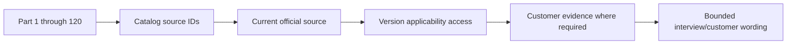

## Product currency and change log template

| Field | Fillable blank |
|---|---|
| Change ID |  |
| Product/term/area |  |
| Previous wording/source/date |  |
| Current wording/source/date |  |
| Change type | Rename / package / entitlement / UI / field / behavior / limit / deprecation / source correction |
| Effective/release date if official |  |
| Affected Parts/appendices/artifacts |  |
| Customer/tenant applicability |  |
| Contract/license impact owner |  |
| Required content/action change |  |
| Verification evidence and reviewer |  |
| Next trigger/review |  |

**Fictional NMH sample:**

| Field | NMH synthetic example |
|---|---|
| Change ID | CUR-2026-017 synthetic |
| Product/term/area | Example public solution name |
| Previous wording/source/date | Prior catalog label, checked 2026-06-01 synthetic |
| Current wording/source/date | Current official page label, checked 2026-08-24 synthetic |
| Change type | Rename/public positioning |
| Effective/release date if official | Unknown; do not infer from page edit |
| Affected Parts/appendices/artifacts | Product map and interview answer |
| Customer/tenant applicability | Unknown; naming does not prove entitlement or migration |
| Contract/license impact owner | Account/procurement role if real |
| Required content/action change | Update public term; retain alias in drift ledger |
| Verification evidence and reviewer | Source capture record and second review |
| Next trigger/review | Before customer presentation or interview |

### Diagram L13 - Product currency loop

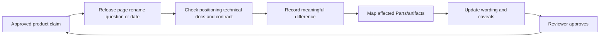

## Claim ledger template

| Claim ID | Exact claim | Claim type | Source IDs/controlled evidence | Scope/time/version | Confidence/limits | Allowed wording | Prohibited inference | Owner | Last/next check |
|---|---|---|---|---|---|---|---|---|---|
|  |  | Product / standard / tenant / outcome / experience / legal |  |  |  |  |  |  |  |

**Fictional NMH samples:**

| Claim ID | Exact claim | Claim type | Source IDs/controlled evidence | Scope/time/version | Confidence/limits | Allowed wording | Prohibited inference | Owner | Last/next check |
|---|---|---|---|---|---|---|---|---|---|
| CL-001 | Data Fabric is publicly positioned as unifying security/business data | Product positioning | S042 | Public page checked 2026-08-24 | Direct VP; implementation/entitlement not proven | "Zscaler publicly positions Data Fabric for Security as..." | "NMH has it" or connector/result guarantee | Content owner | Recheck before interview |
| CL-002 | Fixed NMH lab query found three ambiguous records | Lab observation | Appendix K manifest | Synthetic release v1 | Reproducible locally; no product/customer inference | "In my synthetic local lab..." | "Zscaler detected..." | Lab owner | On release change |
| CL-003 | A fictional tenant is entitled to UVM | Customer entitlement | None | Unknown | Unsupported | "Entitlement must be verified" | Any affirmative entitlement statement | Account owner | Before customer use |

### Diagram L14 - Claim ledger release gate

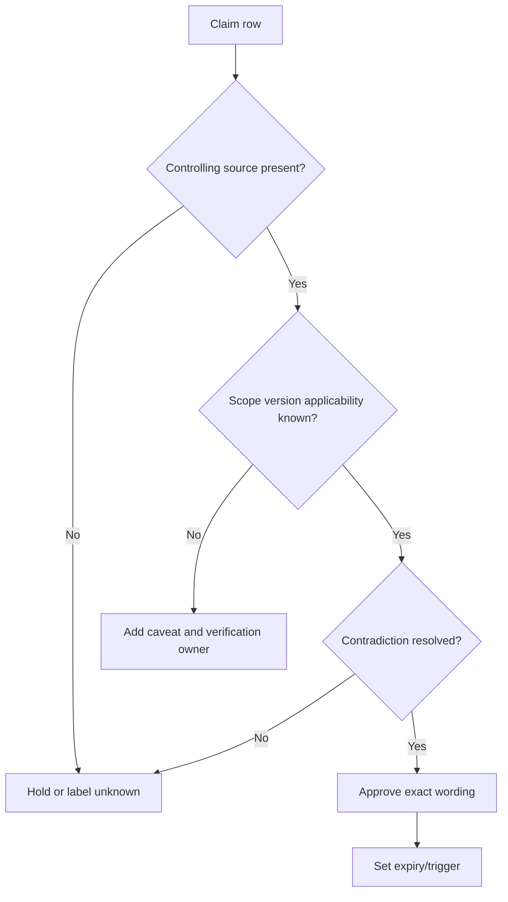

## Terminology drift register

| Field | Fillable blank |
|---|---|
| Concept ID |  |
| Current preferred term |  |
| Previous/alternate/industry term |  |
| Source and checked date |  |
| Same, narrower, broader, renamed, or unknown relation |  |
| Product/package/SKU distinction |  |
| Affected artifacts |  |
| Search aliases retained |  |
| Customer wording/caveat |  |
| Owner/next review |  |

| Drift pattern | Example risk | Handling |
|---|---|---|
| Rename | New public name looks like a new capability | Preserve alias and check release/technical docs |
| Portfolio regrouping | Product appears under a new solution family | Separate packaging/navigation from technical change |
| Acronym collision | "ASM" or "XDR" means different scopes | Define term/source at first use |
| Feature becomes product | Old feature page no longer maps to entitlement | Verify SKU/order and migration docs |
| Metric definition changes | Trend appears to move due to formula/version | Bridge old/new definitions and restate baseline only if valid |
| Count claim changes | Connector/data-center/factor count becomes stale | Avoid memorized number; date/source or describe qualitatively |
| Draft standard becomes final | Requirements/section numbers change | Cite final version; retain historical context where needed |
| Deprecated RFC | Old implementation still exists | State current standard and legacy observation separately |
| AI vocabulary shift | "Copilot," "agent," and "agentic" imply different autonomy | Define architecture, tools, authority, and evidence, not label alone |

### Diagram L15 - Terminology drift handling

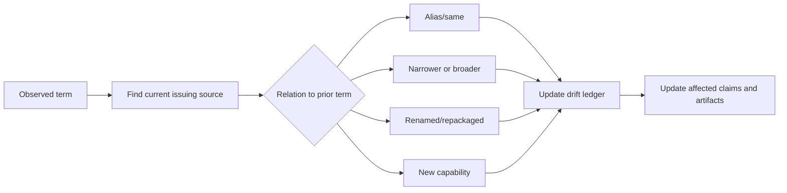

### Plain-English deep-dive 3 - A renamed shelf does not prove a changed book

A library can move a book from "Computing" to "Security" without changing a page. Vendors similarly rename or regroup products. Conversely, a familiar name can hide a changed field, package, or behavior. Treat naming, packaging, entitlement, implementation, and observed outcome as separate dimensions. The change log asks which dimension actually changed.

## Authenticated documentation caveats

| Caveat | Required practice |
|---|---|
| Access rights | Use only an authorized account; do not share credentials or bypass controls |
| Licensing/copyright | Link to controlled source; do not paste large restricted excerpts into public notes |
| Audience | Confirm whether content is customer, partner, employee, NDA, or public |
| Version/cloud | Record product, cloud, article version/date, and relevant platform |
| Personalization | A portal may show tenant/account-specific content; do not generalize |
| Capture | Store only permitted minimal metadata; redact account/user identifiers |
| Expiry | Authenticated URLs and permissions may change; retain source title/ID/date |
| Conflict | Ask vendor/support owner when public and authenticated docs disagree |
| AI/tool use | Do not submit restricted docs to an unapproved model, extension, or search tool |
| Interview use | Paraphrase only what may be disclosed; prefer public official sources |

### Diagram L16 - Authenticated-source boundary

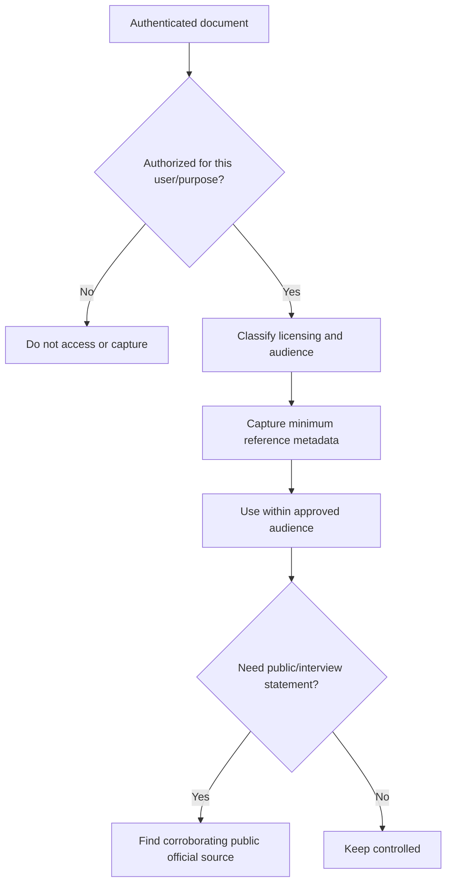

## Tenant and contract caveats

| Question | Controlling evidence | Common mistake |
|---|---|---|
| Is feature available? | Executed order/SKU/entitlement record plus current packaging | Product page treated as entitlement |
| Is feature enabled? | Authorized tenant configuration/export and owner validation | Entitlement treated as configuration |
| Is traffic/data flowing? | Authorized telemetry/test at stated scope/time | Configuration treated as enforcement/outcome |
| Is behavior supported? | Current technical docs for version/cloud plus support clarification | One tenant observation treated as general contract |
| Is an SLA applicable? | Executed support/service terms and case classification | Generic web statement used as commitment |
| Can data be processed/shared? | Contract/DPA/customer policy/legal/privacy approval | Technical capability treated as permission |
| Is roadmap committed? | Authorized contractual/roadmap channel and accountable owner | Sales/marketing phrase treated as dated promise |
| Did product cause incident? | Approved RCA with product evidence and accountable review | Temporal correlation treated as causation |
| Did product reduce risk/value? | Customer-approved before/after method, controls, attribution, finance/risk owner | Vendor score or case study treated as outcome |

### Diagram L17 - Entitlement-to-outcome chain

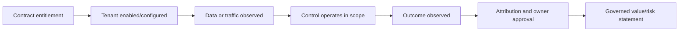

## Link-health process

Link health has two dimensions: transport health and semantic health. A `200 OK` page can be the wrong page; a redirect can be legitimate or can land on unrelated content.

| Check | Pass condition | Failure disposition |
|---|---|---|
| Scheme/domain | HTTPS and expected official owner/domain | Hold; find authoritative replacement |
| Status/redirect | Page resolves through expected redirects | Record final URL; investigate unexpected domain/path |
| Title/resource identity | Title and body match intended standard/product | Mark semantic failure even if HTTP succeeds |
| Version/status | Current/final/supported status is clear | Record draft/obsolete/superseded and use correct version |
| Publication/effective date | Available and captured where material | Record unknown; avoid currency claim |
| Access | Public/authenticated/restricted state understood | Set access caveat and approved owner |
| Deep link | Relevant section/anchor still exists | Update capture reference |
| Download integrity | File type/source/title match; hash only if policy calls for it | Do not open/share unexpected content |
| Contradiction | Catalog claim still matches source | Update ledger and affected artifacts |
| Review log | Verifier/date/result/next trigger recorded | Source remains unverified |

### Diagram L18 - Link-health workflow

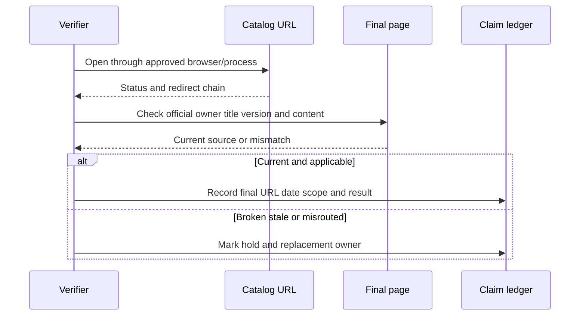

## Link-health register template

| Source ID | Checked at/by | Initial/final URL | HTTP/redirect result | Title/content match | Version/current state | Access class | Replacement/action | Next trigger |
|---|---|---|---|---|---|---|---|---|
|  |  |  |  |  |  |  |  |  |

**Fictional NMH sample:**

| Source ID | Checked at/by | Initial/final URL | HTTP/redirect result | Title/content match | Version/current state | Access class | Replacement/action | Next trigger |
|---|---|---|---|---|---|---|---|---|
| S082 | 2026-08-24 synthetic verifier | Catalog route / unexpected destination observed in one tool | Redirect requires independent browser check | Not accepted until intended KEV title confirmed | Unknown in that check | Public official route expected | Use official CISA navigation/feed and record verified final page | Before KEV customer/interview claim |

## Pre-interview verification checklist

| Gate | Verification action | Evidence/output |
|---|---|---|
| Role | Reopen current job posting and company career/culture pages | Dated role-to-story map |
| Product names | Reopen S002-S045 for names/portfolio relationships | Terminology-drift updates |
| Technical behavior | Prefer current public Help Portal/official docs | Claim ledger with version/caveat |
| Volatile numbers | Remove or date connector/factor/data-center/customer/stat claims | Source/date and no memorized guarantee |
| Standards | Check final/current version and obsoletes/updates | Correct source IDs |
| CVE/CVSS/EPSS/KEV | Recheck current record/model/catalog status | Date-stamped answer |
| AI | Recheck product vocabulary and AI governance sources | Human-authority/data-use caveat |
| Experience | Label production, lab, conceptual, official-public, not-yet-used | Honest opening sentence |
| Lab | Verify local release, hashes, expected outputs, safe demo fallback | Appendix K run record |
| STAR stories | Confirm facts, dates, role, actions, outcomes, confidentiality | Approved personal notes |
| Customer examples | Use NMH synthetic label or authorized anonymized evidence | No implied real customer |
| Questions | Record unknown product/roadmap/contract questions for follow-up | Parking-lot owner/source |
| Links | Run semantic link-health check on sources used aloud | Link-health log |
| Delivery | Practice concise answer with source, caveat, and application | Mock review |

### Diagram L19 - Pre-interview fact check

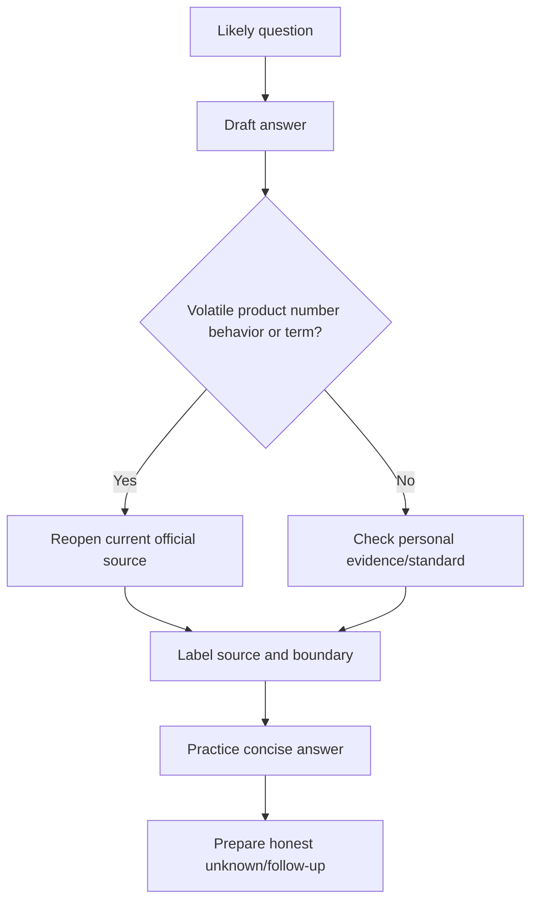

## Pre-customer verification checklist

| Gate | Verification action | Required owner/record |
|---|---|---|
| Purpose/audience | State decision, scope, audience, classification | Meeting/artifact owner |
| Public product claim | Recheck current official positioning and technical docs | Claim ledger |
| Entitlement | Verify order/SKU/contract through approved owner | Account/procurement record |
| Tenant state | Use authorized current evidence at stated scope/time | Customer technical owner |
| Security/privacy | Minimize/redact; confirm channel, retention, data-processing authority | Security/privacy owner |
| Metric | Confirm definition, grain, denominator, clock, source, model version | Metric owner |
| Risk/value | Confirm method, uncertainty, attribution, authority | Risk/finance/business owner |
| Incident/support | Confirm severity/process/SLA/case status in controlling records | Incident/support owner |
| Roadmap | Use only authorized disclosure channel and wording | Product/account owner |
| Accessibility | Run structure, contrast, labels, descriptions, export checks | Artifact owner/reviewer |
| Link/source | Check semantic identity, currency, access, and citations | Verifier/date |
| Contradictions | Resolve or disclose conflict before presenting | Accountable decision owner |
| Actions | Decision, owner, due date, validation, next review | Action register |
| Distribution | Send only approved version and links | Manifest/distribution record |

### Diagram L20 - Pre-customer release gate

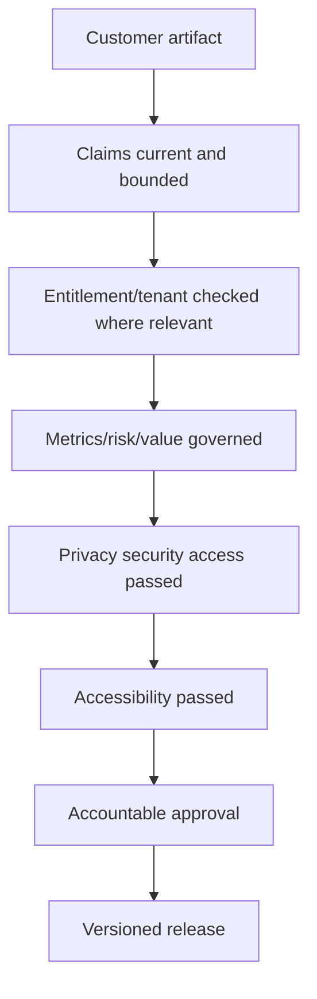

### Plain-English deep-dive 4 - Customer evidence can outrank a public page without becoming universal

If a public guide says a switch can be on, and a current authorized tenant export shows it off, the tenant export controls the statement "this tenant has it off." It does not disprove the product's capability. Evidence strength is scoped. The safest sentence names both layers: "The product documentation describes the capability; the authorized tenant evidence as of this time shows it is not enabled here."

## Contradiction-resolution template

| Field | Fillable blank |
|---|---|
| Claim/question |  |
| Source A/class/version/date |  |
| Source B/class/version/date |  |
| Apparent contradiction |  |
| Scope/applicability difference |  |
| Supersession/errata/tenant/contract check |  |
| Accountable resolver |  |
| Interim customer/interview wording |  |
| Final decision/evidence |  |
| Affected artifacts and correction |  |

| Conflict | Likely explanation | Safe response |
|---|---|---|
| Product page and Help Portal differ | Positioning update, documentation lag, scope difference | Use narrow public statement; seek current technical owner confirmation |
| Public docs and tenant differ | Version, cloud, entitlement, rollout, configuration | State both scopes; do not call one universally wrong |
| Contract and product page differ | Purchased terms/package differ from current marketing | Contract governs entitlement; involve account/procurement owner |
| Standard and vendor implementation differ | Optional profile, legacy version, extension, nonconformance | Identify normative requirement and documented implementation/context |
| Dashboard and query differ | Filter, refresh, relationship, definition, source version | Hold claim; reconcile from grain and clock |
| Two customer owners disagree | Different scope/clock/authority | Record conflict and decision owner; do not average opinions |
| AI summary and source differ | Hallucination, stale index, missing context | Discard summary claim; return to original source |

### Diagram L21 - Contradiction resolution

```mermaid
flowchart LR
    A[Source A] --> COMP[Compare exact claim scope version time]
    B[Source B] --> COMP
    COMP --> EXPL{Supersession scope tenant or contract explains?}
    EXPL -- Yes --> BOUND[Write bounded layer-specific conclusion]
    EXPL -- No --> OWNER[Escalate to accountable source owner]
    OWNER --> HOLD[Hold material claim until resolved]
```

## Source refresh cadence

| Trigger | Examples | Refresh scope | Required output |
|---|---|---|---|
| Before interview | New role, interview stage, panel focus | Role/company, major products, volatile numbers, likely standards | Dated interview claim ledger |
| Before customer meeting | QBR, design, incident, roadmap, renewal | All material product/tenant/contract/metric claims | Approved source and evidence pack |
| Product event | Rename, release, deprecation, acquisition, package change | Affected product Parts and templates | Currency/change-log row |
| Standard update | Final revision, errata, obsoleted RFC | Affected definitions/processes | Version bridge |
| Model/feed update | EPSS/CVSS/KEV/NVD/API schema | Vulnerability metrics and queries | Data/model version update |
| Incident | New evidence, severity, recovery, RCA | Incident claims only | Canonical incident record |
| Customer change | Policy, tenant, data source, scope, owner | Customer evidence and metrics | New as-of baseline/manifest |
| Scheduled | Monthly volatile-source scan; quarterly broad review as locally chosen | Catalog/link health and drift | Review log; cadence is a guide, not universal SLA |

### Diagram L22 - Final verification gate

```mermaid
flowchart TD
    INV[120 Parts and 12 Appendices] --> LINKS[Local links resolve]
    LINKS --> STRUCT[Exact H1 ASCII fences counts]
    STRUCT --> SOURCES[Official URL catalog and Part map]
    SOURCES --> CURRENCY[Date hierarchy caveats ledgers]
    CURRENCY --> SAFETY[Privacy safety unsupported-claim checks]
    SAFETY --> DONE[Release gate PASS]
```

## Interview-ready explanations

| Question | Concise model answer |
|---|---|
| How do you verify a product claim? | I narrow the exact claim, use the current vendor page for public positioning and technical docs for supported behavior, then check contract entitlement and authorized tenant evidence when the sentence is customer-specific. I record version, date, scope, caveats, and expiry in a claim ledger. |
| What is the best source? | The source that controls the claim: an RFC for protocol semantics, issuing authority for a framework, technical docs for supported product behavior, contract for entitlement, tenant evidence for configuration, and customer-governed evidence for outcomes. |
| Do official vendor pages prove results? | No. They are authoritative for the vendor's public positioning, not independent proof, tenant state, entitlement, customer outcome, or causation. I label the source class and corroborate at the correct layer. |
| How do you handle authenticated docs? | I access only with authorization, respect licensing/classification, capture minimal reference metadata, avoid public excerpts or unapproved AI tools, record version/context, and find a public corroborating source for interview use. |
| How do you keep product knowledge current? | I maintain a product change log and terminology-drift register, trigger checks before interviews/customer meetings and on releases/renames, revalidate technical/contract/tenant layers, and update affected claims rather than rewriting everything. |
| How do you check links? | I check official domain, redirect chain, title/content identity, version/status, access, and claim fit. HTTP success alone is insufficient; a redirect to the wrong official page is a semantic failure. |
| What if sources conflict? | I compare exact scope, version, time, source class, supersession, tenant, and contract. I write a layer-specific conclusion when explainable; otherwise I hold the claim and escalate to the accountable source owner. |
| How would you answer an unknown in an interview? | I state what the current official source supports, name what I have not verified or used, explain how I would verify it, and avoid turning adjacent or synthetic experience into a product claim. |

## Thirty-second memory hooks

| Topic | Memory hook |
|---|---|
| Source hierarchy | Standard for protocol, docs for support, contract for entitlement, tenant for state, customer evidence for outcome. |
| Official page | Official positioning is not sufficient proof. |
| Currency | Version, date, scope, access, expiry. |
| Product truth | Offer -> support -> entitlement -> configuration -> operation -> outcome. |
| Link health | Status plus semantic identity. |
| Drift | Name, package, entitlement, behavior, metric: ask which changed. |
| Claim ledger | Exact sentence, source, scope, caveat, allowed wording, next check. |
| Auth docs | Authorized, minimal, controlled, never pasted casually. |
| Conflict | Compare layer/version/scope; hold if unresolved. |
| Interview | Public fact plus honest experience label. |
| Customer | Tenant/contract evidence stays controlled. |
| AI summary | Lead to source, never become source. |

## Source and honesty boundaries

| Boundary | This appendix supports | It does not establish |
|---|---|---|
| 230 official URLs | Dated authoritative starting points across required domains | Permanent link health, current content, or applicability without recheck |
| Zscaler public pages | Public portfolio naming and positioning | Tenant behavior, entitlement, SLA, internal roadmap, root cause, or guaranteed result |
| Standards/government | Versioned definitions and guidance | Customer implementation, legal advice, or universal compliance |
| Microsoft/PostgreSQL/Power BI docs | Official implementation/tool guidance | Installed version, license, configuration, or customer data state |
| Customer evidence | Method for controlled verification | Permission to access/share tenant, contract, case, or personal data |
| Synthetic NMH | Safe examples of ledgers and checks | Real health-care entity, product tenant, outcome, contract, or incident |

## Completion checklist

- [x] Exactly one H1 uses the master-linked Appendix L title.
- [x] The source catalog contains 230 numbered official URLs across Zscaler, NIST, CISA, FIRST, MITRE, IETF, OpenID, OASIS SAML, Microsoft, PostgreSQL, SQLite, Power BI, governance, accessibility, and AI.
- [x] All Parts 1-120 are individually represented with valid local links, source IDs, and a verification focus.
- [x] Public marketing/positioning, technical documentation, authenticated material, tenant evidence, contract/entitlement, customer outcomes, standards, and synthetic lab evidence are explicitly distinguished.
- [x] Product currency/change log, claim ledger, source-capture fields, terminology drift, contradiction handling, link-health, confidence, refresh cadence, pre-interview, and pre-customer checklists are included.
- [x] Twenty-two numbered Mermaid diagrams and substantially more than twenty-five tables are included.
- [x] Four Plain-English deep-dives explain source sufficiency, product-truth layers, renames, and scoped customer evidence.
- [x] No blog is used where an authoritative issuing-body or vendor documentation source is available; vendor positioning remains labeled rather than treated as independent evidence.
- [x] Authenticated-doc, tenant, contract, privacy, licensing, access, and customer-evidence caveats are explicit; no restricted content or secret is included.
- [x] Content is ASCII, uses balanced fences, labels NMH synthetic, includes the exact 2026-08-24 currency date, and returns to the master after Appendix K.

[Back to the master study guide](../Zscaler%20SecOps%20Technical%20Success%20Manager%20-%20Complete%20Study%20Guide.md) | [Previous appendix: Lab Dataset, Tooling, and Evidence Portfolio Guide](Appendix-K-lab-dataset-tooling.md) | [Return to master after this final appendix](../Zscaler%20SecOps%20Technical%20Success%20Manager%20-%20Complete%20Study%20Guide.md)
