# Part 1 - Role Map, JD Deconstruction, and the SecOps TSM Story

> **Audience:** Candidates preparing to move from enterprise Support Escalation Engineering into a Zscaler Security Operations Technical Success Manager role.
>
> **Currency date:** 2026-08-24.
>
> **Honesty rule:** This chapter distinguishes documented Zscaler statements, general industry concepts, fictional exercises, and your factual production experience. Direct production operation of Zscaler products is not established.
>
> **Product caveat:** Product names, packaging, user interfaces, connector catalogs, scoring methods, and published metrics can change. Verify current official documentation and the customer's licensed capabilities before making a production recommendation.

## Section goal and scope

The goal of this chapter is to answer a deceptively simple question: **what is this job actually asking you to do?** A job description, abbreviated as **JD**, often compresses several jobs into short phrases such as "lead strategic engagements," "analyze complex environments," or "drive long-term success." Those phrases sound impressive but are not useful until they are translated into daily activities, decisions, evidence, customer outcomes, and interview stories.

By the end of Part 1, you should be able to:

| Learning outcome | What good looks like |
|---|---|
| Define the role | Explain Security Operations and Technical Success Management without relying on unexplained jargon |
| Draw boundaries | Distinguish Technical Success, Customer Success, Technical Account Management, Support, Consulting, Professional Services, Sales Engineering, Product Management, Engineering, and a Security Operations Center |
| Read the JD operationally | Convert each supplied expectation into activities, stakeholders, data, decisions, artifacts, measures, risks, and proof |
| Place the role in Zscaler context | Explain how the Zero Trust Exchange, Agentic Security Operations, Data Fabric for Security, Asset Exposure Management, Unified Vulnerability Management, Continuous Threat Exposure Management, and Risk360 relate |
| Run an account | Describe discovery, onboarding, adoption, health, risk, escalation, training, executive review, renewal collaboration, and outcome measurement |
| Tell one coherent customer story | Follow a clearly fictional enterprise account from fragmented data to prioritized action and measurable improvement |
| Position you honestly | Connect factual enterprise support, escalation, networking, analytics, mentoring, and artificial intelligence experience to the role without claiming unearned cybersecurity production experience |
| Interview with structure | Give short and long positioning answers, handle gaps, and answer eight likely role questions with substantive examples |

This is an orientation chapter, not a substitute for later technical depth. It introduces the architecture and operating model needed to understand the role. Later Parts will examine each technical domain in detail. The complete behavioral story bank remains reserved for Part 120.

## Acronyms and terms used in this chapter

An **acronym** is a shortened name made from initial letters. The table defines each acronym before the chapter uses it heavily.

| Acronym or term | Plain meaning | Why it matters here | Memory hook |
|---|---|---|---|
| AI | Artificial intelligence | Software that performs tasks associated with human reasoning, classification, summarization, or decision support | AI assists; accountable humans decide |
| API | Application Programming Interface | A defined way for software systems to exchange requests and data | API is a software service counter |
| AEM | Asset Exposure Management | A Zscaler product area for creating trusted asset visibility and identifying coverage gaps | Know the assets before judging the risk |
| CAASM | Cyber Asset Attack Surface Management | An industry category for aggregating asset data across tools to improve visibility and control | Many inventories become one usable view |
| CISO | Chief Information Security Officer | The executive accountable for the security program | CISO asks, "What business risk changed?" |
| CIO | Chief Information Officer | The executive accountable for enterprise information technology strategy and operations | CIO connects technology to business execution |
| CMDB | Configuration Management Database | A system that records technology items and their relationships | CMDB is the organization's equipment and dependency register |
| Critical situation | Business-critical escalation | A high-impact support escalation run with a formal coordination cadence | Critical-situation ownership proves calm leadership under pressure |
| CSAT | Customer Satisfaction | A score that reflects how customers rate an interaction or service | CSAT measures the customer's experienced quality |
| CTEM | Continuous Threat Exposure Management | An industry program model that repeatedly scopes, discovers, prioritizes, validates, and mobilizes against exposure | Find, focus, prove, fix, repeat |
| CVE | Common Vulnerabilities and Exposures | A public identifier for a disclosed vulnerability | CVE names the issue; it does not decide business risk |
| CVSS | Common Vulnerability Scoring System | A general severity scoring framework for vulnerabilities | Severity is an ingredient, not the final priority |
| EBR | Executive Business Review | A strategic review of outcomes, risks, decisions, and future value | EBR is a decision meeting, not a product tour |
| EDR | Endpoint Detection and Response | Security technology that monitors endpoints and supports detection and response | EDR watches laptops and servers for suspicious behavior |
| EPSS | Exploit Prediction Scoring System | An industry estimate of the probability that a published vulnerability will be exploited in the wild | EPSS asks, "How likely is exploitation soon?" |
| ETL | Extract, Transform, Load | A data pipeline pattern that takes data from a source, changes it, and loads it into a target | Move, clean, place |
| IAM | Identity and Access Management | People, processes, and technology for digital identities and access | IAM answers who can do what |
| JD | Job description | The supplied list of responsibilities, qualifications, and behavioral signals | Translate every JD verb into evidence |
| KEV | Known Exploited Vulnerabilities | A catalog of vulnerabilities known to be exploited, commonly associated with the United States Cybersecurity and Infrastructure Security Agency | Known exploitation raises urgency |
| KPI | Key Performance Indicator | A measure used to judge progress toward an important outcome | A KPI must support a decision |
| QBR | Quarterly Business Review | A recurring review of progress, value, risks, and next-quarter priorities | QBR connects work to outcomes every quarter |
| RACI | Responsible, Accountable, Consulted, Informed | A method for clarifying who does work, owns the result, advises, and receives updates | One accountable owner prevents "everyone and no one" ownership |
| RCA | Root Cause Analysis | A structured explanation of why a problem occurred and how recurrence will be reduced | RCA improves the system, not the blame |
| Risk360 | Zscaler's cyber risk assessment and quantification offering | It presents risk drivers, trends, guided mitigation, and executive-oriented reporting using Zscaler telemetry | Translate telemetry into executive risk decisions |
| SaaS | Software as a Service | Software delivered as an online service rather than installed and operated entirely by the customer | SaaS shifts operation, not accountability |
| SecOps | Security Operations | The people, processes, and technology used to prevent, detect, investigate, and respond to security risk and threats | Security work that keeps running every day |
| SE | Sales Engineer | A technical pre-sales specialist who proves solution fit and supports buying decisions | SE earns technical confidence before purchase |
| SIEM | Security Information and Event Management | A system focused on collecting and analyzing security event and log data | SIEM is an event-focused security control room |
| SLA | Service Level Agreement | A defined service commitment, often based on severity and time | SLA converts urgency into an explicit commitment |
| SMB | Small and Medium-sized Business | A customer segment smaller than large enterprise | Segment context makes performance claims precise |
| SOC | Security Operations Center | A team or function that monitors, investigates, and responds to threats | SOC is the security watch floor |
| SOAR | Security Orchestration, Automation, and Response | Technology that coordinates security workflows and automates response steps | SOAR is the workflow conductor |
| TAM | Technical Account Manager | A named technical advisor coordinating account health, support, and technical planning | TAM protects technical continuity |
| TLS | Transport Layer Security | The protocol that encrypts and authenticates many network connections | TLS protects data in transit |
| TSM | Technical Success Manager | A technical, outcome-oriented partner who helps customers adopt a platform and realize durable value | TSM turns technology into repeatable customer outcomes |
| UVM | Unified Vulnerability Management | Zscaler's offering for contextual vulnerability prioritization, reporting, and remediation workflows | Fix what matters, not merely what scores high |
| XDR | Extended Detection and Response | Technology that correlates detection and response data across security domains | XDR joins signals across controls |

## Candidate honesty note

Your strongest interview position is not "I already know everything in this role." It is: **"My evidence covers enterprise customer ownership, deep troubleshooting discipline, high-pressure escalation leadership, analytics, and enablement. My plan transfers those strengths into SecOps while I build Zscaler product depth."**

Four claim labels protect credibility:

| Claim label | Meaning | Safe example |
|---|---|---|
| Production | You performed the work in a real job and can defend the details | "I led Microsoft 365 business-critical escalations and coordinated evidence with Engineering." |
| Lab | You performed the work in a controlled exercise and retained evidence | "In a synthetic lab, I joined asset and vulnerability data and built a prioritization dashboard." |
| Conceptual | You understand the architecture and can explain a validation method | "I understand how contextual factors can alter vulnerability priority, and I would validate source freshness and factor weights." |
| Not yet used | Direct operation of the named product or capability is not established | "Direct production administration of Zscaler UVM is not part of my current experience. My transferable method is data validation, hypothesis testing, stakeholder coordination, and measurable follow-through." |

Never convert study into production experience. Never present the fictional customer later in this chapter as your customer. Never imply that a product page proves a capability is licensed, configured, or available in a particular tenant.

## The role in one sentence

A **SecOps Technical Success Manager** is a named technical partner who helps an enterprise customer turn security data and Zscaler capabilities into trusted priorities, adopted workflows, resolved blockers, reduced exposure, and executive-visible outcomes over time.

The role sits between strategy and execution. It does not own every task, but it must make the whole customer outcome coherent.

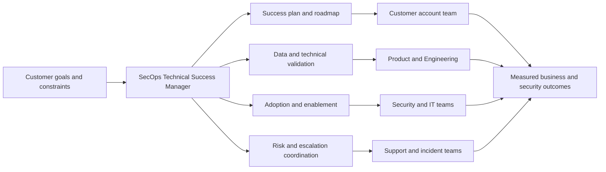

## Plain-English definitions of the neighboring functions

### Security Operations

**Security Operations**, or SecOps, is the ongoing work of protecting an organization by understanding exposures, monitoring signals, investigating suspicious activity, coordinating response, and improving controls. Think of it as running safety for a large airport: teams inspect weak points before an incident, watch live activity, respond when something happens, and update procedures afterward.

SecOps includes both **proactive** work, such as finding an unmanaged internet-facing server, and **reactive** work, such as investigating an identity compromise. It is broader than a single tool and broader than the SOC.

### Security Operations Center

A **Security Operations Center**, or SOC, is the team or function that continuously monitors security signals, triages alerts, investigates threats, and coordinates containment. Think of the SOC as the airport operations room. SecOps is the whole safety program; the SOC is the watch-and-response function inside it.

### Technical Success Manager

A **Technical Success Manager**, or TSM, helps a customer obtain durable outcomes from a technical platform. The TSM learns the customer's goals and environment, creates a success plan, drives technical adoption, coordinates specialists, detects risk early, and proves value. Think of a TSM as a guide for a difficult expedition: the guide does not carry every bag or build every bridge, but makes sure the group has a route, knows the risks, reaches milestones, and learns how to continue safely.

### Customer Success

**Customer Success** is the discipline of helping customers realize the value they expected when they bought a product or service. It focuses on adoption, outcomes, satisfaction, retention, and advocacy. Think of it as ensuring that someone who bought a gym membership actually develops a sustainable fitness routine rather than merely receiving an access card.

A Customer Success Manager may cover broader commercial, relationship, and adoption concerns. A TSM adds deeper technical leadership for complex products and environments.

### Technical Account Management

**Technical Account Management** provides ongoing technical coordination for a named customer. A Technical Account Manager, or TAM, often focuses on technical health, support planning, service reviews, and continuity across cases. Think of the TAM as the customer's technical air-traffic coordinator: the TAM helps route issues and plans safely across services.

Titles vary by company. Some TAM and TSM roles overlap heavily. In an interview, define the outcome and operating model rather than arguing that titles have universal boundaries.

### Support

**Support** diagnoses and resolves product incidents, defects, and how-to issues under a service process. It is typically triggered by a problem or question and governed by severity and service commitments. Think of Support as the emergency repair desk: it restores service and gathers the technical evidence needed for a durable fix.

Support can be proactive, and a TSM can assist during incidents, but the default distinction is that Support owns case resolution while the TSM owns account-level success continuity and risk coordination.

### Consulting

**Consulting** is expert advice used to analyze a problem, design an approach, or recommend decisions. It may be strategic or technical and may not include implementation. Think of a consultant as an architect who studies the site, clarifies requirements, and recommends the best building design.

A TSM uses consulting skills but remains accountable to an ongoing customer success relationship rather than only a bounded advice engagement.

### Professional Services

**Professional Services** delivers scoped, usually time-bound implementation or transformation work. Examples include designing an integration, configuring a deployment, migrating users, or building a custom workflow under a statement of work. Think of Professional Services as the construction crew following the agreed blueprint.

The TSM identifies when this specialized delivery is needed, protects the success plan, and ensures handoffs are clear. The TSM should not silently absorb paid project work.

### Sales Engineering

**Sales Engineering** is the technical pre-sales discipline that demonstrates fit, validates requirements, answers architecture questions, and reduces buying risk. Think of the Sales Engineer as the test pilot before purchase: they show that the aircraft can meet the mission under stated assumptions.

After purchase, the TSM converts expectations into adoption and value. The Sales Engineer remains important for expansion discovery, but the TSM must not turn every success review into a sales pitch.

### Product Management

**Product Management** decides what customer problems a product should solve, why they matter, and how product investments should be prioritized. A Product Manager combines market needs, strategy, evidence, and tradeoffs. Think of Product Management as deciding which roads a city should build and in what order.

The TSM supplies structured customer evidence and impact. Product Management owns prioritization and roadmap decisions; the TSM must not promise an uncommitted feature.

### Engineering

**Engineering** designs, builds, tests, operates, and fixes the product. Think of Engineering as the people who build and maintain the road, bridge, sensors, and control systems. A TSM helps Engineering by providing reproducible evidence, impact, timelines, and customer context. Engineering owns the technical implementation decision.

## Plain-English deep-dive 1 - Boundaries are promises, not walls

Imagine a hospital. A patient may interact with a primary doctor, specialist, laboratory, pharmacy, billing team, and emergency department. The patient should not need to understand the hospital's organization chart to receive care, but each team still needs clear responsibility. The same is true for a strategic technology customer.

A boundary does not mean "that is not my job." It means "I will make sure the right owner is engaged, the handoff contains enough evidence, and the customer knows what happens next." The TSM protects continuity without pretending to own every specialist task.

| Function | Primary question | Typical trigger | Core artifact | Owns | Does not automatically own |
|---|---|---|---|---|---|
| TSM | Are we achieving durable technical and business outcomes? | Ongoing strategic relationship | Technical success plan | Outcome orchestration, adoption risk, account technical narrative | Every support fix or implementation task |
| Customer Success | Is the customer realizing value and likely to remain successful? | Ongoing lifecycle | Success plan and health view | Relationship, adoption, value, retention coordination | Deep product diagnosis unless role includes it |
| TAM | Is the account technically healthy and well coordinated? | Named technical relationship | Technical account plan | Technical continuity and support governance | Product roadmap or commercial commitments |
| Support | Why is this failing and how do we restore service? | Incident or request | Case record and resolution | Case diagnosis and resolution process | Long-term account strategy |
| Consulting | What should the customer do and why? | Decision or transformation need | Assessment and recommendation | Analysis and advice within scope | Ongoing adoption ownership unless contracted |
| Professional Services | How do we implement the agreed scope? | Project engagement | Design and implementation plan | Scoped delivery | Unlimited operational support |
| Sales Engineering | Does the solution fit before purchase or expansion? | Sales opportunity | Demo, validation, technical win plan | Pre-sales technical confidence | Post-sale adoption ownership |
| Product Management | What should the product solve next? | Strategy and evidence | Roadmap and requirements | Product priority and direction | Customer-specific delivery promise |
| Engineering | How is the product built, operated, and fixed? | Product development or defect | Code, design, fix, test evidence | Product implementation | Account relationship management |
| SOC | What threats need investigation or response now? | Detection, hunt, or incident | Case, timeline, response action | Threat monitoring and response | Vendor account success planning |

### Boundary and handoff flow

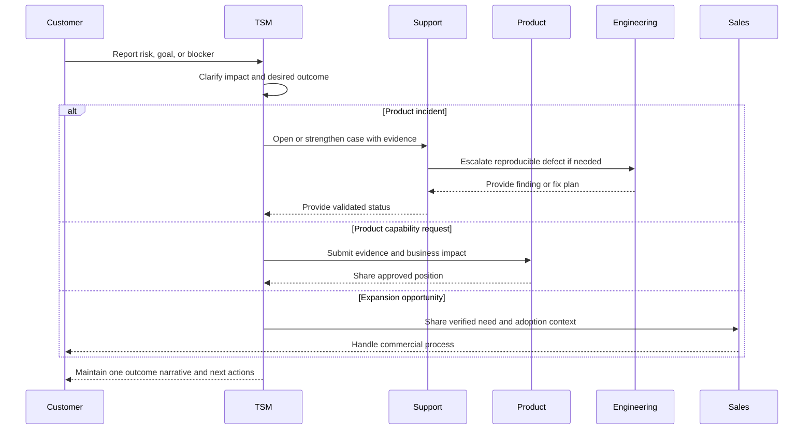

The quality of a handoff depends on five things: a clear problem statement, business impact, evidence, requested decision, and named next owner. "I sent an email" is activity. "The correct owner accepted the decision and deadline" is outcome.

## Zscaler context: documented products and industry concepts

Zscaler's current official pages describe a connected story: the Zero Trust Exchange provides inline telemetry and controls; the Data Fabric for Security aggregates and contextualizes data; exposure and SecOps offerings use that context to prioritize and act; feedback improves posture over time. The TSM helps the customer turn this product story into an operating reality.

### Platform and role map

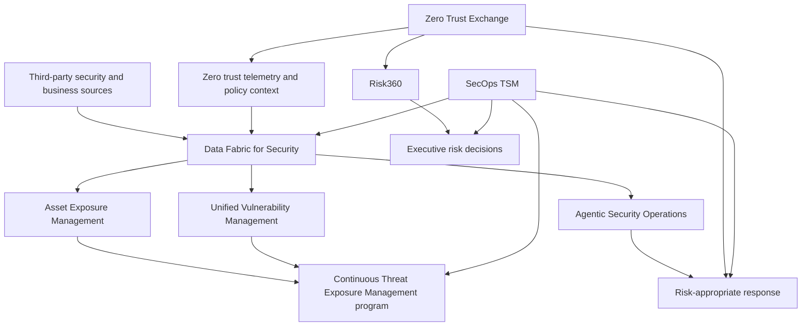

| Term | Plain-English analogy | What official Zscaler material documents | What is broader industry language or requires validation |
|---|---|---|---|
| Zero Trust Exchange | An intelligent switchboard that connects an approved caller only to an approved destination | Zscaler describes an integrated platform using identity, context, risk, policy, proxy architecture, one-to-one connections, and inline controls | Zero trust is a broad industry architecture; exact policy behavior depends on deployed products and configuration |
| Agentic SecOps | A team of software assistants that gathers evidence and recommends coordinated action | Zscaler describes first- and third-party signals, a security graph, business context, agentic triage and investigation, and adaptive responses through inline controls | "Agentic" is an emerging industry term; autonomy, approvals, accuracy, and available workflows must be verified |
| Data Fabric for Security | A translation and sorting center that turns inconsistent shipments into trusted, linked records | Zscaler describes ingestion, harmonization, mapping, deduplication, correlation, enrichment, custom business logic, workflows, and dynamic reports | Data fabric is also a general data architecture concept; it is not automatically the same as a SIEM, warehouse, or CMDB |
| Asset Exposure Management | Reconcile several imperfect equipment lists into one usable register | Zscaler describes unified and deduplicated asset visibility, golden records, coverage gaps, CMDB health, workflows, and reporting | CAASM is an industry category. Connector availability and record behavior must be checked in current product documentation |
| Unified Vulnerability Management | Turn a pile of repair notices into an ordered worklist based on actual consequence | Zscaler describes aggregated and correlated data, contextual multifactor scoring, custom factors and weights, reporting, and automated remediation workflows | CVSS, EPSS, CVE, and KEV are industry inputs. A customer-specific score is a prioritization aid, not objective truth |
| CTEM | A recurring fire-safety program that finds, validates, and closes the most dangerous paths | Zscaler presents exposure management capabilities supporting scoping, discovery, prioritization, validation, and mobilization | CTEM is an industry program model associated with Gartner, not one product or one dashboard |
| Risk360 | A risk dashboard that converts many gauges into an executive flight view | Zscaler documents enterprise risk scoring over time, factors aligned to four attack stages, guided mitigation, financial exposure views, and board-ready reporting | Financial exposure and risk scores are model outputs with assumptions; they are not guaranteed loss predictions |

### The data-to-risk-to-action flow

```mermaid
flowchart LR
    RAW[Raw asset, identity, vulnerability, control, and event data] --> QUALITY[Quality and freshness checks]
    QUALITY --> ENTITY[Mapped and resolved entities]
    ENTITY --> CONTEXT[Business and security context]
    CONTEXT --> PRIORITY[Contextual priority]
    PRIORITY --> DECISION[Human decision]
    DECISION --> ACTION[Remediate, contain, accept, or investigate]
    ACTION --> VERIFY[Verify effect]
    VERIFY --> OUTCOME[Measured risk reduction]
    OUTCOME --> FEEDBACK[Feedback and tuning]
    FEEDBACK --> QUALITY
```

### Zero Trust Exchange

Zscaler describes the **Zero Trust Exchange** as a comprehensive, integrated platform for users, workloads, Internet of Things and Operational Technology devices, and business partners. Its official page contrasts network-centric trust with one-to-one connections brokered between entities and applications using identity, context, risk, and business policy. The page presents four broad steps: verify identity, determine destination, assess risk, and enforce policy.

The beginner analogy is a secure meeting service. Instead of giving a visitor a badge that opens an entire office floor, the service verifies the visitor and device, checks the requested meeting, assesses current conditions, and creates only the specific approved connection. The TSM's job is not merely to recite this architecture. The TSM connects it to customer outcomes such as reducing exposed applications, limiting lateral movement, inspecting traffic appropriately, and applying risk-based access decisions.

### Agentic Security Operations

Zscaler's official page currently positions **Agentic Security Operations**, commonly shortened to Agentic SecOps, as a way to unify proactive exposure work and reactive threat operations. It describes combining Zscaler telemetry with third-party signals, a security graph, business context, artificial intelligence-assisted triage and investigation, and adaptive responses such as stronger authentication, reduced access, or isolation.

An analogy is an emergency coordinator with specialist assistants. One assistant groups related alarms, another builds a timeline, another checks which business system is affected, and another proposes a limited containment step. The accountable analyst still validates the evidence, business impact, and authority to act. A TSM should ask how recommendations are reviewed, which actions require approval, how false positives are handled, and how feedback changes future decisions.

### Data Fabric for Security

Zscaler describes the **Data Fabric for Security** as a flexible and extensible foundation that aggregates and unifies data across security tools and business systems. Official language includes ingest, harmonize and map, deduplicate, correlate and enrich, apply business logic, automate workflows, and build dynamic reports.

The analogy is an international shipping hub. Sources arrive with different labels, units, identifiers, and quality. The hub cannot merely stack boxes together. It must read formats, translate labels, identify duplicates, connect related items, attach destination and ownership context, and route each item to the correct workflow. The TSM asks whether data is complete, fresh, mapped correctly, attributable to a source, and actionable by an owner.

### Asset Exposure Management and CAASM

Zscaler's current page uses **Asset Exposure Management** as the product name and **Cyber Asset Attack Surface Management**, or CAASM, as the category. It describes combining data from multiple sources to create unified, deduplicated asset records, identify relationships and controls, expose coverage gaps, improve CMDB hygiene, and generate mitigation workflows.

The analogy is reconciling three guest lists before an event. A security scanner, an endpoint tool, and a CMDB may each know different facts about the same device. If those records are not resolved correctly, the organization may patch the wrong record, miss an unprotected server, or assign work to the wrong team.

### Unified Vulnerability Management

Zscaler's **Unified Vulnerability Management** is described as using an aggregated, correlated data set powered by the Data Fabric for Security. Its official page emphasizes multifactor scoring, customer-adjustable factors and weights, mitigating controls, dynamic reporting, and remediation workflows.

The analogy is hospital triage. Two patients can have the same temperature but different urgency because age, symptoms, underlying conditions, and available treatment change the risk. Likewise, two assets with the same vulnerability severity can have different priorities because internet reachability, business criticality, known exploitation, identity privilege, compensating controls, and ownership differ.

### Continuous Threat Exposure Management

**Continuous Threat Exposure Management**, or CTEM, is a general industry program rather than a single score. Zscaler's page uses the five stages scoping, discovery, prioritization, validation, and mobilization. A one-time vulnerability scan is like taking one photograph of a moving city. CTEM is the recurring process that decides what matters, finds exposures, validates realistic paths, mobilizes owners, measures change, and adjusts the scope.

### Risk360

Zscaler describes **Risk360** as an actionable risk management framework that ingests data from a customer's existing Zscaler deployment. Current material describes enterprise risk views, contributing factors, trends, guided mitigation, financial exposure summaries, and reporting for executives and boards. It organizes risk around four attack stages: external attack surface, compromise, lateral propagation, and data loss.

The analogy is a cockpit. An executive does not need every raw sensor value, but does need a defensible summary, top drivers, trend, uncertainty, and next decision. A score without an explanation is not executive communication.

## Plain-English deep-dive 2 - A score is a model, not a fact

Suppose two weather applications show different rain probabilities. Neither application is "the weather." Each uses data, assumptions, timing, and a model. Security scores work the same way.

A risk or vulnerability score can be useful when it is:

1. **Traceable:** the customer can see which factors contributed.
2. **Current:** source data is fresh enough for the decision.
3. **Contextual:** business criticality, exposure, controls, and threat evidence are included appropriately.
4. **Calibrated:** weights and thresholds behave sensibly against known examples.
5. **Actionable:** score bands lead to owners, decisions, and validation.
6. **Governed:** changes to factors and weights are reviewed and recorded.

It becomes dangerous when an executive hears "the company is 82 percent secure" or "this model predicts the exact financial loss." The TSM should say what the score measures, what it does not measure, what changed, which data may be incomplete, and which decision the score supports.

## JD Mapping

### How to read this mapping

The approved master curriculum preserves the supplied role's expectation inventory but not a verbatim copy of every original JD sentence or its original category formatting. Therefore, the tables below use the approved inventory as the controlling source. They do not invent missing wording, required years, certifications, travel percentages, or product experience. Before a live interview, compare this map with the active job posting in case the posting has changed.

Each signal is decomposed twice. The first table explains why and how the work happens. The second identifies proof, measures, and failure modes. **Transfer** means a truthful bridge from established background evidence. It is not proof of prior Zscaler-specific delivery.

### Supplied responsibility signals: intent, work, people, data, and decisions

| Responsibility signal | Business intent | Daily activities | Stakeholders | Inputs and data | Decisions |
|---|---|---|---|---|---|
| Lead strategic engagements for high-profile enterprise accounts | Protect customer outcomes and long-term value in complex, visible accounts | Run discovery, maintain plans, coordinate owners, review health, prepare decisions | CISO, CIO, security leaders, account team, Product, Support | Business goals, architecture, adoption, incidents, risk, sentiment | Which outcomes and blockers receive priority; who owns each action |
| Align solutions with business needs and drive long-term success | Prevent technical activity from becoming disconnected from business value | Translate goals into use cases, milestones, measures, and roadmap | Executive sponsor, program owner, Sales, Customer Success | Business priorities, transformation plans, success criteria, constraints | Which capabilities support which outcome and in what sequence |
| Analyze complex technical environments and identify security risks | Find material exposure hidden across tools, teams, and dependencies | Map systems, validate sources, test hypotheses, compare baselines | Security architecture, SOC, vulnerability, identity, cloud, networking | Asset, identity, vulnerability, control, event, ownership, topology data | Whether evidence supports a risk, which gaps require validation |
| Deliver tailored mitigation strategies | Convert findings into feasible customer-specific action | Develop options, assess dependencies, define owner and validation | Control owners, risk owners, operations, change management | Evidence, business impact, control coverage, effort, outage constraints | Remediate, compensate, investigate, accept, or transfer risk |
| Develop deep Data Fabric for Security expertise | Make integrated security data trustworthy and usable | Plan sources, inspect health, reconcile counts, troubleshoot mappings | Data owners, tool admins, integration teams, Zscaler specialists | Connector status, schemas, credentials, counts, freshness, errors | Onboarding order, acceptance threshold, repair path, escalation need |
| Develop deep Unified Vulnerability Management expertise | Focus limited remediation capacity on consequential exposure | Review scoring, tune factors, group backlog, monitor workflow | Vulnerability team, asset owners, application teams, executives | Findings, severity, exploit evidence, asset context, controls, tickets | Priority, grouping, SLA tier, exception, score tuning |
| Advocate product and program best practices | Improve outcomes while avoiding fragile or unsafe use | Assess maturity, recommend patterns, stage changes, document tradeoffs | Customer admins, program leaders, Product, Support | Configuration, usage, architecture, known guidance, change history | Which practice fits the customer's maturity and constraints |
| Partner across Sales, Support, and Product | Give the customer one coherent experience across functions | Share account context, clarify handoffs, maintain decisions, prevent promises | Account executive, Sales Engineer, Support, Product Manager | Account plan, cases, product evidence, commercial timing, requests | Correct owner, escalation route, customer message, decision authority |
| Resolve critical customer escalations | Restore progress and trust while protecting evidence quality | Establish impact, workstreams, cadence, evidence, recovery and follow-up | Customer incident lead, Support, Engineering, executives | Timeline, logs, scope, severity, hypotheses, changes, reproduction | Severity, immediate containment, escalation path, update cadence |
| Deliver expert technical consulting and training virtually and on-site | Make the customer capable, not dependent | Facilitate workshops, whiteboard architecture, train, test understanding | Administrators, analysts, architects, executives, partners | Audience needs, current workflows, learning objectives, environment | Depth, format, examples, practice task, follow-up support |
| Mentor technical engineers and elevate service delivery | Scale quality beyond one account or one person | Coach, review cases, build reusable guidance, run teach-backs | TSM peers, Support engineers, managers, specialists | Competency gaps, case quality, feedback, recurring patterns | Coaching focus, quality standard, reusable improvement |

### Supplied responsibility signals: outputs, measures, risks, proof, and transfer

| Responsibility signal | Outputs and artifacts | KPIs | Risks and failure modes | Interview proof to prepare | Transfer from your background |
|---|---|---|---|---|---|
| Lead strategic engagements | Stakeholder map, account plan, success plan, action register, EBR | Milestone attainment, executive alignment, health, risk closure | Reactive-only work, unclear owners, activity without outcomes | Walk through a strategic-account operating model | Enterprise customer ownership and business-critical escalation coordination |
| Align solutions to business needs | Outcome map, prioritized use cases, value hypothesis, roadmap | Adoption linked to outcomes, time to value, outcome trend | Feature dumping, assumed value, commercial overreach | Explain how to turn a goal into a measurable plan | Technical advisor work and customer-focused Microsoft 365 recommendations |
| Analyze complex environments | Current-state map, data-quality report, hypothesis matrix, risk register | Coverage, evidence confidence, validated findings, time to isolate | Tool bias, stale data, false joins, premature conclusion | Whiteboard an evidence-led analysis | Wireshark, Netsh, Network Monitor, Procmon, HAR, Fiddler, and browser evidence methods |
| Deliver mitigations | Option analysis, recommendation, owners, SLA, validation plan | Exposure reduction, closure quality, recurrence, residual risk | Generic advice, unsafe change, no owner, no validation | Compare two mitigation options and tradeoffs | RCA, fix validation, and engineering collaboration during escalations |
| Data Fabric expertise | Source inventory, mapping plan, health dashboard, reconciliation log | Freshness, completeness, deduplication, failed loads, actionability | Broken credentials, schema drift, false merges, missing source | Diagnose a stale or mismatched source scenario | SQL, Power BI, analytics, and evidence reconciliation strengths; product use remains conceptual |
| UVM expertise | Factor dictionary, ranked backlog, workflow map, score review | High-risk aging, SLA performance, risk trend, owner coverage | CVSS-only thinking, untrusted score, backlog gaming | Explain why severity differs from priority | Analytics and prioritization transfer; no claimed production vulnerability program |
| Best-practice advocacy | Assessment, maturity roadmap, change plan, decision record | Adoption quality, fewer recurring issues, improved control coverage | Copying a reference design without customer context | Recommend a staged practice and explain why | Knowledge articles, advisory work, mentoring, and customer education |
| Cross-functional partnership | RACI, escalation brief, product feedback brief, shared account notes | Handoff acceptance, decision latency, commitment completion | Conflicting promises, hidden context, role confusion | Describe how to disagree using evidence | Work with customers, partners, Engineering, Product Groups, and vendors |
| Critical escalation | Impact statement, timeline, evidence package, update log, RCA | Time to stable ownership, update reliability, recovery, recurrence actions | Guessing an ETA, parallel confusion, weak evidence, lost trust | Lead the first 30 minutes of a scenario | critical situation and business-critical enterprise escalation experience |
| Consulting and training | Workshop plan, whiteboard, lab, recording or notes, teach-back | Attendance, completion, confidence, workflow use, reduced avoidable cases | Generic slides, wrong depth, no practice, no follow-up | Teach a dense concept in plain language | Partner training, onboarding, interviews, mentoring, and organization-wide AI training |
| Mentoring | Competency plan, review rubric, reusable playbook, feedback notes | Quality trend, independence, knowledge reuse, reduced recurrence | Advice without observation, inconsistent standard, dependency | Describe a coaching cycle with evidence | Technical advisor, mentoring, onboarding, and recognition record |

### Supplied Success Profile signals: intent, work, people, data, and decisions

| Success Profile signal | Business intent | Daily activities | Stakeholders | Inputs and data | Decisions |
|---|---|---|---|---|---|
| Customer obsession and empathy for enterprise security leaders | Solve the problem the customer actually experiences | Listen, confirm impact, adapt communication, close loops | CISO, program owner, operators, end users | Goals, pain, sentiment, incident impact, constraints | What matters now and what can wait |
| Problem solving in complex environments | Reach defensible conclusions despite ambiguity | Scope, form hypotheses, gather discriminating evidence, revise | Technical owners across domains | Traces, logs, topology, timelines, counts, changes | Next cheapest test; current owner; confidence level |
| Data modeling, SQL, ETL, and security analytics | Make multi-source data reliable enough for decisions | Inspect schemas, query, reconcile, profile, visualize | Data engineers, analysts, tool owners | Tables, keys, relationships, pipeline status, metric definitions | Join logic, source authority, quality threshold |
| Executive stakeholder management | Enable timely risk and investment decisions | Summarize outcomes, explain uncertainty, surface asks, follow through | CISO, CIO, business executives | KPI trend, risk drivers, milestones, financial and operational context | Which decision is needed and how much detail supports it |
| Explain complex cybersecurity and vulnerability metrics simply | Build trust and action across mixed audiences | Use analogies, define denominators, show drivers and limits | Executives, managers, engineers, analysts | Scores, factor definitions, trends, source caveats | Which level of explanation matches the audience |
| High-trust cross-functional collaboration | Move faster without sacrificing accountability | Share context, invite challenge, record decisions, honor commitments | Sales, Support, Product, Engineering, customer teams | Evidence, responsibilities, commitments, constraints | Owner, forum, escalation point, approved message |
| Active exploration and workflow integration of AI tools | Improve speed and quality responsibly | Evaluate use cases, ground outputs, validate, document approvals | Security, legal, privacy, operations, enablement | Prompts, source evidence, output quality, access boundaries | Where AI assists, where human approval is mandatory |

### Supplied Success Profile signals: outputs, measures, risks, proof, and transfer

| Success Profile signal | Outputs and artifacts | KPIs | Risks and failure modes | Interview proof to prepare | Transfer from your background |
|---|---|---|---|---|---|
| Customer obsession | Confirmed outcome statement, expectation plan, follow-up | CSAT, action completion, sentiment, escalation prevention | Saying yes without feasibility; solving the wrong issue | Explain how customer impact changed investigation priority | a strong customer-satisfaction record, exactly as recorded on your own CV |
| Complex problem solving | Fault tree, evidence timeline, hypothesis matrix | Time to isolate, evidence quality, recurrence reduction | Confirmation bias, random testing, weak scope | Walk through a hard Microsoft 365 isolation method | Support Escalation Engineering and trace-tool experience |
| Data and analytics | Data model, queries, quality checks, dashboard | Accuracy, freshness, completeness, decision use | Wrong joins, hidden nulls, attractive but misleading charts | Explain a reconciliation query or dashboard decision | SQL, Power BI, statistics, and Business Analytics foundation |
| Executive management | One-page brief, decision request, EBR narrative | Decision clarity, sponsor engagement, outcome acceptance | Excess detail, hidden bad news, unsupported precision | Convert a technical failure into executive impact | Critical updates and technical advisor communication; CISO context is a learning bridge |
| Explain metrics | Metric dictionary, analogy, driver view, caveat | Understanding, correct action, fewer disputes | Treating a score as truth or omitting denominator | Explain CVSS versus business priority simply | Training and analytics communication strengths |
| Cross-functional trust | RACI, decision log, shared action register | Handoff completion, decision speed, commitment reliability | Side conversations, blame, conflicting customer messages | Describe evidence-led collaboration with Product or Engineering | Proven work across Microsoft Product Groups, Engineering, customers, partners, and vendors |
| Responsible AI use | Validated workflow, evidence log, human approval gate | Time saved, output accuracy, adoption, incident rate | Hallucination, data leakage, over-automation, unclear authority | Describe an AI use case and controls | Copilot Studio agents, AI tool evaluation, certifications, and training |

### Minimum qualification signals in the approved inventory

| Minimum signal | Business intent | Daily activities | Stakeholders | Inputs and data | Decisions |
|---|---|---|---|---|---|
| Customer-facing technical consultancy or success in cybersecurity | Ensure the hire can advise demanding security customers | Discover, recommend, coordinate, communicate risk | Security customers, executives, account team | Goals, architecture, risk, product usage | Recommendation, priority, escalation |
| Hands-on technical analysis and troubleshooting | Ensure advice is grounded in evidence | Inspect telemetry, reproduce, isolate, validate | Customer engineers, Support, Engineering | Logs, traces, configuration, timelines | Hypothesis and next test |
| Vulnerability-management programs | Ensure understanding of the remediation lifecycle | Review scope, prioritize, assign, monitor, validate | Vulnerability team, asset owners, risk owners | Findings, assets, controls, tickets, SLAs | Priority, exception, validation |
| Enterprise risk scoring and security operations | Ensure the hire can connect technical signals to operations and risk | Interpret factors, investigate drivers, coordinate action | SOC, risk, CISO, control owners | Risk factors, events, context, controls | Action, acceptance, escalation, communication |
| Security data fabric and multi-tool integration | Ensure the hire can reason across fragmented systems | Plan sources, validate mappings, reconcile, troubleshoot | Data and tool owners | Schemas, APIs, connector status, counts | Source authority, repair path, acceptance |
| Bachelor's degree in a technical field | Establish technical learning foundation | Apply structured computing and engineering reasoning | Hiring team and technical peers | Education and continued learning evidence | Whether foundation supports rapid ramp |

| Minimum signal | Outputs and artifacts | KPIs | Risks and failure modes | Interview proof | Honest you position |
|---|---|---|---|---|---|
| Customer-facing cybersecurity success | Success plan, technical review, recommendations | Customer outcome and adoption | Overstating adjacent experience as cybersecurity | Transfer story plus explicit gap plan | Production enterprise technical support and advisory experience; formal SecOps success is not yet established |
| Technical analysis | Evidence package, RCA, validation | Time to isolate and recurrence reduction | Tool use without reasoning | Trace-led investigation story | Strong production evidence from Microsoft 365 escalations and networking upskilling |
| Vulnerability programs | Prioritized backlog, SLA model, exception record | Risk aging and closure quality | Severity-only prioritization | Conceptual program walkthrough or lab evidence | Conceptual or future lab only unless separately evidenced |
| Risk and SecOps | Risk narrative, investigation plan, response coordination | Risk reduction and response quality | Unsupported score certainty | Explain factors, controls, uncertainty, and action | Conceptual; business-critical incident coordination is transferable but not a SOC claim |
| Data fabric and integration | Source map, quality checks, reconciliation | Completeness, freshness, entity quality | False joins and stale connectors | Diagnose the fictional connector case | SQL and analytics are production-capable strengths; Zscaler Data Fabric use is not-yet-used |
| Technical degree | Degree evidence and learning narrative | Ramp progress | Treating degree as current product expertise | Connect computer science foundation to troubleshooting | Computer Science engineering degree, as represented in the approved master |

### Preferred qualification signals in the approved inventory

The approved inventory presents the following as advantageous depth signals. The active posting should be checked to confirm whether each is labeled preferred, minimum, or responsibility.

| Preferred signal | Business intent | Daily activities | Stakeholders | Inputs and data | Decisions |
|---|---|---|---|---|---|
| Deep Zscaler Data Fabric for Security and UVM expertise | Reduce ramp time in the core portfolio | Configure, analyze, tune, teach, troubleshoot | Customer admins, Product, Support | Product telemetry, source data, scoring and workflow state | Design, tuning, diagnosis, escalation |
| Executive-level security communication | Represent technical truth in strategic decisions | Prepare concise reviews and decision asks | CISO, CIO, board-facing leaders | Risk trends, outcomes, uncertainty, options | Message, recommendation, decision request |
| Mentoring technical engineers | Scale service quality and specialist depth | Coach, review, document, facilitate | Peers, engineers, managers | Competency evidence, case patterns | Coaching intervention and quality standard |
| Hybrid customer engagement and on-site delivery | Build trust across remote and in-person settings | Facilitate workshops, travel prepared, follow up | Customer teams and account team | Agenda, audience, logistics, technical material | Best delivery format and required specialists |

| Preferred signal | Outputs and artifacts | KPIs | Risks and failure modes | Interview proof | Honest you position |
|---|---|---|---|---|---|
| Product depth | Working design, runbook, tuning decision | Adoption, health, risk outcome | Pretending conceptual knowledge is hands-on | Architecture explanation plus ramp plan | Not-yet-used in production; use official study and future lab evidence |
| Executive communication | Executive brief and EBR | Decision quality and sponsor confidence | Unsupported claims or excessive detail | Translate a critical-situation update into an executive structure | Transferable production escalation communication; cybersecurity executive vocabulary is being built |
| Mentoring | Coaching plan and reusable guidance | Engineer independence and quality | Hero culture and knowledge bottlenecks | Mentoring or onboarding example | Factual technical advisor, mentoring, training, and recognition experience |
| Hybrid delivery | Workshop, whiteboard, follow-up actions | Engagement and action completion | Generic presentation and poor follow-up | Describe preparation for mixed audiences | Factual training and customer-facing experience; follow active role travel expectations |

### Zscaler culture signals in the approved inventory

| Culture signal | Business intent | Daily behavior | Stakeholders | Inputs | Decision test |
|---|---|---|---|---|---|
| Impact over activity | Reward outcomes rather than busyness | Define result first, prioritize, stop low-value work | Customer and internal team | Outcome measures and effort | Will this work change a customer or risk outcome? |
| Trust through results | Make commitments credible through delivery | Set realistic expectations and close loops | Everyone relying on a commitment | Owners, dates, evidence | Can I show what changed and what remains? |
| Customer obsession | Start from customer impact | Listen, clarify, anticipate, simplify | Customers and account teams | Customer goals, pain, feedback | Does this solve the customer's real problem safely? |
| Collaboration | Combine expertise without losing ownership | Share context, invite specialists, document handoffs | Cross-functional teams | Evidence and responsibilities | Who must contribute for the best outcome? |
| Ownership and accountability | Keep work from falling between teams | Name owner, date, risk, and follow-up | Customer and Zscaler teams | Action register and decision rights | Who is accountable for the result? |
| Transparency and constructive, honest debate | Surface risk early and improve decisions | Separate facts, assumptions, and opinions; challenge respectfully | Peers, leaders, customers | Evidence, uncertainty, alternatives | What evidence would change my view? |
| Urgency with high quality | Move quickly without creating a second incident | Triage, choose a discriminating test, preserve evidence, validate | Incident and account teams | Impact, timeline, reversible actions | What is the fastest responsible next step? |
| Active AI exploration | Improve work while protecting trust | Test, measure, validate, govern, share learning | Users, security, privacy, leaders | Use case, data sensitivity, output quality | Is AI appropriate, grounded, authorized, and reviewed? |

| Culture signal | Artifact or evidence | KPI | Failure mode | Interview proof | experience transfer |
|---|---|---|---|---|---|
| Impact over activity | Before-and-after outcome | Measured improvement | Counting meetings and emails | Show analysis that changed service quality | Backlog and case-quality analysis with measurable customer focus |
| Trust through results | Commitment log and closure evidence | On-time completion and confidence | Optimistic promises | Explain expectation management in a difficult escalation | Strong CSAT and repeated peer and customer recognition support service credibility |
| Customer obsession | Customer impact statement | CSAT and resolved outcome | Agreeing to an unsafe request | Balance empathy with technical truth | Enterprise and SMB or partner CSAT results |
| Collaboration | Shared plan and accepted handoff | Cross-team action completion | Throwing work over a wall | Engineering or Product Group partnership example | Factual cross-functional prior work |
| Ownership and accountability | Named owner and due date | Closure and recurrence action | "Someone should" language | Explain how you maintained continuity | critical situation and escalation ownership |
| Transparency and debate | Assumption log and decision record | Earlier risk discovery and better decision | Hiding uncertainty or becoming personal | Disagree using evidence and shared outcome | Evidence-led troubleshooting and fix validation |
| Urgency with quality | Triage plan and validation gate | Time to isolate, recovery, recurrence | Random changes or guessed ETA | First 30 minutes of a critical situation | Business-critical support experience |
| AI exploration | Validated agent workflow | Accuracy, time saved, safe adoption | Hallucination or data leakage | Describe a Copilot Studio agent with human checks | Factual Copilot Studio agents, evaluation, certifications, and training |

## The SecOps TSM operating model

The role operates as a loop, not a line. A customer changes, tools change, threats change, and priorities change. The TSM repeatedly discovers, plans, enables, observes, improves, proves value, and resets the roadmap.

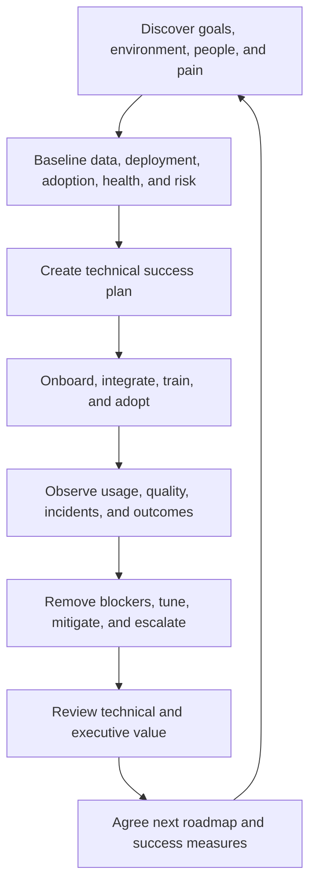

| Operating motion | Beginner definition | Main TSM responsibility | Typical artifact | Completion evidence |
|---|---|---|---|---|
| Discovery | Learn what the customer needs and how the environment works | Ask, map, validate assumptions | Discovery pack and current-state map | Customer confirms goals, scope, stakeholders, and dependencies |
| Onboarding | Establish prerequisites, connections, roles, and initial workflows | Sequence work and remove blockers | Onboarding plan | Agreed sources are healthy and first use case works |
| Adoption | Turn capability into repeated user behavior | Enable workflows and measure use | Adoption plan | Named users complete meaningful tasks repeatedly |
| Health | Assess whether product, data, people, and process can sustain value | Review leading indicators and risk | Health scorecard | Risks have owners and trends are understood |
| Risk management | Identify conditions that could prevent customer or security outcomes | Record, prioritize, mitigate, escalate | Risk register | Material risk is reduced, accepted, transferred, or monitored |
| Critical escalation | Coordinate urgent recovery and trust | Clarify impact, roles, evidence, cadence | Escalation plan and timeline | Service or workflow stabilizes and prevention actions are owned |
| Training | Build customer capability | Tailor content and validate understanding | Workshop and teach-back | Participants can perform the target workflow |
| Technical review | Inspect architecture, data, usage, and blockers | Lead evidence-rich operational discussion | Monthly technical review | Decisions and actions are accepted |
| Executive review | Connect outcomes, risk, and decisions | Lead concise outcome narrative | QBR or EBR | Sponsor understands value, risk, and requested decisions |
| Renewal collaboration | Demonstrate realized and next value without owning the commercial close | Provide evidence and risk context to Sales | Value summary and roadmap | Customer and account team share an evidence-based future plan |
| Expansion collaboration | Identify a verified unmet outcome that another capability may address | Qualify need and hand off commercial ownership | Use-case brief | Need, fit hypothesis, owner, and next validation are clear |

## Plain-English deep-dive 3 - A success plan is not a support queue

A support queue is like a repair shop list: item, severity, owner, status, resolution. A technical success plan is like a city's transport plan: desired outcomes, current state, milestones, dependencies, risks, measures, and governance.

Both matter. Closing ten cases may be excellent Support performance, yet the customer may still fail if the same integration breaks every month, analysts avoid the workflow, executives distrust the score, or no owner remediates findings. The TSM looks across individual cases for the system-level outcome.

### Strategic account plan versus technical success plan

| Dimension | Strategic account plan | Technical success plan |
|---|---|---|
| Primary purpose | Coordinate the overall customer relationship and growth strategy | Achieve specific technical adoption and outcome milestones |
| Typical owners | Account executive with account team | TSM with customer technical and program owners |
| Inputs | Business strategy, relationships, commercial position, whitespace, risk | Architecture, use cases, data, deployment, adoption, health, security outcomes |
| Time horizon | Often annual with quarterly updates | Immediate onboarding through multi-quarter roadmap |
| Measures | Relationship, retention, expansion, strategic alignment | Time to value, data health, workflow adoption, exposure reduction, operational maturity |
| Sensitive boundary | Commercial strategy should not be presented as technical fact | Technical advice should not imply an unauthorized commercial commitment |
| Shared bridge | Customer outcomes, stakeholder alignment, risks, roadmap, evidence of value | Customer outcomes, stakeholder alignment, risks, roadmap, evidence of value |

### Technical success plan fields

| Field | Question it answers | Example |
|---|---|---|
| Business outcome | Why is the customer investing? | Reduce the backlog of consequential internet-facing exposures |
| Technical use case | What capability will support the outcome? | Correlate scanner, asset, identity, and control context for priority |
| Baseline | Where are we now? | Only 61 percent of critical assets have validated owners |
| Target | What measurable change is expected? | Reach at least 90 percent validated ownership by quarter end |
| Milestone | What intermediate result proves progress? | Complete source reconciliation and owner mapping pilot |
| Owner | Who is accountable? | Director of Vulnerability Management |
| Dependencies | What must be true first? | Service account approval and CMDB data cleanup |
| Risk | What could block value? | Connector credential rotation is not operationalized |
| Validation | How will completion be tested? | Sample 100 records and reconcile with source owners |
| Cadence | When is progress reviewed? | Weekly implementation review; monthly steering review |

### Weekly, monthly, and quarterly cadence

| Cadence | Purpose | Standard agenda | TSM preparation | Output |
|---|---|---|---|---|
| Weekly working session | Move active technical work | Milestones, blockers, connector health, actions, near-term risk | Updated action register, evidence, decisions needed | Accepted actions with owners and dates |
| Weekly account-team sync | Align internal functions | Customer sentiment, support, product, commercial timing, message | Concise account changes and risks | One coordinated customer approach |
| Monthly technical review | Inspect health and outcome trend | Data quality, usage, risk backlog, cases, changes, roadmap | Trend analysis and exception list | Technical decisions and risk updates |
| Monthly steering review | Resolve cross-team dependencies | Outcome progress, resource conflicts, unresolved ownership | Decision brief with options | Sponsor decisions and escalations |
| Quarterly business review | Prove value and reset priorities | Outcomes, trend, lessons, risks, roadmap, asks | Executive story and validated metrics | Agreed next-quarter plan |
| Event-driven escalation | Restore critical outcome | Impact, workstreams, evidence, updates, decisions | Timeline and role assignment | Stable response and follow-up plan |

### Stakeholder map

| Stakeholder | What they care about | What the TSM asks | What the TSM gives |
|---|---|---|---|
| CISO | Material risk, resilience, confidence, board narrative | Which risks and decisions matter most this quarter? | Outcome trend, uncertainty, options, decision requests |
| CIO | Operational reliability, transformation, cost, user impact | Which technology dependencies or changes constrain the plan? | Cross-domain roadmap and operational impact |
| SOC leader | Detection quality, workload, response speed, containment | Where does context or workflow friction delay analysts? | Adoption plan, escalation route, feedback loop |
| Vulnerability leader | Prioritization trust, owner action, aging, exceptions | Which backlog is least actionable and why? | Scoring review, workflow plan, outcome measures |
| Security architect | Design integrity, trust boundaries, integration | Which assumptions and controls must be validated? | Architecture evidence and tradeoff record |
| Tool or platform admin | Configuration, reliability, workload | What fails, how often, and what evidence exists? | Runbook, prioritized fixes, specialist access |
| Asset or application owner | Change risk, business uptime, feasible remediation | What constraints affect remediation timing? | Context, rationale, options, validation criteria |
| Risk and compliance leader | Governance, accepted risk, evidence, auditability | Which decisions require formal acceptance? | Risk record, evidence lineage, owner and due date |
| Procurement or commercial lead | Contract, scope, renewal process | What evidence and timelines affect commercial review? | Verified adoption and outcome summary through account team |
| Executive sponsor | Strategic outcome and organizational unblock | What decision or sponsorship is needed? | Concise progress, risk, and ask |

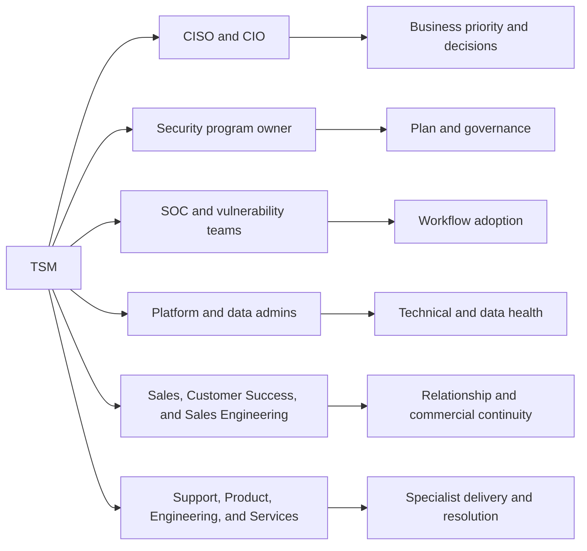

### Example RACI for Data Fabric onboarding and vulnerability workflow

| Activity | TSM | Customer security owner | Customer data or tool admin | Zscaler Support or specialist | Sales account owner | Executive sponsor |
|---|---|---|---|---|---|---|
| Confirm business outcomes | Responsible | Accountable | Consulted | Informed | Consulted | Consulted |
| Approve source access | Consulted | Accountable | Responsible | Consulted | Informed | Informed |
| Configure source connection | Consulted | Accountable | Responsible | Consulted | Informed | Informed |
| Validate counts and mapping | Responsible | Accountable | Responsible | Consulted | Informed | Informed |
| Define prioritization factors | Responsible | Accountable | Consulted | Consulted | Informed | Consulted |
| Define remediation workflow | Responsible | Accountable | Responsible | Consulted | Informed | Informed |
| Resolve product defect | Consulted | Informed | Consulted | Accountable and Responsible | Informed | Informed |
| Approve accepted risk | Informed | Responsible | Consulted | Informed | Informed | Accountable |
| Present executive outcome | Responsible | Responsible | Consulted | Informed | Consulted | Accountable audience |

RACI is context dependent. "Support" is not automatically accountable for a customer credential. The customer is not accountable for fixing a verified product defect. The TSM maintains clarity but does not rewrite contractual ownership.

### First 30/60/90 days in role

This 30/60/90 roadmap moves from learning, to supervised contribution, to independently owned outcomes without pretending that product depth appears overnight.

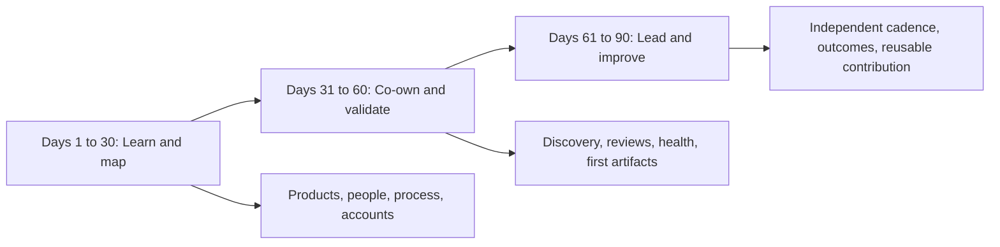

| Period | Learning focus | Customer contribution | Internal contribution | Evidence of progress | Guardrail |
|---|---|---|---|---|---|
| Days 1-30 | Product architecture, SecOps vocabulary, role boundaries, account history, support process | Shadow discovery and reviews; document environment and open risks | Build stakeholder map; meet Sales, Support, Product, Engineering, and specialists | Explain core platform story; produce reviewed account brief | Do not give unsupported product advice to appear fast |
| Days 31-60 | Data Fabric and UVM workflows, health indicators, escalation path | Co-lead technical review; validate one source-to-outcome chain | Create draft success plan and risk register; reverse-shadow a customer discussion | Customer and mentor accept the plan and evidence quality | Escalate gaps early; label assumptions |
| Days 61-90 | Prioritization, executive narrative, adoption and value | Lead recurring cadence; remove one material blocker; deliver training | Contribute a reusable playbook or quality improvement | Measurable customer progress plus manager and peer feedback | Avoid claiming complete mastery after one quarter |

### Outcome measurement

**Customer health** is the evidence-based view of whether product operation, data quality, adoption, stakeholder alignment, support experience, and realized outcomes are strong enough to sustain long-term success.

| Outcome level | Weak metric | Stronger metric | Why stronger |
|---|---|---|---|
| Activity | Number of meetings | Decisions accepted and actions completed | Measures movement, not calendar use |
| Deployment | Connector configured | Connector data fresh, complete, reconciled, and used | Configuration alone does not create value |
| Adoption | Users licensed | Named roles complete target workflows repeatedly | Measures behavior rather than entitlement |
| Vulnerability | Number of findings closed | Consequential exposure reduced with validated closure | Avoids rewarding low-risk bulk closure |
| Escalation | Number of updates sent | Impact stabilized, evidence accepted, recurrence actions owned | Communication supports recovery; it is not recovery |
| Executive value | Slides delivered | Sponsor understands trend and makes a needed decision | A review succeeds when it changes informed action |
| Renewal support | Positive relationship | Verified outcomes and a credible next-value roadmap | Trust needs evidence and future relevance |

## Complete fictional enterprise account story

> **Fiction notice:** Everything about the customer, people, environment, metrics, incidents, product use, and outcomes below is invented for study. **Northstar Meridian Holdings does not represent a real company or customer. You did not perform this engagement in production.** Product workflows are illustrative and must be verified against current licensing and documentation.

### Fictional customer profile

Northstar Meridian Holdings, abbreviated here as **NMH**, is a fictional global manufacturer and logistics operator. It has grown through acquisitions, which explains its fragmented tools, duplicate records, and unclear ownership.

| Attribute | Fictional detail |
|---|---|
| Organization | Northstar Meridian Holdings, a fictional company |
| Size | 42,000 employees and contractors in 26 countries |
| Business | Industrial manufacturing, warehouse automation, and logistics |
| Critical services | Plant scheduling, supplier portal, fleet dispatch, finance, Microsoft 365 collaboration |
| Security goal | Reduce the realistic path from exposed assets and compromised identities to production disruption and data loss |
| Program goal | Move from scanner-volume reporting to contextual, owner-driven exposure reduction |
| Executive concern | The board sees rising vulnerability counts but cannot tell whether business risk is improving |
| Operational concern | Teams spend time reconciling tools and debating ownership instead of fixing exposure |

### Fictional stakeholders

| Person | Fictional role | Goal | Concern | TSM approach |
|---|---|---|---|---|
| Maya Chen | CISO and executive sponsor | Defensible risk reduction and board narrative | Scores may hide data gaps | Explain drivers, assumptions, trend, and decisions |
| Luis Romero | CIO | Keep plants and logistics running | Security changes may interrupt operations | Stage changes and show operational tradeoffs |
| Priya Nair | Director of Vulnerability Management | Prioritize the backlog and improve ownership | Teams distrust another score | Co-design factors and validate examples |
| Jonah Reed | SOC Director | Improve context and response speed | Analysts already have too many consoles | Integrate with current workflows and measure analyst use |
| Elena Petrova | CMDB Product Owner | Improve record quality | Security may treat CMDB as perfect truth | Establish source authority by field and preserve provenance |
| Sam Okafor | Cloud Security Lead | Find ephemeral cloud exposures | Daily asset churn breaks static inventories | Agree freshness and lifecycle rules |
| Grace Park | Plant Technology Lead | Protect production uptime | Patching may require maintenance windows | Use compensating controls and risk acceptance when needed |
| Daniel Brooks | Procurement Partner | Prepare renewal evidence | Technical value is difficult to compare | Provide validated outcome summary through the account team |

### Fictional environment and tool stack

The case assumes the following sources are technically available for the exercise. It does not assert that every named integration is currently packaged or licensed. A real TSM would check the current Zscaler integration catalog and product documentation.

| Domain | Fictional tool or source | Useful data | Known problem |
|---|---|---|---|
| Identity | Microsoft Entra ID | Users, groups, roles, sign-in context | Contractor identities lack consistent department codes |
| Endpoint | Microsoft Defender for Endpoint and a retained acquisition tool | Device inventory, protection state, detections | Same device appears under old and new names |
| Vulnerability | Qualys and Rapid7 from different business units | Findings, severity, scan time, evidence | Duplicate findings and inconsistent asset identifiers |
| Cloud | Microsoft Azure and Amazon Web Services inventory | Instances, tags, accounts, exposure | Ephemeral assets disappear before weekly reports |
| CMDB | ServiceNow CMDB | Owners, business services, lifecycle | Owner coverage is incomplete and retired assets remain active |
| Security events | Splunk SIEM | Alerts and investigation references | Event context does not reliably link to business criticality |
| Ticketing | ServiceNow workflows | Assignment, SLA, status, closure | Tickets close without evidence that exposure disappeared |
| Zscaler | Fictional deployed Zero Trust Exchange capabilities | Traffic, identity, policy, and risk context | Data is not yet used consistently by exposure teams |
| Business context | Finance and operations reference table | Service criticality and downtime tier | Business service names do not match CMDB names |

### Fictional customer architecture

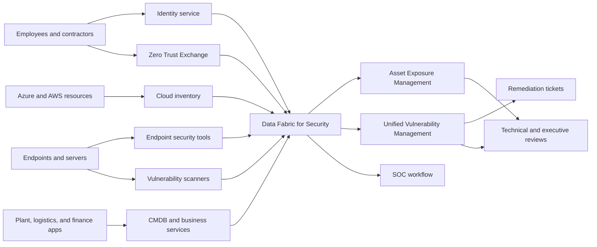

### Initial data-quality and exposure problems

| Problem | Fictional evidence | Why it matters | Initial action |
|---|---|---|---|
| Duplicate assets | 17 percent of sampled endpoint records appear duplicated | Findings and owners can be counted twice | Define match rules and inspect false merges |
| Missing ownership | Only 61 percent of Tier 1 assets have a validated owner | High-risk work may have no accountable team | Map business service and owner sources |
| Stale CMDB | 14 percent of sampled active records have not checked in for 90 days | Risk denominator and workflow routing are distorted | Agree lifecycle and retirement rules |
| Scanner disagreement | One scanner reports 28 percent more servers than the other | Coverage is unknown; absence may look like safety | Reconcile scope, credentials, and identifiers |
| Missing endpoint control | 1,860 assets appear without current EDR coverage | Compromise may not be detected or contained quickly | Validate asset status and deployment exception |
| Exposed cloud services | 73 internet-reachable services lack a confirmed business owner | Attack surface exists without accountable review | Identify account and service owners; restrict where feasible |
| Vulnerability overload | 286,000 open findings, including 18,400 labeled critical by at least one source | Teams cannot patch everything and distrust ranking | Build contextual prioritization with explicit factors |
| Ticket closure mismatch | 22 percent of sampled closed tickets still have an open source finding | Closure may be administrative rather than effective | Reconcile tickets with rescans or control evidence |

### Initial fictional risk statement

NMH cannot reliably identify and prioritize its most consequential exposures because asset records, ownership, vulnerability findings, control coverage, and business criticality are fragmented and inconsistent. This increases the chance that an internet-reachable, business-critical asset with exploitable vulnerabilities and weak controls remains untreated while teams spend effort on lower-impact findings.

Notice the structure: **condition, consequence, and why current controls are insufficient.** It does not claim that a breach will occur or that a score proves exact loss.

### Data Fabric onboarding story

The TSM does not begin by connecting every source. The team selects a bounded first use case: internet-reachable Tier 1 applications in two regions. This allows rapid learning, quality validation, and a demonstrable outcome.

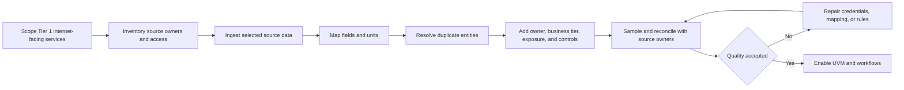

| Phase | Fictional activities | Acceptance test | Owner | TSM value |
|---|---|---|---|---|
| Scope | Choose two regions and Tier 1 internet-facing services | Scope list confirmed by security and operations | Vulnerability Director | Prevent an endless integration project |
| Source readiness | Confirm source owner, access, fields, cadence, volume | Credential and permissions test succeeds | Tool admins | Expose dependencies before launch |
| Ingest | Connect identity, scanners, endpoint, cloud, CMDB, business data | Expected records arrive within agreed freshness | Data admins | Coordinate and track health |
| Map | Align host, account, owner, service, control, and vulnerability fields | Sample values match source meaning | Data and security owners | Prevent false equivalence |
| Resolve | Tune entity matching and survivorship | False merge and false split samples are within accepted threshold | Asset program owner | Make risk denominator trustworthy |
| Enrich | Add business tier, internet exposure, identity privilege, control state | Priority records show explainable context | Program owner | Connect technical finding to consequence |
| Operationalize | Define score, workflow, tickets, and review | Test item reaches correct owner and reconciles after validation | Vulnerability Director | Convert data into repeatable action |

### Fictional UVM prioritization

The exercise uses an **illustrative**, customer-defined 0 to 100 priority index. It is not presented as Zscaler's production formula or scale. The purpose is to practice explainability.

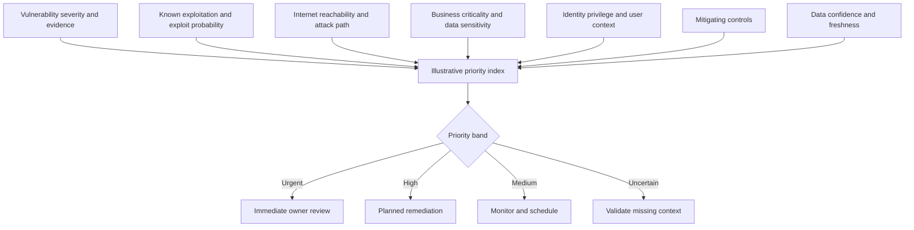

| Illustrative factor | Why included | Example effect | Caveat |
|---|---|---|---|
| Technical severity | Indicates intrinsic technical impact | Higher severity can increase priority | Severity alone is not business risk |
| Known exploitation | Shows observed attacker use | Raises urgency materially | Verify source and date |
| Exploit probability | Estimates likely exploitation | Helps distinguish similar findings | Probability is not certainty |
| Internet reachability | Indicates attacker access opportunity | Raises priority for exposed services | A firewall label must be validated against actual path |
| Business criticality | Connects asset to operational consequence | Raises priority for plant scheduling or finance | Criticality data may be stale or politically inflated |
| Identity privilege | Shows whether compromise may gain powerful access | Raises priority when linked to privileged identity | Identity-to-asset relationship confidence matters |
| Mitigating control | Reduces realistic exposure when effective | May lower priority when prevention and detection are validated | Installed does not mean healthy or effective |
| Data confidence | Indicates trust in the inputs | Low confidence routes to validation | Do not reward missing data with a low score |

The first test compares known examples. Priya expects an internet-facing Tier 1 server with known exploitation and no current endpoint control to rank above an isolated lab server with the same CVE. If the model does not do that, the team examines mapping, factor logic, and weights before scaling.

### Workflow and adoption barriers

| Barrier | Symptom | Root issue to test | TSM response | Success measure |
|---|---|---|---|---|
| Score distrust | Teams export to spreadsheets and ignore product priority | Factors are not understood or examples conflict with expertise | Run calibration workshop with traceable examples | Stakeholders agree priority bands and exceptions |
| Ownership gaps | Tickets bounce among teams | CMDB owner is stale or service ownership is unclear | Establish ownership fallback and escalation | At least 90 percent Tier 1 records have validated owner |
| Console fatigue | SOC and vulnerability teams avoid another interface | Workflow is separate from daily ticketing and SIEM process | Integrate target actions into existing workflow where supported | Weekly active use and completed workflows rise |
| Closure mismatch | Tickets close but findings remain | Ticket state is not reconciled with source evidence | Require rescan or accepted control evidence | Reopen and mismatch rate falls |
| Plant constraints | Critical patches miss SLA | Maintenance windows and safety constraints are absent from model | Add operational context and compensating-control path | Exceptions are approved, time-bound, and validated |
| Training mismatch | Admins attend but operators cannot use the workflow | Training is feature-based rather than role-based | Deliver scenario-based sessions and teach-back | Users complete target workflow independently |

### The critical fictional escalation

At 09:10 on a Tuesday, the vulnerability team reports that a cloud inventory connector has not delivered current data for 36 hours after a credential rotation. At the same time, a widely discussed vulnerability emergency affects an internet-facing software component. The executive dashboard shows a sudden improvement because many cloud assets disappeared from the denominator. The improvement is false and dangerous.

The TSM treats this as both a technical health incident and a decision-integrity incident. The team does not celebrate the lower score and does not assume the connector is the only problem.

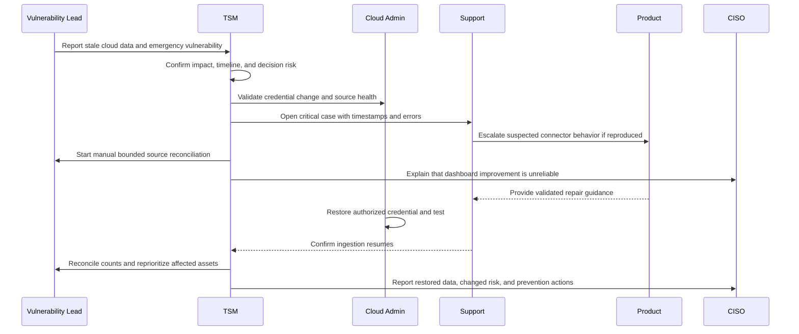

| Workstream | Owner | Immediate question | Evidence | Exit condition |
|---|---|---|---|---|
| Customer impact | TSM with Vulnerability Lead | Which decisions and assets may be wrong? | Missing periods, affected scope, dashboard change | Impact and temporary guardrail are agreed |
| Source access | Cloud Admin | Did rotation invalidate credentials or permissions? | Authentication logs, secret version, API response | Authorized connection test succeeds |
| Product behavior | Support with Product if needed | Is failure expected, misconfigured, or defective? | Connector errors, timestamps, reproduction | Supported repair or defect path is accepted |
| Emergency exposure | Vulnerability Lead | Which potentially affected assets exist despite stale fabric data? | Direct cloud inventory, scanner evidence, reachability | Bounded priority list has owners and actions |
| Executive communication | TSM | What is known, unknown, and required now? | Timeline, confidence, business effect | Sponsor can make decisions without false confidence |
| Prevention | Joint owners | Why was rotation not tested and monitored? | Runbook, alerting, responsibility | Rotation test, alert, fallback, and owner are implemented |

The TSM avoids an estimated repair time until the responsible technical owner has enough evidence. Updates contain current impact, work completed, current hypothesis, next action, owner, next update time, and decision requests.

### Technical training intervention

After recovery, the TSM runs three role-based sessions:

| Audience | Learning objective | Exercise | Teach-back test | Follow-up measure |
|---|---|---|---|---|
| Tool and data admins | Detect, diagnose, and recover stale ingestion | Trace a credential-expiry scenario | Explain health evidence and safe recovery | Connector freshness and alert response |
| Vulnerability analysts | Explain and challenge priority constructively | Compare four exposure examples | Identify factors, missing evidence, and next action | Reduced spreadsheet bypass and better exception quality |
| Executives and program leaders | Interpret score, trend, uncertainty, and decisions | Review the false-improvement incident | State what the score can and cannot prove | Better decision clarity in the next EBR |

### Fictional executive review

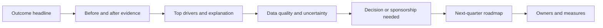

Maya, the fictional CISO, challenges the reported risk improvement. The TSM does not defend the platform reflexively. The TSM explains that the previous apparent improvement during the connector outage was invalid, identifies the guardrail now added, and separates data-quality improvement from exposure reduction.

| Fictional outcome | Baseline | Quarter-end result | Interpretation | Caveat |
|---|---:|---:|---|---|
| Tier 1 asset owner coverage | 61 percent | 91 percent | More consequential work reaches an accountable team | Owner validity sampled; not every asset is Tier 1 |
| Duplicate rate in sampled asset records | 17 percent | 3 percent | Denominator and workflow routing are more trustworthy | Sample-based result, not a guarantee of zero duplicate records |
| Sources meeting agreed freshness | 73 percent | 97 percent | Decisions rely on more current data | One low-volume source remains outside target |
| Critical exposure backlog in defined pilot scope | 2,480 | 840 | Focused remediation reduced the scoped backlog | Count is affected by validation, merges, and scope; trend needs explanation |
| Median age of scoped critical exposure | 74 days | 39 days | Older consequential work is moving faster | Median can hide a long tail |
| SLA compliance for scoped urgent and high work | 43 percent | 79 percent | Ownership and workflow improved | Approved exceptions are reported separately |
| Closed-ticket mismatch in sample | 22 percent | 6 percent | Closure better reflects verified source state | Sample and rescan timing affect the measure |
| Weekly active operational users | 9 | 38 | More analysts and owners use the target workflow | Login count alone is insufficient; workflow completion is also reviewed |

These are fictional exercise metrics, not Zscaler claims or promised outcomes.

### Unresolved fictional risks

| Risk | Why unresolved | Current treatment | Owner | Next evidence |
|---|---|---|---|---|
| Operational technology patch constraints | Plant windows remain limited | Compensating controls and time-bound acceptance | Plant Technology Lead | Control effectiveness review |
| Contractor identity quality | Department and manager data are inconsistent | Identity cleanup and fallback routing | IAM owner | Sample reconciliation |
| Acquisition endpoint overlap | Two endpoint tools remain during migration | Preserve provenance and tune resolution | Endpoint owner | Migration milestone and duplicate trend |
| Cloud credential rotation | Recovery works but automation is incomplete | Rotation runbook, pre-expiry alert, test | Cloud Admin | Successful controlled rotation |
| Score calibration for data sensitivity | Classification coverage is incomplete | Avoid unsupported weight until quality improves | Data Security owner | Coverage and accuracy baseline |
| Long-tail vulnerability exceptions | Some exceptions lack expiry and validation | Governance cleanup | Risk owner | Exception aging and approval report |

### Next-quarter fictional roadmap

| Priority | Outcome | Work | Measure | Decision needed |
|---|---|---|---|---|
| 1 | Sustain trusted data | Automate credential health checks and source reconciliation | 98 percent freshness; tested rotation | Fund integration operations time |
| 2 | Expand ownership | Extend validated owner mapping beyond Tier 1 pilot | At least 85 percent validated ownership in new scope | Assign business-service stewards |
| 3 | Improve remediation quality | Add closure validation and exception expiry | Mismatch below 5 percent; no expired unreviewed exception | Approve governance policy |
| 4 | Connect exposure and response | Feed incident lessons into priority and control review | Two validated feedback-loop improvements | SOC and vulnerability shared cadence |
| 5 | Prepare executive risk narrative | Separate data confidence, control progress, and exposure trend | EBR accepted with explicit decisions | Agree board-level definitions |

### Continuous feedback loop

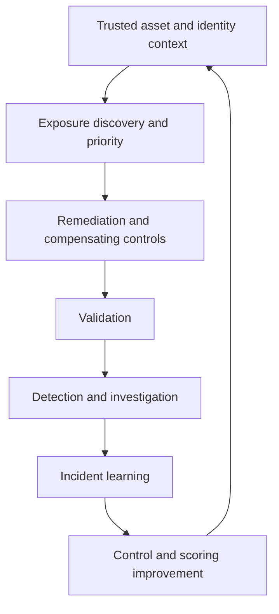

## Scenario drills and decision trees

Each drill uses the same response frame:

1. Confirm the desired outcome and business impact.
2. Separate facts, assumptions, and unknowns.
3. Identify the decision owner.
4. Choose the smallest useful next test or action.
5. Communicate evidence, risk, owner, and next update.
6. Validate the outcome and record learning.

### Drill 1 - An executive challenges the score

Maya says, "Why should I trust this score when it changed after a connector failed?"

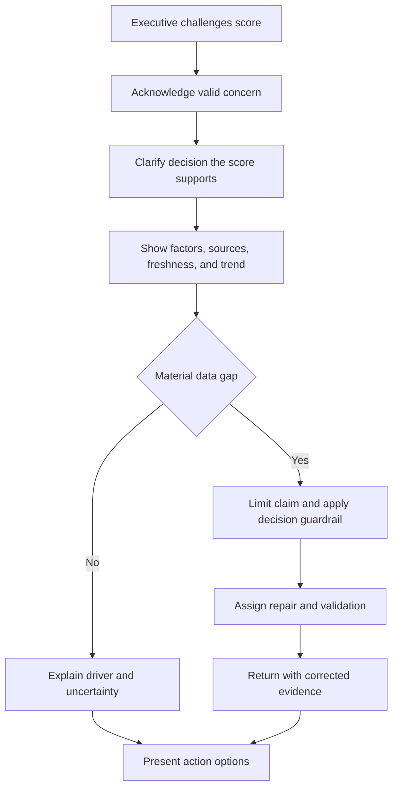

Good response: "Your concern is valid. During the outage, the apparent improvement was not trustworthy because affected cloud assets dropped from the data set. We have restored ingestion and reconciled counts against the source. Here are the factors driving the corrected trend, the remaining uncertainty, and the decision I recommend. We have also added a freshness guardrail so a stale source cannot be presented as risk improvement."

Failure mode: defending the score as proprietary truth or overwhelming the executive with raw formulas.

### Drill 2 - A connector is broken

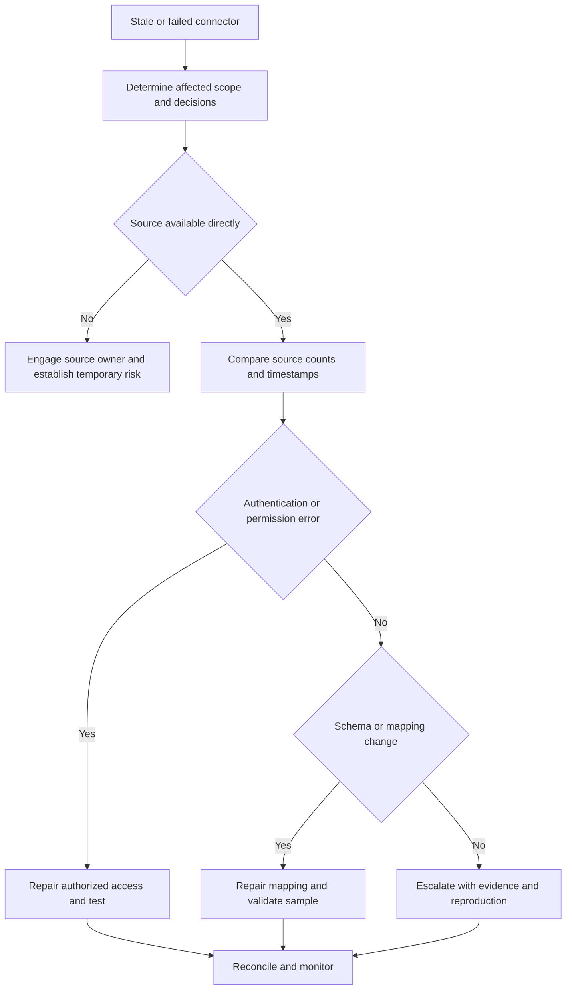

The TSM does not immediately blame the product. Check source health, authentication, authorization, rate limits, schema changes, schedule, network path, time range, error handling, and recent change. Preserve timestamps and identifiers. If escalation is required, provide expected versus actual behavior, scope, business impact, first failure time, last known good time, reproduction, sanitized evidence, and attempted tests.

### Drill 3 - Product and Sales disagree

Sales wants to tell the customer that a requested workflow will be available next quarter. Product says the request is under evaluation and is not committed.

| Step | TSM action | Reason |
|---|---|---|
| 1 | Pause the unapproved promise | Trust is harder to repair than a delayed answer |
| 2 | Confirm the exact customer outcome behind the feature request | A different supported path may solve the need |
| 3 | Ask Product for the approved external position | Product owns roadmap commitment |
| 4 | Give Sales the impact evidence and approved wording | Sales needs customer context without inventing certainty |
| 5 | Present current options, limitations, and next checkpoint | The customer can make an informed decision |
| 6 | Record decision and owner | Prevent conflicting follow-up messages |

Ready phrase: "I agree the customer need is important. We should not represent an evaluation as a commitment. Let us separate the desired outcome from the requested implementation, confirm supported alternatives, and use Product's approved roadmap language."

### Drill 4 - Adoption is low

Only nine analysts use the new workflow weekly. Do not assume resistance.

| Hypothesis | Discriminating check | Possible intervention | Measure |
|---|---|---|---|
| Users do not understand the value | Interview analysts and observe current process | Role-based scenario and before-after workflow | Target workflow completion |
| Data is not trusted | Compare examples and source lineage | Calibration and quality repair | Reduction in manual bypass |
| Workflow adds steps | Time current and proposed path | Integrate or simplify where supported | Analyst effort per completed case |
| Ownership is missing | Inspect bounced tickets | Owner mapping and escalation fallback | First-assignment acceptance |
| Training was generic | Run teach-back | Hands-on role-specific session | Independent completion rate |
| Metric is misleading | Separate logins from meaningful use | Define event-based adoption measure | Repeated value-producing behavior |

### Drill 5 - A vulnerability emergency

A new highly publicized CVE appears. Executives ask whether NMH is affected.

The response sequence is: define affected product and versions; identify authoritative advisory data; find potentially affected assets across current sources; check reachability, use, identity, data, and controls; prioritize uncertain records for validation; coordinate containment or remediation; communicate known, unknown, and next update; verify completion. A press headline is not proof of exposure, and the absence of a scanner result is not proof of safety.

| Time horizon | TSM focus | Customer output |
|---|---|---|
| First 30 minutes | Scope impact, owners, sources, communication cadence | Initial situation statement and workstreams |
| First few hours | Reconcile inventory, prioritize likely consequential exposure, coordinate safe action | Bounded affected or potentially affected list |
| Recovery period | Track remediation, compensating controls, exceptions, and validation | Owner-based action and status report |
| After action | Improve source, scoring, detection, runbook, and governance | RCA and feedback-loop actions |

### Drill 6 - Ownership is unclear

A critical server belongs to a retired project name. The CMDB owner left the company. Cloud says it is an application issue; the application team says it is infrastructure.

Do not let the ticket bounce indefinitely. Identify the current cloud account or subscription owner, business service dependency, cost center, deployment pipeline, identity permissions, and last change author. Assign a temporary accountable incident or risk owner through the agreed governance path while permanent ownership is resolved. Escalate to the sponsor when business risk exceeds the authority of operational teams.

Ready phrase: "The permanent owner is unclear, but the risk still exists. We need a temporary accountable owner authorized to coordinate containment today, while the service and CMDB owners resolve permanent assignment by a defined date."

### Scenario response quick reference

| Scenario | First principle | Never do | Strong artifact |
|---|---|---|---|
| Executive disputes score | Explain model, source, uncertainty, and decision | Defend a score as unquestionable truth | Score driver and confidence brief |
| Broken connector | Protect decision integrity before repair | Treat missing assets as risk reduction | Impact map and reconciliation log |
| Product and Sales disagree | Use approved commitments and customer outcome | Promise roadmap to reduce tension | Decision record and approved message |
| Low adoption | Diagnose behavior and workflow | Blame users or count logins only | Adoption hypothesis matrix |
| Vulnerability emergency | Scope and prioritize with current evidence | Equate headline severity with confirmed exposure | Affected-scope and action register |
| Unclear ownership | Establish temporary accountability | Allow endless ticket reassignment | RACI exception and sponsor escalation |

## Your factual support-to-TSM bridge

The bridge is strongest when it preserves what you have actually done and changes the outcome language. Support asks, "How do we resolve this incident?" Technical success adds, "How do we prevent recurrence, increase adoption, reduce account risk, and prove durable value?"

### Factual experience inventory and claim level

| Experience | Claim level | What is supported | TSM relevance | Limit not to cross |
|---|---|---|---|---|
| enterprise Support Escalation Engineering | Production | Complex enterprise customer issue ownership and escalation engineering | Technical credibility, evidence, customer continuity | Do not rename it cybersecurity TSM experience |
| SharePoint Online, OneDrive, Sync, and Copilot | Production | Microsoft 365 workload and client or service troubleshooting | SaaS, identity, permissions, endpoint, browser, network, and data thinking | Do not claim Zscaler product administration |
| Business-critical escalations and critical situations | Production | High-pressure impact handling and cross-functional coordination | Critical escalation leadership and executive updates | Do not claim formal incident response command unless evidenced |
| Networking upskilling | Learning with practical trace use | TCP/IP, OSI, HTTP/HTTPS, TLS/SSL, DNS/DHCP, proxies, firewalls, routing | Zero trust traffic-flow learning and fault isolation | Do not present study as years of network engineering |
| Wireshark, Netsh, Network Monitor, Procmon, HAR, Fiddler, browser tools | Production or practical support use as represented in master | Evidence gathering and layer isolation | Connector, client, network, and integration troubleshooting method | Do not claim use of Zscaler-specific telemetry yet |
| a strong customer-satisfaction record | Production metric | Strong customer satisfaction in documented segments | Customer obsession and expectation management | Preserve segment and scale context; do not change denominators |
| repeated peer and customer recognition | Production recognition | Repeated recognition for contribution and service | Trust, collaboration, mentoring, and delivery | Recognition is supporting evidence, not a substitute for an outcome story |
| SQL, Power BI, and analytics | Production or demonstrated skill as represented in master | Data analysis, reporting, statistics, and business analytics | Data Fabric reasoning, KPI integrity, executive reporting | Do not claim security-data production use without evidence |
| Mentoring and training | Production | Mentoring, onboarding, interviews, partner training, knowledge articles | Enablement, service scaling, customer capability | Keep examples factual and role-specific |
| Technical advisor | Production | Technical guidance and quality leadership | Consulting posture and peer development | Do not imply a Zscaler or CISO advisory title |
| AI and Copilot Studio agents | Production or demonstrated internal work as represented in master | Agent creation, tool evaluation, certification, and training | Responsible AI exploration and workflow design | Do not claim autonomous security response deployment |
| Data Fabric, UVM, AEM, Risk360, CTEM, Agentic SecOps | Conceptual or not-yet-used | Current official study and future lab plan | Target product ramp | State directly that production use is not established |

### Transfer map

| Your strength | Existing evidence | SecOps TSM translation | New proof to build |
|---|---|---|---|
| Escalation ownership | critical situation, business impact, evidence, Engineering coordination | Lead critical account escalation with reliable cadence | Fictional connector escalation package and later lab |
| Layered troubleshooting | Microsoft 365, sync, browser, process, network traces | Analyze integration and product health across layers | Zscaler architecture whiteboard and source-health lab |
| Customer trust | a strong customer-satisfaction record; repeated peer and customer recognition | Set expectations, communicate bad news, close loops | Executive score-challenge practice |
| Analytics | SQL, Power BI, Business Analytics | Reconcile security sources and explain outcome measures | Synthetic asset and vulnerability model |
| Advisory communication | Technical advisor and customer guidance | Translate product and risk into customer decisions | Technical success plan and EBR |
| Enablement | Mentoring, onboarding, partner and AI training | Drive adoption with role-based workshops | Teach-back session for fictional analysts |
| AI initiative | Copilot Studio agents and tool evaluation | Explore agentic workflows with validation and governance | Evidence-grounded SecOps workflow design |

### Interview-proof map

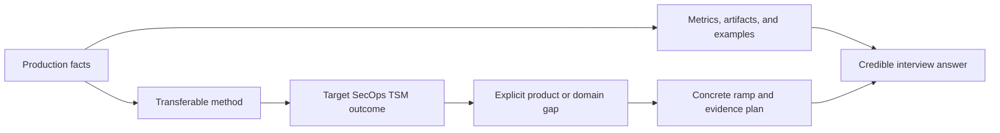

The ideal answer structure is:

1. **Fact:** what you actually did.
2. **Method:** the reusable reasoning or behavior.
3. **Transfer:** how that method applies to the target role.
4. **Gap:** what is genuinely new.
5. **Ramp:** how you will build and prove the missing depth.

Example: "In enterprise Support Escalation Engineering, I owned business-critical Microsoft 365 investigations, built evidence across client, network, and service layers, coordinated with Engineering, and maintained customer communication. That method transfers directly to SecOps technical success when a connector, workflow, or product issue threatens an account outcome. The new area for me is direct Zscaler Data Fabric and UVM operation, so I would pair official product learning with sandbox or synthetic-data labs, shadowing, reverse-shadowing, and reviewed customer artifacts before advising independently."

## Ready-to-adapt interview positioning

These are positioning drafts, not scripts to recite mechanically. Replace any wording that does not sound natural, and attach a real example when the interviewer asks for proof.

### 30-second version

"I am a enterprise Support Escalation Engineer with several years of experience owning complex Microsoft 365 customer issues, including business-critical escalations across SharePoint Online, OneDrive, Sync, and Copilot. My strengths are evidence-led troubleshooting, customer communication, cross-functional Engineering work, analytics, and enablement. I am moving toward SecOps Technical Success because I want to apply those strengths proactively to adoption, exposure reduction, and long-term customer outcomes. I am explicit that Zscaler Data Fabric and UVM are ramp areas, not past production claims."

### 90-second version

"My background is in enterprise Support Escalation Engineering, where I have worked across SharePoint Online, OneDrive, Sync, and Copilot scenarios. The work required more than solving a ticket: I had to understand business impact, isolate failures across identity, client, browser, network, and service layers, collect evidence with tools such as network and process traces, coordinate with Engineering and Product Groups, and keep the customer aligned during high-pressure situations including critical situations.

"I also bring an analytics and enablement dimension. I have worked with SQL, Power BI, and business analytics, served as a technical advisor, mentored and onboarded engineers, delivered training, and explored AI through Copilot Studio agents and organization-wide learning. My recorded customer results include a strong customer-satisfaction record, along with repeated peer and customer recognition.

"The move to a SecOps TSM role is a deliberate expansion from reactive resolution into proactive technical success: discovery, data quality, adoption, risk prioritization, executive value, and continuous improvement. I do not claim production Zscaler or vulnerability-program experience. I can explain the architecture and transferable method, and I have a concrete plan to build product evidence through official learning, synthetic labs, shadowing, and reviewed customer-facing artifacts."

### 3-minute version

"The common thread in my career is helping enterprise customers move from a complex technical problem to a trusted, evidence-based outcome. In enterprise Support Escalation Engineering, I have supported SharePoint Online, OneDrive, Sync, and Copilot-related scenarios. These problems often crossed boundaries: a symptom visible in the application might actually involve identity, permissions, endpoint state, browser behavior, DNS, TCP, TLS, proxy handling, or a service-side condition. My role was to scope impact, create and test hypotheses, collect the right traces, coordinate with customers and Engineering, validate fixes, and keep expectations clear during pressure.

"That experience gives me three strong foundations for technical success. First is technical investigation. I am comfortable using evidence from Wireshark, Netsh, Network Monitor, Procmon, HAR, Fiddler, and browser tools, and I have deliberately strengthened networking fundamentals. Second is customer ownership. I have worked on business-critical escalations and critical situations, and my strong customer-satisfaction record. Third is scale through data and people. I use SQL, Power BI, and analytics; I have served as a technical advisor; and I have mentored, onboarded, interviewed, trained partners, written knowledge material, and supported AI learning. I have also built or evaluated Copilot Studio agents, which gives me a responsible starting point for understanding agentic workflows.

"What attracts me to SecOps Technical Success is the opportunity to use those strengths earlier and more strategically. Instead of waiting for a critical issue, the role discovers business goals, validates data and architecture, builds a technical success plan, drives adoption, identifies risk, coordinates mitigations, handles escalations when needed, and demonstrates outcomes to technical and executive stakeholders. Zscaler's current story is especially relevant because the Zero Trust Exchange, Data Fabric for Security, exposure offerings, Unified Vulnerability Management, Risk360, and Agentic SecOps connect telemetry and context to action.

"I am also clear about the gap. My CV does not establish production operation of Zscaler products, a formal vulnerability-management program, a SOC, or enterprise cyber-risk quantification. I would never present this study guide or a fictional case as that experience. My value is a proven enterprise support and advisory method plus a disciplined ramp: official product learning, architecture explanation, synthetic-data labs, shadowing, reverse-shadowing, reviewed success artifacts, and feedback from experienced specialists. I believe that combination of humility, technical rigor, customer ownership, analytics, and learning speed is a credible bridge into the role."

### Why move from Support Escalation Engineering?

"I value the depth and discipline I built in escalation engineering. The move is not an escape from Support; it is an expansion of its strongest skills. I want to work earlier in the customer lifecycle, connect technical health to adoption and risk outcomes, prevent recurring blockers, and maintain a multi-quarter success plan. I still want to be technically hands-on, but with broader accountability for durable value rather than only incident resolution."

### Why Zscaler?

"Zscaler's current platform story connects zero trust telemetry and inline controls with security data, exposure prioritization, risk communication, and Agentic SecOps. That is attractive because it requires the combination I want to deepen: technical architecture, multi-source data reasoning, customer adoption, critical escalation, and executive communication. I am also drawn to the stated emphasis on customer obsession, collaboration, ownership, accountability, execution, and responsible AI exploration. I would validate current product packaging and avoid relying on marketing metrics alone."

### Why this role?

"The role combines three kinds of work I enjoy: solving complex technical problems, helping customers and engineers become more capable, and using evidence to improve long-term outcomes. It also stretches me into cybersecurity risk, vulnerability programs, Data Fabric, UVM, executive reviews, and strategic account leadership. That is a deliberate growth path built on my existing method rather than an unsupported leap."

### Why you?

"I bring tested enterprise customer ownership, escalation discipline, cross-layer troubleshooting, Engineering collaboration, strong customer satisfaction, analytics, mentoring, training, and practical AI initiative. I will not overstate my Zscaler experience. What I can offer immediately is a reliable method for learning complex environments, building evidence, coordinating people under pressure, communicating clearly, and converting repeated problems into durable improvement."

### Gap-handling scripts

| Interview challenge | Ready-to-adapt answer |
|---|---|
| "Do you have production UVM experience?" | "Direct production UVM operation is not part of my current experience, and I would not label conceptual learning as hands-on delivery. I understand the purpose and documented architecture: contextual prioritization using vulnerability, asset, threat, control, identity, and business data, with workflows and reporting. My transferable strengths are data validation, SQL and analytics, evidence-led prioritization, customer communication, and cross-functional execution. My ramp would include official training, a synthetic data lab, shadowing, and reviewed customer artifacts before independent guidance." |
| "You have not run a vulnerability program." | "Correct. I understand the lifecycle conceptually: scope, discover, prioritize, assign, remediate, validate, govern exceptions, report, and improve. I can connect my production strengths in backlog analysis, ownership, escalation, RCA, and outcome measurement, but I would seek domain review and build lab evidence rather than claim a program I have not run." |
| "Support is reactive; this role is strategic." | "That distinction is real. My bridge is to take the same rigor used in critical cases and apply it proactively: discover goals, baseline health, identify recurring risks, create milestones, train users, and measure outcomes. My technical advisor, analytics, mentoring, and training work also shows that my experience is not limited to case resolution." |
| "Have you advised CISOs?" | "My established experience is enterprise technical and escalation communication, not a claim of serving as a CISO advisor. I know the executive structure I must use: outcome, business impact, evidence, uncertainty, options, recommendation, and decision request. I would build credibility through accurate briefs, shadowing, and feedback before assuming executive fluency." |
| "Do you know Agentic SecOps?" | "I understand Zscaler's documented direction and the general concept of AI agents assisting triage, investigation, and response using grounded context and controls. My direct AI experience includes Copilot Studio agents, evaluation, certifications, and training. I have not deployed autonomous security response, so I would emphasize grounding, authorization, human approval, audit, and measurable quality." |
| "Why should we take the ramp risk?" | "Because the ramp is concentrated in product and security-domain depth, while the underlying enterprise behaviors are already proven: complex troubleshooting, high-stakes ownership, customer trust, Engineering coordination, analytics, enablement, and rapid structured learning. I would make the ramp visible through milestones and reviewed artifacts rather than asking you to trust a vague promise." |

## Plain-English deep-dive 4 - Honest gaps can increase trust

An interview is not a quiz where every blank must be hidden. It is closer to a design review. A strong engineer distinguishes what is known, what is inferred, what is untested, and what evidence is needed next.

"I have not used it" is weak only when it ends the answer. A credible gap answer continues:

1. State the gap directly.
2. Explain the concept accurately at the level you know.
3. Connect a genuine transferable method.
4. Describe the validation or ramp plan.
5. Avoid turning the plan into a past-tense claim.

This is the same behavior customers need from a TSM during an incident or score dispute. Transparency is not the absence of confidence. It is confidence disciplined by evidence.

## Plain-English deep-dive 5 - Critical escalation leadership is information design

During an escalation, teams rarely lack activity. They lack a shared picture. One group sees an authentication failure, another sees stale records, an executive sees a misleading dashboard, and a user sees a blocked workflow. The TSM designs a common information structure:

| Information element | Question |
|---|---|
| Impact | Who or what is affected, and what business process is at risk? |
| Scope | Which regions, sources, assets, users, or workflows are included or excluded? |
| Timeline | What changed, when was the last known good state, and when was failure first observed? |
| Facts | What evidence is verified? |
| Hypotheses | What explanations remain possible? |
| Workstreams | Which parallel investigations or mitigations are active? |
| Owners | Who is responsible and accountable for each next step? |
| Decisions | What approval, tradeoff, or escalation is required? |
| Cadence | When is the next update, even if no resolution exists? |
| Exit | What evidence proves stability and completion? |

This is why your critical-situation experience transfers strongly. The new learning is SecOps context and Zscaler product evidence, not the human discipline of keeping a high-pressure investigation coherent.

## Interview proof portfolio for this Part

| Artifact to practice | Purpose | Claim label | Review question |
|---|---|---|---|
| One-page role map | Explain boundaries and handoffs | Conceptual | Can another person identify the correct owner from it? |
| JD mapping | Translate expectations into work and proof | Conceptual | Does every signal have an outcome and evidence plan? |
| Fictional stakeholder and RACI map | Practice account governance | Fictional exercise | Is accountability unambiguous? |
| Fictional technical success plan | Practice outcome planning | Fictional exercise | Are baseline, target, owner, dependency, and validation present? |
| Fictional connector escalation package | Practice critical coordination | Fictional exercise | Could Support reproduce or route the issue? |
| Executive score-challenge brief | Practice transparent risk communication | Fictional exercise | Does it explain source, uncertainty, driver, and decision? |
| You claim matrix | Protect interview honesty | Factual self-audit | Is every statement labeled production, lab, conceptual, or not-yet-used? |
| Positioning recordings | Improve concise communication | Practice | Can you deliver each version naturally and answer follow-ups? |

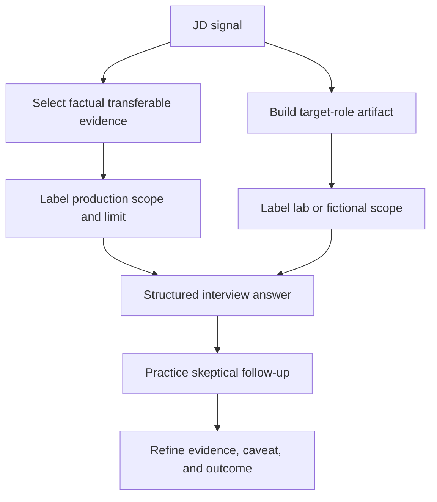

## Official Source Anchors

**Checked on 2026-08-24.** These anchors support current terminology and the documented statements summarized above. They do not replace tenant-specific documentation, release notes, licensing terms, Support guidance, or a live product validation.

| Official Zscaler source | Used for | Verification caveat |
|---|---|---|
| https://www.zscaler.com/products-and-solutions/zero-trust-exchange-zte | Zero Trust Exchange, proxy-brokered one-to-one connections, identity, context, risk, policy, four attack stages | Architecture and portfolio language may evolve |
| https://www.zscaler.com/products-and-solutions/security-operations | Agentic SecOps, proactive and reactive operations, security graph, context, agentic workflows, adaptive response | Agent names, workflows, autonomy, metrics, and packaging may change |
| https://www.zscaler.com/products-and-solutions/data-fabric | Ingest, harmonize, map, deduplicate, correlate, enrich, business logic, workflows, reporting | Connector counts, file formats, development timelines, and application coverage are volatile |
| https://www.zscaler.com/products-and-solutions/vulnerability-management | UVM, multifactor scoring, custom factors and weights, dashboards, remediation workflow | Published outcome metrics are not universal customer guarantees |
| https://www.zscaler.com/products-and-solutions/caasm | Asset Exposure Management, CAASM, golden records, coverage gaps, CMDB health | Integration availability and product behavior require current validation |
| https://www.zscaler.com/products-and-solutions/ctem | CTEM program stages and Zscaler exposure-management positioning | CTEM is a broader industry program, not a single product deployment |
| https://www.zscaler.com/products-and-solutions/zscaler-risk-360 | Risk360, risk drivers, four attack stages, guided mitigation, financial and board reporting | The live page contains differing factor-count statements in different sections; verify current documentation rather than memorizing a number |

### Documented versus general versus fictional summary

| Label | Includes | How to speak about it |
|---|---|---|
| Officially documented | Product positioning and capabilities summarized from the seven dated Zscaler pages | "Zscaler's official page describes..." |
| General industry concept | Zero trust, SOC, SIEM, CAASM, CTEM, CVE, CVSS, EPSS, KEV, RACI | "In general industry use..." |
| Customer-specific requirement | Licensing, configuration, integrations, quality thresholds, factors, workflows, controls | "I would verify this in the customer's environment..." |
| Fictional exercise | NMH people, tools, problems, metrics, score, incident, and outcomes | "In my fictional case exercise..." |
| Verified background fact | Only the Microsoft, customer, escalation, analytics, mentoring, training, technical advisor, and AI facts represented in your documented background | "In my prior production experience..." |

## Likely Interview Questions

### Q1. What does a SecOps Technical Success Manager do?

**Model answer:** A SecOps TSM is a named technical partner who helps an enterprise customer convert security capabilities and data into durable outcomes. The role begins with business and technical discovery, establishes a baseline, builds a technical success plan, drives onboarding and adoption, monitors health and risk, coordinates critical escalations, enables customer teams, and communicates outcomes to technical and executive stakeholders.

The TSM does not personally own every product fix, implementation task, or commercial decision. The TSM owns continuity: the correct specialist is engaged, the handoff contains evidence, roles and decisions are explicit, and the customer can see how work connects to reduced exposure, faster response, stronger control, or another agreed outcome.

### Q2. How is a TSM different from Support, Customer Success, and a TAM?

**Model answer:** Support primarily resolves incidents and product questions through a case process. Customer Success focuses broadly on adoption, value, relationship health, retention, and advocacy. A TAM usually coordinates technical health and support continuity for a named account. A TSM combines deep technical leadership with proactive outcome ownership: architecture, use cases, adoption, risk, success planning, and value evidence.

The boundaries vary by company, so I would confirm the actual operating model. My principle is that boundaries are promises, not walls. I would not say "not my job" and disappear. I would establish the correct owner, make an evidence-rich handoff, maintain the account-level narrative, and avoid promising work or roadmap that belongs to another function.

### Q3. How would you build a technical success plan for a strategic SecOps customer?

**Model answer:** I would begin with discovery: business outcomes, material risks, environment, tools, stakeholders, workflows, constraints, and the reason the customer invested. Then I would baseline deployment, data quality, adoption, operational health, and relevant risk measures. For each priority use case, the plan would record baseline, target, milestone, owner, dependency, risk, validation method, and governance cadence.

I would sequence for early evidence rather than connect everything at once. For example, I might scope a pilot around Tier 1 internet-facing assets, validate source quality and entity resolution, calibrate prioritization against known examples, operationalize assignment and closure validation, train users, and then expand. Weekly sessions move work; monthly reviews inspect health; quarterly reviews prove outcomes and reset priorities.

### Q4. How would you respond when a CISO says the risk score is wrong?

**Model answer:** I would first acknowledge that a score should be challenged. I would ask which decision the score is expected to support, then show its contributing factors, data sources, freshness, scope, trend, assumptions, and uncertainty. I would compare disputed examples with source evidence and domain knowledge. If a material data gap exists, I would limit the claim, apply a decision guardrail, assign repair and validation, and return with corrected evidence.

I would never defend the number as objective truth. A score is a model. Trust comes from explainability, source quality, sensible calibration, governance, and whether the score leads to better decisions. In the fictional NMH case, a connector outage made risk appear to improve because assets disappeared; the correct response was to invalidate that apparent improvement and repair the decision process.

### Q5. How would you lead a critical connector escalation during a vulnerability emergency?

**Model answer:** I would run parallel workstreams. First, clarify customer and decision impact: which assets, sources, reports, and workflows may be wrong. Second, protect urgent security work by reconciling a bounded affected scope directly from authoritative sources. Third, investigate connector health across source availability, credentials, permissions, limits, schema, schedule, network path, and recent changes. Fourth, engage Support with timestamps, expected versus actual behavior, sanitized evidence, reproduction, and business impact. Fifth, establish an update cadence for operational and executive audiences.

I would avoid guessing an ETA or treating missing records as improvement. Recovery requires more than seeing the connector turn green: reconcile counts, verify mapping and freshness, rerun affected priority, confirm downstream workflow, communicate corrected risk, and assign prevention actions such as credential-rotation testing and health alerts.

### Q6. What makes vulnerability prioritization credible?

**Model answer:** Credible prioritization combines technical severity with context such as known exploitation, exploit probability, internet reachability, attack path, asset criticality, identity privilege, data sensitivity, and mitigating controls. It also includes data confidence. Missing context should route to validation, not silently lower risk. The model should be explainable, calibrated against known examples, governed when factors or weights change, and connected to owners and workflows.

I would measure whether consequential exposure is reduced and closure is validated, not merely how many findings disappear. I would also separate CVSS severity from business priority: the same CVE can require different action on an internet-facing production server and an isolated lab system.

### Q7. How does your prior Support Escalation Engineering background transfer to this role?

**Model answer:** My production experience gives me a strong method for complex enterprise ownership. In SharePoint Online, OneDrive, Sync, and Copilot-related work, I have had to scope business impact, isolate failures across client, identity, browser, network, and service layers, collect trace evidence, coordinate with Engineering and Product Groups, validate fixes, and communicate during business-critical situations and critical situations. I also bring strong customer outcomes, with a strong customer-satisfaction record, plus repeated peer and customer recognition.

The proactive bridge comes from my technical advisor, analytics, mentoring, onboarding, training, and AI work. I can apply incident rigor earlier through discovery, health baselines, success plans, adoption, recurring-risk analysis, and outcome reporting. I am explicit that formal SecOps, Zscaler product operation, and vulnerability-program ownership are new depth areas rather than past production claims.

### Q8. Why should Zscaler hire you without direct production UVM or Data Fabric experience?

**Model answer:** The risk is real, so I would not answer with vague confidence. My direct product ramp is required. What I bring immediately is a proven foundation that is difficult to teach quickly: enterprise customer ownership, high-pressure escalation discipline, cross-layer troubleshooting, evidence quality, Engineering collaboration, analytics, clear training, and responsible AI initiative. Those capabilities align with the operating demands of a strategic technical success role.

I would make the ramp measurable: official product learning, architecture whiteboards, synthetic asset and vulnerability labs, shadowing, reverse-shadowing, reviewed discovery and success-plan artifacts, and explicit sign-off before independent high-impact guidance. I would rather be trusted for accurate scope and rapid evidence than sound experienced for five minutes and lose credibility under follow-up.

## 30-Second Memory Hooks

| Concept | Memory hook |
|---|---|
| SecOps | Prevent, detect, investigate, respond, learn |
| SOC versus SecOps | SOC is the watch floor; SecOps is the whole safety program |
| TSM | Technology into durable customer outcomes |
| Boundary | Own the continuity, not every specialist task |
| Success plan | Outcome, baseline, target, owner, dependency, validation |
| Data Fabric | Ingest, map, resolve, enrich, operationalize |
| AEM and CAASM | Know every asset and every coverage gap |
| UVM | Context changes priority |
| CTEM | Scope, discover, prioritize, validate, mobilize, repeat |
| Risk360 | Score, drivers, trend, uncertainty, decision |
| Score challenge | A model is useful only when traceable and actionable |
| Critical escalation | Impact, scope, evidence, owners, cadence, exit |
| Adoption | Meaningful repeated behavior, not licenses or logins |
| Executive review | Outcome, evidence, risk, decision, roadmap |
| Experience bridge | Production fact, transferable method, honest gap, measured ramp |

## Completion Checklist

- [ ] I can define SecOps, SOC, TSM, Customer Success, TAM, Support, Consulting, Professional Services, Sales Engineering, Product Management, and Engineering without jargon.
- [ ] I can explain the role boundary as continuity and handoff ownership rather than "not my job."
- [ ] I can draw the Zero Trust Exchange, Data Fabric, AEM, UVM, CTEM, Risk360, and Agentic SecOps relationship from memory.
- [ ] I can distinguish official Zscaler product statements from general industry concepts and customer-specific assumptions.
- [ ] I can map every approved JD signal to intent, activities, stakeholders, data, decisions, artifacts, KPIs, failure modes, interview proof, and experience transfer.
- [ ] I can create a technical success plan with a baseline, target, owner, dependency, risk, cadence, and validation.
- [ ] I can explain weekly, monthly, quarterly, and escalation cadences.
- [ ] I can walk through the fictional NMH account while clearly labeling every detail fictional.
- [ ] I can handle the score challenge, connector failure, Product and Sales disagreement, low adoption, vulnerability emergency, and unclear ownership drills.
- [ ] I can state which your experiences are production, lab, conceptual, and not-yet-used.
- [ ] I can deliver the 30-second, 90-second, and 3-minute positioning versions naturally.
- [ ] I can answer all eight interview questions aloud without reading, then handle one skeptical follow-up for each.
- [ ] I have checked the official source anchors again if preparing after 2026-08-24.
- [ ] I have not converted fictional, lab, or conceptual work into a production claim.

[Part 2 - Zscaler Mission, AI-Forward Strategy, Culture, and Interview Signals](Part-02-zscaler-mission-ai-culture.md)