# Part 2 - Zscaler Mission, AI-Forward Strategy, Culture, and Interview Signals

> **Audience:** Arti Thakur, preparing to move from Microsoft enterprise Support Escalation Engineering into a Zscaler Security Operations Technical Success Manager role.
>
> **Currency date:** 2026-08-24.
>
> **Honesty rule:** This chapter separates official Zscaler statements, reasonable interpretation, general industry knowledge, fictional practice, and Arti's factual experience. Direct production operation of Zscaler, Security Operations, vulnerability-management, or exposure-management products is not established.
>
> **Product caveat:** Product names, portfolios, packaging, interfaces, metrics, and culture wording can change. Confirm current official pages, the active job description, customer licensing, and tenant behavior before relying on any detail.

## Section goal

This chapter explains why Zscaler exists, how its zero trust and artificial intelligence direction connects to customer outcomes, and what its published culture language may mean in daily work. The goal is not to memorize slogans. The goal is to turn every statement into a testable behavior: what Arti would do, what evidence she would show, what failure pattern she would avoid, and what business result would matter.

Think of company research as studying a map before leading an expedition. A slogan names the destination. Product pages describe available vehicles. Culture pages describe how the crew says it will work. The job description says which seat Arti is interviewing for. None of those sources proves how every real journey unfolds. A strong candidate compares them, labels uncertainty, asks informed questions, and never invents experience.

By the end of Part 2, Arti should be able to:

| Learning outcome | What good looks like |
|---|---|
| Explain the mission | Quote or closely paraphrase the dated official mission, then explain the customer problem in plain language |
| Explain zero trust transformation | Contrast network-centric access with resource-specific, policy-brokered access without claiming one architecture solves every risk |
| Translate platform language | Connect secure, simplify, and transform to measurable customer outcomes and operating tradeoffs |
| Explain the AI-forward context | Discuss AI as product capability, attacker force multiplier, employee workflow, and governance concern |
| Decode culture signals | Translate impact, trust, customer obsession, transparency, debate, speed, quality, ownership, accountability, collaboration, urgency, high performance, and inclusion into behavior |
| Build interview evidence | Use factual Arti examples where supported and label conceptual or fictional examples clearly |
| Research responsibly | Distinguish stable ideas from volatile terminology, metrics, packaging, and market claims |
| Answer why questions | Deliver credible Why Zscaler, Why now, and Why the AI age answers without flattery or unsupported claims |

## JD Mapping

**JD** means job description: the approved description of responsibilities, qualifications, and behavioral expectations. A mission-and-culture chapter matters because a Technical Success Manager, abbreviated **TSM**, is judged not only by technical knowledge but by how that knowledge becomes customer results under ambiguity.

| Job signal | Mission or culture connection | Observable TSM behavior | Evidence an interviewer can test |
|---|---|---|---|
| Lead strategic enterprise engagements | Commit to mission and outcome | Establish business outcomes, technical milestones, owners, and review cadence | A success plan with baselines and validation criteria |
| Analyze complex environments | Clarity, challenge, and customer understanding | Separate facts, hypotheses, constraints, and unknowns | An architecture map and evidence-led investigation |
| Drive long-term customer success | Customer obsession and trust through results | Measure adoption, health, risk reduction, and stakeholder confidence | Before-and-after outcome evidence, not meeting counts |
| Partner with Sales, Support, Product, and Engineering | Ownership and collaboration | Preserve boundaries while maintaining one customer narrative | A clear handoff, RACI, and decision record |
| Resolve critical escalations | Thoughtful bias for action | Protect impact, run parallel workstreams, communicate uncertainty, and validate recovery | A timeline, evidence package, cadence, and exit test |
| Explain vulnerability and risk metrics | Transparency and constructive debate | Show inputs, limitations, confidence, and decision purpose | A score challenge handled without defensiveness |
| Explore AI tools | Innovation with accountability | Use approved data, validate output, keep human authority, and measure quality | A governed workflow and error log |
| Mentor engineers and elevate delivery | Commitment to each other | Coach with direct feedback, psychological safety, and clear standards | A teach-back, quality rubric, and improvement trend |

## Candidate honesty note

Arti can factually discuss more than five years of Microsoft enterprise support and escalation work; SharePoint Online, OneDrive for Business, Sync, and Copilot-related scenarios; business-critical escalations and Critical Situations; network, browser, process, and application evidence; Engineering and Product Group coordination; analytics; mentoring; onboarding; training; Technical Advisor work; Copilot Studio agents; AI tool evaluation; certifications; and the customer-satisfaction and recognition figures recorded in the approved background.

Those facts must not be converted into claims of production Zscaler administration, formal Security Operations program ownership, vulnerability-program leadership, or autonomous security response. The following labels should be audible in interview answers:

| Evidence label | Meaning | Safe language | Unsafe conversion |
|---|---|---|---|
| Production | Performed in a real role and defensible in detail | "In my Microsoft production support work..." | Present Microsoft evidence as Zscaler exposure-program ownership |
| Lab | Performed in a controlled exercise with retained evidence | "In a synthetic lab, I modeled..." | "I delivered this for an enterprise customer" |
| Conceptual | Understands architecture and validation method | "Conceptually, I would validate..." | "I implemented it" |
| Fictional | Invented account or scenario for practice | "In the fictional Northstar Meridian exercise..." | "My customer had..." |
| Not yet used | Direct product operation is not established | "I have not used that capability directly yet; my ramp plan is..." | Hiding the gap behind generic confidence |

The strongest formula is **fact, relevance, boundary, and next proof**. State what happened, explain why it transfers, name what it does not prove, and describe the practical evidence that will close the gap.

## Acronyms and essential terms

An acronym is a shortened name built from initial letters. The safest learning pattern is definition first, analogy second, detail third.

| Acronym or term | Plain meaning | Why it matters | Memory hook |
|---|---|---|---|
| AI | Artificial Intelligence, software that performs tasks associated with reasoning, generation, prediction, or decision support | It changes products, attacks, employee work, and governance | AI accelerates both useful and harmful work |
| API | Application Programming Interface, a defined way for software systems to exchange requests and data | AI and security workflows often call tools through APIs | API is a software service counter |
| CISO | Chief Information Security Officer, the executive accountable for the security program | A TSM must translate technology into defensible risk decisions | CISO asks what risk changed |
| CIO | Chief Information Officer, the executive accountable for information technology strategy and operations | Zero trust transformation affects architecture, cost, experience, and resilience | CIO asks how technology enables business |
| JD | Job Description | It is the role-specific source for expected behavior | Every JD verb needs evidence |
| KPI | Key Performance Indicator, a measure used to judge progress toward an important outcome | Culture signals become credible through decision-relevant measures | A KPI must change a decision |
| MVP | Minimum Viable Product, the smallest useful release that tests value and learning | Official culture language encourages high-quality MVPs and fast iteration | Small enough to learn, sound enough to trust |
| NMH | Northstar Meridian Holdings, the fictional account introduced in Part 1 | It provides safe scenario practice | NMH is practice, never experience |
| NPS | Net Promoter Score, a relationship-loyalty metric based on recommendation likelihood | Zscaler publishes NPS marketing figures that require date and methodology context | A headline number is not universal proof |
| SaaS | Software as a Service, software delivered as an online service | Cloud and SaaS adoption weaken assumptions tied to one office perimeter | Service location changes; accountability remains |
| SecOps | Security Operations, ongoing prevention, detection, investigation, response, and improvement | It is the customer domain for the target TSM role | Prevent, detect, investigate, respond, learn |
| SOC | Security Operations Center, the team or function monitoring and responding to threats | Agentic SecOps language often focuses on SOC workflows | SOC is the security watch floor |
| TSM | Technical Success Manager, a technical partner who drives adopted and measurable customer outcomes | It is the target role | Technology into durable outcomes |
| VPN | Virtual Private Network, encrypted connectivity that commonly extends network-level reach | Official Zscaler positioning contrasts legacy network access with zero trust access | VPN often connects to a network; zero trust aims at a resource |
| ZTE | Zero Trust Exchange, Zscaler's platform name | It anchors the documented zero trust architecture and outcome story | Verify, decide, connect narrowly |

## Source discipline: what is fact and what is interpretation

The official Zscaler company page dated for this guide states its mission as: **"To anticipate, secure, and simplify the experience of doing business, transforming today and tomorrow."** It states a vision of a world in which the exchange of information is always secure and seamless. The careers page describes high-performing teams and a culture of execution centered on customer obsession, collaboration, ownership, and accountability. The culture page documents commitments to the mission, the outcome, and each other, plus behaviors around ownership, collaboration, trust through outcomes and impact, and constructive challenge.

Those are documented statements. The interview translations in this chapter are interpretations designed to prepare Arti. They are not promises about every manager, team, meeting, or employment experience.

| Claim type | Example | How to introduce it | Verification duty |
|---|---|---|---|
| Official statement | Zscaler publishes a mission to anticipate, secure, and simplify business experience | "The official company page states..." | Date and link the source |
| Official product positioning | Zero Trust Exchange uses identity, context, risk, policy, and proxy-brokered connections | "The official platform page describes..." | Check current architecture wording |
| Official culture wording | Trust is built through outcomes, integrity, and team-first behavior | "The culture framework says..." | Do not extrapolate to every lived experience |
| Interpretation | A TSM should use an action register to make accountability visible | "My interpretation for this role is..." | Explain the reasoning and ask how the team works |
| General industry concept | AI governance needs authorization, data controls, evaluation, and human oversight | "A general control pattern is..." | Align with customer policy and applicable law |
| Fictional scenario | NMH tests a machine-generated recommendation before action | "In the fictional case..." | Never present as production evidence |
| Candidate fact | Arti led Microsoft business-critical escalations | "In my Microsoft production experience..." | Preserve scope, role, and metric context |

## Mission from first principles

A company mission answers, "What enduring problem are we organized to solve?" A product feature answers, "What can this capability do?" A strategy answers, "Where will we focus choices and resources?" Culture answers, "How do we expect people to behave while doing the work?" Mixing these categories creates shallow interviews.

Imagine a railway company. Its mission might be safe, dependable movement. A train-control system is a product capability. Electrification is a strategy. Reporting hazards promptly is culture. A candidate who lists train parts when asked about mission has missed the level of the question.

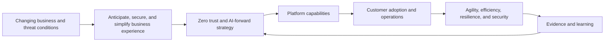

The mission's verbs matter:

| Mission word | Beginner meaning | TSM interpretation | Failure mode | Evidence |
|---|---|---|---|---|
| Anticipate | Prepare for important change before it becomes a crisis | Identify adoption risk, architecture dependencies, data-health issues, and emerging customer needs early | Waiting for every issue to become a support case | Risk review, leading indicators, prevention action |
| Secure | Reduce cyberthreat, data-loss, and access risk with appropriate controls | Connect platform use to an agreed security outcome | Treating deployment as proof of protection | Control validation, coverage, incident or exposure trend |
| Simplify | Reduce unnecessary tools, paths, steps, and operating burden | Remove duplicate workflow and clarify ownership | Calling consolidation simple while shifting hidden work to users | Fewer handoffs, reduced time, lower error, clear support model |
| Experience of doing business | Protect the work people and systems are trying to complete | Include user, application, partner, and operator experience in security decisions | Optimizing a security metric while breaking critical work | Availability, task success, performance, support trend |
| Transform | Change architecture and operating model, not just replace a box | Sequence people, process, technology, and governance change | A lift-and-shift that preserves old trust assumptions | Retired dependency, new workflow adoption, measurable outcome |

### The business problem behind the mission

Traditional enterprise design assumed that users, servers, and applications clustered around company locations. Organizations built a defended network perimeter, routed traffic through central controls, and often granted broad network reach after a user connected. Mobility, cloud services, software delivered as a service, contractors, acquisitions, operational technology, and machine identities weakened those assumptions.

The problem is not "firewalls are always bad" or "the network no longer matters." The problem is that location and network membership are weak substitutes for verified identity, device condition, application intent, data sensitivity, and current risk. A zero trust approach tries to make each access decision narrower and more contextual.

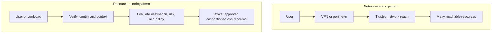

Zero trust is not a product checkbox. It is an architecture and operating principle: trust is not granted solely because an entity is on a familiar network; access is least privileged, explicitly evaluated, and revisited as context changes. A real program still depends on identity quality, device telemetry, application inventory, policy design, change management, resilient services, privacy decisions, and skilled operators.

## Plain-English deep-dive 1 - Transformation is a change in assumptions

Suppose a hotel once gave every checked-in guest a master key because the front desk had already verified identity. Adding a stronger front-door lock does not fix the master-key problem. Transformation means changing the access model: verify the guest, understand which room is requested, check current conditions, and issue only the access needed.

The same distinction separates product replacement from architecture transformation.

| Question | Product replacement answer | Transformation answer |
|---|---|---|
| What changed? | One appliance or service replaced another | Trust, connection, policy, and operating assumptions changed |
| What is the unit of access? | A network segment | A specific application, service, or resource |
| What context matters? | Source location and credential | Identity, device, destination, risk, policy, and business context |
| What is success? | New technology deployed | Exposure reduced, experience protected, operations simplified, old dependency retired |
| What can fail? | Installation or compatibility | Identity, inventory, policy, telemetry, workflow, adoption, ownership, and change |
| What does the TSM do? | Track deployment | Coordinate the customer outcome system over time |

A strong TSM therefore asks, "Which old assumption are we removing, what new dependency replaces it, and how will we prove the business result?" If remote access changes from network-level reach to application-specific brokerage, identity availability becomes more important. If policy uses device posture, posture freshness and exception handling become more important. Transformation changes risk rather than deleting it.

## Secure, simplify, and transform

The official Zero Trust Exchange page groups benefits under **secure**, **simplify**, and **transform**. These words are useful only when attached to customer evidence.

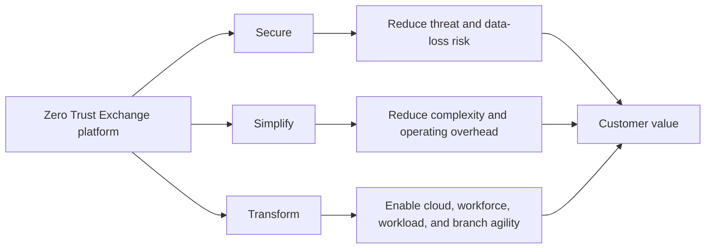

| Outcome family | Customer question | Candidate explanation | Useful measures | Important caveat |
|---|---|---|---|---|
| Secure | Which realistic attack or data path becomes less likely or less damaging? | Reduce attack surface, prevent compromise, limit lateral movement, or protect data according to deployed capability | Exposed services, blocked threats, control coverage, policy exceptions, incident scope | A blocked-event count alone does not prove total risk reduction |
| Simplify | Which duplicate technology, route, handoff, or manual task is removed? | Consolidate policy or reduce legacy infrastructure where the design supports it | Tools retired, tickets, operator effort, routing complexity, change time | Consolidation can create concentration and migration risk |
| Transform | Which new business model or operating speed becomes possible? | Support distributed users, cloud workloads, partners, branches, and new applications with contextual access | Time to onboard, application release time, merger integration, user experience | Faster change without governance can scale mistakes |

### Platform and customer-outcome chain

The official platform page describes identity verification, destination determination, risk assessment, and policy enforcement. It also describes one-to-one connections brokered by a proxy architecture. A proxy is like a controlled switchboard: the caller and destination do not establish unrestricted network familiarity; the intermediary evaluates whether and how to connect them.

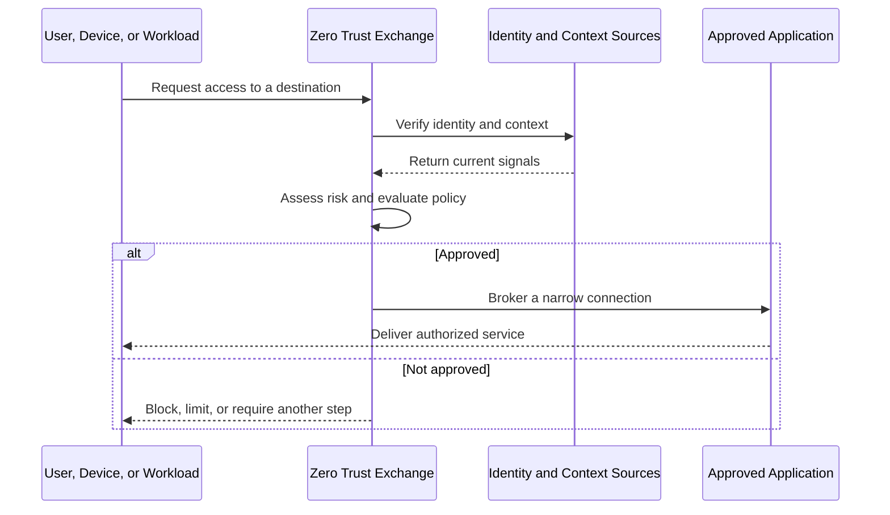

| Layer | What official positioning emphasizes | TSM translation | Customer evidence |
|---|---|---|---|
| Identity and context | Verify who or what requests access | Confirm identity provider, group, workload, and device signal quality | Authentication success, mapping accuracy, stale identity rate |
| Destination | Determine the requested application or service | Maintain accurate application inventory and ownership | Known applications, discovery coverage, owner validation |
| Risk | Assess changing conditions | Define trusted inputs, freshness, thresholds, and exceptions | Signal latency, explainable decision, exception trend |
| Policy | Enforce business policy | Align least privilege with business workflow and safety | Policy test results, denied legitimate use, overbroad access |
| Connection | Broker one-to-one access where applicable | Validate traffic path, performance, resilience, and support boundaries | Path test, application success, latency, failover evidence |
| Feedback | Learn from telemetry and outcomes | Review what policy and incidents reveal about posture | Recurring pattern, policy tuning, reduced recurrence |

## AI-forward enterprise: four lenses

Artificial intelligence is not one interview topic. It appears in four distinct lenses, and mixing them leads to vague answers.

1. **AI as product capability:** models or agents help classify, correlate, summarize, prioritize, investigate, recommend, or automate.
2. **AI as attacker force multiplier:** adversaries use automation for reconnaissance, social engineering, content generation, adaptation, and scale.
3. **AI as employee workflow:** staff use approved assistants to draft, analyze, learn, search, code, summarize, and reduce repetitive work.
4. **AI as governance concern:** organizations must govern data, identity, prompts, models, tools, authorization, quality, privacy, and accountability.

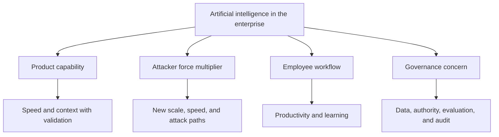

The official Zscaler AI page frames AI around safer enterprise innovation, resilience against AI-powered attacks, and improved security outcomes. The official Agentic SecOps page describes first- and third-party signals, a security graph, business context, agentic triage and investigation, and adaptive responses. These are product-positioning claims. A TSM still needs to verify available capabilities, data sources, licenses, control permissions, evaluation results, and customer policy.

### AI as product capability

An AI product feature is like an analyst's research assistant. It can gather related records, summarize a timeline, identify patterns, or propose next steps. The assistant may increase speed, but it does not inherit accountability merely because its language sounds confident.

| Potential capability | Valuable outcome | Main risk | TSM validation question |
|---|---|---|---|
| Alert grouping | Less duplicate analyst work | Unrelated events merged | Can an analyst inspect why events were grouped? |
| Summarization | Faster understanding and handoff | Missing or invented facts | Are claims linked to source evidence? |
| Prioritization | Focus on consequential threats or exposures | Bias, stale context, opaque ranking | Which factors, dates, and business rules drove priority? |
| Recommendation | Consistent next-step guidance | Unsafe or overbroad action | What authority and human approval are required? |
| Automated response | Faster containment | Business disruption or attacker manipulation | Is scope bounded, reversible, logged, and tested? |
| Natural-language query | Wider access to analysis | Incorrect query interpretation or excess data access | Are identity, permissions, and generated queries visible? |

### AI as attacker force multiplier

"Force multiplier" means something that lets the same actor achieve more speed, reach, or effect. A power tool multiplies a worker's output; AI can multiply an attacker's reconnaissance, message variation, translation, impersonation, or automated testing. It does not make every attack novel, successful, or autonomous.

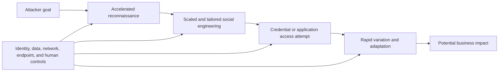

Responsible discussion avoids sensationalism. Ask what changed in speed, cost, personalization, access path, detectability, or defensive response time. Then map controls to that changed property. "AI attack" is too broad to drive action.

### AI as employee workflow

Arti has factual experience with Copilot Studio agents, AI tool evaluation, certifications, and training as represented in the approved background. This supports a credible employee-workflow story: identify a repetitive task, use an approved tool, protect data, evaluate output, keep human review, measure whether quality or time improves, and teach others the safe pattern.

| Workflow stage | Good employee behavior | Weak behavior | Evidence |
|---|---|---|---|
| Select | Choose a bounded, repeatable, permitted task | Use AI because it is fashionable | Problem statement and baseline |
| Ground | Provide approved, relevant context | Paste sensitive customer data into an unapproved service | Source list and data classification |
| Generate | Request a structured output | Ask a vague question and accept fluent prose | Prompt or workflow version |
| Validate | Compare output with authoritative evidence | Treat confidence as correctness | Error log and reviewer sign-off |
| Decide | Keep accountable human judgment | Let the model make an unauthorized commitment | Named decision owner |
| Measure | Track time, quality, rework, and adoption | Count prompts as impact | Before-and-after measure |
| Improve | Feed errors into workflow and training | Hide mistakes to protect the experiment | Retrospective and updated guardrail |

### AI as governance concern

Governance is the system of decision rights, controls, evidence, and accountability around important activity. It is not a committee that says no to everything. Think of air-traffic rules: they enable high-speed movement because authority, routes, communications, and incident handling are explicit.

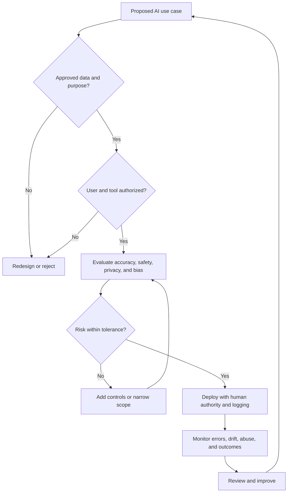

## Plain-English deep-dive 2 - Agentic does not mean unaccountable

An **agent** is software that can pursue a goal through multiple steps, often selecting tools or actions based on current context. A traditional automation may follow a fixed recipe. An agentic workflow may decide which evidence to retrieve, which hypothesis to test, or which recommendation to propose.

Imagine a junior incident coordinator. The coordinator may collect logs, compare timelines, draft a summary, and suggest containment. The organization still defines what data can be accessed, which actions are permitted, who approves disruption, how work is audited, and what happens when the coordinator is wrong. Software agents need the same discipline, expressed as technical controls.

| Control area | Beginner question | Strong design characteristic | Failure mode |
|---|---|---|---|
| Purpose | What exact result is the agent allowed to pursue? | Narrow, documented use case | Goal expands into unrelated action |
| Identity | Under whose identity does it operate? | Dedicated, least-privileged identity | Shared powerful credential |
| Data | What can it read or retain? | Classified, minimized, approved sources | Sensitive data leakage |
| Tools | Which actions can it invoke? | Allowlisted tools and bounded parameters | Arbitrary tool execution |
| Grounding | Which evidence supports its statements? | Traceable sources and timestamps | Fluent hallucination |
| Human authority | Who approves consequential action? | Explicit approval threshold | Autonomous disruption without consent |
| Reversibility | Can an action be undone? | Staged, limited, and reversible response | Broad irreversible containment |
| Evaluation | How is quality tested? | Representative tests and error classes | Demo success treated as production proof |
| Monitoring | How are drift and abuse detected? | Logs, alerts, sampling, and review | Silent degradation |
| Accountability | Who owns the outcome? | Named business and technical owners | "The AI decided" |

For an interview, Arti can say: "My direct AI evidence is employee workflow and enablement, not autonomous SecOps production deployment. I would transfer the same disciplined pattern: approved data, grounded output, human validation, explicit authority, audit, and outcome measurement."

## Culture is an operating system

Culture is the repeated pattern of decisions and behavior that a group rewards, challenges, or tolerates. Published values are the intended design. Interview questions test whether a candidate can operate under that design, especially when values pull in different directions.

The official culture framework groups three commitments:

- **Committed to the Mission:** align actions and decisions to core goals while owning responsibilities and remaining accountable.
- **Committed to the Outcome:** approach challenges proactively, create value, and turn opportunities into results.
- **Committed to Each Other:** practice respect, trust, listening, open communication, empathy, and mutual support.

It also documents behaviors around ownership and collaboration, trust through outcomes and impact, high-quality MVPs and urgent iteration, transparency, constructive challenge, psychological safety, direct feedback, and disagree-and-commit behavior.

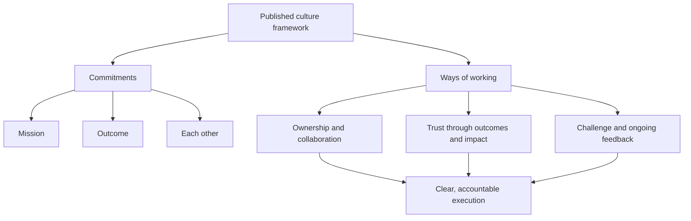

### Complete culture signal map

This table translates every signal required for this chapter. The translation is preparation, not a claim that every phrase is an exact official value label.

| Signal | Observable behavior | Anti-pattern | Useful metric | Interview evidence | Scenario question | Factual Arti bridge |
|---|---|---|---|---|---|---|
| Impact over activity | Defines outcome, baseline, decision, and validation before counting work | Lists meetings, emails, or hours as success | Customer outcome, quality, recurrence, adoption | Backlog or case-quality analysis that changed action | "You held ten workshops but adoption did not move. What next?" | Production analytics and service-quality improvement |
| Trust through results | Makes realistic commitments, closes loops, and shows evidence | Overpromises, hides delay, relies on title | Commitment reliability, acceptance, confidence | Strong CSAT and repeated recognition with a specific story | "You will miss a milestone. How do you protect trust?" | Production customer and escalation work |
| Customer obsession | Starts with customer impact and durable value, not automatic agreement | Says yes to unsafe, impossible, or low-value requests | Outcome attainment, sentiment, avoidable friction | High-pressure case where business impact guided priorities | "A customer demands a risky bypass. What do you do?" | Microsoft enterprise customer ownership |
| Transparency | Labels facts, assumptions, risks, uncertainty, and changes promptly | Surprises stakeholders or performs false certainty | Time to disclose risk, forecast accuracy, decision clarity | Bad-news communication in an escalation | "A dashboard improved because data disappeared. What do you say?" | Evidence-led CRITSIT communication |
| Constructive honest debate | Challenges ideas with evidence, listens, proposes options, then commits | Personal attack, silence, or endless relitigation | Decision time, rework, dissent quality | Engineering or Product discussion resolved around evidence | "You disagree with a senior architect. How do you proceed?" | Cross-functional technical investigation |
| Speed with quality | Uses bounded scope, explicit quality gates, and rapid feedback | Rushes unsafe output or perfects low-value work | Time to value plus defect or rework rate | Rapid triage with validation before closure | "Security urgency conflicts with change safety. What is your plan?" | Business-critical escalation discipline |
| Ownership | Steps from strategy into action, clarifies owner, and protects continuity | Waits behind the organization chart or absorbs every task | Accepted ownership, blocker age, closure | Maintained one narrative across teams | "A blocker falls between teams. Who owns it?" | CRITSIT and Technical Advisor experience |
| Accountability | Accepts responsibility for commitments, evidence, and correction | Blames handoffs or hides a miss | On-time closure, recurrence actions, forecast accuracy | A miss followed by corrective action | "Your recommendation caused rework. What do you do?" | RCA and fix-validation habits |
| Collaboration | Co-creates decisions and adapts between strategic and hands-on work | Consensus theater, heroics, or passive attendance | Cross-team action completion, handoff quality | Support, Engineering, Product Group, or partner coordination | "Two teams optimize conflicting goals. How do you align them?" | Production cross-functional work |
| High performance | Sets a clear bar, seeks feedback, learns, and repeatedly improves | Unsustainable heroics or competition that damages the team | Quality trend, independence, outcome consistency | Mentoring and quality improvement | "How do you raise the bar without burning out the team?" | Mentoring, onboarding, 100+ recognitions |
| Urgency | Acts on material risk now while sequencing reversible steps | Panic, reckless change, or delay disguised as analysis | Time to contain, time to decision, stale blocker age | First response to a critical situation | "A connector fails during a vulnerability emergency. First hour?" | Business-critical escalation leadership |
| Inclusion | Invites relevant perspectives, makes context accessible, and separates challenge from status | Dominant voices decide; remote or junior staff cannot contribute | Participation, decision input diversity, follow-through | Training tailored to mixed audiences | "An expert repeatedly dismisses a junior analyst. What do you do?" | Mentoring, training, onboarding, interviews |

## Impact over activity

Activity is work performed. Output is something produced. Outcome is a changed condition. Impact is the meaningful consequence of that outcome. These layers are connected, but they are not interchangeable.

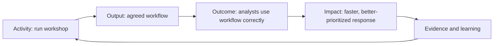

| Layer | NMH fictional example | Weak statement | Stronger statement |
|---|---|---|---|
| Activity | Held three connector workshops | "We were very busy" | "We tested source ownership and credentials" |
| Output | Produced a source inventory | "The document was delivered" | "Owners accepted scope, fields, cadence, and access" |
| Outcome | Cloud data arrived fresh and reconciled | "The connector is green" | "Counts and sample records matched agreed tolerances" |
| Impact | Risk decisions no longer omitted cloud assets | "The dashboard looks better" | "Executives stopped using invalid trend data and urgent assets remained visible" |

The interview test is usually a follow-up: "What changed because of your work?" Arti should answer with a before state, intervention, measured after state, and caveat. Her production backlog and case-quality analysis can support this signal if she preserves the real scope and outcome.

## Trust through results

Trust is not friendliness alone. In technical success, trust means the customer believes that commitments are realistic, status is accurate, evidence is sound, and bad news will not be hidden. Results build trust, but integrity governs how results are reported.

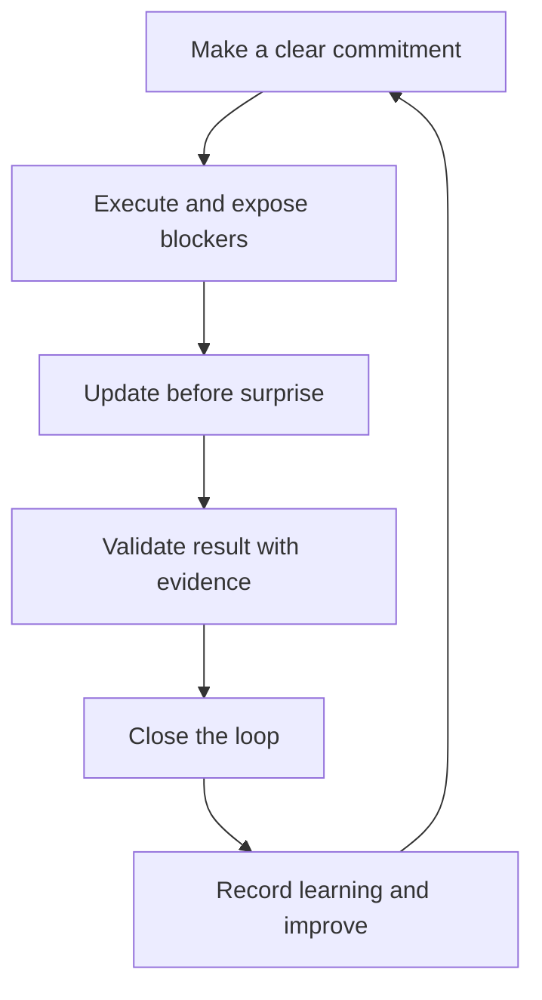

| Trust builder | Example behavior | Trust breaker | Recovery action |
|---|---|---|---|
| Accurate scope | Says which regions and workflows are affected | Implies global certainty from a sample | Correct scope and explain impact |
| Reliable cadence | Updates at the promised time even without resolution | Goes silent while searching for a complete answer | Reestablish cadence and owners |
| Evidence quality | Links claims to timestamps and sources | Repeats an assumption as fact | Relabel and run discriminating test |
| Honest forecast | Gives conditions, dependencies, and confidence | Invents an ETA | Withdraw unsupported ETA and provide next checkpoint |
| Closure | Confirms customer acceptance and prevention actions | Closes when an internal task ends | Validate the customer outcome |

Arti's recorded customer-satisfaction results and more than 100 recognitions support credibility, but metrics are supporting evidence. A strong answer still needs one specific situation, action, and result.

## Customer obsession without customer capitulation

Customer obsession means deeply understanding the customer's desired outcome, context, constraints, and experience, then acting for durable value. It does not mean accepting every requested solution. A doctor who prescribes an unsafe treatment merely because a patient demands it is not customer obsessed.

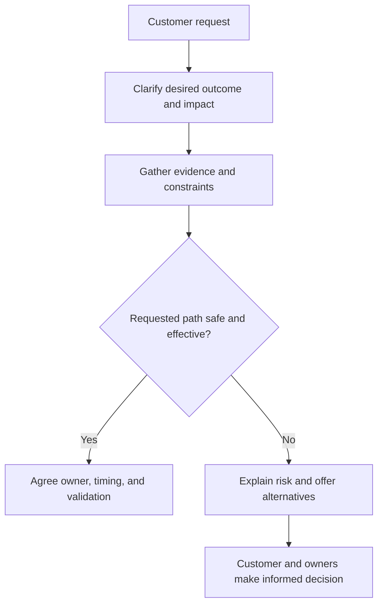

| Customer statement | Surface response | Customer-obsessed response |
|---|---|---|
| "Disable the control now" | Comply or refuse abruptly | Clarify impact, bound scope, assess risk, propose reversible mitigation, get authority |
| "The score is wrong" | Defend the product | Ask which decision failed, inspect factors and data, correct or explain |
| "Promise the roadmap feature" | Offer reassurance | Explain current capability, capture evidence, involve Product, avoid commitment |
| "Give us another training" | Schedule a webinar | Diagnose workflow failure, tailor practice, test independent performance |
| "Everything is critical" | Accept the label | Establish business tiers, consequence, time sensitivity, and owner |

## Transparency and constructive honest debate

Transparency makes decision-relevant information visible. It does not mean broadcasting every raw thought or violating confidentiality. Constructive debate challenges ideas, evidence, and tradeoffs while preserving respect. The official culture page emphasizes clarity over comfort, direct respectful feedback, psychological safety, and disagree-and-commit behavior.

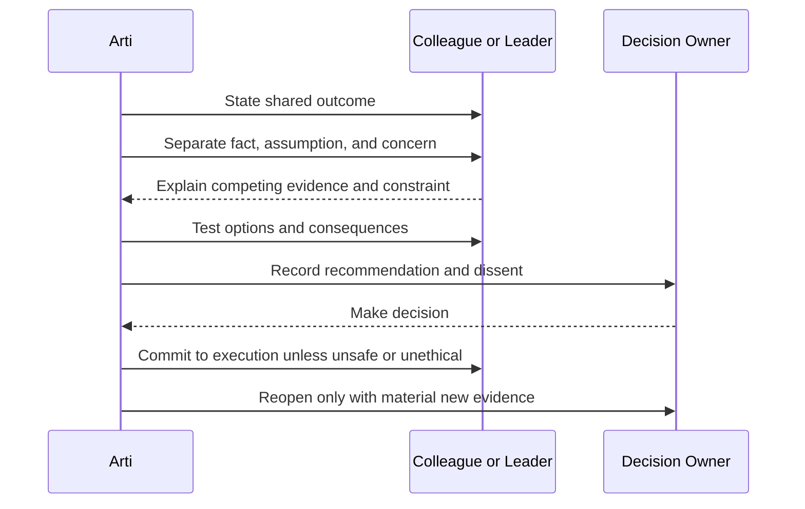

| Debate stage | Useful language | Anti-pattern |
|---|---|---|
| Align | "We both want the customer to make a safe decision by Friday" | Starting with personalities or status |
| Evidence | "The last complete source record is 36 hours old" | "Everyone knows the connector is broken" |
| Uncertainty | "We have not yet ruled out source-side throttling" | Hiding ambiguity |
| Options | "We can pause reporting, label it provisional, or reconcile a bounded scope manually" | Presenting one preferred path as inevitable |
| Decision | "The accountable owner chose option B for these reasons" | Consensus without an owner |
| Commitment | "I disagreed, the decision is documented, and I will support execution" | Reopening the debate repeatedly |

## Plain-English deep-dive 3 - Psychological safety and accountability reinforce each other

Psychological safety means people can raise questions, mistakes, risks, and dissent without fear of humiliation or retaliation. It does not mean freedom from standards or feedback. In aviation, a junior crew member must be able to report a hazard, and every crew member must still follow disciplined procedures.

High accountability without safety creates hidden errors. Safety without accountability creates comfortable drift. The useful combination is candid information plus responsible action.

| Low or high safety | Low or high accountability | Likely environment | TSM consequence |
|---|---|---|---|
| Low safety | Low accountability | Apathy and hidden problems | Risks remain unowned |
| Low safety | High accountability | Fear and blame | Bad news arrives late; metrics are gamed |
| High safety | Low accountability | Comfortable discussion without closure | Meetings multiply; actions age |
| High safety | High accountability | Direct learning and reliable execution | Issues surface early and owners close loops |

An inclusive leader may say, "I want the concern now, even if it challenges my plan. Bring the evidence you have, label what you do not know, and help us decide the next test." The same leader can later say, "We agreed that you own the test by Thursday. What blocked it, and what correction is needed?"

## Speed with quality and urgency

Speed is elapsed time. Urgency is priority expressed through timely action. Quality is fitness for the intended purpose. A high-quality minimum viable product is not an unfinished production release; it is the smallest bounded result that safely tests value and learning.

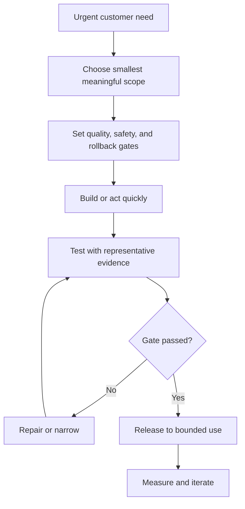

| Situation | Fast but weak | Slow but weak | Speed with quality |
|---|---|---|---|
| Connector outage | Mark healthy after one successful call | Wait for a perfect RCA before protecting decisions | Restore bounded flow, reconcile data, label trend, then complete RCA |
| Executive update | Send an unverified conclusion | Say nothing until resolution | Share impact, facts, unknowns, workstreams, and next update |
| AI workflow | Deploy after an impressive demo | Study indefinitely without a test | Pilot low-risk use with evaluation and human review |
| Customer training | Reuse generic slides immediately | Build a semester-long course | Teach one target workflow, use practice, verify teach-back |
| Policy change | Push globally | Delay every needed control | Test scoped ring, monitor, preserve rollback, expand |

Arti's production CRITSIT work transfers because critical support requires quick scoping, parallel evidence, clear cadence, and validated recovery. It does not prove security-operations authority; that remains a domain and product ramp.

## Ownership, accountability, and collaboration

These terms overlap but answer different questions.

| Term | Core question | Good TSM behavior | Boundary |
|---|---|---|---|
| Ownership | "Will someone make sure this moves?" | Steps in, frames the outcome, finds the owner, removes blockers, and follows through | Does not personally perform every specialist task |
| Accountability | "Who answers for the result or decision?" | Names one accountable owner and makes commitments visible | Cannot be shared so broadly that no one owns the result |
| Responsibility | "Who performs this task?" | Assigns work to people with skill and authority | Several people can be responsible |
| Collaboration | "How do we combine knowledge and effort?" | Co-creates, listens, shares context, and adapts support | Does not erase decision rights |

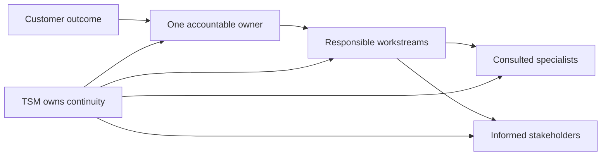

The TSM often owns continuity rather than the code fix, commercial agreement, customer credential, or Product roadmap. "Ownership" must not become uncontrolled scope absorption. A mature owner says, "Support owns defect diagnosis, the customer cloud administrator owns credential rotation, Product owns roadmap priority, and I own the integrated customer plan and reliable communication."

## High performance, inclusion, and sustainable execution

High performance is repeated delivery of valuable, high-quality outcomes while learning and strengthening the system. Heroic overwork can rescue one incident but is not a scalable operating model. Inclusion improves performance when relevant perspectives, expertise, constraints, and dissent enter decisions early.

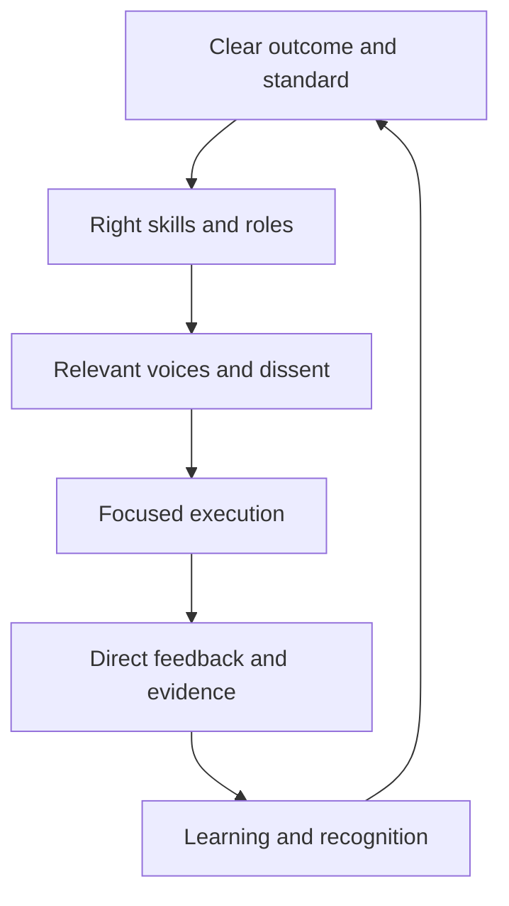

| High-performance practice | Inclusion mechanism | Why it improves outcomes | Warning sign |
|---|---|---|---|
| Clear written decision | Asynchronous review for remote teams | People can inspect reasoning, not meeting status | Decisions exist only in hallway conversations |
| Rotating facilitation | More voices practice leadership | Reduces dependency on one dominant person | Same person owns every meeting and answer |
| Premortem | Invite junior and specialist concerns | Surfaces hidden dependencies before change | Dissent appears only after failure |
| Teach-back | Participants demonstrate understanding | Reveals confusion across language or role boundaries | Attendance is treated as mastery |
| Accessible artifacts | Define jargon and show diagrams | Enables business and technical participation | Acronyms become a status barrier |
| Outcome recognition | Credit contributors and learning | Reinforces team-first results | Only visible rescue work is rewarded |

Arti can use factual mentoring, onboarding, interview participation, partner training, knowledge articles, and organization-wide AI learning as evidence. The answer should name the learner need, intervention, observed improvement, and what she changed based on feedback.

## Plain-English deep-dive 4 - Culture signals are tradeoff tests

Interviewers rarely need a definition of ownership. They need to know what a candidate does when ownership conflicts with scope, urgency conflicts with safety, transparency conflicts with the desire to reassure, or customer obsession conflicts with an unsafe request.

Think of values as controls on a mixing board. Turning one dial to maximum can distort the whole system. Urgency without quality becomes recklessness. collaboration without accountability becomes drift. transparency without judgment can violate confidentiality. customer obsession without boundaries becomes capitulation. High performance without inclusion can become brittle hero culture.

| Tension | Weak extreme A | Weak extreme B | Mature synthesis |
|---|---|---|---|
| Urgency and quality | Reckless global change | Analysis paralysis | Bounded action with explicit gates and rollback |
| Ownership and boundaries | Hero absorbs everything | "Not my job" handoff | Own continuity and route specialist work clearly |
| Transparency and confidence | Broadcast every speculation | Hide risk until certain | Share decision-relevant facts, uncertainty, and next test |
| Debate and commitment | Personal conflict | Avoid disagreement | Challenge evidence respectfully, decide, then commit |
| Customer obsession and safety | Promise whatever is requested | Dismiss customer pressure | Understand outcome and offer safe, feasible paths |
| Performance and inclusion | Fast decision by loudest expert | Endless consensus | Gather relevant input, assign decision rights, execute |

The best interview stories contain the tension. "I collaborated" is generic. "I challenged a preferred diagnosis because the timestamp evidence did not fit, invited the service owner to test an alternative, accepted the accountable decision, and validated the result" demonstrates multiple signals.

## Arti's factual evidence map

The table below is a preparation aid. Arti should replace generalized descriptions with exact factual stories she can defend.

| Culture signal | Supported factual area | What it can prove | What it cannot prove | Best answer structure |
|---|---|---|---|---|
| Customer obsession | Enterprise Microsoft support and strong CSAT | Impact awareness, expectation management, follow-through | CISO advisory experience | Customer impact, evidence, choice, outcome |
| Trust through results | CSAT and more than 100 recognitions | Repeated service credibility | That every engagement succeeded | Specific promise, obstacle, honest update, closure |
| Ownership | Business-critical escalations and CRITSITs | Continuity under pressure | Formal incident-command authority in SecOps | Scope, workstreams, owner, cadence, validation |
| Impact over activity | Backlog and case-quality analysis | Data used to change service action | Security-risk quantification | Baseline, analysis, intervention, measured effect |
| Constructive debate | Engineering and Product Group coordination | Evidence-led cross-functional challenge | Product roadmap ownership | Shared goal, conflicting views, test, decision |
| Speed with quality | Trace-led troubleshooting and fix validation | Rapid investigation with evidence gates | Zscaler production troubleshooting | Timeline, hypothesis, discriminating test, result |
| Collaboration | Customers, partners, vendors, engineers, and advisors | Cross-boundary coordination | Unlimited scope ownership | Roles, handoff quality, decision, joint outcome |
| Inclusion and growth | Mentoring, onboarding, training, interviews | Tailored learning and capability building | Organization-wide people management | Learner need, method, feedback, independence |
| AI-forward work | Copilot Studio agents, evaluation, certification, training | Practical curiosity and governed workflow thinking | Autonomous SecOps deployment | Use case, data boundary, validation, measured value |

## Culture decision trees

### Decision tree 1: act, challenge, or escalate

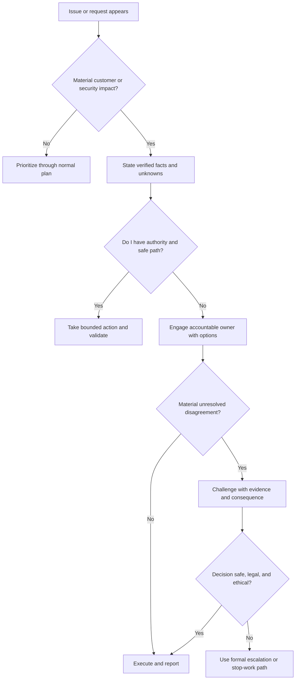

### Decision tree 2: speed versus quality

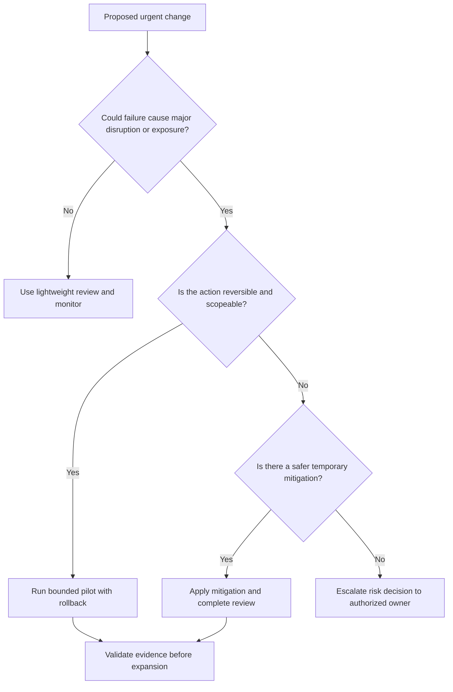

### Decision tree 3: customer request versus durable outcome

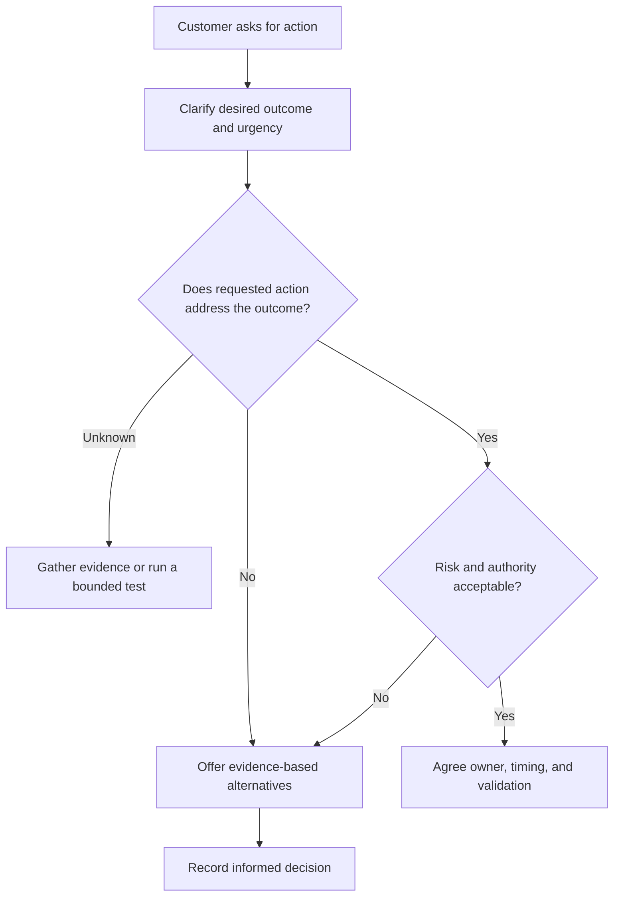

## Fictional Northstar Meridian culture scenarios

> **Fiction notice:** Northstar Meridian Holdings is invented for study. Its people, metrics, incidents, product use, and outcomes are synthetic. Arti did not perform this engagement in production.

| Fictional scenario | Values in tension | Weak response | Strong TSM response | Proof of outcome |
|---|---|---|---|---|
| Cloud connector is stale during a vulnerability emergency | Urgency, transparency, quality | Celebrate lower risk or wait silently | Mark trend invalid, protect urgent decisions with bounded reconciliation, run repair workstream | Counts reconciled, dashboard corrected, workflow restored |
| CISO rejects a risk score | Trust, challenge, customer obsession | Defend the product number | Ask which decision failed, inspect inputs, explain uncertainty, correct defects | Disputed examples resolved and decision rule accepted |
| Sales wants an uncommitted feature described as coming soon | Collaboration, integrity, outcome | Promise to preserve momentum | State current capability, capture impact, involve Product, provide approved alternative | Customer expectation documented without false commitment |
| Plant lead refuses urgent patching | Security and operational safety | Escalate as resistance | Understand maintenance and safety constraints; consider segmentation, access restriction, monitoring, or time-bound acceptance | Authorized treatment, owner, expiry, validation |
| Analysts ignore a new workflow | Impact over activity | Schedule more generic training | Observe real work, identify friction, integrate with current process, use teach-back | Independent completion and repeated use improve |
| AI summary omits contrary evidence | Speed and quality | Send fluent summary | Link claims to sources, require analyst review, record error class, adjust prompt or workflow | Error rate tracked and decision protected |

### Scenario drill: the misleading green dashboard

At 09:10, NMH's fictional executive dashboard shows a sharp reduction in exposed cloud assets. At 09:18, the vulnerability director reports that the cloud connector has not completed since a credential rotation. A leadership review begins at 11:00.

The culture test is not whether Arti knows the connector interface. The test is whether she protects the decision:

1. State that the apparent improvement is not yet valid.
2. Separate verified facts from hypotheses about the connector.
3. Bound which assets, reports, and workflows may be affected.
4. Create parallel tracks for urgent source reconciliation and technical recovery.
5. Tell the executive sponsor what can and cannot be concluded at 11:00.
6. Avoid an invented recovery time.
7. Reconcile counts and downstream decisions after service returns.
8. Record prevention actions around credential changes, freshness alerts, and dashboard guardrails.

This scenario demonstrates transparency, urgency, quality, ownership, collaboration, customer obsession, and impact over activity in one story.

## Company research method

Company research should work like technical troubleshooting: start with authoritative evidence, time-stamp it, compare sources, test interpretation, and keep volatile details out of the core answer.

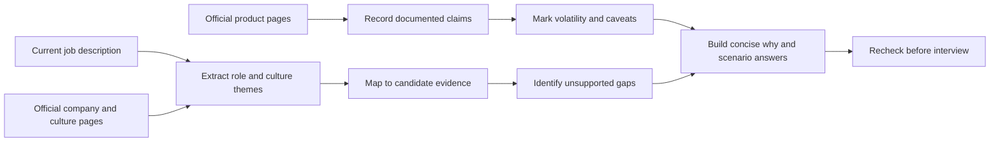

| Research step | Questions | Artifact | Mistake to avoid |
|---|---|---|---|
| Read the role | What outcomes, technical areas, stakeholders, and behaviors recur? | Role signal matrix | Copying phrases without interpreting work |
| Read company pages | What mission, vision, customer problem, and culture framework are published? | Dated source notes | Treating brand language as independent proof |
| Read product pages | Which capabilities and outcomes are currently described? | Product claim and caveat table | Memorizing volatile counts |
| Read current news responsibly | What launches, acquisitions, leadership changes, or priorities matter? | Date-stamped update | Presenting speculation as strategy |
| Map candidate evidence | Which factual stories demonstrate the behavior? | Claim-labeled story bank | Stretching adjacent experience into direct product use |
| Find gaps | Which questions require conceptual or not-yet-used language? | Ramp plan | Hiding a gap until follow-up exposes it |
| Prepare questions | What would reveal team operating reality? | Interview question list | Asking questions answered on the home page |
| Recheck | What changed since notes were written? | Currency checklist | Using old names or packaging confidently |

### How to discuss marketing metrics responsibly

Marketing metrics may be accurate within a defined method and still be unsuitable as universal predictions. A published customer result, daily transaction count, connector count, threat-accuracy percentage, or NPS figure has a source date, population, definition, and context.

| Check | Question | Responsible language |
|---|---|---|
| Source | Is it an official page, customer quote, study, filing, or third party? | "The official page currently reports..." |
| Date | When was it published or checked? | "As checked on 2026-08-24..." |
| Population | All customers, selected customers, one case, or platform-wide telemetry? | "This is a published case result, not a universal baseline" |
| Denominator | What is being counted and over what period? | "I would verify the metric definition before comparing" |
| Method | Observed, modeled, surveyed, estimated, or self-reported? | "The page states the result; methodology needs review" |
| Variability | Could page sections differ or change? | "I would avoid memorizing a volatile count" |
| Decision use | What customer decision would the metric support? | "I would baseline the customer's own environment" |

The current official pages include large platform and product figures. Part 1 already notes differing Risk360 factor counts on the same live page. The Agentic SecOps page publishes a threat-accuracy statement tied to training data. The AI page publishes an annual activity trend. These may be useful conversation starters, but Arti should not promise that NMH or any real customer will reproduce them.

## Plain-English deep-dive 5 - A marketing number is a signpost, not a destination

Imagine a car advertisement that reports excellent highway fuel economy. The figure may come from a defined test. It does not guarantee the same result in mountain traffic, with heavy cargo, poor maintenance, or different driving. A responsible buyer uses the figure to ask better questions and then measures the actual route.

Security metrics behave similarly. "Critical issues downgraded" may indicate contextual prioritization, but the meaning depends on the original label, scoring method, customer context, controls, and validation. "Transactions secured" describes scale, but does not by itself prove a particular customer's outcome. "Accuracy" requires the tested population, ground truth, error classes, threshold, and operational impact.

The interview-safe pattern is:

> "Zscaler's official page reports the metric as of my research date. I treat it as evidence of positioning or a published result, not a guarantee. For a customer, I would establish the local baseline, definition, data quality, target, and validation method."

## Current terminology drift

Terminology drift means names and groupings change while underlying customer problems remain related. Current pages use terms such as Zero Trust Exchange, Agentic Security Operations, Agentic SOC, Exposure Management, Asset Exposure Management, Cyber Asset Attack Surface Management, Unified Vulnerability Management, Data Fabric for Security, Continuous Threat Exposure Management, and Risk360.

| Term | Stable idea | Volatile element | Interview practice |
|---|---|---|---|
| Zero Trust Exchange | Contextual, policy-brokered zero trust platform | Portfolio layout and feature grouping | Explain architecture, then confirm current packaging |
| Agentic SecOps | AI-assisted proactive and reactive operations with context and action | Agent names, autonomy, workflows, metrics | Describe documented direction and governance questions |
| Agentic SOC | Contextual alert-to-threat and response workflow | Product naming and included features | Do not use interchangeably with the entire SecOps portfolio without checking |
| Data Fabric for Security | Ingest, harmonize, resolve, enrich, and operationalize security data | Connector counts, formats, delivery statements | State checked date and verify current catalog |
| AEM and CAASM | Multi-source asset visibility, resolution, gaps, and workflows | Product/category wording | Say AEM is product positioning and CAASM is an industry category |
| UVM | Contextual vulnerability prioritization and workflow | Formula, interface, integration, package | Never invent the production score |
| CTEM | Recurring scope, discovery, prioritization, validation, mobilization | Vendor mapping and offering labels | Present as an industry program, not one product |
| Risk360 | Risk drivers, trends, mitigation, financial and executive framing | Factor counts and model details | Emphasize assumptions and current documentation |

The research rule is **problem first, architecture second, current name third**. If a product name changes, Arti should still explain the customer problem and operating model.

## Competitor neutrality

Competitor neutrality means discussing alternatives through customer requirements and architectural tradeoffs rather than insults. A TSM earns trust by diagnosing fit, not by declaring every other product obsolete.

| Weak statement | Neutral alternative | Why stronger |
|---|---|---|
| "Firewalls are useless" | "Network firewalls serve defined controls, while zero trust access changes the trust and connection model for particular use cases" | Accurate, scoped, and credible |
| "Zscaler replaces every security tool" | "The platform can consolidate or complement capabilities depending on architecture, licensing, integration, and customer goals" | Avoids unsupported universality |
| "Competitor X cannot do this" | "I would compare required outcomes, data, policy model, deployment, operations, support, and validated limitations" | Focuses on evidence |
| "Our score is better" | "I would compare explainability, source quality, calibration, workflow, and decision outcomes" | Makes the evaluation testable |
| "AI will replace analysts" | "AI may reduce repetitive analysis while accountable humans retain judgment and authority for consequential decisions" | Respects reality and governance |

A useful comparison framework includes customer outcome, architecture, trust boundary, data source, integration, policy, user experience, operational burden, resilience, privacy, cost, migration, support, and evidence. If Arti lacks current verified competitor detail, she should say so and describe the evaluation method.

## Why Zscaler, why now, and why the AI age

These scripts are starting points, not lines to recite mechanically.

### Why Zscaler: 30-second version

"Zscaler interests me because its mission connects secure business experience with architectural transformation, and its current platform story connects zero trust telemetry, contextual security data, exposure management, and AI-assisted Security Operations. That creates a role where technical depth, customer adoption, escalation leadership, analytics, and executive communication meet. Those are areas where my Microsoft production experience gives me a strong method, while Zscaler and SecOps product depth are explicit areas I am building rather than claiming."

### Why Zscaler: deeper version

"The official mission to anticipate, secure, and simplify the experience of doing business is meaningful to me because it does not frame security as a barrier. The Zero Trust Exchange story links identity, context, risk, policy, and narrow connections to secure, simplify, and transform outcomes. The current Agentic SecOps and Data Fabric direction adds a data and AI dimension: connect signals, add business context, improve prioritization, and close the loop through right-sized action.

"That combination matches how I work. In Microsoft enterprise support, I have owned complex SharePoint, OneDrive, Sync, and Copilot-related situations that crossed identity, client, browser, network, service, and stakeholder boundaries. I bring evidence-led troubleshooting, critical escalation, Engineering coordination, analytics, mentoring, training, and practical AI exploration. I do not bring direct production Zscaler or vulnerability-program ownership today. I bring a tested customer method and a measurable product ramp."

### Why now

"The timing matters because cloud, distributed work, acquisitions, operational technology, software services, and AI are increasing the number and speed of identities, applications, data paths, and decisions. Extending old network trust assumptions becomes harder to govern, while security teams face fragmented tools and limited attention. The opportunity is to connect zero trust architecture, contextual data, and customer operating change. I want to move from resolving individual complex incidents into preventing recurring risk, driving adoption, and proving longer-term outcomes."

### Why the AI age

"AI is simultaneously a product capability, an attacker accelerator, an employee productivity tool, and a governance challenge. I am interested in work that treats all four honestly. AI can help group signals, summarize evidence, and recommend steps, but speed without grounding and authority can amplify error. My experience with Copilot Studio agents, AI evaluation, certification, and training gives me a practical starting point. I would apply approved data, traceable evidence, human validation, least privilege, audit, and outcome measurement before trusting consequential automation."

### Script quality checklist

| Check | Strong answer | Weak answer |
|---|---|---|
| Company-specific | Names mission, architecture, current direction, and role connection | Could apply to any cybersecurity vendor |
| Candidate-specific | Uses factual Microsoft, analytics, enablement, and AI evidence | Lists personality adjectives |
| Honest | Names direct product and domain gaps | Implies product experience through vocabulary |
| Outcome-oriented | Explains customer problems and measurable contribution | Recites features |
| Current | Uses dated sources and caveats | Memorizes volatile numbers |
| Balanced | Shows enthusiasm and critical judgment | Flatters or repeats market claims as fact |

## Interview scenario bank for culture signals

| Scenario question | Signals tested | Strong answer ingredients | Red flag |
|---|---|---|---|
| Tell me about a time activity was high but impact was low | Impact, analysis, ownership | Baseline, diagnosis, changed plan, outcome | More activity presented as solution |
| Tell me about a commitment you missed | Transparency, accountability, trust | Early disclosure, impact, recovery, prevention | Blame or hidden delay |
| A customer demands an unsafe workaround | Customer obsession, challenge, integrity | Listen, clarify outcome, explain risk, alternatives, authority | Automatic yes or dismissive no |
| You disagree with Product on priority | Debate, evidence, collaboration | Structured evidence, impact, options, decision rights, commitment | Roadmap promise or personal escalation |
| A severe issue has incomplete evidence | Urgency, quality | Bounded mitigation, parallel investigation, cadence, validation | False certainty |
| A peer resists helping outside title | Ownership, collaboration | Clarify outcome and roles; step in appropriately; prevent permanent ambiguity | Hero takeover or public blame |
| An AI tool produces a compelling but wrong summary | AI governance, accountability | Stop decision use, trace sources, record error, tune, re-evaluate | Quiet correction without systemic learning |
| A junior analyst raises a late concern | Inclusion, challenge, urgency | Hear evidence, assess materiality, adjust if needed, recognize candor | Dismiss due to timing or level |

## Interview scoring rubric

The rubric below can be used to score practice answers from 1 to 5. Total score is less important than identifying the weakest dimension.

| Dimension | 1 - weak | 3 - credible | 5 - strong |
|---|---|---|---|
| Mission understanding | Repeats slogan | Explains business problem | Connects mission, architecture, role, and customer evidence |
| Company specificity | Generic cybersecurity answer | Names relevant products or culture | Uses dated official language with caveats and role relevance |
| Culture behavior | Uses adjectives | Names actions | Shows tension, choice, behavior, metric, and learning |
| Candidate evidence | Unsupported claim | Adjacent factual example | Precise production fact, boundary, transfer, and gap plan |
| Customer outcome | Focuses on task | Names result | Shows baseline, changed condition, business meaning, and caveat |
| Technical rigor | Uses jargon | Explains concept | Defines terms, architecture, failure modes, and validation |
| Transparency | Avoids weakness | Names uncertainty | Distinguishes fact, assumption, limitation, and next evidence |
| AI judgment | Says AI is useful | Mentions human review | Covers data, grounding, authorization, evaluation, audit, and impact |
| Communication | Wanders or memorizes | Structured and understandable | Concise opening, layered depth, plain analogy, direct close |
| Reflection | No learning | Names lesson | Shows changed system, behavior, or measurement |

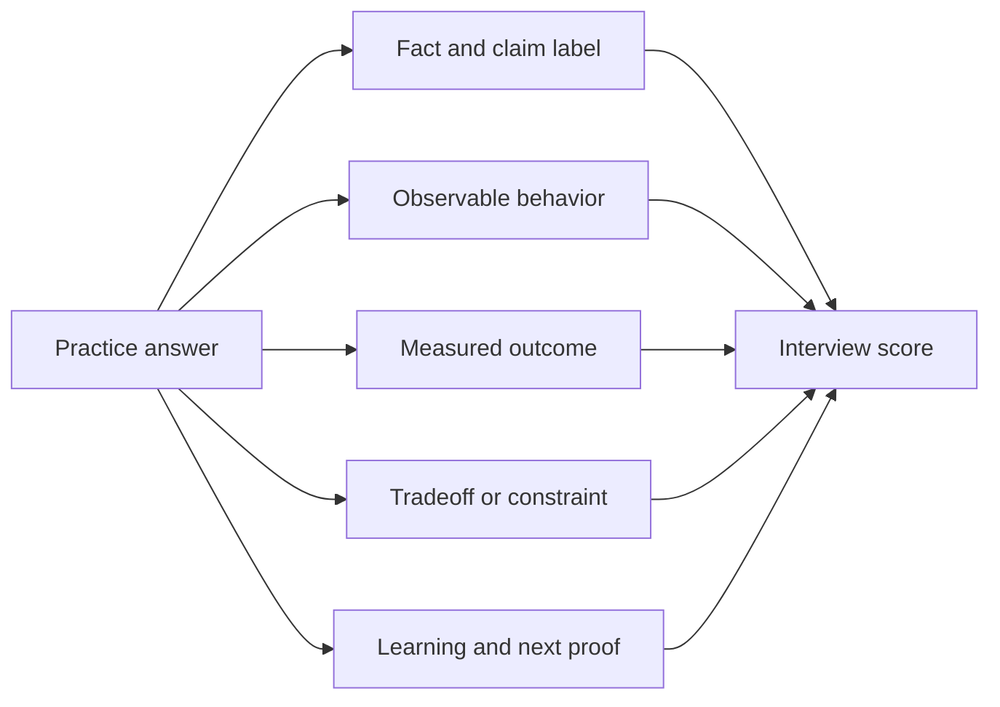

### Self-review questions

1. Did the first sentence answer the question directly?
2. Did Arti define any term that a non-specialist may not know?
3. Is the evidence label audible and accurate?
4. Does the story include a real decision rather than only effort?
5. Is the customer or team outcome measurable?
6. Did she expose a tradeoff, failure mode, or uncertainty?
7. Did she avoid an unsupported Zscaler production claim?
8. Could the answer survive a skeptical follow-up asking for timestamps, stakeholders, and evidence?

## Failure modes and troubleshooting weak answers

| Symptom | Likely cause | Repair |
|---|---|---|
| Answer sounds like a corporate web page | Mission language was memorized without a personal decision link | Add customer problem, role behavior, and factual candidate evidence |
| Answer contains many product names but no architecture | Vocabulary replaced understanding | Draw the request-to-policy-to-outcome flow in plain language |
| Culture answer says "I am collaborative" | Trait claim lacks evidence | Use a conflict, roles, action, decision, and result |
| Why answer sounds flattering | Candidate avoids tradeoffs or caveats | Add a reasoned fit, honest gap, and validation mindset |
| AI answer is either hype or fear | Four lenses were mixed | Separate product, attacker, employee, and governance concerns |
| Metrics sound like promises | Source, denominator, or variability is missing | Date, attribute, caveat, and return to customer baseline |
| Gap answer becomes defensive | Candidate tries to hide lack of product experience | State gap, explain concept, connect method, give measurable ramp |
| Customer obsession becomes automatic agreement | Desired outcome was not separated from requested action | Clarify why, assess risk, propose safe options, name authority |
| Ownership becomes hero behavior | Continuity was confused with doing every task | Use explicit roles and follow-through |
| Debate becomes conflict | Shared goal and evidence were absent | Reframe around outcome, facts, options, decision rights |

## Practical preparation exercises

| Exercise | Time | Output | Pass condition |
|---|---:|---|---|
| Mission translation | 20 minutes | One paragraph each for anticipate, secure, simplify, transform | Each has behavior, metric, and caveat |
| Zero trust whiteboard | 15 minutes | Legacy and resource-centric diagrams | Can explain without unexplained acronyms |
| Four-lens AI drill | 20 minutes | Four examples and controls | Does not merge product use with employee use |
| Culture story map | 45 minutes | One factual story mapped to three signals | Claim scope is precise and follow-ups are defensible |
| Bad-news role play | 20 minutes | Two-minute connector-outage update | Facts, unknowns, impact, actions, next update |
| Debate role play | 20 minutes | Product roadmap disagreement | No false promise; dissent and decision are recorded |
| Metric audit | 15 minutes | One marketing metric caveat | Includes source, date, population, and local validation |
| Why scripts | 30 minutes | 30-, 90-, and 180-second recordings | Specific, honest, natural, and outcome-oriented |

## Official Source Anchors

**Checked on 2026-08-24.** These official anchors support the documented statements in this chapter. They do not prove customer-specific licensing, configuration, outcomes, employment experience, or unchanged future terminology.

| Official Zscaler source | Used for | Caveat |
|---|---|---|
| https://www.zscaler.com/company/about-zscaler | Mission, vision, secure digital transformation, agility, efficiency, resilience, and security | Company language and published metrics can change |
| https://www.zscaler.com/culture | Commitments, ownership, collaboration, outcomes, impact, transparency, urgency, challenge, feedback, trust, and leadership language | Published framework describes intent, not every employee's experience |
| https://www.zscaler.com/careers | High-performing teams, execution, customer obsession, collaboration, ownership, accountability, inclusion, growth, and candidate resources | Career content and hiring process can change by date and location |
| https://www.zscaler.com/products-and-solutions/zero-trust-exchange-zte | Secure, simplify, transform; zero trust architecture; identity, context, risk, policy, proxy connections, and AI positioning | Portfolio, metrics, and product detail are volatile |
| https://www.zscaler.com/products-and-solutions/zscaler-ai | Enterprise AI positioning, safer innovation, AI-powered attacks, productivity, resilience, and security outcomes | Published activity metrics are not customer guarantees |
| https://www.zscaler.com/products-and-solutions/security-operations | Agentic SecOps, first- and third-party signals, security graph, triage, investigation, and adaptive response | Agent behavior, accuracy, autonomy, workflow, and packaging require current validation |
| https://www.zscaler.com/products-and-solutions/data-fabric | Security data integration, harmonization, deduplication, enrichment, business logic, workflows, and reporting | Connector counts, formats, and delivery statements can change |
| https://www.zscaler.com/products-and-solutions/vulnerability-management | Contextual prioritization, custom factors, controls, reporting, and workflows | Marketing outcomes and scoring details are not universal formulas |
| https://www.zscaler.com/products-and-solutions/caasm | Asset Exposure Management, CAASM, golden records, coverage gaps, and CMDB health | Integrations and product behavior need tenant validation |
| https://www.zscaler.com/products-and-solutions/ctem | CTEM stages and exposure-management positioning | CTEM is a broader industry program model |
| https://www.zscaler.com/products-and-solutions/zscaler-risk-360 | Risk drivers, attack stages, guided mitigation, financial framing, and executive reporting | Live factor counts have differed across page sections; verify current documentation |

### Documented, interpreted, and fictional summary

| Label | Content in this chapter | Interview wording |
|---|---|---|
| Officially documented | Mission, vision, culture framework, platform and AI positioning | "Zscaler's official page states or describes..." |
| Interpretation | TSM behavior maps, decision trees, metrics, and scoring rubric | "My interpretation for this role is..." |
| General practice | AI governance, evidence quality, customer outcome design | "A general control pattern is..." |
| Fictional exercise | NMH events, decisions, people, tools, and outcomes | "In the fictional case exercise..." |
| Arti production fact | Microsoft support, customer, escalation, analytics, mentoring, training, and approved AI evidence | "In my Microsoft production experience..." |
| Not established | Production Zscaler, SecOps, vulnerability-product, or exposure-program operation | "Direct product operation is not part of my current experience..." |

## Likely Interview Questions

### Q1. What is Zscaler's mission, and why does it matter to a SecOps TSM?

**Model answer:** As checked on 2026-08-24, Zscaler's official company page states its mission as anticipating, securing, and simplifying the experience of doing business while transforming today and tomorrow. I interpret that as a customer-outcome mandate rather than a product slogan. Anticipate means identify material change and risk early. Secure means reduce realistic threat, access, and data-loss paths through validated controls. Simplify means remove unnecessary complexity and operating burden. Transform means change architecture and workflow assumptions rather than merely replace technology.

For a SecOps TSM, the mission becomes a success plan. I would connect product adoption to agreed outcomes, such as trustworthy asset context, better-prioritized exposure, faster investigation, or reduced recurring friction. I would measure the changed condition and caveat the evidence. My Microsoft production background supports customer impact, escalation, analytics, and enablement; direct production Zscaler and exposure-program operation remain explicit ramp areas.

### Q2. How would you explain Zscaler's zero trust transformation to a nontechnical executive?

**Model answer:** I would use a hotel-key analogy. A traditional network model can resemble giving a verified guest broad access to a floor. A zero trust model aims to verify the person or workload, understand the exact destination, assess current context and risk, apply business policy, and broker only the approved connection. The intended outcome is less exposed attack surface and less unnecessary reach while preserving business access.

I would add that zero trust is not a magic product switch. Identity quality, application inventory, device signals, policy, user experience, resilience, privacy, and operating process still matter. The executive decision is not whether zero trust sounds modern; it is which legacy trust assumption will change, what dependencies replace it, what risk and experience outcome is expected, and how the organization will validate the transition.

### Q3. What does an AI-forward strategy mean in practical terms?

**Model answer:** I separate four lenses. AI can be a product capability that helps correlate, summarize, prioritize, investigate, or recommend. It can be an attacker force multiplier that increases speed, scale, and personalization. It can be an employee workflow that improves research, drafting, analysis, or learning. It is also a governance concern involving data, identity, model quality, tool authority, privacy, audit, and accountability.

My factual AI experience includes Copilot Studio agents, tool evaluation, certifications, and training as represented in my approved background. I have not deployed autonomous security response. In a SecOps context I would require approved data, traceable grounding, least-privileged tools, representative evaluation, explicit human approval for consequential action, logging, reversibility, and outcome monitoring. AI speed is valuable only when the decision remains trustworthy.

### Q4. Tell me how you demonstrate impact over activity.

**Model answer:** I distinguish activity, output, outcome, and impact. A workshop is activity. An agreed workflow is output. Operators repeatedly using it correctly is an outcome. Faster or more accurate customer resolution is impact. In my production background, backlog and case-quality analysis are the strongest factual area to build this answer. I would describe the real baseline, the analysis, what action changed, the measured result, and any limit in the data rather than claim that meetings or reports were the success.

For a fictional SecOps example, connecting five data sources is activity. The stronger result is that source counts reconcile, ownership coverage improves, high-risk work reaches the right team, closure is validated, and decision quality improves. I would never present that fictional example as customer experience; it is a demonstration of how I think about outcomes.

### Q5. How do you handle constructive disagreement with a senior stakeholder?

**Model answer:** I begin with the shared outcome, then separate facts, assumptions, constraints, and consequences. I ask for the other view, propose a discriminating test or options, and make the decision right explicit. If the accountable owner chooses a safe and ethical path I did not prefer, I document the reasoning and commit to execution. I reopen the decision only if material new evidence appears. If the path is unsafe, illegal, or unethical, I use the appropriate escalation channel.

My transferable production evidence comes from coordinating technical investigations with Engineering and Product Groups, where evidence and ownership mattered more than title. I would not claim Product roadmap authority. For a roadmap disagreement, I would provide customer impact and evidence, avoid an uncommitted promise, and communicate only the approved position.

### Q6. How do you balance urgency with quality during a critical escalation?

**Model answer:** I reduce scope before reducing standards. First I clarify impact and protect the immediate decision. Then I choose the smallest meaningful and reversible action, establish quality and rollback gates, run parallel workstreams, communicate facts and unknowns on a fixed cadence, and validate the customer outcome before closure. I do not invent an estimated recovery time to sound decisive.

My production CRITSIT and business-critical escalation experience supports the operating discipline: impact, evidence, parallel ownership, Engineering coordination, customer updates, and fix validation. It does not establish SecOps command or Zscaler product operation. In a new domain I would combine that method with current product specialists, support processes, and customer authority.

### Q7. Why Zscaler, and why now?

**Model answer:** Zscaler's mission and current platform direction connect several areas I want to bring together: zero trust architecture, secure business experience, contextual security data, exposure prioritization, AI-assisted operations, customer adoption, and executive outcomes. The TSM role requires technical investigation, cross-functional leadership, enablement, and long-term value rather than only incident resolution. That fits my strengths in Microsoft enterprise support, networking evidence, high-pressure ownership, analytics, mentoring, training, and practical AI initiative.

The timing matters because cloud, distributed work, SaaS, operational technology, acquisitions, and AI create more identities, applications, data paths, and machine-speed decisions. I want to apply my proven method earlier and more strategically: discover risk, prevent recurring problems, drive adopted workflows, and show measurable outcomes. I am explicit that direct Zscaler and vulnerability-program depth require a structured ramp.

### Q8. Which Zscaler culture signal is hardest for you, and how would you manage it?

**Model answer:** A credible answer should name a real tension rather than a disguised strength. For me, the useful tension is ownership without over-absorbing scope. Escalation engineers are rewarded for stepping in, but a strategic TSM can become a bottleneck if ownership means personally doing every specialist task. My control is to own continuity: define the customer outcome, name accountable and responsible roles, create evidence-rich handoffs, expose blockers, and close the loop while preserving Support, Product, Engineering, Sales, and customer decision boundaries.

I would measure whether owners accept actions, blockers age appropriately, and the customer receives one coherent narrative. I would ask for early manager feedback on where the team draws TSM boundaries. That shows growth without pretending the tension is already solved in every context.

## 30-Second Memory Hooks

| Concept | Memory hook |
|---|---|
| Mission | Anticipate, secure, simplify, transform |
| Vision | Information exchange should be secure and seamless |
| Zero trust | Verify context; connect narrowly |
| Secure | Reduce a realistic risk path |
| Simplify | Remove burden, not merely move it |
| Transform | Change assumptions, architecture, and work |
| AI four lenses | Product, attacker, employee, governance |
| Agentic control | Goal, data, tools, approval, audit |
| Impact | Changed condition, not calendar activity |
| Trust | Accurate promise, visible blocker, validated result |
| Customer obsession | Understand the outcome; do not capitulate |
| Transparency | Facts, uncertainty, consequence, next test |
| Debate | Shared goal, evidence, options, decision, commit |
| Speed with quality | Narrow scope before lowering standards |
| Ownership | Own continuity, not every task |
| Accountability | One owner answers for the result |
| Collaboration | Co-create without erasing decision rights |
| Inclusion | Relevant voices improve the decision |
| Marketing metric | Date, source, denominator, local baseline |
| Arti bridge | Production fact, honest boundary, measurable ramp |

## Completion Checklist

- [ ] I can state the dated official mission and vision in plain language.
- [ ] I can distinguish mission, strategy, product capability, culture, and customer outcome.
- [ ] I can explain why network location alone is a weak trust signal.
- [ ] I can draw the legacy and resource-centric access patterns from memory.
- [ ] I can connect secure, simplify, and transform to metrics and caveats.
- [ ] I can explain AI as product capability, attacker force multiplier, employee workflow, and governance concern.
- [ ] I can explain why agentic does not mean unaccountable.
- [ ] I can translate every required culture signal into behavior, anti-pattern, metric, and evidence.
- [ ] I can use all three culture decision trees in scenario practice.
- [ ] I can explain psychological safety and accountability as mutually reinforcing.
- [ ] I can give factual Arti examples without claiming production Zscaler or SecOps work.
- [ ] I can identify every Northstar Meridian detail as fictional.
- [ ] I can discuss official marketing metrics with source, date, denominator, and caveat.
- [ ] I can handle terminology drift and competitor questions neutrally.
- [ ] I can deliver Why Zscaler, Why now, and Why the AI age scripts naturally.
- [ ] I can answer all eight questions aloud and withstand evidence-focused follow-ups.
- [ ] I have rechecked official sources if preparing after 2026-08-24.
- [ ] I have not converted production, lab, conceptual, fictional, or not-yet-used evidence into another category.

[Part 3 - Technical Success Management from Zero](Part-03-technical-success-management-from-zero.md)