# Part 3 - Technical Success Management from Zero

> **Audience:** Candidates preparing to move from enterprise Support Escalation Engineering into a Zscaler Security Operations Technical Success Manager role.
>
> **Currency date:** 2026-08-24.
>
> **Honesty rule:** This chapter teaches a general Technical Success operating model and applies it to fictional Zscaler-related scenarios. Your production evidence is limited to the Microsoft customer, support, escalation, networking, analytics, advisory, mentoring, training, and approved AI work in your background. Direct production operation of Zscaler, Security Operations, vulnerability-management, or exposure-management products is not established.
>
> **Role caveat:** Technical Success Manager, Customer Success Manager, and Technical Account Manager titles vary by company. Confirm Zscaler's current team charter, service package, account coverage, decision rights, and commercial boundaries rather than assuming universal definitions.

## Section goal

This chapter builds Technical Success Management from first principles. A **Technical Success Manager**, abbreviated **TSM**, is a continuing technical partner who helps a customer turn a purchased platform into adopted workflows, measurable outcomes, manageable risk, and a credible next-value plan. The TSM is neither a glorified meeting scheduler nor an unlimited engineer for hire.

Think of a TSM as the conductor of an orchestra. The conductor does not play every instrument, write every score, sell every ticket, or repair the stage. The conductor understands the intended performance, helps specialists enter at the right time, detects when sections drift, and makes the whole result coherent. A strategic customer should not have to assemble a usable outcome from disconnected vendor teams.

By the end of this chapter, you should be able to:

| Learning outcome | What mastery looks like |
|---|---|
| Define Technical Success | Explain the role in plain language and state its boundaries |
| Distinguish adjacent teams | Compare TSM, Customer Success, Technical Account Management, Support, Professional Services, Sales Engineering, Sales, Product, Engineering, and a Security Operations Center |
| Run the lifecycle | Guide discovery, onboarding, adoption, value realization, health, risk, renewal collaboration, and expansion discovery |
| Work strategically | Balance proactive plans with reactive escalations and keep incidents connected to long-term improvement |
| Lead a portfolio | Prioritize accounts and time by impact, risk, leverage, commitment, and urgency |
| Build governance | Use clear cadences, decision rights, stakeholders, metrics, and action tracking |
| Create artifacts | Draft a charter, success plan, health score, action register, RAID log, QBR, account plan, RACI, and communication plan |
| Handle difficult scenarios | Respond to low adoption, missing sponsorship, scope confusion, commercial pressure, roadmap asks, and repeated escalation |
| Position you honestly | Translate support strengths into proactive success without claiming unearned product or security-program experience |

## JD Mapping

**JD** means job description. The target JD expects strategic enterprise engagement, complex technical analysis, product and program best-practice advocacy, mitigation guidance, escalation leadership, consulting, training, cross-functional partnership, executive communication, and long-term customer success.

| JD expectation | TSM operating motion | Primary artifact | Strong evidence |
|---|---|---|---|
| Lead strategic enterprise engagements | Establish outcomes, stakeholders, roadmap, governance, and decisions | Account charter and technical success plan | Customer owners accept outcomes and milestones |
| Align solutions to business needs | Translate capabilities into business-service and risk outcomes | Outcome map and use-case plan | Technical work traces to an agreed business measure |
| Analyze complex environments | Map architecture, data, dependencies, and uncertainty | Current-state assessment | Assumptions are tested and owners validated |
| Deliver mitigation strategies | Frame options, tradeoffs, owners, timing, validation, and residual risk | Mitigation decision record | Customer makes an informed, authorized decision |
| Develop product expertise | Explain architecture, mechanics, operations, and limitations | Whiteboard, runbook, or workshop | Advice is current, scoped, and reviewable |
| Advocate best practices | Adapt proven patterns to customer context | Maturity roadmap | Adoption and control quality improve |
| Resolve critical escalations | Protect impact, coordinate workstreams, and restore trust | Escalation plan and post-incident review | Recovery and recurrence actions are validated |
| Partner across functions | Clarify Sales, Support, Product, Engineering, and customer roles | RACI and decision log | Handoffs are accepted without false promises |
| Consult and train | Diagnose audience need and build independent capability | Workshop and teach-back | Users perform the target workflow correctly |
| Drive long-term success | Measure health, value, risk, retention readiness, and next outcomes | QBR and account plan | Sponsor confirms achieved and future value |

## Candidate honesty note

Your production support experience includes customer ownership, SharePoint Online and OneDrive for Business problem solving, Sync and Copilot-related scenarios, business-critical escalations, Critical Situations, evidence gathering, Engineering coordination, fix validation, communication, analytics, technical advisor work, mentoring, onboarding, training, and documented customer-satisfaction results. These facts are highly relevant to a TSM role.

They do not establish ownership of a formal customer-success portfolio, a Zscaler production deployment, a vulnerability-management program, a Security Operations program, a renewal forecast, or a commercial quota. Interview answers should use this pattern:

| Claim label | Example in this chapter | Safe wording |
|---|---|---|
| Production | enterprise escalation, customer, analytics, advisory, or enablement evidence | "In my prior production role..." |
| Lab | A retained synthetic health model or dashboard | "In a controlled lab exercise..." |
| Conceptual | TSM lifecycle or Zscaler product architecture understanding | "Conceptually, I would validate..." |
| Fictional | Northstar Meridian Holdings account artifacts | "In the fictional NMH case..." |
| Not yet used | Direct Zscaler, vulnerability-program, or commercial-account operation | "I have not owned that directly yet; my ramp would..." |

Never say "my strategic security account" when describing Northstar Meridian Holdings. Never turn a template into evidence that it was used in production. A useful artifact proves preparation; it does not rewrite employment history.

## Acronyms and essential terms

| Acronym or term | Plain meaning | Why it matters | Memory hook |
|---|---|---|---|
| CSM | Customer Success Manager, a role focused on adoption, value, relationship, retention, and advocacy | The TSM often partners with a CSM and adds technical depth | CSM keeps value and relationship visible |
| EBR | Executive Business Review, a strategic review of outcomes, risk, decisions, and future value | Executives need decisions, not a feature tour | EBR is an executive decision meeting |
| JD | Job Description | It defines the target role's approved expectations | Translate every verb into evidence |
| KPI | Key Performance Indicator, a decision-relevant measure of progress | A success plan needs measures that connect work to outcomes | KPI supports a decision |
| QBR | Quarterly Business Review, a recurring review of progress and next-quarter priorities | It aligns technical work, executive context, and value | QBR: outcomes, risks, decisions, next |
| RACI | Responsible, Accountable, Consulted, Informed | It clarifies task work, result ownership, advice, and communication | One accountable owner prevents ambiguity |
| RAID | Risks, Assumptions, Issues, Dependencies | It exposes what may prevent success | Risk may happen; issue is happening |
| RCA | Root Cause Analysis | It explains why a problem occurred and how recurrence will be reduced | Improve the system, not the blame |
| ROI | Return on Investment | It compares value or benefit with cost | Value needs a denominator and caveat |
| SLA | Service Level Agreement, a documented service commitment | Support and remediation urgency may be governed by time commitments | SLA turns urgency into an agreement |
| SOC | Security Operations Center, the monitoring and response function | A SecOps TSM supports customer outcomes but does not replace the SOC | SOC runs the security watch floor |
| TAM | Technical Account Manager, a named technical advisor often focused on health and support continuity | TAM and TSM responsibilities can overlap | Confirm charter, not title folklore |
| TCO | Total Cost of Ownership | It includes purchase plus operating, migration, support, and change costs | Cheap to buy may be costly to run |
| TSM | Technical Success Manager | It is the target role | Technology into durable outcomes |

## Technical Success in one sentence

A Technical Success Manager creates continuity between the customer's desired outcomes, technical environment, product capabilities, operating workflows, specialist teams, risk, adoption, and measurable value over time.

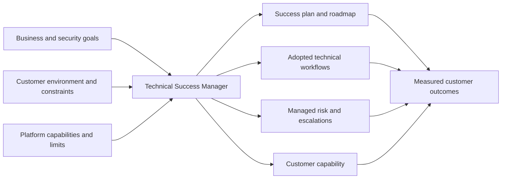

The TSM's unit of work is not the meeting or ticket. It is a customer outcome system. That system includes people, architecture, data, process, policy, decisions, training, support, and measurement.

## Plain-English deep-dive 1 - Owning continuity is different from owning everything

Imagine a patient with a primary doctor, surgeon, pharmacist, laboratory, insurer, and physical therapist. The primary doctor should not perform every specialist task. The doctor should understand the desired health outcome, make sure handoffs are sensible, reconcile conflicting information, and keep the patient from falling between departments.

The TSM similarly protects continuity. If a connector fails, Support may own diagnosis; the customer tool administrator may own credentials; Engineering may own a defect; Product may own roadmap priority; Sales may own a commercial change. The TSM ensures that impact is understood, evidence reaches the correct owner, decisions are connected, communication is coherent, and long-term success is repaired.

| Situation | TSM owns | TSM coordinates | TSM must not imply ownership of |
|---|---|---|---|
| Product incident | Account impact, continuity, stakeholder alignment | Support investigation and Engineering escalation | Code fix or unsupported recovery time |
| Deployment project | Success outcome, readiness, adoption, dependencies | Professional Services or customer implementation | Unlimited implementation labor |
| Renewal | Technical value evidence, risk, adoption, future outcomes | CSM and Sales commercial process | Price, contract, or signature unless explicitly assigned |
| Feature request | Use case, evidence, impact, workaround, follow-up | Product review and approved communication | Roadmap priority or delivery promise |
| Security response | Product context, account coordination, evidence handoff | Customer SOC and authorized responders | Customer incident-command authority |
| Training | Learning outcome, audience, workflow, validation | Specialists and customer champions | Attendance as proof of adoption |

The phrase "not my job" breaks continuity. The phrase "I own all of it" breaks scale and accountability. The mature sentence is: "I own making sure the outcome has the right owner, evidence, decision, and follow-through."

## Role boundaries

Titles differ across organizations, so boundaries should be treated as a charter to confirm. The following is a practical comparison, not a universal company organization chart.

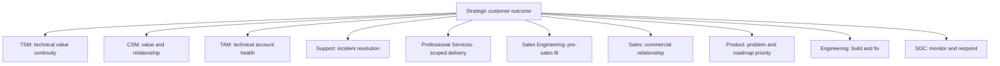

| Function | Primary question | Time horizon | Typical trigger | Core artifact | Common boundary risk |
|---|---|---|---|---|---|
| TSM | Are technical capabilities becoming durable customer outcomes? | Ongoing, proactive and reactive | Strategic account relationship | Technical success plan | Becoming support-only or absorbing all work |
| CSM | Is the customer realizing value and likely to remain successful? | Ongoing lifecycle | Customer relationship | Success plan and health view | Too little technical depth for complex blockers |
| TAM | Is the account technically healthy and support-ready? | Ongoing | Named technical service | Technical account plan | Title overlap creates confusion |
| Support | Why is the product failing, and how is service restored? | Incident or request | Case | Case record and resolution | Treating every adoption problem as a defect |
| Professional Services | How is agreed scope designed and implemented? | Time-bound project | Statement of work | Design and project plan | Unfunded scope expansion |
| Sales Engineering | Does the solution fit the requirement before purchase or expansion? | Pre-sales or expansion | Opportunity | Technical win plan or validation | Post-sale expectation not handed off |
| Sales | What commercial agreement advances mutual value? | Commercial cycle | Purchase, renewal, expansion | Account and opportunity plan | Technical truth distorted by timing pressure |
| Product | Which problems should the product solve and prioritize? | Roadmap | Market and customer evidence | Requirements and roadmap | Customer request treated as commitment |
| Engineering | How is the product built, operated, and corrected? | Delivery and operations | Feature, defect, reliability work | Design, code, test, fix | Weak customer context reaches engineers |
| SOC | What threats need investigation and response now? | Continuous operations | Detection, hunt, or incident | Incident case and response action | Vendor TSM mistaken for customer responder |

### Boundary handoff sequence

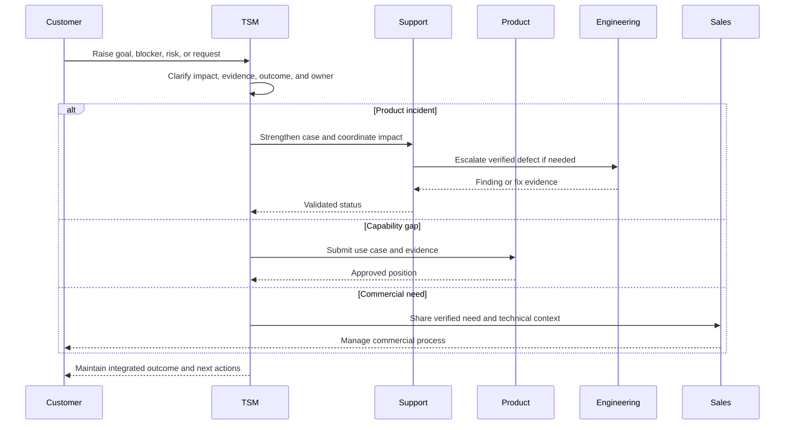

## Customer lifecycle

The customer lifecycle is the sequence from investment intent through adoption, measurable value, ongoing health, renewal, and expanded outcomes. It is not perfectly linear. A customer can be onboarding one capability, optimizing another, and escalating a third at the same time.

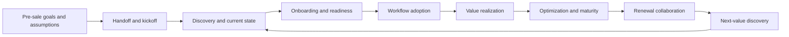

| Lifecycle phase | Core question | TSM activities | Exit evidence | Failure mode |
|---|---|---|---|---|
| Handoff | What was promised and why did the customer buy? | Reconcile goals, scope, assumptions, owners, and gaps | Accepted handoff brief | Inherited expectations remain implicit |
| Discovery | What environment and workflow must change? | Map services, architecture, tools, data, stakeholders, constraints, and maturity | Current-state assessment | Feature-first discovery |
| Onboarding | Are prerequisites and roles ready? | Sequence access, integrations, configuration, pilot, and training | Readiness and acceptance tests | Configuration without ownership |
| Adoption | Are target roles repeatedly using the intended workflow? | Observe work, remove friction, enable champions, measure meaningful use | Independent workflow completion | Logins treated as adoption |
| Value realization | Did an important condition improve? | Compare baseline and target, validate cause and caveat | Outcome evidence | Activity reported as value |
| Optimization | What next gap or inefficiency matters? | Tune policy, data, workflow, governance, and enablement | Maturity movement | Endless optimization without priority |
| Renewal collaboration | Is technical value durable and future value credible? | Supply evidence, risks, dependencies, and roadmap | Technical value narrative | TSM makes commercial commitment |
| Expansion discovery | Does a verified unmet need justify another capability? | Document problem, fit, prerequisites, value hypothesis | Qualified technical use case | Product pushing without customer need |

### The recurring success loop

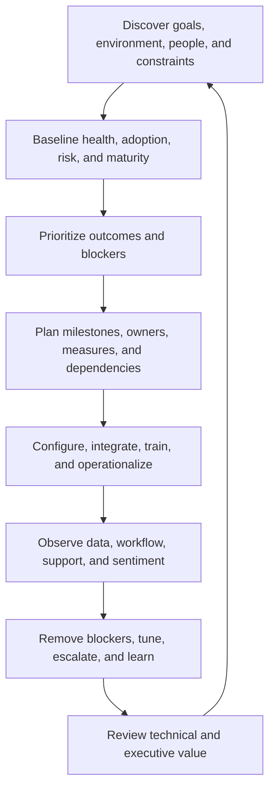

## Value realization

**Value realization** is the process of turning expected benefit into an observed, attributable, and accepted outcome. Buying software creates potential value. Deployment creates availability. Adoption creates changed behavior. Value appears only when that behavior improves a meaningful condition.

| Layer | Question | Example | Evidence risk |
|---|---|---|---|
| Investment | What did the customer buy and expect? | Contextual exposure prioritization | Purchase intent may be vague or political |
| Capability | What can the platform do? | Correlate asset, finding, control, and business data | Capability may not be licensed or configured |
| Deployment | Is it technically available? | Required sources are connected | Green status may hide stale or incomplete data |
| Adoption | Do target users perform the workflow? | Analysts review contextual priority weekly | Login counts can overstate use |
| Outcome | What condition changed? | High-risk items reach correct owners faster | Scope and denominator may change |
| Impact | Why does that matter? | Consequential exposure ages less and decisions improve | Causality may be shared with other changes |

## Plain-English deep-dive 2 - Adoption is behavior, not access

A gym membership card proves entitlement, not fitness. Entering the gym proves presence, not correct training. Completing a structured program repeatedly and improving health indicators is closer to adoption and value.

Security platform adoption has the same layers. An enabled user is not necessarily a skilled operator. A dashboard view is not necessarily a decision. A created ticket is not necessarily validated remediation.

| Adoption level | Observable evidence | TSM intervention | Better measure |
|---|---|---|---|
| Entitled | User or source has access | Confirm role and prerequisite | Correct target population covered |
| Activated | User signs in or connector runs | Remove access and setup friction | Successful first target action |
| Engaged | Workflow is attempted | Observe errors and confusion | Meaningful workflow frequency |
| Proficient | User completes workflow correctly | Scenario training and teach-back | Independent completion quality |
| Embedded | Workflow is part of operating process | Integrate governance and systems | Repeated use across cycles |
| Valuable | Workflow changes outcome | Validate baseline and impact | Risk, time, quality, or cost improvement |

Low adoption is usually a diagnosis problem before it is a motivation problem. Possible causes include unclear use case, low-quality data, workflow duplication, missing ownership, wrong permissions, poor performance, absent sponsor, weak training, product gap, competing priority, or lack of perceived value.

## Strategic versus reactive work

Reactive work responds to a current event. Strategic work improves the system that produces future outcomes. A TSM needs both. The danger is allowing urgent incidents to consume every week without converting recurring patterns into prevention.

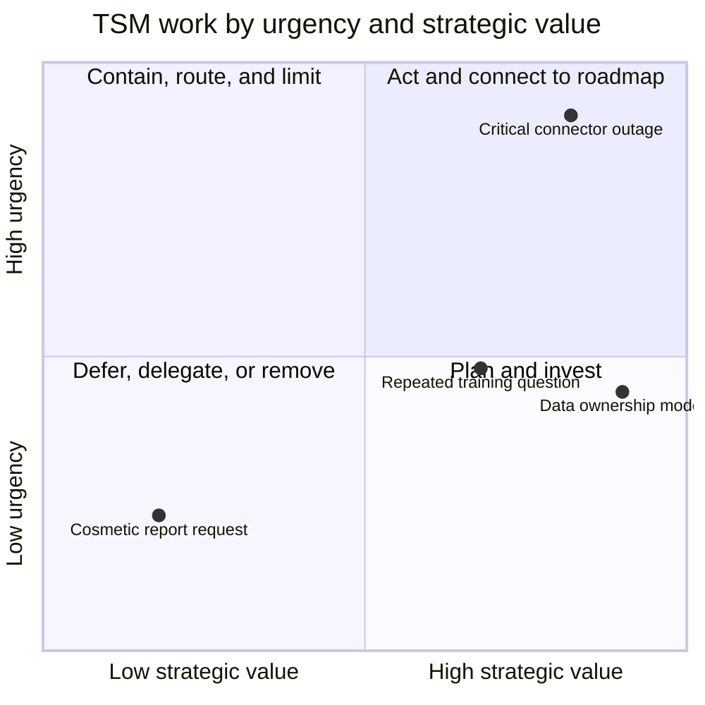

| Work type | Example | Immediate action | Strategic conversion |
|---|---|---|---|
| One-time incident | Credential entered incorrectly | Route to Support or administrator and restore | Improve setup checklist if pattern appears |
| Repeated incident | Connector fails after every credential rotation | Stabilize and communicate | Change rotation test, alert, ownership, and runbook |
| Adoption blocker | Analysts export everything to spreadsheets | Restore urgent workflow | Diagnose trust and integration gap; redesign adoption plan |
| Executive concern | Sponsor distrusts risk score | Explain current evidence | Establish score governance and quality review |
| Product gap | Needed field cannot be mapped | Document workaround | Build evidence, submit Product request, revisit plan |
| Commercial pressure | Renewal date approaches with unresolved issue | Protect customer facts | Align technical risk and value evidence with Sales and CSM |

A healthy portfolio reserves time for proactive work. The exact ratio depends on account maturity and events, but the TSM should be able to show which strategic milestone reactive work displaced and how the plan changes.

## Technical depth for a TSM

Technical depth does not mean knowing every command from memory. It means understanding architecture and mechanics well enough to ask discriminating questions, test assumptions, recognize risk, build useful evidence, explain tradeoffs, and engage the correct specialist.

| Depth layer | TSM capability | Example question |
|---|---|---|
| Purpose | Explain the problem and outcome | What decision is this capability meant to improve? |
| Architecture | Draw components, flows, boundaries, and dependencies | Which system is source, broker, target, and authority? |
| Mechanics | Explain how requests, data, identity, policy, and actions move | At which step does freshness or permission fail? |
| Operations | Explain monitoring, change, ownership, and normal health | Who reviews failures and what is the response target? |
| Failure modes | Predict common technical and organizational defects | Could a missing source make the score look better? |
| Troubleshooting | Form hypotheses and collect discriminating evidence | What test separates source failure from connector failure? |
| Tradeoffs | Explain security, experience, cost, scale, and complexity | Does this mitigation reduce risk while preserving plant safety? |
| Communication | Adjust depth for operator, architect, or executive | Which fact and decision matter to this audience? |

Your production networking and Microsoft 365 troubleshooting provide a strong transfer. A OneDrive issue may cross identity, endpoint, browser, Domain Name System, Transport Layer Security, proxy, service, permissions, and sync state. A SecOps TSM uses the same cross-layer method while learning new security data, control, scoring, and product evidence.

## Success plan

A technical success plan is a living agreement that connects customer outcomes to baselines, targets, milestones, owners, dependencies, risks, and validation. It is not a list of features to deploy.

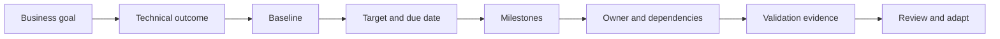

### Technical success plan template

| Field | Question | Fictional NMH example |
|---|---|---|
| Business goal | Why does this matter? | Reduce realistic exposure to Tier 1 manufacturing services |
| Outcome | What condition should change? | Consequential findings receive correct owner and treatment |
| Baseline | Where are we now? | 61 percent validated ownership in initial sample |
| Target | What good looks like and by when? | 90 percent validated ownership in agreed pilot scope by quarter end |
| Measure | How will progress be calculated? | Validated owned Tier 1 records divided by in-scope Tier 1 records |
| Milestones | Which intermediate results matter? | Source authority, mapping, sampling, workflow, training, review |
| Accountable owner | Who answers for the outcome? | Fictional vulnerability-management director |
| Responsible teams | Who performs the work? | CMDB, cloud, endpoint, vulnerability, and platform admins |
| Dependencies | What must be true? | Fresh sources, service mapping, access, maintenance windows |
| Risks | What may prevent success? | Duplicate records, owner disputes, connector instability |
| Validation | What proves completion? | Source reconciliation, sampled records, ticket routing, rescan evidence |
| Cadence | When is it reviewed? | Weekly action review, monthly technical review, quarterly executive review |

### Technical Success charter template

| Charter element | Content |
|---|---|
| Purpose | Why the TSM relationship exists |
| In scope | Strategic technical planning, health, adoption, enablement, risk, and escalation coordination |
| Out of scope | Unlimited implementation, code fixes, roadmap commitments, pricing, and customer incident command unless explicitly assigned |
| Success outcomes | Three to five measurable customer conditions |
| Stakeholders | Executive sponsor, program owner, operators, account team, specialists |
| Decision rights | Who decides scope, risk acceptance, change, product, support, and commercial matters |
| Cadence | Weekly, monthly, quarterly, and escalation rhythms |
| Artifacts | Success plan, health view, action register, RAID, decision log, QBR |
| Escalation path | Severity, contacts, communication, and handoff expectations |
| Review | Date to confirm or revise the charter |

## Customer health

Customer health is an evidence-based view of whether the technical foundation, data, adoption, support experience, stakeholder alignment, outcomes, and future plan are strong enough for durable success. A health score is a conversation aid, not objective truth.

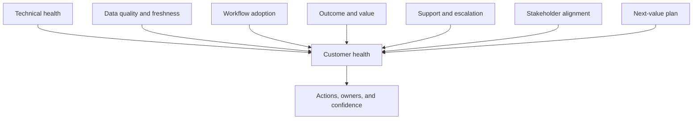

### Illustrative health-score template

The following formula is fictional and is not a Zscaler formula. Each component is scored from 0 to 100 after explicit evidence review.

$$
H = 0.20T + 0.15D + 0.20A + 0.20V + 0.10S + 0.10G + 0.05F
$$

Here, $T$ is technical health, $D$ is data quality, $A$ is adoption, $V$ is value, $S$ is support experience, $G$ is governance and stakeholder alignment, and $F$ is future-value readiness.

| Component | Weight | Evidence | Red condition | Caveat |
|---|---:|---|---|---|
| Technical health | 20 percent | Service, connector, policy, integration, and performance evidence | Material capability unavailable or unreliable | Green status can hide wrong data |
| Data quality | 15 percent | Completeness, freshness, accuracy, mapping, reconciliation | Decisions rely on stale or incomplete sources | Quality varies by use case |
| Adoption | 20 percent | Meaningful workflow use and proficiency | Target roles bypass the platform | Login counts are weak evidence |
| Value | 20 percent | Baseline-to-target outcome evidence | No accepted outcome or declining result | Attribution may be shared |
| Support | 10 percent | Case trend, severity, recurrence, sentiment | Repeated unresolved critical issue | High case count may reflect broad adoption |
| Governance | 10 percent | Sponsor, owners, decisions, action closure | No accountable sponsor or actions stall | Sentiment needs corroboration |
| Future readiness | 5 percent | Accepted next-value roadmap | No relevant next outcome | Expansion is not automatically healthy |

### Health scoring rules

| Rule | Reason |
|---|---|
| Show component scores, not only the total | A total can hide one critical red area |
| Record evidence date and owner | Health decays when evidence becomes stale |
| Use hard-stop conditions | A severe trust or data-integrity issue should not be averaged away |
| Separate fact from sentiment | Sponsor confidence matters but cannot replace telemetry |
| Track trend and confidence | Direction and evidence quality matter more than false precision |
| Tie every red or amber signal to action | Scoring without intervention is decoration |
| Recalibrate after learning | Weights and thresholds are assumptions, not natural law |

## Plain-English deep-dive 3 - A health score is a smoke alarm, not a property valuation

A smoke alarm is valuable because it focuses attention. It does not tell you the exact cost of damage, identify every cause, or replace inspection. A customer health score should similarly prompt investigation and action.

Suppose NMH's fictional health is 82, but cloud inventory stopped updating. Averaging can keep the total green even though risk decisions are invalid. A hard-stop rule should mark health red or provisional when a critical data source is stale beyond tolerance. The score serves judgment; judgment does not serve the score.

| Score question | Weak approach | Strong approach |
|---|---|---|
| Why did health change? | "The number fell five points" | Identify component, source, date, driver, and consequence |
| Is 82 healthy? | Apply universal threshold | Compare agreed criteria, hard stops, trend, and confidence |
| What should happen? | Debate color | Assign owner, action, due date, and validation |
| Can health support renewal? | Treat total as proof | Combine value evidence, risk, stakeholder view, and next plan |
| Can missing data improve health? | Missing signal defaults to zero risk | Missing critical data lowers confidence and triggers validation |

## KPI tree and value measures

A **Key Performance Indicator**, or KPI, is a measure that helps a stakeholder judge progress and make a decision. A KPI tree connects executive outcomes to operational drivers.

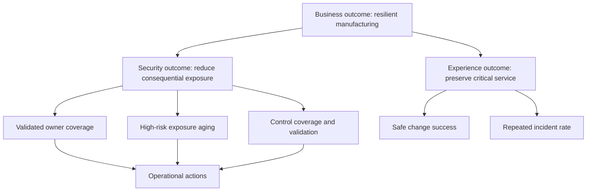

| Measure type | Definition | Example | Misuse |
|---|---|---|---|
| Leading indicator | Predicts or enables future outcome | Connector freshness or owner coverage | Treated as final value |
| Lagging indicator | Records achieved result | Validated exposure reduction | Arrives too late to steer alone |
| Activity | Work performed | Workshops held | Reported as impact |
| Quality | Correctness or fitness | Ticket-to-source reconciliation | Sample bias ignored |
| Efficiency | Resources needed for result | Analyst time per validated priority | Speed rewarded despite error |
| Adoption | Repeated target behavior | Weekly contextual review completed correctly | Logins used as proxy |
| Risk | Exposure, likelihood, or impact evidence | Aging of high-context risk items | Score treated as certainty |
| Experience | User or stakeholder result | Task success, latency, satisfaction | Satisfaction hides technical weakness |

### Example KPI dictionary

| KPI | Definition | Source | Frequency | Owner | Decision |
|---|---|---|---|---|---|
| Source freshness compliance | In-scope sources within agreed freshness divided by all in-scope sources | Connector and source logs | Daily | Data owner | Investigate stale source |
| Validated owner coverage | Assets with confirmed accountable owner divided by in-scope assets | CMDB and owner review | Weekly | Asset program owner | Escalate ownership gap |
| Meaningful workflow adoption | Target users completing defined workflow correctly within period | Product and workflow evidence | Weekly | Program owner | Change training or integration |
| High-risk aging | Median and percentile age of accepted high-priority items | Finding and ticket data | Weekly | Remediation owner | Adjust campaign and capacity |
| Closure validation rate | Closed actions with source or control evidence divided by closed actions | Ticket and source evidence | Weekly | Vulnerability lead | Reopen false closure |
| Critical recurrence rate | Repeated material failures in defined period | Support and incident records | Monthly | Service owner | Prioritize prevention |
| Sponsor decision latency | Time from documented request to decision | Decision log | Monthly | Executive sponsor | Clarify authority or cadence |

## Maturity model

Maturity describes how repeatable, measured, integrated, and improving a capability is. It should not become a badge. A higher level is useful only when it supports customer goals.

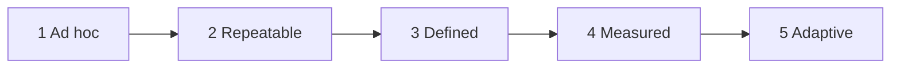

| Level | Characteristics | TSM focus | Exit evidence |
|---|---|---|---|
| 1 - Ad hoc | Heroic response, unclear owners, inconsistent process | Stabilize scope, ownership, and critical workflow | Named owners and basic runbook |
| 2 - Repeatable | Some recurring steps, uneven execution | Standardize cadence, artifacts, and training | Workflow repeated in pilot scope |
| 3 - Defined | Documented process and decision rights | Integrate teams, measures, and exceptions | Accepted RACI, KPI dictionary, governance |
| 4 - Measured | Quality, outcomes, and risk trends inform action | Improve drivers and prediction | Decisions demonstrably use metrics |
| 5 - Adaptive | Feedback changes policy, workflow, and priorities continuously | Sustain learning and expand safely | Controlled improvement with validated outcomes |

Maturity is multidimensional. NMH might have mature endpoint incident response but ad hoc cloud-asset ownership. Never average away the specific capability that matters to the current outcome.

## Governance cadences

Governance is the structure for decisions, accountability, evidence, and escalation. Cadence means the repeated rhythm of interaction.

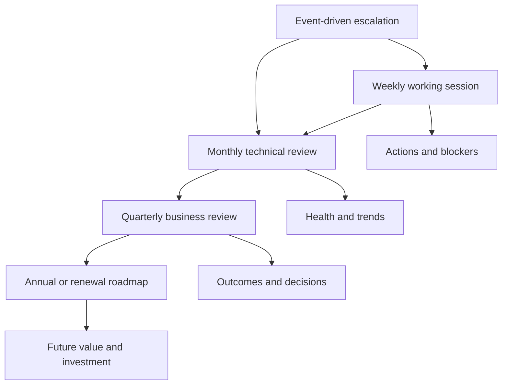

| Cadence | Audience | Purpose | Inputs | Outputs |
|---|---|---|---|---|
| Weekly working session | Operators and workstream owners | Move milestones and blockers | Action register, RAID, technical evidence | Accepted actions and decisions needed |
| Monthly technical review | Program owners and architects | Inspect health, adoption, data, cases, risk, and change | KPI trend, support trend, roadmap | Technical decisions and plan changes |
| Quarterly business review | Sponsor, leaders, account team | Confirm outcomes, risks, value, decisions, and next quarter | Outcome evidence, health, risks, roadmap | Executive decisions and priorities |
| Annual or renewal roadmap | Executive sponsor, CSM, Sales, program leadership | Reconcile achieved value, residual risk, and next investment | Multi-quarter evidence and strategy | Technical value narrative and future plan |
| Escalation cadence | Impacted owners and responders | Stabilize impact and coordinate recovery | Impact, timeline, hypotheses, workstreams | Reliable updates, recovery, and prevention |

Cadence should shrink when risk is high and expand when operations are stable. Meetings without decisions should be redesigned or removed.

## Account portfolio and time management

A TSM may serve multiple accounts. Equal time is rarely fair or effective. Prioritization should consider customer impact, technical risk, commitment, strategic milestone, leverage, and urgency.

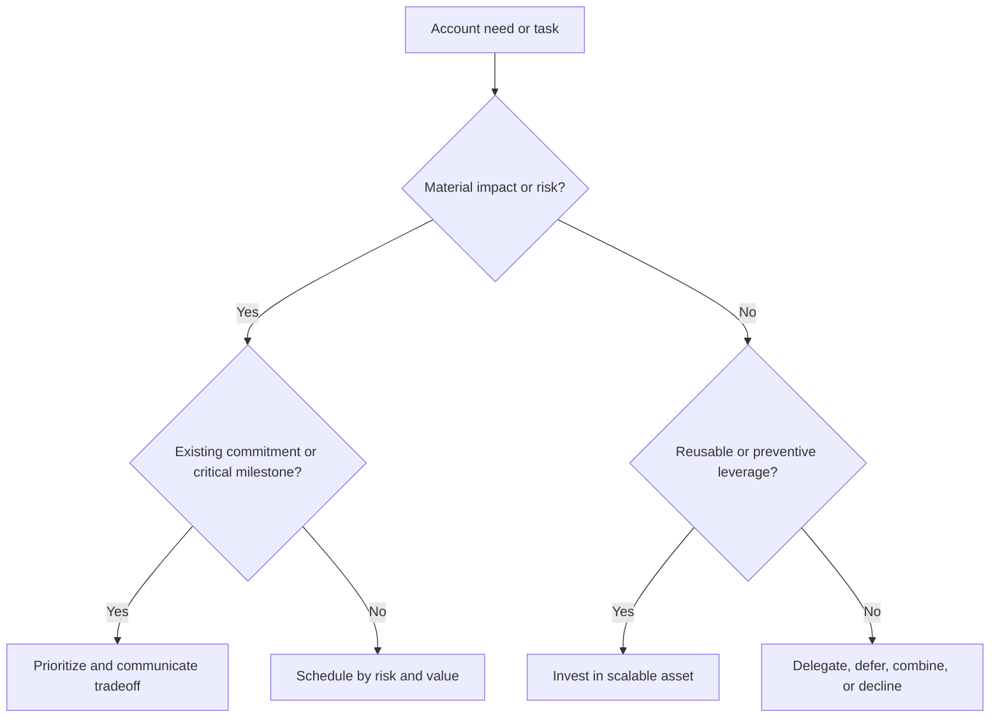

### Illustrative portfolio priority model

The formula below is a fictional planning aid, not a Zscaler policy.

$$
P = 0.30I + 0.25R + 0.20C + 0.15M + 0.10L
$$

$I$ is customer impact, $R$ is technical or account risk, $C$ is commitment criticality, $M$ is milestone timing, and $L$ is reusable leverage. Each is scored from 0 to 100 with a written rationale.

| Planning bucket | Typical work | Time behavior | Communication |
|---|---|---|---|
| Critical now | Material outage, invalid decision data, severe trust event | Interrupt planned work and create explicit workstreams | State displaced commitments immediately |
| Strategic committed | Pilot gate, executive decision, adoption milestone | Protect calendar and preparation time | Confirm inputs and decision owner |
| Preventive leverage | Runbook, reusable training, health automation | Batch and invest deliberately | Explain downstream value |
| Routine | Normal review and low-risk action | Use standard cadence | Keep action register current |
| Low-value or out-of-scope | Duplicate meeting, unsupported custom work | Delegate, combine, defer, or decline | Explain owner and alternative |

Time management also requires preparation and follow-up. A customer meeting without evidence review or action closure creates hidden debt.

## Technical debt and product gaps

**Technical debt** is future cost created by a short-term technical choice. A workaround may be rational, but its owner, risk, expiry, and removal plan should be explicit. A **product gap** is a difference between a customer need and currently validated product capability.

| Category | Example | TSM action | Wrong action |
|---|---|---|---|
| Configuration gap | Existing capability is not configured | Confirm prerequisites, owner, and change plan | Call it a product defect |
| Knowledge gap | User does not know workflow | Provide role-based enablement and teach-back | Add a feature request |
| Process gap | Customer ownership is unclear | Establish RACI and escalation | Expect technology to decide authority |
| Data gap | Required source field is absent or stale | Repair source, mapping, or scope; label confidence | Lower risk silently |
| Product defect | Documented behavior fails reproducibly | Engage Support with evidence | Promise Engineering timing |
| Product limitation | Current capability does not meet need | Document constraint and safe alternatives | Hide limitation |
| Product request | New capability would address verified use case | Submit evidence through Product process | Promise roadmap delivery |
| Technical debt | Temporary workaround increases future burden | Record owner, risk, expiry, and retirement trigger | Let workaround become invisible architecture |

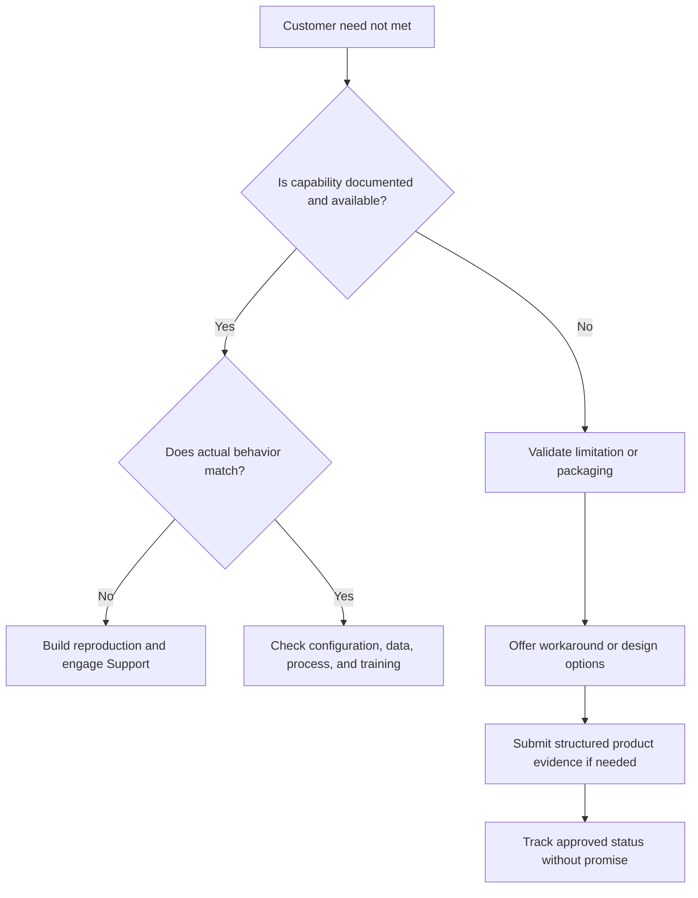

### Product request template

| Field | Content |
|---|---|
| Customer outcome | The business or security condition to improve |
| Current workflow | How the customer works today |
| Verified limitation | What current capability cannot do, with evidence |
| Impact | Users, scope, frequency, risk, effort, or revenue context as appropriate |
| Workaround | Available alternative, cost, and risk |
| Requested capability | Outcome-oriented need, not a UI design command |
| Urgency | Decision date and consequence, not emotional priority |
| Evidence | Logs, samples, screenshots, architecture, frequency, affected roles |
| Communication owner | Who provides approved status to customer |
| Promise guardrail | No date or commitment without authorized Product statement |

## Escalation as a customer-success motion

An escalation is a situation that needs increased attention, authority, expertise, or coordination because normal flow is insufficient. It can be technical, relational, adoption-related, commercial, or executive.

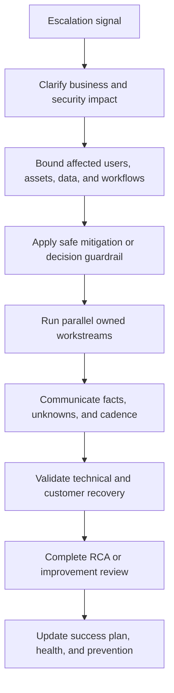

| Escalation stage | TSM question | Artifact | Exit condition |
|---|---|---|---|
| Intake | What changed, who is affected, and why now? | Impact statement | Severity and owner accepted |
| Stabilize | What decision or service must be protected immediately? | Mitigation plan | Impact bounded or decision guarded |
| Investigate | Which hypotheses and tests distinguish ownership? | Evidence timeline | Cause or next owner supported by evidence |
| Coordinate | Which workstreams, dependencies, and authorities matter? | Workstream table | Every action has owner and due time |
| Communicate | What can each audience safely conclude? | Update template | Cadence and expectation accepted |
| Recover | What proves restoration and data integrity? | Validation checklist | Customer workflow and downstream effects verified |
| Improve | Why did controls fail and how will recurrence fall? | RCA or post-incident review | Prevention actions enter success plan |

Repeated escalations are strategic data. They may reveal architecture debt, weak change control, unclear ownership, low training, support-quality issues, product limitations, or a mismatch between customer expectation and licensed capability.

## Enablement and customer independence

Enablement builds the customer's ability to operate without constant vendor intervention. Training is one enablement method; documentation, office hours, guided practice, champions, and workflow redesign are others.

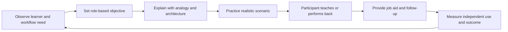

| Enablement need | Intervention | Validation |
|---|---|---|
| Concept confusion | Plain explanation, diagram, comparison | Learner explains concept accurately |
| Procedure confusion | Guided demonstration and checklist | Learner completes workflow independently |
| Decision confusion | Scenario, rubric, and examples | Learner makes and defends correct choice |
| Rare critical task | Simulation and runbook | Team executes under timed practice |
| Role ambiguity | RACI workshop | Owners accept responsibilities |
| Low confidence | Office hours and coached repetition | Fewer avoidable escalations and stronger independence |

Your factual mentoring, onboarding, partner training, knowledge writing, interviewing, and AI training create a strong transfer. You should explain how you assessed learner need and measured independence rather than only attendance.

## Core operating templates

### Action register

| ID | Action | Owner | Due date | Status | Dependency | Completion evidence |
|---|---|---|---|---|---|---|
| A-01 | Validate owner source for Tier 1 applications | Fictional CMDB owner | 2026-09-04 | Open | Service catalog export | Signed sample and rule |
| A-02 | Test cloud credential rotation in nonproduction | Fictional cloud admin | 2026-09-07 | Open | Test credential | Successful run and reconciled counts |
| A-03 | Observe analyst priority workflow | Fictional TSM and VM lead | 2026-09-09 | Planned | User availability | Friction log and revised training |

An action is complete only when its evidence meets the definition of done. "Email sent" is not completion if another owner has not accepted the work.

### RAID log

| ID | Type | Statement | Probability or status | Impact | Owner | Treatment or test | Review date |
|---|---|---|---|---|---|---|---|
| R-01 | Risk | Cloud credential rotation may interrupt data freshness | Medium | High | Cloud admin | Test rotation and alerting | Weekly |
| A-01 | Assumption | CMDB owner field represents accountable service owner | Untested | High | CMDB owner | Sample with service leads | Weekly |
| I-01 | Issue | Thirty-six-hour connector delay is active | Open | High | Support owner | Evidence package and recovery | Daily |
| D-01 | Dependency | Plant patching needs approved maintenance window | Active | High | Plant lead | Add calendar to treatment plan | Monthly |

### Decision log

| Field | Example |
|---|---|
| Decision ID | DEC-014 |
| Question | Can the executive risk trend be used while cloud inventory is stale? |
| Date and owner | Fictional 2026-09-11, CISO accountable |
| Evidence | Connector timestamps, missing cloud count, affected dashboards |
| Options | Use as-is; label provisional; pause; reconcile bounded scope |
| Decision | Pause trend claim and use bounded reconciliation for urgent scope |
| Consequence | Executive deck updated; analyst capacity diverted |
| Review trigger | Successful ingestion plus source and downstream reconciliation |

### RACI template

| Activity | TSM | Customer program owner | Customer admin | Support | Product | Sales | Executive sponsor |
|---|---|---|---|---|---|---|---|
| Define outcomes | Responsible | Accountable | Consulted | Informed | Consulted | Consulted | Consulted |
| Approve source access | Consulted | Accountable | Responsible | Consulted | Informed | Informed | Informed |
| Diagnose product incident | Consulted | Informed | Consulted | Accountable and Responsible | Consulted | Informed | Informed |
| Prioritize roadmap request | Informed | Consulted | Informed | Informed | Accountable and Responsible | Consulted | Informed |
| Make commercial commitment | Consulted | Consulted | Informed | Informed | Informed | Accountable and Responsible | Informed |
| Accept customer risk | Informed | Responsible | Consulted | Informed | Informed | Informed | Accountable |
| Maintain success plan | Accountable and Responsible | Responsible | Consulted | Consulted | Consulted | Consulted | Informed |

RACI is contextual. The table is an illustrative starting point, not a contract.

### Communication plan

| Audience | Need | Content | Channel | Cadence | Owner | Feedback mechanism |
|---|---|---|---|---|---|---|
| Operators | Current tasks and blockers | Evidence, procedure, owner, due date | Working session and action register | Weekly | TSM and program owner | Action acceptance |
| Architects | Design, dependencies, tradeoffs | Architecture, decisions, risks, changes | Technical review | Monthly | Technical owners | Decision log |
| Executive sponsor | Outcome, risk, decision | Trend, business impact, uncertainty, ask | Executive brief | Quarterly or event-driven | TSM and customer lead | Decision and priority |
| Support | Reproduction and impact | Timestamps, evidence, expected versus actual | Support case | As needed | Case owner | Case acceptance |
| Account team | Health, value, risk, next plan | Technical narrative and dependencies | Account sync | Biweekly or monthly | TSM, CSM, Sales | Shared account plan |
| Users | Workflow and change | Role-specific instruction and support | Training and job aid | At change points | Program owner | Teach-back and usage |

### Account plan template

| Account-plan section | Questions |
|---|---|
| Customer strategy | Which business services, transformations, and risks matter? |
| Investment intent | Why were current capabilities purchased? |
| Stakeholders | Who sponsors, operates, influences, blocks, and decides? |
| Environment | Which identities, endpoints, networks, apps, clouds, data, and tools matter? |
| Product footprint | What is licensed, deployed, healthy, adopted, and unused? |
| Outcomes | What baseline, target, evidence, and business value exist? |
| Health and risk | Which red or amber signals threaten success? |
| Support history | Which incidents, recurrence, and trust issues matter? |
| Product gaps | Which validated limitations or requests exist? |
| Commercial context | Which dates and dependencies should technical teams know without making commitments? |
| Next value | Which unmet need is qualified and relevant? |
| Actions | Which owners, dates, and decisions move the account? |

### QBR template

| QBR section | Executive question | Evidence | Avoid |
|---|---|---|---|
| Purpose | What decisions should this review enable? | Agenda and requested decisions | A product tour |
| Outcome summary | What improved since last quarter? | Baseline, target, result, scope | Activity totals |
| Health | Is the foundation reliable and adopted? | Component trends and confidence | One opaque color |
| Risk | What could prevent value or increase exposure? | Top risks, owners, treatment | Long unprioritized list |
| Escalations | What material issue occurred and what changed? | Impact, recovery, recurrence action | Technical chronology without meaning |
| Adoption | Are target roles using workflows effectively? | Meaningful use and proficiency | Login counts alone |
| Value | Why does the outcome matter? | Time, quality, risk, resilience, or cost | Universal ROI claims |
| Decisions | What approval or tradeoff is needed? | Options and recommendation | Vague "support needed" |
| Next quarter | Which three outcomes matter next? | Milestones, owners, dependencies | Feature wish list |

## Stakeholder trust

Trust differs by stakeholder. A CISO may value risk transparency. An operator may value usable evidence. A Sales leader may value forecast clarity. Product may value structured need rather than volume. The TSM must keep one truth while changing depth and format.

| Stakeholder | Trust question | TSM proof |
|---|---|---|
| Executive sponsor | Will you tell me what matters and what you do not know? | Concise outcome, risk, uncertainty, and decision request |
| Program owner | Will this plan help my team succeed? | Realistic milestones, dependencies, and ownership |
| Operator | Do you understand the workflow and evidence? | Technical depth, observation, useful troubleshooting |
| Support | Is the case reproducible and correctly scoped? | Timestamps, expected versus actual, impact, artifacts |
| Product | Is this a validated problem worth evaluating? | Use case, frequency, impact, limitation, workaround |
| Sales | Are technical value and risk represented accurately? | Evidence, boundaries, and no surprise |
| Engineering | Is the evidence clean enough to act on? | Reproduction, traces, versions, recent changes, result |

## Scenario 1 - Low adoption

NMH's fictional vulnerability analysts attend training but continue using spreadsheets. The weak conclusion is "people resist change." The TSM should diagnose.

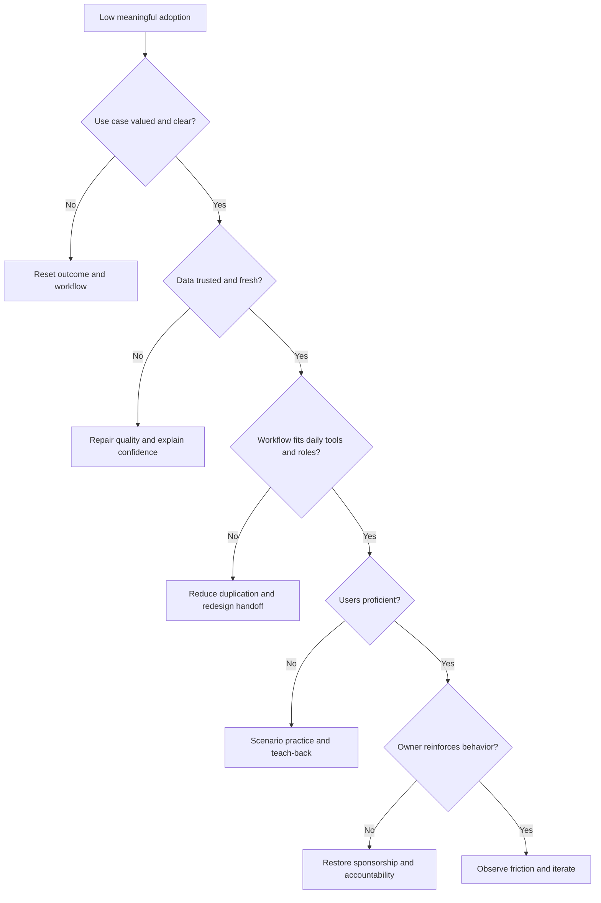

The TSM compares target and actual behavior, interviews users, samples records, watches the workflow, and identifies the smallest barrier. The action may be data repair, ticket integration, role clarification, training, or sponsor reinforcement. Success is repeated correct use and improved outcome, not another webinar.

## Scenario 2 - No executive sponsor

An executive sponsor provides authority, priority, resources, and decisions for a material program. Without one, cross-functional actions often stall.

| Symptom | Risk | TSM response |
|---|---|---|
| Meetings continue but decisions wait | Program becomes activity theater | List blocked decisions and business consequence |
| Owners reject cross-team work | No authority aligns priorities | Identify natural sponsor and decision path |
| Outcomes change every month | Strategy lacks stable intent | Reconfirm problem, scope, and success criteria |
| Escalations jump directly to executives | Governance is event-driven | Establish working, technical, and executive cadences |
| Renewal discussion surprises technical team | Value evidence lacks sponsor | Align CSM and Sales; build honest technical narrative |

The TSM should not manufacture sponsorship. The TSM can show what decisions are blocked, propose the appropriate role, engage the account team, and revise plan confidence. A plan without authority is a hypothesis, not a commitment.

## Scenario 3 - Scope confusion

The customer expects the TSM to build custom integrations, run daily vulnerability operations, and provide incident response. The TSM must protect the relationship without a blunt refusal.

1. Re-state the customer's desired outcome.
2. Compare the request with the agreed charter and service scope.
3. Identify which work is TSM continuity, Support, Professional Services, customer operation, or another service.
4. Offer a valid route, owner, and handoff.
5. Record any commercial or service decision through the authorized team.
6. Update the charter so confusion does not repeat.

Useful language: "I will stay accountable for the integrated outcome and make sure this reaches the right delivery owner. The daily operating task and custom build are outside the TSM charter as I understand it. Let us confirm whether Professional Services, a partner, or the customer engineering team should own delivery, then align that work to the success plan."

## Scenario 4 - Conflicting commercial and technical pressure

Renewal is approaching. Sales wants an optimistic value story, while a critical connector issue remains unresolved. The TSM owes the customer and account team accurate technical truth.

| Pressure | Weak reaction | Strong TSM behavior |
|---|---|---|
| "Do not mention the outage" | Hide material risk | Share scope, current impact, mitigation, recovery plan, and value context |
| "Promise it will be fixed before renewal" | Invent timeline | Provide Support status, dependencies, confidence, and next checkpoint |
| "The customer needs to expand" | Push capability without need | Qualify unmet outcome, readiness, and technical fit |
| "Technical detail will derail the meeting" | Dump detail or omit truth | Use executive summary with appendix and decision relevance |

The TSM collaborates with Sales on narrative and timing but does not sacrifice evidence. Trust lost for one commercial moment damages long-term success.

## Scenario 5 - Roadmap ask

The customer asks whether a custom field-mapping capability will ship next quarter. A credible TSM distinguishes current capability, documented commitment, and request.

1. Clarify the desired workflow and impact.
2. Verify whether current capability, configuration, or workaround addresses it.
3. Capture frequency, scope, users, business consequence, and evidence.
4. Submit through the Product process.
5. Communicate only an authorized status.
6. Keep the success plan realistic without assuming delivery.

"I have submitted it" is not "it is on the roadmap." "Product is evaluating it" is not a committed date. The TSM should preserve useful follow-up without creating implied promises.

## Scenario 6 - Repeated escalations

NMH has three connector incidents in one quarter. Closing each case is insufficient.

| Investigation area | Question | Potential strategic action |
|---|---|---|
| Change | Do failures follow credential rotation or source updates? | Add pre-change test and rollback |
| Monitoring | Was failure detected by customer impact rather than health alert? | Add freshness and volume guardrails |
| Ownership | Who owns source, credential, connector, and downstream decision? | Clarify RACI and on-call path |
| Architecture | Is one source a critical dependency with no fallback? | Define bounded reconciliation or resilience option |
| Process | Are Support cases missing standard evidence? | Create evidence checklist and runbook |
| Product | Is behavior a reproducible defect or limitation? | Escalate with consolidated impact and reproduction |
| Training | Are admins repeating an unsafe procedure? | Role-based practice and change approval |

Repeated incidents should update health, technical debt, risk, success-plan priority, and the executive narrative.

## Plain-English deep-dive 4 - Renewal and expansion are outcomes, not TSM sales promises

Renewal means continuing a commercial agreement. Expansion means purchasing or adopting additional value. A TSM contributes by making technical truth visible: what is deployed, healthy, adopted, valuable, risky, unresolved, and relevant next.

Think of a building inspector supporting a property decision. The inspector provides evidence about condition, repairs, and future suitability. The commercial parties negotiate price and contract. If the inspector hides a foundation problem to help the sale, everyone loses trust. If the inspector negotiates the deal without authority, roles break.

| TSM contribution | Sales or CSM contribution | Shared work |
|---|---|---|
| Technical health and adoption evidence | Commercial strategy and relationship process | One account narrative |
| Outcome validation and caveats | Renewal timing, terms, and forecast | Risk and stakeholder alignment |
| Product fit and prerequisites | Opportunity qualification and pricing | Expansion use-case discovery |
| Technical risk and unresolved gaps | Commercial escalation | Executive communication |
| Next technical value hypothesis | Contract and purchase process | Roadmap and success planning |

Retention is a customer continuing the relationship. Advocacy is a customer willingly supporting references, feedback, or recommendation. Both should follow value and trust; they should not be extracted from a customer who is still waiting for material recovery.

## QBR narrative example for fictional NMH

> **Fiction notice:** Northstar Meridian Holdings, its people, tools, metrics, incidents, and outcomes are synthetic. You did not operate this account or any Zscaler product for it in production.

**Executive opening:** "This quarter, NMH moved the Tier 1 internet-facing pilot from fragmented inventories toward a reconciled, owner-driven workflow. The strongest progress is validated ownership and source reconciliation. The main risk is cloud-source reliability after credential changes, which invalidated one dashboard trend and triggered a corrective workstream. We need two decisions today: approve the source-health hard stop for executive reporting and assign authority for plant exceptions."

| Narrative element | Fictional evidence | Caveat | Decision |
|---|---|---|---|
| Outcome | Validated owner coverage increased in bounded pilot | Synthetic metric; pilot only | Expand after sample acceptance |
| Adoption | Analysts complete contextual review weekly | Frequency does not prove quality alone | Continue teach-back sampling |
| Health | Most sources within freshness target | Cloud connector had repeated failures | Approve hard-stop reporting rule |
| Risk | Plant remediation constrained by maintenance | Risk priority does not override safety authority | Name exception approver |
| Value | Less reconciliation time in pilot | Illustrative, not audited ROI | Validate time sample next quarter |
| Next | Add controlled regions and workflow automation | Depends on data and owner readiness | Approve staged scope |

## Failure modes and troubleshooting

| Failure mode | Symptom | Root question | Corrective action |
|---|---|---|---|
| Calendar TSM | Many meetings, little change | Which decision or outcome does each cadence serve? | Remove, combine, or redesign meetings |
| Support-only TSM | Account interaction occurs only during cases | Which proactive risks and milestones are unowned? | Restore discovery, health, adoption, and roadmap |
| Feature-tour QBR | Slides list releases | What changed for the customer? | Lead with outcomes, risks, decisions, and next value |
| Opaque health score | Team debates color | Which component, evidence, and action drive it? | Show drivers, confidence, and hard stops |
| Adoption by login | Usage appears healthy but workflow fails | What meaningful behavior proves proficiency? | Observe tasks and use teach-back |
| Roadmap overpromise | Customer plans around uncommitted feature | Who authorized the commitment? | Correct expectation and provide current options |
| Hero ownership | TSM becomes bottleneck | Which specialist or customer owner should act? | Clarify RACI and preserve continuity |
| Commercial distortion | Technical risk disappears near renewal | What material fact affects customer decision? | Align one accurate narrative |
| Product blame | Every gap becomes a defect | Is this configuration, data, process, training, limitation, or defect? | Classify with evidence |
| Reactive overload | Strategic milestones repeatedly slip | Which incidents are recurring and preventable? | Convert patterns into roadmap and capacity decisions |

## Your support-to-TSM bridge

| Documented production strength | TSM transfer | New skill to build | Honest language |
|---|---|---|---|
| Business-impact scoping | Outcome discovery and escalation severity | Security and business-service risk framing | "I have scoped enterprise impact; I am building SecOps risk depth" |
| Cross-layer troubleshooting | Architecture and integration analysis | Zscaler and security-data telemetry | "The method transfers; the product evidence is new" |
| Critical-situation coordination | Critical account escalation | Customer SecOps authority and process | "I know high-pressure continuity, not formal SOC command" |
| Engineering collaboration | Support and Product handoff quality | Zscaler internal operating model | "I provide reproducible evidence and learn the current route" |
| Fix validation and RCA | Recovery and recurrence improvement | Security-control effectiveness validation | "I validate outcomes and will seek domain review" |
| CSAT and recognition | Customer trust | Strategic multi-quarter value evidence | "Metrics support one specific factual story" |
| Backlog and case analytics | Health, adoption, and KPI reasoning | Vulnerability and exposure measures | "Analytics transfers; formal VM ownership is not established" |
| Technical advisor and mentoring | Enablement and service scaling | SecOps role-based curriculum | "I have built capability and am learning the new domain" |
| Copilot Studio and AI work | AI-forward workflow thinking | Agentic SecOps product operation | "Employee AI evidence, not autonomous security response" |

## Official Source Anchors

**Checked on 2026-08-24.** Technical Success role boundaries and templates in this chapter are general operating guidance tailored to the approved JD. Official Zscaler sources support company, culture, platform, and product context; they do not publish every internal TSM responsibility or customer-specific service entitlement.

| Official Zscaler source | Used for | Caveat |
|---|---|---|
| https://www.zscaler.com/company/about-zscaler | Mission, vision, and customer transformation context | Does not define the detailed TSM charter |
| https://www.zscaler.com/culture | Ownership, collaboration, outcomes, impact, transparency, urgency, challenge, and accountability | Published intent does not prove every team practice |
| https://www.zscaler.com/careers | High-performing teams, customer obsession, collaboration, ownership, accountability, and candidate context | Role details vary by active posting and location |
| https://www.zscaler.com/products-and-solutions/zero-trust-exchange-zte | Zero trust platform, secure/simplify/transform outcomes, identity, context, risk, and policy | Product and packaging language changes |
| https://www.zscaler.com/products-and-solutions/security-operations | Agentic SecOps context, proactive and reactive operations, and right-sized action | Capability, autonomy, metrics, and licensing require validation |
| https://www.zscaler.com/products-and-solutions/data-fabric | Security-data integration and exposure-management foundation | Connector counts and formats are volatile |
| https://www.zscaler.com/products-and-solutions/vulnerability-management | Contextual prioritization, reporting, and remediation workflow | Outcome metrics are not universal guarantees |
| https://www.zscaler.com/products-and-solutions/caasm | Asset visibility, golden records, gaps, CMDB health, and workflows | Customer integration behavior requires testing |
| https://www.zscaler.com/products-and-solutions/ctem | Continuous exposure-management stages and program positioning | CTEM is broader than one vendor product |
| https://www.zscaler.com/products-and-solutions/zscaler-risk-360 | Risk trend, drivers, mitigation, and executive framing | Model details and factor counts require current verification |

### Source and claim summary

| Label | What belongs here | How to say it |
|---|---|---|
| Officially documented | Dated Zscaler mission, culture, and product positioning | "The official page describes..." |
| General TSM practice | Lifecycle, health, governance, and artifact patterns | "A practical TSM model is..." |
| Customer-specific | Scope, entitlement, service charter, metrics, thresholds, and owners | "I would confirm this for the account..." |
| Fictional | Every NMH person, metric, issue, plan, and result | "In the fictional exercise..." |
| Documented production | Approved Microsoft customer, support, escalation, analytics, mentoring, training, and AI facts | "In my prior production work..." |
| Not established | Zscaler production operation, formal VM/SecOps program ownership, renewal quota | "I have not owned that directly yet..." |

## Likely Interview Questions

### Q1. What does a Technical Success Manager own?

**Model answer:** A TSM owns continuity between customer outcomes and technical execution. That means understanding goals and environment, building a success plan, driving readiness and adoption, monitoring health and risk, coordinating specialists, enabling customer teams, leading the account side of escalations, and proving outcomes over time. The TSM does not automatically own every Support fix, implementation task, Product decision, commercial commitment, or customer security response.

My principle is "own continuity, not every task." I would make the outcome, evidence, accountable owner, responsible workstream, dependency, decision, and next update explicit. That keeps the customer from falling between teams without turning the TSM into a bottleneck or creating false authority.

### Q2. How is a TSM different from a CSM, TAM, Support, and Professional Services?

**Model answer:** A Customer Success Manager generally focuses on value, adoption, relationship, retention, and advocacy. A Technical Account Manager often emphasizes technical health and support continuity. Support resolves incidents and product questions through a case process. Professional Services delivers scoped implementation or transformation work. A TSM combines ongoing outcome ownership with deeper technical leadership across architecture, adoption, health, risk, and escalation.

The titles overlap, so I would confirm the actual charter rather than argue universal definitions. A good boundary is a promise: I will not disappear because another team owns the task, and I will not pretend to own its specialist decision. I will make the handoff evidence-rich and preserve one customer narrative.

### Q3. How would you create a technical success plan?

**Model answer:** I would start with the customer's business outcome, not a feature list. Then I would document current state, target condition, metric definition, milestones, accountable owner, responsible teams, dependencies, risks, cadence, and completion evidence. I would sequence a bounded use case so the team can test data, workflow, and adoption before expanding.

For example, in the fictional NMH case I might scope Tier 1 internet-facing services, validate source and owner quality, establish priority and workflow, train operators with teach-back, reconcile closure evidence, and review outcomes. The example is fictional, not production experience. My production transfer is disciplined discovery, troubleshooting, owner coordination, analytics, communication, and validation.

### Q4. How do you measure customer health without creating a misleading score?

**Model answer:** I use a driver model rather than one opaque color. Components may include technical operation, data quality, meaningful adoption, value, support experience, stakeholder governance, and future readiness. Every component needs a definition, source, date, owner, confidence, and action. Critical hard-stop conditions, such as invalid decision data or a severe trust event, should not be averaged away.

The score is a smoke alarm, not objective truth. I show component trends and explain what decision they support. Missing data reduces confidence; it does not become low risk. I would recalibrate weights and thresholds with the account team as evidence improves.

### Q5. What would you do when adoption is low?

**Model answer:** I would diagnose before scheduling more training. I would compare target and actual behavior, observe the real workflow, and test whether the use case is valued, data is trusted, permissions work, the workflow fits existing tools, users are proficient, ownership is clear, and the sponsor reinforces the change. Each cause needs a different intervention.

Success is repeated, correct, independent use that improves an outcome. Login count and training attendance are weak proxies. Your factual mentoring and training experience supports role-based explanation and teach-back; direct Zscaler workflow adoption remains a product ramp area.

### Q6. How do you support renewal and expansion without becoming the salesperson?

**Model answer:** I provide accurate technical evidence: deployment and data health, meaningful adoption, achieved outcomes, unresolved risk, stakeholder confidence, and a credible next-value plan. I collaborate with Customer Success and Sales so there is one account narrative. Sales owns authorized commercial commitments, pricing, and contract process.

For expansion, I start with a verified unmet customer need, not product pressure. I document technical fit, prerequisites, expected outcome, risks, and validation. I do not hide a material technical issue to improve a forecast or promise a product roadmap date. Long-term retention depends on trust and useful value.

### Q7. How would you handle a roadmap request from a strategic customer?

**Model answer:** I would clarify the customer outcome and current workflow, verify whether existing capability or configuration addresses it, and document the validated limitation, scope, frequency, impact, workaround, and decision date. I would submit that evidence through the Product process and communicate only an approved status.

"Submitted" is not "committed," and "being evaluated" is not a delivery date. I would keep the success plan viable with current options and revisit when authorized information changes. My production Engineering and Product Group collaboration helps with evidence quality; I would not claim roadmap authority.

### Q8. How does your Support Escalation Engineering background prepare you for proactive Technical Success?

**Model answer:** My production support work gives me a strong foundation in enterprise impact, cross-layer troubleshooting, evidence, Engineering coordination, customer communication, high-pressure ownership, fix validation, and recurrence learning. My technical advisor, backlog analysis, mentoring, onboarding, training, and AI work also show proactive and scalable behavior beyond individual case resolution.

The deliberate shift is to apply that rigor earlier: discover goals, baseline health, identify risks before incidents, build milestones, drive adoption, enable users, and measure durable outcomes. I do not claim formal TSM portfolio ownership, Zscaler production operation, or vulnerability-program leadership. I would prove the transition through reviewed success plans, synthetic labs, shadowing, reverse-shadowing, and measurable customer artifacts before independent high-impact guidance.

## 30-Second Memory Hooks

| Concept | Memory hook |
|---|---|
| TSM | Technology into durable customer outcomes |
| Boundary | Own continuity, not every task |
| CSM | Value and relationship stay visible |
| TAM | Technical account health and continuity |
| Support | Diagnose and restore through a case |
| Professional Services | Scoped design and delivery |
| Product | Prioritizes product problems, not customer promises |
| SOC | Monitors and responds; the TSM does not replace it |
| Lifecycle | Handoff, discover, onboard, adopt, realize, optimize |
| Adoption | Repeated correct behavior, not access |
| Value | Baseline, changed condition, business meaning |
| Health | Drivers, evidence, confidence, action |
| KPI | A measure that supports a decision |
| Maturity | Ad hoc to adaptive, capability by capability |
| Governance | Right people, evidence, decisions, cadence |
| Portfolio | Impact, risk, commitment, milestone, leverage |
| Technical debt | Temporary choice with future cost and expiry |
| Product gap | Evidence and options, never a roadmap promise |
| Escalation | Stabilize, coordinate, recover, prevent |
| Enablement | Explain, practice, teach back, operate independently |
| Renewal | Technical truth supports; Sales commits |
| Experience bridge | Apply incident rigor before the incident |

## Completion Checklist

- [ ] I can define a TSM without jargon or feature lists.
- [ ] I can distinguish TSM, CSM, TAM, Support, Professional Services, Sales Engineering, Sales, Product, Engineering, and SOC.
- [ ] I can explain ownership of continuity without absorbing every task.
- [ ] I can draw the customer lifecycle and recurring success loop.
- [ ] I can distinguish entitlement, activation, engagement, proficiency, embedded adoption, and value.
- [ ] I can convert reactive incidents into strategic improvement.
- [ ] I can explain the technical depth expected of a TSM.
- [ ] I can draft a charter and technical success plan with measurable outcomes.
- [ ] I can build a component-based health score with hard stops and confidence.
- [ ] I can create a KPI tree and metric dictionary.
- [ ] I can assess maturity by capability rather than one average label.
- [ ] I can design weekly, monthly, quarterly, renewal, and escalation cadences.
- [ ] I can prioritize a multi-account portfolio and communicate displaced commitments.
- [ ] I can distinguish configuration, data, process, training, defect, limitation, request, and technical debt.
- [ ] I can create an action register, RAID log, decision log, RACI, communication plan, account plan, and QBR.
- [ ] I can handle low adoption, no sponsor, scope confusion, commercial pressure, roadmap asks, and repeated escalations.
- [ ] I can collaborate on retention, renewal, and expansion without making Sales commitments.
- [ ] I can describe every NMH example as fictional.
- [ ] I can state exactly which transferable evidence is production, conceptual, lab, fictional, or not yet used.
- [ ] I can answer all eight questions aloud with one skeptical follow-up each.
- [ ] I have rechecked official source anchors if preparing after 2026-08-24.

[Part 4 - Enterprise Customer Environment and Stakeholder Thinking](Part-04-enterprise-environment-stakeholders.md)