# Part 4 - Enterprise Customer Environment and Stakeholder Thinking

> **Audience:** Candidates preparing to move from enterprise Support Escalation Engineering into a Zscaler Security Operations Technical Success Manager role.
>
> **Currency date:** 2026-08-24.
>
> **Honesty rule:** Architecture maps and Northstar Meridian Holdings examples in this chapter are fictional learning artifacts. Your production evidence comes from Microsoft 365 support, SharePoint Online, OneDrive for Business, Sync, Copilot-related work, networking investigation, escalation, analytics, mentoring, training, and approved AI experience. Direct production administration of Zscaler, Security Operations, vulnerability, or exposure products is not established.
>
> **Product caveat:** Zscaler capabilities, integrations, packaging, product names, and telemetry can change. A diagram is also a model, not the live environment. Validate every important path, owner, boundary, source, and licensed behavior with current evidence.

## Section goal

This chapter teaches you how to see an enterprise as a connected system rather than a list of tools. The starting point is a **business service**: a capability the organization needs to operate, such as fleet dispatch, plant scheduling, online sales, payroll, or collaboration. Users, identities, endpoints, networks, applications, cloud services, data, security tools, owners, regulations, and service commitments all support that service.

Think of a restaurant. A customer sees a meal, but reliable delivery depends on staff, ingredients, suppliers, refrigeration, cooking equipment, payment, safety rules, and managers. A failure in a hidden dependency can stop the visible service. Enterprise architecture thinking makes those hidden dependencies, ownership boundaries, and failure consequences visible before a crisis.

By the end of Part 4, you should be able to:

| Learning outcome | What mastery looks like |
|---|---|
| Start with business service | Explain who consumes it, why it matters, and what failure costs |
| Map the environment | Trace users, identities, endpoints, networks, applications, cloud, SaaS, data, tools, systems, owners, regulation, and SLA |
| Separate architecture views | Distinguish physical, logical, data, control, and management planes |
| Reason about dependency | Identify trust boundaries, failure domains, blast radius, criticality, data flow, telemetry flow, and support boundaries |
| Think through stakeholders | Predict goals, fears, evidence, authority, and language for executive, technical, governance, commercial, and vendor personas |
| Run discovery | Ask layered questions, request proportionate evidence, and label uncertainty |
| Draw useful diagrams | Choose context, container, flow, sequence, ownership, or failure view for the decision |
| Resolve ambiguity | Establish source authority, decision rights, RACI, and data-quality rules |
| Use your bridge | Transfer OneDrive, SharePoint, browser, identity, permissions, endpoint, sync, and networking reasoning honestly |

## JD Mapping

**JD** means job description. The target role expects complex-environment analysis, security-risk identification, mitigation guidance, enterprise consulting, executive communication, cross-functional partnership, escalation leadership, and long-term success.

| JD expectation | Environment-thinking behavior | Artifact | Decision enabled |
|---|---|---|---|
| Analyze complex technical environments | Start from business service and map dependencies across layers | Enterprise context map | Where to collect evidence and who owns it |
| Identify security risks | Mark assets, identities, data, controls, trust boundaries, and uncertainty | Risk and trust-boundary view | Which exposure deserves validation first |
| Deliver tailored mitigation | Consider criticality, blast radius, change risk, and authority | Option and tradeoff record | Which treatment is safe and proportionate |
| Lead strategic engagement | Connect architecture to goals, owners, regulation, SLA, and roadmap | Current-state assessment | What the success plan must change |
| Resolve escalations | Bound impact, failure domain, telemetry, and support ownership | Incident context and sequence diagrams | Which workstreams and specialists to engage |
| Partner across functions | Clarify customer, Support, Sales, Product, and Engineering roles | RACI and boundary map | Who decides, performs, advises, and communicates |
| Communicate with executives | Translate technical dependency into business consequence and decision | Executive service-risk summary | Which risk, investment, or exception to approve |
| Train and consult | Make architecture understandable to mixed audiences | Layered whiteboard and glossary | Whether stakeholders share the same model |

## Candidate honesty note

You can credibly say that your production Microsoft 365 work required cross-layer thinking. A OneDrive sync symptom can involve user identity, device state, client process, file path, permissions, network name resolution, proxy behavior, encrypted transport, service health, throttling, or content state. SharePoint access can involve tenant configuration, authentication, authorization, browser behavior, policy, and service dependencies.

That experience proves a method: scope the user-visible service, map the path, separate control from data, collect evidence, identify the owning boundary, and validate the result. It does not prove that you designed an enterprise security architecture or operated Zscaler products in production.

| Claim label | Safe evidence | Boundary statement |
|---|---|---|
| Production | Microsoft 365 service troubleshooting, customer impact, traces, escalation, and validation | "The cross-layer method is proven in enterprise support" |
| Lab | A synthetic packet, identity, asset, or data-flow exercise | "I performed this in a controlled lab" |
| Conceptual | Enterprise planes, trust boundaries, blast-radius analysis, Zscaler context | "I understand the model and would validate it this way" |
| Fictional | Every Northstar Meridian environment, person, metric, and decision | "This is a fictional case artifact" |
| Not yet used | Direct Zscaler, SecOps, scanner, EDR, SIEM, or vulnerability-program administration | "I have not operated that product directly yet" |

## Acronyms and essential terms

| Acronym or term | Plain meaning | Why it matters | Memory hook |
|---|---|---|---|
| API | Application Programming Interface, a defined software-to-software exchange | Connectors and workflows depend on contracts, identity, limits, and errors | API is a software service counter |
| CISO | Chief Information Security Officer | Owns security-program risk and executive security narrative | CISO asks what business risk changed |
| CIO | Chief Information Officer | Owns information technology strategy and service outcomes | CIO asks how technology enables operations |
| CMDB | Configuration Management Database | Records technology items, relationships, lifecycle, and ownership | CMDB is a dependency register, not perfect truth |
| DNS | Domain Name System | Converts names into network destinations | DNS is the network phonebook plus routing clue |
| EDR | Endpoint Detection and Response | Monitors endpoints and supports threat detection and response | EDR watches devices for suspicious behavior |
| IAM | Identity and Access Management | Governs digital identities and access | IAM answers who can do what |
| JD | Job Description | Defines the role expectations | Every JD verb needs evidence |
| RACI | Responsible, Accountable, Consulted, Informed | Clarifies work and decision participation | One accountable owner prevents drift |
| SaaS | Software as a Service | An externally operated application consumed as an online service | SaaS shifts operation, not accountability |
| SIEM | Security Information and Event Management | Collects and analyzes security event and log data | SIEM is an event-focused security control room |
| SLA | Service Level Agreement | A documented service commitment, often involving availability or response | SLA translates impact into agreed expectation |
| SOC | Security Operations Center | Monitors, investigates, and responds to threats | SOC is the security watch floor |
| TSM | Technical Success Manager | Connects technical capability to durable customer outcomes | TSM owns continuity |
| VM | Vulnerability Management | Finds, prioritizes, treats, validates, and governs weaknesses | Find, prioritize, fix, prove, improve |

## Begin with the business service

A business service is a capability delivered to a consumer. The consumer might be an employee, customer, supplier, machine, regulator, or another application. Business-service thinking prevents a tool-centered analysis from missing the actual consequence.

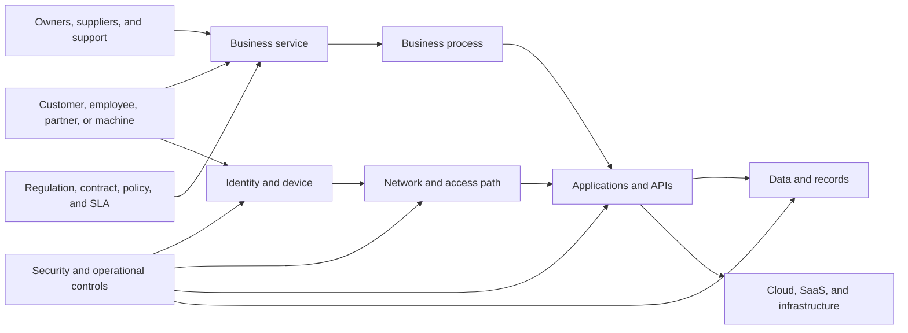

| Business-service question | Example for fictional NMH fleet dispatch | Why it matters |
|---|---|---|
| Who consumes it? | Dispatchers, drivers, warehouse teams, customers | Defines user impact and identity types |
| What outcome does it enable? | Route and deliver goods on time | Connects technology to business value |
| When is it critical? | Regional shipping windows and incident peaks | Shapes recovery and change timing |
| What data matters? | Location, cargo, customer, route, and driver data | Identifies sensitivity and integrity needs |
| What failure is tolerable? | Brief degraded mode with manual fallback | Defines resilience and SLA |
| Which dependencies exist? | Identity, endpoint, network, cloud API, database, maps, messaging | Guides architecture and evidence |
| Who owns decisions? | Logistics product owner and technology service owner | Prevents technical teams from inventing business authority |
| Which rules apply? | Privacy, customer contracts, regional transport obligations | Changes treatment and notification decisions |

### Service criticality

Criticality is the importance of a service or asset to the organization's objectives. It is not the same as technical severity. A minor technical defect can be critical during payroll close; a severe vulnerability on an isolated lab device may have lower immediate business consequence.

| Criticality dimension | Question | Evidence |
|---|---|---|
| Safety | Could failure harm people or physical process? | Safety assessment and plant procedure |
| Revenue | Could failure stop sales, delivery, or billing? | Business-process and financial data |
| Operations | Could production or logistics stop? | Service dependency and continuity plan |
| Data | Could confidentiality, integrity, or availability be materially harmed? | Data classification and flow |
| Regulatory | Could failure trigger legal or reporting duties? | Compliance and legal interpretation |
| Reputation | Could customers or partners lose trust? | Customer commitments and communication plan |
| Recoverability | How quickly and completely can service recover? | Recovery test and backup evidence |
| Timing | Does criticality vary by hour, region, or business cycle? | Calendar, peak period, and maintenance window |

## The complete enterprise map

An enterprise environment includes more than devices and networks. It contains actors, technology, data, governance, and external obligations.

| Domain | What to map | Common hidden issue | Useful evidence |
|---|---|---|---|
| Users | Employees, contractors, partners, customers, service identities | Contractor ownership and stale accounts | Identity inventory and HR or partner source |
| Identities | Accounts, groups, roles, privileges, authentication, federation | Shared or excessive privilege | IAM export and access review |
| Endpoints | Laptops, mobiles, servers, virtual machines, kiosks, devices | Unmanaged or stale records | Endpoint, EDR, and inventory data |
| Network | Sites, segments, routes, DNS, proxies, firewalls, access paths | Asymmetric or undocumented path | Diagrams, routes, traces, configuration |
| Applications | SaaS, private apps, APIs, batch jobs, dependencies | Unknown owner or hidden service account | Application catalog and flow evidence |
| Cloud | Accounts, subscriptions, networks, workloads, managed services | Ephemeral assets and inconsistent tags | Cloud inventory and activity logs |
| SaaS | Provider, tenant, identity, permissions, data, integration | Provider/customer responsibility confusion | Contract, admin config, audit logs |
| Data | Classification, source, movement, storage, retention, ownership | Copies and exports outside governed store | Data lineage and access evidence |
| Security tools | Identity, endpoint, network, scanner, SIEM, ticketing, controls | Siloed identifiers and blind spots | Source inventory and coverage map |
| Business systems | Finance, operations, HR, customer, manufacturing | Critical context absent from security tools | Service catalog and owner interview |
| Owners | Business, technical, data, control, supplier, risk | "Owner" field means different things | Decision-rights matrix |
| Regulation | Privacy, sector, contract, residency, retention | Assumed scope without legal validation | Compliance and legal guidance |
| SLA | Availability, support, response, recovery, remediation | Conflicting internal and vendor commitments | Contracts, policy, and operating targets |

## Dependency thinking

A dependency is something a service needs in order to operate or to be trusted. Dependencies can be technical, human, organizational, contractual, temporal, or informational.

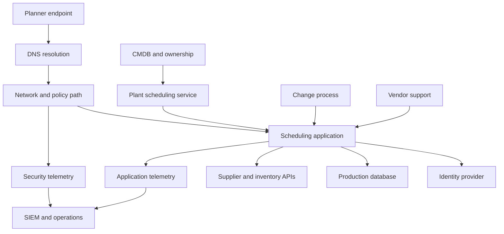

| Dependency type | Example | Failure symptom | Owner question |
|---|---|---|---|
| Identity | Authentication or group claim | User cannot enter or gets wrong access | Who owns identity source and application mapping? |
| Name resolution | DNS record and resolver | Name fails or reaches wrong endpoint | Which resolver and record are authoritative? |
| Network path | Route, proxy, policy, or tunnel | Timeout, reset, block, or slowness | Which team controls each hop and policy? |
| Application | Service, API, or code | Error or partial function | Who owns operation and defect escalation? |
| Data | Record, schema, mapping, or freshness | Wrong result or missing entity | Which source is authoritative by field? |
| Control | Endpoint, access, filtering, or inspection | Risk or compatibility change | Who approves exception and validates control? |
| People | Administrator, approver, or subject expert | Work stalls despite healthy systems | Is there a backup and decision delegate? |
| Vendor | External SaaS, cloud, or support | Boundary dispute or delayed fix | What do contract and support path say? |
| Time | Maintenance, certificate, token, or batch schedule | Periodic or expiry failure | Which calendar or lifetime drives it? |

## Plain-English deep-dive 1 - A dependency map is a hypothesis, not reality

A subway map is useful because it simplifies reality. It does not show every wire, tunnel slope, signal, maintenance worker, or crowd. An architecture diagram also omits detail on purpose. The danger is forgetting that omission.

A diagram should state its decision, scope, date, evidence, and uncertainty. "Application connects to database" may hide a load balancer, identity token, certificate, Domain Name System lookup, network policy, service mesh, retry queue, and vendor-managed layer. Add detail only when it changes the decision.

| Diagram label | Example | Why it protects reasoning |
|---|---|---|
| Purpose | "Used to identify fleet-dispatch authentication dependencies" | Prevents the diagram from pretending to answer every question |
| Scope | "Europe production users and primary path only" | Limits false global inference |
| Time | "Observed and reviewed 2026-08-24" | Architecture changes |
| Evidence | "Identity config, packet trace, admin interview" | Shows how claims were formed |
| Confidence | "High for user path; medium for telemetry export" | Makes uncertainty visible |
| Exclusion | "Disaster recovery path not shown" | Prevents accidental assumption |
| Owner | "Application architecture owner" | Creates a correction route |

## Architecture planes

A plane is a conceptual slice of a system based on what kind of work happens there. Plane models help separate the path carrying business data from the path defining policy or administering the system.

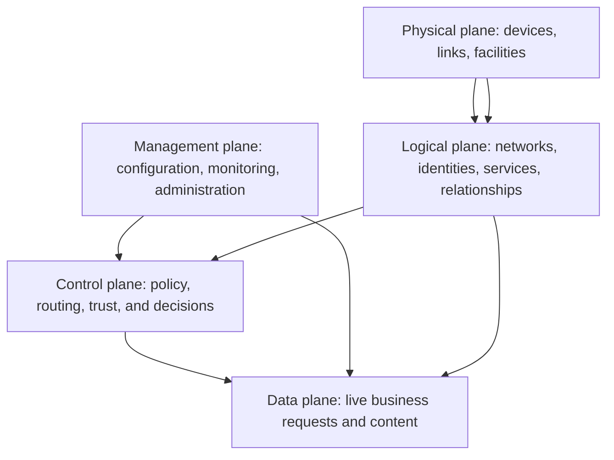

| Plane | Plain meaning | Examples | Typical failure | Security question |
|---|---|---|---|---|
| Physical | Real equipment, links, facilities, and geographic presence | Laptop, switch, cable, data center, factory gateway | Power, hardware, radio, cable, site outage | Can an attacker or failure reach physical process? |
| Logical | Abstract relationships and organization | Subnet, tenant, identity group, application, service relationship | Wrong mapping, route, group, or dependency | Does the logical model match reality? |
| Data | Where live requests, content, and business transactions move | Web request, file sync, API payload, database query | Loss, corruption, delay, block, leak | What sensitive data crosses which boundary? |
| Control | Where decisions about access, route, trust, and enforcement are made | Policy engine, route control, identity claim, risk decision | Wrong or stale policy, unavailable authority | Who or what can change the decision? |
| Management | Where administrators configure and observe the system | Admin portal, API, monitoring, deployment system | Excess privilege, configuration error, blind monitoring | Is management access isolated and audited? |

### Why plane separation matters

If a management portal is unavailable, existing data-plane traffic may or may not continue. If a control-plane service cannot evaluate new access, existing sessions may behave differently from new sessions. If telemetry export fails, the business service may continue while security visibility degrades. These are distinct impacts.

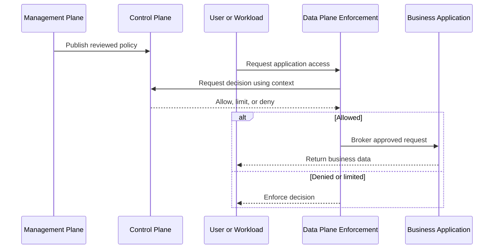

## Data flow and telemetry flow

A **data flow** shows business or application information moving through systems. A **telemetry flow** shows operational or security observations about those systems moving to logs, monitoring, analytics, or response. The flows overlap but are not identical.

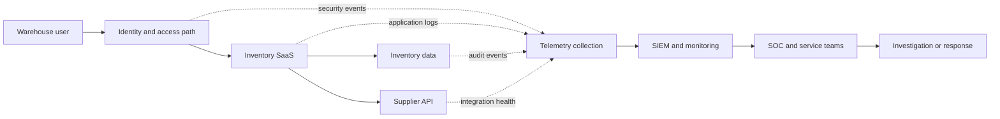

| Flow property | Data-flow question | Telemetry-flow question |
|---|---|---|
| Producer | Who creates the business record? | Which component emits the observation? |
| Consumer | Which service or person uses the data? | Which tool or team analyzes the signal? |
| Identity | Under whose authority does the transfer occur? | Can the event be tied to a reliable entity? |
| Format | What schema and semantics travel? | Which fields, timestamps, and severity exist? |
| Timing | Is it real-time, batch, or asynchronous? | What latency and loss are acceptable? |
| Protection | How is confidentiality and integrity protected? | Are sensitive logs minimized and access controlled? |
| Failure | What happens when transfer fails? | Can service continue while visibility is blind? |
| Retention | How long is data kept and why? | How long is evidence searchable and lawful to retain? |
| Ownership | Who fixes source, path, or target? | Who monitors collector, connector, mapping, and alert? |

## Plain-English deep-dive 2 - Healthy service can coexist with blind security

A shop can remain open after its security cameras stop recording. Customers still buy products, so a basic availability dashboard stays green. The shop is operational but less observable and less defensible.

Enterprise systems behave the same way. A telemetry connector, log export, clock source, parsing rule, or entity mapping can fail while users continue working. The absence of alerts may mean safety, or it may mean blindness. A TSM must map telemetry as a first-class dependency.

| Business path | Telemetry path | Combined interpretation |
|---|---|---|
| Healthy | Healthy | Service operates with expected visibility |
| Healthy | Failed | Customer works, but detection, audit, or risk decisions may be blind |
| Failed | Healthy | Impact is visible and diagnosable |
| Failed | Failed | Service impact plus evidence loss; scope and recovery become harder |

For NMH, a stale cloud inventory connector did not necessarily stop cloud workloads. It stopped trustworthy exposure decisions. That is a decision-integrity incident even if users saw no outage.

## Trust boundaries

A trust boundary is a point where identity, authority, ownership, sensitivity, or control assumptions change. Crossing it should trigger explicit verification and protection.

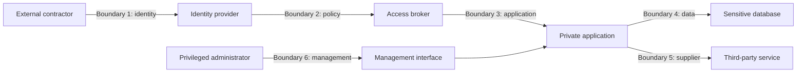

| Boundary type | What changes | Evidence to seek | Common failure |
|---|---|---|---|
| Human to identity | Claimed person becomes digital account | Authentication, lifecycle, assurance | Shared, stale, or misbound account |
| Identity to policy | Claims become access decision inputs | Group, role, device, risk, rule | Wrong claim or policy precedence |
| Network to application | Reachability becomes service access | Destination, protocol, application identity | Broad network trust |
| Application to data | Function becomes record access | Service identity, query, authorization | Excess data privilege |
| Customer to SaaS provider | Operational control changes organization | Shared responsibility, contract, logs | Ownership assumption |
| Enterprise to partner | External party enters workflow | Federation, least privilege, contract | Persistent excessive access |
| Operator to management | User gains configuration authority | Privileged access, approval, audit | Compromised admin plane |
| Region to region | Law, residency, or latency may change | Data location and transfer basis | Unapproved transfer |

## Failure domains and blast radius

A **failure domain** is the set of components likely to fail together because they share a dependency. **Blast radius** is the scope of consequence after failure or compromise. A global identity provider may have a broad failure domain. A regional pilot connector may have a narrow one.

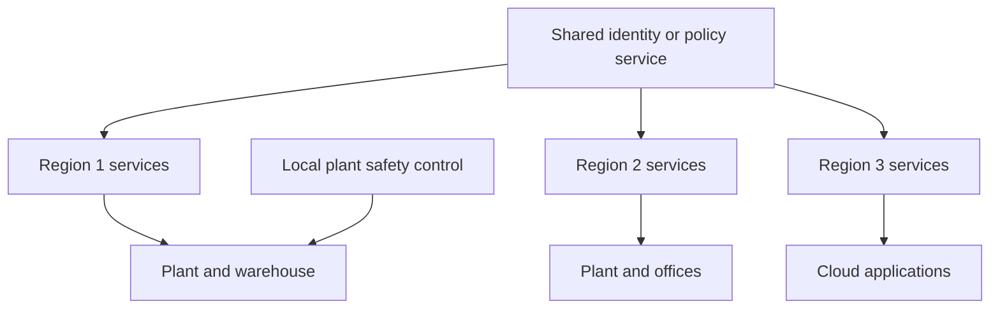

| Analysis dimension | Question | Example finding |
|---|---|---|
| Shared dependency | Which services rely on the same component? | All regions use one identity tenant |
| Coupling | Does one change affect many services at once? | Global policy is published without rings |
| Isolation | Which boundaries limit propagation? | Plant safety control remains local |
| Fallback | Can critical work continue safely? | Manual dispatch exists for two hours |
| Recovery | Which dependency must recover first? | Identity before new sessions can start |
| Data integrity | Can recovery restore wrong data? | Replayed queue may duplicate orders |
| Visibility | Can monitoring fail with the service? | Shared collector creates common blind spot |
| Authority | Who can accept degraded operation? | Business-service owner, not tool administrator alone |

Blast-radius language should be scoped: users, identities, devices, applications, data, sites, regions, business processes, time window, and downstream decisions. "Global impact" without these dimensions is imprecise.

## Support boundaries and shared responsibility

A support boundary marks where one team's operational responsibility hands to another. Shared responsibility means multiple parties own different controls; it does not mean responsibility is vague.

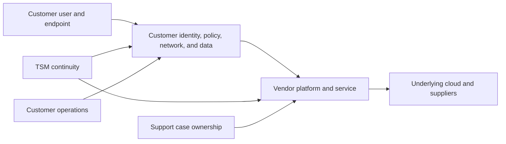

| Boundary | Customer may own | Vendor may own | TSM continuity question |
|---|---|---|---|
| Identity integration | User lifecycle, groups, credentials, provider config | Documented integration behavior | Is the failing claim source, mapping, or product handling? |
| Endpoint | Device management, certificate trust, local software | Client product behavior | Which version, policy, and local evidence exist? |
| Network path | Local DNS, route, firewall, proxy, carrier relationship | Service edge and platform path | Where is the last known good step? |
| SaaS application | Tenant config, users, content, permissions | Service availability and code | Does symptom follow account, object, region, or service? |
| Connector | Source access, credential, source API | Connector implementation and platform processing | Who owns each stage and freshness alert? |
| Data | Classification, quality, lawful use, source semantics | Contracted processing and platform controls | Is data suitable for the intended decision? |
| Security response | Customer authority and business decision | Product signal and contracted service | Which response is authorized and who approves disruption? |

Contracts, service descriptions, support guidance, and live evidence override generic assumptions.

## Stakeholder thinking from zero

A stakeholder is anyone who affects or is affected by the outcome. Stakeholder thinking asks five questions: What do they need? What do they fear? What evidence do they trust? What authority do they hold? What language helps them decide?

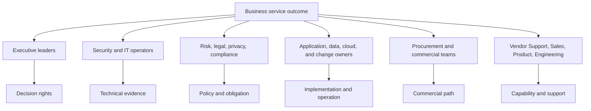

### Executive and security personas

| Persona | Primary goal | Common concern | Trusted evidence | Typical authority | TSM language |
|---|---|---|---|---|---|
| CISO | Reduce and communicate material cyber risk | Scores hide uncertainty or teams cannot act | Risk drivers, control evidence, trend, owner, residual risk | Security strategy and risk escalation | Outcome, risk, evidence, uncertainty, decision |
| CIO | Enable reliable, efficient, adaptable technology | Security change disrupts operations or adds cost | Service health, architecture, experience, TCO, roadmap | IT strategy and operating priority | Resilience, simplification, dependency, investment |
| SOC leader | Detect, investigate, and contain threats | Alert noise, blind spots, tool switching | Event quality, entity context, timeline, response outcome | SOC process and analyst priority | Fidelity, context, workflow, response authority |
| VM leader | Reduce consequential vulnerability exposure | Untrusted priority and unclear ownership | Finding evidence, asset context, exploitability, control, aging | Program scope and remediation governance | Explainable priority, owner, SLA, validation |

### Technical operator personas

| Persona | Primary goal | Common concern | Trusted evidence | Typical authority | TSM language |
|---|---|---|---|---|---|
| Network team | Reliable, controlled connectivity | Security policy causes latency or outage | Route, packet, DNS, TLS, proxy, policy evidence | Network and path change | Flow, hop, rule, failure domain, rollback |
| Identity team | Correct lifecycle and least-privileged access | Stale accounts, claim mismatch, privileged risk | Authentication, claims, groups, logs, access review | Identity config and role model | Identity source, assurance, claim, lifecycle |
| Endpoint team | Healthy, compliant, supportable devices | Agent conflict, performance, update failure | Device inventory, version, posture, process logs | Endpoint config and deployment | Scope, version, posture, ring, rollback |
| Cloud team | Secure, scalable, automated cloud operation | Ephemeral assets and central-team friction | Cloud inventory, tags, policy, API, activity log | Cloud account and guardrails | Account, identity, workload, automation, ownership |
| Application team | Reliable feature delivery | Security or platform dependency delays release | Transaction, application log, dependency, test | Application design and release | User path, API, dependency, error, change |
| Data team | Trusted, governed, useful data | Meaning drift, duplicate entities, access, lineage | Schema, lineage, profile, reconciliation | Data model and pipeline | Source, field meaning, quality, authority, retention |

### Governance, business, and change personas

| Persona | Primary goal | Common concern | Trusted evidence | Typical authority | TSM language |
|---|---|---|---|---|---|
| Compliance | Demonstrate adherence to obligations | Missing evidence or uncontrolled exception | Control mapping, audit trail, exception, test | Compliance interpretation and evidence process | Requirement, control, evidence, exception |
| Legal | Manage legal exposure and contractual duty | Unsupported claim, notification, liability | Contract, facts, jurisdiction, approved counsel view | Legal interpretation | Fact, scope, timing, preserve evidence |
| Privacy | Protect personal data and lawful use | Excess collection, retention, transfer, or access | Data flow, purpose, classification, retention | Privacy review and guidance | Purpose, minimization, access, location, deletion |
| Procurement | Obtain value under controlled commercial terms | Surprise cost, overlap, lock-in, unclear service | Contract, usage, TCO, alternatives, service terms | Purchase and supplier process | Scope, value, dependency, commercial owner |
| Change management | Introduce change safely and understandably | Unplanned disruption or weak adoption | Impact assessment, test, approval, rollback, communication | Change governance | Scope, risk, ring, validation, rollback |
| Internal support | Restore user service and recognize patterns | Poor runbook and unclear escalation | Reproduction, known issue, telemetry, handoff | Frontline diagnosis and routing | Symptom, scope, test, owner, escalation |
| Business-service owner | Deliver business outcome | Technical teams optimize parts but harm service | Service KPI, dependency, continuity, customer impact | Business priority and accepted tradeoff | Outcome, consequence, timing, decision |

### Vendor and account-team personas

| Persona | Primary goal | Common concern | Trusted evidence | Typical authority | TSM language |
|---|---|---|---|---|---|
| Vendor Support | Diagnose and resolve product incidents | Weak reproduction or wrong ownership | Timestamps, versions, logs, expected versus actual | Case process and product troubleshooting | Impact, scope, evidence, reproduction |
| Vendor Sales | Sustain commercial relationship and growth | Technical risk surprises forecast | Value, health, stakeholder need, dates | Authorized commercial commitments | Verified need, technical truth, boundary |
| Vendor Product | Prioritize product problems and investment | Anecdote without reusable evidence | Use case, frequency, impact, workaround, market pattern | Product roadmap priority | Problem, outcome, evidence, no promise |
| Vendor Engineering | Build, operate, and fix product | Ambiguous symptom or missing artifacts | Reproduction, traces, build, recent change, result | Implementation and fix | Precise expected versus actual behavior |
| TSM | Maintain technical value continuity | Fragmented narrative and hidden risk | Integrated architecture, health, actions, outcomes | TSM charter and account coordination | One truth adapted to audience |

## Decision rights and RACI

Decision rights answer who is authorized to choose. RACI answers who performs, owns, advises, and receives information for an activity. They are related but not identical.

| Decision | Recommended accountable role in fictional NMH | Required consultation | TSM role |
|---|---|---|---|
| Business-service criticality | Business-service owner | CISO, CIO, operations, risk | Facilitate evidence and record decision |
| Security policy exception | Authorized customer risk owner | Security, legal, privacy, operations | Explain options and product context |
| Plant maintenance change | Plant operations authority | Safety, app, network, security | Coordinate risk and timing |
| Data-source authority | Data governance owner | Source admin, app owner, security analytics | Document field-level rules and uncertainty |
| Product defect priority | Vendor Engineering or Product process | Support, TSM, customer evidence | Supply impact and reproduction; do not promise |
| Commercial purchase | Customer procurement and authorized business owner | Sales, legal, finance, technical stakeholders | Provide technical fit and value evidence |
| Incident containment | Customer incident authority | SOC, identity, network, endpoint, legal | Provide context within charter; do not seize command |

### Example RACI for a connector and data-quality decision

| Activity | TSM | Security program owner | Source admin | Data owner | Vendor Support | Product | Executive sponsor |
|---|---|---|---|---|---|---|---|
| Define use-case outcome | Responsible | Accountable | Consulted | Consulted | Informed | Informed | Consulted |
| Approve source access | Consulted | Accountable | Responsible | Consulted | Informed | Informed | Informed |
| Configure source | Consulted | Accountable | Responsible | Consulted | Consulted | Informed | Informed |
| Reconcile counts and fields | Responsible | Accountable | Responsible | Responsible | Consulted | Informed | Informed |
| Diagnose connector defect | Consulted | Informed | Consulted | Consulted | Accountable and Responsible | Consulted | Informed |
| Decide source authority | Facilitate | Responsible | Consulted | Accountable | Informed | Informed | Informed |
| Approve risk-report use | Consulted | Responsible | Consulted | Consulted | Informed | Informed | Accountable |

## Plain-English deep-dive 3 - Source of truth is usually field-specific

Teams often say, "The CMDB is the source of truth" or "The scanner is authoritative." Real systems are messier. A human-resources system may be authoritative for employment status, an identity provider for current group membership, an endpoint tool for protection state, a cloud API for instance existence, and a business catalog for service criticality.

Think of a passport, utility bill, and medical record. Each is trusted for different facts. No single document is the truth for everything about a person.

| Entity field | Candidate authority | Secondary evidence | Conflict rule | Confidence concern |
|---|---|---|---|---|
| Employee status | Human-resources system | Identity provider | HR termination overrides active account label | Feed delay |
| Device protection state | EDR platform | Endpoint manager | Most recent validated agent telemetry wins | Device identity mismatch |
| Cloud instance existence | Cloud provider API | Scanner and CMDB | Current cloud lifecycle event wins | API scope or permission |
| Business-service owner | Approved service catalog | CMDB and interviews | Named governance owner approves | Politically stale ownership |
| Vulnerability evidence | Scanner or assessment source | Patch and configuration evidence | Recheck after remediation | False positive or stale scan |
| Internet exposure | Observed path and cloud/network configuration | Inventory label | Validate effective path | Asymmetric or hidden proxy path |
| Data sensitivity | Data owner and classification policy | Discovery tool | Owner reviews conflict | Unclassified copies |

Source authority should include scope, field, freshness, precedence, conflict behavior, and owner. "Single pane of glass" does not remove source responsibility.

## Data quality and entity ambiguity

Data quality is fitness for a decision. A record can be syntactically valid but misleading. Entity resolution is the process of deciding whether records refer to the same real object.

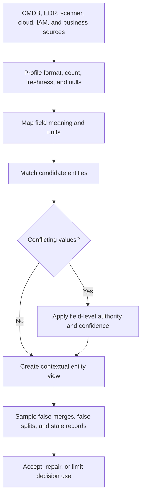

| Quality dimension | Question | Example defect | Consequence |
|---|---|---|---|
| Completeness | Are required records and fields present? | Missing owner on critical server | Work cannot route reliably |
| Freshness | Is data recent enough for this decision? | Cloud inventory 36 hours old | Ephemeral assets disappear from view |
| Accuracy | Does value match reality? | Retired asset marked active | Denominator and workflow distorted |
| Consistency | Do systems use compatible meaning and units? | "Critical" means business tier in one source and severity in another | False comparison |
| Uniqueness | Are duplicate real entities controlled? | One laptop has three records | Findings and controls double-counted |
| Validity | Does value follow allowed format and rule? | Invalid timestamp or owner identifier | Parsing or routing fails |
| Integrity | Are relationships preserved? | Finding references missing asset | Risk context is orphaned |
| Provenance | Can value be traced to source and transformation? | Golden record hides winning source | Dispute cannot be resolved |

### Uncertainty labels

Uncertainty is incomplete knowledge. Labeling it improves decisions; it is not weakness.

| Label | Meaning | Example wording | Next action |
|---|---|---|---|
| Verified | Supported by current authoritative evidence | "Packet trace and policy log confirm the block" | Act within authority |
| Corroborated | Multiple independent sources agree | "Cloud API and endpoint record agree on identity" | Continue normal validation |
| Reported | A stakeholder or source states it, not independently checked | "The owner reports no maintenance window" | Seek supporting evidence |
| Inferred | Best explanation from current pattern | "The timestamp pattern suggests token expiry" | Run discriminating test |
| Assumed | Used temporarily to plan | "We assume one regional path pending diagram review" | Assign owner and expiry |
| Unknown | Material fact is unavailable | "Current telemetry loss prevents scope conclusion" | Protect decision and collect evidence |
| Disputed | Credible sources disagree | "CMDB and cloud API disagree on lifecycle" | Apply authority rule and review |

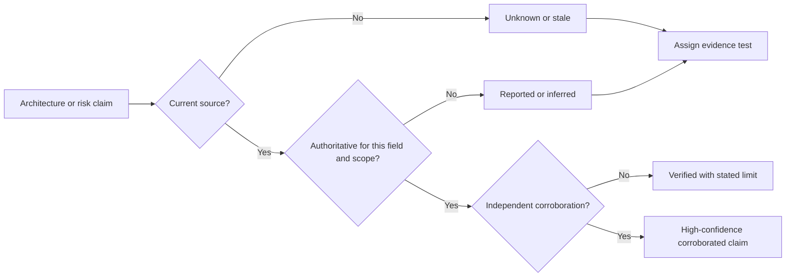

## Discovery method

Discovery is the structured process of learning goals, environment, stakeholders, workflows, constraints, risk, and evidence. It is not an interrogation and not a sales checklist.

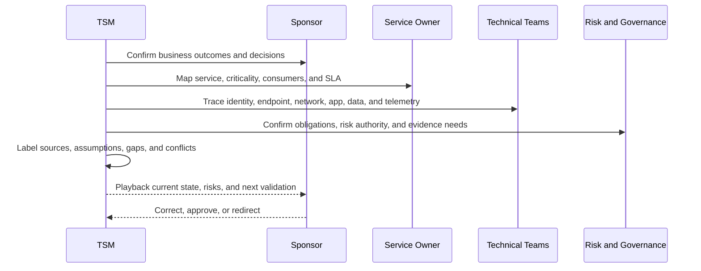

### Business and outcome discovery

| Question | Why ask | Follow-up evidence |
|---|---|---|
| Which three business services matter most to this engagement? | Prevent tool-first scope | Service catalog and owner confirmation |
| Who consumes each service and when is impact highest? | Define users, timing, and consequence | User groups, peak calendar, service metrics |
| What triggered investment now? | Reveal urgency and expected change | Business case, incident, audit, or strategy |
| What does success look like in observable terms? | Create measurable outcome | Baseline, target, date, decision |
| Which failure or risk is unacceptable? | Identify tolerance and hard stops | Risk appetite and continuity plan |
| Which tradeoffs can the sponsor authorize? | Clarify decision rights | Governance and approval record |

### Architecture discovery

| Question | Why ask | Follow-up evidence |
|---|---|---|
| Which identities and devices initiate the service? | Define actors and posture | IAM and endpoint inventory |
| Which names, routes, proxies, and policies shape the path? | Map network and access dependencies | DNS, route, policy, packet, and proxy evidence |
| Which applications, APIs, and data stores participate? | Reveal logical and data flow | App diagram, API contract, data lineage |
| Which control and management systems decide or configure behavior? | Separate planes | Policy and admin architecture |
| Which telemetry proves health and security? | Detect visibility gaps | Log inventory, timestamps, connector health |
| Which external providers and support boundaries exist? | Clarify shared responsibility | Contract and support model |
| What changed recently? | Prioritize hypotheses | Change tickets and deployment history |

### Security, risk, and governance discovery

| Question | Why ask | Follow-up evidence |
|---|---|---|
| Which data classes and regulatory obligations apply? | Bound protection and handling | Classification and approved legal guidance |
| Where are the trust boundaries? | Identify verification points | Identity, policy, network, app, and data controls |
| Which controls prevent, detect, and correct failure? | Understand defense and evidence | Control map and test results |
| Which exceptions exist and when do they expire? | Reveal residual risk and debt | Exception register |
| Who can accept risk or disruptive mitigation? | Prevent unauthorized action | Decision-rights matrix |
| Which failure domains have broad blast radius? | Prioritize resilience and change | Dependency and isolation view |

### Operating and stakeholder discovery

| Question | Why ask | Follow-up evidence |
|---|---|---|
| Who owns business, technology, data, control, and supplier decisions? | Separate ownership meanings | RACI and decision log |
| Which teams operate the workflow daily? | Design usable adoption | Observation and runbook |
| How are incidents, changes, and problems handled? | Align support and escalation | Process, SLA, case history |
| Which meetings make decisions and which only report? | Improve governance | Cadence and action history |
| Which stakeholders distrust the current data or tool? | Surface adoption risk | Interview and disputed examples |
| Which planned changes alter architecture or ownership? | Keep roadmap current | Program and change roadmap |

## Evidence request method

Evidence collection should be purpose-limited and proportionate. Request the least sensitive evidence that can answer the question. Redact secrets, tokens, personal data, and unnecessary content according to approved process.

| Evidence type | Purpose | Minimum useful content | Sensitivity caution |
|---|---|---|---|
| Context diagram | Understand scope and dependencies | Actors, systems, flows, owners, boundaries | May expose architecture |
| Configuration export | Verify policy or integration | Relevant object, version, timestamp | Remove credentials and secrets |
| Packet or network trace | Verify DNS, connection, TLS, reset, or path | Time window, endpoints, protocol fields | Payload may contain sensitive data |
| Application log | Verify behavior and error | Correlation ID, timestamp, operation, result | User and content data may appear |
| Identity log | Verify authentication and claims | Actor, application, method, result, policy | Personal and security-sensitive data |
| Source sample | Verify schema, mapping, and quality | Sanitized representative rows and field definitions | Minimize personal or regulated data |
| Volume and freshness trend | Detect ingestion loss | Count, timestamp, source, expected range | Avoid unnecessary raw content |
| Change record | Correlate failure with change | Time, scope, owner, approval, rollback | Internal operational detail |
| Support history | Find recurrence and ownership | Case, symptom, cause, fix, recurrence action | Customer and employee information |
| Contract or SLA excerpt | Clarify boundary and commitment | Relevant service and support term | Legal and commercial confidentiality |

An evidence request should state question, scope, time window, collection steps, sensitivity handling, secure transfer route, owner, and deletion or retention expectation.

## Architecture diagram methods

Different decisions need different views. One giant diagram usually helps nobody.

| Diagram type | Best question | Include | Exclude or defer |
|---|---|---|---|
| Context map | What surrounds the business service? | Consumers, systems, external parties, owners | Component-level detail |
| Logical component view | How is the service organized? | Applications, services, stores, identity, controls | Physical cable detail unless relevant |
| Physical/topology view | Where does traffic and equipment exist? | Sites, networks, links, devices, regions | Business process detail |
| Data-flow diagram | Where does sensitive or decision data move? | Producer, consumer, store, boundary, protection | Unrelated infrastructure |
| Sequence diagram | What happens step by step? | Actors, requests, responses, decisions, errors | Every static dependency |
| Telemetry flow | How is activity observed? | Emitters, collectors, transformations, analytics, responders | Business payload unless needed |
| Trust-boundary view | Where do authority or control assumptions change? | Identity, policy, management, supplier, data boundaries | Low-risk internal detail |
| Failure-domain view | What can fail together and how far does impact spread? | Shared dependencies, isolation, fallback, recovery | Cosmetic components |
| Ownership map | Who operates, decides, supports, and accepts risk? | Roles, RACI, vendor boundary | Technical packet detail |
| Change view | What will differ before and after? | Added, removed, migrated dependencies and rollback | Stable background detail |

### Diagram construction workflow

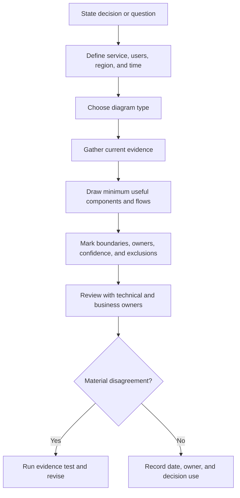

## Ownership ambiguity

Ownership fails when the word "owner" means several things. A server may have an administrative owner, business-service owner, data owner, control owner, cost owner, support owner, and risk owner.

| Ownership role | Accountable for | Not automatically accountable for |
|---|---|---|
| Business-service owner | Service outcome and business priority | Technical implementation detail |
| Technical service owner | Reliability and technical lifecycle | Business risk acceptance |
| Data owner | Purpose, quality, access, and governance of data | Platform code defect |
| System administrator | Configuration and daily operation | Funding or regulatory interpretation |
| Control owner | Design and effectiveness of a control | Every asset the control may cover |
| Risk owner | Treatment or acceptance within authority | Performing all remediation |
| Vendor owner | Supplier relationship and service governance | Customer-side configuration |
| Support owner | Case progression and technical resolution process | Customer strategic roadmap |

When ownership is unclear, ask: "Which decision must be made, who has authority to make it, who has the evidence, and who performs the work?" That is more precise than "Who owns this server?"

## OneDrive and SharePoint bridge

Your strongest architecture bridge is to map a known Microsoft 365 service path before adding security-platform terminology.

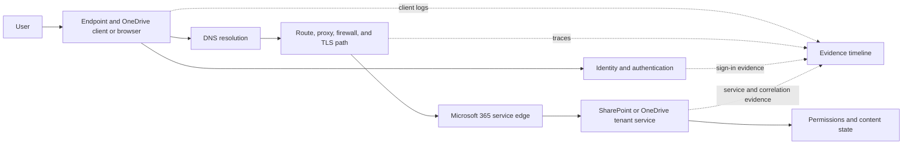

| Familiar Microsoft 365 question | Enterprise architecture concept | SecOps TSM extension |
|---|---|---|
| Is one user, device, tenant, site, or file affected? | Scope and blast radius | Bound identities, assets, applications, data, and regions |
| Does browser work while sync client fails? | Path and component isolation | Compare agents, protocols, policy, and application paths |
| Did DNS, TCP, TLS, proxy, or service fail? | Layered dependency and support boundary | Add zero trust policy, telemetry, and control context |
| Is authentication successful but authorization denied? | Control-plane versus application decision | Map identity claims, policy, role, and resource owner |
| Does trace time align with service logs? | Data and telemetry correlation | Correlate source, connector, SIEM, and business timeline |
| Did a fix restore one symptom or full workflow? | Completion and downstream validation | Validate action, risk decision, and recurring control |
| Who owns client, network, tenant, or service behavior? | RACI and shared responsibility | Include customer, vendor, Support, Product, and Engineering |

The transfer sentence is: "My production experience has trained me to map the user-visible service across identity, endpoint, network, application, permissions, telemetry, and ownership. For a Zscaler SecOps TSM role, I would apply that method while building direct product and security-domain evidence."

## Plain-English deep-dive 4 - Troubleshooting and architecture are the same map at different times

Architecture asks, "How should the system work and what does it depend on?" Troubleshooting asks, "Where did observed behavior diverge from that expected path?" The same map supports both.

A train route diagram is architecture. Comparing a delayed train's actual timestamps with the expected route is troubleshooting. Improving signals, switches, schedules, or ownership after repeated delay is technical success.

| Time perspective | Core question | Artifact |
|---|---|---|
| Before change | What should happen and what could fail? | Architecture, risk, test, and rollback plan |
| During normal operation | Is every critical path and signal healthy? | Health and telemetry view |
| During incident | Where did actual behavior diverge? | Timeline, sequence, and hypothesis map |
| After recovery | Did service, data, and visibility fully recover? | Validation checklist |
| After learning | Which architecture, control, process, or owner should change? | RCA, decision, and roadmap update |

This is why your troubleshooting background is relevant to strategic architecture work. The new bar is to use the map proactively, connect it to business criticality and security risk, and facilitate decisions across stakeholders.

## Fictional Northstar Meridian environment exercise

> **Fiction notice:** Northstar Meridian Holdings is a fictional global manufacturer and logistics operator. Every environment detail, person, metric, regulation, incident, and outcome below is invented for practice. You did not serve this customer or operate the named security products in production.

### Fictional service map

| Service | Consumers | Critical dependencies | Data | Criticality | Primary fictional owner |
|---|---|---|---|---|---|
| Plant scheduling | Planners and factory systems | Identity, plant network, scheduling app, production database | Orders, recipes, schedule | Safety and operations high | Manufacturing applications owner |
| Fleet dispatch | Dispatchers, drivers, customers | Mobile identity, network, cloud app, maps, messaging | Location, cargo, route | Revenue and operations high | Logistics product owner |
| Supplier portal | Suppliers and procurement | Partner identity, web app, API, document store | Contracts, orders, invoices | Supply-chain high | Procurement technology owner |
| Finance close | Finance employees and auditors | Identity, endpoints, SaaS, data warehouse | Financial records | Timing and integrity high | Finance systems owner |
| Microsoft 365 collaboration | Employees and contractors | Identity, endpoint, network path, Microsoft service, permissions | Files, messages, sites | Enterprise-wide medium to high | Collaboration service owner |

### Fictional architecture uncertainties

| ID | Claim | Label | Consequence | Validation owner |
|---|---|---|---|---|
| U-01 | All Tier 1 cloud assets have business owners | Disputed | Risk workflow may route incorrectly | Cloud and service catalog owners |
| U-02 | Plant devices send complete endpoint telemetry | Reported | SOC may have blind spots | Plant and endpoint teams |
| U-03 | Supplier access is application-specific | Inferred | Partner may have broader reach | Identity and network architects |
| U-04 | CMDB retirement state is current | Disputed | Asset denominator may be inflated | CMDB owner |
| U-05 | Cloud connector is healthy after rotation | Unknown | Executive exposure trend is unsafe | Source admin and vendor Support |
| U-06 | Finance data stays in approved regions | Reported | Privacy and legal review may be needed | Data owner and privacy |

### Fictional discovery playback

"NMH's business priority is resilient manufacturing and logistics. The first architecture scope covers Tier 1 internet-facing services in two regions. Identity, cloud inventory, endpoint state, vulnerability findings, service ownership, and ticket closure are required decision inputs. Current confidence is high for cloud instance existence, medium for service ownership, and low for plant endpoint coverage. The immediate decisions are to approve field-level source authority, assign plant risk authority, and establish a hard stop when critical telemetry is stale."

That playback is useful because it combines scope, business outcome, architecture, data, confidence, ownership, and decisions.

## Scenario drills

### Scenario 1 - Executive asks, "Are we protected?"

Do not answer yes or no without scope. Ask which service, threat or failure, time, and control. A strong response is: "For the two-region pilot, current evidence shows identity and cloud inventory coverage, but plant endpoint telemetry remains unverified and cloud freshness is under review. I can explain the validated controls, gaps, residual uncertainty, and next decisions; I cannot responsibly claim complete protection."

### Scenario 2 - Network and application teams blame each other

Build a sequence with timestamps: client resolution, connection, encrypted handshake, proxy or policy decision, application response, and server correlation. Agree expected behavior before inspecting ownership. A discriminating test, such as comparing a known-good path or tracing the same request to the application, is more useful than a long debate.

### Scenario 3 - CMDB and cloud API disagree

Determine which field and time matter. The cloud API may be authoritative for current instance existence; the CMDB may be authoritative for approved service ownership. Preserve both provenance records, apply field-level precedence, and route ownership disagreement to governance. Do not choose one whole system as truth by convenience.

### Scenario 4 - Privacy blocks a telemetry request

Clarify the exact diagnostic question, minimize fields and time window, redact content, use approved transfer, restrict access, and set retention. If the evidence still cannot be collected lawfully, label the diagnostic limitation and choose another test. Security urgency does not erase privacy duty.

### Scenario 5 - A plant cannot take the recommended change

Bring plant operations and safety authority into the decision. Assess blast radius, maintenance window, rollback, compensating controls, monitoring, and time-bound risk acceptance. A central security team should not impose an unsafe production change merely because a technical score is high.

## Architecture review checklist

| Review area | Check |
|---|---|
| Purpose | The diagram states the decision or question it supports |
| Scope | Users, services, regions, environment, and time are explicit |
| Business | Consumers, outcomes, criticality, SLA, and owners appear |
| Actors | Human, service, workload, partner, and administrator identities appear |
| Technology | Endpoint, network, application, cloud, SaaS, data, and tool dependencies appear as needed |
| Planes | Data, control, management, logical, and physical distinctions are clear where relevant |
| Boundaries | Trust, supplier, data, region, and support transitions are marked |
| Flows | Direction, protocol or semantic purpose, and important decisions are clear |
| Telemetry | Health, security, and audit signals have paths and consumers |
| Failure | Shared dependencies, isolation, fallback, recovery, and blast radius are considered |
| Ownership | Business, technical, data, control, risk, and support owners are distinguished |
| Evidence | Sources, date, confidence, assumptions, and exclusions are recorded |
| Validation | Relevant owners reviewed the view or gaps are assigned |

## Common failure modes

| Failure mode | Symptom | Consequence | Repair |
|---|---|---|---|
| Tool inventory without service | Diagram lists products | Business consequence remains unknown | Start with consumer and service outcome |
| One giant diagram | No audience can use it | Important paths are hidden in detail | Create decision-specific views |
| Physical-only map | Devices and links dominate | Identity, policy, data, and ownership disappear | Add logical, control, data, and management views |
| Data without telemetry | Business flow is known | Security blindness is missed | Map observation and response paths |
| Assumed owner | CMDB field is accepted blindly | Actions bounce or risk is unauthorized | Validate decision rights and field authority |
| One source of truth | Whole system wins every conflict | Wrong fields overwrite better evidence | Define field-level authority and provenance |
| No uncertainty labels | Inference sounds verified | Executives act on false confidence | Label verified, reported, inferred, assumed, unknown, disputed |
| Vendor blame | Boundary becomes a wall | Parallel teams wait | Trace expected and actual behavior across responsibility |
| Security-only criticality | Technical score decides priority | Safety and operations may be harmed | Include service consequence and authorized owner |
| Excess evidence request | Teams collect everything | Privacy, delay, and analysis noise grow | Request minimum evidence for the question |

## Official Source Anchors

**Checked on 2026-08-24.** The architecture and stakeholder methods in this chapter are general enterprise practices. The sources below anchor current Zscaler product context used in examples. They do not replace customer diagrams, contracts, legal advice, support guidance, current integration documentation, or live validation.

| Official Zscaler source | Used for | Caveat |
|---|---|---|
| https://www.zscaler.com/company/about-zscaler | Mission and secure digital transformation context | Company positioning is not a customer architecture |
| https://www.zscaler.com/culture | Ownership, collaboration, clarity, impact, and accountability | Published culture is not an operating contract |
| https://www.zscaler.com/products-and-solutions/zero-trust-exchange-zte | Identity, context, risk, policy, proxy connections, users, workloads, IoT/OT, and partners | Exact deployment paths and licenses vary |
| https://www.zscaler.com/products-and-solutions/security-operations | First- and third-party signals, security graph, business context, and response | Workflow and autonomy require current validation |
| https://www.zscaler.com/products-and-solutions/data-fabric | Ingestion, harmonization, deduplication, correlation, enrichment, workflows, and reports | Connector counts, formats, and behavior can change |
| https://www.zscaler.com/products-and-solutions/vulnerability-management | Contextual vulnerability data, controls, business process, and workflow | Product scoring and outcomes are customer-specific |
| https://www.zscaler.com/products-and-solutions/caasm | Asset sources, golden records, relationships, gaps, and CMDB health | Integration availability and entity behavior require testing |
| https://www.zscaler.com/products-and-solutions/ctem | Assets, data, identity, cloud, SaaS, and exposure program scope | CTEM is a broader industry model |
| https://www.zscaler.com/products-and-solutions/zscaler-risk-360 | Telemetry-driven risk factors, attack stages, mitigation, and executive views | Model details and factor counts are volatile |

### Claim categories

| Category | Example | Interview wording |
|---|---|---|
| Officially documented | Zscaler product positioning from dated pages | "The official page describes..." |
| General architecture | Planes, trust boundaries, failure domains, and RACI | "A general architecture method is..." |
| Customer-specific | Live topology, data, support, regulation, and authority | "I would validate this with the customer..." |
| Fictional | Every NMH environment detail and result | "In the fictional account exercise..." |
| Documented production | Microsoft service, networking, customer, and escalation evidence | "In my prior production work..." |
| Not established | Production Zscaler, SecOps, vulnerability, or exposure operation | "I have not operated that directly yet..." |

## Likely Interview Questions

### Q1. How do you begin analyzing a complex enterprise environment?

**Model answer:** I begin with the business service, not the tool list. I identify consumers, desired outcome, criticality, data, failure tolerance, SLA, and business owner. Then I trace identities, endpoints, network and access path, applications, APIs, cloud or SaaS, data stores, controls, telemetry, external providers, and support boundaries. I mark trust boundaries, shared dependencies, failure domains, blast radius, and decision rights.

Every map includes scope, date, evidence, confidence, and exclusions because a diagram is a model. I play it back to business and technical owners, resolve material disagreement with evidence, and use decision-specific views rather than one giant architecture picture.

### Q2. What is the difference between data, control, and management planes?

**Model answer:** The data plane carries live business requests and content. The control plane makes decisions about access, route, trust, or policy. The management plane is where administrators configure and observe the system. Physical and logical planes add equipment/location and abstract relationships.

The distinction matters during failure. A management portal can fail while established data traffic continues. A control service can affect new access differently from existing sessions. Telemetry can fail while the business service remains available. I would test each plane's dependency and impact rather than report one generic outage.

### Q3. How do you identify a trust boundary?

**Model answer:** I look for a change in identity, authority, ownership, sensitivity, organization, region, or control. Examples include human-to-digital identity, identity claim to policy, network to application, application to data, customer to SaaS provider, enterprise to partner, and operator to management interface. At each boundary I ask what is verified, what privilege is granted, what data crosses, which control applies, which evidence exists, and who owns failure.

A trust boundary is not automatically unsafe. It is a place where implicit assumptions should become explicit checks and protections.

### Q4. How do you reason about blast radius and criticality?

**Model answer:** I identify shared dependencies and ask what can fail or be compromised together. Then I scope consequence across users, identities, assets, applications, data, sites, regions, business processes, time, and downstream decisions. I look for isolation, fallback, recovery ordering, telemetry independence, and authority to accept degraded operation.

Criticality includes safety, revenue, operations, data, regulation, reputation, recoverability, and timing. It is not the same as vulnerability severity. The authorized business and risk owners determine acceptable tradeoffs using technical evidence.

### Q5. What do you do when two sources disagree about an asset?

**Model answer:** I avoid declaring one whole platform the source of truth. I identify the exact field and decision. A cloud API may be authoritative for current instance existence, an endpoint tool for current protection state, and a service catalog for approved business ownership. I compare freshness, scope, identity keys, provenance, and transformation, then apply a field-level authority and conflict rule.

If disagreement remains material, I label it disputed, limit decision use, assign validation, and preserve both source records. Missing or uncertain context should not silently reduce priority.

### Q6. How would you work with a CISO differently from a network engineer?

**Model answer:** I keep one technical truth but change depth and decision framing. A CISO needs business outcome, material risk, top drivers, uncertainty, options, recommendation, owner, and trend. A network engineer needs path, names, routes, proxy or policy behavior, packet and timing evidence, change, and rollback. Neither audience should receive a distorted story.

I also respect authority. The network engineer may own implementation; the CISO or delegated risk owner may accept security risk; the business-service owner may decide operational tradeoff. The TSM connects those decisions without replacing them.

### Q7. How does your OneDrive and SharePoint background transfer to enterprise security architecture?

**Model answer:** My production Microsoft 365 work required me to map a user-visible symptom across identity, endpoint, client or browser, DNS, network, proxy, TLS, Microsoft service, permissions, content state, telemetry, and support boundaries. I learned to scope precisely, correlate timestamps, compare known-good paths, collect proportionate evidence, engage the right owner, and validate the complete workflow.

That method transfers strongly to enterprise and SecOps analysis. The new depth is Zscaler architecture, security data, controls, exposure, and risk authority. I would not present conceptual product knowledge as production experience; I would combine the proven method with product training, labs, shadowing, and reviewed artifacts.

### Q8. How do you handle an architecture fact you cannot verify?

**Model answer:** I label it explicitly as reported, inferred, assumed, unknown, or disputed rather than allowing it to sound verified. I explain the decision consequence, identify the minimum evidence needed, assign an owner and expiry, and apply a guardrail if the uncertainty could make a harmful decision. If evidence cannot be collected because of privacy, access, or technical limits, I document that limitation and use another test where possible.

Transparency about uncertainty increases trust when it is paired with a concrete validation plan. False certainty creates larger correction costs later.

## 30-Second Memory Hooks

| Concept | Memory hook |
|---|---|
| Business service | Start with what the organization must accomplish |
| Enterprise map | People, identity, device, path, app, data, tools, owners, rules |
| Dependency | What must be true for service or trust? |
| Physical plane | Equipment, links, and places |
| Logical plane | Abstract services and relationships |
| Data plane | Live requests and business content |
| Control plane | Decisions about access, route, and policy |
| Management plane | Configure, administer, and observe |
| Data versus telemetry | Work can continue while visibility is blind |
| Trust boundary | Assumptions change, so verification matters |
| Failure domain | What can fail together? |
| Blast radius | Who and what feels the consequence? |
| Criticality | Business consequence, not technical severity |
| Support boundary | Shared responsibility must still be specific |
| Stakeholder | Need, fear, evidence, authority, language |
| Decision right | Who is authorized to choose? |
| Source authority | Trust the right source for the right field |
| Uncertainty | Label it, bound it, test it |
| Diagram | Purpose, scope, date, evidence, confidence, exclusions |
| Experience bridge | Architecture is expected path; troubleshooting is observed divergence |

## Completion Checklist

- [ ] I can start an enterprise analysis from a business service and consumer.
- [ ] I can map users, identities, endpoints, networks, applications, cloud, SaaS, data, tools, business systems, owners, regulation, and SLA.
- [ ] I can distinguish physical, logical, data, control, and management planes.
- [ ] I can draw separate business-data and telemetry flows.
- [ ] I can explain why healthy service can coexist with blind security.
- [ ] I can identify trust boundaries and the evidence needed at each.
- [ ] I can distinguish failure domain, blast radius, and criticality.
- [ ] I can map shared responsibility and support boundaries without blame.
- [ ] I can explain goals, concerns, evidence, authority, and language for every required stakeholder persona.
- [ ] I can build a decision-rights matrix and contextual RACI.
- [ ] I can define field-level source authority, precedence, provenance, and conflict rules.
- [ ] I can assess completeness, freshness, accuracy, consistency, uniqueness, validity, integrity, and provenance.
- [ ] I can use verified, corroborated, reported, inferred, assumed, unknown, and disputed labels.
- [ ] I can run business, architecture, security, governance, operating, and stakeholder discovery.
- [ ] I can request minimum proportionate evidence with privacy and retention controls.
- [ ] I can choose the right diagram for context, flow, sequence, telemetry, trust, failure, ownership, or change.
- [ ] I can distinguish business, technical, data, control, risk, vendor, and support owners.
- [ ] I can explain the OneDrive and SharePoint architecture bridge honestly.
- [ ] I can walk through the NMH environment while stating that every detail is fictional.
- [ ] I can answer all eight questions aloud with evidence-focused follow-ups.
- [ ] I have rechecked official sources if preparing after 2026-08-24.
- [ ] I have not converted conceptual, fictional, lab, or not-yet-used knowledge into production experience.

[Part 5 - Complete Fictional Strategic Account Engagement](Part-05-complete-fictional-account-engagement.md)