# Part 5 - Complete Fictional Strategic Account Engagement

> **Fiction notice:** Everything about Northstar Meridian Holdings in this chapter is invented for study: the organization, people, environment, products, licenses, tools, data, incidents, calculations, meetings, decisions, and outcomes. Northstar Meridian Holdings is not a real customer. **This engagement is not production experience, and direct production operation of the named Zscaler, Security Operations, vulnerability, exposure, scanner, EDR, SIEM, or risk products is not established.**
>
> **Audience:** Candidates preparing to move from enterprise Support Escalation Engineering into a Zscaler Security Operations Technical Success Manager role.
>
> **Currency date:** 2026-08-24.
>
> **Product caveat:** This case uses current official Zscaler product positioning as a learning anchor. It does not assert a real license, integration, interface, formula, implementation, performance result, or customer outcome. Verify current documentation, product packaging, tenant behavior, and customer authority in any real engagement.

## Section goal

This chapter turns the concepts from Parts 1 through 4 into one complete multi-quarter account story. It follows the fictional Northstar Meridian Holdings account from handoff and discovery through security-data onboarding, asset reconciliation, contextual vulnerability prioritization, continuous exposure work, executive risk framing, AI-assisted Security Operations concepts, adoption, a critical connector outage, remediation, a quarterly business review, residual risk, and a next-quarter roadmap.

Think of the case as a flight simulator. A simulator can teach sequencing, judgment, communication, and failure handling, but simulator hours are not airline production experience. You can use this case to demonstrate how you think, identify which facts require validation, and practice artifacts. You must always call it fictional or synthetic.

By the end of Part 5, you should be able to:

| Learning outcome | What mastery looks like |
|---|---|
| Lead account discovery | Connect business services, environment, stakeholders, tools, risk, and outcomes |
| Build a source plan | Sequence identity, endpoint, scanner, cloud, CMDB, ticketing, SIEM, business, and Zscaler context |
| Protect data quality | Profile, map, resolve, reconcile, preserve provenance, and label uncertainty |
| Explain exposure workflows | Connect asset visibility, contextual priority, remediation, validation, and continuous improvement |
| Communicate risk | Use Risk360-style attack-stage framing without inventing a Zscaler score or financial prediction |
| Discuss AI responsibly | Explain Agentic SecOps concepts with grounding, authority, validation, and human approval |
| Drive adoption | Diagnose workflow friction, train by role, and measure independent use |
| Lead escalation | Protect decisions during a connector outage and coordinate customer, Support, Product, and Sales |
| Prove value honestly | Present synthetic outcomes, caveats, residual risk, and next-quarter priorities |
| Reuse the case in interviews | Answer scenario questions while labeling every detail fictional |

## JD Mapping

**JD** means job description. This case deliberately exercises the target role's strategic, technical, consulting, cross-functional, escalation, and executive responsibilities.

| JD expectation | Fictional case moment | Artifact | Interview signal |
|---|---|---|---|
| Lead strategic enterprise engagement | Four-quarter account journey | Charter, roadmap, governance | Outcome ownership across time |
| Analyze complex environment | Business-service and technical discovery | Current-state architecture | Cross-layer reasoning |
| Identify security risk | Asset, identity, exposure, control, and ownership analysis | Risk register and evidence map | Context over raw severity |
| Deliver tailored mitigation | Plant, cloud, identity, and workflow options | Decision records | Tradeoff and residual-risk thinking |
| Develop Data Fabric and UVM depth | Synthetic source onboarding and score exercise | Connector plan, mappings, ranked backlog | Product concept plus honest caveat |
| Advocate best practices | Source authority, quality gates, CTEM cadence, teach-back | Maturity and adoption plan | Adapted practice, not generic advice |
| Resolve critical escalation | Cloud connector outage during urgent vulnerability work | Bridge plan, updates, recovery tests | Urgency with quality |
| Partner with Sales, Support, Product, Engineering | Defect, roadmap, renewal, and expectation coordination | RACI and decision log | Boundary-aware collaboration |
| Consult and train | Analyst, administrator, and executive sessions | Workshop and teach-back | Customer independence |
| Communicate to executives | Score challenge and QBR | Executive narrative | Evidence, uncertainty, decision |

## Candidate honesty note

This chapter is **not** a production story. It is valid evidence of preparation only if you can explain the architecture, assumptions, calculations, artifacts, failure modes, and verification plan. You should introduce it this way:

> "Direct production operation of Zscaler Data Fabric, Asset Exposure Management, Unified Vulnerability Management, Risk360, or Agentic SecOps is not part of my current experience. To practice the role end to end, I built a clearly fictional account case with synthetic data. I used official product pages for current positioning, created my own labeled formulas only to demonstrate reasoning, and separated every assumption from production fact."

| Evidence category | What you may say | What you must not say |
|---|---|---|
| Production | enterprise support, escalation, OneDrive, SharePoint, networking, analytics, mentoring, training, and approved AI facts | Present NMH as a delivered customer exposure transformation |
| Lab or exercise | Created synthetic datasets, calculations, diagrams, and account artifacts | "I implemented the platform for 42,000 users" |
| Conceptual | Understands documented product purpose and validation questions | Present conceptual study as production UVM expertise |
| Fictional | NMH people, tools, integrations, incidents, metrics, outcomes, and scripts | "My CISO customer Maya said..." |
| Not yet used | Direct Zscaler and formal SecOps/vulnerability-program operation | Hiding the gap through product vocabulary |

## Acronyms and essential terms

The terms are defined before the case uses them deeply.

| Acronym or term | Plain meaning | Case use | Memory hook |
|---|---|---|---|
| AEM | Asset Exposure Management, Zscaler's product positioning for unified asset visibility and coverage-gap work | Reconcile synthetic asset sources and controls | Know assets and gaps before judging risk |
| AI | Artificial Intelligence | Assist triage, summary, and recommendation with controls | AI assists; accountable humans decide |
| API | Application Programming Interface | Move data between source and platform | API is a software service counter |
| CAASM | Cyber Asset Attack Surface Management, an industry category for multi-source asset visibility | Describe the asset-management category | Many inventories become one usable view |
| CISO | Chief Information Security Officer | Fictional executive sponsor Maya Chen | CISO asks what business risk changed |
| CIO | Chief Information Officer | Fictional technology executive Luis Romero | CIO connects technology to operations |
| CMDB | Configuration Management Database | Fictional ServiceNow inventory and relationships | CMDB is useful evidence, not perfect truth |
| CTEM | Continuous Threat Exposure Management | Repeat scope, discovery, priority, validation, and mobilization | Scope, discover, prioritize, validate, mobilize |
| EDR | Endpoint Detection and Response | Synthetic endpoint inventory and control evidence | EDR watches endpoints |
| IAM | Identity and Access Management | Synthetic Microsoft Entra ID identity and role context | IAM answers who can do what |
| KPI | Key Performance Indicator | Measure decision-relevant progress | A KPI changes a decision |
| NMH | Northstar Meridian Holdings | The fictional account | NMH is practice, never experience |
| QBR | Quarterly Business Review | Executive outcome and decision review | Outcomes, risk, decisions, next |
| RACI | Responsible, Accountable, Consulted, Informed | Clarify account and incident roles | One accountable owner |
| RAID | Risks, Assumptions, Issues, Dependencies | Track delivery uncertainty and blockers | Risk may happen; issue is happening |
| RCA | Root Cause Analysis | Explain outage cause and prevention | Improve system, not blame |
| SaaS | Software as a Service | Microsoft 365 and other online applications | Service operation shifts; accountability remains |
| SIEM | Security Information and Event Management | Fictional Splunk event and investigation context | Event-focused security control room |
| SLA | Service Level Agreement | Synthetic response and remediation commitments | SLA turns urgency into agreement |
| SOC | Security Operations Center | Fictional team led by Jonah Reed | Security watch floor |
| TSM | Technical Success Manager | Fictional role you practice, not production evidence | Technology into durable outcomes |
| UVM | Unified Vulnerability Management | Zscaler's documented contextual vulnerability-prioritization offering | Fix what matters, not only what scores high |

## Account profile

Northstar Meridian Holdings, abbreviated **NMH**, is a fictional global manufacturer and logistics operator created in Part 1. It grew through acquisitions, so business units use overlapping tools, identifiers, processes, and ownership models.

| Attribute | Synthetic detail | Why it matters |
|---|---|---|
| Workforce | 42,000 employees and contractors | Large identity, device, and training scope |
| Geography | 26 countries | Regional operations, data, language, and time-zone complexity |
| Facilities | 18 manufacturing plants, 74 warehouses, and 112 offices | Operational technology and distributed-service dependencies |
| Business | Industrial manufacturing, warehouse automation, and logistics | Safety, uptime, supply-chain, and data risks interact |
| Growth model | Acquisitions and regional autonomy | Duplicate tools, identifiers, and control standards |
| Strategic goal | Reduce realistic paths to production disruption and data loss | Connects security activity to business consequence |
| Program goal | Replace scanner-volume reporting with contextual, owner-driven exposure reduction | Requires trustworthy data and adopted workflow |
| Executive concern | Vulnerability counts rise while risk direction remains unclear | Needs explainability and caveats |
| Operator concern | Teams reconcile spreadsheets and debate ownership | Needs data quality and workflow simplification |
| Change constraint | Plants require maintenance and safety approval | Priority cannot override operational authority |

## Multi-quarter engagement overview

The case covers a pre-engagement handoff plus four fictional quarters.

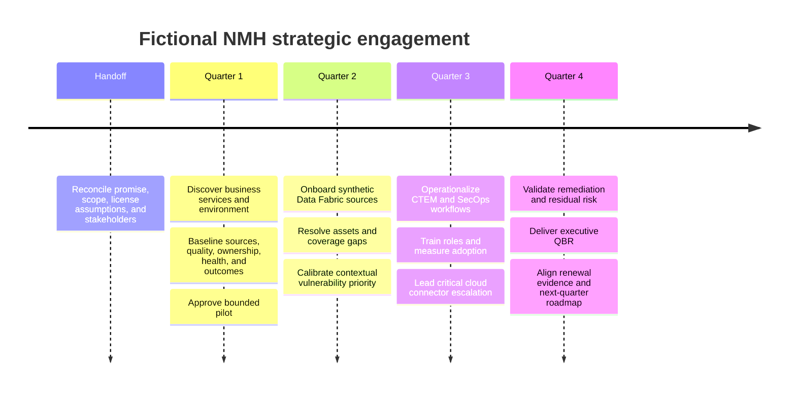

| Phase | Primary outcome | Exit gate | Main risk |
|---|---|---|---|
| Handoff | Shared understanding of why NMH invested | Assumptions and boundaries accepted | Pre-sale promise drift |
| Quarter 1 | Trusted current-state and bounded pilot | Sponsor approves scope, owners, baseline, and measures | Endless discovery |
| Quarter 2 | Context-rich asset and finding foundation | Reconciliation and sample quality accepted | False merges and stale data |
| Quarter 3 | Repeated owner-driven workflows | Users complete target tasks independently | Another unused console |
| Quarter 4 | Accepted outcome and residual-risk narrative | Sponsor makes next decisions | Synthetic metrics treated as guaranteed value |

## Business services and goals

| Business service | Consumers | Critical data | Main consequence | Availability need | Fictional owner |
|---|---|---|---|---|---|
| Plant scheduling | Planners, production lines, supervisors | Orders, recipes, production sequence | Safety or manufacturing disruption | Continuous with controlled maintenance | Nia Wallace, Manufacturing Apps |
| Fleet dispatch | Dispatchers, drivers, warehouse teams, customers | Location, cargo, route, customer | Delayed deliveries and revenue impact | High during regional shipping windows | Omar Haddad, Logistics Product |
| Supplier portal | Suppliers, procurement, finance | Contracts, purchase orders, invoices | Supply interruption or fraud | Business-hours plus global exceptions | Eva Lind, Supplier Systems |
| Finance close | Finance, auditors, executives | Financial statements and controls | Reporting delay or integrity issue | High at month and quarter end | Kenji Mori, Finance Platforms |
| Microsoft 365 collaboration | Employees and contractors | Files, sites, messages, permissions | Broad productivity and data exposure | Enterprise-wide | Rosa Martinez, Collaboration Services |

### Program outcome hierarchy

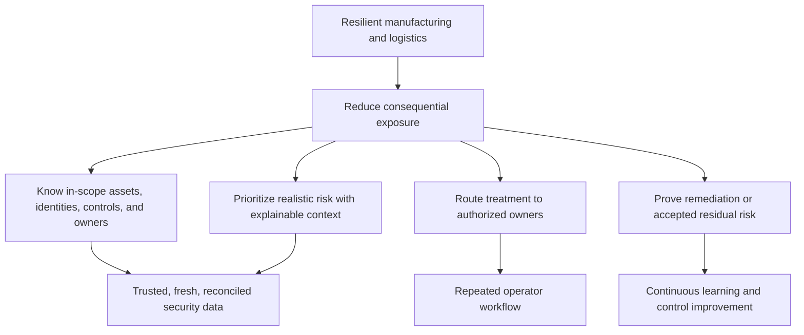

| Outcome | Baseline | Synthetic target | Validation | Caveat |
|---|---|---|---|---|
| Tier 1 owner coverage | 61 percent in sampled records | At least 90 percent in pilot | Owner attestation plus source sample | Pilot only, not all NMH |
| Critical source freshness | No common threshold | 95 percent within source-specific target | Source and connector timestamp | Fresh does not mean accurate |
| Duplicate asset rate | 17 percent in initial sample | Below 5 percent in accepted pilot sample | False merge/split review | Sampling uncertainty remains |
| Ticket closure validation | 78 percent of sampled closed tickets aligned with source evidence | At least 95 percent | Rescan or control evidence | Source can lag after remediation |
| Meaningful analyst adoption | No defined workflow | 80 percent of target analysts complete weekly workflow correctly | Product/workflow evidence and teach-back | Synthetic target, not contract |
| High-context exposure aging | No accepted baseline | Downward trend after two cycles | Stable-scope aging analysis | Scope and priority rules must stay comparable |

## Environment

### Users, identities, and endpoints

| Population | Synthetic count | Identity pattern | Endpoint pattern | Known defect |
|---|---:|---|---|---|
| Employees | 35,500 | Microsoft Entra ID workforce identities | Managed Windows and mobile devices | Department and service-owner fields vary after acquisition |
| Contractors | 6,500 | Sponsor-linked and federated identities | Mixed managed and bring-your-own devices | Sponsor expiry and department are incomplete |
| Privileged administrators | 1,240 subset | Elevated roles and separate admin identities in some units | Hardened endpoints not universal | Privilege-to-device relationship confidence varies |
| Service identities | 7,800 synthetic records | Application, automation, and integration accounts | Server or cloud workload association | Owner and secret rotation dates are inconsistent |
| Plant devices | 14,600 synthetic records | Device or local service identity | Operational technology and industrial endpoints | Agent coverage and lifecycle are disputed |

### Sites, network, cloud, SaaS, applications, and data

| Domain | Synthetic footprint | Critical dependency | Known issue |
|---|---|---|---|
| Sites | Plants, warehouses, offices, remote users | Carrier, DNS, routing, proxy, access policy | Acquired sites use different path designs |
| Cloud | Microsoft Azure and Amazon Web Services | Cloud identity, APIs, tags, network controls | Ephemeral resources and inconsistent ownership tags |
| SaaS | Microsoft 365, ServiceNow, finance, logistics, HR, and engineering services | Federation, API, tenant config, vendor service | Shared responsibility is poorly documented |
| Private apps | Plant scheduling, supplier, dispatch, engineering, and reporting apps | Identity, connectors, application ownership | Legacy network assumptions persist |
| Data | Manufacturing, location, financial, employee, supplier, and intellectual-property records | Classification, owner, lineage, retention | Copies and exports exceed catalog coverage |
| OT | Production controllers, workstations, historians, gateways, and vendor access | Safety process, local availability, maintenance windows | Central teams lack complete inventory and telemetry |

**OT** means Operational Technology: systems that monitor or control physical processes. It is defined here before deeper use. Security treatment for OT must include plant safety and engineering authority.

### Synthetic enterprise architecture

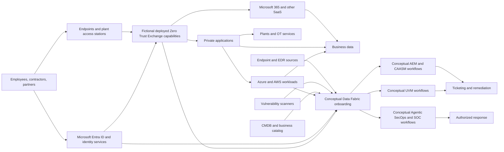

The diagram is a fictional architecture hypothesis. It does not assert a supported integration, a specific traffic path, or current product packaging.

## Tool and control landscape

| Domain | Fictional tool or source | Useful evidence | Current control or purpose | Defect or caveat |
|---|---|---|---|---|
| IAM | Microsoft Entra ID | Users, groups, roles, sign-ins, service identities | Authentication and role context | Contractor and service ownership incomplete |
| Endpoint/EDR | Microsoft Defender for Endpoint plus retained acquisition tool | Devices, agent state, detections, users | Endpoint visibility and response | Duplicate names and uneven plant coverage |
| Vulnerability scanner | Qualys and Rapid7 in different units | Findings, severity, evidence, scan date | Weakness discovery | Scope and identifiers disagree |
| SIEM | Splunk | Alerts, events, investigation references | Event analysis and SOC workflow | Business criticality link is inconsistent |
| CMDB | ServiceNow CMDB | Assets, services, owners, lifecycle, relationships | Service and inventory management | Stale and missing ownership |
| Ticketing | ServiceNow workflows | Assignment, SLA, state, closure | Remediation coordination | Closure does not always match source evidence |
| Cloud | Azure and AWS inventory and activity | Instances, accounts, tags, exposure, lifecycle | Cloud operation and security | Ephemeral assets vanish between reports |
| Zscaler | Fictional Zero Trust Exchange context | Identity, traffic, policy, and risk signals where licensed | Inline access and security context | Exact products and integrations are intentionally unspecified |
| Business | Finance and operations reference tables | Service tier, downtime class, owner, region | Business context | Names do not consistently match CMDB |
| Change | Enterprise change system and plant maintenance calendars | Planned change, approval, rollback, window | Operational safety | Regional process differs |

### Current controls

| Control family | Synthetic current state | Evidence quality | Important gap |
|---|---|---|---|
| Identity lifecycle | Central workforce process with regional exceptions | Medium | Contractor sponsor expiry and service identities |
| Privileged access | Separate admin accounts in some domains | Medium-low | Inconsistent association to managed endpoint |
| Endpoint protection | Broad corporate EDR deployment | Medium | Plant and acquisition coverage unknown |
| Vulnerability scanning | Two major scanner programs | Medium | Duplicate findings and coverage disagreement |
| Network and zero trust | Fictional mixed legacy and Zscaler capabilities | Unknown until validated | Acquired sites and private-app paths vary |
| Logging | Central SIEM for selected sources | Medium | Telemetry completeness and business context vary |
| Change | Enterprise process plus plant safety gates | Medium | Emergency and regional exceptions differ |
| Backup and recovery | Service-specific plans | Unknown in pilot | Recovery tests are not linked to exposure workflow |
| Risk acceptance | Policy exists | Medium-low | Exceptions use inconsistent expiry and evidence |

## Stakeholders

| Fictional person | Role | Goal | Concern | Authority or boundary | TSM approach |
|---|---|---|---|---|---|
| Maya Chen | CISO and sponsor | Defensible risk reduction and board narrative | Scores may hide data gaps | Security priority and executive risk escalation | Show drivers, uncertainty, decisions, residual risk |
| Luis Romero | CIO | Resilient and efficient technology | Security change may interrupt plants | IT strategy and service priority | Connect architecture, experience, and cost |
| Priya Nair | VM Director | Actionable priority and ownership | Another untrusted score | Program workflow and remediation governance | Co-design factors and validate examples |
| Jonah Reed | SOC Director | Faster contextual investigation | More consoles and noisy alerts | SOC process and analyst priority | Integrate with current workflow and measure use |
| Elena Petrova | CMDB Product Owner | Improve service and asset records | Security treats CMDB as perfect truth | CMDB rules and roadmap | Define field-level authority and preserve provenance |
| Sam Okafor | Cloud Security Lead | Control ephemeral cloud exposure | Weekly data misses short-lived assets | Cloud security standards | Set freshness and lifecycle rules |
| Grace Park | Plant Technology Lead | Protect safety and production | Central remediation ignores maintenance | Plant change and operational input | Use compensating controls and authorized exceptions |
| Felix Weber | Network Architecture Lead | Reliable controlled connectivity | New controls create latency or outage | Network and path design | Use flows, tests, rollout rings, rollback |
| Aisha Rahman | Privacy Counsel | Lawful and proportionate data use | Excess telemetry or cross-region data | Privacy guidance | Minimize fields and document purpose |
| Daniel Brooks | Procurement Partner | Evidence for supplier value and renewal | Technical value is hard to compare | Procurement process | Provide validated value through account team |
| Morgan Lee | Fictional Zscaler Sales lead | Healthy commercial relationship | Late technical risk surprises | Commercial commitments | Share facts and avoid commercial promises |
| Taylor Singh | Fictional vendor Support lead | Restore product function | Incomplete reproduction | Support case process | Supply sanitized timestamps and expected/actual evidence |
| Casey Novak | Fictional Product liaison | Evaluate reusable product needs | Anecdote without clear impact | Product feedback process | Submit structured use case, never promise roadmap |

## Regulatory and contractual context

The following is synthetic context, not legal advice. NMH's Legal, Privacy, Compliance, and local experts decide applicability.

| Area | Fictional relevance | Discovery question | Control implication |
|---|---|---|---|
| Privacy | Employees, contractors, drivers, and customers across regions | Which personal data enters security sources and where is it processed? | Purpose limitation, minimization, access, retention, transfer review |
| Financial controls | Finance close and reporting systems | Which changes and access affect financial integrity? | Approval, separation, logging, evidence |
| Export and intellectual property | Engineering and manufacturing data | Which users and partners may access controlled designs? | Identity, data policy, monitoring, legal guidance |
| Safety | Plant systems and maintenance | Which security action can affect physical process? | Plant authority, test, rollback, compensating control |
| Customer contracts | Logistics availability and data commitments | Which outage or breach terms apply? | SLA, incident communication, evidence preservation |
| Supplier contracts | SaaS, cloud, and security vendors | What support, data, audit, and notification terms exist? | Shared responsibility and escalation path |
| Retention | Security, business, and investigation records | How long is each data class needed and lawful? | Source-specific retention and deletion |

## Support history and trust baseline

| Synthetic history | Pattern | Customer interpretation | TSM response |
|---|---|---|---|
| Repeated cloud inventory interruptions after secret rotation | Change and ownership weakness | "The platform is unreliable" | Separate source, credential, connector, process, and product evidence |
| Duplicate endpoint records after acquisitions | Entity and lifecycle problem | "Counts cannot be trusted" | Define matching, survivorship, false merge/split tests |
| Closed tickets with active findings | Workflow reconciliation gap | "Teams game the SLA" | Require source or control validation before durable closure |
| Generic training with low analyst use | Adoption design problem | "Another console is extra work" | Observe workflow, integrate, teach by role, measure proficiency |
| Executive dashboard count changes without explanation | Denominator and communication problem | "Risk reporting is arbitrary" | Publish scope, drivers, data confidence, and change notes |
| Roadmap expectations recorded in email | Product and Sales boundary problem | "The vendor promised" | Correct status, document approved position, preserve relationship |

Trust at kickoff is therefore amber. The account needs visible evidence and reliable commitments before ambitious expansion.

## Quarter 1 - Discovery and current-state assessment

### Handoff questions

| Question | Why it matters | Synthetic finding |
|---|---|---|
| Why did NMH invest? | Establish expected value | Reduce exposure backlog and improve executive risk clarity |
| What was promised? | Detect expectation drift | Broad "unified visibility" language lacked accepted scope |
| What is licensed and deployed? | Avoid architecture fiction | Needs formal entitlement and tenant review |
| Which outcomes have owners? | Prevent vendor-only plan | Priya owns VM outcome; asset and plant authority need clarification |
| Which critical issues are open? | Protect immediate trust | Cloud freshness and ticket mismatch are material |
| Which dates matter? | Sequence realistic milestones | Plant maintenance and renewal planning overlap Quarter 4 |

### Discovery sequence

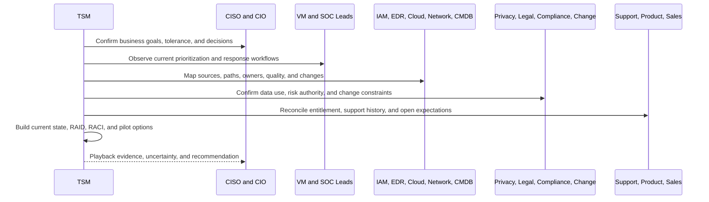

### Initial synthetic baseline

The figures below continue Part 1 and remain fictional.

| Baseline issue | Synthetic evidence | Decision consequence | Initial action |
|---|---|---|---|
| Duplicate assets | 17 percent of sampled endpoint records appear duplicated | Counts and findings may double | Tune entity rules and sample errors |
| Missing ownership | 61 percent of Tier 1 sampled assets have validated owner | High-risk work may bounce | Establish owner authority and fallback |
| Stale CMDB | 14 percent of sampled active records have no check-in for 90 days | Denominator and lifecycle are distorted | Agree retirement and freshness rules |
| Scanner mismatch | One scanner reports 28 percent more servers | Coverage cannot be inferred from absence | Reconcile scope, credentials, and identifiers |
| Endpoint gap | 1,860 assets appear without current EDR coverage | Detection and containment may be weak | Validate existence, exception, and deployment |
| Cloud exposure | 73 internet-reachable services lack confirmed owner | Exposed services have no accountable review | Resolve account, service, and owner |
| Finding overload | 286,000 open findings; 18,400 labeled critical by at least one source | Teams cannot treat all equally | Build contextual, explainable priority |
| Closure mismatch | 22 percent of sampled closed tickets retain open source finding | Administrative closure may not reduce exposure | Reconcile ticket to source or control evidence |

### Initial risk statement

"NMH cannot reliably identify and treat its most consequential exposures because asset identity, ownership, vulnerability evidence, control state, and business criticality are fragmented and inconsistent. This creates a plausible condition in which an internet-reachable, business-critical asset with exploitable weakness and weak controls receives less attention than lower-consequence findings. Current evidence does not prove a breach or exact financial loss."

### Pilot decision

| Option | Benefit | Risk | Decision |
|---|---|---|---|
| Connect every source globally | Broad future coverage | Long delay, many unknowns, weak validation | Rejected for first phase |
| Pilot Tier 1 internet-facing services in two regions | Bounded value, visible consequence, manageable validation | May not represent plants or all regions | Selected |
| Start with executive dashboard only | Fast presentation | Weak data foundation and trust risk | Rejected |
| Start with one scanner only | Simple | Preserves blind spots and identifier conflict | Rejected |

## Success plan

| Outcome | Baseline | Quarter target | Accountable fictional owner | Dependencies | Validation |
|---|---|---|---|---|---|
| Trust pilot asset inventory | 17 percent duplicate sample and disputed counts | Accepted match rules; duplicate error below 5 percent in pilot sample | Elena, CMDB owner | Cloud, endpoint, scanner identifiers | False merge/split sample and source reconciliation |
| Improve Tier 1 ownership | 61 percent validated | At least 90 percent in pilot | Priya with service owners | Business catalog and owner attestation | Field-level source and owner sign-off |
| Prioritize consequential exposure | 18,400 source-critical labels | Explainable ranked pilot backlog | Priya | Asset, threat, control, identity, business context | Known-example calibration |
| Operationalize remediation | 22 percent sampled closure mismatch | At least 95 percent validated closure in pilot | Priya and ServiceNow owner | Ticket integration and rescan | Source or compensating-control evidence |
| Improve analyst adoption | No target workflow | 80 percent target users proficient | Jonah and Priya | Data trust, role access, training | Observed workflow and teach-back |
| Protect executive reporting | Scope and freshness caveats inconsistent | Hard-stop rule for critical data loss | Maya | Source-health metrics | Decision record and QBR usage |

## RAID log

| ID | Type | Statement | Impact | Owner | Treatment or test |
|---|---|---|---|---|---|
| R-01 | Risk | Credential rotation may interrupt cloud freshness | High | Sam | Nonproduction rotation test and alert |
| R-02 | Risk | Plant remediation may conflict with safety windows | High | Grace | Plant exception and compensating-control process |
| A-01 | Assumption | CMDB owner field means accountable service owner | High | Elena | Sample with business-service owners |
| A-02 | Assumption | EDR absence means control gap | Medium-high | Endpoint lead | Validate asset existence and agent exception |
| I-01 | Issue | Duplicate identities and assets distort counts | High | Data workstream | Match-rule workshop and samples |
| I-02 | Issue | Closed tickets do not always match source | High | Priya | Reconciliation workflow |
| D-01 | Dependency | Product entitlement and integrations need verification | High | Account team | Current tenant and catalog review |
| D-02 | Dependency | Privacy approval required for selected identity fields | Medium | Aisha | Minimized schema and purpose review |

## RACI

| Activity | TSM | CISO | VM lead | Source admins | Data/CMDB | SOC | Support | Product | Sales |
|---|---|---|---|---|---|---|---|---|---|
| Confirm business outcomes | Responsible | Accountable | Responsible | Consulted | Consulted | Consulted | Informed | Informed | Consulted |
| Approve pilot scope | Responsible | Accountable | Responsible | Consulted | Consulted | Consulted | Informed | Informed | Consulted |
| Approve source access | Consulted | Informed | Accountable | Responsible | Consulted | Informed | Consulted | Informed | Informed |
| Validate mappings and counts | Responsible | Informed | Accountable | Responsible | Responsible | Consulted | Consulted | Informed | Informed |
| Define priority factors | Responsible | Consulted | Accountable | Consulted | Consulted | Consulted | Informed | Consulted | Informed |
| Operate remediation workflow | Consulted | Informed | Accountable | Responsible | Consulted | Consulted | Informed | Informed | Informed |
| Diagnose product defect | Consulted | Informed | Informed | Consulted | Consulted | Informed | Accountable and Responsible | Consulted | Informed |
| Prioritize product request | Informed | Informed | Consulted | Informed | Informed | Consulted | Informed | Accountable and Responsible | Consulted |
| Make commercial commitment | Consulted | Informed | Consulted | Informed | Informed | Informed | Informed | Informed | Accountable and Responsible |
| Accept residual risk | Informed | Accountable | Responsible | Consulted | Consulted | Consulted | Informed | Informed | Informed |

## Quarter 2 - Source and Data Fabric onboarding plan

Zscaler's official Data Fabric page describes aggregating and unifying data across security tools and business systems, including ingestion, harmonization and mapping, deduplication, correlation and enrichment, business logic, workflows, and reporting. This case applies those documented concepts, but the design below is fictional and does not assert a real connector catalog or implementation.

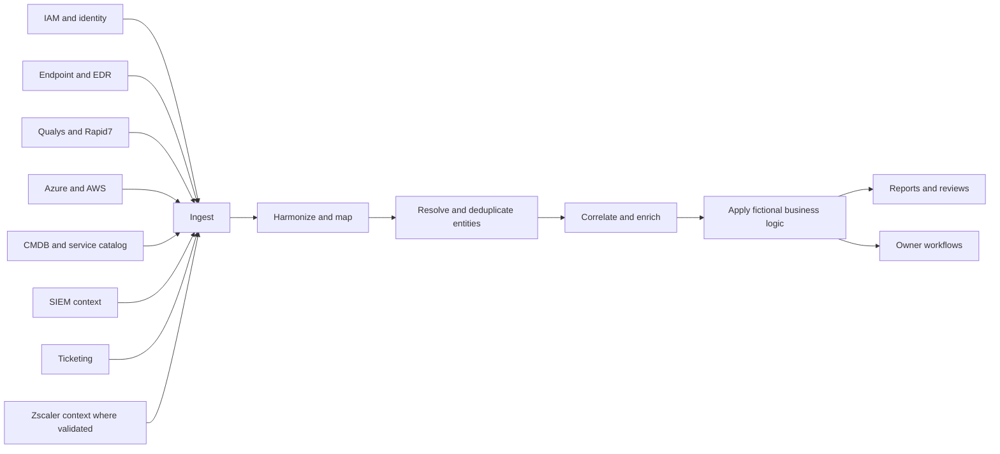

### Source inventory and sequencing

| Wave | Source | Use case | Minimum fields | Authority and caveat | Acceptance test |
|---:|---|---|---|---|---|
| 1 | Cloud inventory | Existence, exposure, tags, account | Provider ID, account, region, lifecycle, network exposure | Authority for current cloud object existence if API scope is valid | Count and sample against cloud console |
| 1 | CMDB and service catalog | Owner, service, tier, lifecycle | Configuration ID, service, owner, status, tier | Service catalog for approved owner; CMDB lifecycle may be stale | Owner and retired-record sample |
| 1 | Endpoint/EDR | Device identity and protection | Device ID, hostname, user, agent state, last seen | Authority for recent protection state after identity match | Known-device and stale-agent sample |
| 1 | Vulnerability scanners | Finding evidence | Scanner asset ID, vulnerability ID, severity, evidence, scan time | Each source authoritative for its observation, not whole priority | Same-host and same-finding reconciliation |
| 2 | IAM | User, privilege, group, sign-in context | Identity ID, role, department, sponsor, status | Authority varies by workforce and service identity field | Known user and role sample |
| 2 | Ticketing | Assignment, SLA, action, closure | Ticket ID, entity, owner, state, timestamps, evidence | Authority for workflow state, not remediation truth | Closed-ticket source check |
| 2 | SIEM | Alert and investigation context | Event/alert ID, entity, time, outcome | Event context may lack business mapping | Correlation-ID sample |
| 2 | Zscaler | Identity, traffic, policy, risk context where licensed | Tenant-validated fields only | Capability and source meaning require current documentation | Current product and tenant validation |
| 3 | Business reference | Criticality, downtime, data class | Service ID, tier, owner, region, class | Business owner approves semantics | Owner attestation |

### Connector contract

| Contract field | Example for fictional cloud source |
|---|---|
| Purpose | Current cloud asset existence and exposure context for pilot |
| Source owner | Sam Okafor's cloud operations team |
| Authentication | Dedicated least-privileged service identity; exact method to validate |
| Scope | Two selected regions and approved accounts |
| Frequency | Hourly synthetic target |
| Freshness tolerance | Two hours for pilot decisions |
| Expected volume | Baseline range by account and day |
| Schema | Provider ID, account, region, type, state, tags, exposure fields |
| Error handling | Retry, alert, owner notification, decision guardrail |
| Reconciliation | Daily counts plus weekly representative sample |
| Privacy | No unnecessary content or personal attributes |
| Change | Credential, API, schema, and account-scope changes recorded |
| Exit | Disable credential and document retention at decommission |

## Synthetic datasets

All identifiers and values below are invented.

### Asset source sample

| source | source_asset_id | hostname | cloud_id | ip_address | last_seen | owner | service | edr_state |
|---|---|---|---|---|---|---|---|---|
| Azure | az-001-a | nmh-pay-01 | /sub-a/vm/pay01 | 10.20.4.18 | 2026-08-20T10:05Z | Finance Platforms | Finance Close | present |
| EDR | edr-8801 | NMH-PAY-01 | blank | 10.20.4.18 | 2026-08-20T10:03Z | blank | blank | healthy |
| CMDB | ci-44009 | pay01-old | blank | 10.20.4.18 | 2026-06-02T08:00Z | Kenji Mori | Finance Close | blank |
| AWS | aws-i-773 | nmh-web-eu-7 | i-0abc773 | 10.41.8.7 | 2026-08-20T10:04Z | blank | Supplier Portal | blank |
| ScannerA | qa-1220 | nmh-web-eu-7 | blank | 10.41.8.7 | 2026-08-20T08:00Z | blank | blank | blank |
| ScannerB | r7-9921 | WEB-EU7 | i-0abc773 | 10.41.8.7 | 2026-08-20T07:55Z | Eva Lind | blank | blank |
| CMDB | ci-55220 | web-eu7 | blank | 10.41.8.70 | 2026-04-01T12:00Z | Former Team | Supplier Portal | blank |
| EDR | edr-9920 | plant-hmi-204 | blank | 172.18.4.20 | 2026-08-19T22:00Z | Plant West | Plant Scheduling | missing |
| CMDB | ci-66201 | plant-hmi-204 | blank | 172.18.4.20 | 2026-08-17T07:00Z | Grace Park | Plant Scheduling | exception |
| Azure | az-ephem-88 | build-6f4a | /sub-b/vm/build6f4a | 10.88.1.19 | 2026-08-20T09:58Z | blank | Engineering Build | blank |

`blank` is a literal synthetic missing value, not a recommended storage practice.

### Vulnerability finding sample

| finding_id | source_asset_id | synthetic_vuln_id | source_severity | exploit_signal | first_seen | last_seen | status |
|---|---|---|---|---|---|---|---|
| F-1001 | qa-1220 | SYN-2026-001 | critical | known active exploitation | 2026-08-10 | 2026-08-20 | open |
| F-1002 | r7-9921 | SYN-2026-001 | severe | known active exploitation | 2026-08-11 | 2026-08-20 | open |
| F-1003 | az-001-a | SYN-2026-014 | high | exploit code reported | 2026-07-15 | 2026-08-20 | open |
| F-1004 | edr-9920 | SYN-2025-330 | critical | no current exploitation evidence | 2026-06-01 | 2026-08-19 | exception |
| F-1005 | az-ephem-88 | SYN-2026-021 | high | exploit probability elevated | 2026-08-20 | 2026-08-20 | open |
| F-1006 | ci-55220 | SYN-2024-080 | critical | known active exploitation | 2025-12-10 | 2026-04-01 | closed ticket |

The `SYN` identifiers are fictional and deliberately do not represent real Common Vulnerabilities and Exposures records.

### Identity and business-context sample

| entity_id | entity_type | role_or_service | privilege | business_tier | data_class | owner_confidence |
|---|---|---|---|---|---|---|
| id-kenji-admin | human admin | Finance Platforms | high | Tier 1 | financial | high |
| svc-supplier-api | service identity | Supplier Portal | high | Tier 1 | supplier confidential | medium |
| user-driver-77 | contractor | Fleet Dispatch | standard | Tier 1 | location personal | medium-low |
| svc-build-22 | workload identity | Engineering Build | medium | Tier 2 | intellectual property | low |
| asset-plant-204 | device relationship | Plant Scheduling | local elevated | Tier 1 | manufacturing sensitive | medium |

### Connector-health sample

| connector | expected_last_success | actual_last_success | record_count_baseline | current_count | state | decision_use |
|---|---|---|---:|---:|---|---|
| Azure pilot | 2026-08-20T10:00Z | 2026-08-20T10:02Z | 12,400 | 12,488 | healthy | allowed |
| AWS pilot | 2026-08-20T10:00Z | 2026-08-18T22:00Z | 8,600 | 2,110 | stale | blocked for trend |
| EDR corporate | 2026-08-20T09:00Z | 2026-08-20T09:08Z | 31,500 | 31,420 | within tolerance | allowed with scope note |
| CMDB | 2026-08-20T00:00Z | 2026-08-20T00:20Z | 48,000 | 49,880 | fresh but drifted | provisional |
| Qualys pilot | 2026-08-20T06:00Z | 2026-08-20T06:15Z | 9,800 | 9,760 | within tolerance | allowed |
| Rapid7 pilot | 2026-08-20T06:00Z | 2026-08-20T05:55Z | 7,700 | 7,590 | within tolerance | allowed |

## Data quality and entity resolution

Entity resolution decides which source records represent the same real asset, identity, application, or finding. A false merge combines different entities. A false split leaves one entity represented several times.

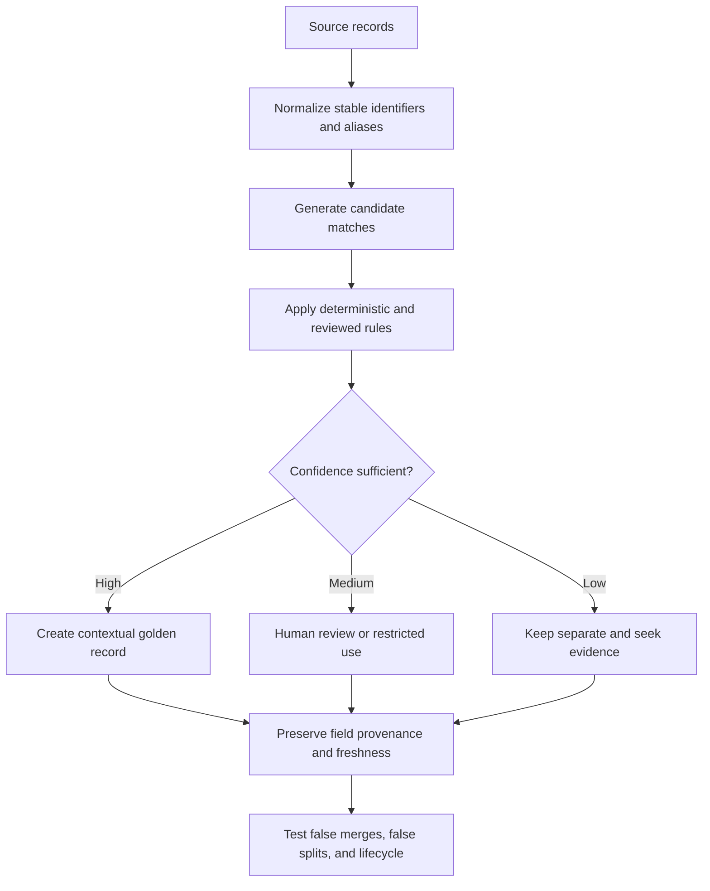

### Illustrative matching rules

| Priority | Rule | Example | Risk | Test |
|---:|---|---|---|---|
| 1 | Exact immutable cloud provider ID | AWS record and scanner record share `i-0abc773` | Identifier copied incorrectly | Verify account and time overlap |
| 2 | Exact managed endpoint ID | EDR records share device ID | Reimage creates lifecycle break | Check enrollment and serial evidence |
| 3 | Composite hostname, IP, domain, and overlapping time | `NMH-PAY-01` and `pay01-old` | Reused IP or renamed host | Compare cloud ID and observation time |
| 4 | CMDB relationship plus owner-confirmed alias | Service catalog links old and new names | Stale relationship | Owner sample and change record |
| 5 | Human review for plant and ambiguous records | Plant HMI has local naming | False merge can affect safety decision | Plant owner confirmation |

### Field-level source authority

| Field | Preferred synthetic authority | Secondary source | Conflict behavior |
|---|---|---|---|
| Cloud existence and state | Current cloud provider API | Scanner and CMDB | Cloud lifecycle wins if API scope is validated |
| Endpoint protection state | Current EDR telemetry | Endpoint manager | Most recent matched device record wins |
| Business service | Approved service catalog | CMDB and owner interview | Route dispute to service owner |
| Accountable owner | Approved business owner register | CMDB | Require attestation for Tier 1 |
| Vulnerability observation | Source scanner | Patch and config evidence | Keep source provenance; validate closure |
| Internet reachability | Effective network/cloud path evidence | Inventory label | Observed and configured path review |
| Data classification | Data owner and approved policy | Discovery tool | Owner resolves material conflict |
| Ticket status | Ticketing system | Work notes | Does not prove exposure closure |

## Plain-English deep-dive 1 - A golden record is a reasoned view, not golden truth

Imagine three witnesses describing one vehicle. One knows the registration number, one inspected the engine today, and one knows the owner. Combining their testimony can create a better record, but only if identities are matched correctly and each fact retains its source and date.

A golden asset record should therefore contain selected values, relationships, provenance, freshness, and confidence. If it merely hides disagreement, it creates a polished error.

| Golden-record question | Weak answer | Strong answer |
|---|---|---|
| Why are records merged? | Similar names | Explicit rule, identifiers, time overlap, and confidence |
| Which owner won? | CMDB value | Approved field authority with date and attestation |
| What if sources disagree? | Last update wins globally | Field-specific precedence and dispute workflow |
| Can it be corrected? | Manual edit with no history | Merge/split review, audit, and source repair |
| Is it current? | Record exists | Each important field has freshness and source |

## Asset Exposure Management and CAASM exercise

The official Zscaler AEM page describes unified and deduplicated asset inventory, relationships, golden records, coverage gaps, CMDB health, automated actions, and reporting. CAASM is the broader industry category. The workflow below is conceptual and fictional.

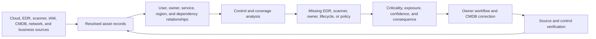

### Synthetic coverage-gap output

| gap_id | asset | service | gap | exposure | criticality | confidence | owner | action |
|---|---|---|---|---|---|---|---|---|
| G-001 | nmh-web-eu-7 | Supplier Portal | Owner unconfirmed | Internet reachable | Tier 1 | High existence, low owner | Eva pending | Validate owner and restrict if unnecessary |
| G-002 | plant-hmi-204 | Plant Scheduling | EDR absent or excepted | Plant-local | Tier 1 safety | Medium | Grace | Validate supported control and compensating monitoring |
| G-003 | build-6f4a | Engineering Build | CMDB absent | Cloud private | Tier 2 | High existence | Unknown | Apply lifecycle tag and owner rule |
| G-004 | pay01-old | Finance Close | Duplicate/stale CMDB identity | Internal | Tier 1 | Medium | Kenji | Resolve alias and retire stale record |
| G-005 | svc-supplier-api | Supplier Portal | Service identity owner confidence medium | Internet service dependency | Tier 1 | Medium | Eva | Attest owner and rotation policy |

The action depends on context. Missing EDR on an operational-technology device may reflect a compatibility exception rather than careless omission. The TSM brings plant, endpoint, risk, and safety owners together instead of demanding an unsafe agent install.

## UVM contextual-priority exercise

The official Zscaler UVM page describes aggregated and correlated data, contextual multifactor scoring, customer-adjustable factors and weights, mitigating controls, dashboards, and remediation workflows. **The formula below is entirely fictional, educational, and not a Zscaler formula, scale, recommendation, or product representation.**

Let every factor be normalized from 0 to 100:

- $S$: source technical severity.
- $E$: current exploit or threat signal.
- $R$: effective reachability or attack-path opportunity.
- $B$: business criticality and data consequence.
- $I$: identity privilege or powerful relationship.
- $C$: control gap, where 100 means weak or absent validated mitigation.
- $U$: uncertainty penalty, where missing decision-critical context raises validation priority.

$$
P = 0.20S + 0.20E + 0.15R + 0.15B + 0.10I + 0.10C + 0.10U
$$

This synthetic index is designed to demonstrate explainability, not to predict breach probability or loss.

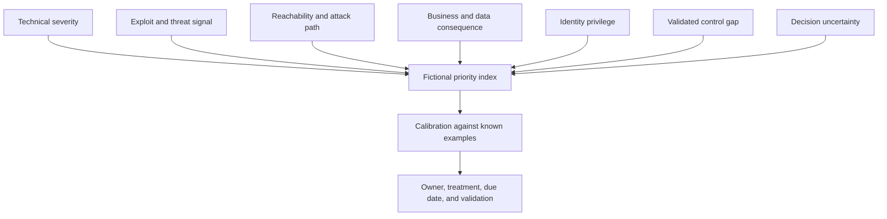

### Illustrative calculations

For fictional Supplier Portal asset `nmh-web-eu-7`:

$$
P = 0.20(95) + 0.20(100) + 0.15(100) + 0.15(100) + 0.10(80) + 0.10(90) + 0.10(40) = 90.0
$$

For an isolated synthetic lab asset with the same technical issue:

$$
P = 0.20(95) + 0.20(100) + 0.15(10) + 0.15(20) + 0.10(10) + 0.10(20) + 0.10(10) = 47.5
$$

The same technical severity produces different priority because reachability, business consequence, identity, controls, and uncertainty differ. The formula does not prove that either asset will be exploited.

### Synthetic ranked findings

| rank | asset | synthetic finding | S | E | R | B | I | C | U | P | recommended next step |
|---:|---|---|---:|---:|---:|---:|---:|---:|---:|---:|---|
| 1 | nmh-web-eu-7 | SYN-2026-001 | 95 | 100 | 100 | 100 | 80 | 90 | 40 | 90.0 | Immediate owner validation, containment options, remediation |
| 2 | pay01 | SYN-2026-014 | 80 | 70 | 35 | 100 | 90 | 60 | 20 | 65.0 | Finance-window plan and compensating control review |
| 3 | plant-hmi-204 | SYN-2025-330 | 95 | 20 | 20 | 100 | 60 | 80 | 60 | 59.5 | Plant-safe validation and time-bound exception |
| 4 | build-6f4a | SYN-2026-021 | 80 | 65 | 20 | 50 | 30 | 50 | 80 | Validate owner and short-lived lifecycle first |
| 5 | isolated-lab-9 | SYN-2026-001 | 95 | 100 | 10 | 20 | 10 | 20 | 10 | 47.5 | Confirm isolation and schedule treatment |

The uncertainty factor prevents missing owner or lifecycle data from appearing artificially safe. It can route work to validation rather than directly to patching.

### Priority calibration questions

| Question | Desired property | Failure response |
|---|---|---|
| Does known-exploited, internet-facing Tier 1 rank above isolated lab? | Face validity | Inspect mapping, factors, and weights |
| Does a validated effective control reduce control-gap input? | Control sensitivity | Verify control health and factor semantics |
| Does missing context lower priority? | It should not silently do so | Raise uncertainty or validation route |
| Can a stakeholder explain the top drivers? | Explainability | Expose factor-level evidence |
| Do stable examples change unexpectedly after source update? | Reproducibility | Version logic and investigate data drift |
| Can owners act on the output? | Operational value | Improve grouping, evidence, and workflow |

## Plain-English deep-dive 2 - Contextual priority is triage, not truth

A hospital triage score organizes attention. It does not guarantee outcome, replace diagnosis, or authorize every treatment. A contextual vulnerability priority does the same: it combines evidence to order limited work.

The score can fail through bad source data, wrong identity match, stale reachability, inflated criticality, assumed controls, biased weights, or missing ownership. Credibility comes from traceable factors, calibration, versioning, expert challenge, workflow, and validation.

| Score claim | Responsible interpretation |
|---|---|
| "This is number one" | It is first under the current scope, data, logic, and version |
| "Risk fell" | Defined drivers changed; verify scope and source stability |
| "Control lowers priority" | Only if the control is applicable, healthy, and effective |
| "Missing data is low risk" | False; missing critical context creates uncertainty |
| "The formula predicts breach" | Unsupported; it is a prioritization aid |
| "A product score owns the decision" | False; authorized humans decide treatment and residual risk |

## Remediation workflow

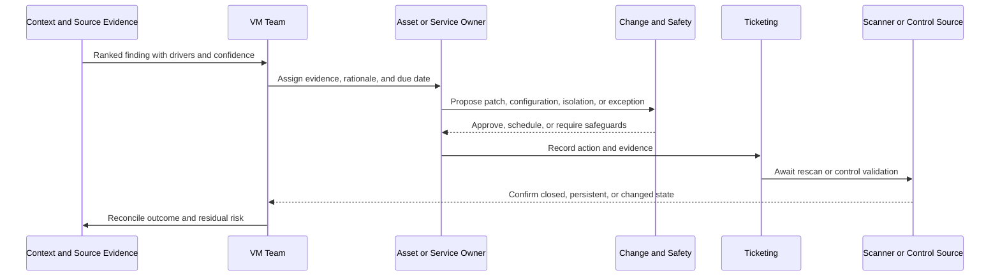

### Treatment options

| Treatment | When appropriate | Required evidence | Residual concern |
|---|---|---|---|
| Remediate | Fix is feasible and risk warrants change | Patch/config success plus source validation | Regression or incomplete coverage |
| Mitigate | Full fix delayed; another control reduces exposure | Applicability, health, test, owner, expiry | Control can fail or coverage may be partial |
| Isolate or restrict | Reachability can be safely reduced | Path and application test, business approval | Operational impact or bypass path |
| Accept | Authorized owner accepts remaining risk | Evidence, rationale, expiry, conditions, approval | Risk remains and must be reviewed |
| Transfer | Contract or insurance shifts part of consequence | Legal and commercial review | Technical risk still exists |
| Avoid | Business stops the risky activity | Service and dependency confirmation | Replacement process risk |

### Synthetic workflow records

| ticket | asset | action | owner | due | state | validation | residual risk |
|---|---|---|---|---|---|---|---|
| INC-8801 | nmh-web-eu-7 | Restrict unnecessary path, then patch | Eva's app team | 2026-09-13 | in progress | Scanner and path test | Temporary exposure until change |
| CHG-3312 | pay01 | Patch in finance-approved window | Kenji | 2026-09-20 | approved | Rescan and finance smoke test | Short delay accepted |
| RISK-220 | plant-hmi-204 | Segment, monitor, and defer incompatible agent | Grace and risk owner | 2026-10-15 | exception | Path, monitoring, plant test | Endpoint visibility remains limited |
| DATA-441 | build-6f4a | Add owner/lifecycle rule | Cloud platform | 2026-09-10 | complete | New-instance sample | Tag bypass remains possible |

## CTEM program cycle

Continuous Threat Exposure Management, or CTEM, is an industry program model. Zscaler's official page uses the stages scoping, discovery, prioritization, validation, and mobilization. The case applies those stages as a recurring operating cycle.

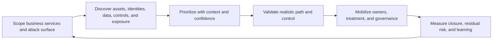

| CTEM stage | NMH fictional practice | Artifact | Anti-pattern |
|---|---|---|---|
| Scoping | Tier 1 internet-facing services in two regions | Service and asset scope | "Everything" as first scope |
| Discovery | Multi-source asset, finding, identity, control, and business context | Resolved inventory and gap report | Scanner list treated as attack surface |
| Prioritization | Explainable factors plus uncertainty | Ranked backlog and calibration | Severity-only queue |
| Validation | Confirm reachability, control, owner, and source evidence safely | Validation record | Unsafe exploit attempt |
| Mobilization | Assign treatment, change, exception, due date, and evidence | Ticket, RACI, and campaign | Dashboard without owner action |
| Learning | Reconcile outcome and update scope, data, and controls | Trend and decision log | Counting closure without proof |

## Risk360-style executive framing

Zscaler's official Risk360 page describes risk scoring and drivers across four attack stages: external attack surface, compromise, lateral propagation, and data loss. It also describes guided mitigation, financial exposure, and executive or board reporting. The table below uses **Risk360-style framing only**. It is not a Risk360 output or formula.

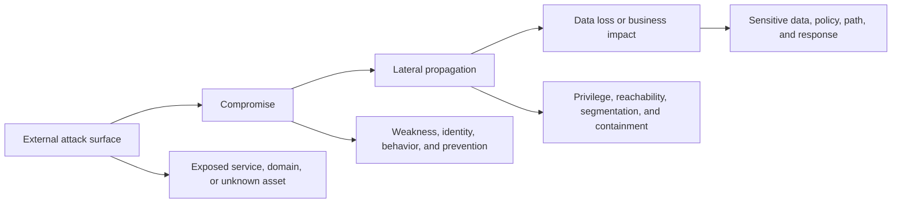

### Synthetic stage narrative

| Stage | Fictional evidence | Uncertainty | Mitigation direction | Executive decision |
|---|---|---|---|---|
| External attack surface | 73 exposed cloud services lacked confirmed owner at baseline | Connector freshness and effective path need validation | Resolve ownership, remove unnecessary exposure, monitor drift | Approve owner hard stop for Tier 1 |
| Compromise | Known-exploitation signal on contextual high-priority service | Scanner evidence and current control health vary | Patch, restrict, strengthen identity, verify control | Approve emergency change path |
| Lateral propagation | Acquired sites retain broad network assumptions | Complete path and segmentation evidence unavailable | Map high-value paths, narrow access, test containment | Fund bounded architecture review |
| Data loss | Supplier, finance, and engineering data cross SaaS and partner paths | Classification coverage incomplete | Improve classification, access, policy, and monitoring | Assign data-owner attestations |

### Fictional executive index

For teaching only, NMH assigns each stage a 0 to 100 concern index. This is not a Zscaler score and not a loss probability.

$$
X = 0.30A + 0.25C + 0.25L + 0.20D
$$

$A$ is external attack-surface concern, $C$ is compromise concern, $L$ is lateral-propagation concern, and $D$ is data-loss concern. If the synthetic values are 78, 72, 66, and 70:

$$
X = 0.30(78) + 0.25(72) + 0.25(66) + 0.20(70) = 71.9
$$

The index is useful only with drivers, trend, scope, confidence, and actions. It must not be called an expected financial loss. Any financial exposure estimate would require explicit model assumptions, distributions, data quality, legal and finance review, and scenario ranges.

## Agentic SecOps concepts

Zscaler's official Agentic SecOps page describes combining first- and third-party signals, a security graph, business context, agentic triage and investigation, unified threat stories, and adaptive responses through inline controls. The following workflow is conceptual. It does not assert actual NMH deployment or autonomous action.

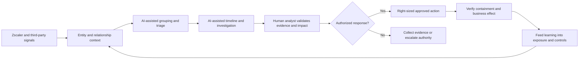

### Conceptual AI control matrix

| Stage | AI may assist | Human responsibility | Required control |
|---|---|---|---|
| Group | Connect related alerts or entities | Confirm events belong together | Explainable relationship and source link |
| Summarize | Draft timeline and evidence summary | Check omissions and invented claims | Grounding and citation to source record |
| Prioritize | Rank by business and risk context | Challenge factors and consequence | Factor visibility and calibration |
| Investigate | Suggest queries and hypotheses | Approve data access and interpret result | Least privilege and audit |
| Recommend | Propose step-up authentication, reduced access, or isolation | Assess business effect and authority | Approval threshold and reversibility |
| Act | Invoke a permitted workflow where approved | Own consequential decision | Allowlisted tool, bounded scope, logging, rollback |
| Learn | Identify repeated pattern | Decide policy or process change | Review, versioning, and quality monitoring |

## Plain-English deep-dive 3 - Machine speed needs stronger brakes, not weaker ones

A faster vehicle can reduce travel time, but it needs reliable steering, brakes, rules, and trained drivers. AI-assisted Security Operations can compress investigation time, yet an incorrect identity match or overbroad containment can disrupt a critical service faster too.

| Risk | Example in the fictional case | Guardrail |
|---|---|---|
| Hallucination | Summary invents a scanner confirmation | Every claim links to source evidence |
| Wrong entity | Duplicate host records merge plant and corporate device | Confidence threshold and human review |
| Excess authority | Agent can isolate any user globally | Least-privileged tool and bounded scope |
| Prompt or data manipulation | Untrusted text influences recommendation | Treat input as data, isolate instructions, validate tools |
| Privacy leakage | Identity context exceeds investigation purpose | Data minimization and access control |
| Automation bias | Analyst accepts fluent recommendation | Required challenge and approval record |
| Unclear accountability | Team says "AI blocked it" | Named human and business authority |

Your factual Copilot Studio and AI enablement work supports an honest transfer around workflow design, validation, and training. It does not prove production Agentic SecOps operation.

## Training and adoption plan

### Role-based curriculum

| Audience | Learning objective | Practice scenario | Validation |
|---|---|---|---|
| Source administrators | Operate connector, credential, scope, and freshness controls | Rotate a test credential and reconcile count | Successful run plus alert and rollback |
| Data/CMDB team | Resolve entities and preserve provenance | Review false merge and stale owner | Correct merge/split and source rule |
| VM analysts | Explain priority and route treatment | Compare same synthetic vulnerability on two assets | Factor explanation and owner assignment |
| Asset owners | Understand evidence, options, due date, and validation | Respond to a contextual finding | Correct treatment and completion proof |
| SOC analysts | Use business context without overtrusting AI | Review a grouped threat story | Identify unsupported claim and choose safe next step |
| Executives | Interpret trend, drivers, uncertainty, and decision | Challenge a sudden score improvement | Ask for scope and source health |

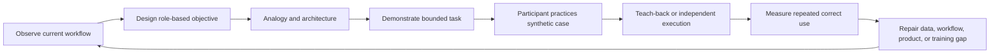

### Adoption measures

| Measure | Definition | Synthetic target | Misuse warning |
|---|---|---|---|
| Target-role activation | Correct users have access and prerequisites | 95 percent | Access is not adoption |
| First-value completion | User completes one meaningful workflow | 90 percent trained users | One completion is not proficiency |
| Weekly meaningful use | Target users complete defined task in period | 80 percent | Frequency can reward superficial use |
| Teach-back proficiency | User explains drivers and performs task correctly | 85 percent sample | Training test may not reflect real pressure |
| Workflow bypass | Work returns to ungoverned spreadsheet path | Downward trend | Some exports may be legitimate |
| Validated closure | Closed ticket aligns with source or control evidence | At least 95 percent pilot | Source lag must be considered |
| Time to owner | Elapsed time from accepted priority to accountable assignment | Downward trend | Fast wrong assignment is not success |

## Quarter 3 - Critical connector outage

At fictional 09:10 on Tuesday, the VM team reports that the AWS pilot connector has not delivered current data for 36 hours after a credential rotation. At the same time, `SYN-2026-001` becomes an urgent known-exploitation scenario affecting a software component used by internet-facing services. The executive dashboard appears to improve because thousands of cloud records disappear from the current denominator.

The TSM treats this as a technical incident, a security-workflow incident, and a decision-integrity incident.

```mermaid
sequenceDiagram
    participant VM as Priya, VM Lead
    participant TSM
    participant Cloud as Sam, Cloud Admin
    participant Support as Vendor Support
    participant Product as Product Liaison
    participant Sales as Sales Lead
    participant CISO as Maya, CISO
    VM->>TSM: Report stale AWS data and urgent synthetic finding
    TSM->>CISO: Mark executive trend provisional; state impact and next update
    TSM->>Cloud: Validate source API, credential, permission, scope, and last good run
    TSM->>VM: Reconcile urgent bounded scope directly from approved sources
    TSM->>Support: Open severity-appropriate case with timestamps and evidence
    Support->>Product: Engage if reproducible product defect or limitation is indicated
    TSM->>Sales: Share accurate technical risk and customer communication plan
    Sales-->>TSM: Keep commercial conversation aligned; no technical promise
    Support-->>TSM: Provide validated recovery guidance
    TSM->>CISO: Report recovered data, reconciliation, corrected trend, and prevention
```

### First-hour plan

| Minute | Action | Owner | Evidence or output |
|---:|---|---|---|
| 0-10 | Confirm last known good, scope, decision impact, and severity | TSM, VM, cloud | Impact statement and timeline |
| 10-15 | Mark affected dashboards and scores provisional | CISO delegate and reporting owner | Visible decision guardrail |
| 10-25 | Validate source availability, credential, permissions, API, limits, and recent change | Cloud admin | Source-side test evidence |
| 15-30 | Open or strengthen Support case | TSM and Support | Sanitized logs, timestamps, expected versus actual |
| 20-45 | Build direct bounded inventory for urgent component | Cloud and VM | Approved emergency scope list |
| 30-50 | Check downstream entity, priority, and ticket effects | Data and VM | Affected records and action list |
| 45-60 | Issue factual update with unknowns and next checkpoint | TSM | Customer and account-team update |

### Hypothesis matrix

| Hypothesis | Supporting evidence | Disconfirming test | Owner |
|---|---|---|---|
| Credential expired or rotated incorrectly | Failure follows rotation | Direct least-privileged API call succeeds or fails | Cloud admin |
| Permission scope changed | Authentication succeeds but records are partial | Compare approved account and resource coverage | Cloud admin |
| Source API throttles or fails | Source errors or rate-limit responses | Provider health and controlled request | Cloud admin |
| Connector scheduling/checkpoint failed | Source works; ingestion has no recent success | Connector logs and retry state | Support |
| Schema changed | New fields or types appear before failure | Compare last good and current payload | Source and Support |
| Network path or name resolution failed | Connection errors align with change | DNS, connection, and proxy test | Network and Support |
| Dashboard filter changed | Raw data current but view count drops | Compare raw ingestion with report query | Reporting owner |
| Entity rules hide records | Ingested records exist but merged or retired | Inspect sample lineage and match logic | Data team |

### Support package

| Evidence | Content |
|---|---|
| Customer impact | Urgent cloud exposure decisions and executive trend are unreliable |
| Scope | Fictional AWS pilot accounts and two regions |
| Last known good | 2026-09-08T22:00Z synthetic timestamp |
| First observed | 2026-09-10T09:10Z synthetic timestamp |
| Expected | Hourly source completion within two-hour tolerance |
| Actual | No complete ingestion for 36 hours; record count fell from baseline |
| Recent change | Service credential rotation |
| Source test | Sanitized authentication, permission, and count result |
| Product evidence | Connector status, error, retry, and correlation identifier where available |
| Requested help | Confirm failure stage, recovery, affected data, and prevention guidance |

### Customer update example

"At 09:10 we confirmed that AWS pilot inventory is 36 hours stale following a credential rotation. The business workloads are not confirmed down; the impact is that cloud exposure counts, priority, and executive trends may omit current assets. We have marked affected reporting provisional. Cloud Operations is validating source access and scope, the VM team is reconciling the urgent software component directly in the bounded pilot, and vendor Support is reviewing sanitized connector evidence. We do not yet have a validated recovery time. The next update is 10:00 or earlier if impact changes."

The update separates service availability from decision integrity and avoids an unsupported ETA.

## Escalation coordination and boundaries

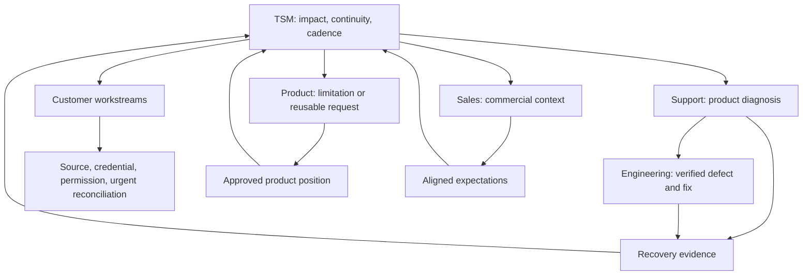

| Team | Owns | TSM request | TSM does not promise |
|---|---|---|---|
| Customer cloud | Source identity, access, scope, and approved emergency inventory | Validate source and change | Product recovery |
| Customer VM | Urgent exposure scope and remediation | Protect consequential workflow | Vendor defect diagnosis |
| Support | Case diagnosis and documented recovery process | Accept complete evidence and status cadence | Product roadmap |
| Engineering | Product implementation and verified fix | Use reproducible evidence and impact | Customer communication unless assigned |
| Product | Product prioritization and approved positioning | Evaluate structured limitation/request | Delivery date without commitment |
| Sales | Commercial process and authorized commitments | Keep technical truth in account narrative | Technical conclusion |
| TSM | Integrated impact, roles, decisions, communication, success-plan update | Maintain continuity | Every specialist task |

## Root cause and recovery

The synthetic root cause is a two-part failure:

1. The source service identity was rotated, but one required read scope was omitted in the replacement permission set.
2. The connector surfaced partial authentication success without a hard alert on the large record-count drop, so the problem reached users through a misleading dashboard trend.

This is fictional. It is not a statement about actual Zscaler connector behavior.

### Recovery validation

| Check | Pass condition | Why needed |
|---|---|---|
| Source access | Approved accounts and resource types return expected sample | Authentication success alone can be partial |
| Ingestion | Complete run succeeds within tolerance | Connector green state needs data evidence |
| Count | Volume returns within explained range | Missing records may remain hidden |
| Freshness | Important records show current timestamps | Backfilled old data is not current state |
| Mapping | Sample fields preserve meaning | Schema change can corrupt context |
| Entity resolution | Known cloud assets resolve correctly | Recovery can create duplicates or false merges |
| Priority | Urgent synthetic findings re-evaluate | Downstream decisions need correction |
| Ticket workflow | Affected records route and reconcile | Data recovery alone is not operational recovery |
| Dashboard | Trend is recalculated and annotated | Executives need corrected history |
| Customer acceptance | VM and cloud owners confirm use | Internal recovery is not customer outcome |

### Preventive actions

| Action | Owner | Due | Validation |
|---|---|---|---|
| Version service-identity permission manifest | Cloud team | 14 days | Peer-reviewed least-privilege test |
| Add pre-rotation connector test | Cloud and Support | 21 days | Nonproduction rotation exercise |
| Alert on freshness and volume deviation | Data/operations | 14 days | Simulated stale and partial feed |
| Add dashboard hard stop | Reporting owner | 7 days | Missing critical source marks trend provisional |
| Document direct bounded reconciliation | VM and cloud | 21 days | Timed exercise using synthetic urgent scope |
| Update evidence package template | TSM and Support | 7 days | Support accepts test package |

## Product and roadmap coordination

During the incident, NMH asks for a configurable "critical source missing" control that blocks selected executive reports. The TSM first determines whether current capability, report logic, or workflow can meet the need. If a verified gap remains, the product request contains:

| Field | Synthetic content |
|---|---|
| Outcome | Prevent decisions based on materially incomplete data |
| Current behavior | Selected reports can show improved trend after critical source loss |
| Scope | Executive exposure views for designated critical sources |
| Frequency | Two material source events in the fictional year |
| Impact | Misprioritization and executive trust risk |
| Workaround | External report guardrail and manual provisional label |
| Requested capability | Configurable data-health dependency and visible invalid-state behavior |
| Evidence | Connector timestamps, count drop, affected reports, decision record |
| Promise | No roadmap date; Product evaluation only |

The TSM gives Product a reusable problem and keeps Sales informed. Sales does not announce a date. Product does not own the customer's temporary reporting control. Support remains responsible for the incident case, not the feature request.

## Executive challenge

At the Quarter 3 steering meeting, Maya asks: "Why should I trust any risk trend after this outage?"

A weak response defends the dashboard. A strong response agrees that trust must be re-earned through controls.

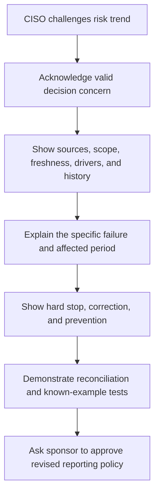

### Decision record DR-017

| Field | Synthetic record |
|---|---|
| Decision | Executive risk trends require designated critical sources within freshness and volume tolerance |
| Accountable owner | Maya Chen, fictional CISO |
| Date | 2026-09-24 |
| Evidence | Connector incident, count reconciliation, affected dashboard history |
| Options | Continue with note; block trend; manual approval; source-specific confidence |
| Decision | Block headline trend and show provisional state until hard-stop checks pass |
| Tradeoff | Temporary reporting delay rather than false improvement |
| Review trigger | Two successful quarterly cycles and control test |

### Executive answer

"You should not trust a number merely because it comes from the platform. You should trust a governed process that exposes source health, scope, drivers, and uncertainty. The outage affected AWS pilot completeness from the last known good point until reconciliation. We have corrected the historical view, introduced a critical-source hard stop, added volume and freshness controls, and tested known assets through the downstream workflow. I recommend approving the revised reporting policy and reviewing the control after two cycles. Residual risk remains for sources outside the pilot and for owner fields still under attestation."

## Quarter 4 - Outcomes

All results below are synthetic. They illustrate reporting form, not promised Zscaler results.

| Outcome | Synthetic baseline | Synthetic Quarter 4 | Interpretation | Caveat |
|---|---:|---:|---|---|
| Pilot duplicate error in reviewed sample | 17 percent | 4.2 percent | Matching and lifecycle rules improved sample | Sample may not represent global estate |
| Tier 1 validated owner coverage | 61 percent | 92 percent | Workflow routing became more reliable | Attestation can age |
| Critical source freshness compliance | Not defined | 96 percent | Health contract and alerting established | Freshness does not prove semantic accuracy |
| Exposed services without owner | 73 | 11 in same stable pilot scope | Ownership and exposure review reduced gap | Some services left scope through validated lifecycle |
| Missing EDR candidates | 1,860 | 1,120 after validation and treatment | Some gaps closed or explained | OT exceptions remain material |
| Open source-critical findings | 18,400 global label | 2,480 accepted high-context pilot items | Context reduced unactionable volume in pilot | Different scope; not a direct global reduction |
| High-context pilot backlog | 2,480 | 840 | Treatment and validation reduced accepted backlog | Priority version and stable denominator required |
| Closure validation | 78 percent sampled alignment | 96 percent pilot | Ticket-source reconciliation improved | Source lag and compensating controls need review |
| Meaningful analyst adoption | Undefined | 83 percent target users weekly | Workflow became repeatable | Frequency and proficiency both required |
| Repeated cloud connector incidents | 3 in prior synthetic quarter | 0 after two tested rotations | Preventive process appears effective | Observation period is short |

### Outcome feedback loop

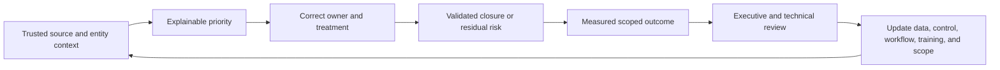

## Health score

The formula is a fictional account-management tool, not a Zscaler score.

$$
H = 0.20T + 0.15D + 0.20A + 0.20V + 0.10S + 0.10G + 0.05F
$$

$T$ is technical health, $D$ data health, $A$ adoption, $V$ value, $S$ support experience, $G$ governance, and $F$ future-value readiness.

| Component | Q1 synthetic score | Q4 synthetic score | Evidence | Residual concern |
|---|---:|---:|---|---|
| Technical health | 62 | 82 | Connector tests, workflow health | Global sources not covered |
| Data health | 48 | 79 | Reconciliation, freshness, sample quality | Owner and OT confidence |
| Adoption | 30 | 81 | Weekly workflow and teach-back | New regions untrained |
| Value | 35 | 76 | Scoped ownership, backlog, closure outcomes | Attribution and scope |
| Support experience | 55 | 72 | Incident recovery and prevention | Trust needs longer observation |
| Governance | 50 | 84 | RACI, hard stop, decisions, cadence | Plant risk process maturing |
| Future readiness | 40 | 70 | Accepted next-quarter plan | Entitlement and capacity dependencies |

Using the fictional formula:

$$
H_{Q1}=0.20(62)+0.15(48)+0.20(30)+0.20(35)+0.10(55)+0.10(50)+0.05(40)=45.1
$$

$$
H_{Q4}=0.20(82)+0.15(79)+0.20(81)+0.20(76)+0.10(72)+0.10(84)+0.05(70)=78.8
$$

The increase is not proof of objective customer health. It summarizes agreed synthetic drivers and must be accompanied by the outage history, residual risks, and confidence.

## Risk register

| ID | Residual risk | Likelihood | Impact | Treatment | Owner | Due/review | Validation |
|---|---|---|---|---|---|---|---|
| RR-01 | OT endpoint visibility remains incomplete | Medium | High safety/operations | Segment, monitor, inventory, plan supported controls | Grace | Monthly | Plant-approved test and inventory sample |
| RR-02 | Owner attestations may become stale | Medium | High workflow | Quarterly attestation and fallback owner | Elena/Priya | Quarterly | Sample and bounced-ticket rate |
| RR-03 | Global regions may not match pilot quality | High | Medium-high | Staged expansion with local acceptance | Regional owners | Next two quarters | Region-by-region quality gate |
| RR-04 | Risk index weights may bias priorities | Medium | High decision | Version, calibrate, challenge, and compare examples | Priya | Monthly | Known-case and exception review |
| RR-05 | AI-assisted summary may omit evidence | Medium | High response | Grounding, reviewer approval, error tracking | Jonah | Continuous | Sample quality and error classes |
| RR-06 | Connector guardrails may miss semantic corruption | Medium-low | High decision | Schema and value checks beyond freshness/count | Data owner | Next quarter | Synthetic schema-drift test |
| RR-07 | Legacy broad access paths remain after acquisitions | Medium | High | Map high-value paths and stage least privilege | Felix | Roadmap | Path validation and change tests |
| RR-08 | Roadmap expectation may reappear commercially | Medium | Medium trust | Single approved status and decision log | TSM/Sales/Product | Monthly | Account-message review |

## QBR narrative

### Executive opening

"This quarter, the NMH pilot moved from fragmented scanner and asset lists toward an owner-driven exposure workflow for Tier 1 internet-facing services in two regions. The strongest results are improved owner coverage, lower sampled duplicate error, validated ticket closure, and repeated analyst use. The most important failure was the AWS connector outage, which exposed a weakness in decision integrity. We corrected the affected trend, added a critical-source hard stop, tested credential rotation, and retained the incident as a health and residual-risk factor rather than hiding it."

### QBR storyboard

| Slide | Message | Evidence | Decision |
|---:|---|---|---|
| 1 | Purpose and two decisions | Agenda and owner | Confirm reporting and expansion gates |
| 2 | Business outcome and scope | Service map and pilot boundary | Keep outcome stable |
| 3 | What improved | Owner, duplicate, closure, adoption trends | Accept scoped outcome |
| 4 | What failed | Connector timeline and corrected data | Keep hard-stop policy |
| 5 | Exposure priorities | Top drivers and treatment outcomes | Approve plant exception governance |
| 6 | Health and confidence | Component score, evidence, hard stops | Treat total as aid, not truth |
| 7 | Residual risk | Top risks, owners, review dates | Approve owners and capacity |
| 8 | Next-quarter roadmap | Staged region and control work | Approve sequence, not every feature |

### QBR communication examples

**Technical audience:** "The duplicate-rate improvement reflects the reviewed pilot sample under match-rule version 1.3. Cloud provider ID has highest identity priority, CMDB aliases require time overlap, and ambiguous plant records remain separate pending owner review."

**Executive audience:** "We made owner assignment and closure evidence more reliable in the pilot. We have not proved global inventory accuracy. The next decision is whether to fund region-by-region expansion with the same quality gates."

**Sales/account audience:** "The technical value story is credible in the bounded pilot, and the customer approved next use cases. Residual OT visibility and global data quality remain. Do not describe the requested report hard stop as a committed product roadmap item."

## 30/60/90 customer plan

This is the next-quarter customer plan, not your personal new-hire plan.

| Period | Customer outcome | Activities | Exit evidence | Main guardrail |
|---|---|---|---|---|
| Days 1-30 | Stabilize and extend source-health controls | Schema checks, credential test, owner attestation design, regional readiness | Passed failure simulations and accepted owners | Do not expand while critical controls are provisional |
| Days 31-60 | Add one region and one business service | Source onboarding, reconciliation, calibration, role training | Region passes data and adoption gates | Do not copy pilot weights without local review |
| Days 61-90 | Operationalize CTEM and executive comparison | Full cycle, remediation campaign, validation, QBR | Stable-scope trend and residual-risk decisions | Do not turn index change into breach or financial claim |

## Next-quarter roadmap

| Priority | Outcome | Work | Dependency | Measure | Decision date |
|---:|---|---|---|---|---|
| 1 | Detect semantic source failure | Add schema, null, distribution, and relationship checks | Source owners and data team | Simulated drift detected before reporting | Day 30 |
| 2 | Improve OT visibility safely | Plant inventory, supported control map, exceptions, telemetry | Grace, safety, endpoint, network | Validated inventory and control evidence | Day 45 |
| 3 | Expand one region | Apply source, entity, owner, priority, and adoption gates | Regional leadership | Gate pass without material quality regression | Day 60 |
| 4 | Strengthen service-identity governance | Owner, purpose, privilege, rotation, and lifecycle | IAM and app teams | Tier 1 identity attestation coverage | Day 60 |
| 5 | Pilot AI-assisted investigation safely | Bounded synthetic/approved alerts, grounding, reviewer, error log | SOC, privacy, security | Quality and time measured with no unauthorized action | Day 75 |
| 6 | Complete next CTEM cycle | Scope, discover, prioritize, validate, mobilize | Cross-functional owners | Validated high-context exposure trend | Day 90 |

## Plain-English deep-dive 4 - A successful account story includes the failure

A polished case that contains only progress is less credible than a case that shows how trust survived failure. Real strategic work includes bad data, misunderstood ownership, delayed change, product limits, and conflict. Success is not the absence of failure; it is the ability to protect decisions, recover honestly, learn, and improve the system.

| Story element | Weak version | Strong version |
|---|---|---|
| Baseline | "The customer had many problems" | Specific scoped evidence and uncertainty |
| Plan | "We deployed products" | Outcomes, owners, dependencies, gates, and validation |
| Failure | Omitted or blamed | Impact, facts, hypotheses, roles, and cadence |
| Recovery | "Connector became green" | Source, count, freshness, entity, downstream, and customer validation |
| Value | Large uncaveated number | Stable-scope outcome with denominator and limits |
| Residual risk | None mentioned | Ranked risks, owners, dates, and evidence |
| Next value | Feature list | Customer outcome and readiness-based roadmap |

This case gives you a coherent interview structure without giving you a false production history.

## Interview reuse map

| Interview theme | Case evidence to reuse | Honesty phrase |
|---|---|---|
| Strategic engagement | Multi-quarter roadmap and governance | "In my fictional account exercise..." |
| Discovery | Business services, stakeholders, sources, risk | "I would use this method in a real account" |
| Data Fabric | Source contract, mapping, entity resolution, quality | "Conceptual design based on dated official positioning" |
| AEM/CAASM | Golden record and coverage-gap workflow | "Synthetic asset exercise, not production AEM use" |
| UVM | Contextual factors and ranked findings | "My own fictional formula, not Zscaler's" |
| CTEM | Recurring five-stage cycle | "Industry program applied to a fictional scope" |
| Risk360 | Four-stage executive narrative | "Risk360-style framing, not a product output" |
| Agentic SecOps | Grounded, human-approved workflow | "Conceptual; my direct AI evidence is different" |
| Critical escalation | Connector outage, workstreams, updates, recovery | "Scenario uses my production escalation method" |
| Cross-functional work | Support, Product, Sales, and customer RACI | "Role boundaries are modeled, not lived at Zscaler" |
| Adoption | Role-based training and teach-back | "Training method transfers from factual experience" |
| Executive challenge | Score-trust response and decision record | "Practiced executive structure, not claimed CISO advisory" |
| Value | Scoped synthetic outcome and caveat | "Synthetic values demonstrate measurement discipline" |

## Failure modes and contrarian checks

| Claim or plan | Contrarian question | Required evidence |
|---|---|---|
| Asset count improved | Did records disappear because a source failed? | Source volume, freshness, lifecycle, and reconciliation |
| Risk fell | Did scope, denominator, or weights change? | Versioned scope and driver comparison |
| Duplicate rate fell | Did false merges increase? | False merge and false split sample |
| Owner coverage rose | Are owners accountable and current? | Attestation and bounced-ticket trend |
| Findings closed | Did source or control confirm treatment? | Rescan, path, config, or approved exception |
| Adoption rose | Did users perform correct workflow or merely log in? | Observed completion and teach-back |
| AI saved time | Did error, rework, or risk increase? | Baseline, quality, error class, reviewer effort |
| Connector is healthy | Are data meaning and downstream workflows correct? | Schema, counts, freshness, mapping, entities, reports |
| Pilot succeeded | Does another region have the same sources and authority? | Readiness assessment and local acceptance |
| Customer is renewal-ready | Are technical risks and expectations visible? | Health drivers, value, sponsor, residual risk, approved next plan |

## Official Source Anchors

**Checked on 2026-08-24.** These official pages support only the documented product positioning summarized in the case. All NMH implementation details, formulas, metrics, incidents, outputs, and outcomes are fictional.

| Official Zscaler source | Used for | Explicit caveat |
|---|---|---|
| https://www.zscaler.com/company/about-zscaler | Mission and transformation context | Does not document NMH or this case |
| https://www.zscaler.com/culture | Outcome, ownership, collaboration, trust, urgency, and transparency context | Published intent is not case evidence |
| https://www.zscaler.com/products-and-solutions/zero-trust-exchange-zte | Identity, context, risk, policy, proxy connections, inline controls, secure/simplify/transform | Exact NMH deployment is fictional and unspecified |
| https://www.zscaler.com/products-and-solutions/security-operations | Agentic SecOps, first/third-party signals, security graph, business context, triage, investigation, adaptive response | Case workflow and controls are conceptual |
| https://www.zscaler.com/products-and-solutions/data-fabric | Ingest, harmonize/map, deduplicate, correlate/enrich, business logic, workflows, reporting | Connector plan and schema are fictional |
| https://www.zscaler.com/products-and-solutions/vulnerability-management | Aggregated context, multifactor scoring, custom factors/weights, reporting, workflows | Every score and formula here is non-Zscaler and fictional |
| https://www.zscaler.com/products-and-solutions/caasm | AEM, CAASM, golden records, coverage gaps, CMDB health, actions, reporting | Entity rules and results here are fictional |
| https://www.zscaler.com/products-and-solutions/ctem | Scoping, discovery, prioritization, validation, mobilization | CTEM is a general industry program model |
| https://www.zscaler.com/products-and-solutions/zscaler-risk-360 | Four attack stages, drivers, trend, mitigation, financial and executive framing | Stage index and all NMH risk values are not Risk360 outputs |
| https://www.zscaler.com/products-and-solutions/zscaler-ai | Enterprise AI, AI-powered attacks, safer AI adoption, and security outcomes | Does not prove an NMH AI deployment |

### Documented versus fictional matrix

| Category | Content | Safe interview introduction |
|---|---|---|
| Officially documented | Dated product positioning from the official pages | "Zscaler's official page describes..." |
| General industry | CTEM, data quality, entity resolution, RACI, risk treatment, AI governance | "A general practice is..." |
| Fictional architecture | NMH environment, licenses, integrations, people, workflows | "In my fictional case design..." |
| Fictional data | Every table row, count, date, score, calculation, and outcome | "Using synthetic data..." |
| Verified background fact | Approved enterprise support, customer, escalation, analytics, mentoring, training, and AI experience | "In my prior production work..." |
| Not established | Direct Zscaler/SecOps/vulnerability operation and real CISO account ownership | "I have not done that in production yet..." |

## Likely Interview Questions

### Q1. Walk me through your complete strategic account approach.

**Model answer:** I would begin with handoff and discovery: why the customer invested, business services, criticality, environment, stakeholders, current tools, data, workflows, risk, support history, constraints, and decision rights. I would establish a baseline and select a bounded first outcome with an accountable owner, source plan, quality gates, adoption plan, measures, and governance. Then I would operationalize data, prioritization, remediation, validation, training, health, escalations, and executive reviews in a recurring loop.

My NMH example is entirely fictional. It demonstrates the method through a Tier 1 internet-facing pilot, contextual priority, a connector failure, recovery, and a next roadmap. My production evidence is enterprise support, escalation, troubleshooting, analytics, and enablement, not Zscaler product operation.

### Q2. How would you onboard security data without creating a long integration project?

**Model answer:** I would start with one decision and bounded scope rather than every available source. For each source I would define purpose, owner, authentication, scope, fields, semantics, frequency, expected volume, freshness, error handling, privacy, change, reconciliation, and exit. I would sequence sources that establish asset existence, owner, finding, control, and business context, then test representative records and counts before expanding.

Configuration is not the exit gate. The data must be fresh, complete enough, mapped correctly, resolved with acceptable false merge and split behavior, traceable to source, and usable in the intended workflow. Missing critical data should block or qualify the decision.

### Q3. How do AEM, CAASM, UVM, and CTEM relate?

**Model answer:** CAASM is an industry category for aggregating multi-source asset data to improve visibility and control. Zscaler positions Asset Exposure Management around unified and deduplicated asset records, relationships, coverage gaps, CMDB health, workflows, and reporting. Zscaler positions Unified Vulnerability Management around contextual vulnerability priority, factors, controls, reporting, and remediation workflow, powered by Data Fabric context. CTEM is the recurring program of scoping, discovery, prioritization, validation, and mobilization.

In plain language: know the assets and gaps, understand which exposures matter, validate realistic risk, mobilize owners, and repeat. I understand this conceptually and through a synthetic exercise; I do not claim production operation.

### Q4. How would you explain a contextual vulnerability score to a skeptical customer?

**Model answer:** I would say the score is a prioritization model, not a fact or breach prediction. I would show the current scope, source data, factor definitions, weights, freshness, control evidence, uncertainty, model version, and top drivers. Then I would compare known examples: the same technical issue on an internet-facing Tier 1 service and an isolated lab asset should not receive identical business priority.

The formula in my NMH exercise is my own fictional teaching device and not Zscaler's. In a real tenant I would use current documented product behavior, customer-approved factors, representative calibration, and human governance. Missing context would trigger validation, not an artificially low score.

### Q5. How would you lead the connector outage described in this case?

**Model answer:** I would first protect the decision: state that affected cloud risk trends are provisional, define the last known good point, and bound impacted assets and workflows. I would run parallel workstreams for source credentials and permissions, connector evidence and Support, urgent direct reconciliation, downstream entity and ticket effects, and stakeholder communication. I would not claim that lower counts mean lower risk or invent a recovery time.

Recovery requires source access, complete ingestion, expected count, freshness, schema and mapping, entity resolution, recalculated priority, ticket workflow, corrected dashboard history, and customer acceptance. Then I would add credential-rotation tests, freshness and volume alerts, report hard stops, and RCA actions to the success plan.

### Q6. How would you use Agentic SecOps responsibly?

**Model answer:** I would treat AI as an assistant operating inside explicit authority. It may group alerts, summarize evidence, suggest queries, prioritize, or recommend action. Humans must validate entity matches and source evidence, assess business effect, and approve consequential response. Controls include approved data, least-privileged identity and tools, grounding, allowlisted actions, bounded scope, audit, reversibility, representative evaluation, and error monitoring.

My direct AI background includes Copilot Studio agents, evaluation, certifications, and training as represented in my approved experience. I have not deployed autonomous SecOps response. That distinction is important because fluent output is not authority or truth.

### Q7. How would you present the account to a CISO after a major data-quality failure?

**Model answer:** I would lead with the decision impact, not defend the score. I would state the affected source, scope, time window, dashboards, priorities, and what remains unknown. I would explain the correction, historical annotation, recovery validation, prevention controls, and residual risks. Then I would ask for a specific governance decision, such as blocking headline trend when designated critical sources fail freshness or volume checks.

Trust comes from showing why the number changed, how data quality is governed, and what can safely be concluded. A dashboard should never become more important than the decision it supports.

### Q8. What parts of this case are real evidence about you?

**Model answer:** The NMH organization, products, deployment, people, datasets, formulas, incidents, metrics, outcomes, and executive interactions are all fictional. They are evidence that I have studied the role and can build a structured account model. They are not customer experience.

My real production evidence is enterprise Support Escalation Engineering: SharePoint Online, OneDrive, Sync, Copilot-related scenarios, customer impact, cross-layer troubleshooting, network and process evidence, business-critical escalations and critical situations, Engineering coordination, fix validation, analytics, mentoring, onboarding, training, and practical AI work. I would bring that method while building Zscaler and SecOps depth through official learning, labs, shadowing, reverse-shadowing, and reviewed customer artifacts.

## 30-Second Memory Hooks

| Concept | Memory hook |
|---|---|
| NMH | Fictional account, never production experience |
| Engagement | Discover, baseline, plan, adopt, validate, review, improve |
| Pilot | Bound the decision before connecting everything |
| Source contract | Purpose, owner, scope, fields, time, error, reconciliation |
| Data Fabric | Ingest, map, resolve, enrich, operationalize |
| Golden record | Better reasoned view with source and confidence |
| AEM/CAASM | Know assets, relationships, and coverage gaps |
| UVM | Context changes priority |
| Fictional score | Explain reasoning; never call it Zscaler's formula |
| CTEM | Scope, discover, prioritize, validate, mobilize, repeat |
| Risk360-style | Attack surface, compromise, lateral movement, data loss |
| Agentic SecOps | Ground, validate, authorize, audit, learn |
| Adoption | Repeated correct workflow, not login |
| Connector outage | Protect the decision before repairing the pipeline |
| Recovery | Source to report to customer acceptance |
| Product request | Evidence and impact, never a roadmap promise |
| QBR | Outcome, failure, evidence, residual risk, decisions, next |
| Health score | Drivers and hard stops, not objective truth |
| Residual risk | What remains, owner, review, validation |
| Experience bridge | Real method, fictional case, honest gap |

## Completion Checklist

- [ ] I can state clearly that NMH and every case detail are fictional.
- [ ] I can explain the account profile, business services, environment, tools, controls, stakeholders, regulations, and support history.
- [ ] I can walk through the handoff and four-quarter engagement sequence.
- [ ] I can explain the success plan, RAID, RACI, decision records, and governance.
- [ ] I can build a bounded source and connector contract.
- [ ] I can explain data profiling, field authority, entity resolution, false merges, false splits, provenance, freshness, and reconciliation.
- [ ] I can explain AEM and CAASM without claiming product operation.
- [ ] I can calculate and challenge the fictional UVM-style index while stating it is not Zscaler's formula.
- [ ] I can connect the CTEM stages to account work.
- [ ] I can use Risk360-style attack-stage framing without claiming a Risk360 output or financial prediction.
- [ ] I can explain Agentic SecOps concepts with human authority and technical guardrails.
- [ ] I can design role-based training, teach-back, and adoption measures.
- [ ] I can lead the fictional connector outage through impact, hypotheses, workstreams, communication, and recovery.
- [ ] I can distinguish customer, Support, Product, Engineering, Sales, and TSM ownership.
- [ ] I can answer the executive score-trust challenge.
- [ ] I can present synthetic outcomes with stable scope, denominator, caveat, and residual risk.
- [ ] I can explain the fictional health score and why it is not objective truth.
- [ ] I can deliver the QBR narrative and 30/60/90 customer plan.
- [ ] I can use the interview reuse map without turning the case into production experience.
- [ ] I can answer all eight interview questions aloud and handle skeptical follow-ups.
- [ ] I have rechecked official sources if preparing after 2026-08-24.
- [ ] I have kept direct production operation of Zscaler, SecOps, vulnerability, exposure, scanner, EDR, SIEM, and risk products in the not-established category.

[Part 6 - Cybersecurity Fundamentals: Assets, Threats, Vulnerabilities, Risk, and Controls](Part-06-cybersecurity-fundamentals.md)