# Part 6 - Cybersecurity Fundamentals: Assets, Threats, Vulnerabilities, Risk, and Controls

> **Audience:** Candidates moving from Microsoft 365 Support Escalation Engineering into a Zscaler Security Operations Technical Success Manager role.
>
> **Currency date:** 2026-08-24.
>
> **Scope and honesty:** Cybersecurity principles, NIST guidance, and public standards in this chapter are learning material. Your established production bridge is enterprise support, OneDrive, SharePoint, networking, troubleshooting, analytics, mentoring, and approved AI work. Northstar Meridian Holdings, abbreviated NMH, and every NMH asset, event, score, control, decision, and outcome are fictional. Direct production operation of Zscaler, Security Operations, vulnerability, exposure, scanner, Endpoint Detection and Response, Security Information and Event Management, or enterprise cyber-risk products is not established.
>
> **Currency caveat:** Standards and vendor pages change. The source anchors were checked for this guide on 2026-08-24. Recheck current versions, product documentation, tenant behavior, law, and customer policy before making a real decision.

## Section goal

This chapter builds the vocabulary and reasoning chain underneath every later security topic. It starts with what an organization values, asks what could happen to it, identifies the conditions that make harm possible, selects safeguards, and states what risk remains. The goal is not to memorize dramatic attack names. The goal is to make careful decisions with incomplete evidence.

Imagine a hospital protecting a medicine cabinet. The cabinet and medicine are assets. A person who intends to steal medicine is an adversary. Theft is a threat event. A broken lock is a vulnerability. Leaving the cabinet in an unlocked public corridor is exposure. A copied key may be an exploit method. A stronger lock is a preventive control, a camera is a detective control, and an inventory and recovery process are corrective and recovery controls. Risk considers both the chance of the event and the harm it could cause. Cybersecurity applies the same logic to data, identities, devices, applications, services, and business operations.

By the end, you should be able to:

| Learning outcome | What mastery looks like |
|---|---|
| Protect business value | Identify assets as data, identities, services, technology, people, and reputation rather than only devices |
| Use the CIA triad | Explain confidentiality, integrity, and availability and recognize their tradeoffs |
| Separate core terms | Distinguish adversary, threat, threat event, weakness, vulnerability, misconfiguration, exploit, and exposure |
| Build a risk chain | Connect asset, threat source, threat event, vulnerability, predisposing condition, control, likelihood, impact, and residual risk |
| Classify safeguards | Explain preventive, detective, corrective, deterrent, compensating, and recovery controls across people, process, and technology |
| Govern decisions | Assign ownership, evidence, review dates, exceptions, and escalation paths |
| Quantify carefully | Use qualitative and simple quantitative models while stating uncertainty and avoiding false precision |
| Apply familiar evidence | Extend OneDrive and SharePoint support reasoning into security reasoning without relabeling support work as SecOps production experience |
| Practice honestly | Build a fictional NMH risk register and explain which details are lab, conceptual, production, or not yet used |

## JD Mapping

**JD** means job description. The target role asks a Technical Success Manager, abbreviated **TSM**, to analyze complex customer environments, identify security risks, tailor mitigation, explain metrics, coordinate stakeholders, and drive outcomes. Fundamentals matter because weak terminology creates weak recommendations.

| JD expectation | Part 6 capability | Evidence you can present honestly |
|---|---|---|
| Analyze complex enterprise environments | Inventory business services, assets, identities, data, dependencies, and owners | Production: structured troubleshooting across Microsoft 365 and networking dependencies |
| Identify security risks | Build an asset-threat-vulnerability-control-risk chain | Lab: fictional NMH risk register and evidence plan |
| Deliver tailored mitigation | Compare control types, feasibility, side effects, and residual risk | Production bridge: tested mitigations and fix validation in support; conceptual security extension |
| Explain cybersecurity metrics | Separate measured facts, estimates, assumptions, and model outputs | Production: analytics and reporting; lab: transparent risk scoring |
| Advise technical and executive stakeholders | Translate technical conditions into business consequence and decision | Production: customer and escalation communication; conceptual CISO framing |
| Drive long-term success | Govern owners, due dates, validation, exceptions, and review cycles | Production bridge: action ownership and case-quality improvement; lab: risk treatment cadence |
| Show transparency and accountability | Label uncertainty and do not convert product study into experience | Explicit candidate honesty language throughout this chapter |

## Candidate honesty note

You can say that you have used security-adjacent reasoning in production when protecting Microsoft 365 customer data, identity-dependent access, service availability, and configuration integrity. You can describe network evidence, browser traces, logs, escalation, remediation validation, analytics, and customer communication supported by your background. You must not claim that this equals operating a formal Security Operations Center, abbreviated **SOC**, owning an enterprise vulnerability program, administering Zscaler, or approving cyber risk for a customer.

| Label | Meaning in this chapter | Safe wording | Unsafe wording |
|---|---|---|---|
| Production | Established enterprise support, networking, analytics, mentoring, training, escalation, and approved AI facts | "In enterprise support production work, I validated identity, permissions, network, client, and service evidence." | "I ran SecOps for Microsoft customers." |
| Lab | A repeatable exercise completed with synthetic data | "In my NMH risk-register lab, I practiced evidence, scoring, treatment, and review." | "I reduced a manufacturer's cyber risk." |
| Conceptual | Architecture or method understood from authoritative material | "Conceptually, I would distinguish inherent from residual risk and validate controls." | "I have implemented enterprise risk governance." |
| Not-yet-used | A product, tool, or responsibility not directly operated | "I have not used Zscaler UVM in production; I can explain the transferable method and my validation plan." | "I am a Zscaler vulnerability expert." |
| Fictional | NMH people, assets, threats, scores, incidents, and outcomes | "In a fictional scenario, the plant scheduling service has strict availability needs." | "My manufacturing customer had this incident." |

## Acronyms and essential terms

Every acronym is expanded before it is used deeply. A term can have different definitions in different standards, laws, tools, and organizations. The governing source and local policy matter.

| Acronym or term | Plain meaning | Why it matters | Memory hook |
|---|---|---|---|
| CIA | Confidentiality, Integrity, and Availability | Three common security objectives | Secret, correct, usable |
| CISO | Chief Information Security Officer | Executive accountable for an organization's security program, subject to local governance | Business risk, not just alerts |
| NIST | National Institute of Standards and Technology | Publishes widely used United States standards and guidance | A source, not a product |
| CISA | Cybersecurity and Infrastructure Security Agency | Publishes United States operational cyber guidance and catalogs | Practical public defense guidance |
| IAM | Identity and Access Management | Processes and technology for identities and access | Who are you, and what may you do? |
| MFA | Multi-Factor Authentication | Uses more than one factor category to authenticate | More than one kind of proof |
| DLP | Data Loss Prevention | Controls intended to identify and restrict inappropriate data movement or use | Keep sensitive data in bounds |
| RTO | Recovery Time Objective | Target time to restore a service after disruption | How long can recovery take? |
| RPO | Recovery Point Objective | Target maximum data-loss interval measured backward from disruption | How much recent data can be lost? |
| SLA | Service Level Agreement | Agreed service commitment and measurement rules | A promise with definitions |
| KPI | Key Performance Indicator | Measure linked to an important outcome or decision | A number that changes action |
| NMH | Northstar Meridian Holdings | Fictional enterprise used for continuity | Practice, never production |
| SaaS | Software as a Service | Software operated as an online service | Operation shifts; accountability remains |
| OT | Operational Technology | Technology that monitors or controls physical processes | Cyber actions can affect physical work |

## Start with assets, not tools

An **asset** is anything that has value to an organization and therefore warrants protection. A laptop is an asset, but so are a payroll process, a customer's trust, a signing key, a service account, a production recipe, a SharePoint site, and the ability to ship goods. An asset inventory that lists only hardware is like a museum inventory that records display cases but not the paintings.

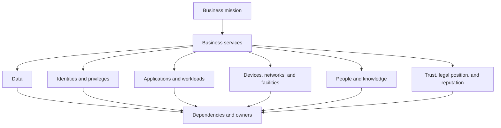

| Asset class | Beginner example | Enterprise example | Security question | Useful evidence |
|---|---|---|---|---|
| Data | A family photo | Contracts, designs, customer records, production recipes | Who may read, change, share, retain, or delete it? | Classification, owner, permissions, activity, retention |
| Identity | A house key assigned to one person | Employee, contractor, service, workload, or administrator identity | Is it genuine, current, appropriately privileged, and monitored? | Directory, authentication, role, sponsor, sign-in evidence |
| Service | A household electricity supply | OneDrive sync, SharePoint collaboration, payroll, plant scheduling | What business outcome stops if it fails? | Service map, dependencies, availability and recovery targets |
| Application | A banking app | SaaS tenant, web application, application programming interface | What inputs, secrets, data, and dependencies does it expose? | Architecture, configuration, code, tests, logs |
| Device or workload | A phone | Endpoint, server, virtual machine, container, industrial controller | Is it known, managed, configured, patched, and isolated? | Inventory, posture, ownership, software, network evidence |
| Network | Roads between buildings | Branch, cloud network, internet path, name resolution, proxy | Which communication is intended, observable, and restricted? | Flows, routes, policy, packet or proxy evidence |
| People and knowledge | A person who knows a recipe | Operators, administrators, engineers, process knowledge | Could error, coercion, overload, or departure create harm? | Training, access, staffing, procedure, approval records |
| Physical facility | A locked office | Data center, warehouse, manufacturing plant | Who can enter and what environmental failures matter? | Access records, sensors, maintenance, continuity plan |
| Reputation and obligation | A trusted local shop | Customer trust, contracts, regulation, safety commitment | What nontechnical consequence follows a failure? | Contract, law, audit, customer and business measures |

Asset **value** is contextual. A ten-year-old server may have little replacement cost yet operate a production line whose outage costs far more. A public marketing document has low confidentiality need but high integrity need because unauthorized changes could damage trust. A recovery key may be tiny in size and enormous in consequence.

## The CIA triad

The **CIA triad** is a foundational way to ask what protection means:

- **Confidentiality** means information and resources are not disclosed to unauthorized parties.
- **Integrity** means information and systems remain accurate, complete, authentic, and protected from unauthorized or accidental change.
- **Availability** means authorized users can access required information and services when needed.

Think of a sealed emergency instruction booklet. Confidentiality controls who may read it. Integrity ensures the instructions were not changed. Availability ensures authorized responders can open it during an emergency. Perfect secrecy is useless if responders cannot access it; perfect availability is dangerous if anyone can alter it.

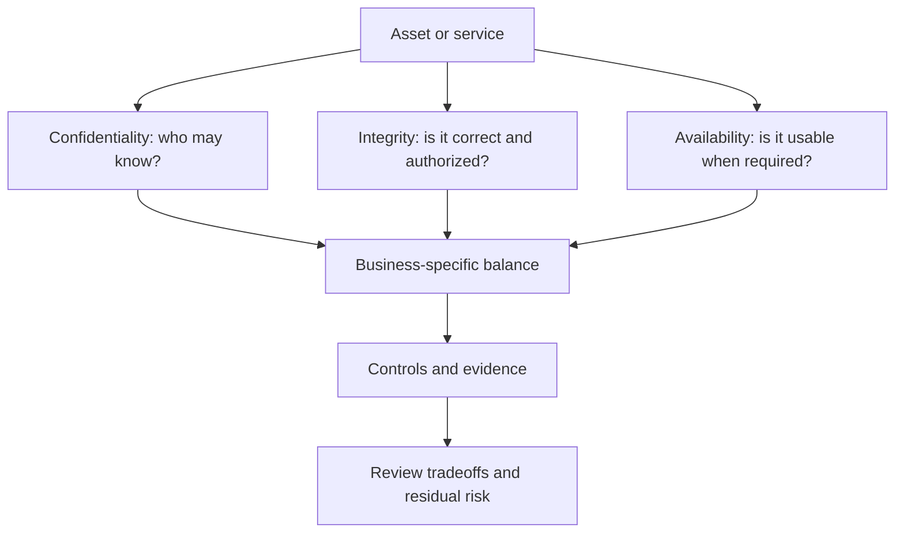

| Objective | Typical failure | OneDrive or SharePoint example | NMH example | Candidate control ideas |
|---|---|---|---|---|
| Confidentiality | Unauthorized disclosure | Overshared site exposes restricted files | Supplier contracts shared with an expired contractor | Least privilege, access review, classification, sharing restriction, monitoring |
| Integrity | Unauthorized or accidental change | Malicious file version or incorrect permission change | Production recipe altered without approval | Version history, approvals, signed change, restricted roles, audit evidence |
| Availability | Service or data cannot be used in time | Sync failure blocks access to working documents | Plant schedule unavailable during shift change | Redundancy, capacity, monitoring, offline procedure, tested recovery |
| Confidentiality and availability tension | Restriction blocks legitimate work | Emergency access is too slow | Maintenance engineer cannot retrieve procedure | Time-bound emergency access, approval, logging, post-use review |
| Integrity and speed tension | Review delays urgent correction | A permissions fix waits for standard change | Unsafe recipe needs immediate correction | Emergency change procedure, two-person validation, rollback, audit |

### Plain-English deep-dive 1 - Security objectives are business choices

The CIA triad is not a universal ranking. A news website may prioritize availability and integrity while intentionally publishing most content. A merger document may prioritize confidentiality and integrity. A safety system may prioritize integrity and availability so strongly that a delayed control update is preferable to an untested one.

The practical sequence is: name the asset, name the business use, define acceptable outcomes, identify who has authority, and only then choose controls. Starting with a tool can invert the process. Buying a stronger lock before deciding which doors matter produces cost without confidence.

Your OneDrive and SharePoint experience provides a factual bridge. A sync issue is not automatically a security incident, yet the same evidence can reveal which objective is affected. A user unable to open a required file is an availability symptom. A file changed by an unexpected identity raises an integrity question. A broadly accessible site raises a confidentiality question. Security interpretation adds authorization, adversary, risk, and governance context to the technical evidence.

## Beyond CIA: authenticity, accountability, privacy, and resilience

CIA is a starting lens, not a complete security program. Organizations also care about authenticity, accountability, non-repudiation, safety, privacy, resilience, and compliance.

| Concept | Plain meaning | Analogy | Key distinction |
|---|---|---|---|
| Authenticity | Confidence that an entity or item is what it claims to be | Checking a passport, not only hearing a name | Supports integrity and trust but is not identical to either |
| Accountability | Actions can be attributed to responsible entities | A signed checkout register | Logs alone do not create accountability without identity, protection, review, and consequences |
| Non-repudiation | Evidence makes it difficult for a party to credibly deny an action | A witnessed signed receipt | Context and legal rules matter; a log entry is not automatically proof |
| Privacy | Appropriate processing of information about people | A clinic using patient details only for legitimate care | Privacy includes purpose, fairness, minimization, rights, and law, not only secrecy |
| Safety | Protection from unacceptable physical harm | An emergency stop on machinery | A secure system can still be unsafe; a safety control may override normal cyber behavior |
| Compliance | Meeting applicable obligations | Passing a required vehicle inspection | Compliance is evidence against a defined requirement, not proof of no risk |
| Resilience | Ability to prepare, withstand, recover, and adapt | A city continuing essential services after a storm | Includes recovery and adaptation, not only prevention |
| Reliability | Consistent correct operation under stated conditions | A train following its timetable | Failure may be nonmalicious; security also considers adversarial behavior |

## Adversaries, threat sources, threats, and threat events

An **adversary** is a person or group with intent and capability to act against an organization. A **threat source** is broader: it can be adversarial, accidental, structural, or environmental. A **threat** is a circumstance or event with the potential to cause harm. A **threat event** is a specific occurrence or action that may exploit a vulnerability or otherwise produce harm.

Think of a house. A burglar is an adversary. A careless resident, a storm, and a utility failure are non-adversarial threat sources. "Property theft" is a threat concept. "The burglar enters through an unlocked window at 02:00" is a threat event. Precision matters because the controls differ.

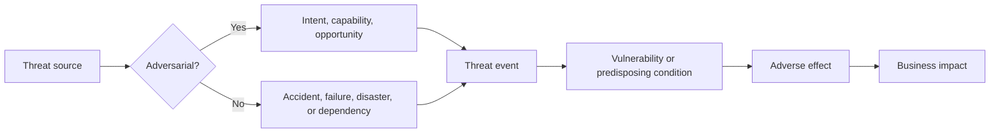

| Threat-source class | Example | Intent? | Typical evidence | Common mistake |
|---|---|---:|---|---|
| External criminal | Ransomware affiliate seeking payment | Yes | Infrastructure, behavior, malware, victimology, intelligence | Assuming every outage is ransomware |
| Nation-state or state-aligned | Strategic espionage actor | Yes | Campaign patterns, targeting, procedures, intelligence | Confident attribution from one indicator |
| Insider malicious | Authorized person deliberately abuses access | Yes | Identity, access, data activity, motive evidence, investigation | Treating all insiders as malicious |
| Insider accidental | User sends data to wrong recipient | No | Message, sharing, user report, policy and training context | Calling error an attack without evidence |
| Third party | Supplier account or software dependency is compromised | Varies | Contract, identity, software lineage, access, vendor notice | Assuming outsourcing transfers risk ownership |
| Technology failure | Storage, certificate, code, or network component fails | No | Health, logs, changes, telemetry, vendor status | Forcing adversary language onto reliability failure |
| Environmental | Fire, flood, power loss, heat | No | Facility sensors, continuity records, external reports | Ignoring physical dependencies in cyber planning |
| Process failure | Approval, backup, or offboarding process does not execute | No | Procedure, ticket, access review, audit sample | Blaming a person when design allowed predictable error |

An adversary model asks what an attacker wants, what access and capability they possess, what constraints they face, and which assets are attractive. It does not assume omnipotence. A financially motivated actor may prefer scalable extortion. An insider may possess legitimate knowledge but face monitoring and approval controls. A sophisticated actor may still use simple credential theft when it works.

## Weaknesses, vulnerabilities, and misconfigurations

A **weakness** is a flaw or condition that could contribute to harm. A **vulnerability** is a weakness in a system, procedure, implementation, or control that a threat source could exploit or trigger. A **misconfiguration** is an incorrect or risky setting; it can be a vulnerability when it creates an exploitable condition. A **predisposing condition** is an environmental or architectural circumstance that affects likelihood or impact even if it is not itself a discrete flaw.

Examples include a software coding defect, an overly broad SharePoint permission, a default administrator credential, an unreviewed service account, missing logging, a single recovery dependency, or a flat network that expands consequences. Later parts distinguish formal vulnerability identifiers and scoring systems in more detail.

| Condition | Category | Why it matters | Evidence needed | Possible treatment |
|---|---|---|---|---|
| Publicly reachable application has an unpatched code defect | Vulnerability plus exposure | A relevant threat source may reach the flawed component | Version, reachability, path, advisory, control evidence | Patch, restrict reachability, filter behavior, monitor, isolate |
| SharePoint site permits all employees to read restricted plans | Misconfiguration and access-control vulnerability | Unauthorized internal disclosure becomes possible | Site purpose, classification, groups, effective permissions, activity | Correct groups, review sharing, label data, alert on unusual access |
| Administrator role has no second factor | Control weakness | Stolen password may produce privileged access | Authentication policy, exceptions, sign-ins | MFA, phishing-resistant method, break-glass governance |
| Plant controller cannot be patched during production | Constraint, not automatically a vulnerability | A known flaw may persist and require compensating controls | Vendor guidance, version, process, safety and maintenance authority | Isolate, allowlist, monitor, restrict administration, schedule change |
| All backups use one identity and management plane | Predisposing condition and design weakness | One compromise may affect production and recovery | Architecture, identities, permissions, restore tests | Separate authority, immutable copy, offline recovery path |
| Security log lacks user identity | Observability weakness | Detection and accountability confidence fall | Schema, source configuration, sample events | Add identity context or compensate with correlated sources |

## Exploits and exploitation

An **exploit** is a method, code, command sequence, or technique that takes advantage of a vulnerability to produce unintended behavior. **Exploitation** is the act of using the weakness. A vulnerability can exist without a known public exploit. An exploit can fail because the target version differs, a control blocks it, required privileges are absent, or the path is unreachable.

The key relationship is not "vulnerability equals compromise." The fuller question is whether a relevant threat source can reach the condition, meet prerequisites, execute a useful method, bypass controls, and create business impact.

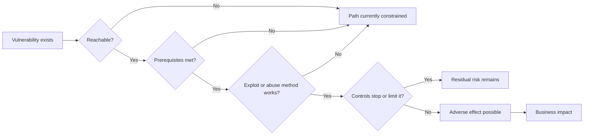

## Exposure and attack surface

**Exposure** means being subject to potential harm because an asset, pathway, configuration, identity, or dependency is accessible or insufficiently protected in a relevant context. The **attack surface** is the total set of points and conditions through which an adversary might attempt to enter, influence, extract from, or disrupt an environment. Part 7 develops attack surfaces and paths deeply.

A window is part of a house's attack surface. A ground-floor window left open next to a public alley is exposed. A locked upper-floor window remains part of the surface but has different reachability and likelihood. In digital systems, public interfaces, identities, remote access, application programming interfaces, cloud storage, suppliers, email, and human trust can all contribute.

| Question | Why it changes exposure | Example evidence |
|---|---|---|
| Is the asset externally or internally reachable? | Reachability changes opportunity but does not prove exploitability | Network path, domain name, proxy, firewall, application route |
| Which identities can access it? | Legitimate pathways may be abused | Directory group, role, token, sponsor, access review |
| What data or service lies behind it? | Consequence depends on business value | Classification, process owner, service map |
| Are prerequisites satisfied? | An exploit may require version, privilege, feature, or user action | Configuration, version, feature state, test |
| Which controls are in the path? | Controls may prevent, detect, limit, or recover | Policy, telemetry, test result, alert, restore evidence |
| How fresh is the evidence? | A correct old observation may be wrong now | Collection timestamp, configuration change, asset lifecycle |
| Does a dependency expand the path? | Trusted connections can bypass expected boundaries | Federation, service account, supplier access, software update path |

### Plain-English deep-dive 2 - A vulnerability is not automatically the risk

A loose stair is a vulnerability. If the stair is in a sealed building scheduled for demolition, near-term likelihood and impact may be low. If it is at the entrance of a crowded emergency room, risk is much higher. The defect is the same; context changes risk.

Cybersecurity teams often receive thousands of findings. Ranking only by technical severity ignores reachability, asset criticality, active use by adversaries, identity privilege, data sensitivity, compensating controls, and recovery capability. The opposite mistake is equally dangerous: missing context must not be interpreted as safety. "Owner unknown" is uncertainty, not low impact. "No alert" may mean no attack, no detection, or no telemetry.

The useful statement is bounded: "The affected version is present on the externally reachable supplier portal; authentication is required; the application processes purchase-order data; the web control is enabled but has not been validated against this method; exploitation evidence has not been observed in available telemetry; remediation is scheduled, and temporary access restriction is proposed." Each clause can be tested.

## The asset-threat-vulnerability-control-risk chain

The following chain is the chapter's central model. It is not a law of nature, and real incidents may involve multiple assets, paths, controls, and effects. It is a disciplined way to prevent missing links.

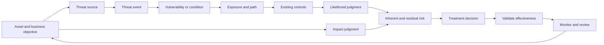

| Chain element | Required question | Weak statement | Better statement |
|---|---|---|---|
| Asset | What has value, to whom, and for which outcome? | "Server 44" | "Server 44 supports supplier ordering during global business hours" |
| Threat source | Who or what could initiate harm? | "Hackers" | "External criminal actor seeking credential or payment data" |
| Threat event | What action or occurrence matters? | "Cyberattack" | "Reuse a stolen supplier credential to access purchase orders" |
| Vulnerability | Which weakness makes it possible? | "Bad security" | "Legacy authentication exception accepts password-only sign-in" |
| Exposure or path | Can the event reach the weakness? | "It is vulnerable" | "The portal is internet reachable and the exception applies to supplier accounts" |
| Control | What currently changes probability or consequence? | "We have MFA" | "MFA applies to employees but not this supplier identity class" |
| Likelihood | How plausible is the event in the stated period? | "High because scary" | "Medium-high due to reachable login, password-only exception, and observed spraying attempts" |
| Impact | What business harm could follow? | "Critical" | "Order manipulation, supplier data disclosure, investigation, and service interruption" |
| Risk | What uncertainty about objective harm needs decision? | "CVSS is 9.8" | "High risk pending supplier MFA and session restriction, with stated evidence gaps" |
| Treatment | What action, owner, and due date are justified? | "Fix it" | "IAM owner removes exception by date; portal owner limits sessions until validation" |
| Validation | How will effectiveness be demonstrated? | "Ticket closed" | "Policy test, representative supplier sign-in, denied legacy flow, and monitored exceptions" |

## Likelihood, impact, and risk

**Risk** is commonly understood as the effect of uncertainty on objectives or as a function of potential adverse impact and likelihood. Exact wording depends on the source. **Likelihood** expresses how plausible a threat event and resulting impact are within a stated context and time. **Impact** expresses the magnitude of harm if the event occurs.

Risk is not simply fear, vulnerability count, alert volume, or compliance status. It is decision-oriented uncertainty. A risk statement should include a cause or condition, plausible event, affected objective, consequence, and time or scope boundary.

| Scale | Likelihood guide for a defined period | Impact guide | Decision note |
|---|---|---|---|
| 1 - Very low | Requires several unlikely conditions; no relevant activity observed; strong validated barriers | Negligible interruption or disclosure; routine handling | Monitor assumptions; do not ignore unknowns |
| 2 - Low | Plausible but difficult; limited opportunity; controls generally effective | Limited local effect with straightforward recovery | Accept or schedule based on appetite and cost |
| 3 - Moderate | Credible path and capability; mixed controls or evidence | Material team or service effect requiring coordinated response | Assign owner and time-bound treatment or acceptance |
| 4 - High | Reachable and attractive; known activity or weak controls; few prerequisites | Major service, data, contractual, financial, or operational effect | Prompt treatment and leadership visibility |
| 5 - Very high | Event is occurring, expected, or easily repeatable under current conditions | Severe or widespread mission, safety, legal, or sustained operational effect | Immediate incident or executive decision path |

### Simple formulas and their caveats

A teaching model often uses:

$$
Risk\ Score = Likelihood \times Impact
$$

If likelihood and impact each use a 1-to-5 ordinal scale, the product ranges from 1 to 25. This is useful for discussion, but subtraction and multiplication do not turn words into precise measurements. A score of 20 is not scientifically twice a score of 10. Category definitions, evidence quality, scope, and decision rules matter more than decorative precision.

For expected financial loss, a simplified model may use:

$$
Annualized\ Loss\ Expectancy = Single\ Loss\ Expectancy \times Annual\ Rate\ of\ Occurrence
$$

This can support scenario comparison when estimates and ranges are defensible. It can also mislead when rare events, correlated failures, adaptive adversaries, regulatory consequences, or uncertain data are compressed into one point estimate. Use ranges, sensitivity analysis, and explicit assumptions.

For a fictional control-effectiveness teaching exercise:

$$
Illustrative\ Residual\ Risk = Inherent\ Risk \times (1 - Control\ Effectiveness)
$$

This is not a NIST formula, not a Zscaler formula, and not a claim that controls combine linearly. A control assessed as 70 percent effective does not automatically reduce every risk by 70 percent. Controls can overlap, fail together, cover only part of a path, or create new operational risk.

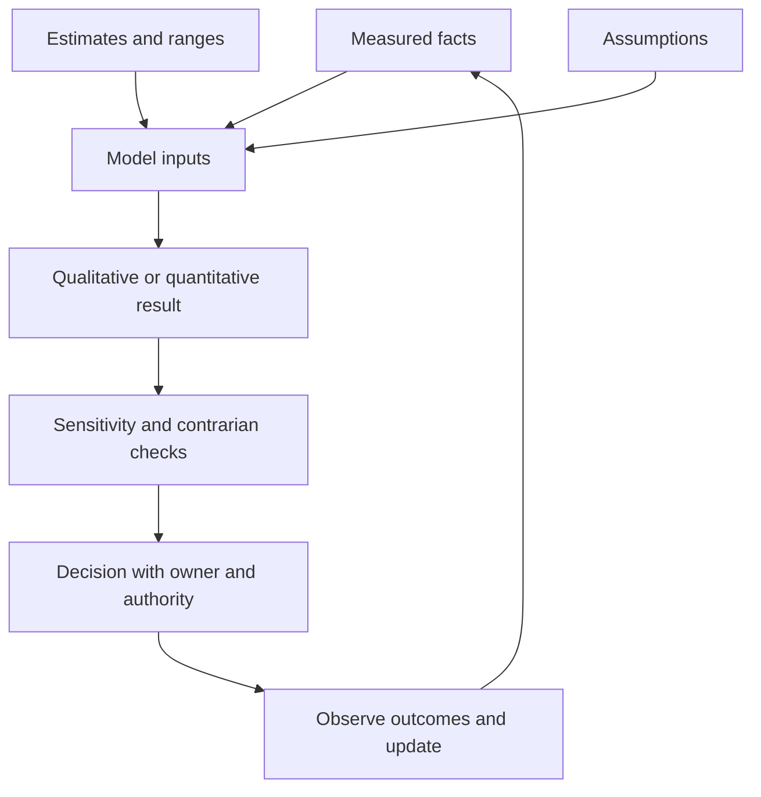

| Modeling practice | Good use | Failure mode | Guardrail |
|---|---|---|---|
| Ordinal matrix | Create a shared prioritization conversation | Treat 1-to-5 labels as precise quantities | Publish definitions and retain narrative evidence |
| Expected loss | Compare scenarios and investment ranges | Hide uncertain frequency behind a single number | Use ranges and sensitivity analysis |
| Control score | Structure evidence review | Average unrelated controls into false comfort | Test each path and common-mode dependency |
| Heat map | Communicate a portfolio quickly | Colors replace risk statements and ownership | Link every cell to evidence and treatment |
| Vulnerability severity | Describe technical characteristics | Equate technical severity with business risk | Add asset, exposure, threat, control, and impact context |
| Trend | Observe direction over stable scope | Claim improvement after denominator or source changed | Version scope, model, sources, and quality |

## Inherent and residual risk

**Inherent risk** is risk before considering selected controls, according to the organization's defined method. **Residual risk** is risk remaining after controls and treatment are considered. Organizations sometimes define the baseline differently, so document the method. Residual does not mean acceptable. An authorized risk owner must compare it with risk appetite, tolerance, legal duties, and operational constraints.

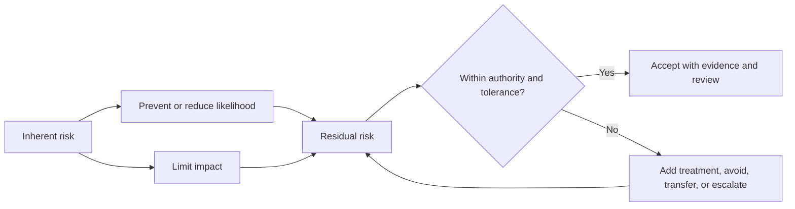

| Risk view | What it answers | Evidence | Governance warning |
|---|---|---|---|
| Inherent | How serious is the scenario before credited controls? | Asset, threat, exposure, consequence assumptions | State which conditions are intentionally ignored |
| Current residual | What remains with controls operating today? | Configuration, telemetry, tests, incidents, recovery evidence | A documented control is not necessarily effective |
| Target residual | What should remain after planned treatment? | Design, expected coverage, test and acceptance criteria | Forecast is not an achieved outcome |
| Accepted residual | What an authorized owner agrees to retain | Decision, rationale, scope, expiry, conditions | Acceptance is not silence or a closed ticket |
| Realized loss | What actually occurred | Incident, financial, operational, legal evidence | One event does not reveal full future likelihood |

## Controls and safeguards

A **control** or **safeguard** is a measure intended to modify risk. Controls can change likelihood, reduce impact, increase visibility, support recovery, or improve governance. Good control language includes purpose, scope, owner, implementation, evidence, dependencies, limitations, and validation.

The same control may serve several functions. MFA is primarily preventive for password-only account compromise, may deter simple abuse, produces detective sign-in evidence, and supports investigation. Classification should clarify reasoning, not force every control into one box.

### Control functions

| Function | Plain meaning | Analogy | Cyber example | Evidence of operation |
|---|---|---|---|---|
| Preventive | Stops or reduces probability before an event | Door lock | Least privilege, secure configuration, MFA | Policy test, access denial, configuration sample |
| Detective | Reveals an event or condition | Smoke detector | Sign-in analytics, file audit, integrity monitoring | Generated signal, coverage and review evidence |
| Corrective | Fixes a condition or limits ongoing harm | Repairing faulty wiring | Remove malicious rule, correct permission, patch system | Before-and-after state, ticket, verification |
| Deterrent | Discourages an action by increasing perceived consequence | Visible warning and camera | Login warning, monitoring notice, sanctions | Policy communication and enforcement, not mere signage |
| Compensating | Provides alternate risk reduction when primary control is infeasible | Guard posted at a broken gate | Isolate unpatchable system and restrict administration | Approved rationale, path tests, monitoring, expiry |
| Recovery | Restores service, data, or capability after harm | Spare generator and recovery plan | Immutable backup, restore process, alternate operation | Successful restore and continuity exercise |

### People, process, and technology

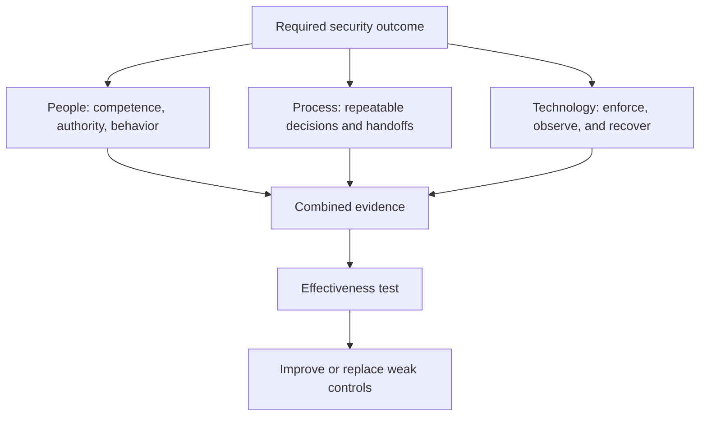

| Dimension | Control example | What it contributes | Failure if used alone |
|---|---|---|---|
| People | Administrator training and clear accountability | Judgment, escalation, responsible action | Trained people can still be overloaded or blocked by poor design |
| Process | Joiner, mover, leaver access review | Consistent identity lifecycle | A procedure may exist without timely data or execution |
| Technology | Automated role removal after termination | Speed and enforcement | Wrong source data can automate the wrong decision |
| Combined | Manager attestation, workflow, directory automation, exception review | Layered lifecycle control | Common identity source failure can still affect all layers |

### Plain-English deep-dive 3 - A control is a claim until evidence supports it

"We have backups" is a control claim. Useful evidence asks: Which assets are covered? How often? Are copies separated from production authority? Are failures alerted? When was restoration tested? Did the test meet the recovery time and recovery point objectives? Who can delete backups? What happens when the identity provider is unavailable?

Control **design effectiveness** asks whether the control, if implemented as designed, could address the risk. **Operating effectiveness** asks whether it actually operates consistently in the defined scope and period. **Outcome effectiveness** asks whether it meaningfully changes the scenario. A beautifully designed control that is disabled is ineffective. A consistently running control that watches the wrong assets is also ineffective.

Your production fix-validation habit transfers directly. In support, a setting change is not proof until expected behavior returns and side effects are checked. In security, a closed remediation ticket is not proof until the weakness, path, control, or consequence has been retested with appropriate authority.

## Governance turns controls into a system

**Governance** defines direction, decision rights, accountability, oversight, and assurance. Management plans and operates activities within that direction. Operations performs recurring work. Governance is like a board defining where a train may go and who can authorize a route; management schedules the service; operators run it; assurance checks whether the system works as represented.

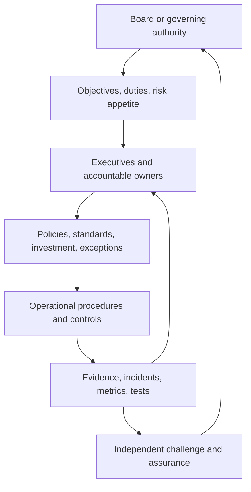

| Governance artifact | Purpose | Minimum useful content | Weak version |
|---|---|---|---|
| Policy | States required intent and authority | Scope, objective, roles, requirements, exception authority | Generic statement nobody can test |
| Standard | Defines mandatory implementation criteria | Control requirements, thresholds, scope, evidence | Product name without outcome |
| Procedure | Gives repeatable operational steps | Trigger, sequence, owner, inputs, outputs, escalation | Old screenshots with no decision logic |
| Risk register | Tracks decision-relevant risk | Scenario, evidence, owner, rating, treatment, due date, residual risk | List of vulnerabilities with colors |
| Exception | Authorizes time-bound deviation | Reason, scope, risk, compensating controls, owner, expiry | Permanent waiver with no review |
| Control test | Evaluates design and operation | Population, sample, expected result, observed result, limitation | Checkbox based on owner assertion |
| Metric | Supports decision and trend | Definition, source, owner, frequency, target, caveat | Attractive number with changing denominator |
| Decision record | Preserves why a choice was made | Context, options, evidence, authority, date, revisit trigger | Meeting notes without decision |

## Security versus privacy, safety, compliance, and resilience

These disciplines overlap but are not synonyms. A TSM should collaborate across ownership boundaries rather than claiming one team can decide everything.

| Discipline | Primary question | Example | Where it intersects security | Important difference |
|---|---|---|---|---|
| Security | How do we protect objectives from unauthorized, accidental, and disruptive events? | Restrict and monitor access to engineering designs | Access, integrity, availability, response | Broader than confidentiality and attacks |
| Privacy | Is personal information processed appropriately and lawfully for its purpose? | Limit employee monitoring data and retention | Access, logging, DLP, breach response | Authorized access can still violate purpose or fairness |
| Safety | How do we prevent unacceptable physical harm? | Ensure plant emergency stop remains reliable | OT access, change control, resilience | Cyber isolation that blocks emergency action may be unsafe |
| Compliance | Are defined legal, regulatory, contractual, or policy obligations met? | Retain required evidence and perform review | Controls and assurance | Passing an audit does not remove all risk |
| Resilience | Can essential outcomes continue and recover under disruption? | Maintain dispatch during identity outage | Availability, recovery, incident learning | Accepts that prevention can fail |
| Reliability | Does the system operate consistently as designed? | Sync service handles expected load | Availability and integrity | Does not by itself address malicious intent |

## OneDrive and SharePoint bridge

This bridge stays factual. You have production experience investigating Microsoft 365 workloads and dependencies. The scenarios below show how familiar evidence can support security questions; they do not assert that you owned a customer's security program.

| Familiar production symptom | Security objective question | Possible benign cause | Possible security concern | Evidence before conclusion |
|---|---|---|---|---|
| User cannot sync a library | Is required information available? | Client state, network, authentication, service issue | Account disabled after suspicious activity or policy block | Client logs, network, identity, policy, service health, timeline |
| Unexpected file change | Is integrity affected? | Legitimate coauthoring or automation | Compromised identity or malicious modification | Version history, author identity, token, device, activity, content |
| External user can open a site | Is access authorized and privacy-respecting? | Approved guest collaboration | Oversharing, expired sponsorship, wrong group | Site purpose, owner, sharing policy, effective permissions, audit |
| Large download appears | Is data use expected? | Migration, backup, approved analysis | Collection or exfiltration | Identity, device, volume baseline, destination, approval, data class |
| Permissions differ from expectation | Is control design or operation wrong? | Inheritance, group membership, delayed change | Privilege escalation or unauthorized grant | Configuration, group history, change record, audit, reproduction |

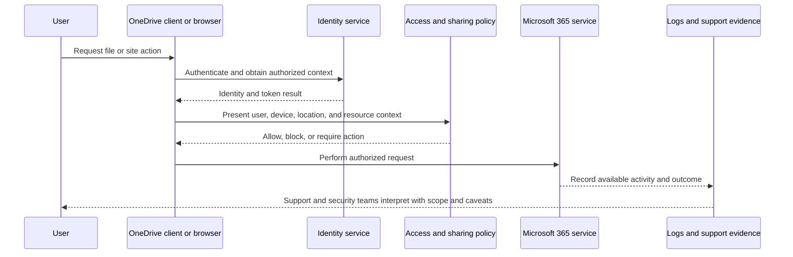

## Northstar Meridian Holdings risk scenario

NMH is fictional. Its manufacturing business uses a supplier portal, plant scheduling, Microsoft 365 collaboration, warehouse systems, and acquired regional environments. This scenario focuses on reasoning, not on real product behavior.

### Fictional scenario facts

| Field | Synthetic detail | Evidence status |
|---|---|---|
| Asset | Supplier portal and purchase-order data | Fictional inventory and service map |
| Business owner | Eva Lind, Supplier Systems | Fictional |
| Threat source | External criminal actor using stolen credentials | Conceptual scenario, not observed actor attribution |
| Threat event | Authenticate as supplier, view orders, and alter payment instruction | Plausible fictional event |
| Weakness | Password-only exception for 180 supplier identities | Fictional configuration finding |
| Exposure | Internet-reachable login and valid supplier workflow | Fictional architecture |
| Existing controls | Rate limiting, sign-in logs, approval for payment master change | Fictional and unvalidated until tested |
| Potential impact | Fraud, supplier-data disclosure, operational delay, investigation | Fictional impact scenario |
| Evidence gaps | MFA feasibility, session restriction, monitoring coverage, identity sponsor quality | Fictional discovery gaps |

### Scenario reasoning

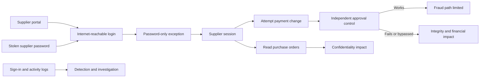

The risk is not "the portal has no MFA." A better statement is:

> Because a defined supplier identity population uses a password-only exception on an internet-reachable portal, an external criminal actor who obtains a valid password could establish an authorized-looking session and access purchase-order data. Independent payment-change approval may limit direct fraud, but confidentiality, operational, and investigation consequences remain. Current residual risk is provisionally high pending validation of exception scope, session policy, approval independence, detection coverage, and supplier enrollment feasibility.

This statement names cause, event, asset, consequence, controls, uncertainty, and next evidence. It does not claim compromise occurred.

## Fictional risk-register lab

### Lab objective

Create a small, auditable risk register for NMH. The lab is evidence of structured practice, not production cyber-risk ownership.

### Lab workflow

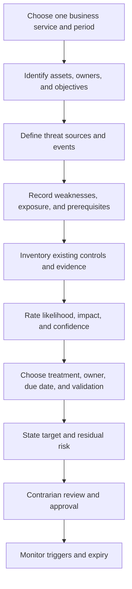

### Risk-register schema

| Field | Purpose | Example rule |
|---|---|---|
| Risk ID | Stable reference | NMH-R-006, not a changing row number |
| Scope and period | Bounds the judgment | Supplier portal, next 90 days |
| Asset and owner | Connects value and authority | Purchase-order data; Supplier Systems owner |
| Objective | States CIA or other need | Restricted disclosure and authorized change |
| Threat source and event | Describes plausible action or occurrence | Criminal uses stolen supplier password |
| Vulnerability or condition | States why event can succeed | Password-only exception |
| Exposure and prerequisites | Tests path realism | Internet login, valid username and password |
| Existing controls | Records current risk modification | Rate limit, logs, independent payment approval |
| Evidence and freshness | Makes confidence inspectable | Policy export and test date |
| Likelihood and rationale | Rates plausibility | 4 of 5 with stated evidence |
| Impact and rationale | Rates consequence | 4 of 5 due to data and fraud pathways |
| Inherent risk | Baseline before credited controls | Qualitative high or defined matrix result |
| Residual risk | Remaining risk with validated controls | Provisional high pending tests |
| Treatment | Avoid, mitigate, transfer, accept, or combination | Enroll MFA, restrict sessions, review sponsors |
| Owner and due date | Creates accountability | IAM owner and portal owner, fictional dates |
| Validation | Defines proof of completion and effectiveness | Representative sign-ins and policy evidence |
| Exception and expiry | Governs temporary deviation | Time-bound exception with review trigger |
| Confidence | Separates risk from evidence quality | Medium because control tests are incomplete |

### Fictional sample register

| ID | Scenario | Inherent | Controls credited | Residual | Confidence | Treatment and validation |
|---|---|---|---|---|---|---|
| NMH-R-006 | Stolen supplier password reaches purchase-order data through password-only exception | High | Rate limiting, sign-in logs, payment approval | High pending validation | Medium | Pilot MFA, limit session, test approval independence, monitor exception |
| NMH-R-007 | Overbroad SharePoint group exposes acquisition plans internally | High | Classification label and audit logging | Moderate-high | High on permission evidence | Correct group, owner attest, sample effective access, review guest links |
| NMH-R-008 | Unpatchable plant workstation is reached from general user network | Very high | Endpoint tool and firewall rule documented | High pending path test | Low-medium | Validate segmentation, restrict administration, monitor, plan maintenance |
| NMH-R-009 | Backup administration shares production identity authority | Very high | Daily backups and quarterly restore | High | Medium | Separate identity plane, protect deletion, test isolated restore |
| NMH-R-010 | Critical SaaS outage prevents warehouse dispatch | High | Vendor SLA and manual process | Moderate | Medium | Exercise manual process, define RTO and communication trigger |

### Lab scoring example with caveats

For NMH-R-006, suppose the fictional team assigns likelihood 4 and impact 4 on a 1-to-5 scale. The illustrative matrix result is 16. The number does not stand alone. The team records why likelihood is 4, why impact is 4, what period is considered, which controls are credited, and what would change the rating.

| Input | Fictional value | Rationale | Sensitivity question |
|---|---:|---|---|
| Likelihood | 4 | Reachable login, password-only exception, credible credential theft | Would phishing-resistant MFA reduce successful session likelihood? |
| Impact | 4 | Restricted order data plus possible fraud and operational delay | Does independent approval truly prevent master-data change? |
| Matrix result | 16 | Product of ordinal labels for local prioritization only | Would the decision change at 12 or 20? If not, do not overfocus on arithmetic |
| Confidence | Medium | Scope known; control tests incomplete | Which one test most reduces uncertainty? |
| Review trigger | MFA pilot or evidence of active abuse | New evidence can change likelihood quickly | Who owns immediate reassessment? |

## Treatment choices and tradeoffs

Common risk treatments are avoid, mitigate, transfer or share, and accept. Some frameworks use different labels. Treatment is a decision, not a slogan.

| Treatment | Plain meaning | NMH example | Tradeoff | Governance requirement |
|---|---|---|---|---|
| Avoid | Stop the activity creating the scenario | Disable a legacy supplier access path | May interrupt business or move risk elsewhere | Business-owner decision and transition plan |
| Mitigate | Add or improve controls to reduce likelihood or impact | Add MFA and session restriction | Cost, usability, enrollment, support load | Design, owner, test, residual-risk review |
| Transfer or share | Shift defined financial or operational consequence by contract or service | Insurance or supplier liability clause | Threat and mission impact may remain | Legal review, exclusions, dependency analysis |
| Accept | Authorized owner retains residual risk | Time-bound exception during supplier migration | Exposure continues | Authority, rationale, scope, expiry, monitoring |
| Combine | Use several treatments | Restrict access now, migrate later, insure residual loss | Coordination complexity | One coherent plan and accountable owner |

### Plain-English deep-dive 4 - Risk acceptance is active governance

Risk does not disappear when a ticket is closed, budget is unavailable, or a team stops discussing it. Valid acceptance identifies the risk, evidence, scope, residual consequence, accountable authority, conditions, review date, and triggers for reconsideration. It may be the right decision when treatment creates greater safety or business harm, but it must be explicit.

For an unpatchable OT workstation, an urgent patch could violate vendor support or interrupt a physical process. The answer is not "do nothing." The answer may be temporary segmentation, restricted administration, monitored allowlisted communication, backup of configuration, maintenance planning, and an expiration date. Safety and operations owners must participate.

## Metrics that support decisions

Metrics should illuminate coverage, timeliness, effectiveness, outcome, and uncertainty. Activity counts alone can reward noise.

| Metric | Useful definition | Decision supported | Failure mode |
|---|---|---|---|
| Asset-owner coverage | Percent of in-scope assets with current accountable owner | Where remediation routing is credible | Unknown assets excluded from denominator |
| Control-validation coverage | Percent of critical controls tested in period | Where assurance is weak | Counting policy review as technical test |
| Time to contain | Time from validated decision point to bounded containment | Incident and process improvement | Starting clock after delay |
| Restore success | Percent of representative restore tests meeting RTO and RPO | Recovery confidence | Testing only easy data |
| Exception aging | Open exceptions by age and expiry state | Governance escalation | Renewing automatically |
| High-risk residual aging | Time risks remain above tolerance after ownership | Treatment capacity and blockers | Score model changes break trend |
| Detection precision | Relevant investigated detections divided by reviewed detections under defined rules | Tuning and analyst load | Ignoring false negatives |
| Risk reduction evidence | Validated path, control, or consequence improvement | Outcome communication | Equating ticket closure with reduction |

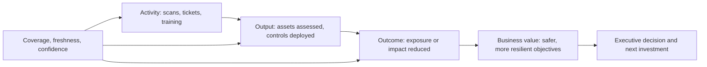

## Failure modes and troubleshooting

Security reasoning itself can fail. Troubleshooting a risk claim resembles troubleshooting a distributed service: define the expected result, trace dependencies, compare evidence, and test the cheapest discriminating hypothesis.

| Failure mode | Symptom | Likely cause | Troubleshooting action |
|---|---|---|---|
| Asset without owner | Findings bounce between teams | Inventory organized by tool, not service | Trace application, data, cost center, support, and change authority |
| High severity equals high risk | Backlog sorted only by technical score | Missing business and exposure context | Add reachability, use, privilege, data, controls, and consequence |
| No alerts equals no threat | Team claims safety from quiet console | Missing coverage, weak analytic, or no activity | Validate telemetry path and run authorized safe test |
| Control exists on paper | Audit says compliant but event succeeds | Scope, configuration, or operation gap | Sample effective state and exercise control |
| Risk score changes suddenly | Dashboard appears improved overnight | Source, denominator, or model changed | Version data, scope, factors, and compare drivers |
| Everything is critical | Teams stop prioritizing | Undefined impact and executive tolerance | Calibrate with concrete business scenarios |
| Missing data lowers score | Unknown asset appears safe | Null treated as zero | Raise uncertainty or block decision |
| Compensating control never expires | Temporary exception becomes architecture | No owner or migration trigger | Add expiry, review, evidence, and escalation |
| Recovery assumed | Backups reported green | Restore path untested or shares authority | Perform isolated representative restore |
| Security harms operation | Control blocks critical plant work | Missing safety and service-owner input | Reassess boundary, fail mode, emergency path, and rollback |

## Decision trees

### Is this condition a decision-relevant security risk?

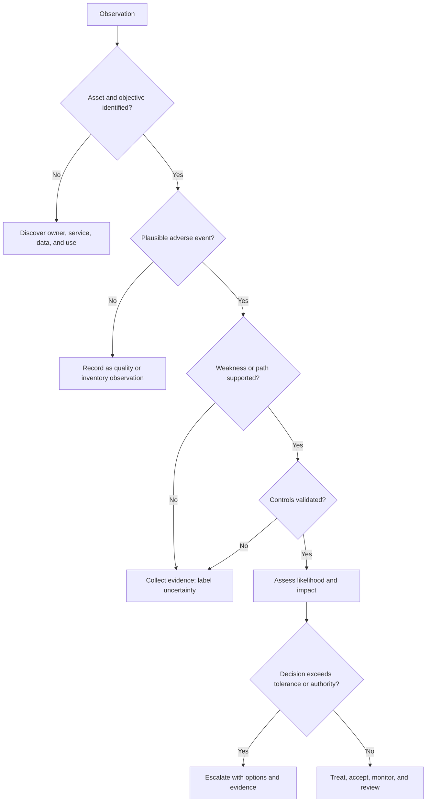

### Which control response is appropriate?

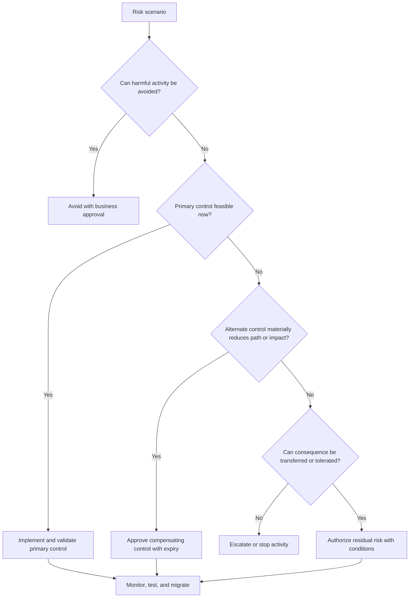

## Realistic drills

### Drill 1 - OneDrive availability or security event?

A finance user reports that synchronized files disappeared after signing in from a replacement laptop. Do not choose one explanation immediately.

1. Define assets: finance documents, identity, device, sync relationship, and business deadline.
2. Define objectives: availability and integrity first; confidentiality if access is unexpected.
3. Build hypotheses: Files On-Demand state, wrong account, library unlinked, retention action, permission change, malicious deletion, or service issue.
4. Collect evidence: identity, device, client logs, web view, recycle bin, version and audit records, policy, and timeline.
5. Decide whether an adverse security event is supported, not merely possible.
6. Restore service carefully while preserving relevant evidence and authority.

| Evidence | Benign interpretation | Security interpretation | Discriminating check |
|---|---|---|---|
| Files visible on web but not local | Sync configuration or Files On-Demand | Client policy manipulation is possible but unsupported | Account, library linkage, client state, policy source |
| Files in recycle bin under unexpected identity | Delegated automation or mistaken user | Compromised identity or unauthorized deletion | Token, device, source address, action sequence, owner confirmation |
| Permission removed at site | Approved role change | Unauthorized privilege or denial action | Change record, actor, group history, audit integrity |
| No audit event | Event outside retention or source gap | Logging disabled or bypassed | Coverage, retention, source health, correlated evidence |

### Drill 2 - Public application finding

An external scan reports a serious software weakness on an internet address. A mature response does not dismiss it and does not announce breach.

| Step | Question | Output |
|---|---|---|
| Validate asset | Does the address belong to the organization now? | Ownership and lifecycle confidence |
| Validate service | What host, application, version, and business service are present? | Technical and business context |
| Validate path | Is the affected component reachable through the observed route? | Exposure evidence |
| Validate prerequisites | Does exploitation require authentication, feature state, or privilege? | Scenario refinement |
| Validate controls | What proxy, filtering, authentication, segmentation, or monitoring exists and works? | Current residual context |
| Search behavior | Is there evidence of attempts or effects in available telemetry? | Incident question, with coverage caveat |
| Treat | Patch, restrict, isolate, compensate, or accept under authority | Owner, due date, and plan |
| Confirm | Retest the condition and adverse path | Effectiveness evidence |

### Drill 3 - NMH plant workstation

The fictional workstation runs vendor software needed to tune a packaging line. A vulnerability advisory applies, but immediate patching is not authorized during production.

1. Label the workstation, software, process, owner, and safety dependency.
2. Verify version and applicability; do not rely only on scanner detection.
3. Trace reachable communication, administrative access, removable media, vendor remote access, and identity.
4. Identify preventive, detective, corrective, compensating, and recovery controls.
5. Ask whether controls are independent or share one failure mode.
6. Propose a time-bound plan: restrict paths, allowlist required flows, protect credentials, monitor behavior, preserve configuration, schedule vendor-approved maintenance, and validate after change.
7. Record residual risk and authority. The TSM advises and coordinates; the customer owns operational and safety decisions.

## Contrarian review questions

| Initial claim | Contrarian question | Evidence that could change the decision |
|---|---|---|
| "The asset is internal" | Can a compromised identity, device, supplier, or workload reach it? | Effective path and trust relationship |
| "MFA is enabled" | For which identity, flow, protocol, exception, and recovery path? | Policy evaluation and representative test |
| "The vulnerability is critical" | Is the affected function present, reachable, useful, and consequential here? | Version, feature, path, asset, and control evidence |
| "The control blocks it" | Was the actual behavior safely tested in the relevant path? | Authorized test and telemetry |
| "No exploit exists" | Is abuse possible without a packaged exploit, and how current is the claim? | Threat intelligence and functional analysis |
| "Backups reduce risk" | Can a separate authority restore them within required time? | Isolated restore test and identity architecture |
| "The risk was accepted" | By whom, for what scope, until when, under which conditions? | Signed decision, authority, expiry, monitoring |
| "Risk decreased" | Did scope, denominator, sources, or scoring change? | Versioned method and like-for-like evidence |

## Consulting conversation pattern

When discussing an unfamiliar customer's risk, you can use the following structure:

1. "Let me confirm the business service and decision we are supporting."
2. "Here are the facts we have, their sources, and their timestamps."
3. "Here is the plausible threat event and the condition that enables it."
4. "Here are the controls we believe apply; these are validated, and these remain assertions."
5. "Here is our current likelihood, impact, and confidence, including what could change them."
6. "Here are treatment options, tradeoffs, dependencies, owners, and validation criteria."
7. "Here is the residual risk and the authority needed for the decision."

This sounds slower than saying "critical," but it prevents rework and earns trust. During urgent events, the same structure can be compressed without removing evidence boundaries.

## Official Source Anchors

**Checked on 2026-08-24.** Standards and government guidance are authoritative within their stated scope. Industry concepts are explanatory. Vendor pages describe vendor positioning and can change. This chapter paraphrases rather than copying long source text.

| Source type | Official or authoritative anchor | Used for | Currency and scope caveat |
|---|---|---|---|
| NIST risk guidance | https://csrc.nist.gov/pubs/sp/800/30/r1/final | Threat sources/events, vulnerabilities, likelihood, impact, risk assessment, residual risk | SP 800-30 Rev. 1 was published in 2012; use with current NIST publications and organizational method |
| NIST risk management | https://csrc.nist.gov/pubs/sp/800/39/final | Organization-wide risk framing and tiers | Federal guidance requires local tailoring |
| NIST controls | https://csrc.nist.gov/pubs/sp/800/53/r5/upd1/final | Control families and assessment-oriented thinking | A catalog is not a ready-made control implementation |
| NIST glossary | https://csrc.nist.gov/glossary | Discovery of source-specific definitions | The glossary states that terms can have multiple definitions; cite the source publication in context |
| NIST Cybersecurity Framework | https://www.nist.gov/cyberframework | Govern, Identify, Protect, Detect, Respond, and Recover outcomes | Framework use does not itself prove control effectiveness |
| CISA Cybersecurity Performance Goals | https://www.cisa.gov/cybersecurity-performance-goals-cpgs | Prioritized baseline practices and outcome thinking | Check current CISA location and sector applicability; site routing may change |
| CISA Known Exploited Vulnerabilities Catalog | https://www.cisa.gov/known-exploited-vulnerabilities-catalog | Evidence that listed vulnerabilities are known to be exploited in the wild | Listing changes prioritization context but does not replace asset and exposure analysis |
| International terminology | https://www.iso.org/standard/80585.html | ISO/IEC 27001 information security management context | Full standard text may require licensed access; organizational certification scope matters |
| Zscaler zero trust positioning | https://www.zscaler.com/resources/security-terms-glossary/what-is-zero-trust | Vendor description of identity, device, application, data, context, and least-privileged access | Vendor positioning is not a standard and does not establish your product experience |
| Zscaler security operations positioning | https://www.zscaler.com/products-and-solutions/security-operations | Current public product and outcome language relevant to the target role | Validate current packaging, licensing, documentation, and tenant behavior |

## Likely Interview Questions

### Q1. Explain cybersecurity risk from first principles.

**Model answer:** I start with an objective and an asset that supports it. I identify a threat source and a plausible threat event, then the vulnerability or condition and exposure path that could let the event create harm. I examine current controls and their evidence, estimate likelihood and impact within a stated scope and time, and record uncertainty. That produces an inherent and current residual-risk view. I then propose treatment, owner, due date, validation, and an authorized residual-risk decision.

A vulnerability score or alert can inform the chain but is not the risk by itself. My production bridge is evidence-driven enterprise support and escalation. Formal enterprise cyber-risk ownership and Zscaler product operation are not established; the NMH register is a lab exercise.

### Q2. What is the CIA triad, and how do tradeoffs appear in real systems?

**Model answer:** Confidentiality protects against unauthorized disclosure, integrity protects accuracy and authorized change, and availability ensures authorized use when required. The balance is business-specific. A confidential document that authorized responders cannot retrieve during an emergency has an availability failure; a highly available portal that anyone can alter has an integrity failure.

In OneDrive or SharePoint, overbroad access can affect confidentiality, an unauthorized version can affect integrity, and a sync or service failure can affect availability. I would identify the business use and authority before changing controls because excessive restriction can create operational harm.

### Q3. Distinguish a threat, vulnerability, exploit, exposure, and risk.

**Model answer:** A threat is a potential circumstance or event that can cause harm. A vulnerability is a weakness that can be exploited or triggered. An exploit is a method that takes advantage of a vulnerability. Exposure describes how an asset or condition is accessible or subject to potential harm. Risk combines uncertainty about likelihood and impact on objectives in a defined context.

For a house, theft is the threat, a weak lock is the vulnerability, lock-picking is an exploit method, a ground-floor door facing a public alley creates exposure, and the likelihood and consequence of theft produce the risk decision. These terms should not be collapsed into one severity label.

### Q4. What is the difference between inherent and residual risk?

**Model answer:** Inherent risk is the baseline before credited controls under the organization's defined method. Residual risk is what remains after existing or planned controls are considered. I always state the method because organizations use different baselines. Residual risk is not automatically acceptable; an authorized owner compares it with appetite, tolerance, duties, and operational constraints.

I also separate current residual risk from target residual risk. A planned control produces a forecast, not achieved reduction. Validation must show the control operates in scope and changes the relevant path or consequence.

### Q5. How do preventive, detective, corrective, deterrent, compensating, and recovery controls differ?

**Model answer:** Preventive controls try to stop an event, detective controls reveal it, corrective controls repair a condition or limit ongoing harm, deterrent controls discourage behavior, compensating controls provide alternate protection when a primary control is infeasible, and recovery controls restore capability or data. One control can serve several functions, so classification supports analysis rather than rigid labeling.

For an unpatchable plant workstation, segmentation and restricted administration may compensate temporarily, monitoring is detective, removal of malicious change is corrective, and a tested configuration restore is recovery. Every credited control needs scope, owner, evidence, limitations, and an expiry or review where appropriate.

### Q6. How would you explain a risk score without creating false precision?

**Model answer:** I would explain the model purpose, scale definitions, evidence, assumptions, time horizon, confidence, and decision thresholds before the number. A 1-to-5 likelihood multiplied by a 1-to-5 impact is an ordinal prioritization aid; 20 is not scientifically twice 10. I would show the narrative drivers and a sensitivity check: which assumption or test could change the decision?

Any formula in my NMH lab is fictional and not a Zscaler or NIST scoring formula. In production I would use the customer's approved method and current product documentation, preserve version and denominator, and treat missing context as uncertainty rather than safety.

### Q7. How does your prior support background transfer to cybersecurity fundamentals?

**Model answer:** The transferable method is structured discovery, cross-layer evidence, competing hypotheses, impact communication, ownership, escalation, fix validation, and learning from recurring patterns. OneDrive and SharePoint cases already require reasoning across identities, permissions, clients, networks, service behavior, and data. Security adds explicit adversary, authorization, control, risk, privacy, and governance questions.

I keep the boundary clear. I have supported Microsoft workloads and business-critical escalations in production. I have not operated a Zscaler tenant or formal SecOps and vulnerability program in production. I would bring the proven investigation method while building product depth through labs, documentation, shadowing, and reviewed work.

### Q8. Walk through the fictional NMH supplier-portal risk and your recommendation.

**Model answer:** The asset is the supplier portal and purchase-order data. The fictional threat event is an external criminal using a stolen supplier password. The enabling condition is a password-only exception for a defined identity population on an internet-reachable login. Existing rate limiting, logs, and independent payment approval may reduce parts of the scenario, but their coverage and effectiveness need validation. Confidentiality, fraud, operational, and investigation impacts remain plausible.

I would verify scope, sign-in methods, sponsors, session policy, approval independence, activity telemetry, and enrollment constraints. Near-term options include limiting sessions, strengthening monitoring, and reducing exception scope; target treatment is appropriately strong authentication with tested recovery. The customer owns authority and residual-risk acceptance. Every NMH detail is fictional and demonstrates reasoning only.

## 30-Second Memory Hooks

| Concept | Memory hook |
|---|---|
| Asset | Protect what creates value, not only what has an IP address |
| CIA | Secret, correct, usable |
| Threat source | Who or what can start harm? |
| Threat event | What specifically happens? |
| Vulnerability | Weakness that can be exploited or triggered |
| Exploit | Method that uses the weakness |
| Exposure | Can the path and conditions meet? |
| Risk | Uncertain effect on an objective |
| Likelihood | Plausibility in a stated scope and time |
| Impact | Consequence to the business objective |
| Inherent risk | Baseline before credited controls |
| Residual risk | What remains after controls |
| Preventive | Stop it |
| Detective | See it |
| Corrective | Fix or limit it |
| Deterrent | Discourage it |
| Compensating | Alternate protection with an expiry |
| Recovery | Restore what matters |
| Control evidence | A claim becomes credible through design and operating proof |
| Governance | Authority, accountability, evidence, and review |
| Compliance | Meeting a defined obligation, not proof of no risk |
| Resilience | Prepare, withstand, recover, adapt |
| Formula | Discussion aid, not scientific truth |
| Missing data | Uncertainty, never automatic safety |
| Experience bridge | Production investigation method; lab security practice; honest product gap |

## Completion Checklist

- [ ] I can identify data, identity, service, application, device, network, people, facility, reputation, and obligation assets.
- [ ] I can explain confidentiality, integrity, and availability with business-specific tradeoffs.
- [ ] I can distinguish security, privacy, safety, compliance, reliability, and resilience.
- [ ] I can distinguish adversary, threat source, threat, and threat event.
- [ ] I can distinguish weakness, vulnerability, misconfiguration, predisposing condition, exploit, exposure, and attack surface.
- [ ] I can build the full asset-threat-vulnerability-control-risk chain.
- [ ] I can rate likelihood and impact with a stated scope, period, evidence, and confidence.
- [ ] I can explain why simple formulas support discussion but do not create precise truth.
- [ ] I can distinguish inherent, current residual, target residual, and accepted residual risk.
- [ ] I can classify preventive, detective, corrective, deterrent, compensating, and recovery controls.
- [ ] I can assess control design, operating evidence, outcome, dependencies, and limitations.
- [ ] I can explain the roles of people, process, and technology.
- [ ] I can describe policies, standards, procedures, exceptions, tests, metrics, and decision records.
- [ ] I can build and challenge the fictional NMH risk register.
- [ ] I can translate a OneDrive or SharePoint symptom into CIA questions without declaring a security event prematurely.
- [ ] I can propose avoid, mitigate, transfer or share, accept, and combined treatments.
- [ ] I can define validation criteria before calling treatment complete.
- [ ] I can use decision trees and contrarian questions to find missing evidence.
- [ ] I can explain that standards, industry concepts, vendor positioning, and fictional calculations have different authority.
- [ ] I can state the 2026-08-24 currency caveat and recheck current sources.
- [ ] I can label production, lab, conceptual, not-yet-used, and fictional statements honestly.
- [ ] I can answer all eight interview questions aloud without presenting NMH or Zscaler study as production experience.

[Part 7 - Attack Surface, Attack Paths, Kill Chains, and MITRE ATT&CK](Part-07-attack-surface-paths-kill-chain-mitre.md)