# Part 7 - Attack Surface, Attack Paths, Kill Chains, and MITRE ATT&CK

> **Audience:** Candidates preparing to move from Microsoft 365 Support Escalation Engineering into a Zscaler Security Operations Technical Success Manager role.
>
> **Currency date:** 2026-08-24.
>
> **Scope and honesty:** Northstar Meridian Holdings, abbreviated NMH, and all its assets, identities, pathways, telemetry, tests, findings, scores, incidents, and outcomes are fictional. Your established production bridge is enterprise support, OneDrive, SharePoint, networking, troubleshooting, analytics, mentoring, escalation, and approved AI work. Direct production operation of Zscaler, Security Operations, vulnerability, exposure, scanner, Endpoint Detection and Response, Security Information and Event Management, threat intelligence, red-team, or adversary-emulation programs is not established.
>
> **Safety:** Every path-validation activity in this chapter is defensive, authorized, bounded, reversible, and based on synthetic or customer-approved evidence. Do not scan, probe, exploit, phish, access, or modify systems without explicit written authorization, scope, rules of engagement, and qualified supervision.
>
> **Currency caveat:** MITRE ATT&CK, government guidance, threat reporting, and vendor positioning evolve. Recheck current versions, technique pages, product documentation, licensing, and customer policy before operational use.

## Section goal

Part 6 introduced assets, threats, vulnerabilities, exposures, controls, likelihood, impact, and risk. Part 7 asks how a threat source could move from an available entry point to a business consequence, where defenders can observe or interrupt that movement, and how to describe behavior without inventing certainty.

Think of an airport journey. The attack surface includes public roads, parking entrances, ticket counters, employee doors, baggage systems, websites, suppliers, and human processes. An attack path is one connected route through those surfaces toward an objective. A kill chain describes broad stages of an intrusion. MITRE ATT&CK provides a vocabulary for why and how adversaries behave. A choke point is a place many routes must cross, such as identity verification. Blast radius describes how much harm one successful step can unlock.

By the end, you should be able to:

| Learning outcome | What mastery looks like |
|---|---|
| Classify attack surfaces | Cover external, internal, digital, physical, human, and supply-chain surfaces |
| Model pathways | Draw nodes, relationships, trust boundaries, prerequisites, controls, and objectives |
| Separate reachability and exploitability | Explain that reachable, vulnerable, exploitable, and consequential are different judgments |
| Use lifecycle models | Apply the Cyber Kill Chain as one broad defensive lens while recognizing its limits |
| Use ATT&CK accurately | Distinguish tactics, techniques, sub-techniques, and procedures and map evidence conservatively |
| Use supporting models | Explain the Diamond Model and attack trees at an overview level |
| Prioritize defensibly | Focus on plausible paths, business impact, blast radius, choke points, and evidence confidence |
| Validate safely | Design authorized checks that test assumptions without uncontrolled exploitation |
| Connect telemetry to behavior | Map identity, endpoint, network, application, SaaS, cloud, and data evidence to hypotheses |
| Practice honestly | Analyze a fictional NMH compromise path without presenting it as a real incident or production experience |

## JD Mapping

**JD** means job description. A Technical Success Manager, abbreviated **TSM**, needs enough attack-path fluency to ask good questions, prioritize outcomes, explain evidence, coordinate specialists, and avoid overclaiming what a product or observation proves.

| JD expectation | Part 7 capability | Honest evidence bridge |
|---|---|---|
| Analyze complex technical environments | Trace users, identities, endpoints, networks, applications, data, suppliers, and controls as a graph | Production: cross-layer Microsoft troubleshooting and network evidence |
| Identify security risks | Connect entry points and intermediate steps to a business objective | Lab: fictional NMH path model |
| Tailor mitigation strategies | Select path-breaking and blast-radius controls with operational tradeoffs | Conceptual security extension of production fix validation |
| Explain complex metrics | Distinguish surface size, reachable nodes, validated paths, technique coverage, and confidence | Production analytics bridge; not a claimed exposure platform deployment |
| Resolve critical escalations | Build timelines, hypotheses, evidence gaps, and parallel workstreams | Production escalation and root-cause method |
| Partner with Support and Product | Package reproducible path and telemetry evidence while preserving ownership boundaries | Production engineering collaboration bridge |
| Advise security leaders | Translate behavior and path into consequence, options, residual uncertainty, and decisions | Conceptual executive framing practiced in NMH |

## Candidate honesty note

You can truthfully say that you have traced distributed Microsoft 365 failures across client, identity, permissions, Domain Name System, Transmission Control Protocol, Transport Layer Security, Hypertext Transfer Protocol, proxy, and service evidence. Those are established troubleshooting skills. You may use a path graph to demonstrate transferable reasoning. You must not describe support investigations as threat hunting, adversary emulation, penetration testing, or SOC incident command unless the factual record supports those responsibilities.

| Label | Meaning here | Safe example | Boundary |
|---|---|---|---|
| Production | Established enterprise support, networking, analytics, escalation, mentoring, training, and approved AI facts | "I traced a OneDrive request across identity, network, client, and service evidence." | Do not rename the case an attack-path investigation without evidence |
| Lab | A safe exercise using synthetic data and diagrams | "I modeled the NMH path and defined non-exploitative validation checks." | Lab results are not customer outcomes |
| Conceptual | A framework learned from authoritative material | "I can explain ATT&CK tactics and techniques and would confirm the current version." | Understanding a matrix is not production detection engineering |
| Not-yet-used | Product or responsibility without direct operation | "I have not administered Zscaler exposure or SecOps products in production." | Do not imply tenant access, tuning, or deployment |
| Fictional | Every NMH actor, event, path, finding, and metric | "In my fictional NMH scenario..." | Never say "my manufacturing customer" |

## Acronyms and essential terms

| Acronym or term | Plain meaning | Why it matters | Memory hook |
|---|---|---|---|
| ATT&CK | Adversarial Tactics, Techniques, and Common Knowledge | MITRE knowledge base for observed adversary behavior | Why, how, specific how, real use |
| TTP | Tactics, Techniques, and Procedures | Levels for describing adversary goals and behavior | Goal, method, implementation |
| C2 | Command and Control | Communication used to direct compromised systems or receive results | Attacker's remote coordination channel |
| IOC | Indicator of Compromise | Observable artifact that may be associated with malicious activity | A clue, not automatic proof |
| IOA | Indicator of Attack | Observable behavior suggesting malicious intent or progression | Behavior clue, still needs context |
| DNS | Domain Name System | Translates names and supports service discovery | The internet's directory assistance |
| TCP | Transmission Control Protocol | Reliable transport connection used by many applications | Numbered, acknowledged delivery |
| TLS | Transport Layer Security | Protects many network sessions with encryption and authentication | Sealed and authenticated transport |
| HTTP | Hypertext Transfer Protocol | Application protocol used for web requests and responses | The web's request-response language |
| EDR | Endpoint Detection and Response | Endpoint telemetry, detection, investigation, and response capability | Endpoint recorder and response console |
| SIEM | Security Information and Event Management | Centralizes and analyzes security-relevant event data | Security event control room |
| IAM | Identity and Access Management | Manages identities, authentication, authorization, and lifecycle | Who are you, and what may you do? |
| SaaS | Software as a Service | Online software operated as a service | The app is hosted, but access still matters |
| OT | Operational Technology | Technology controlling or monitoring physical processes | Digital action, physical consequence |
| NMH | Northstar Meridian Holdings | Fictional continuity company | Practice only |
| ROE | Rules of Engagement | Written boundaries, permissions, timing, contacts, and stop conditions for testing | Permission plus limits |

## Attack surface from first principles

An **attack surface** is the collection of points, pathways, relationships, and conditions through which a threat source might gain access, influence behavior, collect information, move, persist, disrupt, or cause another adverse effect. It is not only a list of public internet addresses.

A shop's surface includes doors and windows, but also deliveries, employee badges, telephone requests, accounting processes, alarm maintenance, and the company that installs locks. Digital enterprises have the same variety: public applications, user identities, endpoints, cloud control planes, application interfaces, data shares, suppliers, source code, update mechanisms, and physical access.

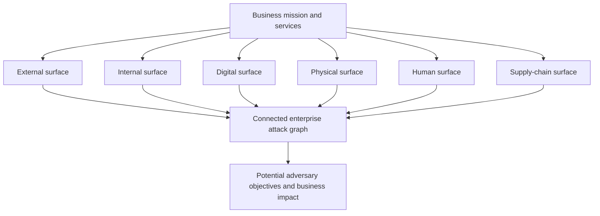

| Surface | Plain meaning | Examples | Useful evidence | Common blind spot |
|---|---|---|---|---|
| External | Observable or accessible from outside trusted enterprise contexts | Domains, public applications, remote access, email, exposed services | Domain and certificate inventory, routes, application ownership, safe observation | Unknown assets and acquired brands |
| Internal | Reachable after local, user, device, workload, or partner access | Internal applications, shared services, management interfaces, flat networks | Effective network paths, identities, roles, segmentation, telemetry | Assuming "inside" is trustworthy |
| Digital | Software, identities, data, protocols, cloud, endpoints, code, and interfaces | SaaS sharing, application programming interfaces, secrets, tokens, repositories | Configuration, inventory, logs, data flows, identity graph | Non-human identities and stale privileges |
| Physical | Facilities, equipment, ports, media, and environmental dependencies | Server room, unlocked cabinet, removable media, power, cooling | Access records, asset location, sensors, procedures | Treating cyber systems as placeless |
| Human | Decisions, trust, knowledge, workload, and social interaction | Phishing, help-desk reset, insider abuse, accidental sharing | Process, approvals, training, identity proofing, workload | Blaming users instead of fixing design |
| Supply chain | Products, services, software, data, identities, and organizations depended upon | Managed service provider, software update, library, contractor, cloud vendor | Contract, bill of materials, access, assurance, incident notice | Assuming a contract removes technical dependency |

Attack surfaces overlap. A supplier administrator is a human and supply-chain element. Their browser and device are digital. Their remote login is external. Their resulting access may become internal. Classification helps inventory, but path analysis reconnects the pieces.

## Assets, entry points, and objectives

An **entry point** is a place or mechanism through which interaction begins. An entry point is not automatically vulnerable. A properly authenticated public portal is intentionally reachable. The question is whether a threat source can abuse the intended behavior, exploit a weakness, or combine the entry point with other conditions.

| Entry-point class | Legitimate purpose | Abuse or failure possibility | Defensive questions |
|---|---|---|---|
| Public web application | Serve customers or suppliers | Exploit application flaw, abuse authentication, scrape data | Owner, code and version, authentication, rate, session, data, telemetry |
| Email and collaboration | Communicate and share | Phishing, malicious file, oversharing, consent abuse | Sender trust, link/file controls, identity, sharing, reporting, audit |
| Remote administration | Support systems | Stolen credential, excessive privilege, exposed management service | Strong authentication, device, source, time, approval, recording |
| Application programming interface | Integrate systems | Stolen token, excessive scope, injection, volume abuse | Identity, secret lifecycle, scopes, schema, rate, logging |
| Supplier connection | Exchange business data | Compromised supplier or unmanaged trust | Contract, identity, path, segmentation, monitoring, revocation |
| Software update | Deliver trusted code | Compromised build or update channel | Signing, provenance, integrity, staged rollout, rollback |
| Physical port or console | Maintain equipment | Unauthorized device or local control | Location, lock, authentication, allowlist, monitoring |
| Help desk | Restore legitimate access | Social-engineered password or factor reset | Identity proofing, separation, notification, high-risk escalation |

An **objective** is the result an adversary seeks, such as credential access, espionage, fraud, disruption, extortion, persistence, or data theft. Objectives guide path modeling. Defenders should not assume every actor wants the same thing.

## Attack paths and exposure paths

An **attack path** is a connected sequence of conditions and actions through which an adversary may progress from a starting point to an objective. An **exposure path** often emphasizes the connected assets, identities, vulnerabilities, misconfigurations, privileges, and trust relationships that make progression possible, whether or not adversary action has been observed.

Think of a transit map. Stations are assets or states. Lines are relationships or allowed actions. A missing gate may create a route. The shortest route is not always the most likely; an adversary may choose a quieter, cheaper, or better-known path.

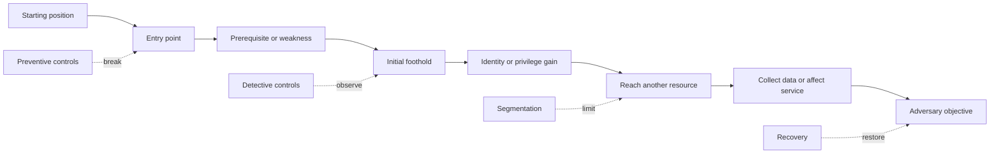

| Graph element | Meaning | Example | Evidence |
|---|---|---|---|
| Node | Asset, identity, state, privilege, data, or objective | Supplier account, portal session, order database | Inventory, identity, configuration, service map |
| Edge | Relationship or permitted transition | Account can authenticate to portal | Effective access test, policy, flow evidence |
| Prerequisite | Condition required before an action | Valid password and active account | Credential state, policy evaluation |
| Control | Measure that blocks, observes, limits, or recovers | MFA, approval, segmentation, alert | Configuration and effectiveness test |
| Boundary | Change in trust, authority, technology, or ownership | Internet to portal, corporate to plant | Architecture, contract, identity domain, network policy |
| Objective | Adversary's intended result | Alter payment information | Business process and data authority |
| Evidence confidence | Strength and freshness of support | Tested edge versus inferred edge | Source, timestamp, sample, limitation |

### Plain-English deep-dive 1 - A graph is an argument, not a photograph

An attack graph looks authoritative because boxes and arrows are tidy. In reality, each arrow is a claim: "this identity can authenticate," "this workload can reach that service," or "this privilege permits this action." The claim needs a source and a timestamp. Some edges are designed, some observed, some inferred, and some merely hypothetical.

A strong graph labels confidence. A policy document may say a network path is blocked, while an authorized test shows it is allowed. A cloud inventory may say an account is disabled, while a cached session remains usable. A scanner may identify a version but not whether the vulnerable feature is active. The graph should preserve disagreements rather than average them into false certainty.

For you, this resembles a enterprise support dependency map. A client-to-service flow contains name resolution, transport, encryption, proxy, authentication, authorization, and application behavior. The security extension asks which transitions an adversary could abuse, what controls apply, and what business objective becomes reachable.

## Reachable, vulnerable, exploitable, and consequential

These are separate tests:

- **Reachable** means a relevant source can communicate with or otherwise interact with a target through a defined path.
- **Vulnerable** means a weakness is present and applicable.
- **Exploitable** means prerequisites and conditions allow a method to use the weakness successfully in the current context.
- **Consequential** means successful action can materially affect a valued objective.

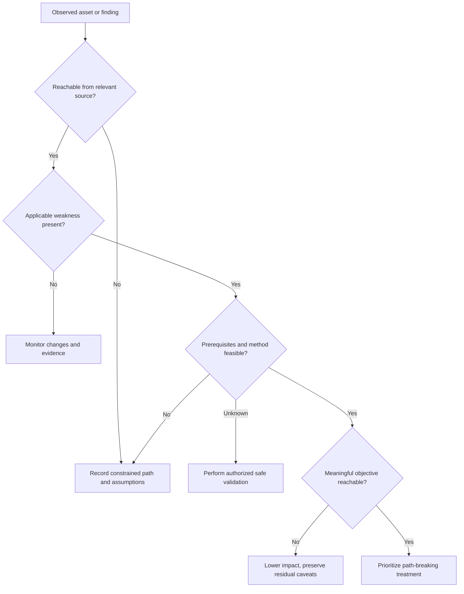

| State | What can be concluded | What cannot be concluded | Next evidence |
|---|---|---|---|
| Reachable only | Interaction path exists | Weakness, compromise, or material impact | Service identity, version, authentication, owner |
| Vulnerable but not reachable | Applicable weakness exists under current inventory | It is permanently safe; paths can change | Validate isolation, alternate paths, privileged access |
| Reachable and vulnerable | Relevant interaction and weakness coexist | Exploit success or compromise | Prerequisites, safe vendor test, control effectiveness |
| Exploitable in bounded test | Authorized method succeeded under test conditions | Adversary used it or every environment is affected | Telemetry, scope, production differences, incident evidence |
| Consequential path | Objective and business impact are plausibly connected | Exact loss or certainty of occurrence | Business owner, scenario range, recovery and control evidence |

## Blast radius and choke points

**Blast radius** is the scope of assets, identities, data, services, people, or operations that one successful event could affect. **Choke point** is a narrow place through which many paths must pass and where a well-designed control can interrupt or observe them.

A master key has a larger blast radius than a key to one room. A staffed building entrance is a choke point if alternate doors are secured. If a loading dock is unmonitored, the apparent choke point is an illusion.

| Factor | Increases blast radius | Reduces blast radius | Validation |
|---|---|---|---|
| Identity privilege | Tenant-wide or domain-wide role | Task-specific, time-bound privilege | Effective role and action test |
| Network connectivity | Flat routes and broad trust | Resource-specific segmentation | Source-to-destination path tests |
| Data access | Broad repository or shared token | Classification and scoped authorization | Effective access sample |
| Common management | One plane administers production and recovery | Separate authority and protected recovery | Identity and management-path review |
| Shared dependency | Central identity or update service without fallback | Resilient, bounded dependency and safe fallback | Failure exercise |
| Session duration | Long-lived reusable token | Shorter, context-aware session with revocation | Token and policy behavior |
| Propagation | Shared credential or automatic trust | Unique identity and bounded delegation | Credential and relationship inventory |

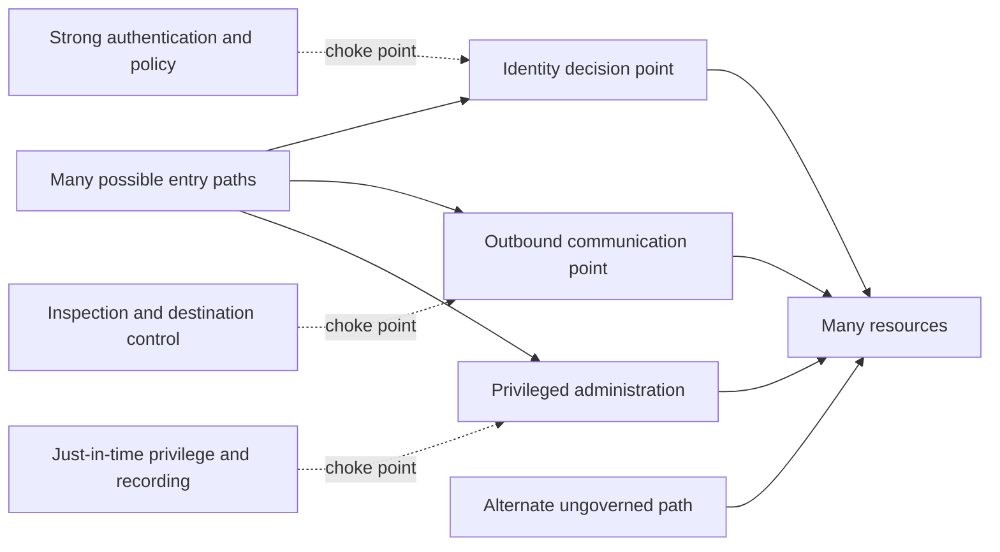

Choke-point strategy is efficient but creates concentration risk. If every decision depends on one identity service, its compromise or outage has wide consequences. Defenders need availability, integrity, independent monitoring, and fallback design for critical choke points.

## Cyber Kill Chain

The **Cyber Kill Chain** is a Lockheed Martin model describing seven broad stages an adversary may complete to achieve an intrusion objective. It is useful for asking where defenses can break progression. It is not the only lifecycle model, and real activity can skip, repeat, reorder, or outsource stages.

| Stage | Plain meaning | Example behavior | Defender opportunity | Limitation |
|---|---|---|---|---|
| Reconnaissance | Gather information about a target | Discover domains, staff, suppliers, technologies | Reduce unnecessary exposure, monitor discovery where visible | Much activity occurs outside defender telemetry |
| Weaponization | Prepare capability and payload | Combine exploit with malicious document | Threat intelligence, secure development and supply-chain controls | Often occurs entirely outside the victim environment |
| Delivery | Bring capability to target | Email link, web download, supplier channel | Email, web, file, identity, and user controls | Valid credentials may not use a payload |
| Exploitation | Trigger weakness or abuse trust | Exploit code defect or induce user action | Patch, harden, isolate, behavior prevention | "Exploit" can be broader than software vulnerability use |
| Installation | Establish malicious capability | Install persistence or tool | Application control, endpoint visibility, least privilege | Cloud and identity attacks may not install software |
| Command and Control | Communicate with compromised capability | Beacon to remote infrastructure | Destination control, DNS and network analytics, endpoint evidence | Adversaries may use legitimate services |
| Actions on objectives | Pursue intended outcome | Collect data, disrupt service, extort | Data controls, segmentation, response, recovery | Objective may begin earlier and include many steps |

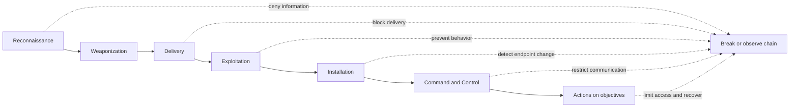

### Plain-English deep-dive 2 - Lifecycle models are maps, not laws

A map of a train line is useful even though a traveler can walk, change lines, or enter midway. The Cyber Kill Chain helps teams discuss broad progression, but it can bias analysts toward malware delivered from outside. A stolen cloud session may begin with valid access. An insider may already possess the needed position. A supply-chain compromise may occur before the customer receives software. Identity and SaaS behavior may not include installation.

Use the model to generate questions, not to force evidence into seven boxes. Ask where the defender can reduce opportunity, observe behavior, contain scope, and recover. Use ATT&CK for finer behavior vocabulary and incident-specific timelines for what actually happened.

## MITRE ATT&CK foundations

MITRE ATT&CK is a publicly accessible knowledge base of adversary tactics and techniques based on real-world observations. MITRE currently organizes ATT&CK into Enterprise, Mobile, and Industrial Control Systems technology domains. Always verify current domains, versions, platforms, technique identifiers, and descriptions on the official site.

The four key levels are:

| Level | Question answered | Meaning | Example form | Evidence warning |
|---|---|---|---|---|
| Tactic | Why? | Adversary's tactical goal | Credential Access | A tactic is not a chronological stage requirement |
| Technique | How? | General behavior used to achieve a goal | Brute Force | Mapping requires behavior evidence, not a product alert name alone |
| Sub-technique | More specifically how? | Narrower form of a technique | Password Guessing under Brute Force | Current identifier and version must be checked |
| Procedure | What exact implementation occurred? | Actor- or campaign-specific use of a technique | Particular commands, service, timing, and target | Procedure claims require incident or intelligence evidence |

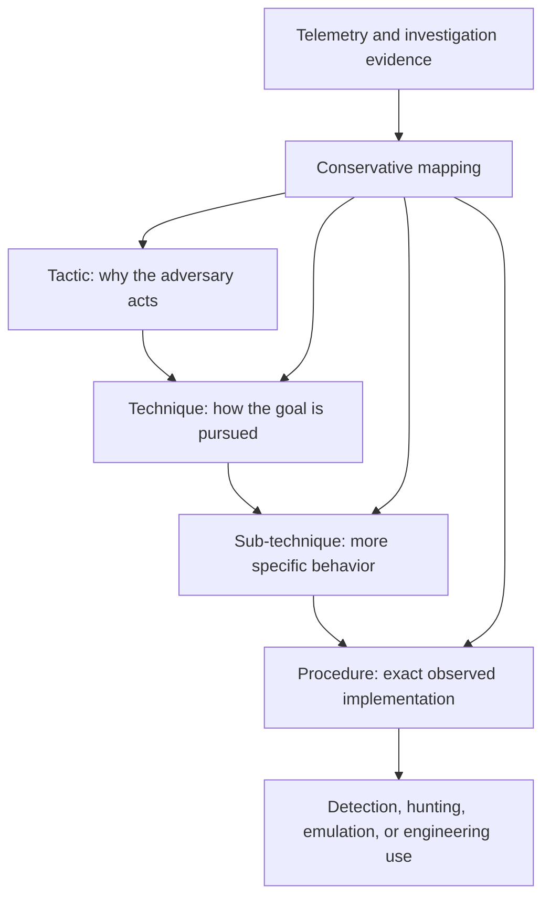

### Enterprise tactics as a reasoning index

The current Enterprise matrix should be consulted directly. The following table is a study summary, not a substitute for MITRE's live content.

| Tactic | Beginner question | Example defensive evidence |
|---|---|---|
| Reconnaissance | What is learned about the victim before action? | Public exposure changes, brand monitoring, reported targeting |
| Resource Development | What capability or infrastructure is prepared? | Threat intelligence about domains, accounts, or tools |
| Initial Access | How is a first foothold attempted or obtained? | Sign-ins, email, web, remote service, supplier activity |
| Execution | How is code or action run? | Process creation, script, cloud action, application request |
| Persistence | How could access survive interruption? | New account, token, scheduled action, application consent |
| Privilege Escalation | How are greater permissions obtained? | Role change, token, exploit, group modification |
| Defense Evasion | How is observation or prevention avoided? | Logging change, obfuscation, trusted-tool abuse |
| Credential Access | How are authentication secrets obtained? | Credential-store access, phishing, guessing, token theft |
| Discovery | How is the environment understood? | Directory, process, network, account, application queries |
| Lateral Movement | How is another resource reached? | Remote service, session, administrative share, cloud relationship |
| Collection | How is target data gathered before use or removal? | Archive creation, mailbox or repository access, staging |
| Command and Control | How is compromised capability remotely coordinated? | DNS, TLS, proxy, destination, process-to-network correlation |
| Exfiltration | How is data removed from controlled boundaries? | Upload, transfer, cloud sharing, unusual volume |
| Impact | How are availability, integrity, or business operations affected? | Encryption, deletion, service stop, resource consumption |

ATT&CK is not a scorecard that must become completely green. MITRE explicitly cautions against trying to achieve 100 percent coverage, declaring success from one detection, or limiting analysis to the matrix. Organizations should prioritize relevant threats and understand that one technique can have multiple implementations.

## Mapping telemetry to behavior

Telemetry is recorded evidence about events or state. It becomes useful when time, entity, source, meaning, coverage, and reliability are understood. A single event rarely proves a complete technique or intrusion.

```mermaid
flowchart LR
    RAW[Raw telemetry] --> NORM[Normalize time, entity, and fields]
    NORM --> CONTEXT[Add asset, identity, owner, and business context]
    CONTEXT --> HYP[Form behavior hypothesis]
    HYP --> CORR[Correlate independent evidence]
    CORR --> MAP[Map tactic and technique conservatively]
    MAP --> CONF[State confidence and alternatives]
    CONF --> ACTION[Investigate, tune, contain, or monitor]
    ACTION --> LEARN[Validate outcome and improve coverage]
```

| Telemetry source | What it can show | What it may miss | Example mapping caution |
|---|---|---|---|
| Identity | Authentication, factor, token, role, risk, policy | Activity after token use in another system | Failed sign-ins can indicate user error, testing, or guessing |
| Endpoint | Process, file, registry, memory, network relationships | Unmanaged device or disabled sensor | Command shell use can be legitimate administration |
| Network | Source, destination, protocol, volume, timing | Encrypted content, identity gaps, off-network activity | Rare destination is not automatically C2 |
| DNS | Name lookups, timing, response | Direct address use, encrypted resolver, cache | Long name can be service behavior or tunneling hypothesis |
| Proxy or secure web control | Web destinations, policy, identity, categories, some inspection | Bypassed path, unsupported protocol, privacy limitations | Blocked request does not prove endpoint compromise |
| SaaS audit | File, sharing, admin, mailbox, application action | Retention gaps, delayed export, unavailable fields | Large download may be approved migration |
| Cloud control plane | Resource, policy, identity, key, role changes | Workload-level behavior and uncollected regions | New role may be deployment automation or escalation |
| Application | Request, session, business action, error | Host behavior and upstream identity detail | Repeated request may be retry logic or automated abuse |
| Threat intelligence | Known infrastructure, malware, actor reporting | Local context, freshness, false or recycled indicators | Indicator match does not prove attribution |

### Evidence ladder

| Confidence level | Example statement | Required behavior |
|---|---|---|
| Observation | "A supplier identity generated 143 failed sign-ins from three networks." | Preserve source, time, entity, and data quality |
| Hypothesis | "Password guessing is one plausible explanation." | List benign alternatives and prerequisites |
| Correlated behavior | "Failures were followed by one success and unusual portal enumeration." | Validate identity, sequence, baseline, and source independence |
| Technique mapping | "Evidence is consistent with Brute Force and account discovery behaviors." | Check current ATT&CK descriptions and do not over-map |
| Incident conclusion | "Unauthorized access occurred and affected defined data." | Complete investigation, authority, scope, and evidence |
| Attribution | "A named actor conducted the activity." | Much stronger intelligence and analytic basis than a technique match |

### Plain-English deep-dive 3 - ATT&CK mapping does not equal attribution

Many people use the same tools and behaviors. A system administrator and an adversary may both run a command shell, enumerate hosts, compress files, and connect remotely. Context, authorization, sequence, identity, target, timing, and outcome distinguish them.

ATT&CK says a behavior is known in adversary operations; it does not say every occurrence is malicious or identify the actor. Mapping a process to a technique is like recognizing a driving maneuver. It does not identify the driver or explain why the turn was made.

A mature analyst uses calibrated language: "consistent with," "supports the hypothesis," "insufficient to determine," and "alternative explanation." Confidence should rise through independent corroboration, not through repeating the same source in several dashboards.

## The Diamond Model overview

The **Diamond Model of Intrusion Analysis** centers on relationships among four core features: adversary, capability, infrastructure, and victim. An event links these vertices in a particular context. The model helps analysts pivot: if infrastructure is known, what capabilities or victims connect to it? If a capability is observed, which adversaries and infrastructure have used it?

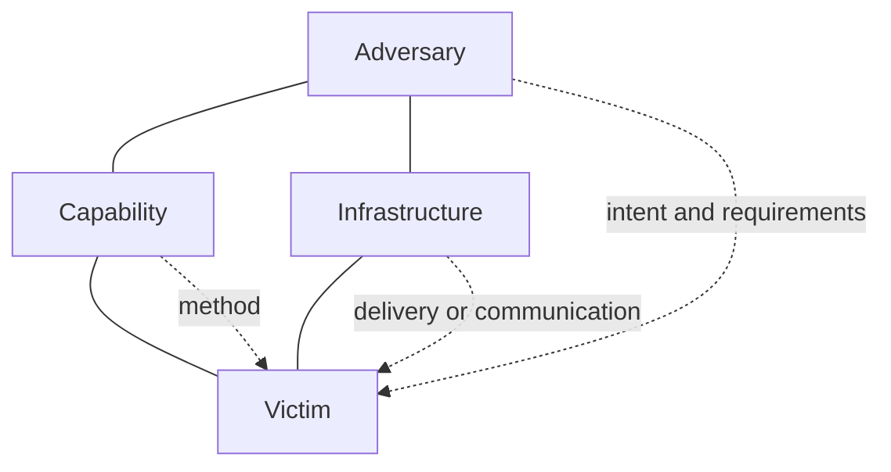

| Vertex | Plain meaning | Example question | Evidence caution |
|---|---|---|---|
| Adversary | Actor or group responsible for action | Who has intent, capability, and opportunity? | Often unknown; do not force attribution |
| Capability | Tool, technique, knowledge, or method | What enabled the action? | Common tools are shared by many actors |
| Infrastructure | Physical or logical resources used | Which domain, account, service, or system supported action? | Cloud and shared infrastructure can be reused |
| Victim | Targeted person, identity, asset, organization, or capability | What was selected and why might it matter? | Apparent victim may be an intermediate target |

The Diamond Model supports event-centered analysis and relationships. ATT&CK supports standardized behavior vocabulary. The Cyber Kill Chain supports broad progression. They overlap but answer different questions.

## Attack trees overview

An **attack tree** starts with an undesirable goal and decomposes it into possible ways to achieve that goal. **OR** branches mean any one child path could achieve the parent. **AND** branches mean several conditions must all be satisfied.

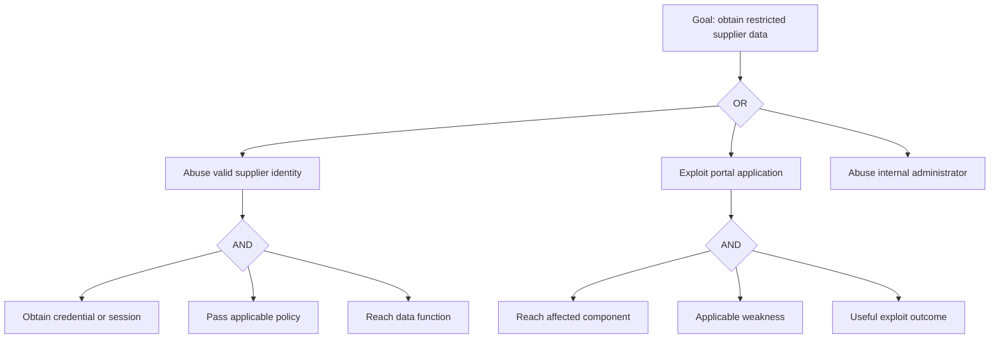

| Model | Best question | Strength | Limitation |
|---|---|---|---|
| Attack surface inventory | What can be interacted with or influenced? | Broad discovery | Can become an unprioritized list |
| Attack graph | What connected states and relationships form paths? | Handles many relationships and privileges | Data and visualization can become complex |
| Attack tree | How could one defined goal be achieved? | Clear AND/OR reasoning | Needs separate tree for another goal |
| Cyber Kill Chain | Where can broad intrusion progression be interrupted? | Simple communication and defense thinking | Linear and malware-centric bias |
| ATT&CK | Why and how do observed adversaries behave? | Shared detailed vocabulary | Not a complete local threat model or checklist |
| Diamond Model | How do adversary, capability, infrastructure, and victim relate? | Supports analytic pivots | Attribution and relationships require evidence |

## Prioritizing attack paths

Path priority should combine business consequence, path plausibility, current threat relevance, blast radius, control effectiveness, path length and complexity, evidence confidence, remediation feasibility, and choke-point leverage. Shortest is not always highest priority, and highest technical severity is not always on a consequential path.

| Prioritization factor | Higher concern when | Lower concern when | Caveat |
|---|---|---|---|
| Business objective | Safety, critical operations, regulated or high-value data affected | Isolated low-value test asset | Asset labels can be stale |
| Reachability | Relevant threat source has a validated path | Independent validated boundary blocks path | Alternate paths and trusted identities matter |
| Exploitability or abuse feasibility | Prerequisites are common and method is reliable | Rare condition or incompatible configuration | Absence of public exploit is not proof of safety |
| Threat relevance | Behavior is active and relevant to sector or technology | No specific relevance established | Intelligence coverage and freshness vary |
| Blast radius | Broad identity, shared service, or recovery authority | Resource-specific scope | Hidden dependencies may expand impact |
| Control strength | Control absent, bypassable, untested, or common-mode | Independent controls validated against behavior | Documentation alone is weak evidence |
| Evidence confidence | Multiple fresh independent sources agree | Key edge is inferred or stale | Unknown should not score as safe |
| Choke-point leverage | One feasible change breaks many paths | Treatment affects only cosmetic node | Choke point can create concentration risk |
| Operational feasibility | Safe treatment can be delivered quickly | Change creates major safety or availability risk | Temporary compensation needs expiry |

### Fictional path-priority model

NMH may use a simple lab rubric, not a vendor formula:

$$
Path\ Priority = Business\ Impact + Path\ Plausibility + Blast\ Radius + Threat\ Relevance - Validated\ Control\ Strength
$$

Each factor might be rated 1 to 5 for discussion. This arithmetic is fictional, ordinal, and not a NIST, MITRE, CISA, or Zscaler formula. It must be paired with evidence confidence and narrative. Controls do not always subtract linearly, and one shared dependency may defeat several controls at once.

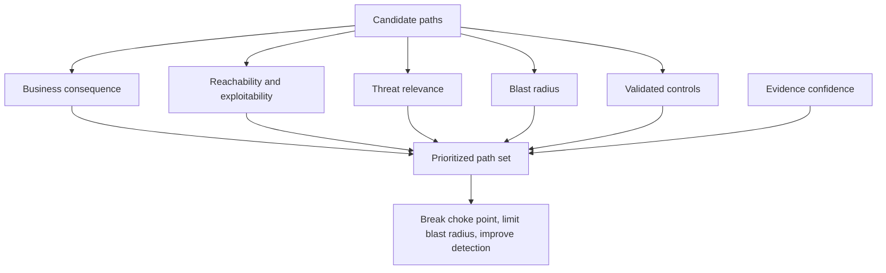

## Fictional NMH compromise path

### Scenario boundary

NMH has a fictional supplier portal, cloud collaboration environment, corporate identities, plant engineering systems, and a third-party maintenance process. This is a constructed learning path, not an observed intrusion.

| Element | Fictional detail | Label |
|---|---|---|
| Objective | Obtain unreleased product design and disrupt one plant schedule | Fictional adversary objective |
| Starting point | Supplier identity targeted through credential phishing | Conceptual behavior in a fictional scenario |
| Entry point | Internet-reachable supplier portal | Fictional architecture |
| Weakness | Password-only exception for selected supplier accounts | Fictional finding |
| First access | Valid-looking supplier session | Hypothetical, not an incident |
| Pivot condition | Portal support workflow can invite a guest to a collaboration site | Fictional process relationship |
| Data path | Guest group is incorrectly nested into design library readers | Fictional misconfiguration |
| Operational path | Design library contains a plant-support document with an obsolete remote maintenance reference | Fictional data governance weakness |
| Choke points | Supplier authentication, guest approval, effective permission, maintenance access | Candidate controls, not validated facts |
| Blast radius | Product design plus one plant support pathway | Fictional scenario estimate |

### NMH path graph

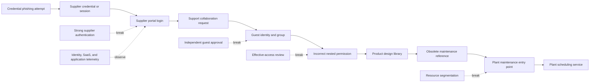

This graph deliberately includes both digital and human process edges. It does not assume every arrow is true. The highest-value work is to validate the edges that determine the decision.

### Edge-validation matrix

| Edge claim | Current fictional evidence | Confidence | Safe validation | Stop condition |
|---|---|---|---|---|
| Supplier account can use password only | Policy export from lab dataset | Medium | Review policy and test a dedicated synthetic account | Any effect outside test identity |
| Portal support can initiate guest request | Procedure document | Low-medium | Walk through approved test request without granting production access | Unexpected notification or broad group change |
| Guest group nests into design readers | Permission snapshot | High | Read-only effective-access evaluation | Any permission modification |
| Design library contains maintenance reference | Synthetic file metadata | High in lab | Search synthetic dataset only | Discovery of real sensitive data outside scope |
| Reference enables plant access | Old diagram, no current path proof | Low | Architecture review and non-connective configuration comparison | Any attempt to connect to plant system |
| Segmentation blocks supplier context | Firewall statement only | Low-medium | Customer-approved path test using test endpoints and expected denial | Unexpected allowed connection |

### Behavior mapping

| Fictional observation | Possible ATT&CK-oriented hypothesis | Alternative explanation | Required corroboration |
|---|---|---|---|
| Many supplier login failures then success | Brute-force or credential-abuse behavior | User forgot password or automation retry | Source, timing, identity confirmation, device, session behavior |
| New guest invitation | Valid-account and access-relationship abuse hypothesis | Approved project onboarding | Request, sponsor, approval, project context |
| Rapid design-library enumeration | Discovery or collection behavior | Search indexing, migration, legitimate engineering work | User baseline, process, volume, file actions, approval |
| Access to old maintenance reference | Collection supporting later movement | Accidental search result | Subsequent action, identity intent, request sequence |
| Connection attempt toward maintenance endpoint | Lateral movement or remote-service hypothesis | Approved vendor maintenance | Change window, source identity, command, destination, owner confirmation |

### Plain-English deep-dive 4 - Break a path without breaking the business

A path diagram tempts teams to block every arrow. Business systems contain legitimate routes: suppliers need orders, engineers need designs, and maintenance teams need equipment access. The goal is not zero connectivity. The goal is authorized, resource-specific, observable, time-appropriate connectivity with limited consequence.

For NMH, immediately deleting every supplier and guest account could stop purchasing and hide which controls were weak. Better action depends on urgency and evidence: restrict the affected identity, preserve logs, verify sponsors, correct the specific permission relationship, remove obsolete references, and validate plant segmentation. Strategic work then improves supplier authentication, guest lifecycle, data governance, and maintenance access.

## Safe path validation

Safe validation tests assumptions with the least intrusive method that can distinguish them. It begins with authority, not a scanner.

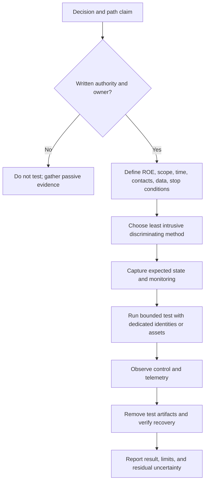

| Validation level | Example | Risk | Use when |
|---|---|---|---|
| Documentation review | Compare architecture, policy, inventory, and owner statements | Low, but may be stale | First pass and scope formation |
| Configuration inspection | Read effective policy or permission state | Low if read-only and authorized | Claim depends on current configuration |
| Passive telemetry analysis | Review existing events and flows | Low operational risk; privacy considerations | Historical behavior or path observation |
| Synthetic identity test | Use dedicated account and benign resource | Controlled but can trigger workflows | Need effective authentication or authorization proof |
| Expected-denial connectivity test | Attempt approved benign connection without exploit | Moderate; requires monitoring and stop conditions | Need evidence that segmentation blocks path |
| Tabletop exercise | Walk roles and decisions through scenario | Low technical risk | Test governance, communication, and assumptions |
| Adversary emulation | Qualified team performs approved behavior safely | Higher and specialist-led | Need realistic control validation under formal ROE |
| Exploitation | Attempt to use vulnerability | High and potentially damaging | Only under explicit specialist authority; not a default TSM action |

### Rules of engagement checklist

| ROE field | Required content |
|---|---|
| Authority | Named approving authority and system/data owners |
| Purpose | Decision or control claim being tested |
| Scope | Exact identities, assets, paths, techniques, and exclusions |
| Time | Start, stop, maintenance windows, and time zone |
| Methods | Allowed actions, prohibited actions, rate, and tools |
| Data | Synthetic data preference, handling, retention, and deletion |
| Monitoring | Teams informed, expected signals, safety observation |
| Contacts | Test lead, operations, security, vendor, emergency contact |
| Stop conditions | Unexpected access, instability, sensitive data, safety concern |
| Recovery | Rollback, cleanup, restore, and verification |
| Evidence | Timestamp, inputs, outputs, limitations, chain of handling |
| Communication | Notification, escalation, and final reporting cadence |

## Troubleshooting an attack-path claim

| Symptom | Plausible explanation | Cheapest discriminating check | Guardrail |
|---|---|---|---|
| Tool says internet exposed | Stale domain, shared address, proxy, or real service | Confirm ownership, current name resolution, service identity, and owner | Do not probe beyond authority |
| Graph shows admin path | Group nesting, inherited role, stale cache, or false merge | Read effective access and identity lineage | Preserve source and timestamp |
| Segmentation appears broken | Wrong source, asymmetric path, test exception, policy order | Compare effective policy and approved denial test | Stop on unexpected access |
| Technique coverage shows green | One analytic covers one implementation only | Review data prerequisites and alternate procedures | Do not claim complete coverage |
| IOC match appears | Shared infrastructure, recycled address, false positive, or activity | Correlate time, process, identity, destination, and behavior | Do not attribute from one match |
| No event exists | No behavior, sensor gap, parsing failure, retention loss, or evasion | Validate source health with approved benign event | Absence of evidence is bounded |
| Path score fell | Control improved, asset disappeared, source failed, or model changed | Compare graph version, source health, denominator, and driver | Keep like-for-like trend |

## Metrics and evidence

| Metric | Definition | Useful decision | Anti-pattern |
|---|---|---|---|
| Known-surface ownership | Percent of in-scope surface entities with accountable owner | Where discovery and treatment can route | Excluding unknown assets from denominator |
| External exposure age | Time since externally reachable item was last owner-validated | Where stale exposure needs review | Assuming old equals vulnerable |
| Validated critical paths | Number and percent of priority paths whose decisive edges were tested | Confidence in prioritization | Maximizing path count without consequence |
| Path-break coverage | Priority paths interrupted by validated independent controls | Where one control gives leverage | Crediting policy documents as tests |
| Choke-point dependency | Number of priority paths relying on one control or service | Concentration and resilience planning | Celebrating consolidation without failure analysis |
| Blast-radius trend | Scope reachable from selected identity or foothold under stable model | Least-privilege outcome | Comparing different graph populations |
| ATT&CK data coverage | Relevant techniques with required telemetry available and healthy | Logging investment | Calling data presence detection coverage |
| Analytic validation | Relevant analytics tested against approved representative behavior | Detection confidence | Treating one procedure as whole-technique coverage |
| Mean evidence age | Age distribution of decisive graph evidence | Refresh priorities | Averaging away very stale critical edges |
| Unknown-edge rate | Decisive path relationships lacking adequate evidence | Research and validation backlog | Scoring unknown as blocked |

## Decision trees

### Prioritize an observed entry point

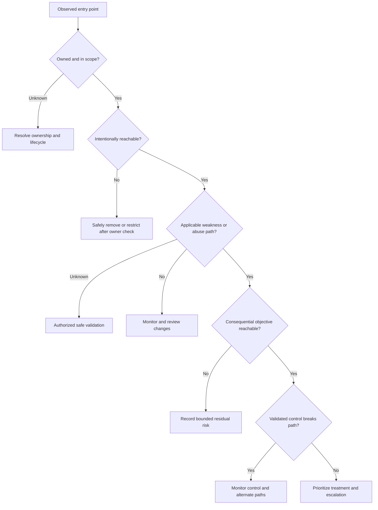

### Map an observation to ATT&CK

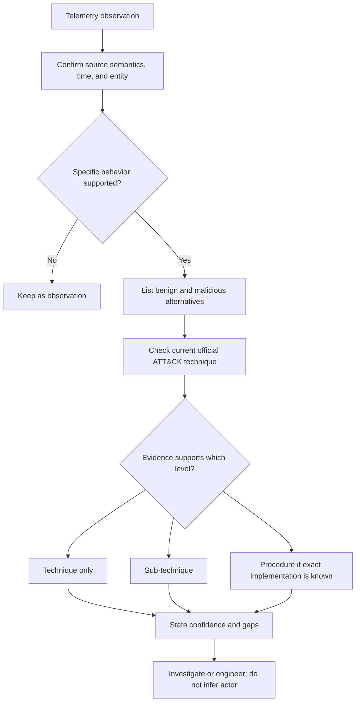

## Scenario drills

### Drill 1 - SharePoint guest access

A guest downloads many engineering files from a SharePoint site. Build three hypotheses: approved project work, compromised guest session, or overbroad permission discovered by an otherwise legitimate guest.

| Step | Question | Evidence |
|---|---|---|
| Asset | Which files, classification, project, and owner? | Site, library, metadata, business owner |
| Identity | Which guest, sponsor, tenant, device, and authentication? | Directory, sign-in, invitation, sponsor |
| Path | How did the guest receive effective access? | Group nesting, links, inheritance, policy |
| Behavior | Is volume, sequence, tool, and time normal for the project? | Audit, baseline, project schedule |
| Control | Did download, sharing, session, or DLP controls apply? | Policy evaluation and action |
| Consequence | Was restricted data accessed or moved outside authority? | File set, destination, approval, investigation |
| Action | What preserves evidence and limits harm proportionately? | Session revoke, access correction, owner review |

Do not label "collection" or "exfiltration" solely from volume. Collection requires behavior context; exfiltration requires evidence of movement beyond a controlled boundary or authority under the governing definition.

### Drill 2 - Rare outbound connection

An endpoint process connects through TLS to a domain never seen before. Possible explanations include a new SaaS feature, software update, advertisement, developer tool, malicious C2, or measurement error.

1. Confirm endpoint, identity, process lineage, destination, time, and source health.
2. Resolve ownership and expected software behavior.
3. Correlate DNS, proxy, certificate, endpoint, file, identity, and change evidence.
4. Check current intelligence while respecting indicator age and shared infrastructure.
5. Map to C2 only if behavior supports that hypothesis; a rare domain alone is an observation.
6. If risk justifies containment, use authorized, reversible action and preserve business context.

### Drill 3 - Supplier software update

A vendor reports compromise of its build environment. NMH uses the product on 400 fictional systems.

| Workstream | Key questions | Output |
|---|---|---|
| Inventory | Which versions, systems, owners, and business services? | Scoped population with confidence |
| Provenance | Which package, signature, hash, channel, and install time? | Affected-versus-unaffected criteria |
| Behavior | What known procedures and telemetry are relevant? | Current intelligence translated into tests |
| Path | What identities, networks, data, and management access could software reach? | Blast-radius graph |
| Controls | Which application, endpoint, network, identity, and recovery controls apply? | Validated barriers and gaps |
| Operations | Which systems can isolate, update, or rebuild safely? | Prioritized treatment by criticality |
| Communication | What is fact, vendor report, local observation, and unknown? | Calibrated stakeholder update |

### Drill 4 - NMH path challenge

Present the fictional NMH graph to a reviewer. The reviewer must challenge at least five edges and identify the one test that most changes the decision. A good answer may prioritize the guest-to-design effective-permission edge because it connects initial access to valuable data, while the plant path remains low confidence and should not dominate the narrative until validated.

## Failure modes and contrarian checks

| Claim | Contrarian question | Better evidence |
|---|---|---|
| "Our attack surface shrank" | Did assets disappear because collection failed? | Source health, ownership, lifecycle, stable denominator |
| "This is exploitable" | Were prerequisites and applicable configuration confirmed? | Safe test, vendor guidance, version and feature state |
| "ATT&CK coverage is 90 percent" | Coverage of data, analytics, procedures, or outcomes? | Relevant technique scope and representative validation |
| "The actor is group X" | Is attribution based only on common behavior or infrastructure? | Multi-source intelligence and analytic confidence |
| "Segmentation blocks lateral movement" | Which identities, protocols, alternate paths, and management planes were tested? | Effective path matrix and approved denial tests |
| "The kill chain was stopped" | Could behavior skip or enter at another stage? | Incident-specific path and residual alternatives |
| "This choke point protects everything" | What happens if the control is compromised or unavailable? | Independent monitoring, resilience, and alternate-path review |
| "The test passed" | Did the test match the actual source, identity, protocol, and resource? | Representative inputs, expected evidence, limitations |

## Official Source Anchors

**Checked on 2026-08-24.** MITRE material defines and maintains ATT&CK. Lockheed Martin is the authoritative origin for its Cyber Kill Chain. Government sources support defensive prioritization and safe practice. Zscaler pages describe vendor positioning, not standards or your experience.

| Source type | Official or authoritative anchor | Used for | Caveat |
|---|---|---|---|
| MITRE ATT&CK home | https://attack.mitre.org/ | Current knowledge base and Enterprise matrix | Live content changes; check version and technique pages |
| MITRE ATT&CK getting started | https://attack.mitre.org/resources/ | Tactic, technique, sub-technique, procedure, domains, use cases, and cautions | Do not treat ATT&CK as a complete checklist |
| MITRE ATT&CK Navigator | https://mitre-attack.github.io/attack-navigator/ | Visualization and comparison of ATT&CK layers | A colored cell is not evidence of effective coverage |
| MITRE Diamond Model paper | https://www.activeresponse.org/wp-content/uploads/2013/07/diamond.pdf | Adversary, capability, infrastructure, victim, and analytic relationships | Historical paper; apply with current evidence and methods |
| Lockheed Martin Cyber Kill Chain | https://www.lockheedmartin.com/en-us/capabilities/cyber/cyber-kill-chain.html | Origin and seven-stage overview | One model with linear and intrusion-style limitations |
| CISA KEV Catalog | https://www.cisa.gov/known-exploited-vulnerabilities-catalog | Known exploitation as prioritization input | Catalog presence does not replace local path and asset context |
| CISA Cross-Sector Cybersecurity Performance Goals | https://www.cisa.gov/cybersecurity-performance-goals-cpgs | Practical baseline controls and outcome orientation | Check current location and sector applicability |
| NIST SP 800-30 Rev. 1 | https://csrc.nist.gov/pubs/sp/800/30/r1/final | Threat events, vulnerabilities, likelihood, impact, and risk | Published 2012; use in current organizational context |
| NIST Cybersecurity Framework | https://www.nist.gov/cyberframework | Govern, Identify, Protect, Detect, Respond, and Recover outcomes | Framework alignment is not a path test |
| Zscaler attack-surface positioning | https://www.zscaler.com/products-and-solutions/caasm | Public vendor positioning for asset and exposure visibility | Validate current product name, packaging, data, and behavior |
| Zscaler zero trust positioning | https://www.zscaler.com/resources/security-terms-glossary/what-is-zero-trust | Vendor claims about minimizing attack surface and lateral movement | Vendor positioning is not the NIST standard and not production evidence |

## Likely Interview Questions

### Q1. What is an attack surface, and why is it more than internet-facing assets?

**Model answer:** An attack surface is the collection of points, relationships, and conditions through which a threat source could enter, influence, collect, move, disrupt, or cause another adverse effect. Public applications matter, but so do internal trust, identities, SaaS sharing, application interfaces, physical access, human processes, suppliers, software updates, and recovery systems.

I would classify surfaces for discovery and then reconnect them as paths. A supplier identity can begin externally, use a digital authentication path, cross a human approval process, and reach an internal data resource. The useful output is an owned, evidence-backed graph tied to business objectives, not a raw asset count.

### Q2. Distinguish reachable, vulnerable, exploitable, and consequential.

**Model answer:** Reachable means a relevant source can interact with the target through a defined path. Vulnerable means an applicable weakness exists. Exploitable means prerequisites allow a method to use that weakness successfully in the current context. Consequential means successful action can materially affect a valued objective.

A public login is reachable but not automatically vulnerable. A vulnerable component behind validated isolation may not be reachable from a particular threat source. A successful bounded exploit on a disposable test asset may have little business consequence. I keep these judgments separate and label evidence freshness and confidence.

### Q3. How do the Cyber Kill Chain and MITRE ATT&CK differ?

**Model answer:** The Cyber Kill Chain is a seven-stage lifecycle model that helps defenders reason about broad intrusion progression and interruption points. ATT&CK is a knowledge base of observed adversary behavior. In ATT&CK, tactics describe why, techniques describe how, sub-techniques provide a more specific how, and procedures describe particular implementations.

The Kill Chain is simple and communicative but can be linear and malware-centric. ATT&CK is more detailed but is not a complete local threat model or a coverage checklist. I would use both as lenses, preserve the incident-specific sequence, and check the current official ATT&CK version.

### Q4. How would you map telemetry to an ATT&CK technique responsibly?

**Model answer:** I would first validate source semantics, entity, time, coverage, and data quality. Then I would describe the observed behavior without a framework label, list benign and malicious explanations, correlate independent evidence, and compare the supported behavior with the current official technique description. I would map only to the level the evidence supports and state confidence and gaps.

A command shell, rare domain, or failed sign-in is not automatically malicious. ATT&CK mapping does not prove an incident or actor attribution. It should improve investigation, detection design, or communication, not decorate an alert.

### Q5. What are blast radius and choke points, and what tradeoff do choke points create?

**Model answer:** Blast radius is the scope one successful step can affect, such as the resources reachable from a privileged identity. A choke point is a narrow place many paths cross, such as authentication, privileged administration, or controlled egress. Strengthening a choke point can break many paths efficiently.

The tradeoff is concentration risk. If one identity service makes every access decision, compromise or outage can affect the enterprise. I would validate alternate paths and add integrity, availability, independent monitoring, and recovery for critical choke points while reducing privileges and resource scope.

### Q6. How would you validate an attack path without causing harm?

**Model answer:** I would begin with the decision and the edge claim, then obtain written authority and define rules of engagement: exact scope, methods, timing, contacts, data handling, monitoring, exclusions, stop conditions, cleanup, and recovery. I would choose the least intrusive discriminating method, starting with documentation, configuration, and passive evidence before a dedicated synthetic account or expected-denial test.

Unexpected access, instability, sensitive data, or safety concern stops the test. Exploitation is not a default TSM activity; it belongs to qualified specialists under explicit authorization. The report must include what the test did not prove.

### Q7. Walk through the fictional NMH compromise path and where you would intervene.

**Model answer:** The fictional path begins with supplier credential phishing, uses a password-only portal exception, invokes a support guest workflow, reaches an incorrectly nested design-library group, discovers an obsolete maintenance reference, and hypothetically approaches a plant pathway. The path is not an incident, and several edges are intentionally low confidence.

I would first validate supplier authentication and guest effective access because they determine whether valuable design data is reachable. Immediate options are identity restriction, sponsor review, specific permission correction, log preservation, and removal of obsolete references. Strategic controls include stronger supplier authentication, independent guest approval, resource-specific access, plant segmentation, and correlated identity, SaaS, and application telemetry.

### Q8. How does your background help with attack-path analysis, and where is the gap?

**Model answer:** My production strength is tracing distributed Microsoft 365 behavior across identity, permission, client, DNS, TCP, TLS, HTTP, proxy, and service layers, then building hypotheses, collecting evidence, coordinating escalation, and validating fixes. That maps naturally to testing nodes and edges in a path rather than trusting a single dashboard.

The boundary is important: I have not operated Zscaler exposure or SecOps products, a red team, or a formal ATT&CK detection program in production. I have practiced the concepts through a fictional lab and authoritative sources. My ramp would include product training, reviewed labs, shadowing, safe customer evidence, and specialist partnership.

## 30-Second Memory Hooks

| Concept | Memory hook |
|---|---|
| Attack surface | Every place and relationship that can be influenced |
| Entry point | Where interaction starts, not proof of weakness |
| Attack path | Connected route from position to objective |
| Graph edge | A claim that needs evidence and time |
| Reachable | Can interaction occur? |
| Vulnerable | Does the weakness apply? |
| Exploitable | Can prerequisites and method succeed? |
| Consequential | Does success affect a valued objective? |
| Blast radius | How much one foothold can affect |
| Choke point | One narrow control point, plus concentration risk |
| Kill Chain | Broad stages; break progression; do not force linearity |
| ATT&CK tactic | Why |
| ATT&CK technique | How |
| Sub-technique | More specific how |
| Procedure | Exact observed implementation |
| ATT&CK mapping | Behavior vocabulary, not attribution |
| Diamond Model | Adversary, capability, infrastructure, victim |
| Attack tree | Goal decomposed by OR and AND paths |
| Telemetry | Evidence with source, meaning, time, and coverage |
| Safe validation | Authority, bounded method, stop, cleanup, limits |
| NMH | Fictional path, not a customer incident |
| Experience bridge | Production dependency tracing; lab adversary-path reasoning |

## Completion Checklist

- [ ] I can describe external, internal, digital, physical, human, and supply-chain attack surfaces.
- [ ] I can explain entry points without calling every reachable service vulnerable.
- [ ] I can draw an attack path with nodes, edges, prerequisites, controls, boundaries, objectives, and confidence.
- [ ] I can distinguish attack paths, exposure paths, attack graphs, and attack trees.
- [ ] I can separate reachable, vulnerable, exploitable, and consequential states.
- [ ] I can explain blast radius and identify both choke-point leverage and concentration risk.
- [ ] I can name and explain the seven Cyber Kill Chain stages and their limitations.
- [ ] I can define ATT&CK tactics, techniques, sub-techniques, and procedures.
- [ ] I can use the current Enterprise tactics as a reasoning index rather than a checklist.
- [ ] I can explain why a single event or IOC does not prove an ATT&CK technique, incident, or actor.
- [ ] I can map telemetry through normalization, context, hypothesis, correlation, confidence, and action.
- [ ] I can explain the Diamond Model vertices and appropriate analytic pivots.
- [ ] I can build an attack tree using AND and OR relationships.
- [ ] I can prioritize paths using consequence, plausibility, threat relevance, blast radius, controls, confidence, and feasibility.
- [ ] I can state that the fictional formula is not a MITRE, NIST, CISA, or Zscaler formula.
- [ ] I can walk the fictional NMH path and challenge low-confidence edges.
- [ ] I can design safe path validation with written ROE and stop conditions.
- [ ] I can troubleshoot stale assets, false graph edges, apparent coverage, indicator matches, and missing telemetry.
- [ ] I can distinguish standards, authoritative model sources, industry practice, vendor positioning, and fictional calculations.
- [ ] I can recheck source and product currency after 2026-08-24.
- [ ] I can label production, lab, conceptual, not-yet-used, and fictional content.
- [ ] I can answer all eight questions aloud without claiming production threat hunting, red teaming, ATT&CK engineering, or Zscaler operation.

[Part 8 - Vulnerability, Exposure, Threat, Finding, Alert, Incident, and Risk](Part-08-security-term-distinctions.md)